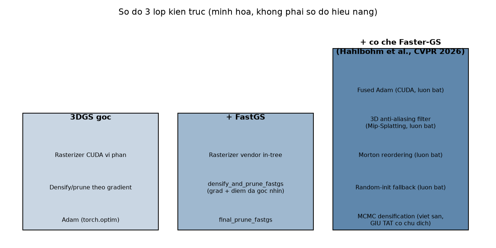

[← Mục lục](00-muc-luc.md) · Chương 1/15

# Chương 1 — Giới thiệu & Tổng quan dự án

> Nguồn: `DOCS/README.md`, `DOCS/pipeline-and-submission.md`

Chương mở đầu này giới thiệu bản đồ toàn bộ tài liệu của dự án fastgs-lite, sau đó đi sâu vào gói mã `pipeline/` — lớp glue-code kết nối notebook Colab với logic huấn luyện/chấm điểm/nộp bài. Các chương 2–4 sẽ đi từng dòng lệnh, từng hàm của pipeline này; các chương 5–13 sẽ đi vào nền tảng toán học 3D Gaussian Splatting và các đòn bẩy tăng tốc FastGS.

Bên cạnh cơ chế FastGS gốc (densify/prune riêng theo gradient + điểm đa góc nhìn, rasterizer CUDA vendor — xem [Chương 3](03-vong-lap-huan-luyen-phan-2.md)), repo đã tích hợp thêm một số cơ chế lấy ý tưởng từ **Faster-GS** (Hahlbohm et al., *Faster-GS: Analyzing and Improving Gaussian Splatting Optimization*, CVPR 2026): fused Adam optimizer, 3D anti-aliasing filter (Mip-Splatting), Morton reordering, và một fallback khởi tạo ngẫu nhiên khi COLMAP thiếu `points3D`. Cả bốn cơ chế này **luôn bật, không có cờ tuỳ chọn**. MCMC densification (3DGS-MCMC) cũng được viết sẵn nhưng **giữ tắt có chủ đích** vì xung đột thuật toán với cơ chế densify chính của FastGS. Chi tiết cơ chế và lý do từng quyết định: [Chương 3](03-vong-lap-huan-luyen-phan-2.md) (vòng lặp train), [Chương 12](12-adaptive-density-control.md) (density control), [Chương 13](13-tong-hop-chi-phi-fastgs.md) (tổng hợp chi phí).



### Định vị: 3DGS gốc, FastGS-lite, và Faster-GS

Ba lớp trong sơ đồ trên không phải ba phương pháp cạnh tranh nhau mà là ba tầng **chồng lên nhau**: FastGS-lite là 3DGS gốc cộng thêm cơ chế densify/prune theo **điểm số nhất quán đa góc nhìn** (thay vì chỉ ngưỡng gradient như 3DGS — xem [Chương 3](03-vong-lap-huan-luyen-phan-2.md), [Chương 12](12-adaptive-density-control.md)); Faster-GS đóng góp thêm các đòn bẩy **tối ưu tốc độ/bộ nhớ** — Morton reordering để tăng tính cục bộ bộ nhớ khi rasterize, fused Adam, và 3D anti-aliasing filter — được bật thường trực trong repo này, không phải cờ tuỳ chọn. Nói cách khác: FastGS-lite quyết định **đặt Gaussian ở đâu**, Faster-GS quyết định **truy cập chúng nhanh thế nào**; hai lớp độc lập về mặt thuật toán nên cộng dồn được.

Phép đo thực nghiệm mới nhất minh hoạ cả ba tầng cùng hoạt động trên dữ liệu thật (không phải benchmark chuẩn `tandt_db`): scene **HCM0539** của cuộc thi VAI_NVS_DATA_ROUND2, 30.000 iterations trên Colab T4 — **Score 0,8579**, PSNR 25,27 dB (psnr_norm 0,8423), SSIM 0,866, LPIPS 0,136, hội tụ về 344.484 Gaussian, huấn luyện trong 1776 giây (~29,6 phút), **VRAM đỉnh chỉ 1,92 GB** trên tổng 14,56 GB của T4 — dư địa lớn dù ảnh gốc có độ phân giải cao. Số liệu này, cùng bảng so sánh chi tiết PSNR/SSIM/LPIPS/tốc độ/bộ nhớ giữa 3DGS vanilla, FastGS và Faster-GS, nằm ở chương so sánh riêng: [Chương 17 — So sánh 3DGS, FastGS, Faster-GS](17-so-sanh-3dgs-fastgs-fastergs.md).

## 1.1 Mục lục tài liệu gốc (README.md)

Tài liệu của fork này. `docs/` và `docs2/` đã được gộp làm một thư mục `DOCS/`.

### Đang dùng — bám sát mã nguồn hiện tại (fastgs-lite)

| Tài liệu | Nội dung | Đi kèm |
|---|---|---|
| `fastgs-acceleration-method.md` | **Tài liệu chính, tự chứa.** Nền tảng toán 3DGS (chiếu covariance, alpha blending, loss) → mô hình chi phí một vòng lặp → ba đòn bẩy tăng tốc (điểm số nhất quán đa góc nhìn, compact box `--mult`, nhịp Adam) → **phép đo fastgs-lite vs 3DGS** | `demos/fastgs_mechanisms.py`, `demos/fastgs_cost_model.py` |
| `colab-t4-guide.md` | Huấn luyện thật trên Colab free T4: preset A, điểm Score theo dõi, chống tràn RAM, roadmap tầng CUDA | `fastgs-acceleration-method.ipynb`, `pipeline/` |
| `pipeline-and-submission.md` | Tham chiếu gói `pipeline/`: bảng cell↔hàm, các trường `Config`, công thức điểm (LPIPS/SSIM/PSNR) và nơi triển khai, hợp đồng `submission.zip`, cách chạy trên dữ liệu riêng | `pipeline/`, `fastgs-acceleration-method.ipynb` |
| `history-train.md` | Nhật ký các phiên train thật: cấu hình, bảng điểm từng cảnh, diễn biến theo vòng lặp, tài nguyên đo được, việc cần làm cho phiên sau | `fastgs-acceleration-method.ipynb` |

*(Trong sách hợp nhất này: `fastgs-acceleration-method.md` toàn văn nằm ở [Chương 13](13-tong-hop-chi-phi-fastgs.md); `colab-t4-guide.md` và `history-train.md` toàn văn nằm ở [Chương 14](14-trien-khai-colab-nhat-ky-train.md).)*

### Cấu trúc repo hiện tại

- `pipeline/` — toàn bộ logic Python thuần (không phụ thuộc Colab để import): `config.py` (tham số), `env.py` (máy/GPU/RAM), `data.py` (tải & liệt kê scene), `score.py` (công thức điểm chính thức), `trainer.py` (vòng train fastgs-lite), `submission.py` (render test pose + đóng gói/kiểm tra zip), `report.py` (bảng/biểu đồ), `deliver.py` (đóng gói model + tải về), `run.py` (điều phối toàn bộ). Chi tiết: mục 1.2 bên dưới.
- `fastgs-acceleration-method.ipynb` (gốc repo) — chỉ còn **glue code tiếng Anh**, 9 code cell (clone → GPU → config → data → smoke test → train → analytics → submission+download); mọi logic nằm trong `pipeline/*.py`; cần GPU.
- `demos/fastgs_mechanisms.py` — các mô phỏng thu nhỏ bằng NumPy của cơ chế fastgs-lite (không cần CUDA), tách ra khỏi notebook: `python demos/fastgs_mechanisms.py`.
- `demos/fastgs_cost_model.py` — mô hình chi phí một vòng lặp và **phép đo fastgs-lite vs 3DGS** (số tile mỗi splat, số lần Adam step, quỹ đạo số Gaussian): `python demos/fastgs_cost_model.py`. Xem [Chương 13](13-tong-hop-chi-phi-fastgs.md), Phần VI của `fastgs-acceleration-method.md`.

### Tham chiếu sâu — giải phẫu toàn bộ một phiên train

Bộ ba tài liệu chi tiết nhất repo: mỗi file, mỗi hàm, mỗi hằng số, mỗi nhánh `if` mà một phiên
train chạm tới, theo đúng thứ tự thực thi. Đánh số mục §1–§48 chạy liên tục qua cả ba tài liệu.
Đã viết lại hoàn toàn theo mã nguồn fastgs-lite hiện tại (bản cũ mô tả codebase DroneSplat với
`--use_masks`, SAM2, DUSt3R, `pose_optimizer` — những thứ **không còn tồn tại**).

| Tài liệu | Mục | Nội dung | Trong sách này |
|---|---|---|---|
| `DIGITAL-TWIN-GS-PIPELINE-1.md` | §1–§18 | Từ câu lệnh tới dữ liệu sẵn sàng: hai đường chạy (CLI vs `pipeline/`), bản đồ hệ thống, toàn bộ cờ CLI, dựng `Scene` từ COLMAP, `GaussianModel.create_from_pcd` + `training_setup` | [Chương 2](02-kien-truc-pipeline-phan-1.md) |
| `DIGITAL-TWIN-GS-PIPELINE-2.md` | §19–§33 | Một vòng lặp train: `render_fastgs` + compact box, rasterizer CUDA, loss, `backward`, điểm số đa góc nhìn, densify điều kiện kép, ba tầng prune, phẫu thuật trạng thái Adam | [Chương 3](03-vong-lap-huan-luyen-phan-2.md) |
| `DIGITAL-TWIN-GS-PIPELINE-3.md` | §34–§48 | Lưu `.ply`, render, chấm điểm, `submission.zip`, bảng hằng số toàn hệ thống, bảng tra nhanh, chẩn đoán sự cố, thuật ngữ | [Chương 4](04-luu-render-cham-diem-phan-3.md) |

### Bản đồ tài liệu ↔ mã nguồn

| Chủ đề | File mã nguồn |
|---|---|
| Điểm số nhất quán đa góc nhìn | `utils/fast_utils.py` (`sampling_cameras:10`, `compute_gaussian_score_fastgs:45`) |
| Densify điều kiện kép, ba tầng prune | `scene/gaussian_model.py` (`densify_and_prune_fastgs:468`, `metric_mask:494`, `final_prune_fastgs:533`) |
| Lịch optimizer đóng đinh theo 30k vòng | `scene/gaussian_model.py:190–209` |
| Tách lr SH bậc thấp/cao | `scene/gaussian_model.py:167–174` (lưu ý `highfeature_lr / 20.0`) |
| Compact box `--mult`, cấu hình rasterizer | `gaussian_renderer/__init__.py:18–58` |
| Tham số CLI + mặc định | `arguments/__init__.py` |
| Vòng train gốc | `train.py:37–172` |
| Render + chấm điểm | `render.py`, `metrics.py` |
| Nạp camera đa độ phân giải | `scene/__init__.py:25–83`, `utils/camera_utils.py:19–60` |

---

## 1.2 Gói `pipeline/` và hợp đồng `submission.zip`

> Tài liệu tham chiếu cho gói `pipeline/*.py` — logic đứng sau notebook
> `fastgs-acceleration-method.ipynb` (nay chỉ còn 9 code cell, tiếng Anh, thuần glue-code).
> Cơ chế tăng tốc fastgs-lite: [Chương 13](13-tong-hop-chi-phi-fastgs.md).
> Vận hành thật trên Colab T4 (ràng buộc RAM/VRAM, preset, roadmap): [Chương 14](14-trien-khai-colab-nhat-ky-train.md).
> Mọi số liệu (tên hàm, mặc định, chữ ký) trong tài liệu này lấy trực tiếp từ mã nguồn trong `pipeline/`.

### 1.2.1 Notebook cell ↔ hàm pipeline

Notebook chỉ ghép các bước lại; toàn bộ logic nằm trong `pipeline/*.py`.

| Cell | Việc | Gọi tới |
|---|---|---|
| 0 | Clone repo (bỏ qua nếu đang chạy sẵn trong repo) | thao tác `git clone` trực tiếp trong cell, không qua `pipeline.env.clone_repo` |
| 1 | Cài phụ thuộc + kiểm tra GPU | `pipeline.env.install_dependencies()`, `pipeline.env.check_gpu(require=True)` |
| 2 | Khai báo cấu hình | `pipeline.Config(...)`, `cfg.show()` |
| 3 | Tải/liệt kê dữ liệu, in hồ sơ | `pipeline.run.load_data(cfg)` → `data.download_dataset`, `data.find_scenes`, `data.profile_scenes` |
| 4 | Chạy thử vài trăm vòng | `pipeline.run.smoke_test(cfg, scenes[0])` → `trainer.train_scene(..., tag="smoke")` |
| 5 | Train toàn bộ scene | `pipeline.run.run_all(cfg, scenes)` → `trainer.train_scene` + `submission.render_scene` mỗi scene |
| 6 | Bảng + biểu đồ so sánh | `pipeline.run.analytics(cfg, results, submissions)` → `report.history_frame`, `report.leaderboard`, `report.plot_training`, `report.plot_leaderboard`; cell 7 gọi thêm `report.show_samples` |
| 7 | Đóng gói + tải về | `pipeline.run.finish(cfg, scenes)` → `submission.build_zip`, `submission.verify`, `deliver.pack_models`, `deliver.download` |

Ghi chú: `pipeline/__init__.py` hiện chỉ re-export `Config` và các hàm của `pipeline.env` (`check_gpu`, `free_memory`, `install_dependencies`, `mem`, `show_mem`); notebook import `run` và `report` trực tiếp từ `pipeline` (`from pipeline import Config, run, report`) vì đó là submodule, không cần khai trong `__all__`.

#### Module → nội dung

| Module | Trách nhiệm | Hàm chính |
|---|---|---|
| `pipeline/config.py` | Một `dataclass Config` gom mọi tham số | `model_path`, `scene_dir`, `resolved_scene_root`, `submission_scene_dir`, `as_dict`, `show`, `save` |
| `pipeline/env.py` | Môi trường máy | `check_gpu`, `install_dependencies`, `mem`, `show_mem`, `free_memory`, `clone_repo` |
| `pipeline/data.py` | Dữ liệu vào | `download_dataset`, `find_scenes`, `scene_path`, `profile_scenes` |
| `pipeline/score.py` | Công thức điểm chính thức | `composite_score`, `evaluate_cameras` |
| `pipeline/trainer.py` | Vòng lặp train fastgs-lite + theo dõi | `build_args`, `train_scene` |
| `pipeline/submission.py` | Render test pose + đóng gói/kiểm tra zip | `render_scene`, `render_all`, `build_zip`, `verify` |
| `pipeline/report.py` | Bảng + biểu đồ | `history_frame`, `leaderboard`, `plot_training`, `plot_leaderboard`, `show_samples` |
| `pipeline/deliver.py` | Đóng gói model + tải về máy | `pack_models`, `copy_to_drive`, `download` |
| `pipeline/run.py` | Điều phối toàn bộ | `setup`, `load_data`, `smoke_test`, `run_all`, `analytics`, `finish` |

### 1.2.2 `Config` — các trường quan trọng

Đọc trực tiếp từ `pipeline/config.py`. Mặc định là giá trị dùng khi chạy demo trên bộ Tanks&Temples/DB (`DEMO_DATASET_URL`).

| Nhóm | Trường | Mặc định | Ý nghĩa |
|---|---|---|---|
| mã nguồn | `repo_url` | `https://github.com/KietAnhCS/fastgs-lite.git` | repo clone khi chạy trên Colab sạch |
| | `repo_dir` | `/content/fastgs-lite` | thư mục làm việc |
| dữ liệu | `data_root` | `/content/data` | nơi giải nén / đặt sẵn dữ liệu |
| | `dataset_url` | link demo `tandt_db.zip` | `None` = dữ liệu đã có sẵn trong `data_root`, không tải |
| | `dataset_archive` | `"dataset.zip"` | tên file archive tạm khi tải về |
| | `scene_root` | `None` | `None` → dùng `data_root` (qua `resolved_scene_root()`) |
| | `scenes` | `()` (rỗng) | rỗng = tự tìm hết scene có trong `scene_root` |
| | `max_scenes` | `None` | giới hạn số scene lấy ra, hữu ích khi thử nhanh |
| | `images_dir` | `"images"` | thư mục ảnh con trong mỗi scene |
| | `resolution` | `2` | `-r` khi train (downscale 2x cho vừa T4) |
| | `llffhold` | `8` | cứ 8 ảnh giữ 1 ảnh làm hold-out/test; `build_args` truyền xuống `Scene` qua cờ `--llffhold` |
| | `white_background` | `False` | nền trắng khi render (Blender-style datasets) |
| huấn luyện | `output_root` | `/content/output` | nơi lưu model mỗi scene |
| | `iterations` | `7000` | số vòng train mặc định (đặt `30000` cho chất lượng đầy đủ) |
| | `smoke_iterations` | `300` | số vòng của `run.smoke_test` |
| | `score_every` | `1000` | tần suất chấm điểm + in log trong lúc train |
| | `save_every` | `2000` | tần suất ghi checkpoint `.ply` giữa chừng; `0` = chỉ lưu ở vòng cuối |
| | `keep_last_checkpoint` | `True` | xoá checkpoint trung gian cũ, đĩa chỉ giữ bản mới nhất |
| | `eval_views` | `6` | số camera hold-out dùng để chấm điểm sống |
| | `mult` | `0.5` | hệ số compact-box của renderer của fastgs-lite |
| | `psnr_max` | `30.0` | mốc chuẩn hoá PSNR — đúng giá trị ban tổ chức dùng |
| | `lpips_net_live` | `"vgg"` | mạng LPIPS dùng khi theo dõi trong lúc train — trước đây là `"alex"` (nhanh hơn nhưng đọc số thấp hơn hẳn VGG ở cùng chất lượng ảnh); đổi sang `"vgg"` để khớp `lpips_net_report`, tránh log lúc train "trông tốt hơn" điểm thật lúc chấm submission |
| | `lpips_net_report` | `"vgg"` | mạng LPIPS dùng khi chấm điểm báo cáo lúc render submission |
| | `ram_soft_limit_gb` | `10.5` | ngưỡng RAM để chủ động `gc.collect()` |
| | `train_extra_args` | `["--densification_interval","500", "--lambda_dssim","0.25", "--highfeature_lr","0.02", "--loss_thresh","0.07", "--grad_abs_thresh","0.0012"]` | cờ CLI riêng của fastgs-lite bổ sung, nối thẳng vào `build_args` |
| submission | `submission_dir` | `/content/submission` | thư mục gốc chứa `<scene>/000N.png` |
| | `submission_zip` | `/content/submission.zip` | đường dẫn zip cuối cùng |
| | `submission_ext` | `.png` | đuôi file ảnh nộp |
| | `submission_digits` | `4` | số chữ số đánh index → `0001.png` |
| | `submission_resolution` | `1` | `-r 1` = render đúng kích thước ảnh gốc (không downscale) |
| tải về | `download_submission` | `True` | có tải `submission.zip` khi `run.finish` |
| | `download_model` | `True` | có tải kèm `.ply` + báo cáo |
| | `save_to_drive` | `False` | chép thêm sang Google Drive |
| | `drive_dir` | `/content/drive/MyDrive` | đích khi `save_to_drive=True` |
| | `model_zip` | `/content/fastgs_models.zip` | tên zip chứa model |

`cfg.show()` chỉ in một tập con các trường trên (xem danh sách `keys` trong `config.py`), không phải toàn bộ; dùng `cfg.as_dict()` hoặc `cfg.save(path)` để lấy/ghi đầy đủ.

#### Checkpoint `.ply` trong lúc train

`train_scene` gọi `_save_checkpoint` (`pipeline/trainer.py:39-47`) ở hai thời điểm:

| Khi nào | Ghi ra | Dọn dẹp |
|---|---|---|
| Mỗi `save_every` vòng (mặc định 2000; `0` = tắt) | `output/<scene>/point_cloud/iteration_<n>/point_cloud.ply` | xoá mốc trung gian trước đó nếu `keep_last_checkpoint=True` |
| Vòng cuối cùng | `.../iteration_<iterations>/` | xoá nốt mốc trung gian còn lại |

Mục đích là **chống mất phiên Colab**: đứt giữa chừng thì vẫn còn `.ply` gần nhất, render được ngay bằng
`submission.render_scene(cfg, scene, iterations=<n>)`. Đây **không** phải checkpoint để train tiếp — chỉ tham số
Gaussian được ghi, trạng thái Adam và bộ đếm densify thì không, nên chạy lại vẫn là train từ đầu.
Đặt `keep_last_checkpoint=False` nếu muốn giữ mọi mốc để so chất lượng theo iteration (tốn đĩa hơn).

### 1.2.3 Công thức điểm — ba metric của cuộc thi

Ban tổ chức chấm bằng ba chỉ số:

- **LPIPS** (Learned Perceptual Image Patch Similarity) — Zhang et al., CVPR 2018, [arXiv:1801.03924](https://arxiv.org/abs/1801.03924). Càng **thấp** càng tốt.
- **SSIM** và **PSNR** — Wang et al., *IEEE Transactions on Image Processing* 13(4):600–612, 2004, [doi:10.1109/TIP.2003.819861](https://doi.org/10.1109/TIP.2003.819861). Càng **cao** càng tốt.

PSNR được chuẩn hoá trước khi cộng vào điểm tổng:

```python
psnr_norm = torch.clamp(psnr_val / psnr_max, 0.0, 1.0)
```

Điểm tổng hợp của một scene:

```
Score = 0.4 * (1 - LPIPS) + 0.3 * SSIM + 0.3 * psnr_norm
```

Giá trị leaderboard = **trung bình cộng `Score` trên mọi scene**. Đây đúng là công thức `pipeline/report.leaderboard` dùng: nó thêm một hàng `MEAN` (trung bình mọi cột số, gồm cả `score`) vào cuối bảng, và in ra `Điểm leaderboard (trung bình các scene): <MEAN score>`.

#### Nơi triển khai

| Mục đích | File | Chi tiết |
|---|---|---|
| Điểm sống trong lúc train (theo dõi tiến trình, chọn siêu tham số) | `pipeline/score.py` — `composite_score`, `evaluate_cameras` | Dùng `lpips_net_live` (mặc định `"vgg"`); gọi mỗi `score_every` vòng trên `eval_views` camera hold-out, tqdm và log in cả `Score`, `ΔScore`, `PSNR`, `psnr_norm`, `SSIM`, `LPIPS`, RAM, VRAM |
| Điểm báo cáo khi render submission (gần với điểm thi thật hơn) | `pipeline/submission.py` — `render_scene` | Dùng `lpips_net_report` (mặc định `"vgg"` — đúng mạng gốc bài báo LPIPS hay dùng để đánh giá), tính trên **toàn bộ** test camera của scene, không chỉ mẫu con |
| Trung bình toàn bộ scene → số leaderboard | `pipeline/report.py` — `leaderboard` | Hàng `MEAN` trên mọi scene |

Cả hai nơi gọi chung `composite_score` nên công thức không lệch nhau. `lpips_net_live` và `lpips_net_report` giờ **cùng là `"vgg"`** (trước đây `live` dùng `"alex"` cho nhanh, nhưng số liệu live/report lệch nhau khiến log lúc train trông tốt hơn điểm thật) — điểm sống và điểm báo cáo giờ chỉ còn khác nhau ở **số lượng/tập camera** dùng để ước lượng (mẫu nhanh lúc train, đầy đủ lúc render submission), không còn khác mạng LPIPS.

### 1.2.4 Hợp đồng `submission.zip`

Theo luật cuộc thi: nộp ảnh RGB cho **mọi** test pose được cấp, đúng hình học/vị trí vật thể, hình ảnh thực tế và nhất quán; thiếu/thừa scene so với ground-truth thì **không được chấm điểm**.

#### Cây thư mục

```
submission.zip
├── <scene_1>/
│   ├── 0001.png
│   ├── 0002.png
│   └── ...
├── <scene_2>/
│   └── ...
└── ...
```

- Tên thư mục = đúng tên scene (khớp với `find_scenes` phát hiện, hoặc `cfg.scenes` nếu chỉ định thủ công).
- Tên file = index liên tục bắt đầu từ 1, đệm số 0, đuôi lấy từ `cfg.submission_ext`: `f"{index:0{cfg.submission_digits}d}{cfg.submission_ext}"` → mặc định `0001.png`, `0002.png`, ... (`submission_digits=4`).
- Số ảnh mỗi scene = số test camera của scene đó (`Scene.getTestCameras()`, sắp theo `image_name`).
- Kích thước ảnh: `submission_resolution=1` nghĩa là render đúng độ phân giải ảnh gốc của scene (không downscale như lúc train).
- `render_scene` còn ghi kèm `_manifest.json` trong mỗi thư mục scene (không nằm trong zip — `build_zip` chỉ nhặt file có đuôi `submission_ext`) — chứa danh sách file, `source` (tên ảnh gốc), `width`/`height`, và metric nếu có ground-truth.
- Zip dùng `ZIP_STORED` (không nén thêm — PNG đã nén sẵn), nên gần như không tốn RAM khi đóng gói.

#### `submission.verify()` kiểm tra gì

`pipeline/submission.py::verify`:

1. Mọi ảnh phải nằm trong một thư mục con (`<scene>/<file>`) — ảnh nằm ngoài scene bị báo lỗi.
2. Với mỗi scene: tên file phải **liên tục** đúng mẫu `0001.png, 0002.png, ...` không thiếu/nhảy số (so với `_image_name(i, cfg)` sinh ra).
3. Lấy kích thước (width, height) từ ảnh đầu tiên của mỗi scene để hiển thị trong bảng kết quả.
4. Nếu truyền `expected` (danh sách scene mong đợi, `run.finish` truyền vào là `scenes` đã train) — báo **thiếu scene** hoặc **thừa scene** so với `expected`.
5. Trả về `(frame, problems)`: `frame` là bảng `pandas` (scene, số ảnh, width, height); in `"OK: submission hợp lệ"` nếu `problems` rỗng, ngược lại in danh sách cảnh báo.

**Giới hạn cần biết:** `verify()` chỉ kiểm tra được tính **nội bộ nhất quán** của file zip (tên liên tục, không có scene thừa/thiếu so với danh sách `expected` do chính người dùng cung cấp) và **không** so khớp số lượng ảnh hay kích thước với ground-truth thật của ban tổ chức (vì local không có ground-truth đó) — nó không thể tự phát hiện việc thiếu ảnh nếu số test-pose cục bộ vốn đã khác với bộ chấm thật. Việc "hình học đúng, vật thể đúng vị trí, ảnh thực tế và nhất quán" cũng không được kiểm tra tự động ở đây — chỉ có thể soi bằng mắt qua `report.show_samples` (so ảnh render với ảnh ground-truth cạnh nhau).

### 1.2.5 Chạy trên dữ liệu của riêng bạn

Trong cell 2 của notebook (hoặc gọi trực tiếp `pipeline.Config`):

```python
from pipeline import Config

cfg = Config(
    data_root="/content/data_cua_toi",   # thư mục chứa scene (COLMAP sparse/ hoặc transforms_train.json)
    dataset_url=None,                    # None = dữ liệu đã đặt sẵn trong data_root, không tải/giải nén
    scenes=(),                           # () = tự tìm hết scene trong data_root (qua find_scenes)
    iterations=30000,                    # chất lượng đầy đủ — đừng hạ dưới 20000 (xem colab-t4-guide.md §2.1)
)
```

- `find_scenes` (trong `pipeline/data.py`) tự nhận diện một thư mục là scene nếu có `sparse/` (COLMAP) hoặc `transforms_train.json` (kiểu Blender), quét tối đa `max_depth=3` cấp thư mục con.
- Muốn chỉ train một tập con: đặt `scenes=("scene_a", "scene_b")` — scene không tìm thấy sẽ được in cảnh báo và bỏ qua.
- `iterations=30000` là ngân sách đầy đủ mà lịch optimizer/densify của fastgs-lite được thiết kế theo (xem [Chương 14](14-trien-khai-colab-nhat-ky-train.md) mục 2.1) — dùng giá trị nhỏ hơn (mặc định demo `7000`, hoặc test nhanh bằng `smoke_iterations=300`) chỉ để thử nghiệm, không phải để nộp bài.
- Phần còn lại của quy trình (`run.load_data` → `run.smoke_test` → `run.run_all` → `run.analytics` → `run.finish`) giữ nguyên, không cần sửa gì thêm.

---

## Bài tập (Exercise)

**Bài tập 1.1.** Trình bày sự khác biệt giữa hai đường chạy huấn luyện: CLI (`train.py`) và notebook (`pipeline/`). Vì sao đường notebook cần cả một gói `pipeline/*.py` (9 module) trong khi đường CLI chỉ cần `train.py` + `arguments/`? Nêu ít nhất ba trách nhiệm mà `pipeline/` đảm nhận thêm so với CLI thuần (gợi ý: xem bảng module → nội dung ở mục 1.2.1 và cell↔hàm ở mục 1.2.1).

**Bài tập 1.2.** Một scene được chấm với `LPIPS = 0.18`, `SSIM = 0.82`, `PSNR = 27.6 dB`. Dùng `psnr_max = 30.0` (giá trị mặc định của `Config`) và công thức `Score = 0.4*(1 - LPIPS) + 0.3*SSIM + 0.3*psnr_norm`, hãy tính `psnr_norm` và `Score` của scene này. Nếu một scene khác đạt `PSNR = 33 dB` (vượt `psnr_max`), giá trị `psnr_norm` là bao nhiêu sau khi qua `torch.clamp`? Giải thích ý nghĩa thực tế của việc chuẩn hoá này (điểm không tăng thêm dù ảnh render tốt hơn nữa).

**Bài tập 1.3.** Leaderboard là "trung bình cộng `Score` trên mọi scene" (hàng `MEAN` trong `pipeline/report.leaderboard`). Giả sử một submission có 3 scene với `Score` lần lượt là `0.71`, `0.65`, và **thiếu scene thứ ba** (không nộp ảnh nào). Theo mô tả ở mục 1.2.4 về hợp đồng `submission.zip`, điều gì xảy ra với scene bị thiếu khi ban tổ chức chấm điểm? Việc này có được `pipeline/submission.py::verify()` tự phát hiện đầy đủ không? Giải thích giới hạn của `verify()` đã nêu trong bài.

**Bài tập 1.4.** `lpips_net_live` và `lpips_net_report` trong `Config` từng khác nhau (`"alex"` vs `"vgg"`) trước khi được đổi thành cùng `"vgg"`. Giải thích vì sao dùng hai mạng LPIPS khác nhau cho điểm sống lúc train và điểm báo cáo submission từng là một rủi ro (gợi ý: so sánh cách AlexNet và VGG đọc số ở cùng một chất lượng ảnh), và vì sao thống nhất về `"vgg"` giúp số liệu theo dõi lúc train và số liệu chấm điểm cuối cùng "nói cùng một sự thật". Nêu nơi triển khai (file, hàm) của từng loại điểm theo bảng "Nơi triển khai" ở mục 1.2.3.

**Bài tập 1.5.** Trace đường đi của tham số `iterations` từ lúc khai báo trong `pipeline.Config` (mặc định `7000`) tới lúc nó trở thành cờ `--iterations` truyền cho `train.py` (qua `pipeline/trainer.py`). Vì sao tài liệu khuyến nghị đặt `iterations=30000` khi train trên dữ liệu riêng để nộp bài thật, thay vì giữ mặc định `7000` của demo?

**Bài tập 1.6.** Giải thích cơ chế "chống mất phiên Colab" của checkpoint `.ply` (mục 1.2.2). Vì sao tài liệu nhấn mạnh đây **không phải** checkpoint để train tiếp (resume)? Nếu `keep_last_checkpoint=True` và `save_every=2000`, với `iterations=7000`, hãy liệt kê các mốc iteration mà `_save_checkpoint` được gọi và giải thích điều gì xảy ra với các mốc trung gian sau mỗi lần ghi mới.

**Bài tập 1.7.** Tên file ảnh trong `submission.zip` được sinh bằng biểu thức `f"{index:0{cfg.submission_digits}d}{cfg.submission_ext}"`. Với `submission_digits=4` và `submission_ext=".png"` (giá trị mặc định), hãy viết ra 3 tên file đầu tiên (`index=1,2,3`) và tên file khi `index=127`. Nếu một scene có 45 ảnh test nhưng thư mục nộp chỉ có 44 file liên tục từ `0001.png`, `verify()` sẽ phát hiện lỗi gì và báo qua tiêu chí nào trong 5 tiêu chí kiểm tra ở mục 1.2.4?

---

Chương tiếp theo đi sâu vào **§1–§18**: từ câu lệnh khởi động tới lúc dữ liệu sẵn sàng để train, bao gồm toàn bộ cờ CLI và cách dựng `Scene`/`GaussianModel` từ COLMAP.

[← Mục lục](00-muc-luc.md) | [Chương 2 →](02-kien-truc-pipeline-phan-1.md)
