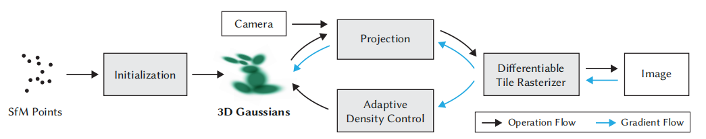

[← Mục lục](00-muc-luc.md) · Chương 5/15

# Chương 5 — Ký hiệu & Nền tảng toán học chung

> Ký hiệu trong chương này được rút ra trực tiếp từ code (`scene/gaussian_model.py`, `gaussian_renderer/`,
> `submodules/diff-gaussian-rasterization_fastgs/cuda_rasterizer/`), dùng chung cho các chương 6–13.

Từ chương này trở đi, sách trình bày lại toàn bộ pipeline 3D Gaussian Splatting theo đúng thứ tự các khối trong sơ đồ, đối chiếu công thức trực tiếp với code trong repo (không lấy số liệu từ paper upstream). Mỗi chương (6–13) tương ứng một khối trong sơ đồ pipeline bên dưới, và có phần kiểm định số kèm theo (chạy trên cùng một "cảnh đồ chơi").

## 5.1 Sơ đồ pipeline & mục lục các chương tiếp theo

> Các chương sau đi theo **đúng thứ tự các khối trong sơ đồ pipeline** của 3D Gaussian Splatting, và ở mỗi khối chỉ ra
> phần nào là 3DGS gốc (giữ nguyên) và phần nào là FastGS-lite (thay đổi). Mọi công thức đối chiếu với code trong repo,
> không lấy con số nào từ paper upstream. So sánh chất lượng đo được với 3DGS/FasterGS: xem
> [Chương 17](17-so-sanh-3dgs-fastgs-fastergs.md).



```
SfM Points ──► Initialization ──► 3D Gaussians ──► Projection ──► Differentiable ──► Image
                                       ▲    ▲          ▲           Tile Rasterizer      │
                        Camera ────────┼────┼──────────┘                 ▲              │
                                       │    │                            │              │
                                       │    └──── gradient ◄─────────────┴── gradient ◄─┘
                                       │
                              Adaptive Density Control
```

Mũi tên đen = **Operation Flow** (chương 1 → 5). Mũi tên xanh = **Gradient Flow** (chương 6). Vòng quay về từ
**Adaptive Density Control** (chương 7).

## Mục lục

| Chương | Khối trong sơ đồ | File | FastGS thay đổi gì |
|---|---|---|---|
| 5 | Ký hiệu chung | (chương này) | — |
| 6 | SfM Points → Initialization | [06-initialization.md](06-initialization.md) | giữ nguyên |
| 7 | 3D Gaussians | [07-3d-gaussians.md](07-3d-gaussians.md) | giữ nguyên |
| 8 | Camera + Projection | [08-projection-compact-box.md](08-projection-compact-box.md) | **compact box, lọc tile theo ellipse** (giảm $K$) |
| 9 | Differentiable Tile Rasterizer | [09-differentiable-tile-rasterizer.md](09-differentiable-tile-rasterizer.md) | giữ nguyên toán; đầu vào nhỏ hơn |
| 10 | Image → Loss & Metrics | [10-anh-den-loss-metrics.md](10-anh-den-loss-metrics.md) | giữ nguyên loss; ghi chú metrics |
| 11 | Gradient Flow | [11-gradient-flow-backprop.md](11-gradient-flow-backprop.md) | **gradient trị tuyệt đối, Adam thưa, lr SH** |
| 12 | Adaptive Density Control | [12-adaptive-density-control.md](12-adaptive-density-control.md) | **Importance / Pruning score, densify AND, prune multinomial, final prune** (giảm $N$) |
| 13 | Tổng hợp: mô hình chi phí | [13-tong-hop-chi-phi-fastgs.md](13-tong-hop-chi-phi-fastgs.md) | ba tỉ số nhân nhau |

## Kết luận trước khi đọc

FastGS-lite **không đổi một dòng nào của toán render** — $G(x)$, $\Sigma=RSS^\top R^\top$, $\Sigma'=JW\Sigma W^\top J^\top$,
alpha-blend, backward qua blend, update rule của Adam, loss $\mathcal L=(1-\lambda)\mathcal L_1+\lambda\mathcal L_{\text{D-SSIM}}$
đều giữ nguyên. Cái bị thay là ba **công thức điều khiển**:

| Điều khiển | Khối | Hiệu ứng lên chi phí $T_{\text{iter}}=aN+bNK+cN\cdot\mathbb 1_{\text{step}}+F$ |
|---|---|---|
| Cặp (tile, Gaussian) nào được đưa vào sort/blend | Projection | giảm $K$ |
| Gaussian nào được tồn tại | Adaptive Density Control | giảm $N$ |
| Khi nào gọi `optimizer.step()` | Gradient Flow | giảm $\mathbb 1_{\text{step}}$ |

*(Xem sơ đồ pipeline gốc tại `../../pipe.png` — tức file `pipe.png` ở gốc repo `digital-twin-gs/`.)*

## 5.2 Ký hiệu dùng chung

| Ký hiệu | Ý nghĩa | Nơi xuất hiện trong code |
|---|---|---|
| $N$ | số Gaussian hiện có | `gaussians.get_xyz.shape[0]` |
| $i$ | chỉ số Gaussian, $i=1..N$ | |
| $v$ | chỉ số camera / góc nhìn | `viewpoint_cam` |
| $\theta_i=(\mu_i,\tilde q_i,\tilde s_i,\tilde\alpha_i,k_i)$ | 59 tham số học được của Gaussian $i$ | `_xyz, _rotation, _scaling, _opacity, _features_dc/_rest` |
| $\mu_i\in\mathbb R^3$ | tâm (world space) | `_xyz` |
| $q_i,\ R_i=R(q_i)$ | quaternion đơn vị và ma trận xoay | `get_rotation` |
| $s_i\in\mathbb R^3_{>0},\ S_i=\operatorname{diag}(s_i)$ | scale | `get_scaling` |
| $\alpha_i\in(0,1)$ | opacity (sau sigmoid); code gọi là $o$ | `get_opacity` |
| $k_{i,lm}\in\mathbb R^3$ | hệ số SH, $l=0..3$, 16 hệ số/kênh | `get_features` |
| $\Sigma_i$ | covariance 3D | `computeCov3D` |
| $\Sigma'_i$ | covariance 2D sau chiếu | `computeCov2D` |
| $M_i=\Sigma_i'^{-1}=\begin{pmatrix}A&B\B&C\end{pmatrix}$ | conic | `con_o.x, .y, .z` |
| $\mu'_i\in\mathbb R^2$ | tâm trên ảnh (pixel) | `points_xy_image` |
| $\Delta=x-\mu'_i$ | độ lệch pixel–tâm | `d` trong `renderCUDA` |
| $t_i$ | ngưỡng level-set của compact box | `auxiliary.h:312-314` |
| $\mathcal K_i,\ K_i=\lvert\mathcal K_i\rvert$ | tập tile Gaussian $i$ chạm, và số tile | `tiles_touched[i]` |
| $K$ | số tile trung bình mỗi splat | |
| $P=\sum_iK_i\approx NK$ | tổng số cặp (tile, Gaussian) | `num_rendered` |
| $T_n$ | transmittance tích luỹ trước Gaussian thứ $n$ | `T` |
| $C(x)$ | màu pixel $x$ | `out_color` |
| $\mathcal L$ | loss huấn luyện | `loss` |
| $\text{extent}$ | bán kính cảnh ước lượng từ camera | `scene.cameras_extent` |
| $\text{Importance}_i,\ \text{Pruning}_i$ | hai điểm số multi-view của FastGS | `importance_score, pruning_score` |
| $\mathbb 1[\cdot]$ | hàm chỉ báo | |
| $\sigma(\cdot),\ \sigma^{-1}(\cdot)$ | sigmoid và nghịch đảo | `torch.sigmoid, inverse_sigmoid` |

Hằng số cứng hay gặp (đều nằm trong kernel hoặc `arguments/__init__.py`):

| Hằng | Giá trị | Ý nghĩa |
|---|---|---|
| tile | $16\times16$ px | `BLOCK_X, BLOCK_Y` |
| low-pass | $0.3$ | cộng vào đường chéo $\Sigma'$ |
| clamp Jacobian | $1.3\tan(\text{fov}/2)$ | |
| ngưỡng alpha | $1/255$ | bỏ splat mờ hơn 1 bước 8-bit |
| dừng sớm | $10^{-4}$ | dừng blend khi $T<10^{-4}$ |
| `mult` | $0.5$ | hệ số compact box |
| $\tau_{\text{grad}}$ | $2\times10^{-4}$ | `densify_grad_threshold` |
| $\tau^{\text{abs}}_{\text{grad}}$ | $1.2\times10^{-3}$ | `grad_abs_thresh` |
| $\tau_{\text{loss}}$ | $0.1$ | `loss_thresh` |
| $\delta$ | $0.001$ | `--dense` — ngưỡng clone/split theo scale |
| $\lambda$ | $0.2$ (preset notebook $0.25$) | `lambda_dssim` |

## Bài tập (Exercise)

**Bài tập 5.1.** Giải thích ý nghĩa của $\mathcal K_i$, $K_i=\lvert\mathcal K_i\rvert$, $K$ và $P=\sum_iK_i\approx NK$. Vì sao $P$ — chứ không phải $N$ hay $K$ riêng lẻ — là đại lượng thực sự quyết định số phép tính trong bước sort/blend của rasterizer?

**Bài tập 5.2.** Từ bảng hằng số, ngưỡng alpha là $1/255$. Viết ngưỡng này dưới dạng số thập phân (4 chữ số có nghĩa) và giải thích tại sao nó gắn với "1 bước 8-bit" thay vì một hằng số tuỳ ý như $10^{-3}$.

**Bài tập 5.3.** Bảng "Điều khiển" liệt kê ba chỗ FastGS-lite can thiệp: Projection (giảm $K$), Adaptive Density Control (giảm $N$), Gradient Flow (giảm $\mathbb 1_{\text{step}}$). Với công thức $T_{\text{iter}}=aN+bNK+cN\cdot\mathbb 1_{\text{step}}+F$, hãy giải thích vì sao can thiệp ở Projection (lọc tile theo ellipse) chỉ đổi $K$ mà không đổi $N$, trong khi can thiệp ở Adaptive Density Control đổi cả $N$ lẫn gián tiếp cả $P=NK$.

**Bài tập 5.4.** Dựa vào bảng ký hiệu, $M_i=\Sigma_i'^{-1}=\begin{pmatrix}A&B\\B&C\end{pmatrix}$ là conic ứng với $\Sigma'_i$ (covariance 2D sau chiếu, lưu trong code ở `con_o.x, .y, .z`). Nêu ý nghĩa hình học của $A$, $B$, $C$ (liên hệ với trục và độ nghiêng của ellipse mà Gaussian chiếu lên ảnh), và giải thích vì sao rasterizer dùng nghịch đảo $\Sigma_i'^{-1}$ thay vì $\Sigma_i'$ trực tiếp khi tính $\Delta^\top M_i\Delta$.

**Bài tập 5.5.** So sánh vai trò của hai điểm số $\text{Importance}_i$ và $\text{Pruning}_i$ trong bảng ký hiệu (chỉ dựa trên tên và vị trí xuất hiện trong code — `importance_score, pruning_score` — chưa cần công thức chi tiết ở chương 7): vì sao FastGS-lite cần *hai* điểm số multi-view riêng biệt thay vì một điểm số duy nhất để vừa densify vừa prune?

**Bài tập 5.6.** Trace code: liệt kê tất cả các ký hiệu trong bảng 5.2 mà nơi xuất hiện trong code nằm ở `gaussian_model.py` (dưới dạng `get_*` hoặc `_*`), và tách riêng nhóm ký hiệu chỉ tồn tại trong kernel CUDA (`renderCUDA`, `auxiliary.h`). Từ đó giải thích ranh giới giữa phần "Python/PyTorch" và phần "CUDA kernel" trong pipeline.

---

[← Chương 4](04-luu-render-cham-diem-phan-3.md) | [Mục lục](00-muc-luc.md) | [Chương 6 →](06-initialization.md)
