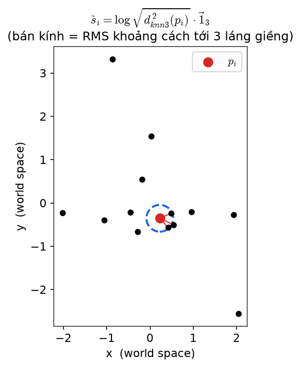
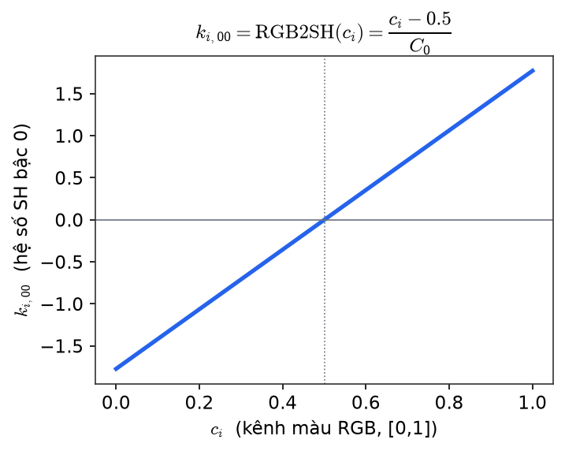
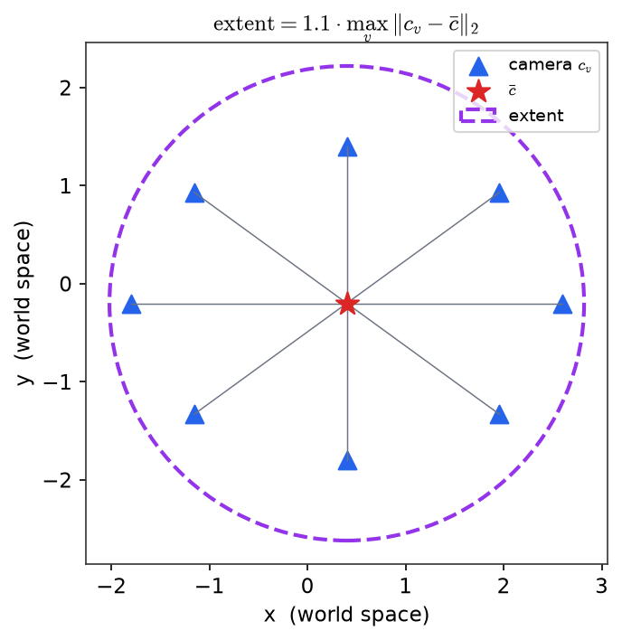
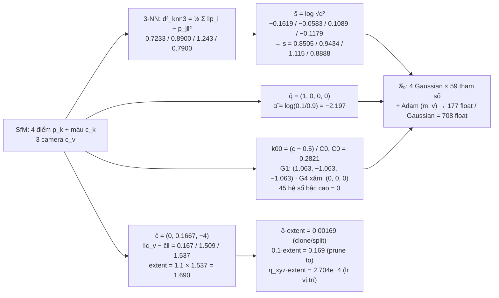
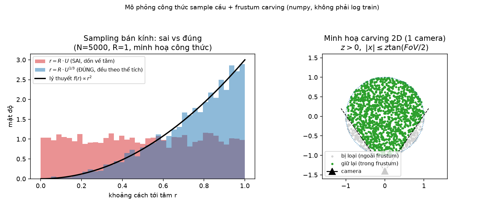

[← Mục lục](00-muc-luc.md) · Chương 6/15

# Chương 6 — Initialization: Từ SfM Points đến Gaussian khởi tạo

> Nguồn: `DOCS/Report/01-initialization.md`, `DOCS/Report/test/00-scene.md`, `DOCS/Report/test/01-test.md`

## 6.1 Lý thuyết

# Chương 1 — SfM Points → Initialization

> Khối đầu tiên của sơ đồ. **FastGS-lite giữ nguyên hoàn toàn** so với 3DGS gốc.
> Code: `scene/gaussian_model.py:137-160` (`create_from_pcd`), `scene/dataset_readers.py:45-66` (`getNerfppNorm`).

## 1.1 — Đầu vào

COLMAP cho ra:

- Point cloud thưa $\{(p_k,\ c_k)\}_{k=1}^{N_0}$, với $p_k\in\mathbb R^3$ là toạ độ world và $c_k\in[0,1]^3$ là màu RGB.
- Tập camera $\{(W_v,\ \text{fov}_{x,v},\ \text{fov}_{y,v},\ I^{(v)}_{\text{gt}})\}_{v=1}^{V}$ — ma trận view (world→camera), góc nhìn, ảnh ground-truth.

## 1.2 — Mỗi điểm SfM sinh một Gaussian

Mỗi $p_k$ trở thành một Gaussian với 59 tham số (đếm ở chương 2). Giá trị khởi tạo:

$$
\mu_i = p_i
$$

$$
\tilde s_i=\log\sqrt{\max\bigl(d^2_{\text{knn3}}(p_i),\ 10^{-7}\bigr)}\cdot\mathbf 1_3,
\qquad d^2_{\text{knn3}}(p_i)=\frac13\sum_{j\in\text{3-NN}(i)}\lVert p_i-p_j\rVert^2
$$



*Trục x, y là toạ độ world space. Các chấm đen là điểm SfM lân cận; điểm đỏ là $p_i$. Ba đoạn nối đỏ là khoảng cách tới 3 láng giềng gần nhất; vòng tròn nét đứt xanh có bán kính bằng RMS của ba khoảng cách đó — chính là kích thước đẳng hướng ban đầu (cùng bán kính theo mọi hướng x/y/z) của Gaussian mới sinh ra tại $p_i$.*

$$
\tilde q_i=(1,0,0,0),\qquad \tilde\alpha_i=\sigma^{-1}(0.1)=\log\frac{0.1}{0.9}
$$

$$
k_{i,00}=\text{RGB2SH}(c_i)=\frac{c_i-0.5}{C_0},\qquad C_0=\frac{1}{2\sqrt\pi}\approx0.28209,
\qquad k_{i,lm}=0\ \ (l\ge1)
$$



*Trục x là giá trị một kênh màu RGB gốc (miền [0,1]); trục y là hệ số SH bậc 0 $k_{00}$. Đây là đường thẳng qua điểm (0.5, 0) độ dốc $1/C_0\approx3.545$ — ánh xạ affine, không phi tuyến: màu trung tính 0.5 ánh xạ về 0.*

Ba điều đáng nhớ:

1. Gaussian ban đầu **đẳng hướng** (ba scale bằng nhau) và bằng khoảng cách tới láng giềng — đủ để phủ kín khe hở giữa các điểm SfM.
2. Opacity khởi tạo $0.1$, tức mờ. Phần lớn "hình" phải học từ gradient.
3. Chỉ SH bậc 0 có giá trị; 45 hệ số bậc cao bắt đầu từ 0 và chỉ được kích hoạt dần theo lịch $D(t)$ ở chương 2.

## 1.3 — `extent`: bán kính cảnh

Đại lượng này chưa được định nghĩa trong paper nhưng xuất hiện ở bốn ngưỡng của chương 7. Với $c_v=(W_v)^{-1}[{:}3,3]$ là vị trí camera $v$ trong world space:

$$
\bar c=\frac1V\sum_{v=1}^{V}c_v,
\qquad
\boxed{\ \text{extent}=1.1\cdot\max_v\lVert c_v-\bar c\rVert_2\ }
$$



*Trục x, y là toạ độ world space nhìn từ trên xuống. Tam giác xanh là vị trí camera; ngôi sao đỏ là tâm trung bình $\bar c$; vòng tròn nét đứt tím bán kính đúng bằng extent — bao trọn toàn bộ camera cộng biên an toàn 10%, dùng làm "thước đo" tỉ lệ cho cả cảnh.*

Hằng $1.1$ là biên an toàn 10%. `extent` được dùng làm:

| Nơi dùng | Công thức |
|---|---|
| ngưỡng clone / split | $\delta\cdot\text{extent}$ (chương 7) |
| ngưỡng "scale quá lớn" khi prune | $0.1\cdot\text{extent}$ (chương 7) |
| `spatial_lr_scale` | $\eta_{xyz}\leftarrow\eta_{xyz}\cdot\text{extent}$ (chương 6) |

## 1.4 — Trạng thái optimizer đi kèm

Ngay khi khởi tạo, `training_setup` tạo hai Adam (chương 6): `optimizer` cho $(\mu,\tilde q,\tilde s,\tilde\alpha,k_{00})$ và `shoptimizer` riêng cho $k_{lm},\ l\ge1$. Mỗi tham số mang thêm hai moment $(m,v)$, nên bộ nhớ trạng thái là $\approx 3\times59=177$ float/Gaussian. Vì thế $N$ vừa quyết định thời gian, vừa quyết định VRAM.

## 1.5 — Đầu ra của khối

$$
\mathcal G_0=\{\theta_i\}_{i=1}^{N_0},\qquad N_0=\text{số điểm SfM}
$$

đi vào khối **3D Gaussians** (chương 2).

## 6.2 Cảnh đồ chơi dùng chung cho các bài kiểm định số (Chương 6–13)

*Cảnh đồ chơi nhỏ dùng xuyên suốt các bài kiểm định số ở cuối mỗi chương từ đây trở đi — 4 điểm SfM, 3 camera, ảnh 48×32 = 6 tile, =f_y=40$.*

# Cảnh đồ chơi dùng chung cho toàn bộ bài test số (chương 1 → 8)

> Mọi file `NN-test.md` trong thư mục này tính trên **cùng một cảnh** dưới đây, để số liệu đầu ra
> của chương trước là đầu vào của chương sau. Chỉ dùng `numpy` (không có torch trong môi trường).
> Script sinh số nằm ở `scripts/chNN_test.py`; số trong markdown phải khớp với số script in ra.

## Ảnh và camera

| Đại lượng | Giá trị |
|---|---|
| $W\times H$ | $48\times32$ px → lưới tile $16\times16$: $3\times2=6$ tile |
| $\tan(\text{fov}_x/2)$ | $0.6$ → $f_x=W/(2\cdot0.6)=40$ |
| $\tan(\text{fov}_y/2)$ | $0.4$ → $f_y=H/(2\cdot0.4)=40$ |
| $z_n,\ z_f$ | $0.01,\ 100$ |

Ba camera, **xoay đơn vị** (nhìn dọc $+z$ của world), chỉ khác vị trí $c_v$:

| $v$ | $c_v$ (world) | $W_v$ (world→camera, 4×4) |
|---|---|---|
| 1 | $(0,\ 0,\ -4)$ | $W_v=[\,I_3\mid -c_v\,]$ (hàng cuối $0,0,0,1$), tức $t_v=\mu-c_v$ |
| 2 | $(1.5,\ 0,\ -4)$ | tương tự |
| 3 | $(-1.5,\ 0.5,\ -4)$ | tương tự |

Ground-truth $I^{(v)}_{\text{gt}}$: khi một chương cần ảnh GT, **định nghĩa** GT = ảnh render của cảnh
với tham số "đúng" là tham số khởi tạo nhưng opacity $\alpha=0.9$ thay vì $0.1$ (mô hình chưa học sẽ mờ hơn GT).

## Điểm SfM (4 điểm)

| $k$ | $p_k$ | $c_k$ (RGB) |
|---|---|---|
| 1 | $(0.0,\ 0.0,\ 0.0)$ | $(0.8,\ 0.2,\ 0.2)$ đỏ |
| 2 | $(0.5,\ 0.3,\ 0.5)$ | $(0.2,\ 0.7,\ 0.3)$ lục |
| 3 | $(-0.4,\ -0.2,\ 1.0)$ | $(0.1,\ 0.3,\ 0.9)$ lam |
| 4 | $(0.3,\ -0.5,\ 0.2)$ | $(0.5,\ 0.5,\ 0.5)$ xám |

$N_0=4$, nên 3-NN của mỗi điểm là 3 điểm còn lại.

## Hằng số (chương 0)

tile 16 px · low-pass 0.3 · clamp $1.3\tan(\text{fov}/2)$ · ngưỡng alpha $1/255$ · dừng sớm $10^{-4}$ ·
`mult` $=0.5$ · $\tau_{\text{grad}}=2\times10^{-4}$ · $\tau^{\text{abs}}_{\text{grad}}=1.2\times10^{-3}$ ·
$\tau_{\text{loss}}=0.1$ · $\delta=0.001$ · $\lambda=0.2$.

## Quy ước viết

- Mỗi bước: **công thức → thay số → kết quả** (làm tròn 4 chữ số có nghĩa, nhưng script giữ full precision).
- Cuối file: bảng "Đầu vào của khối" và "Đầu ra của khối" để chương sau lấy dùng.
- Ghi rõ chỗ nào là **kiểm chứng đối chiếu code** (gọi hàm thật trong repo: `utils/graphics_utils.py`,
  `utils/sh_utils.py`, `utils/general_utils.py`, `utils/loss_utils.py` nếu không cần torch) và chỗ nào là tính tay theo công thức.

## 6.3 Kiểm định số — Chương 1 Initialization

# Test số chương 1 — SfM Points → Initialization

> Tính trên cảnh đồ chơi ở `00-scene.md` (4 điểm SfM, 3 camera, ảnh $48\times32$).
> Script sinh số: `scripts/ch01_test.py` (chỉ `numpy`). Mọi số dưới đây là output thật của script,
> làm tròn 4 chữ số có nghĩa; script giữ full precision.
> Công thức chép lại từ code: `scene/gaussian_model.py:137-160` (`create_from_pcd`),
> `scene/dataset_readers.py:45-66` (`getNerfppNorm`), `utils/sh_utils.py:26,114` (`C0`, `RGB2SH`),
> `utils/general_utils.py:18` (`inverse_sigmoid`), `submodules/simple-knn/simple_knn.cu:148-184` (`boxMeanDist`, tức `distCUDA2`).
>
> Vì môi trường không có torch nên không gọi được hàm thật trong `utils/*.py` (mọi file đều `import torch` ở đầu);
> các hàm được **chép nguyên văn** sang numpy và đánh dấu "chép từ code" ở từng bước.

## Sơ đồ khối với số của cảnh đồ chơi



## 1.1 — Đầu vào

Point cloud thưa $\{(p_k, c_k)\}_{k=1}^{N_0}$, $N_0=4$:

| $k$ | $p_k$ | $c_k$ |
|---|---|---|
| 1 | $(0,\ 0,\ 0)$ | $(0.8,\ 0.2,\ 0.2)$ |
| 2 | $(0.5,\ 0.3,\ 0.5)$ | $(0.2,\ 0.7,\ 0.3)$ |
| 3 | $(-0.4,\ -0.2,\ 1.0)$ | $(0.1,\ 0.3,\ 0.9)$ |
| 4 | $(0.3,\ -0.5,\ 0.2)$ | $(0.5,\ 0.5,\ 0.5)$ |

Tập camera $V=3$, xoay đơn vị:

$$W_v=\begin{pmatrix}I_3&-c_v\\0&1\end{pmatrix}$$


| $v$ | $c_v$ |
|---|---|
| 1 | $(0,\ 0,\ -4)$ |
| 2 | $(1.5,\ 0,\ -4)$ |
| 3 | $(-1.5,\ 0.5,\ -4)$ |

`max_sh_degree` $=3$ → $(3+1)^2=16$ hệ số SH mỗi kênh.


*Hình: trái — 4 điểm SfM (màu = $c_k$, cỡ hình cầu tỉ lệ $s_i$ tính ở 1.2b, toạ độ ghi ở góc trên) và 3 camera (tam giác đen/cam/tím, mũi tên = hướng nhìn $+z$), sao vàng là $\bar c=(0,\ 0.1667,\ -4)$. Phải — chiếu lên mặt $xy$: đoạn nối $\bar c$–camera ghi $\lVert c_v-\bar c\rVert=0.1667/1.509/1.537$; vòng nét đứt bán kính 1.537 (max) và vòng nét liền bán kính $\text{extent}=1.1\times1.537=1.690$ (mục 1.3).*

## 1.2 — Mỗi điểm SfM sinh một Gaussian

### (a) Tâm $\mu_i=p_i$

`gaussian_model.py:139,154` — `fused_point_cloud = tensor(pcd.points)`; `_xyz = fused_point_cloud`. Không biến đổi gì, $\mu_i=p_i$ như bảng 1.1.

### (b) Scale $\tilde s_i$ — từ 3-NN

**Công thức** (chép từ `simple_knn.cu:183` và `gaussian_model.py:147-148`):

$$
d^2_{\text{knn3}}(p_i)=\frac13\sum_{j\in\text{3-NN}(i)}\lVert p_i-p_j\rVert^2,\qquad
\tilde s_i=\log\sqrt{\max(d^2_{\text{knn3}},\,10^{-7})}\cdot\mathbf 1_3,\qquad s_i=\exp\tilde s_i
$$

Kernel `boxMeanDist` bỏ qua `i == idx` (chính điểm) rồi lấy `(best[0]+best[1]+best[2])/3`. Với $N_0=4$, 3-NN của mỗi điểm chính là 3 điểm còn lại.

**Thay số** — ma trận $\lVert p_i-p_j\rVert^2$:

| | $p_1$ | $p_2$ | $p_3$ | $p_4$ |
|---|---|---|---|---|
| $p_1$ | 0 | 0.59 | 1.2 | 0.38 |
| $p_2$ | 0.59 | 0 | 1.31 | 0.77 |
| $p_3$ | 1.2 | 1.31 | 0 | 1.22 |
| $p_4$ | 0.38 | 0.77 | 1.22 | 0 |

Ví dụ $\lVert p_1-p_2\rVert^2=0.5^2+0.3^2+0.5^2=0.25+0.09+0.25=0.59$; $\lVert p_2-p_3\rVert^2=0.9^2+0.5^2+0.5^2=0.81+0.25+0.25=1.31$.

**Kết quả:**

| $i$ | $d^2_{\text{knn3}}$ | sau clamp $10^{-7}$ | $\tilde s_i$ (mỗi trục) | $s_i=\sqrt{d^2}$ |
|---|---|---|---|---|
| 1 | $(0.59+1.2+0.38)/3=0.7233$ | 0.7233 | $\log\sqrt{0.7233}=-0.1619$ | 0.8505 |
| 2 | $(0.59+1.31+0.77)/3=0.8900$ | 0.8900 | $-0.05827$ | 0.9434 |
| 3 | $(1.2+1.31+1.22)/3=1.243$ | 1.243 | $0.1089$ | 1.115 |
| 4 | $(0.38+0.77+1.22)/3=0.7900$ | 0.7900 | $-0.1179$ | 0.8888 |

Clamp không tác dụng ở cảnh này (mọi $d^2\gg10^{-7}$). Gaussian đẳng hướng: `scales = log(sqrt(dist2))[...,None].repeat(1,3)`.
Chú ý $s_3$ lớn nhất vì $p_3$ nằm xa nhất (mọi khoảng cách $\ge1.2$).


*Hình: trái — ma trận $\lVert p_i-p_j\rVert^2$ (số trong ô đúng bằng bảng trên; hàng $p_3$ đỏ đậm nhất → xa nhất). Phải — ba cột theo thứ tự tính: $d^2_{\mathrm{knn3}}$ = trung bình 3 ô ngoài đường chéo của một hàng (0.7233/0.8900/1.243/0.7900) → $\tilde s_i=\log\sqrt{d^2}$ (âm khi $d^2<1$, chỉ G3 dương) → $s_i=e^{\tilde s_i}$ (0.8505/0.9434/1.115/0.8888).*

### (c) Quaternion $\tilde q_i$

`gaussian_model.py:149-150` — `rots = zeros(N,4); rots[:,0]=1`:

$$\tilde q_i=(1,\ 0,\ 0,\ 0)\quad\forall i$$

### (d) Opacity $\tilde\alpha_i$

**Công thức** (chép từ `general_utils.py:18` và `gaussian_model.py:152`): $\tilde\alpha_i=\sigma^{-1}(0.1)=\log\dfrac{0.1}{1-0.1}$.

**Thay số:** $\log(0.1/0.9)=\log(0.1111)=-2.1972$.

**Kết quả:** $\tilde\alpha_i=-2.197$ cho cả 4 Gaussian. Kiểm chứng ngược $\sigma(-2.1972)=0.1000$.


*Hình: (a) đường $\sigma$; chấm đỏ là điểm khởi tạo $(\tilde\alpha,\alpha)=(-2.197,\ 0.1)$ — nằm ở phần dốc thấp bên trái nên gradient theo $\tilde\alpha$ nhỏ; chấm xám là $\alpha=0.9$ của GT (00-scene) ứng với $\tilde\alpha=+2.197$, đối xứng qua 0. (b) đường $\exp$ với 4 điểm $(\tilde s_i, s_i)$ của mục (b): 3 Gaussian nằm dưới $s=1$ (vì $\tilde s<0$), chỉ G3 nằm trên.*

### (e) Hệ số SH $k_{i,lm}$

**Công thức** (chép từ `sh_utils.py:26,114`): $C_0=0.2820947918$, $k_{i,00}=\text{RGB2SH}(c_i)=(c_i-0.5)/C_0$; `features[:,3:,1:]=0` → $k_{i,lm}=0$ với $l\ge1$.

**Thay số:** $1/C_0=3.5449$; $0.3/C_0=1.063$, $0.2/C_0=0.7090$, $0.4/C_0=1.418$.

**Kết quả:**

| $i$ | $c_i$ | $k_{i,00}$ (R, G, B) |
|---|---|---|
| 1 | $(0.8, 0.2, 0.2)$ | $(1.063,\ -1.063,\ -1.063)$ |
| 2 | $(0.2, 0.7, 0.3)$ | $(-1.063,\ 0.7090,\ -0.7090)$ |
| 3 | $(0.1, 0.3, 0.9)$ | $(-1.418,\ -0.7090,\ 1.418)$ |
| 4 | $(0.5, 0.5, 0.5)$ | $(0,\ 0,\ 0)$ |

Điểm xám 4 cho $k_{00}=0$ vì $c=0.5$ đúng bằng điểm giữa của `SH2RGB` ($sh\cdot C_0+0.5$).
Tensor `_features_dc` có shape $(4,1,3)$, `_features_rest` shape $(4,15,3)$: $15\times3=45$ hệ số bậc cao, tất cả $=0$ (script kiểm tra `max|features_rest| = 0`).


*Hình: mỗi cột là một Gaussian — ô màu trên cùng là $c_i$ gốc, ba thanh R/G/B bên dưới là $k_{i,00}=(c-0.5)/C_0$ với số ghi trên đầu thanh (khớp bảng trên; phép chia ghi ở nhãn trục $x$). Kênh nào $>0.5$ cho thanh dương, $<0.5$ cho thanh âm; G4 xám $c=0.5$ nên cả ba thanh bằng 0.*

### (f) Đếm tham số

$3\,(\mu)+4\,(\tilde q)+3\,(\tilde s)+1\,(\tilde\alpha)+3\times16\,(k)=59$ tham số/Gaussian.

## 1.3 — `extent`: bán kính cảnh

**Công thức** (chép từ `dataset_readers.py:45-66`): $c_v=(W_v)^{-1}[{:}3,3]$, $\bar c=\frac1V\sum_v c_v$, $\text{extent}=1.1\cdot\max_v\lVert c_v-\bar c\rVert_2$.

**Thay số.** Script dựng $W_v$ 4×4 rồi lấy `inv(W2C)[:3,3]` đúng như code; với xoay đơn vị kết quả trùng $c_v$ đã cho.

$$\bar c=\frac13\bigl[(0,0,-4)+(1.5,0,-4)+(-1.5,0.5,-4)\bigr]=(0,\ 0.1667,\ -4)$$

| $v$ | $c_v-\bar c$ | $\lVert c_v-\bar c\rVert$ |
|---|---|---|
| 1 | $(0,\ -0.1667,\ 0)$ | 0.1667 |
| 2 | $(1.5,\ -0.1667,\ 0)$ | $\sqrt{2.25+0.02778}=1.509$ |
| 3 | $(-1.5,\ 0.3333,\ 0)$ | $\sqrt{2.25+0.1111}=1.537$ |

**Kết quả:**

$$\text{extent}=1.1\times1.537=1.690$$

(`translate` $=-\bar c=(0,\ -0.1667,\ 4)$ cũng được trả về nhưng chương 1 không dùng.)

Ba ngưỡng suy ra từ `extent`:

| Nơi dùng | Công thức | Giá trị | Code |
|---|---|---|---|
| clone / split | $\delta\cdot\text{extent}$, $\delta=0.001$ | $0.001690$ | `gaussian_model.py:451-452`, `arguments/__init__.py:95` |
| prune "scale quá lớn" | $0.1\cdot\text{extent}$ | $0.1690$ | `gaussian_model.py:467` |
| `spatial_lr_scale` | $\eta_{xyz}\cdot\text{extent}$, $\eta_{xyz}=1.6\times10^{-4}$ | $2.704\times10^{-4}$ | `gaussian_model.py:168`, `arguments/__init__.py:76` |

Nhận xét cho chương 7: $\max s_i\in[0.8505,\ 1.115]$, đều $>0.001690$ nên nếu 4 Gaussian này vượt ngưỡng gradient thì tất cả sẽ đi nhánh **split**, không có clone. Ngược lại $\max s_i<0.1690$? Không — $s_i\approx0.85..1.12>0.169$, nghĩa là ngay từ khởi tạo cả 4 Gaussian đã vượt ngưỡng `big_points_ws` (cảnh đồ chơi quá thưa so với bán kính camera; ở cảnh thật tỉ lệ $s_i/\text{extent}$ nhỏ hơn nhiều). Chương 7 sẽ phải tính đến điều này.

## 1.4 — Trạng thái optimizer đi kèm

**Công thức:** mỗi tham số mang thêm hai moment Adam $(m,v)$ → $3\times59=177$ float/Gaussian. Chia theo hai optimizer (`gaussian_model.py:166-177`): `optimizer` giữ $(\mu,\tilde q,\tilde s,\tilde\alpha,k_{00})=14$ tham số → 42 float; `shoptimizer` giữ 45 hệ số $k_{lm},l\ge1$ → 135 float.

**Thay số** (float32 = 4 byte):

| $N$ | float | byte | quy đổi |
|---|---|---|---|
| $N_0=4$ | $177\times4=708$ | $2\,832$ | 2.832 kB |
| $N=10^6$ | $1.77\times10^8$ | $7.08\times10^8$ | 708.0 MB $=675.2$ MiB |

Tức riêng trạng thái tham số + Adam đã chiếm ~0.7 GB VRAM ở $N=10^6$, chưa kể gradient và bộ đệm raster.


*Hình: trái — thanh $\theta$ ghép 6 nhóm $3+4+3+1+3+45=59$; hai thanh mờ $m, v$ là moment Adam cùng kích thước → $3\times59=177$ float/Gaussian; vạch đứt tại 14 tách phần `optimizer` (42 float) và `shoptimizer` (135 float). Phải — số byte $=177\cdot N\cdot4$ trên thang log: 2 832 byte ở $N_0=4$, $7.08\times10^8$ byte $=708$ MB $=675.2$ MiB ở $N=10^6$.*

## 1.5 — Đầu ra của khối

$\mathcal G_0=\{\theta_i\}_{i=1}^{4}$, $\theta_i=(\mu_i,\tilde q_i,\tilde s_i,\tilde\alpha_i,k_i)$. Chương 2, 3 dùng đúng các số này.

| $i$ | $\mu_i$ | $\tilde q_i$ | $\tilde s_i$ (×3 trục) | $s_i=e^{\tilde s_i}$ | $\tilde\alpha_i$ | $\alpha_i$ | $k_{i,00}$ (R,G,B) | $k_{i,lm},l\ge1$ |
|---|---|---|---|---|---|---|---|---|
| 1 | $(0,\ 0,\ 0)$ | $(1,0,0,0)$ | $-0.1619$ | 0.8505 | $-2.197$ | 0.1 | $(1.063,\ -1.063,\ -1.063)$ | 0 (45) |
| 2 | $(0.5,\ 0.3,\ 0.5)$ | $(1,0,0,0)$ | $-0.05827$ | 0.9434 | $-2.197$ | 0.1 | $(-1.063,\ 0.7090,\ -0.7090)$ | 0 (45) |
| 3 | $(-0.4,\ -0.2,\ 1.0)$ | $(1,0,0,0)$ | $0.1089$ | 1.115 | $-2.197$ | 0.1 | $(-1.418,\ -0.7090,\ 1.418)$ | 0 (45) |
| 4 | $(0.3,\ -0.5,\ 0.2)$ | $(1,0,0,0)$ | $-0.1179$ | 0.8888 | $-2.197$ | 0.1 | $(0,\ 0,\ 0)$ | 0 (45) |

Giá trị full precision (để chương sau copy nếu cần): $\tilde s=(-0.1619425606,\ -0.0582669081,\ 0.1088979725,\ -0.1178611668)$; $\tilde\alpha=-2.1972245773$; $1/C_0=3.5449077018$.

| Đại lượng toàn cảnh | Giá trị |
|---|---|
| $\text{extent}$ | $1.690$ (full: 1.6902498172) |
| `spatial_lr_scale` (= extent, `scene/__init__.py:96`) | 1.690 |
| $\delta\cdot\text{extent}$ | $1.690\times10^{-3}$ |
| $0.1\cdot\text{extent}$ | 0.1690 |
| $\eta_{xyz}\cdot\text{extent}$ | $2.704\times10^{-4}$ |
| $N_0$ | 4 |
| bộ nhớ optimizer | 708 float = 2 832 byte |

## Ghi chú đối chiếu

Đối chiếu `01-initialization.md` với code thực tế:

1. **Khớp hoàn toàn**: công thức $\tilde s_i$ (kể cả clamp $10^{-7}$ và việc loại chính điểm khỏi 3-NN — `simple_knn.cu:159,178` có `if (i == idx) continue`), $\tilde q_i$, $\tilde\alpha_i$, `RGB2SH`, `extent` (hằng 1.1 ở `dataset_readers.py:62`), ba ngưỡng dùng `extent` và con số 177 float/Gaussian.
2. **Mục 1.4 — tổng float 177 đúng nhưng chia theo optimizer chưa nêu**: `optimizer` giữ 14 tham số (42 float), `shoptimizer` giữ 45 (135 float); phần lớn trạng thái Adam nằm ở SH bậc cao. Không sai, chỉ là chi tiết bổ sung.
3. **Mục 1.3 bảng "Nơi dùng"**: ngưỡng $\delta\cdot\text{extent}$ trong code là `args.dense*extent` với `dense=0.001` (`arguments/__init__.py:95`), so sánh với `max(get_scaling, dim=1)` — tức $\max_{\text{trục}} s_i$, không phải $\lVert s_i\rVert$. Chương 1 chỉ nói "ngưỡng clone/split" nên không mâu thuẫn, nhưng chương 7 nên ghi rõ là max theo trục.
4. **`getNerfppNorm` còn trả `translate = -\bar c`** (`dataset_readers.py:64`), chương 1 không nhắc — không ảnh hưởng vì `Scene` chỉ lấy `["radius"]` (`scene/__init__.py:74`).
5. **Hàm thật không gọi được**: `utils/sh_utils.py`, `utils/general_utils.py` đều `import torch` ở đầu file nên trong môi trường không có torch script phải chép lại; hằng `C0 = 0.28209479177387814` được lấy nguyên từ `sh_utils.py:26`.

## Bài tập (Exercise)

**Bài tập 6.1.** Giải thích vì sao Gaussian khởi tạo được chọn là **đẳng hướng** (ba trục scale bằng nhau, $\tilde s_i=\log\sqrt{d^2_{\text{knn3}}(p_i)}\cdot\mathbf 1_3$) thay vì dị hướng ngay từ đầu, và vì sao lấy trung bình bình phương khoảng cách tới 3 láng giềng gần nhất (chứ không phải 1 hay 10 láng giềng) là một lựa chọn hợp lý để "phủ kín khe hở giữa các điểm SfM" (mục 1.2).

**Bài tập 6.2.** Dùng toạ độ 4 điểm SfM ở mục 6.2 ($p_1=(0,0,0)$, $p_2=(0.5,0.3,0.5)$, $p_3=(-0.4,-0.2,1.0)$, $p_4=(0.3,-0.5,0.2)$), tính tay $\lVert p_1-p_3\rVert^2$ và $\lVert p_2-p_4\rVert^2$ theo đúng công thức đã dùng cho $\lVert p_1-p_2\rVert^2=0.59$, rồi đối chiếu kết quả với bảng ma trận khoảng cách ở mục 1.2(b) ($1.2$ và $0.77$).

**Bài tập 6.3.** Ba điều "đáng nhớ" ở mục 1.2 nói opacity khởi tạo $\alpha_i=0.1$ là "mờ", và phần lớn hình phải học từ gradient. Giải thích: nếu opacity khởi tạo được đặt bằng $0.9$ (giống định nghĩa GT ở mục 6.2) thay vì $0.1$, điều gì có thể xảy ra với quá trình tối ưu ở những vùng mà điểm SfM đặt sai vị trí?

**Bài tập 6.4.** Từ công thức $\tilde\alpha_i=\sigma^{-1}(0.1)=\log(0.1/0.9)=-2.1972$, hãy suy ra công thức tổng quát $\sigma^{-1}(\alpha)$ theo $\alpha$, tính $\sigma^{-1}(0.9)$ (giá trị GT dùng ở mục 6.2), và so sánh dấu của hai kết quả. Vì sao $\sigma^{-1}(0.1)$ và $\sigma^{-1}(0.9)$ đối xứng nhau qua 0?

**Bài tập 6.5.** Trace code: mở `scene/gaussian_model.py:137-160` (`create_from_pcd`) và `submodules/simple-knn/simple_knn.cu:148-184` (`boxMeanDist`, dùng bởi `distCUDA2`). Kernel này có điều kiện `if (i == idx) continue` khi duyệt tìm 3-NN. Giải thích vì sao phải loại trừ chính điểm $i$ ra khỏi tập láng giềng, và $\tilde s_i$ sẽ bị tính sai như thế nào (định tính) nếu thiếu điều kiện này.

**Bài tập 6.6.** Tính lại `extent` cho cảnh đồ chơi ở mục 6.2 nhưng chỉ dùng 2 camera đầu (bỏ camera 3 tại $(-1.5,\,0.5,\,-4)$), theo đúng các bước ở mục 1.3 (tính $\bar c$ mới, rồi $\max_v\lVert c_v-\bar c\rVert$, rồi nhân $1.1$). So sánh với `extent` $=1.690$ đã tính với đủ 3 camera, và giải thích vì sao bỏ camera 3 (camera xa $\bar c$ nhất) làm `extent` giảm.

**Bài tập 6.7.** Dùng công thức bộ nhớ optimizer $177\times N\times4$ byte (mục 1.4), tính bộ nhớ (theo MB) cần cho $N=5\times10^5$ và $N=2\times10^6$ Gaussian. So sánh hai kết quả với hai mốc đã có sẵn trong bài ($N_0=4$: 2 832 byte; $N=10^6$: 708.0 MB), và nhận xét mối quan hệ tuyến tính giữa $N$ và bộ nhớ trạng thái optimizer.

---

## Cập nhật: sửa lỗi + random init có carving

### Initialization gốc của 3DGS thiếu gì

3DGS gốc có đúng hai nhánh khởi tạo, cả hai đều đã mô tả ở mục 1.1–1.2 phía trên:

1. **Có COLMAP** — dùng thẳng point cloud SfM $\{p_k\}_{k=1}^{N_0}$ làm $\mu_i$. Tốt, vì mỗi điểm đã "biết" nằm trên một bề mặt thật (được tam giác hoá từ nhiều ảnh).
2. **Không có COLMAP (nhánh Blender/synthetic)** — sample $N=100{,}000$ điểm **đều** trong một hộp cố định $[-1.3,\,1.3]^3$, không quan tâm điểm đó có nằm trong tầm nhìn camera nào hay không.

Lỗ hổng nằm giữa hai nhánh này: pipeline của repo luôn đi qua nhánh COLMAP (`readColmapSceneInfo`) vì dataset cuộc thi ở dạng ảnh thật + SfM. Nếu SfM thất bại trên một scene (không hiếm với scene khó — ít feature, motion blur…) và `sparse/0/points3D.bin`/`.ply` không đọc được, code cũ chạy:

```python
try:
    pcd = fetchPly(ply_path)
except:
    pcd = None
...
self.gaussians.create_from_pcd(scene_info.point_cloud, self.cameras_extent)  # pcd=None -> crash
```

`create_from_pcd` gọi thẳng `np.asarray(pcd.points)` — với `pcd=None` chương trình dừng ngay, **không có fallback nào**. Đây là bug thật (mất cả 1 scene trong submission), không phải một tính năng còn thiếu.

### Vì sao "sample đều trong hộp/khối cầu bao" là lãng phí

Gọi $\mathcal F=\bigcup_{v=1}^V \text{frustum}(v)$ là hợp các vùng nhìn thấy được của $V$ camera train. Với một scene thật (đặc biệt object-centric hoặc camera chỉ quét một nửa không gian), thể tích $\mathcal F$ thường chỉ chiếm một phần nhỏ của khối bao toàn cảnh. Nếu sample đều $N_0$ điểm trong toàn bộ khối bao mà không lọc theo $\mathcal F$, một phần lớn trong số đó rơi ra ngoài $\mathcal F$: các Gaussian sinh ra ở đó **không được bất kỳ ảnh training nào render tới**, do đó không nhận gradient hữu ích — chúng chỉ tồn tại cho tới khi ADC (chương 7) tình cờ prune chúng đi qua điều kiện opacity/size, tốn bộ nhớ (mỗi Gaussian mang $177$ float trạng thái Adam, mục 1.4) và một phần thời gian các vòng đầu.

### Carving bằng frustum (`scene/dataset_readers.py::generate_random_point_cloud`)

Thay vì sample trong hộp $[-1.3,1.3]^3$ cố định, code mới sample đều trong **khối cầu bán kính `extent`** đã có sẵn ở mục 1.3 (tâm $\bar c$, bán kính $\text{extent}=1.1\max_v\lVert c_v-\bar c\rVert$) — dùng phương pháp sample cầu chuẩn (hướng ngẫu nhiên chuẩn hoá, bán kính $\propto U^{1/3}$ để mật độ đều theo thể tích):

$$
\hat d \sim \mathcal N(0, I_3),\quad \hat d \leftarrow \hat d / \lVert \hat d\rVert,\qquad
r = \text{extent}\cdot U^{1/3},\ U\sim\text{Unif}(0,1),\qquad p = \bar c + r\hat d
$$

**Vì sao $U^{1/3}$ chứ không phải $U$ trực tiếp.** Sai lầm thường gặp là lấy $r=\text{extent}\cdot U$ — trông "đều" vì $U\sim\text{Unif}(0,1)$, nhưng thực ra làm điểm dồn về tâm khối cầu. Lý do: thể tích của một lớp vỏ mỏng ở bán kính $r$ tỉ lệ với diện tích mặt cầu tại đó, $dV=4\pi r^2\,dr$ — càng ra xa tâm, vỏ càng "dày" về thể tích dù bề dày $dr$ như nhau, nên để mật độ điểm đều trên toàn thể tích, xác suất $r\le t$ phải bằng tỉ lệ thể tích $\left(t/\text{extent}\right)^3$ (tích phân $r^2\,dr$ từ 0 đến $t$), tức CDF $F(t)=(t/\text{extent})^3$. Lấy nghịch đảo CDF để sample: $F^{-1}(U)=\text{extent}\cdot U^{1/3}$ — chính là công thức code dùng. Với $r=\text{extent}\cdot U$ (không luỹ thừa), phần lớn khối lượng xác suất bị "nén" gần tâm, làm random-init tập trung sai chỗ, lãng phí Gaussian ở vùng gần $\bar c$ thay vì trải đều khắp $\mathcal F$.



*Trái: histogram bán kính của 5000 điểm sample bằng $r=R\cdot U$ (đỏ, dồn về tâm — SAI) so với $r=R\cdot U^{1/3}$ (xanh, đúng code) và đường lý thuyết $f(r)\propto r^2$ (đen) — đường xanh khớp lý thuyết, đường đỏ lệch hẳn về bên trái. Phải: mô phỏng 2D rút gọn của carving — điểm sample trong đường tròn bán kính `extent`, tam giác đen là 1 camera, vùng nét đứt là frustum $|x|\le z\tan(\text{FoV}/2)$; điểm xanh được giữ, điểm xám bị loại. Cả hai đều là mô phỏng công thức thật bằng numpy độc lập, không phải log train.*

Sau đó, với mỗi camera $v$ có ma trận quay/tịnh tiến $(R_v, T_v)$ (quy ước COLMAP: $p_{\text{cam}} = R_v^\top p + T_v$, đúng như `getWorld2View2` đã dùng ở mục 1.3), một điểm $p$ được xem là nằm trong frustum của $v$ nếu:

$$
z_v(p) > 0 \quad\text{(trước camera)},\qquad
|x_v(p)| \le z_v(p)\tan\!\Big(\frac{\text{FoV}_x^{(v)}}{2}\Big),\qquad
|y_v(p)| \le z_v(p)\tan\!\Big(\frac{\text{FoV}_y^{(v)}}{2}\Big)
$$

với $(x_v,y_v,z_v)=R_v^\top p + T_v$ (không dùng far-plane vì `CameraInfo` ở bước đọc dataset chưa mang thông tin đó). Hai chế độ giữ điểm:

- `random_init_carving=True`, `carve_in_all_frustums=False` (mặc định của hàm) — giữ $p$ nếu nằm trong **ít nhất 1** camera: $p\in\bigcup_v\text{frustum}(v)=\mathcal F$.
- `carve_in_all_frustums=True` — giữ $p$ chỉ khi nằm trong **mọi** camera: $p\in\bigcap_v\text{frustum}(v)$, chặt hơn nhiều, chỉ hợp lý khi camera cùng quay quanh một object trung tâm.

Nếu carving loại sạch toàn bộ điểm (frustum quá hẹp hoặc dữ liệu camera bất thường), hàm fallback về đúng tập **chưa carve** — không bao giờ trả về point cloud rỗng (tránh crash kiểu khác thay cho crash cũ).

### So với 3DGS gốc

| | 3DGS gốc (nhánh Blender) | Bản sửa trong repo này |
|---|---|---|
| Miền sample | hộp cố định $[-1.3,1.3]^3$ | khối cầu bán kính `extent` quanh $\bar c$ (khớp tỉ lệ thật của scene, mục 1.3) |
| Lọc theo tầm nhìn | không | carving theo $\bigcup_v$ hoặc $\bigcap_v$ frustum |
| Khi thiếu point cloud (nhánh COLMAP) | không có nhánh này trong code gốc | fallback tự động thay vì crash |

Kết quả: (a) không còn mất scene vì crash khi SfM thất bại; (b) khi phải random-init, phần lớn điểm khởi tạo nằm đúng vùng có ít nhất một camera quan sát được, nên ADC ở các vòng đầu tốn ít "công dọn rác" hơn so với sample đều toàn khối bao.

### Trạng thái tích hợp

- `scene/dataset_readers.py`: hàm mới `generate_random_point_cloud(cam_infos, nerf_normalization, n_points, carve, carve_in_all_frustums)`; `readColmapSceneInfo` nhận thêm `random_init_force`, `random_init_n_points`, `random_init_carving` và gọi hàm trên khi `pcd is None or random_init_force`.
- `arguments/__init__.py` (`ModelParams`): 3 flag cùng tên — `random_init_force=False` (giữ hành vi cũ khi COLMAP có point cloud hợp lệ), `random_init_n_points=100_000`, `random_init_carving=True`.
- Ý tưởng carving có tham khảo repo Faster-GS (Hahlbohm et al., CVPR 2026), nhưng công thức frustum test và cách sample cầu ở trên được viết lại thuần numpy riêng cho quy ước camera của repo này, không copy nguyên bản.
- Chưa test trên GPU thật (viết trong môi trường không có torch/CUDA) — cần verify trên Colab với ít nhất một scene cố tình thiếu `points3D.ply` để xác nhận không còn crash và chất lượng init hợp lý.

---

[← Chương 5](05-ky-hieu-nen-tang-toan-hoc.md) | [Mục lục](00-muc-luc.md) | [Chương 7 →](07-3d-gaussians.md)
