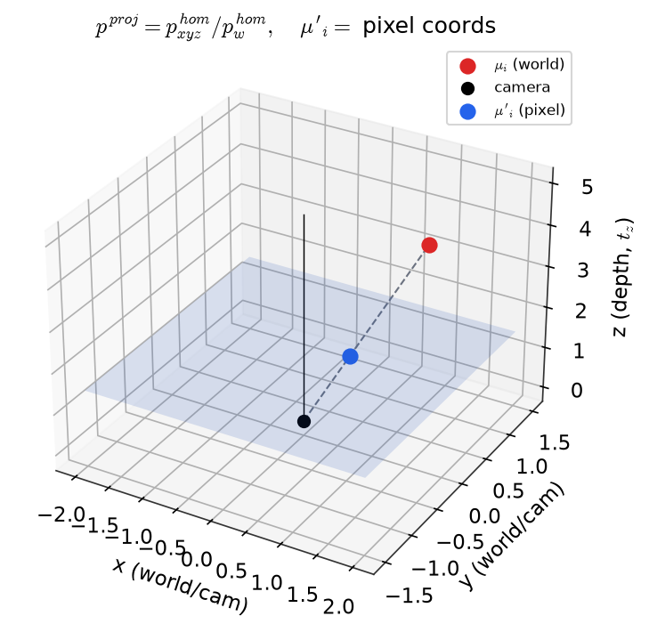
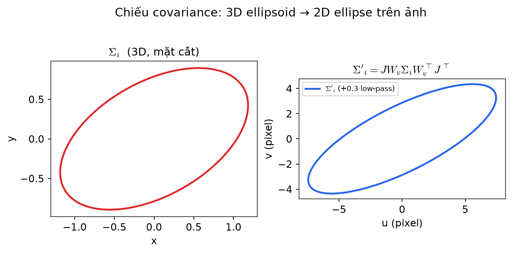
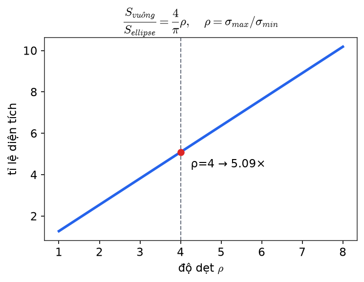
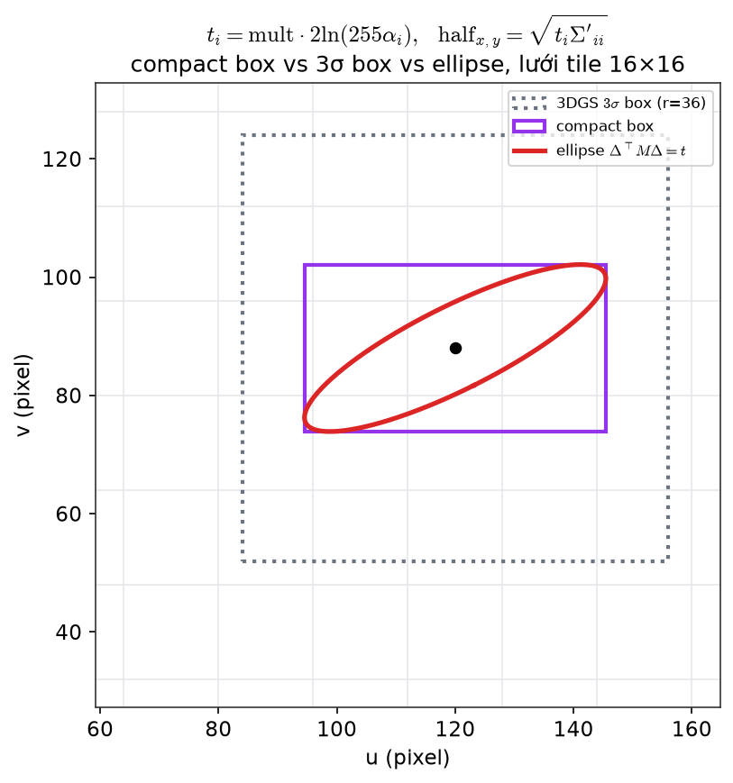
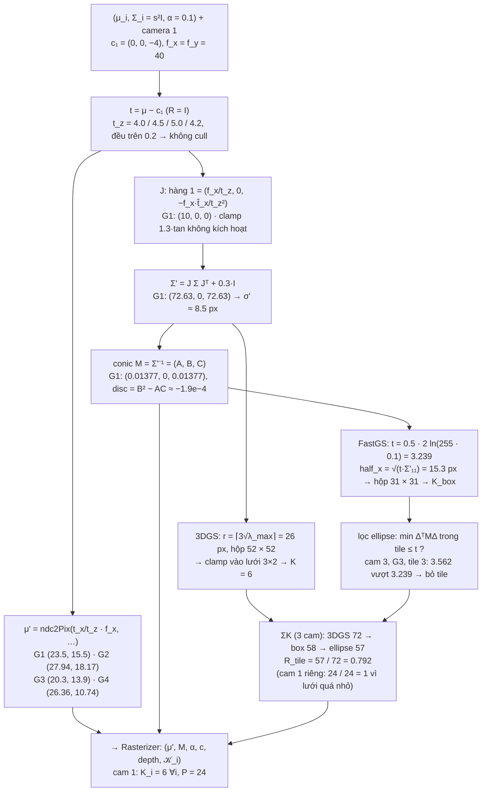

[← Mục lục](00-muc-luc.md) · Chương 8/15

# Chương 8 — Projection & Compact Box (đòn bẩy giảm K)

> Nguồn: `DOCS/Report/03-projection.md`, `DOCS/Report/test/03-test.md`, `DOCS/box.md`, `DOCS/box2.md`

## 8.1 Lý thuyết

# Chương 3 — Camera + Projection

> Khối **Projection** nhận 3D Gaussians và Camera, cho ra các splat 2D cùng tập tile mà mỗi splat chạm.
> Đây là **đòn bẩy 2 của FastGS-lite: giảm $K$** (số tile mỗi splat) bằng compact box và lọc tile theo ellipse.
> Code: `forward.cu` (`preprocessCUDA`, `computeCov2D`), `auxiliary.h:159-321` (`computeEllipseIntersection`, `processTiles`, `duplicateToTilesTouched`).
> Bài tập số đầy đủ: [`box.md`](../box.md); ba công thức đếm tile: [`box2.md`](../box2.md).

## 3.1 — Đầu vào từ Camera

$$
W_v\in\mathbb R^{4\times4}\ (\text{world}\to\text{camera}),\qquad
f_x=\frac{W}{2\tan(\text{fov}_x/2)},\qquad f_y=\frac{H}{2\tan(\text{fov}_y/2)}
$$

Ma trận chiếu (`utils/graphics_utils.py:51-71`), $z_n=0.01$, $z_f=100$:

$$
P=\begin{pmatrix}
\frac{1}{\tan(\text{fov}_x/2)}&0&0&0\\
0&\frac{1}{\tan(\text{fov}_y/2)}&0&0\\
0&0&\frac{z_f}{z_f-z_n}&\frac{-z_fz_n}{z_f-z_n}\\
0&0&1&0\end{pmatrix},
\qquad P_{\text{full}}=W_v\cdot P
$$

`--resolution` tác động vào đây: đổi $W,H$ → đổi $f_x,f_y$ → đổi $J$ → đổi $\Sigma'$ → đổi $K$.

## 3.2 — Bước 0: cull theo frustum

$$
t_i=W_v\begin{pmatrix}\mu_i\\1\end{pmatrix}=(t_x,t_y,t_z),\qquad
\text{loại nếu } t_z\le0.2
$$

Không chỉ để tiết kiệm: $J$ chứa $1/t_z$ và $1/t_z^2$, và khoá sort ở chương 4 `bit_cast` float→uint32 chỉ giữ đúng thứ tự khi depth **dương**. Cull là điều kiện đúng đắn.

## 3.3 — Bước 1: chiếu tâm

$$
p^{\text{hom}}=P_{\text{full}}\begin{pmatrix}\mu_i\\1\end{pmatrix},\qquad
p^{\text{proj}}=\frac{p^{\text{hom}}_{xyz}}{p^{\text{hom}}_w+10^{-7}}
$$

$$
\mu'_i=\Bigl(\tfrac{(p^{\text{proj}}_x+1)W-1}{2},\ \tfrac{(p^{\text{proj}}_y+1)H-1}{2}\Bigr)\quad[\text{pixel}]
$$



*Trục x, y, z là toạ độ camera/world (z là chiều sâu $t_z$). Camera tại gốc toạ độ; điểm đỏ $\mu_i$ là tâm Gaussian 3D; mặt phẳng xanh là "mặt phẳng ảnh"; điểm xanh $\mu'_i$ là giao điểm tia chiếu với mặt phẳng đó — sau quy đổi pixel chính là tâm splat 2D.*

## 3.4 — Bước 2: chiếu covariance (EWA splatting)

**Clamp trước khi tuyến tính hoá** — chi tiết không có trong paper:

$$
\hat t_x=\operatorname{clip}\Bigl(\frac{t_x}{t_z},\ \pm1.3\tan\tfrac{\text{fov}_x}{2}\Bigr)\cdot t_z,\qquad \hat t_y\ \text{tương tự}
$$

Jacobian của phép chiếu phối cảnh, tuyến tính hoá tại tâm Gaussian:

$$
J=\begin{pmatrix}
\dfrac{f_x}{t_z}&0&-\dfrac{f_x\hat t_x}{t_z^2}\\[8pt]
0&\dfrac{f_y}{t_z}&-\dfrac{f_y\hat t_y}{t_z^2}\\[6pt]
0&0&0\end{pmatrix}
$$

$$
\Sigma'_{3\times3}=J\,W_v\,\Sigma_i\,W_v^\top J^\top
\quad\xrightarrow{\ \text{khối }2\times2\ }\quad
\boxed{\ \Sigma'_i=\begin{pmatrix}\Sigma'_{11}+0.3&\Sigma'_{12}\\ \Sigma'_{12}&\Sigma'_{22}+0.3\end{pmatrix}\ }
$$



*Trái: mặt cắt ellipse của $\Sigma_i$ 3D, trục x/y world space. Phải: ellipse $\Sigma'_i$ sau khi chiếu 2D, trục u/v pixel — đã "phồng" thêm bởi low-pass $0.3I$ nên không bao giờ suy biến thành đường thẳng dù nhìn nghiêng.*

Hằng $0.3$ là **low-pass filter**: ép mọi splat rộng ít nhất ~1 pixel, tránh aliasing và gradient bằng 0 cho Gaussian nhỏ hơn pixel. Hệ quả toán học: $\det\Sigma'\ge0.09>0$, phép nghịch đảo ở bước sau luôn hợp lệ.

**Vì sao phải chiếu xuống 2D:** khoảng cách Mahalanobis trong 3D không tương đương tuyến tính với khoảng cách trên ảnh (foreshortening theo góc nhìn, phối cảnh theo khoảng cách). Chiếu một lần mỗi Gaussian mỗi khung hình rồi rasterize rẻ hơn nhiều so với ray-cast từng pixel.

## 3.5 — Bước 3: conic

$$
\det=\Sigma'_{11}\Sigma'_{22}-\Sigma'^2_{12},\qquad
M_i=\Sigma_i'^{-1}=\frac1{\det}\begin{pmatrix}\Sigma'_{22}&-\Sigma'_{12}\\-\Sigma'_{12}&\Sigma'_{11}\end{pmatrix}
=\begin{pmatrix}A&B\\B&C\end{pmatrix}
$$

Kernel đóng gói $(A,B,C,\alpha_i)$ vào một `float4` `con_o`. $\Sigma'$ không được lưu. Kiểm tra rẻ nhất: $\text{disc}=B^2-AC=-1/\det\Sigma'<0$.

## 3.6 — Bước 4: bounding box — **FastGS thay đổi ở đây**

### 3DGS gốc: hộp vuông $3\sigma$

$$
\lambda_{\max,\min}=\frac{\Sigma'_{11}+\Sigma'_{22}}{2}\pm\sqrt{\Bigl(\frac{\Sigma'_{11}-\Sigma'_{22}}{2}\Bigr)^2+\Sigma'^2_{12}},
\qquad r_i=\bigl\lceil3\sqrt{\lambda_{\max}}\bigr\rceil
$$

$$
\text{rect}_{\min}=\Bigl\lfloor\frac{\mu'-r}{16}\Bigr\rfloor,\quad
\text{rect}_{\max}=\Bigl\lfloor\frac{\mu'+r+15}{16}\Bigr\rfloor,\quad
K^{\text{3dgs}}_i=(\text{rect}_{\max}-\text{rect}_{\min})_x\cdot(\text{rect}_{\max}-\text{rect}_{\min})_y
$$

Với splat dẹt tỉ lệ trục $\rho=\sigma_{\max}/\sigma_{\min}$, hộp vuông lãng phí so với ellipse $3\sigma$:

$$
\frac{S_{\text{vuông}}}{S_{\text{ellipse}}}=\frac{36\sigma_{\max}^2}{9\pi\sigma_{\max}\sigma_{\min}}=\frac4\pi\rho
$$



*Trục x là độ dẹt $\rho=\sigma_{max}/\sigma_{min}$, trục y là tỉ lệ diện tích. Đường thẳng tăng tuyến tính: Gaussian càng dẹt (bề mặt nhìn nghiêng) thì phần diện tích thừa mà hộp vuông phải rasterize so với ellipse thật càng lớn.*

($\rho=4$ → lãng phí $5.09\times$.) Hộp $3\sigma$ cũng **không nhìn đến opacity**: splat mờ trả giá như splat đục.

### FastGS-lite: compact box theo tiêu chí "còn nhìn thấy ở 8-bit"

Pixel chỉ đáng rasterize nếu đóng góp $\ge$ một bước lượng tử 8-bit:

$$
\alpha_i\,e^{-\frac12\Delta^\top M_i\Delta}\ \ge\ \frac1{255}
\iff
\Delta^\top M_i\Delta\ \le\ 2\ln(255\,\alpha_i)
$$

Code nhân thêm `mult` vào ngưỡng (`auxiliary.h:312-314`):

$$
\boxed{\ t_i=\texttt{mult}\cdot2\ln(255\,\alpha_i)\ },\qquad\texttt{mult}=0.5
$$

Hộp bao **theo từng trục** của ellipse $\Delta^\top M\Delta=t$:

$$
\boxed{\ \text{half}_{x,i}=\sqrt{t_i\,\Sigma'_{11}},\qquad \text{half}_{y,i}=\sqrt{t_i\,\Sigma'_{22}}\ }
$$

$$
\text{Box}_i=[\mu'_x-\text{half}_x,\ \mu'_x+\text{half}_x]\times[\mu'_y-\text{half}_y,\ \mu'_y+\text{half}_y]
$$



*Trục u, v là pixel, lưới mảnh là biên tile 16×16. Hình vuông nét chấm xám là hộp $3\sigma$ của 3DGS gốc (không phụ thuộc $\alpha$); hình chữ nhật tím là compact box của FastGS (co theo $\alpha$ và mult); đường cong đỏ là biên ellipse thật $\Delta^\top M\Delta=t$. Hộp vuông lãng phí diện tích nhiều hơn hẳn so với ellipse thật, nhất là khi ellipse dẹt.*

Ba khác biệt bản chất:

| | 3DGS | FastGS |
|---|---|---|
| Hình dạng | vuông, cạnh $2r$ | chữ nhật $2\text{half}_x\times2\text{half}_y$ — hệ số $\tfrac4\pi\rho$ biến mất |
| Phụ thuộc $\alpha_i$ | không | có — splat mờ → $t$ nhỏ → hộp nhỏ |
| `mult` | — | nhân vào $t$ (dưới căn): **diện tích** co theo `mult`, **cạnh** co theo $\sqrt{\texttt{mult}}$ |

Bảng $t$ theo cấu hình (từ `box.md` câu 3):

| `mult` | $\alpha$ | $t$ | bán kính hiệu dụng $\sqrt t\,\sigma'$ |
|---|---|---|---|
| 1.0 | 1.0 | 11.08 | $3.33\sigma'$ |
| 0.5 | 1.0 | 5.54 | $2.35\sigma'$ |
| 0.5 | 0.1 | 3.24 | $1.80\sigma'$ |
| 0.5 | 0.02 | 1.63 | $1.28\sigma'$ |

Lưu ý: `mult = 1.0` **không** đưa về 3DGS gốc mà về SnugBox của Speedy-Splat ($\text{half}_x=3.33\sigma$ vẫn rộng hơn $3\sigma$). `getRect` đã bị xoá khỏi `auxiliary.h`; `my_radius` chỉ còn ghi vào `radii[]` cho ngưỡng prune 20 px.

## 3.7 — Bước 5: lọc tile theo ellipse (AccuTile)

3DGS lấy mọi tile giao hộp. FastGS chỉ lấy tile thực sự giao **ellipse**:

$$
\boxed{\ T\in\mathcal K_i\iff T\subset\text{Box}_i\ \wedge\ \min_{\Delta\in T}\Delta^\top M_i\Delta\le t_i\ }
$$

`processTiles` thực hiện bằng cách quét theo trục có span ngắn hơn (`isY = y_span < x_span`), mỗi lát giải giao ellipse–đường thẳng:

$$
v_\pm(u)=\frac{-B\,h\pm\sqrt{\text{disc}\cdot h^2+t\,k}}{k}+\mu'_v,\qquad h=u-\mu'_u,\quad k=\begin{cases}C&\text{cắt theo }x\\A&\text{cắt theo }y\end{cases}
$$

Với mỗi lát: nếu tiếp điểm cực trị ($x_{\text{term}}=-\tfrac BA\,\text{half}_y$, $y_{\text{term}}=-\tfrac BC\,\text{half}_x$) rơi vào trong lát thì lấy thẳng biên hộp, nếu không thì lấy $\min/\max$ tại hai biên lát; làm tròn **ra ngoài** tới biên tile.

Tỉ lệ diện tích ellipse / hộp bao (hiệu chỉnh cho ellipse nghiêng, `box.md` câu 9):

$$
\frac{S_{\text{ellipse}}}{S_{\text{box}}}=\frac{\pi t\sqrt{\det\Sigma'}}{4t\sqrt{\Sigma'_{11}\Sigma'_{22}}}=\frac\pi4\sqrt{1-\rho_{xy}^2},
\qquad\rho_{xy}=\frac{\Sigma'_{12}}{\sqrt{\Sigma'_{11}\Sigma'_{22}}}
$$

## 3.8 — Ví dụ số (từ `box.md`)

$\Sigma'=\begin{pmatrix}117&54\\54&36\end{pmatrix}$, $\mu'=(120,88)$, $\alpha=1$, `mult` $=0.5$:

| Bước | Kết quả |
|---|---|
| $\lambda_{\max},\lambda_{\min}$ | $144,\ 9$ → $\rho=4$ |
| $M=(A,B,C)$ | $(1/36,\ -1/24,\ 13/144)$ |
| $t$ | $\ln255=5.541$ |
| $\text{half}_x,\text{half}_y$ | $25.46,\ 14.12$ px |
| $K^{\text{3dgs}}$ (hộp vuông $r=36$) | $5\times5=\mathbf{25}$ |
| $K^{\text{box}}$ (chỉ compact box) | $5\times3=\mathbf{15}$ |
| $K^{\text{fastgs}}$ (sau lọc ellipse) | $3+3+3=\mathbf 9$ |
| $R_{\text{tile}}=K^{\text{fastgs}}/K^{\text{3dgs}}$ | $\mathbf{0.360}$ |

Chuỗi $25\to15\to9$: hộp theo trục $-40\%$, lọc ellipse $-40\%$ nữa. Tiệm cận diện tích cho $0.121$ nhưng đo được $0.360$ — chênh lệch do **lượng tử hoá lưới tile** (số hạng "+1" không co theo splat). Kernel trả tiền theo tile, nên $0.360$ mới là số đi vào mô hình chi phí.

## 3.9 — Bước 6: màu từ SH

Chỉ đánh giá khi $K_i>0$ (nếu không chạm tile nào thì `return` trước bước này). Công thức ở chương 2.4.

## 3.10 — Đầu ra của khối

$$
\bigl(\mu'_i,\ M_i,\ \alpha_i,\ c_i,\ \text{depth}_i=t_z,\ \mathcal K_i\bigr)_{i:\ K_i>0}
$$

đi vào **Differentiable Tile Rasterizer** (chương 4). $P=\sum_iK_i$ là kích thước của mọi buffer phía sau — compact box tiết kiệm cả VRAM, không chỉ thời gian.

## 8.2 Kiểm định số — Chương 3, Projection

# Chương 3 — Test số: Camera + Projection trên cảnh đồ chơi

> Cảnh: [`00-scene.md`](00-scene.md). Script sinh số: [`scripts/ch03_test.py`](scripts/ch03_test.py) (chỉ numpy).
> Mọi số dưới đây là **output thật** của script (làm tròn 4 chữ số có nghĩa; script giữ full precision).
> Logic chép từ `forward.cu:79-118` (`computeCov2D`), `forward.cu:195-269` (`preprocessCUDA`),
> `auxiliary.h:45-48` (`ndc2Pix`), `:131-156` (`in_frustum`), `:159-174` (`computeEllipseIntersection`),
> `:177-291` (`processTiles`), `:294-362` (`duplicateToTilesTouched`), `utils/graphics_utils.py:51-71`, `scene/cameras.py:54-56`.
> `getRect` của 3DGS gốc (đã bị xoá khỏi `auxiliary.h` FastGS) được chép lại trong script để so sánh $K^{\text{3dgs}}$.

## Sơ đồ khối với số của cảnh đồ chơi (camera 1)



## Đầu vào của khối (tính lại chương 1, không chờ bot khác)

$\mu_i=p_i$, $s_i=\sqrt{\tfrac13\sum_{j\in\text{3-NN}}\lVert p_i-p_j\rVert^2}$, $q=(1,0,0,0)\Rightarrow R=I$, $\Sigma_i=s_i^2I_3$, $\alpha_i=0.1$, $c_i=c_k$ (SH bậc 0: $C_0k_{00}+0.5=c_k$).

| $i$ | $\mu_i$ | $d^2$ tới 3 láng giềng | $s_i^2=\text{mean}$ | $s_i$ |
|---|---|---|---|---|
| 1 | $(0,0,0)$ | $0.38,\ 0.59,\ 1.20$ | $0.7233$ | $0.8505$ |
| 2 | $(0.5,0.3,0.5)$ | $0.59,\ 0.77,\ 1.31$ | $0.8900$ | $0.9434$ |
| 3 | $(-0.4,-0.2,1.0)$ | $1.20,\ 1.22,\ 1.31$ | $1.2433$ | $1.1150$ |
| 4 | $(0.3,-0.5,0.2)$ | $0.38,\ 0.77,\ 1.22$ | $0.7900$ | $0.8888$ |

Vì $N_0=4$, 3-NN của mỗi điểm là 3 điểm còn lại nên $s_i^2$ chỉ là trung bình 3 khoảng cách bình phương.

## 3.1 — Đầu vào từ camera

**Công thức.** $f_x=W/(2\tan\tfrac{\text{fov}_x}2)$, $f_y=H/(2\tan\tfrac{\text{fov}_y}2)$; $P$ theo `getProjectionMatrix` với $z_n=0.01$, $z_f=100$.

**Thay số.** $f_x=48/(2\cdot0.6)=40$, $f_y=32/(2\cdot0.4)=40$. $\text{fov}_x=2\arctan0.6=1.0808$ rad, $\text{fov}_y=2\arctan0.4=0.7610$ rad (script gọi lại `tan(fov/2)` → $0.6,\ 0.4$ chính xác).

$$
P=\begin{pmatrix}1/0.6&0&0&0\\0&1/0.4&0&0\\0&0&\frac{100}{99.99}&\frac{-1}{99.99}\\0&0&1&0\end{pmatrix}
=\begin{pmatrix}1.6667&0&0&0\\0&2.5&0&0\\0&0&1.0001&-0.010001\\0&0&1&0\end{pmatrix}
$$

**Quy ước chiều nhân (đối chiếu code).** `scene/cameras.py:54-56` lưu `world_view_transform` $=W_v^\top$, `projection_matrix` $=P^\top$ và `full_proj_transform` $=W_v^\top P^\top=(PW_v)^\top$. Kernel (`transformPoint4x4`: `m[0]x+m[4]y+m[8]z+m[12]`) nhân **vector hàng**: $p^{\text{hom}}=[\mu,1]\cdot P_{\text{full}}$. Do đó $P_{\text{full}}=W_v\cdot P$ trong chương 3 phải hiểu là tích của hai ma trận **đã chuyển vị**; về mặt cột nó chính là $P\,W_v$. Script kiểm tra `np.allclose(full, (P @ W_v).T)` → `True`.

$W_v$ (quy ước cột, $R=I$, $t=\mu-c_v$):

| $v$ | $c_v$ | $W_v$ (3 hàng đầu; hàng 4 $=(0,0,0,1)$) | `world_view_transform` $=W_v^\top$ |
|---|---|---|---|
| 1 | $(0,0,-4)$ | $[\,I_3 \mid (0,0,4)^\top\,]$ | hàng 4 $=(0,0,4,1)$ |
| 2 | $(1.5,0,-4)$ | $[\,I_3 \mid (-1.5,0,4)^\top\,]$ | hàng 4 $=(-1.5,0,4,1)$ |
| 3 | $(-1.5,0.5,-4)$ | $[\,I_3 \mid (1.5,-0.5,4)^\top\,]$ | hàng 4 $=(1.5,-0.5,4,1)$ |

`full_proj_transform` camera 1 (đầy đủ):

$$
P_{\text{full}}^{(1)}=W_1^\top P^\top=\begin{pmatrix}
1.6667&0&0&0\\
0&2.5&0&0\\
0&0&1.0001&1\\
0&0&3.9904&4\end{pmatrix}
$$

($3.9904=4\cdot1.0001-0.010001$.) Camera 2, 3 chỉ khác **hàng 4**: cam 2 $=(-2.5,\ 0,\ 3.9904,\ 4)$, cam 3 $=(2.5,\ -1.25,\ 3.9904,\ 4)$; khối $3\times3$ trên-trái và cột 4 $=(0,0,1,4)^\top$ giống hệt camera 1.

## 3.2 — Cull theo frustum

**Công thức.** $t_i=[\mu_i,1]\cdot W_v^\top=\mu_i-c_v$; loại nếu $t_z\le0.2$.

| $i$ | cam 1 | cam 2 | cam 3 |
|---|---|---|---|
| 1 | $(0,\ 0,\ 4.0)$ | $(-1.5,\ 0,\ 4.0)$ | $(1.5,\ -0.5,\ 4.0)$ |
| 2 | $(0.5,\ 0.3,\ 4.5)$ | $(-1.0,\ 0.3,\ 4.5)$ | $(2.0,\ -0.2,\ 4.5)$ |
| 3 | $(-0.4,\ -0.2,\ 5.0)$ | $(-1.9,\ -0.2,\ 5.0)$ | $(1.1,\ -0.7,\ 5.0)$ |
| 4 | $(0.3,\ -0.5,\ 4.2)$ | $(-1.2,\ -0.5,\ 4.2)$ | $(1.8,\ -1.0,\ 4.2)$ |

$t_z\in\{4.0,4.5,5.0,4.2\}>0.2$ ở cả 12 cặp → **không cặp nào bị cull**. Depth dương → khoá sort `bit_cast` float→uint32 ở chương 4 hợp lệ.

## 3.3 — Chiếu tâm

**Công thức.** $p^{\text{hom}}=[\mu,1]\cdot P_{\text{full}}$, $p^{\text{proj}}=p^{\text{hom}}_{xyz}/(p^{\text{hom}}_w+10^{-7})$, $\mu'=\bigl(\tfrac{(p^{\text{proj}}_x+1)48-1}2,\ \tfrac{(p^{\text{proj}}_y+1)32-1}2\bigr)$.

**Thay số (cam 1, $i=2$).** $p^{\text{hom}}=(1.6667\cdot0.5,\ 2.5\cdot0.3,\ 1.0001\cdot0.5+3.9904,\ 0.5+4)=(0.8333,\ 0.75,\ 4.4905,\ 4.5)$; $p^{\text{proj}}=(0.18519,\ 0.16667,\ 0.99788)$; $\mu'=\bigl(\tfrac{1.18519\cdot48-1}2,\ \tfrac{1.16667\cdot32-1}2\bigr)=(27.944,\ 18.167)$.

Nhận xét: vì $R=I$, $p^{\text{hom}}_w=t_z$ và $p^{\text{proj}}_x=t_x/(0.6\,t_z)$, tức $\mu'_x=f_x\,t_x/t_z+23.5$, $\mu'_y=f_y\,t_y/t_z+15.5$.

| $i$ | cam 1 $\mu'$ | cam 2 $\mu'$ | cam 3 $\mu'$ |
|---|---|---|---|
| 1 | $(23.500,\ 15.500)$ | $(8.500,\ 15.500)$ | $(38.500,\ 10.500)$ |
| 2 | $(27.944,\ 18.167)$ | $(14.611,\ 18.167)$ | $(41.278,\ 13.722)$ |
| 3 | $(20.300,\ 13.900)$ | $(8.300,\ 13.900)$ | $(32.300,\ 9.900)$ |
| 4 | $(26.357,\ 10.738)$ | $(12.071,\ 10.738)$ | $(40.643,\ 5.976)$ |

Tâm ảnh là $(23.5,15.5)$ (pixel index 0..47 / 0..31); $p^{\text{proj}}_z\approx0.998$ ở mọi điểm (không dùng tiếp).

## 3.4 — Chiếu covariance (camera 1, từng Gaussian)


*Hình: mặt phẳng ảnh 48×32 với lưới tile 16 px (T0..T5); tâm μ'_i và ellipse 1σ của Σ'_i cho cả 3 camera — nhìn thấy cả 4 Gaussian phủ gần kín ảnh ngay từ camera 1.*


**Công thức.** $\hat t_x=\operatorname{clip}(t_x/t_z,\pm1.3\cdot0.6=\pm0.78)\cdot t_z$, $\hat t_y=\operatorname{clip}(t_y/t_z,\pm1.3\cdot0.4=\pm0.52)\cdot t_z$;

$$J=\begin{pmatrix}f_x/t_z&0&-f_x\hat t_x/t_z^2\\0&f_y/t_z&-f_y\hat t_y/t_z^2\\0&0&0\end{pmatrix},\qquad
\Sigma'_{3\times3}=JW\Sigma W^\top J^\top,\qquad \Sigma'=\Sigma'_{[:2,:2]}+0.3I.$$

Với $W=I$, $\Sigma=s^2I$: $\Sigma'_{11}=s^2(f_x^2/t_z^2+f_x^2\hat t_x^2/t_z^4)$, $\Sigma'_{12}=s^2f_xf_y\hat t_x\hat t_y/t_z^4$, $\Sigma'_{22}$ tương tự. Phần tử ngoài chéo **chỉ** đến từ $-f\hat t/t_z^2$.

Đối chiếu code: `glm::mat3 W(vm[0],vm[4],vm[8],…)` (column-major) $=W_v^{3\times3}$; `T = W*J` với `J` glm cũng column-major nên `cov = Tᵀ Vrkᵀ T` $=JW\Sigma W^\top J^\top$ đúng như công thức.

Kiểm tra clamp (cam 1): $|t_x/t_z|\le0.1111<0.78$, $|t_y/t_z|\le0.1190<0.52$ → **clamp không kích hoạt** với Gaussian nào (cả 3 camera: lớn nhất là cam 3, $G_2$: $t_x/t_z=0.4444<0.78$).

| $i$ | $t_x/t_z$ | $t_y/t_z$ | $f/t_z$ | $-f\hat t_x/t_z^2$ | $-f\hat t_y/t_z^2$ |
|---|---|---|---|---|---|
| 1 | $0$ | $0$ | $10$ | $0$ | $0$ |
| 2 | $0.1111$ | $0.0667$ | $8.8889$ | $-0.9877$ | $-0.5926$ |
| 3 | $-0.08$ | $-0.04$ | $8$ | $+0.64$ | $+0.32$ |
| 4 | $0.0714$ | $-0.1190$ | $9.5238$ | $-0.6803$ | $+1.1338$ |

**Thay số ($i=2$).** $\Sigma'_{11}=0.89\,(8.8889^2+0.9877^2)=0.89\cdot(79.012+0.9755)=71.189$; $\Sigma'_{12}=0.89\cdot(-0.9877)(-0.5926)=0.5209$; $\Sigma'_{22}=0.89\,(79.012+0.3512)=70.634$. Cộng $0.3$:

Ma trận đối xứng $2\times2$ viết gọn thành bộ ba $(\Sigma'_{11},\ \Sigma'_{12},\ \Sigma'_{22})$:

| $i$ | trước low-pass | sau $+0.3$ trên đường chéo |
|---|---|---|
| 1 | $(72.3333,\ 0,\ 72.3333)$ | $(72.6333,\ 0,\ 72.6333)$ |
| 2 | $(71.1891,\ 0.5209,\ 70.6335)$ | $(71.4891,\ 0.5209,\ 70.9335)$ |
| 3 | $(80.0826,\ 0.2546,\ 79.7007)$ | $(80.3826,\ 0.2546,\ 80.0007)$ |
| 4 | $(72.0209,\ -0.6093,\ 72.6709)$ | $(72.3209,\ -0.6093,\ 72.9709)$ |

Dấu của $\Sigma'_{12}$ = dấu của $\hat t_x\hat t_y$: $G_2$ ($+,+$) và $G_3$ ($-,-$) dương, $G_4$ ($+,-$) âm. $\sigma'\approx8.5$–$9$ px trên ảnh $48\times32$: splat khởi tạo phủ gần hết ảnh — hệ quả của $s\approx0.85$–$1.1$ với $f/t_z\approx8$–$10$.

## 3.5 — Conic


*Hình: bên trái Gaussian 3D G1 (bán kính s=0.85 tại độ sâu t_z=4); bên phải σ'=f·s/t_z tăng khi Gaussian ở gần camera hơn — 4 điểm thật của cảnh đồ chơi nằm trên đúng đường lý thuyết.*


**Công thức.** $\det=\Sigma'_{11}\Sigma'_{22}-\Sigma'^2_{12}$; $(A,B,C)=(\Sigma'_{22},-\Sigma'_{12},\Sigma'_{11})/\det$; $\text{disc}=B^2-AC=-1/\det$.

**Thay số ($i=2$).** $\det=71.4891\cdot70.9335-0.5209^2=5070.706$; $A=70.9335/5070.706=0.013989$; $B=-0.5209/5070.706=-0.000103$; $C=71.4891/5070.706=0.014098$; $\text{disc}=-1.97\times10^{-4}$.

| $i$ | $\det$ | $A$ | $B$ | $C$ | disc $=B^2-AC$ | $-1/\det$ |
|---|---|---|---|---|---|---|
| 1 | $5275.601$ | $0.013768$ | $0$ | $0.013768$ | $-1.895\times10^{-4}$ | $-1.895\times10^{-4}$ |
| 2 | $5070.706$ | $0.013989$ | $-0.000103$ | $0.014098$ | $-1.972\times10^{-4}$ | $-1.972\times10^{-4}$ |
| 3 | $6430.596$ | $0.012441$ | $-0.000040$ | $0.012500$ | $-1.555\times10^{-4}$ | $-1.555\times10^{-4}$ |
| 4 | $5276.948$ | $0.013828$ | $+0.000115$ | $0.013705$ | $-1.895\times10^{-4}$ | $-1.895\times10^{-4}$ |

$\text{disc}<0$ và $A,C>0$ ở cả 4 → `duplicateToTilesTouched` không trả 0 sớm (`auxiliary.h:308`).

## 3.6 — Bounding box

### 3DGS gốc (hộp vuông $3\sigma$)

**Công thức.** $\lambda_{\max,\min}=\text{mid}\pm\sqrt{\text{mid}^2-\det}$, $\text{mid}=\tfrac{\Sigma'_{11}+\Sigma'_{22}}2$; $r=\lceil3\sqrt{\lambda_{\max}}\rceil$; $\text{rect}_{\min}=\min(\text{grid},\max(0,\lfloor(\mu'-r)/16\rfloor))$, $\text{rect}_{\max}=\min(\text{grid},\max(0,\lfloor(\mu'+r+15)/16\rfloor))$, grid $=(3,2)$.

Lưu ý code: `sqrt(max(0.1f, mid*mid - det))` (`forward.cu:239-240`) — với $G_1$ đẳng hướng, $\text{mid}^2-\det=0$ nên code dùng $0.1$: $\lambda_1^{\text{code}}=72.9496$ thay vì $72.6333$; $r=\lceil25.62\rceil=26$ không đổi so với giá trị chính xác $\lceil25.57\rceil=26$.

**Thay số ($i=2$).** $\text{mid}=71.2113$, $\sqrt{\text{mid}^2-\det}=\sqrt{5071.05-5070.71}=0.5903$ → $\lambda_{\max}=71.8017$, $\lambda_{\min}=70.6210$, $\rho=\sqrt{\lambda_{\max}/\lambda_{\min}}=1.0083$, $r=\lceil3\cdot8.4736\rceil=\lceil25.42\rceil=26$. $x$: $\lfloor(27.944-26)/16\rfloor=0$, $\lfloor(27.944+26+15)/16\rfloor=\lfloor4.31\rfloor=4\to$ clamp $3$; $y$: $\lfloor(18.167-26)/16\rfloor=-1\to0$, $\lfloor(18.167+41)/16\rfloor=3\to$ clamp $2$. $K^{\text{3dgs}}=3\cdot2=6$.

| $i$ | $\lambda_{\max}$ | $\lambda_{\min}$ | $\rho$ | $r$ | $\text{rect}_{\min}$ | $\text{rect}_{\max}$ | $K^{\text{3dgs}}$ |
|---|---|---|---|---|---|---|---|
| 1 | $72.6333$ | $72.6333$ | $1.0000$ | $26$ | $(0,0)$ | $(3,2)$ | $6$ |
| 2 | $71.8017$ | $70.6210$ | $1.0083$ | $26$ | $(0,0)$ | $(3,2)$ | $6$ |
| 3 | $80.5099$ | $79.8733$ | $1.0040$ | $27$ | $(0,0)$ | $(3,2)$ | $6$ |
| 4 | $73.3364$ | $71.9553$ | $1.0096$ | $26$ | $(0,0)$ | $(3,2)$ | $6$ |

Hộp vuông cạnh $2r\ge52$ px lớn hơn cả ảnh $48\times32$ → clamp lưới nuốt toàn bộ, mọi Gaussian chạm **cả 6 tile** ở cả 3 camera (script: $\sum K^{\text{3dgs}}=24$ mỗi camera).

### FastGS-lite: compact box


*Hình: hộp vuông 3DGS (vàng, nét đứt) ⊃ compact box FastGS (cam) ⊃ ellipse level-set thật (xanh) cho G1/camera 1; subplot thứ hai dùng ảnh giả định lớn hơn để thấy rõ compact box nhỏ hơn hộp vuông khi không bị lưới tile bé "nuốt" mất khác biệt.*


**Công thức.** $t_i=\texttt{mult}\cdot2\ln(255\alpha_i)$; $\text{half}_x=\sqrt{t\,\Sigma'_{11}}$, $\text{half}_y=\sqrt{t\,\Sigma'_{22}}$; Box $=\mu'\pm\text{half}$; $\text{rect}_{\min}=\max(0,\min(\text{grid},\lfloor\text{bbox}_{\min}/16\rfloor))$, $\text{rect}_{\max}=\max(0,\min(\text{grid},\lfloor\text{bbox}_{\max}/16\rfloor+1))$; $K^{\text{box}}=x_{\text{span}}\cdot y_{\text{span}}$.

**Thay số.** $t=0.5\cdot2\ln(25.5)=\ln25.5=3.2387$ (bảng chương 3: $3.24$ ✓). $i=2$: $\text{half}_x=\sqrt{3.2387\cdot71.4891}=15.216$, $\text{half}_y=\sqrt{3.2387\cdot70.9335}=15.157$; Box $x\in[12.728,43.161]$, $y\in[3.010,33.324]$; $\text{rect}_{\min}=(0,0)$, $\text{rect}_{\max}=(\min(3,2+1),\min(2,2+1))=(3,2)$ → $K^{\text{box}}=6$.

Code tính bbox qua $x_{\text{term}},y_{\text{term}}$ và `computeEllipseIntersection` (`auxiliary.h:316-331`); script kiểm tra kết quả **trùng** với $\mu'\pm\text{half}$ (ví dụ $i=2$: `bbox_min=(12.7283, 3.0098)`, `bbox_max=(43.1606, 33.3235)`). $x_{\text{term}}=-\tfrac BA\text{half}_y$: $i=2$: $0.1113$; $i=4$: $-0.1284$ (dấu theo $B$).

Camera 1:

| $i$ | $\text{half}_x$ | $\text{half}_y$ | Box $x$ | Box $y$ | $\text{rect}$ | $K^{\text{box}}$ |
|---|---|---|---|---|---|---|
| 1 | $15.337$ | $15.337$ | $[8.163,\ 38.837]$ | $[0.163,\ 30.837]$ | $(0,0)\to(3,2)$ | $6$ |
| 2 | $15.216$ | $15.157$ | $[12.728,\ 43.161]$ | $[3.010,\ 33.324]$ | $(0,0)\to(3,2)$ | $6$ |
| 3 | $16.135$ | $16.096$ | $[4.165,\ 36.435]$ | $[-2.197,\ 29.997]$ | $(0,0)\to(3,2)$ | $6$ |
| 4 | $15.304$ | $15.373$ | $[11.053,\ 41.662]$ | $[-4.635,\ 26.111]$ | $(0,0)\to(3,2)$ | $6$ |

Ở camera 1 hộp compact ($\approx30\times30$ px, nhỏ hơn hộp $3\sigma$ $52\times52$ tới $-67\%$ diện tích) vẫn chạm cả 6 tile vì tâm ở gần giữa ảnh và $\text{half}\approx15$–$16>$ nửa tile. Ở camera 2, 3 tâm lệch sang một cột tile nên box **chỉ chạm 2 cột** — xem 3.7.

## 3.7 — Lọc tile theo ellipse (AccuTile)

**Công thức.** $T\in\mathcal K_i\iff\min_{\Delta\in T}\Delta^\top M_i\Delta\le t_i$. Code (`processTiles`) quét theo trục có span ngắn hơn (`isY = y_span < x_span`), mỗi lát $[u_0,u_0+16)$:

$$v_\pm(u)=\frac{-Bh\pm\sqrt{\text{disc}\,h^2+t\,k}}{k}+\mu'_v,\qquad h=u-\mu'_u,\qquad k=\begin{cases}A&\text{isY (cắt } y=u\text{, ra }x)\\C&\text{cắt }x=u\text{, ra }y\end{cases}$$

$\text{ellipse}_{\min/\max}$ = biên hộp nếu điểm cực trị rơi vào lát, ngược lại $\min/\max$ tại hai biên lát; tile $v\in[\lfloor\text{ellipse}_{\min}/16\rfloor,\ \lfloor\text{ellipse}_{\max}/16\rfloor+1)$ kẹp vào rect.

Script cài **cả hai**: (a) `processTiles` chép nguyên văn, (b) kiểm tra chính xác $\min_{\Delta\in T}\Delta^\top M\Delta$ (hàm lồi trên hình chữ nhật: $=0$ nếu $\mu'\in T$, ngược lại min 1-D trên 4 cạnh với $\Delta^\ast=-B\Delta_v/A$ kẹp vào cạnh). **Hai cách cho cùng tập tile ở cả 12 cặp (cam, $i$).**

**Camera 1 ($x_{\text{span}}=3\gt y_{\text{span}}=2$ → isY, quét 2 lát ngang, $k=A$).** Thay số $i=2$, lát $u=0$: $[0,16)$. $\text{argmin}_y=18.056,\ \text{argmax}_y=18.278\notin[0,16)$ → dùng giao tại $y=0$ và $y=16$. Tại $y=16$: $h=16-18.167=-2.167$, $\sqrt{\text{disc}\,h^2+tA}=\sqrt{-1.972\times10^{-4}\cdot4.694+3.2387\cdot0.013989}=\sqrt{0.044384}=0.21068$; $x_\pm=\tfrac{0.000103\cdot(-2.167)\pm0.21068}{0.013989}+27.944=\{12.869,\ 42.988\}$. Đường $y=0$ **không** được giải: $\text{bbox}_{\min,y}=3.01>0=$ `min_line` nên code đặt `intersect_min_line = intersect_max_line` khởi tạo $=(\text{bbox}_{\max,x},\text{bbox}_{\min,x})=(43.16,12.73)$ (`auxiliary.h:214-226`; nếu giải thì $h=-18.167$, $\text{disc}\,h^2+tA=-0.0651+0.0453<0$, căn âm — đường không cắt ellipse). Vậy $\text{ellipse}_{\min}=\min(43.16,12.869)=12.869$, $\text{ellipse}_{\max}=\max(12.73,42.988)=42.988$ → cột $\lfloor0.804\rfloor=0$ đến $\lfloor2.687\rfloor+1=3$ → **3 tile**. Lát $u=1$: $[16,32)$ chứa argmin/argmax → lấy thẳng biên hộp $[12.728,43.161]$ → 3 tile. $K^{\text{fastgs}}_2=6$.

| $i$ | lát $u=0$: $[\text{ell}_{\min},\text{ell}_{\max}]$ → tile | lát $u=1$ | $\mathcal K_i$ (id $=t_y\cdot3+t_x$) | $K^{\text{fastgs}}$ | $\min_T\Delta^\top M\Delta$ (tile 0..5) |
|---|---|---|---|---|---|
| 1 | $[8.163,38.837]$ → 3 | $[8.171,38.829]$ → 3 | $\{0,1,2,3,4,5\}$ | $6$ | $0.774,\ 0,\ 0.995,\ 0.778,\ 0.003,\ 0.998$ |
| 2 | $[12.869,42.988]$ → 3 | $[12.728,43.161]$ → 3 | $\{0,1,2,3,4,5\}$ | $6$ | $2.057,\ 0.066,\ 0.298,\ 1.996,\ 0,\ 0.230$ |
| 3 | $[4.165,36.435]$ → 3 | $[4.310,36.304]$ → 3 | $\{0,1,2,3,4,5\}$ | $6$ | $0.230,\ 0,\ 1.703,\ 0.286,\ 0.055,\ 1.756$ |
| 4 | $[11.053,41.662]$ → 3 | $[11.934,40.693]$ → 3 | $\{0,1,2,3,4,5\}$ | $6$ | $1.483,\ 0,\ 0.440,\ 1.850,\ 0.379,\ 0.827$ |

Mọi $\min_T\le t=3.239$ → 6/6 tile giữ, khớp `processTiles`. Ở camera 1 lọc ellipse không bớt được tile nào (ellipse quá lớn so với ảnh).

**Camera 2, 3 (gọn).** Ở đây $\text{rect}$ chỉ còn 2 cột nên $x_{\text{span}}=y_{\text{span}}=2$ → `isY = False`, quét theo **lát dọc** ($k=C$).

| cam | $i$ | $\mu'$ | $\Sigma'_{11},\Sigma'_{12},\Sigma'_{22}$ | $(A,B,C)$ | $r$ | $K^{\text{3dgs}}$ | $\text{half}_x,\text{half}_y$ | $K^{\text{box}}$ | $\mathcal K_i$ | $K^{\text{fastgs}}$ |
|---|---|---|---|---|---|---|---|---|---|---|
| 2 | 1 | $(8.50,15.50)$ | $82.805,\ 0,\ 72.633$ | $(0.01208,\ 0,\ 0.01377)$ | 28 | 6 | $16.38,\ 15.34$ | 4 | $\{0,1,3,4\}$ | 4 |
| 2 | 2 | $(14.61,18.17)$ | $74.094,\ -1.042,\ 70.934$ | $(0.01350,\ 0.00020,\ 0.01410)$ | 26 | 6 | $15.49,\ 15.16$ | 4 | $\{0,1,3,4\}$ | 4 |
| 2 | 3 | $(8.30,13.90)$ | $91.364,\ 1.210,\ 80.001$ | $(0.01095,\ -0.00017,\ 0.01250)$ | 29 | 6 | $17.20,\ 16.10$ | 4 | $\{0,1,3,4\}$ | 4 |
| 2 | 4 | $(12.07,10.74)$ | $77.805,\ 2.437,\ 72.971$ | $(0.01287,\ -0.00043,\ 0.01372)$ | 27 | 6 | $15.87,\ 15.37$ | 4 | $\{0,1,3,4\}$ | 4 |
| 3 | 1 | $(38.50,10.50)$ | $82.805,\ -3.391,\ 73.764$ | $(0.01210,\ 0.00056,\ 0.01358)$ | 28 | 6 | $16.38,\ 15.46$ | 4 | $\{1,2,4,5\}$ | 4 |
| 3 | 2 | $(41.28,13.72)$ | $84.512,\ -1.389,\ 70.760$ | $(0.01184,\ 0.00023,\ 0.01414)$ | 28 | 6 | $16.54,\ 15.14$ | 4 | $\{1,2,4,5\}$ | 4 |
| 3 | 3 | $(32.30,9.90)$ | $83.725,\ -2.451,\ 81.433$ | $(0.01195,\ 0.00036,\ 0.01229)$ | 28 | 6 | $16.47,\ 16.24$ | 6 | $\{0,1,2,4,5\}$ | **5** |
| 3 | 4 | $(40.64,5.98)$ | $85.117,\ -7.312,\ 76.017$ | $(0.01185,\ 0.00114,\ 0.01326)$ | 29 | 6 | $16.60,\ 15.69$ | 4 | $\{1,2,4,5\}$ | 4 |

(Ở cam 2, $G_1$: Box $x\in[-7.876,24.876]$ → cột $0,1$; cam 3 $G_1$: Box $x\in[22.124,54.876]$ → cột $1,2$.)

**Trường hợp duy nhất lọc ellipse có tác dụng: cam 3, $G_3$.** Box $x\in[15.833,48.767]$, $y\in[-6.340,26.140]$ → rect $(0,0)\to(3,2)$, $K^{\text{box}}=6$, isY (quét ngang, $k=A=0.011950$, $t=3.2387$, $\text{disc}=-1.468\times10^{-4}$):

- lát $u=0$ $[0,16)$: chứa $\text{argmax}_y=9.418$ và $\text{argmin}_y=10.382$ → lấy biên hộp $[15.833,48.767]$ → cột $0..2$, 3 tile.
- lát $u=1$ $[16,32)$: giao tại $y=16$: $h=6.1$, $\sqrt{-1.468\times10^{-4}\cdot37.21+3.2387\cdot0.011950}=\sqrt{0.033241}=0.18232$, $x_\pm=\tfrac{-0.00036\cdot6.1\pm0.18232}{0.011950}+32.3=\{16.862,\ 47.371\}$; giao tại $y=32$ không được giải vì `max_line = 32 > bbox_max.y = 26.14` (`auxiliary.h:235`), nên `intersect_max_line` **giữ nguyên** giá trị giao tại $y=16$; `intersect_min_line` (chuyển từ lát trước, `:287`) cũng là giao tại $y=16$. Do đó $\text{ellipse}_{\min}=16.862$, $\text{ellipse}_{\max}=47.371$ → cột $\lfloor1.054\rfloor=1$ đến $\lfloor2.961\rfloor+1=3$ → **2 tile** (loại tile 3 = $(t_x{=}0,t_y{=}1)$).

Kiểm tra chính xác: $\min_{T_3}\Delta^\top M\Delta=3.562>3.239$ → loại ✓; tile 0: $3.173\le3.239$ → giữ (sát ngưỡng). $K^{\text{fastgs}}_3=5$.

**Tổng hợp.**

| | $\sum K^{\text{3dgs}}$ | $\sum K^{\text{box}}$ | $\sum K^{\text{fastgs}}$ | $R_{\text{tile}}=\sum K^{\text{fastgs}}/\sum K^{\text{3dgs}}$ |
|---|---|---|---|---|
| cam 1 | 24 | 24 | 24 | $\mathbf{1.000}$ |
| cam 2 | 24 | 16 | 16 | $\mathbf{0.667}$ |
| cam 3 | 24 | 18 | 17 | $\mathbf{0.708}$ |
| 3 camera | 72 | 58 | 57 | $\mathbf{0.792}$ |

Nhận xét: trên cảnh đồ chơi, toàn bộ lợi ích đến từ **compact box** (72→58) chứ gần như không từ lọc ellipse (58→57), vì $\rho\approx1$ (Gaussian đẳng hướng, $R=I$, $\Sigma'_{12}$ nhỏ) — ellipse gần tròn thì hộp theo trục đã sát. Lọc ellipse chỉ có lợi khi $\rho\gg1$ như ví dụ 3.8. Camera 1 cho $R_{\text{tile}}=1$ vì ảnh chỉ có 6 tile và splat $\sigma'\approx8.5$ px phủ toàn ảnh — đây là giới hạn lượng tử hoá lưới (số hạng "+1") ở dạng cực đoan.

## 3.8 — Kiểm chứng ví dụ `box.md` bằng cùng code


*Hình: cùng code cho ra đúng chuỗi 25 (hộp vuông) → 15 (compact box) → 9 (sau lọc ellipse) tile, R_tile = 9/25 = 0.36.*


*Hình: t giảm khi α nhỏ (splat mờ → hộp nhỏ); đánh dấu 3 điểm dùng trong báo cáo (α=0.1 → t=3.24, α=1 → t=5.54, α=0.02 → t=1.63) và mult=0.5 vs 1.0.*


Đầu vào: $\Sigma'_{11}=117,~\Sigma'_{12}=54,~\Sigma'_{22}=36$, $\mu'=(120,88)$, $\alpha=1$, `mult` $=0.5$, lưới $20\times20$ tile (đủ lớn, không clamp). Output script:

| Bước | Script | Kỳ vọng (§3.8) | Khớp |
|---|---|---|---|
| $\det$ | $1296$ | | |
| $(A,B,C)$ | $(0.027778,-0.041667,0.090278)$ | $(1/36,-1/24,13/144)$ | ✓ (`allclose`) |
| $\lambda_{\max},\lambda_{\min},\rho$ | $144,\ 9,\ 4$ | $144,\ 9,\ 4$ | ✓ |
| $t$ | $5.5413$ | $5.541$ | ✓ |
| $\text{half}_x,\text{half}_y$ | $25.462,\ 14.124$ | $25.46,\ 14.12$ | ✓ |
| $r$, rect 3DGS | $36$, $(5,3)\to(10,8)$ | | |
| $K^{\text{3dgs}}$ | $25$ | $25$ | ✓ |
| bbox | $[94.538,145.462]\times[73.876,102.124]$, rect $(5,4)\to(10,7)$ | | |
| $K^{\text{box}}$ | $15$ | $15$ | ✓ |
| isY; lát $u=4,5,6$ | $[94.54,119.64]$→3, $[96.36,143.64]$→3, $[120.36,145.46]$→3 | $3+3+3$ | ✓ |
| $K^{\text{fastgs}}$ | $9$ | $9$ | ✓ |
| $R_{\text{tile}}$ | $0.360$ | $0.360$ | ✓ |

Tập tile `processTiles` $=\{85,86,87,106,107,108,127,128,129\}$ (id $=t_y\cdot20+t_x$: hàng 4 cột 5–7, hàng 5 cột 6–8, hàng 6 cột 7–9) **trùng** với tập tile theo kiểm tra chính xác $\min_T\Delta^\top M\Delta\le t$. Không có chênh lệch nào so với §3.8 / `box.md`.

## 3.9 — Màu từ SH

$K_i>0$ ở cả 12 cặp → bước SH được thực hiện. Chỉ có bậc 0 nên $c_i=C_0k_{i,00}+0.5=c_k$ (không phụ thuộc hướng nhìn): $c_1=(0.8,0.2,0.2)$, $c_2=(0.2,0.7,0.3)$, $c_3=(0.1,0.3,0.9)$, $c_4=(0.5,0.5,0.5)$.

## 3.10 — Đầu ra của khối (camera 1, đi vào chương 4)


*Hình: số tile ΣK giảm dần qua 3 bước lọc (3DGS → compact box → ellipse) cho từng camera; R_tile tổng trên 3 camera = 57/72 = 0.792, cao hơn ví dụ box.md vì lưới 3×2 tile của cảnh đồ chơi quá nhỏ so với splat.*


| $i$ | $\mu'_i$ (px) | $A$ | $B$ | $C$ | $\alpha_i$ | $c_i$ | depth $=t_z$ | $\mathcal K_i$ (id $=t_y\cdot3+t_x$) | $K_i$ |
|---|---|---|---|---|---|---|---|---|---|
| 1 | $(23.5000,\ 15.5000)$ | $0.013768$ | $0$ | $0.013768$ | $0.1$ | $(0.8,0.2,0.2)$ | $4.0$ | $\{0,1,2,3,4,5\}$ | 6 |
| 2 | $(27.9444,\ 18.1667)$ | $0.013989$ | $-0.000103$ | $0.014098$ | $0.1$ | $(0.2,0.7,0.3)$ | $4.5$ | $\{0,1,2,3,4,5\}$ | 6 |
| 3 | $(20.3000,\ 13.9000)$ | $0.012441$ | $-0.000040$ | $0.012500$ | $0.1$ | $(0.1,0.3,0.9)$ | $5.0$ | $\{0,1,2,3,4,5\}$ | 6 |
| 4 | $(26.3571,\ 10.7381)$ | $0.013828$ | $+0.000115$ | $0.013705$ | $0.1$ | $(0.5,0.5,0.5)$ | $4.2$ | $\{0,1,2,3,4,5\}$ | 6 |

$$P=\sum_iK_i=\mathbf{24}\qquad(\text{camera 1; camera 2: }16,\ \text{camera 3: }17)$$

Thứ tự depth tăng dần (dùng cho sort chương 4): $G_1\ (4.0)\lt G_4\ (4.2)\lt G_2\ (4.5)\lt G_3\ (5.0)$ — giống nhau ở cả 3 camera vì các camera chỉ tịnh tiến theo $x,y$.
Cũng lưu vào `radii[]` cho ngưỡng prune: $r=(26,26,27,26)$ px (cam 1).

## 8.3 Bài tập: đếm tile cho compact box (box.md)

# Phần IV — Bài tập end-to-end: compact box và số tile chạm

> Bài tập tự luyện cho §4.1–§4.5 của [`fastgs-acceleration-method.md`](fastgs-acceleration-method.md).
> Cấu trúc: **Đề bài → Câu hỏi → Bảng công thức → Đáp án chi tiết**.
> Toàn bộ số liệu được thiết kế để tính tay được (eigenvalue chẵn, tâm splat nằm giữa tile).
> Khuyến nghị: làm hết phần câu hỏi rồi mới cuộn xuống đáp án.

---

## ĐỀ BÀI

Một Gaussian $G$ đã được chiếu xuống mặt phẳng ảnh của một camera. Cho:

### A. Covariance 2D đã chiếu (kết quả của công thức (5), §1.2)

$$\Sigma'=\begin{pmatrix}117 & 54\\[2pt] 54 & 36\end{pmatrix}\quad[\text{px}^2]$$

### B. Các đại lượng khác

| Đại lượng | Ký hiệu | Giá trị |
|---|---|---|
| Tâm splat trên ảnh | $p=(p_x,p_y)$ | $(120.0,\ 88.0)$ px |
| Opacity (sau sigmoid) | $o$ | $1.0$ |
| Hệ số compact box | `mult` | $0.5$ (mặc định, `arguments/__init__.py:96`) |
| Kích thước tile | $B_U=B_V$ | $16$ px |
| Kích thước ảnh | | đủ lớn, **bỏ qua clamp biên** |

### C. Quy ước đánh số tile

Tile $(\text{col},\text{row})$ phủ vùng $x\in[16\,\text{col},\,16(\text{col}+1))$, $y\in[16\,\text{row},\,16(\text{row}+1))$.
Ví dụ tâm splat $(120,88)$ nằm trong tile $(7,5)$ vì $120/16=7.5$ và $88/16=5.5$.

---

## CÂU HỎI

### Câu 1 — Hình học của splat (§4.1)

a) Tính $\det\Sigma'$, $\text{mid}=\tfrac12\text{tr}\,\Sigma'$, rồi $\lambda_{\max},\lambda_{\min}$ theo `forward.cu:239-240`.

b) Suy ra $\sigma_{\max},\sigma_{\min}$ và tỉ lệ trục $\rho=\sigma_{\max}/\sigma_{\min}$.

c) Theo §4.1, hộp vuông của 3DGS lãng phí bao nhiêu lần so với ellipse $3\sigma$? Kiểm tra công thức bằng phép thử $\rho=1$.

### Câu 2 — Conic (§4.2)

Tính $M=\Sigma'^{-1}$, tức bộ ba $(A,B,C)=$ `con_o.x, con_o.y, con_o.z`.

Sau đó kiểm tra hai điều:
- $\text{disc}=B^2-AC$ có thoả $\text{disc}<0$ không (điều kiện không suy biến, `auxiliary.h:305`)?
- Chứng minh quan hệ $\text{disc}=-1/\det\Sigma'$ và xác nhận bằng số.

### Câu 3 — Ngưỡng level-set $t$ (§4.2–§4.3)

a) Tính $t=\texttt{mult}\cdot 2\ln(255\,o)$ cho cấu hình đề bài.

b) Lập bảng $t$ cho các trường hợp: $(\texttt{mult},o)\in\{(1.0,\,1.0),\ (0.5,\,1.0),\ (0.5,\,0.1),\ (0.5,\,0.02)\}$.

c) Giải thích tại sao `mult` $=0.5$ làm **diện tích** hộp giảm 50% chứ không phải 75%.

### Câu 4 — Bounding box của compact box (§4.2)

a) Tính nửa cạnh $\text{half}_x=\sqrt{t\,\Sigma'_{11}}$ và $\text{half}_y=\sqrt{t\,\Sigma'_{22}}$.

b) Suy ra $\text{bbox}_{\min}$, $\text{bbox}_{\max}$ theo pixel.

c) Hộp này chạm những cột tile nào, hàng tile nào? Tổng cộng bao nhiêu tile nếu **chỉ dùng hộp** (chưa lọc ellipse)?

### Câu 5 — Điểm tiếp tuyến `x_term` / `y_term` (§4.2)

a) Tính $x_{\text{term}}$ và $y_{\text{term}}$ theo `auxiliary.h:316-319` (nhớ phép lật dấu theo $B$).

b) **Câu hỏi hiểu bản chất:** $x_{\text{term}}$ là toạ độ $x$ của điểm nào trên ellipse? Chứng minh bằng cách đạo hàm điều kiện cực trị, rồi đối chiếu số với kết quả câu 4a.

### Câu 6 — Giao ellipse với một đường thẳng (§4.2)

Dùng công thức nghiệm bậc 2 của `computeEllipseIntersection`:

$$v_\pm(u)=\frac{-B\,h\ \pm\ \sqrt{\text{disc}\cdot h^2+t\,k}}{k}+p_v,\qquad h=u-p_u$$

a) Cắt bằng đường **thẳng đứng** $x=128$ (biên giữa tile cột 7 và 8). Tính khoảng $y$ mà ellipse còn tồn tại. Khoảng đó chạm những hàng tile nào?

b) Trên đường $x=128$, giá trị dưới căn là bao nhiêu? Nếu thay $x=150$ thì sao — kết luận gì?

### Câu 7 — Đếm tile thật bằng `processTiles` (§4.4)

`processTiles` duyệt theo **trục có span ngắn hơn** (`isY = y_span < x_span`), mỗi lát lấy giao chính xác với ellipse.

a) Với kết quả câu 4c, trục nào ngắn hơn? Vậy code duyệt theo hàng hay theo cột?

b) Với **mỗi lát**, tính khoảng toạ độ theo trục còn lại, rồi quy ra số tile. Nhớ quy tắc: nếu điểm cực trị rơi **vào trong** lát thì lấy thẳng biên bbox; nếu không thì lấy $\min/\max$ tại **hai biên của lát**.

c) Tổng $K_{\text{fastgs}}$ là bao nhiêu? So với câu 4c, bước lọc ellipse loại bỏ bao nhiêu tile?

### Câu 8 — Đường so sánh 3DGS gốc (§4.1)

a) Tính `my_radius` $=\lceil 3\sqrt{\lambda_{\max}}\rceil$ (`forward.cu:241`).

b) Dùng công thức rời rạc của `getRect` bên 3DGS gốc:

$$\text{rect}_{\min}=\Bigl\lfloor\frac{p-r}{16}\Bigr\rfloor,\qquad \text{rect}_{\max}=\Bigl\lfloor\frac{p+r+15}{16}\Bigr\rfloor$$

(biên trên **loại trừ**) để tính $K_{\text{3dgs}}$.

c) Tính $R_{\text{tile}}=K_{\text{fastgs}}/K_{\text{3dgs}}$.

### Câu 9 — Đối chiếu với công thức tiệm cận (§4.5)

a) Tính $R_{\text{tile}}$ theo công thức liên tục của §4.5:

$$R_{\text{tile}}\approx\frac{\pi}{4}\cdot\frac{4t\sqrt{\Sigma'_{11}\Sigma'_{22}}}{36\,\lambda_{\max}}$$

> ⚠️ **Bẫy:** hệ số $\pi/4$ được §4.4 suy ra từ $\dfrac{\pi\,\text{half}_x\text{half}_y}{4\,\text{half}_x\text{half}_y}$ — tức giả định ellipse có **bán trục** đúng bằng $\text{half}_x,\text{half}_y$. Điều đó chỉ đúng khi $\Sigma'_{12}=0$. Trước khi tính, hãy kiểm tra bằng cách lấy diện tích ellipse **trực tiếp** từ dạng conic, rồi sửa lại hệ số.

b) So với kết quả đo ở câu 8c. Chênh lệch theo hướng nào? **Giải thích tại sao** — nêu đúng cơ chế gây ra chênh lệch.

c) Bước lọc ellipse ở câu 7c loại bỏ bao nhiêu phần trăm? So với con số tiệm cận đúng ở câu 9a. Chênh theo hướng nào, và vì sao?

### Câu 10 — Quét tham số (§4.3)

Lặp lại câu 4 + câu 7 (đếm tile đầy đủ) cho hai cấu hình:

| | `mult` | $o$ |
|---|---|---|
| (i) | $1.0$ | $1.0$ |
| (ii) | $0.5$ | $0.1$ |

a) Điền bảng: $t$, $\text{half}_x$, $\text{half}_y$, số tile của hộp, $K_{\text{fastgs}}$, $R_{\text{tile}}$.

b) Từ cấu hình gốc ($\texttt{mult}=0.5$) sang (i) ($\texttt{mult}=1.0$): diện tích hộp tăng gấp đôi, nhưng $K$ tăng bao nhiêu phần trăm? Giải thích.

c) Từ $o=1.0$ xuống $o=0.1$: $t$ giảm bao nhiêu %, $K$ giảm bao nhiêu %? Khớp với nhận định "**lợi ích từ opacity thấp là thật nhưng khiêm tốn**" ở §4.3 không?

d) Câu hỏi khái niệm: ở cấu hình (i), $\texttt{mult}=1.0$ có đưa hộp về đúng hành vi 3DGS gốc không? Vì sao?

---

## BẢNG CÔNG THỨC (được phép dùng)

| Đại lượng | Công thức | Vị trí code |
|---|---|---|
| Eigenvalue | $\lambda_{1,2}=\text{mid}\pm\sqrt{\text{mid}^2-\det}$, $\text{mid}=\tfrac12\text{tr}\Sigma'$ | `forward.cu:239-240` |
| Bán kính 3DGS | $r=\lceil 3\sqrt{\lambda_{\max}}\rceil$ | `forward.cu:241` |
| Conic | $M=\Sigma'^{-1}=\dfrac{1}{\det}\begin{pmatrix}\Sigma'_{22}&-\Sigma'_{12}\\-\Sigma'_{12}&\Sigma'_{11}\end{pmatrix}$ | `forward.cu` preprocess |
| Level-set | $t=\texttt{mult}\cdot 2\ln(255\,o)$ | `auxiliary.h:312-314` |
| Nửa cạnh | $\text{half}_x=\sqrt{t\,\Sigma'_{11}}$, $\text{half}_y=\sqrt{t\,\Sigma'_{22}}$ | (tương đương toán học) |
| Tiếp điểm | $x_{\text{term}}=-\operatorname{sgn}^*(B)\sqrt{\dfrac{-B^2t}{\text{disc}\cdot A}}$, $y_{\text{term}}$ thay $A\to C$ | `auxiliary.h:316-319, 341, 343` |
| Giao đường thẳng | $v_\pm=\dfrac{-Bh\pm\sqrt{\text{disc}\cdot h^2+tk}}{k}+p_v$ | `auxiliary.h:159-174` |
| | ($k=C$ khi cắt theo $x$; $k=A$ khi cắt theo $y$) | |
| Biệt thức | $\text{disc}=B^2-AC$, cần $<0$ | `auxiliary.h:305` |
| Diện tích ellipse | $S=\dfrac{\pi t}{\sqrt{AC-B^2}}=\pi t\sqrt{\det\Sigma'}$ | (toán thuần) |
| Diện tích hộp | $4t\sqrt{\Sigma'_{11}\Sigma'_{22}}$ | (toán thuần) |
| Hệ số lọc ellipse | $\dfrac{S_{\text{ellipse}}}{S_{\text{box}}}=\dfrac\pi4\sqrt{1-\rho_{xy}^2}$, $\ \rho_{xy}=\dfrac{\Sigma'_{12}}{\sqrt{\Sigma'_{11}\Sigma'_{22}}}$ | hiệu chỉnh §4.4 |

Hằng số: $\ln 255=5.541264$, $\ln 25.5=3.238679$, $\ln 5.1=1.629241$, $\pi/4=0.785398$, $\sqrt{1-0.83205^2}=0.554700$.

---
---

# ĐÁP ÁN

## Câu 1 — Hình học của splat

**a)**

$$\det\Sigma'=117\cdot36-54^2=4212-2916=\mathbf{1296}$$
$$\text{mid}=\tfrac12(117+36)=\mathbf{76.5}$$
$$\sqrt{\text{mid}^2-\det}=\sqrt{5852.25-1296}=\sqrt{4556.25}=67.5$$
$$\lambda_{\max}=76.5+67.5=\mathbf{144},\qquad \lambda_{\min}=76.5-67.5=\mathbf{9}$$

**b)** $\sigma_{\max}=\sqrt{144}=\mathbf{12}$ px, $\sigma_{\min}=\sqrt{9}=\mathbf{3}$ px, $\rho=12/3=\mathbf{4}$.

Splat này dẹt tỉ lệ **4:1** — nằm đúng vùng "bình thường sau khi train" mà §4.1 mô tả.

**c)**

Đặt $S_{\text{3dgs}}$ = diện tích hộp vuông $3\sigma$, $S_{3\sigma}$ = diện tích ellipse $3\sigma$:

$$\frac{S_{\text{3dgs}}}{S_{3\sigma}}=\frac{36\,\sigma_{\max}^2}{9\pi\,\sigma_{\max}\sigma_{\min}}=\frac{4}{\pi}\rho=\frac{4}{\pi}\cdot 4=\mathbf{5.093\times}$$

Phép thử tỉnh táo: đặt $\rho=1$ → $4/\pi\approx1.273$, đúng bằng tỉ lệ hình vuông trên hình tròn nội tiếp. ✅

---

## Câu 2 — Conic

$$M=\Sigma'^{-1}=\frac{1}{1296}\begin{pmatrix}36 & -54\\ -54 & 117\end{pmatrix}
=\begin{pmatrix}1/36 & -1/24\\ -1/24 & 13/144\end{pmatrix}$$

$$A=\tfrac{1}{36}=0.0277778,\qquad B=-\tfrac{1}{24}=-0.0416667,\qquad C=\tfrac{13}{144}=0.0902778$$

**Biệt thức:**

$$\text{disc}=B^2-AC=\frac{1}{576}-\frac{1}{36}\cdot\frac{13}{144}=\frac{9}{5184}-\frac{13}{5184}=-\frac{4}{5184}=-\frac{1}{1296}$$

$$\text{disc}=-7.716\times10^{-4}<0\quad\checkmark$$

**Chứng minh $\text{disc}=-1/\det\Sigma'$:** với $M$ đối xứng $2\times2$,

$$B^2-AC=-(AC-B^2)=-\det M=-\det(\Sigma'^{-1})=-\frac{1}{\det\Sigma'}$$

Xác nhận: $-1/1296$ ✓. Đây là cách kiểm tra $(A,B,C)$ rẻ nhất — sai một dấu là lộ ngay.

---

## Câu 3 — Ngưỡng level-set

**a)** $t=0.5\cdot 2\ln(255\cdot 1.0)=\ln 255=\mathbf{5.5413}$

**b)**

| `mult` | $o$ | $255\,o$ | $t=\texttt{mult}\cdot2\ln(255o)$ | Bán kính hiệu dụng $\sqrt{t}\,\sigma'$ |
|---|---|---|---|---|
| 1.0 | 1.00 | 255 | **11.0825** | $3.33\,\sigma'$ |
| 0.5 | 1.00 | 255 | **5.5413** | $2.35\,\sigma'$ |
| 0.5 | 0.10 | 25.5 | **3.2387** | $1.80\,\sigma'$ |
| 0.5 | 0.02 | 5.1 | **1.6292** | $1.28\,\sigma'$ |

**c)** Vì `mult` nhân vào $t$, mà $t$ đứng **dưới dấu căn** ở nửa cạnh:

$$\text{half}_x=\sqrt{t\,\Sigma'_{11}}\ \Rightarrow\ \text{half}\propto\sqrt{\texttt{mult}},\qquad S_{\text{box}}=4\,\text{half}_x\,\text{half}_y\propto \texttt{mult}$$

(cạnh co theo $\sqrt{\texttt{mult}}$, diện tích co theo $\texttt{mult}$)

Cạnh co theo $\sqrt{0.5}=0.707$, diện tích co theo $0.5$. Cách hiểu sai ("nhân 0.5 thẳng vào cạnh") sẽ cho diện tích $0.25$ — sai lệch gấp đôi.

---

## Câu 4 — Bounding box

**a)**

$$\text{half}_x=\sqrt{5.5413\times117}=\sqrt{648.33}=\mathbf{25.462}\ \text{px}$$
$$\text{half}_y=\sqrt{5.5413\times36}=\sqrt{199.49}=\mathbf{14.124}\ \text{px}$$

Chú ý ngay: hộp **dị hướng** $25.46\times14.12$ — hoàn toàn khác hộp vuông của 3DGS. Đây là chỗ hệ số $\rho$ của §4.1 biến mất.

**b)**

$$x\in[120-25.462,\ 120+25.462]=[94.538,\ 145.462]$$
$$y\in[88-14.124,\ 88+14.124]=[73.876,\ 102.124]$$

**c)**

| Trục | Khoảng | Tile đầu | Tile cuối | Số tile |
|---|---|---|---|---|
| $x$ | $[94.538,145.462]$ | $\lfloor94.538/16\rfloor=5$ | $\lfloor145.462/16\rfloor=9$ | **5 cột** (5–9) |
| $y$ | $[73.876,102.124]$ | $\lfloor73.876/16\rfloor=4$ | $\lfloor102.124/16\rfloor=6$ | **3 hàng** (4–6) |

$$K_{\text{box}}=5\times3=\mathbf{15}\ \text{tile}$$

---

## Câu 5 — Điểm tiếp tuyến

**a)** $B=-0.0416667<0\ \Rightarrow\ \operatorname{sgn}^*(B)=-1\ \Rightarrow\ -\operatorname{sgn}^*(B)=+1$.

$$\frac{-B^2t}{\text{disc}\cdot A}=\frac{-(1/576)(5.5413)}{(-1/1296)(1/36)}=(1/576)(5.5413)(46656)=5.5413\times81=448.85$$

$$x_{\text{term}}=+\sqrt{448.85}=\mathbf{21.186}$$

$$\frac{-B^2t}{\text{disc}\cdot C}=\frac{-(1/576)(5.5413)}{(-1/1296)(13/144)}=5.5413\times\frac{186624}{7488}=5.5413\times24.923=138.11$$

$$y_{\text{term}}=+\sqrt{138.11}=\mathbf{11.752}$$

**b)** $x_{\text{term}}$ là **độ lệch $x$ của điểm có $y$ cực đại** trên ellipse (không phải nửa cạnh!).

Chứng minh: trên $A\,dx^2+2B\,dx\,dy+C\,dy^2=t$, lấy vi phân toàn phần và đặt $d(dy)=0$ để tìm cực trị của $dy$… thực ra dễ hơn: cực đại $dy$ đạt khi $\partial/\partial(dx)=0$:

$$2A\,dx+2B\,dy=0\ \Longrightarrow\ dx=-\frac{B}{A}dy$$

Thay $dy=\text{half}_y=14.124$:

$$dx=-\frac{-0.0416667}{0.0277778}\times14.124=1.5\times14.124=\mathbf{21.186}=x_{\text{term}}\quad\checkmark$$

Đối xứng, cực đại $dx$ đạt khi $2B\,dx+2C\,dy=0\Rightarrow dy=-\tfrac{B}{C}dx=\tfrac{6}{13}\times25.462=\mathbf{11.752}=y_{\text{term}}$ ✅

**Kết luận:** hai tiếp điểm là $(p_x+x_{\text{term}},\,p_y+\text{half}_y)$ và $(p_x+\text{half}_x,\,p_y+y_{\text{term}})$. Kernel dùng chúng làm đầu vào cho `computeEllipseIntersection` để lấy biên chính xác — nó **không bao giờ** nghịch đảo $M$ ngược về $\Sigma'$.

---

## Câu 6 — Giao với đường thẳng đứng

**a)** Cắt theo $x$ ⟹ $k=C$, $h=128-120=8$.

$$\text{disc}\cdot h^2+tC=(-7.716\times10^{-4})(64)+5.5413(0.0902778)=-0.04938+0.50026=0.45087$$
$$\sqrt{\cdot}=0.67147$$
$$-Bh=+0.0416667\times8=0.33333$$

$$dy_+=\frac{0.33333+0.67147}{0.0902778}=\mathbf{11.130},\qquad dy_-=\frac{0.33333-0.67147}{0.0902778}=\mathbf{-3.746}$$

$$y\in[88-3.746,\ 88+11.130]=[\mathbf{84.254},\ \mathbf{99.130}]$$

Hàng tile: $\lfloor84.254/16\rfloor=5$ đến $\lfloor99.130/16\rfloor=6$ ⟹ **hàng 5 và 6** (2 tile).

Lưu ý khoảng này **lệch tâm** ($-3.7$ so với $+11.1$): đó là hệ quả của $B\ne0$ — ellipse nghiêng, nên đường $x=128$ cắt nó không đối xứng quanh $p_y$.

**b)** Dưới căn $=0.45087>0$ ⟹ đường thẳng còn cắt ellipse.

Với $x=150$: $h=30$, $\text{disc}\cdot h^2+tC=(-7.716\times10^{-4})(900)+0.50026=-0.6944+0.5003=\mathbf{-0.194}<0$.

Căn âm ⟹ **đường thẳng không cắt ellipse** ⟹ tile ở đó bị loại. Hợp lý: $x=150$ nằm ngoài $\text{bbox}_{x,\max}=145.46$. Chính $\text{disc}<0$ (câu 2) là thứ bảo đảm biểu thức dưới căn dương khi và chỉ khi $|h|$ đủ nhỏ.

---

## Câu 7 — Đếm tile thật

**a)** $x\_span=5$ cột, $y\_span=3$ hàng ⟹ `isY = (3 < 5) = true` ⟹ **duyệt theo hàng**, mỗi hàng giải ra khoảng $x$.

Cắt theo $y$ ⟹ $k=A=0.0277778$, $tA=5.5413/36=0.153925$.

$$dx_\pm(h)=\frac{-Bh\pm\sqrt{\text{disc}\cdot h^2+tA}}{A},\qquad h=y-88$$

Hai tiếp điểm cực trị theo $x$ nằm ở $dy=\pm y_{\text{term}}=\pm11.752$, tức $y=76.248$ và $y=99.752$.

**b) Hàng 4** ($y\in[64,80]$, phần hữu hiệu $[73.876,\,80]$):

Tiếp điểm $y=76.248$ **nằm trong** hàng ⟹ lấy thẳng $dx_{\min}=-\text{half}_x=-25.462$ ⟹ $x_{\min}=94.538$.

$dx_{\max}$ lấy tại hai biên lát:
- $y=80$ ($h=-8$): $\sqrt{-0.04938+0.153925}=\sqrt{0.104542}=0.32333$; $-Bh=-0.33333$
  $$dx_+=\frac{-0.33333+0.32333}{0.0277778}=-0.360$$
- $y=73.876$ (tiếp tuyến đáy): $dx=-Bh/A=-21.186$

$dx_{\max}=\max(-0.360,\,-21.186)=-0.360$ ⟹ $x_{\max}=119.640$

$$x\in[94.538,\,119.640]\ \Rightarrow\ \text{col }\lfloor5.909\rfloor=5\ \to\ \lfloor7.478\rfloor=7\ \Rightarrow\ \mathbf{3\ tile}$$

**Hàng 5** ($y\in[80,96]$, $h\in[-8,+8]$): không chứa tiếp điểm nào ⟹ lấy cả hai biên.
- $h=-8$: $dx\in[-23.640,\,-0.360]$
- $h=+8$: $-Bh=+0.33333$ ⟹ $dx_+=\frac{0.33333+0.32333}{0.0277778}=23.640$, $dx_-=0.360$

$dx\in[-23.640,\,23.640]$ ⟹ $x\in[96.360,\,143.640]$

$$\text{col }\lfloor6.023\rfloor=6\ \to\ \lfloor8.978\rfloor=8\ \Rightarrow\ \mathbf{3\ tile}$$

**Hàng 6** ($y\in[96,112]$, phần hữu hiệu $[96,\,102.124]$):

Tiếp điểm $y=99.752$ **nằm trong** hàng ⟹ $dx_{\max}=+25.462$ ⟹ $x_{\max}=145.462$.

$dx_{\min}$: tại $y=96$ ($h=8$) là $0.360$; tại $y=102.124$ (tiếp tuyến đỉnh) là $+21.186$. ⟹ $dx_{\min}=0.360$ ⟹ $x_{\min}=120.360$

$$x\in[120.360,\,145.462]\ \Rightarrow\ \text{col }\lfloor7.523\rfloor=7\ \to\ \lfloor9.091\rfloor=9\ \Rightarrow\ \mathbf{3\ tile}$$

**c)**

$$K_{\text{fastgs}}=3+3+3=\mathbf{9}\ \text{tile}$$

So với $K_{\text{box}}=15$: bước lọc ellipse loại **6 tile (40%)**.

Bản đồ tile (`██` giữ, `··` loại):

```
        cột 5   6   7   8   9
hàng 4:  ██  ██  ██  ··  ··
hàng 5:  ··  ██  ██  ██  ··
hàng 6:  ··  ··  ██  ██  ██
```

Vệt chéo đi lên đúng như kỳ vọng: $\Sigma'_{12}=54>0$ ⟹ tương quan dương ⟹ ellipse nghiêng theo hướng $x$ tăng thì $y$ tăng. Đây là kiểm tra hình học miễn phí cho toàn bộ phép tính.

---

## Câu 8 — Đường so sánh 3DGS

**a)** $r=\lceil 3\sqrt{144}\rceil=\lceil 36\rceil=\mathbf{36}$ px (hộp vuông cạnh 72).

**b)** Trục $x$: $\text{rect}_{\min}=\lfloor(120-36)/16\rfloor=\lfloor5.25\rfloor=5$; $\text{rect}_{\max}=\lfloor(120+36+15)/16\rfloor=\lfloor10.6875\rfloor=10$ ⟹ cột 5–9 = **5 cột**.

Trục $y$: $\text{rect}_{\min}=\lfloor(88-36)/16\rfloor=\lfloor3.25\rfloor=3$; $\text{rect}_{\max}=\lfloor(88+36+15)/16\rfloor=\lfloor8.6875\rfloor=8$ ⟹ hàng 3–7 = **5 hàng**.

$$K_{\text{3dgs}}=5\times5=\mathbf{25}\ \text{tile}$$

**c)**

$$R_{\text{tile}}=\frac{9}{25}=\mathbf{0.360}$$

Compact box tiết kiệm **64%** số tile cho splat này.

Chuỗi ba con số đáng nhớ: $25 \to 15 \to 9$.
- $25\to15$: **hộp theo trục** thay hộp vuông (§4.2) — đóng góp lớn nhất, $-40\%$
- $15\to9$: **lọc ellipse** trong `processTiles` (§4.4) — $-40\%$ nữa

---

## Câu 9 — Đối chiếu công thức tiệm cận

**a)**

$$\sqrt{\Sigma'_{11}\Sigma'_{22}}=\sqrt{117\times36}=\sqrt{4212}=64.900$$
$$S_{\text{box}}=4t\sqrt{\Sigma'_{11}\Sigma'_{22}}=4\times5.5413\times64.900=1438.5\ \text{px}^2$$
$$S_{\text{3dgs}}=36\,\lambda_{\max}=36\times144=5184\ \text{px}^2$$

($S_{\text{box}}$ = diện tích hộp compact, $S_{\text{3dgs}}$ = diện tích hộp vuông 3DGS)

**Sập bẫy $\pi/4$.** Diện tích ellipse $\Delta^\top M\Delta=t$ **không** bằng $\pi\,\text{half}_x\text{half}_y$. Tính trực tiếp từ conic:

$$S_{\text{ellipse}}=\frac{\pi t}{\sqrt{AC-B^2}}=\pi t\sqrt{\det\Sigma'}=\pi\times5.5413\times36=\mathbf{626.7}\ \text{px}^2$$

trong khi hộp bao là $1438.5$ px². Vậy tỉ lệ ellipse/hộp là

$$\frac{\pi t\sqrt{\det}}{4t\sqrt{\Sigma'_{11}\Sigma'_{22}}}=\frac{\pi}{4}\sqrt{1-\rho_{xy}^2},\qquad \rho_{xy}=\frac{\Sigma'_{12}}{\sqrt{\Sigma'_{11}\Sigma'_{22}}}=\frac{54}{64.900}=0.83205$$

$$\frac{\pi}{4}\sqrt{1-0.83205^2}=0.785398\times0.55470=\mathbf{0.43566}$$

Hệ số $\pi/4=0.785$ của §4.4 chỉ là trường hợp riêng $\rho_{xy}=0$ (ellipse không nghiêng). Ellipse nghiêng **luôn** chiếm tỉ lệ nhỏ hơn trong hộp bao trục của nó — càng nghiêng càng nhỏ. Công thức đúng:

$$\boxed{\;R_{\text{tile}}\approx\frac{\pi}{4}\sqrt{1-\rho_{xy}^2}\cdot\frac{4t\sqrt{\Sigma'_{11}\Sigma'_{22}}}{36\,\lambda_{\max}}=\frac{\pi t\sqrt{\det\Sigma'}}{36\,\lambda_{\max}}\;}$$

$$R_{\text{tile}}\approx 0.43566\times\frac{1438.5}{5184}=0.43566\times0.27749=\mathbf{0.1209}$$

(kiểm tra thẳng: $626.7/5184=0.1209$ ✓ — dạng gọn $\pi t\sqrt{\det}/(36\lambda_{\max})$ không cần đến $\rho_{xy}$ chút nào)

Nếu dùng $\pi/4$ như §4.5 viết, ta được $0.785398\times0.27749=0.2180$ — **cao gấp 1.80 lần giá trị đúng**. Sai số này chính bằng $1/\sqrt{1-\rho_{xy}^2}$.

**b)** Đo được $0.360$, tiệm cận cho $0.1209$ — **giá trị đo cao gấp 2.98 lần**.

Nguyên nhân: **lượng tử hoá lưới tile**, cụ thể là số hạng "$+1$". Một splat phủ $W$ px theo trục $x$ chạm khoảng $W/16+1$ tile, chứ không phải $W/16$. Hằng số $+1$ đó **không co lại** khi splat nhỏ đi, nên nó chiếm tỉ trọng lớn hơn ở hộp nhỏ:

| | Bề rộng | $W/16$ | $+1$ | Tile thật |
|---|---|---|---|---|
| 3DGS | 72 px | 4.5 | | 5 |
| fastgs | 50.9 px | 3.18 | | 5 |
| fastgs (trục $y$) | 28.2 px | 1.77 | | 3 |

Theo trục $x$, hộp fastgs hẹp hơn 29% nhưng **vẫn chạm đúng 5 cột như 3DGS** — toàn bộ lợi ích trục $x$ bị lượng tử hoá nuốt mất. Đó chính là lý do §4.3 cảnh báo "$K$ giảm chậm hơn nhiều so với bán kính".

Công thức tiệm cận chỉ đúng trong **giới hạn splat lớn** (nhiều tile), khi $+1$ trở nên không đáng kể. Splat trong bài ($5\times3$ tile) còn rất xa giới hạn đó.

**c)** Đo được: loại $6/15=40\%$. Tiệm cận đúng: $1-0.43566=\mathbf{56.4\%}$ (không phải $1-\pi/4=21.5\%$).

**Đo được loại ÍT hơn tiệm cận** — cùng chiều và cùng cơ chế với câu 9b, không phải hai câu chuyện ngược nhau:

`processTiles` không đếm tập tile thật thoả $\min_{\Delta\in T}\Delta^\top M\Delta\le t$. Nó lấy **bao lồi theo hai biên lát** rồi làm tròn **ra ngoài** tới biên tile (§4.4, `auxiliary.h:230-267`). Cả hai bước đều chỉ có thể **giữ thêm** tile, không bao giờ bớt. Ở quy mô $5\times3$ tile, mỗi lần làm tròn ăn trọn một khối 16px, nên phần "thừa" chiếm tỉ trọng lớn — kernel giữ lại 9 tile thay vì $\approx 15\times0.436=6.5$ tile mà tỉ lệ diện tích dự báo.

Với splat $20\times20$ tile, phần thừa co lại theo chu vi/diện tích và con số sẽ hội tụ về gần $56.4\%$.

> 📌 Điều cần rút ra từ câu 9: **cả hai con số $0.1209$ và $0.360$ đều không sai** — chúng đo hai thứ khác nhau. $0.1209$ là tỉ lệ **diện tích**, $0.360$ là tỉ lệ **số tile**. Kernel trả tiền theo tile, nên $0.360$ mới là con số đi vào mô hình chi phí ở Phần II.
>
> Và bài học thứ hai: **mọi sai lệch ở câu 9 đều cùng một dấu.** Lượng tử hoá lưới tile chỉ làm $K$ **tăng** so với dự báo diện tích. Nếu bạn tính ra một chỗ lệch ngược dấu, gần như chắc chắn hằng số diện tích đã sai — đúng như trường hợp $\pi/4$ ở đây.

---

## Câu 10 — Quét tham số

**a)**

| Cấu hình | $t$ | $\text{half}_x$ | $\text{half}_y$ | Hộp (tile) | $K_{\text{fastgs}}$ | $R_{\text{tile}}$ |
|---|---|---|---|---|---|---|
| gốc: $\texttt{mult}=0.5,\ o=1$ | 5.5413 | 25.462 | 14.124 | $5\times3=15$ | **9** | **0.360** |
| (i): $\texttt{mult}=1.0,\ o=1$ | 11.0825 | 36.009 | 19.974 | $5\times3=15$ | **11** | **0.440** |
| (ii): $\texttt{mult}=0.5,\ o=0.1$ | 3.2387 | 19.466 | 10.798 | $3\times3=9$ | **7** | **0.280** |

<details>
<summary>Chi tiết đếm tile cho (i) — <code>mult</code> = 1.0</summary>

bbox: $x\in[83.99,156.01]$ → cột 5–9; $y\in[68.03,107.97]$ → hàng 4–6. Hộp $=15$ tile.
$y\_span=3<x\_span=5$ ⟹ duyệt theo hàng. $tA=11.0825/36=0.307847$. Tiếp điểm tại $dy=\pm\tfrac{6}{13}(36.009)=\pm16.619$, tức $y=71.38$ và $y=104.62$.

- **Hàng 4** ($[68.03,80]$): chứa $y=71.38$ ⟹ $x_{\min}=83.99$. Tại $h=-8$: $\sqrt{-0.04938+0.307847}=0.50839$, $dx_+=(-0.33333+0.50839)/0.0277778=6.302$ ⟹ $x_{\max}=126.30$. Cột 5–7 = **3**
- **Hàng 5** ($h\in[-8,8]$): $dx\in[-30.302,30.302]$ ⟹ $x\in[89.70,150.30]$. Cột 5–9 = **5**
- **Hàng 6** ($[96,107.97]$): chứa $y=104.62$ ⟹ $x_{\max}=156.01$; $dx_{\min}=-6.302$ ⟹ $x_{\min}=113.70$. Cột 7–9 = **3**

$K=3+5+3=11$
</details>

<details>
<summary>Chi tiết đếm tile cho (ii) — <code>o</code> = 0.1</summary>

bbox: $x\in[100.53,139.47]$ → cột 6–8; $y\in[77.20,98.80]$ → hàng 4–6. Hộp $=9$ tile.
$y\_span=3$, $x\_span=3$ ⟹ `isY = (3<3) = false` ⟹ **duyệt theo cột**. $tC=3.2387\times0.0902778=0.292395$. Tiếp điểm theo $y$ tại $dx=\pm1.5(10.798)=\pm16.197$, tức $x=103.80$ và $x=136.20$.

- **Cột 6** ($[100.53,112]$): chứa $x=103.80$ ⟹ $y_{\min}=77.20$; tại $h=-8$: $\sqrt{-0.04938+0.292395}=0.49296$, $dy_+=(-0.33333+0.49296)/0.0902778=1.768$ ⟹ $y_{\max}=89.77$. Hàng 4–5 = **2**
- **Cột 7** ($h\in[-8,8]$): $dy\in[-9.153,9.153]$ ⟹ $y\in[78.85,97.15]$. Hàng 4–6 = **3**
- **Cột 8** ($[128,139.47]$): chứa $x=136.20$ ⟹ $y_{\max}=98.80$; $dy_{\min}=-1.768$ ⟹ $y_{\min}=86.23$. Hàng 5–6 = **2**

$K=2+3+2=7$
</details>

**b)** Diện tích hộp: $\texttt{mult}\,1.0$ cho $4(36.009)(19.974)=2877$ px², gấp **đúng 2.00 lần** $1439$ px² của $\texttt{mult}\,0.5$ ✓ (khớp câu 3c).

Nhưng số tile chỉ tăng $9\to11$, tức **$+22\%$**, không phải $+100\%$.

Lý do vẫn là "$+1$": ở cả hai cấu hình, hộp chạm đúng 5 cột × 3 hàng (15 tile bao). Diện tích gấp đôi chỉ làm ellipse "béo" hơn bên trong cùng khung 15 tile đó, nên chỉ giành thêm được 2 tile ở phần lồi ra của hàng 5.

**Hệ quả thực tiễn:** giảm `mult` từ 1.0 xuống 0.5 **không** giảm một nửa chi phí rasterization. Lợi ích thật nhỏ hơn nhiều so với những gì công thức diện tích gợi ý — và đó là lý do §4.5 phải nhấn mạnh bảng đo bằng `demos/fastgs_cost_model.py` thay vì tin công thức liên tục.

**c)** $t$: từ $5.5413$ xuống $3.2387$ ⟹ giảm **41.6%**.
$K$: từ $9$ xuống $7$ ⟹ giảm **22.2%**.

Khớp chính xác nhận định của §4.3: lợi ích từ opacity thấp **là thật nhưng khiêm tốn**, và $K$ giảm chậm hơn nhiều so với $t$ — cùng cơ chế lượng tử hoá tile. (§4.3 đo được $-28\%$ số tile khi $t$ giảm $42\%$; ở đây $-22\%$, cùng bậc.)

Ý nghĩa: những Gaussian mờ — đông đảo nhất ở giai đoạn giữa huấn luyện, ngay trước khi bị prune — được rasterize **rẻ hơn** trong fastgs, trong khi 3DGS trả giá đầy đủ cho chúng vì hộp $3\sigma$ của nó không hề nhìn đến $o$.

**d)** **Không.** $\texttt{mult}=1.0$ đưa hộp về **SnugBox nguyên bản của Speedy-Splat**, không phải 3DGS.

Bằng chứng ngay trong bài: ở $\texttt{mult}=1.0$, $\text{half}_x=36.009$ — **rộng hơn** $3\sigma_{\max}=36$ của 3DGS. SnugBox bao đến mức đóng góp $1/255$, chứ không cắt tại $3\sigma$.

Nhưng $R_{\text{tile}}$ vẫn là $0.440<1$. Cái sinh ra tiết kiệm **không phải** bán kính, mà là:

1. **Hộp theo từng trục** (§4.2): $36.0\times20.0$ thay vì $36\times36$ — chính hệ số $\rho=4$ của câu 1
2. **Phụ thuộc opacity** (§4.3b)
3. **Lọc ellipse** trong `processTiles` (§4.4)

Trong codebase này **không có đường quay lại** cách dựng hộp của 3DGS — `getRect` đã bị xoá khỏi `auxiliary.h`, `my_radius` chỉ còn được ghi vào `radii[]` cho ngưỡng prune 20px.

---

## Bảng tổng kết bài tập

| Đại lượng | Ký hiệu | Kết quả |
|---|---|---|
| Eigenvalue | $\lambda_{\max},\lambda_{\min}$ | $144,\ 9$ |
| Tỉ lệ trục | $\rho$ | $4$ |
| Lãng phí hộp vuông (§4.1, liên tục) | $\tfrac4\pi\rho$ | $5.09\times$ |
| Conic | $(A,B,C)$ | $(\tfrac1{36},\,-\tfrac1{24},\,\tfrac{13}{144})$ |
| Biệt thức | disc | $-1/1296$ |
| Level-set | $t$ | $5.5413$ |
| Nửa cạnh | $\text{half}_x,\text{half}_y$ | $25.46,\ 14.12$ px |
| Tiếp điểm | $x_{\text{term}},y_{\text{term}}$ | $21.19,\ 11.75$ |
| Tile — 3DGS | $K_{\text{3dgs}}$ | $25$ |
| Tile — chỉ hộp | $K_{\text{box}}$ | $15$ |
| Tile — fastgs | $K_{\text{fastgs}}$ | $\mathbf{9}$ |
| **Tỉ số** | $R_{\text{tile}}$ | $\mathbf{0.360}$ |
| Tương quan chuẩn hoá | $\rho_{xy}$ | $0.832$ |
| Hệ số lọc ellipse (đúng) | $\tfrac\pi4\sqrt{1-\rho_{xy}^2}$ | $0.4357$ |
| Tiệm cận (§4.5, đã hiệu chỉnh) | $R_{\text{tile}}^{\text{lim}}$ | $\mathbf{0.1209}$ |
| Tiệm cận nếu dùng $\pi/4$ (sai) | | $0.218$ |

Ba bài học chính:

1. **Nguồn tiết kiệm lớn nhất là dị hướng**, không phải việc co hộp. Hộp theo trục một mình đã cho $25\to15$.
2. **Lượng tử hoá tile ăn bớt lợi ích rất nhiều.** Mọi công thức diện tích liên tục đều lạc quan hơn thực tế; splat càng nhỏ, sai lệch càng lớn.
3. **Chỉ có số tile mới đi vào mô hình chi phí** ở Phần II. Tỉ lệ diện tích là công cụ giải thích, không phải đại lượng thanh toán.

## 8.4 Ba công thức đếm tile cho compact box (box2.md)

# Phần IV-b — Ba công thức đếm tile: 3DGS, compact box, ellipse

> Rút gọn từ [`box.md`](box.md) sang dạng **tổng quát** — áp dụng cho mọi splat, không chỉ số liệu của đề.
> Mỗi công thức đều được kiểm chứng lại bằng số liệu bài tập ($\Sigma'=\begin{pmatrix}117&54\\54&36\end{pmatrix}$, $p=(120,88)$, $\texttt{mult}=0.5$, $o=1$).

---

## Ký hiệu dùng chung

$$\Sigma'=\begin{pmatrix}\Sigma_{11}&\Sigma_{12}\\ \Sigma_{12}&\Sigma_{22}\end{pmatrix},\qquad \det=\Sigma_{11}\Sigma_{22}-\Sigma_{12}^2,\qquad \text{mid}=\tfrac12(\Sigma_{11}+\Sigma_{22})$$

$$\lambda_{\max,\min}=\text{mid}\pm\sqrt{\text{mid}^2-\det}$$

$$(A,B,C)=\frac{1}{\det}\bigl(\Sigma_{22},\ -\Sigma_{12},\ \Sigma_{11}\bigr),\qquad \text{disc}=B^2-AC=-\frac{1}{\det}$$

$$t=\texttt{mult}\cdot 2\ln(255\,o),\qquad B_U=B_V=16$$

Với một khoảng pixel $[u_{\min},u_{\max}]$, số tile chạm **luôn** là

$$N[u_{\min},u_{\max}]=\Big\lfloor \tfrac{u_{\max}}{16}\Big\rfloor-\Big\lfloor \tfrac{u_{\min}}{16}\Big\rfloor+1$$

---

## 1. 3DGS gốc — hộp vuông $3\sigma$

$$r=\bigl\lceil 3\sqrt{\lambda_{\max}}\,\bigr\rceil$$

$$K_{\text{3dgs}}=\prod_{u\in\{x,y\}}\left(\Big\lfloor\frac{p_u+r+15}{16}\Big\rfloor-\Big\lfloor\frac{p_u-r}{16}\Big\rfloor\right)$$

Đây chính là `getRect` (biên trên **loại trừ**) — tương đương $N[p_u-r,\ p_u+r]$.

Đặc điểm: **cùng một $r$ cho cả hai trục**, và **không nhìn đến $o$**.

*Kiểm chứng đề:* $r=36$ → $(10-5)\times(8-3)=5\times5=\mathbf{25}$.

---

## 2. Compact box (SnugBox / axis-aligned, chưa lọc ellipse)

$$\text{half}_x=\sqrt{t\,\Sigma_{11}},\qquad \text{half}_y=\sqrt{t\,\Sigma_{22}}$$

$$K_{\text{box}}=N\bigl[p_x-\text{half}_x,\ p_x+\text{half}_x\bigr]\cdot N\bigl[p_y-\text{half}_y,\ p_y+\text{half}_y\bigr]$$

Khác biệt cấu trúc duy nhất so với (1): mỗi trục có nửa cạnh **riêng** — dị hướng, chính là chỗ hệ số $\rho=\sigma_{\max}/\sigma_{\min}$ biến mất — và $t$ phụ thuộc $o$ lẫn `mult`.

*Kiểm chứng đề:* $25.46\times14.12$ px → $5\times3=\mathbf{15}$.

---

## 3. Ellipse chính xác (`processTiles`)

Đây là công thức **tổng theo lát**, không phải tích hai trục.

### Bước 0 — chọn trục quét

$$x\_\text{span}=N_x,\qquad y\_\text{span}=N_y,\qquad \texttt{isY}=\bigl(y\_\text{span}<x\_\text{span}\bigr)$$

- `isY = true` → quét theo **hàng**, mỗi hàng giải ra khoảng $x$ (dùng $k=A$)
- `isY = false` → quét theo **cột**, mỗi cột giải ra khoảng $y$ (dùng $k=C$)

### Bước 1 — nghiệm giao của một đường thẳng $h=$ const

$$d_\pm(h)=\frac{-Bh\pm\sqrt{\text{disc}\cdot h^2+t\,k}}{k},\qquad
k=\begin{cases}A, & h=y-p_y\\[2pt] C, & h=x-p_x\end{cases}$$

Nhánh trên là **quét theo hàng** ($k=A$), nhánh dưới là **quét theo cột** ($k=C$).

Tồn tại nghiệm $\iff \text{disc}\cdot h^2+tk\ge 0 \iff \lvert h\rvert\le\sqrt{\dfrac{tk}{-\text{disc}}}$ — vế phải đúng bằng nửa cạnh của trục kia.

### Bước 2 — tiếp điểm cực trị (biết trước, để khỏi quét mù)

$$x_{\text{term}}=-\frac{B}{A}\,\text{half}_y,\qquad y_{\text{term}}=-\frac{B}{C}\,\text{half}_x$$

Cực trị theo $x$ nằm tại $y=p_y\pm y_{\text{term}}$; cực trị theo $y$ nằm tại $x=p_x\pm x_{\text{term}}$.

### Bước 3 — với mỗi lát $j$

Giả sử quét theo hàng; lát $j$ phủ $[y_j^{lo},y_j^{hi}]$ **đã clip vào bbox**; đặt $h^{lo,hi}=y^{lo,hi}_j-p_y$:

$$d_{\min}^{(j)}=\begin{cases}
-\,\text{half}_x, & (\text{A})\\[4pt]
\min\bigl(d_-(h^{lo}),\ d_-(h^{hi})\bigr), & (\text{B})
\end{cases}
\qquad
d_{\max}^{(j)}=\begin{cases}
+\,\text{half}_x, & (\text{C})\\[4pt]
\max\bigl(d_+(h^{lo}),\ d_+(h^{hi})\bigr), & (\text{D})
\end{cases}$$

Điều kiện chọn nhánh:

| Nhánh | Áp dụng khi | Nghĩa |
|---|---|---|
| **(A)** | $p_y-y_{\text{term}}\in[y_j^{lo},\,y_j^{hi}]$ | lát $j$ **chứa tiếp điểm trái** ⟹ cực trị nằm trong lát, lấy thẳng biên bbox |
| **(B)** | ngược lại | cực trị nằm ở một trong hai đầu lát |
| **(C)** | $p_y+y_{\text{term}}\in[y_j^{lo},\,y_j^{hi}]$ | lát $j$ **chứa tiếp điểm phải** |
| **(D)** | ngược lại | |

> **Lý do phân nhánh:** $d_\pm(h)$ **đơn điệu** trên mỗi lát *trừ khi* lát chứa điểm tiếp tuyến — khi đó cực trị nằm bên trong lát, nên lấy thẳng biên bbox.

### Bước 4 — cộng dồn

$$\boxed{\;K_{\text{fastgs}}=\sum_{j=j_{\min}}^{j_{\max}} N\bigl[p_x+d_{\min}^{(j)},\ p_x+d_{\max}^{(j)}\bigr]\;}$$

Quét theo cột thì hoán vị $x\leftrightarrow y$, $A\leftrightarrow C$, $x_{\text{term}}\leftrightarrow y_{\text{term}}$.

*Kiểm chứng đề:* $3+3+3=\mathbf{9}$.

---

## Bảng đối chiếu

| | Hình bao | Công thức $K$ | Phụ thuộc $o$? | Dị hướng? | Đề bài |
|---|---|---|---|---|---|
| 3DGS | vuông $2r\times2r$ | tích 2 trục | ✗ | ✗ | 25 |
| Compact box | chữ nhật $2\text{half}_x\times2\text{half}_y$ | tích 2 trục | ✓ | ✓ | 15 |
| Ellipse | level-set nghiêng | **tổng theo lát** | ✓ | ✓ + nghiêng | 9 |

---

## Xấp xỉ liên tục (ước lượng nhanh, không đếm lát)

Cho một hình **lồi** diện tích $S$, chu vi $P$, trên lưới bước $B$, kỳ vọng số tile chạm là

$$\mathbb{E}[K]\approx \frac{S}{B^2}+\frac{P}{2B}+1$$

Áp vào từng trường hợp:

| | $S$ | $P$ |
|---|---|---|
| 3DGS | $36\lambda_{\max}$ | $24\sqrt{\lambda_{\max}}$ |
| Compact box | $4t\sqrt{\Sigma_{11}\Sigma_{22}}$ | $4\bigl(\sqrt{t\Sigma_{11}}+\sqrt{t\Sigma_{22}}\bigr)$ |
| Ellipse | $\pi t\sqrt{\det}$ | Ramanujan với $a=\sqrt{t\lambda_{\max}},\ b=\sqrt{t\lambda_{\min}}$ |

Số hạng $+1$ và $P/2B$ chính là **"thuế lượng tử hoá"** mà câu 9 của [`box.md`](box.md) nói tới: chỉ khi $S/B^2$ áp đảo thì $R_{\text{tile}}$ đo được mới hội tụ về tỉ số diện tích $0.218$.

---

## Lưu ý hiệu chỉnh cho §4.5

Công thức tiệm cận trong bài dùng hệ số $\pi/4$ (ellipse nội tiếp hộp). Chính xác hơn, tỉ lệ **ellipse / bbox** của một ellipse **nghiêng** là

$$\frac{\pi t\sqrt{\det}}{4t\sqrt{\Sigma_{11}\Sigma_{22}}}=\frac{\pi}{4}\sqrt{1-\rho_{xy}^2},\qquad \rho_{xy}=\frac{\Sigma_{12}}{\sqrt{\Sigma_{11}\Sigma_{22}}}$$

Với số liệu đề: $\rho_{xy}=54/64.900=0.83205$ → hệ số $=\mathbf{0.43566}$, không phải $0.785$.

Dạng gọn nhất, không cần đến $\rho_{xy}$:

$$R_{\text{tile}}^{\text{lim}}=\frac{\pi\,t\sqrt{\det}}{36\,\lambda_{\max}}=\frac{626.7}{5184}=\mathbf{0.1209}$$

so với $0.218$ mà hệ số $\pi/4$ cho ra — **sai lệch đúng bằng** $1/\sqrt{1-\rho_{xy}^2}=1.803$ lần.

Hệ quả cho câu 9 của [`box.md`](box.md):

| | Tiệm cận (đã sửa) | Đo được | Hướng lệch |
|---|---|---|---|
| $R_{\text{tile}}$ | $0.1209$ | $0.360$ | đo **cao gấp 2.98×** |
| Lọc ellipse loại | $56.4\%$ | $40\%$ | đo loại **ít hơn** |

Hai dòng giờ **cùng dấu** và cùng một nguyên nhân: `processTiles` lấy bao lồi theo hai biên lát rồi làm tròn ra biên tile — cả hai bước chỉ có thể **giữ thêm** tile. Với hệ số $\pi/4$ cũ ($21.5\%$) thì dòng thứ hai lệch ngược dấu, buộc phải bịa ra một cơ chế thứ hai để giải thích.

**Nguồn lỗi:** [`fastgs-acceleration-method.md:1027`](fastgs-acceleration-method.md) viết diện tích ellipse là $\pi\,\text{half}_x\text{half}_y$ — chỉ đúng khi $\Sigma'_{12}=0$. Các dòng 1056 và 1501 kế thừa cùng hệ số.

---
---

# Phụ lục A — Chú thích ký hiệu

Cột **Ví dụ** dùng số liệu bài tập của [`box.md`](box.md): $\Sigma'=\begin{pmatrix}117&54\\54&36\end{pmatrix}$, $p=(120,88)$, $\texttt{mult}=0.5$, $o=1$, tile $16$ px.

## A.1 — Quy ước đọc chỉ số

Nắm 5 quy ước này thì mọi công thức phía trên đọc trôi:

| Dạng | Đọc là | Ý nghĩa | Ví dụ |
|---|---|---|---|
| $u,v$ | "trục quét / trục giải" | **biến trục tổng quát**, thay cho $x$ hoặc $y$ tuỳ hướng quét | quét theo hàng ⟹ $u=y$, $v=x$ |
| $\pm$ | "cộng trừ" | hai nghiệm của phương trình bậc 2 — $-$ là biên **dưới**, $+$ là biên **trên** | $d_-=-23.6$, $d_+=+23.6$ |
| $^{lo},^{hi}$ | "lô / hai" | *low / high* — hai **biên của một lát**, đã clip vào bbox | hàng 5: $y^{lo}=80$, $y^{hi}=96$ |
| $^{(j)}$ | "của lát j" | đại lượng **riêng cho lát thứ $j$**, đổi theo từng lát | $d_{\max}^{(4)}=-0.360$ |
| $_{\min},_{\max}$ | "min / max" | cực trị **trên toàn ellipse** (không kèm $^{(j)}$) hoặc **trong lát** (có kèm) | $\text{half}_x$ vs $d_{\min}^{(j)}$ |

> ⚠️ **Chỗ dễ nhầm nhất:** $d_-$ và $d_{\min}^{(j)}$ **không phải một thứ**.
> $d_-(h)$ là nghiệm dưới tại **một đường thẳng** $h$; $d_{\min}^{(j)}$ là giá trị nhỏ nhất trên **cả lát $j$** — lấy bằng cách so hai đầu lát, hoặc lấy thẳng $-\text{half}$ nếu lát chứa tiếp điểm.

---

## A.2 — Đầu vào (biết trước khi tính)

| Ký hiệu | Đọc là | Ý nghĩa | Đơn vị | Ví dụ | Code |
|---|---|---|---|---|---|
| $\Sigma'$ | "sigma phẩy" | covariance 2D **đã chiếu** xuống mặt phẳng ảnh | px² | $\begin{pmatrix}117&54\\54&36\end{pmatrix}$ | `forward.cu` preprocess, công thức (5) §1.2 |
| $\Sigma'_{11}$ | "sigma một một" | phương sai theo trục $x$ | px² | $117$ | `cov.x` |
| $\Sigma'_{12}$ | "sigma một hai" | hiệp phương sai $x$–$y$; $\ne0$ ⟹ ellipse **nghiêng** | px² | $54$ | `cov.y` |
| $\Sigma'_{22}$ | "sigma hai hai" | phương sai theo trục $y$ | px² | $36$ | `cov.z` |
| $p=(p_x,p_y)$ | "pê" | **tâm splat** trên ảnh (toạ độ pixel, không phải chỉ số tile) | px | $(120,\,88)$ | `points_xy_image` |
| $o$ | "ô" | **opacity** sau sigmoid, $\in(0,1)$ | — | $1.0$ | `con_o.w` |
| $\texttt{mult}$ | "mun" | hệ số co hộp do người dùng chỉnh | — | $0.5$ | `arguments/__init__.py:96` |
| $B_U,B_V$ | "bê u, bê v" | **cạnh tile** theo hai trục (luôn bằng nhau ở repo này) | px | $16,\ 16$ | `BLOCK_X`, `BLOCK_Y` |

---

## A.3 — Dẫn xuất từ $\Sigma'$ (hình học splat)

| Ký hiệu | Đọc là | Ý nghĩa | Đơn vị | Ví dụ | Ghi chú |
|---|---|---|---|---|---|
| $\det$ | "đê-tê" | $\Sigma'_{11}\Sigma'_{22}-\Sigma'^2_{12}$ — "thể tích" của $\Sigma'$ | px⁴ | $1296$ | $\det>0$ ⟺ ellipse hợp lệ |
| $\text{mid}$ | "mít" | $\tfrac12(\Sigma'_{11}+\Sigma'_{22})$ — nửa vết ma trận | px² | $76.5$ | trung bình 2 eigenvalue |
| $\lambda_{\max}$ | "lam-đa max" | eigenvalue **lớn** = phương sai dọc trục dài | px² | $144$ | `forward.cu:239-240` |
| $\lambda_{\min}$ | "lam-đa min" | eigenvalue **nhỏ** = phương sai dọc trục ngắn | px² | $9$ | $\lambda_{\max}\lambda_{\min}=\det$ |
| $\sigma_{\max},\sigma_{\min}$ | "xích-ma" | $\sqrt{\lambda}$ — **bán trục** ở mức $1\sigma$ | px | $12,\ 3$ | |
| $\rho$ | "rô" | $\sigma_{\max}/\sigma_{\min}$ — **độ dẹt** (tỉ lệ trục) | — | $4$ | biến ảnh hưởng mạnh nhất tới $R_{\text{tile}}$ |
| $\rho_{xy}$ | "rô ích-y" | $\Sigma'_{12}/\sqrt{\Sigma'_{11}\Sigma'_{22}}$ — **tương quan chuẩn hoá**, $\in(-1,1)$ | — | $0.832$ | **khác hẳn** $\rho$; đo độ *nghiêng*, không phải độ *dẹt* |

> $\rho$ và $\rho_{xy}$ là hai thứ khác nhau, chỉ trùng chữ cái. $\rho=4$ nói splat dài gấp 4 lần bề ngang; $\rho_{xy}=0.832$ nói trục dài của nó **nghiêng** so với lưới tile. Một splat có thể rất dẹt ($\rho$ lớn) mà không nghiêng chút nào ($\rho_{xy}=0$) — khi đó nó nằm đúng dọc trục $x$ hoặc $y$.

---

## A.4 — Conic và ngưỡng level-set

Kernel **không bao giờ** nghịch đảo ngược về $\Sigma'$ — nó làm việc trực tiếp với $M=\Sigma'^{-1}$.

| Ký hiệu | Đọc là | Ý nghĩa | Đơn vị | Ví dụ | Code |
|---|---|---|---|---|---|
| $M$ | "em" | $\Sigma'^{-1}$ — ma trận **conic** | px⁻² | $\begin{pmatrix}1/36&-1/24\\-1/24&13/144\end{pmatrix}$ | |
| $A$ | "a" | $M_{11}=\Sigma'_{22}/\det$ — hệ số của $dx^2$ | px⁻² | $1/36=0.027778$ | `con_o.x` |
| $B$ | "bê" | $M_{12}=-\Sigma'_{12}/\det$ — hệ số **chéo**; $B\ne0$ ⟹ nghiêng | px⁻² | $-1/24=-0.041667$ | `con_o.y` |
| $C$ | "xê" | $M_{22}=\Sigma'_{11}/\det$ — hệ số của $dy^2$ | px⁻² | $13/144=0.090278$ | `con_o.z` |
| $\text{disc}$ | "đít-cờ" | $B^2-AC=-1/\det$ — **biệt thức**, phải $<0$ | px⁻⁴ | $-1/1296=-7.716\times10^{-4}$ | `auxiliary.h:305` |
| $\Delta$ | "đen-ta" | vector **lệch so với tâm**: $\Delta=(x-p_x,\ y-p_y)$ | px | | |
| $t$ | "tê" | **ngưỡng level-set**: ellipse là tập $\Delta^\top M\Delta=t$ | — | $5.5413$ | `auxiliary.h:312-314` |

**Cách đọc $t$:** $t=\texttt{mult}\cdot2\ln(255\,o)$. Bán kính hiệu dụng là $\sqrt{t}$ lần độ lệch chuẩn — ở đây $\sqrt{5.5413}=2.35$, tức hộp bao đến mức $2.35\sigma$. Vì $t$ nằm **dưới dấu căn**, giảm `mult` một nửa chỉ co cạnh $\sqrt{0.5}=71\%$ nhưng co **diện tích** đúng $50\%$.

---

## A.5 — Hộp bao

| Ký hiệu | Đọc là | Ý nghĩa | Đơn vị | Ví dụ | Ghi chú |
|---|---|---|---|---|---|
| $r$ | "rờ" | bán kính 3DGS $=\lceil3\sqrt{\lambda_{\max}}\rceil$ | px | $36$ | **một số duy nhất** cho cả 2 trục |
| $\text{half}_x$ | "háp ích" | nửa cạnh hộp theo $x$ $=\sqrt{t\,\Sigma'_{11}}$ | px | $25.462$ | |
| $\text{half}_y$ | "háp y" | nửa cạnh hộp theo $y$ $=\sqrt{t\,\Sigma'_{22}}$ | px | $14.124$ | dị hướng — chỗ $\rho$ được khai thác |
| $x_{\text{term}}$ | "ích-tơm" | độ lệch $x$ của điểm có **$y$ cực đại** trên ellipse $=-\tfrac BA\text{half}_y$ | px | $21.186$ | **không phải** nửa cạnh! `auxiliary.h:316-319` |
| $y_{\text{term}}$ | "y-tơm" | độ lệch $y$ của điểm có **$x$ cực đại** $=-\tfrac BC\text{half}_x$ | px | $11.752$ | `auxiliary.h:341,343` |

**Bốn tiếp điểm** của ellipse với hộp bao — đây là toàn bộ lý do $x_{\text{term}},y_{\text{term}}$ tồn tại:

| Tiếp điểm | Toạ độ | Ví dụ |
|---|---|---|
| chạm cạnh **trên** | $(p_x+x_{\text{term}},\ p_y+\text{half}_y)$ | $(141.19,\ 102.12)$ |
| chạm cạnh **dưới** | $(p_x-x_{\text{term}},\ p_y-\text{half}_y)$ | $(98.81,\ 73.88)$ |
| chạm cạnh **phải** | $(p_x+\text{half}_x,\ p_y+y_{\text{term}})$ | $(145.46,\ 99.75)$ |
| chạm cạnh **trái** | $(p_x-\text{half}_x,\ p_y-y_{\text{term}})$ | $(94.54,\ 76.25)$ |

Nếu $B=0$ (không nghiêng) thì $x_{\text{term}}=y_{\text{term}}=0$ và bốn tiếp điểm rơi đúng vào giữa bốn cạnh — đúng như hình ellipse nội tiếp mà ai cũng vẽ trong đầu.

---

## A.6 — Quét tile (phần rắc rối nhất)

| Ký hiệu | Đọc là | Ý nghĩa | Đơn vị | Ví dụ |
|---|---|---|---|---|
| $N[\cdot,\cdot]$ | "en" | **hàm đếm tile** của một khoảng pixel | tile | $N[94.5,119.6]=3$ |
| $N_x,N_y$ | "en ích / en y" | số cột / số hàng mà **bbox** chạm | tile | $5,\ 3$ |
| $x\_\text{span}$ | "ích-xpan" | $=N_x$, bề rộng bbox tính bằng tile | tile | $5$ |
| $\texttt{isY}$ | "ít-y" | cờ chọn trục quét: $(y\_\text{span}<x\_\text{span})$ | bool | `true` ⟹ quét theo **hàng** |
| $j$ | "giê" | **chỉ số lát** — số thứ tự hàng (hoặc cột) tile đang xét | — | $j=4,5,6$ |
| $j_{\min},j_{\max}$ | | lát đầu / lát cuối, lấy từ bbox | — | $4,\ 6$ |
| $y_j^{lo},y_j^{hi}$ | | hai biên lát $j$, **đã clip vào bbox** | px | hàng 4: $[73.876,\ 80]$ |
| $h$ | "hát" | **độ lệch của đường cắt so với tâm**: $h=y-p_y$ (khi quét hàng) | px | $h^{hi}=80-88=-8$ |
| $k$ | "ca" | hệ số mẫu: $=A$ khi quét hàng, $=C$ khi quét cột | px⁻² | $A=0.027778$ |
| $d_\pm(h)$ | "đê cộng/trừ" | hai **nghiệm giao** của đường $h$ với ellipse, tính từ tâm | px | tại $h=-8$: $-23.640$ và $-0.360$ |
| $d_{\min}^{(j)},d_{\max}^{(j)}$ | | biên trái/phải của ellipse **trên cả lát $j$** | px | hàng 4: $-25.462$ và $-0.360$ |
| $T$ | "tê" | tập tile mà ellipse thật sự chạm | — | $\lvert T\rvert=9$ |

### Vì sao lại có hai nhánh trong $d_{\min}^{(j)}$?

$d_\pm(h)$ là hàm **đơn điệu** theo $h$ trên mỗi nửa ellipse. Nên bình thường cực trị của cả lát nằm ở **một trong hai đầu lát** — chỉ cần so 2 số.

Nhưng nếu **tiếp điểm** rơi *vào giữa* lát thì cực trị nằm bên trong, hai đầu lát đều không bắt được. Lúc đó giá trị đúng chính là nửa cạnh bbox. Đó là toàn bộ nội dung của nhánh `if`:

$$p_y - y_{\text{term}} \in [y_j^{lo},\,y_j^{hi}]\ \Rightarrow\ d_{\min}^{(j)}=-\,\text{half}_x
\qquad
p_y + y_{\text{term}} \in [y_j^{lo},\,y_j^{hi}]\ \Rightarrow\ d_{\max}^{(j)}=+\,\text{half}_x$$

---

## A.7 — Kết quả

| Ký hiệu | Đọc là | Ý nghĩa | Ví dụ |
|---|---|---|---|
| $K_{\text{3dgs}}$ | | số tile của **hộp vuông** 3DGS | $25$ |
| $K_{\text{box}}$ | | số tile của **hộp compact**, chưa lọc ellipse | $15$ |
| $K_{\text{fastgs}}$ | | số tile **thật** sau khi lọc ellipse | $\mathbf{9}$ |
| $R_{\text{tile}}$ | "a-tail" | $K_{\text{fastgs}}/K_{\text{3dgs}}$ — **tỉ số đi vào mô hình chi phí** | $0.360$ |
| $R_{\text{tile}}^{\text{lim}}$ | "a-tail lim" | giá trị tiệm cận theo **diện tích** (giới hạn splat lớn) | $0.1209$ |
| $S$ | "ét" | diện tích hình bao | ellipse: $626.7$ px² |
| $P$ | "pê" | chu vi hình bao — sinh ra "thuế lượng tử hoá" $P/2B$ | ellipse: $\approx121$ px |

---

## A.8 — Đọc thử trọn một lát: hàng $j=4$

Ghép tất cả ký hiệu trên vào một ví dụ chạy tay.

**Bối cảnh:** đã biết bbox $x\in[94.538,145.462]$, $y\in[73.876,102.124]$ ⟹ $N_x=5$, $N_y=3$ ⟹ $\texttt{isY}=(3<5)=$ `true` ⟹ **quét theo hàng**, mỗi hàng giải ra khoảng $x$, dùng $k=A$.

| Bước | Ký hiệu | Tính | Kết quả |
|---|---|---|---|
| 1 | $[y_4^{lo},y_4^{hi}]$ | hàng 4 phủ $[64,80]$, clip vào bbox $y$ | $[73.876,\ 80]$ |
| 2 | $h^{lo},h^{hi}$ | $y-p_y$ | $-14.124,\ -8$ |
| 3 | tiếp điểm dưới | $p_y-y_{\text{term}}=88-11.752$ | $76.248$ |
| 4 | **nằm trong lát?** | $73.876\le76.248\le80$ | **có** ⟹ nhánh 1 |
| 5 | $d_{\min}^{(4)}$ | lấy thẳng $-\text{half}_x$ | $-25.462$ |
| 6 | $d_+(h^{hi})$ | $\dfrac{-0.33333+\sqrt{-0.04938+0.153925}}{0.027778}$ | $-0.360$ |
| 7 | $d_+(h^{lo})$ | tại tiếp điểm, căn $=0$ ⟹ $-Bh/A$ | $-21.186$ |
| 8 | $d_{\max}^{(4)}$ | $\max(-0.360,\,-21.186)$ | $-0.360$ |
| 9 | khoảng $x$ | $p_x+[d_{\min}^{(4)},\,d_{\max}^{(4)}]$ | $[94.538,\ 119.640]$ |
| 10 | $N[\cdot,\cdot]$ | $\lfloor119.640/16\rfloor-\lfloor94.538/16\rfloor+1=7-5+1$ | $\mathbf{3}$ tile |

Đọc lại bước 4 cho kỹ: tiếp điểm **dưới** nằm trong hàng 4, mà tiếp điểm dưới là điểm ellipse **thò ra trái nhất** ⟹ biên trái của lát này chính là biên trái của cả bbox. Không có bước này thì bước 5 sẽ lấy nhầm $\min(d_-(h^{lo}),d_-(h^{hi}))=-23.640$ và **mất tile cột 5**.

Làm tương tự cho $j=5,6$ được $3+3+3=\mathbf{9}$, và bản đồ tile chéo lên (vì $\Sigma'_{12}>0$):

```
        cột 5   6   7   8   9
hàng 4:  ██  ██  ██  ··  ··
hàng 5:  ··  ██  ██  ██  ··
hàng 6:  ··  ··  ██  ██  ██
```

## Bài tập (Exercise)

**Bài tập 8.1.** Giải thích vì sao Jacobian $J$ ở mục 3.4 chỉ có hai hàng khác không thực sự (hàng thứ ba toàn số 0) và vì sao phép chiếu covariance $\Sigma'_{3\times3}=JW_v\Sigma_iW_v^\top J^\top$ vẫn phải nhân đủ ma trận $3\times3$ trước khi cắt khối $2\times2$, thay vì làm việc trực tiếp với ma trận $2\times3$. Liên hệ tới lý do "chiếu Mahalanobis 3D không tương đương tuyến tính với khoảng cách trên ảnh" đã nêu ở cuối mục 3.4.

**Bài tập 8.2.** Hằng số $0.3$ cộng vào đường chéo $\Sigma'$ (low-pass filter) có tác dụng gì về mặt số học và về mặt hình ảnh? Dùng số liệu $G_1$ ở camera 1 (mục 3.4 của phần kiểm định: $\Sigma'_{11}=\Sigma'_{22}=72.3333$ trước low-pass) để lập luận: nếu một Gaussian ở rất xa camera khiến $\Sigma'$ trước low-pass tiến về $(0,0,0)$, giá trị $\det\Sigma'$ sau khi cộng $0.3I$ sẽ là bao nhiêu, và vì sao điều này đảm bảo bước nghịch đảo ở mục 3.5 luôn hợp lệ?

**Bài tập 8.3.** Cho $\Sigma'=\begin{pmatrix}117&54\\54&36\end{pmatrix}$ như ví dụ `box.md` (mục 8.3/8.8). Không tra bảng, hãy tự tính $\det\Sigma'$, $\lambda_{\max},\lambda_{\min}$ (dùng công thức $\text{mid}\pm\sqrt{\text{mid}^2-\det}$), độ dẹt $\rho=\sqrt{\lambda_{\max}/\lambda_{\min}}$, và bán kính hộp vuông 3DGS $r=\lceil3\sqrt{\lambda_{\max}}\rceil$. So khớp kết quả với bảng ở mục 8.3.8.

**Bài tập 8.4.** Với cùng $\Sigma'$ ở bài 8.3 và $\alpha=1$, `mult`$=0.5$: tính ngưỡng $t=\texttt{mult}\cdot2\ln(255\alpha)$ và $\text{half}_x=\sqrt{t\Sigma'_{11}}$, $\text{half}_y=\sqrt{t\Sigma'_{22}}$. So sánh diện tích hộp vuông $3\sigma$ ($K^{\text{3dgs}}=25$ tile) với diện tích compact box ($K^{\text{box}}=15$ tile): tỉ lệ giảm là bao nhiêu phần trăm? Nếu đổi `mult` từ $0.5$ lên $1.0$, cạnh hộp compact box co/giãn theo hệ số nào — $\texttt{mult}$ hay $\sqrt{\texttt{mult}}$? Diện tích thì sao?

**Bài tập 8.5.** Giải thích vì sao compact box "nhìn đến" opacity $\alpha_i$ trong khi hộp vuông $3\sigma$ của 3DGS gốc thì không. Dùng bảng $t$ theo cấu hình (mục 3.6): với `mult`$=0.5$, $t$ giảm từ $5.54$ ($\alpha=1.0$) xuống $1.63$ ($\alpha=0.02$) — bán kính hiệu dụng $\sqrt t\,\sigma'$ giảm từ $2.35\sigma'$ xuống $1.28\sigma'$. Nêu hệ quả thực tế: điều gì xảy ra với số tile mà một Gaussian gần như trong suốt ($\alpha\approx0.02$) chạm tới, so với một Gaussian đục ($\alpha=1$) có cùng $\Sigma'$?

**Bài tập 8.6.** Dùng bảng "Tổng hợp" ở mục 3.7 (kiểm định số, 3 camera của cảnh đồ chơi): $\sum K^{\text{3dgs}}=72$, $\sum K^{\text{box}}=58$, $\sum K^{\text{fastgs}}=57$, $R_{\text{tile}}=0.792$. Giải thích vì sao trên cảnh đồ chơi này, gần như toàn bộ lợi ích đến từ bước compact box (72→58) chứ không phải từ lọc ellipse (58→57) — trong khi ở ví dụ `box.md` (mục 8.8), chuỗi $25\to15\to9$ cho thấy lọc ellipse đóng góp đáng kể. Yếu tố hình học nào (liên hệ $\rho$) tạo ra sự khác biệt này?

**Bài tập 8.7.** Trace code: `getRect` của 3DGS gốc đã bị xoá khỏi `auxiliary.h` trong FastGS-lite. Đọc mục 3.6 và giải thích: `my_radius`/`radii[]` vẫn được giữ lại để làm gì (không phải để tính hộp bao nữa)? Sau đó đọc mục 3.7 và mô tả bằng lời thuật toán `processTiles` (`auxiliary.h:177-291`) xác định `isY` như thế nào, và tại sao chọn quét theo trục có span **ngắn hơn** lại hiệu quả hơn quét theo trục dài.

---

[← Chương 7](07-3d-gaussians.md) | [Mục lục](00-muc-luc.md) | [Chương 9 →](09-differentiable-tile-rasterizer.md)
