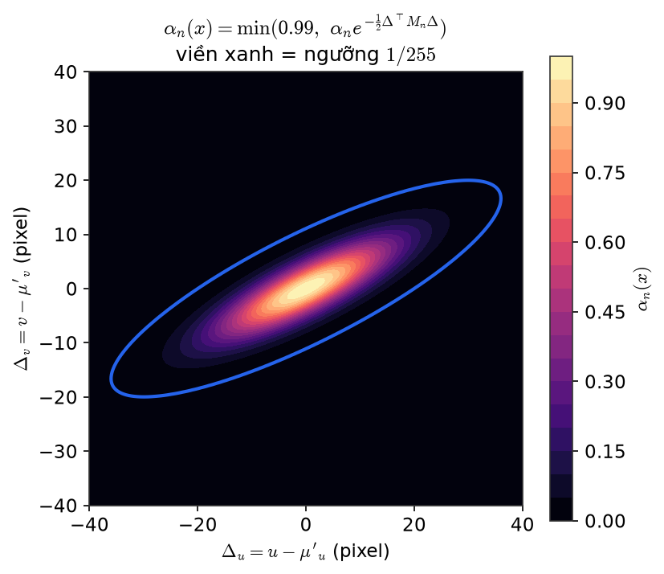
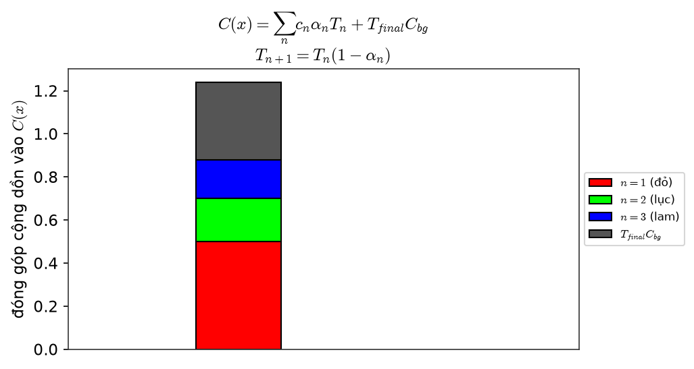
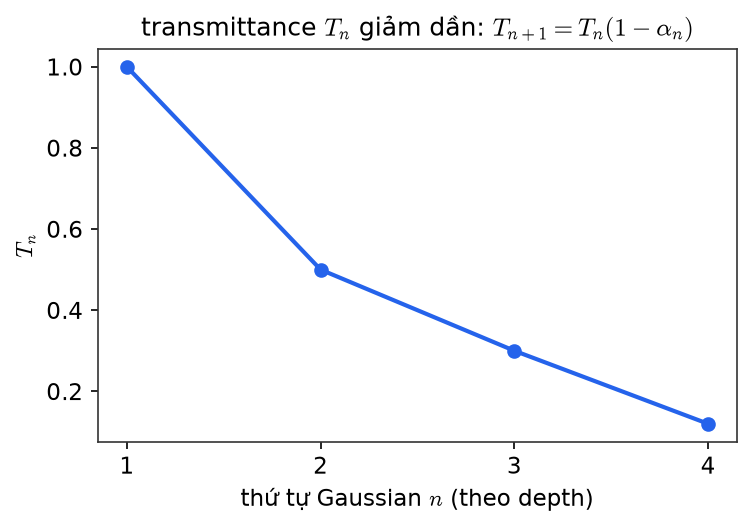
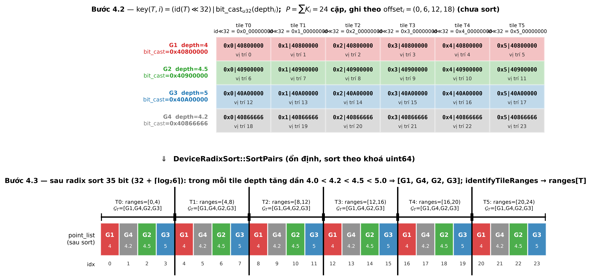
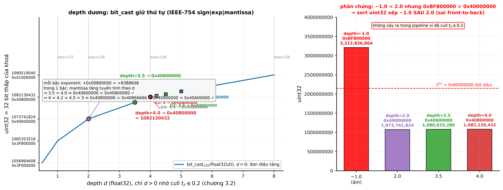
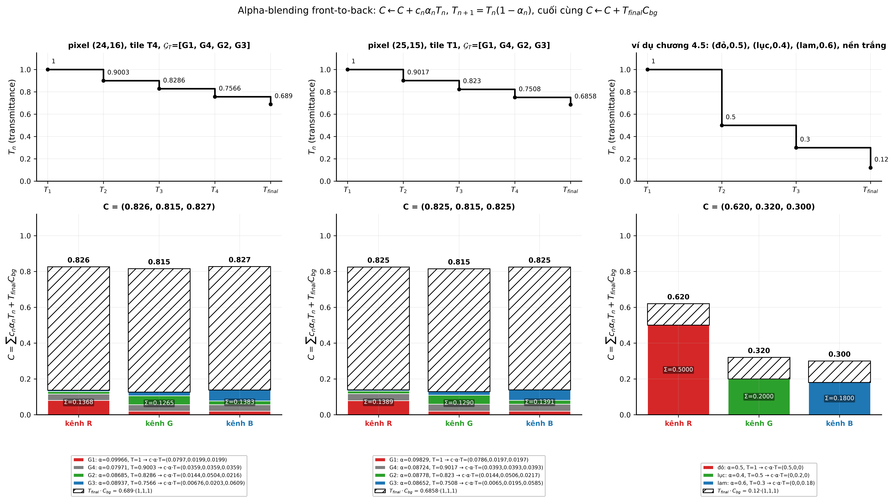
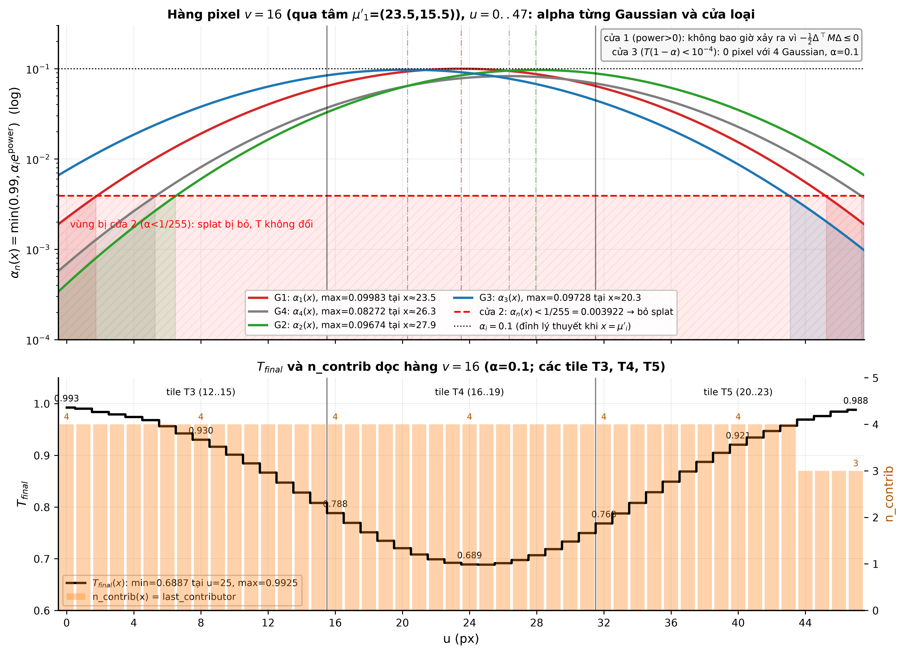
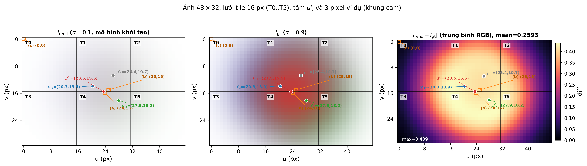
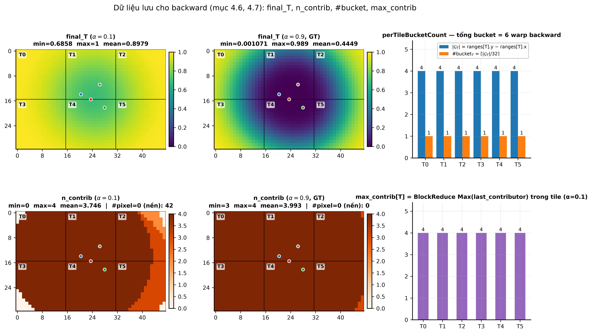

[← Mục lục](00-muc-luc.md) · Chương 9/15

# Chương 9 — Differentiable Tile Rasterizer

> Nguồn: `DOCS/Report/04-rasterizer.md`, `DOCS/Report/test/04-test.md`

## 9.1 Lý thuyết

# Chương 4 — Differentiable Tile Rasterizer

> Khối biến các splat 2D thành ảnh. **Toán học giữ nguyên 3DGS**; FastGS-lite chỉ đưa vào ít cặp (tile, Gaussian) hơn.
> Code: `rasterizer_impl.cu` (sort, ranges), `forward.cu` (`renderCUDA`).

## 4.1 — Đơn vị công việc: cặp (tile, Gaussian)

Ảnh chia thành lưới tile $16\times16$. Chi phí rasterize **không** tỉ lệ với $N$ mà với

$$
P=\sum_{i=1}^{N}K_i\approx N\cdot K
$$

Ba trong bốn bước dưới đây tỉ lệ với $P$.

## 4.2 — Prefix sum và sinh khoá

$$
\text{offset}_i=\sum_{j<i}K_j
$$

Mỗi cặp $(T,i)$ nhận một khoá 64-bit (`auxiliary.h:278-280`):

$$
\boxed{\ \text{key}(T,i)=\bigl(\text{id}(T)\ll32\bigr)\ \big|\ \text{bit\_cast}_{u32}(\text{depth}_i)\ }
$$

32 bit cao gom entry cùng tile; 32 bit thấp xếp theo độ sâu trong tile. `bit_cast` float→uint32 giữ đúng thứ tự chỉ khi depth dương — bảo đảm bởi cull $t_z>0.2$ (chương 3.2).

## 4.3 — Radix sort

$$
T_{\text{sort}}=O(P)=O(NK)
$$

Chỉ sort $32+\lceil\log_2(\text{số tile})\rceil$ bit thay vì 64 (ảnh 1600×1040 → 45 bit). Sau sort, `identifyTileRanges` cho $\text{ranges}[T]=[\text{start},\text{end})$ — danh sách Gaussian $\mathcal G_T$ của tile $T$ theo độ sâu tăng dần.

## 4.4 — Alpha tại pixel

Với pixel $x=(u,v)$ trong tile $T$, Gaussian $n\in\mathcal G_T$, $\Delta=x-\mu'_n$:

$$
\text{power}_n(x)=-\tfrac12\bigl(A_n\Delta_u^2+2B_n\Delta_u\Delta_v+C_n\Delta_v^2\bigr)=-\tfrac12\Delta^\top M_n\Delta
$$

$$
G_n(x)=e^{\text{power}_n(x)},\qquad
\boxed{\ \alpha_n(x)=\min\bigl(0.99,\ \alpha_n\,G_n(x)\bigr)\ }
$$



*Trục $\Delta_u,\Delta_v$ là độ lệch pixel so với tâm $\mu'$ (hệ toạ độ cục bộ, không phải toạ độ ảnh tuyệt đối). Màu là giá trị $\alpha_n(x)$: sáng nhất ở tâm, tắt dần ra ngoài theo hình ellipse nghiêng ($B\ne0$). Viền xanh là ngưỡng $1/255$ — ngoài đó kernel bỏ qua splat.*

Ba cửa loại, đúng thứ tự code:

| Điều kiện | Hành động | Ý nghĩa |
|---|---|---|
| $\text{power}_n>0$ | bỏ splat | $M$ không PSD (lỗi số học) |
| $\alpha_n(x)<1/255$ | bỏ splat | dưới bước lượng tử 8-bit — cùng ngưỡng với compact box |
| $T\,(1-\alpha_n)<10^{-4}$ | dừng pixel | early termination |

$1/255$ lọc **từng splat**, $10^{-4}$ dừng **cả vòng lặp pixel** — hai hằng khác nhau, hai việc khác nhau.

## 4.5 — Alpha-blending front-to-back

$$
T_1=1,\qquad T_{n+1}=T_n\bigl(1-\alpha_n(x)\bigr)
$$

$$
\boxed{\ C(x)=\sum_{n\in\mathcal G_T}c_n\,\alpha_n(x)\,T_n\;+\;T_{\text{final}}\cdot C_{\text{bg}}\ }
$$




*Hình trái: một cột duy nhất chia lớp theo ví dụ 3 Gaussian đỏ/lục/lam ở dưới — mỗi khối màu là một số hạng $c_n\alpha_nT_n$ xếp chồng theo thứ tự depth, cộng phần nền $T_{final}C_{bg}$ trên cùng. Hình phải: trục x là thứ tự Gaussian $n$ theo độ sâu, trục y là $T_n$ — luôn giảm đơn điệu vì $T_{n+1}=T_n(1-\alpha_n)\le T_n$.*

Ví dụ: ba Gaussian $(\text{đỏ},0.5),(\text{lục},0.4),(\text{lam},0.6)$, nền trắng:

| $n$ | $c_n$ | $\alpha_n$ | $T_n$ | đóng góp |
|---|---|---|---|---|
| 1 | (1,0,0) | 0.5 | 1.0 | (0.5, 0, 0) |
| 2 | (0,1,0) | 0.4 | 0.5 | (0, 0.2, 0) |
| 3 | (0,0,1) | 0.6 | 0.3 | (0, 0, 0.18) |

$T_4=0.12$ → $C=(0.5,0.2,0.18)+0.12\,(1,1,1)=(0.62,0.32,0.30)$. Gaussian gần nhất đóng góp nhiều nhất dù $\alpha$ không cao nhất — đó là lý do phải sort theo depth.

Mỗi tile là một CUDA block 256 thread (một thread/pixel), duyệt Gaussian theo batch 256 nạp vào shared memory. Block dừng khi **mọi** pixel đã bão hoà (`__syncthreads_count(done)==256`).

## 4.6 — Dữ liệu lưu cho backward

| Mảng | Nội dung | Dùng cho |
|---|---|---|
| `final_Ts[x]` | $T_{\text{final}}$ | gradient của số hạng background |
| `n_contrib[x]` | số Gaussian thực sự đóng góp tại pixel | backward bỏ qua splat sau early termination |
| `sampled_T`, `sampled_ar` | checkpoint mỗi 32 Gaussian: $T$ và $C^{\le n}$ | backward duyệt **xuôi** (chương 6) |
| `max_contrib[T]` | $\max_{x\in T}n_{\text{contrib}}(x)$ | cắt cả warp trong backward |

Số bucket của tile: $\#\text{bucket}_T=\lceil|\mathcal G_T|/32\rceil$. Backward khởi chạy $\sum_T\#\text{bucket}_T$ warp — thường **ít hơn** $NK$ nhờ early termination, nên $bNK$ là cận trên cho backward.

## 4.7 — Đầu ra của khối

$$
I_{\text{rend}}=\{C(x)\}_{x\in H\times W}
$$

đi sang khối **Image** (chương 5) để tính loss; cùng với `final_Ts`, `n_contrib`, checkpoint đi ngược vào **Gradient Flow** (chương 6).

## 9.2 Kiểm định số — Chương 4, Rasterizer

# Chương 4 — Test số: Differentiable Tile Rasterizer (camera 1, nền trắng)

> Cảnh: [`00-scene.md`](00-scene.md). Script: [`scripts/ch04_test.py`](scripts/ch04_test.py) — mọi số dưới đây
> do script in ra (file markdown này được script sinh trực tiếp, không chép tay).
> Thứ tự phép toán chép từ `forward.cu:renderCUDA`, `auxiliary.h:duplicateToTilesTouched/processTiles`,
> `rasterizer_impl.cu:duplicateWithKeys/identifyTileRanges/perTileBucketCount`.
>
> Chỉ dùng camera 1: $c_1=(0,0,-4)$, $R=I$ ⇒ $t_i=\mu_i-c_1$, $f_x=f_y=40$, ảnh $48\times32$ = lưới $3\times2$ tile.

## 4.0 — Đầu vào của khối (lấy từ chương 1 và chương 3, tính lại trong script)

### Khởi tạo (lấy từ chương 1)

$\mu_i=p_i$, $s_i=\sqrt{\text{mean}(d^2\text{ tới 3 láng giềng})}$, $R_i=I$ ⇒ $\Sigma_i=s_i^2I$, $\alpha_i=0.1$, $c_i=$ màu SfM.

| $i$ | $\mu_i$ | $s_i$ | $s_i^2$ | $\alpha_i$ | $c_i$ |
|---|---|---|---|---|---|
| 1 | (0, 0, 0) | 0.8505 | 0.7233 | 0.1 | (0.8, 0.2, 0.2) |
| 2 | (0.5, 0.3, 0.5) | 0.9434 | 0.89 | 0.1 | (0.2, 0.7, 0.3) |
| 3 | (-0.4, -0.2, 1) | 1.115 | 1.243 | 0.1 | (0.1, 0.3, 0.9) |
| 4 | (0.3, -0.5, 0.2) | 0.8888 | 0.79 | 0.1 | (0.5, 0.5, 0.5) |

### Projection camera 1 (lấy từ chương 3)

$t_i=\mu_i-c_1$, depth $=t_z$; $p^{proj}=(t_x/0.6,\ t_y/0.4)/(t_z+10^{-7})$; $\mu'=\bigl(\tfrac{(p_x+1)\cdot48-1}{2},\tfrac{(p_y+1)\cdot32-1}{2}\bigr)$ (`ndc2Pix`).

| $i$ | $t_i$ | depth | $p^{proj}$ | $\mu'_i$ (px) | clamp $1.3\tan$ kích hoạt? |
|---|---|---|---|---|---|
| 1 | (0, 0, 4) | 4 | (0, 0) | (23.5, 15.5) | không ($|t_x/t_z|$=0≤0.78, $|t_y/t_z|$=0≤0.52) |
| 2 | (0.5, 0.3, 4.5) | 4.5 | (0.1852, 0.1667) | (27.94, 18.17) | không ($|t_x/t_z|$=0.1111≤0.78, $|t_y/t_z|$=0.06667≤0.52) |
| 3 | (-0.4, -0.2, 5) | 5 | (-0.1333, -0.1) | (20.3, 13.9) | không ($|t_x/t_z|$=0.08≤0.78, $|t_y/t_z|$=0.04≤0.52) |
| 4 | (0.3, -0.5, 4.2) | 4.2 | (0.119, -0.2976) | (26.36, 10.74) | không ($|t_x/t_z|$=0.07143≤0.78, $|t_y/t_z|$=0.119≤0.52) |

$J=\begin{pmatrix}f_x/t_z&0&-f_x\hat t_x/t_z^2\\0&f_y/t_z&-f_y\hat t_y/t_z^2\\0&0&0\end{pmatrix}$, $\Sigma'=J\,\Sigma_i\,J^\top+0.3I$ (vì $W$ có $R=I$), $\det=\Sigma'_{11}\Sigma'_{22}-\Sigma'^2_{12}$, $M=(A,B,C)=(\Sigma'_{22},-\Sigma'_{12},\Sigma'_{11})/\det$.

| $i$ | $J$ (2 hàng đầu) | $\Sigma'_{11}$ | $\Sigma'_{12}$ | $\Sigma'_{22}$ | $\det$ | $A$ | $B$ | $C$ |
|---|---|---|---|---|---|---|---|---|
| 1 | [10, 0, -0; 0, 10, -0] | 72.63 | 0 | 72.63 | 5276 | 0.01377 | -0 | 0.01377 |
| 2 | [8.889, 0, -0.9877; 0, 8.889, -0.5926] | 71.49 | 0.5209 | 70.93 | 5071 | 0.01399 | -0.0001027 | 0.0141 |
| 3 | [8, 0, 0.64; 0, 8, 0.32] | 80.38 | 0.2546 | 80 | 6431 | 0.01244 | -3.96e-05 | 0.0125 |
| 4 | [9.524, 0, -0.6803; 0, 9.524, 1.134] | 72.32 | -0.6093 | 72.97 | 5277 | 0.01383 | 0.0001155 | 0.01371 |

Ví dụ thay số cho $i=1$: $t=(0,0,4)$, $J_{11}=40/4=10$, $\Sigma'_{11}=10^2\cdot s_1^2+0.3=72.33+0.3=72.63$, $\Sigma'_{12}=0$ (vì $\hat t_x=\hat t_y=0$), $A=1/72.63=0.01377$.

### Compact box + lọc tile theo ellipse (lấy từ chương 3, `duplicateToTilesTouched`)

$t_i=\texttt{mult}\cdot2\ln(255\alpha_i)=0.5\cdot2\ln(25.5)=3.239$ (giống nhau cho mọi $i$ vì $\alpha=0.1$). $\text{half}_x=\sqrt{t\,\Sigma'_{11}}$, $\text{half}_y=\sqrt{t\,\Sigma'_{22}}$ (code tính qua `computeEllipseIntersection` tại tiếp điểm — cùng giá trị). Tile id $=t_y\cdot3+t_x$.

| $i$ | $t_i$ | $\text{half}_x$ | $\text{half}_y$ | Box $[x_{min},x_{max}]\times[y_{min},y_{max}]$ | rect tile (min..max) | #tile hộp | $\mathcal K_i$ (AccuTile) | $K_i$ |
|---|---|---|---|---|---|---|---|---|
| 1 | 3.239 | 15.34 | 15.34 | [8.163, 38.84]×[0.1626, 30.84] | x:0..2, y:0..1 | 6 | [0, 1, 2, 3, 4, 5] | 6 |
| 2 | 3.239 | 15.22 | 15.16 | [12.73, 43.16]×[3.01, 33.32] | x:0..2, y:0..1 | 6 | [0, 1, 2, 3, 4, 5] | 6 |
| 3 | 3.239 | 16.13 | 16.1 | [4.165, 36.43]×[-2.196, 30] | x:0..2, y:0..1 | 6 | [0, 1, 2, 3, 4, 5] | 6 |
| 4 | 3.239 | 15.3 | 15.37 | [11.05, 41.66]×[-4.635, 26.11] | x:0..2, y:0..1 | 6 | [0, 1, 2, 3, 4, 5] | 6 |

$P=\sum_iK_i=6+6+6+6=\mathbf{24}$ cặp (tile, Gaussian) = `num_rendered`.

Nhận xét: với cảnh này $\text{half}_{x,y}\approx15$ px trên ảnh $48\times32$ nên hộp của mọi Gaussian phủ cả 6 tile và bước lọc ellipse (AccuTile) không loại thêm tile nào ($K_i=K^{\text{box}}_i=6$). Trong `processTiles`, `isY = y_span < x_span` = (2 < 3) = True → quét theo lát $y$.

## 4.2 — Prefix sum và sinh khoá



*Hình: 24 cặp (tile, Gaussian) xếp theo 6 tile; mỗi ô ghi khoá rút gọn (tile_id | bit_cast(depth)); sau sort mọi tile đều có cùng thứ tự [G1, G4, G2, G3] theo độ sâu tăng dần.*



*Hình: giá trị uint32 tăng đơn điệu theo depth dương (4.0 → 0x40800000 lớn hơn 3.5 → 0x40600000); điểm phản chứng depth âm (−1.0) lại cho uint32 lớn hơn depth dương nhỏ (2.0) — lý do phải cull t_z ≤ 0.2.*

$\text{offset}_i=\sum_{j<i}K_j$ (code: `InclusiveSum` rồi lấy `offsets[idx-1]`, $i=1$ lấy 0):

| $i$ | $K_i$ | InclusiveSum | $\text{offset}_i$ (vị trí ghi đầu tiên) |
|---|---|---|---|
| 1 | 6 | 6 | 0 |
| 2 | 6 | 12 | 6 |
| 3 | 6 | 18 | 12 |
| 4 | 6 | 24 | 18 |

$\text{key}(T,i)=(\text{id}(T)\ll32)\ |\ \text{bit\_cast}_{u32}(\text{float32}(\text{depth}_i))$ — numpy: `np.float32(depth).view(np.uint32)`. Bảng chưa sort (thứ tự ghi vào buffer):

| vị trí | tile | $i$ | depth (float32) | bit_cast (hex) | key (hex 64-bit) |
|---|---|---|---|---|---|
| 0 | 0 | 1 | 4 | 0x40800000 | 0x0000000040800000 |
| 1 | 1 | 1 | 4 | 0x40800000 | 0x0000000140800000 |
| 2 | 2 | 1 | 4 | 0x40800000 | 0x0000000240800000 |
| 3 | 3 | 1 | 4 | 0x40800000 | 0x0000000340800000 |
| 4 | 4 | 1 | 4 | 0x40800000 | 0x0000000440800000 |
| 5 | 5 | 1 | 4 | 0x40800000 | 0x0000000540800000 |
| 6 | 0 | 2 | 4.5 | 0x40900000 | 0x0000000040900000 |
| 7 | 1 | 2 | 4.5 | 0x40900000 | 0x0000000140900000 |
| 8 | 2 | 2 | 4.5 | 0x40900000 | 0x0000000240900000 |
| 9 | 3 | 2 | 4.5 | 0x40900000 | 0x0000000340900000 |
| 10 | 4 | 2 | 4.5 | 0x40900000 | 0x0000000440900000 |
| 11 | 5 | 2 | 4.5 | 0x40900000 | 0x0000000540900000 |
| 12 | 0 | 3 | 5 | 0x40A00000 | 0x0000000040A00000 |
| 13 | 1 | 3 | 5 | 0x40A00000 | 0x0000000140A00000 |
| 14 | 2 | 3 | 5 | 0x40A00000 | 0x0000000240A00000 |
| 15 | 3 | 3 | 5 | 0x40A00000 | 0x0000000340A00000 |
| 16 | 4 | 3 | 5 | 0x40A00000 | 0x0000000440A00000 |
| 17 | 5 | 3 | 5 | 0x40A00000 | 0x0000000540A00000 |
| 18 | 0 | 4 | 4.2 | 0x40866666 | 0x0000000040866666 |
| 19 | 1 | 4 | 4.2 | 0x40866666 | 0x0000000140866666 |
| 20 | 2 | 4 | 4.2 | 0x40866666 | 0x0000000240866666 |
| 21 | 3 | 4 | 4.2 | 0x40866666 | 0x0000000340866666 |
| 22 | 4 | 4 | 4.2 | 0x40866666 | 0x0000000440866666 |
| 23 | 5 | 4 | 4.2 | 0x40866666 | 0x0000000540866666 |

Kiểm tra thay số cho $i=1$: depth $=4.0$ → float32 = sign 0, exp $=129$ (0x81), mantissa 0 → 0x40800000; tile 1 → key = (1≪32)|0x40800000 = 0x0000000140800000.

## 4.3 — Radix sort và `identifyTileRanges`

Số bit sort: $32+\lceil\log_2 6\rceil=32+3=35$ (`getHigherMsb(6)` = 3). Ở đây dùng `np.argsort(kind='stable')` trên khoá `uint64` — cùng kết quả vì radix sort ổn định.

Sau sort (`point_list_keys`, `point_list`):

| idx | key (hex) | tile = key≫32 | $i$ = point_list[idx] | depth |
|---|---|---|---|---|
| 0 | 0x0000000040800000 | 0 | 1 | 4 |
| 1 | 0x0000000040866666 | 0 | 4 | 4.2 |
| 2 | 0x0000000040900000 | 0 | 2 | 4.5 |
| 3 | 0x0000000040A00000 | 0 | 3 | 5 |
| 4 | 0x0000000140800000 | 1 | 1 | 4 |
| 5 | 0x0000000140866666 | 1 | 4 | 4.2 |
| 6 | 0x0000000140900000 | 1 | 2 | 4.5 |
| 7 | 0x0000000140A00000 | 1 | 3 | 5 |
| 8 | 0x0000000240800000 | 2 | 1 | 4 |
| 9 | 0x0000000240866666 | 2 | 4 | 4.2 |
| 10 | 0x0000000240900000 | 2 | 2 | 4.5 |
| 11 | 0x0000000240A00000 | 2 | 3 | 5 |
| 12 | 0x0000000340800000 | 3 | 1 | 4 |
| 13 | 0x0000000340866666 | 3 | 4 | 4.2 |
| 14 | 0x0000000340900000 | 3 | 2 | 4.5 |
| 15 | 0x0000000340A00000 | 3 | 3 | 5 |
| 16 | 0x0000000440800000 | 4 | 1 | 4 |
| 17 | 0x0000000440866666 | 4 | 4 | 4.2 |
| 18 | 0x0000000440900000 | 4 | 2 | 4.5 |
| 19 | 0x0000000440A00000 | 4 | 3 | 5 |
| 20 | 0x0000000540800000 | 5 | 1 | 4 |
| 21 | 0x0000000540866666 | 5 | 4 | 4.2 |
| 22 | 0x0000000540900000 | 5 | 2 | 4.5 |
| 23 | 0x0000000540A00000 | 5 | 3 | 5 |

`identifyTileRanges`: tại idx mà tile đổi so với idx−1 → `ranges[prev].y = idx`, `ranges[curr].x = idx`; idx=0 → `ranges[t].x=0`; idx=L−1 → `ranges[t].y=L`.

| tile $T$ | $[\text{start},\text{end})$ | $|\mathcal G_T|$ | $\mathcal G_T$ theo depth tăng dần |
|---|---|---|---|
| 0 | [0, 4) | 4 | [1, 4, 2, 3] (depth ['4', '4.2', '4.5', '5']) |
| 1 | [4, 8) | 4 | [1, 4, 2, 3] (depth ['4', '4.2', '4.5', '5']) |
| 2 | [8, 12) | 4 | [1, 4, 2, 3] (depth ['4', '4.2', '4.5', '5']) |
| 3 | [12, 16) | 4 | [1, 4, 2, 3] (depth ['4', '4.2', '4.5', '5']) |
| 4 | [16, 20) | 4 | [1, 4, 2, 3] (depth ['4', '4.2', '4.5', '5']) |
| 5 | [20, 24) | 4 | [1, 4, 2, 3] (depth ['4', '4.2', '4.5', '5']) |

**Minh hoạ bit_cast giữ thứ tự khi depth dương:**

- depth $=3.5$ → float32 bits = 0x40600000 = 1080033280 (uint32)
- depth $=4.0$ → float32 bits = 0x40800000 = 1082130432 (uint32)
  ⇒ $3.5<4.0$ và $0x40600000<0x40800000$ ✓ (cùng dấu, exponent/mantissa của IEEE-754 tăng đơn điệu).

**Phản chứng với depth âm** (không bao giờ xảy ra nhờ cull $t_z>0.2$ ở chương 3.2):

- depth $=-1.0$ → 0xBF800000 = 3212836864 (uint32)
- depth $=2.0$ → 0x40000000 = 1073741824 (uint32)
  ⇒ $-1.0<2.0$ nhưng $0xBF800000>0x40000000$ (bit dấu là bit cao nhất) — sort uint32 sẽ xếp $-1.0$ **sau** $2.0$: sai thứ tự front-to-back. Cull là điều kiện đúng đắn của khoá.

## 4.4 – 4.5 — Alpha tại pixel và alpha-blending front-to-back (render đầy đủ 48×32)



*Hình: transmittance T_n giảm dần và đóng góp từng Gaussian cho pixel (24,16) và (25,15); subplot tái hiện đúng ví dụ 3 Gaussian của chương 4.5, ra (0.62, 0.32, 0.30).*



*Hình: quét ngang hàng y=16 qua tâm G1 — đường α_n(x) của 4 Gaussian so với ngưỡng 1/255, cùng T_final(x) và n_contrib(x) dọc hàng đó.*

Với pixel $x=(u,v)$ (tâm pixel = toạ độ nguyên, code: `pixf = {pix.x, pix.y}`), tile $T=(v\!\div\!16)\cdot3+(u\!\div\!16)$, duyệt $\mathcal G_T$ theo `point_list[ranges[T].x .. ranges[T].y)`. Code tính `d = μ' − pixf` (= $-\Delta$), dạng toàn phương đối xứng nên

$$\text{power}=-\tfrac12(A\,d_x^2+C\,d_y^2)-B\,d_xd_y=-\tfrac12\Delta^\top M\Delta,\qquad \alpha_n(x)=\min(0.99,\ \alpha_n e^{\text{power}})$$

Ba cửa: `power>0 → continue`; `alpha<1/255 → continue`; `T(1−alpha)<1e-4 → done`. Sau đó $C\mathrel{+}=c_n\alpha_nT$, $T\leftarrow T(1-\alpha_n)$, `last_contributor = contributor`. Kết thúc: `out_color = C + T·bg`, `final_T = T`, `n_contrib = last_contributor`.

### Ảnh kết quả (độ sáng trung bình RGB, ký tự tối → sáng `@%#*+=-:. `, nền trắng = khoảng trắng)

```
                                                
                                                
                                                
                                                
                                                
                      ......                    
                   ...........                  
                  ..............                
                 ................               
                .................               
                ..................              
               ...................              
               ....................             
               ....................             
               ....................             
               ....................             
               ....................             
               ....................             
               ....................             
                ...................             
                ..................              
                 ................               
                  ...............               
                   .............                
                     .........                  
                        ...                     
                                                
                                                
                                                
                                                
                                                
                                                
```

Lưu: `scripts/ch04_render_cam1.npy` (float32, shape (32, 48, 3), HWC, RGB ∈ [0,1]) và `scripts/ch04_render_cam1.ppm` (P3, 8-bit).



*Hình: ba ảnh 48×32 phóng to cạnh nhau (α=0.1, α=0.9 "GT", và trị tuyệt đối hiệu số); lưới tile 16 px, tâm 4 Gaussian, và 3 pixel ví dụ (24,16)/(25,15)/(0,0) được đánh dấu.*

### Ba pixel trình bày chi tiết

(a) pixel gần tâm Gaussian 1 nhất: $\mu'_1=(23.5, 15.5)$ → làm tròn $(24,16)$. (b) pixel có nhiều Gaussian cộng thật nhất (argmax `contribs` = 4; phá hoà bằng $\sum_n\alpha_n(x)$ lớn nhất, loại pixel (a)): $(25,15)$, $\sum_n\alpha_n(x)=0.3598$. (c) pixel nền (`n_contrib`=0): $(0,0)$.

### (a) Gần tâm Gaussian 1: pixel $x=(24,16)$, tile $T=4$, $\mathcal G_T$ = [1, 4, 2, 3]

| $n$ | Gaussian $i$ | $c_n$ | $\Delta=x-\mu'_n$ | power | $G_n=e^{\text{power}}$ | $\alpha_n(x)=\min(0.99,\alpha_iG_n)$ | $T_n$ | cửa | đóng góp $c_n\alpha_nT_n$ | $T_{n+1}$ |
|---|---|---|---|---|---|---|---|---|---|---|
| 1 | 1 | (0.8, 0.2, 0.2) | (0.5, 0.5) | -0.003442 | 0.9966 | 0.09966 | 1 | cộng | (0.07973, 0.01993, 0.01993) | 0.9003 |
| 2 | 4 | (0.5, 0.5, 0.5) | (-2.357, 5.262) | -0.2267 | 0.7971 | 0.07971 | 0.9003 | cộng | (0.03589, 0.03589, 0.03589) | 0.8286 |
| 3 | 2 | (0.2, 0.7, 0.3) | (-3.944, -2.167) | -0.141 | 0.8685 | 0.08685 | 0.8286 | cộng | (0.01439, 0.05037, 0.02159) | 0.7566 |
| 4 | 3 | (0.1, 0.3, 0.9) | (3.7, 2.1) | -0.1124 | 0.8937 | 0.08937 | 0.7566 | cộng | (0.006762, 0.02029, 0.06086) | 0.689 |

$T_{final}=0.689$, `n_contrib` = 4, số Gaussian cộng thật = 4, early-termination = False.

$C(x)=\sum c_n\alpha_nT_n+T_{final}\cdot(1,1,1)=(0.1368, 0.1265, 0.1383)+0.689\cdot(1,1,1)=\mathbf{(0.8258, 0.8155, 0.8273)}$ → 8-bit (211, 208, 211).

### (b) Chồng nhiều Gaussian nhất: pixel $x=(25,15)$, tile $T=1$, $\mathcal G_T$ = [1, 4, 2, 3]

| $n$ | Gaussian $i$ | $c_n$ | $\Delta=x-\mu'_n$ | power | $G_n=e^{\text{power}}$ | $\alpha_n(x)=\min(0.99,\alpha_iG_n)$ | $T_n$ | cửa | đóng góp $c_n\alpha_nT_n$ | $T_{n+1}$ |
|---|---|---|---|---|---|---|---|---|---|---|
| 1 | 1 | (0.8, 0.2, 0.2) | (1.5, -0.5) | -0.01721 | 0.9829 | 0.09829 | 1 | cộng | (0.07864, 0.01966, 0.01966) | 0.9017 |
| 2 | 4 | (0.5, 0.5, 0.5) | (-1.357, 4.262) | -0.1365 | 0.8724 | 0.08724 | 0.9017 | cộng | (0.03933, 0.03933, 0.03933) | 0.823 |
| 3 | 2 | (0.2, 0.7, 0.3) | (-2.944, -3.167) | -0.1304 | 0.8778 | 0.08778 | 0.823 | cộng | (0.01445, 0.05057, 0.02167) | 0.7508 |
| 4 | 3 | (0.1, 0.3, 0.9) | (4.7, 1.1) | -0.1448 | 0.8652 | 0.08652 | 0.7508 | cộng | (0.006496, 0.01949, 0.05846) | 0.6858 |

$T_{final}=0.6858$, `n_contrib` = 4, số Gaussian cộng thật = 4, early-termination = False.

$C(x)=\sum c_n\alpha_nT_n+T_{final}\cdot(1,1,1)=(0.1389, 0.129, 0.1391)+0.6858\cdot(1,1,1)=\mathbf{(0.8247, 0.8149, 0.825)}$ → 8-bit (210, 208, 210).

### (c) Pixel nền: pixel $x=(0,0)$, tile $T=0$, $\mathcal G_T$ = [1, 4, 2, 3]

| $n$ | Gaussian $i$ | $c_n$ | $\Delta=x-\mu'_n$ | power | $G_n=e^{\text{power}}$ | $\alpha_n(x)=\min(0.99,\alpha_iG_n)$ | $T_n$ | cửa | đóng góp $c_n\alpha_nT_n$ | $T_{n+1}$ |
|---|---|---|---|---|---|---|---|---|---|---|
| 1 | 1 | (0.8, 0.2, 0.2) | (-23.5, -15.5) | -5.455 | 0.004273 | 0.0004273 | 1 | α<1/255 → bỏ | (0, 0, 0) | 1 |
| 2 | 4 | (0.5, 0.5, 0.5) | (-26.36, -10.74) | -5.626 | 0.003603 | 0.0003603 | 1 | α<1/255 → bỏ | (0, 0, 0) | 1 |
| 3 | 2 | (0.2, 0.7, 0.3) | (-27.94, -18.17) | -7.736 | 0.0004367 | 4.367e-05 | 1 | α<1/255 → bỏ | (0, 0, 0) | 1 |
| 4 | 3 | (0.1, 0.3, 0.9) | (-20.3, -13.9) | -3.76 | 0.02329 | 0.002329 | 1 | α<1/255 → bỏ | (0, 0, 0) | 1 |

$T_{final}=1$, `n_contrib` = 0, số Gaussian cộng thật = 0, early-termination = False.

$C(x)=\sum c_n\alpha_nT_n+T_{final}\cdot(1,1,1)=(0, 0, 0)+1\cdot(1,1,1)=\mathbf{(1, 1, 1)}$ → 8-bit (255, 255, 255).

### Kiểm tra lại ví dụ 3 Gaussian trong chương 4.5

| $n$ | $c_n$ | $\alpha_n$ | $T_n$ | đóng góp | $T_{n+1}$ |
|---|---|---|---|---|---|
| 1 | (1, 0, 0) | 0.5 | 1 | (0.5, 0, 0) | 0.5 |
| 2 | (0, 1, 0) | 0.4 | 0.5 | (0, 0.2, 0) | 0.3 |
| 3 | (0, 0, 1) | 0.6 | 0.3 | (0, 0, 0.18) | 0.12 |

$T_4=0.12$ → $C=(0.5, 0.2, 0.18)+0.12\cdot(1,1,1)=\mathbf{(0.62, 0.32, 0.3)}$ — khớp $(0.62,0.32,0.30)$ trong chương: ✓.

## 4.6 — Dữ liệu lưu cho backward



*Hình: bản đồ final_T và n_contrib toàn ảnh cho cả α=0.1 và α=0.9 (GT); GT có final_T nhỏ hơn nhiều (nhiều Gaussian đục hơn) nhưng vẫn không có pixel early-termination trong cảnh 4-Gaussian này.*

`final_Ts[x]` (bản đồ $T_{final}$, in $\lfloor 9T\rfloor$ mỗi pixel: 9 = nền hoàn toàn, nhỏ = bị che nhiều):

```
999999999999999999999999999999999999999999999999
999999999999999999998888888889999999999999999999
999999999999999999888888888888889999999999999999
999999999999999988888888888888888999999999999999
999999999999999888888888888888888899999999999999
999999999999998888888888888888888889999999999999
999999999999988888888877777788888888999999999999
999999999999988888887777777777888888899999999999
999999999999888888877777777777788888889999999999
999999999999888888777777777777778888889999999999
999999999998888887777777777777777888889999999999
999999999998888877777777777777777888888999999999
999999999998888877777776666777777788888999999999
999999999998888877777766666677777788888999999999
999999999988888877777766666677777788888999999999
999999999988888877777766666677777788888999999999
999999999998888877777766666677777788888999999999
999999999998888877777776666777777788888999999999
999999999998888887777777777777777788888999999999
999999999998888887777777777777777888888999999999
999999999999888888777777777777777888889999999999
999999999999888888877777777777778888889999999999
999999999999988888887777777777788888899999999999
999999999999998888888877777778888888899999999999
999999999999998888888888888888888888999999999999
999999999999999888888888888888888889999999999999
999999999999999998888888888888888899999999999999
999999999999999999888888888888888999999999999999
999999999999999999999888888888999999999999999999
999999999999999999999999999999999999999999999999
999999999999999999999999999999999999999999999999
999999999999999999999999999999999999999999999999
```

`n_contrib[x]` (= `last_contributor`: chỉ số 1-based của Gaussian cuối cùng đóng góp trong $\mathcal G_T$):

```
000444444444444444444444444444444444444322222200
004444444444444444444444444444444444444432222200
044444444444444444444444444444444444444433222220
044444444444444444444444444444444444444443332220
444444444444444444444444444444444444444443332220
444444444444444444444444444444444444444444333222
444444444444444444444444444444444444444444333322
444444444444444444444444444444444444444444433332
444444444444444444444444444444444444444444433332
444444444444444444444444444444444444444444433333
444444444444444444444444444444444444444444433333
444444444444444444444444444444444444444444433333
444444444444444444444444444444444444444444443333
444444444444444444444444444444444444444444443333
444444444444444444444444444444444444444444443333
444444444444444444444444444444444444444444443333
444444444444444444444444444444444444444444443333
444444444444444444444444444444444444444444433333
444444444444444444444444444444444444444444433333
444444444444444444444444444444444444444444433333
444444444444444444444444444444444444444444433333
444444444444444444444444444444444444444444433333
444444444444444444444444444444444444444444333333
444444444444444444444444444444444444444444333333
444444444444444444444444444444444444444443333333
044444444444444444444444444444444444444443333333
004444444444444444444444444444444444444433333333
004444444444444444444444444444444444444433333333
000444444444444444444444444444444444444333333333
000044444444444444444444444444444444443333333330
000004444444444444444444444444444444433333333300
000000444444444444444444444444444444333333333300
```

| Thống kê trên 1536 pixel | min | max | mean |
|---|---|---|---|
| `final_Ts` | 0.6858 | 1 | 0.8979 |
| `n_contrib` (last_contributor) | 0 | 4 | 3.746 |
| số Gaussian cộng thật (`contribs`) | 0 | 4 | 3.215 |
| pixel có `n_contrib`=0 (nền) | | | 42 pixel |
| pixel early-termination ($T(1-\alpha)<10^{-4}$) | | | 0 pixel |

`max_contrib[T]` (BlockReduce Max của `last_contributor` trong tile) và số bucket `perTileBucketCount` = $\lceil|\mathcal G_T|/32\rceil$:

| tile $T$ | $|\mathcal G_T|$ | `max_contrib[T]` | #bucket$_T$ | pixel trong tile | pixel early-term |
|---|---|---|---|---|---|
| 0 | 4 | 4 | 1 | 256 | 0 |
| 1 | 4 | 4 | 1 | 256 | 0 |
| 2 | 4 | 4 | 1 | 256 | 0 |
| 3 | 4 | 4 | 1 | 256 | 0 |
| 4 | 4 | 4 | 1 | 256 | 0 |
| 5 | 4 | 4 | 1 | 256 | 0 |

Tổng warp backward $=\sum_T\#\text{bucket}_T=6$; mỗi bucket chứa tối đa 32 Gaussian nên xử lý được tới 192 entry, trong khi $P=\sum_iK_i=24$ — cận trên $bNK$ ở đây là 6 warp × 256 pixel. `sampled_T`/`sampled_ar` được ghi tại `j % 32 == 0`, tức 1 checkpoint (T=1, C=0) mỗi bucket vì mọi $|\mathcal G_T|\le32$.

## 4.7 — Cùng cảnh với $\alpha=0.9$ (ảnh "GT" cho chương 5)

Chỉ $\alpha$ đổi ⇒ $t_i=0.5\cdot2\ln(255\cdot0.9)=5.436$ (thay vì 3.239) → hộp rộng hơn, $K_i$ có thể tăng:

| $i$ | $\text{half}_x$ | $\text{half}_y$ | $\mathcal K_i$ | $K_i$ |
|---|---|---|---|---|
| 1 | 19.87 | 19.87 | [0, 1, 2, 3, 4, 5] | 6 |
| 2 | 19.71 | 19.64 | [0, 1, 2, 3, 4, 5] | 6 |
| 3 | 20.9 | 20.85 | [0, 1, 2, 3, 4, 5] | 6 |
| 4 | 19.83 | 19.92 | [0, 1, 2, 3, 4, 5] | 6 |

$P^{gt}=24$; ranges: T0=[0,4), T1=[4,8), T2=[8,12), T3=[12,16), T4=[16,20), T5=[20,24).

```
         .....:::::------------:::::....        
        ....::::-----------------::::....       
       ....::::-----==========----::::....      
      ....::::----==============----:::....     
      ...::::---=================----:::...     
     ....:::---======++++++++=====---:::....    
     ...:::---====+++++++++++++====---:::...    
    ....::---====+++++++++++++++====---::....   
    ...:::--====+++++++++++++++++====--:::...   
   ....::---===+++++++++++++++++++===---::...   
   ....::---===+++++++++++++++++++====--:::...  
   ...:::--===+++++++++++++++++++++===--:::...  
   ...:::--===+++++++++++++++++++++===---::...  
   ...::---===+++++++++++++++++++++===---::...  
   ...::---===++++++++++++++++++++++===--::...  
   ...::---===++++++++++++++++++++++===--::...  
   ...:::--===++++++++++++++++++++++===--::...  
   ...:::--===++++++++++++++++++++++===--::...  
   ...:::--===++++++++++++++++++++++===--::...  
   ....::---===++++++++++++++++++++===---::...  
    ...:::--===++++++++++++++++++++===--:::...  
    ...:::---===+++++++++++++++++++===--:::...  
    ....:::--====+++++++++++++++++===---::...   
     ...:::---====+++++++++++++++====--:::...   
     ....:::---====+++++++++++++====---::....   
      ....:::---=====+++++++++=====---:::...    
       ...::::---=================---:::....    
       ....::::----=============----:::....     
        ....::::------========-----:::.....     
         .....::::---------------::::.....      
          .....::::::----------:::::.....       
           ......:::::::::::::::::......        
```

| Thống kê ($\alpha=0.9$) | min | max | mean |
|---|---|---|---|
| `final_Ts` | 0.001071 | 0.989 | 0.4449 |
| `n_contrib` | 3 | 4 | 3.993 |
| pixel early-termination | | | **0** pixel |
| pixel nền (`n_contrib`=0) | | | 0 pixel |

Số pixel bị early-termination với $\alpha=0.9$: **0** (với $\alpha=0.1$: 0). Với 4 Gaussian, $T$ nhỏ nhất có thể là $(1-0.9)^4=10^{-4}$ đúng bằng ngưỡng, còn $\alpha_n(x)<\alpha$ tại mọi pixel không trùng tâm nên $T$ không xuống dưới $10^{-4}$; $T_{final}$ nhỏ nhất đo được = 0.001071.

Lưu: `scripts/ch04_render_cam1_gt.npy`, `scripts/ch04_render_cam1_gt.ppm`.

## Đầu vào của khối

| Đại lượng | Giá trị / nguồn |
|---|---|
| $(\mu'_i, M_i, \alpha_i, c_i, \text{depth}_i, \mathcal K_i)$ | bảng mục 4.0 (chương 3, camera 1) |
| $P=\sum K_i$ | 24 (α=0.1), 24 (α=0.9) |
| $C_{bg}$ | (1,1,1) |
| lưới tile | 3×2, tile 16×16, `BLOCK_SIZE`=256 thread |

## Đầu ra của khối

$I_{rend}=\{C(x)\}$, shape **(H, W, 3) = (32, 48, 3)**, float32, RGB ∈ [0,1], HWC, gốc (0,0) góc trên-trái (chương 5 cần CHW thì `transpose(2,0,1)`).

| Ảnh | file | kênh | min | max | mean |
|---|---|---|---|---|---|
| $I_{rend}$ (α=0.1, mô hình khởi tạo) | scripts/ch04_render_cam1.npy | R | 0.8247 | 1 | 0.9396 |
|  |  | G | 0.8128 | 1 | 0.9404 |
|  |  | B | 0.825 | 1 | 0.9463 |
| $I_{gt}$ (α=0.9, GT của chương 5) | scripts/ch04_render_cam1_gt.npy | R | 0.5588 | 0.9901 | 0.7372 |
|  |  | G | 0.234 | 0.9932 | 0.6495 |
|  |  | B | 0.229 | 0.9989 | 0.6617 |

Tham khảo nhanh cho chương 5: $\text{mean}|I_{rend}-I_{gt}|$ (L1 trung bình trên 32·48·3 giá trị) $=0.2593$.

Dữ liệu cho backward (chương 6) lưu ở `scripts/ch04_aux_cam1.npz`: `final_T` (32,48), `n_contrib` (32,48), `n_real`, `ranges` (6,2), `point_list` (P,), `keys_sorted`, `max_contrib` (6,), `mu2` (4,2), `conic` (4,3), `depth`, `alpha`, `colors`, cùng `final_T_gt`, `n_contrib_gt` cho bản α=0.9.

## Bài tập (Exercise)

**Bài tập 9.1.** Với ảnh $48\times32$ và tile $16\times16$, lưới tile là $3\times2$ (6 tile). Nếu đổi ảnh sang $64\times64$ (cùng cỡ tile $16\times16$), lưới tile sẽ là bao nhiêu? Với 4 Gaussian có $\text{half}_x,\text{half}_y\approx15$–16 px như trong bảng mục 4.0, ước lượng liệu mỗi Gaussian còn phủ **toàn bộ** lưới tile mới hay không, và giải thích ảnh hưởng lên $K_i$ và $P=\sum_iK_i$.

**Bài tập 9.2.** Giải thích vì sao khoá 64-bit $\text{key}(T,i)=(\text{id}(T)\ll32)\ |\ \text{bit\_cast}_{u32}(\text{depth}_i)$ (`auxiliary.h:278-280`) cần đặt id tile ở 32 bit **cao** chứ không phải 32 bit thấp. Nếu đảo ngược thứ tự (depth ở 32 bit cao, tile ở 32 bit thấp), kết quả sort theo khoá đó còn dùng được cho `identifyTileRanges` không? Vì sao?

**Bài tập 9.3.** Dùng ví dụ phản chứng ở mục 4.3 (depth $=-1.0\to$ `0xBF800000`, depth $=2.0\to$ `0x40000000`): tính `bit_cast` uint32 cho depth $=-0.5$ và depth $=0.1$, so sánh thứ tự uint32 với thứ tự depth thật. Từ đó phát biểu lại chính xác điều kiện cull $t_z>0.2$ (chương 3.2) cần thiết ở đâu trong chuỗi lập luận "bit_cast giữ đúng thứ tự".

**Bài tập 9.4.** Cho ba Gaussian tại một pixel theo thứ tự depth tăng dần với $(c_n,\alpha_n)$ lần lượt là $(\text{đỏ},0.5)$, $(\text{lục},0.4)$, $(\text{lam},0.6)$ như ví dụ mục 4.5 ($T_1=1$, nền trắng, $C=(0.62,0.32,0.30)$). Nếu đảo thứ tự duyệt thành lam → lục → đỏ (tức sort sai theo depth giảm dần), tính lại $T_n$ và $C(x)$ từng bước. So sánh với kết quả đúng và giải thích bằng lời tại sao alpha-blending **không giao hoán** theo thứ tự Gaussian.

**Bài tập 9.5.** Tại pixel nền $x=(0,0)$ (mục "Ba pixel trình bày chi tiết", phần (c)), cả 4 Gaussian đều bị cửa $\alpha_n(x)<1/255$ loại bỏ dù $\text{power}_n\le0$ với mọi $n$. Giải thích vì sao hai điều kiện $\text{power}_n>0$ và $\alpha_n(x)<1/255$ là hai cửa lọc **độc lập** — cho một ví dụ số $(\alpha_i, \text{power})$ mà $\text{power}\le0$ nhưng vẫn bị cửa $1/255$ loại, và một ví dụ khác mà $\text{power}>0$ (bị cửa đầu loại trước khi cửa thứ hai kịp xét).

**Bài tập 9.6.** Tính số bucket backward $\#\text{bucket}_T=\lceil|\mathcal G_T|/32\rceil$ cho tile $T=0$ trong bảng mục 4.6 ($|\mathcal G_T|=4$). Nếu một cảnh thực tế có $|\mathcal G_T|=100$ cho một tile, tính $\#\text{bucket}_T$ và giải thích tại sao tổng $\sum_T\#\text{bucket}_T$ (số warp backward khởi chạy) thường **nhỏ hơn** cận trên $P=\sum_iK_i$ — nêu rõ vai trò của `n_contrib`/early termination trong việc này (tham chiếu `rasterizer_impl.cu:perTileBucketCount`).

**Bài tập 9.7.** So sánh hai hằng số $1/255$ (lọc $\alpha_n(x)$ từng splat) và $10^{-4}$ (ngưỡng dừng $T(1-\alpha_n)$ của cả pixel) trong bảng "Ba cửa loại" mục 4.4. Với 4 Gaussian có $\alpha_i=0.1$ như trong test số, tính $T$ nhỏ nhất lý thuyết có thể đạt được tại một pixel nếu cả 4 splat đều đóng góp $\alpha_n(x)=\alpha_i$ tối đa (tức $x=\mu'_i$, $G_n=1$), rồi so với ngưỡng $10^{-4}$: liệu early termination có thể xảy ra với cảnh 4-Gaussian, $\alpha=0.1$ này không? Đối chiếu với kết luận số liệu ở mục 4.6/4.7 (0 pixel early-termination cho cả $\alpha=0.1$ và $\alpha=0.9$).

---

[← Chương 8](08-projection-compact-box.md) | [Mục lục](00-muc-luc.md) | [Chương 10 →](10-anh-den-loss-metrics.md)
