[← Mục lục](00-muc-luc.md) · Chương 12/15

# Chương 12 — Adaptive Density Control (đòn bẩy giảm N)

> Nguồn: `DOCS/Report/07-adaptive-density-control.md`, `DOCS/Report/test/07-test.md`, `DOCS/3.md`
> Code: `utils/fast_utils.py:33-90` (`compute_gaussian_score_fastgs`), `scene/gaussian_model.py:433-486` (`densify_and_prune_fastgs`), `:498-504` (`final_prune_fastgs`), `train.py:127-158`.
> Hình: 76 hình matplotlib trong `adc_figures/part1_figures.py` … `part6_figures.py` + 10 hình so sánh 3DGS↔FastGS từ `adc_figures/part7_engine.py` + `part7a…d_figures.py` (chạy `python adc_figures/partN_figures.py` để tái tạo) + 10 hình gốc từ `DOCS/Report`.

ADC quay ngược về tập 3D Gaussians: **thêm** Gaussian chỗ thiếu chi tiết, **xoá** Gaussian vô dụng. Đây là **đòn bẩy 1 của FastGS-lite: giảm $N$**.

| Phần | Nội dung | Report |
|---|---|---|
| 12.0 | ADC của 3DGS gốc (Kerbl 2023) — trước cải tiến | — |
| 12.1 | Lịch chạy; sai số pixel → mặt nạ nhị phân (①②③) | 7.1, 7.2 |
| 12.2 | Footprint hữu hình, counts, Importance, vai trò $V=10$ (④⑤) | 7.2 |
| 12.3 | Photometric loss, Pruning score, sơ đồ 7 bước, chi phí (⑥⑦) | 7.2 |
| 12.4 | Tích luỹ gradient, điều kiện AND, clone/split, luỹ thừa $N$ | 7.3 |
| 12.5 | Prune multinomial, ép opacity, tỉa cuối, đối chiếu 3DGS | 7.4–7.8 |
| 12.6 | Toy 2D: thiếu/dư, clone/split, tự chia vùng | minh hoạ |
| 12.7 | FastGS cải tiến chỗ nào — 3DGS gốc vs FastGS-lite trên cùng toy | 7.7 |

Ví dụ số xuyên suốt: ảnh $4\times4$, 5 Gaussian, 3 view (`3.md`); cảnh đồ chơi $48\times32$ (`07-test.md`).

---

## 12.0 ADC của 3DGS gốc — trước khi FastGS cải tiến

> Nguồn: Kerbl et al. 2023 (`densify_and_prune` của Inria). Đọc mục này trước để biết FastGS-lite (12.1–12.5) **thêm** gì và **thay** gì. Hình toy 2D dùng cùng engine của 12.6 (`adc_figures/part7_engine.py`, mode `"3dgs"`).

### 12.0.1 Công thức ADC của 3DGS gốc (Kerbl 2023)

**Lịch chạy (Inria, mặc định):**

| Việc | Khi nào | Số lần |
|---|---|---|
| Tích luỹ thống kê gradient | mỗi vòng, $t<15000$ | 15 000 |
| Densify + prune | mỗi 100 vòng, $500<t<15000$ | 144 |
| Reset opacity | mỗi 3000, $t<15000$ | 4 (3000/6000/9000/12000) |
| Sau 15 000 | **không có gì** — $N$ đóng băng | 0 |

**Thống kê gradient — chỉ 2 cột có dấu:**

$$
\boxed{\ \bar g_i=\frac{\text{accum}_i}{\text{denom}_i},\qquad
\text{accum}_i=\sum_t\mathbb 1_i(t)\,\Bigl\lVert\sum_x\frac{\partial\mathcal L}{\partial\mu'_i}\Big|_x\Bigr\rVert,\qquad
\text{denom}_i=\sum_t\mathbb 1_i(t)\ }
$$

Không có cột $\sum_x|\partial\mathcal L/\partial\mu'_i|$: gradient pixel ngược chiều trong **một** ảnh triệt tiêu nhau trước khi ra khỏi kernel.

**Densify — cùng một ngưỡng gradient cho cả hai nhánh:**

$$
\boxed{\ \text{clone}_i=\bigl[\lVert\bar g_i\rVert\ge\tau_{\text{grad}}\bigr]\wedge\bigl[\max s_i\le\delta\,\text{extent}\bigr],\qquad
\text{split}_i=\bigl[\lVert\bar g_i\rVert\ge\tau_{\text{grad}}\bigr]\wedge\bigl[\max s_i>\delta\,\text{extent}\bigr]\ }
$$

$$
\tau_{\text{grad}}=2\times10^{-4},\qquad \delta=\texttt{percent\_dense}=0.01
$$

| | Clone | Split |
|---|---|---|
| Bản mới | $\theta_{\text{new}}=\theta_i$ (copy y nguyên) | $\mu^{(j)}=\mu_i+R(q_i)\epsilon^{(j)},\ \epsilon^{(j)}\sim\mathcal N(0,\operatorname{diag}s_i^2)$ |
| Scale | $s_i$ | $s_i/1.6$ |
| Gốc | giữ | xoá |
| $N$ | $+1$ | $+2-1=+1$ |

**Prune cứng — xoá ngay, không ứng viên, không ngân sách:**

$$
\boxed{\ \text{xoá}_i=[\alpha_i<0.005]\ \vee\ \underbrace{[r^{2D}_i>20\ \text{px}]\ \vee\ [\max s_i>0.1\,\text{extent}]}_{\text{chỉ khi }t>3000}\ }
$$

**Reset opacity — kéo mọi Gaussian về gần ngưỡng xoá:**

$$
\boxed{\ \tilde\alpha_i\leftarrow\sigma^{-1}\bigl(\min(\alpha_i,\,0.01)\bigr)\quad\text{tại } t=3000k\ }
$$

Giữa hai lần reset, $\alpha$ được tự do lên tới $0.99$ (không có trần).

**Bảng có / không — 8 thành phần:**

| # | Thành phần | 3DGS gốc | FastGS-lite | Chi tiết |
|---|---|---|---|---|
| 1 | Gradient có dấu $\bar g$ | ✅ | ✅ (nhánh clone) | 12.4.2 |
| 2 | Gradient trị tuyệt đối $\bar g^{\text{abs}}$ | ❌ | ✅ (nhánh split, $\tau^{\text{abs}}=1.2\times10^{-3}$) | 12.4.2–12.4.3 |
| 3 | Importance score, AND $>5$ | ❌ | ✅ | 12.2, 12.4.3 |
| 4 | Pruning score (multi-view) | ❌ | ✅ | 12.3 |
| 5 | Prune multinomial trên $\mathcal C$, budget $\lfloor0.5\lvert\mathcal C\rvert\rfloor$ | ❌ (xoá thẳng) | ✅ | 12.5.1 |
| 6 | Trần $\alpha\le0.8$ sau mỗi densify | ❌ | ✅ | 12.5.2 |
| 7 | Reset $\alpha\le0.01$ mỗi 3000 | ✅ | ✅ | 12.5.2 |
| 8 | Final prune $15000<t<30000$ | ❌ | ✅ ($\alpha<0.1\vee\text{Pruning}>0.9$) | 12.5.3 |
| — | Ngưỡng to/nhỏ $\delta$ | $0.01$ | $0.001$ | 12.4.4 |

### 12.0.2 3DGS gốc trên toy 2D

Cùng ảnh mục tiêu $64\times64$, cùng $N_0=12$ Gaussian khởi tạo kiểu SfM, cùng seed như 12.6 — chỉ đổi luật ADC sang 3DGS gốc.

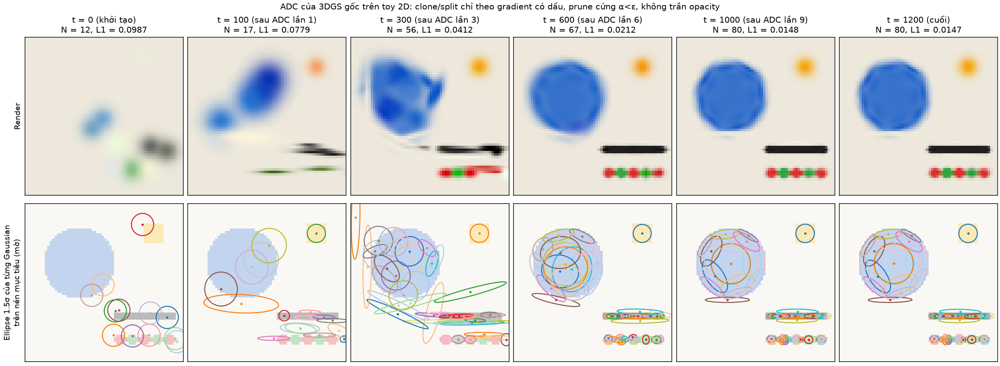

*3DGS gốc trên toy: hàng trên render ($N$, L1), hàng dưới ellipse $1.5\sigma$ từng Gaussian trên nền mục tiêu mờ, tại $t=0,100,300,600,1000,1200$.*

- → $N$: $12\to80$, **chạm trần** `N_MAX = 80` ngay từ $t=400$; L1 $0.0987\to0.0147$.
- → Ba mốc đầu split chiếm ưu thế (5, 12, 20) — mọi Gaussian to có $\lVert\bar g\rVert\ge\tau$ đều bị tách, không hỏi render có sai không.
- → Sau reset ($t=550$), mốc 600 xoá **13** Gaussian một lượt; mốc 700 clone 13 để lấp lại — dao động "xoá cụm → lấp cụm" đặc trưng của prune cứng.

**Nhật ký ADC (mode `"3dgs"`, seed 7):**

| $t$ | clone | split | prune | $N$ sau |
|---|---|---|---|---|
| 100 | 0 | 5 | 0 | 17 |
| 200 | 1 | 12 | 0 | 30 |
| 300 | 6 | 20 | 0 | 56 |
| 400 | 17 | 7 | 0 | 80 |
| 500 | 0 | 0 | 0 | 80 |
| 600 | 0 | 0 | **13** | 67 |
| 700 | 13 | 0 | 0 | 80 |
| 800, 900 | 0 | 0 | 0 | 80 |

**Ánh xạ toy ↔ 3DGS gốc:**

| Đại lượng | 3DGS gốc | Toy (mode `"3dgs"`) |
|---|---|---|
| $\tau_{\text{grad}}$ (clone **và** split, có dấu) | $2\times10^{-4}$ (NDC) | `TAU_GRAD = 4e-5` |
| Ngưỡng to/nhỏ | $\delta\,\text{extent}$, $\delta=0.01$ | `S_BIG = 3.5` px |
| Prune cứng | $\alpha<0.005$ | `EPS_OPA = 0.03` |
| "Quá to" (sau reset) | $r^{2D}>20$, $\max s>0.1\,\text{extent}$ | `S_HUGE = 10` px, $t>550$ |
| Reset opacity | $t=3000k$, $\alpha\le0.01$ | $t=550$, $\alpha\le0.02$ |
| Cửa sổ densify | $500<t<15000$, 144 mốc | $100\le t\le900$, 9 mốc |
| Trần $N$ | không | `N_MAX = 80` (để script nhanh) |

### 12.0.3 Năm điểm yếu → FastGS sửa ở đâu

| # | Triệu chứng | Công thức gây ra | Cải tiến của FastGS | Mục |
|---|---|---|---|---|
| 1 | Densify ở vùng render **đã đúng** (gradient L1 còn dư $\pm1$), hoặc artefact chỉ thấy ở 1 góc | chỉ có $[\lVert\bar g\rVert\ge\tau]$ — không hỏi ảnh có sai không | AND với $\text{Importance}_i>5$ (đếm pixel lỗi trong footprint, trung bình 10 view) | 12.7.4, 12.2 |
| 2 | Gaussian **to ở biên** không được split: nửa footprint kéo trái, nửa kéo phải, $\sum_x g_x\approx0$ | split dùng gradient **có dấu** | split dùng $\lVert\bar g^{\text{abs}}\rVert\ge\tau^{\text{abs}}$ | 12.7.5, 12.4.2 |
| 3 | Sau reset, prune xoá **cả cụm** $\alpha<\varepsilon$ một lượt → lỗ thủng, loss nhảy (13 Gaussian tại $t=600$ trong toy) | xoá thẳng $[\alpha<0.005]$ | ứng viên $\mathcal C$ → multinomial theo Pruning, xoá $\mathcal C\cap\mathcal S\le\lfloor0.5\lvert\mathcal C\rvert\rfloor$ | 12.7.6, 12.5.1 |
| 4 | $\alpha\to0.99$ → $T=0.01$ **chôn** Gaussian phía sau, gradient của chúng $\approx0$ | không có trần | $\alpha\leftarrow\min(\alpha,0.8)$ sau mỗi densify | 12.7.7, 12.5.2 |
| 5 | $N$ **không giảm** sau 15 000 dù mô hình đã hội tụ | không có bước nào sau `densify_until_iter` | final prune $[\alpha<0.1]\vee[\text{Pruning}>0.9]$ tại 18k/21k/24k/27k | 12.7.8, 12.5.3 |

Chi tiết từng cơ chế của FastGS-lite ở 12.1–12.5; đối chiếu trực quan hai luật ADC trên **cùng** toy ở 12.7.

---

## 12.1.1 Bức tranh tổng thể — vì sao cần Adaptive Density Control

**Ba nhược điểm của $N_0$ Gaussian khởi tạo từ SfM** (chương 6):

| Nhược điểm | Hậu quả | Tối ưu $\mu,\Sigma,\alpha,c$ chữa được? | ADC chữa bằng |
|---|---|---|---|
| Thưa ở vùng thiếu texture | tường, sàn, trời gần trống | ✗ (không sinh Gaussian mới) | **clone** |
| Sai kích thước | Gaussian to che cả mảng ảnh | ✗ (co scale không tạo chi tiết) | **split** |
| Thừa / không nhìn thấy | tốn sort + rasterize vô ích | ✗ | **prune** |

**$N$ là đòn bẩy chi phí** — mọi số hạng đều $\propto N$ (chương 13):

$$
\boxed{\ T_{\text{iter}}\;\approx\;\underbrace{aN}_{\text{project}}+\underbrace{bNK}_{\text{sort/blend}}+\underbrace{cN}_{\text{Adam}},\qquad
\text{Mem}\approx N\times(59+2\cdot59)\times4\ \text{byte}\ }
$$

Với $N=3\times10^6$: tham số + Adam $\approx2.1$ GB. Giảm $N$ một nửa → giảm gần nửa **toàn bộ** train/render.

**Vì sao khó**: chạy rời rạc theo lịch; tín hiệu qua **7 bước** đổi trục gộp; kết quả **tích luỹ luỹ thừa** qua 28–144 lần densify.

### Bảy bước — nhìn từ trên xuống

| # | Công thức | Vào → Ra | Trục gộp | Phần |
|---|---|---|---|---|
| ① | $e_v(x)=\frac13\sum_{\text{ch}}\lvert I_{\text{rend}}-I_{\text{gt}}\rvert$ | $[3,H,W]\to[H,W]$ | kênh màu | 12.1 |
| ② | $\hat e_v=\dfrac{e_v-\min e_v}{\max e_v-\min e_v}$ | $[H,W]\to[0,1]^{H\times W}$ | — (theo ảnh) | 12.1 |
| ③ | $m_v=\mathbb 1[\hat e_v>0.1]$ | $\to\{0,1\}^{H\times W}$ | — | 12.1 |
| ④ | $\text{counts}^{(v)}_i=\sum_{x\in\Omega_i^{(v)}}m_v(x)$ | mặt nạ + hình học $\to[N]$ | pixel → Gaussian | 12.2 |
| ⑤ | $\text{Importance}_i=\lfloor\frac1V\sum_v\text{counts}^{(v)}_i\rfloor$ | $[N,V]\to[N]$ | view (mean) | 12.2 |
| ⑥ | $E^{(v)}_{\text{photo}}=0.8\mathcal L_1+0.2(1-\text{SSIM})$ | 2 ảnh $\to$ 1 số | toàn ảnh | 12.3 |
| ⑦ | $\text{Pruning}_i=\text{minmax}_i\bigl(\sum_v\text{counts}^{(v)}_iE^{(v)}\bigr)$ | $[N,V]+[V]\to[N]\in[0,1]$ | view (tổng có trọng số) | 12.3 |

①②③ thuần **xử lý ảnh**, không biết gì về Gaussian. Đầu ra duy nhất: mặt nạ $m_v$ trả lời "pixel nào của view $v$ *tương đối* sai?".

## 12.1.2 Lịch chạy — ADC nằm ở đâu trong vòng lặp train

```python
# train.py:126-158 (rút gọn)
if iteration < opt.densify_until_iter:                                        # (A) t < 15000
    gaussians.add_densification_stats(viewspace_point_tensor, visibility_filter)   # accum, accum_abs, denom
    if iteration > opt.densify_from_iter and iteration % opt.densification_interval == 0:  # (B)
        size_threshold = 20 if iteration > opt.opacity_reset_interval else None       # (B1) t > 3000
        importance, pruning = compute_gaussian_score_fastgs(sampling_cameras(...), ..., DENSIFY=True)
        gaussians.densify_and_prune_fastgs(size_threshold, 0.005, extent, radii, opt, importance, pruning)
    if iteration % opt.opacity_reset_interval == 0:                          # (C) mỗi 3000
        gaussians.reset_opacity()
if iteration % 3000 == 0 and 15_000 < iteration < 30_000:                    # (D) 18k, 21k, 24k, 27k
    _, pruning = compute_gaussian_score_fastgs(sampling_cameras(...), ...)   # DENSIFY=False
    gaussians.final_prune_fastgs(min_opacity=0.1, pruning_score=pruning)
```

| Khối | Việc | Khi nào | Điều kiện |
|---|---|---|---|
| (A) | Tích luỹ thống kê gradient | **mỗi vòng**, $t<15000$ | `:127` |
| (B) | Densify + prune multinomial | mỗi interval (100; preset 500), $500<t<15000$ | `:132` |
| (C) | Reset opacity | $t\in\{3000,6000,9000,12000\}$ | `:147` (nằm trong (A)) |
| (D) | `final_prune_fastgs` | $t\in\{18000,21000,24000,27000\}$ | `:153` (ngoài (A)) |

| Hằng số (`arguments/__init__.py:82-90`) | Giá trị | Ý nghĩa |
|---|---|---|
| `densify_from_iter` | 500 | chờ Gaussian ổn định sơ bộ |
| `densify_until_iter` | 15 000 | sau đó $N$ chỉ giảm |
| `densification_interval` | 100 (preset Colab 500) | chu kỳ densify |
| `opacity_reset_interval` | 3 000 | reset opacity; đồng thời bật `size_threshold` |
| `lambda_dssim` | 0.2 | $\lambda$ trong loss và $E_{\text{photo}}$ |
| `loss_thresh` | 0.1 | $\tau_{\text{loss}}$ ở bước ③ |

**So sánh chặt — các vòng "im lặng":**
- $t=15000$: (A) sai (`<`) → không tích luỹ, không densify, **không reset**; (D) sai (`>`).
- $t=30000$: (D) sai (`<`) → final prune cuối là 27 000.
- $t=3000$: (B) chạy với `size_threshold=None` (`>` chặt); (B) **trước** (C) → $\alpha\le0.8$ rồi $\alpha\le0.01$; đường (2) thắng.

**Vì sao 500 / 3000 / 15000:**
- **500**: gradient vài trăm vòng đầu chỉ nói "mọi thứ đều sai"; mặt nạ ③ bật 70–90% pixel → Importance $\gg5$, phép AND không lọc được gì.
- **3000**: Gaussian to trước đó là bình thường (chờ split); sau reset đầu tiên mới đủ hai tín hiệu ($\alpha$ thấp + $r^{2D}$ lớn) để xoá.
- **15000**: cấu trúc đã đủ; densify thêm chỉ phình $N$ luỹ thừa. 15k–30k dành để **tỉa** 4 lần.

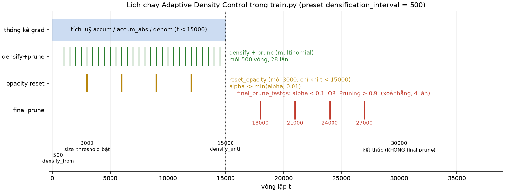

*Bốn hàng sự kiện trên trục $t\in[0,30000]$; preset interval 500.*
- → Hàng (B): 28 vạch từ 1000 đến 14 500 (vòng 500 bị loại vì `>` chặt).
- → (C) 4 vạch tại 3k/6k/9k/12k; (D) 4 vạch tại 18k/21k/24k/27k.
- → Khoảng $15000<t<18000$ trống: mô hình "tĩnh" 3000 vòng trước khi bị tỉa.

### Số lần densify và chi phí phụ

$$
\boxed{\ n_{\text{densify}}=\Bigl\lfloor\frac{15000-1}{\text{interval}}\Bigr\rfloor-\Bigl\lfloor\frac{500}{\text{interval}}\Bigr\rfloor
=\begin{cases}28 & \text{interval}=500\\144 & \text{interval}=100\end{cases}\ }
$$

Mỗi lần chấm điểm render $V=10$ view **hai lần** → $2V=20$ forward (không backward):

| interval | $n_{\text{densify}}$ | forward phụ $=20n$ | + final prune $4\times20$ | so với 30k vòng train |
|---|---|---|---|---|
| 500 | 28 | 560 | 640 | $\approx1\%$ |
| 100 | 144 | 2880 | 2960 | $\approx5\%$ |

### Ngân sách vòng ngắn

| `iterations` | densify (interval 500) | reset | final prune | Hệ quả |
|---|---|---|---|---|
| 3 000 | 5 lần, đều `size_threshold=None` | 1 | 0 | prune gần như không xoá |
| 7 000 | 13 lần | 2 | 0 | $\alpha$ về 0.01 tại 6000, chỉ 1000 vòng hồi |
| 15 000 | 28 lần | 4 | **0** | mục 12.5.3 không bao giờ chạy |
| 20 000 | 28 lần | 4 | 1 | tỉa duy nhất tại 18 000 |
| 30 000 | 28 lần | 4 | 4 | lịch đầy đủ |

Chọn ngân sách cách mốc 3000 ít nhất 1000–1500 vòng để $\alpha$ kịp học lại.

### Hình dung $N(t)$

$$
\boxed{\ N_n\approx N_0\bigl[(1+r_{\text{spawn}})(1-r_{\text{prune}})\bigr]^{\,n_{\text{densify}}}=N_0\,q^{\,n}\ }
\qquad
1.0925^{28}\approx11.9,\quad 1.0925^{144}\approx3.4\times10^5
$$

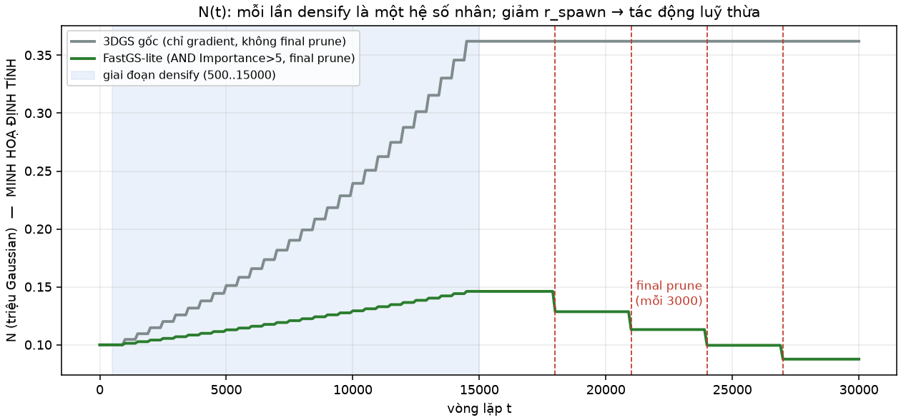

*Mô phỏng định tính: xám $=(r_{\text{spawn}},r_{\text{prune}})=(0.085,0.035)$, không final prune (3DGS); xanh $=(0.045,0.030)$ + $r_{\text{final}}=0.12$ (FastGS-lite).*
- → $N$ tăng **cấp số nhân** trong cửa sổ densify (mỗi vạch là một phép nhân).
- → Chỉ hạ $r_{\text{spawn}}$ 8.5% → 4.5% mà $N_{15000}$ khác $(1.085/1.045)^{28}\approx2.9$ lần — phép AND với Importance chính là cách hạ $r_{\text{spawn}}$.
- → Bốn bậc thang đỏ sau 15k là final prune — 3DGS gốc không có.

### Hai kiểu gọi `compute_gaussian_score_fastgs`

| | Densify (B) | Tỉa cuối (D) |
|---|---|---|
| Cờ | `DENSIFY=True` | `DENSIFY=False` |
| Trả về | `(importance, pruning)` | `(None, pruning)` |
| Bước cần | ①–⑦ | ①②③④⑥⑦ |
| View | `sampling_cameras`: 10 camera rút không hoàn lại từ **bản sao** danh sách train | như trái |

Importance/Pruning là **ước lượng Monte Carlo** từ 10 view; hai lần gọi liên tiếp rút hai bộ view khác nhau → ngưỡng Importance $>5$, Pruning $>0.9$ được đặt "mềm".

## 12.1.3 Bước ① — Sai số màu từng pixel

$$
\boxed{\ e_v(x)=\frac13\sum_{\text{ch}\in\{R,G,B\}}\bigl|I^{(v)}_{\text{rend},\text{ch}}(x)-I^{(v)}_{\text{gt},\text{ch}}(x)\bigr|\ }\qquad e_v\in[0,1]^{H\times W}
$$

- Trục gộp: **kênh màu**. Shape `[3,H,W] → [H,W]`.
- Không phải loss train; nhưng liên hệ: $\mathcal L_1^{(v)}=\frac1{HW}\sum_x e_v(x)$ — bước ① giữ lại **vị trí** mà $\mathcal L_1$ đã gộp mất.
- Chạy dưới `no_grad`, không tạo gradient.

### Vì sao trung bình 3 kênh, vì sao L1

| Cách gộp kênh | Pixel GT $(0.60,0.30,0.30)$, render $(0.30,0.45,0.30)$ | Kết luận |
|---|---|---|
| mean 3 kênh (code) | $\frac13(0.30+0.15+0)=0.15$ | bật |
| max kênh | $0.30$ | nhạy nhiễu 1 kênh |
| luminance | $\approx0.002$ | **bỏ sót** sai màu |

$$
\frac{\max e}{\text{median}\,e}\Big|_{\text{view 1}}:\quad L1=\frac{0.40}{0.02}=20,\qquad \text{MSE}\approx346
$$

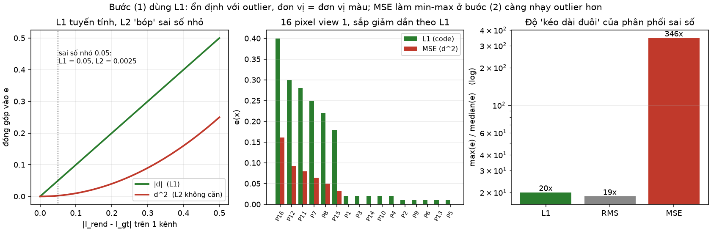

*Trái: $|d|$ vs $d^2$; giữa: 16 pixel view 1 theo L1 (xanh) và MSE (đỏ); phải: $\max/\text{median}$ thang log.*

- → L2 nén sai số nhỏ ($d=0.05\Rightarrow d^2=0.0025$), kéo dài đuôi phân phối → bước ② (chia cho $\max-\min$) sẽ đẩy pixel "sai vừa" về 0.
- → L1 khớp loss train và cho phân phối $e_v$ ít lệch nhất.

### Ví dụ $4\times4$ — view 1

| Pixel | render | GT | $e^1$ |
|---|---|---|---|
| $P_1$ | .48,.51,.47 | .50,.50,.50 | .02 |
| $P_2$ | .43,.38,.44 | .42,.40,.44 | .01 |
| $P_3$ | .57,.60,.61 | .60,.58,.62 | .02 |
| $P_4$ | .37,.34,.36 | .35,.36,.34 | .02 |
| $P_5$ | .54,.54,.56 | .55,.53,.57 | .01 |
| $P_6$ | .48,.50,.49 | .48,.47,.49 | .01 |
| $P_7$ | .40,.42,.41 | .70,.66,.62 | **.25** |
| $P_8$ | .40,.40,.40 | .68,.60,.58 | **.22** |
| $P_9$ | .32,.30,.29 | .30,.31,.29 | .01 |
| $P_{10}$ | .42,.44,.49 | .45,.44,.46 | .02 |
| $P_{11}$ | .39,.41,.40 | .72,.68,.64 | **.28** |
| $P_{12}$ | .39,.40,.40 | .75,.70,.64 | **.30** |
| $P_{13}$ | .39,.35,.39 | .38,.37,.39 | .01 |
| $P_{14}$ | .43,.41,.43 | .41,.42,.40 | .02 |
| $P_{15}$ | .45,.44,.43 | .66,.62,.58 | **.18** |
| $P_{16}$ | .35,.35,.34 | .80,.74,.70 | **.40** |

$$
e^1_{P_7}=\tfrac13(0.30+0.24+0.21)=0.25,\qquad e^1_{P_{16}}=\tfrac13(0.45+0.39+0.36)=0.40
$$

$$
e^1=\begin{pmatrix}.02&.01&.02&.02\\.01&.01&.25&.22\\.01&.02&.28&.30\\.01&.02&.18&.40\end{pmatrix}
$$

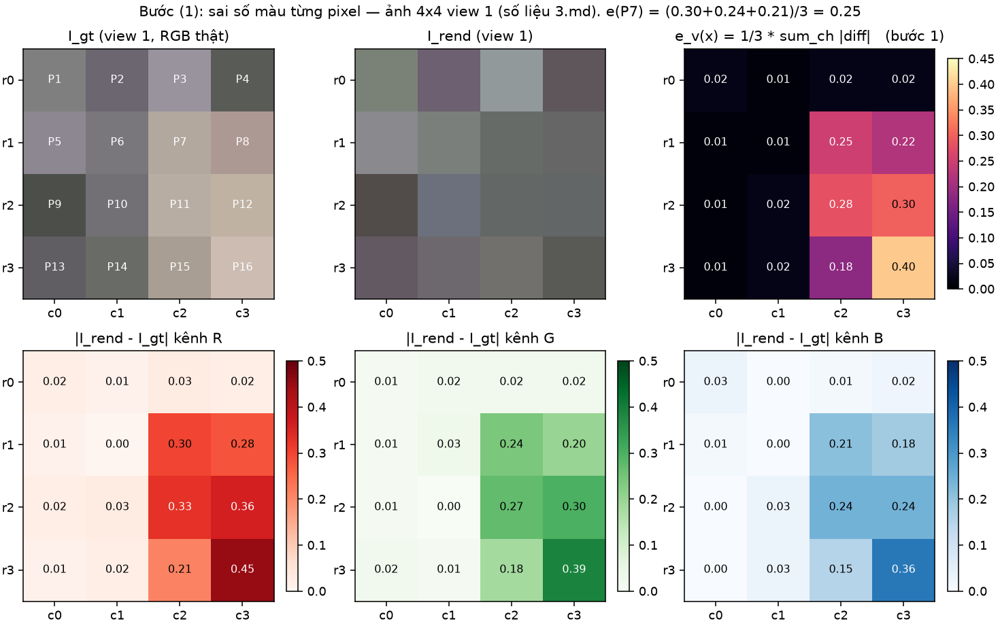

*Hàng trên: GT, render, $e^1$; hàng dưới: $|\Delta|$ từng kênh R, G, B.*

- → $e^1$ = trung bình theo vị trí của 3 bản đồ hàng dưới; khối $3\times2$ góc dưới-phải sai nặng (mô hình **thiếu** vật thể sáng).
- → Nền có $e\in\{.01,.02\}$ (sàn nhiễu) → sẽ là $e_{\min}$; $P_{16}=0.40$ sẽ là $e_{\max}$.

### Ba view

| | $P_1$ | $P_2$ | $P_3$ | $P_4$ | $P_5$ | $P_6$ | $P_7$ | $P_8$ | $P_9$ | $P_{10}$ | $P_{11}$ | $P_{12}$ | $P_{13}$ | $P_{14}$ | $P_{15}$ | $P_{16}$ |
|---|---|---|---|---|---|---|---|---|---|---|---|---|---|---|---|---|
| $e^1$ | .02 | .01 | .02 | .02 | .01 | .01 | **.25** | **.22** | .01 | .02 | **.28** | **.30** | .01 | .02 | **.18** | **.40** |
| $e^2$ | .01 | .02 | .01 | .02 | .02 | .01 | **.13** | **.11** | .02 | .01 | **.15** | **.14** | .01 | .02 | **.12** | **.16** |
| $e^3$ | .02 | .01 | .02 | .03 | .01 | .02 | **.19** | **.17** | .02 | **.12** | **.21** | **.20** | .01 | .02 | **.16** | **.24** |

- Cùng vùng sai, **cường độ khác** ($e_{\max}$: 0.40 / 0.16 / 0.24); view 3 có thêm $P_{10}=0.12$.

Cảnh đồ chơi $48\times32$ (mô hình $\alpha=0.1$ vs GT $0.9$):

| view | $\min e_v$ | $\max e_v$ | mean $e_v$ |
|---|---|---|---|
| 1 | 0.006232 | 0.438925 | 0.259278 |
| 2 | 0 | 0.441639 | 0.222367 |
| 3 | 0 | 0.440789 | 0.204733 |

### Code

```python
# utils/fast_utils.py:21-25
def get_loss(reconstructed_image, original_image):
    l1_loss = torch.mean(torch.abs(reconstructed_image - original_image), 0).detach()          # ①  [H,W]
    l1_loss_norm = (l1_loss - torch.min(l1_loss)) / (torch.max(l1_loss) - torch.min(l1_loss))  # ②  [0,1]
    return l1_loss_norm
```

- `l1_loss` ở đây là **bản đồ** `[H,W]`, không phải scalar `l1_loss` của `loss_utils`.

## 12.1.4 Bước ② — Chuẩn hoá min–max theo ảnh

$$
\boxed{\ \hat e_v(x)=\frac{e_v(x)-a_v}{D_v},\qquad a_v=\min_x e_v,\ b_v=\max_x e_v,\ D_v=b_v-a_v\ }
$$

- Affine tăng trên **từng ảnh**: thứ tự pixel không đổi, đúng một pixel đạt 1, một đạt 0.
- Toàn bộ thông tin rút ra từ ảnh chỉ là $(a_v,b_v)$ → rẻ, nhưng nhạy với 2 pixel cực trị.

### Ngưỡng tuyệt đối tương đương

$$
\boxed{\ \hat e_v(x)>\tau\iff e_v(x)>a_v+\tau\,D_v\ }
$$

| view | $a_v$ | $b_v$ | $D_v$ | $a_v+0.1D_v$ | pixel bật | số |
|---|---|---|---|---|---|---|
| 1 | 0.01 | 0.40 | 0.39 | **0.049** | $P_7,P_8,P_{11},P_{12},P_{15},P_{16}$ | 6 |
| 2 | 0.01 | 0.16 | 0.15 | **0.025** | $P_7,P_8,P_{11},P_{12},P_{15},P_{16}$ | 6 |
| 3 | 0.01 | 0.24 | 0.23 | **0.033** | $P_7,P_8,P_{10},P_{11},P_{12},P_{15},P_{16}$ | 7 |

- Ngưỡng tuyệt đối cố định $e>0.15$ sẽ để view 2 chỉ còn **1** pixel — view "tốt" bị sụp; và khi $e_{\max}$ giảm dần theo train, mọi view về 0 pixel → densify tắt. Min–max hỏi câu **tương đối** nên tự co theo ảnh.

$$
\hat e^1=\begin{pmatrix}.026&0&.026&.026\\0&0&\mathbf{.615}&\mathbf{.538}\\0&.026&\mathbf{.692}&\mathbf{.744}\\0&.026&\mathbf{.436}&\mathbf{1.00}\end{pmatrix},\quad
\hat e^2=\begin{pmatrix}0&.067&0&.067\\.067&0&\mathbf{.800}&\mathbf{.667}\\.067&0&\mathbf{.933}&\mathbf{.867}\\0&.067&\mathbf{.733}&\mathbf{1.00}\end{pmatrix},\quad
\hat e^3=\begin{pmatrix}.043&0&.043&.087\\0&.043&\mathbf{.783}&\mathbf{.696}\\.043&\mathbf{.478}&\mathbf{.870}&\mathbf{.826}\\0&.043&\mathbf{.652}&\mathbf{1.00}\end{pmatrix}
$$

$$
\hat e^1_{P_7}=\frac{0.25-0.01}{0.39}=0.615,\qquad \hat e^1_{P_{15}}=\frac{0.18-0.01}{0.39}=0.436
$$

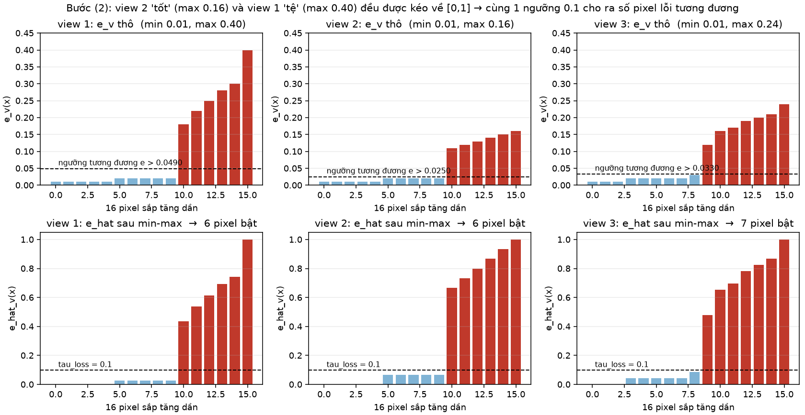

*Mỗi cột một view. Trên: $e_v$ sắp tăng, thang $[0,0.45]$, gạch ngang = $a_v+0.1D_v$. Dưới: $\hat e_v$, thang $[0,1]$, gạch = $\tau=0.1$.*

- → Ba view "cao" khác nhau (0.16 vs 0.40) nhưng sau chuẩn hoá đều trải $[0,1]$; $\tau=0.1$ cắt đúng chỗ "gãy" nền/lỗi ở cả 3.
- → $P_{10}$ view 3 ($\hat e=0.478$) nằm giữa hai nhóm, vẫn bật.

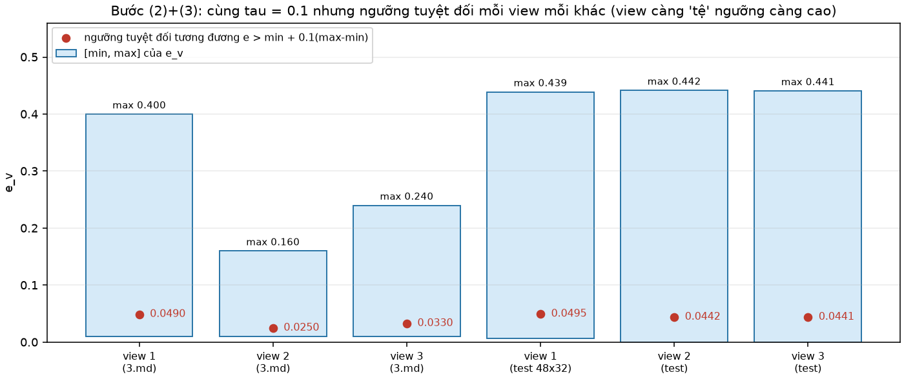

*Cột = khoảng $[a_v,b_v]$; chấm đỏ = $a_v+0.1D_v$. Ba view $4\times4$ và ba view $48\times32$.*

- → Ngưỡng dao động gấp đôi (0.025–0.049) chỉ vì $e_{\max}$ khác.
- → Luôn ở **10% quãng đường đáy→đỉnh**: ngưỡng "rộng lượng" ở pixel, cân bằng bởi ngưỡng chặt Importance $>5$ ở Gaussian.

### Trường hợp biên 1: $D_v=0$

- `0/0` → `NaN`; `NaN > 0.1` là `False` → mặt nạ rỗng, **không crash**. Code không thêm $\varepsilon$.
- Nếu thêm $\varepsilon$:

$$
\hat e^{\varepsilon}_v=\hat e_v\cdot\frac{D_v}{D_v+\varepsilon}\qquad(D_v=0.39,\ \varepsilon=10^{-3}\Rightarrow\times0.9974)
$$

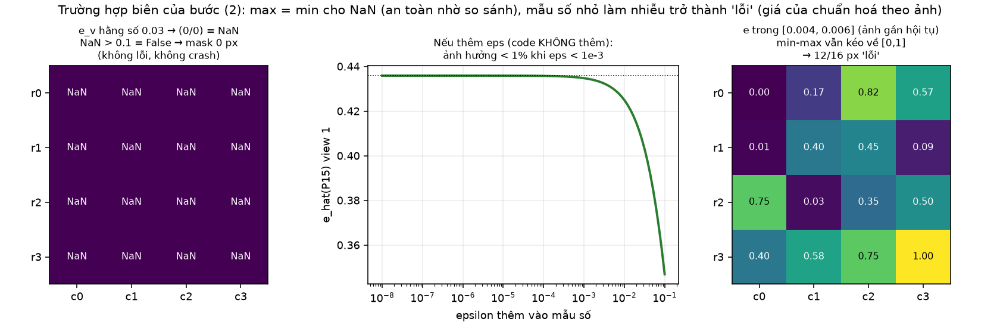

*Trái: $e_v$ hằng → NaN → 0 pixel. Giữa: $\hat e(P_{15})$ theo $\varepsilon$ (log). Phải: $e_v\in[0.004,0.006]$ (nhiễu lượng tử) vẫn bị kéo đủ $[0,1]$, 14/16 pixel bật.*

- → Giá thật của min–max không phải NaN mà là **khuếch đại nhiễu khi ảnh gần hội tụ** → phải AND với gradient, không dùng Importance một mình.

### Trường hợp biên 2: một pixel outlier

| | gốc | $e(P_1)=0.90$ |
|---|---|---|
| $D_v$ | 0.39 | 0.89 |
| ngưỡng $a_v+0.1D_v$ | 0.049 | 0.099 |
| $\hat e(P_{16})$ | 1.000 | 0.438 |
| $\hat e(P_{15})$ | 0.436 | 0.191 |
| pixel bật | 6 | 7 |

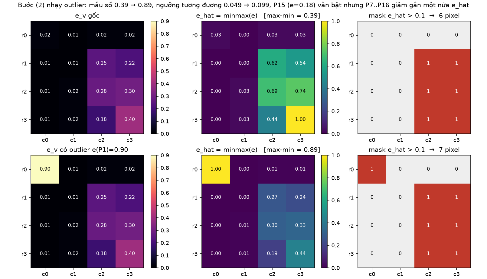

*Trên: view 1 gốc; dưới: thêm $e(P_1)=0.90$. Cột: $e_v$, $\hat e_v$, mặt nạ.*

- → Mọi pixel sai thật bị kéo xuống hơn nửa; ở $\tau=0.1$ mặt nạ vẫn sống nhờ ngưỡng thấp.
- → Phòng vệ thật nằm ở bước ⑤: outlier ở **một** view bị chia cho $V=10$.

### So với chuẩn hoá khác

| Phép | Công thức | Bền outlier | Chi phí |
|---|---|---|---|
| min–max (code) | $(e-a)/(b-a)$ | không | 2 reduce |
| z-score | $(e-\mu)/\sigma$ | trung bình | 2 reduce |
| percentile | $\text{clip}\frac{e-p_5}{p_{95}-p_5}$ | có | sort $O(HW\log HW)$ |

- Cả ba đều **đơn điệu tăng** → cùng mặt nạ với ngưỡng thích hợp; chỉ khác chỗ $0.1$ rơi vào đâu.

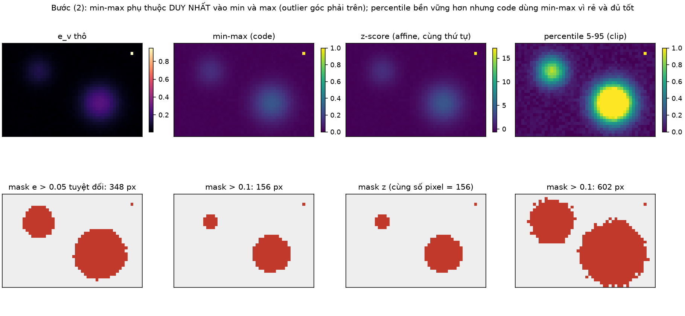

*Ảnh $48\times32$: nền nhiễu, 2 vùng sai (0.25, 0.12), 1 outlier 0.95. Trên: $e_v$ + 3 phép chuẩn hoá; dưới: mặt nạ.*

- → Lõi vùng sai giống nhau ở cả ba; khác biệt chỉ ở rìa — rìa được bù bởi việc đếm trên footprint hàng trăm pixel → chọn phép rẻ nhất.

### Trace `get_loss` trên $2\times2$ ($P_{11},P_{12},P_{15},P_{16}$)

$$
e=\begin{pmatrix}.28&.30\\.18&.40\end{pmatrix}
\;\xrightarrow{\ \min=.18,\ \max=.40\ }\;
\hat e=\begin{pmatrix}.4545&.5455\\0&1\end{pmatrix}
\;\xrightarrow{\ >0.1\ }\;
m=\begin{pmatrix}1&1\\0&1\end{pmatrix}
$$

- → $P_{15}$ ($e=0.18$) bật trong ảnh $4\times4$ ($\hat e=0.436$) nhưng **tắt** trong ảnh $2\times2$ (là pixel min). Quyết định phụ thuộc **các pixel khác cùng ảnh**.

### Min–max ② vs min–max ⑦

| | Bước ② | Bước ⑦ |
|---|---|---|
| Chạy trên | $HW$ pixel của **một** view | $N$ Gaussian, **sau** gộp $V$ view |
| Số lần / lần gọi | $V=10$ | 1 |
| Ý nghĩa 1 | pixel sai nhất trong ảnh | Gaussian đáng xoá nhất |
| Đi vào | $\tau_{\text{loss}}=0.1$ | ngưỡng 0.9, trọng số $1/(10^{-6}+1-\text{Pruning})$ |

## 12.1.5 Bước ③ — Mặt nạ nhị phân với $\tau_{\text{loss}}=0.1$

$$
\boxed{\ m_v(x)=\mathbb 1\bigl[\hat e_v(x)>0.1\bigr]\iff e_v(x)>a_v+0.1\,(b_v-a_v)\ }\qquad m_v\in\{0,1\}^{H\times W}
$$

- So sánh **chặt**; pixel min ($\hat e=0$) không bao giờ bật.
- Nhị phân thay vì soft count vì: kernel đếm bằng `atomicAdd` int; Importance $>5$ đọc được là "hơn 5 pixel lỗi/view"; cắt đuôi nhiễu (Gaussian phủ 1000 pixel nền $\hat e\approx0.03$ sẽ có soft count $30>5$).
- Ngưỡng tương đương $\approx0.03$–$0.05$ trên thang màu ≈ 8–13 mức xám 8-bit.

### Độ nhạy theo $\tau$

| $\tau$ | view 1 | view 2 | view 3 | nhận xét |
|---|---|---|---|---|
| 0.02 | 11 | 11 | 13 | nền bật |
| 0.05 | 6 | **11** | 8 | view 2 sụp ($D_2$ nhỏ, nền $\hat e=0.067>0.05$) |
| **0.1** | **6** | **6** | **7** | sạch |
| 0.2 | 6 | 6 | 7 | vẫn đúng |
| 0.5 | 5 | 6 | 6 | mất $P_{15}$ (v1), $P_{10}$ (v3) |

$$
\tau\in[0.09,\,0.43]\ \Rightarrow\ \text{cùng mặt nạ ở cả 3 view}\quad(\text{cận dưới: } \hat e^3_{P_4}=0.087;\ \text{cận trên: } \hat e^1_{P_{15}}=0.436)
$$

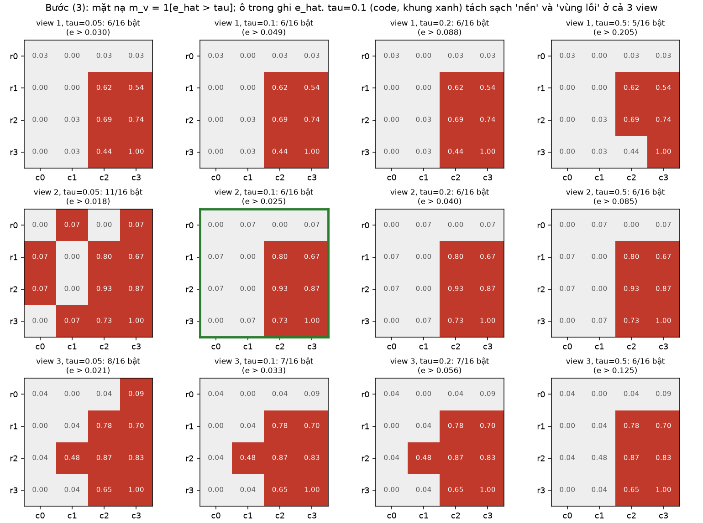

*Hàng = view, cột = $\tau\in\{0.05,0.1,0.2,0.5\}$; ô đỏ = bật, số = $\hat e_v$; khung xanh = cấu hình code.*

- → $\tau=0.05$ view 2: 5 pixel nền bật vì thang quá ngắn. $\tau=0.5$ view 1: mất $P_{15}$ (sai gấp 9 lần nền).
- → Hai cột giữa giống hệt: không cần tinh chỉnh $\tau$ chính xác.

$$
f_v(\tau)=\frac1{HW}\sum_x\mathbb 1[\hat e_v(x)>\tau]\quad(\text{survival function của }\hat e_v)
$$

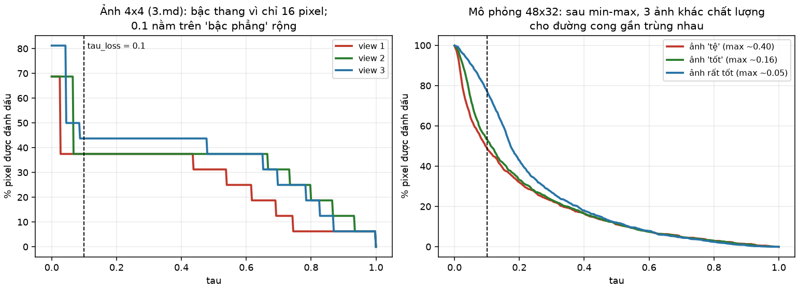

*Trái: $f_v(\tau)$ 3 view $4\times4$ (bậc $1/16$). Phải: 3 ảnh $48\times32$ cùng hình dạng, biên độ 0.40/0.16/0.05.*

- → Trái: $\tau=0.1$ nằm ngay sau bậc dốc nền rơi ra ($\tau\approx0.03$–$0.09$), trên đoạn phẳng tới $0.43$.
- → Phải: $e_{\max}$ khác 8 lần vẫn cho 3 đường gần trùng — "ngưỡng tự co theo ảnh". Ảnh "rất tốt" dịch phải: **càng hội tụ, mặt nạ càng rộng** → lý do phải AND với gradient.

### Mặt nạ trên cảnh đồ chơi $48\times32$

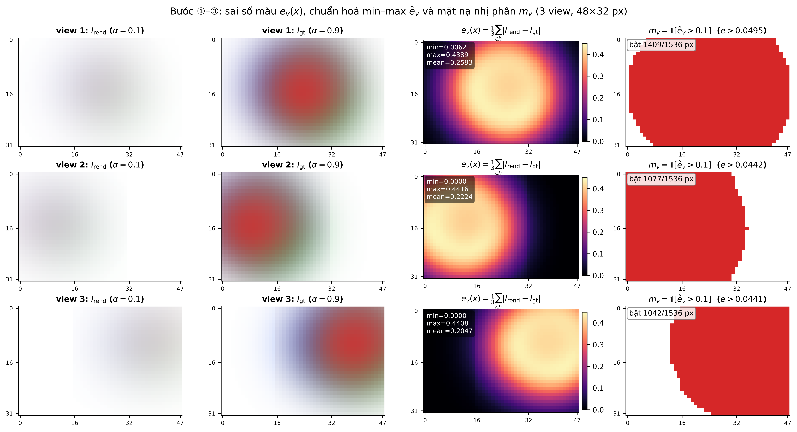

*3 view × ($I_{\text{rend}}$, $I_{\text{gt}}$, $e_v$, mặt nạ $\hat e_v>0.1$).*

| view | pixel bật / 1536 | tỉ lệ |
|---|---|---|
| 1 | **1409** | 91.7% |
| 2 | **1077** | 70.1% |
| 3 | **1042** | 67.8% |

- → Mô hình mờ đều → gần cả ảnh sai; phần tắt là nền trắng không splat nào chạm ($e=0$). Hai cực của phổ: $4\times4$ (37–44%) = giữa train, $48\times32$ (68–92%) = đầu train. Khác biệt hấp thụ ở Importance $>5$ (974–1066 vs 0/0/6/3/1).

| Ảnh | $HW$ | pixel bật | $|\Omega_i|$ | "5 pixel" chiếm |
|---|---|---|---|---|
| $4\times4$ | 16 | 6–7 | 4–7 | gần cả footprint |
| $48\times32$ | 1 536 | 1042–1409 | 770–1301 | $<1\%$ |
| $1920\times1080$ | $2.07\times10^6$ | 5–30% | vài chục–vài nghìn | rất nhỏ |

- → Ở ảnh thật, Importance $\le5$ nghĩa là footprint gần như **sạch** hoàn toàn. Với `-r 2`, `-r 4`: footprint co theo bình phương nhưng ngưỡng 5 giữ nguyên → chặt hơn tương đối.

### Code — ba bước trong `compute_gaussian_score_fastgs`

```python
# utils/fast_utils.py:59-70 (trong vòng for view)
render_image = render_fastgs(cam, gaussians, pipe, bg, args.mult)["render"]        # [3,H,W]
photometric_loss = compute_photometric_loss(cam, render_image)                       # ⑥
gt_image = cam.original_image.cuda()
l1_loss_norm = get_loss(render_image, gt_image)                                      # ①② → [H,W]∈[0,1]
metric_map = (l1_loss_norm > args.loss_thresh).int()                                 # ③  → [H,W]∈{0,1}
render_pkg = render_fastgs(cam, gaussians, pipe, bg, args.mult,
                           get_flag=True, metric_map=metric_map)                     # ④ kernel đếm
accum_loss_counts = render_pkg["accum_metric_counts"]                                # [N]
```

| Ký hiệu | Biến | Shape | dtype |
|---|---|---|---|
| $I_{\text{rend}}, I_{\text{gt}}$ | `render_image`, `gt_image` | `[3,H,W]` | float32 |
| $e_v$ | `l1_loss` (trong `get_loss`) | `[H,W]` | float32 |
| $a_v,b_v$ | `torch.min/max(l1_loss)` | `[]` | float32 |
| $\hat e_v$ | `l1_loss_norm` | `[H,W]` | float32 |
| $\tau_{\text{loss}}$ | `args.loss_thresh` | — | 0.1 |
| $m_v$ | `metric_map` | `[H,W]` | int32 |
| $\text{counts}^{(v)}$ | `accum_loss_counts` | `[N]` | int |

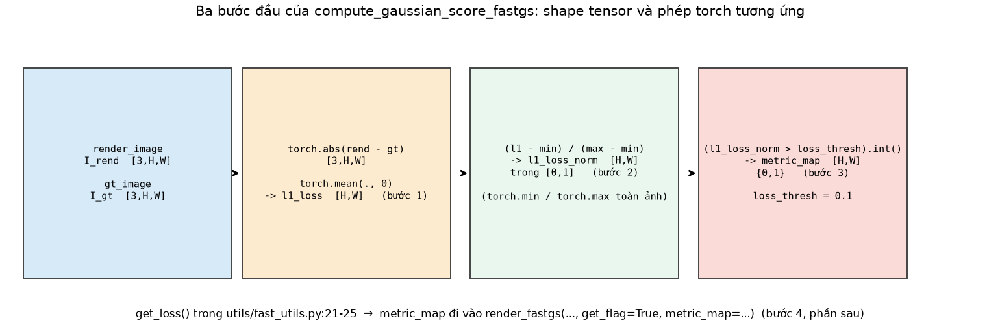

*Bốn hộp = bốn trạng thái dữ liệu trong một lần lặp `for view`; nhãn mũi tên = shape.*

- → Chỉ ① đổi shape (`[3,H,W]→[H,W]`); ②③ đổi **miền giá trị**. `metric_map` là input duy nhất phần 2 nhận từ ảnh.
- → `render_fastgs` gọi **hai lần**/view: lần 1 lấy ảnh, lần 2 đếm với `metric_map` → $2V=20$ forward mỗi lần chấm điểm.

### Cầu nối sang bước ④

$$
m_1=\begin{pmatrix}0&0&0&0\\0&0&1&1\\0&0&1&1\\0&0&1&1\end{pmatrix},\quad
m_2=\begin{pmatrix}0&0&0&0\\0&0&1&1\\0&0&1&1\\0&0&1&1\end{pmatrix},\quad
m_3=\begin{pmatrix}0&0&0&0\\0&0&1&1\\0&1&1&1\\0&0&1&1\end{pmatrix}
$$

$$
\text{view 1: }\ \text{counts}=(|\Omega_1\cap m_1|,\dots)=(0,\,0,\,6,\,4,\,5),\qquad \sum_i=15>6=|m_1|
$$

- → Một pixel bật tố cáo **mọi** Gaussian phủ nó. Mặt nạ là **tương đối theo ảnh**, **nhị phân**, **rộng lượng** — ba tính chất giải thích ngưỡng Importance $>5$ và Pruning $>0.9$.

### Tóm tắt phần 1 — con số cần nhớ

| Đại lượng | Giá trị |
|---|---|
| Bước ① | $e_v=\text{mean}_{\text{ch}}\lvert I_{\text{rend}}-I_{\text{gt}}\rvert$, L1, `[H,W]` |
| Bước ② | $\hat e_v=(e_v-a_v)/(b_v-a_v)$, theo ảnh, không $\varepsilon$ |
| Bước ③ | $m_v=\mathbb 1[\hat e_v>0.1]$, chặt, `.int()` |
| Ngưỡng tương đương | $a_v+0.1D_v$: 0.049 / 0.025 / 0.033 ($4\times4$); 0.0495 / 0.0442 / 0.0441 ($48\times32$) |
| Pixel bật $4\times4$ | 6 / 6 / 7 trên 16 |
| Pixel bật $48\times32$ | 1409 / 1077 / 1042 trên 1536 |
| Khoảng $\tau$ cùng mặt nạ | $[0.09,\,0.43]$ |
| $D_v=0$ | NaN → mặt nạ rỗng, không crash |
| Forward phụ / lần chấm | $2V=20$ |

---

## 12.2.1 Vị trí của bước ④ và ⑤ trong bảy bước

> Code: `utils/fast_utils.py:33-90`, `gaussian_renderer/__init__.py:18-110` (`get_flag`, `metric_map`, `accum_metric_counts`), `forward.cu:380-413` (`atomicAdd(metricCount)`), `rasterize_points.cu:102-109`.

Hai bước ④⑤ là chỗ tín hiệu **đổi trục gộp**: pixel → Gaussian, rồi view → 1 số.

| # | Công thức | Vào | Ra | Trục gộp |
|---|---|---|---|---|
| ④ | $\text{counts}^{(v)}_i=\sum_{x\in\Omega^{(v)}_i}m_v(x)$ | mặt nạ $m_v$ + hình học chiếu | vector $N$ nguyên / view | **pixel → Gaussian** |
| ⑤ | $\text{Importance}_i=\lfloor\frac1V\sum_v\text{counts}^{(v)}_i\rfloor$ | ma trận $N\times V$ | vector $N$ nguyên | **view → 1 số** |

Ký hiệu: $N$ Gaussian, $V$ view lấy mẫu ($V=10$ code, $V=3$ ví dụ tay), $m_v(x)\in\{0,1\}$ = `metric_map`, $\Omega^{(v)}_i$ = footprint hữu hình, $\text{counts}$ = `accum_metric_counts`, $\text{Importance}$ = `importance_score`. **Mọi đại lượng ở ④⑤ đều là số nguyên** — không chuẩn hoá $[0,1]$, không chia diện tích.

## 12.2.2 Footprint hữu hình $\Omega^{(v)}_i$: "chạm" chứ không "chiếm"

### 12.2.2.1 Từ Gaussian 3D đến ellipse 2D

Chiếu qua camera $v$: $\Sigma'_i=J\Sigma_iJ^\top+0.3I$, conic $=\Sigma'^{-1}_i$. Tại pixel $x$:

$$
\text{power}=-\tfrac12\,\Delta^\top\Sigma'^{-1}_i\Delta,\quad \Delta=\mu'_i-x,\qquad
\alpha_i(x)=\min\bigl(0.99,\ \alpha_i\,e^{\text{power}}\bigr)
$$

Ellipse $3\sigma$ hình học **không** phải footprint mà ④ dùng.

### 12.2.2.2 Ba cửa loại quyết định footprint

$$
\boxed{\ \Omega^{(v)}_i=\bigl\{x:\ \underbrace{x\in\text{tile}(i)}_{\text{cửa 1: compact box}}\ \wedge\ \underbrace{\alpha_i(x)\ge\tfrac1{255}}_{\text{cửa 2}}\ \wedge\ \underbrace{T_{\text{trước }i}(x)\,(1-\alpha_i(x))\ge10^{-4}}_{\text{cửa 3: chưa bão hoà}}\bigr\}\ }
$$

| Cửa | Điều kiện | Phụ thuộc | Ghi chú |
|---|---|---|---|
| 1 | level-set $\Delta^\top\Sigma'^{-1}\Delta\le t_i$, $t_i=\text{mult}\cdot2\ln(255\alpha_i)$, `mult`$=0.5$ | riêng $i$ | $\alpha_i=0.1\Rightarrow t_i=3.24$; $\alpha_i=0.01\Rightarrow t_i=0.94$ (dưới $1\sigma$) |
| 2 | $\alpha_i(x)\ge1/255$ | riêng $i$ | bỏ *một* splat tại *một* pixel |
| 3 | $T(1-\alpha_i)\ge10^{-4}$ | **Gaussian khác** đứng trước | early-out thật: `done = true` |

- Cửa 1 với `mult`$=0.5$ **chặt hơn** cửa 2 (bán kính nhỏ hơn $\sqrt2$ lần).
- Cửa 3 khiến $\Omega$ không phải hàm riêng của $i$ → cột "bị che" ($G_5$, $\Omega=\varnothing$).

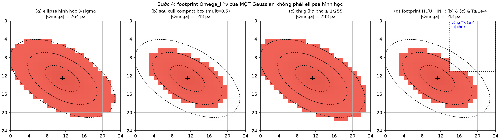

*Cùng một Gaussian ($s=4.2\times2.2$ px, $30^\circ$, $\alpha=0.6$): (a) ellipse $3\sigma$ 264 px; (b) compact box `mult`$=0.5$ 148 px; (c) $\alpha\ge1/255$ 288 px; (d) giao cả 3 cửa 143 px.*

- → Footprint thật (d) chỉ ≈ **một nửa** ellipse $3\sigma$.
- → Tự cài bằng "$3\sigma$" sẽ cho `counts` gấp đôi → ngưỡng 5 đổi nghĩa.

### 12.2.2.3 Nhiều Gaussian chồng nhau

$$
C(x)=\sum_{k}c_k\,\alpha_k(x)\,T_k(x),\qquad T_k(x)=\prod_{j<k}\bigl(1-\alpha_j(x)\bigr)
\quad\Rightarrow\quad
\sum_i\bigl|\Omega^{(v)}_i\bigr|\gg HW,\qquad \sum_i\text{counts}^{(v)}_i\gg\sum_x m_v(x)
$$

**Một pixel lỗi tố cáo mọi Gaussian đóng góp vào nó.** (`3.md` view 1: $15$ vs $6$; đồ chơi: $4854$ vs $1409$.)

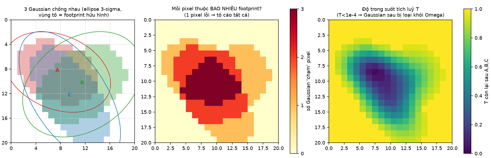

*A ($\alpha=0.95$), B (0.5), C (0.7); giữa: số Gaussian chạm mỗi pixel (0–3); phải: $T$ còn lại.*

- → Vùng giao có giá trị 2–3: pixel lỗi ở đó cộng 1 vào **cả** A, B, C, không chia theo $\alpha T$.
- → Sau A: $T=0.05$; sau B: $0.025$ — vẫn $>10^{-4}$ nên C vẫn chạm. Cửa 3 chỉ cắt khi 4–5 Gaussian đục chồng.

### 12.2.2.4 Bảng footprint của `3.md` (INPUT C)

| | view 1 | view 2 | view 3 |
|---|---|---|---|
| $G_1$ | $\{1,2,5,6\}$ | $\{1,2,5,6\}$ | $\{1,2,5,6\}$ |
| $G_2$ | $\{9,10,13,14\}$ | $\{9,10,13,14\}$ | $\{9,10,13,14\}$ |
| $G_3$ | $\{7,8,11,12,15,16\}$ | $\{7,8,11,12,15,16\}$ | $\{7,8,11,12,15,16\}$ |
| $G_4$ | $\{10,11,12,14,15,16\}$ | $\{11,12,15,16\}$ | $\{11,12,16\}$ |
| $G_5$ | $\{3,4,7,8,12,15,16\}$ | $\varnothing$ ($T<10^{-4}$) | $\varnothing$ |

- $G_1,G_2,G_3$: ổn định qua 3 view. $G_4$: co $6\to4\to3$. $G_5$: chỉ hữu hình 1 view — "artefact một góc".
- $P_{12},P_{15},P_{16}$ (view 1) thuộc **ba** footprint $G_3,G_4,G_5$ → tổng counts $15\ne6$.

### 12.2.2.5 Ba nguyên nhân footprint đổi theo view

| Nguyên nhân | Cửa | Biểu hiện | Ví dụ |
|---|---|---|---|
| Phép chiếu $\Sigma'=J\Sigma J^\top$ | 1, 2 | $\lvert\Omega\rvert$ co/giãn trơn | đồ chơi: $\Sigma'_{11}$ 72.6 → 82.8 |
| Cắt khung / tile | 1 | giảm đột ngột gần biên | đồ chơi view 2,3: 4/6 tile, $\approx1250\to950$ px |
| Che khuất | 3 | về 0 ở vài view | `3.md`: $G_5$ |

## 12.2.3 Bước ④ — đếm pixel lỗi trong footprint

### 12.2.3.1 Công thức

$$
\boxed{\ \text{counts}^{(v)}_i=\sum_{x\in\Omega^{(v)}_i}m_v(x)=\bigl|\Omega^{(v)}_i\cap\{x:m_v(x)=1\}\bigr|\ }
$$

Biên: $\Omega=\varnothing\Rightarrow0$; $m_v\equiv0\Rightarrow0$; $\Omega\subseteq\{m_v=1\}\Rightarrow\text{counts}=|\Omega|$.

### 12.2.3.2 Tính tay `3.md`

Mặt nạ: $m_1=m_2=\{7,8,11,12,15,16\}$, $m_3=\{7,8,10,11,12,15,16\}$.

| | view 1 | view 2 | view 3 |
|---|---|---|---|
| $G_1$ | $\{1,2,5,6\}\cap m_1=\varnothing\Rightarrow0$ | 0 | 0 |
| $G_2$ | 0 | 0 | $\{10\}\Rightarrow\mathbf1$ |
| $G_3$ | toàn bộ $\Rightarrow\mathbf6$ | $\mathbf6$ | $\mathbf6$ |
| $G_4$ | $\{11,12,15,16\}\Rightarrow4$ | $4$ | $\{11,12,16\}\Rightarrow3$ |
| $G_5$ | $\{7,8,12,15,16\}\Rightarrow5$ | $\varnothing\Rightarrow0$ | 0 |

- $G_4$ view 1: $|\Omega|=6$, 4 sai (tỉ lệ $4/6$); view 3: $|\Omega|=3$, 3 sai (tỉ lệ 1.0) nhưng counts **thấp hơn** → ④ đếm tuyệt đối, không tỉ lệ.

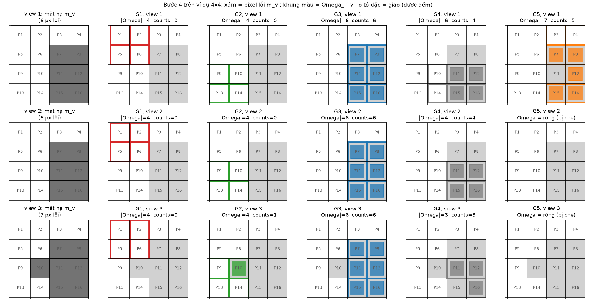

*Hàng = view, cột = mặt nạ + 5 Gaussian; khung màu = $\Omega$, ô đặc = giao được đếm.*

- → Theo hàng: $P_{16}$ đặc ở 3 ô $G_3,G_4,G_5$ — một pixel, ba Gaussian bị đếm.
- → Theo cột: $G_3$ ba ô giống hệt (nhất quán), $G_4$ khung co dần, $G_5$ hai ô trống.

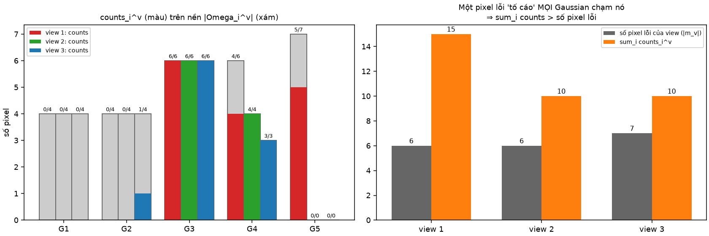

*Trái: cột xám $|\Omega|$, cột màu counts. Phải: $|m_v|=(6,6,7)$ vs $\sum_i\text{counts}=(15,14,16)$.*

- → Chỉ $G_3$ có cột màu phủ kín xám ở cả 3 view.
- → Đơn vị của counts là **cặp (pixel lỗi, Gaussian)**, không phải pixel — gấp 2.3–2.5 lần.

### 12.2.3.3 Code: `metric_map` → `accum_metric_counts`

```python
render_image  = render_fastgs(cam, gaussians, pipe, bg, args.mult)["render"]        # [3,H,W]
l1_loss_norm  = get_loss(render_image, cam.original_image.cuda())                     # ①② [H,W]
metric_map    = (l1_loss_norm > args.loss_thresh).int()                               # ③  [H,W]
render_pkg    = render_fastgs(cam, gaussians, pipe, bg, args.mult,
                              get_flag=True, metric_map=metric_map)                   # ④
accum_loss_counts = render_pkg["accum_metric_counts"]                                 # [N] int32
```

- **Render 2 lần/view**: mặt nạ cần ảnh hoàn chỉnh (min–max toàn ảnh) → $2V=20$ forward mỗi lần chấm.
- `metric_map` xuống kernel dạng phẳng `pix_id = y*W + x`; phải `.contiguous()`.
- Không có `scatter` phía Python: toàn bộ "đổ về Gaussian" trong CUDA.

### 12.2.3.4 Trong kernel: `atomicAdd`

```cpp
// forward.cu:399-408 — sau cả 3 cửa
for (int ch = 0; ch < CHANNELS; ch++)
    C[ch] += features[collected_id[j] * CHANNELS + ch] * alpha * T;
if (get_flag && metric_map[pix_id] == 1)
    atomicAdd(&(metricCount[collected_id[j]]), 1);
T = test_T;
```

- Nằm **sau** `alpha < 1/255 → continue` và `test_T < 1e-4 → done` → chỉ đếm khi thật sự cộng màu.
- Mỗi cặp cộng đúng **1**, không nhân $\alpha T$. `atomicAdd` vì nhiều pixel (thread) ghi cùng `metricCount[id]`.

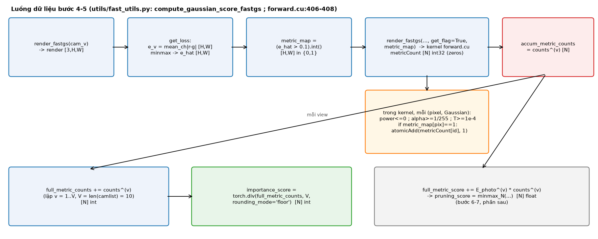

*Hàng trên: 1 view, render → mặt nạ $[H,W]$ → render lần 2 → counts $[N]$. Hàng dưới: cộng dồn qua $V$ view.*

- → Chỉ **một** chỗ đổi shape $[H,W]\to[N]$, và nó nằm trong CUDA.
- → Debug: `accum.sum() ≫ metric_map.sum()`, `(accum>0).sum() ≤ (radii>0).sum()`.

### 12.2.3.5 Cảnh đồ chơi $48\times32$

| | view 1 | view 2 | view 3 | $\sum_v$ | $\lvert\Omega\rvert$ (v1, v2, v3) |
|---|---|---|---|---|---|
| $G_1$ | 1248 | 954 | 930 | **3132** | 1248, 954, 930 |
| $G_2$ | 1181 | 1003 | 869 | **3053** | 1197, 1005, 869 |
| $G_3$ | 1245 | 978 | 977 | **3200** | 1301, 978, 990 |
| $G_4$ | 1180 | 973 | 770 | **2923** | 1193, 974, 770 |

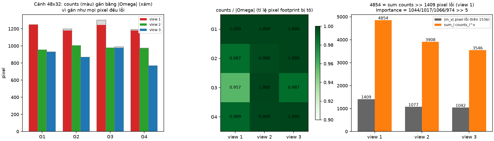

*Trái: counts phủ gần kín $|\Omega|$. Giữa: tỉ lệ $0.977$–$1.000$. Phải: $|m_v|=(1409,1077,1042)$ vs $\sum\text{counts}=(4854,3908,3546)$.*

- → Mỗi pixel lỗi bị ≈ 3.5 Gaussian chạm ($N=4$, splat bán kính 26–29 px).
- → Ở đây counts đo "footprint to bao nhiêu", không đo "vùng nào sai".

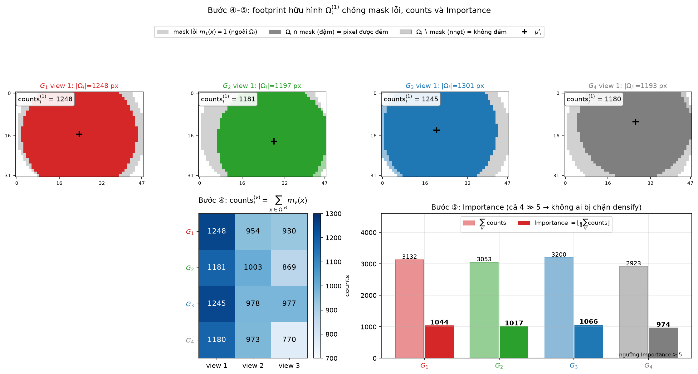

*Hình gốc: footprint $\Omega^{(1)}_i$ trên mặt nạ view 1; bảng counts $4\times3$; Importance cả 4 đều $\gg5$.*

- → Gaussian **quá to** so với ảnh → ④⑤ mất khả năng phân biệt. Đây là lý do `densify_from_iter = 500`.

### 12.2.3.6 Trace một pixel qua kernel

Pixel $x$ có `metric_map[x]=1`, danh sách tile sau sort: $[A,B,C,D,E]$.

| $j$ | G | $\alpha_j(x)$ | $T$ trước | $T(1-\alpha_j)$ | cửa 2 | cửa 3 | cộng màu | `atomicAdd` | $T$ sau |
|---|---|---|---|---|---|---|---|---|---|
| 1 | A | 0.90 | 1.000 | 0.100 | ✓ | ✓ | ✓ | **+1 → A** | 0.100 |
| 2 | B | 0.002 | 0.100 | — | ✗ | — | ✗ | ✗ | 0.100 |
| 3 | C | 0.95 | 0.100 | 0.005 | ✓ | ✓ | ✓ | **+1 → C** | 0.005 |
| 4 | D | 0.99 | 0.005 | $5\times10^{-5}$ | ✓ | ✗ `done` | ✗ | ✗ | 0.005 |
| 5 | E | 0.50 | — | — | (không xét) | | ✗ | ✗ | |

- $x\in\Omega_A,\Omega_C$; $x\notin\Omega_B$ (quá mờ), $\notin\Omega_D$ (làm bão hoà — D bị loại), $\notin\Omega_E$ (sau điểm dừng).
- Thứ tự depth quyết định ai bị cửa 3 loại → footprint "không phải hình học".

## 12.2.4 Bước ⑤ — Importance score

### 12.2.4.1 Công thức và code

$$
\boxed{\ \text{Importance}_i=\Bigl\lfloor\frac1V\sum_{v=1}^{V}\text{counts}^{(v)}_i\Bigr\rfloor\ }
\qquad
\text{metric\_mask}_i=[\text{Importance}_i>5]\iff\lfloor S_i/V\rfloor\ge6\iff S_i\ge6V=60
$$

```python
if DENSIFY:
    full_metric_counts = accum_loss_counts.clone() if full_metric_counts is None \
                         else full_metric_counts + accum_loss_counts             # int32 [N]
importance_score = torch.div(full_metric_counts, len(camlist), rounding_mode='floor')
metric_mask = importance_score > 5                                               # gaussian_model.py:459
```

- `floor` trên int, chính xác. `DENSIFY=False` → `importance_score = None`.

### 12.2.4.2 Tính tay `3.md`

| | $\sum_v$ | $/3$ | floor | $>5$? |
|---|---|---|---|---|
| $G_1$ | 0 | 0 | **0** | ❌ |
| $G_2$ | 1 | 0.33 | **0** | ❌ |
| $G_3$ | 18 | 6.00 | **6** | ✅ |
| $G_4$ | 11 | 3.67 | **3** | ❌ |
| $G_5$ | 5 | 1.67 | **1** | ❌ |

$G_3$ vừa đủ: mất 1 pixel ở 1 view → $\lfloor17/3\rfloor=5$, bị chặn.

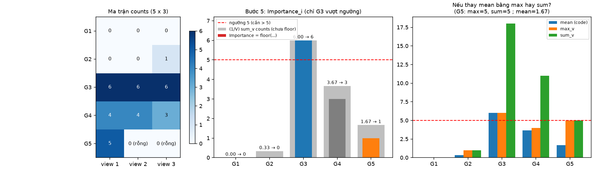

*Trái: heatmap counts $5\times3$. Giữa: $\frac13\sum$ (xám) và floor (màu), ngưỡng 5. Phải: thay `mean` bằng `max_v` / `sum_v`.*

- → `mean`: chỉ $G_3$ qua. `max_v`: $G_5$ được 5 — artefact một góc suýt được nhân bản.
- → Chỉ chia $V$ mới **phạt view bị che bằng 0**.

### 12.2.4.3 Chia cho $V$ — chia cho gì, không chia cho gì

| Chuẩn hoá theo | Công thức | Code? | Hệ quả |
|---|---|---|---|
| $V$ cố định | $\frac1V\sum_v\text{counts}$ | **Có** | view bị che $=0$ → dìm artefact; không chia 0 |
| $V^{\text{vis}}_i$ | $\frac1{V^{\text{vis}}_i}\sum_v\text{counts}$ | Không | $G_5\to5/1=5$; chia 0 nếu không hữu hình |
| $\lvert\Omega\rvert$ | $\frac1V\sum_v\frac{\text{counts}}{\lvert\Omega\rvert}$ | Không | tỉ lệ $[0,1]$; to/nhỏ bình đẳng |

- **Mặt tối 1**: Gaussian to được ưu ái ($500$ px × 10% = 50 vs $10$ px × 50% = 5). Bị kìm bởi AND với gradient.
- **Mặt tối 2**: Gaussian $<6$ px **không bao giờ** qua ngưỡng, kể cả 100% sai.

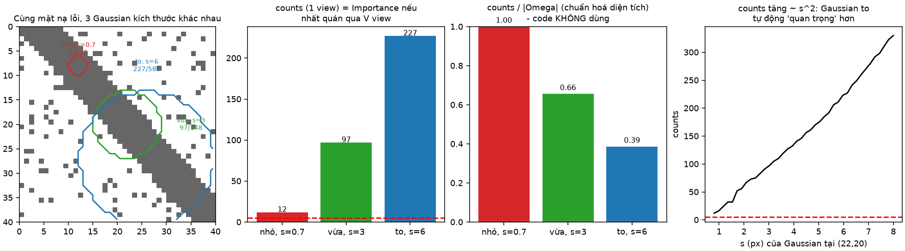

*$s=0.7,3,6$ px: counts/$|\Omega|$ $=12/12$, $97/148$, $227/588$. Phải: counts theo $s$.*

- → Tỉ lệ sai 1.00 → Importance 12; tỉ lệ 0.39 → Importance 227. Thứ tự **ngược** tỉ lệ sai.
- → counts $\propto s^2$: "quan trọng" trước hết là "to".

### 12.2.4.4 `floor` và ngưỡng chặt

- Float: $S>5V=50$; floor: $S\ge6V=60$ — chênh $V-1=9$ đơn vị (18%).
- 60 cặp đạt được bằng: $6\times10$ view, $12\times5$ view, hoặc **60 pixel × 1 view** — chia $V$ không loại hẳn artefact to.

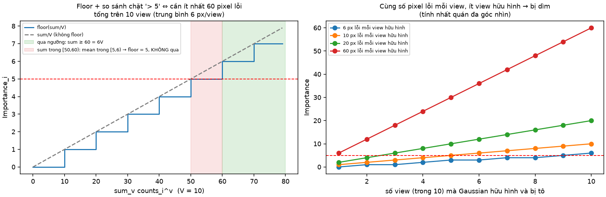

*Trái: $\lfloor S/10\rfloor$ vs $S/10$; vùng đỏ $S\in[50,60)$ không qua. Phải: $\text{Importance}=\lfloor ck/10\rfloor$ với $c$ pixel/view, $k$ view hữu hình.*

- → $c=6$: mất **một** view là rớt xuống 5. $c=10$: cần $\ge6$ view. $c=60$: 1 view đủ.
- → Ngưỡng 5 là **đường đánh đổi** "sai bao nhiêu/view" × "sai ở bao nhiêu view".

### 12.2.4.5 Mô phỏng 200 Gaussian

$|\Omega_i|\sim\text{LogU}(4,3000)$, $\rho_i\sim\text{Beta}(0.7,4)$, $p^{\text{vis}}_i\sim U(0.3,1)$, $\text{counts}\sim\text{Bin}(|\Omega_i|,\rho_i)$ khi hữu hình:

$$
\mathbb E[\text{Importance}_i]\approx|\Omega_i|\cdot\rho_i\cdot p^{\text{vis}}_i\quad(\text{to}\times\text{sai}\times\text{thấy})
$$

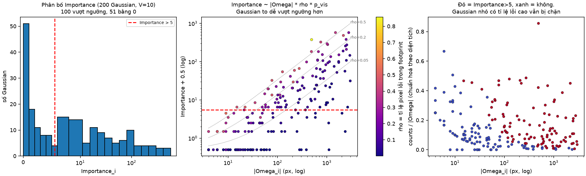

*Trái: histogram (100/200 qua ngưỡng, 51/200 $=0$). Giữa: $|\Omega|$ vs Importance, đường $|\Omega|\rho\bar p$. Phải: $|\Omega|$ vs tỉ lệ lỗi, đỏ = qua.*

- → Khối lớn tại 0: floor loại trước cả ngưỡng 5.
- → Trung vị $|\Omega|$: nhóm qua 540 px, nhóm không qua 25 px. Ranh giới là đường chéo $|\Omega|\rho p\approx6$.

### 12.2.4.6 Tự cài ④⑤ bằng numpy

```python
Omega = {"G1":[{1,2,5,6}]*3, "G2":[{9,10,13,14}]*3, "G3":[{7,8,11,12,15,16}]*3,
         "G4":[{10,11,12,14,15,16},{11,12,15,16},{11,12,16}], "G5":[{3,4,7,8,12,15,16},set(),set()]}
mask  = [{7,8,11,12,15,16}, {7,8,11,12,15,16}, {7,8,10,11,12,15,16}]
counts = np.array([[len(Omega[g][v] & mask[v]) for v in range(3)] for g in Omega])
importance = counts.sum(1) // 3        # [0 0 6 3 1];  importance > 5 → [F F T F F]
```

Khớp code thật: dùng `//` (không `round`), đếm giao tập (không nhân $\alpha T$), không lọc $|\Omega|$ nhỏ.

### 12.2.4.7 Ví dụ $V=10$

| Gaussian | Mô tả | counts 10 view | $S$ | Imp | $>5$? |
|---|---|---|---|---|---|
| $H_1$ | mép vật đục, chi tiết chưa đủ | 7,6,8,6,7,5,9,6,7,6 | 67 | 6 | ✅ |
| $H_2$ | như $H_1$, bị che 2 view | 7,6,8,0,7,5,9,0,7,6 | 55 | 5 | ❌ |
| $H_3$ | floater, chỉ 1 view | 0,0,0,0,74,0,0,0,0,0 | 74 | 7 | ✅ (lọt) |
| $H_4$ | nền đã đúng, gradient dư | 0,1,0,0,2,0,0,1,0,0 | 4 | 0 | ❌ |

$H_4$ là ca 3DGS clone còn FastGS chặn — "đóng góp chính" của phép AND. $H_3$ là việc của Pruning (⑦).

## 12.2.5 Vai trò của $V=10$: ước lượng có phương sai

### 12.2.5.1 `sampling_cameras`

```python
def sampling_cameras(stack):            # stack = scene.getTrainCameras().copy()
    return [stack.pop(random.randint(0, len(stack)-1)) for _ in range(10)]
```

10 camera **khác nhau, không hoàn lại**, rút lại mỗi lần densify. Importance là **ước lượng Monte Carlo**:

$$
\text{Importance}^{\star}_i=\Bigl\lfloor\frac1{|\mathcal V|}\sum_{v\in\mathcal V}\text{counts}^{(v)}_i\Bigr\rfloor,\qquad
\operatorname{Var}\approx\frac{\sigma^2_i}{V}\Bigl(1-\frac{V}{|\mathcal V|}\Bigr)
$$

Artefact một góc: $\sigma_i\gg$ trung bình → cực nhiễu. Gaussian nhất quán: $\sigma_i$ nhỏ → ổn.

### 12.2.5.2 Monte Carlo $V=1,3,10,30$

$|\mathcal V|=200$; **A** hữu hình 90%, Poisson(8) (thật ≈7.2); **B** hữu hình 5%, Poisson(60) (thật ≈1.9); **C** hữu hình 60%, Poisson(9) (thật ≈5.6, sát biên floor).

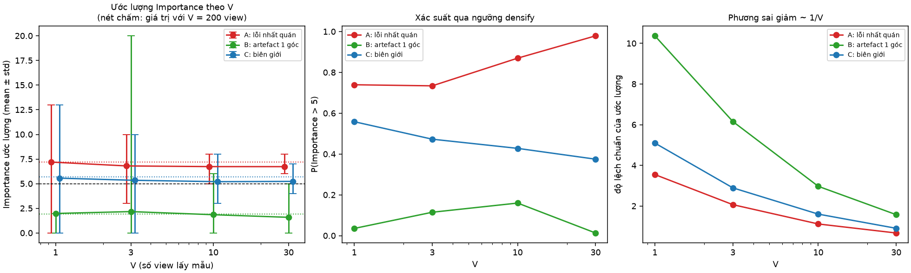

*Trái: trung bình ± khoảng 5–95%. Giữa: $P(\text{Imp}>5)$. Phải: độ lệch chuẩn theo $V$.*

- → $V=1$ vô dụng: B qua ngưỡng 5% lần, A trượt oan 10% lần ($P\approx0.74$).
- → $V=10$ là điểm gập: std giảm $\sqrt{10}$; $P(A)\approx0.87$, $P(B)\approx0.16$. $V=30$: $0.98/0.01$ nhưng tốn 3×.
- → $P(B>5)$ **tăng** từ $V=1$ lên $V=10$ ($1-0.95^{10}\approx0.40$ trúng ít nhất 1 view xấu, $\lfloor60/10\rfloor=6$) — chia $V$ chỉ dìm khi $60/V\le5$, tức $V\ge12$.

### 12.2.5.3 Tương tác với `densification_interval`

$2V=20$ forward/lần; interval 100 → 144 lần → 15–30 s trên 10–20 phút train (vài %). Tăng $V$: lợi biên nhỏ. Giảm interval: Gaussian biên ngưỡng được "thử" nhiều lần hơn.

### 12.2.5.4 Trường hợp biên

- **(a)** Importance tính trên $N$ **trước** densify; Gaussian con không có điểm. `padded_importance[:scores.shape[0]]` gán theo chỉ số cũ (12.5).
- **(b)** Ngoài khung hình cả 10 view: counts $=0$, `radii=0`, `denom` không tăng → không densify, cũng không bị ⑦ prune (Pruning $=0$, $w=1$).
- **(c)** `metricCount` cấp phát `P = N` (toàn bộ) → shape $[N]$ luôn hợp lệ.
- **(d)** Đầu train mọi view lỗi khắp nơi → Importance $\approx|\Omega|$, ngưỡng 5 không chặn ai — AND thoái hoá về 3DGS. Đúng ý: giai đoạn này *nên* densify rộng.

## 12.2.6 Đối chiếu với 3DGS gốc và FastGS gốc

### 12.2.6.1 3DGS gốc: không có ④⑤

Chỉ dùng $\bar g_i$ (lực kéo lên tâm), không đo lỗi màu trong vùng phủ. Ba ca khác nhau:

1. Vùng đã hội tụ, gradient dư (L1 không trơn tại 0) → mặt nạ tắt → Importance $\approx0$ → **chặn**.
2. Artefact 1–2 góc ($G_5$) → chia $V$ dìm → **chặn**.
3. Gaussian kẹp giữa hai view mâu thuẫn → Importance hỏi "vùng đó có thật sự sai không".

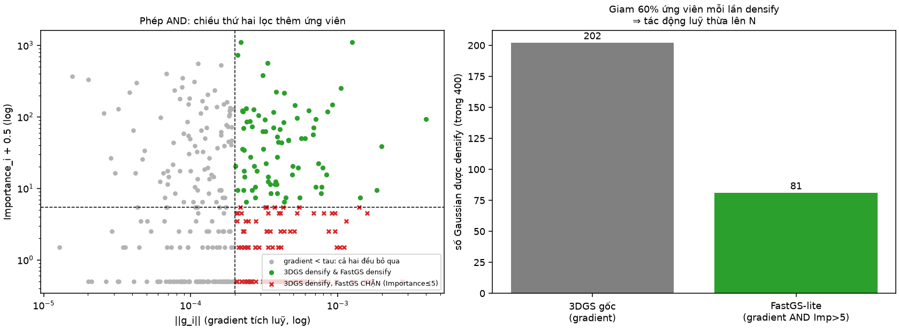

*Trái: $\lVert\bar g\rVert$ vs Importance; xanh = cả hai densify; X đỏ = 3DGS densify, FastGS chặn. Phải: 202 vs 81.*

- → AND cắt **60%** ứng viên mỗi lần (mô phỏng Importance độc lập gradient).
- → $r_{\text{spawn}}$ $0.15\to0.06$; $(1.15/1.06)^{28}\approx9.6$ — $N$ cuối thấp hơn gần một bậc.

### 12.2.6.2 FastGS gốc và FastGS-lite

Ở ④⑤ repo **giữ nguyên** bản gốc (arXiv 2511.04283): cùng `metric_map`, `atomicAdd`, floor-mean 10 view, ngưỡng 5. Khác Taming 3DGS: FastGS **ngưỡng hoá**, không xếp hạng/ngân sách → số densify mỗi lần không có giới hạn trên.

### 12.2.6.3 Bảng đối chiếu ④⑤

| | 3DGS gốc | Taming 3DGS | FastGS / -lite |
|---|---|---|---|
| Tín hiệu pixel → Gaussian | không | có (trọng số blend) | có (đếm nhị phân) |
| View chấm | vòng train (1 view/vòng) | vòng train | 10 view riêng, render thêm |
| Gộp view | mean gradient / `denom` | mean | floor-mean $V=10$, che $=0$ |
| Chuẩn hoá diện tích | — | một phần | **không** |
| Dùng | ngưỡng gradient | xếp hạng + ngân sách | AND ngưỡng gradient, cứng 5 |
| Chi phí thêm | 0 | nhỏ | $2V$ forward / densify |

## 12.2.7 Tóm tắt phần 2

- **④**: counts $=|\Omega\cap\{m_v=1\}|$, footprint hữu hình qua 3 cửa (compact box `mult`$=0.5$, $\alpha\ge1/255$, $T\ge10^{-4}$); `atomicAdd` mỗi cặp $+1$; một pixel lỗi tố mọi Gaussian chạm nó.
- **⑤**: floor-mean qua $V=10$ view ngẫu nhiên; view bị che $=0$ → dìm artefact một góc; không chia diện tích → Gaussian to ưu ái, $<6$ px không bao giờ qua.
- `>5` $\iff S\ge60$ cặp; Importance là ước lượng ngẫu nhiên, $\operatorname{Var}\propto1/V$, $V=10$ là điểm gập chi phí/lợi ích.
- AND với Importance cắt phần lớn ứng viên densify → tác động luỹ thừa lên $N$ — "đòn bẩy 1". Phần 3: ⑥⑦ Pruning score.

---

## 12.3 Bước ⑥ – ⑦: từ "ảnh nào tệ" đến "Gaussian nào đáng xoá"

> Code: `utils/fast_utils.py:27-31` (`compute_photometric_loss`), `:82-87` (tích luỹ `full_metric_score`, min–max), `scene/gaussian_model.py:470-483` (dùng `pruning_score` làm trọng số), `:498-505` (`final_prune_fastgs`).

### 12.3.0 Vị trí trong 7 bước

Importance = *bao nhiêu* pixel tố cáo. Pruning = *bao nhiêu* **và** *ở view tệ đến mức nào*. Cùng ma trận $\text{counts}\in\mathbb Z^{N\times V}$, hai cách gộp:

```
counts [N x V] ──(mean theo V, floor)──────────────► Importance [N]   (bước ⑤)
                                                         │
E_photo [V] ────(tổng có trọng số theo V, minmax_N)──► Pruning [N]     (bước ⑦)
       ▲
       └── bước ⑥: 1 số / view, từ 2 ảnh render–GT
```

### 12.3.1 Bước ⑥ — Photometric loss toàn ảnh

$$
\boxed{\ E^{(v)}_{\text{photo}}=(1-\lambda)\,\mathcal L^{(v)}_1+\lambda\bigl(1-\text{SSIM}^{(v)}\bigr),\qquad\lambda=0.2\ }
$$

$$
\mathcal L^{(v)}_1=\frac{1}{3HW}\sum_{\text{ch}}\sum_{x}\bigl|I_{\text{rend}}-I_{\text{gt}}\bigr|=\frac1{HW}\sum_x e_v(x)=\text{mean}_x\,e_v(x)
$$

→ $\mathcal L_1$ chỉ là **trung bình của bản đồ $e_v$ ở bước ①** — không có phép tính mới, chỉ "gập" bản đồ thành một số rồi trộn SSIM.

```python
def compute_photometric_loss(viewpoint_cam, image):
    gt_image = viewpoint_cam.original_image.cuda()
    Ll1 = l1_loss(image, gt_image)                                     # mean |rend - gt|
    return (1.0 - 0.2) * Ll1 + 0.2 * (1.0 - fast_ssim(image.unsqueeze(0), gt_image.unsqueeze(0)))
```

- $\lambda=0.2$ **hard-code**, không đọc `opt.lambda_dssim`.
- `fast_ssim` = `fused_ssim` CUDA, cửa sổ Gaussian $11\times11$, $\sigma=1.5$ (chương 10).
- Forward-only, không backward → chi phí ≈ 5 tích chập $11\times11$.

#### Vì sao cần SSIM: "mờ" và "nhiễu" có cùng $\mathcal L_1$

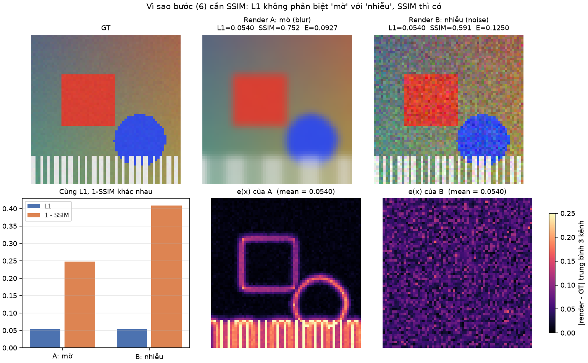

*Render A = GT làm mờ ($\sigma=1.6$ px); Render B = GT + nhiễu trắng, dò biên độ để $\mathcal L_1$ bằng nhau ($0.0540$).*

- → $\text{SSIM}_A=0.752$, $\text{SSIM}_B=0.591$ ⇒ $E_A=0.0927$, $E_B=0.1250$: view nhiễu bị coi tệ hơn **35 %**.
- → SSIM đo cấu trúc cục bộ, phạt nhiễu (floaters) nặng hơn mờ — đúng thứ FastGS-lite muốn dọn.

#### Số liệu 3 view

**(a) `3.md`, ảnh $4\times4$:**

| view | $\sum_x e^{(v)}$ | $\mathcal L_1$ | SSIM | $0.8\mathcal L_1$ | $0.2(1-\text{SSIM})$ | $E_{\text{photo}}$ |
|---|---|---|---|---|---|---|
| 1 | 1.78 | 0.111250 | 0.72 | 0.089000 | 0.056 | **0.145000** |
| 2 | 0.96 | 0.060000 | 0.88 | 0.048000 | 0.024 | **0.072000** |
| 3 | 1.45 | 0.090625 | 0.80 | 0.072500 | 0.040 | **0.112500** |

**(b) Cảnh đồ chơi $48\times32$:**

| view | $\mathcal L_1$ | SSIM | $0.8\mathcal L_1$ | $0.2(1-\text{SSIM})$ | $E_{\text{photo}}$ |
|---|---|---|---|---|---|
| 1 | 0.259278 | 0.647773 | 0.207422 | 0.070445 | **0.277867** |
| 2 | 0.222367 | 0.702127 | 0.177893 | 0.059575 | **0.237468** |
| 3 | 0.204733 | 0.704586 | 0.163786 | 0.059083 | **0.222869** |

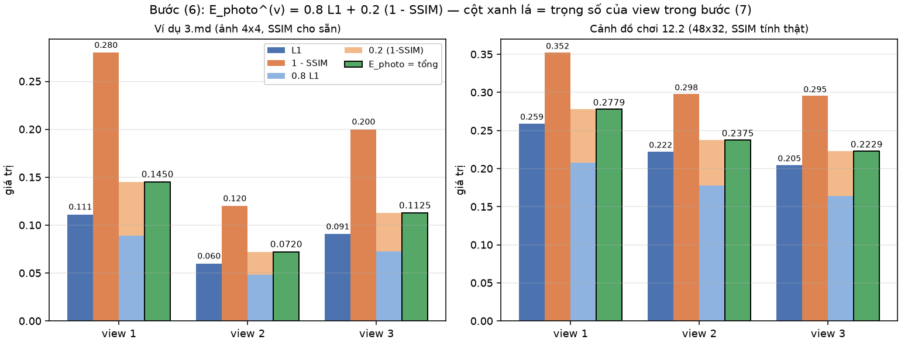

*Mỗi view 4 cột: $\mathcal L_1$, $1-\text{SSIM}$, cột chồng $0.8\mathcal L_1+0.2(1-\text{SSIM})$, và $E_{\text{photo}}$ (phải cao bằng cột chồng).*

- → $1-\text{SSIM}>\mathcal L_1$ ở cả hai ví dụ nhưng $\lambda=0.2$ nên $\mathcal L_1$ vẫn quyết định thứ tự view.
- → View 1 tệ nhất ở cả hai; chênh $E_{\max}/E_{\min}$: `3.md` $=2.01$, đồ chơi $=1.25$ (mọi view đều sai gần cả ảnh → trọng số gần đều).

#### $E(\lambda)$ là đoạn thẳng — thứ tự view có đổi không?

$$
E^{(v)}(\lambda)=(1-\lambda)\mathcal L^{(v)}_1+\lambda(1-\text{SSIM}^{(v)}),\qquad \frac{\partial E}{\partial\lambda}=(1-\text{SSIM})-\mathcal L_1
$$

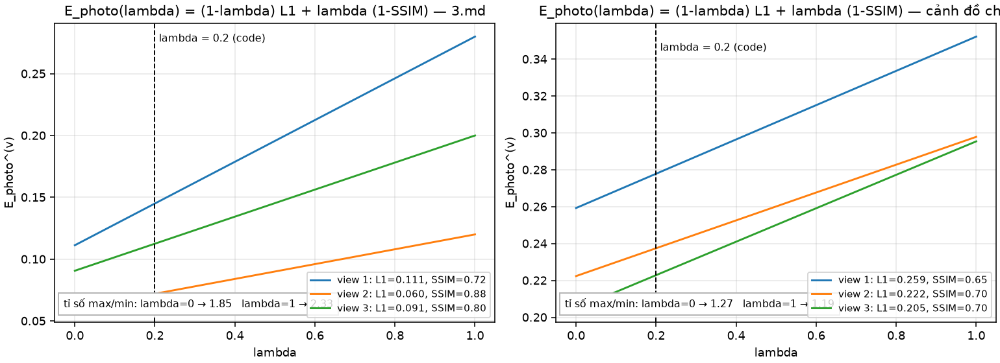

*Trục $x$: $\lambda\in[0,1]$; vạch đứt tại $\lambda=0.2$.*

- → `3.md`: ba đường không cắt nhau; $E_{\max}/E_{\min}$ tăng $1.85\to2.33$ (SSIM khuếch đại chênh lệch).
- → Đồ chơi: view 2, 3 gần trùng; tỉ số **giảm** $1.27\to1.19$ (SSIM san bằng). Không có quy luật chung.

#### Bước ② bỏ thông tin, bước ⑥–⑦ hoàn lại

| | Bước ② (min–max theo ảnh) | Bước ⑥–⑦ (trọng số $E_v$) |
|---|---|---|
| Câu hỏi | *Trong* view, pixel nào tệ nhất? | *Giữa* các view, view nào tệ nhất? |
| Bỏ đi | mức sai tuyệt đối của view | vị trí pixel |
| Phục vụ | Importance (view tốt/tệ đóng góp pixel tương đương) | Pruning (bị tố ở view *đang tệ* thì nặng tội hơn) |

### 12.3.2 Bước ⑦ — Pruning score

$$
\boxed{\ \text{Pruning}_i=\frac{S_i-\min_jS_j}{\max_jS_j-\min_jS_j},\qquad
S_i=\sum_{v=1}^{V}\text{counts}^{(v)}_i\cdot E^{(v)}_{\text{photo}}\ }
$$

- $\text{counts}\cdot E$: đơn vị *pixel × loss*.
- $\sum_v$: cộng thẳng, **không** chia $V$, **không** floor.
- min–max **qua $N$ Gaussian**: tệ nhất $=1.0$, tốt nhất $=0.0$, luôn.

```python
if full_metric_score is None:
    full_metric_score = photometric_loss * accum_loss_counts.clone()
else:
    full_metric_score += photometric_loss * accum_loss_counts
...
pruning_score = (full_metric_score - torch.min(full_metric_score)) \
              / (torch.max(full_metric_score) - torch.min(full_metric_score))
```

→ `full_metric_score` tính **luôn**; `full_metric_counts` (Importance) chỉ khi `DENSIFY=True`. Final prune vẫn tốn $2V$ render.

#### Tính tay `3.md`

$$
\text{counts}=\begin{pmatrix}0&0&0\\0&0&1\\6&6&6\\4&4&3\\5&0&0\end{pmatrix},\qquad
E=\begin{pmatrix}0.145\\0.072\\0.1125\end{pmatrix},\qquad S=\text{counts}\cdot E
$$

| | $\text{cnt}\times0.145$ | $\text{cnt}\times0.072$ | $\text{cnt}\times0.1125$ | $S_i$ | $\text{Pruning}_i=S_i/1.977$ |
|---|---|---|---|---|---|
| $G_1$ | 0 | 0 | 0 | **0.0000** | **0.0000** |
| $G_2$ | 0 | 0 | 0.1125 | **0.1125** | **0.0569** |
| $G_3$ | 0.8700 | 0.4320 | 0.6750 | **1.9770** | **1.0000** |
| $G_4$ | 0.5800 | 0.2880 | 0.3375 | **1.2055** | **0.6098** |
| $G_5$ | 0.7250 | 0 | 0 | **0.7250** | **0.3667** |

($\min S=0$ nhờ $G_1$ nên $\text{Pruning}=S/1.977$ — trường hợp đặc biệt.)

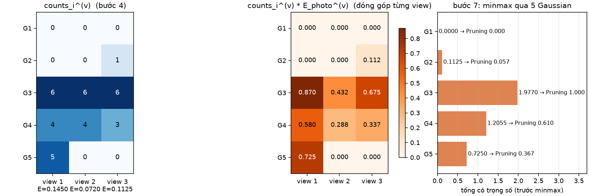

*Trái: counts $5\times3$; giữa: $\text{counts}\odot E$; phải: $S_i$ và Pruning.*

- → Hàng $G_3$: cùng 6 pixel nhưng đóng góp $0.870/0.432/0.675$ — lệch gấp đôi giữa view 1 và 2. Trọng số $E$ đang làm việc.
- → Hàng $G_5$: 5 pixel ở view **tệ nhất** đáng $0.725$ = 60 % của $G_4$ (11 pixel); không trọng số chỉ là $5/11=45\%$.

#### Trace bộ tích luỹ qua vòng `for`

| sau view | `full_metric_counts` (`DENSIFY`) | `full_metric_score` |
|---|---|---|
| $v=1$ ($E_1=0.145$) | $(0,0,6,4,5)$ | $(0,\ 0,\ 0.870,\ 0.580,\ 0.725)$ |
| $v=2$ ($E_2=0.072$) | $(0,0,12,8,5)$ | $(0,\ 0,\ 1.302,\ 0.868,\ 0.725)$ |
| $v=3$ ($E_3=0.1125$) | $(0,1,18,11,5)$ | $(0,\ 0.1125,\ 1.977,\ 1.2055,\ 0.725)$ |
| kết thúc | $\lfloor\cdot/3\rfloor=(0,0,6,3,1)$ | min–max $=(0,\ 0.0569,\ 1.0,\ 0.6098,\ 0.3667)$ |

→ $G_5$ "đóng băng" từ view 1 (bị che ở 2, 3) nhưng vẫn đạt $0.367$ vì view 1 tệ nhất. Phép cộng giao hoán → thứ tự view không ảnh hưởng.

#### Bất biến affine — chứng minh 3 dòng

$$
S'_i=cS_i+d,\ c>0:\quad
\frac{S'_i-\min_jS'_j}{\max_jS'_j-\min_jS'_j}
=\frac{c(S_i-\min_jS_j)}{c(\max_jS_j-\min_jS_j)}
=\text{Pruning}_i
$$

- → Chia $V$ hay không: không đổi. Nhân **mọi** $E_v$ cùng hằng số: không đổi. Nhân **từng** $E_v$ khác nhau: đổi — đó là vai trò của ⑥.
- → Bảo toàn thứ tự và tỉ lệ khoảng cách; **đổi** ý nghĩa ngưỡng tuyệt đối: $>0.9$ = "10 % trên cùng của **khoảng** $[\min S,\max S]$", không phải 10 % số Gaussian.

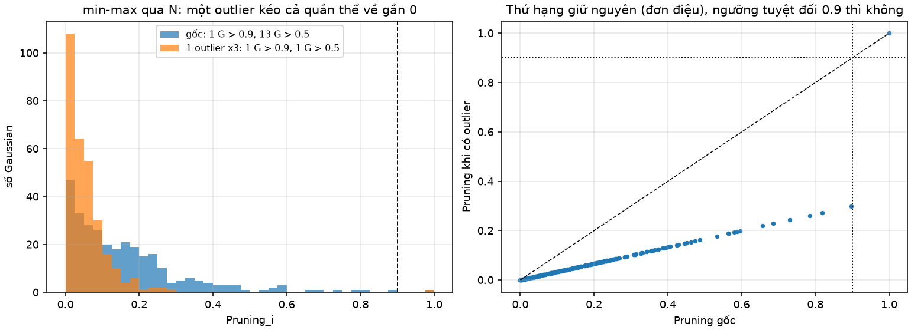

*300 Gaussian mô phỏng; cam = sau khi nhân 3 điểm thô của Gaussian tệ nhất.*

- → Một Gaussian đổi, cả quần thể bị ép về 0: số $\text{Pruning}>0.5$ từ 13 xuống 1; thứ hạng **không đổi**.
- → Final prune $>0.9$ vì thế xoá "từng lớp": dọn floater trước, 3000 vòng sau mới tới lượt kém hơn.

#### Importance và Pruning — cùng tăng, không phải hàm của nhau

Khác nhau ở 3 chỗ: (1) Pruning có trọng số $E_v$; (2) Importance qua **floor**; (3) Importance chuẩn theo $V$ (tuyệt đối), Pruning min–max theo **quần thể** (tương đối).

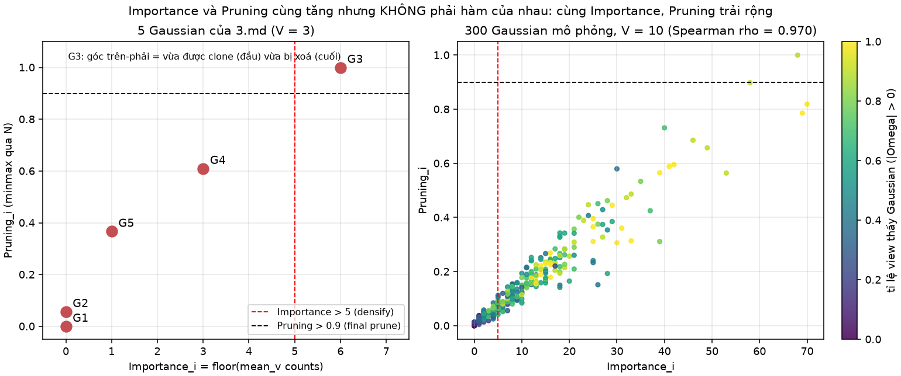

*Trái: 5 Gaussian `3.md`, vạch đỏ Importance $>5$, vạch đen Pruning $>0.9$. Phải: 300 mô phỏng, màu = tỉ lệ view thấy Gaussian.*

- → $G_3$ là điểm duy nhất vượt **cả hai** ngưỡng; $G_4$: Importance 3 (không densify), Pruning 0.61 (chưa xoá).
- → Spearman $\rho=0.970$ nhưng ở mỗi mức Importance, Pruning trải $\pm0.15$; chỉ **1**/300 vượt 0.9.

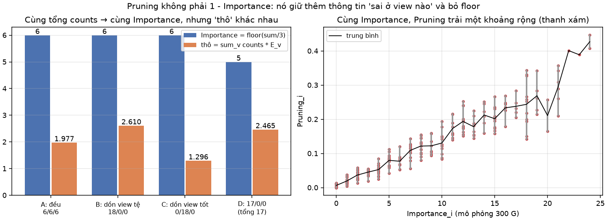

*A, B, C cùng $\sum\text{counts}=18$ phân bố $6/6/6$, $18/0/0$, $0/18/0$; D $=17/0/0$.*

- → Cùng Importance $=6$ nhưng $S=1.977,\ 2.610,\ 1.296$ — chênh gấp đôi chỉ do trọng số view.
- → D: Importance 5 (bị chặn densify) nhưng $S_D=2.465>S_C$ — floor và trọng số kéo hai điểm ra xa nhau.

#### Hai hình gốc

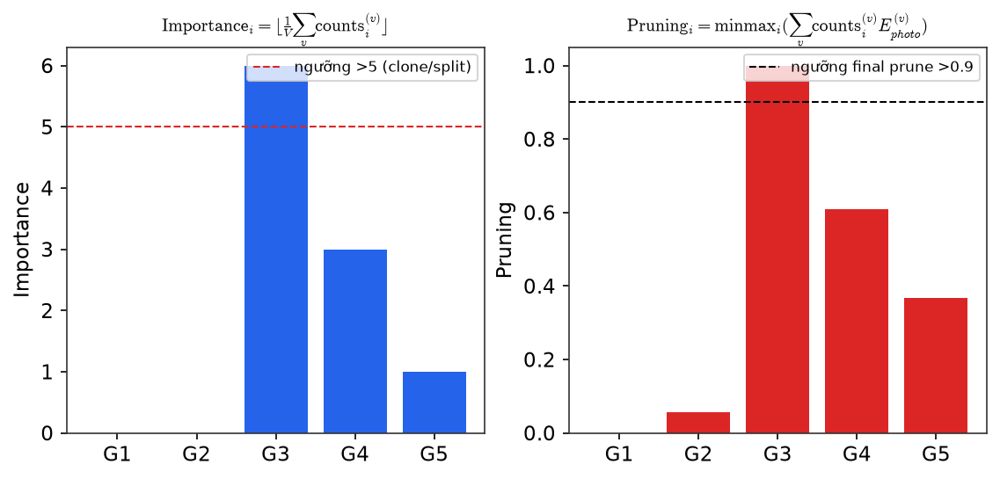

*`3.md`: Importance $(0,0,6,3,1)$ với ngưỡng 5; Pruning $(0,0.057,1.0,0.61,0.367)$ với ngưỡng 0.9.*

- → $G_3=1.0$ và $G_1=0.0$ là **tất yếu** của min–max, không phải trùng hợp.

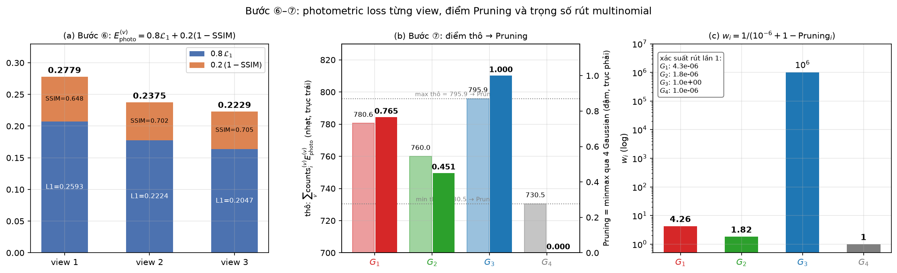

*Cảnh đồ chơi: $E=(0.2779,0.2375,0.2229)$; $S=(780.6,760.0,795.9,730.5)$; Pruning $=(0.7654,0.4507,1.0,0.0)$; $w$ thang log.*

- → Chênh thô $G_3$–$G_4$ chỉ $65/767\approx8.5\%$ nhưng bị kéo giãn thành trọn $[0,1]$ — Pruning là điểm **tương đối**.

#### Từ Pruning đến hai quyết định xoá

$$
w_i=\frac{1}{10^{-6}+(1-\text{Pruning}_i)},\qquad
\mathcal S\sim\text{Multinomial}\bigl(w,\lfloor0.5|\mathcal C|\rfloor,\text{k.h.l.}\bigr),\qquad\text{xoá}=\mathcal C\cap\mathcal S
$$

$$
\text{final\_prune}_i=[\alpha_i<0.1]\ \vee\ [\text{Pruning}_i>0.9]\qquad(15000<t<30000,\ t\bmod3000=0)
$$

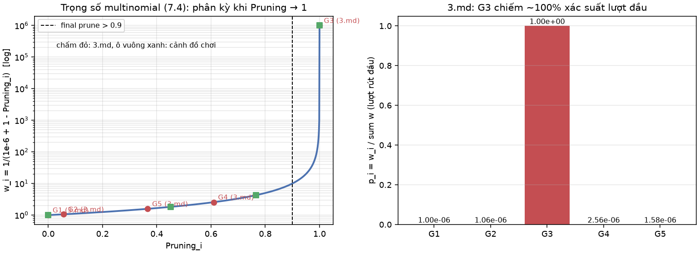

*Trái: $w(p)$ thang log; chấm đỏ `3.md`, vuông xanh đồ chơi. Phải: $p_i=w_i/\sum w$ lượt đầu.*

- → $w(0.9)=10$, $w(0.99)=100$, $w(1)=10^6$: khuỷu tại 0.9 trùng ngưỡng final prune.
- → `3.md`: $w=(1.0,1.06,10^6,2.56,1.58)$, $p_{G_3}=0.999994$ — nhưng $\mathcal C=\varnothing$ nên **không xoá ai** ở giai đoạn densify.
- → Pruning $=0$ vẫn có $w=1\neq0$ — "ít đáng xoá nhất", không phải bất khả xâm phạm.

### 12.3.3 Tổng hợp 7 bước

| # | Bước | Input | Output | Trục gộp | Chạy ở đâu | Chi phí |
|---|---|---|---|---|---|---|
| — | Render | $N$ Gaussian + camera | $I_{\text{rend}}\ [3,H,W]$ | — | CUDA lần 1 | $O(N\log N+\lvert\Omega\rvert)$ |
| ① | Sai số pixel | 2 ảnh $[3,H,W]$ | $e_v\ [H,W]$ | kênh | torch | $O(HW)$ |
| ② | Min–max ảnh | $e_v$ | $\hat e_v\in[0,1]$ | — | torch | $O(HW)$ |
| ③ | Mặt nạ | $\hat e_v$ | $m_v\ \{0,1\}$ | — | torch | $O(HW)$ |
| ④ | Đổ về Gaussian | $m_v$ + hình học | $\text{counts}^{(v)}\ [N]$ | **pixel→Gaussian** | CUDA lần 2, `atomicAdd` | $O(N\log N+\lvert\Omega\rvert)$ |
| ⑤ | Importance | $\text{counts}\ [N,V]$ | $[N]$ int | view (mean, floor) | torch | $O(NV)$ |
| ⑥ | Loss toàn ảnh | 2 ảnh | $E_v$ scalar | toàn ảnh | `fused_ssim` | $O(HW\cdot11^2)$ |
| ⑦ | Pruning | $\text{counts},E$ | $[N]\in[0,1]$ | view (tổng $\cdot E$), min–max qua $N$ | torch | $O(NV)$ |

→ Chỉ **hai lần render** mỗi view là tốn; ①②③⑤⑥⑦ là element-wise/reduce, không có `.backward()`.

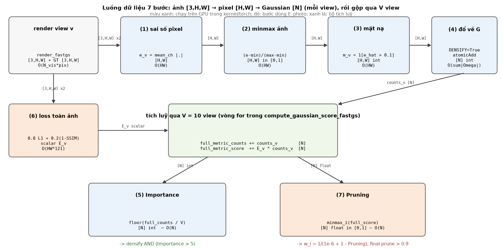

*Hàng trên: ①→④ chạy mỗi view; hộp cam: ⑥⑦ dùng $E$; hộp xanh lá: bộ tích luỹ.*

- → Hai nhánh song song từ cặp render–GT: nhánh pixel (①②③④ → `[N]` int) và nhánh toàn ảnh (⑥ → scalar), gặp nhau ở `photometric_loss * accum_loss_counts`.
- → Đường ④→bộ tích luỹ là đường duy nhất mang thông tin **hình học** ra khỏi kernel.

#### Đối chiếu hai điểm số

| | $\text{Importance}_i$ | $\text{Pruning}_i$ |
|---|---|---|
| Gộp qua view | trung bình, **floor** | tổng **có trọng số** $E_v$ |
| Chuẩn hoá | theo $V$ (tuyệt đối) | min–max qua $N$ (tương đối) |
| Miền | $\{0,1,2,\dots\}$ | $[0,1]$, luôn có một $0$ và một $1$ |
| Ngưỡng | $>5$ (AND gradient) | $>0.9$ (final); $w=1/(10^{-6}+1-p)$ (multinomial) |
| Ý nghĩa | sai **nhất quán** → đáng thêm | thiệt hại ở view **đang tệ** → đáng xoá |
| Tính khi | `DENSIFY=True` | luôn |

#### Ký hiệu: `3.md` ↔ chương ↔ code

| Ý nghĩa | `3.md` | Chương 12 | Biến |
|---|---|---|---|
| số view | $K=3$ | $V$ | `len(camlist)`, `num_cams=10` |
| mặt nạ | $\mathcal M^j_{mask}$ | $m_v(x)$ | `metric_map` |
| đếm pixel lỗi | $\text{counts}^j_i$ | $\text{counts}^{(v)}_i$ | `accum_loss_counts` |
| Importance | $s^i_d$ | $\text{Importance}_i$ | `importance_score` |
| loss toàn ảnh | $E^j_{photo}$ | $E^{(v)}$ | `photometric_loss` |
| điểm thô | "thô" | $S_i$ | `full_metric_score` |
| Pruning | $s^i_p$ | $\text{Pruning}_i$ | `pruning_score` |
| điểm sống sót | — | $1-\text{Pruning}_i$ | `scores` |
| trọng số xoá | — | $w_i$ | `padded_importance` (**không** phải Importance) |

#### Cài lại ⑥⑦ bằng numpy

```python
import numpy as np
counts = np.array([[0,0,0],[0,0,1],[6,6,6],[4,4,3],[5,0,0]], float)   # [N=5, V=3]
L1     = np.array([0.111250, 0.060000, 0.090625]);  SSIM = np.array([0.72, 0.88, 0.80])
lam    = 0.2
E    = (1 - lam) * L1 + lam * (1 - SSIM)          # ⑥: [0.145, 0.072, 0.1125]
S    = counts @ E                                  # ⑦ thô
prun = (S - S.min()) / (S.max() - S.min())         # ⑦ minmax qua N
imp  = np.floor(counts.sum(1) / counts.shape[1])   # ⑤
print(np.round(S, 4))     # [0.     0.1125 1.977  1.2055 0.725 ]
print(np.round(prun, 4))  # [0.     0.0569 1.     0.6098 0.3667]
```

### 12.3.4 Độ nhạy

Hai nơi tiêu thụ Pruning đều **đơn điệu tăng** ($w(p)$, $\mathbb 1[p>0.9]$) → chỉ **thứ hạng** và **tập $>0.9$** quan trọng.

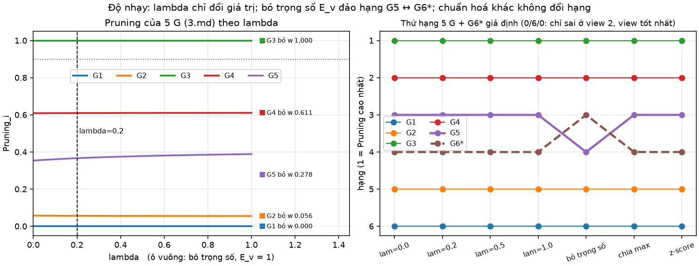

*Trái: Pruning theo $\lambda\in[0,1]$; ô vuông = bỏ trọng số. Phải: thứ hạng qua 7 cách tính; $G_6^*$ giả định counts $=(0,6,0)$ (chỉ ở view tốt nhất).*

- → $\lambda$: $G_5$ đi $0.354\to0.389$, không đường nào cắt nhau.
- → Bỏ trọng số: $G_5$ ($5\times0.145=0.725$) và $G_6^*$ ($6\times0.072=0.432$) đổi chỗ — chính là ca $E_v$ được thiết kế để xử lý.
- → Đổi chuẩn hoá (chia max, z-score): thứ hạng không đổi, nhưng z-score cho $G_3=1.81>1$ → $1-p<0$ → $w$ âm, `multinomial` lỗi. Min–max là **cần thiết** cho công thức $w$.

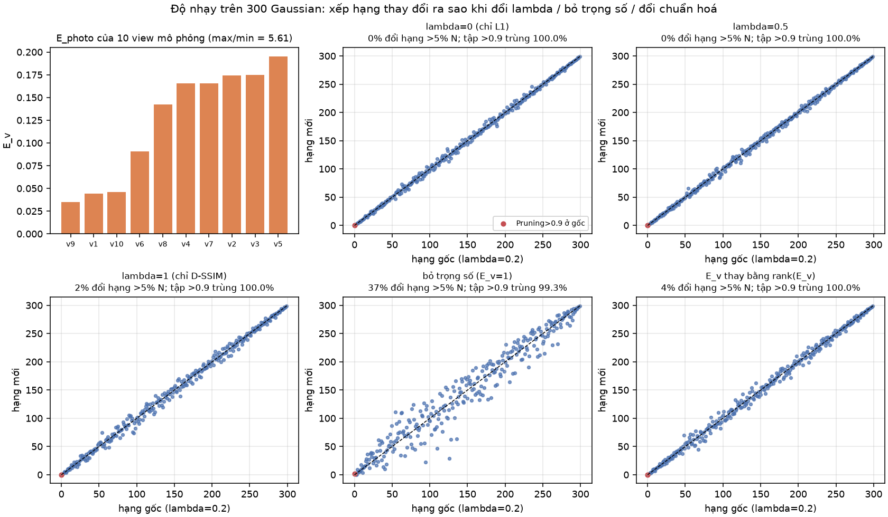

*$V=10$, $E_{\max}/E_{\min}=5.61$; trục $x$ = hạng gốc ($\lambda=0.2$), trục $y$ = hạng theo cách mới.*

| Biến thể | % đổi hạng $>15$ bậc | tập $>0.9$ trùng |
|---|---|---|
| $\lambda=0$ | 0 % | 100 % |
| $\lambda=0.5$ | 0 % | 100 % |
| $\lambda=1$ | 2 % | 100 % |
| **bỏ trọng số** ($E_v\equiv1$) | **37 %** | 99.3 % |
| $E_v\to\text{rank}(E_v)$ | 4 % | 100 % |

- → $\lambda$ là tham số **ít nhạy nhất**; hard-code 0.2 vô hại.
- → Trọng số $E_v$ **quan trọng**, cách tính nó thì không: chỉ cần *thứ tự* view đã khôi phục 96 %.
- → Tập $>0.9$ gần bất biến (1–2 Gaussian vượt trội, cách đo nào cũng thấy).

| Thay đổi | Giá trị | Thứ hạng | Tập $>0.9$ |
|---|---|---|---|
| $\lambda\in[0,1]$ | vài % | ~không | không |
| Bỏ $E_v$ | vừa | **lớn** ở giữa | rất nhỏ |
| Min–max → z-score | đổi thang | không | $w$ hỏng |
| Outlier ×3 | kéo cả quần thể về 0 | không | không |

### 12.3.5 Chi phí

Mỗi lần gọi: $V=10$ view $\times$ 2 render $=20$ forward.

$$
n_{\text{densify}}=\Bigl\lfloor\frac{U-1}{I}\Bigr\rfloor-\Bigl\lfloor\frac{F}{I}\Bigr\rfloor,\qquad F=500,\ U=15000
$$

| interval $I$ | $n_{\text{densify}}$ | forward phụ $=20n$ | cận trên ($/30000$) | sát thực tế ($/90000$, fwd+bwd $\approx3\times$) |
|---|---|---|---|---|
| **500** | **28** | 560 | **+1.9 %** | **+0.6 %** |
| 200 | 72 | 1440 | +4.8 % | +1.6 % |
| **100** | **144** | 2880 | **+9.6 %** | **+3.2 %** |

(+ final prune: $4\times20=80$ forward, $\approx+0.3\%$.)

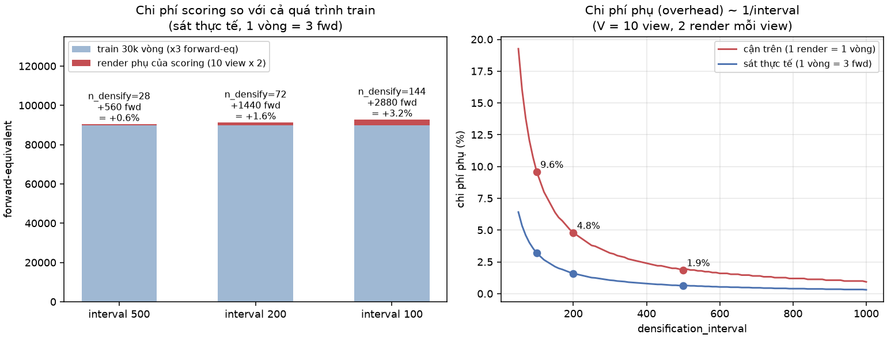

*Trái: cột chồng train vs scoring cho 3 interval. Phải: overhead (%) theo $I\in[50,1000]$.*

- → Với interval 500, phần đỏ $0.6\%$ — gần như không thấy.
- → Overhead $\propto1/I$; nhưng hạ $I$ làm $n_{\text{densify}}$ tăng và $N$ tăng **luỹ thừa** — chi phí gián tiếp qua $N$ mới đáng lo.
- → Bộ nhớ đỉnh ≈ một lần render + hai vector `[N]`; không autograd → không bao giờ là nguyên nhân OOM.
- → Điểm số là "ảnh chụp" tại $t$, không có bộ nhớ qua các lần gọi; 10 camera rút ngẫu nhiên từ bản **copy** của stack train.

### 12.3.8 Tóm tắt phần 3

- ⑥ gập cặp ảnh thành **một số** $E_v=0.8\mathcal L_1+0.2(1-\text{SSIM})$; SSIM phân biệt "mờ" với "nhiễu".
- ⑦ nhân counts với $E_v$, cộng qua view, min–max **qua $N$**: tệ nhất $=1$, tốt nhất $=0$ — điểm *đáng xoá*, tương đối.
- Importance và Pruning **cùng chiều** nhưng khác trọng số, floor, trục chuẩn hoá; cùng Gaussian có thể vừa đáng clone (đầu) vừa đáng xoá (cuối).
- Chi phí scoring $+0.6\%$ đến $+1.9\%$ với interval 500; $\lambda$ gần vô hại, bỏ $E_v$ xáo trộn mạnh, tập $>0.9$ rất bền.

---

## 12.4 Densify — tích luỹ gradient, điều kiện AND, clone vs split

> Code: `scene/gaussian_model.py:374-394` (`densification_postfix`), `:396-418` (`densify_and_split_fastgs`), `:420-431` (`densify_and_clone_fastgs`), `:433-491` (`densify_and_prune_fastgs`), `:493-496` (`add_densification_stats`); `train.py:126-145`; `arguments/__init__.py:83-95`; `scene/dataset_readers.py:45-66` (`getNerfppNorm` → `extent`).

### 12.4.1 Vị trí của bước densify

| Việc | Tần suất | Điều kiện `train.py` | Đầu vào → Đầu ra |
|---|---|---|---|
| Tích luỹ thống kê | **mỗi vòng** $t<15000$ | `:127` | `grad`, `visibility_filter` → `accum`, `accum_abs`, `denom`, `max_radii2D` |
| Densify + prune | mỗi interval, $500<t<15000$ | `:132` | 3 mảng + Importance, Pruning → $N$ mới, thống kê $=0$ |
| Opacity reset | mỗi 3000 | `:147` | $\tilde\alpha\leftarrow\sigma^{-1}(0.01)$ |

$$
n_{\text{densify}}(100)=\bigl|\{600,700,\dots,14900\}\bigr|=144,\qquad n_{\text{densify}}(500)=\bigl|\{1000,\dots,14500\}\bigr|=28
$$

(File gốc làm tròn 145; đếm chặt theo `>` và `<` là 144.)

```
mỗi vòng t < 15000:
    max_radii2D[vis] = max(max_radii2D[vis], radii[vis])
    accum      += ‖grad[:, 0:2]‖        (cột có dấu)
    accum_abs  += ‖grad[:, 2:4]‖        (cột trị tuyệt đối)
    denom      += 1
mỗi interval, 500 < t < 15000:
    ḡ = accum/denom ; ḡ_abs = accum_abs/denom
    clone = [‖ḡ‖ ≥ τ_grad]     ∧ [max s ≤ δ·extent] ∧ [Importance > 5]
    split = [‖ḡ_abs‖ ≥ τ_abs]  ∧ [max s > δ·extent] ∧ [Importance > 5]
    clone ; split ; prune (12.5) ; accum = accum_abs = denom = max_radii2D = 0
```

### 12.4.2 Tích luỹ thống kê gradient

#### 12.4.2.1 Gradient màn hình, 4 cột

`screenspace_points` ($N\times4$, toàn 0) chỉ là "chỗ neo" cho autograd; kernel backward ghi:

$$
g_i=\sum_x\frac{\partial\mathcal L}{\partial\mu'_i}\Big|_x\ (\text{cột }0{:}2,\ \text{có dấu}),\qquad
g^{\text{abs}}_i=\sum_x\Bigl|\frac{\partial\mathcal L}{\partial\mu'_i}\Big|_x\Bigr|\ (\text{cột }2{:}4,\ \text{FastGS mới})
$$

- Đơn vị NDC $[-1,1]$ → ngưỡng $\tau_{\text{grad}}=2\times10^{-4}$ có nghĩa chung cho mọi cảnh/độ phân giải.
- Gradient 2D bất biến với khoảng cách camera (gradient 3D tỉ lệ $f_x/t_z$).
- $\tau^{\text{abs}}=1.2\times10^{-3}$ cao gấp 6 vì $\lVert g^{\text{abs}}\rVert\ge\lVert g\rVert$ luôn (bất đẳng thức tam giác).

#### 12.4.2.2 `add_densification_stats`

```python
self.xyz_gradient_accum[update_filter]     += torch.norm(grad[update_filter, :2], dim=-1, keepdim=True)
self.xyz_gradient_accum_abs[update_filter] += torch.norm(grad[update_filter, 2:], dim=-1, keepdim=True)
self.denom[update_filter] += 1
```

$$
\text{accum}_i=\sum_t\mathbb 1_i(t)\lVert g_i(t)\rVert,\quad
\text{accum}^{\text{abs}}_i=\sum_t\mathbb 1_i(t)\lVert g^{\text{abs}}_i(t)\rVert,\quad
\text{denom}_i=\sum_t\mathbb 1_i(t),\quad \mathbb 1_i(t)=[\text{radii}_i>0]
$$

$$
\boxed{\ \bar g_i=\frac{\text{accum}_i}{\text{denom}_i},\qquad \bar g^{\text{abs}}_i=\frac{\text{accum}^{\text{abs}}_i}{\text{denom}_i}\ }\qquad(\text{NaN}\to0)
$$

- Chia `denom` (số lần **hữu hình**), không chia số vòng → Gaussian ít được nhìn không bị pha loãng.
- `norm` trước, cộng sau → gradient ngược hướng giữa các view không triệt tiêu.

#### 12.4.2.3 Hai tầng triệt tiêu

| Tầng | Cơ chế | Biện pháp | Ai làm |
|---|---|---|---|
| Trong **một ảnh** (pixel) | nửa trái kéo trái, nửa phải kéo phải: $\sum_x g_x\approx0$ | cột abs $\sum_x\lvert g_x\rvert$ | kernel backward (FastGS) |
| Giữa **các view** (iteration) | view trước kéo lên, view sau kéo xuống | $\lVert g(t)\rVert$ trước rồi cộng | `add_densification_stats` (3DGS đã có) |

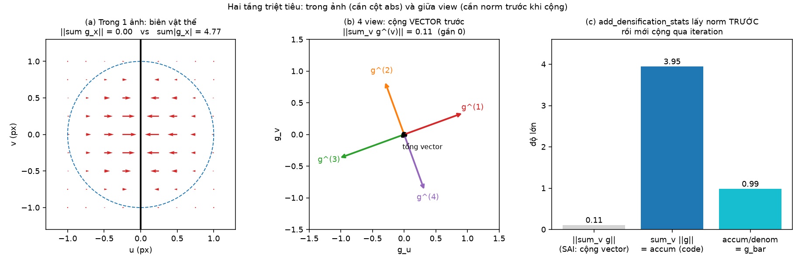

*Hình 4.1 — (a) footprint vắt qua biên: $\lVert\sum_x g_x\rVert\approx10^{-16}$ nhưng $\sum_x|g_x|=4.77$; (b) 4 view, 4 vector gần đối nhau, tổng $0.11$; (c) ba cách gộp: cộng vector rồi norm $0.11$ (sai), cộng norm $3.95$ (= accum), chia denom $0.99$ (= $\bar g$).*

- → Cột abs cứu tầng (a) — Gaussian to ở biên; norm-trước-cộng cứu tầng (b) — Gaussian bất định vị trí.
- → Hai biện pháp không thay nhau được. Cảnh đồ chơi: $G_1$ view 1 có $\lVert g^{\text{abs}}\rVert/\lVert g\rVert=80$.

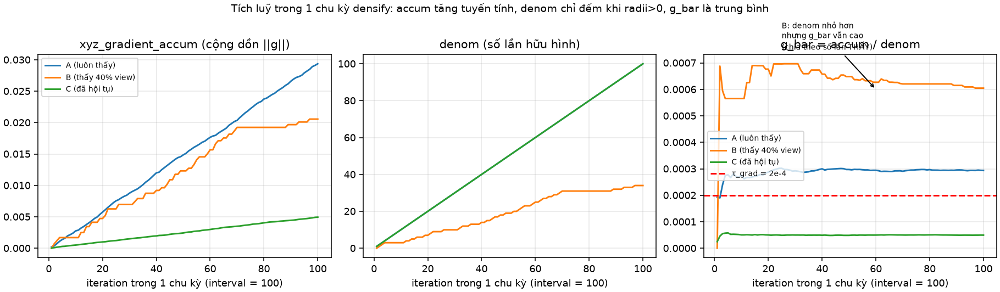

*Hình 4.2 — 100 vòng, 3 Gaussian: A luôn hữu hình ($\sim3\times10^{-4}$); B hữu hình 40 % nhưng $\sim6\times10^{-4}$; C hội tụ ($\sim5\times10^{-5}$). Đường đỏ: $\tau_{\text{grad}}$.*

- → $\bar g$ ổn định sau 10–20 lần hữu hình → interval 500 không "ước lượng tốt hơn", chỉ **ít mốc hơn**.
- → B vượt ngưỡng nhờ chia `denom`; chia 100 sẽ cho $2.4\times10^{-4}$, sát ngưỡng.
- → C dưới ngưỡng: cơ chế tự dừng theo gradient.

#### 12.4.2.4 Số cảnh đồ chơi (3 view = 3 iteration)

| | accum | accum$^{\text{abs}}$ | denom | $\bar g_i$ | $\bar g^{\text{abs}}_i$ | $\ge2$e−4 | $\ge1.2$e−3 |
|---|---|---|---|---|---|---|---|
| $G_1$ | 2.125e−2 | 9.550e−2 | 3 | 7.08e−3 | 3.18e−2 | ✅ | ✅ |
| $G_2$ | 1.779e−2 | 9.509e−2 | 3 | 5.93e−3 | 3.17e−2 | ✅ | ✅ |
| $G_3$ | 1.794e−2 | 9.295e−2 | 3 | 5.98e−3 | 3.10e−2 | ✅ | ✅ |
| $G_4$ | 1.810e−2 | 7.198e−2 | 3 | 6.04e−3 | 2.40e−2 | ✅ | ✅ |

### 12.4.3 Điều kiện AND của FastGS-lite

3DGS gốc:

$$
\text{clone}_i=[\lVert\bar g_i\rVert\ge\tau_{\text{grad}}]\wedge[\max s_i\le\delta\,\text{ext}],\qquad
\text{split}_i=[\lVert\bar g_i\rVert\ge\tau_{\text{grad}}]\wedge[\max s_i>\delta\,\text{ext}]
$$

FastGS-lite (`gaussian_model.py:449-462`):

```python
grad_qualifiers     = torch.norm(grad_vars, dim=-1) >= args.grad_thresh        # 2e-4
grad_qualifiers_abs = torch.norm(grads_abs, dim=-1) >= args.grad_abs_thresh    # 1.2e-3
clone_qualifiers = torch.max(self.get_scaling, dim=1).values <= args.dense*extent
split_qualifiers = torch.max(self.get_scaling, dim=1).values >  args.dense*extent
all_clones = torch.logical_and(clone_qualifiers, grad_qualifiers)
all_splits = torch.logical_and(split_qualifiers, grad_qualifiers_abs)
metric_mask = importance_score > 5          # AND bên trong clone/split
```

$$
\boxed{\ \text{clone}_i=[\lVert\bar g_i\rVert\ge\tau_{\text{grad}}]\wedge[\max s_i\le\delta\,\text{ext}]\wedge[\text{Imp}_i>5]\ }
$$

$$
\boxed{\ \text{split}_i=[\lVert\bar g^{\text{abs}}_i\rVert\ge\tau^{\text{abs}}_{\text{grad}}]\wedge[\max s_i>\delta\,\text{ext}]\wedge[\text{Imp}_i>5]\ }
$$

- Nhánh split **thay** gradient có dấu bằng abs (ngưỡng riêng).
- Cả hai nhánh **thêm** Importance $>5$: gradient nói "muốn đổi", Importance nói "render thật sự sai ở nhiều view".
- 3 ca gradient cao nhưng không nên densify: vùng hội tụ còn nhiễu L1; artefact 1–2 góc ($G_5$); Gaussian kẹp giữa hai Gaussian tranh pixel.

#### 12.4.3.1 5 Gaussian của `3.md`

| | $\lVert\bar g\rVert$ | $\lVert\bar g^{\text{abs}}\rVert$ | kích thước | Imp | 3DGS | FastGS-lite |
|---|---|---|---|---|---|---|
| $G_1$ | 0.00025 ✅ | 0.00040 | nhỏ | 0 | clone | **chặn** |
| $G_2$ | 0.00008 ❌ | 0.00030 | nhỏ | 0 | — | — |
| $G_3$ | 0.00031 ✅ | 0.00055 | nhỏ | 6 | clone | **CLONE** |
| $G_4$ | 0.00011 | 0.00150 ✅ | **to** | 3 | ❌ (có dấu) | **chặn** |
| $G_5$ | 0.00042 ✅ | 0.00070 | nhỏ | 1 | clone | **chặn** |

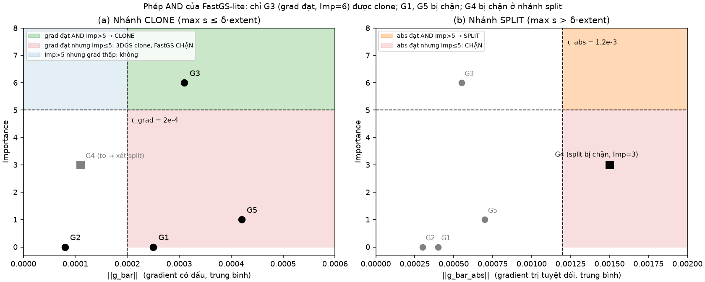

*Hình 4.3 — (a) nhánh clone: trục $\lVert\bar g\rVert$; (b) nhánh split: trục $\lVert\bar g^{\text{abs}}\rVert$. Đứt dọc = ngưỡng gradient, đứt ngang = Importance 5. Vùng đỏ = 3DGS densify nhưng FastGS chặn.*

- → Chỉ $G_3$ trong vùng xanh. $N:5\to6$ thay vì $5\to8$.
- → $G_1,G_5$ bị chặn bởi Importance; $G_4$ bị chặn ở nhánh split (Imp 3).

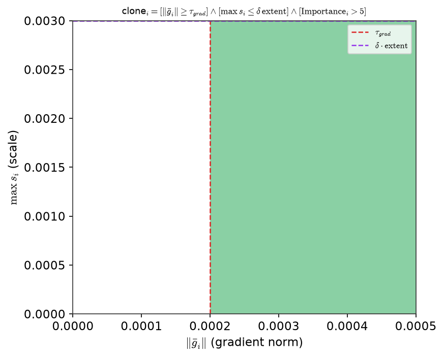

*Hình gốc — mặt phẳng $(\lVert\bar g\rVert,\max s)$: vùng xanh = gradient đủ lớn, scale nhỏ. Chiều Importance không vẽ được.*

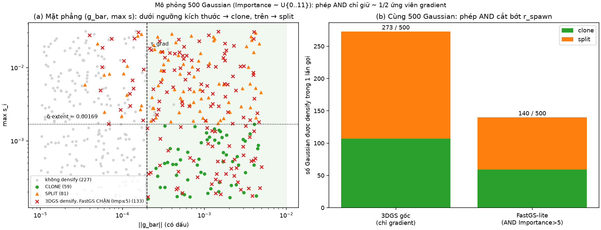

*Hình 4.4 — 500 Gaussian mô phỏng, Importance $\sim U\{0..11\}$: 59 clone, 81 split, 133 × (3DGS densify / FastGS chặn), 227 không ai densify. 3DGS: 273, FastGS: 140.*

- → Importance rải đều → AND cắt ~½ ứng viên.
- → Thực tế: đầu train Importance $\gg5$ (AND không cắt), càng về sau cắt càng mạnh → $N(t)$ tách dần.

### 12.4.4 Clone hay split: $\delta\cdot\text{extent}$

#### 12.4.4.1 Scene extent từ camera

$$
\bar c=\frac1{|\mathcal V|}\sum_v c_v,\qquad \text{diag}=\max_v\lVert c_v-\bar c\rVert,\qquad
\boxed{\ \text{extent}=1.1\cdot\text{diag}\ }
$$

- Chỉ phụ thuộc **tâm camera**, hằng số suốt train; cũng là `spatial_lr_scale`.
- Cảnh đồ chơi: $c_{1,2,3}=(0,0,-4),(1.5,0,-4),(-1.5,0.5,-4)$ → $\bar c=(0,0.1667,-4)$, diag $=1.5366$, $\text{extent}=1.690250$, $\delta\,\text{extent}=0.00169$.

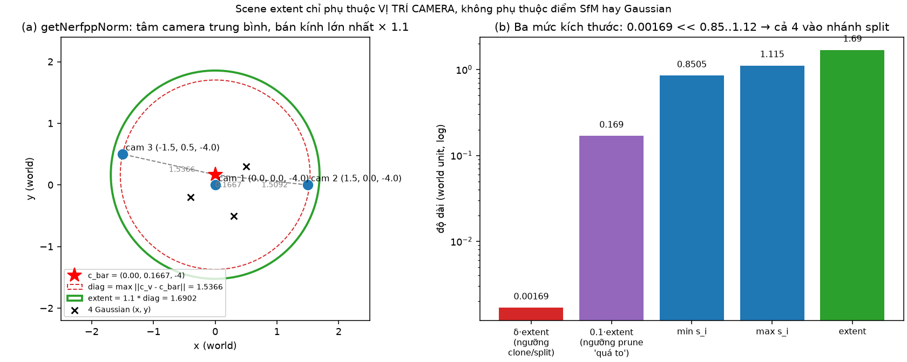

*Hình 4.5 — (a) nhìn từ trên: 3 camera, $\bar c$, vòng diag và vòng extent; (b) trục log: $\delta\,\text{ext}=0.00169$, $0.1\,\text{ext}=0.169$, $\min s=0.85$, $\max s=1.12$, $\text{ext}=1.69$.*

- → Ngưỡng clone/split nhỏ hơn scale khởi tạo **500 lần** ở cảnh thưa → mọi thứ vào split.
- → Cảnh thật ($10^5$ điểm SfM): khoảng cách láng giềng $10^{-3}$–$10^{-2}$ ext → nhiều Gaussian ở nhánh clone.

#### 12.4.4.2 Under- vs over-reconstruction

| Bệnh | Triệu chứng | Dấu vết gradient | Thuốc |
|---|---|---|---|
| Under | vùng cần phủ rộng hơn Gaussian | $\bar g$ có dấu lớn, hướng rõ | **clone** |
| Over | Gaussian to trùm chi tiết nhỏ | $\sum_x g_x\approx0$, $\sum_x|g_x|$ lớn | **split** |

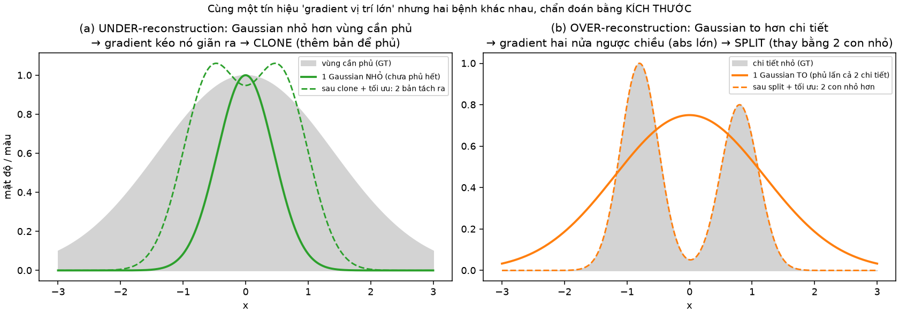

*Hình 4.7 — (a) Gaussian nhỏ $\sigma=0.45$ cố phủ bướu $\sigma=1.4$ → clone rồi tách hai bên; (b) Gaussian to $\sigma=1.2$ trùm hai chi tiết $\sigma=0.3$ → split thành hai con đúng chỗ.*

- → (b): gradient vị trí triệt tiêu → nhánh split phải dùng $\bar g^{\text{abs}}$.
- → (a): gradient có dấu rõ → nhánh clone dùng $\bar g$ là đủ.

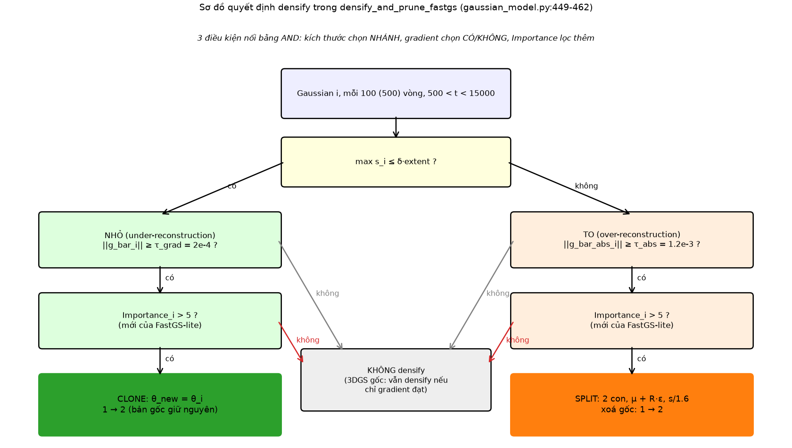

*Hình 4.6 — kích thước rẽ nhánh → gradient (có dấu / abs) chặn → Importance $>5$ chặn (tầng đỏ, 3DGS không có).*

- → Kích thước không bao giờ chặn ($\le$ và $>$ bù nhau), chỉ rẽ nhánh.

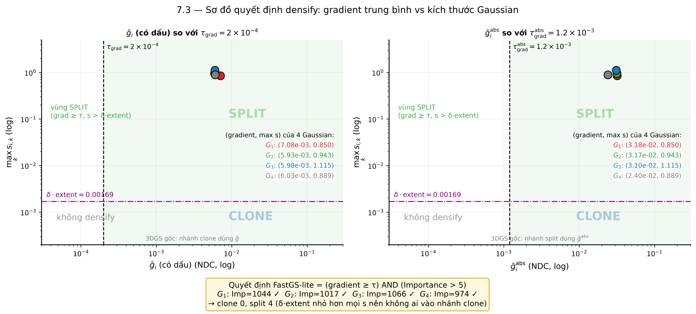

*Hình gốc — cảnh đồ chơi: cả 4 Gaussian ở góc split.*

| | $\max s_i$ | $\le0.00169$? | nhánh | $\bar g^{\text{abs}}\ge1.2$e−3 | Imp $>5$ | kết quả |
|---|---|---|---|---|---|---|
| $G_1$ | 0.8505 | ❌ | split | ✅ 3.18e−2 | ✅ 1044 | **SPLIT** |
| $G_2$ | 0.9434 | ❌ | split | ✅ 3.17e−2 | ✅ 1017 | **SPLIT** |
| $G_3$ | 1.1150 | ❌ | split | ✅ 3.10e−2 | ✅ 1066 | **SPLIT** |
| $G_4$ | 0.8888 | ❌ | split | ✅ 2.40e−2 | ✅ 974 | **SPLIT** |

Clone 0, split 4 — cảnh này chỉ kiểm chứng số học; phép AND chỉ cắt ở `3.md`.

### 12.4.5 Split: hai con lấy mẫu từ hình dạng gốc

```python
stds  = self.get_scaling[mask].repeat(N, 1)                                   # (2M,3)
samples = torch.normal(mean=torch.zeros_like(stds), std=stds)                 # eps, hệ cục bộ
rots  = build_rotation(self._rotation[mask]).repeat(N, 1, 1)                  # R(q)
new_xyz = torch.bmm(rots, samples.unsqueeze(-1)).squeeze(-1) + self.get_xyz[mask].repeat(N, 1)
new_scaling = self.scaling_inverse_activation(self.get_scaling[mask].repeat(N, 1) / (0.8 * N))
# rotation, features, opacity: repeat(N, ...)  → densification_postfix → prune_points(gốc)
```

$$
\boxed{\ \epsilon^{(j)}\sim\mathcal N\bigl(0,\operatorname{diag}(s_i^2)\bigr),\quad
\mu^{(j)}=\mu_i+R(q_i)\,\epsilon^{(j)},\quad
\tilde s^{(j)}=\log\frac{s_i}{0.8N}=\log\frac{s_i}{1.6},\quad j=1,2\ }
$$

$q^{(j)}=q_i,\ c^{(j)}=c_i,\ \tilde\alpha^{(j)}=\tilde\alpha_i$; gốc bị xoá → ròng $1\to2$.

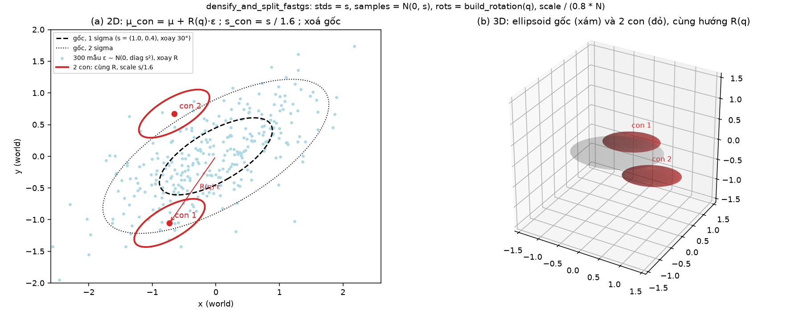

*Hình 4.8 — (a) 2D: gốc $s=(1,0.4)$ xoay $30°$, 300 mẫu $R\epsilon$, hai con (đỏ) cùng hướng, bán trục $\times0.625$; (b) 3D tương tự.*

- → Hai con là hai mẫu **độc lập**, không đối xứng qua tâm; có thể cùng một phía.
- → Chỉ cần hai điểm khác nhau trong vùng gốc để nhận gradient khác nhau; tối ưu quyết định vị trí cuối.

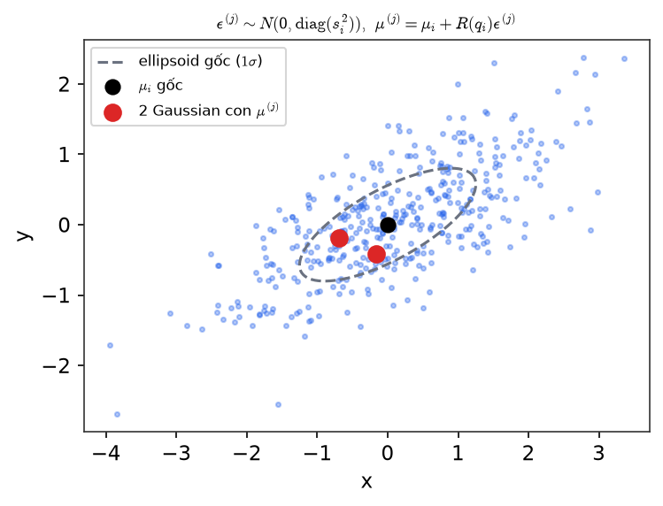

*Hình gốc — ellipse $1\sigma$ gốc, mẫu $\epsilon$ đã xoay, hai con đỏ.*

**Con số 1.6** ($=0.8N$, hằng kinh nghiệm 3DGS):

- $/2$: hai con quá nhỏ, cách nhau $\sim s$ → "thủng" giữa.
- $/1$: hai con to bằng gốc, chồng nhau → không chữa over-reconstruction.
- $/1.6$: bán trục $-37.5\%$, thể tích còn $24\%$/con; tổng phương sai hai con $\approx1.39s^2$ (rộng hơn gốc — cố ý "làm rối" cho tối ưu sửa).

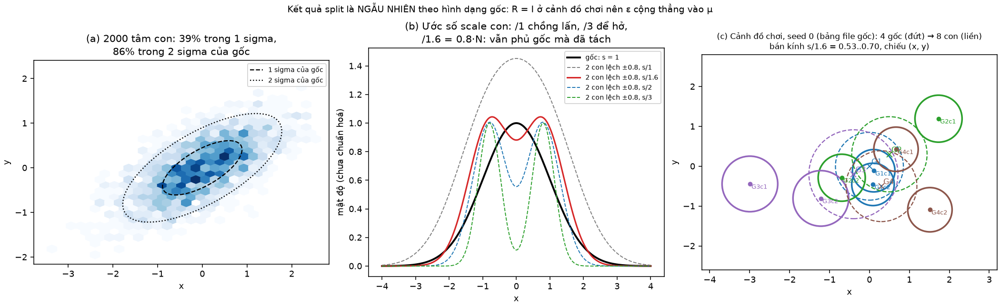

*Hình 4.9 — (a) 2000 tâm con: $39\%$ trong $1\sigma$, $86\%$ trong $2\sigma$ (đúng $\chi^2_2$); (b) tổng hai con lệch $\pm0.8s$ với ước số $/1$, $/1.6$, $/2$, $/3$; (c) cảnh đồ chơi seed 0: 4 gốc → 8 con.*

- → $1.6$: vừa tách hai đỉnh, vừa phủ gần khít gốc.
- → $G_3c_1$ ở $x=-2.99$, cách gốc $2.3\sigma$ — mẫu đuôi hiếm nhưng seed 0 rơi trúng.

| gốc | $\epsilon^{(1)}$ | $\mu^{(1)}$ | $\epsilon^{(2)}$ | $\mu^{(2)}$ | $\tilde s^{(j)}$ | $s^{(j)}$ |
|---|---|---|---|---|---|---|
| $G_1$ | (0.1069, −0.1124, 0.5447) | (0.1069, −0.1124, 0.5447) | (0.0892, −0.4556, 0.3075) | (0.0892, −0.4556, 0.3075) | −0.6319 | 0.5316 |
| $G_2$ | (1.2302, 0.8935, −0.6639) | (1.7302, 1.1935, −0.1639) | (−1.1938, −0.5880, 0.0390) | (−0.6938, −0.2880, 0.5390) | −0.5283 | 0.5896 |
| $G_3$ | (−2.5925, −0.2440, −1.3893) | (−2.9925, −0.4440, −0.3893) | (−0.8165, −0.6069, −0.3527) | (−1.2165, −0.8069, 0.6473) | −0.3611 | 0.6969 |
| $G_4$ | (0.3659, 0.9266, −0.1142) | (0.6659, 0.4266, 0.0858) | (1.2145, −0.5912, 0.3124) | (1.5145, −1.0912, 0.5124) | −0.5879 | 0.5555 |

Kiểm: $G_1$, $R=I$, $\mu_1=0$ → $\mu^{(1)}=\epsilon^{(1)}$; $\log(0.8505/1.6)=-0.6319$ ✓.

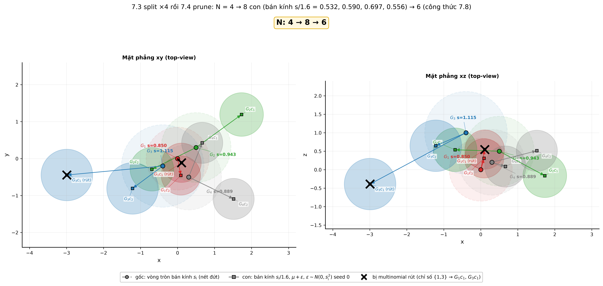

*Hình gốc — 4 gốc (bán kính $s$), 8 con ($s/1.6$), hai con bị multinomial rút (X): $N:4\to8\to6$.*

### 12.4.6 Clone: sao chép y nguyên, Adam tách sau

```python
selected_pts_mask = torch.logical_and(metric_mask, filter)
new_xyz = self._xyz[selected_pts_mask]      # tương tự cho features, opacity, scaling, rotation
self.densification_postfix(...)             # không prune_points: gốc ở lại
```

$$
\boxed{\ \theta_{\text{new}}=\theta_i\ }\qquad(\mu,\tilde s,q,\tilde\alpha,k_{lm}\ \text{sao chép};\ 1\to2)
$$

Vì sao không dịch theo gradient: (i) hướng đã mất khi lấy norm; (ii) 100 vòng Adam kế tiếp chính là "dịch"; (iii) đối xứng bị phá bởi Adam state $m=v=0$ của bản mới (`cat_tensors_to_optimizer` nối `zeros_like`), `step` chung.

**Bước Adam đầu của bản clone** ($\beta_1=0.9,\beta_2=0.999$, bias correction $\approx1$):

$$
m'=0.1g,\ v'=0.001g^2\ \Rightarrow\ \Delta_{\text{clone}}=\eta\frac{0.1g}{\sqrt{0.001}|g|}=3.16\,\eta\,\text{sign}(g);\qquad
\Delta_{\text{gốc}}\approx\eta\,\text{sign}(g)
$$

$$
\frac{1-\beta_1}{\sqrt{1-\beta_2}}=\frac{0.1}{0.0316}=3.16\ \Rightarrow\ \text{lệch }\approx2.16\,\eta\text{ sau một vòng}
$$

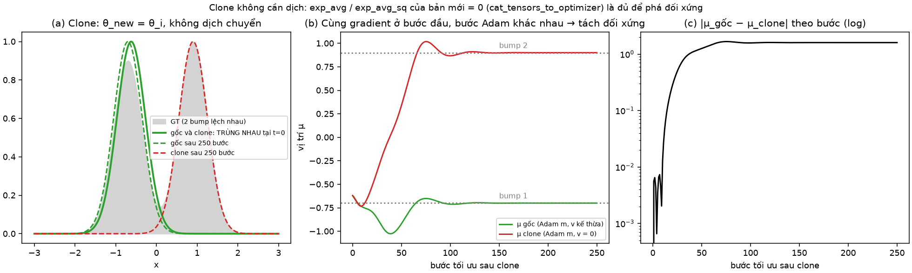

*Hình 4.10 — 1D: hai bướu tại $-0.7$ và $0.9$; gốc chạy 30 bước rồi clone. (a) trùng nhau lúc clone, tách sau 250 bước; (b) quỹ đạo $\mu$; (c) $|\mu_{\text{gốc}}-\mu_{\text{clone}}|$ thang log.*

- → Khoảng cách xuất phát $\sim10^{-3}$, tăng theo hàm mũ ~50 bước, bão hoà khi mỗi bản bám một bướu.
- → Với SGD thuần hai bản trùng nhau mãi; Adam state là thứ phá đối xứng.

#### Clone vs split

| | Clone | Split |
|---|---|---|
| Kích thước | $\max s\le\delta\,\text{ext}$ | $\max s>\delta\,\text{ext}$ |
| Gradient | $\lVert\bar g\rVert\ge2\times10^{-4}$ | $\lVert\bar g^{\text{abs}}\rVert\ge1.2\times10^{-3}$ |
| Lọc thêm | Imp $>5$ | Imp $>5$ |
| Vị trí mới | $=\mu_i$ | $\mu_i+R(q_i)\epsilon$ |
| Scale mới | $=s_i$ | $s_i/1.6$ |
| Bản gốc | giữ | xoá |
| $\Delta N$ | $+1$ | $+1$ ($+2-1$) |
| Ngẫu nhiên | không | có |
| Adam state mới | $m=v=0$ | $m=v=0$ |
| Bệnh | under | over |

### 12.4.7 Luỹ thừa $N$

$$
N_{k+1}=N_k(1+f_{\text{clone}}+f_{\text{split}})(1-f_{\text{prune}})=N_k\,q,\qquad q=(1+r_{\text{spawn}})(1-r_{\text{prune}})
$$

$$
\boxed{\ N_n=N_0\,q^{\,n}\ }\qquad
\frac{\partial\ln N_n}{\partial q}=\frac nq
$$

| $r_{\text{spawn}}$ | $r_{\text{prune}}$ | $q$ | $q^{28}$ | $q^{144}$ | nhận xét |
|---|---|---|---|---|---|
| 0.15 | 0.05 | 1.0925 | 11.9 | $3.4\times10^5$ | bảng file gốc (145: $3.7\times10^5$) |
| 0.10 | 0.05 | 1.0450 | 3.43 | 566 | AND cắt ⅓ spawn → $N_{144}$ giảm 600 lần |
| 0.05 | 0.05 | 0.9975 | 0.93 | 0.70 | cân bằng |
| 0.05 | 0.10 | 0.9450 | 0.21 | $2.9\times10^{-4}$ | prune thắng |
| 0.02 | 0.02 | 0.9996 | 0.99 | 0.94 | cuối cửa sổ densify |

- $\ln1.15-\ln1.10=0.044$ ≈ $\ln0.95-\ln0.90=0.054$: spawn và prune **đối xứng** trên $\ln q$.
- Mô hình đúng định tính (khuếch đại mũ) và cho vài chục mốc đầu; $r_{\text{spawn}}$ thật giảm dần → $N(t)$ chữ S bão hoà.

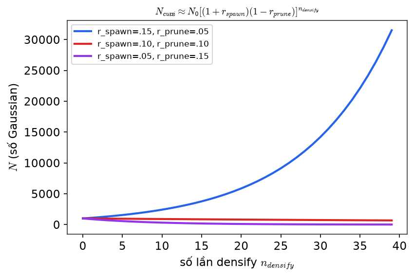

*Hình gốc — $N$ (tuyến tính) theo $n$, ba cặp $(r_{\text{spawn}},r_{\text{prune}})$.*

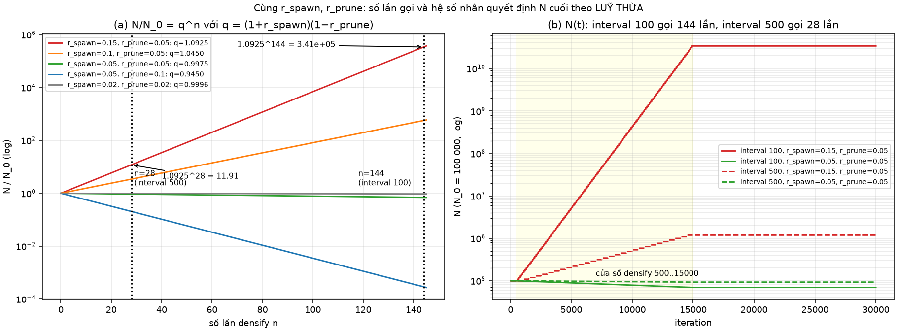

*Hình 4.11 — (a) $N/N_0$ thang log: hàm mũ thành đường thẳng độ dốc $\ln q$; vạch $n=28$, $n=144$. (b) $N(t)$, $N_0=10^5$: 144 bậc nhỏ (interval 100) vs 28 bậc lớn (interval 500), dải vàng $500$–$15000$.*

- → Interval 500 = cắt độ dốc log đi 5 lần → preset Colab tiết kiệm thời gian **và** bộ nhớ.
- → Giá: ít cơ hội sửa; phép AND giúp Gaussian được thêm "đúng chỗ" hơn.

Cảnh đồ chơi: $N_0=4$, split 4 → $r_{\text{spawn}}=1.0$, prune 2/8 → $r_{\text{prune}}=0.25$, $q=1.5$, $N_1=6$.

### 12.4.8 Reset thống kê, `max_radii2D`, thứ tự thao tác

```python
# densification_postfix (cuối clone và cuối split)
self.xyz_gradient_accum     = torch.zeros((N_new, 1), device="cuda")
self.xyz_gradient_accum_abs = torch.zeros((N_new, 1), device="cuda")
self.denom                  = torch.zeros((N_new, 1), device="cuda")
self.max_radii2D            = torch.zeros((N_new),    device="cuda")
```

- Tạo mới **toàn bộ**, không chỉ nối 0 → mọi Gaussian bắt đầu chu kỳ từ trang trắng.
- Chạy **hai lần** mỗi mốc (clone rồi split), kể cả mask rỗng.
- Con vừa sinh có `max_radii2D = 0` → không bị coi "quá to trên màn hình" ngay lúc sinh.

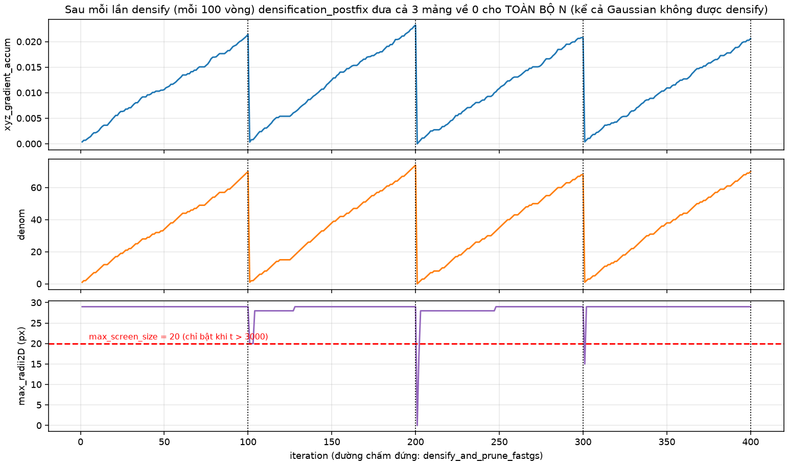

*Hình 4.12 — 400 vòng, hữu hình 70 %: `accum` răng cưa, `denom` bậc thang, `max_radii2D` không giảm (`torch.max`); về 0 sau mỗi vạch 100. Đường đỏ 20 px chỉ hiệu lực khi $t>3000$.*

- → `max_radii2D` = **max** trong chu kỳ: một view sát camera đủ đẩy qua 20 px.

**Thứ tự thật trong `densify_and_prune_fastgs`:**

| # | Thao tác | Ghi chú |
|---|---|---|
| 1 | $\bar g,\bar g^{\text{abs}}$, NaN→0; `tmp_radii = radii` | `radii` của view cuối, không tích luỹ |
| 2 | 4 mask + `metric_mask = Imp > 5` | trên $N$ cũ |
| 3 | **Clone**: nối $M_c$ | reset thống kê |
| 4 | **Split**: `mask[:N_cũ]` → nối $2M_s$, xoá $M_s$ gốc | bản clone mới không bị split cùng mốc |
| 5 | **Prune** multinomial (12.5) | `padded_importance[:N_score]` theo chỉ số cũ |
| 6 | Ép $\tilde\alpha\leftarrow\sigma^{-1}(\min(\alpha,0.8))$ | xoá Adam state nhóm opacity |
| 7 | `tmp_radii = None`, `empty_cache()` | |

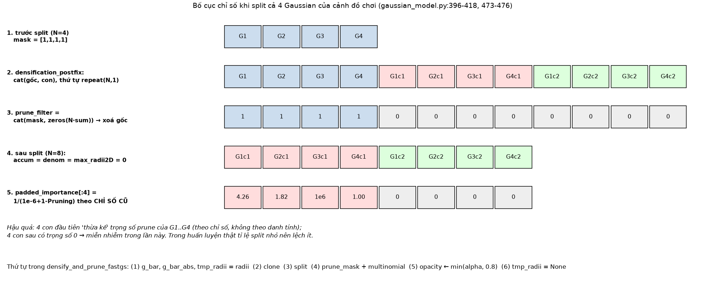

*Hình 4.13 — 5 trạng thái mảng: 4 gốc → [4 gốc, 4 con$_1$, 4 con$_2$] (`repeat(N,1)` xếp toàn bộ bản lặp 1 trước) → `prune_filter` → 8 con → `padded_importance` gán $(4.26,1.82,10^6,1.00)$ vào 4 ô đầu (nay là $G_1c_1..G_4c_1$), 0 cho 4 ô sau.*

- → Điểm số tính **trước** densify trên $N$ cũ, gán theo **vị trí**: con thứ nhất "thừa kế" Pruning của gốc.
- → Thực tế split vài % mỗi mốc → lệch chỉ số nhỏ; cảnh đồ chơi 100 % split nên $N=4$ thay vì 6.

### 12.4.9 Trace số một chu kỳ (`3.md`, chu kỳ 5 vòng)

**Tích luỹ $G_3$** ($\lVert g_3\rVert=(2.8,3.5,-,3.0,3.1)\times10^{-4}$, vòng 3 không hữu hình):

| vòng | hữu hình | accum$_3$ | accum$^{\text{abs}}_3$ | denom$_3$ |
|---|---|---|---|---|
| 1 | ✅ | 2.8e−4 | 5.0e−4 | 1 |
| 2 | ✅ | 6.3e−4 | 11.2e−4 | 2 |
| 3 | ❌ | 6.3e−4 | 11.2e−4 | 2 |
| 4 | ✅ | 9.3e−4 | 16.6e−4 | 3 |
| 5 | ✅ | 12.4e−4 | 22.2e−4 | 4 |

$\bar g_3=12.4/4=3.1\times10^{-4}$, $\bar g^{\text{abs}}_3=5.55\times10^{-4}$ ✓ (bảng D `3.md`).

**Bốn mask + AND:**

| | `grad_q` | `grad_q_abs` | nhỏ/to | `all_clones` | `all_splits` | Imp | `∧ metric` |
|---|---|---|---|---|---|---|---|
| $G_1$ | 1 | 0 | nhỏ | 1 | 0 | 0 | **0** |
| $G_2$ | 0 | 0 | nhỏ | 0 | 0 | 0 | 0 |
| $G_3$ | 1 | 0 | nhỏ | 1 | 0 | 6 | **clone** |
| $G_4$ | 0 | 1 | to | 0 | 1 | 3 | **0** |
| $G_5$ | 1 | 0 | nhỏ | 1 | 0 | 1 | **0** |

3DGS: clone $\{G_1,G_3,G_5\}$ + split $\{G_4\}$, $N:5\to9$ ($r_{\text{spawn}}=0.8$). FastGS-lite: clone $\{G_3\}$, $N:5\to6$ ($r_{\text{spawn}}=0.2$).

**Sau clone $G_3$:**

| tensor | trước | sau | phần mới |
|---|---|---|---|
| `_xyz`, `_scaling`, `_rotation`, features | $5\times\cdot$ | $6\times\cdot$ | $=G_3$ |
| `_opacity` | $5\times1$ | $6\times1$ | $\sigma^{-1}(0.40)=-0.405$ |
| Adam `exp_avg`, `exp_avg_sq` | $5\times\cdot$ | $6\times\cdot$ | **0** |
| `accum`, `accum_abs`, `denom`, `max_radii2D` | 5 | 6 | **toàn 0** (tạo mới) |

Split mask toàn 0 → nối tensor rỗng, vẫn tạo lại thống kê 0. Prune: $\alpha=(0.85,0.62,0.40,0.07,0.55,0.40)\ge0.005$ → $\mathcal C=\varnothing$, budget 0. Ép $\min(\alpha,0.8)$: $G_1$ $0.85\to0.8$. $N=6$.

### 12.4.10 Shape tensor qua một mốc ($N$, $M_c$ clone, $M_s$ split, $M_p$ prune)

| Thời điểm | số Gaussian | thống kê | `max_radii2D` | Adam state |
|---|---|---|---|---|
| đầu hàm | $N$ | tích luỹ 100 vòng | max 100 vòng | $N$ |
| sau clone | $N+M_c$ | **0** | **0** | $+M_c$ số 0 |
| sau split (nối) | $N+M_c+2M_s$ | 0 | 0 | $+2M_s$ số 0 |
| sau split (xoá gốc) | $N+M_c+M_s$ | 0 | 0 | cắt $M_s$ hàng |
| sau prune | $N+M_c+M_s-M_p$ | 0 | 0 | cắt $M_p$ hàng |
| cuối hàm | $N'$ | 0 | 0 | opacity: $m=v=0$ toàn bộ |

### 12.4.11 Đối chiếu 3DGS / FastGS-lite ở bước densify

| | 3DGS gốc | FastGS-lite | Ảnh hưởng $r_{\text{spawn}}$ |
|---|---|---|---|
| Cột gradient | 2 (có dấu) | 4 (có dấu + abs) | — |
| Clone: gradient | $\lVert\bar g\rVert\ge2\times10^{-4}$ | như 3DGS | — |
| Clone: lọc thêm | — | Imp $>5$ | giảm |
| Split: gradient | $\lVert\bar g\rVert\ge2\times10^{-4}$ | $\lVert\bar g^{\text{abs}}\rVert\ge1.2\times10^{-3}$ | tăng ở biên, giảm ở vùng phẳng |
| Split: lọc thêm | — | Imp $>5$ | giảm |
| $\delta$ | $0.01$ (`percent_dense`) | $0.001$ (`--dense`) | nhiều Gaussian vào split hơn |
| Cơ chế clone/split | giống hệt | giống hệt ($0.8N$, `repeat`, xoá gốc) | — |
| Chi phí mỗi mốc | 0 render | $2V=20$ render | — |

### 12.4.12 Ký hiệu

| Ký hiệu | Định nghĩa | Code | Giá trị |
|---|---|---|---|
| $g_i(t)$, $g^{\text{abs}}_i(t)$ | $\sum_x\partial\mathcal L/\partial\mu'_i$, $\sum_x|\cdot|$ | `grad[:, :2]`, `grad[:, 2:]` | NDC |
| $\text{accum}_i$, $\text{accum}^{\text{abs}}_i$, $\text{denom}_i$ | $\sum_t\mathbb 1_i\lVert g\rVert$, …, $\sum_t\mathbb 1_i$ | `xyz_gradient_accum(_abs)`, `denom` | |
| $\bar g_i$, $\bar g^{\text{abs}}_i$ | accum/denom, NaN→0 | `grad_vars`, `grads_abs` | NDC |
| $\tau_{\text{grad}}$, $\tau^{\text{abs}}_{\text{grad}}$ | ngưỡng clone / split | `--grad_thresh`, `--grad_abs_thresh` | $2\times10^{-4}$, $1.2\times10^{-3}$ |
| $\delta$, extent | tỉ lệ kích thước; $1.1\max_v\lVert c_v-\bar c\rVert$ | `--dense`, `scene.cameras_extent` | $0.001$ |
| $\epsilon^{(j)}$, $\mu^{(j)}$, $\tilde s^{(j)}$ | $\mathcal N(0,\text{diag}\,s^2)$; $\mu+R\epsilon$; $\log(s/1.6)$ | `torch.normal`, `bmm`, `log(s/(0.8N))` | |
| $n_{\text{densify}}$, $q$, $N_n$ | số mốc; $(1+r_s)(1-r_p)$; $N_0q^n$ | `train.py:132` | 144 / 28 |

*Một câu:* mỗi vòng cộng norm gradient màn hình (có dấu + abs) cho Gaussian hữu hình; mỗi mốc chia trung bình, rẽ nhánh theo $\max s$ vs $\delta\,$extent, so ngưỡng, AND với Importance $>5$; nhỏ → sao chép, to → hai con $\mu+R\epsilon$, $s/1.6$; xoá thống kê và lặp 28/144 lần — $N$ nhân luỹ thừa.

## 12.5 Prune có trọng số, ép opacity, tỉa cuối và đầu ra của khối

> Mở rộng mục 7.4–7.8 của Report. Ký hiệu: $\alpha_i=\sigma(\tilde\alpha_i)$ (tham số học là logit $\tilde\alpha_i$ = `_opacity`), $\text{Pruning}_i\in[0,1]$ (bước ⑦), $\mathcal C$ tập ứng viên, $\mathcal S$ tập rút mẫu.
> Code: `scene/gaussian_model.py:464-491` (prune + ép opacity), `:244-247` (`reset_opacity`), `:292-305` (`replace_tensor_to_optimizer`), `:307-346` (`_prune_optimizer`, `prune_points`), `:348-372` (`cat_tensors_to_optimizer`), `:498-505` (`final_prune_fastgs`), `train.py:127-158`.
> Mô phỏng trong phần này chỉ dùng numpy, seed cố định — **không** phải số đo huấn luyện thật.

Ba việc "bớt Gaussian", khác nhau ở **thời điểm**, **tiêu chí**, **ngẫu nhiên hay không**:

| | Khi nào | Tiêu chí | Ngẫu nhiên |
|---|---|---|---|
| Prune multinomial | cùng lần `densify_and_prune_fastgs` | $\mathcal C\cap\mathcal S$ | có |
| Ép opacity | sau mỗi densify / mỗi 3000 vòng | $\min(\alpha,0.8)$ / $\min(\alpha,0.01)$ | không |
| Tỉa cuối | mỗi 3000, $15000<t<30000$ | $\alpha<0.1\ \vee\ \text{Pruning}>0.9$ | không |

### 12.5.1 Prune có trọng số: lấy mẫu multinomial thay vì xoá thẳng

#### Tập ứng viên $\mathcal C$

$$
\boxed{\ \mathcal C=\bigl\{i:\ \underbrace{\alpha_i<0.005}_{\text{quá mờ}}\ \vee\ \underbrace{r^{2D}_i>20\ \text{px}}_{\text{quá to trên ảnh}}\ \vee\ \underbrace{\max_k s_{i,k}>0.1\,\text{extent}}_{\text{quá to trong world}}\bigr\}\ }
$$

- $r^{2D}_i$ = `max_radii2D[i]`; hai vế kích thước chỉ bật khi $t>3000$ (`size_threshold = 20 if iteration > opacity_reset_interval else None`).
- **OR** 3 điều kiện (ngược với **AND** của densify): danh sách rộng, lọc lại bằng điểm.
- $\mathcal C$ **không xoá gì**; nó chỉ cho ngân sách $B=\lfloor0.5\,|\mathcal C|\rfloor$. $|\mathcal C|\le1\Rightarrow B=0$, bỏ qua nhánh prune.

#### Trọng số và phép lấy mẫu

$$
w_i=\frac{1}{10^{-6}+(1-\text{Pruning}_i)},\quad i<N_{\text{score}};\qquad w_i=0\ \text{(Gaussian mới sinh trong lần này)}
$$

$$
\boxed{\ \mathcal S\sim\text{Multinomial}\bigl(w,\ B=\lfloor0.5|\mathcal C|\rfloor,\ \text{không hoàn lại}\bigr),\qquad \text{xoá}=\mathcal C\cap\mathcal S\ }
$$

| $\text{Pruning}_i$ | $w_i$ | ghi chú |
|---|---|---|
| $0$ | $1.000$ | sàn: mọi Gaussian đều có $w\ge1$ |
| $0.5$ | $2.000$ | |
| $0.9$ | $9.9999$ | khuỷu của $w$ = ngưỡng tỉa cuối |
| $0.99$ | $99.99$ | |
| $0.999$ | $\approx999$ | |
| $1.0$ | $10^{6}$ | luôn có ≥1 Gaussian (min–max qua $N$) → lượt 1 gần tất định |

$w$ tăng **hyperbol**: $[0,0.9]$ tăng 10 lần, $[0.9,1]$ tăng thêm $10^5$ lần.

**Vì sao multinomial, không top-$k$** (một dòng mỗi lý do):
1. Không cần thêm ngưỡng/$k$ — chỉ cần budget tương đối $0.5|\mathcal C|$.
2. Tránh khoét cả cụm có điểm gần nhau (hình 5.4).
3. Giữ đa dạng qua 28–145 lần gọi: quần thể còn đại diện ở mọi mức điểm.
4. Rút trên **cả $N$** rồi giao với $\mathcal C$ → xoá thật $<B$, tự "dịu" đi.

#### Số xoá thật

$$
\mathbb E\,|\mathcal C\cap\mathcal S|=\sum_{i\in\mathcal C}P(i\in\mathcal S)\ \le\ B,
\qquad
P(i\in\mathcal S)\Big|_{B=2}=\frac{w_i}{W}+\sum_{j\ne i}\frac{w_j}{W}\cdot\frac{w_i}{W-w_j},\quad W=\sum_k w_k
$$

Bằng $B$ chỉ khi toàn bộ khối lượng $w$ nằm trong $\mathcal C$. Thực tế $30$–$95\%$ của $B$.

#### Kịch bản $N=10$

$\text{Pruning}=(0,0.05,0.2,0.4,0.6,0.8,0.9,0.95,0.99,1.0)$, $\mathcal C=\{3,6,8,9,10\}$, $B=2$.

| $i$ | Pruning | $w_i$ | $p_i$ (lượt 1) | $\in\mathcal C$ |
|---|---|---|---|---|
| 1 | 0.00 | 1.0000 | $1.0\times10^{-6}$ | |
| 2 | 0.05 | 1.0526 | $1.1\times10^{-6}$ | |
| 3 | 0.20 | 1.2500 | $1.2\times10^{-6}$ | ✅ |
| 4 | 0.40 | 1.6667 | $1.7\times10^{-6}$ | |
| 5 | 0.60 | 2.5000 | $2.5\times10^{-6}$ | |
| 6 | 0.80 | 5.0000 | $5.0\times10^{-6}$ | ✅ |
| 7 | 0.90 | 9.9999 | $1.0\times10^{-5}$ | |
| 8 | 0.95 | 19.9996 | $2.0\times10^{-5}$ | ✅ |
| 9 | 0.99 | 99.9900 | $1.0\times10^{-4}$ | ✅ |
| 10 | 1.00 | $10^6$ | $0.999858$ | ✅ |

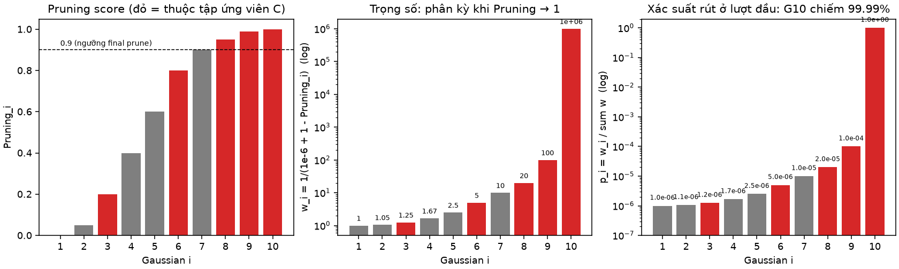

*Cột đỏ = thuộc $\mathcal C$; giữa và phải vẽ thang log.*
- → $i=1\to7$: $w$ chỉ $1\to10$; $i=7\to10$: tăng $10^5$ lần.
- → $p_{10}=0.999858$: lượt đầu gần chắc chắn là Gaussian 10.
- → Gaussian 7 có $w\approx10$ nhưng $\notin\mathcal C$: rút trúng cũng không xoá.

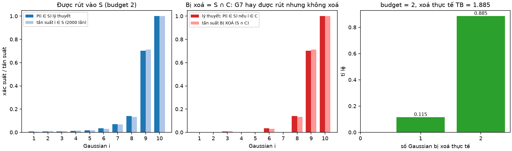

*Trái: $P(i\in\mathcal S)$ lý thuyết (đậm) vs quan sát (nhạt). Giữa: chỉ $i\in\mathcal C$. Phải: số xoá mỗi lần.*
- → $P(i\in\mathcal S)=(0.007,0.007,0.009,0.012,0.018,0.035,0.070,0.140,0.702,1.000)$; $P(9)\approx99.99/142.5=0.702$ (lượt 2 sau khi 10 ra).
- → Tần suất xoá: $(0.010,\,0.030,\,0.132,\,0.712,\,1.000)$ cho $\{3,6,8,9,10\}$ — khớp Report $(0.010,0.035,0.136,0.698,1.0)$.
- → Xoá trung bình $1.885$ (lý thuyết $1.886$) $<B=2$; $\approx11\%$ số lần chỉ xoá 1.

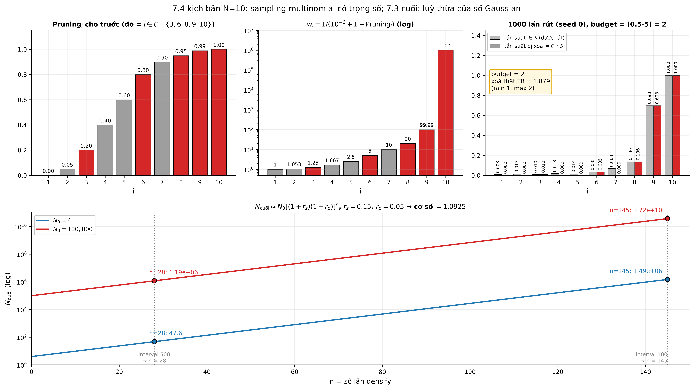

*Hình gốc Report: cùng kịch bản, 1000 lần rút (xoá thật 1.879); subplot phải là $N_0 q^n$ của mục 12.4.7.*

#### Top-$k$ vs multinomial trên 300 Gaussian

Pruning $\sim$ Beta$(2,2.5)$ rồi min–max; $\mathcal C$ = 40 % ngẫu nhiên độc lập với điểm → $|\mathcal C|=126$, $B=63$.

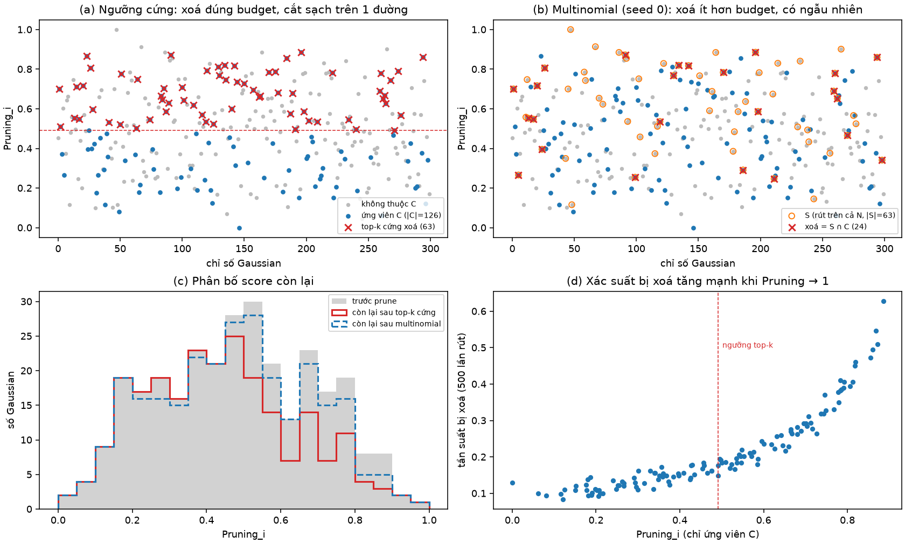

*(a) top-$k$; (b) multinomial (vòng cam = $\mathcal S$, X đỏ = $\mathcal S\cap\mathcal C$); (c) histogram còn lại; (d) tần suất xoá theo điểm, 500 lần.*
- → Top-$k$ tạo ngưỡng ẩn $\approx0.49$: trên bị xoá hết, dưới an toàn tuyệt đối.
- → Multinomial xoá $24/63\approx38\%$ budget; histogram còn lại gần trùng ban đầu.
- → (d): xác suất xoá là hàm **trơn tăng** theo điểm ($0.1\to0.6$), không phải bậc thang $0/1$.

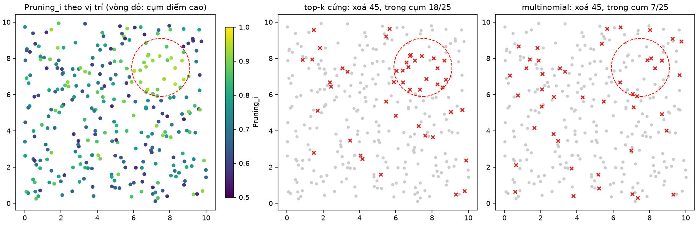

*Cụm 25 Gaussian có Pruning $\in[0.86,0.95]$ (vòng đỏ); xoá 15 % = 45 Gaussian.*
- → Top-$k$: $18/25$ trong cụm → khoét gần hết mảng. Multinomial: $7/25$, phần còn lại rải toàn cảnh.
- → Hiệu ứng chỉ rõ khi điểm cụm $<0.99$ ($w\approx7$–$20$); cụm $\ge0.999$ thì multinomial ≈ top-$k$.

#### Thứ tự thật trong `densify_and_prune_fastgs` (`:461-483`)

1. `densify_and_clone_fastgs` — nối $|\text{clone}|$ hàng cuối.
2. `densify_and_split_fastgs` — nối $2|\text{split}|$ con, `prune_points` xoá gốc → **chỉ số dịch**; con xếp theo `repeat(N,1)`.
3. `prune_mask` trên quần thể mới $N'$ (`max_radii2D` hàng mới $=0$).
4. `padded_importance[:scores.shape[0]] = 1/(1e-6 + scores)` — trọng số **cũ** gán theo **chỉ số**, không đánh lại.
5. `multinomial` trên $N'$; `final_prune = prune_mask & selected`; `prune_points`.
6. Ép opacity $\min(\alpha,0.8)$ (12.5.2).

Cảnh đồ chơi: 4 gốc đều split → 8 con; `padded_importance` $=(4.26,1.82,10^6,1.0,0,0,0,0)$; $\mathcal C$ = cả 8; $B=4$; chỉ 4 phần tử có $w>0$ → rút hết $\{0,1,2,3\}$ → $N=4$ (công thức 7.8 cho 6).

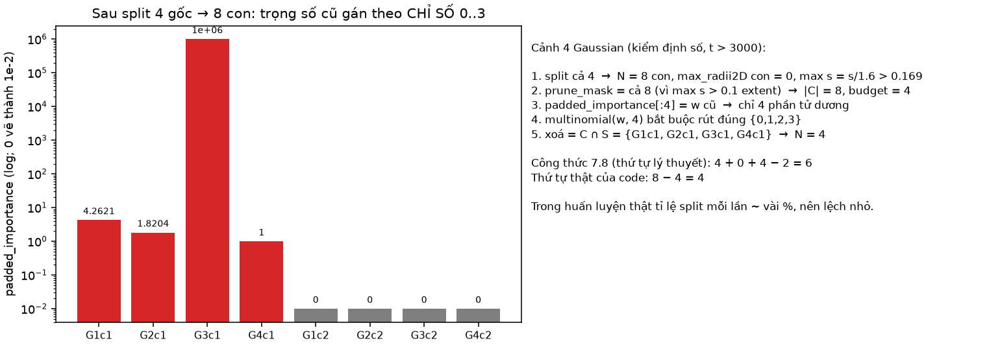

*Trái: `padded_importance` 8 hàng (log, giá trị 0 vẽ $10^{-2}$). Phải: 5 bước với số cảnh đồ chơi.*
- → $10^6$ của $G_3$ rơi lên $G_3c_1$ — tình cờ đúng vì cả 4 đều split; cảnh thật thì lệch hàng.
- → Số phần tử $w>0\le B$ ⇒ multinomial rút **hết**, nhánh prune thành tất định.
- → Huấn luyện thật chỉ vài % split mỗi mốc → sai lệch cục bộ, không nghiêm trọng.

### 12.5.2 Ép opacity hai đường

#### Logit và sigmoid

$$
\alpha_i=\sigma(\tilde\alpha_i)=\frac1{1+e^{-\tilde\alpha_i}},\qquad \sigma^{-1}(a)=\log\frac{a}{1-a},\qquad \sigma'(\tilde\alpha)=\alpha(1-\alpha)
$$

| $a$ | $\sigma^{-1}(a)$ | vai trò |
|---|---|---|
| $0.005$ | $-5.2933$ | ngưỡng vào $\mathcal C$ |
| $0.01$ | $-4.5951$ | đích `reset_opacity` |
| $0.1$ | $-2.1972$ | khởi tạo **và** ngưỡng tỉa cuối |
| $0.5$ | $0$ | tâm sigmoid |
| $0.8$ | $+1.3863$ | trần sau mỗi densify |
| $0.9$ | $+2.1972$ | GT cảnh đồ chơi |

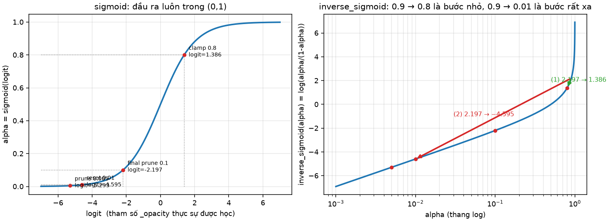

*Trái: $\sigma$; phải: $\sigma^{-1}$ với trục $\alpha$ log; mũi tên xanh (1) $0.9\to0.8$, đỏ (2) $0.9\to0.01$.*
- → Bước nhỏ trên $\alpha$ gần biên = bước xa trên logit: $0.9\to0.8$ dịch $0.81$; $0.9\to0.01$ dịch $6.79$.
- → `opacity_lr = 0.025` → cần **vài trăm bước** leo lại từ $-4.6$ lên $+1.4$.
- → $\sigma'(0.01)=0.0099$ vs $\sigma'(0.5)=0.25$: sau reset leo chậm rồi nhanh dần (đường chữ S).

#### Hai đường ép

$$
\boxed{\ (1)\ \tilde\alpha_i\leftarrow\sigma^{-1}\bigl(\min(\alpha_i,0.8)\bigr)\quad\text{cuối mỗi densify, }500<t<15000\ }
$$

$$
\boxed{\ (2)\ \tilde\alpha_i\leftarrow\sigma^{-1}\bigl(\min(\alpha_i,0.01)\bigr)=\min(\tilde\alpha_i,-4.5951)\quad t\in\{3000,6000,9000,12000\}\ }
$$

| | (1) trần $0.8$ | (2) reset $0.01$ |
|---|---|---|
| Ở đâu | `densify_and_prune_fastgs:485-487` | `reset_opacity`, `train.py:147` |
| Tần suất | 145 (interval 100) / 28 (500) | 4 lần ($t=15000$ **không** chạy vì `< 15000`) |
| Mục đích | giữ Gaussian còn "nhìn xuyên" → Gaussian sau vẫn nhận gradient qua $T$ | phép thử: hữu ích leo lại, vô dụng trôi $<0.005$ → vào $\mathcal C$ |
| 3DGS gốc có? | **không** | có |

Đích $0.01>0.005$ cố ý: reset **không tự xoá**, chỉ đặt mọi Gaussian cách ngưỡng một quãng ngắn. $N$ giảm **trễ** vài trăm vòng sau mốc $3000k$ (khi $|\mathcal C|$ phình).

#### Tương tác với Adam

`replace_tensor_to_optimizer(..., "opacity")`: $m=v\leftarrow0$ **chỉ nhóm opacity**, `step` **giữ nguyên** → không có bias correction. Với gradient $g$ hằng:

$$
m_1=(1-\beta_1)g=0.1g,\quad v_1=(1-\beta_2)g^2=0.001g^2
\ \Rightarrow\ 
\boxed{\ |\Delta_1|\approx\text{lr}\cdot\frac{0.1}{\sqrt{0.001}}\approx3.16\,\text{lr}\ }
$$

(Adam mới $t=1$: $|\Delta_1|=\text{lr}$ đúng.)

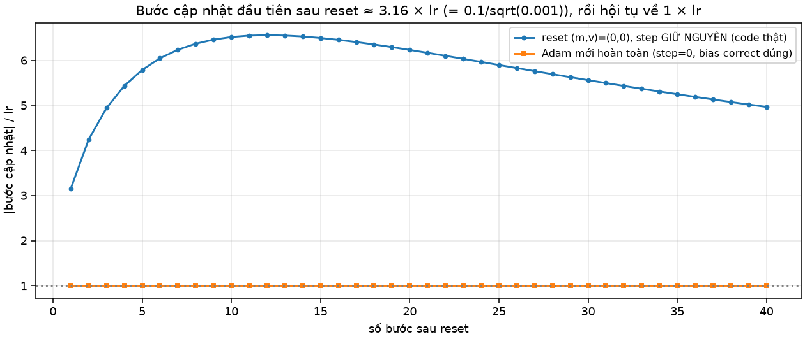

*$|\Delta|/\text{lr}$ theo bước sau reset; tròn = `step`$=6000$ (code), vuông = Adam mới.*
- → Bắt đầu $3.16$, về $1$ sau $\sim30$–$40$ bước ($m$ hội tụ nhanh hơn $\sqrt v$: $1/(1-\beta_1)=10$ vs $1/(1-\beta_2)=1000$).
- → Giải thích log loss: vọt lên tại $3000k$ (opacity về 0.01) rồi rơi nhanh bất thường vài chục vòng.

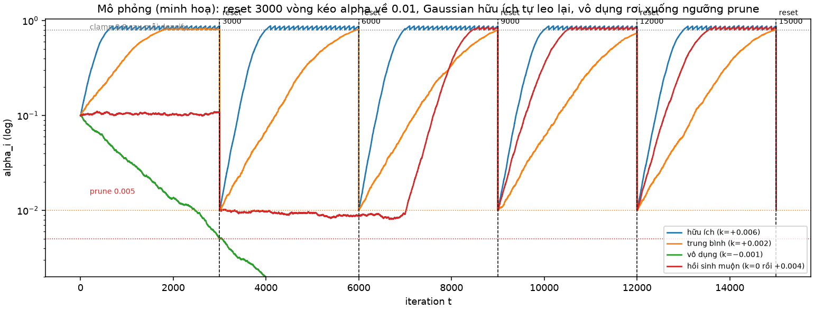

*Mô phỏng: logit tăng theo $k_i$ + nhiễu, clamp $0.8$ mỗi 100, reset $0.01$ mỗi 3000; trục $\alpha$ log.*
- → Hữu ích ($k=+0.006$): $0.01\to0.8$ trong $\approx1000$ vòng, răng cưa sát trần.
- → Vô dụng ($k=-0.001$): $<0.005$ sau $\approx700$ vòng → vào $\mathcal C$.
- → "Hồi sinh muộn": nằm ở $0.01$ qua 2 chu kỳ không bị xoá ($0.01>0.005$), rồi leo từ $t=7000$.

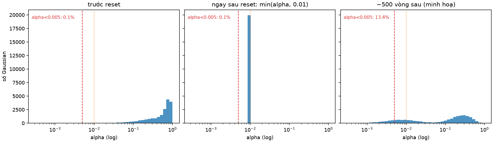

*20 000 Gaussian mô phỏng: 60 % hữu ích Beta$(6,2)$, 40 % lơ lửng Beta$(1.5,4)$.*
- → Ngay sau reset: một cột tại $0.01$, tỉ lệ $<0.005$ vẫn $0\%$ — reset không xoá.
- → $\sim500$ vòng sau: tách 2 mode; $\approx20\%$ quần thể $<0.005$ → $|\mathcal C|$ lớn → bậc xuống của $N$.

#### Hai ngưỡng opacity

| giai đoạn | hàm | ngưỡng | vai trò |
|---|---|---|---|
| $500<t<15000$ | `densify_and_prune_fastgs`, `min_opacity=0.005` | $\alpha<0.005$ | **vào $\mathcal C$**, chờ multinomial |
| $15000<t<30000$ | `final_prune_fastgs`, `min_opacity=0.1` | $\alpha<0.1$ | **xoá thẳng** |

Ngưỡng cuối gấp 20 lần: sau 15k vòng + 4 reset, $\alpha<0.1$ là vô dụng ($\alpha T\le0.1$). Dùng $0.1$ ở giai đoạn đầu sẽ xoá nhầm hàng loạt (khởi tạo $0.1$, vừa reset $0.01$).

### 12.5.3 Tỉa cuối `final_prune_fastgs`

```python
if iteration % 3000 == 0 and iteration > 15_000 and iteration < 30_000:      # 18k, 21k, 24k, 27k
    _, pruning_score = compute_gaussian_score_fastgs(camlist, gaussians, pipe, bg, opt)   # DENSIFY=False
    gaussians.final_prune_fastgs(min_opacity=0.1, pruning_score=pruning_score)
```

- Đúng **4 lần**: $t=15000$ loại bởi `> 15_000`, $t=30000$ loại bởi `< 30_000`.
- Vẫn render $2V=20$ lần/lần gọi, chỉ lấy Pruning: $4\times20=80$ forward phụ.

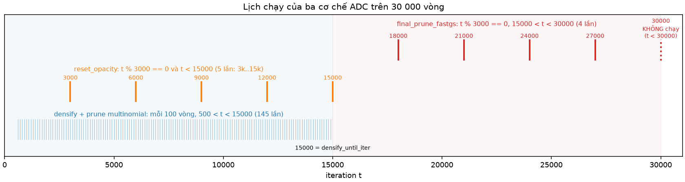

*Hàng dưới: 145 vạch densify+prune; giữa: reset; trên: tỉa cuối (vạch chấm $30000$ = "không chạy").*
- → Hai giai đoạn **không chồng**: sau 15000 không densify, không reset → $N$ **không tăng**.
- → Vạch cam tại $15000$ chỉ đánh dấu hết densify, không phải reset (điều kiện `< 15000`).

#### Tiêu chí OR, không lấy mẫu

$$
\boxed{\ \text{final\_prune}_i=\bigl[\alpha_i<0.1\bigr]\ \vee\ \bigl[\text{Pruning}_i>0.9\bigr]\ }\qquad\text{rồi }\texttt{prune\_points}\text{ ngay}
$$

| | prune trong `densify_and_prune_fastgs` | `final_prune_fastgs` |
|---|---|---|
| Thời điểm | mỗi 100, $500<t<15000$ | mỗi 3000, $15000<t<30000$ |
| Ngưỡng opacity | $0.005$ (vào $\mathcal C$) | $0.1$ (xoá) |
| Kích thước | $r^{2D}>20$, $\max s>0.1\,\text{extent}$ | không |
| Dùng Pruning | **trọng số** $w_i$ liên tục | **ngưỡng** $>0.9$ |
| Ngẫu nhiên | có | không |
| Số xoá | $\le\lfloor0.5|\mathcal C|\rfloor$ | không giới hạn |
| Ép opacity sau | $\min(\alpha,0.8)$ | không |
| Mục tiêu | giữ đa dạng, chờ chứng minh | thanh lý dứt điểm |

$\text{Pruning}>0.9$ = "$10\%$ **trên cùng của khoảng** $[\min S,\max S]$", **không** phải "10 % số Gaussian"; phân bố lệch phải → rất ít vượt.

#### Ví dụ §3.4 — 5 Gaussian của `3.md`

$\alpha=(0.85,0.62,0.40,0.07,0.55)$, $s_p=(0.000,0.057,1.000,0.610,0.367)$:

| | $\alpha<0.1$ | $s_p>0.9$ | kết quả |
|---|---|---|---|
| $G_1$ | ❌ 0.85 | ❌ 0.000 | giữ |
| $G_2$ | ❌ 0.62 | ❌ 0.057 | giữ |
| $G_3$ | ❌ 0.40 | ✅ 1.000 | **xoá** (score) |
| $G_4$ | ✅ 0.07 | ❌ 0.610 | **xoá** (opacity) |
| $G_5$ | ❌ 0.55 | ❌ 0.367 | giữ |

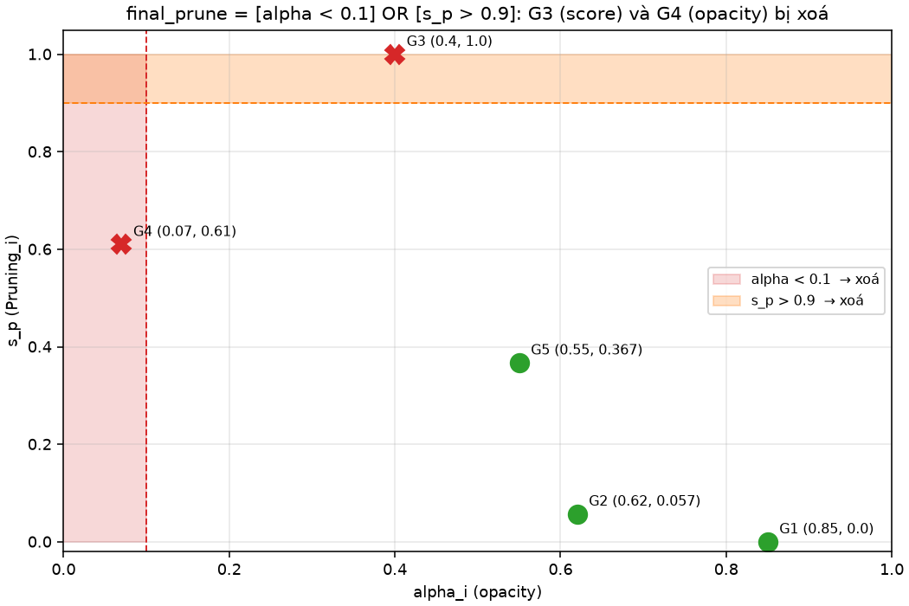

*Dải đỏ $\alpha<0.1$ ∪ dải cam $s_p>0.9$ = chữ L bị xoá.*
- → $G_3$, $G_4$ bị xoá vì **hai lý do khác nhau**; $G_5$ xa cả hai biên (tệ ở 1 view, che ở 2 view).
- → Cảnh đồ chơi: $\alpha=0.1$ đúng biên, `< 0.1` chặt → chỉ $G_3$ ($s_p=1.0$) bị xoá. Kịch bản $N=10$ ($\alpha=0.5$): xoá $\{8,9,10\}$, Gaussian 7 ($0.9\not>0.9$) giữ.
- → Cùng $\text{counts}$ lớn: đầu **đặt cược** (Importance → clone), cuối **thanh lý** (Pruning → xoá) — thiết kế, không mâu thuẫn.

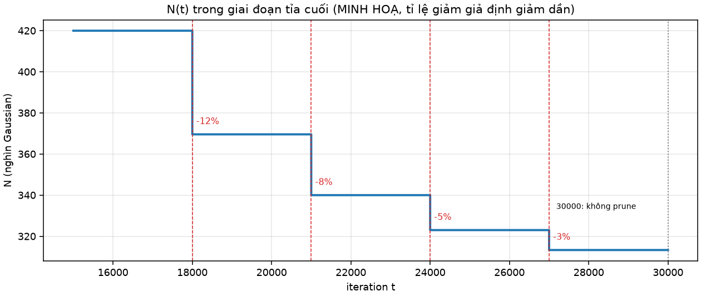

*Minh hoạ: $N_{15000}=420$k, tỉ lệ xoá giả định $12/8/5/3\%$.*
- → Giữa các mốc $N$ phẳng tuyệt đối.
- → Tỉ lệ giảm dần: min–max tính lại trên quần thể đã cắt đuôi; $\alpha<0.1$ đã xoá lần trước.
- → Tổng $\approx26\%$ là giả định; chương 13 ghi $R_{\text{gauss}}$ chưa đo A/B.

### 12.5.4 Đối chiếu tổng 3DGS và FastGS-lite

| Tiêu chí | 3DGS gốc | FastGS-lite | Ngẫu nhiên | Chi phí thêm | Ảnh hưởng $N$ |
|---|---|---|---|---|---|
| Clone | $\lVert\bar g\rVert\ge\tau_{\text{grad}}$, scale nhỏ | **AND** $\text{Importance}>5$ | không | 20 render/lần | giảm $r_{\text{spawn}}$ → luỹ thừa |
| Split | $\lVert\bar g\rVert\ge\tau_{\text{grad}}$, scale lớn | $\lVert\bar g^{\text{abs}}\rVert\ge1.2\text{e−3}$ **AND** $\text{Importance}>5$ | có ($\epsilon$) | như trên | như trên |
| Prune giai đoạn densify | xoá thẳng $\alpha<0.005$ | $\mathcal C$ (OR 3) $\cap$ multinomial | **có** | ≈0 | $\le0.5|\mathcal C|$, thường $30$–$95\%$ |
| Ép $\min(\alpha,0.8)$ | không | có | không | ≈0 | gián tiếp |
| Reset $\min(\alpha,0.01)$ mỗi 3000 | có | y hệt | không | ≈0 | bậc xuống trễ |
| Tỉa cuối | không | $\alpha<0.1\vee\text{Pruning}>0.9$, 4 lần | không | $4\times20$ render | bậc thang sau 15k |
| Khái niệm mới | — | Importance, Pruning, footprint $\Omega$; $V=10$, $\tau_{\text{loss}}=0.1$, $\lambda=0.2$ | | | |
| Tham chiếu ch. 13 | $N_{\text{tb}}\approx933$k | $N_{\text{tb}}\approx293$k, $R_{\text{gauss}}=0.314$ (**giả định**) | | | |

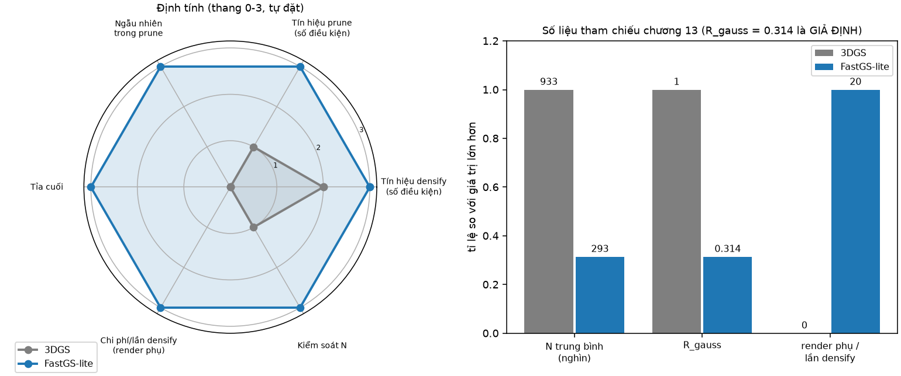

*Trái: radar 6 trục thang tự đặt $0$–$3$ (không phải đo lường). Phải: $N_{\text{tb}}$, $R_{\text{gauss}}$, render phụ, chuẩn hoá theo max.*
- → Đổi 20 render/lần densify ($+2$–$10\%$ thời gian) lấy $N$ giảm $\approx3\times$; $N$ nằm trong cả 3 số hạng chi phí $aN+bNK+cN$.
- → $R_{\text{gauss}}=0.314$ là số giả định của mô hình chi phí, tỉ số kém tin cậy nhất.

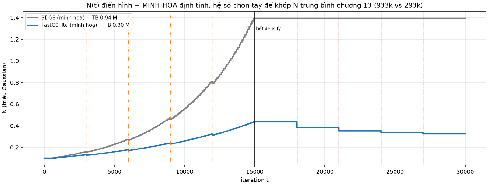

*Minh hoạ: $N_0=100$k; mỗi 100 vòng nhân $(1+r_{\text{spawn}})(1-r_{\text{prune}})$ với $r_{\text{spawn}}=0.0227/0.0155$, $r_{\text{prune}}=0.003/0.004$ (chọn tay khớp 933k/293k); mỗi reset nhân $0.96$; FastGS thêm 4 bậc $12/8/5/3\%$.*
- → Khác biệt nằm ở **độ dốc**: chênh $0.7\%$/lần × 145 lần ≈ $3\times$ cuối giai đoạn densify.
- → Sau 15000: 3DGS phẳng, FastGS-lite giảm thêm 4 bậc.
- → Đường thật có nhiễu, $r_{\text{spawn}}$ giảm khi hội tụ, bậc sau reset trải vài trăm vòng.

### 12.5.5 Đầu ra của khối

#### Tensor bị thay đổi sau mỗi lần gọi `densify_and_prune_fastgs` / `final_prune_fastgs`

| Tensor | Kích thước | Cách đổi |
|---|---|---|
| `_xyz`, `_features_dc`, `_features_rest`, `_scaling`, `_rotation` | $N\times3$, $N\times1\times3$, $N\times15\times3$, $N\times3$, $N\times4$ | cat (clone/split) rồi cắt (prune); con split có $\tilde s=\log(s/1.6)$ |
| `_opacity` | $N\times1$ | cat/cắt, **rồi thay toàn bộ** bởi `replace_tensor_to_optimizer` (đường (1)) |
| `xyz_gradient_accum`, `xyz_gradient_accum_abs`, `denom` | $N\times1$ | **reset về 0** (`densification_postfix:391-393`) cho **cả** Gaussian cũ |
| `max_radii2D` | $N$ | **reset về 0** (`:394`) |
| `tmp_radii` | — | dùng tạm, `None` ở cuối (`:489`) |
| Adam `exp_avg`, `exp_avg_sq` (6 nhóm) | như tensor tương ứng | cat với `zeros_like` / cắt theo mask; nhóm `opacity` về 0 |
| Adam `step` | vô hướng mỗi nhóm | **không đổi** |

#### Ba hàm đồng bộ optimizer

- **`cat_tensors_to_optimizer`** (`:348-372`) — ghép: $m\leftarrow\text{cat}(m,0)$, $v\leftarrow\text{cat}(v,0)$; tạo `nn.Parameter` mới → phải `del` key cũ trong `opt.state` rồi gán lại. Hàng mới vào Adam với $m=v=0$, dùng chung `step` → bước đầu $\approx3.16\,\text{lr}$ (hình 5.8).
- **`_prune_optimizer`** (`:307-327`) — cắt: $m\leftarrow m[\text{mask}]$, $v\leftarrow v[\text{mask}]$; hàng sống sót **giữ nguyên** $m,v$.
- **`replace_tensor_to_optimizer`** (`:292-305`) — thay giá trị, $N$ không đổi: $m=v=0$ **toàn nhóm** `opacity`, `step` giữ.

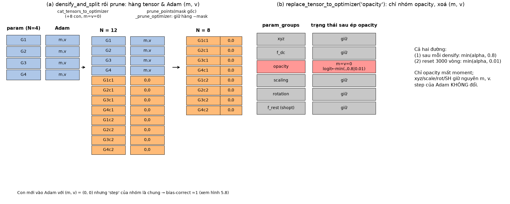

*Hình 5.14 — (a) cảnh đồ chơi: 4 gốc $(m,v)$ → cat 8 con $(0,0)$ → 12 hàng → prune gốc → 8 hàng. (b) sáu nhóm tham số, chỉ `opacity` bị xoá moment.*

- → Sau split, quần thể tạm có $N+2|\text{split}|$ hàng rồi mới về $N+|\text{split}|$.
- → Thứ tự hàng sau split: $[\text{gốc không split}]+[\text{con}_1\ \text{mọi gốc}]+[\text{con}_2\ \text{mọi gốc}]$ → nguồn gốc lệch chỉ số ở 12.5.1.
- → Mọi thao tác đi qua `param_groups`; gán thẳng `self._xyz` sẽ làm Adam giữ state cho tensor chết.

#### Ảnh hưởng tới vòng kế

`loss.backward()` chạy **trước** ADC (`train.py:104`); Parameter mới không có `.grad` → `optimizer_step` ở vòng có densify **bỏ qua** các nhóm vừa thay. Cập nhật thật bắt đầu ở $t+1$ với $N$ mới.

$$
\boxed{\ N\leftarrow N+|\text{clone}|+|\text{split}|-|\mathcal C\cap\mathcal S|\quad(500<t<15000)\ }
$$

$$
\boxed{\ N\leftarrow N-\bigl|\{\alpha<0.1\}\cup\{\text{Pruning}>0.9\}\bigr|\quad(t\in\{18000,21000,24000,27000\})\ }
$$

### 12.5.6 Bảng tổng kết luồng dữ liệu end-to-end

| # | Bước | Công thức / điều kiện | Vào → Ra | Trục gộp | Hàm |
|---|---|---|---|---|---|
| 0 | Tích luỹ gradient | $\text{accum}\mathrel{+}=\lVert g\rVert$, $\text{accum}^{\text{abs}}\mathrel{+}=\lVert g^{\text{abs}}\rVert$, $\text{denom}\mathrel{+}=1$ | grad $N\times4$ → 3 vector $N$ | iteration (100 vòng) | `add_densification_stats` |
| ① | Sai số màu | $e_v(x)=\frac13\sum_{ch}\lvert I_{\text{rend}}-I_{\text{gt}}\rvert$ | 2 ảnh $3\times H\times W$ → $H\times W$ | kênh màu | `get_loss` |
| ② | Min–max theo ảnh | $\hat e_v=\frac{e_v-\min}{\max-\min}$ | $H\times W$ → $[0,1]^{H\times W}$ | — | `get_loss` |
| ③ | Mặt nạ | $m_v=\mathbb 1[\hat e_v>0.1]$ | → $\{0,1\}^{H\times W}$ | — | `compute_gaussian_score_fastgs` |
| ④ | Đổ về Gaussian | $\text{counts}^{(v)}_i=\sum_{x\in\Omega^{(v)}_i}m_v(x)$ | mặt nạ + footprint → vector $N$ nguyên / view | **pixel → Gaussian** | kernel `get_flag=True` |
| ⑤ | Importance | $\lfloor\frac1V\sum_v\text{counts}^{(v)}_i\rfloor$ | $N\times V$ → $N$ | view (mean) | `compute_gaussian_score_fastgs` |
| ⑥ | Photometric | $E^{(v)}=0.8\mathcal L_1+0.2(1-\text{SSIM})$ | 2 ảnh → 1 số / view | toàn ảnh | `compute_photometric_loss` |
| ⑦ | Pruning | $\text{minmax}_i\bigl(\sum_v\text{counts}^{(v)}_iE^{(v)}\bigr)$ | $N\times V$ + $V$ → $N\in[0,1]$ | view (tổng có trọng số), rồi **qua $N$** | `compute_gaussian_score_fastgs` |
| ⑧ | Clone | $[\lVert\bar g\rVert\ge\tau]\wedge[\max s\le\delta\,\text{ext}]\wedge[\text{Imp}>5]$ | ⑤ + 0 + scale → $+|\text{clone}|$ hàng | — | `densify_and_clone_fastgs` |
| ⑨ | Split | $[\lVert\bar g^{\text{abs}}\rVert\ge\tau^{\text{abs}}]\wedge[\max s>\delta\,\text{ext}]\wedge[\text{Imp}>5]$; $\mu+R\epsilon$, $s/1.6$ | → $+2|\text{split}|$ con, $-|\text{split}|$ gốc | — | `densify_and_split_fastgs` |
| ⑩ | Tập ứng viên | $\mathcal C=\{\alpha<0.005\ \vee\ r^{2D}>20\ \vee\ \max s>0.1\,\text{ext}\}$ | quần thể **mới** → mask, budget $\lfloor0.5|\mathcal C|\rfloor$ | — | `:464-472` |
| ⑪ | Trọng số | $w_i=\frac{1}{10^{-6}+1-\text{Pruning}_i}$, pad 0 cho hàng mới | ⑦ → vector $N'$ | — | `:477-478` |
| ⑫ | Lấy mẫu | $\mathcal S\sim\text{Multinomial}(w,\text{budget},\text{k.h.l.})$; xoá $=\mathcal C\cap\mathcal S$ | ⑩ ⑪ → $-|\mathcal C\cap\mathcal S|$ hàng | — | `:480-483` |
| ⑬ | Ép opacity (1) | $\tilde\alpha\leftarrow\sigma^{-1}(\min(\alpha,0.8))$; $(m,v)_{\text{opacity}}\leftarrow0$ | `_opacity` → mới | — | `:485-487` |
| ⑭ | Reset (2) | $\tilde\alpha\leftarrow\sigma^{-1}(\min(\alpha,0.01))$; $(m,v)\leftarrow0$; $t\bmod3000=0$, $t<15000$ | `_opacity` → mới | — | `reset_opacity` |
| ⑮ | Tỉa cuối | $[\alpha<0.1]\vee[\text{Pruning}>0.9]$; $t\bmod3000=0$, $15000<t<30000$ | ⑦ (tính lại) + opacity → $-$ hàng | — | `final_prune_fastgs` |
| ⑯ | Đồng bộ optimizer | cat / cắt `exp_avg`, `exp_avg_sq`; `step` giữ | tensor + state cùng $N$ | — | `cat_tensors_to_optimizer`, `_prune_optimizer` |
| ⑰ | Reset thống kê | accum, accum$^{\text{abs}}$, denom, `max_radii2D` $\leftarrow0$ | → 4 tensor $N'$ | — | `densification_postfix:391-394` |

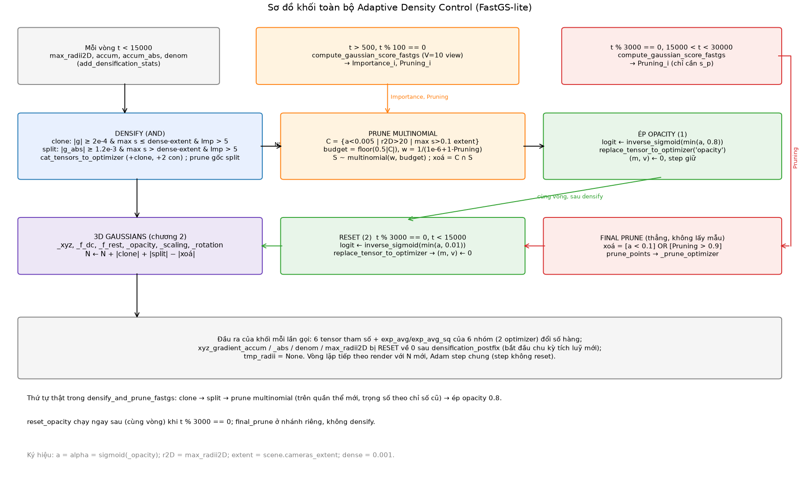

*Hình 5.15 — Hàng trên: 3 nguồn tín hiệu (gradient mỗi vòng; điểm số mỗi 100 vòng; điểm số mỗi 3000 vòng cuối). Hàng giữa: densify (AND) → prune multinomial → ép opacity (1). Hàng dưới: reset (2) và tỉa cuối. Mọi đường đổ về "3D Gaussians" với $N$ mới.*

- → $\text{Pruning}_i$ dùng ở **hai chỗ, hai cách**: trọng số liên tục (⑪) và ngưỡng nhị phân $>0.9$ (⑮).
- → Hai đường ép opacity cùng là "thay tensor + xoá moment", chỉ khác trần $0.8$ vs $0.01$ và tần suất.
- → Cửa ra duy nhất: bộ tensor $N$ hàng đồng bộ với hai optimizer trước `optimizer_step` vòng sau.

### 12.5.7 Bài tập

**Bài 1 (trọng số lượt đầu).** Kịch bản $N=10$: tính $\sum_i w_i$, $p_{10}$, và $P(9\mid\text{lượt 1}=10)$.
*Đáp:* $\sum w\approx1000142.5$, $p_{10}=10^6/1000142.5=0.999858$; sau khi bỏ 10: $\sum'=142.46$, $P(9\mid10)=99.99/142.46\approx0.702$.

**Bài 2 (lệch chỉ số).** $N=6$, $\text{Pruning}=(0.2,1.0,0.5,0.9,0.1,0.7)$, chỉ $G_2,G_4$ split. Thứ tự hàng mới và `padded_importance`? Trọng số $10^6$ rơi vào ai?
*Đáp:* hàng $=[G_1,G_3,G_5,G_6,\ G_2c_1,G_4c_1,\ G_2c_2,G_4c_2]$; `padded_importance[:6]` $=(1.25,10^6,2,10,1.11,3.33)$, hai hàng cuối $0$ → $10^6$ nằm ở hàng 2 = $G_3$, **không** phải con của $G_2$.

**Bài 3 (vùng OR).** Thêm $G_6=(\alpha,s_p)=(0.09,0.95)$, $G_7=(0.11,0.89)$ vào hình 5.10. Ai bị xoá? Nếu đổi OR → AND?
*Đáp:* $G_6$ xoá (thoả cả hai), $G_7$ giữ ($0.11\not<0.1$, $0.89\not>0.9$). AND: chỉ $G_6$; $G_3,G_4$ của `3.md` được giữ. OR vì hai vế bắt hai loại "vô dụng" khác nhau (gần trong suốt vs sai màu nhất quán).

---

## 12.6 Ví dụ trực quan: Gaussian thiếu, dư, clone, split và tự chia vùng sau nhiều vòng tối ưu

> Mô hình đồ chơi 2D bằng numpy: ảnh mục tiêu $64\times64$, vài chục Gaussian 2D, alpha-compositing, loss L1, Adam, một vòng ADC rút gọn — để *nhìn thấy* những gì 12.4–12.5 chứng minh bằng công thức. Không thêm cơ chế mới.
> Hình sinh bởi `adc_figures/part6_figures.py` (~2 phút, seed cố định). Chỗ toy **khác code thật** ghi ở 12.6.1.3.

### 12.6.1 Mô hình đồ chơi

#### 12.6.1.1 Ảnh mục tiêu và Gaussian 2D

Ảnh mục tiêu $T\in[0,1]^{64\times64\times3}$: hình tròn to màu đều (bán kính 14.5 px — vùng phẳng), dải mảnh $2\times26$ px, hàng 5 chấm bán kính 2.3 px (vùng chi tiết), ô vuông $7\times7$ px; nền kem $(0.93,0.91,0.86)$.

| Tham số | Toy (2D) | Code thật (3D) |
|---|---|---|
| tâm | $\mu_i\in\mathbb R^2$ (pixel) | $\mu_i\in\mathbb R^3$ rồi chiếu |
| scale | $s_i=(s_{i,1},s_{i,2})$, lưu $\log s$ | $s_i\in\mathbb R^3$, lưu $\log s$ |
| hướng | góc $\theta_i$ | quaternion $q_i$ |
| màu | $c_i\in[0,1]^3$ | SH $16\times3$ |
| opacity | $\alpha_i=\sigma(\tilde\alpha_i)$ | giống hệt |

$$
\Sigma_i=R(\theta_i)\,\mathrm{diag}(s_{i,1}^2,s_{i,2}^2)\,R(\theta_i)^\top,\qquad
\boxed{\ G_i(x)=\exp\Bigl(-\tfrac12 (x-\mu_i)^\top\Sigma_i^{-1}(x-\mu_i)\Bigr)\cdot\mathbb 1\bigl[(x-\mu_i)^\top\Sigma_i^{-1}(x-\mu_i)<9\bigr]\ }
$$

Nhân tử $\mathbb 1[\cdot<9]$ = footprint $3\sigma$ ("chạm chứ không chiếm", 12.2.2; code thật cắt theo tile và $\alpha G<1/255$).

#### 12.6.1.2 Render, loss, gradient, tối ưu

Compositing front-to-back, depth = thứ tự chỉ số (toy không có chiều sâu):

$$
w_i(x)=\min(\alpha_iG_i(x),\,0.99),\qquad T_i(x)=\prod_{j<i}\bigl(1-w_j(x)\bigr),\qquad
\boxed{\ I(x)=\sum_i T_i(x)\,w_i(x)\,c_i+T_{N}(x)\,c_{\text{nền}}\ }
$$

$$
\mathcal L=\frac1{3HW}\sum_{x,ch}|I(x)-T(x)|\qquad(\text{code thật: }0.8\,\mathcal L_1+0.2(1-\text{SSIM}))
$$

Gradient giải tích (cấu trúc `backward.cu`, chương 11), $S_i(x)$ = tổng đóng góp mọi Gaussian *sau* $i$ cộng nền, $(u,v)=R^\top(x-\mu_i)$:

$$
\frac{\partial I}{\partial w_i}=T_i\,c_i-\frac{S_i}{1-w_i},\qquad
\frac{\partial G_i}{\partial\mu_i}=G_i\,\Sigma_i^{-1}(x-\mu_i)
$$

$$
\frac{\partial G_i}{\partial\log s_{i,1}}=G_i\frac{u^2}{s_{i,1}^2},\qquad
\frac{\partial G_i}{\partial\theta_i}=-G_i\,uv\Bigl(\frac1{s_{i,1}^2}-\frac1{s_{i,2}^2}\Bigr)
$$

Hai bộ đếm của 12.4.2, từ gradient vị trí từng pixel $g_{i,x}=\partial\mathcal L/\partial\mu_i\big|_x$:

$$
\boxed{\ g_i=\sum_x g_{i,x}\ (\text{có dấu}),\qquad g^{\text{abs}}_i=\sum_x|g_{i,x}|\ (\text{trị tuyệt đối})\ }
$$

Adam $\beta=(0.9,0.999)$; lr: $\mu$ 0.4 px, $\log s$ 0.02, $\theta$ 0.02, màu 0.005, logit opacity 0.05. Tỉ lệ màu : opacity $=1:10$ mô phỏng `feature_lr : opacity_lr` — Gaussian sai màu sẽ *mờ đi* trước khi kịp *đổi màu* (12.6.12).

#### 12.6.1.3 Vòng ADC đồ chơi và chỗ khác code thật

```
mỗi vòng t:
    L, ∇ ← render + backward
    accum_i     += ‖g_i‖      (chỉ Gaussian hữu hình: max_x w_i(x) > 1e-3)
    accum_abs_i += ‖g_i^abs‖
    denom_i     += 1
    Adam step
    t == 550:  α_i ← min(α_i, 0.02)  cho mọi i               # reset opacity (toy)
mỗi 100 vòng, 100 ≤ t ≤ 900:
    ḡ = accum/denom ; ḡ_abs = accum_abs/denom
    clone  = [ḡ ≥ 4e-5]      ∧ [max s ≤ 3.5 px]           # sao chép y nguyên, Adam m=v=0
    split  = [ḡ_abs ≥ 4e-4]  ∧ [max s > 3.5 px]           # 2 con μ+Rε, ε~N(0,diag s²), s/1.6, xoá gốc
    prune  = [α < 0.03]
    accum = accum_abs = denom = 0
```

| Thành phần | Code thật | Toy | Vì sao |
|---|---|---|---|
| Gradient tích luỹ | `viewspace_point_tensor.grad`, NDC, 4 cột | $\partial\mathcal L/\partial\mu$ theo pixel, có dấu + abs | đã là 2D |
| $\tau_{\text{grad}},\tau^{\text{abs}}$ | $2\times10^{-4}$, $1.2\times10^{-3}$ | $4\times10^{-5}$, $4\times10^{-4}$ | đơn vị khác; tỉ số abs/có dấu $10\approx6$ |
| Ngưỡng to/nhỏ | $0.001\,\text{extent}$ | $3.5$ px | không có camera |
| AND Importance $>5$ | có | **không** | một view |
| Prune | multinomial + $\alpha<0.005$ + quá to | chỉ $\alpha<0.03$ | không multi-view |
| Reset opacity | mỗi 3000, về 0.01 | một lần $t=550$, về 0.02 | đủ thấy cơ chế |
| Trần $N$ | không | $N\le80$ | script < 3 phút |
| Depth sort | theo $t_z$ | cố định | không có chiều sâu |
| Cửa sổ densify | $500<t<15000$, 144 mốc | $100\le t\le900$, 9 mốc | thu nhỏ |

**Giống**: thống kê mỗi vòng, quyết định mỗi $K$ vòng, chia `denom`; clone có dấu không dịch, split abs rải theo hình dạng + $1/1.6$ + xoá gốc; bản mới Adam $m=v=0$; xoá thống kê sau mốc.

#### 12.6.1.4 Nhật ký ADC (seed 7)

| Mốc $t$ | clone | split | prune | $N$ sau | Ghi chú |
|---|---|---|---|---|---|
| 100 | 0 | 6 | 0 | 18 | Gaussian 3 px bị kéo giãn qua 3.5 px rồi tách |
| 200 | 2 | 10 | 0 | 30 | lấp hình tròn từ mép vào |
| 300 | 2 | 23 | 0 | 55 | mốc lớn nhất |
| 400 | 11 | 14 | 0 | 80 | chạm trần; clone bắt đầu chiếm tỉ trọng |
| 500 | 0 | 0 | 0 | 80 | trần đầy |
| 550 | — | — | — | 80 | reset $\alpha\le0.02$ |
| 600 | 0 | 0 | 8 | 72 | 8 Gaussian không hồi phục bị xoá |
| 700 | 7 | 1 | 0 | 80 | lấp lại bằng clone |
| 800, 900 | 0 | 0 | 0 | 80 | hết ứng viên |

$$
q_t=N_t/N_{t-1}=1.5,\ 1.67,\ 1.83,\ 1.45\quad\gg\quad q\approx1.09\ (\text{cảnh thật}),\qquad N_n=N_0\prod_t q_t
$$

### 12.6.2 Hình 6.1 — Ảnh mục tiêu, lưới pixel và một Gaussian 2D

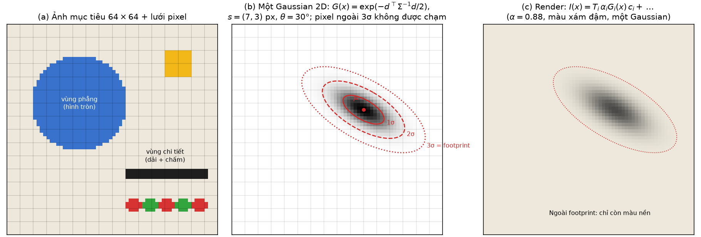

*(a) mục tiêu + lưới 4 px; (b) một Gaussian $s=(7,3)$ px, $\theta=30°$, ellipse $1\sigma/2\sigma/3\sigma$; (c) render của riêng nó lên nền.*
- → Một Gaussian chỉ nói được **một màu, một ellipse mờ dần**; biên sắc cần nhiều Gaussian đúng chỗ.
- → Ellipse $3\sigma$ = footprint hữu hình: ngoài nó không có gradient.

### 12.6.3 Hình 6.2 — THIẾU (under-reconstruction)

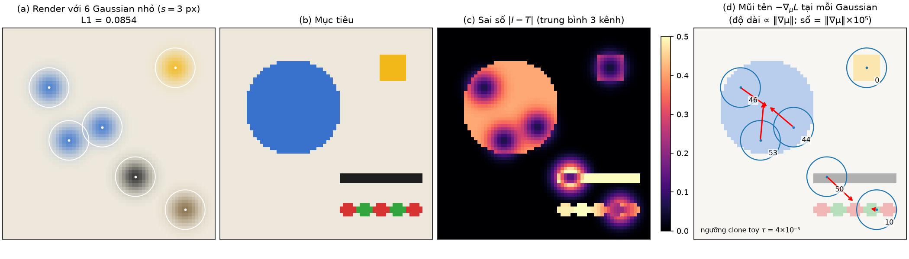

*Sáu Gaussian $s=3$ px; (c) sai số lan cả hình tròn; (d) $-\nabla_\mu\mathcal L$ tại tâm, số ghi $\lVert g\rVert\times10^5$.*
- → Ba Gaussian trong hình tròn: $\lVert g\rVert\approx44$–$53\times10^{-5}$, gấp ~10 lần $\tau$ clone toy; mũi tên chỉ về phần chưa phủ.
- → Nhỏ + gradient có dấu lớn, hướng rõ → nhánh **clone** (12.4.4.2).
- → Gaussian ở ô vuông: gradient $\approx0$ → tự dừng, không densify.

### 12.6.4 Hình 6.3 — DƯ / QUÁ TO (over-reconstruction)

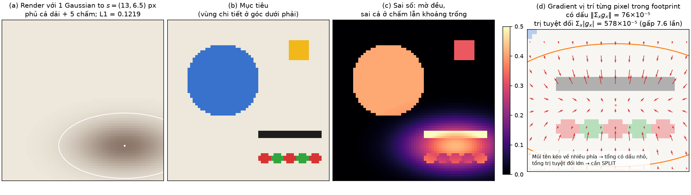

*Một Gaussian $s=(13,6.5)$ px trùm dải + 5 chấm; (d) gradient từng pixel $g_{i,x}$ trong vùng phóng to.*
- → Pixel trên dải kéo lên, pixel ở chấm kéo xuống, nền đẩy ra: $\lVert\sum_x g_{i,x}\rVert\approx\tfrac18\sum_x|g_{i,x}|$ — triệt tiêu tầng (a) của 12.4.2.3.
- → Có dấu có thể lọt dưới ngưỡng (3DGS bỏ sót); cột abs thấy rõ → nhánh **split**.
- → Nhân đôi Gaussian to vẫn là hai vệt mờ; phải **thu nhỏ** ($s/1.6$) và **rải** hai con.

### 12.6.5 Hình 6.4 — Clone: sao chép y nguyên rồi để Adam tách

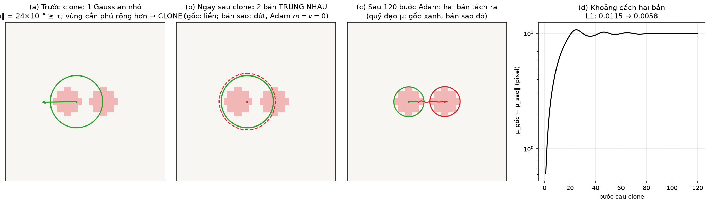

*Hai đốm cách 10 px, một Gaussian $s=4$ px ở giữa (lệch 0.5 px), chạy 5 bước rồi clone; (d) $\lVert\mu_{\text{gốc}}-\mu_{\text{sao}}\rVert$ thang log.*
- → (b) bản sao **trùng khít** gốc — không dịch, không nhiễu (`densify_and_clone_fastgs`).
- → Bước 1: cùng gradient nhưng $m=v=0$ khác gốc → lệch $\sim0.6$ px → lên 10 px trong ~20 bước → mỗi bản một đốm. L1 $0.0115\to0.0058$.
- → Điều kiện cần: footprint còn "nhìn thấy" vùng thiếu — đúng $\lVert\bar g\rVert\ge\tau$.

### 12.6.6 Hình 6.5 — Split: hai con lấy mẫu từ hình dạng gốc

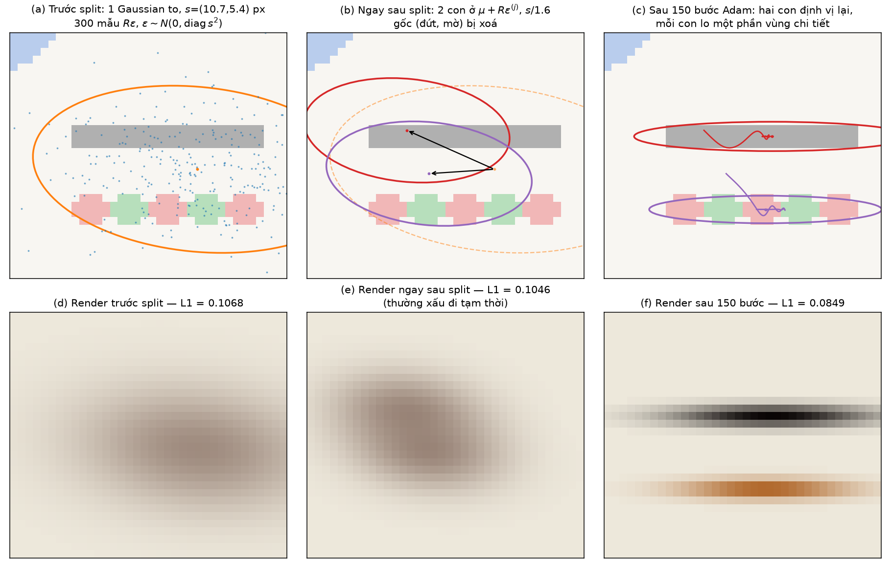

*(a) 300 mẫu $R\epsilon$, $\epsilon\sim\mathcal N(0,\mathrm{diag}\,s^2)$ rải theo ellipse gốc; (b) hai con tại $\mu+R\epsilon^{(1,2)}$, cùng $\theta$, bán trục $/1.6$, gốc xoá; (c) sau 150 bước.*
- → Ba việc của 12.4.5.1 hiện trực tiếp: lấy mẫu theo hình dạng, co $1/1.6$, $1\to2$.
- → Hai con **không** đối xứng qua tâm; vị trí cuối do tối ưu quyết định.
- → L1 tăng nhẹ ngay sau split ($0.1068\to0.1046$ seed này), sau 150 bước $0.0849$; muốn từng chấm phải split/clone thêm → densify lặp nhiều mốc.

### 12.6.7 Hình 6.6 — Chuỗi thời gian: gradient descent + ADC lặp lại

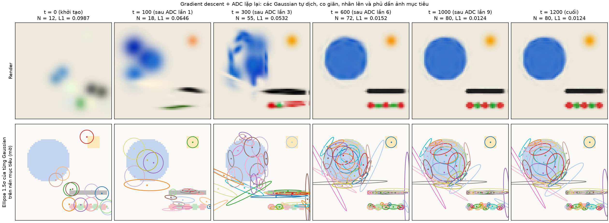

*1200 vòng, $N_0=12$ khởi tạo kiểu SfM (tâm ở pixel gradient ảnh lớn, $s=3$ px); hàng trên render + $N$ + L1, hàng dưới ellipse $1.5\sigma$ từng Gaussian.*
- → $t=0$: hình tròn gần trống — SfM không có điểm ở vùng phẳng (nhược điểm 1, 12.1.1).
- → Gaussian mép hình tròn clone/split liên tiếp, bản mới **trôi vào trong**; $N$ tăng bậc thang.
- → Từ $t\approx600$: $N$ chạm trần, L1 giảm chậm — chỉ còn tinh chỉnh. Bản 2D của $N(t)$ hình 1.2.

### 12.6.8 Hình 6.7 — "Chia vùng": mỗi pixel thuộc về Gaussian nào

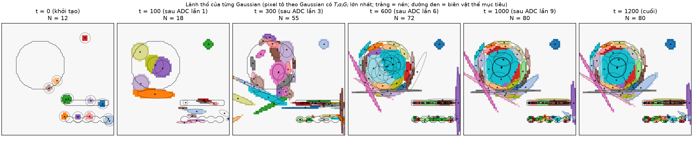

*Mỗi pixel tô màu Gaussian có $\arg\max_i T_i(x)\,w_i(x)$ (Voronoi mềm); trắng = nền thắng; đường đen = biên mục tiêu.*
- → Lãnh thổ **tự phân chia** bám biên mục tiêu: hình tròn = mảnh to ở giữa + mảnh nhỏ ở mép; dải = vài mảnh dẹt; chấm = mảng nhỏ riêng.
- → Không ai gán pixel: hệ quả của gradient kéo + ADC cấp Gaussian nơi gradient còn lớn.
- → Đây là hình ảnh của "to ở vùng phẳng, nhỏ ở vùng chi tiết" (12.4.4.2).

### 12.6.9 Hình 6.8 — Đường cong loss, $N$ và số clone/split/prune

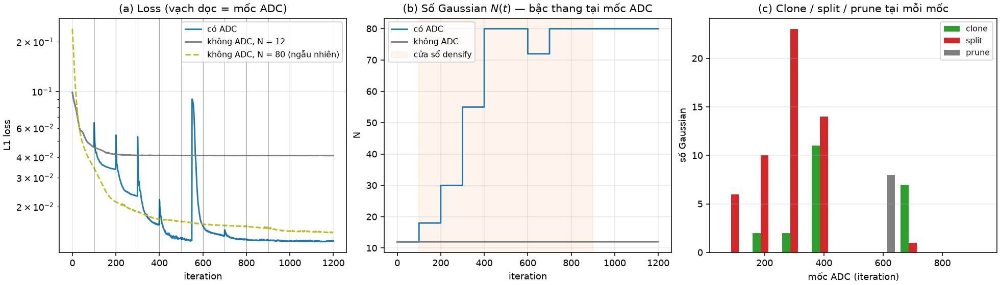

*(a) L1 log: có ADC (xanh), không ADC $N=12$ (xám), không ADC $N=80$ ngẫu nhiên (ô liu); (b) $N(t)$; (c) clone/split/prune mỗi mốc.*
- → Mốc đầu split ưu thế, mốc sau clone — "to trước, nhỏ sau" (12.4.4.1).
- → Mỗi lần $N$ nhảy, loss giảm rõ ~50 vòng rồi phẳng: densify mở bậc tự do mới.
- → Reset $t=550$: loss vọt rồi hồi <50 vòng; đường xám phẳng từ sớm — $N$ cố định không sinh được Gaussian ở chỗ trống.

### 12.6.10 Hình 6.9 — Kích thước Gaussian và độ chi tiết vùng nó phủ

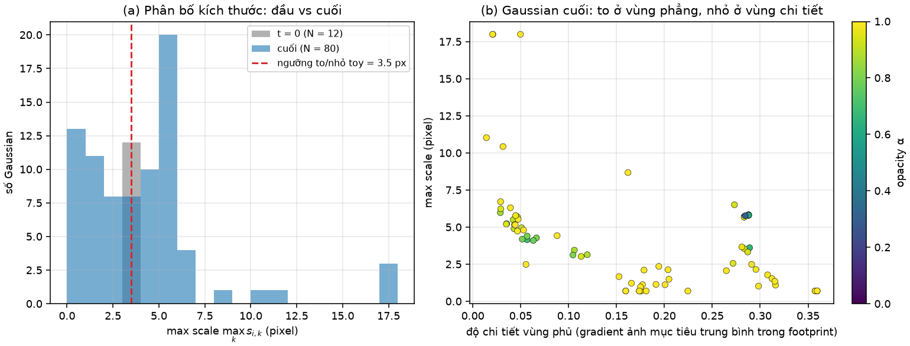

*(a) histogram $\max_k s_{i,k}$ đầu (đều 3 px) vs cuối (từ <1 px đến >10 px), vạch 3.5 px; (b) max scale theo gradient ảnh mục tiêu trung bình trong footprint, màu = opacity.*
- → Phân bố kích thước **trải rộng** sau ADC: split chia nhỏ liên tiếp, tối ưu kéo giãn ở vùng phẳng.
- → Tương quan âm: vùng phẳng → to, vùng nhiều biên → nhỏ — "độ phân giải" tự tìm.
- → Điểm opacity thấp = Gaussian sót sau reset, ứng viên prune.

### 12.6.11 Hình 6.10 — Có ADC và không có ADC

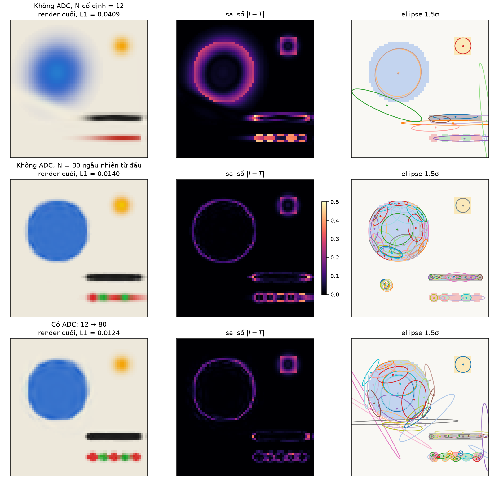

*Ba hàng cùng 1200 vòng Adam: (1) $N=12$ cố định; (2) $N=80$ rải ngẫu nhiên từ đầu; (3) ADC $12\to80$. Cột: render + L1, sai số, ellipse $1.5\sigma$.*
- → Hàng 1: L1 $\approx0.041$, sai số dồn ở biên — giới hạn của tối ưu thuần. Hàng 3: L1 $\approx0.012$.
- → Hàng 2: L1 $\approx0.014$ gần ADC, nhưng tốn $80\times1200$ Gaussian-vòng, gấp ~2 lần $\sum_tN(t)$ của ADC; trong 3D không có cách "rải đều" vì không biết bề mặt.
- → Hàng 3 có vài Gaussian **rất dẹt, dài, opacity thấp** ("Gaussian ma") — đối tượng của điều kiện quá to và Pruning score (12.5.1), toy không có.

### 12.6.12 Hình 6.11 — Prune: opacity không hồi phục sau reset

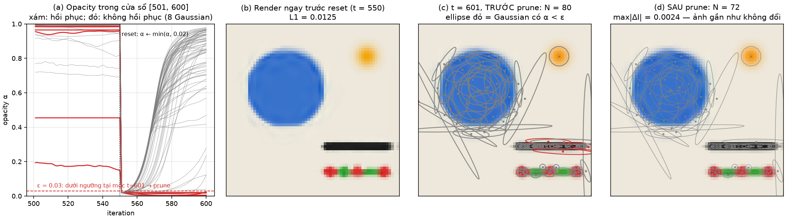

*(a) $\alpha$ mọi Gaussian trong $[501,600]$, ép $\alpha\le0.02$ tại $t=550$; xám = hồi phục vượt $\varepsilon=0.03$, đỏ = không; (c)(d) trước/sau prune, $\max|\Delta I|\approx0$.*
- → Reset là **phép thử**: Gaussian hữu ích nhận gradient opacity lớn → bật lại trong vài chục vòng; Gaussian bị che / trên vùng đã đúng ở lại dưới $\varepsilon$ → xoá mà ảnh không đổi.
- → Cơ chế "ép opacity hai đường" 12.5.2 + $\alpha<0.005$ của 12.5.1 (toy dùng $0.03$/$0.02$).
- → `opacity_lr : feature_lr` $=20:1$: opacity phải phản ứng nhanh hơn màu để phép thử có ý nghĩa.

### 12.6.13 Bảng tóm tắt: triệu chứng → cơ chế ADC

| Triệu chứng trên ảnh | Dấu vết gradient / tham số | Cơ chế ADC | Hình | Mục |
|---|---|---|---|---|
| Vùng rộng chỉ vài đốm nhỏ | $\lVert\bar g\rVert$ có dấu lớn, hướng rõ; $\max s$ nhỏ | **Clone** | 6.2, 6.4 | 12.4.4.2, 12.4.6 |
| Một vệt mờ trùm nhiều chi tiết | $\sum_x g_x\approx0$, $\sum_x|g_x|$ lớn; $\max s$ to | **Split** | 6.3, 6.5 | 12.4.2.3, 12.4.5 |
| Loss phẳng dù còn sai ở biên | gradient $\approx0$ ở vùng trống | densify lặp, $N$ nhân luỹ thừa | 6.6, 6.8 | 12.4.7 |
| Nhiều Gaussian chồng ở vùng phẳng | opacity không hồi phục sau reset | **Prune** $\alpha<\varepsilon$ (+ multinomial) | 6.11 | 12.5.1, 12.5.2 |
| Kích thước đồng đều | phân bố $\max s$ hẹp | split thu nhỏ, tối ưu kéo giãn | 6.9, 6.7 | 12.4.4.1 |
| Đã đúng chỗ, đúng cỡ | gradient $\approx0$ | không làm gì | 6.2 (ô vuông) | 12.4.2.4 |

### 12.6.14 Bài tập biến thể (đổi 1 hằng số trong `part6_figures.py`)

| Đổi | Dự đoán |
|---|---|
| `TAU_ABS = 4e-3` (×10) | split gần biến mất; hình tròn lấp chậm; over-reconstruction không được chữa |
| `S_BIG = 10.0` | chỉ clone; histogram kích thước dồn về to; sai số ở hàng chấm cao |
| `K_ADC = 50` | chạm trần sớm (~$t=200$); loss cuối gần không đổi — luỹ thừa theo số mốc (12.4.7) |
| `RESET_AT = 10**9` | prune $=0$; $N=80$ giữ nguyên với Gaussian ma — 3DGS cần reset để prune có việc |
| `LR["lo"] = 0.005` | opacity hồi phục chậm; Gaussian hữu ích bị xoá oan; $\max|\Delta I|$ lớn |
| `N_MAX = 200`, `T_TOTAL = 2000` | mép hình tròn chia nhỏ hơn nữa, trong vẫn mảng to; L1 giảm chậm dần |

### 12.6.15 Tóm tắt mục 12.6

- **Thiếu**: nhỏ, gradient có dấu lớn → **clone**; bản sao trùng gốc, Adam tách (6.2, 6.4).
- **Dư/quá to**: to, gradient từng pixel triệt tiêu, abs lớn → **split**; hai con rải theo hình dạng, $s/1.6$, xoá gốc (6.3, 6.5).
- **Lặp nhiều mốc**: loss giảm bậc thang, $N$ nhân luỹ thừa (6.6, 6.8).
- **Tự chia vùng**: lãnh thổ bám biên; to ở vùng phẳng, nhỏ ở chi tiết (6.7, 6.9).
- **Prune**: reset là phép thử; không hồi phục → xoá, ảnh không đổi (6.11).
- **Đối chứng**: $N$ cố định không sinh Gaussian ở chỗ trống; rải sẵn tốn $\sum_tN(t)$ gấp đôi (6.10).
- **Giới hạn toy**: một view, không Importance/Pruning, không depth sort, ngưỡng thu nhỏ — xem bảng 12.6.1.3 trước khi mang số sang cảnh thật.

---

## 12.7 FastGS cải tiến chỗ nào — đối chiếu 3DGS gốc và FastGS-lite trên cùng toy 2D

> Engine: `adc_figures/part7_engine.py` (tái dùng toy 12.6; hai mode `3dgs` / `fastgs`, cùng ảnh mục tiêu, cùng 12 Gaussian khởi tạo, cùng seed); hình: `part7a_figures.py`, `part7b_figures.py`.
> Toy chỉ có **1 view** → $V=1$: Importance/Pruning mất nghĩa "đa góc nhìn"; mục này minh hoạ **cơ chế**, không đo hiệu năng thật (12.6.1.3).

### 12.7.1 Hai bộ luật trên cùng một toy

Cùng $\bar g,\bar g^{\text{abs}},\max s,\alpha$; khác nhau ở **điều kiện** và **cách xoá**:

| Khối | 3DGS gốc (mode `3dgs`) | FastGS-lite (mode `fastgs`) |
|---|---|---|
| Clone | $[\lVert\bar g\rVert\ge\tau]\wedge[\max s\le S_{\text{BIG}}]$ | $[\lVert\bar g\rVert\ge\tau]\wedge[\max s\le S_{\text{BIG}}]\wedge[\text{Imp}>5]$ |
| Split | $[\lVert\bar g\rVert\ge\tau]\wedge[\max s>S_{\text{BIG}}]$ (gradient **có dấu**) | $[\lVert\bar g^{\text{abs}}\rVert\ge\tau_{\text{abs}}]\wedge[\max s>S_{\text{BIG}}]\wedge[\text{Imp}>5]$ |
| Prune | xoá **ngay** $\{\alpha<\varepsilon\}\cup\{\max s>S_{\text{HUGE}}\}$ | $\mathcal C=\{\alpha<\varepsilon\}\cup\{\max s>S_{\text{HUGE}}\}$; $w_i=\frac{1}{10^{-6}+1-\text{Pruning}_i}$; $\mathcal S\sim\text{Multi}(w,\lfloor0.5\lvert\mathcal C\rvert\rfloor)$; xoá $\mathcal C\cap\mathcal S$ |
| Opacity sau ADC | không đổi ($\alpha\to0.99$ được) | $\alpha\leftarrow\min(\alpha,0.8)$ |
| Sau cửa sổ densify | không có gì | final prune tại $t=1000,1100$: $[\alpha<0.1]\vee[\text{Pruning}>0.9]$ |

Điểm số với $V=1$ (bước ①–⑦ rút gọn):

$$
\boxed{\ \text{Importance}_i=\text{counts}_i=\bigl|\{x\in\Omega_i:\hat e(x)>0.1\}\bigr|,\qquad
\text{Pruning}_i=\frac{\text{counts}_i-\min_j\text{counts}_j}{\max_j\text{counts}_j-\min_j\text{counts}_j}\ }
$$

với footprint hữu hình $\Omega_i=\{x:\ w_i(x)\ge\tfrac1{255},\ T_i(x)\ge10^{-4}\}$ (3 cửa của 12.2.2).

| Hằng số toy | $\tau$ | $\tau_{\text{abs}}$ | $S_{\text{BIG}}$ | $\varepsilon$ | $S_{\text{HUGE}}$ | Imp | trần | reset | final |
|---|---|---|---|---|---|---|---|---|---|
| giá trị | $4\times10^{-5}$ | $4\times10^{-4}$ | 3.5 px | 0.03 | 10 px | $>5$ | 0.8 | $t=550\to0.02$ | $t\in\{1000,1100\}$ |
| code thật | $2\times10^{-4}$ | $1.2\times10^{-3}$ | $0.001\,$extent | 0.005 | $0.1\,$extent | $>5$ | 0.8 | mỗi 3000 $\to0.01$ | 18k…27k |

### 12.7.2 Chuỗi thời gian FastGS (đối chiếu hình 7.1 ở 12.0.2)

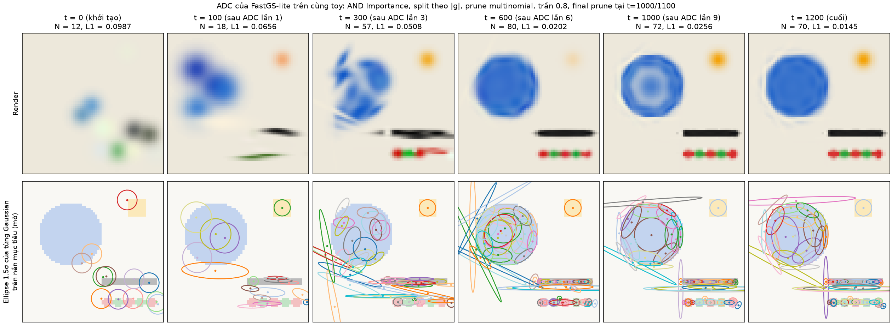

*Hàng trên: render + $N$ + L1; hàng dưới: ellipse 1.5σ từng Gaussian trên nền mục tiêu mờ. Cùng khởi tạo và seed với hình 7.1.*

| $t$ | 0 | 100 | 300 | 600 | 1000 | 1200 |
|---|---|---|---|---|---|---|
| $N$ 3DGS | 12 | 17 | 56 | 67 | 80 | **80** |
| L1 3DGS | 0.0987 | 0.0779 | 0.0412 | 0.0212 | 0.0148 | **0.0147** |
| $N$ FastGS | 12 | 18 | 57 | 80 | 72 | **70** |
| L1 FastGS | 0.0987 | 0.0656 | 0.0508 | 0.0202 | 0.0256 | **0.0145** |

Nhật ký $(t,\ \text{clone},\ \text{split},\ \text{prune})$:

| | 100 | 200 | 300 | 400 | 500 | 600 | 700 | 800 | 900 | final 1000 | final 1100 |
|---|---|---|---|---|---|---|---|---|---|---|---|
| 3DGS | 0/5/0 | 1/12/0 | 6/20/0 | 17/7/0 | 0/0/0 | 0/0/**13** | 13/0/0 | 0/0/0 | 0/0/0 | — | — |
| FastGS | 0/6/0 | 0/12/0 | 7/20/0 | 13/10/0 | 0/0/0 | 0/0/**0** | 0/0/1 | 1/0/0 | 0/0/0 | xoá **8** | xoá **2** |

→ Sau reset ($t=550$), 3DGS xoá **13** Gaussian ngay tại $t=600$; FastGS với $\lvert\mathcal C\rvert$ tương tự nhưng rút multinomial trên **toàn** $N$ nên $\mathcal C\cap\mathcal S$ nhỏ — chỉ 1 ở $t=700$ (12.7.6).
→ $N$ FastGS đạt trần 80 sớm hơn ($t=600$) rồi **giảm** 80→72→70 nhờ final prune; L1 nhảy 0.0127→0.0256 ngay sau $t=1000$ rồi hồi về 0.0145 sau ~100 vòng.
→ Ellipse: FastGS có nhiều Gaussian **dài, mảnh, nằm chéo ngoài vật thể** hơn (split theo $\lvert g\rvert$ sinh con ở rìa, trần 0.8 giữ chúng "sống"); 3DGS xếp gọn quanh hình tròn. Với $V=1$, Importance chặn rất ít (mặt nạ lỗi phủ gần hết footprint) — phép AND chỉ phát huy khi có nhiều view (12.2.5).

### 12.7.3 Lãnh thổ: pixel thuộc Gaussian nào

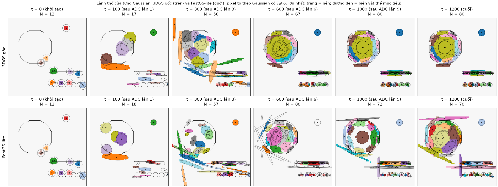

*Pixel tô theo Gaussian có $T_i\alpha_iG_i$ lớn nhất; trắng = nền thắng; đường đen = biên vật thể mục tiêu; ellipse đen mảnh = 1σ.*

→ 3DGS: lãnh thổ **đều** — một Gaussian lớn chiếm lõi hình tròn, vành mảnh nhỏ bao quanh biên; dải và hàng chấm chia thành ô ngắn đều nhau.
→ FastGS: lãnh thổ **"cục"** hơn — lõi do ít Gaussian béo phủ, kèm vài **sọc dài lệch chéo** chiếm nền ở góc trái-dưới và phía trên (các Gaussian mảnh của 12.7.2).
→ Cả hai đều hội tụ về cùng cấu trúc "to ở vùng phẳng, nhỏ ở biên" (12.6.8); khác nhau ở số Gaussian và độ gọn của biên.

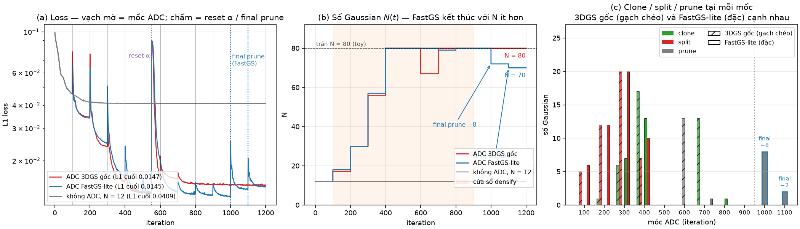

*(a) L1 (log) của 3 run; vạch mờ = mốc ADC, chấm tím = reset $t=550$, chấm xanh = final prune $t=1000,1100$. (b) $N(t)$ bậc thang, cửa sổ densify $[100,900]$, trần $N_{\max}=80$. (c) cột clone/split/prune: 3DGS gạch chéo, FastGS đặc.*

- → Hai đường L1 gần trùng suốt giai đoạn densify; tách nhau ở $t=600$ (3DGS xoá cứng 13 → L1 vọt $0.0161\to0.0212$) và $t=1000/1100$ (FastGS final prune → L1 vọt $0.0127\to0.0256$ rồi hồi).
- → $N(t)$: cả hai chạm trần 80 (3DGS ở $t=400$, FastGS ở $t=600$); chỉ FastGS đi **xuống** sau cửa sổ densify: $80\to72\to70$.
- → Cột (c): split chiếm ưu thế 3 mốc đầu ở cả hai; prune của 3DGS dồn vào một mốc (13 tại 600), của FastGS rải mỏng (1 tại 700) rồi dồn vào final prune (8 + 2).

$$
\boxed{\ N_{\text{cuối}}:\ 80\ (\text{3DGS})\quad\text{vs}\quad 70\ (\text{FastGS}),\qquad
\mathcal L_1^{\text{cuối}}:\ 0.0147\quad\text{vs}\quad0.0145\ }
$$

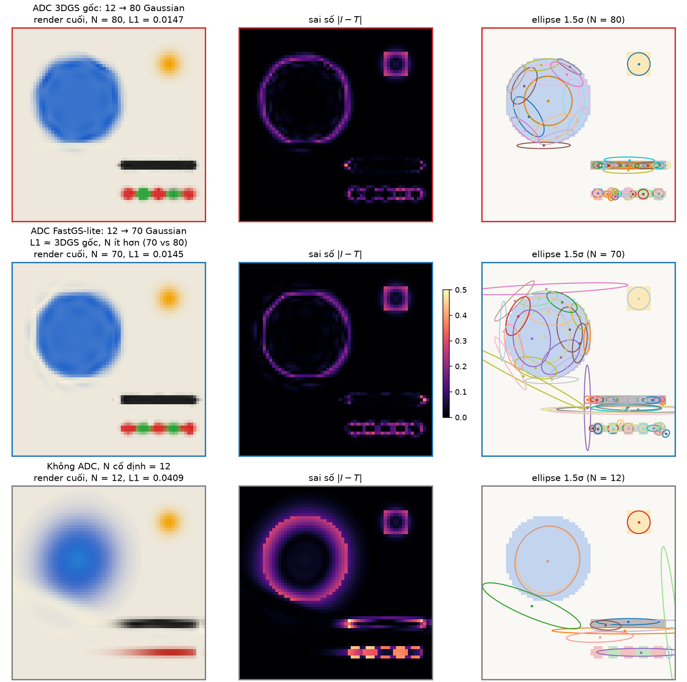

*3 hàng × 3 cột như hình 6.10: render cuối ($N$, L1), bản đồ sai số $|I-T|$ (magma, $v_{\max}=0.5$), ellipse $1.5\sigma$ trên nền mục tiêu mờ.*

- → Hàng 1 và 2: sai số cùng tập trung ở mép hình tròn và hàng chấm; mắt thường không phân biệt render — nhưng FastGS dùng ít Gaussian hơn 10.
- → Cột ellipse: FastGS có vài Gaussian **dài, mảnh, α thấp** vắt ngang ảnh (sinh từ split theo $|g|$, sống được nhờ trần 0.8 và multinomial "hiền"); 3DGS gọn hơn.
- → Hàng 3 (không ADC, $N=12$): L1 $0.0409$ — gấp $2.8\times$ — giới hạn của tối ưu thuần, không ADC nào bù được (12.6.11).

**Kết luận nhỏ**

- Cùng L1 ($0.0145$ vs $0.0147$) với $N$ ít hơn $12.5\%$ ($70$ vs $80$) — đúng tinh thần "đòn bẩy giảm $N$" (12.1.1).
- Cái giá: vài Gaussian mảnh lạc ngoài vật thể; trong code thật chúng là mục tiêu của $\max s>0.1\,$extent và Pruning score qua nhiều view (12.5.1).
- Lợi ích thật của Importance chỉ hiện với $V=10$ view (dìm artefact một góc, chặn vùng đã đúng — 12.2.5, 12.7.4); toy 1 view chỉ cho thấy phần multinomial, trần 0.8 và final prune.

### 12.7.4 Cải tiến 1 — AND với Importance

$$
\boxed{\ \text{3DGS: }\ \text{densify}_i=[\lVert\bar g_i\rVert\ge\tau]\ }
\qquad\longrightarrow\qquad
\boxed{\ \text{FastGS: }\ \text{densify}_i=[\lVert\bar g_i\rVert\ge\tau]\ \wedge\ [\text{Importance}_i>5]\ }
$$

Toy chỉ có **1 view** nên $\text{Importance}_i=\text{counts}_i=\bigl|\Omega_i\cap\{\hat e>0.1\}\bigr|$ — không có phép chia $V$, không có "nhất quán đa góc nhìn".

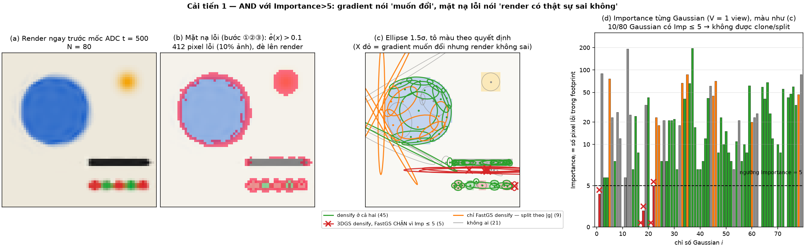

*Mốc có nhiều Gaussian bị chặn nhất (t = 500, N = 80): xanh = cả hai densify, đỏ X = 3DGS densify nhưng FastGS chặn, cam = chỉ FastGS (split theo $|g|$), xám = không ai.*

- → Tại $t=500$: 3DGS densify 54, FastGS 54, trùng 45; **5** bị chặn bởi Importance $\le5$ (trong 10 Gaussian có Importance $\le5$), 9 thêm vào nhờ $|g|$. Tại $t=300$ phép AND chặn **0** (Importance 30 Gaussian: min 0, median ≈ 60, chỉ 2 Gaussian $\le5$).
- → Số bị chặn theo mốc: $0,0,0,4,5,0,0,2,5$ — chỉ xuất hiện khi ảnh đã gần đúng (mặt nạ co lại) và ở Gaussian nhỏ, mờ, phủ vùng nền đã đúng.
- → Với 1 view, mặt nạ min–max luôn bật 30–40 % ảnh và footprint 3σ của Gaussian toy phủ hàng chục–hàng trăm pixel ⇒ Importance $\gg5$ cho gần hết. Sức lọc thật của phép AND nằm ở **phép chia $V=10$ dìm artefact một góc** — xem 12.2.5 và hình `2_8` (cắt ≈ 60 % ứng viên trên mô phỏng 400 Gaussian).

| | 3DGS gốc | FastGS-lite (toy, $V=1$) | FastGS-lite (code, $V=10$) |
|---|---|---|---|
| Tín hiệu | chỉ $\bar g$ | $\bar g$ ∧ counts $>5$ | $\bar g$ ∧ $\lfloor\frac1{10}\sum_v\text{counts}\rfloor>5$ |
| Chặn được | — | Gaussian nhỏ ở vùng đã đúng | thêm: artefact 1–2 góc, vùng hội tụ còn gradient L1 dư |
| Tỉ lệ cắt | 0 | 0–10 % mỗi mốc | ≈ 60 % (mô phỏng 12.2.6) |

### 12.7.5 Cải tiến 2 — split theo $\sum_x\lvert g_x\rvert$

$$
\boxed{\ \text{3DGS: split}_i=[\lVert\bar g_i\rVert\ge\tau]\wedge[\max s>\delta\,\text{ext}]\ }
\qquad\longrightarrow\qquad
\boxed{\ \text{FastGS: split}_i=[\lVert\bar g^{\text{abs}}_i\rVert\ge\tau^{\text{abs}}]\wedge[\max s>\delta\,\text{ext}]\wedge[\text{Imp}>5]\ }
$$

$$
g_i=\sum_x g_{i,x}\ \ (\text{triệt tiêu trong một ảnh}),\qquad
g^{\text{abs}}_i=\sum_x\lvert g_{i,x}\rvert\ \ \ge\ \lVert g_i\rVert\quad(\text{tam giác})
$$

| | code thật | toy |
|---|---|---|
| $\tau$ (có dấu) | $2\times10^{-4}$ | $4\times10^{-5}$ |
| $\tau^{\text{abs}}$ | $1.2\times10^{-3}$ ($6\times$) | $4\times10^{-4}$ ($10\times$) |

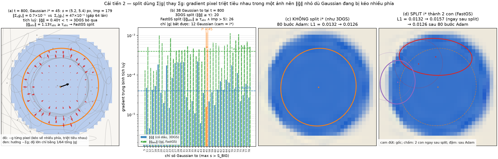

*Hình chọn $t=800$, $i^\ast=45$ ($s=(5.2,5.4)$ px, giữa hình tròn): tại một bước $\lVert\sum_x g_x\rVert=0.7\times10^{-5}$ nhưng $\sum_x|g_x|=47\times10^{-5}$ (gấp **64×**); tích luỹ 100 vòng: $\lVert\bar g\rVert=0.40\,\tau$ (3DGS bỏ qua) còn $\lVert\bar g^{\text{abs}}\rVert=1.13\,\tau^{\text{abs}}$ (FastGS split). Trong 38 Gaussian to tại $t=800$: 3DGS split 20, FastGS 26, chỉ $|g|$ bắt được 12.*

- → Tỉ số $\lVert\bar g^{\text{abs}}\rVert/\lVert\bar g\rVert$ của các Gaussian to ($\max s>3.5$ px) tại $t=300$: từ **4 đến 21**; các ca `split_only_abs` có tỉ số **11–59** (ví dụ $t=500$, $i=24$: $\bar g/\tau=0.42$ nhưng $\bar g^{\text{abs}}/\tau^{\text{abs}}=1.81$).
- → Panel (c)(d): sau 80 bước Adam, L1 không split $0.0132\to0.0126$; có split $0.0132\to0.0157$ (ngay sau) $\to0.0126$ — trên toy 1 view hai đường gần bằng nhau: hình minh hoạ **cơ chế phát hiện** ($\sum g$ triệt tiêu), không phải lợi ích L1 tức thời.
- → Số Gaussian **chỉ** FastGS split (abs qua, có dấu không): $1,1,1,5,9,1,12,12,14$ theo 9 mốc — tăng dần khi Gaussian to đã "ngồi" đối xứng lên chi tiết. Ngược lại `split_only_signed` (3DGS split, FastGS không vì $|g|$ chưa tới $10\tau$): $0,0,0,7,7,6,3,6,6$.
- → Đây là tầng (a) của bảng 12.4.2.3: trong **một** ảnh, nửa trái footprint kéo trái, nửa phải kéo phải ⇒ $\sum_x g_x\approx0$ dù mọi pixel đều "kêu". Norm-trước-cộng (tầng b) không cứu được vì kernel đã cộng qua pixel rồi mới trả một vector.

### 12.7.6 Cải tiến 3 — prune multinomial thay xoá cứng

$$
\boxed{\ \text{3DGS: xoá}=\{i:\alpha_i<\varepsilon\}\ \ (\text{ngay, toàn bộ})\ }
\qquad\longrightarrow\qquad
\boxed{\ \text{FastGS: }\ \mathcal C=\{\alpha<\varepsilon\ \vee\ \max s>S_{\text{huge}}\},\quad
w_i=\tfrac{1}{10^{-6}+1-\text{Pruning}_i},\quad
\mathcal S\sim\text{Multi}(w,\lfloor0.5|\mathcal C|\rfloor),\quad
\text{xoá}=\mathcal C\cap\mathcal S\ }
$$

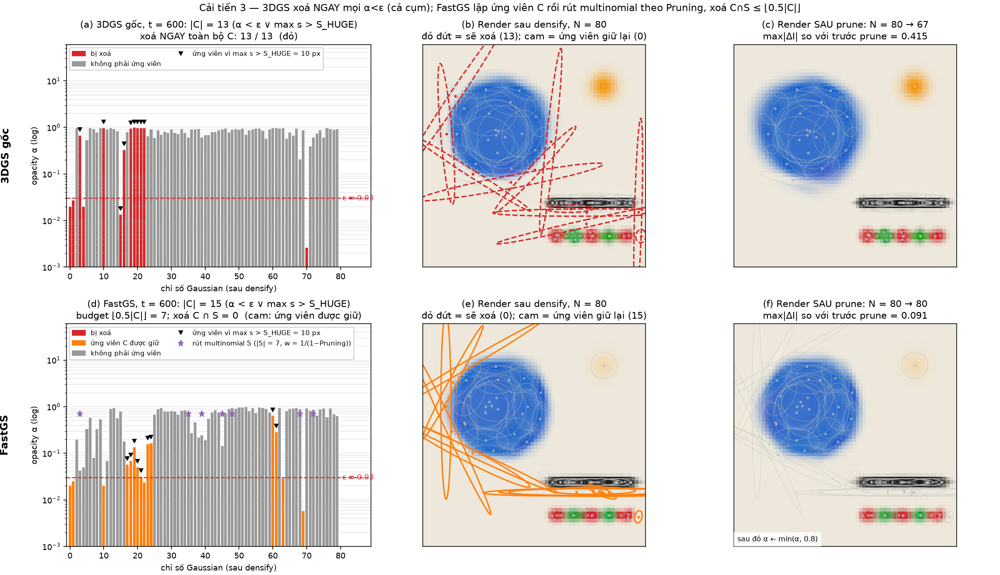

*Cột 1: $\alpha$ từng Gaussian (đỏ = xoá, cam = ứng viên $\mathcal C$ được giữ); cột 2: ellipse trên render; cột 3: render sau prune và $\max|\Delta I|$.*

| $t=600$ ($N=80$ cả hai) | 3DGS gốc | FastGS-lite |
|---|---|---|
| $|\mathcal C|$ | 13 | 15 |
| budget $\lfloor0.5|\mathcal C|\rfloor$ | — (xoá hết) | 7 |
| $|\mathcal S|$ | — | 7 (rút trên cả 80) |
| xoá thật $|\mathcal C\cap\mathcal S|$ | **13** | **0** |
| $\max|\Delta I|$ sau prune | 0.415 | 0.091 (chỉ do trần $\alpha\le0.8$) |
| L1 ngay sau mốc → 50 vòng sau | 0.0161 → 0.0212 → 0.0164 | 0.0201 → 0.0202 → 0.0143 |
| $t=700$: $|\mathcal C|$ / xoá | 0 / 0 | 10 / **1** ($\max|\Delta I|=0.318$) |

- → Vì sao FastGS xoá 0 tại $t=600$: 15 ứng viên đều có $\text{Pruning}\le0.14$ ⇒ $w\in[1.00,1.17]$, tổng $w$ trong $\mathcal C$ chỉ **16** so với $\sum w\approx10^6$ (một Gaussian $\text{Pruning}=1$ chiếm $w=10^6$). 7 lượt rút gần như chắc chắn rơi ngoài $\mathcal C$ ⇒ $\mathcal C\cap\mathcal S=\varnothing$. Đây là hệ quả trực tiếp của 12.5.1: "xoá thật $\le$ budget, thường $\ll$ budget khi $\mathcal C$ (mờ/to) và vùng $w$ cao (sai màu nhất quán) không chồng nhau".
- → 3DGS xoá 13 một lúc: L1 nhảy $0.016\to0.021$ (lỗ thủng), mất 50 vòng để hàn; FastGS không nhảy nhưng Gaussian vô dụng **sống tiếp** — chỉ được dọn ở final prune ($t=1000$: 8, $t=1100$: 2; xem 12.7.8). Đó là đánh đổi: ổn định render ↔ $N$ giảm chậm hơn trong cửa sổ densify.
- → Với 1 view và $N=80$, min–max qua $N$ đẩy đúng một Gaussian lên $w=10^6$ và ép phần còn lại về $w\approx1$–$2$ — dạng cực đoan của hình `3_12`. Trong huấn luyện thật ($N\sim10^5$, 10 view), $\mathcal C$ sau reset gồm hàng nghìn Gaussian mờ ở vùng sai, trong đó nhiều Gaussian có $\text{Pruning}$ cao ⇒ xoá thật cỡ 30–95 % budget (12.5.1) chứ không phải 0.

### 12.7.7 Cải tiến 4 — trần opacity $0.8$ sau mỗi lần densify

| | 3DGS gốc | FastGS-lite |
|---|---|---|
| Sau `densify_and_prune` | không đụng $\alpha$ | $\tilde\alpha_i\leftarrow\sigma^{-1}(\min(\alpha_i,0.8))$, xoá $m,v$ nhóm opacity |
| Reset mỗi 3000 | $\min(\alpha,0.01)$ | $\min(\alpha,0.01)$ (giống) |
| $\alpha$ tối đa giữa hai mốc | $\to0.99$ (kernel clamp) | leo lại từ $0.8$, bị cắt ở mốc kế |

$$
\boxed{\ \tilde\alpha_i\leftarrow\sigma^{-1}\bigl(\min(\alpha_i,\,0.8)\bigr)\quad\forall i\ }\qquad\text{(chỉ FastGS, `gaussian_model.py:485-487`)}
$$

Vì sao: gradient của Gaussian $j$ nằm **sau** $i$ tại pixel $x$ tỉ lệ với $T_j(x)=\prod_{k<j}(1-\alpha_kG_k)$. Ở tâm $G_i\approx1$:

$$
\alpha_i=0.99\ \Rightarrow\ T\le0.01,\qquad \alpha_i=0.8\ \Rightarrow\ T\le0.2\qquad\Rightarrow\quad\frac{\partial\mathcal L/\partial\theta_j\big|_{0.8}}{\partial\mathcal L/\partial\theta_j\big|_{0.99}}\approx20
$$

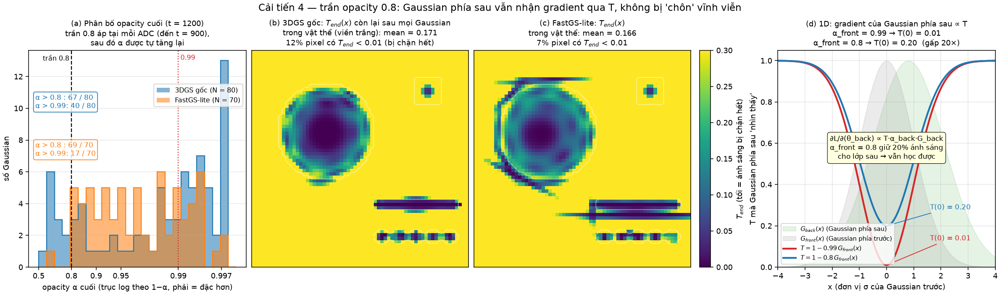

*Hình 7.9 — (a) histogram $\alpha$ cuối của 3DGS gốc và FastGS-lite, vạch $0.8$ / $0.99$; (b)(c) $T_{\text{end}}(x)$ còn lại sau mọi Gaussian; (d) $T=1-\alpha_{\text{front}}G_{\text{front}}(x)$ với $\alpha_{\text{front}}\in\{0.99,0.8\}$.*

- → Số Gaussian $\alpha>0.99$ ở cuối: **40/80** (3DGS) so với **17/70** (FastGS). Cả hai vẫn có $\alpha_{\max}=0.9975$: trần chỉ cắt **tại mốc ADC** (lần cuối $t=900$), 300 vòng sau $\alpha$ leo lại — nên $\alpha>0.8$ là 67/80 và 69/70.
- → $\text{mean}\,T_{\text{end}}$: $0.798$ (3DGS) vs $0.702$ (FastGS) — FastGS đục hơn ở vùng vật thể dù ít Gaussian hơn; phần pixel $T_{\text{end}}<0.01$ ngang nhau ($2.5\%$ vs $2.3\%$).
- → Panel (d) là điểm chính: $0.01$ so với $0.2$ — Gaussian bị che vẫn nhận gradient gấp $20\times$ để có cơ hội dịch ra chỗ trống thay vì bị "chôn" và chờ prune.

### 12.7.8 Cải tiến 5 — final prune sau cửa sổ densify

| | 3DGS gốc | FastGS-lite (code) | Toy |
|---|---|---|---|
| Sau $t=15000$ | không có sự kiện ADC; $N$ phẳng | `final_prune_fastgs` tại $18000,21000,24000,27000$ | $t=1000,1100$ (sau `ADC_UNTIL`$=900$) |
| Tiêu chí | — | $[\alpha<0.1]\ \vee\ [\text{Pruning}>0.9]$, xoá thẳng | giống, $\text{Pruning}=\text{minmax}(\text{counts})$, $V=1$ |

$$
\boxed{\ \text{final\_prune}_i=\bigl[\alpha_i<0.1\bigr]\ \vee\ \bigl[\text{Pruning}_i>0.9\bigr]\ }\qquad\text{không }\mathcal C,\ \text{không budget, không multinomial}
$$

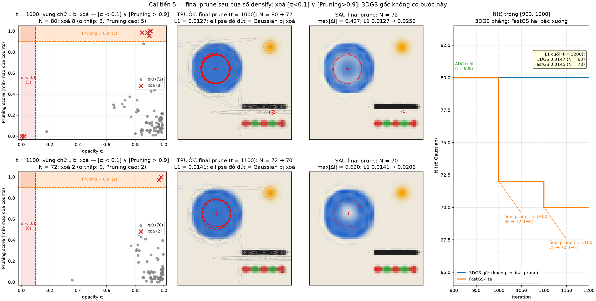

*Hình 7.10 — hai hàng = hai mốc $1000$, $1100$: (1) mặt phẳng $(\alpha,\text{Pruning})$ với dải đỏ $\alpha<0.1$ và dải cam $\text{Pruning}>0.9$, X = bị xoá; (2) render trước với ellipse đỏ đứt = xoá; (3) render sau + $\max|\Delta I|$; panel phụ $N(t)$ $900$–$1200$.*

| Mốc | $N$ trước → sau | xoá theo $\alpha<0.1$ | xoá theo $\text{Pruning}>0.9$ | $\max_x|\Delta I|$ | L1 trước → ngay sau → 100 vòng sau |
|---|---|---|---|---|---|
| 1000 | $80\to72$ | 3 | 5 | $0.427$ | $0.0127\to0.0256\to0.0139$ |
| 1100 | $72\to70$ | 0 | 2 | $0.620$ | $0.0139\to0.0206\to0.0145$ |

- → 3DGS gốc: $N=80$ phẳng từ $t=400$ đến hết; FastGS: hai bậc xuống $80\to72\to70$, L1 cuối $0.0145$ so với $0.0147$ — **cùng chất lượng, ít Gaussian hơn 12.5 %**.
- → Trung thực: trong toy L1 **nhảy vọt** ngay sau mỗi lần tỉa ($0.0127\to0.0256$) rồi cần $\sim100$ vòng để hồi. Nguyên nhân: vế $\text{Pruning}>0.9$ là ngưỡng **tương đối** trên $N=80$ Gaussian gần đều nhau, nên "10 % trên cùng của khoảng" trúng cả Gaussian đang có ích ($\max|\Delta I|=0.43$–$0.62$ — không phải $\approx0$ như hình 6.11). Với $N\sim10^5$ và phân bố $S$ đuôi dài của code thật, chỉ vài floater vượt $0.9$ (12.3.2.3); toy phóng đại mặt trái này.
- → Vế $\alpha<0.1$ chỉ bắt 3 Gaussian ở mốc 1000 và 0 ở mốc 1100: sau 4 lần reset (code) / 1 lần (toy), Gaussian còn $\alpha<0.1$ là loại đã "thua" phép thử 12.5.2.

### 12.7.9 Cải tiến 6 — `dense = 0.001` thay `percent_dense = 0.01`

$$
\text{3DGS: } \max_k s_{i,k}\ \lessgtr\ 0.01\,\text{extent}\qquad\longrightarrow\qquad
\text{FastGS-lite: } \max_k s_{i,k}\ \lessgtr\ 0.001\,\text{extent}
$$

- → Ngưỡng "to/nhỏ" hạ $10\times$: đường ngang trên mặt phẳng $(\|\bar g\|,\max s)$ (hình 4.3, 4.4) tụt xuống, phần lớn Gaussian rơi vào nhánh **split** — nhánh đòi $\|\bar g^{\text{abs}}\|\ge1.2\times10^{-3}$ (cao hơn $6\times$) **và** Importance $>5$.
- → Split thay gốc bằng hai con $s/1.6$ ($1\to2$, không giữ gốc) nên không "làm dày" như clone; kết hợp abs, nó ưu tiên làm mịn biên hơn nhân bản vùng phẳng (12.4.13).
- → Là khác biệt **tham số**, không phải thuật toán — nhưng tương tác với phép AND: đẩy sang nhánh split cũng là một cách hạ $r_{\text{spawn}}$. Toy không mô phỏng điểm này (dùng chung `S_BIG = 3.5 px` cho cả hai mode).

### 12.7.10 Bảng tổng hợp — 3DGS gốc → FastGS-lite

| # | Thành phần | 3DGS gốc | FastGS-lite | Hình toy 12.7 | Chi tiết | Tác dụng |
|---|---|---|---|---|---|---|
| 1 | Điều kiện densify | $[\|\bar g\|\ge\tau]\wedge[\text{kích thước}]$ | $\ldots\wedge[\text{Importance}>5]$ | 7.6 | 12.2, 12.4.3 | $r_{\text{spawn}}\downarrow$ (luỹ thừa qua 28–144 mốc) |
| 2 | Gradient nhánh split | $\|\bar g\|\ge2\times10^{-4}$ (có dấu) | $\|\bar g^{\text{abs}}\|\ge1.2\times10^{-3}$ | 7.7 | 12.4.2.3, 12.4.5 | bắt biên bị triệt tiêu; ngưỡng cao hơn → $r_{\text{spawn}}\downarrow$ ở vùng phẳng |
| 3 | Prune trong densify | xoá ngay $\alpha<0.005$ ($\vee$ quá to) | $\mathcal C$ (OR) $\cap\ \mathcal S\sim\text{Multinomial}(w)$, $\le\lfloor0.5|\mathcal C|\rfloor$ | 7.8 | 12.3.2, 12.5.1 | $r_{\text{prune}}$ hiền hơn, không khoét cụm |
| 4 | Opacity sau densify | — | $\min(\alpha,0.8)$ | 7.9 | 12.5.2 | Gaussian sau còn gradient ($\times20$) |
| 5 | Sau cửa sổ densify | $N$ phẳng | final prune $\times4$: $[\alpha<0.1]\vee[\text{Pruning}>0.9]$ | 7.10 | 12.5.3 | $N\downarrow$ bậc thang sau 15k |
| 6 | Ngưỡng to/nhỏ | $0.01\,\text{extent}$ | $0.001\,\text{extent}$ | — | 12.4.13 | nhiều Gaussian vào nhánh split (abs + Imp) |
| 7 | Chi phí thêm | 0 | $2V=20$ forward / lần chấm điểm | — | 12.3.5 | $+0.6$–$1.9\%$ (interval 500), $+3$–$10\%$ (100) |

$$
N_n=N_0\bigl[(1+r_{\text{spawn}})(1-r_{\text{prune}})\bigr]^{n},\qquad n=28\ (\text{interval }500)\ \text{hoặc}\ 144\ (100)
$$

Hàng 1, 2, 6 hạ $r_{\text{spawn}}$; hàng 3 làm $r_{\text{prune}}$ dịu nhưng có kiểm soát; hàng 5 thêm một số hạng giảm riêng sau $15000$. Mọi thay đổi nhỏ của $q=(1+r_{\text{spawn}})(1-r_{\text{prune}})$ đều được **khuếch đại mũ** qua $n$ mốc (12.4.7).

- → **Toy** (1 view, $N_{\max}=80$): cùng L1 ($0.0145$ vs $0.0147$), $N$ cuối $70$ vs $80$; cái giá là vài Gaussian mảnh lạc và L1 nhảy tạm sau final prune. Phép AND gần như không chặn vì Importance với $V=1$ mất ý nghĩa đa góc nhìn.
- → **Code thật** (chương 13, **giả định** chưa đo A/B): $N_{\text{tb}}\approx293$k so với $933$k, $R_{\text{gauss}}=0.314$ — đòn bẩy lớn nhất vì $N$ nằm trong cả ba số hạng chi phí.

---

## Cập nhật: MCMC densification (tuỳ chọn)

### 1. Vấn đề mà ADC (gốc lẫn `densify_and_prune_fastgs`) không giải quyết được

ADC gốc của 3DGS chọn ứng viên densify bằng một ngưỡng thuần heuristic trên gradient vị trí tích luỹ (`grad_thresh`), rồi **clone** (nếu Gaussian nhỏ) hoặc **split N=2** (nếu Gaussian lớn). Không có ràng buộc nào đảm bảo rằng ngay tại thời điểm nhân bản, tổng "khối lượng quang học" (opacity nhân với footprint, tức phần đóng góp vào alpha-compositing) của các bản sao bằng đúng bản gốc — hai Gaussian con y hệt bản cha chồng lên nhau sẽ tạm thời làm điểm đó **sáng/đậm hơn** cho tới khi optimizer kịp điều chỉnh, gây giật ảnh cục bộ ngay sau mỗi lần densify. Số Gaussian cuối cùng cũng không có cận trên tường minh — hoàn toàn do động lực $q=(1+r_{\text{spawn}})(1-r_{\text{prune}})$ ở 12.4 quyết định, dễ nổ theo hàm mũ nếu $q>1$ kéo dài (xem 12.4.7).

`densify_and_prune_fastgs` (đang dùng trong repo, xem phần trên của chương này) đã cải thiện đáng kể bằng cách thêm điều kiện AND với **multi-view importance/pruning score** — nhưng đây vẫn là một phép cắt ngưỡng rời rạc (`metric_mask = importance_score > 5`), không có cơ sở xác suất, và vẫn thừa hưởng vấn đề "không bảo toàn khối lượng quang học khi nhân bản" ở trên.

### 2. Ý tưởng MCMC densification (3DGS-MCMC, Kheradmand et al., NeurIPS 2024)

Thay vì coi tập Gaussian là các tham số được tối ưu thuần bằng gradient descent, 3DGS-MCMC coi chúng là một tập **hạt (particle)** đang lấy mẫu một phân phối xác suất xấp xỉ cảnh 3D — quá trình huấn luyện trở thành **Stochastic Gradient Langevin Dynamics (SGLD)**: gradient descent thông thường cộng thêm một bước nhiễu ngẫu nhiên có kiểm soát. Điều này thay đổi cả cách densify lẫn cách optimizer cập nhật vị trí.

**a) Relocation — thay clone/split bằng resampling có xác suất**

Các Gaussian "chết" (opacity $\le$ ngưỡng, hoặc quaternion suy biến gần 0) không bị xoá rồi hy vọng gradient sẽ tự sinh Gaussian mới bù vào (như ADC), mà được **thay thế trực tiếp** bằng cách resample từ các Gaussian còn sống, với xác suất chọn tỉ lệ thuận với opacity (Gaussian đóng góp quang học càng lớn càng dễ được "nhân bản" — bản chất là importance sampling).

Vấn đề đặt ra: nếu một Gaussian sống bị chọn $n$ lần (tạo ra $n$ bản gần trùng vị trí), làm sao để $n$ bản đó **cùng nhau** đóng góp vào alpha-compositing đúng bằng 1 bản gốc, tại đúng thời điểm nhân bản (không cần chờ optimizer sửa)? Đây chính là điều ADC gốc bỏ qua. 3DGS-MCMC giải bằng công thức đóng (Eq. 9 của paper, đã cài trong `scene/gaussian_model.py::_mcmc_relocate`):

$$
\alpha_{\text{new}} = 1-(1-\alpha)^{1/n}
$$

$$
D(n,\alpha_{\text{new}}) = \sum_{k=0}^{n-1}\binom{n-1}{k}(-1)^k\,\frac{\alpha_{\text{new}}^{\,k+1}}{\sqrt{k+1}}
$$

$$
s_{\text{new}} = \frac{\alpha}{D(n,\alpha_{\text{new}})}\cdot s
$$

với $\alpha, s$ là opacity/scale gốc trước khi nhân bản. Trực giác: $\alpha_{\text{new}}$ là opacity sao cho $n$ Gaussian giống hệt nhau, xếp chồng dọc tia nhìn, cho tổng transmittance-loss đúng bằng 1 Gaussian opacity $\alpha$ — còn $D(n,\alpha_{\text{new}})$ là hệ số hiệu chỉnh scale để tổng "diện tích quang học" cũng được bảo toàn. Nói cách khác: **ngay sau khi densify, ảnh render tại vùng đó gần như không đổi** — khác hẳn ADC gốc, nơi densify luôn kèm một nhiễu loạn tạm thời.

**b) Add-noise — phần "MC" (Monte Carlo) mà ADC không có**

Sau mỗi bước optimizer, vị trí mỗi Gaussian được cộng thêm nhiễu Gaussian $\epsilon \sim \mathcal N(0, \Sigma_i)$, dùng đúng ma trận hiệp phương sai 3D $\Sigma_i = R_iS_iS_i^\top R_i^\top$ của chính Gaussian đó (nhiễu "méo" theo hình dạng elip của nó, không phải nhiễu đẳng hướng), nhân với hệ số:

$$
\text{noise\_factor} = \text{lr}_{xyz}\cdot\lambda_{\text{noise}}\cdot\sigma\!\left(0.5-100\,\alpha\right)
$$

($\sigma$ là hàm sigmoid). Vì $\sigma(0.5-100\alpha)\to 0$ khi $\alpha\to 1$ và $\to 1$ khi $\alpha\to 0$: Gaussian có opacity cao (đã "chắc chắn" là một phần thật của cảnh) gần như đứng yên, còn Gaussian có opacity thấp (chưa hội tụ, còn nghi ngờ) bị nhiễu mạnh để tiếp tục "thăm dò" không gian nghiệm xung quanh — đúng tinh thần bước Langevin trong SGLD. ADC/gradient-descent thuần không có bước khám phá ngẫu nhiên này; toàn bộ chuyển động của Gaussian chỉ đến từ gradient của loss.

**c) Cận cứng số lượng Gaussian**

Thay vì để $N$ tăng không kiểm soát theo $N_n=N_0[(1+r_{\text{spawn}})(1-r_{\text{prune}})]^n$ như 12.4, MCMC tăng dân số tối đa $5\%$ mỗi lần gọi (`current_n_points * 1.05`) cho tới khi chạm `cap_max` — nghĩa là **VRAM và thời gian render/iter có thể ước lượng trước khi train**, không phụ thuộc scene "nổ" densify hay không.

### 3. So sánh trực diện

| Tiêu chí | ADC gốc 3DGS | `densify_and_prune_fastgs` (**luôn dùng, duy nhất**) | MCMC (có code, không được gọi mặc định) |
|---|---|---|---|
| Cơ sở lý thuyết | Heuristic ngưỡng gradient | Heuristic + multi-view importance score | Xác suất (SGLD / importance resampling) |
| Bảo toàn khối lượng quang học lúc nhân bản | Không | Không (clone/split kế thừa cơ chế ADC) | Có, bằng công thức đóng Eq. 9 |
| Cận cứng số Gaussian | Không | Không (chỉ có final-prune giảm bớt) | Có (`cap_max`, tăng tối đa 5%/lần) |
| Cần multi-view scoring (thêm forward pass) | Không | Có ($2V$ ảnh phụ mỗi lần chấm điểm, xem 12.3.5) | Không |
| Có bước nhiễu thăm dò (exploration) | Không | Không | Có (`mcmc_add_noise`, tỉ lệ nghịch opacity) |

### 4. Trạng thái tích hợp

Đã cài trong `scene/gaussian_model.py` (`mcmc_densification`, `mcmc_add_noise`, `_mcmc_relocate`) — port có tham khảo cách hiện thực của repo Faster-GS (CVPR 2026). **Quyết định (đợt tích hợp "luôn bật, không cờ"): KHÔNG wiring MCMC vào control flow mặc định** — cờ `use_mcmc` đã bị xoá khỏi `arguments/__init__.py` và nhánh gọi trong `train.py`/`pipeline/trainer.py` đã bị xoá. Lý do: MCMC và `densify_and_prune_fastgs` loại trừ lẫn nhau về mặt thuật toán (không thể chạy cả hai trên cùng tập Gaussian trong cùng vòng lặp), và `densify_and_prune_fastgs` là đóng góp chính của repo FastGS nên được ưu tiên giữ làm cơ chế duy nhất. Các hàm `mcmc_*` vẫn còn nguyên trong `gaussian_model.py` làm code thư viện dự phòng — có thể gọi thủ công (thay thế nhánh `densify_and_prune_fastgs` trong `train.py`/`pipeline/trainer.py`) nếu sau này cần benchmark so sánh. `mcmc_cap_max`, `mcmc_min_opacity`, `mcmc_noise_lr` vẫn còn trong `arguments/__init__.py` làm tham số dự phòng cho các hàm này.

Toàn bộ phần này được viết trong môi trường không có torch/CUDA, **chưa test trên GPU thật** — cần verify PSNR/tốc độ trên Colab trước khi dùng cho submission thật.

---

[← Chương 11](11-gradient-flow-backprop.md) | [Mục lục](00-muc-luc.md) | [Chương 13 →](13-tong-hop-chi-phi-fastgs.md)
