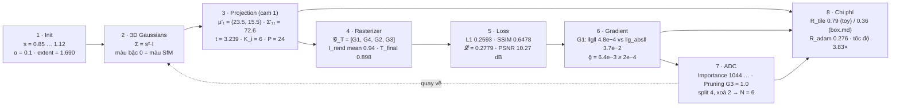
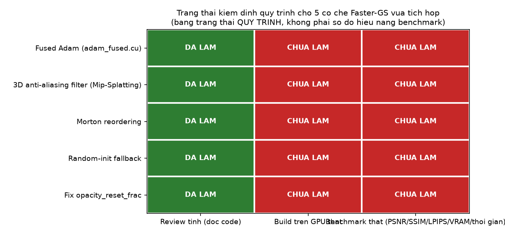

[← Mục lục](00-muc-luc.md) · Chương 15/15

# Chương 15 — Phụ lục: Kiểm định số chéo giữa các chương, Dữ liệu & Tài nguyên

> Nguồn: `DOCS/Report/test/README.md`, `DOCS/assets/history.csv`, `DOCS/assets/leaderboard.csv`, `DOCS/test.html`, `DOCS/Report/test/scripts/`

Chương phụ lục khép lại cuốn sách, tổng hợp: (1) bức tranh toàn cảnh của bộ 8 bài kiểm định số đã rải rác ở cuối Chương 6–13, (2) mô tả hai bộ dữ liệu CSV dùng để dựng bảng/biểu đồ trong Chương 14, (3) công cụ minh hoạ tương tác `test.html`, và (4) danh mục toàn bộ script sinh ra các bài kiểm định số.

## 15.1 Tổng quan bộ 8 bài kiểm định số (Report/test/README.md)

Mỗi chương của phần lý thuyết (01→08, tương ứng Chương 6–13 của sách này) có một bài test số: chạy công thức của chương trên **cùng một cảnh đồ chơi**
(xem mục 6.2 — [Chương 6](06-initialization.md): 4 điểm SfM, 3 camera, ảnh 48×32 = 6 tile, $f_x=f_y=40$), in mọi số trung gian,
rồi ghi bảng "Đầu ra của khối" để chương sau dùng. Số trong markdown là output thật của script tương ứng
(`python DOCS/Report/test/scripts/chNN_test.py`, chỉ cần numpy + scipy).

| Chương (sách này) | Chương gốc | Bài test | Script | Số chốt |
|---|---|---|---|---|
| 6 | 1 Initialization | 01-test.md | `ch01_test.py` | $s_i$ = 0.8505 / 0.9434 / 1.115 / 0.8888, $\tilde\alpha=-2.197$, **extent = 1.690** |
| 7 | 2 3D Gaussians | 02-test.md | `ch02_test.py` | $\Sigma_i=s_i^2I$, màu bậc 0 khớp SfM, $D(t)$: 3→12→27→48 float SH |
| 8 | 3 Projection | 03-test.md | `ch03_test.py` | $\Sigma'_{11}\approx72.6$, $t=3.239$, $K$: 72→58→57 tile, **R_tile = 0.792**; box.md 25→15→9 ✓ |
| 9 | 4 Rasterizer | 04-test.md | `ch04_test.py` | $P=24$ cặp, khoá `0x0000000140800000`, $\bar T_{\text{final}}=0.898$ |
| 10 | 5 Loss | 05-test.md | `ch05_test.py` | L1 = 0.2593, SSIM = 0.6478, **𝓛 = 0.2779**, PSNR = 10.27 dB |
| 11 | 6 Gradient | 06-test.md | `ch06_test.py` | ‖g‖/‖g_abs‖ của $G_1$ = 4.8e−4 / 3.7e−2 (triệt tiêu 77×); step 15313/1250/**16563** |
| 12 | 7 ADC | 07-test.md | `ch07_test.py` | Importance = 1044/1017/1066/974, Pruning = 0.77/0.45/**1.00**/0.00, split 4, xoá 2 → $N=6$ |
| 13 | 8 Tổng hợp | 08-test.md | `ch08_test.py` | R_adam = 0.2761, tốc độ **3.833×** (K 1.64 · N 2.38 · Adam 1.12), Amdahl 6.67× |

### Cách đọc một bài test

Mỗi công thức trong chương gốc được "chạy" theo đúng ba nhịp, luôn cùng thứ tự:

| Nhịp | Nội dung | Ví dụ (chương 1, scale) |
|---|---|---|
| **Công thức** | chép nguyên từ chương / code, kèm số dòng | $\tilde s_i=\log\sqrt{d^2_{\text{knn3}}}$ — `gaussian_model.py:147-148` |
| **Thay số** | điền số của cảnh đồ chơi vào từng ký hiệu | $d^2=(0.59+1.2+0.38)/3=0.7233$ |
| **Kết quả** | số cuối + kiểm chứng ngược hoặc đối chiếu code | $\tilde s_1=-0.1619$, $s_1=e^{-0.1619}=0.8505$ |

Đầu mỗi file gốc có một **sơ đồ mermaid** tóm tắt cả chương với đúng các con số đó, để nhìn một lần thấy số chạy từ đầu vào tới đầu ra. Ký hiệu chung xem [Chương 5](05-ky-hieu-nen-tang-toan-hoc.md).

### Số chạy xuyên suốt 8 chương



### Kiểm tra chéo giữa các bot

- mean\|I_rend − I_gt\| camera 1: bot 04 = 0.2593, bot 05 = 0.2593 ✓
- $\Sigma'_{11}$, conic, tập tile camera 1: bot 03 = bot 04 = bot 07 ✓
- $\bar g_i$: bot 06 (giải tích) vs bot 07 (sai phân ±0.5 px) chênh 1–10 %, cùng kết luận ✓
- Đếm Adam step: bot 06 = bot 08 = `demos/fastgs_cost_model.py` = 16563 ✓

### Chỗ lệch so với tài liệu chương (đã ghi trong từng file)

| Chương gốc | Phát hiện |
|---|---|
| 06 | `∂L/∂B` code lưu một nửa (−½GΔuΔv) rồi nhân lại 2 ở `computeCov2DCUDA` backward — quy ước code, không phải lỗi |
| 08 | `train.py:132` với interval 100 cho **144** lần densify, không phải 145; `final_prune_fastgs` chạy 4 lần (+80 forward) chưa tính vào overhead |
| 07 | thứ tự thật trong `densify_and_prune_fastgs` là split rồi prune trên quần thể mới → $N=4$ thay vì 6 theo công thức 7.8 |
| 03 | cảnh đồ chơi: camera 1 cho R_tile = 1 vì cả hai hộp đều bị clamp lưới 3×2 — dạng cực đoan của lượng tử hoá "+1" |

## 15.2 Dữ liệu số thô: `DOCS/assets/`

### 15.2.1 `history.csv` — lịch sử theo vòng lặp của một phiên train

29 dòng (1 header + 28 điểm đo), cột:

| Cột | Ý nghĩa |
|---|---|
| `scene` | tên scene (ví dụ `drjohnson`) |
| `iter` | vòng lặp tại thời điểm đo |
| `pct` | % tiến độ so với `iterations` mục tiêu |
| `n_gauss` | số Gaussian $N$ hiện tại |
| `ema_loss` | loss trung bình trượt (EMA) |
| `elapsed_s` | thời gian đã trôi qua (giây) |
| `ram_gb`, `vram_gb` | RAM / VRAM tại thời điểm đo |
| `psnr`, `ssim`, `lpips` | ba metric thô |
| `psnr_norm` | PSNR đã chuẩn hoá theo `psnr_max` (xem [Chương 1](01-gioi-thieu-tong-quan.md) mục 1.2.3) |
| `score` | điểm tổng hợp `Score` tại thời điểm đo |
| `n_views` | số camera hold-out dùng để đo |
| `d_score`, `d_psnr`, `d_ssim`, `d_lpips` | delta so với lần đo trước |

Ví dụ 4 dòng đầu (scene `drjohnson`):

```csv
scene,iter,pct,n_gauss,ema_loss,elapsed_s,ram_gb,vram_gb,psnr,ssim,lpips,psnr_norm,score,n_views,d_score,d_psnr,d_ssim,d_lpips
drjohnson,1000,14.29,87375,0.0869,9.57,3.735,0.970,21.47,0.717,0.430,0.716,0.658,6,,,,
drjohnson,2000,28.57,106415,0.0824,19.30,3.735,0.992,24.49,0.786,0.302,0.816,0.760,6,0.102,3.017,0.070,-0.127
drjohnson,3000,42.86,121412,0.0442,30.12,3.744,1.010,10.92,0.134,0.635,0.364,0.295,6,-0.464,-13.566,-0.652,0.333
```

Đây chính là dữ liệu nguồn dùng để vẽ biểu đồ "Score theo vòng lặp, ba thành phần metric, delta giữa hai mốc, và Score theo số Gaussian" trong [Chương 14](14-trien-khai-colab-nhat-ky-train.md) (ảnh `training.png`).

### 15.2.2 `leaderboard.csv` — bảng tổng kết cuối cùng theo scene

6 dòng (1 header + 5 scene: `drjohnson`, `playroom`, `train`, `truck`, và hàng `MEAN`), cột:

| Cột | Ý nghĩa |
|---|---|
| `scene` | tên scene |
| `iters` | tổng số vòng đã train |
| `n_gauss` | số Gaussian cuối cùng |
| `train_s` | tổng thời gian train (giây) |
| `peak_vram_gb` | đỉnh VRAM đã dùng |
| `live_score`, `live_psnr`, `live_psnr_norm`, `live_ssim`, `live_lpips` | metric đo nhanh trong lúc train (mạng LPIPS `alex`) |
| `images` | số ảnh test camera |
| `size` | độ phân giải ảnh gốc |
| `score`, `psnr`, `psnr_norm`, `ssim`, `lpips` | metric "báo cáo" đo khi render submission đầy đủ (mạng LPIPS `vgg`) — xem [Chương 1](01-gioi-thieu-tong-quan.md) mục 1.2.3 |

```csv
scene,iters,n_gauss,train_s,peak_vram_gb,live_score,live_psnr,live_psnr_norm,live_ssim,live_lpips,images,size,score,psnr,psnr_norm,ssim,lpips
drjohnson,7000,174003,74.8,1.16,0.8966,29.2512,0.975,0.875,0.146,33,1332x876,0.8027,27.408,0.9136,0.8677,0.3293
playroom,7000,129383,67.2,0.89,0.9167,29.3979,0.9799,0.8838,0.106,29,1264x832,0.8198,28.457,0.9486,0.8799,0.3219
train,7000,201129,94.6,0.78,0.8123,21.9103,0.7303,0.8242,0.1352,38,980x545,0.6867,19.7545,0.6585,0.7241,0.3202
truck,7000,187287,91.0,0.68,0.8821,24.3559,0.8119,0.8868,0.0688,32,979x546,0.7482,22.2311,0.741,0.7851,0.2742
```

Đây chính là dữ liệu nguồn của bảng leaderboard và ảnh `leaderboard.png` trong [Chương 14](14-trien-khai-colab-nhat-ky-train.md) — sinh ra bởi `pipeline/report.leaderboard`.

## 15.3 Công cụ minh hoạ tương tác: `test.html`

`DOCS/test.html` **không phải** tài liệu markdown mà là một trang HTML/JS/SVG độc lập, tự chứa, tên nội bộ **"AccuTile — Từ hộp bao đến elip chính xác"**. Đây là một demo tương tác minh hoạ trực quan cho thuật toán "compact box" ở [Chương 8](08-projection-compact-box.md) (Projection & Compact Box):

- Tiêu đề trong trang: *"AccuTile: hộp bao → elip chính xác"*, phụ đề: *"Chỉnh Σ, p, mult, o để xem elip, hộp bao và tập tile giữ lại thay đổi theo thời gian thực."*
- Các trường nhập tương tác: `Σ11`, `Σ12`, `Σ22` (hiệp phương sai 2D sau chiếu), `p_x`, `p_y` (tâm splat trên ảnh), `mult` (hệ số compact-box, mặc định 0.5, đúng tham số `--mult` ở [Chương 1](01-gioi-thieu-tong-quan.md)/[Chương 8](08-projection-compact-box.md)), `opacity o`.
- Các lớp phủ có thể bật/tắt: lưới tile 16×16, hộp bao (compact box), elip chính xác, tiếp điểm & nửa cạnh, tô tile bị loại.
- Một khối "Quét từng hàng (AccuTile)" minh hoạ thuật toán quét hàng để xác định chính xác tập tile mà một Gaussian chạm tới, thay vì dùng hộp bao vuông thô — đúng nội dung "ba công thức đếm tile" ở `box2.md` (mục 8.4).

Vì đây là công cụ tương tác chạy trong trình duyệt (canvas/SVG + JavaScript thuần, không phụ thuộc thư viện ngoài), nội dung của nó không thể "đọc tuyến tính" như văn bản — người đọc nên mở trực tiếp file `DOCS/test.html` bằng trình duyệt để trải nghiệm, thay vì đọc mã nguồn trong sách. Sách này chỉ ghi lại mục đích và cách dùng để không bỏ sót sự tồn tại của công cụ.

## 15.4 Danh mục script kiểm định số & vẽ hình (`DOCS/Report/test/scripts/`)

Mỗi chương lý thuyết (01–08 gốc, tức Chương 6–13 của sách) có đúng một script test và một script vẽ hình, đều chỉ cần `numpy` + `scipy` (không cần `torch`/CUDA):

| Script test | Sinh ra | Script vẽ hình | Sinh ra |
|---|---|---|---|
| `ch01_test.py` | số liệu trong mục 6.3 (Initialization) | `ch01_plot.py` | các ảnh `figures/ch01_*.png` |
| `ch02_test.py` | số liệu trong mục 7.2 (3D Gaussians) | `ch02_plot.py` | `figures/ch02_*.png` |
| `ch03_test.py` | số liệu trong mục 8.2 (Projection) | `ch03_plot.py` | `figures/ch03_*.png` |
| `ch04_test.py` | số liệu trong mục 9.2 (Rasterizer) | `ch04_plot.py` | `figures/ch04_*.png` |
| `ch05_test.py` | số liệu trong mục 10.2 (Loss) | `ch05_plot.py` | `figures/ch05_*.png` |
| `ch06_test.py` | số liệu trong mục 11.2 (Gradient) | `ch06_plot.py` | `figures/ch06_*.png` |
| `ch07_test.py` | số liệu trong mục 12.2 (ADC) | `ch07_plot.py` | `figures/ch07_*.png` |
| `ch08_test.py` | số liệu trong mục 13.2 (Tổng hợp) | `ch08_plot.py` | `figures/ch08_*.png` |

Chạy một script bất kỳ: `python DOCS/Report/test/scripts/chNN_test.py` (in ra console đúng các con số đã chép vào file `NN-test.md` tương ứng). File `ch04_test.py` còn ghi kèm vài artefact trung gian dùng lại giữa các lần chạy: `ch04_aux_cam1.npz`, `ch04_render_cam1.npy`/`.ppm`, `ch04_render_cam1_gt.npy`/`.ppm` — ảnh render/ground-truth của camera 1 trên cảnh đồ chơi, dùng để `ch05_test.py` (Loss) đọc lại mà không cần render lại từ đầu.

## 15.5 Trạng thái kiểm định các cơ chế Faster-GS vừa tích hợp

Đợt tích hợp gần nhất gộp thêm 5 cơ chế lấy ý tưởng từ Faster-GS (Hahlbohm et al., CVPR 2026) vào repo (xem [Chương 3](03-vong-lap-huan-luyen-phan-2.md), [Chương 7](07-3d-gaussians.md), [Chương 11](11-gradient-flow-backprop.md), [Chương 12](12-adaptive-density-control.md)): **fused Adam** (`adam_fused.cu`), **3D anti-aliasing filter** (Mip-Splatting), **Morton reordering**, **random-init fallback** (khi COLMAP thiếu `points3D`), và **fix `opacity_reset_frac`** (bug lịch reset opacity không co giãn theo `iterations`).

Việc audit này được thực hiện hoàn toàn **tĩnh** — đọc code, đối chiếu công thức, kiểm tra cú pháp — trong một môi trường **không có GPU/CUDA toolchain**. Bảng dưới ghi trung thực trạng thái kiểm định của từng cơ chế; ô "chưa làm" không phải bị bỏ sót mà là việc người dùng cần tự thực hiện sau khi có máy hoặc phiên Colab có GPU:

| Cơ chế | Review tĩnh (đọc code) | Build trên GPU thật | Benchmark thật (PSNR/SSIM/LPIPS/VRAM/thời gian) |
|---|---|---|---|
| Fused Adam | ✅ Đã làm | ❌ Chưa | ❌ Chưa |
| 3D anti-aliasing filter | ✅ Đã làm | ❌ Chưa | ❌ Chưa |
| Morton reordering | ✅ Đã làm | ❌ Chưa | ❌ Chưa |
| Random-init fallback | ✅ Đã làm | ❌ Chưa | ❌ Chưa |
| Fix `opacity_reset_frac` | ✅ Đã làm | ❌ Chưa | ❌ Chưa |



**Các bước để tự kiểm định** (cần máy hoặc Colab có GPU CUDA):

1. Build lại `diff-gaussian-rasterization_fastgs` (`pip install -e submodules/diff-gaussian-rasterization_fastgs`) — `setup.py` đã thêm `cuda_rasterizer/adam_fused.cu` vào danh sách nguồn biên dịch.
2. Chạy smoke test (`cfg.run_smoke = True`, vài trăm iteration) để bắt lỗi runtime (dtype/shape mismatch) mà review tĩnh không thể phát hiện.
3. Chạy một scene đầy đủ, so sánh `output/*/history.csv` và `leaderboard.csv` mới với log tham chiếu tại [15.2](#1521-historycsv--lịch-sử-theo-vòng-lặp-của-một-phiên-train) (đặc biệt kiểm tra: hố sụt PSNR tại mốc opacity-reset đã biến mất hay giảm hẳn so với trước khi sửa `opacity_reset_frac` — xem [Chương 14](14-trien-khai-colab-nhat-ky-train.md)).

---

## Bài tập (Exercise)

**Bài tập 15.1.** Mục "Kiểm tra chéo giữa các bot" (15.1) liệt kê bốn phép đối chiếu, trong đó có `mean|I_rend − I_gt|` camera 1: bot 04 = bot 05 = 0.2593. Giải thích vì sao hai script độc lập (`ch04_test.py` cho Rasterizer, `ch05_test.py` cho Loss) phải cho ra cùng một con số này, và việc khớp nhau chứng minh điều gì về tính nhất quán giữa Chương 9 và Chương 10 của sách.

**Bài tập 15.2.** Dùng ba dòng dữ liệu mẫu của `history.csv` ở mục 15.2.1 (scene `drjohnson`, các vòng 1000/2000/3000 với `score` lần lượt 0.658, 0.760, 0.295 và `psnr` lần lượt 21.47, 24.49, 10.92), hãy tính lại `d_score` và `d_psnr` tại dòng vòng 3000 và đối chiếu với giá trị đã ghi trong CSV (−0.464 và −13.566).

**Bài tập 15.3.** Theo mục 15.4, `ch04_test.py` ghi lại các artefact trung gian `ch04_render_cam1.npy`/`.ppm` và `ch04_render_cam1_gt.npy`/`.ppm`. Giải thích vì sao `ch05_test.py` (bài test cho Loss, Chương 10) cần đọc lại đúng các file này thay vì tự render lại từ đầu, và điều đó liên quan thế nào đến việc `mean|I_rend − I_gt|` ở Bài tập 15.1 khớp giữa hai script.

**Bài tập 15.4.** Bảng "Chỗ lệch so với tài liệu chương" ở mục 15.1 ghi: với bài test 07 (ADC, Chương 12), thứ tự thật trong `densify_and_prune_fastgs` là split rồi mới prune trên quần thể mới, cho ra $N=4$ thay vì $N=6$ theo công thức 7.8 trong sách. Giải thích cơ chế toán học vì sao đổi thứ tự split/prune lại thay đổi kết quả đếm cuối cùng, và tại sao đây được xem là "quy ước code" chứ không phải một lỗi cần sửa.

**Bài tập 15.5.** Từ các cột thô của `leaderboard.csv` ở mục 15.2.2 cho scene `drjohnson` (psnr = 27.408, psnr_norm = 0.9136, ssim = 0.8677, lpips = 0.3293), hãy tính lại Score bằng công thức $\mathrm{Score}=0.4(1-\mathrm{LPIPS})+0.3\,\mathrm{SSIM}+0.3\,\mathrm{psnr\_norm}$ và xác nhận kết quả khớp với cột `score = 0.8027`.

**Bài tập 15.6.** Mục 15.3 giải thích rằng `DOCS/test.html` (AccuTile) "không thể đọc tuyến tính như văn bản". Nêu ít nhất hai lý do kỹ thuật cho nhận định này (dựa trên bản chất tương tác canvas/SVG + JavaScript thuần của công cụ), và giải thích khối "Quét từng hàng (AccuTile)" minh hoạ trực quan cho nội dung nào ở `box2.md` mục 8.4.

**Bài tập 15.7.** Bảng "Chỗ lệch so với tài liệu chương" ghi với bài test 03 (Projection, Chương 8): cảnh đồ chơi cho camera 1 ra $R_{\text{tile}} = 1$ "vì cả hai hộp đều bị clamp lưới 3×2 — dạng cực đoan của lượng tử hoá +1". So sánh giá trị này với $R_{\text{tile}} = 0.792$ đã tính ở mục 15.1 (hàng Chương 8 của bảng 8 bài test) và giải thích vì sao hai con số khác nhau lại không mâu thuẫn nhau — chúng đo trên đối tượng nào.

---

## Kết sách

Mười lăm chương trên hợp nhất toàn bộ nội dung của thư mục `DOCS/` (và các thư mục con `Report/`, `Report/test/`) tại thời điểm biên soạn — từ tổng quan dự án, giải phẫu pipeline theo từng dòng code (§1–§48), lý thuyết toán học 3D Gaussian Splatting theo đúng sơ đồ khối, ba đòn bẩy tăng tốc FastGS-lite, cho tới hướng dẫn vận hành thật trên Colab và phụ lục kiểm định số chéo. Muốn tra cứu nhanh về một chủ đề cụ thể, dùng [Mục lục](00-muc-luc.md) — mỗi chương đều ghi rõ "Nguồn" ở đầu để truy vết về đúng file gốc trong `DOCS/`.

[← Chương 14](14-trien-khai-colab-nhat-ky-train.md) | [Mục lục](00-muc-luc.md)
