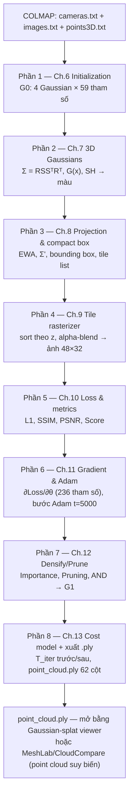

[← Mục lục](00-muc-luc.md) · Chương 16 — Đề bài

# Chương 16 — Bài toán lớn: Từ COLMAP đến `.ply` render được 3D (Đề bài)

> Đây là **đề bài duy nhất**, gộp toàn bộ pipeline FastGS-lite (chương 6 → chương 13) thành **một câu hỏi**
> với **đầy đủ số liệu đầu vào ở định dạng COLMAP thật** (`cameras.txt`, `images.txt`, `points3D.txt`).
> Lời giải chi tiết — tính tay từng bước, khoảng 30 000 dòng markdown — nằm ở thư mục
> [`16-loi-giai/`](16-loi-giai/00-muc-luc-loi-giai.md), chia làm 8 phần tương ứng chương 6–13.
>
> Cảnh dùng trong đề bài **chính là** "cảnh đồ chơi dùng chung" đã định nghĩa ở [§6.2](06-initialization.md#62-cảnh-đồ-chơi-dùng-chung-cho-các-bài-kiểm-định-số-chương-6–13)
> (4 điểm SfM, 3 camera, ảnh $48\times32$) — dùng lại để mọi số trong lời giải khớp với các bài
> kiểm định số đã có sẵn ở cuối mỗi chương 6–13, tránh mâu thuẫn số liệu giữa các phần.

## 16.1 — Input COLMAP thô

Thư mục `sparse/0/` của COLMAP (định dạng text, đúng cột như COLMAP xuất ra) chứa ba file sau.
Quy ước: model camera `PINHOLE` (chỉ $f_x,f_y,c_x,c_y$, không méo ống kính); quaternion $(q_w,q_x,q_y,q_z)$
và tịnh tiến $(t_x,t_y,t_z)$ mô tả phép quay **world → camera**: $X_{\text{cam}} = R(q)\,X_{\text{world}} + t$.

### `cameras.txt`

```
# Camera list with one line of data per camera:
#   CAMERA_ID, MODEL, WIDTH, HEIGHT, PARAMS[]
# Number of cameras: 1
1 PINHOLE 48 32 40.0 40.0 24.0 16.0
```

Suy ra $\tan(\mathrm{fov}_x/2) = \dfrac{c_x}{f_x} = \dfrac{24}{40} = 0.6$, $\tan(\mathrm{fov}_y/2) = \dfrac{c_y}{f_y} = \dfrac{16}{40} = 0.4$ — khớp đúng hằng số đã dùng xuyên suốt sách. $z_n = 0.01$, $z_f = 100$ (quy ước riêng của pipeline, không nằm trong `cameras.txt` COLMAP chuẩn nhưng được `Scene` gán cố định).

### `images.txt`

```
# Image list with two lines of data per image:
#   IMAGE_ID, QW, QX, QY, QZ, TX, TY, TZ, CAMERA_ID, NAME
#   POINTS2D[] as (X, Y, POINT3D_ID)
# Number of images: 3, mean observations per image: 4
1 1.0 0.0 0.0 0.0 0.0 0.0 4.0 1 cam01.png

2 1.0 0.0 0.0 0.0 -1.5 0.0 4.0 1 cam02.png

3 1.0 0.0 0.0 0.0 1.5 -0.5 4.0 1 cam03.png

```

Quaternion đơn vị $(1,0,0,0)$ ở cả ba dòng $\Rightarrow R=I_3$ (không xoay). Vị trí camera trong world suy
từ $t = -R\,c \Rightarrow c = -t$ (vì $R=I$): $c_1=(0,0,-4)$, $c_2=(1.5,0,-4)$, $c_3=(-1.5,0.5,-4)$ — đúng
ba camera của cảnh đồ chơi. Ma trận world→camera $W_v = \begin{pmatrix}I_3 & t_v\\ 0 & 1\end{pmatrix}$, $t_v=-c_v$.

### `points3D.txt`

```
# 3D point list with one line of data per point:
#   POINT3D_ID, X, Y, Z, R, G, B, ERROR, TRACK[] as (IMAGE_ID, POINT2D_IDX)
# Number of points: 4, mean track length: 3.0
1 0.0 0.0 0.0 204 51 51 0.42 1 0 2 0 3 0
2 0.5 0.3 0.5 51 179 76 0.35 1 1 2 1 3 1
3 -0.4 -0.2 1.0 26 76 230 0.51 1 2 2 2 3 2
4 0.3 -0.5 0.2 128 128 128 0.29 1 3 2 3 3 3
```

Màu RGB nguyên 0–255 quy về $[0,1]$ bằng chia 255: $(204,51,51)/255=(0.8,0.2,0.2)$ (đỏ),
$(51,179,76)/255=(0.2,0.702,0.298)\approx(0.2,0.7,0.3)$ (lục), $(26,76,230)/255\approx(0.1,0.3,0.9)$ (lam),
$(128,128,128)/255\approx(0.502,0.502,0.502)\approx(0.5,0.5,0.5)$ (xám). Cột `ERROR` (sai số tái chiếu
COLMAP) và `TRACK` (danh sách ảnh quan sát điểm) không được pipeline dùng tới — chỉ dùng $X,Y,Z,R,G,B$.

Ground-truth ảnh $I^{(v)}_{\text{gt}}$ (dùng ở bước loss): định nghĩa là ảnh render của **đúng** cảnh này
với mọi tham số như trên nhưng opacity $\alpha=0.9$ thay vì $0.1$ (quy ước ở §6.2 — mô hình chưa học sẽ
mờ hơn GT vì khởi tạo $\alpha=0.1$).

## 16.2 — Đề bài (một câu duy nhất)

> **Cho** point cloud thưa 4 điểm và 3 camera pinhole ở trên (trích từ `sparse/0/{cameras,images,points3D}.txt`
> của COLMAP, `max_sh_degree=3`, các hằng số hệ thống của FastGS-lite: tile 16 px, low-pass $0.3$, clamp
> $1.3\tan(\mathrm{fov}/2)$, ngưỡng alpha $\tfrac1{255}$, dừng sớm $10^{-4}$, `mult`$=0.5$,
> $\tau_{\text{grad}}=2\times10^{-4}$, $\tau^{\text{abs}}_{\text{grad}}=1.2\times10^{-3}$, $\tau_{\text{loss}}=0.1$,
> $\delta=0.001$, $\lambda=0.2$, learning-rate schedule và hệ số Adam mặc định của repo (chương 5) —
> **hãy tính tay, từng bước một** (công thức → thay số → kết quả, không dùng phần mềm, chỉ đối chiếu lại
> bằng script numpy để kiểm tra):
> **(1)** khởi tạo $\mathcal G_0$ gồm 4 Gaussian 59 tham số/con từ point cloud (chương 6);
> **(2)** dựng ma trận hiệp phương sai $\Sigma_i=R_iS_iS_i^\top R_i^\top$ và hàm mật độ $G_i(x)$, giải mã màu SH cho
> cả 3 hướng nhìn (chương 7);
> **(3)** chiếu cả 4 Gaussian lên cả 3 camera bằng EWA splatting, tính compact box và danh sách tile giao
> nhau (chương 8);
> **(4)** rasterize vi phân theo tile — sắp theo độ sâu, alpha-blend từng pixel của ảnh $48\times32$ cho cả
> 3 view, ra ảnh render $\hat I^{(v)}$ (chương 9);
> **(5)** so $\hat I^{(v)}$ với $I^{(v)}_{\text{gt}}$ bằng $L_1$, SSIM (cửa sổ $11\times11$), PSNR, và điểm tổng hợp
> Score đa góc nhìn (chương 10);
> **(6)** lan truyền ngược $\partial \mathrm{Loss}/\partial\theta_i$ qua rasterizer và phép chiếu cho toàn bộ
> $4\times59=236$ tham số, rồi cập nhật một bước Adam tại **iteration $t=5000$** (chương 11);
> **(7)** tại cùng $t=5000$, dùng thống kê gradient tích luỹ để tính Importance/Pruning score, ra quyết định
> densify (clone/split) **AND** prune theo đúng FastGS-lite, cập nhật quần thể $\mathcal G_1$ (chương 12);
> **(8)** áp mô hình chi phí $T_{\text{iter}} = T_{\text{fwd}}(K) + T_{\text{bwd}}(K) + T_{\text{opt}}(N)$ của chương 13
> cho cảnh trước/sau bước (7), rồi **ghi $\mathcal G_1$ ra file nhị phân `point_cloud.ply` đúng layout 62 cột**
> ($x,y,z,n_x,n_y,n_z,\text{f\_dc}_{0..2},\text{f\_rest}_{0..44},\text{opacity},\text{scale}_{0..2},\text{rot}_{0..3}$,
> little-endian float32, 248 byte/vertex — chương 4) **và nêu cách mở file đó trong một trình xem 3D thật**
> (Gaussian-splat viewer hoặc, ở dạng suy biến point-cloud, MeshLab/CloudCompare/Blender).
>
> Yêu cầu trình bày: mỗi bước phải nêu **công thức tổng quát** (chép đúng từ chương tương ứng), **thay số cụ
> thể của cảnh này**, và **kết quả** — không được nhảy bước hay chỉ đưa ra kết quả script.

## 16.3 — Sơ đồ toàn cảnh của lời giải



## 16.4 — Quy ước chung cho lời giải 8 phần

1. Mọi số liệu tái sử dụng **nguyên văn** các bảng "Đầu ra của khối" và "Kiểm định số" đã có sẵn ở
   chương 6–13 (đã được kiểm chứng chéo bằng script — xem chương 15) — không phát sinh số liệu mới
   mâu thuẫn với các chương đã xuất bản; lời giải **mở rộng** chi tiết diễn giải, không thay đổi kết quả.
2. Ký hiệu, hằng số, công thức tuân theo [chương 5](05-ky-hieu-nen-tang-toan-hoc.md).
3. Mỗi phần độc lập đọc được (self-contained) nhưng nối tiếp phần trước qua bảng "Đầu vào nhận từ Phần
   trước" / "Đầu ra chuyển cho Phần sau" ở đầu/cuối file.
4. Toàn bộ script kiểm chứng bằng `numpy` (không `torch`), theo đúng tinh thần `scripts/ch0N_test.py` của
   chương 15.

---

[← Mục lục](00-muc-luc.md) | [Vào lời giải, Phần 1 →](16-loi-giai/01-init.md)
