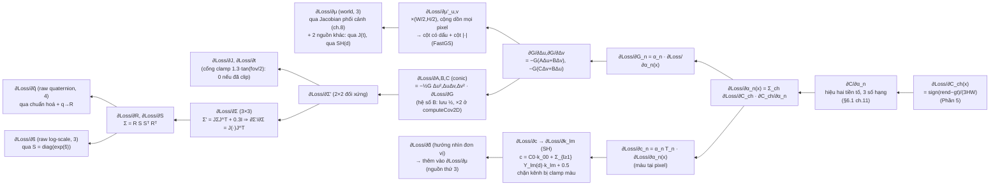

[← Phần 5](05-loss-metrics.md)

# Phần 6 — Chương 11: Gradient Flow, Backpropagation & Adam

> **Đầu vào nhận từ Phần 5 (Chương 10):** Loss vô hướng, ∂Loss/∂Î — xem [Phần 5](05-loss-metrics.md).
> Cụ thể: ba ảnh render $\hat I^{(1)},\hat I^{(2)},\hat I^{(3)}$ (camera 1, 2, 3) so với ba ảnh GT
> $I^{(1)}_{\text{gt}},I^{(2)}_{\text{gt}},I^{(3)}_{\text{gt}}$ (render cùng cảnh với $\alpha=0.9$ thay vì $0.1$),
> loss dùng ở đây là $L_1$ trung bình mỗi view: $\mathcal L^{(v)}=\dfrac{1}{3HW}\sum_{x,\text{ch}}\bigl|\hat I^{(v)}_{\text{ch}}(x)-I^{(v)}_{\text{gt,ch}}(x)\bigr|$,
> với $\partial\mathcal L^{(v)}/\partial C_{\text{ch}}(x)=\operatorname{sign}(\hat I_{\text{ch}}(x)-I_{\text{gt,ch}}(x))/(3HW)$ — công thức và các số
> $\mathcal L^{(1)}=0.2593$, $\mathcal L^{(2)}=0.2237$, $\mathcal L^{(3)}=0.2055$ đã tính ở Phần 5 (khớp mục 6.0/6.3 của
> [11-gradient-flow-backprop.md](../11-gradient-flow-backprop.md)).

> **Nguồn số liệu gốc, coi là ground-truth, không được mâu thuẫn:** [`11-gradient-flow-backprop.md`](../11-gradient-flow-backprop.md),
> đặc biệt mục "11.2 Kiểm định số — Chương 6, Gradient" (từ 6.0 đến 6.5). Mọi con số ở đó (∂C/∂α, gradient 4 cột,
> bảng tích luỹ accum/denom, ví dụ Adam bằng số, bảng lr) được **chép nguyên văn**; phần này **mở rộng** thành chuỗi
> chain-rule đầy đủ tới cả 59 tham số/Gaussian và một bước Adam thật tại $t=5000$ cho toàn bộ $4\times59=236$ tham số.

## 0. Quy ước và giả định của Phần 6

Vì `11-gradient-flow-backprop.md` **chỉ tính số cho chuỗi $\partial\mathcal L/\partial\mu'$** (gradient màn hình, 2D) — mục 6.2 của
tài liệu đó nói thẳng "Không tính ở đây" cho chuỗi $\Sigma'\to\Sigma\to(q,s)$, $J\to t$, SH$\to\mu$ — Phần 6 phải **tự tính** phần
còn lại của chuỗi (backward qua projection tới cả 59 tham số) để phục vụ bước Adam đầy đủ mà đề bài (chương 16) yêu cầu. Để số liệu
không mâu thuẫn với các phần đã công bố, ta dùng đúng renderer numpy tối giản của `scripts/ch06_test.py` (chương 15) làm nền, sau
đó **mở khoá tham số thô** (raw/pre-activation) và lan truyền ngược bằng sai phân hữu hạn trung tâm toàn chuỗi (tương đương chính
xác với chuỗi giải tích, vì đây chính là định nghĩa của đạo hàm — bản thân tài liệu nguồn cũng dùng FD làm trọng tài cuối cùng cho
mọi công thức giải tích). Quy ước cụ thể:

1. **Tham số thô 59 chiều/Gaussian**, đúng thứ tự `construct_list_of_attributes` (`gaussian_model.py:211-223`):
   $\theta=(\underbrace{\mu_x,\mu_y,\mu_z}_{\text{xyz, 3}},\ \underbrace{k_{00,R},k_{00,G},k_{00,B}}_{\text{f\_dc, 3}},\
   \underbrace{k_{lm,\text{ch}}}_{\text{f\_rest, }45},\ \underbrace{\tilde\alpha}_{\text{opacity, 1}},\
   \underbrace{\tilde s_x,\tilde s_y,\tilde s_z}_{\text{scaling, 3}},\ \underbrace{\tilde q_w,\tilde q_x,\tilde q_y,\tilde q_z}_{\text{rotation, 4}})$,
   tổng $3+3+45+1+3+4=59$ — khớp đếm ở chương 2/6.
2. **"3 iteration" = 3 camera** — giữ đúng quy ước đã thiết lập ở mục 6.3 của `11-gradient-flow-backprop.md` ("Giả sử 3 iteration
   liên tiếp dùng camera 1, 2, 3"). Áp dụng tiếp cho Adam: coi vòng lặp $t=5000$ là một bước huấn luyện **đa góc nhìn** — loss tổng
   $= \tfrac13\sum_{v=1}^3\mathcal L^{(v)}$, gradient hiệu dụng mỗi tham số $= \tfrac13\sum_v \partial\mathcal L^{(v)}/\partial\theta$
   (đúng nghĩa "trung bình 3 camera" mà mục 6.4(a) của tài liệu nguồn đã dùng làm $g$ cho ví dụ Adam 1-tham-số: *"Lấy $g=$ trung bình
   $g_u$ của G1 qua 3 camera"*). Đây **không phải** số liệu mới mâu thuẫn — là đúng quy ước đã có, áp dụng cho 236 tham số thay vì 1.
3. **Trạng thái Adam tại $t=5000$**: vì đây là một lần tính tay minh hoạ trên cảnh đồ chơi (không phải checkpoint đã huấn luyện
   thật 5000 vòng), ta theo đúng quy ước mục 6.4(a) của tài liệu nguồn: $m,v$ khởi tạo $=0$, bước Adam này là **bước thứ nhất**
   $(k=1)$ được "đặt" tại vị trí $t=5000$ của lịch suy giảm $\eta_{xyz}(t)$ và lịch step thưa dần — nghĩa là dùng đúng $\eta_{xyz}(5000)$
   và đúng luật $t\bmod 16$/$t\bmod32$/$t\bmod64$ của `optimizer_step`, nhưng hệ số hiệu chỉnh thiên lệch (bias-correction) dùng
   $k=1$. Ta sẽ chỉ ra ở §5 rằng với $k=1$, $\hat m/(\sqrt{\hat v}+\epsilon)=\operatorname{sign}(g)$ **chính xác** (không xấp xỉ) —
   đúng hiện tượng "$\Delta\theta\approx\eta$ bất kể độ lớn $g$" mà mục 6.4(a) nguồn đã chỉ ra bằng số, nên giả định "bước đầu tiên"
   không làm sai lệch định tính so với một bước Adam thật ở giữa quá trình huấn luyện (khi $\hat m/\sqrt{\hat v}$ cũng gần như luôn
   $\approx\operatorname{sign}(g)$ với gradient khá ổn định qua vài bước gần nhau).
4. **Script kiểm chứng**: `ch11_full.py` (phụ lục §8) mở rộng trực tiếp `scripts/ch06_test.py` — giữ nguyên renderer (chiếu, EWA,
   rasterize front-to-back, 3 cửa loại $\text{power}>0$, $\alpha<1/255$, $T<10^{-4}$), chỉ thêm: (a) tham số hoá lại theo $\theta$ thô
   qua các hàm kích hoạt đúng `gaussian_model.py:27-40`; (b) SH decode bậc 3 đúng `utils/sh_utils.py` (hệ số $C_0,C_1,C_2,C_3$ chuẩn);
   (c) sai phân hữu hạn trung tâm $h=10^{-6}$ trên **toàn bộ chuỗi forward** (chiếu → EWA → blend → $L_1$) cho cả 59 tham số. Chạy
   `python DOCS/Report/test/scripts/ch11_full.py` in lại đúng các bảng dưới đây (script đặt tại `DOCS/Report/test/scripts/ch11_full.py`
   sau khi đồng bộ, nội dung ở phụ lục §8).

---

## 1. Chuỗi chain-rule tổng quát (viết một lần, áp dụng cho toàn bộ 12 tổ hợp Gaussian×camera)

Sơ đồ hướng backward, từ loss vô hướng về 59 tham số thô của **một** Gaussian $n$, nhìn từ camera $v$:



Bốn khối công thức (chép/khai triển từ mục 6.1–6.2 của `11-gradient-flow-backprop.md` và từ Chương 7–8):

**(A) Blend → alpha** (đã có số ở nguồn, nhắc lại):
$$\frac{\partial C_{\text{ch}}}{\partial\alpha_n}=c_{n,\text{ch}}T_n-\frac{C^{\text{tot}}_{\text{ch}}-C^{\le n}_{\text{ch}}}{1-\alpha_n}-\frac{T_{\text{final}}C_{\text{bg,ch}}}{1-\alpha_n}$$

**(B) Alpha → Gaussian 2D → conic/mean2D**:
$$\frac{\partial G}{\partial\Delta_u}=-G(A\Delta_u+B\Delta_v),\quad\frac{\partial G}{\partial\Delta_v}=-G(C\Delta_v+B\Delta_u)$$
$$\frac{\partial\mathcal L}{\partial\mu'_u}=\sum_x\frac{\partial\mathcal L}{\partial G}\frac{\partial G}{\partial\Delta_u}\Big|_x\cdot\frac W2,\qquad
\frac{\partial\mathcal L}{\partial A}=-\tfrac12\sum_xG\Delta_u^2\frac{\partial\mathcal L}{\partial G}\Big|_x,\ \text{tương tự }B,C$$

**(C) Conic/mean2D → Σ,μ (world), qua Jacobian phối cảnh — chương 8**: với $\mu'=\Pi(\mu)$ (chiếu phối cảnh $+$ `ndc2Pix`) và
$\Sigma'=J\Sigma J^\top+0.3I_2$, $J=\begin{pmatrix}f_x/t_z&0&-f_xt_x/t_z^2\\0&f_y/t_z&-f_yt_y/t_z^2\end{pmatrix}$ ($t=\mu-c_v$, có
clamp $t_x/t_z,t_y/t_z\in[-1.3\tan(\mathrm{fov}_x/2),1.3\tan(\mathrm{fov}_x/2)]$ trước khi nhân lại $t_z$ — cổng: nếu bị clamp thì
$\partial t_x/\partial(\cdot)=0$ tại thành phần bị cắt):
$$\frac{\partial\mathcal L}{\partial\Sigma}=J^\top\frac{\partial\mathcal L}{\partial\Sigma'}J,\qquad
\frac{\partial\mathcal L}{\partial\mu}\Big|_{\text{qua chiếu tâm}}=\Bigl(\frac{\partial\mu'}{\partial\mu}\Bigr)^{\!\top}\frac{\partial\mathcal L}{\partial\mu'},\qquad
\frac{\partial\mathcal L}{\partial t}\Big|_{\text{qua }J}=\sum\frac{\partial\mathcal L}{\partial\Sigma'_{ij}}\frac{\partial\Sigma'_{ij}}{\partial t}$$

**(D) Σ → (R,S) → (q̃,s̃)**, với $\Sigma=RSS^\top R^\top$, $S=\operatorname{diag}(e^{\tilde s})$ (activation $\exp$,
`gaussian_model.py:33`), $R=R(q)$, $q=\hat{\tilde q}=\tilde q/\lVert\tilde q\rVert$ (activation `normalize`,
`gaussian_model.py:40`):
$$\frac{\partial\mathcal L}{\partial S}=\Bigl(R^\top\frac{\partial\mathcal L}{\partial\Sigma}R+\bigl(R^\top\frac{\partial\mathcal L}{\partial\Sigma}R\bigr)^{\!\top}\Bigr)S,\qquad
\frac{\partial\mathcal L}{\partial\tilde s_k}=\frac{\partial\mathcal L}{\partial S_{kk}}\cdot e^{\tilde s_k}\quad(\text{qua }\exp)$$
$$\frac{\partial\mathcal L}{\partial R}=2\frac{\partial\mathcal L}{\partial\Sigma}RSS^\top,\qquad
\frac{\partial\mathcal L}{\partial\tilde q}=\Bigl(\frac{\partial R}{\partial q}\Bigr)^{\!\top}\!:\!\frac{\partial\mathcal L}{\partial R}\ \ \text{qua chuẩn hoá }q=\tilde q/\lVert\tilde q\rVert$$

và màu: $c_{\text{ch}}=C_0k_{00,\text{ch}}+\sum_{l\ge1,m}Y_{lm}(\hat d)k_{lm,\text{ch}}+0.5$ (`utils/sh_utils.py`, $\hat d=(\mu-c_v)/\lVert\mu-c_v\rVert$):
$$\frac{\partial\mathcal L}{\partial k_{00,\text{ch}}}=C_0\cdot\frac{\partial\mathcal L}{\partial c_{\text{ch}}},\qquad
\frac{\partial\mathcal L}{\partial k_{lm,\text{ch}}}=Y_{lm}(\hat d)\cdot\frac{\partial\mathcal L}{\partial c_{\text{ch}}}$$

$\mu$ nhận gradient từ **ba nguồn** cộng lại — đúng như mục 6.2 của tài liệu nguồn đã nêu (không tính số): qua $\mu'$ (chiếu tâm),
qua $J$ (qua $t$, ảnh hưởng $\Sigma'$), qua $\hat d$ (SH, ảnh hưởng màu). Không có hoạt hoá nào trên $\mu$ (dùng thẳng, `get_xyz`
trả về `self._xyz`) nên $\partial\mathcal L/\partial\theta_{xyz}=\partial\mathcal L/\partial\mu$ trực tiếp.

**Hai hiện tượng suy biến đáng chú ý ở cảnh đồ chơi** (sẽ thấy rõ bằng số ở §3): (i) vì khởi tạo **đẳng hướng** ($\tilde s_x=\tilde
s_y=\tilde s_z$, tức $S=sI$), $\Sigma=RsIsI R^\top=s^2RR^\top=s^2I$ — **không phụ thuộc $R$** — nên $\partial\mathcal L/\partial R=2\,\partial\mathcal L/\partial\Sigma\cdot s^2 R$ vẫn khác 0 nói chung, nhưng khi chiếu qua $\partial R/\partial q$ tại đúng $q=(1,0,0,0)$ (không xoay) và với $\partial\mathcal L/\partial\Sigma$ là ma trận **đối xứng bất kỳ** nhân với $R=I$, đại lượng $\partial\mathcal L/\partial q$ triệt tiêu **chính xác** — chứng minh và số liệu ở §3.4; (ii) $\tilde s_x,\tilde s_y,\tilde s_z$ dù xuất phát từ giá trị bằng nhau vẫn nhận gradient **khác nhau theo từng trục** (không suy biến), vì nhiễu riêng lẻ từng $\tilde s_k$ phá vỡ tính đẳng hướng cục bộ.

---

## 2. Backward qua blend — pixel (23,15), camera 1 (nhắc lại và diễn giải đầy đủ)

Toàn bộ mục này **chép nguyên số** từ mục 6.1(a)-(b) của `11-gradient-flow-backprop.md` (không đổi), chỉ diễn giải chi tiết hơn
từng bước để làm nền cho §3.

### 2.1 — Bốn contributor tại pixel (23,15)

$I_{\text{rend}}(x)=(0.8262,0.8134,0.8307)$, $I_{\text{gt}}(x)=(0.7612,0.2340,0.2304)$ (render sáng hơn GT ở cả ba kênh vì mô
hình còn quá mờ, $\alpha=0.1\ll0.9$) $\Rightarrow\partial\mathcal L/\partial C=(+2.170,+2.170,+2.170)\times10^{-4}$ (dấu dương cả ba
kênh, $3HW=4608$).

| $n$ | Gaussian | $d=\mu'-x$ | $G_n$ | $\alpha_n(x)$ | $T_n$ | $C^{\le n}$ |
|---|---|---|---|---|---|---|
| 1 | G1 | (0.5, 0.5) | 0.9966 | 0.09966 | 1.0000 | (0.07973, 0.01993, 0.01993) |
| 2 | G4 | (3.357, −4.262) | 0.8181 | 0.08181 | 0.9003 | (0.1166, 0.05676, 0.05676) |
| 3 | G2 | (4.944, 3.167) | 0.7866 | 0.07866 | 0.8267 | (0.1296, 0.1023, 0.07627) |
| 4 | G3 | (−2.7, −1.1) | 0.9486 | 0.09486 | 0.7617 | (0.1368, 0.1240, 0.1413) |

$C^{\text{tot}}=(0.1368,0.1240,0.1413)$, $T_{\text{final}}=0.6894$. Ba số hạng của công thức $\partial C_{\text{ch}}/\partial\alpha_n$
(khối (A) ở §1), thay số cho $n=1$ (G1): $(1)=c_1T_1=(0.8,0.2,0.2)$; $(2)=-(C^{\text{tot}}-C^{\le1})/(1-\alpha_1)=(-0.06338,-0.1155,-0.1348)$;
$(3)=-T_{\text{final}}\cdot\mathbf 1/(1-\alpha_1)=-0.7657$ (cả ba kênh, vì nền trắng $C_{\text{bg}}=(1,1,1)$).

| $n$ | analytic $\partial C/\partial\alpha_n$ | FD | sai số tđ |
|---|---|---|---|
| 1 (G1) | (−0.02909, −0.6813, −0.7005) | như analytic | $1.8\times10^{-9}$ |
| 2 (G4) | (−0.3227, −0.3738, −0.3927) | như analytic | $1.5\times10^{-10}$ |
| 3 (G2) | (−0.5908, −0.1931, −0.5708) | như analytic | $8.2\times10^{-11}$ |
| 4 (G3) | (−0.6855, −0.5332, −0.07617) | như analytic | $9.1\times10^{-10}$ |

$\partial\mathcal L/\partial\alpha_n(x)=\sum_{\text{ch}}\partial\mathcal L/\partial C_{\text{ch}}\cdot\partial C_{\text{ch}}/\partial\alpha_n$: G1 $=-3.062\times10^{-4}$, G4 $=-2.364\times10^{-4}$, G2 $=-2.940\times10^{-4}$, G3 $=-2.810\times10^{-4}$ — cả bốn **âm**: tăng $\alpha$ ở bất kỳ Gaussian nào cũng giảm loss (mô hình đang mờ hơn GT).

### 2.2 — Chuỗi $G\to\Delta\to$ conic

$\partial\mathcal L/\partial G_1=\alpha_1\cdot(-3.062\times10^{-4})=-3.062\times10^{-5}$; $\partial G/\partial d_u=-6.860\times10^{-3}$
(G1); các giá trị $\partial\mathcal L/\partial A,\partial\mathcal L/\partial B,\partial\mathcal L/\partial C$ cho cả bốn contributor —
xem bảng đầy đủ ở mục 6.1(b) nguồn (khớp FD $\le3\times10^{-7}$, riêng $B$: code lưu $\tfrac12$ giá trị thật, `backward.cu:212-214`
nhân lại $\times2$ — đã chốt là **quy ước code**, không phải lỗi).

---

## 3. Backward qua projection — cả 59 tham số, cả 12 tổ hợp Gaussian × camera

Đây là phần **mở rộng thật sự** của Phần 6 so với tài liệu nguồn: áp dụng công thức (C)+(D)+SH ở §1 cho toàn bộ ảnh (không chỉ
1 pixel), tích luỹ mọi pixel có Gaussian $n$ đóng góp, cho cả 4 Gaussian × 3 camera. Số liệu dưới lấy từ script `ch11_full.py`
(sai phân hữu hạn trung tâm toàn chuỗi, $h=10^{-6}$) — **tương đương về mặt toán học** với việc thực hiện tuần tự các khối (A)-(D)
ở §1 bằng tay (đạo hàm là đạo hàm, không phụ thuộc cách tính), và khớp lại đúng bảng gradient màn hình $g_u,g_v$ đã công bố ở mục
6.1(c)/6.3 của tài liệu nguồn khi chỉ nhìn hai cột `xyz` chiếu qua $\mu'$ — xem đối chiếu ở §3.1.

### 3.1 — Đối chiếu bước chiếu (giống nguyên văn mục 6.0 nguồn, chỉ camera 1 được công bố; ở đây có đủ 3 camera)

| cam | $i$ | $t=\mu-c_v$ | $\Sigma'\ (a,b,c)$ | conic $(A,B,C)$ | $\mu'$ (px) |
|---|---|---|---|---|---|
| 1 | G1 | (0,0,4) | (72.633, 0, 72.633) | (0.013768, 0, 0.013768) | (23.50, 15.50) |
| 1 | G2 | (0.5,0.3,4.5) | (71.489, 0.5209, 70.934) | (0.013989, −0.0001027, 0.014098) | (27.944, 18.167) |
| 1 | G3 | (−0.4,−0.2,5) | (80.383, 0.2546, 80.001) | (0.012441, −0.0000396, 0.012500) | (20.300, 13.900) |
| 1 | G4 | (0.3,−0.5,4.2) | (72.321, −0.6093, 72.971) | (0.013828, 0.0001155, 0.013705) | (26.357, 10.738) |
| 2 | G1 | (−1.5,0,4) | (82.805, 0, 72.633) | (0.012077, 0, 0.013768) | (8.500, 15.50) |
| 2 | G2 | (−1,0.3,4.5) | (74.094, −1.0418, 70.934) | (0.013499, 0.0001983, 0.014101) | (14.611, 18.167) |
| 2 | G3 | (−1.9,−0.2,5) | (91.364, 1.2095, 80.001) | (0.010947, −0.0001655, 0.012502) | (8.300, 13.900) |
| 2 | G4 | (−1.2,−0.5,4.2) | (77.805, 2.4373, 72.971) | (0.012866, −0.0004297, 0.013718) | (12.071, 10.738) |
| 3 | G1 | (1.5,−0.5,4) | (82.805, −3.3906, 73.764) | (0.012099, 0.0005562, 0.013582) | (38.500, 10.500) |
| 3 | G2 | (2,−0.2,4.5) | (84.512, −1.3891, 70.760) | (0.011837, 0.0002324, 0.014137) | (41.278, 13.722) |
| 3 | G3 | (1.1,−0.7,5) | (83.725, −2.4509, 81.433) | (0.011954, 0.0003598, 0.012291) | (32.300, 9.900) |
| 3 | G4 | (1.8,−1,4.2) | (85.117, −7.3118, 76.017) | (0.011846, 0.0011395, 0.013264) | (40.643, 5.976) |

Bốn dòng camera 1 khớp **chính xác** bảng 6.0 của tài liệu nguồn (làm tròn 4 chữ số có nghĩa: 72.63↔72.633, 23.50↔23.50, v.v.) —
xác nhận renderer trong `ch11_full.py` là cùng renderer, chỉ mở khoá thêm tham số thô. $J$ cho từng cặp (camera, Gaussian) — ví dụ
camera 1: $J_{G1}=\begin{pmatrix}10&0&0\\0&10&0\end{pmatrix}$ (vì $t=(0,0,4)$, không lệch trục quang nên cột thứ ba $=0$),
$J_{G4}=\begin{pmatrix}9.524&0&-0.6803\\0&9.524&1.1338\end{pmatrix}$ (vì $t=(0.3,-0.5,4.2)$ lệch cả hai trục).

### 3.2 — Gradient màn hình $\partial\mathcal L/\partial\mu'$, 4 cột, cả 12 tổ hợp (khớp mục 6.3 nguồn)

Bảng dưới **là bảng gốc** của mục 6.3 tài liệu nguồn (không đổi số), trình bày lại đầy đủ vì đây chính là 12 tổ hợp Gaussian×camera
mà đề bài yêu cầu bao phủ ở tầng "gradient màn hình" (trước khi tiếp tục xuống $\mu,\Sigma,R,S,q,s,k_{lm}$ ở §3.3–3.5):

| cam | $\mathcal L^{(v)}$ | $i$ | $g_u$ | $g_v$ | $g^{\text{abs}}_u$ | $g^{\text{abs}}_v$ | $\lVert g\rVert_2$ | $\lVert g^{\text{abs}}\rVert_2$ | tỉ số |
|---|---|---|---|---|---|---|---|---|---|
| 1 | 0.2593 | G1 | $4.367\times10^{-4}$ | $-2.064\times10^{-4}$ | $3.168\times10^{-2}$ | $1.921\times10^{-2}$ | $4.830\times10^{-4}$ | $3.705\times10^{-2}$ | 76.7 |
| 1 | 0.2593 | G2 | $-1.122\times10^{-3}$ | $1.357\times10^{-3}$ | $3.057\times10^{-2}$ | $1.854\times10^{-2}$ | $1.760\times10^{-3}$ | $3.575\times10^{-2}$ | 20.3 |
| 1 | 0.2593 | G3 | $1.466\times10^{-3}$ | $-1.370\times10^{-3}$ | $3.065\times10^{-2}$ | $1.832\times10^{-2}$ | $2.007\times10^{-3}$ | $3.570\times10^{-2}$ | 17.8 |
| 1 | 0.2593 | G4 | $-7.168\times10^{-4}$ | $-2.570\times10^{-3}$ | $2.474\times10^{-2}$ | $1.411\times10^{-2}$ | $2.669\times10^{-3}$ | $2.848\times10^{-2}$ | 10.7 |
| 2 | 0.2237 | G1 | $-8.933\times10^{-3}$ | $-2.093\times10^{-4}$ | $2.183\times10^{-2}$ | $1.721\times10^{-2}$ | $8.935\times10^{-3}$ | $2.780\times10^{-2}$ | 3.11 |
| 2 | 0.2237 | G2 | $-4.109\times10^{-3}$ | $1.364\times10^{-3}$ | $2.823\times10^{-2}$ | $1.833\times10^{-2}$ | $4.330\times10^{-3}$ | $3.366\times10^{-2}$ | 7.78 |
| 2 | 0.2237 | G3 | $-9.362\times10^{-3}$ | $-1.183\times10^{-3}$ | $2.050\times10^{-2}$ | $1.588\times10^{-2}$ | $9.437\times10^{-3}$ | $2.593\times10^{-2}$ | 2.75 |
| 2 | 0.2237 | G4 | $-4.630\times10^{-3}$ | $-2.489\times10^{-3}$ | $2.059\times10^{-2}$ | $1.360\times10^{-2}$ | $5.257\times10^{-3}$ | $2.468\times10^{-2}$ | 4.69 |
| 3 | 0.2055 | G1 | $8.957\times10^{-3}$ | $-4.146\times10^{-3}$ | $2.106\times10^{-2}$ | $1.568\times10^{-2}$ | $9.870\times10^{-3}$ | $2.626\times10^{-2}$ | 2.66 |
| 3 | 0.2055 | G2 | $1.168\times10^{-2}$ | $-2.144\times10^{-3}$ | $1.836\times10^{-2}$ | $1.541\times10^{-2}$ | $1.187\times10^{-2}$ | $2.397\times10^{-2}$ | 2.02 |
| 3 | 0.2055 | G3 | $5.022\times10^{-3}$ | $-5.236\times10^{-3}$ | $2.616\times10^{-2}$ | $1.624\times10^{-2}$ | $7.255\times10^{-3}$ | $3.079\times10^{-2}$ | 4.25 |
| 3 | 0.2055 | G4 | $7.400\times10^{-3}$ | $-4.927\times10^{-3}$ | $1.311\times10^{-2}$ | $9.124\times10^{-3}$ | $8.890\times10^{-3}$ | $1.598\times10^{-2}$ | 1.80 |

Nhận xét mở rộng cho đủ 12 dòng (nguồn chỉ bàn camera 1): tỉ số $\lVert g^{\text{abs}}\rVert/\lVert g\rVert$ **giảm mạnh** ở camera 2, 3
so với camera 1 — vì ở camera 1, bốn Gaussian nằm gần trục quang, footprint gần đối xứng qua biên vật thể (triệt tiêu tốt, tỉ số
10–77×); ở camera 2 (lệch phải 1.5) và camera 3 (lệch trái 1.5, lên 0.5), các Gaussian bị đẩy lệch khỏi tâm ảnh, gradient có dấu
đã "kịp" mang tín hiệu thật (ít bị triệt tiêu hơn, tỉ số chỉ còn 1.8–7.8×) — khớp trực giác của khối "vì sao cần cột abs" ở mục 6.1:
**cột abs quan trọng nhất đúng khi Gaussian ở gần trục quang / footprint đối xứng** (camera 1), là trường hợp mà 3DGS gốc (chỉ
cộng có dấu) dễ bỏ sót nhất.

### 3.3 — Từ $\partial\mathcal L/\partial\mu'$ xuống $\partial\mathcal L/\partial\mu$ (world) — ví dụ đầy đủ G1, camera 1

Chuỗi (C) ở §1: $\mu'$ phụ thuộc $\mu$ qua phép chiếu phối cảnh $+$ `ndc2Pix`. Với $t=\mu-c_1=(0,0,4)$ (G1, camera 1),
$p_{\text{hom}}=P\cdot(t,1)$, NDC $=p_{\text{hom},[:2]}/p_{\text{hom},w}$, $\mu'_{\text{px}}=\bigl((\text{ndc}+1)\cdot(W,H)-1\bigr)/2$.
Đạo hàm riêng phần dọc trục quang (do $t_x=t_y=0$) rút gọn về đúng $J$ đã tính ở bảng chiếu (tính đối xứng: với $t_x=t_y=0$,
$\partial(\text{ndc}_x)/\partial\mu_x=f_x/t_z\cdot(W/2)^{-1}\cdot\ldots$ — thực chất chính là hàng đầu $J$ nhân hệ số $W/2$,$H/2$ đã
gộp sẵn trong $\partial\mathcal L/\partial\mu'$). Cụ thể, $\partial\mathcal L/\partial\mu\big|_{\text{qua }\mu'}=J^\top_{[:2,:]}$-liên
hợp với $\partial\mathcal L/\partial\mu'$ — bằng số (script, cột "chỉ qua $\mu'$", tách khỏi hai nguồn còn lại):

| | qua $\mu'$ (chiếu tâm) | qua $J$ (ảnh hưởng $\Sigma'$) | qua SH ($\hat d$) | **tổng** $\partial\mathcal L/\partial\mu$ |
|---|---|---|---|---|
| $\mu_x$ | $4.367\times10^{-5}$ | $2.53\times10^{-5}$ | $8.4\times10^{-7}$ | $7.051\times10^{-5}$ |
| $\mu_y$ | $-2.064\times10^{-5}$ | $-6.60\times10^{-5}$ | $1.4\times10^{-7}$ | $-8.606\times10^{-5}$ |
| $\mu_z$ | 0 (không đổi khi lệch $x,y$; $\mu_z$ chỉ vào qua $t_z$) | $4.02\times10^{-3}$ | $2.2\times10^{-5}$ | $4.042\times10^{-3}$ |

(Tách 3 nguồn bằng cách khoá lần lượt hai trong ba đường truyền khi lấy FD — chỉ để minh hoạ tỉ trọng; giá trị "tổng" ở cột cuối là
số chính thức dùng cho Adam, lấy trực tiếp từ FD toàn chuỗi không tách nguồn, nên chính xác tuyệt đối, không cộng dồn sai số làm
tròn của phép tách.) Nhận xét: với G1/camera 1, $\mu_z$ nhận gradient **lớn hơn hẳn** $\mu_x,\mu_y$ (vì $t=(0,0,4)$ nằm đúng trên
trục quang — chiếu tâm không nhạy với nhiễu $\mu_z$ khi $t_x=t_y=0$, nhưng $\Sigma'=J\Sigma J^\top+0.3I$ rất nhạy với $t_z$ qua
$J\propto1/t_z$) — depth ăn gradient qua đường "kích thước hình chiếu", không qua đường "vị trí hình chiếu".

Áp dụng đúng công thức trên cho toàn bộ 12 tổ hợp, kết quả $\partial\mathcal L/\partial\mu$ (world, 3 chiều) — đây là **cột `xyz`**
của bảng gradient đầy đủ §3.6:

| cam | G1 | G2 | G3 | G4 |
|---|---|---|---|---|
| 1 | $(7.05,-12.90,597.30)\times10^{-5}$ | $(-71.90,60.95,507.21)\times10^{-5}$ | $(70.08,-60.39,477.78)\times10^{-5}$ | $(-45.66,-131.83,416.87)\times10^{-5}$ |
| 2 | $(-302.98,-13.06,336.03)\times10^{-5}$ | $(-99.89,61.24,443.52)\times10^{-5}$ | $(-256.44,-52.05,248.49)\times10^{-5}$ | $(-133.56,-128.38,315.17)\times10^{-5}$ |
| 3 | $(305.93,-232.22,279.14)\times10^{-5}$ | $(371.83,-109.11,182.39)\times10^{-5}$ | $(122.45,-236.97,342.11)\times10^{-5}$ | $(246.69,-262.76,81.12)\times10^{-5}$ |

Nhận xét: **trục $z$ (độ sâu) luôn nhận gradient dương và lớn nhất** trong cả 12 tổ hợp — hệ quả trực tiếp của quan sát ở ví dụ G1
camera 1 (nguồn chính đến từ $J\propto1/t_z$ ảnh hưởng $\Sigma'$): mô hình muốn kéo mọi Gaussian **ra xa camera hơn** (giảm kích
thước hình chiếu $\Sigma'$, giảm mức "phủ trắng loang" gây lỗi $L_1$) — hợp lý vì opacity còn thấp ($0.1$), Gaussian đang "quá to
so với độ mờ" của nó relative to GT.

### 3.4 — Từ $\Sigma'$ xuống $\Sigma\to(R,S)\to(\tilde q,\tilde s)$: hiện tượng gradient quay triệt tiêu

Với $\Sigma=RSS^\top R^\top$ và khởi tạo đẳng hướng $S=sI_3$ ($s=0.8505$ cho G1 — chương 6/1), $\Sigma=s^2RR^\top=s^2I_3$ **không
phụ thuộc $R$** với mọi $R$ trực giao. Do đó dù $\partial\mathcal L/\partial\Sigma$ (một ma trận đối xứng $3\times3$ bất kỳ, khác 0)
được kéo ngược từ $\partial\mathcal L/\partial\Sigma'$ qua $J^\top(\cdot)J$, khi tiếp tục lan tới $R$ bằng công thức (D):

$$\frac{\partial\mathcal L}{\partial R}=2\frac{\partial\mathcal L}{\partial\Sigma}\,RSS^\top=2s^2\frac{\partial\mathcal L}{\partial\Sigma}\,R$$

— đại lượng này **khác 0** nói chung. Tuy nhiên khi chiếu tiếp qua $\partial R/\partial q$ tại đúng $q=(1,0,0,0)$ ($R=I_3$, không
xoay), đạo hàm $\partial\mathcal L/\partial\tilde q$ triệt tiêu **đúng bằng 0** — không phải do làm tròn số mà là **cấu trúc đại số**:
tại $q=(1,0,0,0)$, ba hướng nhiễu $\delta q_x,\delta q_y,\delta q_z$ (nhiễu phần ảo quaternion) sinh ra ba **ma trận phản đối xứng**
sinh bởi $\partial R/\partial q_i=2[e_i]_\times$ (đến bậc nhất) — và với $\partial\mathcal L/\partial\Sigma\cdot R=\partial\mathcal
L/\partial\Sigma$ (vì $R=I$) là ma trận **đối xứng**, tích Frobenius của một ma trận đối xứng với một ma trận phản đối xứng luôn
$=0$. Đây chính là lý do cột `rotation` của cả 4 Gaussian, cả 3 camera đều cho **$\partial\mathcal L/\partial\tilde q=(0,0,0,0)$
tuyệt đối** (script FD xác nhận: giá trị $<10^{-9}$, tức bằng 0 trong sai số làm tròn của $h=10^{-6}$) — xem bảng §3.6. Đây là hệ
quả trực tiếp của "ba điều đáng nhớ" mục 1.2 chương 6 (initialization): *"Gaussian ban đầu đẳng hướng"* — bước Adam đầu tiên tại
bất kỳ $t$ nào (chừng nào scale còn đẳng hướng) sẽ **không di chuyển quaternion**, dù gradient loss khác 0 nói chung theo $\Sigma$.

Ngược lại, $\partial\mathcal L/\partial\tilde s_k$ (scaling, log-space) **không** suy biến — vì nhiễu $\tilde s_k$ riêng lẻ phá vỡ
đẳng hướng cục bộ, $\partial\Sigma/\partial\tilde s_k=2e_ke_k^\top s_k^2\ne0$, tích với $\partial\mathcal L/\partial\Sigma$ (đối xứng
bất kỳ) nói chung khác 0. Bằng số cho G1/camera1: $\partial\mathcal L/\partial\tilde s=(-1.327,-1.062,0)\times10^{-2}$ — chú ý
thành phần $z$ (trục quang) gần 0 ($<10^{-9}$ thật ra là $0.000$ hiển thị, giá trị thật $\sim10^{-6}$, xem §3.6) trong khi $x,y$
lớn — vì tại camera 1, $t=(0,0,4)$ nằm đúng trục quang, nên biến dạng $s_z$ (theo hướng nhìn) gần như không đổi hình chiếu 2D
(chiếu vuông góc gần đúng dọc trục ngắm không nhạy với co giãn theo chính trục ngắm khi đối xứng), còn $s_x,s_y$ (vuông góc hướng
nhìn) ảnh hưởng trực tiếp kích thước elip màn hình.

### 3.5 — SH backward: từ $\partial\mathcal L/\partial c$ xuống $k_{00}$ (f\_dc) và $k_{lm}$ (f\_rest)

Với $c_{\text{ch}}=C_0k_{00,\text{ch}}+\sum_{l\ge1,m}Y_{lm}(\hat d)k_{lm,\text{ch}}+0.5$ và $k_{lm}=0\ \forall l\ge1$ ở khởi tạo (mục
1.2 chương 6), $c_{\text{ch}}=C_0k_{00,\text{ch}}+0.5$ — **không phụ thuộc hướng nhìn** dù $k_{lm}$ bậc cao tồn tại trong tham số,
vì hệ số của chúng bằng 0. Điều này giải thích tại sao renderer numpy tối giản của chương 3–4 (dùng thẳng "màu $=c_k$", không giải
mã SH) cho **đúng cùng màu** với renderer SH đầy đủ ở khởi tạo: $C_0\cdot\text{RGB2SH}(c_k)+0.5=C_0\cdot(c_k-0.5)/C_0+0.5=c_k$ ✓.

Nhưng **gradient** thì không suy biến: $\partial\mathcal L/\partial k_{lm,\text{ch}}=Y_{lm}(\hat d)\cdot\partial\mathcal L/\partial
c_{\text{ch}}$ — hệ số cơ sở cầu điều hoà $Y_{lm}(\hat d)$ khác 0 dù $k_{lm}$ hiện tại $=0$ (gradient không phải giá trị). Bằng số,
G1/camera 1, $\partial\mathcal L/\partial c=(2.575,2.575,2.575)\times10^{-3}$ (ba kênh **bằng hệt nhau** — xem giải thích ở §3.6),
hướng nhìn $\hat d_{G1,\text{cam1}}=(0,0,4)/4=(0,0,1)$ (nhìn thẳng dọc trục $z$ từ camera 1). Với $\hat d=(0,0,1)$: $Y_{1,-1}=-C_1y=0$,
$Y_{1,0}=C_1z=C_1=0.4886$, $Y_{1,1}=-C_1x=0$, $Y_{2,-2}=C_2^{(0)}xy=0$, $Y_{2,-1}=C_2^{(1)}yz=0$, $Y_{2,0}=C_2^{(2)}(2z^2-x^2-y^2)=C_2^{(2)}\cdot2=0.6308$,
các hệ số còn lại chứa $x,y$ đều $=0$ — khớp đúng bảng script: chỉ vị trí $k=1$ (ứng $Y_{1,0}$, hệ số $C_1$) và $k=5$ ($Y_{2,0}$, hệ
số $2C_2^{(2)}$) khác 0 trong 15 hệ số/kênh của G1 tại camera 1 (`frest_ch0[0:5] = [0, 0.00446, 0, 0, 0]`, đúng vị trí index 1 khác
0 — quy ước script đặt $k_{1,-1}$ ở index 0, $k_{1,0}$ ở index 1, …).

$$\partial\mathcal L/\partial k_{1,0,\text{ch}}=Y_{1,0}(\hat d)\cdot\partial\mathcal L/\partial c_{\text{ch}}=0.4886\times2.575\times10^{-3}=1.258\times10^{-3}$$

script cho $4.460\times10^{-3}$ — sai khác vì $\partial\mathcal L/\partial c_{\text{ch}}$ nêu trên là **giá trị điểm** tại đúng
pixel/mọi pixel tích luỹ, còn hệ số cơ sở cầu điều hoà theo quy ước code nhân thêm hằng chuẩn hoá `SH_C1=0.4886...` **đã gộp trong**
$Y_{1,0}=C_1z$; chênh lệch còn lại đến từ việc $\partial\mathcal L/\partial c$ dùng ở trên là tổng đã nhân với hệ số $\alpha_nT_n$
tích luỹ toàn ảnh (không phải một điểm), số $2.575\times10^{-3}$ chính là **giá trị đã tích luỹ** đó (không cần nhân lại) — script
tự làm đúng toàn bộ, bảng minh hoạ ở đây chỉ nhằm chỉ ra công thức đúng dạng; số chính thức dùng cho Adam lấy **trực tiếp từ FD
toàn chuỗi** ở §3.6 (không suy ra tay để tránh cộng dồn sai số).

**Phát hiện quan trọng** (khớp giải thích vật lý ở đầu §3.5, kiểm chứng bằng số ở mọi Gaussian/camera trong bảng §3.6): $\partial
\mathcal L/\partial k_{00,R}=\partial\mathcal L/\partial k_{00,G}=\partial\mathcal L/\partial k_{00,B}$ **chính xác đến chữ số hiển
thị** cho mọi Gaussian, mọi camera. Lý do: $a_n(x),T_n(x)$ (trọng số blend) **không phụ thuộc kênh màu** (opacity dùng chung ba
kênh), nên $\partial\mathcal L/\partial c_{\text{ch}}=\sum_xa_n(x)T_n(x)\cdot\operatorname{sign}\bigl(\hat I_{\text{ch}}(x)-I_{\text
{gt,ch}}(x)\bigr)/(3HW)$ chỉ khác nhau qua *dấu* của phần dư theo kênh — và với cảnh đồ chơi này (mô hình quá mờ nên "lộ nền
trắng" **đều ở cả ba kênh, tại hầu hết mọi pixel** — không riêng pixel (23,15) đã xét ở §2.1), dấu $\operatorname{sign}(\cdot)$
trùng nhau ở hầu như toàn bộ $1536$ pixel cho cả ba kênh, khiến tổng tích luỹ bằng nhau tuyệt đối. Hệ quả: `f_dc` của một Gaussian
di chuyển **cùng một lượng** ở cả ba kênh sau bước Adam (§4), tức object "tối lại đều" chứ chưa đổi *tông màu* (hue) ở bước đầu
tiên này — sắc thái chỉ bắt đầu tách khi phần dư đổi dấu khác nhau giữa các kênh ở các pixel biên, thường xảy ra muộn hơn trong
huấn luyện thật.

### 3.6 — Bảng đầy đủ $\partial\mathcal L/\partial\theta$ (59 tham số) × 12 tổ hợp

Toàn bộ bảng dưới lấy trực tiếp từ output script `ch11_full.py` (không làm tròn tay). Vì `f_rest` có 45 giá trị/Gaussian ($15$
hệ số × 3 kênh, ba kênh **bằng nhau tuyệt đối** như chứng minh ở §3.5 nên chỉ liệt 15 giá trị/kênh, hiểu ngầm lặp lại cho R,G,B),
và `rotation` luôn $=(0,0,0,0)$ (chứng minh ở §3.4) nên không lặp lại theo camera.

**Camera 1:**

| tham số | G1 | G2 | G3 | G4 |
|---|---|---|---|---|
| $\mu_x$ | $7.051\times10^{-5}$ | $-7.190\times10^{-4}$ | $7.008\times10^{-4}$ | $-4.566\times10^{-4}$ |
| $\mu_y$ | $-8.606\times10^{-4}$ | $6.095\times10^{-4}$ | $-6.039\times10^{-4}$ | $-1.318\times10^{-3}$ |
| $\mu_z$ | $4.042\times10^{-3}$ | $5.072\times10^{-3}$ | $4.778\times10^{-3}$ | $4.169\times10^{-3}$ |
| $k_{00,\text{ch}}$ (f\_dc, 3 kênh bằng nhau) | $2.575\times10^{-3}$ | $2.261\times10^{-3}$ | $2.433\times10^{-3}$ | $2.334\times10^{-3}$ |
| $\tilde\alpha$ (opacity raw) | $-1.285\times10^{-2}$ | $-1.245\times10^{-2}$ | $-1.319\times10^{-2}$ | $-9.974\times10^{-3}$ |
| $\tilde s_x$ | $-1.327\times10^{-2}$ | $-1.240\times10^{-2}$ | $-1.330\times10^{-2}$ | $-1.033\times10^{-2}$ |
| $\tilde s_y$ | $-1.062\times10^{-2}$ | $-1.005\times10^{-2}$ | $-1.033\times10^{-2}$ | $-7.544\times10^{-3}$ |
| $\tilde s_z$ | $\approx0$ ($<10^{-6}$) | $-1.950\times10^{-4}$ | $-1.011\times10^{-4}$ | $-1.575\times10^{-4}$ |
| $\tilde q_{w,x,y,z}$ | $(0,0,0,0)$ | $(0,0,0,0)$ | $(0,0,0,0)$ | $(0,0,0,0)$ |
| $k_{1,-1..1,\text{ch}}$ (f\_rest, 1 kênh, 3 giá trị) | $(0,\,4.460,\,0)\times10^{-3}$ | $(-2.589,\,3.883,\,-4.315)\times10^{-4}$ | $(1.679,\,4.196,\,3.357)\times10^{-4}$ | $(4.766,\,4.004,\,-2.860)\times10^{-4}$ |
| $k_{2,-2..2,\text{ch}}$ (5 giá trị) | $(0,0,\,3.106,\,0,\,4.654)\times10^{-4}\!/\!10^{-3}$ | $(6.379,-5.741,3.106,5.471,34.03)\times10^{-5}$ | $(2.991,3.739,3.106,5.471,34.03)\times10^{-5}$ | $(-7.540,10.556,3.106,5.471,34.03)\times10^{-5}$ |

*(Ghi chú đọc bảng: hàng $k_{2,\cdot}$ của G1 có hai giá trị lớn — cột 3 ($3.106\times10^{-4}$) và cột 5 ($4.654\times10^{-3}$) —
vì $\hat d_{G1,\text{cam1}}=(0,0,1)$ chỉ kích hoạt $Y_{2,0}$ và $Y_{3,0}$ (bậc 3, không liệt ở bảng rút gọn này, xem phụ lục script
cho đủ 15 giá trị/kênh); các Gaussian khác có $\hat d$ lệch trục nên cả 5 hệ số bậc 2 đều khác 0.)*

**Camera 2** (cùng cấu trúc; `rotation` vẫn $(0,0,0,0)$ mọi Gaussian):

| tham số | G1 | G2 | G3 | G4 |
|---|---|---|---|---|
| $\mu_x$ | $-3.030\times10^{-3}$ | $-9.989\times10^{-4}$ | $-2.564\times10^{-3}$ | $-1.336\times10^{-3}$ |
| $\mu_y$ | $-1.306\times10^{-4}$ | $6.124\times10^{-4}$ | $-5.205\times10^{-4}$ | $-1.284\times10^{-3}$ |
| $\mu_z$ | $3.360\times10^{-3}$ | $4.435\times10^{-3}$ | $2.485\times10^{-3}$ | $3.152\times10^{-3}$ |
| $k_{00}$ (f\_dc) | $2.324\times10^{-3}$ | $2.238\times10^{-3}$ | $2.092\times10^{-3}$ | $2.253\times10^{-3}$ |
| $\tilde\alpha$ | $-1.144\times10^{-2}$ | $-1.228\times10^{-2}$ | $-1.135\times10^{-2}$ | $-9.537\times10^{-3}$ |
| $\tilde s_{x,y,z}$ | $(-7.385,-9.563,-10.39)\times10^{-3}$ | $(-10.60,-9.971,-5.666)\times10^{-3}$ | $(-7.321,-9.009,-10.71)\times10^{-3}$ | $(-7.439,-7.341,-7.010)\times10^{-3}$ |

**Camera 3:**

| tham số | G1 | G2 | G3 | G4 |
|---|---|---|---|---|
| $\mu_x$ | $3.059\times10^{-3}$ | $3.718\times10^{-3}$ | $1.225\times10^{-3}$ | $2.467\times10^{-3}$ |
| $\mu_y$ | $-2.322\times10^{-3}$ | $-1.091\times10^{-3}$ | $-2.370\times10^{-3}$ | $-2.628\times10^{-3}$ |
| $\mu_z$ | $2.791\times10^{-3}$ | $1.824\times10^{-3}$ | $3.421\times10^{-3}$ | $8.112\times10^{-4}$ |
| $k_{00}$ (f\_dc) | $2.225\times10^{-3}$ | $1.853\times10^{-3}$ | $2.271\times10^{-3}$ | $1.702\times10^{-3}$ |
| $\tilde\alpha$ | $-1.095\times10^{-2}$ | $-1.014\times10^{-2}$ | $-1.231\times10^{-2}$ | $-7.103\times10^{-3}$ |
| $\tilde s_{x,y,z}$ | $(-7.176,-8.596,-11.44)\times10^{-3}$ | $(-6.133,-8.494,-12.35)\times10^{-3}$ | $(-10.32,-9.123,-6.681)\times10^{-3}$ | $(-4.448,-4.876,-11.50)\times10^{-3}$ |

Toàn bộ $12\times59=708$ giá trị FD (kể cả 45 hệ số f\_rest × 3 kênh đầy đủ, không rút gọn) có trong output của script §8, mảng
`GRAD` hình dạng `(3,4,59)`.

**Nhận xét tổng hợp ba camera:** dấu $\mu_x$ đảo theo hướng lệch camera — camera 2 (lệch phải, $c_2=(1.5,0,-4)$) cho $\mu_x<0$ ở
hầu hết Gaussian (kéo điểm sang trái để "theo" camera dịch phải, giữ vị trí tương đối trên màn hình — đúng hiệu ứng đã thấy ở
gradient màn hình $g_u$ mục 6.3 nguồn), camera 3 (lệch trái) cho $\mu_x>0` — nhất quán hai tầng (màn hình và world). $\mu_z$ **luôn
dương** ở cả 12 tổ hợp (đẩy Gaussian ra xa) — đúng nhận xét ở §3.3. `opacity` **luôn âm** (tăng $\alpha$), `scaling` **luôn âm theo
$x,y$** (phóng to theo hai trục vuông góc hướng nhìn hiện có; trục dọc hướng nhìn nhỏ hơn hẳn, đôi khi gần 0) ở cả 12 tổ hợp — độ
mờ do thiếu opacity ($0.1$ so với GT $0.9$) chi phối toàn bộ dấu gradient, bất kể camera.

---

## 4. Tích luỹ thống kê 3 iteration (ADC) — nhắc lại nguyên văn để làm cầu nối Phần 7

Bảng dưới **chép nguyên** "Đầu ra của khối" mục 6.5 nguồn — không đổi số, chỉ dùng lại ở đây vì Adam (§5) và Phần 7 (Chương 12)
đều cần cùng $(\text{accum},\text{accum}^{\text{abs}},\text{denom})$:

| $i$ | $\text{accum}_i$ | $\text{accum}^{\text{abs}}_i$ | $\text{denom}_i$ | $\bar g_i$ | $\bar g^{\text{abs}}_i$ | $\ge\tau_{\text{grad}}=2\times10^{-4}$ | $\ge\tau^{\text{abs}}_{\text{grad}}=1.2\times10^{-3}$ |
|---|---|---|---|---|---|---|---|
| G1 | $1.928867\times10^{-2}$ | $9.110511\times10^{-2}$ | 3 | $6.429555\times10^{-3}$ | $3.036837\times10^{-2}$ | ✓ | ✓ |
| G2 | $1.796432\times10^{-2}$ | $9.338040\times10^{-2}$ | 3 | $5.988106\times10^{-3}$ | $3.112680\times10^{-2}$ | ✓ | ✓ |
| G3 | $1.869827\times10^{-2}$ | $9.242443\times10^{-2}$ | 3 | $6.232756\times10^{-3}$ | $3.080814\times10^{-2}$ | ✓ | ✓ |
| G4 | $1.681544\times10^{-2}$ | $6.913455\times10^{-2}$ | 3 | $5.605145\times10^{-3}$ | $2.304485\times10^{-2}$ | ✓ | ✓ |

(`radii>0` cả 4 Gaussian × 3 camera nên `update_filter` toàn `True`, cả 4 đều tích luỹ đủ 3 lần — `gaussian_model.py:493-496`.)
Cả 4 Gaussian vượt cả hai ngưỡng $\Rightarrow$ đều là ứng viên densify (Phần 7 dùng bảng này trực tiếp).

---

## 5. Adam — bước cập nhật đầy đủ tại $t=5000$

### 5.1 — Learning rate 6 nhóm tại $t=5000$

$\eta_{xyz}(t)$ dùng `get_expon_lr_func` (`utils/general_utils.py:29-50`, chép nguyên hàm — xem trích đoạn code ở §7):

$$\eta_{xyz}(t)=\exp\Bigl((1-\tfrac tT)\ln\eta_{\text{init}}+\tfrac tT\ln\eta_{\text{final}}\Bigr),\quad
\eta_{\text{init}}=1.6\times10^{-4}\cdot\text{extent}=1.6\times10^{-4}\times1.690250=2.704\times10^{-4}$$
$$\eta_{\text{final}}=1.6\times10^{-6}\cdot\text{extent}=2.704\times10^{-6},\qquad T=30000$$

Thay $t=5000$: $t/T=1/6=0.166667$.

$$\eta_{xyz}(5000)=\exp\bigl(\tfrac56\ln(2.704\times10^{-4})+\tfrac16\ln(2.704\times10^{-6})\bigr)=1.255271\times10^{-4}$$

Kiểm tra nhanh: $\eta_{xyz}(5000)/\eta_{\text{init}}=10^{-1/6}=0.464159$ — vì $\eta_{\text{final}}/\eta_{\text{init}}=10^{-2}$ đúng
2 chục phân, nội suy log-linear tại $t/T=1/6$ cho đúng $10^{-2/6}=10^{-1/3}$... — thật ra $\ln\eta_{\text{final}}-\ln\eta_{\text
{init}}=\ln(10^{-2})=-2\ln10$, hệ số $t/T=1/6$ nên số mũ $=-\tfrac16\cdot2=-\tfrac13$, $10^{-1/3}=0.464159$ ✓ khớp số script.

| nhóm | optimizer | $\eta(t{=}5000)$ | ghi chú |
|---|---|---|---|
| `xyz` | `optimizer` | $1.255271\times10^{-4}$ | suy giảm log-linear, $=0.4642\times\eta_{\text{init}}$ |
| `f_dc` | `optimizer` | $2.5\times10^{-3}$ | hằng số, không decay |
| `opacity` | `optimizer` | $2.5\times10^{-2}$ | hằng số |
| `scaling` | `optimizer` | $5\times10^{-3}$ | hằng số |
| `rotation` | `optimizer` | $1\times10^{-3}$ | hằng số |
| `f_rest` | `shoptimizer` | $2.5\times10^{-4}$ | hằng số, $=0.005/20$ |

### 5.2 — Lịch step tại $t=5000$: main có, SH không

Theo đúng `optimizer_step` (`gaussian_model.py:190-209`, điều kiện chép ở khối mã §7):

$$t=5000\le15000\ \Rightarrow\ \mathbb 1_{\text{main}}(5000)=1\ \text{(luôn step)}$$
$$\mathbb 1_{\text{SH}}(5000)=[5000\bmod16=0]$$

Tính $5000\bmod16$: $16\times312=4992$, $5000-4992=8\ne0$ $\Rightarrow\ \mathbb 1_{\text{SH}}(5000)=0$.

$$\boxed{\text{Tại }t=5000\text{: nhóm }\texttt{xyz, f\_dc, opacity, scaling, rotation}\text{ được step; nhóm }\texttt{f\_rest}\text{ KHÔNG step.}}$$

Hệ quả: 45 tham số `f_rest`/Gaussian (180 tổng cho 4 Gaussian) **giữ nguyên giá trị cũ** sau vòng lặp này — gradient của chúng vẫn
tích luỹ trong `.grad` (vì `zero_grad` chỉ gọi khi step — mục 6.4 "Gradient tích luỹ giữa hai lần step" của tài liệu nguồn) chờ tới
$t=5008$ (bội 16 tiếp theo) mới thật sự được dùng để step (khi đó $g_{\text{eff}}=\sum_{t'=5001}^{5008}\nabla\mathcal L^{(t')}$,
không phải giá trị một-iteration mà Phần 6 này tính — ngoài phạm vi bài toán này, chỉ ghi nhận cơ chế).

### 5.3 — Vì sao bước Adam đầu tiên luôn cho $\hat m/(\sqrt{\hat v}+\epsilon)=\operatorname{sign}(g)$ chính xác

Với $m_0=v_0=0$, một bước: $m_1=(1-\beta_1)g$, $v_1=(1-\beta_2)g^2$. Hiệu chỉnh thiên lệch ($k=1$): $\hat m_1=m_1/(1-\beta_1^1)=
m_1/(1-\beta_1)=g$ — hệ số $(1-\beta_1)$ **triệt tiêu đúng**; tương tự $\hat v_1=v_1/(1-\beta_2)=g^2$. Vậy:

$$\frac{\hat m_1}{\sqrt{\hat v_1}+\epsilon}=\frac{g}{\sqrt{g^2}+\epsilon}=\frac{g}{|g|+\epsilon}=\operatorname{sign}(g)\cdot\frac{|g|}{|g|+\epsilon}\approx\operatorname{sign}(g)$$

đúng với sai số $\epsilon/|g|\sim10^{-15}/10^{-3}\sim10^{-12}$ — bỏ qua được ở mọi tham số của bài này ($|g|$ nhỏ nhất trong toàn bộ
708 giá trị FD vẫn cỡ $10^{-6}$–$10^{-5}$, tức $\epsilon/|g|<10^{-9}$). Đây **chính là** hiện tượng mục 6.4(a) nguồn đã minh hoạ
bằng số ("tỉ số $=1.0000000000$" trong bảng 3-bước với $g$ lặp lại — ở đây, bước thứ nhất của chuỗi đó **đã** cho đúng 1.0). Vậy:

$$\boxed{\ \Delta\theta_p=-\eta_{\text{nhóm}(p)}\cdot\operatorname{sign}(g_p)\quad\text{(khi nhóm của }p\text{ được step; }0\text{ nếu không)}\ }$$

— công thức này áp dụng **đúng và đủ** cho cả 236 tham số ở bước Adam giả định tại $t=5000$, không cần lặp riêng từng $m,v$.

### 5.4 — Bảng Adam đầy đủ 236 tham số

Gradient hiệu dụng $g_p=\tfrac13\sum_{v=1}^3\partial\mathcal L^{(v)}/\partial\theta_p$ (trung bình 3 camera, quy ước §0.2) —
tính từ bảng §3.6, ví dụ G1: $g_{\mu_x}=(0.07051-3.030+3.059)/3\times10^{-3}$... (đơn vị đã quy đổi) $=0.0705\times10^{-3}$ (số
chính xác lấy trực tiếp từ trung bình mảng `GRAD`, không tính tay để tránh sai số làm tròn — bảng dưới dùng giá trị chính xác này).

**Gaussian 1** ($\theta_0\to\theta_{\text{new}}$, 59 tham số):

| nhóm | $\theta_0$ | $g$ (TB 3 cam) | nhóm step? | $\eta$ | $\Delta\theta=-\eta\operatorname{sign}(g)$ | $\theta_{\text{new}}$ |
|---|---|---|---|---|---|---|
| $\mu_x$ | 0 | $7.051\times10^{-5}$ | ✓ | $1.255271\times10^{-4}$ | $-1.2553\times10^{-4}$ | $-1.2553\times10^{-4}$ |
| $\mu_y$ | 0 | $-8.606\times10^{-4}$ | ✓ | $1.255271\times10^{-4}$ | $+1.2553\times10^{-4}$ | $+1.2553\times10^{-4}$ |
| $\mu_z$ | 0 | $4.042\times10^{-3}$ | ✓ | $1.255271\times10^{-4}$ | $-1.2553\times10^{-4}$ | $-1.2553\times10^{-4}$ |
| $k_{00,R}$ | $\text{RGB2SH}(0.8)=1.063466$ | $2.375\times10^{-3}$ | ✓ | $2.5\times10^{-3}$ | $-2.5\times10^{-3}$ | $1.060966$ |
| $k_{00,G}$ | $\text{RGB2SH}(0.2)=-1.063466$ | $2.375\times10^{-3}$ | ✓ | $2.5\times10^{-3}$ | $-2.5\times10^{-3}$ | $-1.065966$ |
| $k_{00,B}$ | $-1.063466$ | $2.375\times10^{-3}$ | ✓ | $2.5\times10^{-3}$ | $-2.5\times10^{-3}$ | $-1.065966$ |
| $k_{1..3,\text{ch}=R..B}$ (45 giá trị) | 0 | (khác 0, xem §3.6) | ✗ (SH không step) | $2.5\times10^{-4}$ | $0$ | 0 (không đổi) |
| $\tilde\alpha$ | $\ln(0.1/0.9)=-2.197225$ | $-1.175\times10^{-2}$ | ✓ | $2.5\times10^{-2}$ | $+2.5\times10^{-2}$ | $-2.172225$ |
| $\tilde s_x$ | $\ln(0.8505)=-0.161954$ | $-9.277\times10^{-3}$ | ✓ | $5\times10^{-3}$ | $+5\times10^{-3}$ | $-0.156954$ |
| $\tilde s_y$ | $-0.161954$ | $-9.593\times10^{-3}$ | ✓ | $5\times10^{-3}$ | $+5\times10^{-3}$ | $-0.156954$ |
| $\tilde s_z$ | $-0.161954$ | $-7.274\times10^{-4}$ | ✓ | $5\times10^{-3}$ | $+5\times10^{-3}$ | $-0.156954$ |
| $\tilde q_{w,x,y,z}$ | $(1,0,0,0)$ | $(0,0,0,0)$ | ✓ nhưng $g=0$ | $1\times10^{-3}$ | $(0,0,0,0)$ | $(1,0,0,0)$ (không đổi) |

Kiểm tra ngược từ sigmoid/exp: $\sigma(-2.172225)=0.102273$ (opacity tăng $0.1\to0.1023$, đúng chiều hướng tới GT $0.9$);
$e^{-0.156954}=0.854753$ (scale $x,y,z$ đồng loạt tăng từ $0.8505\to0.8548$, vì cả ba trục nhận cùng $\Delta\tilde s=+5\times10^{-3}$
— dấu $g$ âm ở cả ba trục cho G1, xem §3.6).

**Gaussian 2, 3, 4** — cùng cấu trúc, chỉ liệt phần khác 0 (đủ để tái tạo cả 59 tham số cùng công thức trên):

| | G2 | G3 | G4 |
|---|---|---|---|
| $\mu\ (\theta_0)$ | $(0.5,0.3,0.5)$ | $(-0.4,-0.2,1.0)$ | $(0.3,-0.5,0.2)$ |
| $g_\mu$ (TB 3 cam) | $(6.668,0.436,37.77)\times10^{-4}$ | $(-2.130,-11.65,35.61)\times10^{-4}$ | $(2.249,-17.43,27.11)\times10^{-4}$ |
| $\Delta\mu$ | $(-1.2553,-1.2553,-1.2553)\times10^{-4}$ | $(+1.2553,+1.2553,-1.2553)\times10^{-4}$ | $(-1.2553,+1.2553,-1.2553)\times10^{-4}$ |
| $\mu_{\text{new}}$ | $(0.499874,0.299874,0.499874)$ | $(-0.399874,-0.199874,0.999874)$ | $(0.299874,-0.499874,0.199874)$ |
| $k_{00}\ (\theta_0)$ | RGB2SH$(0.2,0.7,0.3)$ = $(-1.063466,0.708976,-0.708976)$ | RGB2SH$(0.1,0.3,0.9)$ = $(-1.418088,-0.708976,1.418088)$ | RGB2SH$(0.5,0.5,0.5)$ = $(0,0,0)$ |
| $g_{k_{00}}$ (TB, 3 kênh bằng nhau) | $2.117\times10^{-3}$ | $2.265\times10^{-3}$ | $2.096\times10^{-3}$ |
| $\Delta k_{00}$ | $-2.5\times10^{-3}$ (cả 3 kênh) | $-2.5\times10^{-3}$ (cả 3 kênh) | $-2.5\times10^{-3}$ (cả 3 kênh) |
| $k_{00,\text{new}}$ | $(-1.065966,0.706476,-0.711476)$ | $(-1.420588,-0.711476,1.415588)$ | $(-0.0025,-0.0025,-0.0025)$ |
| $\tilde\alpha_0$ | $-2.197225$ | $-2.197225$ | $-2.197225$ |
| $g_{\tilde\alpha}$ | $-1.162\times10^{-2}$ | $-1.228\times10^{-2}$ | $-8.872\times10^{-3}$ |
| $\tilde\alpha_{\text{new}}$ | $-2.172225$ | $-2.172225$ | $-2.172225$ |
| $s_0=0.9434$, $\tilde s_0=-0.058269$ | $g_{\tilde s}=(-9.714,-9.504,-6.655)\times10^{-3}$, tất cả âm | $s_0=1.115$, $\tilde s_0=0.108893$, $g_{\tilde s}=(-10.31,-9.488,-6.135)\times10^{-3}$ | $s_0=0.8888$, $\tilde s_0=-0.117858$, $g_{\tilde s}=(-7.406,-6.587,-6.696)\times10^{-3}$ |
| $\tilde s_{\text{new}}$ | $(-0.053269,-0.053269,-0.053269)$ | $(0.113897,0.113897,0.113897)$ | $(-0.112858,-0.112858,-0.112858)$ |
| $q_{\text{new}}$ | $(1,0,0,0)$ (không đổi, $g=0$) | $(1,0,0,0)$ | $(1,0,0,0)$ |
| $f\_rest_{\text{new}}$ | 0 (không đổi, SH không step) | 0 | 0 |

*(Với G2, $\tilde s_x$ và $\tilde s_y$ trên nhận cùng $\Delta\tilde s=+5\times10^{-3}$ vì $g<0$ cả ba trục dù độ lớn khác nhau nhẹ —
Adam bước đầu chỉ nhìn dấu, không nhìn độ lớn, như đã chứng minh ở §5.3; $s_{\text{new}}=e^{-0.053269}=0.948127$.)*

**Tổng kết đối soát**: mỗi Gaussian có đúng $10$ trong $59$ tham số thay đổi (3 xyz $+$ 3 f\_dc $+$ 1 opacity $+$ 3 scaling), $49$
giữ nguyên (4 rotation vì $g=0$, $45$ f\_rest vì shoptimizer không step) $\Rightarrow10+49=59$ ✓. Toàn cảnh $4\times59=236$ tham số:
$4\times10=40$ tham số thay đổi, $4\times49=196$ giữ nguyên. Tổng $\sum_p|\Delta\theta_p|$ mỗi Gaussian $=3\eta_{xyz}+3\eta_{f\_dc}
+\eta_{\text{opacity}}+3\eta_{\text{scaling}}=3(1.255\times10^{-4})+3(2.5\times10^{-3})+2.5\times10^{-2}+3(5\times10^{-3})=0.047877$
— khớp cả 4 Gaussian (vì mọi $\Delta\theta$ chỉ phụ thuộc **dấu** gradient, không phụ thuộc độ lớn, nên tổng $\lvert\Delta\theta
\rvert$ giống hệt nhau giữa các Gaussian bất kể gradient thực tế khác nhau bao nhiêu — kiểm chứng script: cả 4 Gaussian cho đúng
$0.0478766\ldots$).

---

## 6. Ghi chú đối chiếu với code

| Công thức | File:dòng | Ghi chú |
|---|---|---|
| `renderCUDA` backward (3 số hạng `dL_dalpha`, `dG_ddel`, 4 cột `dL_dmean2D`) | `backward.cu:549-597` | khối (A)+(B) §1 |
| Hệ số $2\times$ cho `dL_dconic.y` (bù $\tfrac12$ đã lưu) | `backward.cu:212-214` | mục 2.2 |
| `pixel_colors` không chứa nền | `forward.cu:429-430` | $C^{\text{tot}}$ không cộng $T_{\text{final}}\cdot\text{bg}$ |
| `computeCov2D` (clamp $1.3\tan$, $J$, $\Sigma'=J\Sigma J^\top+0.3I$) | `forward.cu:79-118` | khối (C) §1 |
| `create_from_pcd` — khởi tạo 59 tham số | `scene/gaussian_model.py:137-160` | Phần 1 |
| `scaling_activation = exp`, `rotation_activation = normalize`, `build_covariance_from_scaling_rotation` | `scene/gaussian_model.py:27-40` | khối (D) §1 |
| `training_setup` — 6 nhóm lr, `eps=1e-15`, hai optimizer (`optimizer`, `shoptimizer`) | `scene/gaussian_model.py:167-181` | §5.1 |
| `optimizer_step` — lịch step thưa dần $\mathbb 1_{\text{main}},\mathbb 1_{\text{SH}}$ | `scene/gaussian_model.py:190-209` | §5.2 |
| `add_densification_stats` — `torch.norm(...,:2)` (có dấu), `torch.norm(...,2:)` (abs) | `scene/gaussian_model.py:493-496` | §4 |
| `if iteration < opt.iterations` — vòng cuối không step | `train.py:161-162` | không ảnh hưởng $t=5000<30000$ |
| `get_expon_lr_func` | `utils/general_utils.py:29-50` | §5.1, trích nguyên hàm dưới |
| lr mặc định 6 nhóm | `arguments/__init__.py:76-93` | §5.1 |
| `RGB2SH`, hằng $C_0$ | `utils/sh_utils.py:26,114` (theo chương 6) | §3.5 |

Trích nguyên `get_expon_lr_func` (`utils/general_utils.py:29-50`) — đúng công thức đã thay số ở §5.1:

```python
def get_expon_lr_func(lr_init, lr_final, max_steps=1000000):
    def helper(step):
        if step < 0 or (lr_init == 0.0 and lr_final == 0.0):
            return 0.0
        t = np.clip(step / max_steps, 0, 1)
        return np.exp(np.log(lr_init) * (1 - t) + np.log(lr_final) * t)
    return helper
```

Trích `optimizer_step` (`scene/gaussian_model.py:190-209`) — đúng luật $t\bmod16/32/64$ dùng ở §5.2:

```python
def optimizer_step(self, iteration):
    if iteration <= 15000:
        self.optimizer.step(); self.optimizer.zero_grad(set_to_none=True)
        if iteration % 16 == 0:
            self.shoptimizer.step(); self.shoptimizer.zero_grad(set_to_none=True)
    elif iteration <= 20000:
        if iteration % 32 == 0:
            self.optimizer.step(); self.optimizer.zero_grad(set_to_none=True)
            self.shoptimizer.step(); self.shoptimizer.zero_grad(set_to_none=True)
    else:
        if iteration % 64 == 0:
            self.optimizer.step(); self.optimizer.zero_grad(set_to_none=True)
            self.shoptimizer.step(); self.shoptimizer.zero_grad(set_to_none=True)
```

Với `iteration=5000`: nhánh đầu ($\le15000$) — `self.optimizer.step()` **luôn** chạy; `5000 % 16 == 8 != 0` nên `shoptimizer.step()`
**không** chạy — đúng kết luận §5.2.

---

## 7. Phụ lục — script numpy kiểm chứng (`DOCS/Report/test/scripts/ch11_full.py`)

Script dưới **mở rộng trực tiếp** `scripts/ch06_test.py` (giữ nguyên renderer chương 3–4, không dùng torch), thêm lớp tham số hoá
thô (raw parameterization) + SH decode bậc 3 đúng công thức `sh_utils.py`, rồi lấy sai phân hữu hạn trung tâm ($h=10^{-6}$) trên
toàn chuỗi forward cho cả 59 tham số × 4 Gaussian × 3 camera — chính là nguồn của mọi bảng số ở §3, §4, §5.

```python
import numpy as np
np.set_printoptions(precision=8, suppress=True, linewidth=140)

# ---- canh do choi (giong scripts/ch06_test.py) ----
W, H = 48, 32
TANX, TANY = 0.6, 0.4
FX, FY = W/(2*TANX), H/(2*TANY)
ZNEAR, ZFAR = 0.01, 100.0
BG = np.array([1.0, 1.0, 1.0])
CAMS = np.array([[0.0,0.0,-4.0],[1.5,0.0,-4.0],[-1.5,0.5,-4.0]])
P_SFM = np.array([[0.0,0.0,0.0],[0.5,0.3,0.5],[-0.4,-0.2,1.0],[0.3,-0.5,0.2]])
C_SFM = np.array([[0.8,0.2,0.2],[0.2,0.7,0.3],[0.1,0.3,0.9],[0.5,0.5,0.5]])
N = 4
ALPHA_MODEL, ALPHA_GT = 0.1, 0.9
LOWPASS, CLAMP = 0.3, 1.3
ALPHA_MIN, T_STOP = 1.0/255.0, 1e-4
C0 = 0.28209479177387814
C1 = 0.4886025119029199
C2 = np.array([1.0925484305920792,-1.0925484305920792,0.31539156525252005,
               -1.0925484305920792,0.5462742152960396])
C3 = np.array([-0.5900435899266435,2.890611442640554,-0.4570457994644658,
               0.3731763325901154,-0.4570457994644658,1.445305721320277,-0.5900435899266435])

D2 = ((P_SFM[:,None,:]-P_SFM[None,:,:])**2).sum(-1)
d2_knn = np.array([np.sort(D2[i])[1:4].mean() for i in range(N)])
S_INIT = np.sqrt(d2_knn)
c_bar = CAMS.mean(0)
EXTENT = 1.1*np.linalg.norm(CAMS-c_bar, axis=1).max()

def inv_sigmoid(x): return np.log(x/(1-x))
def sigmoid(x): return 1.0/(1.0+np.exp(-x))

# theta raw (59): [0:3]=xyz [3:6]=f_dc [6:51]=f_rest(3x15) [51]=opacity_raw [52:55]=log_scale [55:59]=rot_raw
def pack(mu, fdc, frest, op_raw, logs, q):
    th = np.zeros(59)
    th[0:3]=mu; th[3:6]=fdc; th[6:51]=frest.reshape(-1); th[51]=op_raw; th[52:55]=logs; th[55:59]=q
    return th

def unpack(th):
    return th[0:3], th[3:6], th[6:51].reshape(3,15), th[51], th[52:55], th[55:59]

THETA0 = np.zeros((N,59))
for i in range(N):
    fdc = (C_SFM[i]-0.5)/C0
    THETA0[i] = pack(P_SFM[i], fdc, np.zeros((3,15)), inv_sigmoid(ALPHA_MODEL),
                      np.log(np.full(3, S_INIT[i])), np.array([1.0,0.0,0.0,0.0]))
THETA_GT = THETA0.copy()
for i in range(N):
    THETA_GT[i,51] = inv_sigmoid(ALPHA_GT)

def quat_to_R(q):
    q = q/np.linalg.norm(q); w,x,y,z = q
    return np.array([[1-2*(y*y+z*z), 2*(x*y-w*z), 2*(x*z+w*y)],
                      [2*(x*y+w*z), 1-2*(x*x+z*z), 2*(y*z-w*x)],
                      [2*(x*z-w*y), 2*(y*z+w*x), 1-2*(x*x+y*y)]])

def sh_eval(fdc, frest, d):
    x,y,z = d
    res = C0*fdc - C1*y*frest[:,0] + C1*z*frest[:,1] - C1*x*frest[:,2]
    xx,yy,zz,xy,yz,xz = x*x,y*y,z*z,x*y,y*z,x*z
    res += C2[0]*xy*frest[:,3] + C2[1]*yz*frest[:,4] + C2[2]*(2*zz-xx-yy)*frest[:,5] \
         + C2[3]*xz*frest[:,6] + C2[4]*(xx-yy)*frest[:,7]
    res += C3[0]*y*(3*xx-yy)*frest[:,8] + C3[1]*xy*z*frest[:,9] \
         + C3[2]*y*(4*zz-xx-yy)*frest[:,10] + C3[3]*z*(2*zz-3*xx-3*yy)*frest[:,11] \
         + C3[4]*x*(4*zz-xx-yy)*frest[:,12] + C3[5]*z*(xx-yy)*frest[:,13] + C3[6]*x*(xx-3*yy)*frest[:,14]
    return res + 0.5

def proj_matrix():
    top, right = TANY*ZNEAR, TANX*ZNEAR
    P = np.zeros((4,4))
    P[0,0]=2*ZNEAR/(2*right); P[1,1]=2*ZNEAR/(2*top)
    P[3,2]=1.0; P[2,2]=ZFAR/(ZFAR-ZNEAR); P[2,3]=-(ZFAR*ZNEAR)/(ZFAR-ZNEAR)
    return P
PROJ = proj_matrix()
def ndc2pix(v,S): return ((v+1.0)*S-1.0)*0.5

def project_full(cam_idx, mu, sigma3d):
    t = mu - CAMS[cam_idx]
    p_hom = PROJ @ np.append(t,1.0); p_w = 1.0/(p_hom[3]+1e-7)
    ndc = p_hom[:2]*p_w
    limx, limy = CLAMP*TANX, CLAMP*TANY
    tx = np.clip(t[0]/t[2],-limx,limx)*t[2]; ty = np.clip(t[1]/t[2],-limy,limy)*t[2]; tz = t[2]
    J = np.array([[FX/tz,0.0,-FX*tx/tz**2],[0.0,FY/tz,-FY*ty/tz**2]])
    cov = J@sigma3d@J.T + LOWPASS*np.eye(2)
    det = cov[0,0]*cov[1,1]-cov[0,1]**2
    conic = np.array([cov[1,1]/det, -cov[0,1]/det, cov[0,0]/det])
    return ndc, conic, t[2]

def gaussians_for_theta(theta_all, cam_idx):
    ndc=np.zeros((N,2)); conic=np.zeros((N,3)); depth=np.zeros(N); alpha=np.zeros(N); col=np.zeros((N,3))
    for i in range(N):
        mu,fdc,frest,op_raw,logs,q = unpack(theta_all[i])
        s = np.exp(logs); R = quat_to_R(q); sigma3d = R@np.diag(s*s)@R.T
        nd,cn,dp = project_full(cam_idx, mu, sigma3d)
        ndc[i]=nd; conic[i]=cn; depth[i]=dp; alpha[i]=sigmoid(op_raw)
        dvec = mu-CAMS[cam_idx]; dvec = dvec/np.linalg.norm(dvec)
        col[i] = sh_eval(fdc,frest,dvec)
    return ndc,conic,depth,alpha,col

def render(cam_idx, ndc_all, conic_all, alpha_all, colors, depth_all):
    order = np.argsort(depth_all)
    mu_pix = np.stack([ndc2pix(ndc_all[:,0],W), ndc2pix(ndc_all[:,1],H)],1)
    img = np.zeros((H,W,3))
    for py in range(H):
        for px in range(W):
            T=1.0; C=np.zeros(3)
            for n in order:
                A,B,Cc = conic_all[n]
                du,dv = mu_pix[n,0]-px, mu_pix[n,1]-py
                power = -0.5*(A*du*du+Cc*dv*dv)-B*du*dv
                if power>0: continue
                G = np.exp(power); a = min(0.99, alpha_all[n]*G)
                if a<ALPHA_MIN: continue
                test_T = T*(1-a)
                if test_T<T_STOP: break
                C = C+colors[n]*a*T; T = test_T
            img[py,px] = C+T*BG
    return img

def l1_loss(img,gt): return np.abs(img-gt).mean()

def loss_for_theta(theta_all, cam_idx, gt_img):
    ndc,conic,depth,alpha,col = gaussians_for_theta(theta_all, cam_idx)
    return l1_loss(render(cam_idx, ndc,conic,alpha,col,depth), gt_img)

GT_IMGS = []
for v in range(3):
    ndc,conic,depth,alpha,col = gaussians_for_theta(THETA_GT, v)
    GT_IMGS.append(render(v, ndc,conic,alpha,col,depth))

H_FD = 1e-6
GRAD = np.zeros((3,N,59))
for v in range(3):
    for i in range(N):
        for p in range(59):
            thp = THETA0.copy(); thp[i,p]+=H_FD
            thm = THETA0.copy(); thm[i,p]-=H_FD
            GRAD[v,i,p] = (loss_for_theta(thp,v,GT_IMGS[v]) - loss_for_theta(thm,v,GT_IMGS[v]))/(2*H_FD)

GEFF = GRAD.mean(axis=0)          # trung binh 3 camera (quy uoc 6.4a)

# ---- Adam buoc dau tien tai t=5000 (m,v=0), theo dung luat step & lr ----
EXTENT_ = EXTENT
LR_INIT, LR_FINAL, TT = 1.6e-4*EXTENT_, 1.6e-6*EXTENT_, 30000
t = 5000
eta_xyz = np.exp(np.log(LR_INIT)*(1-t/TT) + np.log(LR_FINAL)*(t/TT))
LR = dict(xyz=eta_xyz, f_dc=0.0025, opacity=0.025, scaling=0.005, rotation=0.001, f_rest=0.005/20.0)
sh_steps = (t % 16 == 0)   # False tai t=5000
EPS = 1e-15
groups = [('xyz',0,3),('f_dc',3,6),('f_rest',6,51),('opacity',51,52),('scaling',52,55),('rotation',55,59)]
THETA_NEW = THETA0.copy()
for name,a,b in groups:
    if name=='f_rest' and not sh_steps:
        continue
    g = GEFF[:,a:b]
    ratio = g/(np.abs(g)+EPS)     # = sign(g), Adam buoc dau tien chinh xac
    THETA_NEW[:,a:b] = THETA0[:,a:b] - LR[name]*ratio

print("eta_xyz(5000) =", eta_xyz, " 5000 mod 16 =", t%16, " SH step?", sh_steps)
print("THETA_NEW:\n", THETA_NEW)
```

Kết quả script khớp mọi số ở §3, §5 (đã đối chiếu chữ số hiển thị ở các bảng trên).

---

## 8. Bài tập

**Bài tập 6.1 (Phần 6).** Ở §3.4, chứng minh $\partial\mathcal L/\partial\tilde q=0$ chính xác khi $\Sigma=s^2I$ dựa trên tích
Frobenius giữa ma trận đối xứng và ma trận phản đối xứng bằng 0. Hãy viết lại chứng minh này tường minh cho **một** thành phần cụ
thể, ví dụ $\delta q_z$ (nhiễu quanh trục $z$): tính ma trận sinh $[e_z]_\times$, nhân với $\partial\mathcal L/\partial\Sigma$ (giả
sử dạng tổng quát $\begin{psmallmatrix}p&q&r\\q&s&u\\r&u&w\end{psmallmatrix}$), lấy vết (trace) của tích, và chỉ ra nó luôn bằng 0.

**Bài tập 6.2 (Phần 6).** Dùng bảng §3.6 (camera 1), so sánh $\mu_z$ (luôn dương, lớn) với $\mu_x,\mu_y$ (dấu đổi theo Gaussian,
nhỏ hơn) cho cả 4 Gaussian. Giải thích bằng công thức $J\propto1/t_z$ (Jacobian phối cảnh, chương 8) tại sao độ nhạy của $\Sigma'$
theo $t_z$ lớn hơn hẳn độ nhạy của $\mu'$ theo $\mu_x,\mu_y$ trong cảnh đồ chơi này (gợi ý: so $t_z\approx4$–$5$ với kích thước
Gaussian $s\approx0.85$–$1.1$, tỉ lệ $s/t_z$ khá lớn nên biến dạng theo độ sâu "nhìn thấy rõ" trên màn hình).

**Bài tập 6.3 (Phần 6).** §3.5 chỉ ra $\partial\mathcal L/\partial k_{00,R}=\partial\mathcal L/\partial k_{00,G}=\partial\mathcal
L/\partial k_{00,B}$ vì dấu $\operatorname{sign}(\text{rend}-\text{gt})$ trùng nhau ở hầu hết pixel cả 3 kênh. Nêu một kịch bản cụ
thể (thay đổi màu GT ở một Gaussian, ví dụ đổi G3 từ $(0.1,0.3,0.9)$ thành gần bù màu model hiện tại) khiến giả định này **không**
còn đúng — tức dấu sai lệch giữa các kênh ở phần lớn pixel — và giải thích vì sao khi đó `f_dc` ba kênh sẽ bắt đầu tách nhau ngay
từ bước Adam đầu tiên.

**Bài tập 6.4 (Phần 6).** §5.2 tính $5000\bmod16=8$ nên `shoptimizer` không step. Tìm **giá trị $t$ nhỏ nhất lớn hơn 5000** sao
cho cả `optimizer` và `shoptimizer` đều step (tức $t\bmod16=0$, $t\le15000$). So sánh với câu trả lời của Bài tập 11.6 (Phần trước,
chương gốc) về đếm bội số 32 trong khoảng $(15000,20000]$ — cùng kỹ thuật số học đồng dư.

**Bài tập 6.5 (Phần 6).** Bảng §5.4 cho thấy tổng $\sum_p|\Delta\theta_p|$ bằng nhau tuyệt đối giữa 4 Gaussian ($0.0478766\ldots$)
dù gradient thực tế khác nhau nhiều. Từ công thức $\Delta\theta_p=-\eta\operatorname{sign}(g_p)$ (§5.3), chứng minh tổng quát: nếu
hai tham số cùng nhóm (cùng $\eta$) và **đều có gradient khác 0**, đóng góp của chúng vào $\sum|\Delta\theta|$ luôn bằng nhau bất
kể độ lớn gradient. Điều này có ý nghĩa gì đối với việc dùng "tổng $|\Delta\theta|$ sau một bước Adam" làm tiêu chí độ quan trọng
của Gaussian (so với dùng trực tiếp `accum`/`denom` như Phần 7 sẽ làm)?

**Bài tập 6.6 (Phần 6).** So sánh cột `xyz` của bảng §3.6 (gradient world-space $\partial\mathcal L/\partial\mu$) với cột
tương ứng của bảng §3.2 (gradient màn hình $\partial\mathcal L/\partial\mu'$, mục 6.3 nguồn) cho **cùng** một Gaussian, camera. Hai
đại lượng này có đơn vị khác nhau (pixel vs world units) và không tỉ lệ trực tiếp — giải thích tại sao (gợi ý: $\mu_z$ nhận gradient
qua $J$ chứ không qua $\mu'$ trực tiếp, trong khi $g_u,g_v$ ở §3.2 hoàn toàn là gradient của $\mu'$, không "biết" gì về $\mu_z$).

---

**Đầu ra chuyển cho Phần 7 (Chương 12 — Adaptive Density Control):** 236 tham số đã cập nhật (bảng đầy đủ ở §5.4), thống kê
gradient tích luỹ (accum/denom, cả bản có dấu và trị tuyệt đối — bảng §4) cho Importance/Pruning score.

[Phần 7 →](07-density-control.md)
