# Từ phương trình Laplace đến công thức màu trong 3D Gaussian Splatting

## Phần I — Phương trình Laplace và sự ra đời của $Y_l^m$

### 1.1. Xuất phát điểm

Trong không gian 3 chiều, hàm điều hòa (harmonic function) $\Phi(x,y,z)$ thỏa:
$$\nabla^2\Phi = \frac{\partial^2\Phi}{\partial x^2}+\frac{\partial^2\Phi}{\partial y^2}+\frac{\partial^2\Phi}{\partial z^2}=0$$

**Mô phỏng matplotlib** — kiểm chứng số học trên lưới 2D (lát cắt z=const): $\Phi=x^2-y^2$ thỏa $\nabla^2\Phi\approx0$, còn $\Phi=x^2+y^2$ thì không.

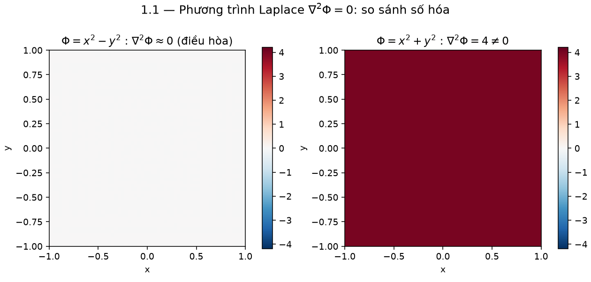

```python
# fig_1_1_laplace_3d() trong sh_figures/sh_visualize.py
def laplacian_xy(f, X, Y, z, h):
    fx2 = (f(X+h,Y,z) - 2*f(X,Y,z) + f(X-h,Y,z)) / h**2
    fy2 = (f(X,Y+h,z) - 2*f(X,Y,z) + f(X,Y-h,z)) / h**2
    return fx2 + fy2

f_harm = lambda X, Y, z: X**2 - Y**2      # nabla^2 = 0
f_not  = lambda X, Y, z: X**2 + Y**2      # nabla^2 = 4
```

Chuyển sang tọa độ cầu $(r,\theta,\phi)$ với $x=r\sin\theta\cos\phi,\ y=r\sin\theta\sin\phi,\ z=r\cos\theta$:

$$\nabla^2\Phi=\frac{1}{r^2}\frac{\partial}{\partial r}\!\left(r^2\frac{\partial\Phi}{\partial r}\right)+\frac{1}{r^2\sin\theta}\frac{\partial}{\partial\theta}\!\left(\sin\theta\frac{\partial\Phi}{\partial\theta}\right)+\frac{1}{r^2\sin^2\theta}\frac{\partial^2\Phi}{\partial\phi^2}=0$$

**Mô phỏng matplotlib** — lưới tọa độ cầu $(\theta,\phi)$ trên mặt cầu đơn vị và các hệ số $\sin\theta,\cos\theta$ xuất hiện trong toán tử Laplace cầu:

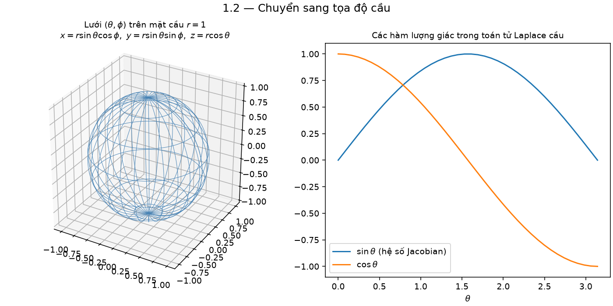

```python
# fig_1_2_spherical_transform()
theta = np.linspace(0, np.pi, 40); phi = np.linspace(0, 2*np.pi, 80)
THETA, PHI = np.meshgrid(theta, phi)
X = np.sin(THETA)*np.cos(PHI); Y = np.sin(THETA)*np.sin(PHI); Z = np.cos(THETA)
ax.plot_wireframe(X, Y, Z)
```

### 1.2. Tách biến (separation of variables)

Giả sử $\Phi(r,\theta,\phi)=R(r)\,\Theta(\theta)\,\Phi_m(\phi)$. Nhân cả phương trình với $r^2/(R\Theta\Phi_m)$:

$$\underbrace{\frac{1}{R}\frac{d}{dr}\!\left(r^2\frac{dR}{dr}\right)}_{\text{chỉ phụ thuộc }r}+\underbrace{\frac{1}{\Theta\sin\theta}\frac{d}{d\theta}\!\left(\sin\theta\frac{d\Theta}{d\theta}\right)+\frac{1}{\Phi_m\sin^2\theta}\frac{d^2\Phi_m}{d\phi^2}}_{\text{chỉ phụ thuộc }\theta,\phi}=0$$

Vì hai nhóm phụ thuộc biến độc lập, mỗi nhóm phải bằng hằng số đối nhau. Đặt hằng số phân ly là $l(l+1)$:

$$\frac{d}{dr}\!\left(r^2\frac{dR}{dr}\right)=l(l+1)R \quad\Rightarrow\quad R(r)=Ar^l+\frac{B}{r^{l+1}}$$

Phần góc:
$$\frac{1}{\sin\theta}\frac{d}{d\theta}\!\left(\sin\theta\frac{d\Theta}{d\theta}\right)+\left[l(l+1)-\frac{1}{\sin^2\theta}\cdot\left(-\frac{1}{\Phi_m}\frac{d^2\Phi_m}{d\phi^2}\right)\right]\Theta=0$$

**Mô phỏng matplotlib** — hai nhánh nghiệm bán kính $R(r)=Ar^l$ (hữu hạn tại gốc) và $R(r)=B/r^{l+1}$ (hữu hạn tại vô cực) cho từng bậc $l$:

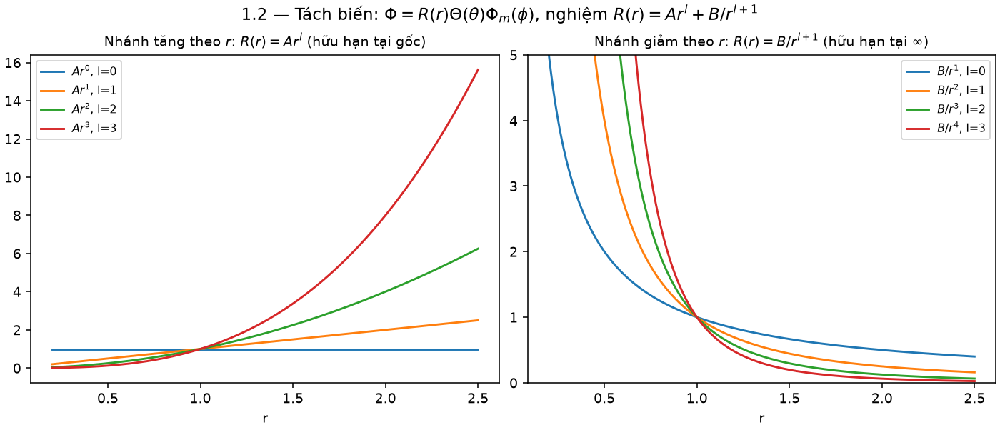

```python
# fig_1_2b_separation_and_radial()
r = np.linspace(0.2, 2.5, 200)
for l in range(4):
    plt.plot(r, r**l)                 # nhanh A r^l
    plt.plot(r, 1/r**(l+1))           # nhanh B / r^(l+1)
```

### 1.3. Tách tiếp phần phương vị $\phi$

Đặt $-\dfrac{1}{\Phi_m}\dfrac{d^2\Phi_m}{d\phi^2}=m^2$ (hằng số tách thứ hai). Nghiệm tuần hoàn chu kỳ $2\pi$ đòi hỏi $m\in\mathbb{Z}$:

$$\Phi_m(\phi)=e^{im\phi}$$

**Mô phỏng matplotlib** — phần thực $\cos(m\phi)$ và quỹ đạo $e^{im\phi}$ trên vòng tròn đơn vị cho các $m$ nguyên:

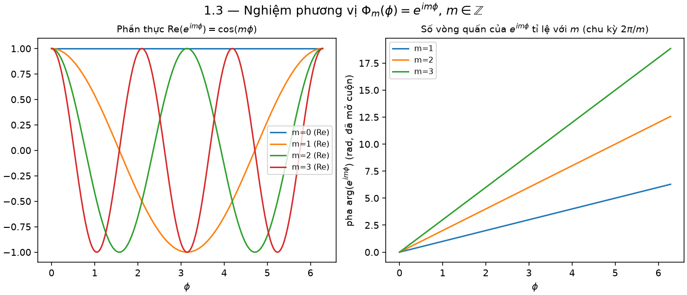

```python
# fig_1_3_azimuthal()
phi = np.linspace(0, 2*np.pi, 400)
for m in [0, 1, 2, 3]:
    plt.plot(phi, np.cos(m*phi))          # Re(e^{i m phi})
    plt.plot(np.cos(m*phi), np.sin(m*phi))  # quy dao phuc
```

### 1.4. Phương trình Legendre liên kết

Thế $x=\cos\theta$, phương trình còn lại cho $\Theta$ trở thành **phương trình Legendre liên kết**:

$$\frac{d}{dx}\!\left[(1-x^2)\frac{d\Theta}{dx}\right]+\left[l(l+1)-\frac{m^2}{1-x^2}\right]\Theta=0$$

Nghiệm hữu hạn tại $x=\pm1$ (cực Bắc/Nam) chỉ tồn tại khi $l=0,1,2,\dots$ và $m=-l,\dots,l$ nguyên. Nghiệm là **hàm Legendre liên kết**:

$$P_l^m(x)=(-1)^m(1-x^2)^{m/2}\frac{d^m}{dx^m}P_l(x),\qquad P_l(x)=\frac{1}{2^l l!}\frac{d^l}{dx^l}(x^2-1)^l$$

($P_l$ là đa thức Legendre thường — trường hợp $m=0$).

**Mô phỏng matplotlib** — đa thức Legendre $P_l(x)$, $l=0..5$, và hàm Legendre liên kết $P_3^m(x)$, $m=0..3$:

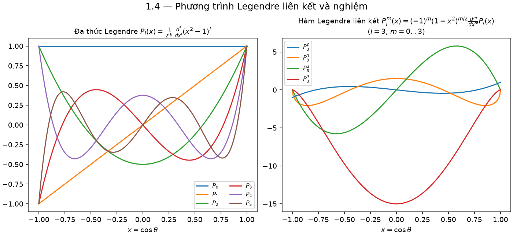

```python
# fig_1_4_legendre()
from scipy.special import eval_legendre, assoc_legendre_p
x = np.linspace(-1, 1, 400)
for l in range(6):
    plt.plot(x, eval_legendre(l, x))              # P_l(x)
for m in range(4):
    plt.plot(x, assoc_legendre_p(3, m, x))         # P_3^m(x)
```

### 1.5. Ghép lại: định nghĩa $Y_l^m$

$$\boxed{Y_l^m(\theta,\phi)=\sqrt{\frac{2l+1}{4\pi}\frac{(l-m)!}{(l+m)!}}\;P_l^m(\cos\theta)\,e^{im\phi}}$$

**Mô phỏng matplotlib** — phần thực của $Y_l^m$ vẽ trên mặt cầu (bán kính = $|Y_l^m|$, màu = dấu/giá trị) cho các cặp $(l,m)$ tiêu biểu:

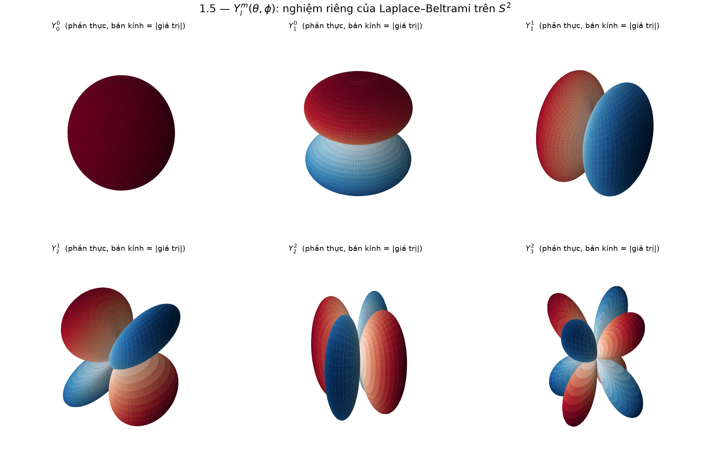

```python
# fig_1_5_ylm_sphere()
from scipy.special import sph_harm_y
Y = sph_harm_y(l, m, THETA, PHI)           # dung cong thuc boxed o tren
Rr = np.abs(Y.real)
X = Rr*np.sin(THETA)*np.cos(PHI); Yc = Rr*np.sin(THETA)*np.sin(PHI); Z = Rr*np.cos(THETA)
ax.plot_surface(X, Yc, Z, facecolors=plt.cm.RdBu_r(...))
```

Đây là **hàm riêng** của toán tử Laplace–Beltrami trên mặt cầu $S^2$ với trị riêng $-l(l+1)$:
$$\nabla^2_{S^2}Y_l^m=-l(l+1)Y_l^m$$

**Mô phỏng matplotlib** — kiểm chứng số học trị riêng bằng sai phân hữu hạn của $\nabla^2_{S^2}$ trên lưới $(\theta,\phi)$, so sánh với $-l(l+1)$ lý thuyết:

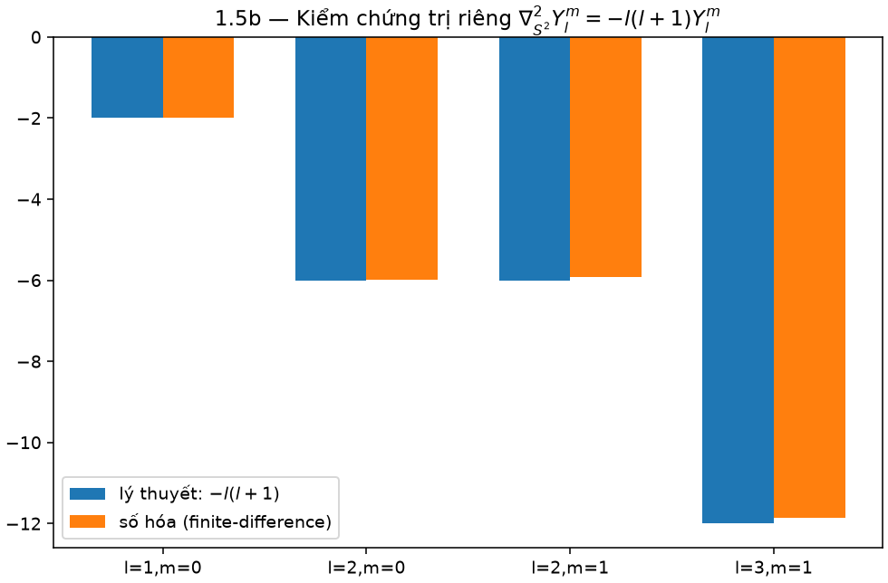

```python
# fig_1_6_eigenvalue()
dY_dth = np.gradient(Y, dth, axis=0)
lap = np.gradient(np.sin(THETA)*dY_dth, dth, axis=0)/np.sin(THETA) \
      + np.gradient(np.gradient(Y, dph, axis=1), dph, axis=1)/np.sin(THETA)**2
# so sanh lap / Y  voi  -l(l+1)
```

và thỏa tính trực chuẩn:
$$\int_{S^2}Y_l^m\,(Y_{l'}^{m'})^*\,d\Omega=\delta_{ll'}\delta_{mm'}$$

**Mô phỏng matplotlib** — ma trận Gram $|\int Y_{lm}(Y_{l'm'})^*d\Omega|$ (tích phân số bằng cầu phương) cho $l=0,1,2$, xấp xỉ ma trận đơn vị:

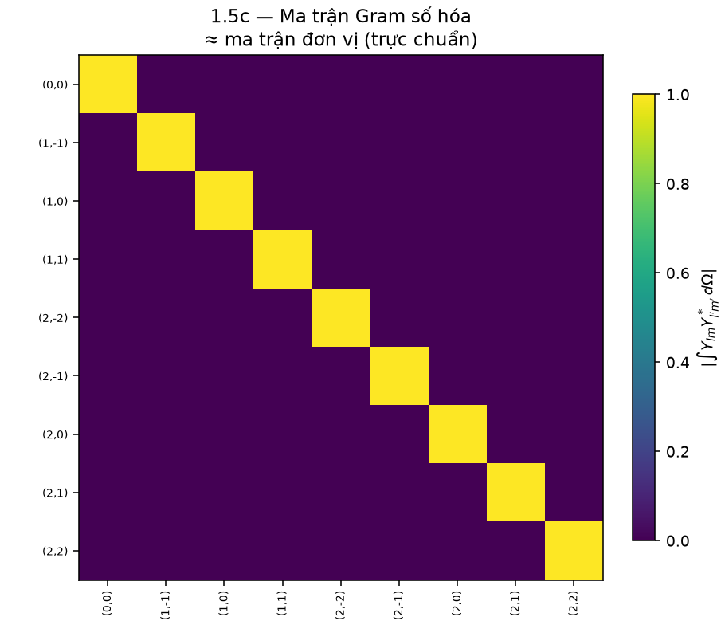

```python
# fig_1_7_orthonormality()
dOmega = np.sin(THETA) * dth * dph
M[i, j] = np.sum(Ys[i] * np.conj(Ys[j]) * dOmega)   # xap xi delta_ll' delta_mm'
```

---

## Phần II — Chuyển sang hàm điều hòa cầu **thực** (Real SH)

Đồ họa máy tính (và 3DGS) không dùng số phức $e^{im\phi}$ vì màu sắc là số thực. Ta lấy tổ hợp tuyến tính thực:

$$
Y_{lm}^{\text{real}}=
\begin{cases}
\dfrac{i}{\sqrt2}\left(Y_l^{m}-(-1)^m Y_l^{-m}\right) & m<0\\[6pt]
Y_l^0 & m=0\\[6pt]
\dfrac{1}{\sqrt2}\left(Y_l^{-m}+(-1)^m Y_l^{m}\right) & m>0
\end{cases}
$$

**Mô phỏng matplotlib** — dựng $Y_{1,m}^{\text{real}}$ từ đúng 3 nhánh công thức trên (m=-1,0,1), vẽ trên mặt cầu:

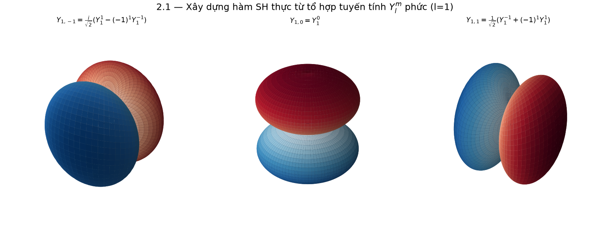

```python
# fig_2_1_real_sh_construction()
def real_sh(l, m):
    if m < 0:
        return (1j/np.sqrt(2) * (sph_harm_y(l,-m,TH,PH) - (-1)**m*sph_harm_y(l,m,TH,PH))).real
    elif m == 0:
        return sph_harm_y(l, 0, TH, PH).real
    else:
        return (1/np.sqrt(2) * (sph_harm_y(l,-m,TH,PH) + (-1)**m*sph_harm_y(l,m,TH,PH))).real
```

Kết quả, các hàm SH thực bậc thấp viết theo $(x,y,z)$ trên mặt cầu đơn vị ($x=\sin\theta\cos\phi,\,y=\sin\theta\sin\phi,\,z=\cos\theta$):

$$
\begin{aligned}
l=0:&\quad Y_{00}=\frac{1}{2}\sqrt{\frac1\pi}\\[4pt]
l=1:&\quad Y_{1,-1}=\frac12\sqrt{\frac{3}{\pi}}\,y,\quad Y_{1,0}=\frac12\sqrt{\frac{3}{\pi}}\,z,\quad Y_{1,1}=\frac12\sqrt{\frac{3}{\pi}}\,x
\end{aligned}
$$

**Đây chính là $C_0, C_1$ trong tài liệu của bạn:**
$$C_0=\frac12\sqrt{\frac1\pi},\qquad C_1=\frac12\sqrt{\frac3\pi}$$

**Mô phỏng matplotlib** — bốn hàm SH thực bậc thấp $Y_{00}=C_0$, $Y_{1,-1}=C_1y$, $Y_{1,0}=C_1z$, $Y_{1,1}=C_1x$ vẽ trên mặt cầu (bán kính = |giá trị|):

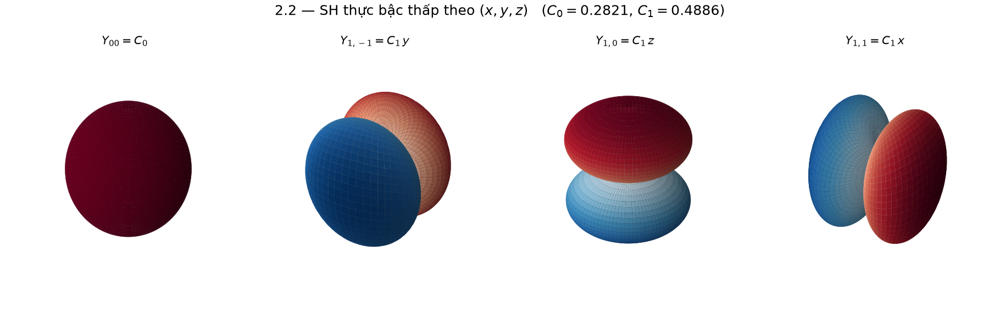

```python
# fig_2_2_low_order_real_sh_xyz()
C0 = 0.5*np.sqrt(1/np.pi); C1 = 0.5*np.sqrt(3/np.pi)
Y00 = C0
Y1m1, Y10, Y11 = C1*y, C1*z, C1*x
```

$l=2,3$ cho các đa thức $P_2^{(m)}(x,y,z), P_3^{(m)}(x,y,z)$ bậc 2, 3 theo $x,y,z$ — chính là các hàm SH thực bậc cao mà công thức chương 2.4 gọi là $P_2^{(m)}, P_3^{(m)}$.

---

## Phần III — Khai triển tín hiệu màu bằng SH (Fourier trên mặt cầu)

Với mỗi điểm Gaussian $i$, màu phát ra theo hướng $\vec d$ là một **hàm số trên mặt cầu** $c_i(\vec d): S^2\to\mathbb{R}$. Theo tính đầy đủ (completeness) của hệ $\{Y_{lm}\}$:

$$c_i(\vec d)=\sum_{l=0}^{\infty}\sum_{m=-l}^{l}k_{i,lm}\,Y_{lm}(\vec d)$$

trong đó $k_{i,lm}$ là **hệ số khai triển** (SH coefficients) — chính là tham số học được của mỗi Gaussian. Về bản chất, đây **đúng là chuỗi Fourier**, chỉ khác miền định nghĩa là mặt cầu thay vì đường tròn:

$$\text{Fourier (1D):}\ f(\phi)=\sum_n c_n e^{in\phi} \qquad\longleftrightarrow\qquad \text{SH (2D cầu):}\ f(\theta,\phi)=\sum_{l,m}k_{lm}Y_{lm}(\theta,\phi)$$

**Mô phỏng matplotlib** — (trái) tái dựng sóng vuông bằng chuỗi Fourier 1D với số hạng $N$ tăng dần; (phải) sai số $L^2$ khi tái dựng một hàm trên mặt cầu bằng SH khi tăng bậc cắt cụt $D$:

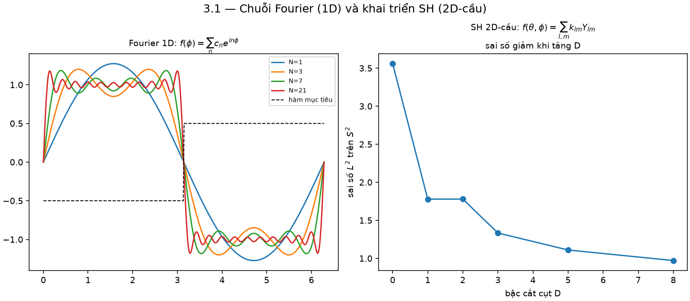

```python
# fig_3_1_fourier_vs_sh()
approx = sum(c_n * np.exp(1j*n*phi) for n in range(-N, N+1))       # Fourier 1D
recon  = sum(k_lm * sph_harm_y(l, m, THETA, PHI)                   # SH tren S^2
             for l in range(D+1) for m in range(-l, l+1))
```

### 3.1. Cắt cụt chuỗi (truncation) — vì sao chỉ đến $l=3$

Trong thực hành, chuỗi vô hạn bị cắt tại bậc $D$:

$$c_i(\vec d)\approx\sum_{l=0}^{D}\sum_{m=-l}^{l}k_{i,lm}\,Y_{lm}(\vec d)$$

**Mô phỏng matplotlib** — tái dựng một hàm màu mẫu trên mặt cầu khi tăng dần bậc cắt cụt $D=0,1,2,3$ (hình dạng ngày càng "nhọn"/chi tiết hơn):

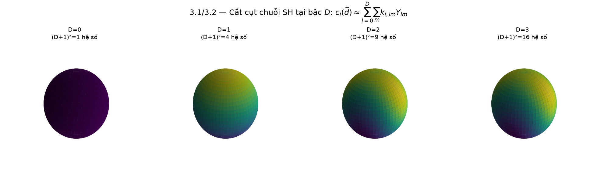

Số hệ số cần lưu cho mỗi bậc $D$ là:
$$\sum_{l=0}^{D}(2l+1)=(D+1)^2$$

Đây chính là công thức trong tài liệu: $D=0\to1,\ D=1\to4,\ D=2\to9,\ D=3\to16$ hệ số/kênh màu (RGB → nhân 3).

**Mô phỏng matplotlib** — số hệ số $(D+1)^2$ theo từng bậc $D$:

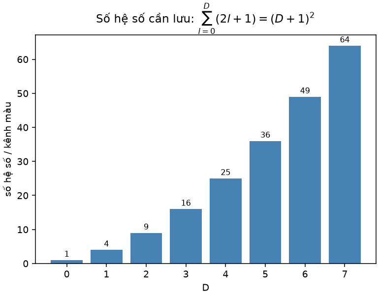

```python
# fig_3_2_truncation_and_coeff_count()
ncoef = (D + 1) ** 2   # 1, 4, 9, 16, ...
```

### 3.2. Công thức đầy đủ khớp với `computeColorFromSH`

$$
c_i(\vec d)=\max\!\Bigg(0,\ 0.5+\underbrace{C_0k_{00}}_{l=0}\underbrace{-C_1y\,k_{1,-1}+C_1z\,k_{10}-C_1x\,k_{11}}_{l=1}+\underbrace{\sum_m C_2^{(m)}P_2^{(m)}(x,y,z)k_{2m}}_{l=2}+\underbrace{\sum_m C_3^{(m)}P_3^{(m)}(x,y,z)k_{3m}}_{l=3}\Bigg)
$$

**Giải thích từng phần bằng toán học đã suy ra ở trên:**

| Ký hiệu | Nguồn gốc toán học |
|---|---|
| $Y_{lm}(\vec d)$ | Nghiệm góc của phương trình Laplace, đã chuẩn hóa thực |
| $k_{i,lm}$ | Hệ số khai triển Fourier-cầu — tham số học được |
| $C_l^{(m)}$ | Hằng số chuẩn hóa $\sqrt{\frac{2l+1}{4\pi}\frac{(l-|m|)!}{(l+|m|)!}}$ (đã gộp dấu, hoán vị) |
| $+0.5$ | Dịch tâm phân bố màu (RGB $\in[0,1]$) quanh giá trị trung bình |
| $\max(0,\cdot)$ | Chặn dưới vì SH có thể cho giá trị âm (không phải mọi khai triển hữu hạn đều $\ge0$) — đạo hàm ngược bị chặn tại nơi clamp (lưu trong `clamped[]`) |

**Mô phỏng matplotlib** — áp đúng công thức `computeColorFromSH` đầy đủ (l=0..3) cho từng kênh R/G/B với bộ hệ số $k_{lm}$ ngẫu nhiên, vẽ trên mặt cầu và đo phần trăm điểm bị `max(0,·)` chặn:

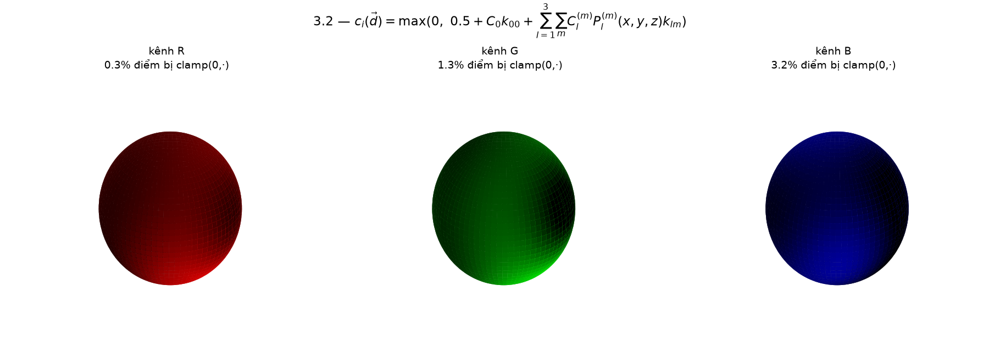

```python
# fig_3_3_compute_color_from_sh()
c_raw = 0.5 + sum(k[(l,m)] * sph_harm_y(l, m, THETA, PHI).real
                  for l in range(4) for m in range(-l, l+1))
c = np.clip(c_raw, 0, None)           # max(0, .)
frac_clamped = np.mean(c_raw < 0)     # ty le bi chan
```

### 3.3. Lịch tăng bậc $D(t)$ — một hàm bậc thang

$$D(t)=\min\!\Big(3,\ \Big\lfloor \frac{t}{1000}\Big\rfloor\Big)$$

**Mô phỏng matplotlib** — đồ thị hàm bậc thang $D(t)$ theo bước huấn luyện $t$:

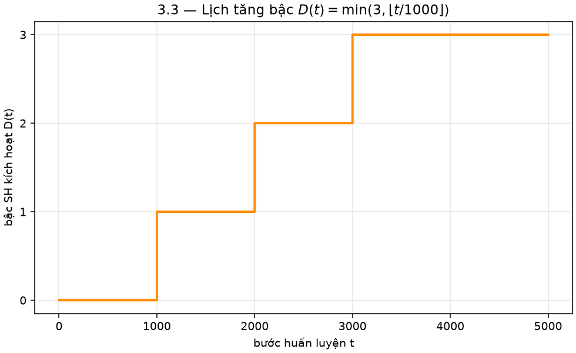

```python
# fig_3_4_degree_schedule()
t = np.linspace(0, 5000, 5001)
D = np.minimum(3, np.floor(t/1000))
plt.step(t, D, where="post")
```

Đây không phải một phương trình vi phân hay tối ưu liên tục — chỉ là **hàm bậc thang rời rạc theo bước huấn luyện $t$**, tăng dần độ phức tạp biểu diễn góc nhìn: bắt đầu từ màu đẳng hướng ($l=0$, không phụ thuộc $\vec d$) rồi mới "mở khóa" các bậc cao hơn để mô hình học phần phản xạ/specular phụ thuộc góc nhìn — tránh overfit sớm khi Gaussian còn ít quan sát.

---

## Phần IV — Vì sao tách $l=0$ (`features_dc`) và $l\ge1$ (`features_rest`)?

Về mặt năng lượng, xét khai triển Parseval trên mặt cầu:
$$\int_{S^2}|c_i(\vec d)|^2\,d\Omega=\sum_{l,m}k_{i,lm}^2$$

**Mô phỏng matplotlib** — kiểm chứng số học hai vế Parseval (tích phân số vs. tổng bình phương hệ số), và phân bố năng lượng $\sum_m k_{lm}^2$ theo từng bậc $l$ cho thấy $l=0$ chiếm ưu thế:

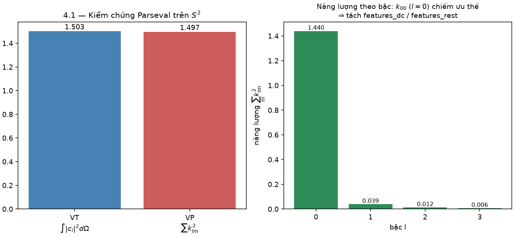

```python
# fig_4_1_parseval_energy()
lhs = np.sum(c**2 * dOmega)                                   # int |c_i|^2 dOmega
rhs = sum(k[(l,m)]**2 for l in range(4) for m in range(-l,l+1))  # sum k_lm^2
```

Hệ số $k_{00}$ (ứng với $Y_{00}=\text{const}$) mang **thành phần một chiều** (DC component) — chính là màu trung bình khi lấy tích phân đều mọi hướng nhìn:
$$\bar c_i=\frac{1}{4\pi}\int_{S^2}c_i(\vec d)\,d\Omega = C_0\,k_{i,00}$$

**Mô phỏng matplotlib** — so sánh trung bình số học $\frac{1}{4\pi}\int c_i\,d\Omega$ (tích phân số trên lưới cầu) với công thức lý thuyết $C_0 k_{00}$:

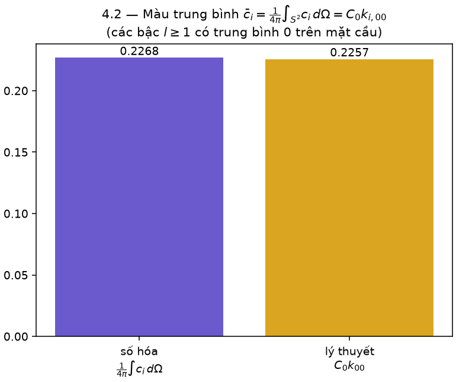

```python
# fig_4_2_mean_color()
mean_numeric = np.sum(c * dOmega) / (4*np.pi)
mean_theory  = C0 * k00
```

vì mọi $Y_{lm}$ với $l\ge1$ có trung bình bằng 0 trên mặt cầu (tính trực giao với $Y_{00}$=const). Do đó $k_{00}$ chiếm phần lớn năng lượng tín hiệu màu — cần learning rate thấp để tránh dao động toàn ảnh; còn 45 hệ số bậc $l=1..3$ chỉ là **nhiễu loạn nhỏ bậc cao** mã hóa hiệu ứng góc nhìn (specular), nên được tách optimizer riêng và cập nhật thưa hơn (mỗi 16 vòng) theo đúng bảng trong tài liệu.

Trong bảng đó, mỗi $Y_l^m$ = $C \times P$ (còn $k$ thì **không có trong bảng này** vì nó là hệ số học được riêng, không phải hằng số toán học cố định). Mình tách ra cho rõ:

## Bảng tách C và P

| $Y_l^m$ | $C$ (hằng số) | $P$ (đa thức theo x,y,z) | $C \times P$ |
|---|---|---|---|
| $Y_0^0$ | $C = \dfrac{1}{2\sqrt{\pi}} \approx 0.282095$ | $P = 1$ | 0.282095 |
| $Y_1^{-1}$ | $C = -\sqrt{\dfrac{3}{4\pi}} \approx -0.488603$ | $P = y$ | -0.488603 y |
| $Y_1^{0}$ | $C = \sqrt{\dfrac{3}{4\pi}} \approx 0.488603$ | $P = z$ | 0.488603 z |
| $Y_1^{1}$ | $C = -\sqrt{\dfrac{3}{4\pi}} \approx -0.488603$ | $P = x$ | -0.488603 x |
| $Y_2^{-2}$ | $C = \dfrac{1}{2}\sqrt{\dfrac{15}{\pi}} \approx 1.092548$ | $P = xy$ | 1.092548 xy |
| $Y_2^{-1}$ | $C = \dfrac{1}{2}\sqrt{\dfrac{15}{\pi}} \approx 1.092548$ | $P = yz$ | 1.092548 yz |
| $Y_2^{0}$ | $C = \dfrac{1}{4}\sqrt{\dfrac{5}{\pi}} \approx 0.315392$ | $P = 3z^2-1$ | 0.315392 (3z²−1) |
| $Y_2^{1}$ | $C = \dfrac{1}{2}\sqrt{\dfrac{15}{\pi}} \approx 1.092548$ | $P = xz$ | 1.092548 xz |
| $Y_2^{2}$ | $C = \dfrac{1}{4}\sqrt{\dfrac{15}{\pi}} \approx 0.546274$ | $P = x^2-y^2$ | 0.546274 (x²−y²) |

## Vậy $k$ ở đâu?

$k$ **không xuất hiện trong bảng này** — bảng này chỉ là $Y_l^m(\mathbf{d}) = C \cdot P$, tức phần **cố định, tính sẵn**, chỉ phụ thuộc hướng nhìn.

$k$ chỉ xuất hiện khi tính **màu cuối cùng**:

$$
c(\mathbf{d}) = \sum_{l,m} k_l^m \times \underbrace{(C_l^m \times P_l^m(\mathbf{d}))}_{Y_l^m(\mathbf{d})}
$$

Ví dụ với dữ liệu ở câu trước ($\mathbf{d} \approx (0.267, 0.535, 0.802)$), nếu $k_1^{-1} = 0.1$:

$$
k_1^{-1} \times Y_1^{-1} = 0.1 \times (-0.488603 \times 0.5345) = 0.1 \times (-0.2611) = -0.02611
$$

Tức $k$ là **số nhân thêm vào**, do model học ra, không nằm trong bảng hằng số toán học $Y_l^m$.
