# Adaptive Density Control (ADC) trong 3D Gaussian Splatting — giải thích công thức

> Nguồn: Kerbl et al. 2023, *3D Gaussian Splatting for Real-Time Radiance Field Rendering* — hàm `densify_and_prune` và các siêu tham số mặc định của mã Inria. Mọi con số trong tài liệu này là giá trị mặc định đó; chỗ nào là suy luận riêng sẽ ghi "(diễn giải thêm)".

**ADC là gì.** 3DGS biểu diễn cảnh bằng một tập $N$ Gaussian 3D, mỗi Gaussian $i$ có tham số $\theta_i=(\mu_i,\ q_i,\ s_i,\ \alpha_i,\ \text{SH}_i)$ — tâm, quaternion xoay, ba bán trục, opacity, hệ số màu. Gradient descent chỉ **dời và nắn** các Gaussian sẵn có; nó không tự thêm Gaussian ở chỗ thiếu, cũng không tự xoá Gaussian vô dụng. *Adaptive Density Control* là vòng lặp phụ chạy xen kẽ với tối ưu, làm đúng hai việc đó:

| Việc | Cơ chế | Tác dụng lên $N$ |
|---|---|---|
| **Densify** (làm dày) | clone Gaussian nhỏ / split Gaussian to ở vùng có gradient vị trí lớn | $N$ tăng |
| **Prune** (tỉa) | xoá Gaussian gần trong suốt, hoặc quá to | $N$ giảm |
| **Reset opacity** | kéo mọi $\alpha_i$ về $\le 0.01$ định kỳ | không đổi $N$ ngay, nhưng "gài" để prune xoá sau đó |

**Mục đích.** Điểm SfM khởi tạo thường (i) thưa ở vùng ít texture, (ii) thiếu hẳn ở vùng SfM không khớp được, (iii) quá to ở vùng cần chi tiết. ADC dùng chính tín hiệu tối ưu (gradient theo toạ độ ảnh của tâm Gaussian) để phát hiện chỗ **thiếu tái tạo** (under-reconstruction) và **dư tái tạo** (over-reconstruction), rồi sửa cấu trúc tập Gaussian thay vì chỉ sửa tham số.

**Mục lục**

- [1. Lịch chạy](#1-lịch-chạy)
- [2. Thống kê gradient](#2-thống-kê-gradient)
- [3. Điều kiện densify](#3-điều-kiện-densify)
- [4. Clone vs Split](#4-clone-vs-split)
- [5. Prune cứng](#5-prune-cứng)
- [6. Reset opacity](#6-reset-opacity)
- [7. Sơ đồ luồng toàn bộ chu trình](#7-sơ-đồ-luồng-toàn-bộ-chu-trình)
- [8. Ví dụ tổng hợp: một bước densify_and_prune tại t=6000](#8-ví-dụ-tổng-hợp-một-bước-densify_and_prune-tại-t6000)
- [9. Bảng tổng hợp hằng số / hyperparameter](#9-bảng-tổng-hợp-hằng-số--hyperparameter)
- [10. Tóm tắt kết quả mô phỏng toy](#10-tóm-tắt-kết-quả-mô-phỏng-toy)
- [11. Nguồn](#11-nguồn)

---

## 1. Lịch chạy

Toàn bộ huấn luyện kéo dài $30\,000$ vòng, nhưng ADC chỉ hoạt động trong nửa đầu. Bốn "việc" và tần suất của chúng (mặc định Inria):

| Việc | Khi nào | Số lần |
|---|---|---|
| Tích luỹ thống kê gradient ($\text{accum}_i$, $\text{denom}_i$) | mỗi vòng, $t<15000$ | 15 000 |
| Densify + prune | mỗi 100 vòng, $500<t<15000$ | 144 |
| Reset opacity | mỗi 3000 vòng, $t<15000$ | 4 (3000 / 6000 / 9000 / 12000) |
| Sau $t=15000$ | **không có gì** — $N$ đóng băng, chỉ còn gradient descent | 0 |

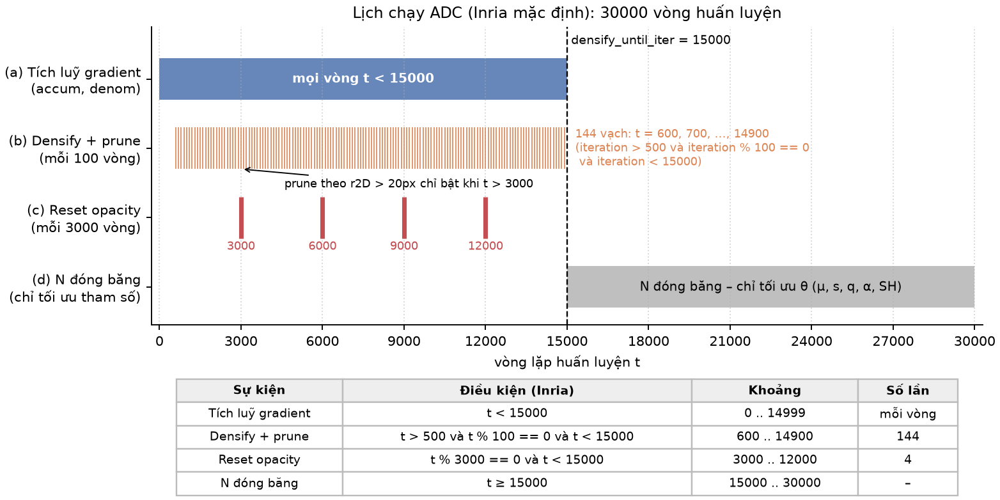

*Trục thời gian $0\to30\,000$: vùng tích luỹ gradient (mọi vòng $<15000$), 144 vạch densify+prune cách nhau 100 vòng trong $(500,15000)$, 4 vạch reset opacity tại bội số của 3000, và nửa sau hoàn toàn trống.*

**Cách đếm 144.** Mốc densify là các $t$ chia hết cho 100, **lớn hơn** 500 và **nhỏ hơn** 15000:

$$
t\in\{600,\ 700,\ 800,\ \dots,\ 14900\}
\quad\Rightarrow\quad
\#=\frac{14900-600}{100}+1=143+1=144 .
$$

Lưu ý hai đầu mút đều bị loại: $t=500$ không densify (điều kiện là $t>500$, không phải $\ge$), $t=15000$ cũng không (điều kiện $t<15000$). Nếu đếm nhầm thành $500..15000$ sẽ ra 146; nếu $500..14900$ sẽ ra 145 — cả hai đều sai so với mã gốc.

**Reset opacity trùng mốc densify.** $3000,6000,9000,12000$ đều chia hết cho 100 và nằm trong $(500,15000)$, nên tại 4 mốc này **cả** densify+prune **lẫn** reset đều chạy trong cùng một vòng. Thứ tự trong mã Inria: densify+prune trước, reset opacity sau (reset là bước cuối cùng của vòng đó).

**Ví dụ tra lịch:**

| $t$ | Tích luỹ gradient? | Densify + prune? | Reset opacity? | Lý do |
|---|---|---|---|---|
| 700 | có | **có** | không | $700\bmod100=0$, $500<700<15000$ |
| 750 | có | không | không | $750\bmod100=50\ne0$ |
| 3000 | có | **có** | **có** | vừa là bội 100 vừa là bội 3000 |
| 500 | có | không | không | cần $t>500$ chặt |
| 14900 | có | **có** (lần thứ 144) | không | mốc densify cuối |
| 15000 | không | không | không | $t<15000$ sai → ADC tắt hẳn |
| 20000 | không | không | không | nửa sau chỉ tối ưu tham số |

(diễn giải thêm) Vì sao tắt ADC ở 15000: 15 000 vòng sau cần một tập Gaussian **cố định** để SH bậc cao, opacity và scale hội tụ ổn định; nếu còn thêm/xoá, mỗi lần đổi $N$ lại làm nhiễu trạng thái Adam của cả tập.

---

## 2. Thống kê gradient

### 2.1 Công thức

Mỗi Gaussian $i$ giữ hai bộ đếm, cập nhật **mỗi vòng** $t<15000$, và chỉ được đọc tại mốc densify:

$$
\boxed{\ \bar g_i=\frac{\text{accum}_i}{\text{denom}_i}\ ,\qquad
\text{accum}_i=\sum_{t}\mathbb 1_i(t)\,\Bigl\lVert\sum_{x}\frac{\partial\mathcal L}{\partial\mu'_i}\Big|_{x}\Bigr\rVert_2\ ,\qquad
\text{denom}_i=\sum_{t}\mathbb 1_i(t)\ }
$$

Bảng ký hiệu:

| Ký hiệu | Nghĩa | Ghi chú |
|---|---|---|
| $\mu'_i\in\mathbb R^2$ | toạ độ **pixel** (2D, sau khi chiếu) của tâm $\mu_i$ trong ảnh đang render ở vòng $t$ | gradient theo $\mu'_i$ là vector 2 chiều $(g_u,g_v)$, **có dấu** — đây là "2 cột có dấu" |
| $\mathcal L$ | loss ảnh của vòng $t$ ($\mathcal L=(1-\lambda)\,L_1+\lambda\,(1-\text{SSIM})$) | tính trên đúng 1 ảnh mỗi vòng |
| $\sum_x$ | tổng trên các pixel $x$ mà Gaussian $i$ **phủ** (tile/pixel có đóng góp $\alpha$ khác 0) | tổng này chính là gradient backprop tự nhiên của $\mathcal L$ theo $\mu'_i$ |
| $\lVert\cdot\rVert_2$ | chuẩn Euclid của vector 2D | lấy **sau** khi đã cộng hết pixel |
| $\mathbb 1_i(t)$ | chỉ báo nhìn thấy: $=1$ nếu Gaussian $i$ nằm trong khung hình và có bán kính 2D $>0$ ở vòng $t$, ngược lại $0$ | Gaussian không nhìn thấy thì **không** cộng gì vào cả tử lẫn mẫu |
| $\text{accum}_i$ | tổng chuẩn gradient qua các vòng nhìn thấy | vô hướng $\ge0$ |
| $\text{denom}_i$ | số vòng nhìn thấy kể từ lần densify trước | số nguyên $\ge0$ |
| $\bar g_i$ | chuẩn gradient **trung bình trên mỗi lần nhìn thấy** | so với $\tau_{\text{grad}}$ ở mục 3 |

Đơn vị: trong mã Inria, $\mu'_i$ ở toạ độ NDC nên $\partial\mathcal L/\partial\mu'_i$ nhỏ (cỡ $10^{-4}$); ngưỡng $2\times10^{-4}$ được chọn theo thang này.

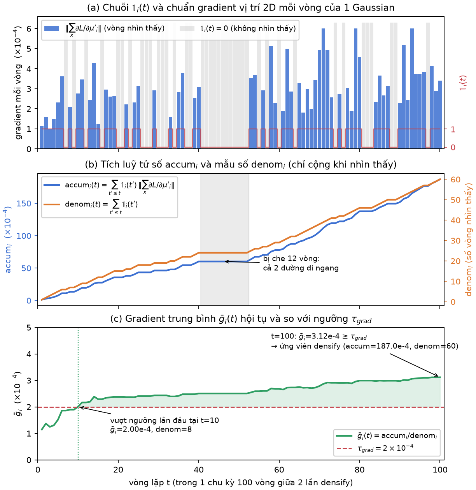

*Hai bộ đếm của một Gaussian qua nhiều vòng: các vòng nhìn thấy ($\mathbb 1=1$) làm $\text{accum}$ nhảy lên theo chuẩn gradient và $\text{denom}$ tăng 1; các vòng không nhìn thấy để cả hai đứng yên. $\bar g$ là độ dốc trung bình của đường $\text{accum}$.*

### 2.2 Tại sao lấy chuẩn SAU khi cộng pixel

Thứ tự phép toán là điều quan trọng nhất của công thức:

$$
\underbrace{\Bigl\lVert\sum_x \nabla_x\Bigr\rVert}_{\text{3DGS gốc dùng}}
\quad\ne\quad
\underbrace{\sum_x \lVert\nabla_x\rVert}_{\text{3DGS gốc KHÔNG có cột này}}
$$

trong đó $\nabla_x=\partial\mathcal L/\partial\mu'_i|_x$ là đóng góp của pixel $x$. Vì tổng $\sum_x$ được thực hiện **ngay trong kernel rasterizer** khi backward, thứ duy nhất ra khỏi kernel là một vector 2D đã cộng dồn. Hai hệ quả:

- Nếu mọi pixel trong footprint "kéo" tâm về **cùng một phía** (Gaussian nằm lệch so với chi tiết cần vẽ) → các $\nabla_x$ cộng hưởng, chuẩn lớn → dễ vượt ngưỡng.
- Nếu nửa footprint kéo trái, nửa kéo phải (Gaussian to nằm **đúng tâm** một vùng có hai chi tiết đối xứng, hoặc phủ lên một biên) → các $\nabla_x$ **triệt tiêu**, chuẩn nhỏ, dù từng pixel đều đang sai.

**Ví dụ triệt tiêu.** Gaussian phủ 2 pixel; pixel trái cho $\nabla_1=(+2,0)\times10^{-4}$, pixel phải cho $\nabla_2=(-2,0)\times10^{-4}$:

$$
\Bigl\lVert\sum_x\nabla_x\Bigr\rVert=\lVert(0,0)\rVert=0
\qquad\text{trong khi}\qquad
\sum_x\lVert\nabla_x\rVert=2\times10^{-4}+2\times10^{-4}=4\times10^{-4}.
$$

Theo công thức gốc, vòng này đóng góp $0$ vào $\text{accum}_i$ nhưng vẫn cộng $1$ vào $\text{denom}_i$ — tức là còn **kéo $\bar g_i$ xuống**. Gaussian này sẽ không được densify dù render sai ở cả hai pixel.

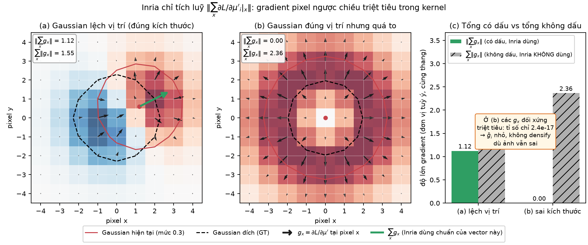

*Trái: footprint một Gaussian với các mũi tên gradient theo pixel cùng hướng → vector tổng dài. Phải: hai nửa footprint kéo ngược nhau → vector tổng gần bằng 0 dù từng mũi tên không nhỏ.*

(diễn giải thêm) Đây là lựa chọn thiết kế có chủ ý của 3DGS gốc: tín hiệu "cả Gaussian muốn dịch đi đâu" dùng chính gradient vị trí, không cần thêm buffer riêng trong kernel. Cái giá là bỏ sót trường hợp Gaussian to cân bằng trên biên; các biến thể sau (như FastGS) thêm cột $\sum_x|\cdot|$ để bắt trường hợp này.

### 2.3 Ví dụ số

**Ví dụ 1 — vượt ngưỡng.** Từ mốc densify trước, Gaussian $i$ được render 5 vòng, nhìn thấy ở 3 vòng với chuẩn gradient lần lượt $3\times10^{-4},\ 1\times10^{-4},\ 5\times10^{-4}$; 2 vòng còn lại ở ngoài khung hình.

$$
\text{accum}_i=3\times10^{-4}+1\times10^{-4}+5\times10^{-4}=9\times10^{-4},\qquad
\text{denom}_i=1+1+1=3,\qquad
\bar g_i=\frac{9\times10^{-4}}{3}=3\times10^{-4}\ \ge\ 2\times10^{-4}.
$$

→ Thoả điều kiện gradient; clone hay split tuỳ kích thước (mục 3). Hai vòng không nhìn thấy **không** kéo trung bình xuống — nếu chia cho 5 thay vì 3 sẽ được $1.8\times10^{-4}<\tau$, sai.

**Ví dụ 2 — nhìn thấy nhiều nhưng trung bình thấp.** Gaussian $j$ nằm giữa khung, nhìn thấy cả 100 vòng, chuẩn gradient mỗi vòng dao động quanh $1.5\times10^{-4}$:

$$
\text{accum}_j\approx100\times1.5\times10^{-4}=1.5\times10^{-2},\qquad
\text{denom}_j=100,\qquad
\bar g_j=1.5\times10^{-4}<2\times10^{-4}.
$$

→ **Không** densify. Dù $\text{accum}_j$ lớn gấp ~17 lần $\text{accum}_i$ ở ví dụ 1, thứ được so sánh là **trung bình**, không phải tổng. Gaussian được nhìn nhiều không được ưu tiên hơn Gaussian được nhìn ít.

**Ví dụ 3 — một vòng triệt tiêu kéo trung bình xuống.** Gaussian $k$ nhìn thấy 4 vòng: ba vòng đầu chuẩn $2.5\times10^{-4}$ mỗi vòng, vòng thứ tư gradient pixel là $(+2,-2)\times10^{-4}$ cộng nhau ra $0$:

$$
\bar g_k=\frac{3\times2.5\times10^{-4}+0}{4}=1.875\times10^{-4}<2\times10^{-4}.
$$

→ Không densify, dù nếu chỉ tính 3 vòng đầu thì $2.5\times10^{-4}$ đã vượt ngưỡng.

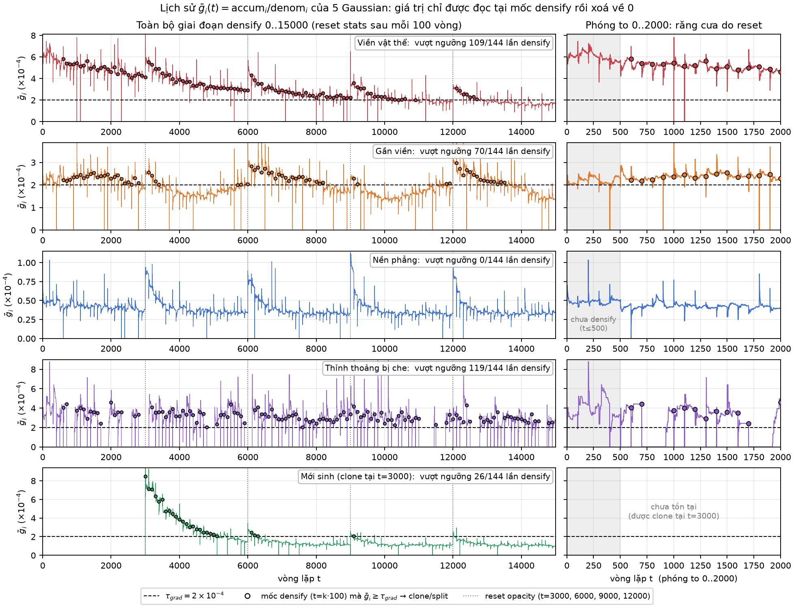

*$\bar g$ của vài Gaussian tiêu biểu theo vòng $t$ trong một cửa sổ 100 vòng, với đường ngang $\tau_{\text{grad}}=2\times10^{-4}$: Gaussian nào kết thúc cửa sổ ở trên đường sẽ được densify tại mốc kế tiếp.*

### 2.4 Reset thống kê

Ngay sau mỗi lần densify (tức mỗi 100 vòng trong cửa sổ), $\text{accum}_i\leftarrow0$, $\text{denom}_i\leftarrow0$ cho **mọi** Gaussian — kể cả Gaussian mới sinh (bắt đầu với $0/0$, chưa đủ điều kiện gì). Do đó $\bar g_i$ tại mốc $t$ chỉ phản ánh **100 vòng gần nhất**, không phải cả lịch sử. Một Gaussian có gradient lớn ở vòng $1000$–$1100$ nhưng ổn định sau đó sẽ không bị densify ở mốc $1300$.

---

## 3. Điều kiện densify

### 3.1 Công thức

Tại mỗi mốc densify, mọi Gaussian $i$ được xét qua **cùng một** ngưỡng gradient, rồi rẽ nhánh theo kích thước:

$$
\boxed{\ \text{clone}_i=\bigl[\lVert\bar g_i\rVert\ge\tau_{\text{grad}}\bigr]\ \wedge\ \bigl[\max(s_i)\le\delta\cdot\text{extent}\bigr]\ }
$$

$$
\boxed{\ \text{split}_i=\bigl[\lVert\bar g_i\rVert\ge\tau_{\text{grad}}\bigr]\ \wedge\ \bigl[\max(s_i)>\delta\cdot\text{extent}\bigr]\ }
$$

$$
\tau_{\text{grad}}=2\times10^{-4},\qquad \delta=\texttt{percent\_dense}=0.01 .
$$

| Ký hiệu | Nghĩa |
|---|---|
| $\lVert\bar g_i\rVert$ | chuẩn gradient trung bình (mục 2); trong mã $\bar g_i$ đã là vô hướng nên chuẩn chính là nó |
| $s_i=(s_{i,1},s_{i,2},s_{i,3})$ | ba bán trục (scale) của Gaussian, đơn vị thế giới, sau $\exp$ |
| $\max(s_i)$ | bán trục **dài nhất** — kích thước theo hướng "to nhất" |
| $\text{extent}$ | kích thước cảnh: bán kính hình cầu bao **các camera** huấn luyện (`cameras_extent`, tính lúc load scene, cố định suốt huấn luyện) |
| $\delta\cdot\text{extent}$ | ngưỡng "nhỏ / to" tuyệt đối, bằng $1\%$ kích thước cảnh |

Hai nhánh **loại trừ nhau** ($\le$ và $>$ bù nhau), nên mỗi Gaussian vượt ngưỡng gradient đi vào đúng một nhánh; Gaussian không vượt ngưỡng thì giữ nguyên.

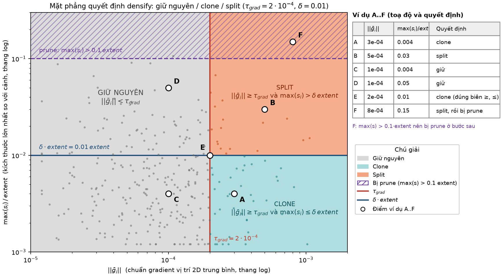

*Mặt phẳng $(\lVert\bar g\rVert,\ \max s/\text{extent})$ chia thành ba vùng: giữ nguyên (trái đường dọc $\tau_{\text{grad}}$), clone (phải, dưới đường ngang $\delta$), split (phải, trên đường ngang). Các điểm A–F của bảng ví dụ được đánh dấu.*

### 3.2 Extent — thước đo "to / nhỏ"

$\text{extent}$ làm cho ngưỡng kích thước **không phụ thuộc đơn vị** của cảnh: cảnh đo bằng mét hay bằng centimét, Gaussian chiếm $1\%$ bán kính cảnh vẫn là ranh giới clone/split. Ví dụ:

| Cảnh | $\text{extent}$ | $\delta\cdot\text{extent}$ (ranh giới clone/split) | $0.1\cdot\text{extent}$ (ranh giới prune, mục 5) |
|---|---|---|---|
| Bàn làm việc, camera quay quanh bán kính 1 m | $\approx1$ | $0.01$ | $0.1$ |
| Sân vườn, camera cách nhau đến 10 m | $\approx10$ | $0.1$ | $1$ |
| Cùng sân vườn nhưng đơn vị cm | $\approx1000$ | $10$ | $100$ |

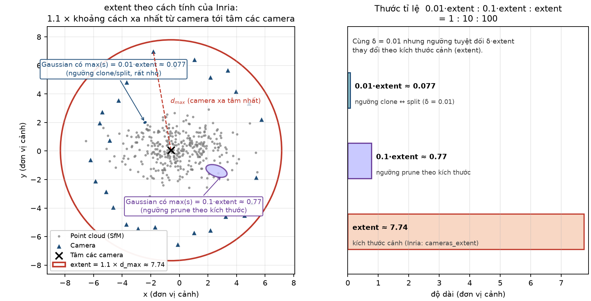

*Hình cầu bao các camera huấn luyện cho $\text{extent}$; hai vòng tròn nhỏ hơn minh hoạ $\delta\cdot\text{extent}$ ($1\%$, ranh giới clone/split) và $0.1\cdot\text{extent}$ ($10\%$, Gaussian to hơn sẽ bị prune).*

### 3.3 Bảng ví dụ A–F

Lấy $\tau_{\text{grad}}=2\times10^{-4}$, $\delta\cdot\text{extent}=0.01\cdot\text{extent}$:

| # | $\lVert\bar g_i\rVert$ | $\max(s_i)$ | Gradient $\ge\tau$? | Kích thước | Kết quả |
|---|---|---|---|---|---|
| A | $3\times10^{-4}$ | $0.004\cdot\text{extent}$ | có | $\le0.01\cdot\text{extent}$ → nhỏ | **clone** |
| B | $5\times10^{-4}$ | $0.03\cdot\text{extent}$ | có | $>0.01\cdot\text{extent}$ → to | **split** |
| C | $1\times10^{-4}$ | $0.004\cdot\text{extent}$ | không | nhỏ | giữ nguyên |
| D | $1\times10^{-4}$ | $0.05\cdot\text{extent}$ | không | to | giữ nguyên (to nhưng không "đòi" dịch chuyển) |
| E | đúng $2\times10^{-4}$ | đúng $0.01\cdot\text{extent}$ | có ($\ge$) | $\le$ → nhỏ | **clone** (cả hai dấu bằng đều rơi về clone) |
| F | $8\times10^{-4}$ | $0.15\cdot\text{extent}$ | có | to | **split** → con có scale $0.15/1.6\approx0.094\cdot\text{extent}$; bản thân gốc với $0.15>0.1\cdot\text{extent}$ là đối tượng của prune "quá to" (khi $t>3000$) — không thể tồn tại nguyên vẹn qua mốc này |

Về F: trong mã Inria, split xoá gốc **ngay** trong bước split (mục 4), rồi bước prune chạy sau; con $0.094\cdot\text{extent}$ chưa vượt $0.1$ nên tồn tại. Điểm cần nhớ là một Gaussian với $\max s>0.1\cdot\text{extent}$ không thể "sống" qua mốc densify+prune sau $t=3000$ dưới dạng nguyên vẹn — hoặc bị split thành con nhỏ hơn (nếu gradient lớn), hoặc bị prune (nếu gradient nhỏ).

Về E: vì clone dùng $\le$ và split dùng $>$, và gradient dùng $\ge$, điểm đúng ngưỡng ở cả hai chiều được xử lý **xác định** — không có Gaussian nào vừa thoả clone vừa thoả split, cũng không có Gaussian nào vượt gradient mà rơi ra ngoài cả hai nhánh.

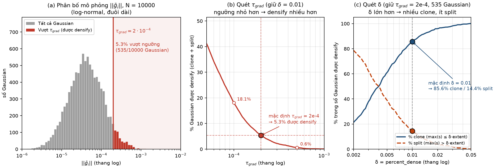

*Tỉ lệ Gaussian được clone / split / giữ nguyên khi quét $\tau_{\text{grad}}$ (trái) và $\delta$ (phải) quanh giá trị mặc định trên một phân bố $(\bar g,\max s)$ giả lập; đường đứt là giá trị mặc định $2\times10^{-4}$ và $0.01$.*

### 3.4 Trực giác (diễn giải thêm)

Vì sao **một** ngưỡng gradient nhưng **hai** cách xử lý:

- Gradient vị trí lớn nghĩa là "Gaussian này muốn dịch đi mà không dịch nổi" — dấu hiệu một Gaussian đang phải gánh nhiều hơn một chi tiết. Đó là tín hiệu chung.
- Nếu Gaussian **nhỏ** ($\max s\le\delta\cdot\text{extent}$) mà vẫn bị kéo mạnh → vùng đó **thiếu** Gaussian (under-reconstruction): một chấm nhỏ không đủ phủ hình học xung quanh. Cách chữa rẻ nhất là **clone**: thêm một bản y hệt, để hai bản sau đó bị gradient đẩy về hai phía và lấp khoảng trống.
- Nếu Gaussian **to** ($\max s>\delta\cdot\text{extent}$) bị kéo mạnh → một blob to đang bôi nhoè lên vùng có chi tiết nhỏ hơn nó (over-reconstruction). Clone một blob to chỉ ra hai blob to cùng sai; cách chữa là **split**: thay bằng hai Gaussian nhỏ hơn ($/1.6$) rải trong thể tích của gốc, để từng con khớp một phần chi tiết.
- Gaussian to nhưng gradient nhỏ (ví dụ D) — ví dụ bức tường phẳng, bầu trời — được giữ nguyên: to không phải là lỗi, to **mà** bị kéo mới là lỗi.

---

## 4. Clone vs Split

### 4.1 Bảng so sánh

| | Clone | Split |
|---|---|---|
| **Bản mới** | $\theta_{\text{new}}=\theta_i$ (copy y nguyên mọi tham số) | $\mu^{(j)}=\mu_i+R(q_i)\,e^{(j)},\quad e^{(j)}\sim\mathcal N\bigl(0,\operatorname{diag}(s_i^2)\bigr),\ j=1,2$ |
| **Scale** | $s_i$ (giữ nguyên) | $s_i/1.6$ |
| **Gốc** | giữ | xoá |
| **$N$** | $+1$ | $+2-1=+1$ |

Cả hai đều làm $N$ tăng đúng **1** cho mỗi Gaussian được chọn. Khác biệt nằm ở *hình học* của kết quả: clone cho hai bản **trùng khít**, split cho hai bản **nhỏ hơn, lệch nhau ngẫu nhiên** và gốc biến mất.

### 4.2 Clone — từng dòng

- **Bản mới $=\theta_i$:** tâm, quaternion, scale, opacity, SH đều copy. Ngay sau clone, render **không đổi gì** về hình học: hai Gaussian trùng nhau, nhưng do alpha-blending, opacity hiệu dụng tại tâm tăng từ $\alpha$ lên $1-(1-\alpha)^2$ (ví dụ $\alpha=0.5\to0.75$).
- **Scale giữ:** clone dành cho Gaussian nhỏ, nên không cần thu nhỏ thêm.
- **Gốc giữ:** không có gì bị xoá.
- **$N+1$:** một bản mới cho mỗi Gaussian được clone.
- Trong mã Inria, bản mới **cũng** nhận trạng thái optimizer mới (moment Adam = 0), còn gốc giữ moment cũ — đây là điểm khiến hai bản tách nhau ở các vòng sau (xem 4.6).

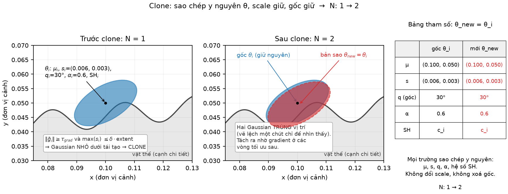

*Trái: Gaussian nhỏ nằm cạnh chi tiết bị thiếu, mũi tên gradient kéo nó về phía chi tiết. Phải: sau clone, hai bản trùng nhau tại cùng vị trí; những vòng tối ưu tiếp theo sẽ tách chúng.*

### 4.3 Split — từng dòng

**Vị trí hai con.** Với mỗi $j\in\{1,2\}$ lấy mẫu một vector nhiễu trong **hệ toạ độ riêng** của Gaussian gốc:

$$
e^{(j)}=\bigl(e^{(j)}_1,e^{(j)}_2,e^{(j)}_3\bigr),\qquad e^{(j)}_k\sim\mathcal N\bigl(0,\ s_{i,k}^2\bigr)\ \text{độc lập},
$$

tức là dọc trục thứ $k$ của ellipsoid, độ lệch chuẩn của nhiễu bằng đúng bán trục $s_{i,k}$. Rồi xoay về hệ thế giới bằng $R(q_i)$ và cộng vào tâm gốc:

$$
\mu^{(j)}=\mu_i+R(q_i)\,e^{(j)} .
$$

Hệ quả: các con rơi vào chính "ellipsoid $1\sigma$" của gốc — dọc trục dài lệch nhiều, dọc trục ngắn lệch ít. Vì $\operatorname{Cov}(R e)=R\,\operatorname{diag}(s_i^2)\,R^\top=\Sigma_i$, phân bố của $\mu^{(j)}$ chính là $\mathcal N(\mu_i,\Sigma_i)$ — lấy mẫu từ Gaussian gốc xem như một phân bố xác suất.

**Ma trận xoay từ quaternion.** Với $q=(w,x,y,z)$ đã chuẩn hoá ($w^2+x^2+y^2+z^2=1$):

$$
R(q)=
\begin{pmatrix}
1-2(y^2+z^2) & 2(xy-wz) & 2(xz+wy)\\
2(xy+wz) & 1-2(x^2+z^2) & 2(yz-wx)\\
2(xz-wy) & 2(yz+wx) & 1-2(x^2+y^2)
\end{pmatrix}.
$$

Kiểm tra nhanh: $q=(1,0,0,0)\Rightarrow R=I$ (không xoay); $q=(\cos\frac\phi2,0,0,\sin\frac\phi2)\Rightarrow$ xoay góc $\phi$ quanh trục $z$. Cột thứ $k$ của $R(q_i)$ là hướng bán trục thứ $k$ của ellipsoid trong hệ thế giới; ma trận hiệp phương sai của Gaussian là $\Sigma_i=R\,\operatorname{diag}(s_i^2)\,R^\top$.

**Scale $s_i/1.6$.** Cả ba bán trục chia cho $1.6$ (trong mã: `new_scaling = scaling / (0.8 * 2)`). Thể tích ellipsoid tỉ lệ $s_1s_2s_3$ nên mỗi con có thể tích $1/1.6^3\approx1/4.1$ của gốc; hai con cộng lại $\approx0.49$ thể tích gốc — split **thu nhỏ vùng phủ**, không bảo toàn thể tích. Quaternion, opacity, SH của con **copy** từ gốc.

**Gốc xoá.** Gaussian gốc bị loại ngay sau khi sinh con — trong cùng bước split, trước bước prune.

**$N$:** $+2$ con $-1$ gốc $=+1$.

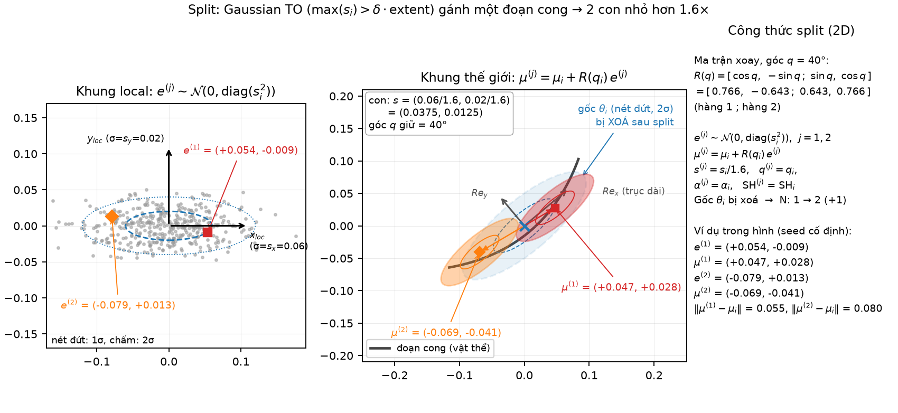

*Ellipsoid gốc (nét đứt) với các trục $R(q_i)$ và bán trục $s_i$; hai con (nét liền) có tâm lệch theo $R(q_i)e^{(j)}$ và bán trục $s_i/1.6$; gốc bị xoá.*

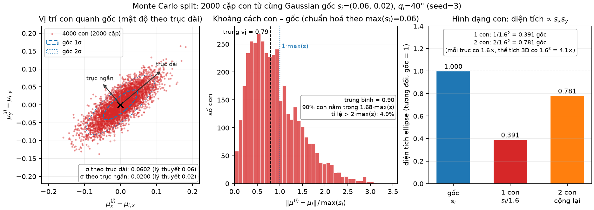

*Nhiều lần lấy mẫu $\mu^{(j)}$ cho cùng một Gaussian gốc dẹt và xoay: đám điểm bám theo ellipse $1\sigma$ của gốc, dày dọc trục dài, mỏng dọc trục ngắn — minh hoạ $\operatorname{Cov}(\mu^{(j)}-\mu_i)=\Sigma_i$.*

### 4.4 Ví dụ số — scale sau split

Gaussian gốc $s_i=(0.06,\ 0.02,\ 0.01)$ (đơn vị thế giới, $\text{extent}=1$ nên $\max s=0.06>0.01$ → thuộc nhánh split nếu vượt ngưỡng gradient):

$$
s^{(j)}=\frac{s_i}{1.6}=\Bigl(\frac{0.06}{1.6},\ \frac{0.02}{1.6},\ \frac{0.01}{1.6}\Bigr)=(0.0375,\ 0.0125,\ 0.00625).
$$

- $\max s^{(j)}=0.0375$ vẫn $>0.01\cdot\text{extent}$ → nếu ở mốc sau con vẫn có gradient lớn, nó sẽ **lại bị split** ($0.0375\to0.0234\to0.0146\to0.0092$: cần thêm 3 lần nữa để xuống dưới ranh giới clone).
- Nhiễu vị trí: dọc trục dài $e_1\sim\mathcal N(0,0.06^2)$, độ lệch chuẩn $0.06$ — lớn gấp $1.6$ lần bán trục mới của con, nên hai con thường **không** chồng lên nhau nhiều dọc trục này; dọc trục ngắn $e_3\sim\mathcal N(0,0.01^2)$, lệch rất ít.
- Một mẫu cụ thể (giả sử $R=I$): $e^{(1)}=(+0.05,-0.01,+0.003)$, $e^{(2)}=(-0.07,+0.02,-0.002)$ → $\mu^{(1)}=\mu_i+(0.05,-0.01,0.003)$, $\mu^{(2)}=\mu_i+(-0.07,0.02,-0.002)$. Hai con cách nhau $\approx0.12$ dọc trục dài, tức $\approx2\sigma$ của gốc.

### 4.5 Ví dụ kế toán $N$

Tại một mốc densify có $N=1000$ Gaussian; kết quả xét điều kiện: 120 Gaussian thoả clone, 80 thoả split, 800 giữ nguyên.

| Bước | Thêm | Xoá | $N$ sau bước |
|---|---|---|---|
| Xuất phát | — | — | 1000 |
| Clone 120 | $+120$ | $0$ | 1120 |
| Split 80 | $+160$ (2 con/Gaussian) | $-80$ (gốc) | 1200 |
| **Tổng densify** | $+280$ | $-80$ | **1200** $=1000+120+80$ |

Sau đó mới đến prune (mục 5) — ví dụ prune xoá 50 → $N=1150$. Lưu ý trong mã Inria, clone chạy **trước** split và split được xét trên tập **đã gồm** các bản clone mới (bản clone mới được pad thêm với gradient $0$ nên không thoả split) — kết quả kế toán vẫn là $+120+80$.

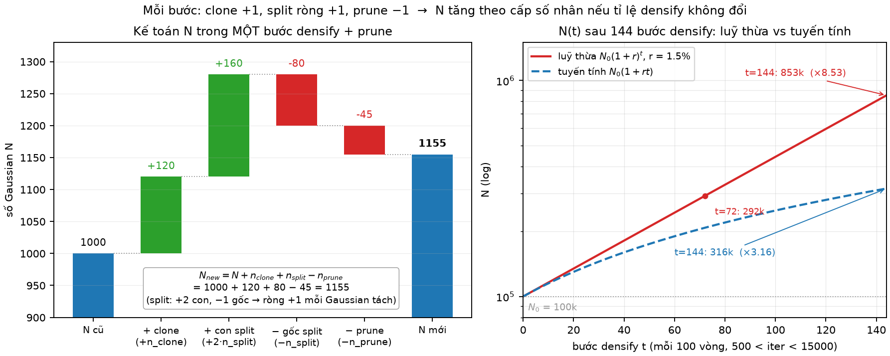

*Biểu đồ thác nước: $N=1000\to1120$ (clone) $\to1200$ (split, $+160-80$) $\to$ sau prune, minh hoạ mỗi Gaussian được densify làm $N$ tăng đúng 1 bất kể nhánh.*

### 4.6 Clone rồi tách ra như thế nào (diễn giải thêm)

Ngay sau clone, hai bản $\theta_i$ và $\theta_{\text{new}}$ giống hệt nhau nên nhận **cùng** gradient ở vòng kế tiếp. Chúng tách nhau nhờ hai yếu tố:

1. **Trạng thái Adam khác nhau.** Gốc giữ moment $m,v$ tích luỹ từ trước; bản mới bắt đầu với $m=v=0$. Cùng một gradient $g$, bước cập nhật $\Delta=\text{lr}\cdot\hat m/(\sqrt{\hat v}+\epsilon)$ ra khác nhau: bản mới (với bias-correction) đi gần $\text{lr}\cdot\operatorname{sign}(g)$ ngay vòng đầu, gốc đi theo hướng moment cũ đã pha trộn. Sau vài vòng, vị trí đã lệch nhau dù chỉ chút ít.
2. **Gradient phân kỳ khi đã lệch.** Khi hai bản không còn trùng, mỗi bản phủ pixel hơi khác nhau; bản gần chi tiết thiếu hơn bị kéo mạnh về đó, bản còn lại được "giải phóng" để ở lại lấp vùng cũ. Sự tách càng rộng thì gradient càng khác — vòng phản hồi dương cho đến khi mỗi bản khớp một mảng riêng.

Ví dụ minh hoạ: tại $t=700$ Gaussian A (nhỏ) được clone; vòng $701$ cả hai nhận $g=(+3,0)\times10^{-4}$ theo pixel — cùng chiều, nhưng gốc có $m$ cũ hướng $(+1,+1)$ nên lệch xiên, bản mới đi thẳng; đến $t=800$ hai bản đã cách nhau vài pixel; nếu vùng vẫn thiếu, một trong hai lại vượt $\tau_{\text{grad}}$ và được clone tiếp — đây là cách một điểm SfM đơn lẻ "mọc" thành một cụm Gaussian phủ kín bề mặt qua các mốc $600,700,800,\dots$ Đồng thời, vì $\text{accum},\text{denom}$ reset mỗi 100 vòng (2.4), bản nào đã ổn định sẽ dừng được clone, tránh phình vô hạn.

---

## 5. Prune cứng

Sau khi clone/split xong, **cùng một bước** `densify_and_prune` quét toàn bộ tập Gaussian (kể cả bản vừa sinh) và xoá thẳng những Gaussian thoả **bất kỳ** một trong ba điều kiện:

$$
\boxed{\ \text{xoá}_i=\underbrace{[\alpha_i<0.005]}_{\text{(P1) trong suốt}}\ \vee\ \underbrace{[r_i^{2D}>20\ \text{px}]_{\,t>3000}}_{\text{(P2) chiếm quá nhiều pixel}}\ \vee\ \underbrace{[\max(s_i)>0.1\cdot\text{extent}]}_{\text{(P3) quá to trong không gian}}\ }
$$

Ba điều kiện nối bằng **OR** — chỉ cần vi phạm một điều kiện là bị xoá, không cần "hội đủ".

### 5.1 Ý nghĩa vật lý / hình học của từng điều kiện

| Điều kiện | Đại lượng | Ngưỡng | Vì sao đây là Gaussian "vô dụng" |
|---|---|---|---|
| (P1) | $\alpha_i$ — opacity sau sigmoid | $<0.005$ | Đóng góp màu của Gaussian $i$ lên pixel là $c_i\,\alpha_i\,T_i$ với $T_i=\prod_{j<i}(1-\alpha_j)\le1$. Khi $\alpha_i<0.005$ thì $\alpha_iT_i<0.005$: đổi màu $c_i$ bất kỳ cũng lệch pixel chưa tới $0.5\%$ → gần như **trong suốt**, tốn sort/blend mà không ảnh hưởng ảnh. |
| (P2) | $r_i^{2D}$ — bán kính chiếu lớn nhất (px) ghi nhận từ rasterizer qua các view | $>20$ px, chỉ khi $t>3000$ | Một Gaussian phủ đĩa bán kính $>20$ px ($\approx1250$ px²) trên ảnh là **Gaussian khổng lồ**: một đốm mờ đè lên nhiều chi tiết, gây artefact "vệt sương". Chỉ bật sau 3000 vòng để Gaussian mới sinh (từ SfM hoặc split) có thời gian **tự co scale** trước khi bị xử. |
| (P3) | $\max(s_i)$ — trục dài nhất của ellipsoid | $>0.1\cdot\text{extent}$ | `extent` là bán kính cảnh (ước lượng từ bao camera). Một Gaussian dài bằng **10 % cả cảnh** không thể biểu diễn bề mặt nào hợp lý — thường là Gaussian "trôi" ra không trung hoặc phình ra để lấp nền. |

> (diễn giải thêm) Trong `gaussian_model.py` của Inria, cả (P2) lẫn (P3) đều nằm trong khối `if max_screen_size:` với `max_screen_size = 20 if t > 3000 else None`, nên trên thực tế **cả hai điều kiện kích thước** chỉ hoạt động sau vòng 3000; trước đó chỉ có (P1). Công thức trên viết theo cách tài liệu gốc trình bày; khi tính tay ở mục 5.3 dưới, ta ghi rõ mốc $t$ để tránh nhập nhằng.

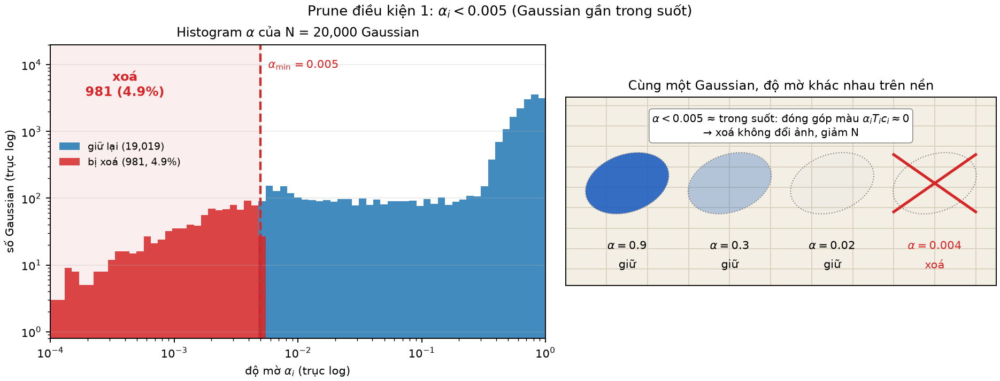

*Điều kiện (P1): phân bố $\alpha$ của tập Gaussian và vạch ngưỡng $0.005$; phần bên trái vạch bị xoá thẳng. Đóng góp màu $\alpha_iT_i$ của những Gaussian này gần như bằng 0.*

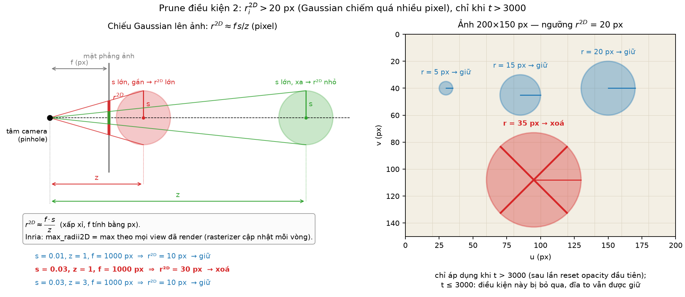

*Điều kiện (P2): cùng một Gaussian 3D cho bán kính chiếu $r^{2D}$ khác nhau tuỳ khoảng cách $z$ tới camera; ngưỡng 20 px chỉ được bật khi $t>3000$.*

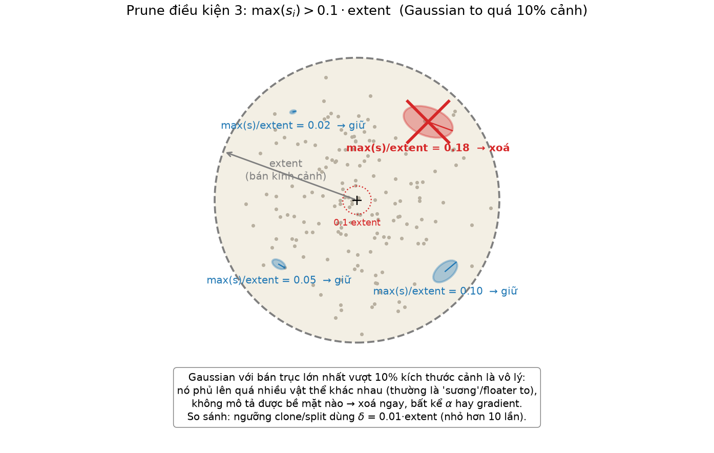

*Điều kiện (P3): ellipsoid có trục dài $>0.1\cdot\text{extent}$ so với kích thước cảnh — Gaussian "to bằng một phần mười cả cảnh" bị xoá bất kể opacity.*

### 5.2 Tại sao gọi là prune "cứng"

| Tính chất | 3DGS gốc (prune cứng) | Ghi chú |
|---|---|---|
| Quyết định | Nhị phân, xoá **ngay** trong bước đó | Không có "danh sách ứng viên" chờ xét ở bước sau |
| Ngân sách | Không có | Nếu 40 % tập Gaussian rơi dưới $0.005$ (điển hình ngay sau reset opacity) thì xoá cả 40 % một lượt |
| Tín hiệu | Chỉ dùng **tham số** của Gaussian ($\alpha$, $s$, $r^{2D}$) | Không hỏi "xoá xong ảnh có xấu đi không" — không có điểm số lỗi render |
| Xác suất | Không | Cùng tham số → cùng kết quả, không lấy mẫu |

Hệ quả trực tiếp: sau mỗi lần reset opacity (mục 6), lần prune 100 vòng sau đó thường xoá **hàng loạt**, rồi các bước clone/split kế tiếp lấp lại — dao động "xoá cụm → lấp cụm" là đặc trưng của luật này.

### 5.3 Ví dụ số — 6 Gaussian, `extent` $=10$ (đơn vị cảnh)

Ngưỡng (P3): $0.1\cdot\text{extent}=1.0$, tức $\max(s_i)/\text{extent}>0.1$.

| id | $\alpha_i$ | $r_i^{2D}$ (px) | $\max(s_i)/\text{extent}$ | $t$ | (P1) $\alpha<0.005$ | (P2) $r^{2D}>20$ & $t>3000$ | (P3) $>0.1$ | Quyết định |
|---|---|---|---|---|---|---|---|---|
| A | 0.003 | 5 | 0.02 | 2000 | **đúng** | sai (chưa bật) | sai | **xoá** (P1) |
| B | 0.50 | 30 | 0.02 | 2000 | sai | sai ($t\le3000$, chưa bật) | sai | giữ |
| C | 0.50 | 30 | 0.02 | 4000 | sai | **đúng** | sai | **xoá** (P2) |
| D | 0.50 | 8 | 0.15 | 4000 | sai | sai | **đúng** | **xoá** (P3) |
| E | 0.006 | 19 | 0.09 | 4000 | sai (sát ngưỡng) | sai (19 < 20) | sai (0.09 < 0.1) | giữ — thoát cả ba, mỗi cái trong gang tấc |
| F | 0.004 | 25 | 0.12 | 5000 | **đúng** | **đúng** | **đúng** | **xoá** (cả ba, chỉ cần một) |

Điểm cần thấy: **B và C có cùng tham số**, chỉ khác $t$ — B sống vì (P2) chưa được bật, C chết. Đây chính là "thời gian ân hạn" 3000 vòng cho Gaussian non.

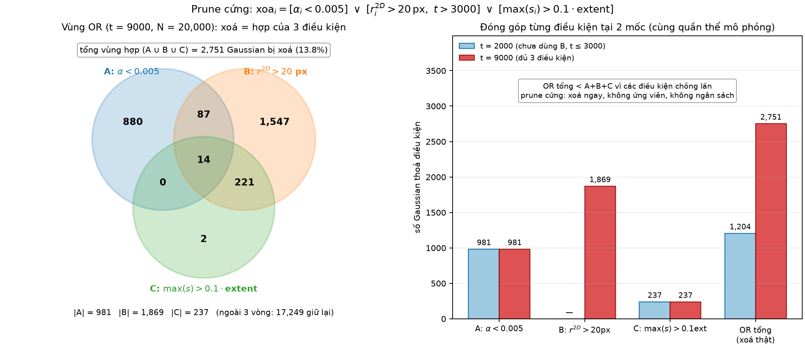

*Ba điều kiện (P1)(P2)(P3) và hợp (OR) của chúng trong không gian tham số: một Gaussian chỉ sống sót khi nằm ngoài **cả ba** vùng cấm.*

### 5.4 Ví dụ $r^{2D}$ từ scale 3D — mô hình pinhole

Với camera pinhole tiêu cự $f$ (px), Gaussian có trục dài $s$ (đơn vị cảnh) ở độ sâu $z$ chiếu ra bán kính xấp xỉ:

$$
r^{2D}\ \approx\ \frac{f\cdot s}{z}
$$

Ví dụ: $s=0.03$, $z=1$, $f=1000$ px:

$$
r^{2D}\approx\frac{1000\times0.03}{1}=30\ \text{px}>20\ \text{px}
$$

| $t$ | (P2) hoạt động? | Kết quả |
|---|---|---|
| 2000 | không ($t\le3000$) | **giữ** |
| 4000 | có | **xoá** |

Cùng Gaussian đó nhưng nếu camera lùi ra $z=2$: $r^{2D}\approx15$ px → giữ ở mọi $t$. Vì rasterizer ghi nhận $r^{2D}$ là **max qua các view đã render** kể từ lần prune trước, chỉ cần **một** view gần là đủ vi phạm.

> (diễn giải thêm) Rasterizer của Inria trả `radii` $=\lceil3\sqrt{\lambda_{\max}}\rceil$ với $\lambda_{\max}$ là trị riêng lớn nhất của hiệp phương sai 2D, tức ứng với $3\sigma$; nên "20 px" nghĩa là $\sigma$ chiếu $\approx6.7$ px. Công thức $f\,s/z$ ở trên là ước lượng $1\sigma$ đơn giản để hình dung; với hệ số 3 thì $s=0.03,\ z=1,\ f=1000$ cho $r^{2D}\approx90$ px, càng chắc chắn bị xoá.

---

## 6. Reset opacity

### 6.1 Công thức

Tại các mốc $t=3000k$ ($k=1,2,3,4$ → $3000,6000,9000,12000$; mốc 15000 không nằm trong cửa sổ $t<15000$):

$$
\boxed{\ \tilde\alpha_i\ \leftarrow\ \sigma^{-1}\bigl(\min(\alpha_i,\ 0.01)\bigr)\quad\text{với}\quad \sigma^{-1}(a)=\ln\frac{a}{1-a}\ }
$$

Tham số **thật sự được học** là logit $\tilde\alpha_i\in\mathbb R$; opacity dùng khi render là $\alpha_i=\sigma(\tilde\alpha_i)=\dfrac{1}{1+e^{-\tilde\alpha_i}}\in(0,1)$. Vì vậy reset phải viết vào $\tilde\alpha$ qua hàm ngược $\sigma^{-1}$ (logit), không phải gán $\alpha$ trực tiếp. Trong code Inria, `reset_opacity()` tính `inverse_sigmoid(min(opacity, 0.01))` rồi **thay hẳn tensor tham số trong optimizer** (kèm xoá moment Adam của opacity).

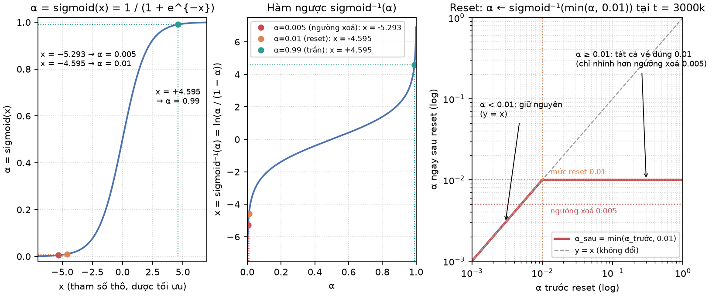

*Cặp $\sigma$ / $\sigma^{-1}$: reset kéo mọi điểm $\alpha>0.01$ về đúng mốc $\sigma^{-1}(0.01)\approx-4.595$ trên trục logit; ngưỡng prune $0.005$ nằm ngay dưới, cách $\ln2\approx0.69$ đơn vị logit.*

### 6.2 Vài giá trị số

| $a$ | $\sigma^{-1}(a)=\ln\frac{a}{1-a}$ | Ghi chú |
|---|---|---|
| 0.005 | $\ln\frac{0.005}{0.995}\approx\ln(0.005025)\approx\mathbf{-5.293}$ | ngưỡng prune (P1) |
| 0.01 | $\ln\frac{0.01}{0.99}\approx\ln(0.010101)\approx\mathbf{-4.595}$ | giá trị reset |
| 0.3 | $\ln\frac{0.3}{0.7}\approx-0.847$ | |
| 0.5 | $\ln1=0$ | |
| 0.9 | $\ln9\approx+2.197$ | |
| 0.99 | $\ln99\approx\mathbf{+4.595}$ | trần thực tế giữa hai lần reset (đối xứng với $0.01$) |

Khoảng cách logit giữa giá trị reset và ngưỡng xoá:

$$
\sigma^{-1}(0.01)-\sigma^{-1}(0.005)=\ln\frac{0.01\cdot0.995}{0.99\cdot0.005}=\ln(2.0101)\approx0.698\approx\ln2
$$

— rất **hẹp**. Sau reset, Gaussian nào bị gradient đẩy logit xuống thêm $\approx0.7$ là rơi qua ngưỡng xoá.

### 6.3 Ví dụ số — $\alpha$ trước và sau reset

| $\alpha_i$ trước | $\min(\alpha_i,0.01)$ | $\tilde\alpha_i$ sau reset | $\alpha_i$ sau reset | Nhận xét |
|---|---|---|---|---|
| 0.90 | 0.01 | $-4.595$ | 0.01 | Gaussian "đục" bị kéo tụt 90 lần |
| 0.30 | 0.01 | $-4.595$ | 0.01 | cùng đích với 0.90 — reset **xoá ký ức** về mức opacity cũ |
| 0.01 | 0.01 | $-4.595$ | 0.01 | không đổi |
| 0.004 | 0.004 | $-5.517$ | 0.004 | không đổi — đã dưới ngưỡng xoá, sẽ bị prune ở bước densify kế |

$\min(\cdot,0.01)$ đảm bảo reset **chỉ kéo xuống, không bao giờ kéo lên**: Gaussian đang mờ hơn 0.01 giữ nguyên (và vẫn bị prune như thường).

### 6.4 Tại sao cần reset

| Vấn đề nếu không reset | Cơ chế reset giải quyết |
|---|---|
| Gaussian **tích luỹ opacity ảo**: tối ưu đẩy $\alpha\to0.99$ ở những Gaussian nằm gần camera, chúng "chôn" toàn bộ Gaussian phía sau ($T_j\approx0.01$) — gradient của Gaussian phía sau $\approx0$, không bao giờ được sửa hoặc bị prune | Kéo **tất cả** về $0.01$ → $T$ của mọi lớp trở lại $\approx1$, mọi Gaussian "được nhìn thấy" lại, phải tự chứng minh mình hữu ích bằng cách tăng $\alpha$ lên từ đầu |
| Gaussian trôi nổi ("floater") có $\alpha$ lớn nhưng vô nghĩa, không giảm vì loss cục bộ đã ổn định | Sau reset, nếu không có view nào cần nó, gradient không đẩy $\alpha$ lên → dừng ở $0.01$ hoặc tụt xuống $<0.005$ → **prune** |
| Ngưỡng xoá $0.005$ hầu như không bao giờ đạt được khi $\alpha$ đang ở $0.9$ | Giá trị reset $0.01$ chỉ **nhỉnh hơn** ngưỡng xoá $0.005$ (cách $\ln2$ trên trục logit): Gaussian vô ích rơi xuống dưới $0.005$ chỉ sau vài bước và bị loại ở lần densify kế |

Giữa hai lần reset (3000 vòng), $\alpha$ **hoàn toàn tự do**: không có trần nào ngoài giới hạn sigmoid; trên thực tế đạt tới $\approx0.99$ (logit $+4.6$). Chu kỳ đục ↔ trong 3000 vòng này lặp 4 lần.

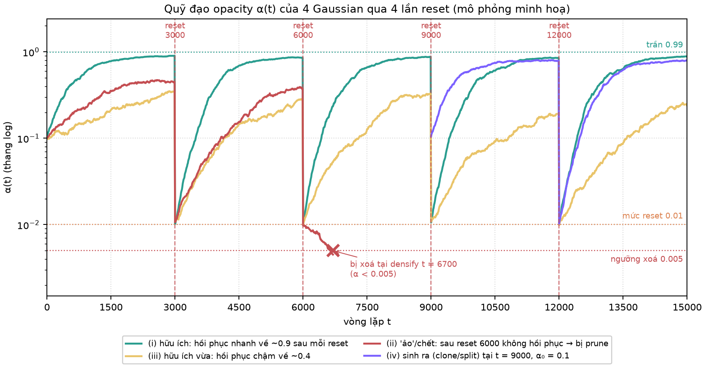

*Quỹ đạo $\alpha_i(t)$ của một vài Gaussian qua các mốc reset 3000/6000/9000/12000: Gaussian hữu ích leo lại nhanh sau mỗi cú kéo về 0.01; Gaussian vô ích trượt xuống dưới 0.005 và bị prune ở bước densify kế tiếp.*

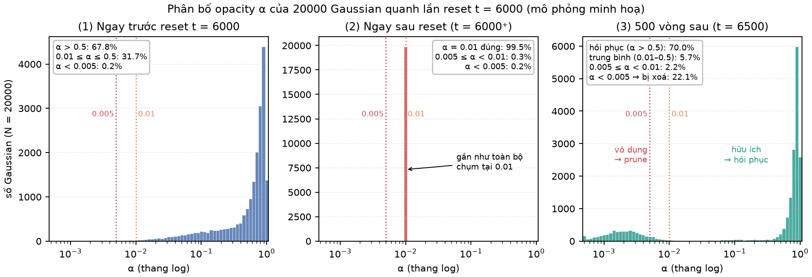

*Histogram $\alpha$ ngay trước và ngay sau một lần reset: toàn bộ khối bên phải dồn về một cột duy nhất tại $0.01$; phần $<0.005$ giữ nguyên.*

### 6.5 (diễn giải thêm) Tương tác reset ↔ densify/prune trên trục thời gian

| Mốc | Việc xảy ra (theo thứ tự trong `train.py`) |
|---|---|
| $t=3000$ | `densify_and_prune` (vì $3000\bmod100=0$) **rồi** `reset_opacity` — nên bước prune tại 3000 vẫn dùng $\alpha$ cũ, chưa bị ảnh hưởng |
| $t=3001\ldots3099$ | 99 vòng tối ưu với $\alpha$ khởi đầu $0.01$; Adam đã bị xoá moment của opacity nên bước đầu tiên "nguội" |
| $t=3100$ | **Lần prune đầu tiên sau reset**: mọi Gaussian có $\alpha<0.005$ bị xoá — thường là đợt xoá lớn nhất của cả chu kỳ. Cũng chính từ mốc này (P2) $r^{2D}>20$ bắt đầu hoạt động ($t>3000$) |
| $t=3100\ldots5900$ | 29 mốc densify tiếp theo: $\alpha$ tự do tăng, clone/split lấp chỗ trống |
| $t=6000,9000,12000$ | Lặp lại; tổng cộng **4** lần reset, mỗi lần kéo theo một đợt prune lớn 100 vòng sau |
| $t=15000$ | Không reset ($t<15000$ sai), không densify: $N$ đóng băng; $\alpha$ tiếp tục được học tự do tới 30000 |

Ước lượng thô: `opacity_lr` mặc định $0.05$; Adam với gradient cùng dấu liên tục dịch logit $\approx0.05$/vòng, nên trong 100 vòng logit có thể đi tối đa $\approx5$ đơn vị — vừa đủ từ $-4.6$ lên $\approx0$ (tức $\alpha\approx0.5$) nếu Gaussian thật sự cần, và chỉ cần $\approx14$ vòng đẩy xuống để rơi qua $-5.29$ nếu không cần. Đây là lý do cửa sổ 100 vòng giữa reset và lần prune đầu là "vừa đủ" để phân loại.

---

## 7. Sơ đồ luồng toàn bộ chu trình

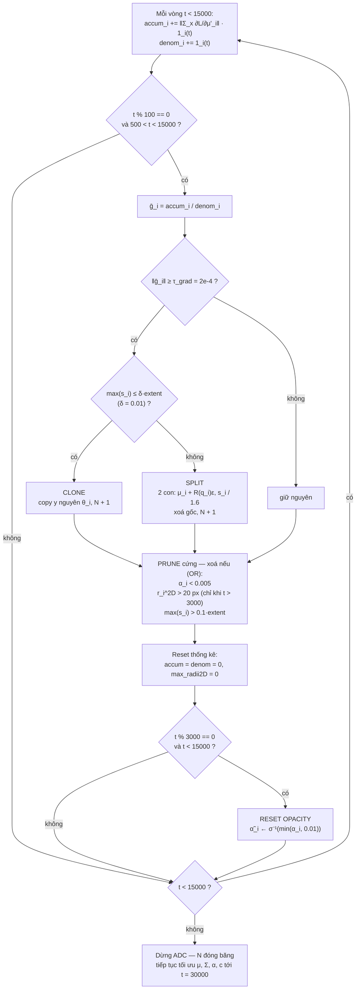

**Một bước `densify_and_prune` theo thứ tự thật trong code Inria** (gọi tại $t\bmod100=0$, $500<t<15000$):

| # | Bước | Hàm Inria | Ghi chú |
|---|---|---|---|
| 1 | Tính $\bar g_i=\text{accum}_i/\text{denom}_i$, gán $0$ cho Gaussian chưa từng được nhìn thấy (`denom = 0`) | đầu `densify_and_prune` | `grads[grads.isnan()] = 0` |
| 2 | **Clone**: chọn $[\lVert\bar g\rVert\ge\tau]\wedge[\max s\le\delta\,\text{extent}]$, nối bản sao vào cuối tensor | `densify_and_clone` | thống kê của toàn tập được đặt lại $0$ ngay sau khi nối (`densification_postfix`) |
| 3 | **Split**: chọn cùng điều kiện gradient nhưng $\max s>\delta\,\text{extent}$ (mask được đệm $0$ cho phần vừa clone), sinh 2 con, xoá gốc | `densify_and_split` | scale con $=s/1.6$; gốc bị xoá qua `prune_points` |
| 4 | **Prune cứng**: `mask = α < 0.005`; nếu $t>3000$: `mask \|= max_radii2D > 20`, `mask \|= max(s) > 0.1·extent` | cuối `densify_and_prune` | quét **cả** Gaussian vừa sinh ở bước 2–3 |
| 5 | Xoá theo mask: cắt tensor tham số, moment Adam, `accum`, `denom`, `max_radii2D` | `prune_points` | $N$ giảm |
| 6 | Giải phóng bộ nhớ GPU; về `train.py`, nếu $t\bmod3000=0$ thì `reset_opacity` | `torch.cuda.empty_cache()` | reset **sau** prune, nên $\alpha$ mới không ảnh hưởng bước prune vừa rồi |

Lưu ý thứ tự 2 → 3 → 4: bản clone mang **nguyên** $\alpha$ của gốc; nếu gốc có $\alpha<0.005$ mà gradient vẫn lớn, cả gốc lẫn bản sao đều bị xoá ngay ở bước 4 — clone "công cốc". Ngược lại, Gaussian sinh ở bước 2–3 có `max_radii2D = 0` (thống kê vừa được đặt lại) nên (P2) **không** đụng tới chúng trong cùng bước.

---

## 8. Ví dụ tổng hợp: một bước `densify_and_prune` tại $t=6000$

Cảnh có $\text{extent}=10$ → $\delta\cdot\text{extent}=0.1$ (ranh giới clone/split), $0.1\cdot\text{extent}=1.0$ (ngưỡng (P3)). $t=6000>3000$ nên (P2) hoạt động. $\tau_{\text{grad}}=2\times10^{-4}$.

### 8.1 Bảng 8 Gaussian — densify rồi prune

| id | $\lVert\bar g_i\rVert$ | $\max(s_i)/\text{extent}$ | $\alpha_i$ | $r_i^{2D}$ (px) | → densify | → prune? | → sống sót (đếm) |
|---|---|---|---|---|---|---|---|
| 1 | $3.1\times10^{-4}$ ≥ τ | 0.004 ≤ 0.01 | 0.60 | 8 | **clone** | gốc: không; bản sao ($\alpha=0.60$, $r^{2D}=0$): không | 2 (gốc + 1′) |
| 2 | $5.0\times10^{-4}$ ≥ τ | 0.030 > 0.01 | 0.70 | 15 | **split** → gốc xoá, 2 con scale $0.030/1.6=0.01875$ | 2 con: $\alpha=0.70$, $0.01875<0.1$, $r^{2D}=0$ → không | 2 (2a, 2b) |
| 3 | $1.0\times10^{-4}$ < τ | 0.005 | 0.50 | 5 | giữ | không | 1 |
| 4 | $2.5\times10^{-4}$ ≥ τ | 0.002 ≤ 0.01 | **0.003** | 4 | **clone** (điều kiện gradient không hỏi $\alpha$) | gốc **và** bản sao đều $\alpha=0.003<0.005$ → **xoá cả hai** | 0 |
| 5 | $1.5\times10^{-4}$ < τ | 0.020 | 0.80 | **26** | giữ | $r^{2D}=26>20$, $t>3000$ → **xoá** | 0 |
| 6 | $6.0\times10^{-4}$ ≥ τ | **0.150** > 0.01 | 0.90 | 40 | **split** → gốc xoá, 2 con scale $0.150/1.6=0.094$ | 2 con: $0.094<0.1$, $r^{2D}=0$, $\alpha=0.90$ → không | 2 (6a, 6b) |
| 7 | $8.0\times10^{-5}$ < τ | **0.120** | 0.70 | 18 | giữ | $0.120>0.1$ → **xoá** (P3) | 0 |
| 8 | $2.0\times10^{-4}$ = τ (≥ đúng dấu bằng) | 0.010 = δ (≤ đúng dấu bằng) | 0.02 | 6 | **clone** | $\alpha=0.02\ge0.005$ → không | 2 (gốc + 8′) |

Chú ý hai trường hợp "ranh giới":

- **id 6** có $\max(s)/\text{extent}=0.15>0.1$: nếu gradient nhỏ nó sẽ bị (P3) xoá thẳng; nhưng vì $\lVert\bar g\rVert\ge\tau$ nên split chạy **trước** prune, gốc bị xoá bởi split, hai con co còn $0.094<0.1$ → **thoát** (P3). Một Gaussian "quá to nhưng đang có lỗi lớn" được cứu bằng cách chẻ nhỏ chứ không bị vứt.
- **id 4** cho thấy clone không kiểm tra $\alpha$: sinh ra bản sao rồi cả hai chết ngay — chi phí vô ích, nhưng $N$ cuối cùng vẫn đúng.

### 8.2 Kiểm đếm $N$

$$
\begin{aligned}
N_{\text{trước}} &= 8\\
\text{clone (id 1, 4, 8)} &: +3 \quad\Rightarrow\ 11\\
\text{split (id 2, 6)} &: +2\cdot2-2=+2 \quad\Rightarrow\ 13\\
\text{prune} &: -\underbrace{2}_{\text{id 4, 4}'}-\underbrace{1}_{\text{id 5}}-\underbrace{1}_{\text{id 7}}=-4 \quad\Rightarrow\ \boxed{N_{\text{sau}}=9}
\end{aligned}
$$

Danh sách sống sót (9): $1,\ 1',\ 2a,\ 2b,\ 3,\ 6a,\ 6b,\ 8,\ 8'$.

### 8.3 Reset opacity ngay sau đó ($6000\bmod3000=0$)

Vì $t=6000$ cũng là mốc reset, sau prune `train.py` gọi `reset_opacity` trên 9 Gaussian còn lại:

| Gaussian | $\alpha$ trước reset | $\min(\alpha,0.01)$ | $\tilde\alpha$ sau | $\alpha$ sau |
|---|---|---|---|---|
| 1, 1′ | 0.60 | 0.01 | $-4.595$ | 0.01 |
| 2a, 2b | 0.70 | 0.01 | $-4.595$ | 0.01 |
| 3 | 0.50 | 0.01 | $-4.595$ | 0.01 |
| 6a, 6b | 0.90 | 0.01 | $-4.595$ | 0.01 |
| 8, 8′ | 0.02 | 0.01 | $-4.595$ | 0.01 |

Toàn bộ 9 Gaussian cùng xuất phát ở $\alpha=0.01$ cho chu kỳ 6000–9000. Bước prune kế tiếp tại $t=6100$ sẽ xoá bất kỳ Gaussian nào trong số này không leo lại được trên $0.005$ trong 100 vòng — kể cả hai con 6a, 6b vừa sinh, dù chúng có $\alpha=0.90$ ở "kiếp trước". Thống kê gradient cũng đã về $0$ nên $\bar g$ dùng ở $t=6100$ chỉ gồm 100 vòng vừa qua.

---

## 9. Bảng tổng hợp hằng số / hyperparameter

| Ký hiệu trong tài liệu | Giá trị | Tên trong code Inria (`arguments/__init__.py`, `train.py`) | Ý nghĩa ngắn |
|---|---|---|---|
| $\tau_{\text{grad}}$ | $2\times10^{-4}$ | `densify_grad_threshold` | Ngưỡng $\lVert\bar g_i\rVert$ (không gian màn hình/NDC) để được densify — dùng chung cho clone và split |
| $\delta$ = `percent_dense` | $0.01$ | `percent_dense` | Ranh giới "nhỏ/to": $\max s\le\delta\,\text{extent}$ → clone, ngược lại → split |
| $\text{extent}$ | theo cảnh | `scene.cameras_extent` (`spatial_lr_scale`) | Bán kính cảnh ước lượng từ bao các camera; mọi ngưỡng scale tính tương đối theo nó |
| $\alpha_{\min}$ | $0.005$ | `min_opacity` (đối số của `densify_and_prune`, hằng trong `train.py`) | (P1) xoá Gaussian trong suốt |
| $r^{2D}_{\max}$ | $20$ px | `max_screen_size` = `size_threshold` (= 20 nếu $t>$ `opacity_reset_interval`, else `None`) | (P2) xoá Gaussian chiếm đĩa $>20$ px trên ảnh |
| tỉ lệ scale tối đa | $0.1$ | hằng `0.1 * extent` trong `densify_and_prune` | (P3) xoá Gaussian có trục dài $>10\%$ cảnh |
| hệ số co scale khi split | $1.6$ | hằng `0.8 * N` trong `densify_and_split` (chia cho $0.8\cdot2=1.6$) | Scale con $=s/1.6$ |
| số con khi split | $2$ | `N = 2` (đối số mặc định của `densify_and_split`) | Mỗi gốc → 2 con, gốc xoá, $N+1$ |
| giá trị reset opacity | $0.01$ | hằng `0.01` trong `reset_opacity` | $\tilde\alpha\leftarrow\sigma^{-1}(\min(\alpha,0.01))$ |
| trần opacity giữa hai reset | $0.99$ (thực tế) | không có tham số — giới hạn của sigmoid và lr | $\alpha$ tự do, chạm $\approx0.99$ (logit $+4.6$) |
| bắt đầu densify | $500$ | `densify_from_iter` | Bước densify đầu tiên tại $t=600$ (điều kiện $t>500$ và $t\bmod100=0$) |
| chu kỳ densify | $100$ | `densification_interval` | 144 mốc: $600,700,\ldots,14900$ |
| kết thúc densify | $15000$ | `densify_until_iter` | Tích luỹ thống kê và densify chỉ khi $t<15000$; sau đó $N$ đóng băng |
| chu kỳ reset opacity | $3000$ | `opacity_reset_interval` | Reset tại $3000,6000,9000,12000$ (4 lần); đồng thời là mốc bật (P2)/(P3) |
| tổng số vòng | $30000$ | `iterations` | Nửa sau (15000–30000) chỉ tối ưu tham số |
| learning rate opacity | $0.05$ | `opacity_lr` | (diễn giải thêm) quyết định tốc độ leo lại sau reset |

---

## 10. Tóm tắt kết quả mô phỏng toy

Script `adc_3dgs_demo.py` (cùng thư mục) mô phỏng toàn bộ chu trình trên bằng numpy: $N_0$ Gaussian rải đều trong ô vuông $[0,1]^2$, "vùng chi tiết cao" giả lập là băng quanh đường tròn tâm $(0.5,0.5)$, bán kính $0.3$ — Gaussian nằm trong băng nhận gradient giả lập lớn hơn $\tau_{\text{grad}}$, nơi khác chỉ $\approx0.3\,\tau_{\text{grad}}$. Lịch chạy, ngưỡng và ba điều kiện prune, reset opacity dùng đúng hằng số ở mục 9.

- $N$ ban đầu: **300**
- $N$ cuối (sau $t=15000$, đóng băng): **5932** (144 lần densify: 5712 clone, 296 split, 376 prune; tỉ lệ Gaussian nằm trong băng $|d-0.3|<0.05$: 20.3% → 98.0%)

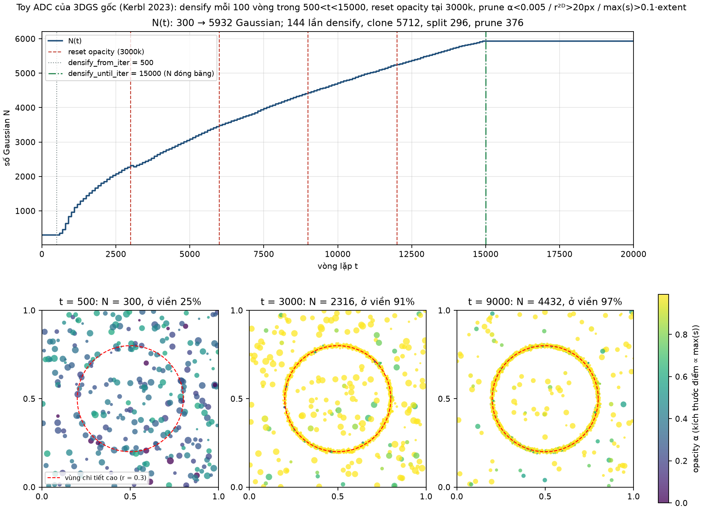

*Trái: $N(t)$ tăng theo **bậc thang** (mỗi bậc là một mốc densify cách nhau 100 vòng) trong cửa sổ $500<t<15000$, có các cú tụt nhỏ ngay sau mỗi mốc reset 3000/6000/9000/12000 rồi lấp lại, và **phẳng hoàn toàn** sau 15000. Phải: scatter vị trí Gaussian — ban đầu rải đều, cuối cùng **tụ dày quanh vòng tròn $r=0.3$** (nơi gradient vượt $\tau$ nên được clone/split liên tục), trong khi vùng nền thưa dần do prune.*

---

## 11. Nguồn

- Công thức ở các mục 1–9 được tóm tắt từ bài báo **"3D Gaussian Splatting for Real-Time Radiance Field Rendering"** — B. Kerbl, G. Kopanas, T. Leimkühler, G. Drettakis, *ACM Transactions on Graphics (SIGGRAPH 2023)* — theo **triển khai mặc định của Inria** tại `graphdeco-inria/gaussian-splatting`:
  - `scene/gaussian_model.py`: `densify_and_prune`, `densify_and_clone`, `densify_and_split`, `densification_postfix`, `prune_points`, `reset_opacity`, `add_densification_stats`;
  - `train.py`: khối `if iteration < opt.densify_until_iter` (tích luỹ thống kê, gọi densify mỗi `densification_interval`, `size_threshold = 20 if iteration > opt.opacity_reset_interval else None`, gọi `reset_opacity` mỗi `opacity_reset_interval`);
  - `arguments/__init__.py`: giá trị mặc định của các hyperparameter trong bảng mục 9.
- Mọi đoạn đánh dấu **"(diễn giải thêm)"** — ước lượng $r^{2D}\approx fs/z$, chuyện `max_radii2D = 0` của Gaussian mới sinh, ước lượng tốc độ leo lại sau reset theo `opacity_lr`, nhận xét về thứ tự clone → split → prune → reset — là suy luận của tài liệu này từ việc đọc code và bài báo, không phải phát biểu trực tiếp của tác giả gốc.
- Ví dụ số ở các mục 5.3, 5.4, 6.3, 8 là ví dụ tự dựng để minh hoạ cách áp dụng công thức; số liệu mô phỏng ở mục 10 lấy từ `adc_3dgs_demo.py`.
