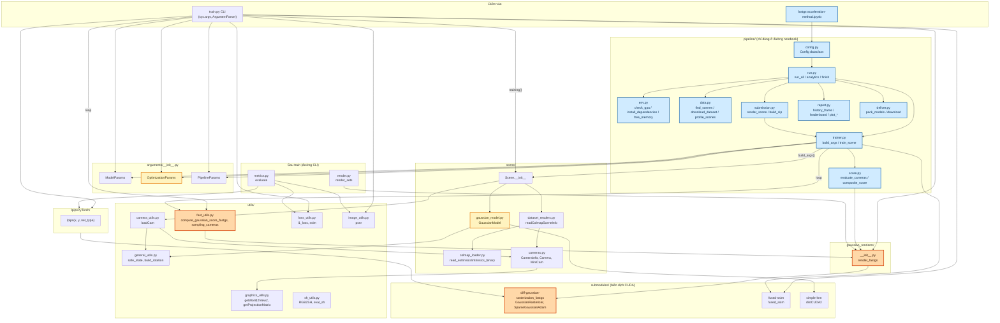

# DIGITAL TWIN GS PIPELINE (1/3) — Từ câu lệnh tới dữ liệu sẵn sàng

> **Tài liệu tham chiếu kỹ thuật đầy đủ cho codebase fastgs-lite hiện hành.**
> Mỗi file, mỗi hàm, mỗi hằng số, mỗi nhánh `if` mà một lần train chạm tới — theo
> đúng thứ tự thực thi, kèm sơ đồ Mermaid, bảng đối chiếu và trace dữ liệu.
> Số cụ thể (số Gaussian, dB, dung lượng, thời gian) đều là **ví dụ minh hoạ**,
> không phải nhật ký một lần chạy thật đã đo được.
>
> Tài liệu này thay thế hoàn toàn bản `PIPELINE-1/2/3` cũ. Bản cũ mô tả một
> codebase "DroneSplat" đã không còn tồn tại trong repo (`train.py --scene --iter
> --use_masks`, mask SAM2, DUSt3R pose refinement, `pose_optimizer`,
> `run_dronesplat.py`, `train_list.txt`/`test_list.txt`…). Toàn bộ nội dung dưới
> đây được đối chiếu lại từng dòng với mã nguồn hiện tại trong repo
> `digital-twin-gs/`.

**Quy ước ký hiệu**

| Ký hiệu | Nghĩa |
|---|---|
| **File:** `scene/xyz.py` | Đường dẫn tính từ gốc repo `digital-twin-gs/` |
| **Hàm:** `foo()` | Tên hàm / phương thức trong file vừa nêu |
| `file.py:12` | Số dòng cụ thể trong file đó tại thời điểm viết tài liệu này |
| ① ② ③ | Số thứ tự bước trong một chuỗi xử lý |
| ★ | Điểm mấu chốt, dễ hiểu sai |
| ⚠ | Cạm bẫy đã từng gây lỗi thật hoặc khác biệt so với 3DGS gốc |
| ↺ | Vòng lặp khép kín (feedback loop) |
| 🔒 | Điểm đồng bộ hoá / phẫu thuật trạng thái optimizer |

**Ký hiệu toán dùng từ PHẦN III trở đi**

| Ký hiệu | Nghĩa | Trong mã |
|---|---|---|
| $P$ | số Gaussian trong mô hình (đổi mỗi lần densify/prune) | `_xyz.shape[0]` |
| $\boldsymbol\mu$ | tâm một Gaussian, 3 số | `_xyz[i]` |
| $\Sigma$ | hiệp phương sai 3D — "hình dạng" Gaussian, $3\times3$ | dẫn xuất từ $R,S$ qua `build_covariance_from_scaling_rotation` |
| $R$ | ma trận quay $3\times3$ | `build_rotation(_rotation)` |
| $S$ | ma trận tỉ lệ chéo $\mathrm{diag}(s_x,s_y,s_z)$ | `exp(_scaling)` (`scaling_activation = torch.exp`) |
| $\mathbf q=(w,x,y,z)$ | quaternion hình dạng, phần thực **trước** | `_rotation[i]` |
| $o$ | opacity gốc $\in(0,1)$ | `sigmoid(_opacity)` (`opacity_activation = torch.sigmoid`) |
| $L$ / $M$ | bậc SH hiện tại (0→3, tăng dần) / bậc tối đa | `active_sh_degree` / `max_sh_degree = sh_degree` (mặc định 3) |
| $r$ | bán kính cảnh (`cameras_extent`) | `spatial_lr_scale`, từ `getNerfppNorm()["radius"]` |
| $\theta_{\text{rel}}$ | ngưỡng gradient tương đối (clone) | `args.grad_thresh` (mặc định `0.0002`) |
| $\theta_{\text{abs}}$ | ngưỡng gradient tuyệt đối (split) | `args.grad_abs_thresh` (mặc định `0.0012`) |

⚠ Repo này **không có pose optimizer**. Không có ký hiệu cho "tư thế camera được
tối ưu trong lúc train" vì hiện tượng đó không tồn tại — xem §6.

---

## MỤC LỤC

### PHẦN I — TỔNG QUAN
- [1. Hai đường chạy tới cùng một vòng lặp](#1-hai-đường-chạy-tới-cùng-một-vòng-lặp)
- [2. Bản đồ toàn hệ thống](#2-bản-đồ-toàn-hệ-thống)
- [3. Danh mục toàn bộ file tham gia](#3-danh-mục-toàn-bộ-file-tham-gia)
- [4. Sơ đồ tuần tự tổng quát](#4-sơ-đồ-tuần-tự-tổng-quát)
- [5. Vòng đời của một Gaussian](#5-vòng-đời-của-một-gaussian)
- [6. Vòng đời của một tư thế camera](#6-vòng-đời-của-một-tư-thế-camera)

### PHẦN II — ĐIỂM VÀO `train.py`
- 7. `train.py::__main__`
- 8. `ParamGroup` và ba `GroupParams` — toàn bộ cờ fastgs-lite
- 9. `pipeline.trainer.build_args`
- 10. `safe_state` và khởi tạo RNG

### PHẦN III — DỰNG SCENE VÀ GAUSSIAN MODEL
- 11. `Scene.__init__`
- 12. `readColmapSceneInfo` + `colmap_loader`
- 13. `readColmapCameras`
- 14. `getNerfppNorm`
- 15. Tách train/test bằng `llffhold` + `cameras.json`
- 16. `cameraList_from_camInfos` → `loadCam` → `Camera.__init__`
- 17. `GaussianModel.__init__` + `setup_functions`
- 18. `create_from_pcd` + `training_setup`

---

# PHẦN I — TỔNG QUAN

## 1. Hai đường chạy tới cùng một vòng lặp

Có đúng hai cách khởi động một phiên train trong repo này, và cả hai đều hội tụ
vào cùng một hàm vòng lặp huấn luyện (khác file, cùng logic): `training()` trong
`train.py` (đường CLI) và `train_scene()` trong `pipeline/trainer.py` (đường
notebook). Không có đường nào khác — không có `run_dronesplat.py`, không có
notebook Colab tên `colab_dronesplat.ipynb`.

### 1.1 Đường CLI

Lệnh thật lấy từ `train_base.sh` (dòng đầu tiên, scene `bicycle`):

```
CUDA_VISIBLE_DEVICES=0 OAR_JOB_ID=bicycle python train.py \
  -s ./datasets/mipnerf360/bicycle -i images --eval \
  --densification_interval 500 --optimizer_type default \
  --test_iterations 30000 --grad_abs_thresh 0.0012
```

Và một dòng khác từ `train_base.sh` có thêm `--mult` (scene Tanks&Temples
`truck`):

```
python train.py -s ./datasets/tanksandtemples/truck --eval \
  --densification_interval 500 --optimizer_type default \
  --test_iterations 30000 --highfeature_lr 0.04 \
  --grad_abs_thresh 0.0009 --mult 0.7
```

`train_big.sh` lặp lại đúng các scene này nhưng đổi `--densification_interval`
xuống `100` (densify dày hơn) và siết `--grad_abs_thresh` (ngưỡng thấp hơn →
split nhiều hơn) — đây là preset "big" so với "base", không phải hai pipeline
khác nhau.

Diễn giải từng cờ đối chiếu `arguments/__init__.py` (nhóm tham số nào định
nghĩa cờ đó):

| Cờ | Nhóm | Mặc định | Ý nghĩa |
|---|---|---|---|
| `-s / --source_path` | `ModelParams` | `""` | Thư mục scene COLMAP (chứa `sparse/`, `images/`) |
| `-i / --images` | `ModelParams` | `"images"` | Tên thư mục ảnh gốc trong `source_path` |
| `--eval` | `ModelParams` | `False` | Bật tách train/test theo `llffhold` (§15); nếu tắt, mọi ảnh dùng để train |
| `-m / --model_path` | `ModelParams` | `""` | Thư mục output; nếu để trống, `train.py::prepare_output_and_logger` tự đặt `./output/<OAR_JOB_ID hoặc uuid4>` |
| `-r / --resolution` | `ModelParams` | `-1` | Hệ số downscale ảnh trong `loadCam()` (§16); `-1` = tự co ảnh > 1.6K px |
| `-w / --white_background` | `ModelParams` | `False` | Nền trắng thay vì đen khi render (dữ liệu Blender) |
| `--sh_degree` | `ModelParams` | `3` | Bậc SH tối đa (`max_sh_degree`) |
| `--iterations` | `OptimizationParams` | `30000` | Tổng số vòng train |
| `--densification_interval` | `OptimizationParams` | `100` | Cứ bao nhiêu vòng thì chạy densify/prune một lần |
| `--densify_from_iter` / `--densify_until_iter` | `OptimizationParams` | `500` / `15000` | Cửa sổ vòng lặp cho phép densify |
| `--opacity_reset_interval` | `OptimizationParams` | `3000` | Chu kỳ reset opacity về tối đa `0.01` |
| `--grad_thresh` | `OptimizationParams` | `0.0002` | Ngưỡng $\theta_{\text{rel}}$ — điều kiện **clone** |
| `--grad_abs_thresh` | `OptimizationParams` | `0.0012` | Ngưỡng $\theta_{\text{abs}}$ — điều kiện **split** |
| `--dense` | `OptimizationParams` | `0.001` | Ngưỡng kích thước (× `extent`) phân biệt Gaussian "nhỏ → clone" và "to → split" |
| `--loss_thresh` | `OptimizationParams` | `0.1` | Ngưỡng lỗi photometric chuẩn hoá để đánh dấu pixel "high-error" trong `compute_gaussian_score_fastgs` |
| `--highfeature_lr` | `OptimizationParams` | `0.005` | LR nhóm `f_rest` (SH bậc cao), thực dùng `/20.0` trong `training_setup` |
| `--lowfeature_lr` | `OptimizationParams` | `0.0025` | LR nhóm `f_dc` (SH bậc 0 / màu nền) |
| `--mult` | `OptimizationParams` | `0.5` | Hệ số nhân "compact box" kiểm soát số tile mỗi splat chạm tới trong rasterizer fastgs-lite |
| `--optimizer_type` | `OptimizationParams` | `"default"` | `"default"` (Adam kép, xem §Phần III/`training_setup`) hoặc `"sparse_adam"` |
| `--test_iterations` | cờ rời trong `__main__` | `[30000]` | Các mốc vòng lặp gọi `training_report` (đường CLI **không** tự chấm điểm nếu dòng gọi bị comment — xem bảng 1.3) |
| `--save_iterations` | cờ rời trong `__main__` | `[30000]`, tự thêm `args.iterations` | Các mốc gọi `scene.save()` (ghi `.ply`) |

★ Các cờ `position_lr_*`, `feature_lr`, `shfeature_lr`, `opacity_lr`,
`scaling_lr`, `rotation_lr`, `percent_dense`, `lambda_dssim`,
`random_background` cũng tồn tại trong `OptimizationParams` nhưng không xuất
hiện trong hai script preset — chúng giữ giá trị mặc định. Danh sách đầy đủ và
lý do từng cờ fastgs-lite được trình bày lại chi tiết ở §8 (PHẦN II, do agent khác
viết).

⚠ Không có `--scene`, không có `--iter` (chỉ có `--iterations`), không có
`--use_masks`, không có `--schedule_densify_grad_threshold`. Đây là các cờ của
bản DroneSplat cũ, `arguments/__init__.py` hiện tại không định nghĩa chúng —
truyền vào sẽ bị `argparse` từ chối.

### 1.2 Đường notebook / `pipeline`

`fastgs-acceleration-method.ipynb` là notebook **tiếng Anh, chỉ đóng vai trò
keo dán** (nguyên văn ô markdown đầu tiên: "This notebook is glue only. Every
step is a function in `pipeline/`"). Luồng gọi:

```
notebook ô code
  → pipeline.env.install_dependencies() / check_gpu()
  → pipeline.data.download_dataset() / find_scenes() / profile_scenes()
  → pipeline.run.run_all(cfg, scenes)
        → pipeline.trainer.train_scene(cfg, scene)      # train + chấm điểm định kỳ
        → pipeline.submission.render_scene(cfg, scene)  # render test pose + chấm
  → pipeline.run.analytics() → pipeline.report.*
  → pipeline.run.finish() → pipeline.submission.build_zip / pipeline.deliver.*
```

`train_scene()` (`pipeline/trainer.py:52`) tự dựng `Namespace` tham số bằng
`build_args()` (§9) rồi lặp gần như song song với `training()` của `train.py`:
cùng `gaussians.update_learning_rate`, cùng `oneupSHdegree` mỗi 1000 vòng, cùng
vòng lặp lấy camera ngẫu nhiên, cùng `render_fastgs` + `l1_loss` +
`fast_ssim`. Điểm khác biệt nằm ở việc `train_scene` gọi
`evaluate_cameras()` (`pipeline/score.py`) định kỳ mỗi `cfg.score_every` vòng để
tính **Score** cuộc thi ngay trong lúc train — điều `training()` của `train.py`
không làm (dòng gọi `training_report` trong `train.py` đã bị **comment**, xem
`train.py` ngay dưới nhận xét `# Log and save`).

### 1.3 Bảng so sánh hai đường chạy

| Khía cạnh | CLI (`train.py::training`) | Notebook (`pipeline.trainer.train_scene`) |
|---|---|---|
| Ai dựng `Namespace` tham số | `ArgumentParser` đọc `sys.argv` trực tiếp trong `__main__` | `pipeline.trainer.build_args()` tự ghép `argv` từ `Config` (dataclass) rồi gọi cùng `ArgumentParser` |
| Ai ghi `cfg_args` | `prepare_output_and_logger()` trong `train.py` | `build_args()` (khi `write_cfg=True`, mặc định) |
| Chấm điểm trong lúc train | **Không** — `training_report()` tồn tại nhưng dòng gọi nó bị comment trong `training()` | **Có** — gọi `evaluate_cameras()` mỗi `cfg.score_every` vòng, ghi vào `history` |
| Nguồn camera test để chấm | N/A (không chấm) | `scene_obj.getTestCameras()`; nếu rỗng thì lấy `getTrainCameras()[::8]` làm `holdout` |
| Vòng lặp Densify/Prune fastgs-lite | Y hệt: `densify_and_prune_fastgs` mỗi `densification_interval` vòng trong `(densify_from_iter, densify_until_iter)`, `final_prune_fastgs` mỗi 3000 vòng trong khoảng `(15000, 30000)` | Y hệt (đọc `pipeline/trainer.py` phần còn lại ngoài đoạn đã trích ở trên — cùng gọi `compute_gaussian_score_fastgs`, `densify_and_prune_fastgs`, `final_prune_fastgs`) |
| Quản lý bộ nhớ giữa các scene | Không áp dụng (1 tiến trình = 1 scene) | `pipeline.env.free_memory()` gọi `gc.collect()` + `torch.cuda.empty_cache()` giữa các scene trong `run_all()` |
| Sau train | Người dùng tự chạy `render.py` rồi `metrics.py` (xem cuối `train_base.sh`) | `run_all()` tự gọi `submission.render_scene()` ngay sau mỗi scene; `finish()` đóng gói `submission.zip` + `.ply` rồi tải về |
| Websocket viewer trực tiếp | Có, qua cờ `--websockets` → `gaussian_renderer.network_gui_ws` | Không có trong `pipeline/` |
| Checkpoint `.pth` (resume) | Có, qua `--start_checkpoint` + `gaussians.restore()` | Không dùng — mỗi lần gọi `train_scene` train từ đầu |

★ Cả hai đường **dùng chung** `arguments/__init__.py`, `scene/`,
`gaussian_renderer/render_fastgs`, `utils/fast_utils.py`. `pipeline/` không định
nghĩa lại thuật toán train — nó chỉ bọc thêm lớp cấu hình, đo lường và đóng gói
xung quanh cùng một lõi.

---

## 2. Bản đồ toàn hệ thống



**Chú giải màu**

| Màu | Nghĩa | Node |
|---|---|---|
| 🟧 Cam | **Cơ chế khác 3DGS** — tồn tại chỉ vì fastgs-lite | `fast_utils.py` (điểm số đa góc nhìn), `render_fastgs` (truyền `mult`), rasterizer CUDA (compact box) |
| 🟨 Vàng | **Kế thừa 3DGS nhưng đã bị sửa** | `GaussianModel` (`densify_and_prune_fastgs`, `final_prune_fastgs`, `shoptimizer`, `optimizer_step`); `OptimizationParams` (7 cờ riêng: `loss_thresh`, `grad_thresh`, `grad_abs_thresh`, `dense`, `mult`, `highfeature_lr`, `lowfeature_lr`) |
| 🟦 Xanh | **Hạ tầng riêng của fork này** — không có trong upstream, chỉ phục vụ đường Colab | toàn bộ `pipeline/` + notebook |
| ⬜ Trắng | Kế thừa nguyên vẹn từ 3DGS/INRIA | `scene/`, phần còn lại của `utils/`, `render.py`, `metrics.py`, `lpipsPyTorch` |

Chi tiết từng cơ chế cam/vàng: [fastgs-acceleration-method.md](fastgs-acceleration-method.md).

★ `pipeline/` không hề gọi trực tiếp `train.py`; nó dùng lại `scene/`,
`gaussian_renderer/`, `utils/` như một thư viện. `arguments/__init__.py` được cả
hai đường import độc lập.

---

## 3. Danh mục toàn bộ file tham gia

| File | Vai trò |
|---|---|
| `train.py` | Điểm vào CLI: parse cờ, gọi `training()` — vòng lặp huấn luyện đầy đủ (densify/prune/save) |
| `train_base.sh` | Preset lệnh train cho 13 scene chuẩn (mipnerf360 + tanksandtemples + db), rồi `render.py` + `metrics.py` |
| `train_big.sh` | Preset thứ hai, cùng scene nhưng `densification_interval=100` và `grad_abs_thresh` thấp hơn |
| `render.py` | Nạp `.ply` đã lưu, render lại toàn bộ train/test camera ra ảnh PNG |
| `metrics.py` | Đọc ảnh render + ground-truth, tính PSNR/SSIM/LPIPS, ghi `results.json`/`per_view.json` |
| `convert.py` | Tiện ích chạy COLMAP (feature extractor/matcher/mapper) để tạo `sparse/0` từ ảnh thô — không nằm trên đường train, chỉ tiền xử lý |
| `full_eval.py` | Script tiện ích chạy hàng loạt train + render + metrics qua nhiều scene bằng `subprocess` |
| `demos/fastgs_mechanisms.py` | Script minh hoạ độc lập (không import bởi pipeline train) mô phỏng lại các công thức fastgs-lite (mask lỗi, đếm tile, quỹ đạo số Gaussian) cho mục đích giải thích |
| `fastgs-acceleration-method.ipynb` | Notebook "glue" tiếng Anh, gọi các hàm trong `pipeline/` theo thứ tự |
| `arguments/__init__.py` | `ParamGroup`, `ModelParams`, `OptimizationParams`, `PipelineParams`, `get_combined_args` |
| `pipeline/config.py` | `Config` — dataclass gom mọi tham số của luồng notebook |
| `pipeline/env.py` | Kiểm tra GPU, cài đặt phụ thuộc (`pip` + 3 submodule CUDA), theo dõi/giải phóng RAM-VRAM |
| `pipeline/data.py` | Tải + giải nén dataset, `find_scenes` (nhận diện scene COLMAP/Blender), `profile_scenes` |
| `pipeline/trainer.py` | `build_args()` dựng `Namespace` 3DGS; `train_scene()` — vòng lặp train + chấm điểm định kỳ |
| `pipeline/score.py` | `composite_score` (công thức điểm cuộc thi) và `evaluate_cameras` (render + đo PSNR/SSIM/LPIPS trên một tập camera) |
| `pipeline/submission.py` | Render toàn bộ test pose ra PNG đúng định dạng nộp bài, đóng gói `submission.zip` |
| `pipeline/report.py` | Gộp lịch sử train thành bảng/biểu đồ (`history_frame`, `leaderboard`, `plot_training`) |
| `pipeline/deliver.py` | Đóng gói `.ply` + cấu hình vào ZIP, chép sang Drive, tải file về máy |
| `pipeline/run.py` | Điều phối toàn bộ: `setup → load_data → run_all → analytics → finish` |
| `scene/__init__.py` | `Scene` — cầu nối dataset đọc từ đĩa ↔ `GaussianModel` |
| `scene/dataset_readers.py` | `readColmapCameras`, `getNerfppNorm`, `readColmapSceneInfo`, `readNerfSyntheticInfo`, `fetchPly`/`storePly` |
| `scene/colmap_loader.py` | Đọc nhị phân/text COLMAP: `read_extrinsics_binary`, `read_intrinsics_binary`, `read_points3D_binary`, `qvec2rotmat` |
| `scene/cameras.py` | `CameraInfo` (NamedTuple thô từ COLMAP), `Camera` (nn.Module dùng khi train/render), `MiniCam` (dùng cho network viewer) |
| `scene/gaussian_model.py` | `GaussianModel` — toàn bộ tham số Gaussian, `create_from_pcd`, `training_setup`, `densify_and_prune_fastgs`, `final_prune_fastgs`, `save_ply`/`load_ply` |
| `gaussian_renderer/__init__.py` | `render_fastgs` — gọi rasterizer CUDA fastgs-lite, trả `render`/`viewspace_points`/`radii`/`accum_metric_counts` |
| `gaussian_renderer/network_gui.py` | Viewer mạng kiểu socket TCP gốc 3DGS (không dùng trong `training()` hiện tại — chỉ còn `network_gui_ws`) |
| `gaussian_renderer/network_gui_ws.py` | Viewer qua WebSocket (`asyncio`), bật bằng cờ `--websockets` |
| `utils/camera_utils.py` | `loadCam` (resize ảnh theo `--resolution`), `cameraList_from_camInfos`, `camera_to_JSON` |
| `utils/general_utils.py` | `safe_state` (seed RNG + gắn timestamp log), `inverse_sigmoid`, `PILtoTorch`, `get_expon_lr_func`, `build_rotation`, `build_scaling_rotation`, `identity_gate` |
| `utils/graphics_utils.py` | `BasicPointCloud`, `getWorld2View2`, `getProjectionMatrix`, `fov2focal`/`focal2fov` |
| `utils/fast_utils.py` | `sampling_cameras`, `get_loss`, `compute_photometric_loss`, `normalize`, `compute_gaussian_score_fastgs` — lõi thuật toán multi-view scoring của fastgs-lite |
| `utils/loss_utils.py` | `l1_loss`, `l2_loss`, `ssim` (bản CPU/python; bản nhanh dùng `fused_ssim`) |
| `utils/image_utils.py` | `mse`, `psnr` |
| `utils/sh_utils.py` | `eval_sh`, `RGB2SH`, `SH2RGB` — chuyển đổi hệ số cầu điều hoà ↔ RGB |
| `utils/system_utils.py` | `mkdir_p`, `searchForMaxIteration` (tìm mốc `.ply` mới nhất để `load_ply`) |
| `lpipsPyTorch/__init__.py` + `modules/` | Cài đặt LPIPS thuần PyTorch (không phụ thuộc package `lpips` ngoài để tính gradient được) |
| `submodules/diff-gaussian-rasterization_fastgs/` | Rasterizer CUDA bản fastgs-lite: `GaussianRasterizationSettings`, `GaussianRasterizer`, `SparseGaussianAdam` |
| `submodules/fused-ssim/` | Kernel CUDA tính SSIM nhanh, dùng làm `fast_ssim` trong loss |
| `submodules/simple-knn/` | Kernel CUDA `distCUDA2` — khoảng cách k-NN dùng để khởi tạo `scaling` ban đầu |

---

## 4. Sơ đồ tuần tự tổng quát

```mermaid
sequenceDiagram
    participant User
    participant Main as train.py::__main__
    participant Train as training()
    participant Scene as Scene.__init__
    participant GM as GaussianModel
    participant Loop as vòng lặp iteration
    participant Rast as render_fastgs / rasterizer CUDA
    participant Fast as fast_utils.compute_gaussian_score_fastgs
    participant Render as render.py
    participant Metrics as metrics.py

    User->>Main: python train.py -s ... -m ... --eval ...
    Main->>Main: ArgumentParser + ModelParams/OptimizationParams/PipelineParams
    Main->>Main: safe_state(quiet) — seed RNG, gắn timestamp log
    Main->>Train: training(dataset, opt, pipe, test_iters, save_iters, ...)
    Train->>Scene: Scene(dataset, gaussians)
    Scene->>Scene: readColmapSceneInfo() -> SceneInfo (train/test CameraInfo, point_cloud)
    Scene->>Scene: cameraList_from_camInfos() -> loadCam() -> Camera(...)
    Scene->>GM: gaussians.create_from_pcd(point_cloud, cameras_extent)
    Train->>GM: gaussians.training_setup(opt) — 2 optimizer Adam (chính + SH cao)
    loop mỗi iteration 1..opt.iterations
        Loop->>GM: update_learning_rate(iteration)
        Loop->>Rast: render_fastgs(random camera, gaussians, pipe, bg, opt.mult)
        Rast-->>Loop: render, viewspace_points, visibility_filter, radii
        Loop->>Loop: L1 + (1-SSIM) -> loss.backward()
        alt iteration in saving_iterations
            Loop->>Scene: scene.save(iteration) -> gaussians.save_ply(...)
        end
        alt densify_from_iter < iteration < densify_until_iter và đến chu kỳ
            Loop->>Fast: compute_gaussian_score_fastgs(camlist mẫu, ...)
            Fast-->>Loop: importance_score, pruning_score
            Loop->>GM: densify_and_prune_fastgs(...)
        end
        alt iteration % 3000 == 0 và 15000 < iteration < 30000
            Loop->>Fast: compute_gaussian_score_fastgs(..., DENSIFY=False)
            Loop->>GM: final_prune_fastgs(min_opacity=0.1, pruning_score)
        end
        Loop->>GM: optimizer_step(iteration) hoặc SparseGaussianAdam.step()
    end
    Train->>Scene: (đường CLI: người dùng tự chạy tiếp) scene.save đã xảy ra ở các mốc lưu
    User->>Render: python render.py -m output/<scene> --skip_train
    Render->>Scene: Scene(dataset, gaussians, load_iteration, shuffle=False)
    Render->>GM: gaussians.load_ply(point_cloud.ply mốc cuối)
    Render->>Rast: render_fastgs cho mọi test camera -> PNG
    User->>Metrics: python metrics.py -m output/<scene>
    Metrics->>Metrics: so PNG render vs PNG gt -> PSNR/SSIM/LPIPS -> results.json
```

---

## 5. Vòng đời của một Gaussian

Một Gaussian trong `GaussianModel` là một hàng trong sáu tensor tham số:
`_xyz`, `_features_dc`, `_features_rest`, `_opacity`, `_scaling`, `_rotation`
(khởi tạo rỗng ở `GaussianModel.__init__`, `scene/gaussian_model.py:57-63`).

| Bước | Hàm : dòng | Điều kiện kích hoạt | Việc xảy ra |
|---|---|---|---|
| ① Sinh ra | `create_from_pcd` — `scene/gaussian_model.py:167` | Luôn chạy một lần khi `Scene.__init__` không nạp checkpoint (`self.loaded_iter` falsy) | Mỗi điểm COLMAP (`pcd.points`) trở thành một Gaussian: `_xyz` = toạ độ điểm, `_scaling` = `log(sqrt(distCUDA2))` (từ `simple_knn`), `_rotation` = quaternion đơn vị `(1,0,0,0)`, `_opacity` = `inverse_sigmoid(0.1)`, SH bậc 0 = màu RGB gốc |
| ② Tích luỹ gradient | `add_densification_stats` — `scene/gaussian_model.py:528` | Mỗi iteration khi `iteration < opt.densify_until_iter`, chỉ với Gaussian trong `visibility_filter` | Cộng dồn `xyz_gradient_accum` (2 chiều đầu grad màn hình → dùng cho clone) và `xyz_gradient_accum_abs` (2 chiều sau → dùng cho split), tăng `denom` |
| ③ Chấm điểm đa góc nhìn | `compute_gaussian_score_fastgs` — `utils/fast_utils.py:45` | Ngay trước mỗi lần gọi densify/prune | Render lại một tập camera mẫu (`sampling_cameras`, 10 camera ngẫu nhiên), tính `photometric_loss` per-pixel, đếm số view mà mỗi Gaussian bị gắn cờ "high-error" (`accum_metric_counts` trả từ rasterizer CUDA khi `get_flag=True`) → `importance_score` (đếm) và `pruning_score` (chuẩn hoá 0..1) |
| ④a Clone | `densify_and_clone_fastgs` — `scene/gaussian_model.py:455`, gọi từ `densify_and_prune_fastgs:496` | Gaussian có `importance_score > 5` **và** gradient tương đối $\ge\theta_{\text{rel}}$ **và** kích thước $\le$ `dense`×`extent` | Nhân bản y hệt tham số, nối vào cuối tensor qua `densification_postfix` |
| ④b Split | `densify_and_split_fastgs` — `scene/gaussian_model.py:431`, gọi từ `densify_and_prune_fastgs:497` | Gaussian có `importance_score > 5` **và** gradient tuyệt đối $\ge\theta_{\text{abs}}$ **và** kích thước $>$ `dense`×`extent` | Tách thành `N=2` Gaussian con lấy mẫu quanh tâm cũ (`torch.normal` theo `std=scaling`), `scaling` con chia `0.8*N`, rồi **xoá** Gaussian cha bằng `prune_points` |
| ⑤ Prune theo ngân sách | `densify_and_prune_fastgs:499-518` | Sau mỗi lần clone/split, cùng chu kỳ `densification_interval` | `prune_mask` = opacity `< 0.005` HOẶC (nếu `max_screen_size` được truyền — tức sau `opacity_reset_interval`) bán kính màn hình lớn / kích thước thế giới `> 0.1*extent`; chỉ xoá `50%` số ứng viên, chọn theo trọng số `1/(1e-6+1-pruning_score)` bằng `torch.multinomial` (Gaussian càng "nhất quán đa góc nhìn thấp" càng dễ bị chọn xoá) |
| ⑥ Reset opacity định kỳ | `reset_opacity` — `scene/gaussian_model.py:279`, gọi mỗi `opacity_reset_interval` vòng | `iteration % opt.opacity_reset_interval == 0` | Ghim opacity mọi Gaussian còn sống về tối đa `0.01` để buộc optimizer đánh giá lại độ hữu ích |
| ⑦ Prune cuối giai đoạn hội tụ | `final_prune_fastgs` — `scene/gaussian_model.py:533` | `iteration % 3000 == 0` và `15000 < iteration < 30000` | Xoá Gaussian có opacity `< 0.1` **hoặc** `pruning_score > 0.9`, không giới hạn ngân sách như bước ⑤ (bình luận trong `train.py`: "the model converge basically... prune more aggressively") |
| ⑧ Ghi ra đĩa | `save_ply` — `scene/gaussian_model.py:260` | Tại mỗi mốc trong `saving_iterations` | Ghi `_xyz`, `f_dc_*`, `f_rest_*`, `opacity`, `scale_*`, `rot_*` thành file `point_cloud.ply` dạng nhị phân PLY |

★ Không có khái niệm "Gaussian được sinh ra từ mask SAM2" hay "Gaussian gắn với
điểm DUSt3R" trong repo hiện tại — điểm khởi tạo duy nhất là point cloud thưa
`sparse/0/points3D` của COLMAP (hoặc điểm ngẫu nhiên nếu là dữ liệu Blender,
`readNerfSyntheticInfo`).

---

## 6. Vòng đời của một tư thế camera

⚠ **Khác biệt quan trọng nhất so với tài liệu cũ: repo hiện tại KHÔNG có pose
optimizer.** Không có `pose_optimizer`, không có bước "tinh chỉnh tư thế camera
trong lúc train", không có DUSt3R. Tư thế camera (`R`, `T`) được đọc một lần từ
COLMAP và giữ **cố định tuyệt đối** suốt quá trình train — `Camera` kế thừa
`nn.Module` (`scene/cameras.py:17`) nhưng `R`, `T`,
`world_view_transform`, `full_proj_transform` được gán bằng `self.R = R` /
`torch.tensor(...)` thường, không bọc trong `nn.Parameter`, nên không nằm trong
bất kỳ `optimizer.param_groups` nào của `GaussianModel.training_setup`.

| Bước | Hàm : dòng | Việc xảy ra |
|---|---|---|
| ① Đọc nhị phân/text COLMAP | `read_extrinsics_binary` / `read_extrinsics_text`, `read_intrinsics_binary` / `read_intrinsics_text` — `scene/colmap_loader.py` | `readColmapSceneInfo` (`scene/dataset_readers.py:135`) thử đọc `sparse/0/images.bin` + `cameras.bin` trước, rơi về `.txt` nếu lỗi (khối `try/except` trần) |
| ② Dựng `CameraInfo` thô | `readColmapCameras` — `scene/dataset_readers.py:69` | Với mỗi ảnh: `R = transpose(qvec2rotmat(qvec))`, `T = tvec`, FOV tính từ tiêu cự COLMAP (`SIMPLE_PINHOLE` hoặc `PINHOLE`; model khác thì `assert False` — dữ liệu **phải** đã undistort) |
| ③ Chuẩn hoá bán kính cảnh | `getNerfppNorm` — `scene/dataset_readers.py:44` | Từ toàn bộ `W2C` suy ra tâm camera trong world, lấy tâm trung bình + đường kính lớn nhất × `1.1` → `radius` dùng làm `cameras_extent` (ảnh hưởng LR vị trí và ngưỡng `dense`) |
| ④ Tách train/test | `readColmapSceneInfo` — `scene/dataset_readers.py:149-150` | Nếu `--eval`: `idx % llffhold != 0` → train, `idx % llffhold == 0` → test. ⚠ **`llffhold` LÀ một cờ CLI thật** (`--llffhold`, mặc định 8) — xem ghi chú ngay dưới bảng; nếu không truyền `--eval`, mọi ảnh vào train |
| ⑤ Ghi `cameras.json` | `Scene.__init__` — `scene/__init__.py:53-61` | Khi chưa nạp checkpoint: ghi mọi camera (test trước, train sau) ra `<model_path>/cameras.json` qua `camera_to_JSON` — dùng để xem lại tư thế bằng công cụ ngoài (ví dụ viewer web), không phải để tối ưu |
| ⑥ Resize + dựng `Camera` train | `loadCam` — `utils/camera_utils.py:15`, gọi từ `cameraList_from_camInfos` | Co ảnh theo `--resolution` (`1/2/4/8` chia thẳng, hoặc `-1` tự co nếu rộng > 1600px); dựng `Camera(colmap_id, R, T, FoVx, FoVy, image, ...)` |
| ⑦ Tính ma trận chiếu | `Camera.__init__` — `scene/cameras.py:18-57` | `world_view_transform = getWorld2View2(R,T).transpose(0,1)`; `full_proj_transform = world_view_transform @ projection_matrix`; `camera_center = world_view_transform.inverse()[3,:3]` — tất cả tính **một lần**, lưu làm thuộc tính thường, không có `.grad` |
| ⑧ Dùng trong render | `render_fastgs` — `gaussian_renderer/__init__.py:18` | `viewpoint_camera.world_view_transform` / `full_proj_transform` / `camera_center` truyền thẳng vào `GaussianRasterizationSettings` của rasterizer CUDA để chiếu Gaussian 3D → ảnh 2D; **không có gradient chảy ngược về camera** vì các tensor này không phải `nn.Parameter` |

⚠ **`llffhold` là cờ CLI, không phải hằng số** — đây là điểm bản trước của tài liệu này nói sai. Đường đi đầy đủ của nó:

| Nơi | Dòng | Nội dung |
|---|---|---|
| Khai báo trong `ModelParams` | `arguments/__init__.py:57` | `self.llffhold = 8` ⇒ `ParamGroup.__init__` tự sinh cờ `--llffhold` kiểu `int` |
| `Scene` đọc ra | `scene/__init__.py:45` | `getattr(args, "llffhold", None) or 8` — có `getattr` phòng thân để tương thích ngược |
| Reader dùng | `scene/dataset_readers.py:132,149-150` | `def readColmapSceneInfo(path, images, eval, llffhold=8)` |
| Đường notebook truyền | `pipeline/trainer.py:28` | `"--llffhold", str(cfg.llffhold)` |
| Nguồn của `cfg` | `pipeline/config.py:26` | `llffhold: int = 8` |

Vì `Scene.__init__` dùng `getattr(args, "llffhold", None) or 8`, một giá trị `0` sẽ **âm thầm bị đổi thành 8** (vì `0` là falsy) chứ không phải "không giữ ảnh test nào" — nếu muốn tắt hold-out thì bỏ `--eval`, đừng đặt `--llffhold 0`.

★ Vì tư thế cố định, "sai số pose" (nếu có, ví dụ do COLMAP tái tạo lỗi) sẽ
biểu hiện thành lỗi ảnh render bị mờ/lệch mà mô hình chỉ có thể "che" bằng cách
biến dạng hình học Gaussian — không có cơ chế nào trong repo này sửa trực tiếp
pose.

---

# PHẦN II — ĐIỂM VÀO `train.py`

## 7. `train.py::__main__` — dựng ba nhóm tham số

Khối `if __name__ == "__main__":` nằm ở `train.py:244-286`. Trình tự dựng tham số:

1. `parser = ArgumentParser(description="Training script parameters")` (`train.py:246`).
2. Ba `ParamGroup` được gắn vào **cùng một** `parser`, theo thứ tự `lp = ModelParams(parser)` (`:247`), `op = OptimizationParams(parser)` (`:248`), `pp = PipelineParams(parser)` (`:249`) — mỗi lớp tự đăng ký nhóm cờ riêng của nó (xem §8).
3. Các cờ "ngoài nhóm" được thêm thẳng vào `parser` (không qua `ParamGroup`), tất cả ở `train.py:250-260`:

| Cờ | Kiểu / default | Vai trò |
|---|---|---|
| `--ip` | `str`, `"127.0.0.1"` | Host cho `network_gui_ws.init` khi bật `--websockets`. |
| `--port` | `int`, `6009` | Port cho `network_gui_ws.init`. |
| `--debug_from` | `int`, `-1` | Từ iteration này, `pipe.debug = True` (đặt tại `train.py:93-94`, ngay trước mỗi lệnh render). |
| `--detect_anomaly` | `store_true`, `False` | Truyền vào `torch.autograd.set_detect_anomaly` (`:271`). |
| `--test_iterations` | `nargs="+" int`, `[30000]` | **Xem cảnh báo bên dưới — hiện không có tác dụng trong vòng lặp CLI.** |
| `--save_iterations` | `nargs="+" int`, `[30000]` | Danh sách iteration gọi `scene.save(iteration)` (`train.py:120-122`). |
| `--quiet` | `store_true` | Truyền vào `safe_state(args.quiet)` — xem §10. |
| `--checkpoint_iterations` | `nargs="+" int`, `[30000]` | **Được truyền vào `training(...)` nhưng không hề được đọc trong thân hàm `training` — xem cảnh báo bên dưới.** |
| `--start_checkpoint` | `str`, `None` | Đường dẫn file `torch.save` để `torch.load` rồi `gaussians.restore(...)` (`train.py:43-45`). |
| `--websockets` | `store_true`, `False` | Bật vòng lặp gửi ảnh preview qua `network_gui_ws` (`train.py:68-74`) và gọi `network_gui_ws.init(args.ip, args.port)` (`:270`). |
| `--benchmark_dir` | `str`, `None` | Được định nghĩa nhưng **không xuất hiện ở bất kỳ nơi nào khác trong `train.py`** — đã grep toàn repo, không có tham chiếu `benchmark_dir` nào ngoài dòng định nghĩa này. Cờ chết. |

Sau khi `parse_args`, có đúng một dòng hậu xử lý đáng chú ý:

```python
args.save_iterations.append(args.iterations)
```
(`train.py:262`) — luôn đảm bảo iteration cuối cùng (`--iterations`, mặc định 30000) nằm trong danh sách lưu, kể cả khi người dùng không liệt kê nó trong `--save_iterations`.

Tiếp theo: in `"Optimizing " + args.model_path`, gọi `safe_state(args.quiet)` (§10), rồi nếu `args.websockets` thì `network_gui_ws.init(args.ip, args.port)`, rồi `torch.autograd.set_detect_anomaly(args.detect_anomaly)`. Cuối cùng gọi:

```python
training(
    lp.extract(args), op.extract(args), pp.extract(args),
    args.test_iterations, args.save_iterations, args.checkpoint_iterations,
    args.start_checkpoint, args.debug_from, args.websockets
)
```
(`train.py:273-283`) — ba `GroupParams` đã "chiết xuất" (§8) cộng với 6 giá trị rời.

### Cảnh báo: hai cờ trông như còn hoạt động nhưng thực chất là tử thi của pipeline gốc

Đọc toàn bộ thân hàm `training(...)` (`train.py:37-177`):

- Tham số `testing_iterations` (nhận giá trị từ `--test_iterations`) chỉ được dùng bên trong hàm `training_report(...)` (`train.py:201-242`, dùng ở dòng `208` và `222`). Nhưng lời gọi duy nhất tới `training_report` trong `training(...)` đã **bị comment**:
  ```python
  # training_report(tb_writer, iteration, Ll1, loss, l1_loss, iter_time, testing_iterations, scene, render_fastgs, (pipe, background, opt.mult))
  ```
  (`train.py:119`). Vậy `--test_iterations` được parse, được truyền xuyên suốt, nhưng **không có tác dụng quan sát được nào** trong quá trình train qua CLI hiện tại — không có đánh giá PSNR/SSIM/LPIPS định kỳ, không ghi TensorBoard test/train theo lịch này. (Chỉ hàm `render.py`/`metrics.py` chạy tách rời sau khi train xong mới đánh giá.)
- Tham số `checkpoint_iterations` được nhận vào chữ ký `training(dataset, opt, pipe, testing_iterations, saving_iterations, checkpoint_iterations, checkpoint, debug_from, websockets)` (`train.py:37`) nhưng **không xuất hiện thêm lần nào trong thân hàm** (đã grep xác nhận). Không có `torch.save` checkpoint định kỳ nào được ghi trong toàn bộ `train.py`. Vậy `--checkpoint_iterations` cũng là cờ chết trên đường đi CLI hiện tại; `--start_checkpoint` vẫn hoạt động (dùng để *đọc* một checkpoint có sẵn), nhưng không có cơ chế nào trong `train.py` *tạo ra* checkpoint đó — file muốn dùng `--start_checkpoint` phải được tạo thủ công hoặc bằng script khác.

Không tồn tại `--scene`, `--iter`, `--use_masks`, `--schedule_densify_grad_threshold` như tài liệu cũ mô tả — các cờ này không có trong `train.py` hiện tại.

## 8. `ParamGroup` và ba `GroupParams` — toàn bộ cờ

### Cơ chế `ParamGroup.__init__` (`arguments/__init__.py:19-38`)

```python
class ParamGroup:
    def __init__(self, parser, name, fill_none = False):
        group = parser.add_argument_group(name)
        for key, value in vars(self).items():
            shorthand = False
            if key.startswith("_"):
                shorthand = True
                key = key[1:]
            t = type(value)
            value = value if not fill_none else None
            if shorthand:
                if t == bool:
                    group.add_argument("--" + key, ("-" + key[0:1]), default=value, action="store_true")
                else:
                    group.add_argument("--" + key, ("-" + key[0:1]), default=value, type=t)
            else:
                if t == bool:
                    group.add_argument("--" + key, default=value, action="store_true")
                else:
                    group.add_argument("--" + key, default=value, type=t)
```

Đây là một mẹo dựa hoàn toàn vào **quy ước đặt tên thuộc tính** khi lớp con (`ModelParams`, `PipelineParams`, `OptimizationParams`) gán các thuộc tính trong `__init__` của chính nó *trước khi* gọi `super().__init__(parser, ...)`. `vars(self)` tại thời điểm gọi `super().__init__` chỉ chứa đúng các thuộc tính đã gán ở lớp con — đây là lý do lớp con phải gán xong thuộc tính rồi mới gọi `super().__init__(...)` ở cuối.

- Nếu tên thuộc tính bắt đầu bằng `_` (ví dụ `self._source_path`), cờ CLI vẫn là `--source_path` nhưng **thêm một shorthand một ký tự** lấy từ ký tự đầu tiên của tên đã bỏ `_` (`-s`). Đây là "mẹo shorthand bằng tiền tố `_`" — không phải cờ nào cũng có shorthand, chỉ cờ nào được đặt tên với `_` ở đầu.
- Kiểu dữ liệu của cờ được suy ra bằng `type(value)` của giá trị mặc định (không khai báo tường minh) — nghĩa là chỉ cần đổi giá trị mặc định trong `__init__` từ `int` sang `float` là kiểu cờ CLI đổi theo.
- Nhánh `bool`: khi `t == bool`, cờ dùng `action="store_true"` — nghĩa là **không thể set một cờ bool về `True` khi mặc định đã là `True`** qua cùng cờ đó (không có `--no-xxx`); ví dụ `separate_sh` (mặc định `True`, xem bảng PipelineParams) không có cách nào tắt qua CLI của lớp `ParamGroup` này (không có cờ phủ định).
- `fill_none`: nếu `True` (chỉ dùng khi `ParamGroup` được gọi với `sentinel=True`, tức nhánh `get_combined_args` — xem cuối mục này), mọi giá trị mặc định bị ép về `None` bất kể kiểu khai báo ban đầu, để sau đó `get_combined_args` biết cờ nào **không** được truyền trên dòng lệnh (giữ `None`) và cờ nào được truyền tường minh.

### `extract()` (`arguments/__init__.py:40-45`)

```python
def extract(self, args):
    group = GroupParams()
    for arg in vars(args).items():
        if arg[0] in vars(self) or ("_" + arg[0]) in vars(self):
            setattr(group, arg[0], arg[1])
    return group
```

`GroupParams` (`arguments/__init__.py:16-17`) là một lớp rỗng — chỉ dùng làm túi thuộc tính (namespace tuỳ ý, không kế thừa gì đặc biệt). `extract` duyệt **toàn bộ** `args` đã parse (gộp cả cờ của `ModelParams`, `OptimizationParams`, `PipelineParams` và các cờ rời như `--ip`), nhưng chỉ copy sang `group` những cờ có tên (hoặc tên có thêm `_` ở đầu) khớp với thuộc tính đã khai báo trong **chính đối tượng `self`** gọi `extract` — nhờ vậy `lp.extract(args)` chỉ lấy đúng các trường của `ModelParams`, không lẫn với `OptimizationParams`.

`ModelParams.extract` (`arguments/__init__.py:59-62`) override thêm một bước hậu xử lý:
```python
def extract(self, args):
    g = super().extract(args)
    g.source_path = os.path.abspath(g.source_path)
    return g
```
tức là sau khi tách nhóm, `source_path` luôn được chuẩn hoá thành đường dẫn tuyệt đối bằng `os.path.abspath` — bất kể người dùng truyền đường dẫn tương đối hay tuyệt đối trên CLI.

### `get_combined_args` (`arguments/__init__.py:106-126`)

Dùng bởi các script chạy sau khi train (ví dụ `render.py`), không phải bởi `train.py`. Cơ chế:
1. Parse dòng lệnh hiện tại (`args_cmdline`) — với các `ParamGroup` được dựng bằng `sentinel=True` nên mọi giá trị mặc định là `None` (nhờ `fill_none` ở trên).
2. Tìm file `cfg_args` bên trong `args_cmdline.model_path` (chính là file mà `prepare_output_and_logger` ghi ra lúc train — `train.py:190-191`, hoặc `pipeline.trainer.build_args` ghi ra — §9), đọc bằng `eval(cfgfile_string)` thành `args_cfgfile`.
3. Hợp nhất: bắt đầu từ toàn bộ `vars(args_cfgfile)` (cấu hình lúc train), rồi ghi đè bằng bất cứ cờ nào trên dòng lệnh hiện tại có giá trị khác `None` (tức người dùng có gõ tường minh).

Nhờ bước 1 dùng `fill_none`, một cờ không gõ trên dòng lệnh mới sẽ là `None` và không ghi đè cấu hình cũ; một cờ có gõ (dù trùng giá trị mặc định gốc) sẽ luôn thắng cấu hình cũ vì nó khác `None`.

### Bảng `ModelParams` (`arguments/__init__.py:46-62`)

| Thuộc tính (khai báo) | Cờ CLI | Shorthand | Default | Ý nghĩa |
|---|---|---|---|---|
| `sh_degree` | `--sh_degree` | không | `3` | Bậc SH tối đa (`max_sh_degree`), dùng trong `GaussianModel.__init__` (§17). |
| `_source_path` | `--source_path` | `-s` | `""` | Thư mục scene gốc (chứa `sparse/` hoặc `transforms_train.json`); sau `extract()` bị `os.path.abspath` hoá. |
| `_model_path` | `--model_path` | `-m` | `""` | Thư mục output; nếu để trống, `prepare_output_and_logger` tự sinh `./output/<uuid>` (`train.py:180-185`). |
| `_images` | `--images` | `-i` | `"images"` | Tên thư mục ảnh con bên trong `source_path` (dùng trong `readColmapSceneInfo`, §12). |
| `_resolution` | `--resolution` | `-r` | `-1` | Hệ số/độ phân giải ảnh nạp vào — logic đầy đủ ở `loadCam` (§16). |
| `_white_background` | `--white_background` | `-w` | `False` | Nền trắng khi render (ảnh hưởng `bg_color` trong `train.py:47` và dữ liệu Blender alpha-composite ở `readCamerasFromTransforms`). |
| `data_device` | `--data_device` | không | `"cuda"` | Device lưu `original_image` trong `Camera.__init__` (§16). |
| `eval` | `--eval` | không | `False` | Bật tách train/test theo `llffhold` (§15). |
| `llffhold` | `--llffhold` | không | `8` | Cứ `llffhold` ảnh thì giữ 1 ảnh làm hold-out/test (`idx % llffhold == 0`), chỉ có tác dụng khi `--eval` bật. Truyền xuống `readColmapSceneInfo` qua `scene/__init__.py:45`. **Bản trước của tài liệu này bỏ sót dòng này và mô tả nhầm `llffhold` là hằng số cứng — nó là cờ CLI đầy đủ.** |

### Bảng `OptimizationParams` (`arguments/__init__.py:73-104`)

| Thuộc tính | Cờ CLI | Default | Ý nghĩa |
|---|---|---|---|
| `iterations` | `--iterations` | `30000` | Tổng số iteration train (`opt.iterations`, vòng lặp chính `train.py:66`). |
| `position_lr_init` | `--position_lr_init` | `0.00016` | LR khởi đầu cho `xyz`, nhân với `spatial_lr_scale` (§18). |
| `position_lr_final` | `--position_lr_final` | `0.0000016` | LR cuối cho `xyz` trong lịch giảm mũ. |
| `position_lr_delay_mult` | `--position_lr_delay_mult` | `0.01` | Hệ số trễ khởi động của `get_expon_lr_func`. |
| `position_lr_max_steps` | `--position_lr_max_steps` | `30000` | `max_steps` truyền vào `get_expon_lr_func`. Trên đường CLI, cờ này **không** tự khớp `--iterations` — đổi `--iterations` thì phải đổi luôn cờ này (xem §18). Đường notebook đã được nối dây: `build_args` luôn truyền `--position_lr_max_steps` bằng đúng số vòng train (§9). |
| `feature_lr` | `--feature_lr` | `0.0025` | **Định nghĩa nhưng không được đọc ở đâu khác** — `training_setup` (`scene/gaussian_model.py:198-205`) dùng `lowfeature_lr`/`highfeature_lr` cho `f_dc`/`f_rest`, không dùng `feature_lr`. Đã grep toàn repo: không có `.feature_lr` nào khác ngoài dòng định nghĩa. **Cờ chết** (tàn dư từ 3DGS gốc, bị fastgs-lite thay bằng `lowfeature_lr`/`highfeature_lr`). |
| `shfeature_lr` | `--shfeature_lr` | `0.005` | **Cũng không được đọc ở đâu khác** — grep toàn repo chỉ thấy dòng định nghĩa này. **Cờ chết.** |
| `opacity_lr` | `--opacity_lr` | `0.025` | LR cho `_opacity` (`scene/gaussian_model.py:201`). |
| `scaling_lr` | `--scaling_lr` | `0.005` | LR cho `_scaling` (`:202`). |
| `rotation_lr` | `--rotation_lr` | `0.001` | LR cho `_rotation` (`:203`). |
| `percent_dense` | `--percent_dense` | `0.001` | Được gán vào `self.percent_dense` trong `training_setup` (`scene/gaussian_model.py:193`) nhưng sau đó `self.percent_dense` **không được đọc ở đâu khác trong `scene/gaussian_model.py`** (đã grep toàn file: chỉ 2 dòng gán, dòng khởi tạo `= 0` ở `__init__` và dòng gán từ `training_args`). Logic densify của fastgs-lite (`densify_and_prune_fastgs`) dùng ngưỡng riêng `args.dense` (xem hàng `dense` bên dưới), không dùng `percent_dense`. **Cờ gần như chết** — có ảnh hưởng phụ (ghi vào state model, ai đó gọi trực tiếp `gaussians.percent_dense` từ ngoài mới thấy) nhưng không có nhánh logic nào tiêu thụ nó trong luồng train hiện tại. |
| `lambda_dssim` | `--lambda_dssim` | `0.2` | Trọng số SSIM trong loss: `loss = (1-λ)*L1 + λ*(1-SSIM)` (`train.py:103`). |
| `densification_interval` | `--densification_interval` | `100` | Chu kỳ (số iteration) giữa hai lần chạy khối densify (`train.py:132`). |
| `opacity_reset_interval` | `--opacity_reset_interval` | `3000` | Chu kỳ reset opacity (`train.py:147`) và ngưỡng chuyển `size_threshold` từ `None` sang `20` (`:133`). |
| `densify_from_iter` | `--densify_from_iter` | `500` | Iteration bắt đầu chạy densify (`train.py:132`) và cũng là mốc reset-opacity đặc biệt khi nền trắng (`:147`). |
| `densify_until_iter` | `--densify_until_iter` | `15000` | Sau mốc này ngừng tích luỹ gradient/densify (`train.py:127`). |
| `densify_grad_threshold` | `--densify_grad_threshold` | `0.0002` | **Định nghĩa nhưng không được đọc ở đâu khác trong repo** (grep toàn bộ `.py`: chỉ 1 kết quả, chính dòng định nghĩa). Đây là ngưỡng gradient của 3DGS gốc; fastgs-lite thay bằng `grad_thresh`/`grad_abs_thresh` (xem bên dưới). **Cờ chết.** |
| `loss_thresh` | `--loss_thresh` | `0.1` | **fastgs-lite.** Ngưỡng nhị phân hoá bản đồ lỗi L1 chuẩn hoá theo camera trong `utils/fast_utils.py:82`: `metric_map = (l1_loss_norm > args.loss_thresh).int()`. Ngưỡng càng thấp, càng nhiều pixel bị đánh dấu "lỗi" → càng nhiều Gaussian được tính vào `importance_score`/`pruning_score` qua `compute_gaussian_score_fastgs`. |
| `grad_abs_thresh` | `--grad_abs_thresh` | `0.0012` | **fastgs-lite.** Ngưỡng cho gradient "abs" (kênh 2 trở đi của viewspace gradient, tích luỹ trong `xyz_gradient_accum_abs`) dùng để chọn ứng viên **split**: `scene/gaussian_model.py:485`: `grad_qualifiers_abs = norm(grads_abs) >= args.grad_abs_thresh`, kết hợp với `split_qualifiers` (Gaussian đã "to") ở `:490` để ra `all_splits`. |
| `highfeature_lr` | `--highfeature_lr` | `0.005` | **fastgs-lite.** LR cho các hệ số SH bậc cao `_features_rest`. Tại `scene/gaussian_model.py:205`: `sh_l = [{'params': [self._features_rest], 'lr': training_args.highfeature_lr / 20.0, "name": "f_rest"}]` — **được chia cho 20.0 trước khi dùng**, đã xác nhận đúng trong mã nguồn. |
| `lowfeature_lr` | `--lowfeature_lr` | `0.0025` | **fastgs-lite.** LR cho SH bậc 0 (DC) `_features_dc`, dùng trực tiếp không qua chia: `scene/gaussian_model.py:200`. |
| `grad_thresh` | `--grad_thresh` | `0.0002` | **fastgs-lite.** Ngưỡng gradient "thường" (kênh xy) để chọn ứng viên **clone**: `scene/gaussian_model.py:484`: `grad_qualifiers = norm(grad_vars) >= args.grad_thresh`, kết hợp `clone_qualifiers` (Gaussian còn "nhỏ") ở `:489` → `all_clones`. |
| `dense` | `--dense` | `0.001` | **fastgs-lite.** Ngưỡng kích thước (nhân với `extent = cameras_extent`) phân biệt Gaussian "nhỏ" (được clone, `max_scaling <= dense*extent`, `:486`) và "lớn" (được split, `max_scaling > dense*extent`, `:487`). Đây là vai trò mà `percent_dense` đảm nhiệm ở 3DGS gốc, nay fastgs-lite dùng `dense` thay thế — `percent_dense` bị bỏ lại thành cờ chết như đã nêu ở trên. |
| `mult` | `--mult` | `0.5` | **fastgs-lite.** Hệ số nhân "compact box" kiểm soát số tile mỗi splat chiếm khi rasterize — truyền thẳng vào `render_fastgs(..., opt.mult)` ở mọi nơi gọi render (`train.py:71,96`; `pipeline/trainer.py:106`; `render.py:37`; `utils/fast_utils.py:75,84`) rồi xuống tới `raster_settings.mult` trong `submodules/diff-gaussian-rasterization_fastgs/diff_gaussian_rasterization_fastgs/__init__.py:87` — tức là một tham số của rasterizer CUDA, không chỉ là hằng số Python. |
| `random_background` | `--random_background` | `False` | Nếu bật, mỗi iteration lấy nền ngẫu nhiên `torch.rand(3)` thay vì nền cố định (`train.py:64`). |
| `optimizer_type` | `--optimizer_type` | `"default"` | Chọn giữa `torch.optim.Adam` (2 optimizer riêng `optimizer`/`shoptimizer`) và `SparseGaussianAdam` (1 optimizer gộp) — xem §18 và `train.py:162-167`. |

### Bảng `PipelineParams` (`arguments/__init__.py:64-71`)

| Thuộc tính | Cờ CLI | Default | Ý nghĩa |
|---|---|---|---|
| `separate_sh` | `--separate_sh` | `True` | **Định nghĩa nhưng không đọc ở đâu khác trong repo** (grep toàn bộ `.py`: chỉ dòng định nghĩa). **Cờ chết** trên nhánh Python hiện tại — có thể từng dùng để chọn nhánh rasterizer tách SH nhưng `gaussian_renderer/__init__.py` không tham chiếu tới nó nữa. |
| `convert_SHs_python` | `--convert_SHs_python` | `False` | Đọc tại `gaussian_renderer/__init__.py:81` (`if pipe.convert_SHs_python:`) — chọn tính màu từ SH bằng Python thay vì để rasterizer CUDA tự làm. |
| `compute_cov3D_python` | `--compute_cov3D_python` | `False` | Đọc tại `gaussian_renderer/__init__.py:70` (`if pipe.compute_cov3D_python:`) — chọn tính covariance 3D bằng Python (`get_covariance`) thay vì để rasterizer tự dựng từ scaling+rotation. |
| `debug` | `--debug` | `False` | Đọc tại `gaussian_renderer/__init__.py:53` (`debug=pipe.debug`), truyền vào `GaussianRasterizationSettings`; cũng được `train.py` tự bật `pipe.debug = True` khi `iteration - 1 == debug_from` (`train.py:93-94`). |
| `antialiasing` | `--antialiasing` | `False` | **Định nghĩa nhưng không đọc ở đâu khác trong repo** (grep xác nhận). **Cờ chết** trên nhánh hiện tại của `gaussian_renderer/__init__.py`. |

## 9. `pipeline.trainer.build_args` — cùng tham số, đường khác

Notebook không gọi `train.py` qua subprocess; nó tự dựng `ArgumentParser` **ngay trong tiến trình Python** rồi tự soạn ra một danh sách `argv` giả để `parser.parse_args(argv)` — tái sử dụng nguyên vẹn cơ chế `ModelParams`/`OptimizationParams`/`PipelineParams` ở §8, không có cờ riêng nào khác.

`build_args(cfg, scene, model_path=None, iterations=None, resolution=None, extra=(), write_cfg=True)` (`pipeline/trainer.py:14-36`):

```python
model_path = model_path or cfg.model_path(scene)
parser = ArgumentParser()
lp, op, pp = ModelParams(parser), OptimizationParams(parser), PipelineParams(parser)
argv = ["-s", data_mod.scene_path(cfg, scene), "-m", model_path,
        "-i", cfg.images_dir,
        "-r", str(cfg.resolution if resolution is None else resolution), "--eval",
        "--iterations", str(iterations or cfg.iterations),
        "--mult", str(cfg.mult)]
if cfg.white_background:
    argv.append("-w")
argv += list(cfg.train_extra_args) + list(extra)
args = parser.parse_args(argv)
```

Bảng ánh xạ `Config` (`pipeline/config.py`) → cờ CLI dựng thủ công:

| Trường `Config` | Cờ được sinh | Ghi chú |
|---|---|---|
| `scene` (tham số hàm) + `data_mod.scene_path(cfg, scene)` | `-s <path>` | Đường dẫn scene, tính bởi `pipeline.data.scene_path`. |
| `model_path` (tham số hoặc `cfg.model_path(scene)`) | `-m <path>` | `cfg.model_path(scene) = os.path.join(cfg.output_root, scene)` (`pipeline/config.py:65-66`). |
| `cfg.images_dir` | `-i <dir>` | Mặc định `"images"`. |
| `cfg.resolution` (hoặc tham số `resolution` ghi đè) | `-r <n>` | Mặc định `2`; `submission.render_scene` gọi `build_args(..., resolution=cfg.submission_resolution)` để ép `-r` khác đi khi render nộp bài (§ dưới). |
| — (luôn thêm) | `--eval` | Notebook **luôn** train ở chế độ `--eval` (tách test theo `llffhold`), không có nhánh tắt nó qua `Config`. |
| `iterations` (tham số hoặc `cfg.iterations`) | `--iterations <n>` | `cfg.iterations` mặc định `7000` trong `Config` — **khác** mặc định `30000` của `train.py` CLI thuần. |
| `iterations` (dùng lại) | `--position_lr_max_steps <n>` | Ép lịch giảm LR vị trí kết thúc đúng lúc train kết thúc, thay vì ghim cứng ở `30000` như mặc định CLI (§18). Vẫn ghi đè được qua `train_extra_args`/`extra` vì hai danh sách đó nối sau. |
| `cfg.mult` | `--mult <v>` | Mặc định `0.5`. |
| `cfg.llffhold` | `--llffhold <n>` | Tỉ lệ tách hold-out; đi tới `Scene` → `readColmapSceneInfo` (§11, §15). |
| `cfg.white_background` | `-w` (chỉ thêm nếu `True`) | Cờ bool `store_true`, không thêm nghĩa là giữ mặc định `False`. |
| `cfg.train_extra_args` | nối thẳng vào cuối `argv` | Danh sách chuỗi cờ tự do; mặc định (`pipeline/config.py:42-48`) gồm `--densification_interval 500`, `--lambda_dssim 0.25`, `--highfeature_lr 0.02`, `--loss_thresh 0.07`, `--grad_abs_thresh 0.0012` — tức là **override thêm 5 giá trị mặc định của `OptimizationParams`** so với bảng ở §8. |
| tham số `extra` của `build_args` (mặc định rỗng) | nối vào cuối cùng argv | Cho phép mỗi lần gọi thêm cờ tuỳ biến, ưu tiên sau `train_extra_args`. |

Kết quả `build_args` trả về tuple `(args, lp.extract(args), op.extract(args), pp.extract(args))` — tức Namespace gốc **và** ba `GroupParams` đã tách, y hệt những gì `train.py:274-276` làm với `lp.extract(args)` v.v., chỉ khác notebook giữ luôn `args` gốc để có thể ghi `cfg_args`.

### `write_cfg`

```python
os.makedirs(model_path, exist_ok=True)
if write_cfg:
    with open(os.path.join(model_path, "cfg_args"), "w") as handle:
        handle.write(str(Namespace(**vars(args))))
```
(`pipeline/trainer.py:32-35`) — sao chép đúng cách `prepare_output_and_logger` ghi `cfg_args` ở CLI (`train.py:190-191`), để `get_combined_args` (dùng bởi `render.py`) có thể đọc lại cấu hình dù model được train từ notebook. `pipeline.submission.render_scene` gọi `build_args(..., write_cfg=False)` (`pipeline/submission.py:37-38`) — **không** ghi đè `cfg_args` gốc khi chỉ render lại để nộp bài, tránh làm mất cấu hình train ban đầu.

### `resolution` dùng bởi `pipeline.submission`

`render_scene` (`pipeline/submission.py:21-38`) gọi:
```python
_, dataset, opt, pipe = build_args(cfg, scene, iterations=iterations,
                                   resolution=cfg.submission_resolution, write_cfg=False)
```
với `cfg.submission_resolution` mặc định `1` (`pipeline/config.py:55`, nghĩa là render đúng kích thước ảnh gốc, không downscale) — khác hẳn `cfg.resolution` (mặc định `2`) dùng lúc train. Đây là lý do phải gọi lại `build_args` (dựng lại `Scene`/camera list) thay vì tái dùng `Scene` đã train, vì độ phân giải ảnh camera phụ thuộc `-r` tại thời điểm `loadCam` (§16) chạy.

## 10. `safe_state` và khởi tạo RNG

`utils/general_utils.py:115-136`:

```python
def safe_state(silent):
    old_f = sys.stdout
    class F:
        def __init__(self, silent):
            self.silent = silent
        def write(self, x):
            if not self.silent:
                if x.endswith("\n"):
                    old_f.write(x.replace("\n", " [{}]\n".format(str(datetime.now().strftime("%d/%m %H:%M:%S")))))
                else:
                    old_f.write(x)
        def flush(self):
            old_f.flush()
    sys.stdout = F(silent)

    random.seed(0)
    np.random.seed(0)
    torch.manual_seed(0)
    torch.cuda.set_device(torch.device("cuda:0"))
```

- **Bọc `sys.stdout`**: thay `sys.stdout` toàn cục bằng đối tượng `F`. Khi `silent=False`, mỗi lần `write` kết thúc bằng `"\n"`, nó chèn thêm timestamp `[dd/mm HH:MM:SS]` ngay trước ký tự xuống dòng — mọi `print()` sau lời gọi này sẽ có timestamp gắn kèm. Khi `silent=True`, `write` là no-op hoàn toàn (không in gì, kể cả các dòng không có `\n`) — nghĩa là `safe_state(True)` **tắt toàn bộ output ra stdout** cho đến khi `sys.stdout` bị thay lại.
- **Seed cố định**: `random.seed(0)`, `np.random.seed(0)`, `torch.manual_seed(0)` — cả ba đều ghim cứng giá trị `0`, không đọc từ bất kỳ cờ CLI nào (không có `--seed`). Điều này áp dụng cho toàn bộ tiến trình Python kể từ lúc gọi, bao gồm cả việc chọn camera ngẫu nhiên mỗi iteration (`randint` trong `train.py:88` dùng `from random import randint`, cùng module `random` đã bị seed) và `random.shuffle` trong `Scene.__init__` (§11).
- **`torch.cuda.set_device(torch.device("cuda:0"))`**: ghim cứng GPU 0 làm device mặc định, không đọc `CUDA_VISIBLE_DEVICES` hay cờ nào khác trong hàm này.
- Không có nhánh nào set `torch.backends.cudnn.deterministic` hay tương tự — seed chỉ đảm bảo tái lập ở mức RNG Python/NumPy/PyTorch CPU-side, không đảm bảo determinism tuyệt đối của các kernel CUDA không xác định (rasterizer fastgs-lite, `distCUDA2`, v.v.).

`train.py:267` gọi `safe_state(args.quiet)` — mức độ im lặng phụ thuộc cờ `--quiet` người dùng gõ. Ngược lại, `pipeline.trainer.train_scene` (`pipeline/trainer.py:68`) gọi cứng `safe_state(True)` — **luôn im lặng** bất kể cấu hình gì trong `Config`, vì bản thân `train_scene` tự in tiến trình qua `tqdm`/`tqdm.write` (không phụ thuộc `stdout` bị bọc câm — `tqdm` ghi trực tiếp ra `sys.stderr` theo mặc định, không bị ảnh hưởng bởi việc `sys.stdout` bị thay).

# PHẦN III — DỰNG SCENE VÀ GAUSSIAN MODEL

## 11. `Scene.__init__` — nhận dạng định dạng

`scene/__init__.py:25-83`. Chữ ký:
```python
def __init__(self, args: ModelParams, gaussians: GaussianModel, load_iteration=None, shuffle=True, resolution_scales=[1.0]):
```

Trình tự:

1. `self.model_path = args.model_path`; `self.loaded_iter = None`.
2. Nếu `load_iteration` được truyền (khác `None`/`0`/falsy):
   - `load_iteration == -1` → `self.loaded_iter = searchForMaxIteration(os.path.join(self.model_path, "point_cloud"))` (tìm thư mục `iteration_<N>` lớn nhất, hàm định nghĩa trong `utils/system_utils.py`).
   - Ngược lại `self.loaded_iter = load_iteration` (dùng đúng số được truyền — ví dụ `pipeline.submission.render_scene` truyền thẳng `load_iteration=iterations`, không dùng `-1`).
3. **Nhận dạng định dạng scene** (`scene/__init__.py:43-49`):
   ```python
   if os.path.exists(os.path.join(args.source_path, "sparse")):
       scene_info = sceneLoadTypeCallbacks["Colmap"](args.source_path, args.images, args.eval)
   elif os.path.exists(os.path.join(args.source_path, "transforms_train.json")):
       scene_info = sceneLoadTypeCallbacks["Blender"](args.source_path, args.white_background, args.eval)
   else:
       assert False, "Could not recognize scene type!"
   ```
   Lời gọi là `readColmapSceneInfo(args.source_path, args.images, args.eval, getattr(args, "llffhold", None) or 8)` — `llffhold` đi thẳng từ `ModelParams.llffhold` (cờ `--llffhold`, mặc định `8`) xuống reader. `getattr` cùng `or 8` là lớp đỡ cho `cfg_args` cũ (ghi trước khi cờ này tồn tại) và cho `get_combined_args` với `sentinel=True` — khi đó khoá vắng mặt hoặc bằng `None` thì rơi về `8`.
4. Nếu **chưa** load từ checkpoint (`not self.loaded_iter`, tức đang train từ đầu): copy nguyên file `.ply` gốc (`scene_info.ply_path`) thành `<model_path>/input.ply`, rồi ghi `<model_path>/cameras.json` chứa danh sách JSON của **tất cả** camera (test nối trước, train nối sau — `camlist.extend(scene_info.test_cameras)` rồi `camlist.extend(scene_info.train_cameras)`, `scene/__init__.py:56-59`), mỗi phần tử qua `camera_to_JSON(id, cam)` (`utils/camera_utils.py:62-82`) — nhưng đối tượng `cam` ở bước này còn là `CameraInfo` (kiểu numpy thô), không phải `Camera` (kiểu Torch) — `camera_to_JSON` chỉ cần các trường `R`, `T`, `image_name`, `width`, `height`, `FovX`, `FovY` nên dùng chung được cho cả hai kiểu.
5. `shuffle` (mặc định `True`): `random.shuffle(scene_info.train_cameras)` và `random.shuffle(scene_info.test_cameras)` — dùng module `random` toàn cục đã bị `safe_state` ghim seed `0`, nên thứ tự xáo trộn **tái lập được** giữa các lần chạy cùng số lượng camera. `pipeline.submission.render_scene` gọi `Scene(..., shuffle=False)` vì thứ tự phải khớp ảnh gốc (rồi tự `sorted(..., key=lambda c: c.image_name)` ở nơi khác).
6. `self.cameras_extent = scene_info.nerf_normalization["radius"]` — bán kính cảnh từ `getNerfppNorm` (§14).
7. Với mỗi `resolution_scale` trong `resolution_scales` (mặc định chỉ có `[1.0]`, không có cờ CLI nào đổi list này — nó là tham số Python thuần, chỉ dùng nội bộ khi muốn train đa độ phân giải, hiện không nơi nào trong repo gọi `Scene(...)` với hơn 1 phần tử): gọi `cameraList_from_camInfos(scene_info.train_cameras, resolution_scale, args)` và tương tự cho test (§16), lưu vào dict `self.train_cameras[scale]` / `self.test_cameras[scale]`.
8. Cuối cùng: nếu `self.loaded_iter` (đang load model có sẵn) → `gaussians.load_ply(<model_path>/point_cloud/iteration_<N>/point_cloud.ply)`; ngược lại → `gaussians.create_from_pcd(scene_info.point_cloud, self.cameras_extent)` (§18) — khởi tạo Gaussian từ point cloud sparse COLMAP/random Blender.

`Scene.save(iteration)` (`scene/__init__.py:85-87`) chỉ gọi `self.gaussians.save_ply(...)`, không lưu gì khác (không lưu optimizer state — vì vậy không có checkpoint đầy đủ để resume train, khớp với nhận định ở §7 rằng `train.py` không tạo checkpoint `torch.save`).

`getTrainCameras(scale=1.0)` / `getTestCameras(scale=1.0)` chỉ index vào dict theo `scale` — luôn gọi với `scale` mặc định `1.0` trong toàn bộ repo hiện tại (không nơi nào gọi với `scale` khác).

## 12. `readColmapSceneInfo` + `scene/colmap_loader.py`

`readColmapSceneInfo(path, images, eval, llffhold=8)` (`scene/dataset_readers.py:132-177`):

1. Thử đọc bin trước, txt sau (`try/except` trần, không lọc loại exception cụ thể):
   ```python
   try:
       cam_extrinsics = read_extrinsics_binary(os.path.join(path, "sparse/0", "images.bin"))
       cam_intrinsics = read_intrinsics_binary(os.path.join(path, "sparse/0", "cameras.bin"))
   except:
       cam_extrinsics = read_extrinsics_text(os.path.join(path, "sparse/0", "images.txt"))
       cam_intrinsics = read_intrinsics_text(os.path.join(path, "sparse/0", "cameras.txt"))
   ```
2. `readColmapCameras(...)` → danh sách `CameraInfo` chưa sắp xếp, rồi `cam_infos = sorted(..., key=lambda x: x.image_name)` — **thứ tự theo tên ảnh (bảng chữ cái/số), không theo thứ tự đăng ký trong COLMAP** — điều này quan trọng cho quy tắc `llffhold` ở §15.
3. Tách train/test (§15), tính `nerf_normalization = getNerfppNorm(train_cam_infos)` — chỉ dựa trên **camera train**, không tính camera test vào bán kính cảnh.
4. Chuyển sparse point cloud thành `.ply` nếu chưa có: `points3D.ply` cạnh `points3D.bin`/`points3D.txt`. Thử đọc bin trước bằng `read_points3D_binary`, lỗi thì `read_points3D_text`, rồi `storePly(ply_path, xyz, rgb)` ghi ra `.ply` (chỉ ghi 1 lần — các lần chạy sau tái dùng file này vì có `if not os.path.exists(ply_path)`).
5. `pcd = fetchPly(ply_path)` (bọc `try/except` → `None` nếu lỗi đọc).
6. Trả về `SceneInfo(point_cloud=pcd, train_cameras=..., test_cameras=..., nerf_normalization=..., ply_path=ply_path)`.

### Cấu trúc bản ghi nhị phân (`scene/colmap_loader.py`)

- `read_extrinsics_binary` (`:180-212`) đọc `images.bin`: mỗi record `images.bin` có `num_reg_images` mục, mỗi mục gồm 64 byte đầu theo format `"idddddddi"` = `(image_id, qvec[4], tvec[3], camera_id)`, sau đó đọc tên ảnh byte-theo-byte tới khi gặp `b"\x00"`, rồi `num_points2D` (8 byte `Q`) và mảng `x_y_id_s` (`num_points2D` bộ ba `d,d,q` = toạ độ 2D + id điểm 3D tương ứng, `-1` nếu không khớp điểm nào). Kết quả là dict `images[image_id] -> Image(id, qvec, tvec, camera_id, name, xys, point3D_ids)`.
- `read_intrinsics_binary` (`:215-241`) đọc `cameras.bin`: mỗi record 24 byte đầu `"iiQQ"` = `(camera_id, model_id, width, height)`, tra `CAMERA_MODEL_IDS[model_id]` để biết `num_params`, đọc thêm `num_params` số `double`. Trả `Camera(id, model=model_name, width, height, params)`.
- `read_points3D_binary` (`:125-154`) đọc `points3D.bin`: mỗi điểm 43 byte `"QdddBBBd"` = `(point3D_id, x, y, z, r, g, b, error)`, sau đó `track_length` (8 byte `Q`) và `track_length` cặp `(image_id, point2D_idx)` kiểu `"ii"` — track bị bỏ qua, không dùng ở `readColmapSceneInfo` (chỉ lấy `xyz`, `rgb`, `error`).
- Nhánh `.txt` (`read_extrinsics_text`, `read_intrinsics_text`, `read_points3D_text`) đọc cùng thông tin ở định dạng text COLMAP, dùng khi thư mục chỉ có `.txt` (không có `.bin`). `read_intrinsics_text` có `assert model == "PINHOLE"` — nhánh `.txt` **chỉ chấp nhận PINHOLE**, chặt hơn nhánh binary (không giới hạn model ở tầng đọc, giới hạn nằm ở `readColmapCameras`, §13).

## 13. `readColmapCameras` — dựng `CameraInfo`

`scene/dataset_readers.py:68-105`. Với mỗi `(key, extr)` trong `cam_extrinsics` (thứ tự lặp dict — không đảm bảo có thứ tự, nhưng sẽ bị `sorted(..., key=image_name)` sắp lại ngay sau ở `readColmapSceneInfo`):

- `intr = cam_intrinsics[extr.camera_id]`; `height, width = intr.height, intr.width`; `uid = intr.id` (chú ý `uid` lấy từ **intrinsics id**, không phải `extr.id`/`image_id`).
- `R = np.transpose(qvec2rotmat(extr.qvec))`, `T = np.array(extr.tvec)` — R lưu ở dạng **chuyển vị** ngay từ đây (comment ở `scene/dataset_readers.py:197` — `# R is stored transposed due to 'glm' in CUDA code` — giải thích lý do; lưu ý comment nằm trong nhánh Blender `readCamerasFromTransforms`, còn nhánh COLMAP ở dòng 82 làm cùng phép chuyển vị mà không lặp lại chú thích).
- Chuyển intrinsics → FOV, chỉ chấp nhận đúng hai model:
  ```python
  if intr.model == "SIMPLE_PINHOLE":
      focal_length_x = intr.params[0]
      FovY = focal2fov(focal_length_x, height)
      FovX = focal2fov(focal_length_x, width)
  elif intr.model == "PINHOLE":
      focal_length_x, focal_length_y = intr.params[0], intr.params[1]
      FovY = focal2fov(focal_length_y, height)
      FovX = focal2fov(focal_length_x, width)
  else:
      assert False, "Colmap camera model not handled: only undistorted datasets (PINHOLE or SIMPLE_PINHOLE cameras) supported!"
  ```
  Mọi model khác (`SIMPLE_RADIAL`, `RADIAL`, `OPENCV`, `OPENCV_FISHEYE`, `FULL_OPENCV`, `FOV`, `SIMPLE_RADIAL_FISHEYE`, `RADIAL_FISHEYE`, `THIN_PRISM_FISHEYE` — dù `CAMERA_MODEL_IDS` trong `colmap_loader.py` biết cách *đọc* các model này) đều làm chương trình dừng bằng `AssertionError` ngay tại bước dựng `CameraInfo` — dữ liệu bắt buộc phải đã undistort trước khi vào pipeline này.
- `image_path = os.path.join(images_folder, os.path.basename(extr.name))` — chỉ lấy **tên file** của `extr.name` (bỏ mọi thư mục con COLMAP có thể lưu trong đó) rồi nối với `images_folder` (chính là tham số `images` truyền từ `-i/--images`, mặc định `"images"`, đã resolve thành `os.path.join(source_path, reading_dir)` ở `readColmapSceneInfo:144-145`). Vậy đường dẫn ảnh thật sự phụ thuộc **cả** cấu trúc `sparse/0/images.bin` (tên file) **lẫn** cờ `-i` (thư mục chứa ảnh) — hai thứ phải khớp nhau, nếu ảnh nằm trong thư mục con thì `os.path.basename` sẽ làm mất phần thư mục con đó và gây lỗi "file not found".
- `image_name = os.path.basename(image_path).split(".")[0]` — bỏ đuôi file (bằng cách cắt tại dấu `.` đầu tiên, nên tên file có nhiều dấu `.` sẽ bị cắt cụt hơn dự kiến).
- `image = Image.open(image_path)` — mở **nhưng chưa load dữ liệu pixel** (PIL lazy load), việc thực sự đọc pixel diễn ra sau ở `loadCam`/`PILtoTorch` (§16).
- Trả về `CameraInfo(uid, R, T, FovY, FovX, image, image_path, image_name, width, height)`.

## 14. `getNerfppNorm` — bán kính cảnh

`scene/dataset_readers.py:45-66`:

```python
def get_center_and_diag(cam_centers):
    cam_centers = np.hstack(cam_centers)
    avg_cam_center = np.mean(cam_centers, axis=1, keepdims=True)
    center = avg_cam_center
    dist = np.linalg.norm(cam_centers - center, axis=0, keepdims=True)
    diagonal = np.max(dist)
    return center.flatten(), diagonal

cam_centers = []
for cam in cam_info:
    W2C = getWorld2View2(cam.R, cam.T)
    C2W = np.linalg.inv(W2C)
    cam_centers.append(C2W[:3, 3:4])

center, diagonal = get_center_and_diag(cam_centers)
radius = diagonal * 1.1
translate = -center
return {"translate": translate, "radius": radius}
```

Các bước toán học:
1. Với mỗi camera, dựng ma trận world-to-camera 4x4 `W2C = getWorld2View2(R, T)` (không truyền `translate`/`scale`, dùng mặc định `[0,0,0]`/`1.0` → chính là `getWorld2View` thực chất, xem §16), nghịch đảo ra `C2W`, lấy cột dịch chuyển `C2W[:3, 3:4]` — **đây chính là tâm camera trong không gian thế giới**.
2. `avg_cam_center` = trung bình cộng tất cả tâm camera → `center`.
3. `dist` = khoảng cách Euclid từ mỗi tâm camera tới `center`; `diagonal = max(dist)` — bán kính bao **nhỏ nhất theo tâm xa nhất** (không phải bounding-box, không tính tới hướng nhìn hay depth cảnh, chỉ tính vị trí camera).
4. `radius = diagonal * 1.1` — nới thêm biên 10% so với điểm xa nhất. Đây là số nhân **cố định trong mã nguồn**, không có cờ nào chỉnh.
5. `translate = -center` — vector dịch để đưa tâm cảnh về gốc toạ độ (được `getWorld2View2` dùng nếu ai gọi kèm `translate`/`scale`, nhưng bản thân `getNerfppNorm` không dùng lại `translate` này ở đâu khác trong luồng hiện tại; nó chỉ được trả ra trong dict `nerf_normalization` nhưng `Scene.__init__` chỉ đọc `["radius"]`, không đọc `["translate"]`).

`radius` này được gán vào `Scene.cameras_extent` (`scene/__init__.py:69`) — chỉ tính trên **camera train**, vì `readColmapSceneInfo` gọi `getNerfppNorm(train_cam_infos)` (không gồm test).

**Vì sao `cameras_extent` quan trọng**: nó là hệ số `extent` truyền vào `densify_and_prune_fastgs` (`train.py:141`), dùng ở hai chỗ trong `scene/gaussian_model.py`:
- `:486-487`: `args.dense * extent` — ngưỡng phân biệt Gaussian "nhỏ" (clone) / "lớn" (split).
- `:502`: `self.get_scaling.max(dim=1).values > 0.1 * extent` — một trong các điều kiện gộp vào `big_points_ws` để prune Gaussian quá to so với cảnh (hằng số `0.1` cố định trong mã nguồn).

Cảnh càng lớn (camera trải rộng) → `cameras_extent` càng lớn → ngưỡng kích thước tuyệt đối cho phép trước khi split/prune cũng lớn theo, giữ tỷ lệ nhất quán bất kể đơn vị đo của cảnh.

## 15. Tách train/test bằng `llffhold`

`readColmapSceneInfo` (`scene/dataset_readers.py:148-153`):
```python
if eval:
    train_cam_infos = [c for idx, c in enumerate(cam_infos) if idx % llffhold != 0]
    test_cam_infos = [c for idx, c in enumerate(cam_infos) if idx % llffhold == 0]
else:
    train_cam_infos = cam_infos
    test_cam_infos = []
```
với `cam_infos` đã được sắp theo `image_name` (§12) và `llffhold` lấy từ `ModelParams.llffhold` (cờ `--llffhold`, mặc định `8`; notebook truyền `Config.llffhold` — §9, §11 điểm 3).

- Bật `--eval` (CLI) hoặc luôn bật ở notebook (`pipeline.trainer.build_args` luôn thêm `"--eval"` vào `argv`, §9): cứ 8 ảnh liên tiếp theo tên (chỉ số 0-based sau khi sort) thì ảnh có `idx % 8 == 0` (ảnh thứ 1, 9, 17, ... theo thứ tự 1-based) rơi vào **test**, 7 ảnh còn lại rơi vào **train**.
- Không bật `--eval`: `test_cam_infos = []` (rỗng), toàn bộ ảnh vào `train_cam_infos`.

`readNerfSyntheticInfo` (nhánh Blender) có luật khác: đọc `transforms_train.json`/`transforms_test.json` như hai tập tách sẵn theo file, nếu `not eval` thì **gộp** test vào train (`train_cam_infos.extend(test_cam_infos); test_cam_infos = []`) — tức khi tắt `--eval`, mọi ảnh test cũng được dùng để train (khác cách xử lý của nhánh Colmap, vốn không có khái niệm test riêng để gộp).

### Khi không có test (rỗng) — hành vi khác nhau giữa CLI và notebook

- **CLI (`train.py`)**: `scene.getTestCameras()` trả về danh sách rỗng. Vì lời gọi `training_report` đã bị comment (§7), không có nhánh nào trong `train.py` phải xử lý danh sách test rỗng một cách đặc biệt — chương trình chạy hết `opt.iterations` rồi dừng, không đánh giá gì thêm ở cuối (không có `scene.save(iteration)` cuối cùng ngoài các mốc trong `saving_iterations`, vì dòng `# scene.save(iteration)` ở cuối `training()` cũng bị comment, `train.py:175`).
- **Notebook (`pipeline.trainer.train_scene`)**: đã verify tại `pipeline/trainer.py:78-80`:
  ```python
  test_cams = scene_obj.getTestCameras()
  holdout = list(test_cams) if len(test_cams) else scene_obj.getTrainCameras()[::8]
  holdout_kind = "test" if len(test_cams) else "train_subset"
  ```
  Đúng như dự đoán trong đặc tả nhiệm vụ: khi không có camera test (`--eval` không được bật hoặc dữ liệu không đủ), `train_scene` **tự lấy một tập con của chính camera train** — cứ 8 camera train (theo thứ tự đã bị `random.shuffle` ở `Scene.__init__`, không phải theo tên ảnh) lấy 1 camera (`[::8]`) làm hold-out để tính điểm định kỳ (`evaluate_cameras`, gọi mỗi `cfg.score_every` iteration). `holdout_kind` được ghi vào `result` trả về để phân biệt "đây là test thật hay chỉ là ước lượng bằng train subset". Vì `pipeline.trainer.build_args` luôn bật `--eval` (§9), nhánh `holdout_kind == "train_subset"` trên thực tế chỉ xảy ra khi scene có quá ít ảnh để `llffhold=8` cắt ra được ảnh test nào (ví dụ scene có dưới 8 ảnh train sau sort, dẫn tới `idx % 8 == 0` chỉ đúng ở `idx=0`, vẫn có Ít nhất 1 test — nên trên thực tế nhánh rỗng chỉ xảy ra khi `readColmapSceneInfo` trả `test_cam_infos=[]`, tức khi thực sự tắt `eval`, hoặc khi tập ảnh rỗng).

## 16. `cameraList_from_camInfos` → `loadCam` → `Camera.__init__`

### `loadCam` (`utils/camera_utils.py:19-52`)

Quy tắc độ phân giải (`args.resolution`, tức cờ `-r`):
```python
if args.resolution in [1, 2, 4, 8]:
    resolution = round(orig_w/(resolution_scale * args.resolution)), round(orig_h/(resolution_scale * args.resolution))
else:
    if args.resolution == -1:
        if orig_w > 1600:
            global_down = orig_w / 1600
            # (chỉ in cảnh báo 1 lần nhờ biến module WARNED)
        else:
            global_down = 1
    else:
        global_down = orig_w / args.resolution
    scale = float(global_down) * float(resolution_scale)
    resolution = (int(orig_w / scale), int(orig_h / scale))
```
- `-r` ∈ {1, 2, 4, 8}: coi là **hệ số chia nguyên** trực tiếp lên cả chiều rộng lẫn cao (chia cho `resolution_scale * r`, làm tròn bằng `round`).
- `-r == -1` (mặc định của `ModelParams`): nếu ảnh gốc rộng hơn 1600px, tự động hạ xuống còn khoảng 1600px chiều rộng (`global_down = orig_w/1600`) và in đúng một lần cảnh báo `"[ INFO ] Encountered quite large input images (>1.6K pixels width), rescaling to 1.6K...`" nhờ biến module-level `WARNED` (chỉ in lần đầu tiên gọi `loadCam` trong toàn bộ tiến trình, không phải mỗi camera); nếu ảnh gốc ≤1600px thì giữ nguyên (`global_down = 1`).
- `-r` là số khác (không thuộc {1,2,4,8} và khác -1, ví dụ `-r 1000`): coi trực tiếp là **chiều rộng đích mong muốn** — `global_down = orig_w / args.resolution` rồi tính `resolution` từ đó, dùng `int()` (cắt, không làm tròn) thay vì `round()` như nhánh trên.

Sau khi có `resolution`: `resized_image_rgb = PILtoTorch(cam_info.image, resolution)` (`utils/general_utils.py:24-30` — `PIL.Image.resize` rồi chuyển `np.array/255.0` rồi `torch.from_numpy`, hoán vị `HWC → CHW` nếu ảnh có 3 chiều, hoặc thêm chiều kênh nếu ảnh grayscale/mask 2 chiều).

`gt_image = resized_image_rgb[:3, ...]` (luôn lấy 3 kênh đầu làm RGB); nếu `resized_image_rgb.shape[1]` — **chú ý đây là chỉ số sai lệch tiềm ẩn**: sau `PILtoTorch`, tensor có shape `(C, H, W)`, vậy `shape[1]` thực chất là **chiều cao H**, không phải số kênh C như tên biến gợi ý; điều kiện `if resized_image_rgb.shape[1] == 4` chỉ đúng một cách tình cờ khi `H == 4` — đây rõ ràng là lỗi kiểm tra sai trục (đáng lẽ phải là `shape[0] == 4`). Do điều kiện gần như không bao giờ đúng với ảnh thật (chiều cao hiếm khi bằng 4 pixel), nhánh `loaded_mask = resized_image_rgb[3:4, ...]` trên thực tế **hầu như không bao giờ được kích hoạt** — tức là alpha-mask từ COLMAP RGBA gần như luôn bị bỏ qua trên nhánh Colmap của mã nguồn hiện tại (khác hẳn nhánh Blender, nơi alpha được xử lý riêng trong `readCamerasFromTransforms` bằng phép composite nền trước khi tới `loadCam`). Đây là điểm khác biệt cần lưu ý so với tài liệu cũ (không có nhánh SAM2 mask nào ở đây — mask ở đây chỉ là kênh alpha PNG, và nhánh code đọc nó có khả năng bị lỗi logic).

Cuối cùng dựng `Camera(colmap_id=cam_info.uid, R=cam_info.R, T=cam_info.T, FoVx=cam_info.FovX, FoVy=cam_info.FovY, image=gt_image, gt_alpha_mask=loaded_mask, image_name=cam_info.image_name, uid=id, data_device=args.data_device)` — `uid` truyền vào là chỉ số `id` lặp trong `cameraList_from_camInfos` (thứ tự trong danh sách, **không phải** `cam_info.uid`), còn `colmap_id` mới giữ `cam_info.uid` gốc.

`cameraList_from_camInfos(cam_infos, resolution_scale, args)` (`:54-60`) chỉ là vòng `for id, c in enumerate(cam_infos): camera_list.append(loadCam(args, id, c, resolution_scale))`.

### `Camera.__init__` (`scene/cameras.py:17-57`)

- `self.data_device`: cố `torch.device(data_device)`, nếu lỗi thì in cảnh báo và fallback về `torch.device("cuda")` (`:32-37`).
- `self.original_image = image.clamp(0.0, 1.0).to(self.data_device)` — **ảnh GT nằm trên `data_device`** (mặc định `"cuda"`, theo `ModelParams.data_device`), **không phải luôn ở CPU** — đây là lý do `train.py:100` gọi thêm `.cuda()` (`gt_image = viewpoint_cam.original_image.cuda()`), vốn là no-op nếu đã ở cuda, nhưng cần thiết nếu ai đó đổi `data_device` sang `"cpu"` (tài liệu cũ có nhắc registry ảnh trên CPU để tiết kiệm VRAM — cơ chế đó vẫn tồn tại nguyên vẹn qua cờ `--data_device`, chỉ là mặc định hiện tại là `"cuda"`).
- `self.image_width/height` lấy từ `original_image.shape[2]/shape[1]` (tensor `CHW`).
- Áp mask: nếu có `gt_alpha_mask` thì nhân trực tiếp vào `original_image`; nếu không, nhân với tensor toàn số 1 cùng shape — nhánh `else` này thực chất vô hại (nhân 1) nhưng vẫn tốn một phép nhân tensor không cần thiết mỗi camera.
- `self.zfar = 100.0`, `self.znear = 0.01` — hằng số cố định, không có cờ nào chỉnh.
- `self.world_view_transform = torch.tensor(getWorld2View2(R, T, trans, scale)).transpose(0, 1).cuda()` — với `trans`/`scale` mặc định `[0,0,0]`/`1.0` (không có cờ nào truyền khác từ `loadCam`, nên `getWorld2View2` ở đây luôn suy biến về đúng công thức `getWorld2View`).
- `self.projection_matrix = getProjectionMatrix(znear, zfar, FoVx, FoVy).transpose(0,1).cuda()`.
- `self.full_proj_transform = world_view_transform.unsqueeze(0).bmm(projection_matrix.unsqueeze(0)).squeeze(0)`.
- `self.camera_center = self.world_view_transform.inverse()[3, :3]` — tâm camera trong world space, tính lại độc lập (không tái dùng phép tính ở `getNerfppNorm`).
- `MiniCam` (`:59-71`) là biến thể nhẹ dùng cho nhánh network-viewer (`train.py:68-74` build `net_image` — thực chất dùng thẳng `Camera` thật lấy từ `scene.getTrainCameras()`, không thấy `MiniCam` được khởi tạo ở `train.py`; `MiniCam` tồn tại để nơi khác (không thuộc phạm vi tài liệu này) có thể tự dựng camera ảo từ ma trận có sẵn mà không cần ảnh GT).

## 17. `GaussianModel.__init__` + `setup_functions`

`scene/gaussian_model.py:53-71`:

```python
def __init__(self, sh_degree, optimizer_type="default"):
    self.active_sh_degree = 0
    self.optimizer_type = optimizer_type
    self.max_sh_degree = sh_degree
    self._xyz = torch.empty(0)
    self._features_dc = torch.empty(0)
    self._features_rest = torch.empty(0)
    self._scaling = torch.empty(0)
    self._rotation = torch.empty(0)
    self._opacity = torch.empty(0)
    self.max_radii2D = torch.empty(0)
    self.xyz_gradient_accum = torch.empty(0)
    self.xyz_gradient_accum_abs = torch.empty(0)
    self.denom = torch.empty(0)
    self.optimizer = None
    self.shoptimizer = None
    self.percent_dense = 0
    self.spatial_lr_scale = 0
    self.setup_functions()
```

Sáu tensor tham số (`nn.Parameter` sau khi `create_from_pcd`/`load_ply` gán, còn ở đây chỉ là placeholder rỗng): `_xyz`, `_features_dc`, `_features_rest`, `_scaling`, `_rotation`, `_opacity`.

Bộ đệm phụ trợ:
- `max_radii2D`: bán kính lớn nhất (pixel-space) từng thấy của mỗi Gaussian qua các iteration — dùng để prune "big points" (`train.py:129`, `scene/gaussian_model.py:501`).
- `xyz_gradient_accum` / `xyz_gradient_accum_abs`: tích luỹ chuẩn gradient viewspace (kênh xy thường / kênh "abs" — xem `add_densification_stats`, `:528-531`) — **`xyz_gradient_accum_abs` là bộ đệm fastgs-lite-specific**, không tồn tại trong 3DGS gốc (vốn chỉ có 1 accum). Dùng để tính `grad_qualifiers`/`grad_qualifiers_abs` (§8, dòng `grad_thresh`/`grad_abs_thresh`).
- `denom`: đếm số lần mỗi Gaussian được cộng dồn gradient (để chia trung bình ở `densify_and_prune_fastgs:477,481`).
- `shoptimizer`: **fastgs-lite-specific** — optimizer Adam thứ hai, riêng cho `_features_rest` (SH bậc cao), tách khỏi optimizer chính (`optimizer`) để cho phép lịch cập nhật khác nhau (`optimizer_step`, §18).
- `tmp_radii`: không được khởi tạo trong `__init__` (không có dòng `self.tmp_radii = ...` ở đây) — chỉ được gán động trong `densify_and_prune_fastgs` (`self.tmp_radii = radii`, `:479`) rồi xoá về `None` cuối hàm (`:524`) và được `prune_points`/`densification_postfix` đọc/nối. Đây là một buffer tồn tại "tạm thời trong phạm vi một lần gọi densify", không phải thuộc tính thường trực như các buffer khác.

### `setup_functions` (`:31-45`)

```python
def build_covariance_from_scaling_rotation(scaling, scaling_modifier, rotation):
    L = build_scaling_rotation(scaling_modifier * scaling, rotation)
    actual_covariance = L @ L.transpose(1, 2)
    symm = strip_symmetric(actual_covariance)
    return symm

self.scaling_activation = torch.exp
self.scaling_inverse_activation = torch.log
self.covariance_activation = build_covariance_from_scaling_rotation
self.opacity_activation = torch.sigmoid
self.inverse_opacity_activation = inverse_sigmoid
self.rotation_activation = torch.nn.functional.normalize
```

- `get_scaling` = `exp(_scaling)` (đảm bảo scale luôn dương); nghịch đảo `log` dùng khi cần convert scale thật về không gian tham số (ví dụ `densify_and_split_fastgs:443`).
- `get_opacity` = `sigmoid(_opacity)` (ép về [0,1]); nghịch đảo `inverse_sigmoid(x) = log(x/(1-x))` (`utils/general_utils.py:21-22`) dùng khi khởi tạo (`create_from_pcd`) hoặc reset opacity.
- `get_rotation` = `normalize(_rotation)` (chuẩn hoá quaternion về đơn vị).
- `get_covariance(scaling_modifier=1)` gọi `covariance_activation(get_scaling, scaling_modifier, _rotation)` — tức là **compose** `build_scaling_rotation` (dựng ma trận `L = R @ diag(scale)`, `utils/general_utils.py:104-113`, dùng `build_rotation` để chuyển quaternion → ma trận xoay 3x3, `:81-102`) rồi tính hiệp phương sai đầy đủ `L Lᵀ`, cuối cùng `strip_symmetric`/`strip_lowerdiag` (`:67-79`) nén ma trận đối xứng 3x3 thành vector 6 chiều (tam giác trên) để truyền cho rasterizer CUDA — chỉ thực sự dùng khi `pipe.compute_cov3D_python=True` (`gaussian_renderer/__init__.py:70`, §8), mặc định rasterizer tự dựng covariance từ scale+rotation thô bên phía CUDA.

`modify_functions` (`:47-51`) — một hàm thay `opacity_activation` bằng `torch.abs` thay vì `sigmoid` (bỏ giới hạn [0,1]); đã grep toàn repo và **không có nơi nào gọi `modify_functions()`** ngoài định nghĩa — hàm chết trên luồng hiện tại, có thể là công cụ debug/thử nghiệm còn sót lại.

`active_sh_degree` bắt đầu ở `0`, tăng dần bằng `oneupSHdegree()` (`:163-165`, gọi mỗi 1000 iteration trong vòng lặp train, `train.py:81-82`) cho tới khi chạm `max_sh_degree` (= `sh_degree` truyền vào constructor, tức cờ `--sh_degree`, mặc định 3). `get_features` nối `_features_dc` (bậc 0) và `_features_rest` (bậc 1..`max_sh_degree`) theo chiều thứ 2 (`:143-146`) — nhưng renderer chỉ dùng tới `active_sh_degree` hệ số hiện tại (logic cắt số hệ số nằm trong `gaussian_renderer`, ngoài phạm vi phần này).

## 18. `create_from_pcd` + `training_setup`

### `create_from_pcd` (`scene/gaussian_model.py:167-190`)

```python
def create_from_pcd(self, pcd: BasicPointCloud, spatial_lr_scale: float):
    self.spatial_lr_scale = spatial_lr_scale
    fused_point_cloud = torch.tensor(np.asarray(pcd.points)).float().cuda()
    fused_color = RGB2SH(torch.tensor(np.asarray(pcd.colors)).float().cuda())
    features = torch.zeros((fused_color.shape[0], 3, (self.max_sh_degree + 1) ** 2)).float().cuda()
    features[:, :3, 0] = fused_color
    features[:, 3:, 1:] = 0.0
    ...
```
- `spatial_lr_scale` = `Scene.cameras_extent` (truyền từ `Scene.__init__:83`, chính là bán kính cảnh ở §14) — lưu lại để nhân vào LR của `xyz` bên dưới.
- `fused_point_cloud = pcd.points` chuyển sang tensor CUDA float — trực tiếp là `_xyz` sau này, không lọc/subsample.
- `fused_color = RGB2SH(pcd.colors)` (`utils/sh_utils.py`, công thức chuẩn `RGB2SH(rgb) = (rgb - 0.5) / C0`) — gán vào hệ số SH bậc 0 (`features[:, :3, 0]`), các bậc cao còn lại (`features[:, 3:, 1:]`) khởi tạo `0.0` — Gaussian ban đầu chỉ có màu "phẳng" (không phụ thuộc hướng nhìn), các thành phần SH bậc cao học dần trong quá trình train.
- Bán kính khởi tạo dựa trên `simple_knn`:
  ```python
  dist2 = torch.clamp_min(distCUDA2(torch.from_numpy(np.asarray(pcd.points)).float().cuda()), 0.0000001)
  scales = torch.log(torch.sqrt(dist2))[..., None].repeat(1, 3)
  ```
  `distCUDA2` (extension `simple_knn._C`) trả về **bình phương khoảng cách trung bình tới các điểm lân cận gần nhất** cho từng điểm trong point cloud (thuật toán KNN chạy trên CUDA, không tính chi tiết trong file Python này). `clamp_min(..., 1e-7)` tránh `log(0)`. `scales = log(sqrt(dist2))` — đây chính là giá trị `_scaling` (không gian log), lặp lại giống nhau cho cả 3 trục (Gaussian ban đầu là hình cầu đẳng hướng, không elip).
- `rots = torch.zeros((N, 4)); rots[:, 0] = 1` — quaternion đơn vị `(1,0,0,0)` cho mọi điểm (không xoay).
- `opacities = inverse_sigmoid(0.1 * ones((N,1)))` — mọi Gaussian khởi tạo với opacity thật ≈ `0.1` sau khi qua `sigmoid` ngược lại.
- Gán 6 tensor thành `nn.Parameter(..., requires_grad_(True))`: `_xyz`, `_features_dc` (`features[:,:,0:1].transpose(1,2)`), `_features_rest` (`features[:,:,1:].transpose(1,2)`), `_scaling`, `_rotation`, `_opacity`.
- `self.max_radii2D = torch.zeros((N,), device="cuda")`.

### `training_setup` (`scene/gaussian_model.py:192-215`)

```python
self.percent_dense = training_args.percent_dense
self.xyz_gradient_accum = torch.zeros((N, 1), device="cuda")
self.xyz_gradient_accum_abs = torch.zeros((N, 1), device="cuda")
self.denom = torch.zeros((N, 1), device="cuda")

l = [
    {'params': [self._xyz], 'lr': training_args.position_lr_init * self.spatial_lr_scale, "name": "xyz"},
    {'params': [self._features_dc], 'lr': training_args.lowfeature_lr, "name": "f_dc"},
    {'params': [self._opacity], 'lr': training_args.opacity_lr, "name": "opacity"},
    {'params': [self._scaling], 'lr': training_args.scaling_lr, "name": "scaling"},
    {'params': [self._rotation], 'lr': training_args.rotation_lr, "name": "rotation"}
]
sh_l = [{'params': [self._features_rest], 'lr': training_args.highfeature_lr / 20.0, "name": "f_rest"}]

if self.optimizer_type == "default":
    self.optimizer = torch.optim.Adam(l, lr=0.0, eps=1e-15)
    self.shoptimizer = torch.optim.Adam(sh_l, lr=0.0, eps=1e-15)
elif self.optimizer_type == "sparse_adam":
    self.optimizer = SparseGaussianAdam(l + sh_l, lr=0.0, eps=1e-15)

self.xyz_scheduler_args = get_expon_lr_func(
    lr_init=training_args.position_lr_init * self.spatial_lr_scale,
    lr_final=training_args.position_lr_final * self.spatial_lr_scale,
    lr_delay_mult=training_args.position_lr_delay_mult,
    max_steps=training_args.position_lr_max_steps)
```

Điểm đáng chú ý, đã đối chiếu trực tiếp với mã nguồn:

- **`highfeature_lr` bị chia cho `20.0`** trước khi gán làm LR thật của `f_rest` (`:205`) — xác nhận đúng như mô tả trong đặc tả nhiệm vụ. `lowfeature_lr` (cho `f_dc`) thì **không** bị chia, dùng nguyên giá trị (`:200`).
- Hai optimizer riêng biệt khi `optimizer_type == "default"` (mặc định): `self.optimizer` (Adam cho `xyz`, `f_dc`, `opacity`, `scaling`, `rotation`) và `self.shoptimizer` (Adam riêng chỉ cho `f_rest`) — cả hai khởi tạo `lr=0.0` ở mức optimizer (LR thật nằm trong từng param-group `l`/`sh_l`, tham số `lr=0.0` của `Adam(...)` chỉ là giá trị mặc định placeholder không dùng tới vì mọi group đều tự set `lr` riêng). Khi `optimizer_type == "sparse_adam"`, chỉ có **một** optimizer (`SparseGaussianAdam(l + sh_l, ...)`) gộp toàn bộ 6 nhóm tham số — `shoptimizer` vẫn giữ giá trị `None` như khởi tạo ở `__init__`.
- `spatial_lr_scale` (bán kính cảnh, §14/§17) nhân trực tiếp vào cả `lr_init` và `lr_final` của lịch `xyz` — cảnh càng lớn, LR vị trí ban đầu/cuối càng lớn theo tỷ lệ, để bước dịch chuyển tương đối so với kích thước cảnh giữ ổn định.
- **Lịch LR của `xyz` ghim vào `position_lr_max_steps`, không đọc `--iterations`.** `get_expon_lr_func(..., max_steps=training_args.position_lr_max_steps)` chỉ đọc trường `position_lr_max_steps`, không hề tham chiếu `training_args.iterations`. Với mặc định `30000`, chạy `--iterations 7000` mà không chỉnh cờ này thì `helper(step)` (`utils/general_utils.py:50-63`) tính `t = clip(step/30000, 0, 1)` — tại `step=7000`, `t ≈ 0.233`: LR vị trí mới đi được khoảng 1/4 chặng log-linear giữa `lr_init` và `lr_final`, **chưa bao giờ chạm `lr_final`** dù train đã kết thúc. Gaussian vẫn đang dịch chuyển với bước lớn đúng lúc dừng.
  ⇒ **Đường notebook đã xử lý:** `pipeline/trainer.py::build_args` truyền `--position_lr_max_steps` bằng đúng số vòng train (§9), nên lịch luôn chạy trọn. **Đường CLI thuần thì chưa** — `train_base.sh`/`train_big.sh` không truyền cờ này, nên chúng chỉ đúng khi `--iterations` đủ gần `30000`. Đổi `--iterations` trên CLI thì phải đổi cờ này theo tay.

`update_learning_rate(iteration)` (`:217-223`) chỉ cập nhật LR của param-group tên `"xyz"` (dò bằng `if param_group["name"] == "xyz"`), gọi `self.xyz_scheduler_args(iteration)` rồi gán trực tiếp — **các param-group còn lại (`f_dc`, `f_rest`, `opacity`, `scaling`, `rotation`) giữ nguyên LR không đổi suốt quá trình train**, không có lịch giảm dần cho chúng.

`optimizer_step(iteration)` (`:225-244`, chỉ dùng khi `optimizer_type == "default"`, gọi từ `train.py:163`) cài đặt lịch "thưa dần" cho tần suất `step()`/`zero_grad()`:
- `iteration <= 15000`: `optimizer.step()` mỗi iteration; `shoptimizer.step()` chỉ mỗi 16 iteration (`iteration % 16 == 0`).
- `15000 < iteration <= 20000`: cả `optimizer` và `shoptimizer` chỉ step mỗi 32 iteration, và **luôn cùng lúc** (nằm trong cùng `if iteration % 32 == 0`).
- `iteration > 20000`: cả hai chỉ step mỗi 64 iteration.

Đây là cơ chế fastgs-lite thay thế cho việc dùng `SparseGaussianAdam` để tăng tốc (comment trong mã nguồn: `"An optimization schdeuler. The goal is similar to the sparse Adam of taming 3dgs."`, `:226`) — càng về cuối quá trình train, gradient được tích luỹ (qua `loss.backward()` mỗi iteration vẫn chạy bình thường, chỉ có bước `optimizer.step()` là bị giãn ra) rồi mới áp dụng, giảm số lần cập nhật tham số thật sự để tiết kiệm thời gian mà (theo giả thuyết thiết kế) không ảnh hưởng nhiều tới chất lượng ở giai đoạn hội tụ.
