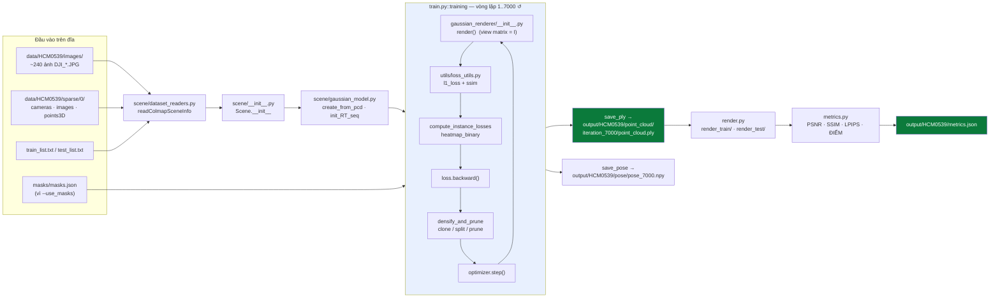
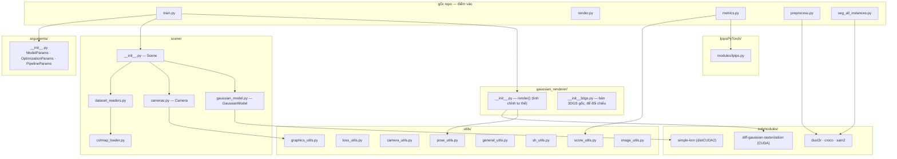
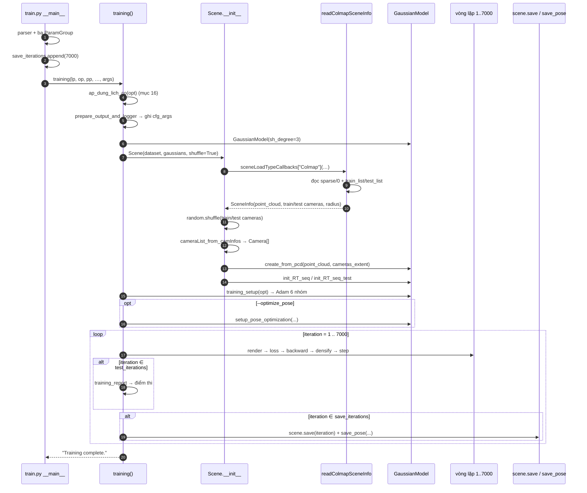
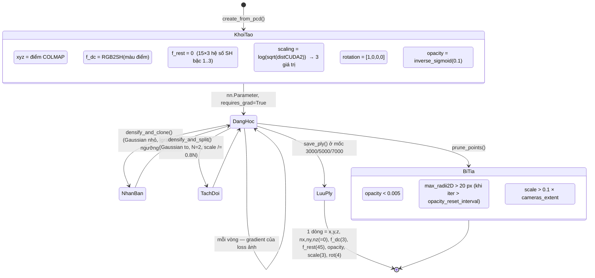
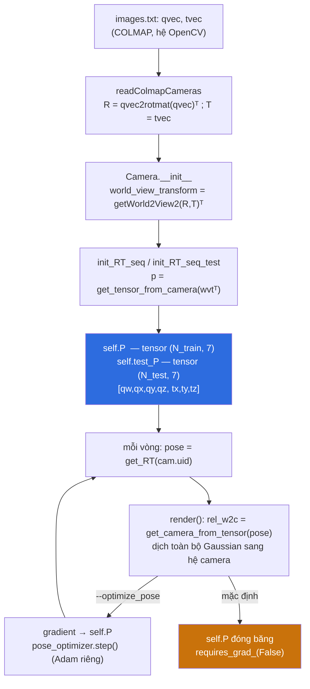
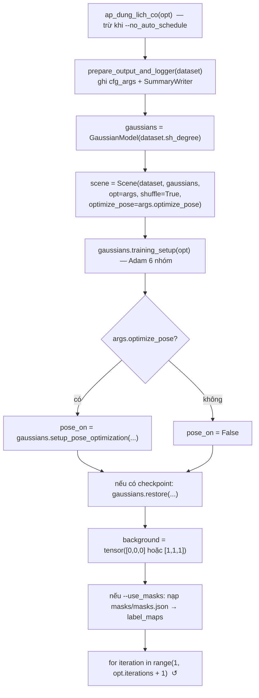

# DIGITAL TWIN GS PIPELINE — Giải phẫu toàn bộ một phiên train

### Từ `python train.py -s data/HCM0539 -m output/HCM0539 --scene HCM0539 --iter 7000 --use_masks --schedule_densify_grad_threshold` đến `output/HCM0539/metrics.json`

> **Tài liệu tham chiếu kỹ thuật đầy đủ.**
> Mỗi file, mỗi hàm, mỗi hằng số, mỗi nhánh `if` mà lệnh trên chạm tới — theo đúng
> thứ tự thực thi, kèm sơ đồ Mermaid, bảng đối chiếu và trace dữ liệu.
> Số cụ thể (số Gaussian, dB, dung lượng) đều được ghi rõ là **ví dụ / minh hoạ**;
> đây không phải nhật ký một lần chạy thật.

**Quy ước ký hiệu**

| Ký hiệu | Nghĩa |
|---|---|
| **File:** `scene/xyz.py` | Đường dẫn tính từ gốc repo `digital-twin-gs/` |
| **Hàm:** `foo()` | Tên hàm / phương thức trong file vừa nêu |
| ① ② ③ | Số thứ tự bước trong một chuỗi xử lý |
| ★ | Điểm mấu chốt, dễ hiểu sai |
| ⚠ | Cạm bẫy đã từng gây lỗi thật |
| ↺ | Vòng lặp khép kín (feedback loop) |
| 🔒 | Điểm đồng bộ hoá / phẫu thuật trạng thái optimizer |

**Ký hiệu toán dùng từ PHẦN V trở đi** (bộ đầy đủ ở tài liệu ký hiệu của bản cũ)

| Ký hiệu | Nghĩa | Trong mã |
|---|---|---|
| $P$ | số Gaussian trong mô hình (đổi mỗi lần densify/prune) | `_xyz.shape[0]` |
| $\boldsymbol\mu$ | tâm một Gaussian, 3 số | `_xyz[i]` |
| $\Sigma$ | hiệp phương sai 3D — "hình dạng" Gaussian, $3\times3$ | dẫn xuất từ $R,S$ |
| $\Sigma'$ / $\Sigma_{2D}$ | hiệp phương sai **sau khi chiếu** xuống ảnh, $2\times2$ | `cov` trong rasterizer |
| $R$ | ma trận quay $3\times3$ | `build_rotation(_rotation)` |
| $S$ | ma trận tỉ lệ chéo $\mathrm{diag}(s_x,s_y,s_z)$ | `exp(_scaling)` |
| $\mathbf q=(w,x,y,z)$ | quaternion hình dạng, phần thực **trước** | `_rotation[i]` |
| $o$ | opacity gốc $\in(0,1)$ | `sigmoid(_opacity)` |
| $\alpha$ | độ mờ thực tế tại một pixel $=o\cdot G$, kẹp $\le 0{,}99$ | trong rasterizer |
| $T$ | transmittance tích luỹ, khởi đầu $1$ rồi giảm | trong rasterizer |
| $L$ / $M$ | bậc SH ($L=3$) / số hệ số mỗi kênh $M=(L{+}1)^2=16$ | `active_sh_degree` |
| $r$ | bán kính cảnh (`cameras_extent`) | `spatial_lr_scale` |
| $\theta$ | ngưỡng gradient màn hình clone/split ($2\times10^{-4}$) | `densify_grad_threshold` |
| $C_0$ | hằng số SH bậc 0 $=1/(2\sqrt\pi)\approx0{,}2820948$ | `sh_utils.C0` |

⚠ Chữ $T$ có ba nghĩa: transmittance (công thức render), vector dịch camera
(`cam.T`), và ma trận trung gian $T=WJ$ khi chiếu hiệp phương sai. Mỗi mục nói rõ
nghĩa đang dùng.

---

## MỤC LỤC

### PHẦN I — TỔNG QUAN
- [1. Câu lệnh và ý nghĩa từng tham số](#1-câu-lệnh-và-ý-nghĩa-từng-tham-số)
- [2. Bản đồ toàn hệ thống](#2-bản-đồ-toàn-hệ-thống)
- [3. Danh mục toàn bộ file tham gia](#3-danh-mục-toàn-bộ-file-tham-gia)
- [4. Sơ đồ tuần tự tổng quát](#4-sơ-đồ-tuần-tự-tổng-quát)
- [5. Vòng đời của một Gaussian](#5-vòng-đời-của-một-gaussian)
- [6. Vòng đời của một tư thế camera](#6-vòng-đời-của-một-tư-thế-camera)
- [7. Ba giả định của 3DGS bị phá và bốn câu trả lời](#7-ba-giả-định-của-3dgs-bị-phá-và-bốn-câu-trả-lời)

### PHẦN II — TẦNG 0: NOTEBOOK VÀ SCRIPT TRỢ THỦ
- [8. `colab_dronesplat.ipynb` — 12 bước](#8-colab_dronesplatipynb--12-bước)
- [9. `run_dronesplat.py prepare` — dò scene](#9-run_dronesplatpy-prepare--dò-scene)
- [10. `_write_splits` — chia train/test](#10-_write_splits--chia-traintest)
- [11. `cmd_fix_masks` — chuẩn hoá khoá `masks.json`](#11-cmd_fix_masks--chuẩn-hoá-khoá-masksjson)
- [12. `run_dronesplat.py check` — ô kiểm chứng](#12-run_dronesplatpy-check--ô-kiểm-chứng)

### PHẦN III — TẦNG 1: ĐIỂM VÀO `train.py`
- [13. `__main__` — dựng ba nhóm tham số](#13-__main__--dựng-ba-nhóm-tham-số)
- [14. `ParamGroup` và ba `GroupParams`](#14-paramgroup-và-ba-groupparams)
- [15. `--test_iterations` / `--save_iterations` — mặc định bị viết lại](#15---test_iterations----save_iterations--mặc-định-bị-viết-lại)
- [16. `ap_dung_lich_co` — co lịch theo số vòng](#16-ap_dung_lich_co--co-lịch-theo-số-vòng)
- [17. `training()` — khung tổng thể](#17-training--khung-tổng-thể)

### PHẦN IV — TẦNG 2: DỰNG `Scene`
- [18. `Scene.__init__` — nhận dạng định dạng](#18-scene__init__--nhận-dạng-định-dạng)
- [19. `readColmapSceneInfo` — đọc `sparse/0`](#19-readcolmapsceneinfo--đọc-sparse0)
- [20. `readColmapCameras` — bỏ camera thiếu ảnh, bỏ hệ số méo](#20-readcolmapcameras--bỏ-camera-thiếu-ảnh-bỏ-hệ-số-méo)
- [21. `getNerfppNorm` — bán kính cảnh](#21-getnerfppnorm--bán-kính-cảnh)
- [22. `train_list.txt` / `test_list.txt` — không có đường lui](#22-train_listtxt--test_listtxt--không-có-đường-lui)
- [23. `storePly` / `fetchPly`](#23-storeply--fetchply)
- [24. `cameraList_from_camInfos` → `loadCam` — resize 1.92K](#24-cameralist_from_caminfos--loadcam--resize-192k)
- [25. `Camera.__init__` — `world_view_transform`, `projection_matrix`](#25-camera__init__--world_view_transform-projection_matrix)

### PHẦN V — GAUSSIAN MODEL: KHỞI TẠO
- [26. `GaussianModel.__init__` + `setup_functions`](#26-gaussianmodel__init__--setup_functions)
- [27. `create_from_pcd` — khởi tạo sáu tensor](#27-create_from_pcd--khởi-tạo-sáu-tensor)

### PHẦN VI–X — xem [Phần 2](DIGITAL-TWIN-GS-PIPELINE-2.md)
Vòng lặp train, mặt nạ vật nhiễu, backward + kiểm soát mật độ, đánh giá trong lúc train, lưu.

### PHẦN XI–XIII — xem [Phần 3](DIGITAL-TWIN-GS-PIPELINE-3.md)
Render + chấm điểm, đối chiếu output thật, phụ lục (DUSt3R / SAM2 / video, bảng hằng số, FAQ, chẩn đoán, thuật ngữ).

> **Tài liệu này gồm 3 phần:**
> [Phần 1](DIGITAL-TWIN-GS-PIPELINE-1.md) (PHẦN I–V) ·
> [Phần 2](DIGITAL-TWIN-GS-PIPELINE-2.md) (PHẦN VI–X) ·
> [Phần 3](DIGITAL-TWIN-GS-PIPELINE-3.md) (PHẦN XI–XIII).

---
---

# PHẦN I — TỔNG QUAN

---

## 1. Câu lệnh và ý nghĩa từng tham số

```bash
python train.py -s data/HCM0539 -m output/HCM0539 --scene HCM0539 \
    --iter 7000 --use_masks --schedule_densify_grad_threshold
```

Thư mục làm việc **phải là gốc repo**. Lý do ở [mục 2.3](#23-va-chạm-tên-gói).

### 1.1 Bảng tham số truyền tường minh

| Token | Đích trong mã | Nhóm | Ghi chú |
|---|---|---|---|
| `-s data/HCM0539` | `ModelParams._source_path` (viết tắt `-s`) | `ModelParams` | `extract()` gọi `os.path.abspath()` → `arguments/__init__.py:61` |
| `-m output/HCM0539` | `ModelParams._model_path` (viết tắt `-m`) | `ModelParams` | nơi ghi `cfg_args`, `point_cloud/`, `pose/`, log TensorBoard |
| `--scene HCM0539` | `args.scene` (`train.py:579`) | phụ | **chỉ là nhãn ghi log**, không đổi cách đọc dữ liệu |
| `--iter 7000` | `OptimizationParams.iterations` | `OptimizationParams` | ★ `--iter` là **viết tắt tiền tố** hợp lệ của `--iterations`; argparse chấp nhận vì không có cờ nào khác bắt đầu bằng `--iter` trong `train.py` |
| `--use_masks` | `args.use_masks = True` (`train.py:583`) | phụ | bật nhánh mặt nạ instance SAM2 (PHẦN VII) |
| `--schedule_densify_grad_threshold` | `args.schedule_densify_grad_threshold = True` (`train.py:587`) | phụ | bật lịch tăng ngưỡng densify (PHẦN VIII, [mục 43](DIGITAL-TWIN-GS-PIPELINE-2.md)) |

### 1.2 Mặc định của `OptimizationParams` — `arguments/__init__.py:71–90`

| Tham số | Mặc định | Vai trò |
|---|---|---|
| `iterations` | `30_001` | tổng số vòng; lệnh này ép về `7000` |
| `position_lr_init` | `0.00016` | lr vị trí lúc bắt đầu (×`spatial_lr_scale`) |
| `position_lr_final` | `0.0000016` | lr vị trí lúc kết thúc anneal |
| `position_lr_delay_mult` | `0.01` | hệ số trễ đầu lịch (`get_expon_lr_func`) |
| `position_lr_max_steps` | `30_000` | số bước để lr vị trí đi hết đường anneal |
| `feature_lr` | `0.0025` | lr cho `f_dc`; `f_rest` dùng `feature_lr/20` |
| `opacity_lr` | `0.05` | lr độ đục |
| `scaling_lr` | `0.005` | lr scale |
| `rotation_lr` | `0.001` | lr quaternion hình dạng |
| `percent_dense` | `0.01` | ngưỡng "Gaussian to" = `percent_dense × cameras_extent` |
| `lambda_dssim` | `0.2` | trọng số D-SSIM trong loss ảnh |
| `densification_interval` | `100` | cứ 100 vòng chạy densify một lần |
| `opacity_reset_interval` | `3000` | chu kỳ reset opacity về ~0.01 |
| `densify_from_iter` | `500` | vòng bắt đầu densify |
| `densify_until_iter` | `15_000` | vòng dừng densify |
| `densify_grad_threshold` | `0.0002` | ngưỡng gradient màn hình để clone/split |
| `random_background` | `False` | nền ngẫu nhiên mỗi frame |

### 1.3 Mặc định của `ModelParams` / `PipelineParams`

| `ModelParams` | Mặc định | | `PipelineParams` | Mặc định |
|---|---|---|---|---|
| `sh_degree` | `3` | | `convert_SHs_python` | `False` |
| `_source_path` | `""` | | `compute_cov3D_python` | `False` |
| `_model_path` | `""` | | `debug` | `False` |
| `_images` | `"images"` | | | |
| `_resolution` | `-1` | | | |
| `_white_background` | `False` | | | |
| `data_device` | `"cuda"` | | | |
| `eval` | `False` | | | |

### 1.4 Mặc định của các cờ phụ khai báo trong `train.py __main__` (`train.py:557–607`)

| Cờ | Mặc định | Ý nghĩa |
|---|---|---|
| `--test_iterations` | `list(range(500, 7001, 500))` → `[500, 1000, …, 7000]` | các mốc chấm điểm test |
| `--save_iterations` | `[3_000, 5_000, 7_000]`, sau đó `.append(args.iterations)` → `[3000, 5000, 7000, 7000]` | mốc lưu `.ply` |
| `--checkpoint_iterations` | `[]` | mốc lưu checkpoint `.pth` |
| `--start_checkpoint` | `None` | nạp lại checkpoint |
| `--mask_start_iter` | `500` | vòng bắt đầu áp `heatmap_binary` vào loss |
| `--threshold_local` | `0.4` | phần `σ` thêm vào ngưỡng instance, giảm tuyến tính theo tiến độ |
| `--preset_instance_threshold` | `0.4` | ⚠ truyền vào `compute_instance_losses` nhưng **không được dùng** trong hàm (xem [Phần 2, mục 39](DIGITAL-TWIN-GS-PIPELINE-2.md)) |
| `--psnr_max` | `30.0` | `PSNR_max` của công thức chấm điểm (BTC chưa công bố) |
| `--optimize_pose` | tắt | bật tinh chỉnh tư thế camera train |
| `--pose_lr_init` / `--pose_lr_final` | `1e-3` / `1e-5` | lr optimizer tư thế |
| `--pose_from_iter` | `500` | hoãn `step_pose()` tới mốc này |
| `--no_auto_schedule` | tắt | tắt việc tự co lịch theo `--iter` |
| `--lambda_lpips` | `0.0` | trọng số số hạng LPIPS trong loss (mặc định tắt) |
| `--lpips_from_iter` | `1000` | vòng bắt đầu cộng số hạng LPIPS |
| `--sam2_ckpt` / `--sam2_cfg` | `checkpoints/sam2_hiera_large.pt` / `sam2_hiera_l.yaml` | chỉ dùng nếu train tự gọi SAM2 |

### 1.5 Sau khi parse (`train.py:608–615`)

```python
args = parser.parse_args(sys.argv[1:])
args.save_iterations.append(args.iterations)          # [3000, 5000, 7000, 7000]
os.makedirs(args.model_path, exist_ok=True)
torch.autograd.set_detect_anomaly(args.detect_anomaly)
training(lp.extract(args), op.extract(args), pp.extract(args),
         args.test_iterations, args.save_iterations,
         args.checkpoint_iterations, args.start_checkpoint,
         args.debug_from, args)
```

★ `lp.extract(args)` / `op.extract(args)` / `pp.extract(args)` cắt `args` thành ba
`GroupParams` rời; nhưng `args` **nguyên bản** vẫn được truyền làm tham số cuối, nên
mọi cờ phụ (`use_masks`, `schedule_densify_grad_threshold`, `optimize_pose`, …)
đến được `training()` qua đường đó.

---

## 2. Bản đồ toàn hệ thống

### 2.1 Luồng chính



Ba nhánh vào bên trái là **tuỳ chọn**: không có `sparse/` mà có `transforms_train.json`
thì đọc theo định dạng Blender; không chạy SAM2 thì bỏ khối `heatmap_binary`, loss
tính trên toàn ảnh; không chạy `preprocess.py` thì đám mây điểm khởi tạo là của COLMAP.

### 2.2 Bản đồ gói



### 2.3 Va chạm tên gói

★ `scene/`, `utils/`, `arguments/`, `gaussian_renderer/` nằm ở **cấp cao nhất** của
`sys.path` khi chạy từ gốc repo. Bất kỳ `import utils` nào trong tiến trình — kể cả
phát ra từ thư viện bên thứ ba — cũng trỏ về `utils/` của repo này. Đó là lý do:

- mọi lệnh phải chạy với `cwd` = gốc repo (notebook luôn `os.chdir(REPO_DIR)` trước mỗi ô);
- không được đặt thêm gói trùng tên với thư viện phổ biến (`scene`, `models`, …).

### 2.4 Vì sao khâu rasterise viết bằng CUDA chứ không phải PyTorch

Rasterizer chia ảnh thành tile 16×16, sắp Gaussian theo độ sâu trong từng tile rồi
blend. Viết bằng PyTorch thuần thì:

- **chậm hơn ~2 bậc** — mỗi pixel phải xét mọi Gaussian chạm tile, không có đường tắt;
- **tốn bộ nhớ khổng lồ** — autograd giữ activation cho mọi cặp (Gaussian, pixel).
  Bản render toàn ảnh đời đầu giữ tensor cỡ `M × H × W`; với 150 nghìn Gaussian và
  ảnh 800×600 là **hàng TB** → OOM ngay lần `backward` đầu.

`submodules/diff-gaussian-rasterization` viết cả forward lẫn backward **bằng tay
trong CUDA**, không giữ activation trung gian, nên vừa nhanh vừa nhẹ. Cái giá: bắt
buộc GPU NVIDIA + toolchain biên dịch (lý do notebook có ô kiểm chứng,
[mục 12](#12-run_dronesplatpy-check--ô-kiểm-chứng)) và nhân CUDA khó đọc hơn nhiều
so với mã Python. Chi tiết cắt–xén trong rasterizer: [Phần 2](DIGITAL-TWIN-GS-PIPELINE-2.md).

---

## 3. Danh mục toàn bộ file tham gia

`Nguồn gốc`: **INRIA gốc** = có header `Copyright (C) 2023, Inria`, gần như nguyên
bản · **INRIA + vá** = header INRIA nhưng đã thêm mã/chú thích tiếng Việt ·
**DroneSplat** = mã riêng của DroneSplat (mẹo tư thế) · **Dự án** = viết mới trong
repo này (docstring tiếng Việt dài).

### 3.1 Điểm vào và tham số

| File | ~dòng | Nguồn gốc | Vai trò |
|---|---|---|---|
| `train.py` | 617 | Dự án (dựa trên DroneSplat) | vòng huấn luyện; co lịch theo số vòng; số hạng LPIPS; chấm điểm trong lúc train |
| `arguments/__init__.py` | 113 | INRIA gốc | `ParamGroup`, ba nhóm siêu tham số, `get_combined_args` |
| `render.py` | 75 | INRIA + vá | render lại `render_train/` và `render_test/` từ `.ply` |
| `metrics.py` | 209 | Dự án | PSNR/SSIM/LPIPS + điểm thi, ghép cặp theo stem |

### 3.2 Gói `scene/`

| File | ~dòng | Nguồn gốc | Vai trò |
|---|---|---|---|
| `scene/__init__.py` | 103 | INRIA gốc | lớp `Scene`: nhận dạng định dạng, shuffle, dựng camera, gọi `create_from_pcd` |
| `scene/dataset_readers.py` | 328 | INRIA + vá | `readColmapSceneInfo`, `readColmapCameras` (bỏ camera thiếu ảnh, bỏ hệ số méo), `getNerfppNorm`, `storePly`/`fetchPly` |
| `scene/colmap_loader.py` | ~280 | INRIA gốc | `read_extrinsics_*`, `read_intrinsics_*`, `qvec2rotmat`, `read_points3D_*` |
| `scene/cameras.py` | 72 | INRIA gốc | lớp `Camera`: `world_view_transform`, `projection_matrix`, `camera_center` |
| `scene/gaussian_model.py` | 557 | DroneSplat | tham số hoá Gaussian, densify/tỉa, tư thế như tensor 7 số, optimizer tư thế riêng |

### 3.3 Render và toán

| File | ~dòng | Nguồn gốc | Vai trò |
|---|---|---|---|
| `gaussian_renderer/__init__.py` | 145 | DroneSplat | `render()` đặt view matrix = ma trận đơn vị, dịch Gaussian sang hệ camera bằng PyTorch |
| `gaussian_renderer/__init__3dgs.py` | ~110 | INRIA gốc | bản render 3DGS gốc, giữ để đối chiếu |
| `utils/pose_utils.py` | 575 | DroneSplat | `quad2rotation`, `get_camera_from_tensor`, `quadmultiply`, `rotation2quad`, `get_tensor_from_camera`, sinh quỹ đạo camera |
| `utils/loss_utils.py` | 100 | INRIA gốc | `l1_loss` (`reduction='none'`), `ssim` (trả bản đồ, không gộp) |
| `utils/camera_utils.py` | 235 | INRIA + vá | `loadCam` (resize về 1.92K), `camera_to_JSON`, sinh quỹ đạo nội suy |
| `utils/graphics_utils.py` | ~97 | INRIA gốc | `getWorld2View2`, `getProjectionMatrix`, `fov2focal`, `focal2fov`, `BasicPointCloud` |
| `utils/general_utils.py` | ~140 | INRIA gốc | `inverse_sigmoid`, `PILtoTorch`, `get_expon_lr_func`, `build_rotation`, `strip_symmetric` |
| `utils/sh_utils.py` | ~120 | INRIA gốc | `RGB2SH`, `SH2RGB`, `eval_sh` |
| `utils/score_utils.py` | 213 | Dự án | `competition_score`, `summarize`, `format_score`, bảng độ nhạy `PSNR_max` |
| `utils/image_utils.py` | ~20 | INRIA gốc | `psnr()` dùng trong `training_report` |
| `utils/system_utils.py` | ~30 | INRIA gốc | `mkdir_p`, `searchForMaxIteration` |

### 3.4 Ngoài cây mã chính

| File / thư mục | Nguồn gốc | Vai trò |
|---|---|---|
| `lpipsPyTorch/modules/lpips.py` | bên thứ ba | LPIPS đóng gói sẵn, đường lui khi thiếu gói `lpips` |
| `submodules/diff-gaussian-rasterization` | INRIA | nhân rasterizer CUDA forward + backward |
| `submodules/simple-knn` | INRIA | `distCUDA2` — khoảng cách tới điểm gần nhất, để đặt scale khởi tạo |
| `scripts/run_dronesplat.py` | Dự án | `prepare` / `fix-masks` / `check` cho Colab |
| `notebooks/colab_dronesplat.ipynb` | Dự án | notebook 12 bước |

### 3.5 Xoá / thiếu file này thì hỏng gì

| File / thứ thiếu | Hậu quả | Báo lỗi rõ? |
|---|---|---|
| `submodules/diff-gaussian-rasterization` chưa `pip install` | `import diff_gaussian_rasterization` fail khi `import gaussian_renderer` | ✓ ngay |
| `submodules/simple-knn` | `from simple_knn._C import distCUDA2` fail ở đầu `scene/gaussian_model.py` | ✓ ngay |
| `submodules/sam2` + `checkpoints/sam2_hiera_large.pt` | chỉ cần khi tự chạy `seg_all_instances.py`; `train.py --use_masks` chỉ đọc `masks/masks.json` có sẵn | — |
| `train_list.txt` / `test_list.txt` | `readColmapSceneInfo` `FileNotFoundError` tại `open(...)`, không có `try` ([mục 22](#22-train_listtxt--test_listtxt--không-có-đường-lui)) | ✓ nhưng sâu trong stack |
| dữ liệu để ở `sparse/` (không có `sparse/0/`) | `Scene.__init__` vẫn chọn nhánh Colmap (chỉ kiểm `sparse`, không `/0`), `readColmapSceneInfo` mới `FileNotFoundError` (mục 9.2) | ✓ muộn |
| thiếu một tấm `masks/<stem>.jpg` bất kỳ | `train.py:398` `Image.open(...)` crash cho **mọi** ảnh train khi `--use_masks` | ✓ nhưng sau khi train đã chạy |
| khoá `masks.json` sai đuôi (`.JPG` thay vì stem) | `label_maps.get(img_name)` trả `None`, **mất sạch tín hiệu instance mà train vẫn chạy êm** ([mục 11](#11-cmd_fix_masks--chuẩn-hoá-khoá-masksjson)) | ✗ im lặng |
| `gaussian_renderer/__init__3dgs.py` | không sao — chỉ giữ để đối chiếu với bản gốc INRIA | — |
| `checkpoints/DUSt3R_*.pth` | chỉ cần khi chạy `preprocess.py`; lệnh đang trace không dùng | — |

★ Ba lỗi nguy hiểm nhất đều **im lặng**: extension CUDA biên dịch hỏng nhưng
`pip` báo thành công; `wget` tải trang 404 vài KB thay vì checkpoint vài trăm MB;
khoá `masks.json` sai đuôi. Cả ba chỉ lộ sau khi train đã chạy vài phút — đó là lý
do `run_dronesplat.py check` tồn tại ([mục 12](#12-run_dronesplatpy-check--ô-kiểm-chứng)).

---

## 4. Sơ đồ tuần tự tổng quát



---

## 5. Vòng đời của một Gaussian

**File:** `scene/gaussian_model.py`.

Một Gaussian sinh ra từ **một điểm 3D của COLMAP** (`points3D`), sống qua vòng lặp
train dưới dạng sáu tensor con, rồi kết thúc là **một dòng 62 số float** trong `.ply`.



★ `distCUDA2` (submodule `simple-knn`) trả **trung bình bình phương** khoảng cách
tới **3 điểm gần nhất**; `create_from_pcd` lấy `log(sqrt(dist2))` nên scale ban đầu
≈ log của khoảng cách láng giềng — vừa đủ để lấp khe hở giữa các điểm, vừa đủ nhỏ
để không nuốt chi tiết.

★ Số dòng trong `.ply` = số Gaussian, thay đổi từng lần densify/prune. Ví dụ: khởi
tạo ~120 nghìn điểm, đỉnh ~1,5 triệu quanh vòng 3000, còn ~900 nghìn lúc lưu (các
con số này là **minh hoạ**, không phải một lần chạy cụ thể).

---

## 6. Vòng đời của một tư thế camera



### 6.1 Hai hàm chuyển đổi — `utils/pose_utils.py`

| Hàm | Vào | Ra | Dùng ở |
|---|---|---|---|
| `get_tensor_from_camera(RT)` (`:182`) | ma trận `4×4` | `cat([quat(3×3), tran(3)])` → `(7,)` | `init_RT_seq`, `init_RT_seq_test`, `save_pose` |
| `get_camera_from_tensor(inp)` (`:56`) | `(…,7)` | `w2c` `4×4` (`eye(4)`, `[:3,:3]=quad2rotation(quad)`, `[:3,3]=T`) | `render()`, `save_pose` |

`quad2rotation` (`:9`) và `quadmultiply` (`:85`) đều viết bằng phép toán PyTorch
thuần nên **gradient chảy được** — điều kiện cần để `--optimize_pose` hoạt động.

### 6.2 ★ Mặc định: tư thế bị đóng băng — `scene/gaussian_model.py:137–171`

```python
def init_RT_seq(self, cam_list, optimize=False):
    ...
    self.P_init = poses.clone().detach()
    if optimize:
        self.P = nn.Parameter(poses.contiguous().requires_grad_(True))
    else:
        self.P = poses.requires_grad_(False)      # ← mặc định: đóng băng

def init_RT_seq_test(self, cam_list):
    ...
    self.test_P = poses.cuda().requires_grad_(False)   # ← LUÔN đóng băng
```

`Scene.__init__` gọi `init_RT_seq(self.train_cameras, optimize=optimize_pose)` với
`optimize_pose = args.optimize_pose`. Lệnh đang trace **không** có `--optimize_pose`,
nên `self.P` chỉ được **đọc** suốt phiên: `get_RT` trả đúng giá trị COLMAP.

★ `self.test_P` đóng băng **kể cả khi** bật `--optimize_pose` — ảnh test là ảnh phải
dựng ra mà chưa từng nhìn thấy, tối ưu tư thế của nó là nhìn trộm đáp án.

### 6.3 ⚠ Vì sao optimizer tư thế phải tách riêng — `scene/gaussian_model.py:66–73`

```python
# `pose_optimizer` PHAI tach khoi `optimizer` chinh. Ly do: khi densify,
# `_prune_optimizer` duyet MOI param_group va ap mask Gaussian len tung
# nhom. Nhom pose co so hang bang so CAMERA, khong phai so Gaussian, nen
# nhet chung vao mot optimizer se hong ngay lan prune dau tien.
```

`setup_pose_optimization` (`:174`) dựng `torch.optim.Adam([{ "params": [self.P],
"lr": lr_init, "name": "pose" }], eps=1e-15)` **riêng**, kèm `pose_scheduler =
get_expon_lr_func(lr_init, lr_final, max_steps)`. `step_pose()` (`:202`) gọi
`pose_optimizer.step()` + `zero_grad(set_to_none=True)` — hoàn toàn ngoài quỹ đạo
phẫu thuật trạng thái của [mục 46 (Phần 2)](DIGITAL-TWIN-GS-PIPELINE-2.md) 🔒.

---

## 7. Ba giả định của 3DGS bị phá và bốn câu trả lời

3DGS gốc (INRIA) giả định: **(1)** tư thế COLMAP đúng, **(2)** cảnh tĩnh và mọi pixel
đáng tin, **(3)** điểm khởi tạo lấy từ đám mây thưa COLMAP là đủ. Ảnh drone
in-the-wild phá cả ba. DroneSplat trả lời bằng bốn cơ chế:

| Giả định 3DGS gốc | Thực tế ảnh drone (bộ HCM05xx) | Cơ chế DroneSplat | Cờ | Bật trong lệnh này? |
|---|---|---|---|---|
| tư thế COLMAP chính xác | quỹ đạo bay có lỗ hổng; HCM0539 đăng ký ~398 tư thế nhưng chỉ ~240 ảnh | coi mỗi tư thế là **tensor 7 số**, tinh chỉnh cùng Gaussian | `--optimize_pose` | ✗ |
| cảnh tĩnh, mọi pixel đáng tin | người, xe, bóng cây lay động giữa các khung | **mặt nạ instance SAM2** + ngưỡng loss thích nghi theo `iteration` | `--use_masks` | ✓ |
| điểm khởi tạo từ đám mây thưa COLMAP là đủ | cảnh ít texture, mặt phẳng đồng màu → COLMAP thưa/hỏng | **khởi tạo hình học DUSt3R**, xuất ra đúng định dạng COLMAP | `preprocess.py` | ✗ |
| ngưỡng densify cố định `0.0002` là hợp lý | đầu train gradient lớn khắp nơi → cái gì cũng vượt; cuối train chỉ phình VRAM | **lịch nội suy ngưỡng** `0.0002 → 0.001` theo tiến độ | `--schedule_densify_grad_threshold` | ✓ |

Lệnh đang trace bật **(b)** và **(d)**. Phơi sáng không nhất quán không có cơ chế
riêng — mô hình chịu đựng nó qua hệ số SH bậc cao (`f_rest`), và đây là một trong
những nguồn mất điểm còn lại.

Chi tiết từng cơ chế: (b) → [PHẦN VII (Phần 2)](DIGITAL-TWIN-GS-PIPELINE-2.md);
(d) → [mục 43 (Phần 2)](DIGITAL-TWIN-GS-PIPELINE-2.md);
(a) → [mục 6](#6-vòng-đời-của-một-tư-thế-camera) + [mục 31 (Phần 2)](DIGITAL-TWIN-GS-PIPELINE-2.md);
(c) → [mục 67 (Phần 3)](DIGITAL-TWIN-GS-PIPELINE-3.md).

### 7.1 ⚠ Cạm bẫy khi bật từng cơ chế

| Cơ chế | Cạm bẫy |
|---|---|
| (a) `--optimize_pose` | Bộ khung `init_RT_seq` / `render()` / `get_camera_from_tensor` có thật, nhưng bản DroneSplat **công bố** đóng băng `self.P` (`requires_grad_(False)`, không nằm trong `param_group` nào; `training_setup` chỉ đăng ký 6 nhóm Gaussian). Khi tắt cờ, mẹo "view matrix = I + dịch Gaussian bằng PyTorch" vẫn chạy — tốn $O(P)$ phép nhân ma trận **mỗi frame** — nhưng chỉ **tính lại đúng phép biến đổi mà rasterizer sẽ tự làm** nếu truyền thẳng `world_view_transform`, không đổi lại được gì. `self.test_P` đóng băng **kể cả khi** bật cờ ([mục 6.2](#6-vòng-đời-của-một-tư-thế-camera)). |
| (b) `--use_masks` | `--preset_instance_threshold` được truyền vào `compute_instance_losses` nhưng **không dùng** trong hàm (ngưỡng thật tính từ `args.threshold_local`, mục 1.4). Khoá `masks.json` phải là **stem không đuôi** + `.jpg`; sai một chữ là mất sạch tín hiệu mà train vẫn chạy êm ([mục 11](#11-cmd_fix_masks--chuẩn-hoá-khoá-masksjson)). |
| (c) `preprocess.py` (DUSt3R) | `preprocess.py` mặc định checkpoint `..._512_linear.pth`, README bảo tải bản `..._512_dpt.pth` — **hai head khác nhau** (linear vs DPT). Tải nhầm là hình học rác, không có cảnh báo. |
| (d) `--schedule_densify_grad_threshold` | Ngưỡng nội suy `0.0002 → 0.001` theo `iteration / opt.iterations`; cùng `densify_until_iter` (đã bị co, [mục 16](#16-ap_dung_lich_co--co-lịch-theo-số-vòng)) tạo hai tầng phanh — một liên tục, một cắt hẳn. |

---
---

# PHẦN II — TẦNG 0: NOTEBOOK VÀ SCRIPT TRỢ THỦ

Notebook và `scripts/run_dronesplat.py` **không thay thế** `train.py` / `render.py` /
`metrics.py`. Chúng làm những việc vụn mà pipeline gốc giả định là đã có sẵn nhưng
dữ liệu drone của sinh viên thì không.

---

## 8. `colab_dronesplat.ipynb` — 12 bước

**File:** `notebooks/colab_dronesplat.ipynb`. Ô đầu tiên là cấu hình:

```python
SCENE = "HCM0539"
ITER = 7000
SAVE_ITERS = [3000, 5000]      # ITER luôn được lưu, không cần kê
USE_MASKS = True
HOLD = 8                        # cứ 8 ảnh giữ 1 làm test
SCENE_DIR = f"data/{SCENE}"     # tương đối so với gốc repo
MODEL_DIR = f"output/{SCENE}"
SAVE_FLAG = "--save_iterations " + " ".join(str(i) for i in SAVE_ITERS + [ITER])
```

| Bước | Ô làm gì | Lệnh chính | File / mã chạm tới |
|---|---|---|---|
| Cấu hình | đặt `SCENE`, `ITER`, `USE_MASKS`, `HOLD`, đường dẫn | — | — |
| 1 | kiểm tra phần cứng | `nvidia-smi`, `free -h`, `import torch` | — |
| 2 | lấy mã nguồn | `git clone`; `git submodule update --init --recursive` | `.gitmodules`; ⚠ thiếu `--recursive` → thiếu `glm` → biên dịch CUDA hỏng |
| 3 | cài phụ thuộc + biên dịch CUDA | `bash scripts/setup_dronesplat.sh` | cài gói, biên dịch `diff-gaussian-rasterization` + `simple-knn` với `TORCH_CUDA_ARCH_LIST=7.5` (Turing/T4), tải 2 checkpoint. **Không** dùng `requirements.txt` (ghim bản làm hỏng ABI của torch Colab) |
| 4 | ô kiểm chứng | `python scripts/run_dronesplat.py check` | [mục 12](#12-run_dronesplatpy-check--ô-kiểm-chứng) |
| 5 | mount Drive + dựng `data/<SCENE>` | `drive.mount(...)`; `python scripts/run_dronesplat.py prepare --scene {SCENE} --drive-root {DRIVE_DATA_ROOT} --hold {HOLD}` | [mục 9](#9-run_dronesplatpy-prepare--dò-scene), [mục 10](#10-_write_splits--chia-traintest) |
| 6 (tuỳ chọn) | phân đoạn instance SAM2 | `python seg_all_instances.py --image_dir {SCENE_DIR}`; `python scripts/run_dronesplat.py fix-masks --scene-dir {SCENE_DIR}` | [mục 11](#11-cmd_fix_masks--chuẩn-hoá-khoá-masksjson); [PHẦN XIII (Phần 3)](DIGITAL-TWIN-GS-PIPELINE-3.md) |
| 7 | **huấn luyện** | `python train.py -s {SCENE_DIR} -m {MODEL_DIR} --scene {SCENE} --iter {ITER} {mask_flag} {SAVE_FLAG}` | PHẦN III–X |
| 8 | kết xuất ảnh | `python render.py -s {SCENE_DIR} -m {MODEL_DIR} --iteration {ITER}` | [PHẦN XI (Phần 3)](DIGITAL-TWIN-GS-PIPELINE-3.md) |
| 9 | chấm điểm | `python metrics.py --rendering {MODEL_DIR}/render_test --gt {SCENE_DIR}/images --output {MODEL_DIR}/metrics.json` | [PHẦN XI (Phần 3)](DIGITAL-TWIN-GS-PIPELINE-3.md) |
| 10 | bảng + 6 hình báo cáo | `python scripts/analyze_tail.py …`; `python scripts/make_report.py …` | dùng chung `build_rows`, `competition_score` với `analyze_tail` |
| 11 | video + GIF quay quanh | `python render_video.py -s {SCENE_DIR} -m {MODEL_DIR} --iteration {ITER} --n_views 180 --fps 24`; `python scripts/make_gif.py …` | [mục 69 (Phần 3)](DIGITAL-TWIN-GS-PIPELINE-3.md) |
| 12 | lưu kết quả về Drive | copy `metrics.json`, `report/`, `point_cloud/`, `cfg_args`, `render_test/` | máy ảo Colab bị xoá khi hết phiên |

★ Lưu ý `SAVE_FLAG` trong ô cấu hình dựng ra `--save_iterations 3000 5000 7000`, tức
là **ghi đè** mặc định `[3000, 5000, 7000]` của `train.py` bằng đúng giá trị đó
(rồi `train.py` vẫn `.append(args.iterations)` → `[3000, 5000, 7000, 7000]`).

---

## 9. `run_dronesplat.py prepare` — dò scene

**File:** `scripts/run_dronesplat.py`. **Hàm:** `find_scene()`, `cmd_prepare()`.

Dữ liệu trên Drive hay bị bọc thêm một hai tầng (`<SCENE>/colmap/dense/…`), nên
không đoán đường dẫn mà **dò**:

```python
def _is_scene_dir(path):
    return (path / "images").is_dir() and (path / "sparse").is_dir()

def find_scene(root, max_depth=3):
    # BFS: quét tối đa 3 tầng dưới root, trả thư mục đầu tiên có CẢ images/ lẫn sparse/
```

`cmd_prepare` (`:128`) làm theo thứ tự:

① `src = find_scene(drive_root / scene, max_depth)` — không thấy thì `SystemExit` với
thông báo chỉ rõ đã quét bao nhiêu tầng.
② `dst = data/<scene>`; với mỗi thư mục con `images`, `sparse` (và `masks`,
`train_list.txt`, `test_list.txt` nếu `src` có sẵn): `_link_or_copy(src/sub, dst/sub, copy=args.copy)`.
③ `_ensure_sparse0(dst)` — xem dưới.
④ `_write_splits(dst, args.hold, args.force_split)` — [mục 10](#10-_write_splits--chia-traintest).
⑤ in `SCENE_DIR=<dst>` và số ảnh.

### 9.1 `_link_or_copy` (`:67`)

```python
def _link_or_copy(src, dst, copy):
    if dst.exists() or dst.is_symlink(): return
    if not copy:
        try:  os.symlink(src, dst, target_is_directory=src.is_dir()); return
        except OSError:  pass
    shutil.copytree(src, dst) if src.is_dir() else shutil.copy2(src, dst)
```

Mặc định symlink (đọc Drive đã chậm, nhân đôi dung lượng thì phí). Drive chặn
symlink → truyền `--copy` để chép hẳn về đĩa cục bộ Colab.

### 9.2 `_ensure_sparse0` (`:89`)

⚠ `scene/dataset_readers.py::readColmapSceneInfo` đọc **cứng** đường dẫn `sparse/0`
(`os.path.join(path, "sparse/0", "images.bin")`). Nếu dữ liệu để model COLMAP ngay
trong `sparse/` thì hàm này tạo `sparse/0/` và copy `images.*`, `cameras.*` vào đó.
Lưu ý: `Scene.__init__` chỉ kiểm tra `os.path.exists(source_path/"sparse")` (không có
`/0`), nên nếu bỏ bước này, `Scene` vẫn chọn nhánh Colmap rồi `readColmapSceneInfo`
mới `FileNotFoundError` sâu bên trong.

---

## 10. `_write_splits` — chia train/test

**Hàm:** `_write_splits()` — `scripts/run_dronesplat.py:107`.

```python
def _write_splits(scene_dir, hold, force):
    train_txt, test_txt = scene_dir / "train_list.txt", scene_dir / "test_list.txt"
    if train_txt.exists() and test_txt.exists() and not force:
        return                                    # giữ nguyên nếu đã có
    names = _list_images(scene_dir / "images")     # sorted theo tên tệp
    test  = [n for i, n in enumerate(names) if i % hold == 0]
    train = [n for n in names if n not in set(test)]
    if not test: test = names[:1]
    train_txt.write_text("\n".join(train) + "\n", encoding="utf-8")
    test_txt.write_text("\n".join(test) + "\n", encoding="utf-8")
```

★ Chia **đều theo thứ tự tên tệp** (`i % hold == 0`), không random. Ảnh drone đặt
tên tuần tự theo đường bay nên cách này cho tập test **phủ đều quỹ đạo** thay vì dồn
vào một đoạn. Với `hold=8` và ví dụ 240 ảnh → 30 ảnh test (chỉ số 0, 8, 16, …), 210 train.

⚠ `readColmapSceneInfo` (`dataset_readers.py:190–196`) mở **cả hai** tệp bằng
`open(...)` **không có `try`**: thiếu một tệp là `FileNotFoundError` ngay, không có
đường lui. Bộ dữ liệu cuộc thi không kèm hai tệp này — đó là lý do `prepare` phải sinh chúng.

---

## 11. `cmd_fix_masks` — chuẩn hoá khoá `masks.json`

**Hàm:** `cmd_fix_masks()` — `scripts/run_dronesplat.py:157`.

Vấn đề: `seg_all_instances.py` ghi khoá JSON theo **tên tệp gốc** (ví dụ `IMG_1.JPG`,
`DJI_0042.JPG`), trong khi `train.py` tra cứu bằng `viewpoint_cam.image_name + ".jpg"`
— mà `image_name` là stem **không đuôi** (`dataset_readers.py:134`:
`basename(image_path).split(".")[0]`). Nếu ảnh có đuôi `.JPG`/`.png`, mọi lần tra cứu
`label_maps.get(img_name)` trả `None`, mất sạch tín hiệu instance mà **train vẫn chạy
êm** (nhánh `if ... label_map_for_image is not None` bị bỏ qua).

```python
for k, v in data.items():
    nk = Path(k).stem + ".jpg"       # IMG_1.JPG → IMG_1.jpg
    fixed[nk] = v
js.write_text(json.dumps(fixed), encoding="utf-8")
```

Sau khi đổi khoá, hàm còn quét `images/` và cảnh báo nếu thiếu tấm mask `<stem>.jpg`
nào — vì `train.py:398` `Image.open(os.path.join(masks_path, mask_name))` cho **mọi**
ảnh train, thiếu một tấm là crash.

---

## 12. `run_dronesplat.py check` — ô kiểm chứng

**Hàm:** `cmd_check()` — `scripts/run_dronesplat.py:195`. Tồn tại vì các lỗi hay gặp
nhất đều **im lặng**: extension biên dịch hỏng nhưng `pip` báo thành công; `wget` tải
về trang 404 vài KB thay vì checkpoint vài trăm MB. Cả hai chỉ lộ sau khi train đã
chạy vài phút.

| Nhóm kiểm tra | Chi tiết |
|---|---|
| GPU | `torch.__version__`, `torch.version.cuda`, `torch.cuda.is_available()`, tên GPU |
| CUDA extension + gói | `import` được: `diff_gaussian_rasterization`, `simple_knn`, `sam2`, `lpips`, `plyfile` — mỗi cái kèm câu lệnh sửa |
| Checkpoint | `DUSt3R_ViTLarge_BaseDecoder_512_dpt.pth`, `sam2_hiera_large.pt` — tồn tại **và** `st_size > 1_000_000` (bẫy trang 404) |
| Thư mục scene (nếu truyền `--scene-dir`) | có `images`, `sparse/0`, `train_list.txt`, `test_list.txt` |

Có bất kỳ vấn đề nào → in danh sách "THIEU / HONG" kèm cách sửa rồi `raise SystemExit`.

---
---

# PHẦN III — TẦNG 1: ĐIỂM VÀO `train.py`

---

## 13. `__main__` — dựng ba nhóm tham số

**File:** `train.py:557–617`.

```python
parser = ArgumentParser(description="Training script parameters")
lp = ModelParams(parser)
op = OptimizationParams(parser)
pp = PipelineParams(parser)
parser.add_argument('--ip', type=str, default="127.0.0.1")
parser.add_argument('--port', type=int, default=6009)
parser.add_argument('--debug_from', type=int, default=-1)
parser.add_argument('--detect_anomaly', action='store_true', default=False)
parser.add_argument("--test_iterations", nargs="+", type=int, default=list(range(500, 7001, 500)))
parser.add_argument("--save_iterations", nargs="+", type=int, default=[3_000, 5_000, 7_000])
...  # (các cờ phụ ở mục 1.4)
args = parser.parse_args(sys.argv[1:])
args.save_iterations.append(args.iterations)
os.makedirs(args.model_path, exist_ok=True)
torch.autograd.set_detect_anomaly(args.detect_anomaly)
training(lp.extract(args), op.extract(args), pp.extract(args),
         args.test_iterations, args.save_iterations,
         args.checkpoint_iterations, args.start_checkpoint, args.debug_from, args)
```

★ Ba dòng `ModelParams(parser)` / `OptimizationParams(parser)` / `PipelineParams(parser)`
**không** trả về namespace — chúng **thêm nhóm argument** vào `parser` (xem
[mục 14](#14-paramgroup-và-ba-groupparams)). Namespace chỉ có sau `parser.parse_args`.

★ `lp.extract(args)` (`arguments/__init__.py:59`) cắt các khoá của `ModelParams` ra
một `GroupParams` và gọi thêm `g.source_path = os.path.abspath(g.source_path)` — nên
bên trong `training()`, `dataset.source_path` là **đường dẫn tuyệt đối**.

---

## 14. `ParamGroup` và ba `GroupParams`

**File:** `arguments/__init__.py:19–90`.

```python
class ParamGroup:
    def __init__(self, parser, name, fill_none=False):
        group = parser.add_argument_group(name)
        for key, value in vars(self).items():
            shorthand = key.startswith("_")
            if shorthand: key = key[1:]
            t = type(value)
            if shorthand:
                group.add_argument("--" + key, ("-" + key[0:1]), default=value,
                                   action="store_true" if t == bool else None, type=... )
            else:
                group.add_argument("--" + key, default=value, ...)
```

★ Khoá bắt đầu bằng `_` → sinh thêm **viết tắt một chữ**: `_source_path` → `--source_path`
**và** `-s`; `_model_path` → `-m`; `_images` → `-i`; `_resolution` → `-r`;
`_white_background` → `-w`. Đó là vì sao lệnh viết `-s` / `-m` được.

### 14.1 Toàn bộ trường và mặc định

| Nhóm | Trường (mặc định) |
|---|---|
| `ModelParams` (`:47`) | `sh_degree=3` · `_source_path=""` · `_model_path=""` · `_images="images"` · `_resolution=-1` · `_white_background=False` · `data_device="cuda"` · `eval=False` |
| `OptimizationParams` (`:71`) | xem bảng [mục 1.2](#12-mặc-định-của-optimizationparams--argumentsinitpy7190) |
| `PipelineParams` (`:64`) | `convert_SHs_python=False` · `compute_cov3D_python=False` · `debug=False` |

`get_combined_args` (`:92`) chỉ dùng ở `render.py` — trộn `cfg_args` đã lưu với dòng
lệnh hiện tại ([mục 56, Phần 3](DIGITAL-TWIN-GS-PIPELINE-3.md)).

---

## 15. `--test_iterations` / `--save_iterations` — mặc định bị viết lại

Bản DroneSplat gốc chỉ chấm ở 4 mốc và lưu ở vài mốc. Repo này đổi hai mặc định:

| Cờ | Mặc định gốc (ước lượng) | Mặc định repo này | Lý do |
|---|---|---|---|
| `--test_iterations` | `[7000, 30000]` | `list(range(500, 7001, 500))` | thanh tiến độ tqdm chỉ hiện **ĐIỂM** khi có lần đánh giá; một con số đứng yên 5000 vòng không cho biết đang lên hay xuống |
| `--save_iterations` | `[7000, 30000]` | `[3000, 5000, 7000]` (+`iterations`) | ⚠ một lần chạy 7000 vòng mất ~45 phút; nếu tiến trình chết ở **bước lưu cuối** (Colab hết RAM — sự cố thật ngày 30/08) thì không còn gì để render. Lưu ở 3000 & 5000 là bảo hiểm |

⚠ Với mặc định `--iterations = 30_001` (không truyền `--iter`), `test_iterations`
chỉ tới `7000` → 23000 vòng cuối **không có** lần chấm nào. Lệnh đang trace truyền
`--iter 7000` nên khớp trọn.

`args.save_iterations.append(args.iterations)` → `[3000, 5000, 7000, 7000]`; giá trị
lặp vô hại vì `train.py:467` kiểm tra bằng `iteration in saving_iterations`.

---

## 16. `ap_dung_lich_co` — co lịch theo số vòng

**File:** `train.py:74–164`. **Hàm thuần:** `tinh_lich_co(opt, argv)`; **hàm gán
ngược:** `ap_dung_lich_co(opt, argv, in_bang=True)`.

Lịch mặc định của 3DGS được canh cho **30.000 vòng**. Chạy `--iter 7000` mà giữ
nguyên lịch thì ba thứ ăn thẳng vào điểm:

| Vấn đề | Cơ chế | Hệ quả ở 7000 vòng |
|---|---|---|
| (a) `position_lr_max_steps = 30_000` | lr vị trí anneal theo `step/30000` | tới vòng 7000 mới đi `7/30` đường → Gaussian **còn đang trôi** lúc dừng → nhoè → mất LPIPS/SSIM |
| (b) `opacity_reset_interval = 3000` | reset opacity mỗi 3000 vòng, **chỉ trong** `if iteration < densify_until_iter` | lần reset cuối ở 6000; mô hình chỉ còn 1000 vòng hồi sức trước khi chấm |
| (c) `densify_until_iter = 15_000 > 7000` | densify chạy tới hết phiên | **không hề** có giai đoạn tinh chỉnh (train mà không thêm Gaussian) |

### 16.1 Công thức — `train.py:102–140`

```python
LICH_TU_CO = ("position_lr_max_steps", "densify_until_iter",
              "densify_from_iter", "opacity_reset_interval")

n = int(opt.iterations); ty_le = n / 30_000.0
if n >= 30_000:  return {"co_co": False, ...}          # >= 30k: giữ nguyên lịch gốc

until = min(max(500, round(0.5 * n)), n - 1)
de_xuat = {
    "position_lr_max_steps": n,
    "densify_until_iter":     until,
    "densify_from_iter":      min(500, max(100, until - 100)),
    "opacity_reset_interval": min(3000, max(1000, round(3000 * ty_le))),
}
```

`nguoi_dung_co_dat(ten, argv)` so khớp **theo tiền tố** trên `sys.argv` — nếu người
dùng tự gõ `--densify_until_iter 9000` thì trường đó **giữ nguyên**, không bị co.

### 16.2 Bảng cho `--iter 7000`

| Tham số | Gốc (30k) | Sau khi co (7k) | Người dùng đặt? |
|---|---|---|---|
| `position_lr_max_steps` | `30 000` | **`7 000`** | không |
| `densify_until_iter` | `15 000` | **`3 500`** (`min(max(500, 3500), 6999)`) | không |
| `densify_from_iter` | `500` | `500` (`min(500, max(100, 3400))`) | không — giá trị không đổi |
| `opacity_reset_interval` | `3 000` | **`1 000`** (`min(3000, max(1000, round(700)))`) | không |

Sau co: `densify_until_iter = 3500 < 7000` → có 3500 vòng tinh chỉnh; reset opacity
lần cuối ở vòng 3000 → 4000 vòng hồi phục; lr vị trí anneal hết đúng lúc dừng.

Tắt toàn bộ bằng `--no_auto_schedule` (dùng khi chạy đối chứng với bản gốc).

---

## 17. `training()` — khung tổng thể

**File:** `train.py:313–497`.



### 17.1 Một vòng lặp làm gì (dẫn nhập PHẦN VI, Phần 2)

| Dòng | Việc |
|---|---|
| `:369` | `iter_start.record()` (CUDA event đo thời gian) |
| `:371` | `gaussians.update_learning_rate(iteration)` — cập nhật lr `xyz` theo lịch mũ |
| `:372–373` | nếu `pose_on`: `update_pose_learning_rate(iteration)` |
| `:375–376` | mỗi 1000 vòng: `oneupSHdegree()` — nâng bậc SH đang hoạt động |
| `:378–380` | nạp lại `viewpoint_stack` nếu rỗng; `pop` một camera **ngẫu nhiên** |
| `:381` | `pose = gaussians.get_RT(viewpoint_cam.uid)` |
| `:390` | `render_pkg = render(viewpoint_cam, gaussians, pipe, bg, camera_pose=pose)` |
| `:395–401` | nếu `--use_masks`: mở `masks/<name>.jpg` + lấy `label_maps[img_name]` |
| `:405–408` | `Ll1 = l1_loss(image, gt)` (theo pixel); `ssim_value = 1 - ssim(...)`; `compute_combined_loss` |
| `:410–414` | nếu có `label_map`: `compute_instance_losses` → `heatmap_norm`, `heatmap_binary` |
| `:416–419` | `loss` = bản có mặt nạ (khi `iteration > mask_start_iter`) hoặc không |
| `:424–427` | tuỳ chọn: cộng `args.lambda_lpips * lpips_khung_cat(...)` |
| `:429` | `loss.backward()` |
| `:435–437` | lịch tăng `densify_grad_threshold` (vì `--schedule_densify_grad_threshold`) |
| `:439–452` | EMA loss; cập nhật thanh tqdm (kèm **ĐIỂM** nếu vừa có đánh giá) |
| `:454–461` | nếu `pose_on` và `iteration % 500 == 0`: log `pose_drift()` |
| `:463` | `training_report(...)` → điểm test (hoặc `None`) |
| `:467–470` | nếu `iteration in saving_iterations`: `scene.save(iteration)` + `save_pose(...)` |
| `:472–481` | nếu `iteration < densify_until_iter`: tích luỹ thống kê, `densify_and_prune`, `reset_opacity` |
| `:483–492` | nếu `iteration < iterations`: `optimizer.step()` + `zero_grad`; `step_pose()` khi `iteration >= pose_from_iter` |
| `:494–496` | nếu `iteration in checkpoint_iterations`: `torch.save((gaussians.capture(), iteration), ...)` |

Chi tiết từng khối: [Phần 2](DIGITAL-TWIN-GS-PIPELINE-2.md).

---
---

# PHẦN IV — TẦNG 2: DỰNG `Scene`

---

## 18. `Scene.__init__` — nhận dạng định dạng

**File:** `scene/__init__.py:25–92`.

```python
if os.path.exists(os.path.join(args.source_path, "sparse")):
    scene_info = sceneLoadTypeCallbacks["Colmap"](args.source_path, args.images, args.eval, args, opt)
elif os.path.exists(os.path.join(args.source_path, "transforms_train.json")):
    scene_info = sceneLoadTypeCallbacks["Blender"](args.source_path, args.white_background, args.eval)
else:
    assert False, "Could not recognize scene type!"
```

`sceneLoadTypeCallbacks` (`dataset_readers.py:325`) = `{"Colmap": readColmapSceneInfo,
"Blender": readNerfSyntheticInfo}`. Bộ HCM05xx có `sparse/` → luôn đi nhánh **Colmap**.
`opt` truyền vào là `args` nguyên bản — `readColmapSceneInfo` dùng `opt.get_video`.

Sau khi có `scene_info`, khi **không** nạp iteration cũ (`load_iteration=None`, đúng
với `train.py`):

① copy `scene_info.ply_path` → `model_path/input.ply` (nhị phân, `src_file.read()`).
② dựng `model_path/cameras.json` bằng `camera_to_JSON(id, cam)` cho `test + train`.
③ `if shuffle:` `random.shuffle(scene_info.train_cameras)` **và** `random.shuffle(scene_info.test_cameras)`.
④ `self.cameras_extent = scene_info.nerf_normalization["radius"]`.
⑤ với `resolution_scale in [1.0]`: `train_cameras[1.0] = cameraList_from_camInfos(scene_info.train_cameras, 1.0, args)`; tương tự `test_cameras[1.0]`.
⑥ `gaussians.create_from_pcd(scene_info.point_cloud, self.cameras_extent)`.
⑦ `gaussians.init_RT_seq(self.train_cameras, optimize=optimize_pose)` + `gaussians.init_RT_seq_test(self.test_cameras)`.

★ Thứ tự: **shuffle trước, dựng `Camera` sau**. `cameraList_from_camInfos` gán
`uid = id` (chỉ số `enumerate` **sau** shuffle), còn `colmap_id = cam_info.uid`. Vì
vậy `get_RT(viewpoint_cam.uid)` trong vòng lặp index đúng vào `self.P` — cả hai cùng
theo thứ tự sau shuffle.

---

## 19. `readColmapSceneInfo` — đọc `sparse/0`

**File:** `scene/dataset_readers.py:175–241`.

```python
try:
    cam_extrinsics = read_extrinsics_binary(path/"sparse/0"/"images.bin")
    cam_intrinsics = read_intrinsics_binary(path/"sparse/0"/"cameras.bin")
except:
    cam_extrinsics = read_extrinsics_text(path/"sparse/0"/"images.txt")
    cam_intrinsics = read_intrinsics_text(path/"sparse/0"/"cameras.txt")
```

| ① | đọc `images.bin`/`cameras.bin`, `except` → `.txt` |
| ② | `train_list = { splitext(name)[0] for name in train_list.txt }`; `test_list` tương tự |
| ③ | `cam_infos_unsorted, poses = readColmapCameras(...)` |
| ④ | sắp `cam_infos` **theo `image_name`** (ổn định giữa các lần chạy) |
| ⑤ | nếu `opt.get_video`: `train = test = tất cả` (dùng khi chỉ render video) |
| ⑥ | ngược lại: `train_cam_infos = [cam for cam if cam.image_name in train_list]`; `test` tương tự; `train_poses` / `test_poses` lọc song song |
| ⑦ | `nerf_normalization = getNerfppNorm(train_cam_infos)` — [mục 21](#21-getnerfppnorm--bán-kính-cảnh) |
| ⑧ | nếu chưa có `sparse/0/points3D.ply`: `read_points3D_binary(bin)` (`except` → `_text(txt)`) → `storePly(ply_path, xyz, rgb)` |
| ⑨ | `pcd = fetchPly(ply_path)` (`except` → `None`) |
| ⑩ | trả `SceneInfo(point_cloud, train_cameras, test_cameras, nerf_normalization, ply_path, train_poses, test_poses)` |

★ Bước ⑧ chỉ chạy **một lần** cho mỗi scene — lần sau đã có `points3D.ply` thì bỏ qua.

---

## 20. `readColmapCameras` — bỏ camera thiếu ảnh, bỏ hệ số méo

**File:** `scene/dataset_readers.py:75–146`.

### 20.1 ⚠ Nhiều tư thế hơn ảnh

Model COLMAP của cuộc thi đăng ký **nhiều góc nhìn hơn số ảnh được phát**: HCM0539
có ~398 tư thế nhưng chỉ ~240 tệp ảnh (con số **minh hoạ** theo chú thích trong mã).
Không có ảnh thì không có gì để so:

```python
image_path = os.path.join(images_folder, os.path.basename(extr.name))
if not os.path.exists(image_path):
    thieu_anh.append(os.path.basename(extr.name))
    continue                     # bỏ qua, KHÔNG để Image.open ném FileNotFoundError
```

Cuối hàm in `bỏ qua N/M camera vì không có tệp ảnh`.

### 20.2 Nhánh `eval`

| `eval` | `intr` | `uid` |
|---|---|---|
| `True` | `cam_intrinsics[1]` (giả định mọi ảnh chung một camera) | `idx + 1` |
| `False` (mặc định) | `cam_intrinsics[extr.camera_id]` | `intr.id` |

`train.py` để `eval=False` → dùng đúng `camera_id` của từng ảnh.

### 20.3 Model camera — `:110–133`

| Model | Xử lý |
|---|---|
| `SIMPLE_PINHOLE` | `f = params[0]`; `FovX = focal2fov(f, width)`, `FovY = focal2fov(f, height)` |
| `PINHOLE` | `fx = params[0]`, `fy = params[1]` riêng |
| `SIMPLE_RADIAL` / `RADIAL` | ★ **bỏ hệ số méo** `k1[, k2]`, giữ nguyên tiêu cự, coi như pinhole. In một lần qua `_da_bao_meo`. Với ảnh drone `k1 ≈ 8e-3` → lệch ~5 px ở góc ảnh, ~0 ở giữa; giữ nguyên hình học gốc nên điểm chấm vẫn so đúng với ảnh thật và mặt nạ SAM2 vẫn khớp |
| khác | `assert False` — chỉ nhận dataset đã khử méo |

`R = np.transpose(qvec2rotmat(extr.qvec))`, `T = np.array(extr.tvec)`. `image_name =
basename(image_path).split(".")[0]` (stem, không đuôi — liên quan tới [mục 11](#11-cmd_fix_masks--chuẩn-hoá-khoá-masksjson)).

---

## 21. `getNerfppNorm` — bán kính cảnh

**File:** `scene/dataset_readers.py:48–69`.

```python
for cam in cam_info:
    W2C = getWorld2View2(cam.R, cam.T)
    C2W = np.linalg.inv(W2C)
    cam_centers.append(C2W[:3, 3:4])
center   = mean(cam_centers)
diagonal = max( norm(cam_centers - center) )
radius   = diagonal * 1.1
translate = -center
return {"translate": translate, "radius": radius}
```

★ Chỉ `radius` được dùng tiếp: `Scene.cameras_extent = nerf_normalization["radius"]`
→ `create_from_pcd(pcd, spatial_lr_scale=cameras_extent)` → nhân vào `position_lr_init`
và làm đơn vị cho `percent_dense`, `0.1 * extent` (ngưỡng "Gaussian quá to").
`translate` **được tính nhưng không áp dụng** trong `readColmapSceneInfo` — cảnh
không được dịch về gốc toạ độ.

### 21.1 ★ Vì sao đo bằng tâm camera, không phải đám mây điểm

Một lựa chọn khác là lấy bán kính từ đám mây điểm: $r_{\text{alt}} = \max_j \lVert p_j - \bar p\rVert$. 3DGS **không** làm vậy:

| Tiêu chí | Tâm camera | Điểm 3D |
|---|---|---|
| Số lượng | vài chục — ổn định | hàng chục nghìn – triệu |
| Ngoại lai | rất ít (pose đã qua bundle adjustment) | **nhiều** — điểm sai khớp bay ra vô cực |
| Ổn định theo thời gian | cố định suốt phiên | đám mây **đổi liên tục** vì clone/split/prune |

⚠ Một điểm rác ở $\lVert p\rVert = 10^5$ làm $r = 10^5$ → learning rate vị trí
$\times10^4$ (Gaussian bay loạn ngay bước đầu), ngưỡng clone/split $= 10^3$ (không
Gaussian nào "to"), ngưỡng tỉa $= 10^4$ (không Gaussian nào bị tỉa vì quá to).
**Một điểm rác làm hỏng cả ba cơ chế cùng lúc.** Dùng tâm camera né được hoàn toàn.

### 21.2 `max` chứ không `mean` — vì đường bay drone

`getNerfppNorm` (`dataset_readers.py:54`) lấy `np.max(dist)`, không phải `mean`:

| Bố cục camera | `max` | `mean` |
|---|---|---|
| vòng tròn bán kính $\rho$ (object-centric) | $\rho$ | $\rho$ |
| **đường thẳng dài $2\rho$ (drone quét dải)** | $\rho$ ✓ | $\rho/2$ ✗ |

Ảnh drone bay zigzag/thẳng nên `max` (bán kính **bao**) là đúng; `mean` cho ra một
nửa. Hệ số $1{,}1$ là lề $10\%$ kế thừa từ Nerf++ (tên hàm `getNerfppNorm`), không
có suy dẫn — nhưng không quan trọng vì cả bốn nơi dùng $r$ đều là ngưỡng mềm hoặc
learning rate; sai $10\%$ không đổi kết quả, sai $10\times$ mới thành vấn đề.

### 21.3 Ví dụ tính tay + ⚠ trường hợp $r = 0$

5 camera drone bay thẳng, tâm $(-20,0,30), (-10,0,30), (0,0,30), (10,0,30), (20,0,30)$:

- $\bar c = (0,0,30)$; khoảng cách tới tâm: $20, 10, 0, 10, 20$ → `diagonal` $= 20$
- $r = 20 \times 1{,}1 = 22{,}0$

| Đại lượng dẫn xuất | Công thức | Giá trị |
|---|---|---|
| `spatial_lr_scale` | $r$ | 22,0 |
| lr `xyz` ban đầu | `position_lr_init` $\times r = 1{,}6\times10^{-4}\times22$ | $3{,}52\times10^{-3}$ |
| ranh giới clone/split | `percent_dense` $\times r = 0{,}01\times22$ | 0,22 |
| ngưỡng tỉa "quá to" | $0{,}1\times r$ | 2,2 |

(So sánh `mean(dist)` $= 12 \to r = 13{,}2$, nhỏ hơn $40\%$ — đúng bố cục đường thẳng.)

⚠ **Không có bảo vệ cho $r = 0$.** Với 1 camera, hoặc mọi camera cùng vị trí
(panorama — có thật), `np.max` trên tập một phần tử $= 0$ → learning rate vị trí
$= 0$ (Gaussian **không bao giờ** dịch), ngưỡng tỉa $= 0$ (toàn bộ Gaussian bị xoá
ở lần densify đầu). Mô hình vẫn chạy hết 7000 vòng rồi render ra **toàn màu nền**,
không lỗi nào được báo. `getNerfppNorm` cũng chỉ nhận `train_cam_infos` nên khi
`--get_video` (dùng cả tập) thì $r$ khác lúc train thường.

---

## 22. `train_list.txt` / `test_list.txt` — không có đường lui

`readColmapSceneInfo:190–196`:

```python
with open(train_list_file, 'r') as f:
    train_list = set(os.path.splitext(name)[0] for name in f.read().splitlines())
with open(test_list_file, 'r') as f:
    test_list  = set(os.path.splitext(name)[0] for name in f.read().splitlines())
```

| Tình huống | Kết quả |
|---|---|
| thiếu một trong hai tệp | `FileNotFoundError` ngay, dừng phiên |
| tệp có nhưng rỗng | `train_list = set()` → `train_cam_infos = []` → `getNerfppNorm([])` chia cho 0 / báo lỗi lạ |
| tên trong list có đuôi (`DJI_1.JPG`) | `splitext` bỏ đuôi → khớp với `image_name` (cũng là stem) ✓ |
| lệch hoa/thường (`dji_1` vs `DJI_1`) | ⚠ so khớp **phân biệt hoa/thường** ở đây → không khớp → ảnh rơi khỏi cả train lẫn test |
| ảnh có trong list nhưng thiếu tệp | đã bị `readColmapCameras` bỏ ở [mục 20.1](#201--nhiều-tư-thế-hơn-ảnh) → không có trong `cam_infos` → không vào tập nào |

`_write_splits` sinh list bằng chính tên tệp trong `images/` nên hoà hợp; rủi ro chỉ
xuất hiện khi list do người khác cung cấp.

---

## 23. `storePly` / `fetchPly`

**File:** `scene/dataset_readers.py:149–172`.

```python
def fetchPly(path):
    v = PlyData.read(path)['vertex']
    positions = np.vstack([v['x'], v['y'], v['z']]).T
    colors    = np.vstack([v['red'], v['green'], v['blue']]).T / 255.0
    normals   = np.vstack([v['nx'], v['ny'], v['nz']]).T
    return BasicPointCloud(points=positions, colors=colors, normals=normals)

def storePly(path, xyz, rgb):
    dtype = [('x','f4'),('y','f4'),('z','f4'), ('nx','f4'),('ny','f4'),('nz','f4'),
             ('red','u1'),('green','u1'),('blue','u1')]
    elements = np.empty(xyz.shape[0], dtype=dtype)
    attributes = np.concatenate((xyz, np.zeros_like(xyz), rgb), axis=1)
    elements[:] = list(map(tuple, attributes))          # ← N tuple Python
    PlyData([PlyElement.describe(elements, 'vertex')]).write(path)
```

★ `storePly` chỉ chạy **một lần** cho `points3D` (đám mây thưa, ~vài chục nghìn điểm)
nên `list(map(tuple, ...))` không thành vấn đề. Đối lập với `save_ply` của
`GaussianModel` (1,5 triệu Gaussian × 62 float) phải **điền theo cột** để tránh cấp
phát ~3 GB object Python — xem [mục 52 (Phần 2)](DIGITAL-TWIN-GS-PIPELINE-2.md).

`BasicPointCloud` (`utils/graphics_utils.py:17`) = `NamedTuple(points, colors, normals)`.

---

## 24. `cameraList_from_camInfos` → `loadCam` — resize 1.92K

**File:** `utils/camera_utils.py:21–63`.

```python
def loadCam(args, id, cam_info, resolution_scale):
    orig_w, orig_h = cam_info.image.size
    if args.resolution in [1, 2, 4, 8]:
        resolution = round(orig_w/(resolution_scale*args.resolution)), round(orig_h/(resolution_scale*args.resolution))
    else:
        if args.resolution == -1:
            if orig_w > 1920:
                global_down = orig_w / 1920          # ← hạ về 1920 px bề ngang
                # in cảnh báo MỘT lần qua cờ WARNED
            else:
                global_down = 1
        else:
            global_down = orig_w / args.resolution
        scale = global_down * resolution_scale
        resolution = (int(orig_w/scale), int(orig_h/scale))
    resized = PILtoTorch(cam_info.image, resolution)    # resize → /255 → CHW
    gt_image = resized[:3, ...]
    loaded_mask = resized[3:4, ...] if resized.shape[1] == 4 else None
    return Camera(colmap_id=cam_info.uid, R=cam_info.R, T=cam_info.T,
                  FoVx=cam_info.FovX, FoVy=cam_info.FovY, image=gt_image,
                  gt_alpha_mask=loaded_mask, image_name=cam_info.image_name,
                  uid=id, data_device=args.data_device)
```

| `args.resolution` | Hành vi |
|---|---|
| `-1` (mặc định) | ảnh > 1920 px bề ngang → co về 1920 (cảnh báo một lần); ≤ 1920 → giữ nguyên |
| `1` / `2` / `4` / `8` | chia đúng số đó |
| số khác (float) | `global_down = orig_w / resolution` |

★ Ảnh drone thường ~4000–5472 px bề ngang → luôn bị co về 1920 khi để mặc định. Đây
là lý do lệnh render sau này **phải dùng cùng `-r`** với lệnh train.

`PILtoTorch` (`utils/general_utils.py:21`): `pil.resize(resolution)` → `np.array / 255`
→ `permute(2,0,1)` (HWC → CHW).

---

## 25. `Camera.__init__` — `world_view_transform`, `projection_matrix`

**File:** `scene/cameras.py:17–57`.

```python
self.original_image = image.clamp(0.0, 1.0).to(self.data_device)
self.image_width  = self.original_image.shape[2]
self.image_height = self.original_image.shape[1]
if gt_alpha_mask is not None:  self.original_image *= gt_alpha_mask.to(device)
else:                          self.original_image *= torch.ones((1, H, W), device=device)

self.zfar, self.znear = 100.0, 0.01
self.world_view_transform = torch.tensor(getWorld2View2(R, T, trans, scale)).transpose(0, 1).cuda()
self.projection_matrix    = getProjectionMatrix(self.znear, self.zfar, self.FoVx, self.FoVy).transpose(0, 1).cuda()
self.full_proj_transform   = (self.world_view_transform.unsqueeze(0).bmm(self.projection_matrix.unsqueeze(0))).squeeze(0)
self.camera_center         = self.world_view_transform.inverse()[3, :3]
```

★ Cả hai ma trận đều `.transpose(0, 1)` — mã rasterizer CUDA dùng quy ước
**row-vector** (`x @ M`), nên ma trận phải lưu ở dạng chuyển vị.

### 25.1 `getWorld2View2` — `utils/graphics_utils.py:38`

```python
Rt = zeros(4,4); Rt[:3,:3] = R.transpose(); Rt[:3,3] = t; Rt[3,3] = 1
C2W = inv(Rt)
C2W[:3,3] = (C2W[:3,3] + translate) * scale      # translate=[0,0,0], scale=1 mặc định
return float32( inv(C2W) )
```

### 25.2 `getProjectionMatrix` — `utils/graphics_utils.py:71`

```
tanHalfFovX/Y = tan(fov/2)
P[0,0] = 1 / tanHalfFovX          P[1,1] = 1 / tanHalfFovY
P[2,2] = zfar / (zfar - znear)    P[2,3] = -(zfar·znear) / (zfar - znear)
P[3,2] = 1                        (các phần tử lệch tâm = 0 vì left=-right, bottom=-top)
```

### 25.3 `fov2focal` / `focal2fov` — `:93–97`

```
fov2focal(fov, px) = px / (2·tan(fov/2))
focal2fov(f,  px)  = 2·atan( px / (2·f) )
```

`readColmapCameras` dùng `focal2fov` để đổi tiêu cự COLMAP (pixel) → FoV (radian);
`camera_to_JSON` và render video đi ngược lại bằng `fov2focal`.

### 25.4 Nghịch đảo phép biến đổi cứng — công thức nền

Với $W2C = \begin{pmatrix} R & t\\ 0 & 1\end{pmatrix}$ và $R$ trực giao ($R^\top R = I$):

$$W2C^{-1} = C2W = \begin{pmatrix} R^\top & -R^\top t\\ 0 & 1\end{pmatrix},
\qquad \text{tâm camera } c = -R^\top t$$

Chứng minh: $\begin{pmatrix} R & t\\ 0&1\end{pmatrix}\begin{pmatrix} R^\top & -R^\top t\\ 0&1\end{pmatrix} = \begin{pmatrix} RR^\top & -RR^\top t + t\\ 0 & 1\end{pmatrix} = I_4$. ∎

Nghịch đảo một phép biến đổi cứng **không cần** thuật toán nghịch đảo ma trận —
chỉ một phép chuyển vị + một phép nhân ma trận–vector (9 flop), và chính xác từng
bit. Nhưng mã trong repo vẫn dùng `.inverse()` thật ở ba chỗ (đúng kết quả, chậm
hơn ~6× và kém ổn định số học hơn):

| Nơi | Code |
|---|---|
| `cameras.py:57` | `self.camera_center = self.world_view_transform.inverse()[3, :3]` |
| `dataset_readers.py:61` (`getNerfppNorm`) | `C2W = np.linalg.inv(W2C)` |
| `camera_utils.py` (`visualizer`) | `np.linalg.inv(rotation)` cho một ma trận **quay** |

⚠ `getWorld2View2` (`graphics_utils.py:38`) nhận hai tham số `translate` / `scale`
để dịch–co cả cảnh, nhưng `loadCam` **không bao giờ truyền** chúng (mặc định
`[0,0,0]` / `1.0`) — nên hai phép `np.linalg.inv` bên trong nó hoàn toàn thừa và
`getWorld2View2(R,t)` tương đương `getWorld2View(R,t)`. `nerf_normalization["translate"]`
cũng được tính (`= -center`) rồi bỏ đi ([mục 21](#21-getnerfppnorm--bán-kính-cảnh)).

### 25.5 ★ Ba lớp chuyển vị bù trừ nhau

| Lớp | Đại lượng | Kết quả |
|---|---|---|
| COLMAP `images.txt` | `qvec2rotmat(qvec)` | $R_{\text{w2c}}$ |
| `dataset_readers.py:106` | `R = np.transpose(qvec2rotmat(extr.qvec))` | $R_{\text{w2c}}^\top$ (lưu vào `CameraInfo.R`) |
| `getWorld2View2` | `Rt[:3,:3] = R.transpose()` | $R_{\text{w2c}}$ ✓ |
| `cameras.py:54` | `.transpose(0, 1)` của ma trận $4\times4$ | $W2C^\top$ (quy ước vector-hàng của rasterizer) |
| CUDA `transformPoint4x3` | đọc mảng row-major theo bước nhảy 4 = cột | $(W2C^\top)^\top = W2C$ ✓ |

Ba lần chuyển vị, ba lần bù trừ, kết quả đúng. Nhưng quy ước "`CameraInfo.R` luôn
lưu ở dạng đã chuyển vị" là **bất biến ngầm trải 6 file**, không có tên biến hay
assertion nào bảo vệ — sửa một lớp mà quên hai lớp kia thì camera quay ngược, ảnh
render ra một cảnh khác hẳn, không lỗi nào được báo.

---
---

# PHẦN V — GAUSSIAN MODEL: KHỞI TẠO

---

## 26. `GaussianModel.__init__` + `setup_functions`

**File:** `scene/gaussian_model.py:31–74`.

### 26.1 Sáu tensor tham số + phụ trợ

```python
self.active_sh_degree = 0          # bậc SH ĐANG dùng; nâng dần tới max_sh_degree=3
self._xyz            = torch.empty(0)      # (P, 3)   vị trí
self._features_dc    = torch.empty(0)      # (P, 1, 3) hệ số SH bậc 0 (màu cơ bản)
self._features_rest  = torch.empty(0)      # (P, 15, 3) hệ số SH bậc 1..3
self._scaling        = torch.empty(0)      # (P, 3)   log của bán trục
self._rotation       = torch.empty(0)      # (P, 4)   quaternion hình dạng
self._opacity        = torch.empty(0)      # (P, 1)   logit độ đục
self.max_radii2D          = torch.empty(0) # (P,)     bán kính màn hình lớn nhất từng thấy
self.xyz_gradient_accum   = torch.empty(0) # (P, 1)   tổng |grad màn hình|
self.denom                = torch.empty(0) # (P, 1)   số lần cộng dồn
self.optimizer = None; self.percent_dense = 0; self.spatial_lr_scale = 0
self.pose_optimizer = None; self.pose_scheduler = None; self.P_init = None
```

### 26.2 `setup_functions` — activation

| Thuộc tính lưu | Activation → giá trị dùng | Nghịch đảo |
|---|---|---|
| `_scaling` | `scaling_activation = torch.exp` → bán trục dương | `torch.log` |
| `_opacity` | `opacity_activation = torch.sigmoid` → `(0,1)` | `inverse_sigmoid` (`utils/general_utils.py:18`) |
| `_rotation` | `rotation_activation = F.normalize` → quaternion đơn vị | — |
| `_scaling` + `_rotation` | `covariance_activation` → ma trận hiệp phương sai 3D | — |

```python
def build_covariance_from_scaling_rotation(scaling, mod, rotation):
    L = build_scaling_rotation(mod * scaling, rotation)   # L = R · diag(s)
    actual_covariance = L @ L.transpose(1, 2)             # Σ = L Lᵀ
    return strip_symmetric(actual_covariance)             # lấy 6 phần tử tam giác trên
```

★ Lưu tham số ở **không gian không ràng buộc** (`log s`, `logit α`, quaternion chưa
chuẩn hoá) để Adam tối ưu tự do; activation kéo về miền hợp lệ mỗi lần đọc qua
property `get_scaling` / `get_opacity` / `get_rotation`.

### 26.3 ⚠ `pose_optimizer` tách khỏi `optimizer`

Đã nêu ở [mục 6.3](#63--vì-sao-optimizer-tư-thế-phải-tách-riêng--scenegaussian_modelpy6673). `P_init`
giữ bản COLMAP gốc để `pose_drift()` đo tư thế đã dịch bao xa.

### 26.4 Ba hàm kích hoạt — ràng buộc trở thành *không thể phá*

Nguyên tắc: **đừng kiểm tra ràng buộc sau mỗi bước Adam, hãy tham số hoá sao cho
ràng buộc không thể bị vi phạm.** Bước Adam là cộng tính, độ lớn $\approx\eta$,
không quan tâm tham số đang ở đâu — nên tối ưu trực tiếp $s$ hay $o$ sẽ vượt biên
hoặc bước sai thang.

| Hàm | Đạo hàm | "Một bước Adam" nghĩa là | lr |
|---|---|---|---|
| `exp` (scale) | $ds/d\ell = s$ | **% thay đổi cố định**: $s_{\text{mới}}/s_{\text{cũ}} = e^{-\eta}$ bất kể $s$ | `scaling_lr` $5\times10^{-3}$ |
| `sigmoid` (opacity) | $do/d\hat o = o(1-o)$ | thay đổi tuyệt đối, **bão hoà** hai đầu (Gaussian đã gần đục/trong thì khó đổi ý) | `opacity_lr` $0{,}05$ |
| `F.normalize` (quaternion) | $\frac{1}{\lVert q\rVert}(I - \hat q\hat q^\top)$ | **góc quay** trên $S^3$; thành phần "làm $q$ dài ra" tự bị chiếu bỏ | `rotation_lr` $10^{-3}$ |

★ Ba learning rate "kỳ lạ" thực ra được chọn để **thay đổi thực tế mỗi bước xấp
xỉ bằng nhau**: $\eta \times$ (đạo hàm kích hoạt điển hình) cho $5\times10^{-4}$
(scale), $4{,}5\times10^{-3}$ (opacity), $10^{-3}$ (rotation) — cùng bậc độ lớn.
Opacity nhanh nhất (~10×) vì chỉ có 1 số và cần phản ứng sớm để Gaussian sai bị
tỉa kịp.

★ `sigmoid` cho miền **mở** $(0,1)$: $o \ne 0$ (luôn có gradient, hồi phục được)
và $o \ne 1$ (nên $T = \prod(1-\alpha_j) > 0$ chặt → backward không chia cho 0).
So với `clamp` (miền đóng, gradient $= 0$ vĩnh viễn khi chạm biên).

### 26.5 ⚠ Cạm bẫy trong ba hàm kích hoạt

| Cạm bẫy | Chi tiết |
|---|---|
| `rotation_activation` khai báo nhưng `render()` **không dùng** | `gaussian_renderer/__init__.py` lấy `pc._rotation.clone()` (quaternion **thô, chưa chuẩn hoá**) rồi `quadmultiply` với pose camera; nhân rasterizer CUDA cũng **không** chuẩn hoá. Hệ quả: $\lVert q\rVert$ thành **bậc tự do tỉ lệ thứ tư**, trùng với `_scaling` → `get_scaling` không còn là "bán trục thật" → quyết định clone/split dựa trên số sai; nạp `.ply` vào viewer khác (có chuẩn hoá) thì hình dạng Gaussian **đổi**. 3DGS gốc (`__init__3dgs.py`) truyền `pc.get_rotation` nên không dính. |
| `inverse_sigmoid(x) = log(x/(1-x))` **không chặn biên** | $x=0 \to -\infty$, $x=1 \to +\infty$, $x>1 \to$ `NaN`. An toàn nhờ hoàn cảnh: `create_from_pcd` truyền hằng số `0.1`; `reset_opacity` có `torch.min(o, 0.01)`. Gọi thẳng với `get_opacity` của một Gaussian đã quá đục ($\hat o > 16{,}6$, đạt được sau ~332 bước cùng hướng với `opacity_lr=0.05`) sẽ cho `inf`. |
| `exp` không có trần | Không gì chặn $\ell \to 20$ ($s \approx 4{,}9\times10^8$). Cơ chế tỉa `get_scaling.max() > 0.1*extent` chỉ chạy mỗi 100 vòng **và** chỉ khi `iteration > opacity_reset_interval`; trong ~2500 vòng đầu một Gaussian to vô lý không bị tỉa, chạm hàng nghìn tile, làm nhiễu gradient mọi thứ khác. |
| sàn denormal float32 | $e^{-104} \approx 10^{-45}$ là số dương nhỏ nhất; dưới đó `exp` trả `0.0` chính xác → $\det S = 0$ → rasterizer `return` sớm → Gaussian **biến mất im lặng**, không qua đường tỉa. |

---

## 27. `create_from_pcd` — khởi tạo sáu tensor

**File:** `scene/gaussian_model.py:258–282`.

```python
def create_from_pcd(self, pcd, spatial_lr_scale):
    self.spatial_lr_scale = spatial_lr_scale                       # = cameras_extent
    fused_point_cloud = torch.tensor(pcd.points).float().cuda()    # (P, 3)
    fused_color = RGB2SH(torch.tensor(pcd.colors).float().cuda())  # (P, 3)

    features = torch.zeros((P, 3, (self.max_sh_degree + 1) ** 2)).cuda()  # (P, 3, 16)
    features[:, :3, 0]  = fused_color                              # bậc 0 = màu
    features[:, 3:, 1:] = 0.0                                      # (câu lệnh no-op — chỉ nhấn mạnh)

    dist2  = torch.clamp_min(distCUDA2(pcd.points_cuda), 1e-7)     # (P,) bình phương k/c láng giềng
    scales = torch.log(torch.sqrt(dist2))[..., None].repeat(1, 3)  # (P, 3)
    rots   = torch.zeros((P, 4), device="cuda"); rots[:, 0] = 1    # quaternion đơn vị [1,0,0,0]
    opacities = inverse_sigmoid(0.1 * torch.ones((P, 1), device="cuda"))   # logit(0.1) ≈ -2.197

    self._xyz           = nn.Parameter(fused_point_cloud.requires_grad_(True))
    self._features_dc   = nn.Parameter(features[:, :, 0:1].transpose(1, 2).contiguous().requires_grad_(True))  # (P,1,3)
    self._features_rest = nn.Parameter(features[:, :, 1:].transpose(1, 2).contiguous().requires_grad_(True))   # (P,15,3)
    self._scaling       = nn.Parameter(scales.requires_grad_(True))
    self._rotation      = nn.Parameter(rots.requires_grad_(True))
    self._opacity       = nn.Parameter(opacities.requires_grad_(True))
    self.max_radii2D    = torch.zeros((P,), device="cuda")
```

| Tensor | Giá trị khởi tạo | Ý nghĩa |
|---|---|---|
| `_xyz` | điểm 3D của COLMAP (`points3D`) | vị trí tâm Gaussian |
| `_features_dc` | `RGB2SH(màu điểm)` — `(rgb - 0.5) / C0`, `C0 ≈ 0.2821` | màu cơ bản (không phụ thuộc hướng nhìn) |
| `_features_rest` | `0` | 15 hệ số SH bậc 1..3 mỗi kênh — học dần |
| `_scaling` | `log(sqrt(distCUDA2))` lặp 3 lần | bán trục ≈ khoảng cách láng giềng, khối cầu |
| `_rotation` | `[1, 0, 0, 0]` | không xoay |
| `_opacity` | `inverse_sigmoid(0.1)` | độ đục ban đầu 0.1 — còn nhiều chỗ để Adam tăng |

★ `_features_dc` và `_features_rest` bị `.transpose(1, 2)` để layout thành
`(P, n_coeff, 3)` — khớp thứ tự mà rasterizer CUDA mong đợi khi tự chuyển SH → RGB.

★ `distCUDA2` (submodule `simple-knn`, `from simple_knn._C import distCUDA2`) đòi GPU
NVIDIA — không có đường lui CPU; đây là một trong các lý do notebook có ô kiểm chứng.

### 27.1 Chứng minh $\Sigma = R S S^\top R^\top$ luôn hợp lệ — không cần một phép kiểm tra nào

$\Sigma$ phải **đối xứng** và **nửa xác định dương** ($v^\top\Sigma v \ge 0\ \forall v$);
thực tế cần **xác định dương** để $\Sigma^{-1}$ tồn tại. Nếu để Adam tối ưu trực
tiếp 6 số của $\Sigma$, phép trừ gradient $\Sigma \leftarrow \Sigma - \eta\nabla$
đưa nó ra khỏi tập hợp lệ.

**Ví dụ một bước gradient phá vỡ tính hợp lệ.** Gaussian dẹt
$\Sigma = \mathrm{diag}(0{,}01,\ 0{,}01,\ 0{,}0001)$, gradient muốn mỏng thêm theo
$z$: với `scaling_lr` $= 5\times10^{-3}$, $\Sigma_{22} \leftarrow 0{,}0001 - 5\times10^{-3}\times 0{,}1 = -0{,}0004$.
Trị riêng âm → $\Sigma^{-1}_{22} = -2500$ → $G = \exp(+1250\,\delta^2)$ **nổ lên**
thay vì tắt dần → $\alpha \to 0{,}99$ ở mọi pixel → gradient `inf` → `NaN` → sập
phiên. Với $P \times 7000$ bước là hàng tỉ cơ hội.

**Cách 3DGS giải:** không tối ưu $\Sigma$, tối ưu thứ dựng ra nó.

$$\Sigma = R S S^\top R^\top,\quad M \triangleq S^\top R^\top \implies \Sigma = M^\top M
\implies v^\top\Sigma v = \lVert Mv\rVert^2 \ge 0 \quad \blacksquare$$

Hai dòng, không dùng gì về $R$ hay $S$. **Xác định dương** (chặt)
$\iff \ker M = \{0\} \iff \det S \cdot \det R \ne 0$. Hai bất biến khoá vào nhau:

| Bất biến | Do đâu |
|---|---|
| $s_i > 0 \Rightarrow \det S \ne 0$ | `scaling_activation = torch.exp` ($e^\ell > 0\ \forall\ell$ hữu hạn) |
| $\det R = 1$ | quaternion chuẩn hoá; $q \mapsto \det R(q)$ liên tục trên $S^3$ liên thông, nhận giá trị trong tập rời rạc $\{-1,+1\}$, bằng $1$ tại $q=(1,0,0,0)$ → hằng số $1$ |
| $\Rightarrow \Sigma \succ 0$ | $\Sigma^{-1}$ **luôn tồn tại** — rasterizer không cần kiểm khả nghịch của $\Sigma$ 3D (chỉ kiểm $\det \Sigma' = 0$ cho ma trận **2D sau chiếu**, nơi $J$ hạng $\le 2$ có thể làm suy biến) |

$(s, q)$ **chính là phân tích phổ** $\Sigma = Q\Lambda Q^\top$ viết tường minh:
$Q = R$ (hướng riêng), $\lambda_i = s_i^2$ (trị riêng = bình phương bán trục). Vì
vậy `densify_and_split` nói được câu hình học "chia scale cho $1{,}6$"
(`get_scaling / (0.8*N)`, $N=2$) và lấy mẫu Gaussian con trong hệ trục chính bằng
`torch.normal(mean, std=get_scaling)` rồi quay về world — cả hai đều cần $s$, không
cần $\Sigma$.

### 27.2 Ví dụ tính tay — tham số thô đến độ mờ tại một pixel

Cho một Gaussian với tham số **thô** (đúng như lưu trong `nn.Parameter`):

| Tensor | Giá trị thô | Sau activation |
|---|---|---|
| `_scaling` | $(-2{,}3026,\ -2{,}3026,\ -4{,}6052)$ | $s = (0{,}1,\ 0{,}1,\ 0{,}01)$ — một cái đĩa dẹt |
| `_rotation` | $(1,0,0,0)$ | $R = I_3$ |
| `_opacity` | $-2{,}1972$ | $o = \sigma(-2{,}1972) = 1/(1+9) = 0{,}1$ |

$M = SR = S \implies \Sigma = S^2 = \mathrm{diag}(0{,}01,\ 0{,}01,\ 0{,}0001)$ —
ba trị riêng dương ✓, căn bậc hai $= (0{,}1,\ 0{,}1,\ 0{,}01) = s$ ✓.

Điểm cách tâm $0{,}15$ theo trục $x$: $\Delta = (0{,}15, 0, 0)$, $\Sigma^{-1} = \mathrm{diag}(100, 100, 10^4)$

$$d_M^2 = 0{,}15^2 \times 100 = 2{,}25 \implies G = e^{-1{,}125} = 0{,}3247
\implies \alpha = o\cdot G = 0{,}0325$$

$\alpha = 0{,}0325 > 1/255 = 0{,}0039$ → rasterizer **giữ** đóng góp này. Cùng
khoảng cách Euclid $0{,}15$ nhưng theo **trục mỏng** $z$:
$d_M^2 = 0{,}0225\times10^4 = 225 \implies G = e^{-112{,}5} \approx 10^{-49}$.
**Cùng $0{,}15$, hai kết quả cách nhau 48 bậc độ lớn** — đó là điều $\Sigma^{-1}$
mã hoá, và là lý do một Gaussian dẹt biểu diễn được bề mặt sắc nét mà không nhoè.

*(Kiểm tra ngược `inverse_sigmoid(0.1)` $= \ln(0{,}1/0{,}9) = -2{,}1972$ ✓ — đúng
giá trị `create_from_pcd` dùng.)*

### 27.3 `distCUDA2` trả gì

`distCUDA2` trả **trung bình bình phương khoảng cách tới 3 điểm gần nhất** của mỗi
điểm (không phải khoảng cách tới một điểm). `create_from_pcd` lấy `log(sqrt(dist2))`
nên scale ban đầu ≈ log của khoảng cách láng giềng điển hình — vừa đủ lấp khe giữa
các điểm, vừa đủ nhỏ để không nuốt chi tiết. `clamp_min(..., 1e-7)` chặn trường hợp
hai điểm COLMAP trùng nhau (`dist2 = 0` → `log(0) = -inf`).

### 27.4 `RGB2SH` và số $0{,}5$

```python
def RGB2SH(rgb):  return (rgb - 0.5) / C0        # C0 = 1/(2√π) ≈ 0.2820948
def SH2RGB(sh):   return sh * C0 + 0.5
```

$C_0$ **không phải số ma thuật**: $Y_{00}$ là hằng số $k$, điều kiện trực chuẩn
$k^2 \int_{S^2} d\hat d = 1$ với diện tích mặt cầu $4\pi$ cho
$k = 1/(2\sqrt\pi) = 0{,}2820948$. Trong khai triển, số hạng bậc 0 là $C_0 f_{00}$;
muốn nó bằng $c - 0{,}5$ thì $f_{00} = (c-0{,}5)/C_0$.

★ Vì sao neo ở $0{,}5$ thay vì $0$: `_features_rest` khởi tạo $0$ → không đóng góp
phụ thuộc góc nhìn (đúng ý muốn); Adam chạy tốt nhất khi tham số quanh $0$; và
gradient nhỏ đẩy hệ số về $0$ tức về **xám trung tính**, vô hại — không có $0{,}5$
thì đẩy về $0$ nghĩa là đẩy về **đen**, cảnh tối dần.

**Kiểm tra:** điểm COLMAP màu $c_R = 0{,}8$ →
$f_0 = (0{,}8-0{,}5)/0{,}2820948 = 1{,}0635$; khai triển ngược với $f_{1..} = 0$:
$0{,}2820948 \times 1{,}0635 + 0{,}5 = 0{,}8$ ✓, ở **mọi** hướng nhìn (chỉ có bậc
0) — đúng trạng thái khởi tạo.

### 27.5 Tăng bậc SH lũy tiến — và hai cạm bẫy

`oneupSHdegree()` (`gaussian_model.py:254`) `+1` bậc mỗi khi `iteration % 1000 == 0`
(`train.py:375–376`). Với 7000 vòng:

| Vòng | `active_sh_degree` | Hệ số SH hoạt động | % của 48 |
|---|---|---|---|
| 1–999 | 0 | 3 | 6 % |
| 1000–1999 | 1 | 12 | 25 % |
| 2000–2999 | 2 | 27 | 56 % |
| 3000–7000 | 3 | 48 | 100 % |

★ Vì sao lũy tiến: nếu mở cả 48 hệ số từ vòng 1, một Gaussian **đặt sai chỗ** vẫn
khớp được ảnh train bằng cách học "nhìn từ hướng A thì đỏ, hướng B thì xanh" —
overfitting theo hướng nhìn, ảnh test loang lổ. Với chỉ bậc 0, Gaussian có **một**
màu cho mọi hướng → cách duy nhất giảm loss là **đặt nó đúng chỗ**. Ba lớp bảo vệ
độc lập: tăng bậc lũy tiến, `feature_lr / 20` cho `f_rest`, khởi tạo $0$.

⚠ `oneupSHdegree` gắn với `% 1000` **tuyệt đối**, không tỉ lệ theo `--iter`. Đổi
`--iter 3000` thì bậc 3 chỉ đạt ở **vòng cuối** — hệ số bậc 3 không được huấn
luyện chút nào. Không bị `ap_dung_lich_co` sửa
([mục 16](#16-ap_dung_lich_co--co-lịch-theo-số-vòng) chỉ co 4 tham số densify/lr/opacity).

⚠ `features[:, 3:, 1:] = 0.0` trong `create_from_pcd` là **dòng chết**: chiều 1
chỉ có 3 kênh nên `3:` chọn 0 phần tử. Vô hại, kế thừa từ 3DGS gốc, nhưng gây hiểu nhầm.

Sau bước này, `Scene.__init__` gọi tiếp `init_RT_seq` / `init_RT_seq_test`
([mục 6.2](#62--mặc-định-tư-thế-bị-đóng-băng--scenegaussian_modelpy137171)) rồi
`training()` gọi `training_setup(opt)` để gắn sáu tensor vào Adam — mở đầu
[Phần 2](DIGITAL-TWIN-GS-PIPELINE-2.md).

---

→ Tiếp: [Phần 2 — PHẦN VI–X](DIGITAL-TWIN-GS-PIPELINE-2.md)
