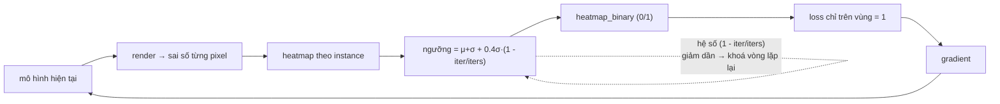
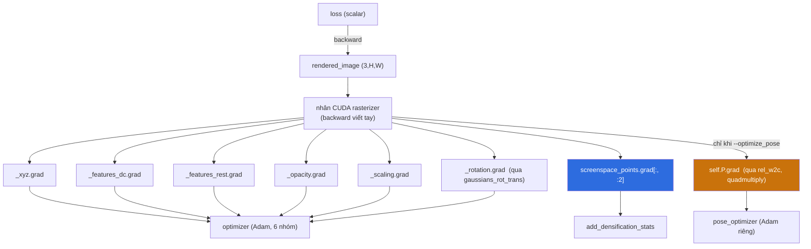
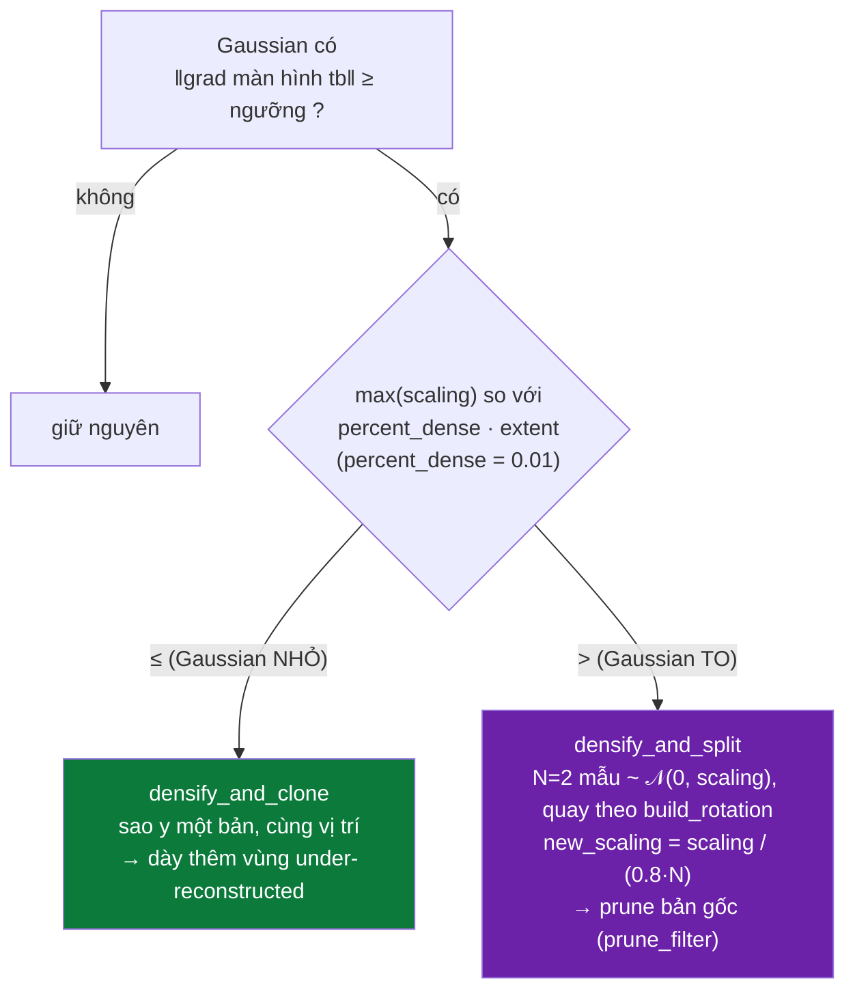

# DIGITAL TWIN GS — PIPELINE (Phần 2/3): Một vòng lặp train, mặt nạ, backward, densify, lưu

> Phần 1 (PHẦN I–V): [DIGITAL-TWIN-GS-PIPELINE-1.md](DIGITAL-TWIN-GS-PIPELINE-1.md). Phần 3 (PHẦN XI–XIII): [DIGITAL-TWIN-GS-PIPELINE-3.md](DIGITAL-TWIN-GS-PIPELINE-3.md).

Tài liệu này mổ xẻ **thân vòng lặp huấn luyện** của lệnh:

```bash
python train.py -s data/HCM0539 -m output/HCM0539 --scene HCM0539 --iter 7000 \
    --use_masks --schedule_densify_grad_threshold
```

Phần 1 đã dựng xong `Scene`, `GaussianModel` và tensor tư thế `self.P` / `self.test_P`.
Từ đây là 7000 lượt lặp giống nhau về khung, khác nhau về nội dung.

---

## Quy ước ký hiệu

| Ký hiệu | Nghĩa |
|---|---|
| **File:** `abc/xyz.py` | Đường dẫn tính từ **gốc repo** (`digital-twin-gs/`) |
| **Hàm:** `foo()` | Tên hàm / phương thức trong file vừa nêu |
| ① ② ③ | Số thứ tự bước trong một chuỗi xử lý |
| ★ | Điểm mấu chốt, dễ hiểu sai |
| ⚠ | Cạm bẫy đã / có thể gây lỗi âm thầm |
| ↺ | Vòng lặp khép kín (feedback loop) |
| 🔒 | Điểm phẫu thuật trạng thái optimizer (Adam `exp_avg` / `exp_avg_sq`) |

---

## MỤC LỤC PHẦN 2

### PHẦN VI — MỘT VÒNG LẶP TRAIN
- [28. Khung một vòng lặp](#28-khung-một-vòng-lặp)
- [29. `update_learning_rate` và `oneupSHdegree`](#29-update_learning_rate-và-oneupshdegree)
- [30. Bốc camera khỏi `viewpoint_stack`](#30-bốc-camera-khỏi-viewpoint_stack)
- [31. `render()` — mẹo view matrix đơn vị](#31-render--mẹo-view-matrix-đơn-vị)
- [32. `get_camera_from_tensor` + `quadmultiply`](#32-get_camera_from_tensor--quadmultiply)
- [33. Gọi rasterizer CUDA](#33-gọi-rasterizer-cuda)
- [34. `l1_loss` và `ssim` — trả về theo pixel](#34-l1_loss-và-ssim--trả-về-theo-pixel)
- [35. `compute_combined_loss` và `normalize_to_01`](#35-compute_combined_loss-và-normalize_to_01)
- [36. Loss thật đi vào backward](#36-loss-thật-đi-vào-backward)

### PHẦN VII — MẶT NẠ VẬT NHIỄU BẰNG SAM2
- [37. `load_label_maps_from_json`](#37-load_label_maps_from_json)
- [38. `compute_instance_loss_sum`](#38-compute_instance_loss_sum)
- [39. `compute_instance_losses` — heatmap và ngưỡng động](#39-compute_instance_losses--heatmap-và-ngưỡng-động)
- [40. `heatmap_binary` vào loss và `--mask_start_iter`](#40-heatmap_binary-vào-loss-và---mask_start_iter)

### PHẦN VIII — BACKWARD VÀ KIỂM SOÁT MẬT ĐỘ
- [41. `loss.backward()` — gradient chảy đi đâu](#41-lossbackward--gradient-chảy-đi-đâu)
- [42. `add_densification_stats`](#42-add_densification_stats)
- [43. Lịch tăng ngưỡng densify](#43-lịch-tăng-ngưỡng-densify)
- [44. `densify_and_prune`](#44-densify_and_prune)
- [45. `densify_and_clone` vs `densify_and_split`](#45-densify_and_clone-vs-densify_and_split)
- [46. 🔒 Phẫu thuật trạng thái Adam](#46--phẫu-thuật-trạng-thái-adam)
- [47. `reset_opacity`](#47-reset_opacity)
- [48. `optimizer.step()` và `step_pose()`](#48-optimizerstep-và-step_pose)
- [49. Checkpoint và `capture()`](#49-checkpoint-và-capture)

### PHẦN IX — ĐÁNH GIÁ TRONG LÚC TRAIN
- [50. `training_report`](#50-training_report)
- [51. `do_mot_cap` — đo lại y hệt `metrics.py`](#51-do_mot_cap--đo-lại-y-hệt-metricspy)

---
---

# PHẦN VI — MỘT VÒNG LẶP TRAIN

**File:** `train.py`, hàm `training()`, vòng `for iteration in range(first_iter, opt.iterations + 1)` — `train.py:367`.

---

## 28. Khung một vòng lặp

Mỗi lượt lặp làm đúng chín việc, theo thứ tự. Bảy việc đầu nằm trong đồ thị autograd,
hai việc cuối nằm trong `with torch.no_grad()` (`train.py:433`).

```mermaid
flowchart TD
    A["iter_start.record()"] --> B["gaussians.update_learning_rate(iteration)<br/>train.py:371"]
    B --> B2{"pose_on?"}
    B2 -->|có| B3["gaussians.update_pose_learning_rate(iteration)"]
    B2 -->|không| C
    B3 --> C["iteration % 1000 == 0 ?<br/>→ oneupSHdegree()  train.py:375"]
    C --> D["viewpoint_stack rỗng ?<br/>→ nạp lại từ scene.getTrainCameras().copy()"]
    D --> E["viewpoint_cam = stack.pop(randint(0, len-1))<br/>pose = gaussians.get_RT(viewpoint_cam.uid)  train.py:381"]
    E --> F["render_pkg = render(viewpoint_cam, gaussians, pipe, bg, camera_pose=pose)<br/>train.py:390"]
    F --> G["gt_image = viewpoint_cam.original_image.cuda()"]
    G --> H["Ll1 = l1_loss(image, gt_image)   # theo pixel<br/>ssim_value = 1.0 - ssim(image, gt_image)"]
    H --> I["combined_loss = compute_combined_loss(Ll1, ssim_value)  # detach"]
    I --> J{"use_masks &&<br/>label_map != None ?"}
    J -->|có| K["heatmap_norm, heatmap_binary =<br/>compute_instance_losses(...)  train.py:414"]
    J -->|không| L
    K --> M{"use_masks &&<br/>iteration > mask_start_iter ?"}
    M -->|có| N["loss = (1-λ)·(Ll1·hb).mean() + λ·(ssim·hb).mean()"]
    M -->|không| L["loss = (1-λ)·Ll1.mean() + λ·ssim_value.mean()"]
    N --> O
    L --> O{"lambda_lpips > 0 &&<br/>iteration > lpips_from_iter ?"}
    O -->|có| P["loss += lambda_lpips · lpips_khung_cat(...)"]
    O -->|không| Q
    P --> Q["loss.backward()   train.py:429"]
    Q --> R["iter_end.record()"]
    R --> S["with torch.no_grad():   train.py:433"]
    S --> S1["densify_grad_threshold += (0.001 - x)·(iter/iters)  # nếu --schedule..."]
    S1 --> S2["ema_loss = 0.4·loss + 0.6·ema_loss;  cập nhật thanh tqdm"]
    S2 --> S3["diem = training_report(...)   train.py:463"]
    S3 --> S4{"iteration in saving_iterations ?"}
    S4 -->|có| S5["scene.save(iteration); save_pose(...)"]
    S4 -->|không| T
    S5 --> T{"iteration < densify_until_iter ?"}
    T -->|có| U["max_radii2D update; add_densification_stats(...)<br/>iter>densify_from_iter && iter%100==0 → densify_and_prune(...)<br/>iter%opacity_reset_interval==0 → reset_opacity()"]
    T -->|không| V
    U --> V{"iteration < opt.iterations ?"}
    V -->|có| W["optimizer.step(); optimizer.zero_grad()<br/>pose_on && iter>=pose_from_iter → step_pose()"]
    V -->|không| X
    W --> X{"iteration in checkpoint_iterations ?"}
    X -->|có| Y["torch.save((gaussians.capture(), iteration), .../chkpnt<iter>.pth)"]
    X -->|không| Z["hết vòng"]
    Y --> Z

    style F fill:#2d6cdf,color:#fff
    style Q fill:#b3261e,color:#fff
    style U fill:#0b7a3b,color:#fff
```



★ Ba nhánh **densify / reset_opacity / checkpoint** đều bị đóng khung trong điều kiện
`iteration`. Với `--iter 7000` và cơ chế co lịch ở [Phần 1 §16](DIGITAL-TWIN-GS-PIPELINE-1.md),
`densify_until_iter` và `opacity_reset_interval` đã bị viết lại nhỏ hơn 15 000 / 3000
trước khi vòng lặp chạy dòng đầu tiên.

---

## 29. `update_learning_rate` và `oneupSHdegree`

**File:** `scene/gaussian_model.py`, `train.py:371`, `train.py:375`.

### 29.1 `update_learning_rate` — chỉ nhóm `xyz` thay đổi

```python
# scene/gaussian_model.py:305
def update_learning_rate(self, iteration):
    for param_group in self.optimizer.param_groups:
        if param_group["name"] == "xyz":
            lr = self.xyz_scheduler_args(iteration)
            param_group['lr'] = lr
            return lr
```

Năm nhóm còn lại (`f_dc`, `f_rest`, `opacity`, `scaling`, `rotation`) giữ nguyên learning
rate hằng số đặt trong `training_setup` ([Phần 1 §14](DIGITAL-TWIN-GS-PIPELINE-1.md)). Chỉ
toạ độ Gaussian mới có lịch giảm.

#### 29.1.1 Sáu learning rate — và `feature_lr / 20`

| nhóm (`gaussian_model.py:291–296`) | lr | có lịch? | nhân $r$? |
|---|---|---|---|
| `xyz` | $1{,}6\times10^{-4}\,r$ | ✅ **duy nhất** | ✅ |
| `f_dc` | $2{,}5\times10^{-3}$ | ❌ | ❌ |
| `f_rest` | $2{,}5\times10^{-3}/20 = 1{,}25\times10^{-4}$ | ❌ | ❌ |
| `opacity` | $0{,}05$ | ❌ | ❌ |
| `scaling` | $5\times10^{-3}$ | ❌ | ❌ |
| `rotation` | $10^{-3}$ | ❌ | ❌ |

Chỉ `xyz` có đơn vị vật lý phụ thuộc cảnh nên chỉ nó nhân $r$ và có lịch; và vị trí là thứ
cần "đóng băng" cuối train (màu/opacity tinh chỉnh tới cuối không gây bất ổn hình học).

**`feature_lr / 20`** (`gaussian_model.py:293`): 45 hệ số SH bậc cao là nơi dễ overfit theo
hướng nhìn nhất (mục 29.3.1). Học chậm $20\times$ → chúng chỉ hấp thu cái **nhất quán** đa
góc nhìn. Hệ số 20 bù cho việc biên độ hàm cơ sở bậc 3 lớn $\sim10\times$ bậc 0
($\max|Y_3| = 2{,}89$ vs $C_0 = 0{,}282$) cộng lề $2\times$.

**Adam `eps = 1e-15`** (`gaussian_model.py:299`, mặc định PyTorch là $10^{-8}$): Gaussian bị
che nhận gradient rất nhỏ ($\partial L/\partial\alpha_i = T_i(c_i - S_i)$ với $T_i \to 0$,
mục 41.1). Với $\varepsilon = 10^{-8}$
chúng chỉ nhận $\sim1\%$ bước đi; với $10^{-15}$ chúng nhận bước đầy đủ → vẫn có cơ hội
học. Cái giá: Gaussian gradient thuần nhiễu cũng "lang thang".

### 29.2 `xyz_scheduler_args` = `get_expon_lr_func`

**File:** `utils/general_utils.py:29`.

```python
t = np.clip(step / max_steps, 0, 1)
log_lerp = np.exp(np.log(lr_init) * (1 - t) + np.log(lr_final) * t)
return delay_rate * log_lerp
```

- Nội suy **tuyến tính trong không gian log** → giảm theo cấp số nhân trong không gian
  thực. `lr = lr_init` khi `step = 0`, `lr = lr_final` khi `step = max_steps`.
- `lr_init  = position_lr_init  * spatial_lr_scale = 0.00016  * cameras_extent`
- `lr_final = position_lr_final * spatial_lr_scale = 0.0000016 * cameras_extent`
- `max_steps = position_lr_max_steps`. Mặc định gốc 30 000; cơ chế co lịch đổi thành
  `opt.iterations` (7000) để lr toạ độ đi trọn đường anneal đúng lúc train dừng.
- `delay_rate`: chỉ khác 1 khi `lr_delay_steps > 0`. Ở đây `lr_delay_steps = 0`
  (không truyền), `lr_delay_mult = 0.01` bị bỏ qua → `delay_rate = 1.0`.

⚠ Nếu chạy `--no_auto_schedule` mà vẫn để `--iter 7000`: `max_steps` giữ nguyên 30 000,
`t` chỉ chạy tới `7000/30000 ≈ 0.23`, lr toạ độ còn ~ một nửa giá trị đầu khi train
dừng — Gaussian còn đang trôi → ảnh nhoè → mất điểm LPIPS/SSIM.

#### 29.2.1 Suy dẫn: nội suy log-tuyến tính **là** suy giảm hàm mũ

Đặt $\gamma \triangleq \text{lr}_1/\text{lr}_0$. Lấy $\exp$ hai vế của nội suy tuyến tính trong
không gian log:

$$\text{lr}(t) = e^{(1-t)\ln\text{lr}_0 + t\ln\text{lr}_1}
             = \text{lr}_0^{1-t}\,\text{lr}_1^{t}
             = \text{lr}_0\,\gamma^{t}, \qquad t = k/K$$

nên $\text{lr}(k) = \text{lr}_0\,\gamma^{k/K}$ — **cấp số nhân**. Với hằng số thật
$\gamma = \dfrac{0{,}0000016}{0{,}00016} = 10^{-2}$: lr toạ độ giảm **đúng 100 lần** trên
trọn lịch. Tỉ lệ giảm **mỗi bước** là hằng số $\gamma^{1/K}$; với $K = 7000$ đó là
$10^{-2/7000} = 0{,}99934$ (mỗi bước bớt $0{,}066\%$).

Bảng (lấy $r = \texttt{cameras\_extent} = 22{,}0$ làm ví dụ, $\text{lr}_0 = 1{,}6\times10^{-4}\times22 = 3{,}52\times10^{-3}$):

| bước $k$ (trên 7000) | $t$ | $\gamma^{t}$ | $\text{lr}(k)$ | % của $\text{lr}_0$ |
|---|---|---|---|---|
| 0 | 0,00 | 1,000 | $3{,}52\times10^{-3}$ | 100 % |
| 500 | 0,071 | 0,681 | $2{,}40\times10^{-3}$ | 68 % |
| 3500 | 0,50 | 0,100 | $3{,}52\times10^{-4}$ | 10 % |
| 7000 | 1,00 | 0,010 | $3{,}52\times10^{-5}$ | **1 %** |

★ **Tổng quãng đường một Gaussian có thể trôi** (nếu mọi bước cùng hướng) là tổng cấp số
nhân $D = \text{lr}_0\dfrac{1-\gamma^{K'/K}}{1-\gamma^{1/K}}$. Với lịch đầy đủ ($K'=K$):
$D \approx 3{,}52\times10^{-3}\times\dfrac{0{,}99}{6{,}58\times10^{-4}} \approx 5{,}3$ —
tức khoảng $24\%\,r$. Lịch được canh để "một Gaussian đặt sai vẫn đi tới đúng chỗ được"
mà không lang thang vô định. Nếu `max_steps` không co (giữ 30 000) thì $D$ lớn hơn nhưng
lr **cuối** vẫn ở $34\%$ — mô hình *di chuyển đủ nhưng không dừng lại đủ*.

#### 29.2.2 ⚠ `lr_delay_mult` là code chết — và nó **đáng lẽ** làm gì

`training_setup` (`gaussian_model.py:300`) truyền `lr_delay_mult=position_lr_delay_mult`
(`= 0.01`, `arguments/__init__.py:76`) **nhưng không truyền `lr_delay_steps`** — nó giữ
mặc định `0` trong chữ ký `get_expon_lr_func` (`utils/general_utils.py:29`). Và nhánh
warm-up chỉ chạy khi `lr_delay_steps > 0`:

```python
if lr_delay_steps > 0:
    delay_rate = lr_delay_mult + (1 - lr_delay_mult) * np.sin(0.5*np.pi*np.clip(step/lr_delay_steps, 0, 1))
else:
    delay_rate = 1.0        # ← LUÔN đi vào đây
```

Nên `position_lr_delay_mult = 0.01` **hoàn toàn vô tác dụng**, và cả nhánh `if` là code
chết (kế thừa nguyên từ Plenoxels/JaxNeRF — comment nói rõ nguồn). Nếu bật, nó là một
**warm-up hình sin**: $\text{delay\_rate}(0) = m = 0{,}01$ (lr chỉ $1\%$), tăng mượt lên
$1$ tại $k = \texttt{lr\_delay\_steps}$, đạo hàm $= 0$ ở hai biên nên nối vào lịch chính
không gãy. Mục đích: cho Adam vài trăm bước "làm nóng" ước lượng $\hat v$ trước khi bước
đi lớn. 3DGS gốc cũng để chết dòng này.

### 29.3 `oneupSHdegree` — mở bậc SH mỗi 1000 vòng

```python
# train.py:375
if iteration % 1000 == 0:
    gaussians.oneupSHdegree()
```

```python
# scene/gaussian_model.py:254
def oneupSHdegree(self):
    if self.active_sh_degree < self.max_sh_degree:
        self.active_sh_degree += 1
```

`max_sh_degree = 3` (`ModelParams.sh_degree`). `active_sh_degree` bắt đầu ở 0
(chỉ màu DC), lên 1 ở vòng 1000, 2 ở vòng 2000, **3 ở vòng 3000** rồi kịch trần.
Rasterizer nhận `sh_degree=pc.active_sh_degree` (`gaussian_renderer/__init__.py:71`), nên
hệ số SH bậc cao chỉ bắt đầu nhận gradient sau khi bậc được mở. Đây là lý do
`densify_from_iter` không nên hạ xuống dưới ~500: densify sớm khi màu còn phẳng chỉ nhân
bản số liệu nhiễu.

#### 29.3.1 Lịch mở bậc và "curriculum learning"

| bước | `active_sh_degree` | hệ số SH nhận gradient | % của 48 |
|---|---|---|---|
| 1 – 999 | 0 | 3 (chỉ DC) | 6 % |
| 1000 – 1999 | 1 | 12 | 25 % |
| 2000 – 2999 | 2 | 27 | 56 % |
| **3000 – 7000** | **3** | **48** | 100 % |

Bậc đầy đủ đạt ở vòng 3000, còn 4000 vòng để tinh chỉnh. Trong CUDA, `deg` điều khiển các
câu `if (deg > 0/1/2)` của `computeColorFromSH`
(`submodules/diff-gaussian-rasterization/cuda_rasterizer/forward.cu:20`), nên hệ số bậc
cao hơn `deg` **không được đọc và không nhận gradient**.

**Vì sao mở lũy tiến.** Đầu train hình học sai hẳn. 48 hệ số SH cho quá nhiều tự do để
"giải thích" ảnh mà **không** cần sửa vị trí Gaussian — một Gaussian đặt sai vẫn khớp
được 5 ảnh train bằng cách học "nhìn hướng A thì đỏ, hướng B thì xanh". Đó là **overfit
theo hướng nhìn**: khớp train, hỏng test (đốm màu loang lổ). Với chỉ bậc 0, Gaussian có
**một** màu cho mọi hướng → cách duy nhất giảm loss là **đặt nó đúng chỗ** → hình học buộc
phải hội tụ trước. Ba lớp bảo vệ độc lập cho cùng vấn đề: (1) mở bậc lũy tiến, (2)
`feature_lr / 20` cho `_features_rest` (mục 29.1.1), (3) khởi tạo
`_features_rest = 0` (`torch.zeros` ở `gaussian_model.py:262`, cắt ra ở `:278`).

#### 29.3.2 Rasterizer tự chuyển SH → RGB

Khi `shs` được truyền thẳng (mặc định, `pipe.convert_SHs_python = False`), CUDA làm:

```cpp
result = SH_C0 * sh[0] + (bậc 1..3 nếu deg đủ);
result += 0.5f;                                   // ★ điểm neo xám
clamped[3*idx + k] = (result[k] < 0);             // ghi lại để backward
return glm::max(result, 0.0f);                    // kẹp màu âm về 0
```

- **`+ 0.5`**: hệ số SH mã hoá *độ lệch so với xám*, không phải màu tuyệt đối. `f = 0` →
  xám trung tính chứ không phải đen. Nhờ vậy khởi tạo `_features_rest = 0` là hợp lý và
  Adam làm việc quanh 0. `RGB2SH` (`sh_utils.py`) là hàm ngược: $(c - 0{,}5)/C_0$.
- **`clamped` + kẹp**: đây là **ReLU cài lại bằng tay**. Backward nhân gradient với 0 nếu
  kênh đã bị kẹp (`backward.cu:32`). Thừa hưởng luôn "dying ReLU": kênh màu rơi xuống âm
  thì gradient của nó $= 0$, chỉ hồi được nhờ gradient từ **hướng nhìn khác** (hệ số SH
  dùng chung mọi hướng).

⚠ `load_ply` đặt `self.active_sh_degree = self.max_sh_degree` ngay (`gaussian_model.py:399`)
— phá cả ba lớp bảo vệ. Đúng khi chỉ để render, nhưng fine-tune từ `.ply` là mở bậc 3
ngay từ vòng 1.

⚠ Nhánh `pipe.convert_SHs_python = True` (`gaussian_renderer/__init__.py:110`) tính hướng
nhìn từ `pc.get_xyz - viewpoint_camera.camera_center` (hệ **world**), trong khi nhánh CUDA
mặc định nhận `campos = (0,0,0)` và `means3D` **đã ở hệ camera** (mẹo view matrix đơn vị,
mục 31). Hai nhánh dùng hai hệ toạ độ khác nhau cho hướng nhìn → nhánh Python cho màu SH
bậc lẻ **sai phía** với repo này.

---

## 30. Bốc camera khỏi `viewpoint_stack`

**File:** `train.py:378`.

```python
if not viewpoint_stack:
    viewpoint_stack = scene.getTrainCameras().copy()
viewpoint_cam = viewpoint_stack.pop(randint(0, len(viewpoint_stack)-1))
pose = gaussians.get_RT(viewpoint_cam.uid)
```

① `viewpoint_stack` cạn → nạp lại **toàn bộ** danh sách camera train (một `.copy()` để
`pop` không huỷ danh sách gốc trong `Scene`).
② `pop(randint(...))` = lấy ngẫu nhiên **không hoàn lại**: trong một "epoch" mỗi ảnh train
được thăm đúng một lần, thứ tự xáo trộn. Khác với `random.choice` (có hoàn lại) — cách này
giữ phân phối thăm đều hơn.

### 30.1 ★ `uid` và chỉ số của `self.P` phải khớp

`viewpoint_cam.uid` là **chỉ số `enumerate` sau khi shuffle**, gán trong
`cameraList_from_camInfos` → `loadCam(args, id, c, ...)` với `uid=id`
(`utils/camera_utils.py:57`). `Scene.__init__` shuffle `scene_info.train_cameras`
*trước* khi gọi `cameraList_from_camInfos`, nên `id` chạy 0..N‑1 trên danh sách **đã**
xáo.

`init_RT_seq` (`scene/gaussian_model.py:137`) duyệt đúng danh sách `cam_list[1.0]` đó theo
cùng thứ tự và `torch.stack` các tư thế → `self.P[i]` là tư thế của camera có `uid == i`.
Vì vậy `get_RT(viewpoint_cam.uid)` (`gaussian_model.py:233`) tra đúng hàng.

⚠ Nếu ai đó thêm một lần shuffle nữa ở giữa, hoặc nạp `self.P` từ nguồn khác không theo
thứ tự `uid`, thì render sẽ dùng tư thế của **ảnh khác** — ảnh train vẫn "khớp" kiểu
nào đó nhưng test sập.

---

## 31. `render()` — mẹo view matrix đơn vị

**File:** `gaussian_renderer/__init__.py`, hàm `render()` — dòng 23–144.

### 31.1 Cấu hình rasterizer

```python
# gaussian_renderer/__init__.py:39
screenspace_points = torch.zeros_like(pc.get_xyz, dtype=..., requires_grad=True, device="cuda") + 0
screenspace_points.retain_grad()

tanfovx = math.tan(viewpoint_camera.FoVx * 0.5)
tanfovy = math.tan(viewpoint_camera.FoVy * 0.5)

# gaussian_renderer/__init__.py:55  ── mấu chốt ──
w2c = torch.eye(4).cuda()
projmatrix = (w2c.unsqueeze(0).bmm(viewpoint_camera.projection_matrix.unsqueeze(0))).squeeze(0)
camera_pos = w2c.inverse()[3, :3]        # = (0, 0, 0)

raster_settings = GaussianRasterizationSettings(
    image_height=int(viewpoint_camera.image_height),
    image_width=int(viewpoint_camera.image_width),
    tanfovx=tanfovx, tanfovy=tanfovy,
    bg=bg_color, scale_modifier=scaling_modifier,
    viewmatrix=w2c,                       # ★ ma trận đơn vị, KHÔNG phải world_view_transform
    projmatrix=projmatrix,               # = I · projection_matrix = projection_matrix
    sh_degree=pc.active_sh_degree,
    campos=camera_pos,                    # ★ gốc toạ độ, KHÔNG phải camera_center
    prefiltered=False, debug=pipe.debug,
)
```

★ Ba dòng bị comment ngay bên cạnh (`gaussian_renderer/__init__.py:67`, `68`, `72`) cho
thấy bản 3DGS gốc truyền thẳng `viewpoint_camera.world_view_transform`,
`viewpoint_camera.full_proj_transform` và `viewpoint_camera.camera_center`. Bản này thay
bằng **ma trận đơn vị + gốc toạ độ**: coi
như camera đứng yên tại gốc, nhìn theo trục $+z$, và **cả đám Gaussian được dịch chuyển
tới trước mặt camera** bằng phép toán PyTorch (mục 32) thay vì để rasterizer nhân view
matrix.

### 31.2 Vì sao phải lách như vậy

Nhân CUDA `diff_gaussian_rasterization` nhận `viewmatrix` như một **hằng số** — nó không
truyền gradient ngược qua `viewmatrix`. Muốn `∂loss/∂(tư thế camera)` chảy được, phép biến
đổi tư thế phải nằm **ngoài** nhân CUDA, trong autograd của PyTorch. Đó chính là mục 32.

Cái giá: mỗi frame làm $O(P)$ phép nhân ma trận cho toàn bộ $P$ Gaussian, thay vì một phép
biến đổi camera duy nhất. Khi `self.P` **bị đóng băng** (không có `--optimize_pose`), đoạn
này chỉ đang **tính lại đúng phép biến đổi mà rasterizer sẽ tự làm** nếu truyền thẳng
`world_view_transform` — tốn công vô ích nhưng kết quả số học tương đương.

---

## 32. `get_camera_from_tensor` + `quadmultiply`

**File:** `utils/pose_utils.py` (hàm `get_camera_from_tensor` dòng 56, `quad2rotation` dòng 9,
`quadmultiply` dòng 85); `gaussian_renderer/__init__.py:81`.

```python
# gaussian_renderer/__init__.py:81
rel_w2c = get_camera_from_tensor(camera_pose)         # tensor 7 số → ma trận 4×4

gaussians_xyz = pc._xyz.clone()
gaussians_rot = pc._rotation.clone()

xyz_ones = torch.ones(gaussians_xyz.shape[0], 1).cuda().float()
xyz_homo = torch.cat((gaussians_xyz, xyz_ones), dim=1)                 # (P, 4)
gaussians_xyz_trans = (rel_w2c @ xyz_homo.T).T[:, :3]                  # (P, 3)  ── dịch tâm
gaussians_rot_trans = quadmultiply(camera_pose[:4], gaussians_rot)    # (P, 4)  ── xoay hướng
means3D = gaussians_xyz_trans
```

### 32.1 `camera_pose` là gì

`camera_pose = gaussians.get_RT(uid)` = `self.P[uid]` = tensor 7 số
`[qw, qx, qy, qz, tx, ty, tz]`, sinh ra trong `init_RT_seq` bằng
`get_tensor_from_camera(cam.world_view_transform.transpose(0,1))`
(`scene/gaussian_model.py:156`) — tức là **chính tư thế world→view của COLMAP**, đóng gói
lại thành quaternion + tịnh tiến.

### 32.2 `get_camera_from_tensor` (pose_utils.py:56)

```python
quad, T = inputs[:, :4], inputs[:, 4:]
w2c = torch.eye(4)
w2c[:3, :3] = quad2rotation(quad)     # quaternion → ma trận quay 3×3, chuẩn hoá quad trước
w2c[:3, 3]  = T
return w2c
```

`quad2rotation` (pose_utils.py:9) dựng ma trận quay từ 4 số quaternion bằng các phép
`torch.*` thuần → **mọi phần tử của `w2c` là hàm khả vi của `camera_pose`**.

### 32.3 ★ Chỉ **tâm** và **hướng** được đưa vào hệ camera

| Thuộc tính Gaussian | Có bị biến đổi trong `render()` không |
|---|---|
| `means3D` (tâm) | **Có** — `rel_w2c @ xyz_homo` |
| `rotations` (quaternion hướng) | **Có** — `quadmultiply(camera_pose[:4], rot)` |
| `scales` | **Không** — truyền thẳng `pc.get_scaling` (`__init__.py:102`) |
| `opacity` | **Không** — `pc.get_opacity` |
| `shs` / màu | **Không** (trừ khi `pipe.convert_SHs_python`) |

Điều này hợp lý: phép biến đổi cứng (rigid) không đổi kích thước Gaussian, chỉ đổi vị trí
và hướng. `quadmultiply` (pose_utils.py:85) là nhân quaternion Hamilton, gộp phép quay của
camera vào phép quay sẵn có của từng Gaussian.

### 32.4 ↺ Gradient về tư thế — chỉ khi `--optimize_pose`

`rel_w2c` được autograd dựng từ `camera_pose`, nên `loss.backward()` **có thể** chảy ngược
về `self.P[uid]` — nhưng chỉ khi `self.P` là **lá (leaf) có `requires_grad=True`**. Điều đó
đúng khi và chỉ khi `init_RT_seq(..., optimize=True)`, tức là bật cờ `--optimize_pose`
(xem [Phần 1 §17](DIGITAL-TWIN-GS-PIPELINE-1.md)). Không có cờ đó thì `self.P` là tensor
`requires_grad_(False)` → gradient tới đó bị chặn, và toàn bộ đoạn dịch chuyển này chỉ là
chi phí thừa.

`self.test_P` **luôn** đóng băng — không bao giờ tối ưu tư thế của ảnh test (nhìn trộm đáp
án, thi thường cấm).

---

## 33. Gọi rasterizer CUDA

**File:** `gaussian_renderer/__init__.py:126`.

```python
rendered_image, radii = rasterizer(
    means3D=means3D,                    # (P, 3) — tâm đã ở hệ camera
    means2D=screenspace_points,         # (P, 3) — tensor 0, chỉ để lấy .grad màn hình
    shs=shs,                            # (P, 16, 3) nếu không precompute màu
    colors_precomp=colors_precomp,      # hoặc màu đã tính sẵn (pipe.convert_SHs_python)
    opacities=opacity,                  # (P, 1)
    scales=scales,                      # (P, 3) — KHÔNG biến đổi
    rotations=gaussians_rot_trans,      # (P, 4) — đã quay theo camera
    cov3D_precomp=cov3D_precomp,        # hoặc None → rasterizer tự dựng từ scale/rot
)
```

Trả về:

```python
# gaussian_renderer/__init__.py:139
return {
    "render": rendered_image,                 # (3, H, W)
    "viewspace_points": screenspace_points,   # để add_densification_stats đọc .grad
    "visibility_filter": radii > 0,           # Gaussian nào lọt khung nhìn
    "radii": radii,                           # bán kính trên màn hình (px)
}
```

### 33.1 `screenspace_points` và gradient màn hình

`screenspace_points` (`__init__.py:39`) là tensor **toàn 0**, `requires_grad=True`,
`.retain_grad()`. Nó không mang thông tin gì khi forward; sau `backward()`,
`screenspace_points.grad[:, :2]` chứa **gradient của loss theo vị trí chiếu 2D của từng
Gaussian**. `add_densification_stats` (mục 42) dùng chuẩn của gradient này làm tiêu chí
"Gaussian này đang bị kéo mạnh → cần thêm mật độ ở đây".

### 33.2 Vì sao rasterize là CUDA chứ không PyTorch

Rasterizer 3DGS chia ảnh thành **tile 16×16**, với mỗi tile sắp các Gaussian phủ lên nó
theo **độ sâu**, rồi alpha-blend từ gần ra xa tới khi độ đục tích luỹ bão hoà. Viết bằng
PyTorch thuần: chậm hơn ~2 bậc và phải giữ activation cho mọi cặp (Gaussian, tile).
`diff-gaussian-rasterization` viết **forward và backward bằng tay trong CUDA**, không lưu
activation trung gian (tái tính khi backward), nên vừa nhanh vừa nhẹ RAM. Cái giá: bắt
buộc GPU NVIDIA + toolchain `nvcc`, và mã khó đọc.

> **Xoá `submodules/diff-gaussian-rasterization/` hỏng gì.** `render()` không import được
> `GaussianRasterizationSettings` → `train.py` chết ở dòng `from gaussian_renderer import
> render`. Không có đường lui PyTorch trong repo này; toàn bộ tài liệu §33–§41 mô tả nội
> tại của module này.

Bốn tiểu mục dưới đây mổ nội tại `forward` của module, theo đúng thứ tự nó chạy:
`preprocessCUDA` → prefix sum → `duplicateWithKeys` + radix sort → `renderCUDA`.
File: `submodules/diff-gaussian-rasterization/cuda_rasterizer/{forward.cu, rasterizer_impl.cu, auxiliary.h, config.h}`.

### 33.3 `computeCov2D` — EWA splatting $\Sigma' = JW\Sigma W^\top J^\top$

`forward.cu:74`. Chiếu một Gaussian **3D** thành Gaussian **2D** trên ảnh — bước làm nên
toàn bộ tốc độ của 3DGS (không cần lấy mẫu theo tia như NeRF).

**Định lý affine.** Nếu $x \sim \mathcal N(\mu, \Sigma)$ và $y = Ax + b$ thì
$y \sim \mathcal N(A\mu + b,\ A\Sigma A^\top)$. Chứng minh (qua định nghĩa hiệp phương sai):
$y - \mathbb E y = A(x - \mu)$, nên
$\mathrm{Cov}(y) = \mathbb E[A(x-\mu)(x-\mu)^\top A^\top] = A\Sigma A^\top$. Phần dịch $b$
biến mất. $\blacksquare$

Chuỗi world → pixel có hai chặng: $x_{\text{world}} \xrightarrow{\text{affine } Wx+t}
x_{\text{view}} \xrightarrow{\text{PHI TUYẾN chia } z} (u,v)$. Chặng 1 xử lý **chính xác**
($\Sigma_{\text{view}} = W\Sigma W^\top$). Chặng 2 phi tuyến → xấp xỉ Taylor bậc nhất tại
tâm Gaussian bằng Jacobian:

$$J = \begin{pmatrix} f_x/t_z & 0 & -f_x t_x/t_z^2 \\ 0 & f_y/t_z & -f_y t_y/t_z^2 \end{pmatrix}
\qquad\Longrightarrow\qquad \boxed{\Sigma' = J\,W\,\Sigma\,W^\top J^\top}$$

(6 đạo hàm riêng của $u = f_x x/z$, $v = f_y y/z$). **Đây là chỗ xấp xỉ duy nhất trong toàn
bộ 3DGS**; sai số $\sim O(\sigma_{\text{3D}}/t_z)$ — nhỏ khi Gaussian nhỏ so với khoảng
cách camera (điều mà ba cơ chế tỉa/chia ở mục 44 giữ đúng).

**Hai hằng số phải khớp code CUDA:**

| Hằng số | Ở đâu | Vì sao |
|---|---|---|
| Kẹp $\|t_x/t_z\| \le 1{,}3\tan\frac{\text{fov}_x}{2}$ | `forward.cu:82–87` | $J_{02} = -\frac{f_x}{t_z}\cdot\frac{t_x}{t_z}$ không bị chặn; Gaussian xa biên khung nhìn cho $J_{02}$ khổng lồ → splat chạm hàng nghìn tile → nổ VRAM. Lề $30\%$ để Gaussian có tâm hơi ngoài biên vẫn xử lý đúng phần trong khung. `1,3` là số tuning, không suy dẫn. |
| Bộ lọc thông thấp $\Sigma'_{00} \mathrel{+}= 0{,}3$, $\Sigma'_{11} \mathrel{+}= 0{,}3$ | `forward.cu:110–111` | Tích chập với Gaussian $\sigma = \sqrt{0{,}3} \approx 0{,}548$ px (tích chập = **cộng** hiệp phương sai). Ép mọi splat rộng $\ge 1$ px → chống aliasing nhấp nháy khi camera dịch. Cũng làm $\det \Sigma' \ge 0{,}09 > 0$ (cải thiện điều kiện số — lợi ích kép). |

Code viết $T^\top\Sigma^\top T$ với $T = WJ$ trông khác công thức, nhưng vì `glm::mat3(a,b,c,…)`
đặt $(a,b,c)$ làm **cột** trong khi code viết theo **hàng**, mỗi `glm::mat3` chứa chuyển vị
của thứ trông thấy → hai vế bằng nhau. Comment code: *"Transposes used to account for
row-/column-major conventions."*

### 33.4 Nghịch đảo $2\times2$ → conic + bán kính $3\sigma$

`forward.cu:219–235`.

```cpp
float det = cov.x*cov.z - cov.y*cov.y;   if (det == 0.0f) return;
float3 conic = { cov.z/det, -cov.y/det, cov.x/det };          // Σ'⁻¹, chỉ 3 số
float mid = 0.5f*(cov.x + cov.z);
float lambda1 = mid + sqrt(max(0.1f, mid*mid - det));
float my_radius = ceil(3.f * sqrt(max(lambda1, lambda2)));
```

- **Conic** $\Sigma'^{-1}$: chỉ lưu 3 số (đối xứng), đóng gói cùng opacity vào **một
  `float4`** (`conic_opacity[idx]`, `forward.cu:254`) = 16 byte = một lệnh nạp
  `LDG.E.128`. `renderCUDA` đọc số này cho mọi cặp (pixel, Gaussian) nên coalescing đáng
  giá.
- **Trị riêng** ma trận $2\times2$ đối xứng: $\lambda_{1,2} = m \pm \sqrt{m^2 - \det}$ với
  $m = \frac{a+c}{2}$ (từ đa thức đặc trưng $\lambda^2 - (a+c)\lambda + \det = 0$). Biểu
  thức dưới căn $= \left(\frac{a-c}{2}\right)^2 + b^2 \ge 0$ luôn (định lý phổ). Sàn
  `max(0.1f, …)` che catastrophic cancellation khi $m^2 \approx \det$ (Gaussian gần
  tròn) — với `ceil`, hiệu ứng gần như luôn là "+1 px bán kính".
- **$3\sigma$**: $q = d^\top\Sigma'^{-1}d$ theo $\chi^2$ 2 bậc tự do, $P(q \le k^2) = 1 - e^{-k^2/2}$.
  Cắt ở $3\sigma$ giữ **98,89 %** khối lượng ($2\sigma$: 86,5 %; $4\sigma$: 99,97 %). $3\sigma$
  là điểm dừng đúng, và khớp ngưỡng $\alpha < 1/255$ ở đâu đó quanh $3{,}1\sigma$.
- `lambda2` được tính nhưng `max(lambda1, lambda2)` luôn $= \lambda_1$ → **code chết** (1
  `sqrt` + 1 trừ thừa/Gaussian).

`getRect` (`auxiliary.h`) kẹp hình vuông bao $[\mu' \pm r]$ vào lưới tile $16\times16$
(`BLOCK_X = BLOCK_Y = 16`, `config.h`); `tiles_touched[idx]` = số tile chạm, đi vào prefix
sum. ⚠ Hình **vuông** thay ellipse: với Gaussian dẹt tỉ lệ 10:1, hơn $90\%$ tile sinh ra
là vô ích (mọi pixel trong đó cho `power > 0` rồi `continue`) — điểm nghẽn hiệu năng đã
biết của 3DGS gốc.

### 33.5 Khoá 64-bit `tile|depth` + một lần radix sort

Kết hợp alpha **không giao hoán** ($c_1\alpha_1 + c_2\alpha_2(1-\alpha_1) \ne$ đảo thứ
tự), nên mỗi tile cần danh sách Gaussian **đã sắp theo độ sâu**. Cách ngây thơ: $N_{\text{tile}}$
lần sort riêng. Cách 3DGS (`rasterizer_impl.cu:70–111`):

```cpp
uint64_t key = y * grid.x + x;     // tile ID  → 32 bit CAO
key <<= 32;
key |= *((uint32_t*)&depths[idx]); // p_view.z → 32 bit THẤP (đọc bit float như uint32)
```

Sort **tăng dần** một lần `cub::DeviceRadixSort::SortPairs` tự động cho: nhóm theo tile
(32 bit cao), rồi trong tile sắp theo độ sâu (32 bit thấp). Nhanh hơn cách ngây thơ
$\sim100$–$600$ lần.

- **Mẹo bit float-as-uint** đúng nhờ IEEE-754: với $a, b \ge 0$,
  $a < b \iff \text{bits}(a) < \text{bits}(b)$. ⚠ **Bất biến khoá:** phụ thuộc `in_frustum`
  đã loại mọi Gaussian có $z \le 0{,}001$ (`auxiliary.h`). Nếu ai nới ngưỡng $z$, Gaussian
  $z<0$ có bit dấu $=1$ → xem như `uint32` rất lớn → xếp cuối → thứ tự vẽ đảo âm thầm.
- **`depths` là `p_view.z`** (view space, tuyến tính) chứ không phải $z_{\text{ndc}}$
  (hyperbol, lệch nặng ở xa) → ít va chạm khoá hơn.
- **Prefix sum** `cub::DeviceScan::InclusiveSum` trên `tiles_touched` cho chỗ ghi của từng
  Gaussian: $\text{offset}_i = \sum_{j<i}k_j$ — đúng `rowPtr` của CSR. Tránh `atomicAdd`
  (tuần tự hoá + thứ tự không xác định). `cudaMemcpy` 4 byte lấy `num_rendered` về host là
  **điểm đồng bộ hoá duy nhất** của forward.
- `getHigherMsb(N_tile)` cho số bit tile thật (13 với ảnh 1080p) → sort $32 + 13 = 45$ bit
  thay 64 → bớt $25\%$ số lượt radix.

### 33.6 Alpha blending forward + ba lần thoát sớm

`renderCUDA` (`forward.cu:261`): 1 block = 1 tile $16\times16$, 1 thread = 1 pixel, nạp
Gaussian vào shared memory theo lô 256.

$$\boxed{C(p) = \sum_{i\in\mathcal N} c_i\,\alpha_i\,T_i \;+\; c_{\text{bg}}\,T_{n+1}},
\qquad T_i = \prod_{j<i}(1-\alpha_j),\qquad \alpha_i = \min\!\big(0{,}99,\ o_i\,e^{\text{power}_i}\big)$$

với $\text{power} = -\frac12 d^\top\Sigma'^{-1}d = -\frac12(A d_x^2 + C d_y^2) - B d_x d_y$
(dạng toàn phương viết tay, `forward.cu:335` — chú ý số hạng chéo **không** có $\frac12$).
Công thức này chính là **render thể tích rời rạc hoá** ($\alpha_i \triangleq 1 - e^{-\sigma_i\delta_i}$),
chỉ khác NeRF ở chỗ "đoạn" là Gaussian và $\alpha_i$ tính bằng công thức đóng $\sim20$ flop
thay vì một lần chạy MLP $\sim10^5$ flop.

| Thoát sớm | Điều kiện | Bản chất |
|---|---|---|
| 1 | `if (power > 0.0f) continue;` | Lớp bảo vệ số học: $\Sigma'^{-1}$ xác định dương ⇒ `power` $\le 0$ về toán học. ⚠ **không** bắt `NaN` (`NaN > 0` là `false`). |
| 2 | `if (alpha < 1.0f/255.0f) continue;` | Tối ưu: dưới một mức lượng tử 8-bit. Xấp xỉ, không tương đương (nhiều Gaussian dưới ngưỡng cộng lại vẫn thấy được) — sai lệch được optimizer hấp thu vào opacity. |
| 3 | `if (test_T < 0.0001f) { done = true; }` | $T$ **đơn điệu giảm** (vì $1-\alpha_i \ge 0{,}01$) ⇒ một khi $T < 10^{-4}$ thì mọi Gaussian còn lại đóng góp $< 10^{-4} \ll 1/255$ → bỏ **toàn bộ** phần còn lại an toàn. |

- **Kẹp $\alpha \le 0{,}99$** (`forward.cu:343`) là **bất biến liên kết forward–backward**:
  backward chia cho $1-\alpha$ (mục 41), kẹp đảm bảo $1-\alpha \ge 0{,}01$ → phóng đại tối
  đa $100\times$/bước. Bỏ kẹp → backward chia cho $\approx 0$ → `NaN` toàn mô hình.
- **Cập nhật $T$ tăng dần** ($T \leftarrow T(1-\alpha)$ *sau* khi cộng vào $C$): $O(\bar n)$
  thay $O(\bar n^2)$ nếu tính lại tích mỗi vòng.
- **Bảo toàn năng lượng:** $\sum_{i=1}^{n}\alpha_i T_i + T_{n+1} = 1$ (quy nạp: bước $n{+}1$
  cho $\alpha_{n+1}T_{n+1} + T_{n+1}(1-\alpha_{n+1}) = T_{n+1}$). Nên $C$ là **tổ hợp lồi**
  của các màu → không cần kẹp `out_color` (thoát sớm 3 phá đẳng thức đúng $\le 10^{-4}$).
- Ghi ra ba mảng: `out_color` (cho PyTorch), `final_T` = `accum_alpha` và `n_contrib` —
  hai cái sau **chỉ để backward** khôi phục $T$ và bỏ qua Gaussian bị che.

`num_rendered` (tổng cặp tile–Gaussian) là giá trị trả về của `Rasterizer::forward`, được
Python lưu lại để cấp phát buffer cho backward.

---

## 34. `l1_loss` và `ssim` — trả về theo pixel

**File:** `utils/loss_utils.py`; gọi tại `train.py:405`.

```python
# train.py:405
Ll1 = l1_loss(image, gt_image)               # (3, H, W) — KHÔNG phải scalar
ssim_value = 1.0 - ssim(image, gt_image)     # (H, W)    — KHÔNG phải scalar
```

### 34.1 `l1_loss` (loss_utils.py:18)

```python
def l1_loss(network_output, gt):
    return torch.nn.functional.l1_loss(network_output, gt, reduction='none')
```

★ `reduction='none'` — trả về **sai số tuyệt đối từng pixel từng kênh**, hình dạng
`(3, H, W)`. Bản 3DGS gốc trả `.mean()` (một số). Giữ dạng theo pixel là điều kiện để nhân
mặt nạ `heatmap_binary` vào loss (mục 40) và để dựng heatmap theo instance (mục 39).

### 34.2 `ssim` (loss_utils.py:37)

```python
def ssim(img1, img2, window_size=11, size_average=False):
    sigma = 1.5
    # cửa sổ Gauss 11×11, tách được (separable)
    ...
    C1 = 0.01 ** 2
    C2 = 0.03 ** 2
    ssim_map = ((2*mu1_mu2 + C1)*(2*sigma12 + C2)) / ((mu1_sq + mu2_sq + C1)*(sigma1_sq + sigma2_sq + C2))
    return ssim_map.mean(-3)                  # ★ trung bình theo KÊNH → còn (H, W)
```

`size_average=False` (mặc định ở đây) → `ssim_map.mean(-3)` = bản đồ SSIM theo pixel, đã
gộp 3 kênh. Vòng train dùng `1.0 - ssim(...)` để biến "giống nhau" (SSIM cao) thành "phạt"
(giá trị thấp).

---

## 35. `compute_combined_loss` và `normalize_to_01`

**File:** `train.py:247` (`compute_combined_loss`), `train.py:286` (`normalize_to_01`).

```python
# train.py:247
def compute_combined_loss(l1_loss_val, ssim_val):
    Ll1_norm       = normalize_to_01(l1_loss_val.mean(dim=0)).detach()   # (H, W)
    ssim_value_norm = normalize_to_01(ssim_val).detach()                 # (H, W)
    combined_loss  = (4 * Ll1_norm + ssim_value_norm) / 5.0
    return combined_loss, Ll1_norm, ssim_value_norm
```

```python
# train.py:286
def normalize_to_01(tensor):
    return (tensor - tensor.min()) / (tensor.max() - tensor.min())
```

- `l1_loss_val.mean(dim=0)`: gộp 3 kênh của `Ll1` `(3,H,W)` → `(H,W)`.
- Cả hai thành phần được **chuẩn hoá về [0,1] theo min–max của chính khung hình đó**, rồi
  trộn **4 phần L1 : 1 phần D‑SSIM**.
- ★ `.detach()` ở cả hai dòng: `combined_loss` **không nằm trong đồ thị autograd**. Nó chỉ
  là "bản đồ khớp kém" dùng để chấm điểm từng instance ở mục 39 — không bao giờ được
  `backward()`. Loss thật đi backward là loss ở mục 36, tính từ `Ll1` / `ssim_value`
  *chưa* chuẩn hoá.

---

## 36. Loss thật đi vào backward

**File:** `train.py:416`.

```python
# train.py:416
if args.use_masks and iteration > args.mask_start_iter:
    loss = (1.0 - opt.lambda_dssim) * (Ll1 * heatmap_binary).mean() \
         + opt.lambda_dssim        * (ssim_value * heatmap_binary).mean()
else:
    loss = (1.0 - opt.lambda_dssim) * Ll1.mean() \
         + opt.lambda_dssim        * ssim_value.mean()
```

- `opt.lambda_dssim = 0.2` (`arguments/__init__.py:83`) → **80 % L1 + 20 % D‑SSIM**, đúng
  công thức 3DGS gốc.
- Nhánh mặt nạ: nhân `heatmap_binary` (0/1 theo pixel) vào **trước khi** `.mean()` → pixel
  thuộc instance bị nghi là vật nhiễu đóng góp 0 vào loss và 0 vào gradient. Chi tiết ở
  PHẦN VII.
- ⚠ `.mean()` chia cho **tổng số pixel** chứ không phải số pixel còn lại sau mặt nạ. Che
  càng nhiều thì loss trung bình càng nhỏ một cách máy móc — không phải vì mô hình tốt lên.

### 36.1 Số hạng LPIPS tuỳ chọn (mặc định TẮT)

```python
# train.py:424
if getattr(args, "lambda_lpips", 0.0) > 0 and iteration > args.lpips_from_iter:
    mang_lpips = _nap_lpips_loss()
    if mang_lpips is not None:
        loss = loss + args.lambda_lpips * lpips_khung_cat(mang_lpips, image, gt_image)
```

- `_nap_lpips_loss` (`train.py:175`) nạp `LPIPS(net_type="vgg")` **một lần**, đóng băng
  tham số. VGG vì đó là mạng INRIA mặc định dùng khi báo cáo.
- `lpips_khung_cat` (`train.py:192`) cắt **một khung 256×256 ngẫu nhiên** của cả hai ảnh,
  đổi thang về `[-1, 1]` rồi tính LPIPS. Cắt khung vì T4 16 GB với ảnh ~1.3 K và hàng
  triệu Gaussian không đủ chỗ chạy VGG trên cả ảnh.
- `--lambda_lpips 0.0` mặc định → cả nhánh này bị bỏ qua; LPIPS chỉ xuất hiện lúc **chấm
  điểm**, không phải lúc tối ưu.

---
---

# PHẦN VII — MẶT NẠ VẬT NHIỄU BẰNG SAM2

Ảnh drone có người, xe, bóng cây lay động giữa các khung. Pixel đó không nhất quán đa góc
nhìn; ép mô hình khớp chúng sẽ sinh Gaussian rác. DroneSplat xử lý hai nửa: **ngoại tuyến**
(`seg_all_instances.py` → `masks/masks.json`, xem [Phần 3 §73](DIGITAL-TWIN-GS-PIPELINE-3.md))
và **trong vòng lặp** (bốn hàm dưới đây).

---

## 37. `load_label_maps_from_json`

**File:** `train.py:210`; gọi một lần tại `train.py:365`.

```python
def load_label_maps_from_json(json_file_path):
    with open(json_file_path, 'r') as json_file:
        label_maps = json.load(json_file)
    for key in label_maps:
        label_maps[key] = np.array(label_maps[key], dtype=np.uint16)
    return label_maps
```

- Đọc `data/HCM0539/masks/masks.json` → dict `{tên_ảnh: label map np.uint16}`. Mỗi phần tử
  là ảnh nguyên cỡ `(H, W)`, giá trị = **id instance** của pixel (0 = nền).
- `np.uint16` vì một ảnh có thể có hàng trăm instance sau khi SAM2 gộp mặt nạ lồng nhau.

Trong vòng lặp (`train.py:395`):

```python
mask_name = viewpoint_cam.image_name + ".jpg"
mask_img  = Image.open(os.path.join(masks_path, mask_name))   # ⚠ thiếu tệp → crash
img_name  = viewpoint_cam.image_name + ".jpg"
label_map_for_image = label_maps.get(img_name)               # .get → None nếu thiếu khoá
```

⚠ `Image.open` **không có đường lui**: thiếu một tấm `masks/<stem>.jpg` là dừng train ngay.
`scripts/run_dronesplat.py fix-masks` tồn tại để (a) đổi khoá JSON `IMG_1.JPG` → `img_1.jpg`
cho khớp cách tra cứu `<stem>.jpg` và (b) cảnh báo sớm nếu thiếu tấm mask nào. `label_maps.get`
thì trả `None` êm ru → nhánh instance ở dưới bị bỏ, mất tín hiệu mà không báo lỗi.

---

## 38. `compute_instance_loss_sum`

**File:** `train.py:232`.

```python
def compute_instance_loss_sum(combined_loss, label_map):
    instance_ids = torch.unique(label_map)
    instance_loss_sum = {}
    for instance_id in instance_ids:
        if instance_id.item() == 0:          # bỏ nền
            continue
        mask = (label_map == instance_id).float()
        instance_area = mask.sum()
        instance_loss = (combined_loss * mask).sum().item() / instance_area.item()
        instance_loss_sum[instance_id.item()] = instance_loss
    return instance_loss_sum
```

Với mỗi instance: **sai số khớp trung bình trên diện tích của nó** =
`Σ(combined_loss trên instance) / (số pixel của instance)`. `combined_loss` ở đây là bản
đồ [0,1] đã `detach` từ mục 35. Kết quả là một dict `{id: sai_số_trung_bình}`.

---

## 39. `compute_instance_losses` — heatmap và ngưỡng động

**File:** `train.py:254`; gọi tại `train.py:414`.

```python
def compute_instance_losses(combined_loss, label_map, preset_instance_threshold,
                            iteration, image_name, args):
    instance_loss_sum = compute_instance_loss_sum(combined_loss, label_map)
    heatmap = torch.zeros_like(label_map, dtype=torch.float32)
    for instance_id, loss_sum in instance_loss_sum.items():
        if instance_id == 0:
            continue
        mask = (label_map == instance_id).float()
        heatmap += mask * loss_sum                    # tô mỗi instance bằng sai số của nó

    heatmap_norm = normalize_to_01(heatmap)
    mean_value = heatmap_norm.mean()
    std_value  = heatmap_norm.std()
    instance_threshold = mean_value + std_value \
        + args.threshold_local * std_value * (args.iterations - iteration) / args.iterations

    heatmap_norm   = torch.tensor(heatmap_norm, dtype=torch.float32).cuda()   # ⚠
    heatmap_binary = (heatmap_norm < instance_threshold).float()
    return heatmap_norm, heatmap_binary
```

### 39.1 ★ Ngưỡng phụ thuộc `iteration`

```
instance_threshold = μ + σ + threshold_local · σ · (iterations − iteration) / iterations
```

- `threshold_local = 0.4` (`--threshold_local`, `train.py:582`).
- Số hạng thứ ba **giảm tuyến tính về 0** theo tiến độ train.
- **Đầu train** (`iteration` nhỏ): ngưỡng ≈ `μ + 1.4σ` — khoan dung, vì mô hình còn tệ nên
  *mọi* instance đều khớp kém, không được vội kết luận cái nào là vật nhiễu.
- **Cuối train** (`iteration → iterations`): ngưỡng → `μ + σ` — chặt hơn. Mô hình đã tốt;
  instance nào **vẫn** khớp kém thì đúng là vật nhiễu → bị loại khỏi loss.

`heatmap_binary = (heatmap_norm < instance_threshold)` → **1 ở vùng khớp tốt** (giữ lại
trong loss), **0 ở vùng khớp kém bất thường** (bỏ).

### 39.2 ⚠ Hai cạm bẫy trong hàm này

1. Tham số `preset_instance_threshold` (truyền vào từ `args.preset_instance_threshold = 0.4`
   tại `train.py:412`) **không được dùng ở bất kỳ đâu trong thân hàm**. Ngưỡng luôn được
   tính lại từ `μ, σ, threshold_local, iteration`. Muốn dùng một ngưỡng cố định thì phải
   sửa mã, không phải chỉnh cờ.
2. `torch.tensor(heatmap_norm, ...)` bọc lại một tensor đã tồn tại → PyTorch in cảnh báo
   *"To copy construct from a tensor, it is recommended to use `sourceTensor.clone().detach()`"*.
   Vô hại nhưng làm bẩn log.

---

## 40. `heatmap_binary` vào loss và `--mask_start_iter`

**File:** `train.py:416` (đã trích ở mục 36).

```python
if args.use_masks and iteration > args.mask_start_iter:      # mask_start_iter = 500
    loss = (1-λ)*(Ll1 * heatmap_binary).mean() + λ*(ssim_value * heatmap_binary).mean()
```

- Trước vòng **500** (`--mask_start_iter`, `train.py:584`): dùng loss thường, **không** áp
  mặt nạ. Mô hình chưa đủ tốt để phân biệt "khớp kém vì là vật nhiễu" với "khớp kém vì mới
  train được 300 vòng".
- Từ vòng 501: mỗi pixel thuộc instance bị nghi ngờ → nhân 0 → không đóng góp gradient.

### 40.1 ↺ Vòng khép kín được giảm chấn bằng lịch



Mặt nạ được tính **từ** sai số của mô hình, mà sai số lại phụ thuộc mặt nạ của các vòng
trước → tự tham chiếu. Hệ số `(1 - iter/iters)` co ngưỡng lại theo thời gian, khiến vòng
lặp hội tụ thay vì dao động: sớm thì gần như không loại gì, muộn thì loại ổn định đúng
những instance dai dẳng.

---
---

# PHẦN VIII — BACKWARD VÀ KIỂM SOÁT MẬT ĐỘ

**File:** `train.py:429`–`train.py:496`, `scene/gaussian_model.py`.

---

## 41. `loss.backward()` — gradient chảy đi đâu

**File:** `train.py:429`.

```python
loss.backward()
iter_end.record()
```

`iter_start` / `iter_end` là `torch.cuda.Event(enable_timing=True)` (`train.py:351`), đóng
khung để đo thời gian một bước, in ra thanh tqdm và ghi TensorBoard `iter_time`.

Sau `backward()`, gradient nằm ở:



★ `self.P.grad` chỉ tồn tại khi `--optimize_pose`; `self.test_P` không bao giờ nhận
gradient. `screenspace_points.grad` không đi vào optimizer nào — nó chỉ nuôi thống kê
densify.

Ba tiểu mục dưới mổ **backward viết tay** của rasterizer — thứ mà `loss.backward()` thực
sự gọi vào. File: `submodules/diff-gaussian-rasterization/cuda_rasterizer/backward.cu`.

### 41.1 `renderCUDA` backward — duyệt ngược, khôi phục $T$ bằng phép chia

Gradient theo $\alpha_i$ cần $T_i$ (tích mọi Gaussian **trước** $i$) và tổng đóng góp mọi
Gaussian **sau** $i$. Lưu $T_i$ cho mọi cặp (pixel, Gaussian) = **1,66 GB** cho một ảnh
1080p với $\bar n = 200$ — không khả thi. Cách 3DGS: lưu **chỉ** $T_{\text{final}}$
(`final_Ts`, 8,3 MB) rồi **duyệt ngược** từ Gaussian xa nhất và khôi phục:

$$T_i = \frac{T_{i+1}}{1 - \alpha_i} \qquad (\texttt{backward.cu:503: } \verb|T = T / (1.f - alpha)|)$$

An toàn nhờ bất biến $\alpha \le 0{,}99$ từ forward (phóng đại $\le 100\times$/bước); tổng
phóng đại $= 1/T_{\text{final}} \le 10^4$ nhờ thoát sớm 3. Sai số float32 tích luỹ $\sim0{,}1\%$
với $\bar n$ lớn — không sập, nhưng gradient hơi lệch cho Gaussian gần camera nhất.

**Công thức lõi** (suy dẫn từ $\alpha_i$ xuất hiện ở số hạng của nó *và* trong $T_j$ mọi $j>i$):

$$\boxed{\frac{\partial L}{\partial\alpha_i} = \frac{\partial L}{\partial C}\cdot T_i\,(c_i - S_i)},
\qquad S_i \triangleq \frac{1}{T_{i+1}}\sum_{j>i} c_j\alpha_j T_j$$

$S_i$ = "màu pixel sẽ có nếu chỉ có các Gaussian sau $i$". Đọc: *gradient theo $\alpha_i$
tỉ lệ với **độ lệch** giữa màu Gaussian $i$ và màu mọi thứ phía sau nó*. Nếu $c_i = S_i$ →
gradient $= 0$ (che một thứ bằng thứ cùng màu không đổi gì). Nếu $c_i < S_i$ → tăng
$\alpha_i$ làm pixel tối hơn → gradient âm → gradient descent **đẩy Gaussian sai chỗ về
trong suốt** → rồi bị tỉa khi $o < 0{,}005$.

$S_i$ tính bằng **hệ thức truy hồi** $O(1)$/Gaussian (`accum_rec`, `backward.cu:515`):

$$S_i = \alpha_{i+1}c_{i+1} + (1 - \alpha_{i+1})\,S_{i+1}$$

khớp `accum_rec[ch] = last_alpha*last_color[ch] + (1 - last_alpha)*accum_rec[ch]`. Điều
kiện đầu `last_alpha = 0` cho $S_n = 0$ ✓ (không Gaussian nào sau cái cuối). Số hạng nền
xử lý riêng: $\dfrac{\partial}{\partial\alpha_i}(T_{n+1}c_{\text{bg}}) = -\dfrac{T_{\text{final}}}{1-\alpha_i}c_{\text{bg}}$
(`backward.cu:534`) — bằng 0 với nền đen mặc định.

- **7 `atomicAdd`/cặp pixel–Gaussian** (`backward.cu:523,545,546,549,550,551,554`) vì một
  Gaussian chạm nhiều pixel ở nhiều block. Đây là điểm nghẽn thật của backward → backward
  thường chậm hơn forward $1{,}5$–$3\times$ dù cùng độ phức tạp.
- **`n_contrib`** cho phép bỏ `contributor >= last_contributor` — những Gaussian forward đã
  bỏ qua có gradient 0 theo pixel này. Cuối train (opacity phân hoá) tiết kiệm $60$–$80\%$
  công việc.
- ⚠ Không lớp nào chặn `NaN`: `alpha = NaN` → `T = T/(1-NaN) = NaN` → lan ra mọi `atomicAdd`.

### 41.2 `computeCov2DCUDA` — $\partial\Sigma'^{-1}/\partial\Sigma'$ và bookkeeping ma trận đối xứng

`backward.cu:144`. Đưa gradient từ conic ($\Sigma'^{-1}$) về $\Sigma$ 3D.

Đạo hàm nghịch đảo $2\times2$: với $(A, B, C) = (c/\Delta, -b/\Delta, a/\Delta)$,
$\Delta = ac - b^2$:

$$\frac{\partial L}{\partial a} = \frac{1}{\Delta^2}\Big(-c^2\frac{\partial L}{\partial A}
   + bc\,\frac{\partial L}{\partial B} + (\Delta - ac)\frac{\partial L}{\partial C}\Big)$$

Code (`backward.cu:210`): `dL_da = denom2inv*(-c*c*dL_dconic.x + 2*b*c*dL_dconic.y + (denom - a*c)*dL_dconic.z)`.

★ **Hệ số $2$ ở số hạng `dL_dconic.y`** bù cho việc `renderCUDA` backward ghi
`dL_dconic2D[.].y` với hệ số $\frac12$ (`backward.cu:550`, `-0.5f * gdx * d.y * dL_dG`).
Vì $\Sigma'^{-1}$ đối xứng, $B$ xuất hiện **hai lần** trong dạng toàn phương; code lưu
gradient cho một ô, bỏ `.z` của `float4` hoàn toàn (4 byte/Gaussian lãng phí, đổi lấy một
lệnh nạp). $\frac12 \times 2 = 1$ ✓ — bất biến ngầm trải **hai file**, không comment nào
giải thích.

⚠ Nhánh `else` của `if (denom2inv != 0)` (`backward.cu:229`) là **code chết**:
$\frac{1}{\Delta^2 + 10^{-7}}$ không bao giờ bằng 0. Ý định có lẽ là `if (denom != 0)`.

Rồi $\partial L/\partial\Sigma'$ → $\partial L/\partial\Sigma$ (3D) qua $T = WJ$, và
$\partial L/\partial\Sigma$ → $\partial L/\partial s, \partial L/\partial q$ qua
$\Sigma = M^\top M$, $M = SR$:

$$\frac{\partial L}{\partial M} = 2M\frac{\partial L}{\partial\Sigma}
\qquad\Longrightarrow\qquad
\frac{\partial L}{\partial s_i} = \big\langle \text{hàng } i \text{ của } R,\ \text{hàng } i \text{ của } \tfrac{\partial L}{\partial M}\big\rangle$$

(`backward.cu:316,323`; hệ số $\frac12$ ngoài chéo khi dựng `dL_dSigma` bù cho hệ số $2$ ở
đường $\Sigma' \to \Sigma$). Gradient theo scale = hình chiếu gradient theo $M$ lên trục
chính thứ $i$.

⚠ **Quaternion không được chuẩn hoá** ở cả forward (`// / glm::length(rot)`, `forward.cu:127`)
lẫn backward (`dnormvdv` bị comment, `backward.cu:340`). Và `render()`
(`gaussian_renderer/__init__.py:84`) truyền `pc._rotation.clone()` **thô** chứ không
`pc.get_rotation` (đã `F.normalize`) → **cả ba lớp** (Python, CUDA fwd, CUDA bwd) bỏ chuẩn
hoá. Gradient "đúng" cho hàm được tính, nhưng hàm đó có một thành phần dọc $q$ (làm
$\|q\|$ đổi) tương tác với `_scaling` — mô hình vẫn hội tụ nhưng qua đường không mong muốn.

⚠ `dunc` / `ounc` (`backward.cu:304–305`) tính rồi không dùng — dấu vết phiên bản cũ.

### 41.3 Ba nguồn của $\partial L/\partial\mu$ — và một bất biến thứ tự nguy hiểm

$\mu$ (tâm Gaussian 3D) ảnh hưởng ảnh qua **ba đường độc lập**, cộng dồn vào cùng mảng
`dL_dmeans` với **toán tử khác nhau**:

| Đường | Qua | Kernel | Toán tử |
|---|---|---|---|
| 1 | hình dạng splat ($\mu \to t \to J \to \Sigma'$) | `computeCov2DCUDA` (`backward.cu:273`) | **`=`** (khởi tạo) |
| 2 | vị trí splat trên ảnh (chiếu phối cảnh) | `preprocessCUDA` (`backward.cu:387`) | `+=` |
| 3 | hướng nhìn SH ($\hat d = \mu - c_{\text{cam}}$) | `computeColorFromSH` (`backward.cu:138`) | `+=` |

⚠ **`computeCov2DCUDA` dùng `=` nên PHẢI chạy trước `preprocessCUDA`.** `BACKWARD::preprocess`
(`backward.cu:587` rồi `604`) gọi đúng thứ tự đó. Đảo lại → `=` **xoá** hai nguồn kia →
gradient vị trí mất $2/3$ thông tin, âm thầm. Không có assertion, không comment nào ràng
buộc điều này — bất biến ngầm nguy hiểm nhất của rasterizer. (Gaussian `radii = 0` không
được kernel ghi; an toàn nhờ lớp Python cấp phát `dL_dmeans3D` bằng `torch.zeros`.)

Đường 2 dùng **quy tắc thương** cho phép chia phối cảnh:
$\frac{\partial x_{\text{ndc}}}{\partial m_j} = \frac{\text{proj}_{j0}}{p_w} - \frac{p_x\,\text{proj}_{j3}}{p_w^2}$
(`backward.cu:381`). Với mẹo pose của repo (`projmatrix` $= I\cdot P = P$, `means3D` đã ở
hệ camera), `dL_dmean` này là gradient theo **toạ độ camera**; PyTorch truyền tiếp qua
`rel_w2c @ xyz_homo.T` để về world (mục 32).

Đường 3 qua `dnormvdv` (đạo hàm phép chuẩn hoá $\hat d = d/\|d\|$):
$\frac{\partial L}{\partial d} = \frac{1}{\|d\|}(I - \hat d\hat d^\top)\frac{\partial L}{\partial\hat d}$,
và $\partial d/\partial\mu = I$ → chảy thẳng vào $\mu$. Nghĩa là "nếu màu render sai, một
cách sửa là **di chuyển** Gaussian sang chỗ hướng nhìn cho màu đúng" — đường này có thể
**xung đột** với đường 2.

★ **"Aperture problem" của 3DGS:** Gaussian ở đúng tâm ảnh ($t_x = t_y = 0$) có
$J_{02} = J_{12} = 0$ → độ dày theo $z$ (thành phần $\Sigma_{22}$) **không** nhận gradient
từ đường hiệp phương sai. Nó chỉ nhận từ camera **khác** (nơi nó không ở tâm ảnh). Với ít
camera, chiều sâu Gaussian bị ràng buộc yếu — hạn chế bản chất của phép chiếu.

### 41.4 `x_grad_mul` — quy tắc gradient của phép kẹp

```cpp
const float x_grad_mul = txtz < -limx || txtz > limx ? 0 : 1;   // backward.cu:175
float dL_dtx = x_grad_mul * -h_x * tz2 * dL_dJ02;
```

`min`/`max` không khả vi tại điểm kẹp → backward nhân gradient với 0 khi đã kẹp (cùng quy
tắc ReLU/clamp của PyTorch, xuất hiện cả ở `clamped` cho màu SH — mục 29.3.2). Hệ quả:
Gaussian có tâm ngoài $1{,}3\times$ biên khung nhìn **không nhận gradient theo $t_x, t_y$**
từ đường hiệp phương sai (vẫn nhận từ đường vị trí 2D). ⚠ `dL_dtz` **không** nhân
`x_grad_mul` dù khi kẹp $t_x = \text{limx}\cdot t_z$ phụ thuộc $t_z$ → gradient xấp xỉ ở
vùng bị kẹp (đóng góp nhỏ, không quan trọng).

Hệ số $0{,}5\cdot W$ / $0{,}5\cdot H$ (`ddelx_dx`, `backward.cu:460`) đổi gradient vị trí từ
NDC về pixel: $\frac{\partial u}{\partial x_{\text{ndc}}} = \frac{W}{2}$. Nên
`screenspace_points.grad` mà `add_densification_stats` (mục 42) đọc **đã** ở thang NDC×$W/2$ —
đây là lý do ngưỡng `densify_grad_threshold = 0.0002` của 3DGS gốc dùng lại được trực tiếp
(backward CUDA nguyên bản, không đổi đơn vị).

---

## 42. `add_densification_stats`

**File:** `scene/gaussian_model.py:553`; gọi tại `train.py:474`.

```python
# train.py:472
if iteration < opt.densify_until_iter:
    gaussians.max_radii2D[visibility_filter] = torch.max(
        gaussians.max_radii2D[visibility_filter], radii[visibility_filter])
    gaussians.add_densification_stats(viewspace_point_tensor, visibility_filter)
```

```python
# scene/gaussian_model.py:553
def add_densification_stats(self, viewspace_point_tensor, update_filter):
    self.xyz_gradient_accum[update_filter] += torch.norm(
        viewspace_point_tensor.grad[update_filter, :2], dim=-1, keepdim=True)
    self.denom[update_filter] += 1
```

- `update_filter = visibility_filter = radii > 0` — chỉ tính cho Gaussian **lọt khung nhìn**
  của frame này.
- `xyz_gradient_accum` cộng dồn **chuẩn L2 của gradient vị trí màn hình** qua nhiều frame;
  `denom` đếm số lần Gaussian đó được thấy. Tỉ số `accum / denom` (mục 44) = gradient màn
  hình trung bình → "Gaussian này bị kéo mạnh và đều → vùng quanh nó thiếu mật độ".
- `max_radii2D` giữ **bán kính lớn nhất từng thấy** của mỗi Gaussian trên màn hình, dùng
  cho tiêu chí prune "quá to" ở mục 44.
- Cả khối bị đóng khung `iteration < opt.densify_until_iter`. Với `--iter 7000`, cơ chế co
  lịch đặt `densify_until_iter ≈ 3500` — sau mốc đó **không thêm/không tách/không prareset**,
  chỉ tinh chỉnh tham số Gaussian sẵn có.

### 42.1 Vì sao gradient **2D** chứ không **3D**, và cạm bẫy `denom`

| | gradient 3D ($\partial L/\partial\mu$) | gradient 2D ($\partial L/\partial\mu'$, cái được dùng) |
|---|---|---|
| Đơn vị | đơn vị cảnh | **pixel** (đúng ra NDC×$W/2$, mục 41.4) |
| Phụ thuộc khoảng cách | Gaussian xa có gradient nhỏ ($\propto 1/z$) | **không** — đo lỗi trực tiếp trên ảnh |
| Gộp mấy đường | cả ba (Σ, chiếu, SH) | **chỉ** đường chiếu |

Cột giữa là quyết định: với gradient 3D, Gaussian ở xa **luôn** nhỏ gradient → không bao
giờ được densify → vùng xa mãi thô. Gradient 2D bất biến theo khoảng cách.

- **`[:, :2]`** bắt buộc: rasterizer chỉ ghi `dL_dmean2D[.].x` và `.y`; thành phần thứ ba
  của tensor `(P,3)` là 0/rác.
- **Chuẩn hoá theo `denom`** (số lần Gaussian được thấy) chứ không phải tổng: Gaussian
  giữa cảnh được mọi camera thấy, ở góc chỉ vài camera — dùng tổng thì densify không công
  bằng.
- ⚠ `densification_postfix` (`gaussian_model.py:491–493`) **reset `xyz_gradient_accum`,
  `denom`, `max_radii2D` về 0** cho toàn mảng sau mỗi densify. Nên thống kê chỉ tích luỹ
  trong $\sim100$ bước giữa hai lần densify. Với $\sim$30 camera train, `denom` cho một
  Gaussian ở góc chỉ $\sim3$–$10$ → **trung bình gradient rất nhiễu** → quyết định
  clone/split dựa trên rất ít mẫu.
- ⚠ `max_radii2D` bị reset → tiêu chí tỉa `max_radii2D > 20` (mục 44) **không thể** kích
  hoạt ngay sau densify, cần $\sim100$ bước tích luỹ lại. Với `densification_interval = 100`
  nó có đúng 100 bước — sát sao; đặt `--densification_interval` nhỏ hơn thì tiêu chí này
  gần như vô hiệu.
- `grads[grads.isnan()] = 0.0` (`gaussian_model.py:539`): `denom = 0` (chưa từng được thấy
  trong 100 bước) → $0/0 =$ `NaN` → gán 0 = "không có thông tin → không densify". Gaussian
  ngoài mọi frustum: `grads = 0` (không densify), opacity không đổi (không gradient),
  `max_radii2D = 0` (không tỉa) → **tồn tại mãi mãi**.

---

## 43. Lịch tăng ngưỡng densify

**File:** `train.py:435`; bật bằng cờ `--schedule_densify_grad_threshold` (`train.py:587`).

```python
densify_grad_threshold = opt.densify_grad_threshold                       # 0.0002
if args.schedule_densify_grad_threshold:
    densify_grad_threshold += (0.001 - densify_grad_threshold) * (iteration / opt.iterations)
```

Nội suy tuyến tính ngưỡng gradient từ `0.0002` (mặc định 3DGS, `arguments/__init__.py:88`)
lên `0.001` — **gấp 5 lần** vào vòng cuối.

| `iteration` (trên tổng 7000) | `densify_grad_threshold` |
|---|---|
| 700 (10 %) | ≈ 0.000280 |
| 1750 (25 %) | ≈ 0.000400 |
| 3500 (50 %) | ≈ 0.000600 |
| 5250 (75 %) | ≈ 0.000800 |
| 7000 (100 %) | = 0.001000 |

*(bảng minh hoạ, tính thẳng từ công thức)*

**Ý tưởng.** Ngưỡng cố định `0.0002` gây bất đối xứng theo thời gian: đầu train gradient
lớn khắp nơi nên gần như cái gì cũng vượt ngưỡng → nhân bản ồ ạt; cuối train thêm Gaussian
mới chủ yếu làm phình VRAM và tăng nguy cơ quá khớp. Lịch này **cho mọc thoải mái lúc đầu,
siết dần về sau**. Cùng với `densify_until_iter` (cắt hẳn) tạo hai tầng phanh: một liên
tục, một dứt khoát. Đây là thay đổi rẻ nhất — đúng một dòng.

### 43.1 Vì sao hệ thống nhạy với ngưỡng đến vậy

Gọi $f_c, f_s, f_p$ là tỉ lệ Gaussian được clone / split / prune mỗi lần densify. Số
Gaussian tiến hoá theo:

$$P_{t+1} = P_t\,(1 + f_c + f_s - f_p)$$

**tăng trưởng hàm mũ** với tốc độ $(1 + f_c + f_s - f_p)$ mỗi 100 bước. Với $\sim35$ lần
densify (cửa sổ $500 \to 3500$ ở `--iter 7000`):

| $f_c + f_s - f_p$ | nhân sau 35 lần |
|---|---|
| $-0{,}01$ | $\times 0{,}70$ |
| $0$ | $\times 1{,}0$ |
| $+0{,}03$ | $\times 2{,}8$ |
| $+0{,}10$ | $\times 28$ ← hết VRAM |

Chênh nhỏ về ngưỡng → khác nhau hàng chục lần số Gaussian. **Ba cơ chế ổn định:** (1)
ngưỡng gradient cố định là **phản hồi âm** — nhiều Gaussian thì mỗi cái nhận gradient nhỏ
hơn (loss phân bổ) → $f_c + f_s$ tự giảm; (2) `--schedule_densify_grad_threshold` thắt
ngưỡng chủ động; (3) `reset_opacity` đẩy $f_p$ lên đột ngột mỗi chu kỳ. Cơ chế 1 là lý do
3DGS chạy được dù không có giới hạn cứng nào cho $P$.

---

## 44. `densify_and_prune`

**File:** `scene/gaussian_model.py:537`; gọi tại `train.py:476`.

```python
# train.py:476
if iteration > opt.densify_from_iter and iteration % opt.densification_interval == 0:
    size_threshold = 20 if iteration > opt.opacity_reset_interval else None
    gaussians.densify_and_prune(densify_grad_threshold, 0.005, scene.cameras_extent, size_threshold)
```

```python
# scene/gaussian_model.py:537
def densify_and_prune(self, max_grad, min_opacity, extent, max_screen_size):
    grads = self.xyz_gradient_accum / self.denom
    grads[grads.isnan()] = 0.0

    self.densify_and_clone(grads, max_grad, extent)      # ① nhân bản tại chỗ
    self.densify_and_split(grads, max_grad, extent)      # ② tách đôi

    prune_mask = (self.get_opacity < min_opacity).squeeze()          # ③ opacity < 0.005
    if max_screen_size:
        big_points_vs = self.max_radii2D > max_screen_size           # > 20 px màn hình
        big_points_ws = self.get_scaling.max(dim=1).values > 0.1 * extent   # > 10 % cảnh
        prune_mask = torch.logical_or(torch.logical_or(prune_mask, big_points_vs), big_points_ws)
    self.prune_points(prune_mask)
    torch.cuda.empty_cache()
```

- `densification_interval = 100` (`arguments/__init__.py:84`) → chạy mỗi 100 vòng, trong
  khoảng `(densify_from_iter, densify_until_iter)`.
- `min_opacity = 0.005` (hằng số truyền thẳng ở `train.py:478`).
- `size_threshold = 20` **chỉ sau** `opacity_reset_interval` vòng đầu tiên — trước đó
  `None` để không prune nhầm Gaussian to nhưng còn hữu ích trong giai đoạn hình còn thô.
- `extent = scene.cameras_extent` = bán kính cảnh (`nerf_normalization["radius"]`,
  [Phần 1 §12](DIGITAL-TWIN-GS-PIPELINE-1.md)).

### 44.1 Ba tiêu chí tỉa — và khoảng trống thời gian

| Tiêu chí | Ngưỡng | Bắt được gì | Luôn bật? |
|---|---|---|---|
| $o < 0{,}005$ | chôn cứng `train.py:478` | Gaussian gần vô hình | ✅ |
| $r_{\text{2D}} > 20$ px (`max_radii2D`) | `size_threshold` | Gaussian **gần camera** (nhỏ trong không gian, lớn trên ảnh) | ❌ chỉ khi `iteration > opacity_reset_interval` |
| $s_{\max} > 0{,}1\,r$ | tỉ lệ cảnh | Gaussian **xa camera** (lớn trong không gian, nhỏ trên ảnh) | ❌ như trên |

Hai tiêu chí kích thước **bù nhau** và cùng bật muộn. ⚠ `size_threshold = 20 if iteration >
opt.opacity_reset_interval else None` — với cơ chế co lịch `opacity_reset_interval ≈ 1000`
(không phải 3000), nên chúng bật từ vòng **~1000**, và `densify_from_iter = 500`, tức
khoảng trống không có bảo vệ kích thước chỉ là **vòng 500→1000** (không phải 500→3000 như
lịch gốc). Trong khoảng đó Gaussian khổng lồ gần camera vẫn tồn tại → xấp xỉ EWA sai
(mục 33.3) và $R_{\text{inst}}$ có thể nổ.

⚠ **`if max_screen_size:`** (`gaussian_model.py:545`) — `None` là falsy nên nhánh bị bỏ
đúng ý; nhưng `size_threshold = 0` **cũng** falsy → nếu ai truyền 0 (nghĩa là "tỉa mọi
Gaussian $r>0$") thì nhánh bị bỏ, không tỉa gì. Đúng ra phải `is not None`.

⚠ **Clone chạy TRƯỚC prune opacity** (`densify_and_clone` rồi `densify_and_split` rồi
`prune_mask`, `gaussian_model.py:541–549`). Nên một Gaussian có $o = 0{,}003$ (sắp bị tỉa)
mà gradient lớn vẫn được **clone** trước, rồi cả bản gốc lẫn bản sao bị tỉa trong cùng
hàm → công việc thừa. Sửa rẻ: thêm `self.get_opacity.squeeze() >= min_opacity` vào
`selected_pts_mask` của clone.

---

## 45. `densify_and_clone` vs `densify_and_split`

**File:** `scene/gaussian_model.py:522` (`clone`), `:495` (`split`).



### 45.1 `densify_and_clone` (gaussian_model.py:522)

```python
selected_pts_mask = torch.where(torch.norm(grads, dim=-1) >= grad_threshold, True, False)
selected_pts_mask = torch.logical_and(
    selected_pts_mask,
    torch.max(self.get_scaling, dim=1).values <= self.percent_dense * scene_extent)
# copy y nguyên xyz / features / opacity / scaling / rotation của các điểm được chọn
self.densification_postfix(new_xyz, new_features_dc, new_features_rest,
                           new_opacities, new_scaling, new_rotation)
```

Gaussian **nhỏ** mà gradient lớn = vùng thiếu chi tiết → thêm một bản trùng vị trí, để tối
ưu tách hai bản ra sau.

### 45.2 `densify_and_split` (gaussian_model.py:495)

```python
padded_grad = torch.zeros((n_init_points), device="cuda")
padded_grad[:grads.shape[0]] = grads.squeeze()
selected_pts_mask = torch.where(padded_grad >= grad_threshold, True, False)
selected_pts_mask = torch.logical_and(
    selected_pts_mask,
    torch.max(self.get_scaling, dim=1).values > self.percent_dense * scene_extent)

stds  = self.get_scaling[selected_pts_mask].repeat(N, 1)        # N = 2
samples = torch.normal(mean=torch.zeros_like(stds), std=stds)
rots  = build_rotation(self._rotation[selected_pts_mask]).repeat(N, 1, 1)
new_xyz     = torch.bmm(rots, samples[..., None]).squeeze(-1) + self.get_xyz[selected_pts_mask].repeat(N, 1)
new_scaling = self.scaling_inverse_activation(self.get_scaling[selected_pts_mask].repeat(N, 1) / (0.8 * N))
...
self.densification_postfix(...)
prune_filter = torch.cat((selected_pts_mask, torch.zeros(N * selected_pts_mask.sum(), dtype=bool, device="cuda")))
self.prune_points(prune_filter)                                 # xoá bản gốc
```

Gaussian **to** mà gradient lớn = một khối đang phủ lên vùng có nhiều chi tiết khác nhau →
thay bằng 2 khối nhỏ hơn (`/0.8N` ≈ chia 1.6), rải theo phân phối chuẩn trong ê‑líp‑xô‑ít
của Gaussian gốc, rồi **xoá bản gốc** qua `prune_filter` (phần đuôi `False` ứng với các bản
mới vừa thêm).

`padded_grad` được đệm bằng 0 tới `n_init_points` vì `densify_and_clone` chạy **trước** đã
làm số Gaussian tăng lên; `grads` cũ ngắn hơn mảng hiện tại. Hệ quả có chủ ý: **Gaussian
vừa được clone không thể bị split trong cùng lần densify** (`padded_grad = 0 < threshold`)
— nó chưa có gradient riêng, split ngay là dựa trên không có dữ liệu.

### 45.3 Ranh giới clone/split $= 0{,}01\,r$ — ví dụ số

`percent_dense = 0.01` (`arguments/__init__.py:82`). Với $r = \texttt{cameras\_extent} = 22{,}0$:

$$\text{ranh giới} = \texttt{percent\_dense} \times r = 0{,}01 \times 22{,}0 = \mathbf{0{,}22}$$

Gaussian có $\max(s) \le 0{,}22$ → **clone** (nhỏ, vùng thiếu chi tiết → thêm bản trùng vị
trí); $\max(s) > 0{,}22$ → **split**.

### 45.4 Vì sao chia scale cho $0{,}8N = 1{,}6$

$$s_{\text{con}} = \frac{s_{\text{mẹ}}}{0{,}8\times 2} = 0{,}625\,s_{\text{mẹ}}$$

Hai con phải **cùng nhau** phủ vùng của mẹ. Chia đúng $N=2$ ($s_{\text{con}} = 0{,}5s$) để
lại khoảng trống giữa hai con. Hệ số $0{,}8$ làm chúng lớn hơn → có chồng lấn.

| hệ số chia | $s_{\text{con}}/s_{\text{mẹ}}$ | tổng "thể tích" $2s^3$ so với mẹ |
|---|---|---|
| $N = 2$ | 0,500 | 25 % — thiếu nhiều |
| **$0{,}8N = 1{,}6$** | **0,625** | **49 %** |
| $\sqrt[3]{2} = 1{,}26$ | 0,794 | 100 % — bảo toàn thể tích |

$0{,}8N$ **không** bảo toàn thể tích (49 %) — cố ý, vì mục đích split là **tăng độ phân
giải**, phần thiếu được gradient và các lần densify sau bù. `0{,}8` là số tuning, không
suy dẫn.

**Lấy mẫu vị trí con:** $\xi \sim \mathcal N(0, \operatorname{diag}(s_x^2, s_y^2, s_z^2))$
trong hệ **trục chính** (ba Gaussian 1D độc lập → `torch.normal` làm trực tiếp), rồi
$\mu_{\text{con}} = \mu_{\text{mẹ}} + R\xi$. Đúng vì $R\xi \sim \mathcal N(0, R S^2 R^\top)
= \mathcal N(0, \Sigma)$ (định lý affine, mục 33.3) → hai con rải theo **đúng phân phối**
của mẹ, có xu hướng nằm dọc trục dài. Kỳ vọng khoảng cách hai con
$\mathbb E\|\xi_1 - \xi_2\| \approx \sqrt{2\operatorname{tr}\Sigma}$.

`prune_filter = cat(selected_pts_mask, zeros(N·k))` — phần đầu `True` cho **mẹ được chọn**,
phần đuôi (bản con vừa thêm) `False` → chỉ mẹ bị xoá. Ròng $+k$ Gaussian.

### 45.5 Vì sao hai bản clone không vô nghĩa

Hai Gaussian trùng tham số cho ảnh y hệt một Gaussian opacity cao hơn — **nhưng chúng phân
kỳ ngay bước gradient đầu tiên**, vì (a) thứ tự vẽ: radix sort đặt một cái trước cái kia
(khoá độ sâu bằng nhau → thứ tự không xác định), cái vẽ trước có $T$ lớn hơn → gradient
lớn hơn; (b) momentum mới $= 0$ (mục 46) trong khi mẹ mang momentum cũ → hai bước Adam đi
ngược hướng. Mô hình có hai bậc tự do mới để khớp vùng đó.

---

## 46. 🔒 Phẫu thuật trạng thái Adam

**File:** `scene/gaussian_model.py:401` (`replace_tensor_to_optimizer`), `:417`
(`_prune_optimizer`), `:452` (`cat_tensors_to_optimizer`).

Adam giữ cho **mỗi tham số** hai mô‑men chạy: `exp_avg` và `exp_avg_sq`, cùng hình dạng với
tham số. Khi số Gaussian đổi (clone / split / prune) hoặc khi giá trị bị nạp lại
(`reset_opacity`), các mô‑men này **phải** được cắt / nối / xoá đồng bộ, nếu không lần
`optimizer.step()` kế tiếp sẽ cộng mô‑men của Gaussian **khác** vào gradient hiện tại.

```python
# scene/gaussian_model.py:417  (_prune_optimizer — rút gọn)
for group in self.optimizer.param_groups:
    stored_state = self.optimizer.state.get(group['params'][0], None)
    if stored_state is not None:
        stored_state["exp_avg"]    = stored_state["exp_avg"][mask]
        stored_state["exp_avg_sq"] = stored_state["exp_avg_sq"][mask]
        del self.optimizer.state[group['params'][0]]                       # 🔒 bỏ khoá cũ
        group["params"][0] = nn.Parameter(group["params"][0][mask].requires_grad_(True))
        self.optimizer.state[group['params'][0]] = stored_state           # 🔒 khoá lại theo param mới
```

Ba thao tác dùng chung một khuôn:
| Hàm | Khi nào | Làm gì với `exp_avg(_sq)` |
|---|---|---|
| `_prune_optimizer(mask)` | prune_points | `state = state[mask]` |
| `cat_tensors_to_optimizer(d)` | densification_postfix | `state = cat(state, zeros_like(new))` |
| `replace_tensor_to_optimizer(t, name)` | reset_opacity | `state = zeros_like(t)` |

★ Đây chính là lý do **tham số tư thế `self.P` không được nằm trong `self.optimizer`**:
số hàng của `self.P` = **số camera**, không phải số Gaussian. `_prune_optimizer` duyệt
**mọi** `param_group` và áp `mask` cỡ‑số‑Gaussian lên từng nhóm → lần prune đầu tiên sẽ
đánh sập nhóm pose. Vì thế `GaussianModel.__init__` (`gaussian_model.py:71`) tạo
`self.pose_optimizer` **riêng biệt**, và comment tại đó nói thẳng điều này.

### 46.1 `optimizer.state` khoá bởi **object**, và vì sao cần `del`

`optimizer.state` là `defaultdict` khoá bởi **`nn.Parameter` object** (qua `id()`/`__hash__`
mặc định). Khi shape đổi ta tạo `nn.Parameter` **mới** → object khác → khoá cũ không trỏ
tới nó. Nên trình tự bắt buộc là: lấy state cũ → sửa → `del` entry cũ → tạo Parameter mới
→ gán state vào khoá mới (`gaussian_model.py:410–412`, `425–427`, `463–465`).

⚠ **Bỏ `del`** → state cũ vẫn nằm trong dict với khoá Parameter cũ. Dict giữ tham chiếu
mạnh nên cả Parameter cũ lẫn state không bao giờ được giải phóng → **rò rỉ bộ nhớ**. Với
$\sim35$ lần densify × 6 nhóm × 3 tensor, có thể hàng GB. `del` là bắt buộc, không phải
dọn dẹp lịch sự.

### 46.2 Gaussian mới nhận momentum $= 0$ — và `step` counter bị lệch

`cat_tensors_to_optimizer` nối `torch.zeros_like(extension_tensor)` vào `exp_avg` /
`exp_avg_sq` (`gaussian_model.py:460–461`). **Không** sao chép momentum của mẹ — nếu chép,
con "tiếp tục đà" của mẹ → hai bên cập nhật giống hệt → clone/split vô ích. Momentum $= 0$
để con tự tìm hướng từ gradient riêng.

⚠ **`step` counter KHÔNG được sửa.** Adam có bias correction $\hat m = m/(1-\beta_1^t)$,
$\hat v = v/(1-\beta_2^t)$ với $t$ = `stored_state["step"]` (giữ giá trị cũ, ví dụ 600).
Với $t$ lớn, $1 - \beta_1^{600} \approx 1$ nên bias correction **không bù gì** — nhưng
Gaussian mới ($m_0 = v_0 = 0$) lại **cần** bù. Bước Adam đầu tiên của nó:

$$\frac{\hat m_1}{\sqrt{\hat v_1}} = \frac{0{,}1\,g}{\sqrt{0{,}001}\,|g|}\Big/\sqrt{1-\beta_2^{t}}
\;\approx\; 3{,}16 \times \sqrt{0{,}45} \;\approx\; \mathbf{2{,}1}$$

tức bước đi đầu **lớn hơn $\sim2\times$** bình thường. "May mắn có ích" — cho con một cú đẩy
để tách khỏi mẹ. Sai lệch tan sau $\sim50$ bước; với `densification_interval = 100` là đủ.
Không sửa được mà không viết lại optimizer (Adam PyTorch chỉ có **một** `step` cho cả
tensor). `capture()` lưu `optimizer.state_dict()` nên `step` được giữ qua checkpoint.

### 46.3 Bất biến không có assertion

`self._xyz` **phải** trỏ tới **cùng object** với `optimizer.param_groups[0]["params"][0]`.
Nếu sau `_prune_optimizer` quên gán lại một trong 6 thuộc tính (`gaussian_model.py:439–444`),
`optimizer.step()` cập nhật object trong `param_groups` còn `render()` đọc `self._xyz` →
nhóm đó **ngừng học âm thầm**, không lỗi. `assert len(group["params"]) == 1`
(`gaussian_model.py:455`) là **assertion duy nhất** trong cả file 556 dòng.

---

## 47. `reset_opacity`

**File:** `scene/gaussian_model.py:353`; gọi tại `train.py:480`.

```python
# train.py:480
if iteration % opt.opacity_reset_interval == 0 or (dataset.white_background and iteration == opt.densify_from_iter):
    gaussians.reset_opacity()
```

```python
# scene/gaussian_model.py:353
def reset_opacity(self):
    opacities_new = inverse_sigmoid(torch.min(self.get_opacity, torch.ones_like(self.get_opacity) * 0.01))
    optimizable_tensors = self.replace_tensor_to_optimizer(opacities_new, "opacity")
    self._opacity = optimizable_tensors["opacity"]
```

Ép **toàn bộ** opacity xuống trần `0.01` (trước activation: `inverse_sigmoid`). Mục đích:
buộc các Gaussian "phao" (opacity vừa đủ để không bị prune nhưng chỉ làm mờ ảnh) phải
**học lại** opacity từ gần 0 — cái nào thực sự cần thì gradient sẽ kéo lên, cái nào không
thì tụt dưới `0.005` và bị prune ở lần `densify_and_prune` sau.

### 47.1 Cơ chế co lịch cứu `opacity_reset_interval`

Mặc định `opacity_reset_interval = 3000`. Với `--iter 7000` giữ nguyên số này thì lần reset
cuối rơi vào vòng **6000/7000** — mô hình chỉ còn 1000 vòng hồi sức trước khi bị chấm, ảnh
render sẽ nhợt. Cơ chế co lịch ([Phần 1 §16](DIGITAL-TWIN-GS-PIPELINE-1.md)) đặt lại
`opacity_reset_interval ≈ min(3000, max(1000, round(3000 · 7000/30000))) = 1000`, nên reset
diễn ra ở 1000, 2000, …, và lần cuối ~3000 — còn đủ đường phục hồi. Ngoài ra `reset_opacity`
nằm trong `if iteration < opt.densify_until_iter` nên khi `densify_until_iter` bị co xuống
~3500, nó cũng tự động ngừng đúng lúc.

### 47.2 Vì sao `min` chứ không gán thẳng, và số bước hồi phục

| | `o ← 0.01` (gán thẳng) | `o ← min(o, 0.01)` ✓ |
|---|---|---|
| Gaussian $o = 0{,}9$ | $\to 0{,}01$ | $\to 0{,}01$ |
| Gaussian $o = 0{,}003$ (đã dưới ngưỡng tỉa) | $\to 0{,}01$ — **cứu sống!** | $\to 0{,}003$ (vẫn bị tỉa) ✓ |

Gán thẳng sẽ cứu sống Gaussian đã dưới ngưỡng $0{,}005$ → mất tác dụng của tỉa. `min` là
**đơn điệu không tăng** → không bao giờ làm mô hình đục hơn (tính chất an toàn).

$\sigma^{-1}(0{,}01) = \ln\frac{0{,}01}{0{,}99} = -4{,}595$. Gaussian đục nhất ($o = 0{,}99$,
$\hat o = +4{,}595$) bị đẩy xuống $9{,}19$ đơn vị không gian thô. Với `opacity_lr = 0.05`
(`arguments/__init__.py:79`):

| $o$ mục tiêu | $\Delta\hat o$ cần | số bước (gradient cùng hướng) |
|---|---|---|
| 0,5 | 4,60 | ~92 |
| 0,9 | 6,79 | ~136 |
| 0,99 | 9,19 | ~184 |

Một Gaussian quan trọng lấy lại $o = 0{,}5$ chỉ trong $\sim92$ bước — dưới một chu kỳ
densify. Với `opacity_reset_interval ≈ 1000` (co lịch) thì thừa thời gian; Gaussian sai
không có gradient nhất quán → opacity trôi xuống $< 0{,}005$ → bị tỉa ở lần
`densify_and_prune` gần nhất.

⚠ **`replace_tensor_to_optimizer` không kiểm `stored_state is None`** (`gaussian_model.py:407`)
→ `TypeError` nếu gọi trước `step()` đầu tiên. An toàn nhờ hoàn cảnh (reset ở
`iteration % 1000 == 0`, sau $\ge 999$ lần `step()`). `# breakpoint()` bị bỏ lại ở
`gaussian_model.py:405`. Đường gọi thứ hai
(`dataset.white_background and iteration == opt.densify_from_iter`, `train.py:480`) **không
bao giờ chạy** với DroneSplat (nền đen mặc định).

---

## 48. `optimizer.step()` và `step_pose()`

**File:** `train.py:483`.

```python
if iteration < opt.iterations:
    gaussians.optimizer.step()
    gaussians.optimizer.zero_grad(set_to_none=True)
    if pose_on and iteration >= args.pose_from_iter:      # pose_from_iter = 500
        gaussians.step_pose()
    elif pose_on:
        gaussians.pose_optimizer.zero_grad(set_to_none=True)
```

- ★ `iteration < opt.iterations` — **vòng cuối cùng không `step()`**. Render/chấm điểm ở
  vòng cuối dùng đúng tham số mà `training_report` vừa đánh giá, không lệch một bước.
- `step_pose` (`gaussian_model.py:202`) chỉ gọi `pose_optimizer.step()` +
  `zero_grad()`. **Hoãn tới `pose_from_iter = 500`**: vài trăm vòng đầu màu và opacity còn
  chưa học được gì, gradient về tư thế gần như nhiễu; cho camera chạy theo nhiễu là phá một
  khởi tạo COLMAP vốn đã gần đúng. Trước mốc đó, `pose_optimizer.zero_grad()` vẫn được gọi
  để gradient tư thế không tích luỹ chờ sẵn.

### 48.1 `pose_drift()` — bằng chứng tinh chỉnh có chạy thật

```python
# train.py:454
if pose_on and iteration % 500 == 0:
    d = gaussians.pose_drift()
    print(f"[ITER {iteration}] tu the da dich: quay tb {d['pose_rot_deg_mean']:.4f} do ...")
```

`pose_drift` (`gaussian_model.py:208`) so `self.P` hiện tại với `self.P_init` (bản COLMAP):
- góc quay giữa hai quaternion: `θ = 2·acos(|⟨q0, q1⟩|)`, đổi ra độ (lấy trị tuyệt đối vì
  `q` và `−q` là cùng một phép quay);
- tịnh tiến: `‖P[:, 4:] − P_init[:, 4:]‖` theo đơn vị cảnh.

Cả hai ≈ 0 sau vài nghìn vòng → hoặc learning rate quá nhỏ, hoặc gradient không chảy về —
phải biết **trước** khi kết luận "tinh chỉnh tư thế không giúp gì".

---

## 49. Checkpoint và `capture()`

**File:** `train.py:494`, `scene/gaussian_model.py:76`.

```python
# train.py:494
if iteration in checkpoint_iterations:                     # mặc định [] (rỗng)
    torch.save((gaussians.capture(), iteration),
               scene.model_path + "/chkpnt" + str(iteration) + ".pth")
```

```python
# scene/gaussian_model.py:76
def capture(self):
    return (self.active_sh_degree,
            self._xyz, self._features_dc, self._features_rest,
            self._scaling, self._rotation, self._opacity,
            self.max_radii2D, self.xyz_gradient_accum, self.denom,
            self.optimizer.state_dict(),      # ★ gồm cả exp_avg / exp_avg_sq
            self.spatial_lr_scale,
            self.P)                            # tư thế train (test_P KHÔNG được lưu ở đây)
```

Khác `scene.save` (mục ở [Phần 3](DIGITAL-TWIN-GS-PIPELINE-3.md), chỉ ghi `point_cloud.ply`
để render): `capture()` giữ **đủ trạng thái optimizer** để `restore()` (`gaussian_model.py:93`)
train tiếp không gãy nhịp Adam. `--checkpoint_iterations` mặc định rỗng nên nhánh này không
chạy trong lần train tiêu chuẩn; nó dành cho việc nối tiếp một phiên bị ngắt.

---
---

# PHẦN IX — ĐÁNH GIÁ TRONG LÚC TRAIN

---

## 50. `training_report`

**File:** `train.py:499`; gọi mỗi vòng tại `train.py:463`, nhưng chỉ *làm việc* khi
`iteration in testing_iterations`.

`--test_iterations` mặc định = `list(range(500, 7001, 500))` (`train.py:570`) → đánh giá ở
500, 1000, …, 7000 (14 mốc), không phải 4 mốc như bản gốc. Lý do: con số **ĐIỂM** trên
thanh tqdm chỉ nhúc nhích khi có lần đánh giá; một con số đứng yên 5000 vòng không cho
biết đang lên hay xuống.

```python
# train.py:499  (rút gọn)
if iteration in testing_iterations:
    cham = []
    validation_configs = ({'name': 'test',  'cameras': scene.getTestCameras()},
                          {'name': 'train', 'cameras': [ ... lấy mẫu lại tập train ... ]})
    for config in validation_configs:
        for viewpoint in config['cameras']:
            pose  = scene.gaussians.get_RT(viewpoint.uid)  if config['name']=="train" \
                    else scene.gaussians.get_RT_test(viewpoint.uid)
            image = torch.clamp(renderFunc(viewpoint, scene.gaussians, *renderArgs, camera_pose=pose)["render"], 0, 1)
            gt_image = torch.clamp(viewpoint.original_image.to("cuda"), 0, 1)
            l1_test  += l1_loss(image, gt_image).mean().double()
            psnr_test += psnr(image, gt_image).mean().double()
            if config['name'] == 'test':
                cham.append(do_mot_cap(viewpoint.image_name, image, gt_image))     # ← mục 51
    if cham:
        from utils.score_utils import format_score, summarize
        ket_qua  = summarize(cham, psnr_max=psnr_max)
        diem_test = (ket_qua["score"] if ket_qua["score"] is not None
                     else ket_qua["score_partial"]) * 100.0
        print(f"[ITER {iteration}] " + format_score(ket_qua, previous=diem_truoc))
    return diem_test
```

- Tập `test` render bằng `get_RT_test` (tư thế test đóng băng); tập `train` render bằng
  `get_RT` để đối chiếu.
- `psnr()` ở đây là `utils/image_utils.psnr` (theo lô, khác đường đo của `metrics.py`) —
  chỉ dùng cho log L1/PSNR nội bộ và TensorBoard.
- Điểm thi thật lấy từ `summarize(cham, ...)` — xem [Phần 3 §65](DIGITAL-TWIN-GS-PIPELINE-3.md).
- Giá trị trả về `diem_test` quay lại vòng lặp (`train.py:463`), được lưu vào `diem_moi_nhat`
  và tính `chenh_diem` để vẽ mũi tên ▲/▼ trên thanh tqdm (`train.py:443`).

---

## 51. `do_mot_cap` — đo lại y hệt `metrics.py`

**File:** `train.py:48`.

```python
def do_mot_cap(ten, anh_render, anh_goc):
    from skimage.metrics import peak_signal_noise_ratio as psnr_sk
    from skimage.metrics import structural_similarity as ssim_sk

    a = (anh_render.clamp(0, 1) * 255).round().to(torch.uint8).permute(1, 2, 0).cpu().numpy()
    b = (anh_goc.clamp(0, 1)   * 255).round().to(torch.uint8).permute(1, 2, 0).cpu().numpy()
    row = {"image_name": ten,
           "psnr": float(psnr_sk(a, b)),
           "ssim": float(ssim_sk(a, b, channel_axis=-1))}
    for net, fn in _nap_mang_lpips().items():        # vgg + alex, nạp một lần
        if fn is None: continue
        x = torch.from_numpy(a).permute(2,0,1)[None].float().cuda() / 255.0
        y = torch.from_numpy(b).permute(2,0,1)[None].float().cuda() / 255.0
        row[f"lpips_{net}"] = float(fn(x*2 - 1, y*2 - 1).item())     # LPIPS nhận [-1, 1]
    return row
```

★ Hàm này **cố ý** đưa ảnh về `uint8` rồi gọi `skimage`, đúng y đường đo của `metrics.py`
([Phần 3 §64](DIGITAL-TWIN-GS-PIPELINE-3.md)). Hai đường đo khác nhau cho hai con số khác
nhau; nếu điểm in trong lúc train dùng `l1_loss`/`ssim` của vòng train thì nó **không so
được** với điểm cuối cùng do `metrics.py` chấm. Đây là điều kiện để con số **ĐIỂM** trên
thanh tiến độ có ý nghĩa dự báo.

- `_nap_mang_lpips` (`train.py:33`) nạp cả `vgg` và `alex` **một lần** rồi tái dùng — dựng
  lại VGG cho từng ảnh sẽ biến một lần đánh giá vài giây thành vài phút.
- Thanh tqdm (`train.py:440`) hiển thị: `%` tiến độ, `Loss` (EMA `0.4·loss + 0.6·ema`),
  và `ĐIỂM xx.xx/100 ▲±d.dd` (mũi tên theo `chenh_diem`).

---

→ Tiếp: [Phần 3 — PHẦN XI–XIII](DIGITAL-TWIN-GS-PIPELINE-3.md)
