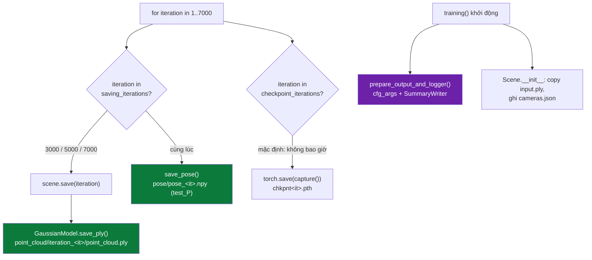
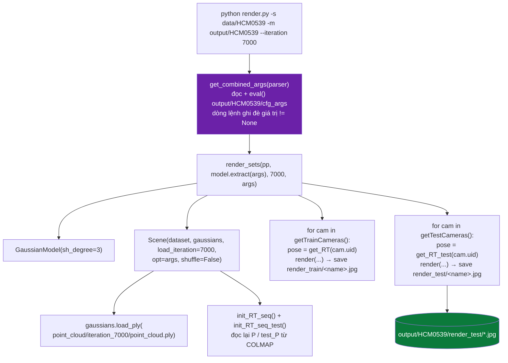
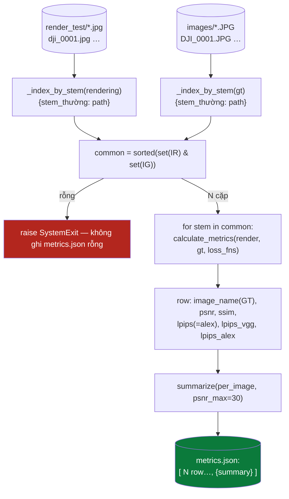
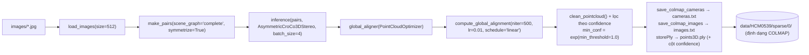
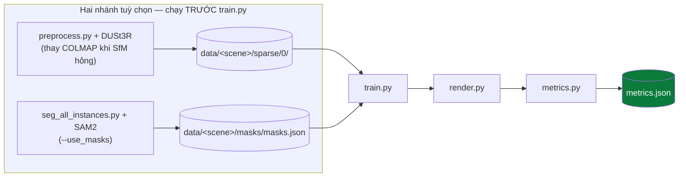

# DIGITAL TWIN GS — PIPELINE (Phần 3/3): Lưu, render, chấm điểm, đối chiếu output, phụ lục

### Từ `point_cloud.ply` đến `output/HCM0539/metrics.json`

> Phần 1 (PHẦN I–V): [DIGITAL-TWIN-GS-PIPELINE-1.md](DIGITAL-TWIN-GS-PIPELINE-1.md).
> Phần 2 (PHẦN VI–X): [DIGITAL-TWIN-GS-PIPELINE-2.md](DIGITAL-TWIN-GS-PIPELINE-2.md).
> Phần này nối tiếp phần 2 ở đúng chỗ vòng train ghi checkpoint cuối cùng ra đĩa.

**Câu lệnh đang mổ** (nhắc lại từ phần 1):

```bash
python train.py -s data/HCM0539 -m output/HCM0539 --scene HCM0539 --iter 7000 \
    --use_masks --schedule_densify_grad_threshold
python render.py  -s data/HCM0539 -m output/HCM0539 --iteration 7000
python metrics.py --rendering output/HCM0539/render_test --gt data/HCM0539/images \
                  --output output/HCM0539/metrics.json
```

**Quy ước ký hiệu**

| Ký hiệu | Nghĩa |
|---|---|
| **File:** `path/x.py` | Đường dẫn tính từ gốc repo `digital-twin-gs/` |
| **Hàm:** `foo()` | Tên hàm / phương thức trong file vừa nêu |
| ① ② ③ | Số thứ tự bước trong một chuỗi xử lý |
| ★ | Điểm mấu chốt, dễ hiểu sai |
| ⚠ | Cạm bẫy đã từng gây lỗi thật |
| ↺ | Vòng lặp khép kín (feedback loop) |
| 🔒 | Điểm phẫu thuật trạng thái optimizer (Adam moment) |

---

## MỤC LỤC

### PHẦN X — LƯU MÔ HÌNH
- [52. `scene.save` → `save_ply` — 59 float mỗi Gaussian, điền theo cột](#52-scenesave--save_ply--59-float-mỗi-gaussian-điền-theo-cột)
- [53. `save_pose` — ghi `test_P` ra `.npy`](#53-save_pose--ghi-test_p-ra-npy)
- [54. `prepare_output_and_logger` — `cfg_args` và TensorBoard](#54-prepare_output_and_logger--cfg_args-và-tensorboard)
- [55. `scripts/check_save_ram.py` — đo ngân sách RAM của bước lưu](#55-scriptscheck_save_rampy--đo-ngân-sách-ram-của-bước-lưu)
- [56. Cây thư mục `output/HCM0539/` sau khi train xong](#56-cây-thư-mục-outputhcm0539-sau-khi-train-xong)

### PHẦN XI — RENDER
- [57. `render.py::__main__` — `get_combined_args` đọc lại `cfg_args`](#57-renderpy__main__--get_combined_args-đọc-lại-cfg_args)
- [58. `render_sets` — hai thư mục `render_train` / `render_test`](#58-render_sets--hai-thư-mục-render_train--render_test)
- [59. `Scene.__init__` nhánh `load_iteration` — `load_ply` đọc ngược 59 cột](#59-scene__init__-nhánh-load_iteration--load_ply-đọc-ngược-59-cột)
- [60. `render_video.py` + `scripts/make_gif.py` — quỹ đạo nội suy](#60-render_videopy--scriptsmake_gifpy--quỹ-đạo-nội-suy)

### PHẦN XII — CHẤM ĐIỂM
- [61. `metrics.py::process_folders` — `_index_by_stem` ghép cặp](#61-metricspyprocess_folders--_index_by_stem-ghép-cặp)
- [62. `_load_lpips_net` — vgg + alex, thiếu thì `None` chứ không phải 0](#62-_load_lpips_net--vgg--alex-thiếu-thì-none-chứ-không-phải-0)
- [63. `calculate_metrics` — PSNR/SSIM (skimage) + LPIPS `[-1,1]`](#63-calculate_metrics--psnrssim-skimage--lpips-11)
- [64. `competition_score` — công thức 0.4 / 0.3 / 0.3](#64-competition_score--công-thức-04--03--03)
- [65. `summarize` — bốn quyết định được giữ nguyên](#65-summarize--bốn-quyết-định-được-giữ-nguyên)
- [66. `format_score` — một dòng log thang 100](#66-format_score--một-dòng-log-thang-100)
- [67. Cấu trúc `metrics.json`](#67-cấu-trúc-metricsjson)

### PHẦN XII (tiếp) — ĐỐI CHIẾU OUTPUT THẬT
- [68. Một bản ghi `per_image` — từng trường từ đâu tới](#68-một-bản-ghi-per_image--từng-trường-từ-đâu-tới)
- [69. `score` vs `score_of_means` vs `score_partial`](#69-score-vs-score_of_means-vs-score_partial)
- [70. Bảng `score_sensitivity` — đọc thế nào](#70-bảng-score_sensitivity--đọc-thế-nào)
- [71. `scripts/analyze_tail.py` — mổ đuôi dưới](#71-scriptsanalyze_tailpy--mổ-đuôi-dưới)

### PHẦN XIII — PHỤ LỤC
- [72. `preprocess.py` — nhánh khởi tạo hình học bằng DUSt3R (tuỳ chọn)](#72-preprocesspy--nhánh-khởi-tạo-hình-học-bằng-dust3r-tuỳ-chọn)
- [73. `seg_all_instances.py` — nhánh mặt nạ SAM2 (tuỳ chọn)](#73-seg_all_instancespy--nhánh-mặt-nạ-sam2-tuỳ-chọn)
- [74. Bảng hằng số toàn hệ thống](#74-bảng-hằng-số-toàn-hệ-thống)
- [75. Bảng tra nhanh bước ↔ file ↔ hàm](#75-bảng-tra-nhanh-bước--file--hàm)
- [76. Câu hỏi thường gặp](#76-câu-hỏi-thường-gặp)
- [77. Chẩn đoán sự cố](#77-chẩn-đoán-sự-cố)
- [78. Thuật ngữ](#78-thuật-ngữ)

---
---

# PHẦN X — LƯU MÔ HÌNH

Vòng lặp train (phần 2, §28) chạm đĩa ở ba chỗ bên trong khối `with torch.no_grad()`:
`iteration in saving_iterations` → `scene.save` + `save_pose`; `iteration in checkpoint_iterations`
→ `torch.save(gaussians.capture())`; và một lần duy nhất lúc dựng `Scene` → `cfg_args` +
`input.ply` + `cameras.json`. Với câu lệnh đang mổ, `saving_iterations = [3000, 5000, 7000]`
(`train.py:575`, rồi `args.save_iterations.append(args.iterations)` nối thêm `7000` — trùng,
vô hại), `checkpoint_iterations = []` (mặc định rỗng).



---

## 52. `scene.save` → `save_ply` — 59 float mỗi Gaussian, điền theo cột

**File:** `scene/__init__.py::Scene.save` (dòng 94) và `scene/gaussian_model.py::save_ply` (dòng 327).

```python
def save(self, iteration):
    point_cloud_path = os.path.join(self.model_path, "point_cloud/iteration_{}".format(iteration))
    self.gaussians.save_ply(os.path.join(point_cloud_path, "point_cloud.ply"))
```

Đường ra: `output/HCM0539/point_cloud/iteration_7000/point_cloud.ply`.

### 52.1 Thứ tự 59 thuộc tính

`construct_list_of_attributes()` (`gaussian_model.py:313`) dựng danh sách tên cột, và
`save_ply` ghép các mảng theo **đúng thứ tự đó**:

| Nhóm | Số cột | Tên cột | Nguồn |
|---|---|---|---|
| Vị trí | 3 | `x y z` | `_xyz` |
| Pháp tuyến (giả) | 3 | `nx ny nz` | `np.zeros_like(xyz)` — 3DGS không dùng, để đủ chuẩn PLY |
| SH bậc 0 | 3 | `f_dc_0..2` | `_features_dc` (transpose → flatten) |
| SH bậc 1–3 | 45 | `f_rest_0..44` | `_features_rest` — `3 × ((3+1)² − 1) = 45` |
| Độ đục | 1 | `opacity` | `_opacity` (giá trị **thô**, trước `sigmoid`) |
| Tỉ lệ | 3 | `scale_0..2` | `_scaling` (thô, trước `exp`) |
| Quaternion | 4 | `rot_0..3` | `_rotation` (thô, trước `normalize`) |
| **Tổng** | **59** | | tất cả `float32` (`'f4'`) |

★ Cột `opacity`/`scale`/`rot` lưu **giá trị chưa qua activation**. `load_ply` (§59) đọc thẳng
vào `nn.Parameter` rồi để các property `get_opacity`/`get_scaling`/`get_rotation` áp
`sigmoid`/`exp`/`normalize` khi cần — nạp lại phải đi qua đúng `GaussianModel` này, không
phải viewer PLY bất kỳ.

### 52.2 ★ Điền theo cột thay vì `list(map(tuple, ...))`

```python
# gaussian_model.py:340–351
elements = np.empty(xyz.shape[0], dtype=dtype_full)
attributes = np.concatenate((xyz, normals, f_dc, f_rest, opacities, scale, rotation), axis=1)
for i, (ten_thuoc_tinh, _) in enumerate(dtype_full):
    elements[ten_thuoc_tinh] = attributes[:, i]
del attributes
el = PlyElement.describe(elements, 'vertex')
PlyData([el]).write(path)
```

Cách gốc của 3DGS là `elements[:] = list(map(tuple, attributes))`. Với ~1,5 triệu Gaussian
(minh hoạ) × 59 số, dòng đó dựng **một list gồm 1,5 triệu tuple Python, mỗi tuple 59 `float`
Python** — cỡ ~3 GB object cấp phát cùng lúc, **sau khi train đã xong**. ⚠ Lần chạy 30/08:
train 7000 vòng, in điểm, in `"[ITER 7000] Saving Gaussians"`, rồi OOM-killer giết tiến
trình ngay tại bước lưu — thư mục `iteration_7000/` còn lại rỗng, mất trắng 45 phút. Điền
theo cột không cấp phát gì ngoài `attributes` (đã có sẵn) và `elements` (mảng cấu trúc
numpy, không phải object Python).

★ `storePly` (`scene/dataset_readers.py:157`, dòng `elements[:] = list(map(tuple, attributes))`
ở `:167`) **vẫn dùng** cách cũ — cố ý: nó chỉ ghi đám mây điểm **đầu vào** của COLMAP
(218.846 điểm với HCM0539), nhỏ hơn ba bậc so với đám Gaussian sau train, không đáng đổi.

---

## 53. `save_pose` — ghi `test_P` ra `.npy`

**File:** `train.py::save_pose` (dòng 217). Gọi tại `train.py:470`:

```python
save_pose(save_pose_path + f"/pose_{iteration}.npy", gaussians.test_P, test_cams_init)
```

- ★ Tham số thứ hai là `gaussians.test_P` — tư thế **tập test**, luôn `requires_grad_(False)`
  (`gaussian_model.py:171`). Kể cả khi bật `--optimize_pose`, chỉ `self.P` (tập train) thành
  `nn.Parameter`; `test_P` không bao giờ được tối ưu. Vậy `pose_<it>.npy` chỉ là bản chép
  tư thế COLMAP của ảnh test dưới dạng ma trận `4×4`, không mang thông tin gì mới sau khi
  train — nó tồn tại để `render.py` / phân tích ngoại tuyến có sẵn ma trận `w2c` mà không
  phải dựng lại từ `world_view_transform`.
- Mỗi tư thế đi qua `get_camera_from_tensor(quat_pose[ind])` (`utils/pose_utils.py:56`) để
  đổi tensor 7 số → ma trận `4×4`, rồi `torch.stack(...).detach().cpu().numpy()` → `np.save`.
- Xử lý trường hợp suy biến: nếu `set(index_colmap)` chỉ có một phần tử (mọi ảnh dùng chung
  một `colmap_id`) thì `index_colmap` được đặt lại thành `range(1, len(train_cams))`.
- Tham số `llffhold=2` trong chữ ký hàm **không được dùng** ở thân hàm.

### 53.1 Bộ khung tinh chỉnh tư thế CÓ, nhưng đang bị tắt

DroneSplat được dựng sẵn cho việc coi mỗi tư thế camera là **một tensor 7 số**
(4 quaternion + 3 tịnh tiến) và tối ưu nó cùng lúc với Gaussian — nhưng trong mã
đang chạy, cơ chế đó **không hoạt động**.

- `scene/gaussian_model.py:163` đặt `self.P = poses.requires_grad_(False)` và
  `:171` đặt `self.test_P = poses.cuda().requires_grad_(False)`. Cả hai đóng băng
  **ngay lúc tạo**.
- `training_setup` chỉ đăng ký **sáu** nhóm tham số vào Adam: `xyz`, `f_dc`,
  `f_rest`, `opacity`, `scaling`, `rotation`. `P` / `test_P` **không nằm trong bất
  kỳ `param_group` nào**.
- Grep toàn repo: `P` / `test_P` chỉ được **đọc** (`train.py`, `render.py:36,47`
  gọi `get_RT` / `get_RT_test`) và một chỗ **ghi** ra `.npy` (§53). Không chỗ nào
  ghi lại giá trị đã cập nhật.
- Hệ quả: `camera_pose` truyền vào `render()` luôn đúng bằng tư thế COLMAP đọc từ
  `world_view_transform`, không đổi suốt quá trình train. Mẹo "view matrix đơn vị
  + dịch cả đám Gaussian" (phần 2, §32) vẫn chạy, nhưng nó chỉ đang **tính lại
  đúng phép biến đổi mà rasterizer tự làm được nếu truyền thẳng
  `world_view_transform`** — tốn `O(P)` mỗi khung hình mà không đổi lại được gì.

★ Bật lên là một **thí nghiệm**, không phải một cờ: đổi `requires_grad_(False)`
thành `True` cho `self.P` (và **chỉ** `P` — tối ưu `test_P` là nhìn trộm đáp án),
thêm `P` vào một `param_group` riêng với learning rate riêng. Bản cài ở đây có
`--optimize_pose` mở đường đó nhưng vẫn **chỉ cho ảnh train** (`train.py:333`,
`setup_pose_optimization`, hoãn `step_pose` tới `--pose_from_iter`).

⚠ `docs2/10` bản cũ chấm ý tưởng này **+10…+25 điểm** và cảnh báo "DroneSplat tối
ưu cả tư thế ảnh test". **Cả hai đều sai với mã hiện tại**: không có tối ưu nào
xảy ra, cả trên train lẫn test. Con số ước tính đúng phải hạ và nới rộng
(**+5…+20**, tin cậy thấp) vì đây là "bật cái được dựng sẵn" chứ không phải "chép
lại kết quả đã qua bình duyệt". Cách kiểm chứng nó có thật sự chạy: `train.py`
in mỗi 500 bước `pose_rot_deg_mean` / `pose_trans_mean` — cả hai ~0 sau vài nghìn
bước nghĩa là gradient không chảy về hoặc lr quá nhỏ.

---

## 54. `prepare_output_and_logger` — `cfg_args` và TensorBoard

**File:** `train.py::prepare_output_and_logger` (dòng 291). Chạy ngay đầu `training()`.

① Nếu `args.model_path` rỗng → `./output/<uuid4()[:10]>` (hoặc `$OAR_JOB_ID` nếu có).
Với câu lệnh đang mổ, `-m output/HCM0539` đã đặt sẵn nên nhánh này không chạy.

② `os.makedirs(args.model_path, exist_ok=True)`.

③ Ghi **`cfg_args`** — một dòng text:

```python
with open(os.path.join(args.model_path, "cfg_args"), 'w') as cfg_log_f:
    cfg_log_f.write(str(Namespace(**vars(args))))
```

★ Đây là toàn bộ `args` sau khi đã trộn — kể cả `--use_masks`, `--eval`, `resolution`,
`source_path` tuyệt đối. `render.py` và `render_video.py` đọc lại tệp này (§57) và
`eval()` nó, nên mọi cờ bạn đặt lúc train sẽ **tự chảy sang** lúc render. Đây là lý do
`-m` lúc render phải trỏ đúng thư mục đã train.

④ `SummaryWriter(args.model_path)` (nếu import được `torch.utils.tensorboard`) → ghi
`events.out.tfevents.*` vào thư mục `-m`. Nhật ký này chứa `train_loss_patches/*`,
`test/score`, `total_points`, `pose/*` (nếu bật pose)… Hình 4 của báo cáo
(`scripts/make_report.py`, §71) đọc chính tệp này; mất nó thì script vẫn vẽ năm hình còn
lại.

---

## 55. `scripts/check_save_ram.py` — đo ngân sách RAM của bước lưu

**File:** `scripts/check_save_ram.py`.

Tồn tại vì sự cố ở §52.2: trước khi đặt cược 45 phút train vào một lần lưu, script trả lời
đúng một câu — *"với số Gaussian dự kiến, bước lưu có lọt qua RAM còn trống không?"*

- `gaussian_gia(n, sh_degree, device)` dựng một `GaussianModel` với 6 tensor **đúng hình
  dạng thật** (`_xyz` `(n,3)`, `_features_dc` `(n,1,3)`, `_features_rest` `(n,15,3)`,
  `_opacity` `(n,1)`, `_scaling` `(n,3)`, `_rotation` `(n,4)`) — giá trị ngẫu nhiên, vì chi
  phí bộ nhớ của `save_ply` không phụ thuộc giá trị.
- `do_mot_muc(n)` gọi **`g.save_ply` thật** (không phải bản chép), đo đỉnh RSS qua
  `resource.getrusage(...).ru_maxrss`, so với `MemAvailable` trong `/proc/meminfo` (đọc
  `MemAvailable` chứ không phải `MemFree` — `MemFree` bỏ qua page cache thu hồi được nên
  luôn bi quan hơn thực tế).
- Mặc định thử `n ∈ {1,0 · 1,5 · 2,0 · 3,0}` triệu; chỉ dùng thư viện chuẩn + `torch`.
- ⚠ Con số script in ra là **phần TĂNG THÊM** của riêng bước lưu; trong một lần train thật,
  nó cộng vào phần RAM mà tiến trình train đang giữ sẵn — nên "đủ" ở đây nghĩa là còn dư
  gấp đôi.

---

## 56. Cây thư mục `output/HCM0539/` sau khi train xong

```
output/HCM0539/
├── cfg_args                          # §54 — Namespace(**vars(args)) một dòng
├── input.ply                         # Scene.__init__: bản chép points3D.ply đầu vào
├── cameras.json                      # Scene.__init__: camera_to_JSON cho từng ảnh (test trước, train sau)
├── events.out.tfevents.<host>.<pid>  # §54 — nhật ký TensorBoard
├── point_cloud/
│   ├── iteration_3000/point_cloud.ply   # §52 — mốc bảo hiểm
│   ├── iteration_5000/point_cloud.ply   # §52 — mốc bảo hiểm
│   └── iteration_7000/point_cloud.ply   # §52 — mô hình cuối, dùng để render + chấm
├── pose/
│   ├── pose_3000.npy                 # §53 — test_P dạng (N,4,4)
│   ├── pose_5000.npy
│   └── pose_7000.npy
├── render_train/  <sinh ở bước render.py>   # §58
├── render_test/   <sinh ở bước render.py>   # §58 — đầu vào metrics.py
├── metrics.json   <sinh ở bước metrics.py>  # §67
├── report/        <sinh ở scripts/make_report.py>  # bảng + 6 hình + quay_quanh.gif
├── interps/       <sinh ở render_video.py, không bắt buộc>  # §60
└── chkpntNNNN.pth <chỉ khi truyền --checkpoint_iterations>  # capture(): 6 tensor + Adam state + P
```

`--start_checkpoint <đường dẫn .pth>` sẽ `torch.load` rồi `gaussians.restore(model_params, opt)`
(`gaussian_model.py:93`) để train tiếp; `restore` nạp lại 6 tensor + `xyz_gradient_accum` +
`denom` + `optimizer.load_state_dict` + `self.P`.

---
---

# PHẦN XI — RENDER



---

## 57. `render.py::__main__` — `get_combined_args` đọc lại `cfg_args`

**File:** `render.py` (dòng 55–72) và `arguments/__init__.py::get_combined_args` (dòng 92).

```python
parser = ArgumentParser(description="Testing script parameters")
pp = PipelineParams(parser)
model = ModelParams(parser, sentinel=True)   # sentinel=True → mọi default = None
parser.add_argument("--get_video", action="store_true")
parser.add_argument("--iteration", default=-1, type=int)
args = get_combined_args(parser)
```

`get_combined_args`:

```python
args_cmdline = parser.parse_args(cmdlne_string)
cfgfilepath = os.path.join(args_cmdline.model_path, "cfg_args")
with open(cfgfilepath) as cfg_file:
    cfgfile_string = cfg_file.read()
args_cfgfile = eval(cfgfile_string)                 # ← eval() Namespace(...) từ §54
merged_dict = vars(args_cfgfile).copy()
for k, v in vars(args_cmdline).items():
    if v != None:                                  # dòng lệnh chỉ ghi đè khi != None
        merged_dict[k] = v
return Namespace(**merged_dict)
```

★ `ModelParams(parser, sentinel=True)` khiến mọi tham số của nhóm `Model` có default `None`
trên dòng lệnh, nên **giá trị thật đến từ `cfg_args`** trừ khi bạn gõ tường minh. Hệ quả cụ
thể: nếu train với `-r 2` (giảm nửa độ phân giải) thì `cfg_args` giữ `resolution=2`, và
`render.py` tự render ở cùng độ phân giải — không cần (và không nên) lặp lại cờ. Ngược lại,
`-m` **phải** trỏ đúng thư mục đã train, nếu không `cfg_args` là của mô hình khác.

`--iteration` mặc định `-1` → `Scene` sẽ gọi `searchForMaxIteration` (§59).

⚠ README ghi `--iter 7000`; ở `render.py` cờ tên là **`--iteration`**. `--iter` vẫn chạy vì
argparse khớp theo tiền tố, nhưng notebook (`bước 8`) ghi đầy đủ `--iteration` cho rõ.

---

## 58. `render_sets` — hai thư mục `render_train` / `render_test`

**File:** `render.py::render_sets` (dòng 18–52). Toàn bộ trong `with torch.no_grad()`.

```python
gaussians = GaussianModel(dataset.sh_degree)
scene = Scene(dataset, gaussians, load_iteration=iteration, opt=args, shuffle=False)
bg = torch.tensor([0,0,0] or [1,1,1], ...)          # đen, trừ khi white_background

# --- tập train ---
for viewpoint_cam in scene.getTrainCameras().copy():
    pose = gaussians.get_RT(viewpoint_cam.uid)      # P[uid] — tư thế train
    image = render(viewpoint_cam, gaussians, pipe, bg, camera_pose=pose)["render"]
    torchvision.utils.save_image(image, ".../render_train/" + viewpoint_cam.image_name + ".jpg")

# --- tập test ---
for viewpoint_cam in scene.getTestCameras().copy():
    pose = gaussians.get_RT_test(viewpoint_cam.uid) # test_P[uid] — tư thế test
    image = render(viewpoint_cam, gaussians, pipe, bg, camera_pose=pose)["render"]
    torchvision.utils.save_image(image, ".../render_test/" + viewpoint_cam.image_name + ".jpg")
```

- `shuffle=False`: thứ tự camera giữ nguyên theo tên ảnh (đã sắp trong
  `readColmapSceneInfo`), nên `render_test/` xếp cùng thứ tự với `test_list.txt`.
- Đường render (`gaussian_renderer.render`) **giống hệt** vòng train (phần 2, §31–33): view
  matrix = ma trận đơn vị, dịch cả đám Gaussian sang hệ camera bằng `camera_pose`. Khác duy
  nhất: `torch.no_grad()` và `pipe.debug` không bật.
- ★ Chỉ `render_test/` tham gia chấm điểm — nó là phần "góc nhìn mới" của cuộc thi.
  `render_train/` chỉ để soi mắt (mô hình khớp ảnh đã thấy tới đâu).
- ⚠ **Tên tệp đầu ra bị ép về `<image_name>.jpg` chữ thường** (`image_name` là
  `os.path.basename(image_path).split(".")[0]`, `dataset_readers.py:134`). Ảnh drone gốc
  thường là `DJI_0001.JPG` chữ hoa. `torchvision.utils.save_image` không quan tâm phần mở
  rộng — nó luôn ghi PNG-trong-vỏ-`.jpg` hoặc JPG tuỳ đuôi; điều quan trọng là **tên** giờ
  lệch hoa/thường và đuôi so với `images/`. Đây là lý do `metrics.py` phải ghép cặp theo
  *stem chữ thường* (§61).

---

## 59. `Scene.__init__` nhánh `load_iteration` — `load_ply` đọc ngược 59 cột

**File:** `scene/__init__.py` (dòng 33–38, 81–87) và `scene/gaussian_model.py::load_ply` (dòng 358).

```python
if load_iteration:
    if load_iteration == -1:
        self.loaded_iter = searchForMaxIteration(os.path.join(self.model_path, "point_cloud"))
    else:
        self.loaded_iter = load_iteration
...
if self.loaded_iter:
    self.gaussians.load_ply(os.path.join(self.model_path, "point_cloud",
                            "iteration_" + str(self.loaded_iter), "point_cloud.ply"))
    self.gaussians.init_RT_seq(self.train_cameras, optimize=optimize_pose)
    self.gaussians.init_RT_seq_test(self.test_cameras)
```

- `searchForMaxIteration` (`utils/system_utils.py`) quét các thư mục `iteration_*` và lấy số
  lớn nhất — dùng khi `--iteration -1`.
- `load_ply`:
  - đọc `x/y/z`, `opacity`, `f_dc_0..2`;
  - gom `f_rest_*` bằng cách lọc theo tiền tố rồi **sắp theo số cuối** (`sorted(..., key=lambda x: int(x.split('_')[-1]))`) — không tin vào thứ tự trong file;
  - ★ `assert len(extra_f_names) == 3*(self.max_sh_degree + 1)**2 - 3` → **45** với `sh_degree=3`. Nạp một PLY train ở `sh_degree` khác sẽ nổ ngay tại đây, không âm thầm.
  - reshape `f_rest` về `(P, 3, 15)` rồi `transpose(1,2)` → `(P, 15, 3)`;
  - bọc cả 6 tensor thành `nn.Parameter(...requires_grad_(True))`;
  - `self.active_sh_degree = self.max_sh_degree` — nạp lại là dùng ngay SH bậc đầy đủ, không có giai đoạn `oneupSHdegree`.
- Sau `load_ply`, `init_RT_seq` / `init_RT_seq_test` đọc **lại tư thế từ COLMAP** (không phải
  từ `pose/*.npy`), nên `render.py` luôn render bằng tư thế gốc — trừ khi bạn tự sửa để nạp
  `self.P` đã tinh chỉnh.

---

## 60. `render_video.py` + `scripts/make_gif.py` — quỹ đạo nội suy

**File:** `render_video.py`, `scripts/make_gif.py`. Không tham gia chấm điểm.

### 60.1 `render_video.py`

```bash
python render_video.py -s data/HCM0539 -m output/HCM0539 --iteration 7000 --n_views 180 --fps 24
```

- `get_combined_args` (như §57); `--n_views` mặc định 600, `--fps` mặc định 30.
- `render_sets` (bản riêng của tệp này) dựng `Scene(..., load_iteration=7000, shuffle=False)`
  rồi gọi `interpolate_camera_list(scene.getTestCameras(), args.n_views)`.
- `interpolate_camera_list` → `kochanek_bartels_interpolation`: nội suy **vị trí** bằng
  `splines.KochanekBartels` và **hướng** bằng `splines.quaternion.KochanekBartels`
  (`endconditions="natural"`, `tcb=(0,0,0)`), lấy `n_frames` mẫu đều trên khoảng
  `[0, len(keyframes)-1]`. (★ đây là spline Kochanek–Bartels từ thư viện `splines`, **khác**
  với `generate_interpolated_path` B-spline trong `utils/pose_utils.py` — hàm đó chỉ dùng
  cho `render.py`/đường bay ellipse, không dùng ở đây.)
- Mỗi khung dựng một `Camera` mới với `gt_alpha_mask = original_image * 0` (không có ảnh
  thật để so), rồi `render_set` ghi `output/HCM0539/interps/ours_7000/renders/00000.png`,
  `00001.png`, …
- `images_to_video` (`imageio.mimwrite`) gộp thành `output/HCM0539/interps.mp4`.
- `camera_pose = get_tensor_from_camera(view.world_view_transform.transpose(0,1))` — tức
  vẫn đi qua đường "view matrix đơn vị" của `render()`.
- ⚠ `render_set` ghi khung vào `interps/ours_<scene.loaded_iter>/renders`
  (`render_video.py:144`), nhưng `images_to_video` lại đọc từ
  `interps/ours_<args.iteration>/renders` (`render_video.py:151`). Trùng khi truyền
  `--iteration 7000` tường minh; **lệch** khi để `--iteration -1` (khung nằm ở
  `ours_7000/` còn video đi tìm `ours_-1/`). Luôn truyền `--iteration` tường minh
  cho `render_video.py`.

### 60.2 `scripts/make_gif.py`

```bash
python scripts/make_gif.py --frames output/HCM0539/interps/ours_7000/renders \
    --out output/HCM0539/report/quay_quanh.gif --width 420 --max-frames 90 --fps 12
```

- Tách khỏi bước render **có chủ đích**: đổi độ rộng / tốc độ / số khung của GIF thì không
  phải render lại (tốn GPU + phút).
- `liet_ke_khung` sắp theo **tên** (`00000.png`… nên tên = thời gian; không sắp theo mtime —
  Drive không đáng tin).
- `chon_thua` lấy thưa đều xuống `--max-frames` (không cắt cụt đuôi → vòng quay vẫn khép kín).
- Mặc định **pingpong**: nối thêm chiều ngược lại (`anhs + anhs[-2:0:-1]`) vì quỹ đạo nội
  suy không khép kín, để GIF lặp không "giật". Tắt bằng `--no-pingpong`.
- GIF chỉ 256 màu, không nén liên khung → phình theo bình phương độ rộng. Mặc định
  420 px / 90 khung / 12 fps nhắm vài MB; cảnh báo nếu tệp > 25 MB.

---
---

# PHẦN XII — CHẤM ĐIỂM



---

## 61. `metrics.py::process_folders` — `_index_by_stem` ghép cặp

**File:** `metrics.py::process_folders` (dòng 107) và `_index_by_stem` (dòng 80).

```python
def _index_by_stem(folder):
    index = {}
    for name in sorted(os.listdir(folder)):
        ...
        stem = os.path.splitext(name)[0].lower()     # ★ bỏ đuôi, viết thường
        if stem in index:  # trùng stem sau khi bỏ đuôi → bỏ qua bản sau, cảnh báo
            continue
        index[stem] = os.path.join(folder, name)
    return index
```

```python
idx_r = _index_by_stem(rendering)   # output/HCM0539/render_test
idx_g = _index_by_stem(gt)          # data/HCM0539/images
common_files = sorted(set(idx_r) & set(idx_g))
if not common_files:
    raise SystemExit("[metrics] khong ghep duoc cap nao ...")
```

★ Ghép cặp bằng **stem chữ thường** chứ không phải tên khớp chính xác, vì (§58) `render.py`
ghi `dji_0001.jpg` còn ảnh gốc là `DJI_0001.JPG`. Nếu ghép theo tên đầy đủ thì
`set(idx_r) & set(idx_g)` **rỗng** và — nếu không có `raise SystemExit` — hàm chạy xong êm
ru với 0 cặp, ghi ra một `metrics.json` có đủ cấu trúc nhưng `per_image` rỗng; mọi thứ đọc
nó về sau (`analyze_tail`, `make_report`) trắng tay mà không ai biết vì sao. Bản này **dừng
to tiếng** thay vì ghi tệp giả-thành-công.

`IMG_EXT = (".jpg",".jpeg",".png",".bmp",".tif",".tiff")`. In ra số cặp:
`f"[metrics] {len(idx_r)} anh dung / {len(idx_g)} anh goc -> {len(common_files)} cap"`.

---

## 62. `_load_lpips_net` — vgg + alex, thiếu thì `None` chứ không phải 0

**File:** `metrics.py::_load_lpips_net` (dòng 30); `LPIPS_NETS = ("vgg", "alex")` (`utils/score_utils.py:45`).

```python
def _load_lpips_net(net):
    try:
        import lpips as lpips_lib
        return lpips_lib.LPIPS(net=net).eval()        # ① gói pip chính thức
    except Exception:
        pass
    try:
        from lpipsPyTorch.modules.lpips import LPIPS
        return LPIPS(net_type=net).eval()             # ② bản đóng gói trong repo
    except Exception:
        return None                                   # ③ chịu — trả None
```

- ① Ưu tiên gói `lpips` của pip: số ra **so được** với các bảng kết quả cũ của DroneSplat/3DGS.
- ② Đường lui: `lpipsPyTorch/` đi kèm repo (`metrics.py` cũng dùng nó cho phần loss ở phần 2).
- ③ Không nạp được **cả hai** → mạng đó bị bỏ, LPIPS của nó **không xuất hiện** trong `row`.
  ★ **Không** gán `0`: LPIPS = 0 nghĩa là ảnh hoàn hảo, gán 0 là cộng khống trọn 0.4 điểm
  (xem §64–65).
- `loss_fns = {net: _load_lpips_net(net) for net in LPIPS_NETS}` — nạp **một lần**, dùng lại
  cho mọi ảnh; dựng lại VGG cho từng ảnh biến một lần đo vài giây thành vài phút.

---

## 63. `calculate_metrics` — PSNR/SSIM (skimage) + LPIPS `[-1,1]`

**File:** `metrics.py::calculate_metrics` (dòng 50).

```python
img1 = np.array(Image.open(img1_path).convert("RGB"))   # render
img2 = np.array(Image.open(img2_path).convert("RGB"))   # gốc
psnr_value = psnr(img1, img2)                            # skimage.metrics.peak_signal_noise_ratio
ssim_value = ssim(img1, img2, channel_axis=-1)          # skimage.metrics.structural_similarity
img1_tensor = torch.tensor(img1).permute(2,0,1).unsqueeze(0).float() / 255.0
img2_tensor = ...
for net, fn in loss_fns.items():
    if fn is None: continue
    lpips_values[net] = float(fn(img1_tensor*2 - 1, img2_tensor*2 - 1).item())  # ★ [-1,1]
```

- PSNR/SSIM tính trên **mảng `uint8` RGB** bằng `skimage` — cùng đường đo mà `do_mot_cap`
  trong vòng train (phần 2, §51) dùng, để điểm trên thanh tiến độ và điểm cuối cùng nói về
  cùng một thang.
- LPIPS: đầu vào phải ở `[-1, 1]` nên nhân 2 trừ 1 trước khi gọi.

`row` một ảnh (`metrics.py:142`):

```python
row = {
    "image_name": os.path.basename(img2_path),   # ★ tên ảnh GỐC, không phải tên tệp render
    "psnr": float(psnr_value),
    "ssim": float(ssim_value),
    "lpips": lpips_values.get("alex"),           # khoá cũ của DroneSplat = LPIPS(alex)
}
for net, val in lpips_values.items():
    row[f"lpips_{net}"] = val                     # lpips_vgg, lpips_alex
```

★ `image_name` là basename của **ảnh gốc** (ví dụ `DJI_0001.JPG`) — chính là tên dùng ở
`train_list.txt` / `test_list.txt` và ở mọi bảng khác, nên báo cáo tra chéo được.

`average_metrics.lpips` trong tệp (`metrics.py:158` cộng dồn, `:163` chia, `:170` ghi) =
`total_lpips / count` với `total_lpips += lpips_values.get("alex", 0.0)` → là **trung bình
LPIPS(alex)**. (Trong khi
khoá `lpips` ở phần tóm tắt do `score_utils` sinh ra lại là alias của **vgg** — xem §67, ⚠.)

---

## 64. `competition_score` — công thức 0.4 / 0.3 / 0.3

**File:** `utils/score_utils.py::competition_score` (dòng 72).

```
Score      = 0.4 · (1 − LPIPS) + 0.3 · SSIM + 0.3 · PSNR_norm
PSNR_norm  = clamp(PSNR / PSNR_max, 0, 1)
```

```python
psnr_norm = min(max(psnr / psnr_max, 0.0), 1.0)
partial   = 0.3 * ssim + 0.3 * psnr_norm
return {
    "psnr_max": psnr_max,
    "psnr_norm": psnr_norm,
    "score_partial": partial,                                  # trần 0.6 (khi thiếu LPIPS)
    "score": None if lpips is None else 0.4 * (1.0 - lpips) + partial,
}
```

- `PSNR_max` mặc định **30.0** (`--psnr_max`, `score_utils.py:73`) — BTC **chưa công bố**;
  đây là phỏng đoán. Xem §70.
- ★ `clamp` làm hàm chấm **phi tuyến theo PSNR**: một ảnh 40 dB (đã vượt 30) không "kéo hộ"
  được một ảnh 12 dB — phần vượt `PSNR_max` bị cắt, không thêm điểm nào.
- Thiếu LPIPS → `score = None`, chỉ còn `score_partial` (tối đa `0.3·1 + 0.3·1 = 0.6`).
- Nhân 100 khi in ra cho dễ đọc (§66); tệp JSON giữ thang `[0, 1]`.

### 64.1 Một mốc điểm cụ thể "nghĩa là gì" — bảng đối chiếu

Đặt bốn kịch bản cạnh nhau, `PSNR_max = 30` (số **minh hoạ**, không phải một lần
chạy cụ thể trừ hai dòng đầu):

| Kịch bản | PSNR | SSIM | LPIPS | Điểm/100 |
|---|---|---|---|---|
| Test HCM0539, lần 3 (bản cài đặt riêng) | 9,57 | 0,3481 | 0,6515 | **33,96** |
| Điểm *train* của chính lần 3 | 18,71 | 0,6563 | 0,3780 | **63,28** |
| 3DGS chính chủ, cảnh ngoài trời | 22,0 | 0,81 | 0,21 | ~77,9 |
| 3DGS + exposure + depth, tinh chỉnh tốt | 24,0 | 0,85 | 0,17 | ~82,7 |

★ Đọc cho đúng: mốc ~78 ≈ **ngang bản 3DGS gốc chạy đúng như sách trên cảnh
ngoài trời** — không phải cột mốc nghiên cứu. Hệ quả ngược: **không có cách nào
chạm ~78 khi còn thua bản gốc**.

Giải ngược, nếu PSNR đã bão hoà trọn `0,30` (PSNR ≥ `PSNR_max`), phần còn lại
phải đến từ SSIM + LPIPS:

| SSIM | LPIPS ≤ để đạt 78 | LPIPS ≤ để đạt 91,5 |
|---|---|---|
| 0,85 | 0,438 | 0,100 |
| 0,90 | 0,475 | 0,137 |
| 0,95 | 0,513 | 0,175 |

Nếu PSNR mới `22` dB (`PSNR_max = 30` → đóng góp `0,22`), ngưỡng gắt hơn hẳn:
SSIM `0,90` thì LPIPS phải `≤ 0,275` để đạt 78; muốn 91,5 với PSNR `25` dB /
SSIM `0,90` thì LPIPS phải `≤ 0,012` — thực tế bất khả thi. Kết cấu mảnh (thép,
cáp antenna BTS) là ca khó nhất: mỏng hơn một Gaussian nên luôn bị làm mờ, và đó
đúng là thứ LPIPS phạt nặng nhất.

---

## 65. `summarize` — bốn quyết định được giữ nguyên

**File:** `utils/score_utils.py::summarize` (dòng 124). Nhận `per_image` (list `row`),
trả về dict báo cáo đầy đủ. Bốn quyết định cố ý **không "cải tiến"** so với bản tham chiếu
`src/gs3d/eval/metrics.py`, để hai nhánh cho ra **cùng một số** trên cùng bộ độ đo:

| # | Quyết định | Vì sao | Khoá liên quan |
|---|---|---|---|
| 1 | `score` = **trung bình của điểm từng ảnh**, không phải điểm của các trung bình | `clamp` khiến hàm phi tuyến; gộp trước rồi chấm sẽ thổi phồng điểm của tập phương sai lớn — đúng kiểu ảnh drone (vài góc xa tâm luôn tệ hơn hẳn) | `score` vs `score_of_means` |
| 2 | Thiếu LPIPS ⇒ `score = None`, chỉ có `score_partial` | Coi LPIPS = 0 là cộng khống 0.4 điểm | `score`, `score_partial`, `thang 0.6` |
| 3 | Tính LPIPS bằng **cả `vgg` lẫn `alex`** | Trên cùng cặp ảnh, LPIPS(alex) thường thấp hơn LPIPS(vgg) đáng kể, mà số hạng LPIPS nặng nhất (0.4); BTC chưa nói dùng mạng nào | `score` (vgg), `score_alex` |
| 4 | `score_sensitivity` theo `PSNR_max ∈ {25, 30, 35, 40}` cũng tính **trung-bình-của-điểm** | Nếu không, hai cột số trong cùng một tệp lại tính bằng hai quy tắc khác nhau | `score_sensitivity` |

`summarize` còn **ghi ngược** `score_vgg` / `score_alex` / `score_partial` vào **từng phần
tử `per_image`**, để tệp JSON cho biết luôn ảnh nào kéo điểm xuống, không chỉ có một con số
tổng. `score` chỉ khác `None` khi **mọi** ảnh đều có LPIPS (`len(scores) == n`); trung bình
trên tập con có LPIPS rồi gọi là điểm của cả tập là so táo với cam giữa các lần chạy có số
ảnh thiếu LPIPS khác nhau.

---

## 66. `format_score` — một dòng log thang 100

**File:** `utils/score_utils.py::format_score` (dòng 184). Dùng ở `metrics.py`
(in ra cuối), ở `training_report` (phần 2, §50) và ở progress bar.

```
ĐIỂM  57.34/100 ±3.1 ▲+1.20 | PSNR 22.15 dB (norm 0.738) | SSIM 0.8123 | LPIPS 0.2044
```

- `ĐIỂM xx.xx/100` khi có `score`; `ĐIỂM xx.xx/60 (thiếu LPIPS)` khi chỉ có `score_partial`.
- `±std` = `score_std * 100` (độ lệch chuẩn mẫu của điểm từng ảnh) — thanh sai số, không chỉ
  trung bình.
- `▲/▼/=` so với `previous` (điểm lần đo trước, thang 100) — để nhìn một dòng biết đang lên
  hay xuống.
- `norm` = `psnr_norm` trung bình. `LPIPS` in ra là `m['lpips']` = alias **vgg** (`n/a` nếu
  thiếu).

---

## 67. Cấu trúc `metrics.json`

**File:** `metrics.py::process_folders` (dòng 124–188).

`metrics.json` là một **danh sách JSON**: `N` phần tử đầu là `row` từng ảnh, phần tử **cuối
cùng** là dict tóm tắt (giữ đúng cấu trúc di sản của DroneSplat: "danh sách ảnh + phần tử
cuối chứa `average_metrics`").

```jsonc
// MINH HOẠ cấu trúc — KHÔNG phải số thật
[
  {
    "image_name": "DJI_0007.JPG",
    "psnr": 0.0, "ssim": 0.0,
    "lpips": 0.0,          // = LPIPS(alex), khoá cũ tương thích ngược
    "lpips_vgg": 0.0,
    "lpips_alex": 0.0,
    "score_vgg": 0.0,      // ghi ngược bởi summarize()
    "score_alex": 0.0,
    "score_partial": 0.0
  },
  // … N-1 phần tử ảnh nữa …
  {
    "average_metrics": { "psnr": 0.0, "ssim": 0.0, "lpips": 0.0 },  // lpips ở đây = alex
    "score":            0.0,   // trung bình score_vgg từng ảnh (None nếu thiếu LPIPS ảnh nào)
    "score_alex":       0.0,
    "score_partial":    0.0,   // trần 0.6
    "score_std":        0.0,
    "score_of_means":   0.0,   // điểm-của-trung-bình, giữ để đối chiếu
    "score_sensitivity": { "25.0": 0.0, "30.0": 0.0, "35.0": 0.0, "40.0": 0.0 },
    "psnr_norm":        0.0,
    "psnr_std":         0.0,
    "ssim_std":         0.0,
    "lpips_vgg":        0.0,
    "lpips_alex":       0.0,
    "num_images":       0,
    "psnr_max":         30.0,
    "per_image":        [ /* bản sao đầy đủ N row, đã có score_* */ ]
  }
]
```

⚠ Có **hai** khoá tên na ná trong tệp: `average_metrics.lpips` = trung bình **alex** (do
`metrics.py` cộng dồn); còn `score_utils` dùng nội bộ alias `lpips = lpips_vgg`. Khi so hai
lần chạy, luôn nói rõ đang đọc `lpips_vgg` hay `lpips_alex`.

`json.dump(results, f, indent=4)` — tệp có xuống dòng, đọc bằng mắt được.

---
---

# PHẦN XII (tiếp) — ĐỐI CHIẾU OUTPUT THẬT

## 68. Một bản ghi `per_image` — từng trường từ đâu tới

Lấy một dòng minh hoạ (số **không thật**) và truy nguồn từng trường:

```jsonc
{
  "image_name":  "DJI_0007.JPG",   // ← basename ảnh GỐC (metrics.py:145) = tên ở test_list.txt
  "psnr":        21.4,             // ← skimage.peak_signal_noise_ratio(uint8 RGB)  (§63)
  "ssim":        0.79,             // ← skimage.structural_similarity(channel_axis=-1) (§63)
  "lpips":       0.221,            // ← lpips_values["alex"]  (khoá cũ, §63)
  "lpips_vgg":   0.284,            // ← fn_vgg(img*2-1, gt*2-1)  (§62–63)
  "lpips_alex":  0.221,
  "score_vgg":   0.532,            // ← 0.4*(1-0.284) + 0.3*0.79 + 0.3*clamp(21.4/30,0,1)  (§64, summarize ghi ngược)
  "score_alex":  0.557,            // ← 0.4*(1-0.221) + phần partial như trên
  "score_partial": 0.451          // ← 0.3*0.79 + 0.3*0.713  (không có số hạng LPIPS)
}
```

- `psnr_norm` của ảnh này = `clamp(21.4/30, 0, 1) = 0.713`.
- `score` toàn cục ở phần tử cuối = trung bình `score_vgg` của **tất cả** `per_image`.
- Nếu `lpips_vgg` của **một** ảnh nào đó là `null` (mạng vgg không nạp được) thì `score`
  toàn cục = `null`, và chỉ `score_partial` có nghĩa.

Bảng đối chiếu "trường ↔ hàm sinh ra nó":

| Trường trong `row` | Sinh ở | Ghi chú |
|---|---|---|
| `image_name` | `metrics.py:145` | basename ảnh gốc |
| `psnr`, `ssim` | `calculate_metrics` (`metrics.py:60–61`) | skimage, uint8 |
| `lpips` | `metrics.py:149` | = `lpips_alex` |
| `lpips_vgg`, `lpips_alex` | `metrics.py:151–152` | vòng qua `loss_fns` |
| `score_vgg`, `score_alex`, `score_partial` | `score_utils.summarize:164–165` | ghi ngược vào `row` |

---

## 69. `score` vs `score_of_means` vs `score_partial`

Ba con số cùng nằm ở phần tử cuối, dễ nhầm.

| Khoá | Định nghĩa | Khi nào chênh nhau |
|---|---|---|
| `score` | `mean_i competition_score(psnr_i, ssim_i, lpips_vgg_i)` | luôn là con số "chính thức" |
| `score_of_means` | `competition_score(mean psnr, mean ssim, mean lpips)` | chênh khi **phương sai PSNR lớn** và có ảnh vượt `PSNR_max` — chính là bộ ảnh drone |
| `score_partial` | `mean_i (0.3·ssim_i + 0.3·psnr_norm_i)` | luôn ≤ `score`; là trần 0.6 khi thiếu LPIPS |

**Vì sao `score_of_means` ≥ `score` trên tập drone (giải thích ký hiệu, không phải số thật):**
giả sử nửa tập render rất tốt (PSNR ≫ 30, bị `clamp` về `psnr_norm = 1`) và nửa tập tệ
(PSNR ≈ 12, `psnr_norm ≈ 0.4`).

- `score` chấm từng ảnh: nửa tốt đóng góp `psnr_norm = 1`, nửa tệ `0.4` → trung bình `0.7`.
- `score_of_means` lấy trung bình PSNR **trước**: `(rất lớn + 12)/2` vẫn ≫ 30 → `clamp` về
  `1` → `psnr_norm = 1` cho **cả** tập.

Phần "rất lớn" của nửa tốt, lẽ ra bị `clamp` cắt bỏ khi chấm riêng, lại được đem đi bù cho
nửa tệ khi gộp trước. `score` không cho phép chuyện đó — và đó là lý do nó là con số dùng để
so, còn `score_of_means` chỉ để đối chiếu.

---

## 70. Bảng `score_sensitivity` — đọc thế nào

`score_sensitivity = { "25.0": …, "30.0": …, "35.0": …, "40.0": … }` — điểm của **cả tập**
(trung-bình-của-điểm) ứng với từng phỏng đoán `PSNR_max`.

- `PSNR_max` càng lớn → `PSNR_norm = clamp(PSNR/PSNR_max, …)` càng nhỏ → điểm càng giảm. Nên
  các cột **đơn điệu giảm** từ trái sang phải; đó là hành vi bình thường, không phải tín
  hiệu gì.
- ★ Cách dùng thật: khi **so hai mô hình** A và B, tính `score_sensitivity` cho cả hai. Nếu
  kết luận "A hơn B" **giữ nguyên** ở mọi cột → kết luận vững, không phụ thuộc hằng số BTC
  chưa công bố. Nếu nó **đảo chiều** giữa các cột (A hơn ở `25`, B hơn ở `40`) → kết luận đó
  **không dùng được**; phải chờ BTC công bố `PSNR_max` hoặc báo cáo cả dải.
- `scripts/analyze_tail.py` in lại bảng này ở mục `(c)` kèm đúng cảnh báo trên.

### 70.1 `PSNR_max` — đòn bẩy không tốn công train

`PSNR_max` do BTC chọn và **chưa công bố**. Cùng một mô hình
(`22,0 / 0,81 / 0,21`), điểm đổi theo hằng số này (số **minh hoạ**):

| `PSNR_max` | Điểm/100 | Ghi chú |
|---|---|---|
| 25 | ~82,3 | |
| 30 | ~77,9 | mặc định phỏng đoán của repo |
| 35 | ~74,9 | |
| 40 | ~72,4 | |

Chênh ~10 điểm chỉ vì một hằng số không nằm trong tay mình. `score_sensitivity`
trong `metrics.json` chính là bảng này tính cho **tập ảnh thật của bạn**. Quy tắc
dùng:

- Báo cáo kết quả **kèm cả dải** `{25, 30, 35, 40}`, không phải một con số.
- Khi kết luận "A hơn B": nếu thứ tự **giữ nguyên** ở mọi cột → kết luận vững.
  Nếu **đảo chiều** giữa các cột → chờ BTC công bố `PSNR_max`.
- ⚠ `PSNR_max` càng lớn → điểm càng giảm, nên các cột **đơn điệu giảm** từ trái
  sang phải; đó là hành vi bình thường, không phải tín hiệu gì.

---

## 71. `scripts/analyze_tail.py` — mổ đuôi dưới

**File:** `scripts/analyze_tail.py`. **Không** tính lại độ đo (không nạp ảnh, không nạp LPIPS)
— chỉ đọc `metrics.json` do `metrics.py` ghi và trả lời ba câu.

### 71.1 Đọc tệp

`load_summary` (dòng 99): `metrics.json` là **list**, nên duyệt **ngược** tìm phần tử đầu
tiên có khoá `per_image`. Cũng nhận dict phẳng (tệp dựng tay). Báo lỗi rõ nếu tệp là bản
`metrics.py` cũ (chưa có phần chấm điểm / `per_image`).

### 71.2 `build_rows` — tính lại điểm tại chỗ

```python
sc = competition_score(psnr, ssim, lpips, psnr_max)   # ★ dùng CHUNG hàm với metrics.py & make_report
rows.append({
    "image_name": ..., "psnr": ..., "ssim": ..., "lpips": lpips,
    "psnr_norm": sc["psnr_norm"],
    "score": sc["score"] if sc["score"] is not None else sc["score_partial"],
    "t_lpips": None if lpips is None else 0.4*(1 - lpips),   # đóng góp từng số hạng
    "t_ssim": 0.3*ssim,
    "t_psnr": 0.3*sc["psnr_norm"],
})
```

★ Điểm được **tính lại** bằng `competition_score` chứ không đọc khoá `score_vgg` có sẵn —
để cờ `--psnr_max` thật sự có tác dụng và để mọi con số trong một lần chạy script đều đến
từ cùng một `psnr_max`. `--psnr_max` mặc định lấy từ `psnr_max` trong chính tệp
(mặc định cuối cùng 30.0). `--net` chọn `vgg` (mặc định, khớp khoá `score` của `metrics.py`)
hoặc `alex`.

### 71.3 Ba câu trả lời

| Bảng | Câu hỏi | Cơ chế |
|---|---|---|
| **[1]** `--worst N` (mặc định 8) | Ảnh nào tệ nhất? | `sorted(rows, key=score)[:N]` |
| **[2]** Mất điểm ở số hạng nào? | `dominant_term` = số hạng hụt nhiều nhất so với **trung vị** của tập. `lpips` → "khác biệt tri giác (mờ/artefact/floater)"; `ssim` → "lệch cấu trúc – hình học hoặc pose sai"; `psnr` → "lệch cường độ – phơi sáng / màu lệch" | ★ SSIM và PSNR **cùng** tụt ⇒ hình học/pose (chữa bằng `--optimize_pose` hoặc mặt nạ); chỉ PSNR tụt còn SSIM giữ ⇒ sai phơi sáng (chữa rẻ hơn nhiều) |
| **[3]** Trần điểm & tiềm năng | `lift_worst_to_median(scores, k)` = điểm trung bình **nếu** `k` ảnh tệ nhất được nâng lên trung vị (chỉ nâng, không hạ). `clamp_waste` = bao nhiêu ảnh đã vượt `PSNR_max` và "điểm ảo" bị `clamp` ăn mất | Số học để quyết định: kéo 5 ảnh đuôi lên thường rẻ hơn train thêm 20.000 vòng |

Dùng **trung vị** làm mốc chứ không phải trung bình, vì chính cái đuôi ta đang đo sẽ kéo
lệch trung bình.

`--metrics a.json b.json` → thêm bảng **so sánh** hai lần chạy, tách riêng "thay đổi ở nửa
dưới" khỏi "thay đổi ở nửa trên" (nửa trên hay bị `clamp` ăn mất). Cảnh báo nếu điểm tổng
tăng mà nửa dưới **không** lên (chỉ nâng đỉnh — khả năng không đổi lại được điểm thi).

`scripts/make_report.py` dùng **đúng** `build_rows` / `competition_score` này, nên bảng số
và sáu hình trong `report/` không bao giờ nói hai chuyện khác nhau.

---

## 71.4 Lịch sử các lần chạy — đối chiếu điểm thật

Mọi lần chạy trên **Google Colab, Tesla T4 ~16 GB, PyTorch 2.11.0+cu128**. Điểm
theo công thức thi (`0.4·(1−LPIPS) + 0.3·SSIM + 0.3·PSNR_norm`, thang 0–100,
`psnr_max = 30`).

| # | Ngày | Nhánh mã | Ảnh | Iter | Gaussian cuối | Test PSNR | Test SSIM | Test LPIPS | Điểm | Thời gian | Kết luận |
|---|---|---|---|---|---|---|---|---|---|---|---|
| 1 | 29/08 | cài đặt riêng | 24 × 96² (toy) | 1.500 | 342 | 36,89 | 0,9835 | — | — | ~1,5 ph | pipeline chạy đúng đầu-cuối |
| 2 | 29/08 | cài đặt riêng | 80 × 198×148 | 7.000 | 18.479 | 11,96 | 0,3001 | — | — | 22 ph 32 gy | **densify chết** (sai đơn vị ngưỡng) |
| 3 | 29/08 | cài đặt riêng | 210 × 1320×987 | 8.000 | 938.712 | 9,57 | 0,3481 | 0,6515 | **33,96** | 40 ph 34 gy | vừa thiếu khớp vừa quá khớp |
| 4 | 29/08 | cài đặt riêng | 210 × 1320×987 | 8.000 | 383.604 | 10,02 | 0,3282 | 0,7031 | **31,74** | 34 ph 12 gy | 4 sửa đổi phản tác dụng |
| 5 | 30/08 | **DroneSplat ở gốc** | 210 × 1320×989 | 7.000 | *mất — hết RAM lúc lưu* | 21,98 | — | — | **72,98** | 44 ph 30 gy | hơn gấp đôi lần 3, nhưng mất mô hình |

> ⚠ Lần 1–4 (bản cài đặt riêng) và lần 5 (nhánh DroneSplat đang mổ) **không so
> trực tiếp được**: khác mã, khác cách chia train/test (lần 5 dùng
> `train_list.txt` / `test_list.txt` đi kèm bộ dữ liệu chứ không cứ 8 ảnh giữ 1),
> khác cả tập ảnh.

### 71.4.1 Cấu hình đầy đủ lần 5 (nhánh DroneSplat, câu lệnh đang mổ)

| Tham số | Giá trị |
|---|---|
| Lệnh | `python train.py -s data/HCM0539 -m output/HCM0539 --scene HCM0539 --iter 7000 --use_masks` |
| Ảnh | 210 train / 30 test, 1320×989 (độ phân giải gốc) |
| Khởi tạo | 218.846 Gaussian từ COLMAP (`SIMPLE_RADIAL`, bỏ hệ số méo `k1 = 8,1e-3`) |
| Mặt nạ SAM2 | có (`--use_masks`); tiền xử lý 240 ảnh, 36 ph 44 gy (~9,19 gy/ảnh) |
| Tinh chỉnh tư thế | **không** (`--optimize_pose` không bật) |
| Lịch densify | **không** (`--schedule_densify_grad_threshold` không bật) |
| `psnr_max` khi chấm | 30 |

Chạy "bản trần" trước là **chủ ý**: có mốc rồi mới bật từng cờ một; bật cả bốn thứ
riêng của DroneSplat cùng lúc thì lúc điểm đổi không biết cờ nào làm ra chuyện đó.

### 71.4.2 Điểm theo tiến độ train (lần 5, 30 ảnh test)

| Vòng | Điểm/100 | Δ | PSNR test |
|---|---|---|---|
| 500 | 55,61 ±6,6 | — | 19,55 dB |
| 1.500 | 63,11 ±7,7 | ▲ | 20,60 dB |
| 3.000 | 68,02 ±7,7 | ▲ | 21,30 dB |
| 4.500 | 70,03 ±9,3 | ▲ | 21,52 dB |
| 6.000 | 72,21 ±9,5 | ▲ +0,48 | 21,90 dB |
| **7.000** | **72,98 ±9,6** | ▲ +0,79 | **21,98 dB** |

- **Đã hơn mọi lần chạy cũ ngay từ vòng 500.** 19,55 dB ở vòng 500 cho thấy
  9,57 dB của lần 3 là **lỗi hệ thống ở tập test** chứ không phải mô hình kém.
- Nhịp tăng tắt dần: nửa đầu +4,19/500 vòng, nửa sau còn ~+0,5. Nhưng cú tắt dần
  ở 6.000 → 7.000 (chỉ +0,77) **nhiều khả năng là hệ quả cú reset opacity ở vòng
  6.000** (thời gian hồi phục ~600–1.000 bước, đúng bằng quãng còn lại) chứ không
  phải bão hoà thật. "6.000 vòng gần như tương đương" chỉ đúng *với lịch hiện
  tại*, không được đọc thành "train thêm là phí".
- Độ lệch chuẩn ±9,6 **lớn hơn nhiều** mức tăng mỗi mốc → nâng đuôi phân bố
  (`per_image` trong `metrics.json`, xem §71) ăn điểm nhanh hơn train thêm vòng.

### 71.4.3 Ba tham số lệch lịch — chẩn đoán đọc từ mã, chưa phải kết quả đo

Ba hằng số vẫn giữ giá trị hiệu chỉnh cho lịch **30.000 vòng** trong khi lần 5
dừng ở **7.000** (khi `--no_auto_schedule` — mặc định thì `ap_dung_lich_co` đã co,
xem §74 và phần 1, §16):

| Tham số | Giá trị gốc | Ở vòng 7.000 nghĩa là gì |
|---|---|---|
| `position_lr_max_steps` | 30.000 | lr vị trí mới đi được ~23% quãng anneal — Gaussian vẫn còn trôi khi train xong |
| `densify_until_iter` | 15.000 | densify chạy tới tận vòng cuối, không có giai đoạn tinh chỉnh |
| `opacity_reset_interval` | 3.000 | reset rơi vào vòng 3.000 và 6.000 — cú cuối chỉ còn 1.000 vòng hồi sức |

> Nói rõ mức chắc chắn: **đây là chẩn đoán sau khi đọc mã, chưa phải kết quả đo.**
> Chưa có lần chạy đối chứng nào với lịch đã co. Cả ba đều đánh vào độ nhoè —
> L1 chịu ít, LPIPS và SSIM chịu nhiều — khớp với việc PSNR 21,98 dB đã khá mà
> điểm tổng vẫn chỉ 72,98.

---
---

# PHẦN XIII — PHỤ LỤC

## 72. `preprocess.py` — nhánh khởi tạo hình học bằng DUSt3R (tuỳ chọn)

**File:** `preprocess.py`. Không nằm trên đường của câu lệnh đang mổ (ta đã có `sparse/` từ
COLMAP). Chạy khi COLMAP hỏng: cảnh ít texture, ảnh chồng lấn kém, mặt phẳng lớn đồng màu.

```bash
python preprocess.py --img_base_path data/HCM0539 --colmap_path HCM0539/sparse/0
```



- Mạng: `AsymmetricCroCo3DStereo.from_pretrained(args.model_path)` — mặc định
  `checkpoints/DUSt3R_ViTLarge_BaseDecoder_512_linear.pth`.
- `global_aligner(..., mode=GlobalAlignerMode.PointCloudOptimizer_0)` hợp nhất mọi cặp về
  một hệ toạ độ, suy ra pose + tiêu cự. `compute_global_alignment` (`utils/dust3r_utils.py`)
  chạy `--niter 500` bước tối ưu, `--lr 0.01`, `--schedule linear`.
- Lọc điểm theo độ tin cậy: `min_conf_thr = exp(--min_threshold)` (mặc định `exp(1.0)`).
- `--preset_pose`: đọc pose/tiêu cụ đã biết bằng `read_extrinsics_binary` /
  `read_intrinsics_binary`, `scene.preset_pose(...)` + `scene.preset_focal(...)` (tiêu cự
  chia `2.671875` để khớp `image_size 512`), chỉ dùng DUSt3R sinh **hình học** — hữu ích khi
  pose COLMAP tin được nhưng đám mây thưa quá.
- Xuất: `points3D.ply` / `points3D_test.ply` / `points3D_all.ply` (có thêm cột `confidence`),
  `cameras.txt`, `images.txt`, cùng vài `*.npy` bản đồ tin cậy — **đúng định dạng COLMAP**,
  nên phần còn lại của pipeline (`Scene` → …) không cần biết đám mây điểm đến từ đâu.
- ⚠ Xung đột đã biết: `preprocess.py` mặc định `..._512_**linear**.pth` (`preprocess.py:21`),
  còn README gốc / `scripts/run_dronesplat.py check` bảo tải bản `..._512_**dpt**.pth` (hai
  đầu ra khác nhau: linear head vs DPT head). Phải tải đúng bản khớp `--model_path`, hoặc
  truyền tay đường dẫn. Triệu chứng khi lệch: lỗi shape ở DUSt3R head.
- Cần submodule `dust3r` + `croco`, checkpoint DUSt3R. Tuỳ chọn: biên dịch nhân CUDA RoPE
  trong `submodules/dust3r/croco/models/curope/` cho nhanh hơn.

### 72.1 Vì sao đồ thị cặp là điểm nghẽn — `O(n²)`

`make_pairs(scene_graph='complete', symmetrize=True)` dựng đồ thị **đầy đủ**:
`n(n−1)` cặp có hướng. Đây là lý do DroneSplat dùng **vài chục ảnh** mỗi cảnh chứ
không phải hàng trăm:

| `n` ảnh | Số cặp `n(n−1)` | Ghi chú |
|---|---|---|
| 10 | 90 | nhanh |
| 30 | 870 | vài phút trên GPU |
| 60 | 3.540 | hàng chục phút |
| 100 | 9.900 | không khả thi trên 1 GPU |

### 72.2 Nội tại camera phải nhân theo tỉ lệ thu nhỏ ảnh

Không nằm trong `preprocess.py` nhưng cùng bước tiền xử lý: khi thu nhỏ ảnh một
lần rồi ghi ra scene COLMAP mới (`scripts/prepare_colmap_scene.py`), **`fx, fy,
cx, cy` phải nhân đúng cùng tỉ lệ đó**. Bỏ qua thì phép chiếu `u = fx·x/z + cx`
cho toạ độ sai hệ số; mô hình vẫn hội tụ, vẫn ra ảnh trông được ở góc train,
nhưng **hình học 3D sai hoàn toàn** — lộ ra ngay khi render góc nhìn mới. Ảnh
HCM0539 là 1320×987, **nhỏ hơn** ngưỡng thu nhỏ 1600 px của bản gốc, nên
`--scale 1.0` ở đây đúng là thứ bản gốc sẽ dùng (so sánh sòng phẳng).

### 72.3 Lọc điểm nhiễu — vì `extent` chi phối hai thứ

Cũng là **bổ sung của repo này** (bản gốc dùng nguyên đám mây COLMAP; phải ghi
rõ khi tuyên bố "bám bản gốc"). `extent` (bán kính cảnh, `getNerfppNorm.radius`)
được suy từ đám mây điểm đã lọc và nhân vào **hai** chỗ: `lr_position × extent`
và ngưỡng prune theo scale `0,1 × extent`. Vài điểm rác bay xa làm `extent` phình
gấp đôi là hỏng cả hai cùng lúc. Cắt theo **phân vị 1%–99%** từng trục (bền với
ngoại lai hơn min/max) rồi nới biên 50%. HCM0539 sau khi lọc: `extent = 10,811`.

---

## 73. `seg_all_instances.py` — nhánh mặt nạ SAM2 (tuỳ chọn)

**File:** `seg_all_instances.py`. Bật khi `--use_masks` — **là trường hợp của câu lệnh đang
mổ**, nên bước này **phải chạy trước** `train.py` (notebook `bước 6`).

```bash
python seg_all_instances.py --image_dir data/HCM0539
python scripts/run_dronesplat.py fix-masks --scene-dir data/HCM0539   # §11 của phần 1
```

- `build_sam2(model_cfg, model_checkpoint)` + `SAM2AutomaticMaskGenerator` chạy trên **từng
  ảnh**; gộp các mặt nạ lồng nhau; ghi ra một *label map* nguyên (mỗi pixel một id thực thể)
  vào `data/HCM0539/masks/masks.json`, kèm ảnh mask `masks/<stem>.jpg`.
- `--model_checkpoint` mặc định `checkpoints/sam2_hiera_large.pt`, `--model_cfg`
  `sam2_hiera_l.yaml`.
- ★ Import `from sam2.build_sam import build_sam2` — qua **gói `sam2` đã cài** (`pip install
  -e submodules/sam2`), **không** qua đường dẫn `submodules.sam2.sam2`. Hai đường tạo ra hai
  module khác nhau, mỗi cái chạy `sam2/__init__.py` một lần, và lần thứ hai chết vì
  `ValueError: GlobalHydra is already initialized`.
- `setup_gpu_acceleration()` bật autocast bf16 + TF32 (nếu GPU ≥ Ampere).
- `masks.json` được vòng train nạp qua `load_label_maps_from_json` và dùng ở
  `compute_instance_losses` — xem **phần 2, PHẦN VII (§37–40)**.
- ⚠ `seg_all_instances.py` ghi khoá JSON theo **tên tệp gốc** (ví dụ `IMG_1.JPG`), trong khi
  `train.py` tra cứu bằng `<stem>.jpg` chữ thường → mọi tra cứu trượt, mã vẫn chạy nhưng mất
  sạch tín hiệu instance. `fix-masks` (phần 1, §11) đổi khoá về đúng dạng và cảnh báo nếu
  thiếu ảnh mask nào.
- Cần submodule `sam2` + checkpoint `sam2_hiera_large.pt`.



---

## 74. Bảng hằng số toàn hệ thống

| Hằng số | Giá trị | File:dòng | Ý nghĩa |
|---|---|---|---|
| `sh_degree` | `3` | `arguments/__init__.py:49` | bậc SH tối đa → 16 hệ số/kênh, 45 cột `f_rest` |
| `iterations` | `30_001` | `arguments/__init__.py:73` | mặc định; câu lệnh đang mổ ép `--iter 7000` |
| `position_lr_init / _final` | `1.6e-4 / 1.6e-6` | `:74–75` | ×`spatial_lr_scale`; lịch giảm mũ |
| `position_lr_delay_mult` | `0.01` | `:76` | (delay_steps=0 nên không có tác dụng) |
| `position_lr_max_steps` | `30_000` | `:77` | auto-schedule kéo về `= iterations` khi < 30k |
| `feature_lr` | `2.5e-3` | `:78` | `f_dc`; `f_rest` = `feature_lr / 20` (`gaussian_model.py:293`) |
| `opacity_lr` | `0.05` | `:79` | |
| `scaling_lr` | `0.005` | `:80` | |
| `rotation_lr` | `0.001` | `:81` | |
| `percent_dense` | `0.01` | `:82` | ngưỡng "Gaussian lớn": `max(scale) > percent_dense · extent` |
| `lambda_dssim` | `0.2` | `:83` | trọng số D-SSIM trong loss: `(1−λ)·L1 + λ·(1−SSIM)` |
| `densification_interval` | `100` | `:84` | densify mỗi 100 vòng |
| `opacity_reset_interval` | `3000` | `:85` | auto-schedule → `min(3000, max(1000, 3000·n/30000))` |
| `densify_from_iter` | `500` | `:86` | auto-schedule → `min(500, max(100, until−100))` |
| `densify_until_iter` | `15_000` | `:87` | auto-schedule → `min(max(500, round(0.5n)), n−1)` (`train.py:117`) |
| `densify_grad_threshold` | `0.0002` | `:88` | `--schedule_densify_grad_threshold`: nội suy `→ 0.001` (`train.py:437`) |
| opacity prune min | `0.005` | `train.py:478` | tham số `min_opacity` của `densify_and_prune` |
| `size_threshold` | `20` | `train.py:477` | prune theo `max_radii2D` px, chỉ sau lần reset opacity đầu |
| reset opacity floor | `0.01` | `gaussian_model.py:354` | `inverse_sigmoid(min(opacity, 0.01))` |
| split `N` | `2` | `gaussian_model.py:495` | mỗi Gaussian lớn tách thành 2 |
| split scale | `/(0.8·N)` | `gaussian_model.py:509` | thu nhỏ Gaussian con |
| knn | 3 điểm gần nhất | `gaussian_model.py:268` (`distCUDA2`) | khởi tạo `scale = log(sqrt(mean knn dist²))` |
| opacity khởi tạo | `0.1` | `gaussian_model.py:274` | qua `inverse_sigmoid` |
| resolution cap | `1920` px | `camera_utils.py:29–34` | `-r -1` + ảnh > 1.92K → hạ xuống 1920 (cảnh báo một lần) |
| `znear / zfar` | `0.01 / 100.0` | `cameras.py:48–49` | mặt phẳng cắt của `getProjectionMatrix` |
| `PSNR_max` | `30.0` | `train.py:591`, `metrics.py:200`, `score_utils.py:73` | phỏng đoán — BTC chưa công bố |
| trọng số điểm | `0.4 / 0.3 / 0.3` | `score_utils.py:81–87` | LPIPS / SSIM / PSNR_norm |
| `PSNR_MAX_CANDIDATES` | `{25, 30, 35, 40}` | `score_utils.py:48` | bảng `score_sensitivity` |
| `mask_start_iter` | `500` | `train.py:584` | trước mốc này dùng loss thường |
| `threshold_local` | `0.4` | `train.py:582` | biên độ giảm tuyến tính của ngưỡng instance |
| `preset_instance_threshold` | `0.4` | `train.py:581` | ⚠ truyền vào `compute_instance_losses` nhưng **không dùng** |
| `pose_lr_init / _final` | `1e-3 / 1e-5` | `train.py:595–596` | chỉ khi `--optimize_pose` |
| `pose_from_iter` | `500` | `train.py:597` | hoãn `step_pose` tới mốc này |
| auto-schedule baseline | `30_000` | `train.py:113–114` | mốc gốc của lịch 3DGS |
| `test_iterations` | `range(500, 7001, 500)` | `train.py:570–571` | chấm mỗi 500 vòng |
| `save_iterations` | `[3000, 5000, 7000]` (+`iterations`) | `train.py:575, 609` | mốc lưu bảo hiểm |
| low-pass filter (BLUR) | `0.3` | `forward.cu` (`h_var = 0.3f`) | cộng `0.3·I` vào `Σ₂D` — mọi splat phủ ≥ ~1 px |
| α clamp | `0.99` | rasterizer | chặn opacity thực tế mỗi pixel |
| dừng sớm blend | `T < 1e-4` | rasterizer | thoát vòng khi độ truyền qua cạn |
| bỏ đóng góp mờ | `alpha < 1/255` | rasterizer + parity PyTorch | dưới một mức lượng tử 8 bit; PHẢI cài ở **cả hai** bản nếu không parity vô nghĩa |
| ε chống chia 0 (perspective) | `1e-7` | `forward.cu` | `p_w = 1/(p_hom.w + 1e-7)` — chống `inf`/`NaN` khi Gaussian trên mặt phẳng camera |
| `M` (hệ số SH/kênh) | `16` | `= (sh_degree+1)²` | 1 (`f_dc`) + 15 (`f_rest`) |
| `lr_opacity` | `0.05` (bài báo 2023) → có nhánh hạ `0.025` | `arguments/__init__.py:79` | nếu tuyên bố bám bản gốc phải nói rõ bám *nhánh nào* |
| `extent` HCM0539 | `10.811` | suy từ đám mây đã lọc | nhân vào `lr_position` và ngưỡng prune scale |

---

## 75. Bảng tra nhanh bước ↔ file ↔ hàm

| Giai đoạn | File | Hàm chính |
|---|---|---|
| Dò scene, chia train/test, vá mask | `scripts/run_dronesplat.py` | `find_scene`, `_write_splits`, `cmd_fix_masks`, `cmd_check` |
| Điểm vào train | `train.py` | `__main__`, `training`, `ap_dung_lich_co` |
| Đọc COLMAP → `SceneInfo` | `scene/dataset_readers.py` | `readColmapSceneInfo`, `readColmapCameras`, `getNerfppNorm`, `storePly` |
| Đọc `.bin`/`.txt` COLMAP | `scene/colmap_loader.py` | `read_extrinsics_*`, `read_intrinsics_*`, `qvec2rotmat`, `read_points3D_*` |
| Dựng camera | `scene/cameras.py`, `utils/camera_utils.py` | `Camera.__init__`, `loadCam`, `cameraList_from_camInfos` |
| Khởi tạo Gaussian | `scene/gaussian_model.py` | `create_from_pcd`, `training_setup`, `init_RT_seq` |
| Một vòng train | `train.py` | vòng `for iteration`, `compute_combined_loss`, `compute_instance_losses` |
| Render một khung | `gaussian_renderer/__init__.py` | `render` |
| Toán tư thế | `utils/pose_utils.py` | `get_camera_from_tensor`, `quadmultiply`, `get_tensor_from_camera` |
| Loss | `utils/loss_utils.py` | `l1_loss`, `ssim` |
| Kiểm soát mật độ | `scene/gaussian_model.py` | `densify_and_prune`, `densify_and_clone`, `densify_and_split`, `_prune_optimizer` |
| Đánh giá trong train | `train.py` | `training_report`, `do_mot_cap` |
| Chấm điểm | `utils/score_utils.py` | `competition_score`, `summarize`, `format_score` |
| Lưu | `scene/gaussian_model.py`, `train.py` | `save_ply`, `save_pose`, `prepare_output_and_logger` |
| Render lại | `render.py` | `render_sets`, `get_combined_args` |
| Đo PSNR/SSIM/LPIPS | `metrics.py` | `process_folders`, `_index_by_stem`, `calculate_metrics` |
| Mổ đuôi / báo cáo | `scripts/analyze_tail.py`, `scripts/make_report.py` | `build_rows`, `dominant_term`, `lift_worst_to_median` |
| Video / GIF | `render_video.py`, `scripts/make_gif.py` | `interpolate_camera_list`, `dung_gif` |
| DUSt3R init | `preprocess.py`, `utils/dust3r_utils.py` | `compute_global_alignment`, `save_colmap_*` |
| SAM2 mask | `seg_all_instances.py` | `SAM2AutomaticMaskGenerator` |

### 75.1 Tệp nào ở gốc repo là của DroneSplat

Mã DroneSplat (Tang et al., CVPR 2025 Highlight) nay là **pipeline duy nhất** của
repo — `third_party/dronesplat/` đã bị xoá, các tệp nằm thẳng ở gốc. Lý do gộp:
DroneSplat dùng import tuyệt đối (`from utils.… import`, `from scene import …`),
chỉ chạy đúng khi thư mục làm việc là gốc cây mã của chính nó.

| Đường dẫn | Vai trò |
|---|---|
| `train.py` | vòng lặp train chính: 3DGS + mặt nạ vật nhiễu thích nghi + lịch ngưỡng densify. Điểm vào |
| `render.py` / `render_video.py` | render lại ảnh train/test; render đường bay nội suy thành video |
| `metrics.py` | chấm PSNR/SSIM/LPIPS + điểm thi |
| `preprocess.py` | khởi tạo hình học bằng DUSt3R, xuất định dạng COLMAP |
| `seg_all_instances.py` | phân đoạn thực thể bằng SAM2 → `masks/masks.json` + ảnh mặt nạ |
| `scene/` | `gaussian_model.py`, `cameras.py`, `colmap_loader.py`, `dataset_readers.py`, `__init__.py` |
| `gaussian_renderer/` | `__init__.py` (bản có tinh chỉnh tư thế, mẹo view matrix đơn vị); `__init__3dgs.py` (bản 3DGS gốc để đối chiếu); `network_gui.py` |
| `arguments/` | `ModelParams` / `OptimizationParams` / `PipelineParams` — toàn bộ siêu tham số 3DGS |
| `utils/` | `pose_utils.py`, `graphics_utils.py`, `loss_utils.py`, `sh_utils.py`, `dust3r_utils.py`, `camera_utils.py`, … |
| `lpipsPyTorch/` | LPIPS đóng gói sẵn, đường lui của `metrics.py` (§62) |
| `submodules/` | năm submodule git (§75.3) |
| `LICENSE-DroneSplat` | giấy phép gốc DroneSplat; `LICENSE` ở gốc là MIT của dự án này |

⚠ Ba tên gói `scene/`, `utils/`, `arguments/` **chiếm chỗ ở cấp cao nhất của
`sys.path`**: bất kỳ `import utils` nào chạy từ gốc repo từ nay là của DroneSplat,
kể cả `import` phát ra từ thư viện bên thứ ba. Mọi lệnh phải chạy với `cwd` = gốc
repo, và đừng thêm gói trùng tên với thư viện phổ biến.

### 75.2 Bốn thuật toán riêng của DroneSplat

3DGS gốc giả định pose COLMAP đúng, mọi pixel đáng tin, điểm khởi tạo lấy từ đám
mây thưa COLMAP. Ảnh drone in-the-wild phá cả ba.

| Thuật toán | Nằm ở | Trạng thái | Δ điểm ước tính (thấp tin cậy) |
|---|---|---|---|
| Tinh chỉnh tư thế camera | `gaussian_model.init_RT_seq` / `get_RT`, `gaussian_renderer.render` | **bộ khung có, bị TẮT** (§53.1) | +5 … +20 |
| Khởi tạo hình học bằng DUSt3R | `preprocess.py` (§72) | chạy được, cần checkpoint | +3 … +8 |
| Mặt nạ vật nhiễu bằng SAM2 | `seg_all_instances.py` (§73) + `compute_instance_losses` | chạy được, cần checkpoint | +0 … +3 |
| Lịch tăng dần `densify_grad_threshold` | cờ `--schedule_densify_grad_threshold` (`train.py:436`) | chạy được, đúng một dòng | +0 … +1 |

Lịch densify: `densify_grad_threshold += (0.001 − densify_grad_threshold) ·
(iteration / opt.iterations)` — nội suy tuyến tính `0.0002 → 0.001` (gấp 5× vào
cuối): cho phép mọc thoải mái lúc đầu, siết dần về sau. Cùng với
`densify_until_iter` tạo hai tầng phanh — một liên tục, một cắt hẳn.

### 75.3 Năm submodule + hai checkpoint cần có

Khai báo trong `.gitmodules` ở gốc (không được commit nội dung vào repo này):

| Submodule | Đường dẫn | URL |
|---|---|---|
| `simple-knn` | `submodules/simple-knn` | `gitlab.inria.fr/bkerbl/simple-knn.git` |
| `diff-gaussian-rasterization` | `submodules/diff-gaussian-rasterization` | `github.com/graphdeco-inria/diff-gaussian-rasterization` |
| `dust3r` | `submodules/dust3r` | `github.com/naver/dust3r` |
| `croco` | `submodules/croco` | `github.com/naver/croco` |
| `sam2` | `submodules/sam2` | `github.com/facebookresearch/sam2` |

```bash
git submodule update --init --recursive
pip install submodules/simple-knn
pip install submodules/diff-gaussian-rasterization
cd submodules/sam2 && pip install -e . && cd ../..
mkdir -p checkpoints/
wget .../DUSt3R_ViTLarge_BaseDecoder_512_dpt.pth -P checkpoints/   # xem ⚠ §72 linear vs dpt
wget .../sam2_hiera_large.pt -P checkpoints/
```

⚠ `.gitignore` từng có dòng `submodules/` nên **5 gitlink chưa bao giờ được
commit**; clone mới không có thư mục `submodules/`, `git submodule update --init
--recursive` chạy xong báo thành công mà không làm gì (đã sửa ở `b6a6ff0`).

---

## 76. Câu hỏi thường gặp

**Q. Ảnh render bị lộn ngược / soi gương.**
Quy ước hệ trục. Repo dùng COLMAP/OpenCV (x phải, y **xuống**, z **vào màn hình**).
`readCamerasFromTransforms` (`dataset_readers.py:258`) lật cột 1–2 của `c2w`
(`c2w[:3, 1:3] *= -1`) khi đọc `transforms.json` kiểu NeRF/OpenGL. Nếu bạn tự nạp pose từ
nguồn khác mà quên bước lật này, ảnh sẽ lộn.

**Q. `metrics.json` chạy xong nhưng `per_image` rỗng / `analyze_tail` trắng tay.**
Ghép cặp trượt (§61): `render_test/` là `.jpg` chữ thường, `images/` là `.JPG` chữ hoa. Bản
hiện tại `raise SystemExit` khi 0 cặp; nếu bạn thấy tệp rỗng thì đang chạy bản `metrics.py`
cũ. Kiểm tra dòng `"... -> N cap ghep duoc"`.

**Q. Điểm trên thanh tiến độ khác điểm cuối cùng của `metrics.py`?**
Không khác về **đường đo** — `do_mot_cap` (phần 2, §51) cố ý dùng `skimage` + `uint8` + LPIPS
`[-1,1]` **y hệt** `metrics.py`. Khác là **tập ảnh** (thanh tiến độ chấm trên `getTestCameras`
trong bộ nhớ, render bằng tư thế `test_P`; `metrics.py` chấm trên tệp `.jpg` đã ghi ra đĩa)
và **thời điểm** (mốc 500·k so với checkpoint cuối).

**Q. Tư thế camera có được tối ưu không?**
Chỉ khi truyền `--optimize_pose` (mặc định **tắt**): khi đó `self.P` (tập **train**) thành
`nn.Parameter` với `pose_optimizer` riêng. `test_P` (tập test) **không bao giờ** được tối
ưu — tối ưu tư thế ảnh test là nhìn trộm đáp án. Xem phần 1, §6 và phần 2, §32, §48.

**Q. Chạy 7000 vòng mà lịch canh cho 30000 — có sao không?**
`ap_dung_lich_co` (phần 1, §16) tự co `position_lr_max_steps`, `densify_until_iter`,
`densify_from_iter`, `opacity_reset_interval` theo `--iter`. Tắt bằng `--no_auto_schedule`
khi cần chạy đối chứng đúng như 3DGS gốc.

**Q. `render.py` báo không tìm thấy `cfg_args`.**
`-m` không trỏ đúng thư mục đã train. `get_combined_args` cần `output/<scene>/cfg_args` do
`train.py` ghi (§54).

**Q. Vì sao rasterize là CUDA chứ không phải PyTorch thuần?**
Rasterizer chia ảnh thành tile 16×16, sắp Gaussian theo độ sâu trong từng tile rồi blend;
forward + backward viết tay trong CUDA, không giữ activation. PyTorch thuần chậm hơn ~hai
bậc và tốn bộ nhớ cho activation của mọi Gaussian ở mọi tile. Xem phần 2, §33.

**Q. Test PSNR chỉ 9–10 dB ở các lần chạy cũ — mô hình hỏng à?**
9,57 dB **thấp hơn cả một bức ảnh xám phẳng** (đoán màu trung bình thường được
12–15 dB). Đó không phải quá khớp — quá khớp thì test tụt về mức ảnh xám chứ
không xuống dưới. Lần 5 (nhánh DroneSplat) đạt 19,55 dB ngay ở vòng 500 trên cùng
scene → 9,57 dB kia là **lỗi hệ thống ở tập test** (tư thế camera ảnh test lệch
hệ quy chiếu, hoặc ~40% khung hình HCM0539 thiếu ảnh nên quỹ đạo COLMAP có lỗ
hổng lớn), không phải mô hình kém. Việc đầu tiên phải làm: render một ảnh test
cạnh ảnh thật của nó và **nhìn bằng mắt** (`scripts/analyze_tail.py --copy-worst`,
hoặc `hinh5_dinh_tinh` của `make_report.py`). Lệch chỗ → sai pose; đúng chỗ sai
sáng → lệch phơi sáng; cháo pixel → gradient bệnh lý sau reset opacity.

**Q. Các cải tiến đang có đủ chạm mốc ~78 không?**
Ước tính (giả định lỗi tập test ở trên đã sửa xong, tức đang ở ~63 điểm; **con số
là ước lượng, không phải đo**):

| Cải tiến | Trạng thái | Δ điểm | Tin cậy |
|---|---|---|---|
| Nhân CUDA khâu blend (chạy được nhiều bước hơn) | đã cài | +4 … +6 | cao — nhưng chỉ mua *thời gian*, đường cong chất lượng theo bước đã bão hoà (8k→30k chỉ +1–2 dB) |
| Bù phơi sáng (`model/exposure.py`) | đã cài, chưa đo | +2 … +8 | thấp — biến thiên lớn |
| Chính quy hoá độ sâu (`inverse_depth_l1`) | hàm loss có, **đang tắt** (`depth_l1_weight_init = 0` và scene không kèm bản đồ độ sâu) | +2 … +5 | trung bình — cần chạy Depth Anything V2 sinh `<scene>/depths/*.png` trước |
| Khử răng cưa (lọc EWA kiểu Mip-Splatting) | đã cài | +1 … +2 | cao |
| Tách `prune_screen_radius` khỏi `opacity_reset_every` | chưa làm | +0 … +2 | trung bình |
| Truy gradient `1e+12` sau reset opacity | chưa làm | +0 … +4 | thấp |

Cộng dồn thực tế rơi vào khoảng **72 … 90** — quá rộng để hứa 78. Cận dưới 72
nghĩa là *trượt*; khác biệt 72↔90 gần như hoàn toàn nằm ở hai mục tin cậy thấp
nhất (bù phơi sáng, gradient bệnh lý). Miếng to nhất trên bàn (33,96 → 63) là
**sửa lỗi**, không cải tiến nào nhắm vào nó.

**Q. `PSNR_max` đáng bao nhiêu điểm?**
Xem §70.1 — chênh tới ~10 điểm giữa `PSNR_max ∈ {25, 40}` cho cùng một mô hình.
Báo cáo kết quả kèm cả dải, và đọc `score_sensitivity` trong `metrics.json`.

---

## 77. Chẩn đoán sự cố

| Triệu chứng | Nguyên nhân | Sửa |
|---|---|---|
| `CUDA out of memory` khi train | ảnh 1.3K + hàng triệu Gaussian trên T4 16 GB | thêm `-r 2` (render **phải** dùng cùng `-r`); hoặc giảm `--iter`; hoặc bật `--schedule_densify_grad_threshold` (đang bật) |
| `FileNotFoundError: train_list.txt` | chưa chạy bước `prepare` | `python scripts/run_dronesplat.py prepare --scene <S> --drive-root <...>` |
| Train chạy nhưng mặt nạ vô tác dụng | khoá `masks.json` là `IMG.JPG` còn `train.py` tra `img.jpg` | `python scripts/run_dronesplat.py fix-masks --scene-dir data/<S>` |
| OOM-killer giết ở bước `"Saving Gaussians"` | (đã sửa) `list(map(tuple,...))` cấp ~3 GB; hoặc thật sự quá nhiều Gaussian | chạy `scripts/check_save_ram.py`; giảm số Gaussian (siết densify); dùng bản `save_ply` điền theo cột (đã là mặc định) |
| `metrics.py`: "khong ghep duoc cap nao" | tên/đuôi lệch hoa-thường giữa `render_test/` và `images/` | không cần sửa gì — `_index_by_stem` đã hạ chữ thường; nếu vẫn 0 cặp thì `--gt` trỏ sai thư mục |
| `check`: "thieu hoac hong checkpoint" | `wget` tải về trang lỗi 404 vài KB | tải lại đúng URL trong thông báo của `check` |
| `preprocess.py` lỗi shape ở DUSt3R head | tải nhầm `..._512_dpt.pth` khi mã mặc định `..._512_linear.pth` (hoặc ngược lại) | tải bản khớp `--model_path`, hoặc truyền tay đường dẫn |
| `seg_all_instances.py`: `GlobalHydra is already initialized` | import qua hai đường (`sam2` và `submodules.sam2.sam2`) | chỉ `pip install -e submodules/sam2` rồi `import sam2...` |
| `assert len(extra_f_names) == ...` khi `render.py` | PLY train ở `sh_degree` khác lúc render | render với đúng `sh_degree` đã train (mặc định 3) |

### 77.1 Chuỗi chẩn đoán SAI → ĐÚNG (từ nhật ký thật)

Phần có giá trị của một báo cáo là chuỗi đo dẫn tới nguyên nhân, kể cả các giả
thuyết sai — hằng số mượn từ bản cài khác **không mang theo đơn vị**, nên nó im
lặng sai chứ không báo lỗi.

**① `+0 clone, +0 split` ở mọi vòng densify** (số Gaussian tụt dần: 40.000 →
18.479; 218.251 → 217.333; test PSNR 11,96 dB).

| | Chẩn đoán |
|---|---|
| SAI 1 | "Do độ phân giải — gradient pixel nhỏ đi theo ảnh". Cài `densify_grad_ref_width`, nhân ngưỡng `W/1600`. → Chạy lại ở 1320 px vẫn `+0 clone`. |
| SAI 2 | "Gradient không chảy về". → Thêm chẩn đoán vào log: `218.251 Gaussian được thấy`, gradient CÓ chảy. |
| **ĐÚNG** | **Sai đơn vị.** Bản gốc nhân gradient với `0.5·W` để đổi sang NDC (`backward.cu:527`); ngưỡng `2e-4` hiệu chỉnh cho đại lượng *đã nhân*. Gradient của repo này là pixel thuần, nhỏ hơn ~`0.5·(W+H)/2` lần (≈ 660× ở ảnh 1320 px). Sửa: `ngưỡng_pixel = ngưỡng_gốc / (0.5·(W+H)/2)`. Sau khi sửa: grad max `1,09e-07 → 4,80e-07`, densify bùng nổ ở ~bước 500. |

**② Test tụt xa train — mô hình "vừa thiếu khớp vừa quá khớp"** (lần 3: train
63,28 / test 33,96; chênh 29,3 điểm).

| | Chẩn đoán |
|---|---|
| ĐÚNG một phần | "Quá khớp" — bằng chứng: chênh train/test giảm thật khi siết. |
| SAI (liều lượng) | Hạ `max_points` 1,2 M → 450 k **và** dời `opacity_reset_every` 800 → 3.000. Cả hai chỉ nhắm vế quá khớp (một cái cắt thẳng capacity, cái kia hoãn densify 3.000 bước). → Điểm test 33,96 → **31,74**: LPIPS xấu đi 0,05, mà LPIPS mang trọng số 0,4 — lớn nhất. |
| **ĐÚNG** | Khi vừa thiếu vừa quá khớp, cắt capacity làm vế thiếu khớp tệ đi nhanh hơn phần thu. Phải **tách hai vấn đề, hai công cụ**: quá khớp bằng regularization (prune tiếp tục, reset opacity), thiếu khớp bằng thêm bước học hiệu quả — không vặn cùng một núm hai chiều ngược nhau. |

**③ Densify chỉ khởi động SAU lần reset opacity đầu tiên.** Suốt 3.000 bước đầu:
`+0 clone`, số Gaussian đứng nguyên 217k. Ngay sau reset ở bước 3.000, `grad max`
nhảy `7,5e-07 → 1,26e+05 → 2,98e+12`, densify thêm ~40.000 Gaussian mỗi vòng.

| | Chẩn đoán |
|---|---|
| SAI (rút lại) | "Reset opacity quá dày, lần cuối rơi đúng lúc kết thúc". → Lệnh reset nằm trong `if densify_from_iter <= it <= densify_until_iter` nên không bao giờ chạy sau khi densify kết thúc; tính theo tỉ lệ cửa sổ densify thì bản gốc và bản này **bằng nhau** (cứ 20% cửa sổ reset một lần). |
| **ĐANG NGHI** | Chuỗi nhân quả thật là `reset opacity → sốc gradient 1e+12 → densify mới nổ`. Bản gốc **không** thiết kế vậy. Gradient `1e+12` khi trung bình `1e-07` là **bệnh lý** — nhiều khả năng có Gaussian gần suy biến làm conic (nghịch đảo hiệp phương sai) tràn số. Phải truy trước khi tối ưu thêm: nếu densify đang chạy nhờ một bug số học thì mọi con số điểm đứng trên nền không vững. Việc kèm theo: tách `prune_screen_radius` khỏi `opacity_reset_every` — hiện chúng bị buộc vào nhau trong `densify.py`, dời mốc reset là dời luôn mốc bật prune, làm mọi thí nghiệm về `opacity_reset_every` bị nhiễu. |

**④ OOM-killer giết ở bước `"Saving Gaussians"`** — xem §52.2 và §55. Nguyên nhân:
`list(map(tuple, attributes))` cấp ~3 GB object Python cùng lúc, sau khi train đã
xong. Sửa: điền theo cột (đã là mặc định) + `--save_iterations` mặc định
`3000 5000 7000` để một lần chạy 45 phút không mất trắng.

---

## 78. Thuật ngữ

| Thuật ngữ | Nghĩa trong repo này |
|---|---|
| **splat** | "bôi" một Gaussian 3D lên mặt phẳng ảnh — hình elip mờ có màu và độ đục |
| **SH (spherical harmonics)** | biểu diễn màu phụ thuộc hướng nhìn; bậc 0 = màu cơ bản (`f_dc`), bậc 1–3 = phần phụ thuộc góc (`f_rest`, 45 hệ số) |
| **opacity** | độ đục α của Gaussian; lưu ở dạng thô, `get_opacity = sigmoid(_opacity)` |
| **densify** | tăng số Gaussian: **clone** (Gaussian nhỏ + gradient lớn → nhân đôi tại chỗ), **split** (Gaussian lớn + gradient lớn → 2 mẫu nhỏ hơn, xoá bản gốc) |
| **prune** | xoá Gaussian: `opacity < 0.005`, hoặc bán kính màn hình > 20 px, hoặc `max(scale) > 0.1·extent` |
| **opacity reset** | ép mọi opacity về ≤ 0.01 định kỳ, buộc mô hình "học lại" độ đục thay vì tích luỹ Gaussian đục mãi |
| **spatial_lr_scale / cameras_extent** | bán kính cảnh (`getNerfppNorm.radius`); nhân vào learning rate vị trí để bước dịch tỉ lệ với kích thước cảnh |
| **viewspace / screenspace gradient** | `screenspace_points.grad[..., :2]` — gradient của vị trí Gaussian trên màn hình; chuẩn của nó tích luỹ vào `xyz_gradient_accum`, là tiêu chí quyết định densify |
| **holdout** | cứ mỗi `HOLD` (=8) ảnh giữ 1 ảnh làm test; ảnh test không bao giờ vào bước huấn luyện |
| **PSNR_norm** | `clamp(PSNR / PSNR_max, 0, 1)` — PSNR đã chuẩn hoá về `[0,1]` cho công thức chấm |
| **score_partial** | `0.3·SSIM + 0.3·PSNR_norm` — điểm khi thiếu LPIPS, trần 0.6 |
| **score_of_means** | điểm tính từ (PSNR, SSIM, LPIPS) đã lấy trung bình trước — chỉ để đối chiếu, không phải điểm chính |
| **DUSt3R** | mạng dự đoán point map trực tiếp từ cặp ảnh; `preprocess.py` dùng nó thay COLMAP, xuất ra định dạng COLMAP |
| **SAM2 label map** | ảnh nguyên, mỗi pixel mang id thực thể; `masks/masks.json`; id `0` = nền |
| **auto-schedule (`ap_dung_lich_co`)** | tự co `position_lr_max_steps` / `densify_*` / `opacity_reset_interval` theo `--iter` (mốc gốc 30.000) |
| **identity view matrix trick** | đặt `viewmatrix = I` cho rasterizer rồi dịch cả đám Gaussian sang hệ camera bằng PyTorch, để gradient chảy được về tensor tư thế |

### 78.1 Ký hiệu toán kèm ví dụ số

Chữ cái chỉ là **cái hộp đựng số**. Bảng dưới thay ngay ký hiệu bằng nghĩa tiếng
Việt và một con số thật lấy từ cấu hình HCM0539.

| Ký hiệu | Nghĩa | Giá trị / ví dụ số |
|---|---|---|
| `P` | số Gaussian trong mô hình | 218.846 khởi tạo → vài trăm nghìn tới ~1,5 triệu khi train |
| `μ` | tâm một Gaussian (world, 3 số) | `_xyz[i]` |
| `Σ` | hiệp phương sai 3D (3×3), "hình dạng" | dựng từ `Σ = R S Sᵀ Rᵀ` — luôn nửa xác định dương với mọi `s, q` vì `vᵀΣv = ‖(SR)v‖² ≥ 0` |
| `Σ'` | hiệp phương sai sau khi chiếu (2×2) | `Σ' = J W Σ Wᵀ Jᵀ` + `0.3·I` (low-pass) |
| `s = exp(ℓ)` | scale thật từ `_scaling` (lưu ở log) | `dℓ = +0,1` → `s` đổi **+10,5 %** bất kể `s` đang `0,007` hay `20` — vì `ds/dℓ = s` |
| `o = σ(_opacity)` | opacity, `σ` = sigmoid | khởi tạo `_opacity` qua `inverse_sigmoid(0.1)`; reset ép về `≤ 0,01` |
| `α = o · G` | độ mờ thực tế tại một pixel | `≤ 0,99` (bị clamp) |
| `T = ∏_{j<i}(1−α_j)` | độ truyền qua tích luỹ | bắt đầu `1`, dừng sớm khi `< 1e-4`; cập nhật tăng dần trong một biến → `O(n̄)` thay vì `O(n̄²)` mỗi pixel (`n̄ ≈ 200` → nhanh 200×) |
| `L` | bậc SH tối đa | `L = 3` → `M = (L+1)² = 16` hệ số/kênh (1 `f_dc` + 15 `f_rest`) |
| `θ` | ngưỡng gradient màn hình để densify | `2×10⁻⁴` (đã nhân NDC); pixel thuần tương đương `3,465e-07` ở 1320 px |
| `r` (extent) | bán kính cảnh `cameras_extent` | HCM0539: `10,811` |
| `λ` | trọng số — **ba nghĩa**: D-SSIM `0,2`; hệ số ngưỡng mặt nạ instance `0,4`; trị riêng `λ₁, λ₂` của `Σ'` (bán trục ellipse) |
| `τ_t` | ngưỡng mặt nạ instance tại bước `t` | `μ_H + σ_H + 0,4·σ_H·(T−t)/T` → đi từ `μ+1,4σ` (đầu) xuống `μ+1,0σ` (cuối) |
| bán kính `3σ` | cắt splat ở `⌈3√λ_max⌉` | giữ **98,89 %** khối lượng (`1 − e^{-9/2}`), phủ 9× diện tích so với `1σ`; lên `4σ` chỉ thêm 1,08 % mà trả 78 % diện tích — không đáng |
| PSNR | `20·log₁₀(1/√MSE)` | **+3 dB ⇔ MSE giảm một nửa**; "chênh 1 dB" = sai số bình phương giảm 26 % |
| `⌈P/256⌉` | số block CUDA | `(P + 255) // 256`; `P = 300 000` → 1172 block, thừa 32 thread (bị `if idx ≥ P: return` chặn) |
| `ε` | số nhỏ chống chia 0 | `1e-7` ở perspective divide, `1e-15` ở normalize |

> ⚠ Bẫy ký hiệu trong repo này:
> - `T` có **ba** nghĩa: độ truyền qua (render); vector dịch camera (`cam.T`);
>   ma trận trung gian `T = W·J` trong `computeCov2D`.
> - `R` vừa là ma trận quay, vừa là số bản sao Gaussian–tile (`num_rendered`,
>   viết `R_inst` cho nghĩa thứ hai).
> - `Σ` (hoa) là **ma trận hiệp phương sai**, KHÔNG phải phép cộng dồn `∑`.
> - `S` là **ma trận tỉ lệ**, không phải "diện tích" hay "tổng".

---

→ Quay lại [Phần 1 — PHẦN I–V](DIGITAL-TWIN-GS-PIPELINE-1.md) · [Phần 2 — PHẦN VI–X](DIGITAL-TWIN-GS-PIPELINE-2.md)
