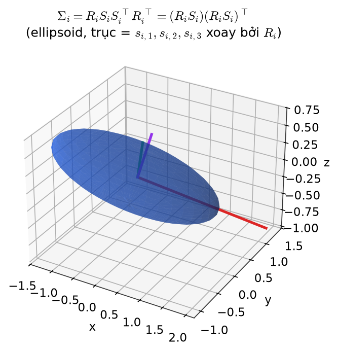
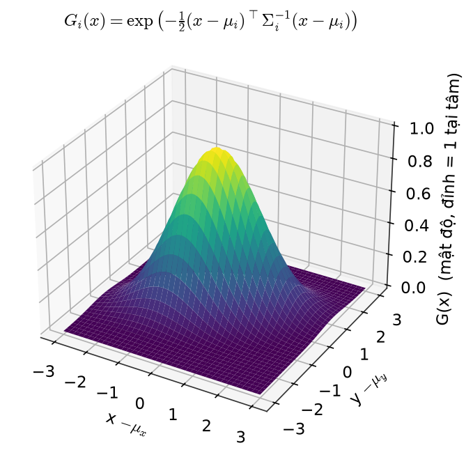
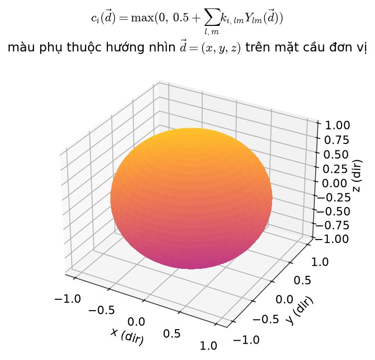
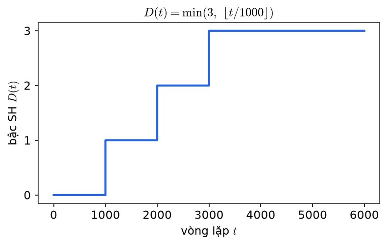

# Chương 2 — 3D Gaussians

> Khối trung tâm của sơ đồ: mọi mũi tên đều đi vào hoặc đi ra khỏi đây. **FastGS-lite giữ nguyên.**
> Code: `scene/gaussian_model.py:33-40` (activation), `forward.cu:120-150` (`computeCov3D`), `computeColorFromSH`.

## 2.1 — Tham số hoá: 59 số mỗi Gaussian

| Nhóm | Tham số thô (được tối ưu) | Kích hoạt | Giá trị dùng | Số chiều |
|---|---|---|---|---|
| Vị trí | $\mu_i$ | — | $\mu_i$ | 3 |
| Xoay | $\tilde q_i$ | chuẩn hoá | $q_i=\tilde q_i/\lVert\tilde q_i\rVert$ | 4 |
| Scale | $\tilde s_i$ | $\exp$ | $s_i=\exp(\tilde s_i)$ | 3 |
| Opacity | $\tilde\alpha_i$ | sigmoid | $\alpha_i=\sigma(\tilde\alpha_i)$ | 1 |
| SH bậc 0 (`features_dc`) | $k_{i,00}$ | — | | 3 |
| SH bậc 1–3 (`features_rest`) | $k_{i,lm}$ | — | | 45 |
| | | | **Tổng** | **59** |

Tham số sống ở **không gian không ràng buộc** và đi qua activation. Đây là mắt xích cần nhớ khi đọc learning rate ở chương 6: $\eta_{\text{scaling}}=0.005$ là lr trên **log-scale**, $\eta_{\text{opacity}}=0.025$ là lr trên **logit**.

## 2.2 — Hình dạng: covariance 3D

$$
R_i=R(q_i)\in SO(3),\qquad S_i=\operatorname{diag}(s_{i,1},s_{i,2},s_{i,3})
$$

$$
\boxed{\ \Sigma_i=R_iS_iS_i^\top R_i^\top=(R_iS_i)(R_iS_i)^\top\ }
$$

*Ellipsoid trong world space (trục x, y, z). Ba đoạn màu là ba trục chính — hướng do $R_i$ quyết định, độ dài do $s_{i,1},s_{i,2},s_{i,3}$ quyết định. Gaussian không tròn đều mà là khối "trứng" dẹt/dài tuỳ tỉ lệ scale.*

Vì sao phân rã thay vì học thẳng 6 phần tử của $\Sigma$: $\Sigma$ phải bán xác định dương; tối ưu trực tiếp rất dễ vi phạm. Dạng $MM^\top$ với $M=R_iS_i$ **luôn** PSD theo cấu trúc, bất kể cập nhật thế nào.

Chi tiết code: chuẩn hoá quaternion nằm ở tầng Python (`rotation_activation`), kernel nhận `rot` và dùng thẳng. Gradient của phép chuẩn hoá do autograd lo.

## 2.3 — Mật độ: hàm Gaussian

$$
G_i(x)=\exp\!\Bigl(-\tfrac12(x-\mu_i)^\top\Sigma_i^{-1}(x-\mu_i)\Bigr),\qquad x\in\mathbb R^3
$$

*Mặt cong 3D, trục x, y là độ lệch $(x-\mu_x, y-\mu_y)$ so với tâm, trục z là mật độ $G(x)$. Hình "quả chuông": đỉnh cao 1 tại tâm, giảm dần ra biên; vì $\Sigma$ không đẳng hướng nên đường đồng mức là ellipse chứ không phải hình tròn.*

Cực đại $=1$ tại tâm, giảm theo khoảng cách Mahalanobis. Khi thực sự tính alpha tại pixel (chương 4), $\Sigma$ ở đây phải hiểu là $\Sigma'$ đã chiếu 2D (chương 3), không phải $\Sigma$ 3D.

## 2.4 — Màu: Spherical Harmonics phụ thuộc hướng nhìn

Với $\vec d_i=(\mu_i-\text{campos})/\lVert\mu_i-\text{campos}\rVert=(x,y,z)$:

$$
c_i(\vec d)=\max\!\Bigl(0,\ 0.5+\sum_{l=0}^{D(t)}\sum_{m=-l}^{l}k_{i,lm}\,Y_{lm}(\vec d)\Bigr)
$$

*Mặt cầu đơn vị trong không gian hướng — trục x, y, z là ba thành phần của vector hướng nhìn $\vec d$ với $\lVert\vec d\rVert=1$. Màu tại mỗi điểm là màu Gaussian phát ra khi camera đứng theo đúng hướng đó nhìn vào tâm — hai phía đối diện có thể ra màu khác nhau, đó là "màu phụ thuộc góc nhìn".*

Khai triển đúng như `computeColorFromSH`:

$$
c=\underbrace{C_0k_{00}}_{\texttt{features\_dc}}
\;\underbrace{-C_1y\,k_{1,-1}+C_1z\,k_{10}-C_1x\,k_{11}}_{l=1}
\;+\underbrace{\sum_mC_2^{(m)}P_2^{(m)}(x,y,z)\,k_{2m}}_{l=2}
\;+\underbrace{\sum_mC_3^{(m)}P_3^{(m)}(x,y,z)\,k_{3m}}_{l=3}
$$

với $C_0=\tfrac12\sqrt{1/\pi}$, $C_1=\tfrac12\sqrt{3/\pi}$. Offset $+0.5$ dịch dải màu về quanh $0.5$; clamp $\max(\cdot,0)$ được ghi lại vào `clamped[]` để backward chặn gradient của kênh bị cắt.

**Lịch tăng bậc SH** (`oneupSHdegree`, mỗi 1000 vòng):

$$
D(t)=\min\bigl(3,\ \lfloor t/1000\rfloor\bigr)
\quad\Rightarrow\quad \text{số hệ số/kênh}=(D+1)^2:\ 1\to4\to9\to16
$$

*Đồ thị bậc thang: trục x là vòng lặp $t$, trục y là bậc SH $D(t)\in\{0,1,2,3\}$. Hàm bậc thang tăng dần, nhảy đúng tại $t=1000,2000,3000$ rồi giữ nguyên — không phải đường liên tục.*

Hệ quả cho mô hình chi phí: hệ số $a$ trong $aN$ (chương 8) tăng dần trong 3000 vòng đầu rồi mới ổn định.

## 2.5 — Phân chia SH thấp / cao — vì sao quan trọng cho chương 6

| | `features_dc` ($l=0$) | `features_rest` ($l=1..3$) |
|---|---|---|
| Ý nghĩa | màu cơ bản, không phụ thuộc góc nhìn | hiệu chỉnh theo góc nhìn (specular, phản xạ) |
| Số hệ số | 3 | 45 |
| Optimizer | `optimizer`, lr `lowfeature_lr` | `shoptimizer`, lr `highfeature_lr / 20` |
| Nhịp step (FastGS) | mỗi vòng (0–15k) | mỗi 16 vòng (0–15k) |

SH bậc 0 mang phần lớn năng lượng màu — lr cao ở đó làm cả ảnh dao động. SH bậc cao là hiệu chỉnh nhỏ với 15× số tham số — cho chúng lr đầy đủ ở nhịp đầy đủ vừa tốn optimizer vừa dễ overfit theo góc chụp. Chi tiết ở chương 6.

## 2.6 — Đầu ra của khối

Tại vòng lặp $t$, khối này cung cấp cho **Projection** (chương 3):

$$
\bigl(\mu_i,\ \Sigma_i,\ \alpha_i,\ \{k_{i,lm}\}_{l\le D(t)}\bigr)_{i=1}^{N}
$$

và nhận ngược lại gradient $\nabla_{\theta_i}\mathcal L$ (chương 6) cùng các thao tác thêm/xoá từ **Adaptive Density Control** (chương 7).
