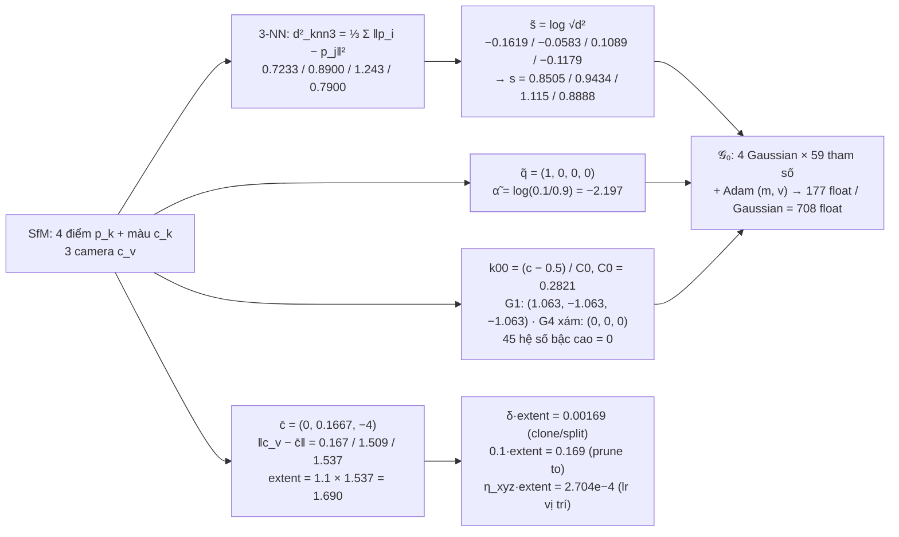
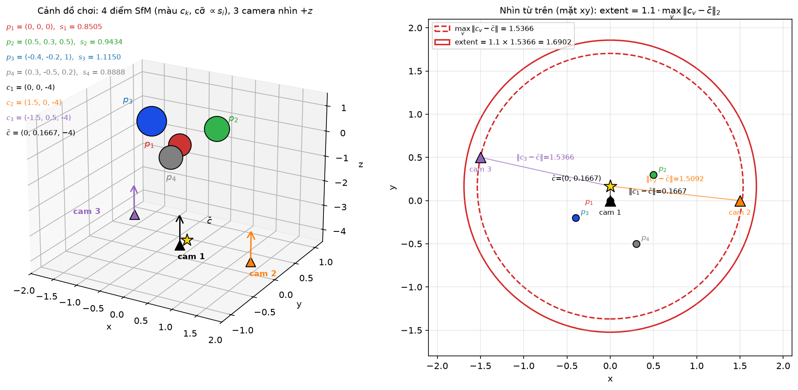
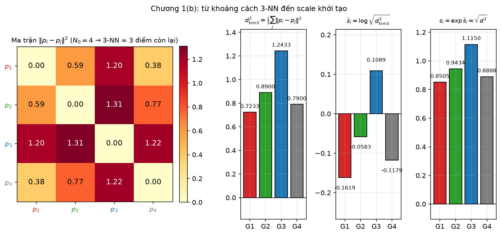
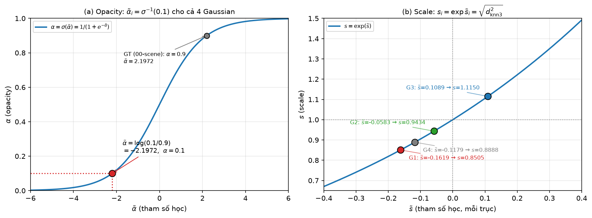
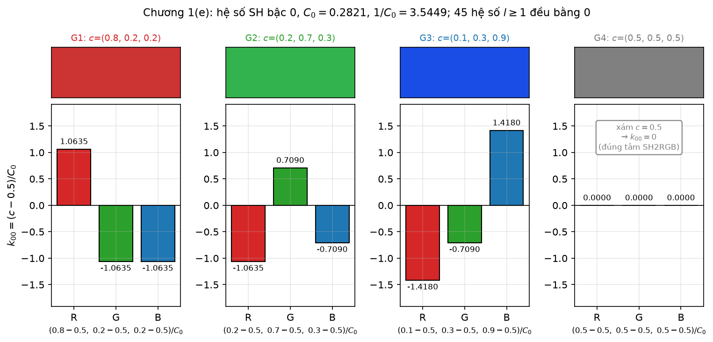
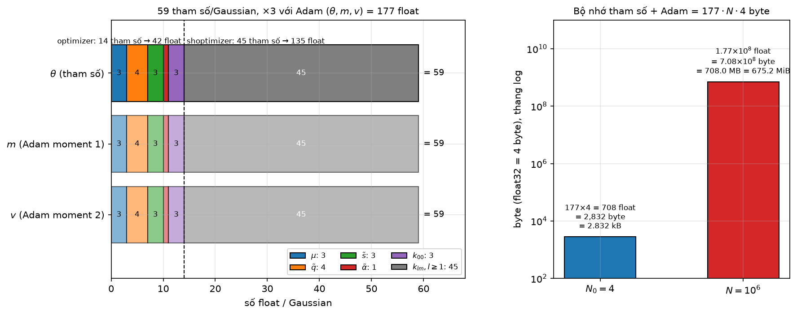

# Test số chương 1 — SfM Points → Initialization

> Tính trên cảnh đồ chơi ở `00-scene.md` (4 điểm SfM, 3 camera, ảnh $48\times32$).
> Script sinh số: `scripts/ch01_test.py` (chỉ `numpy`). Mọi số dưới đây là output thật của script,
> làm tròn 4 chữ số có nghĩa; script giữ full precision.
> Công thức chép lại từ code: `scene/gaussian_model.py:137-160` (`create_from_pcd`),
> `scene/dataset_readers.py:45-66` (`getNerfppNorm`), `utils/sh_utils.py:26,114` (`C0`, `RGB2SH`),
> `utils/general_utils.py:18` (`inverse_sigmoid`), `submodules/simple-knn/simple_knn.cu:148-184` (`boxMeanDist`, tức `distCUDA2`).
>
> Vì môi trường không có torch nên không gọi được hàm thật trong `utils/*.py` (mọi file đều `import torch` ở đầu);
> các hàm được **chép nguyên văn** sang numpy và đánh dấu "chép từ code" ở từng bước.

## Sơ đồ khối với số của cảnh đồ chơi

## 1.1 — Đầu vào

Point cloud thưa $\{(p_k, c_k)\}_{k=1}^{N_0}$, $N_0=4$:

| $k$ | $p_k$ | $c_k$ |
|---|---|---|
| 1 | $(0,\ 0,\ 0)$ | $(0.8,\ 0.2,\ 0.2)$ |
| 2 | $(0.5,\ 0.3,\ 0.5)$ | $(0.2,\ 0.7,\ 0.3)$ |
| 3 | $(-0.4,\ -0.2,\ 1.0)$ | $(0.1,\ 0.3,\ 0.9)$ |
| 4 | $(0.3,\ -0.5,\ 0.2)$ | $(0.5,\ 0.5,\ 0.5)$ |

Tập camera $V=3$, xoay đơn vị:

$$W_v=\begin{pmatrix}I_3&-c_v\\0&1\end{pmatrix}$$

| $v$ | $c_v$ |
|---|---|
| 1 | $(0,\ 0,\ -4)$ |
| 2 | $(1.5,\ 0,\ -4)$ |
| 3 | $(-1.5,\ 0.5,\ -4)$ |

`max_sh_degree` $=3$ → $(3+1)^2=16$ hệ số SH mỗi kênh.

*Hình: trái — 4 điểm SfM (màu = $c_k$, cỡ hình cầu tỉ lệ $s_i$ tính ở 1.2b, toạ độ ghi ở góc trên) và 3 camera (tam giác đen/cam/tím, mũi tên = hướng nhìn $+z$), sao vàng là $\bar c=(0,\ 0.1667,\ -4)$. Phải — chiếu lên mặt $xy$: đoạn nối $\bar c$–camera ghi $\lVert c_v-\bar c\rVert=0.1667/1.509/1.537$; vòng nét đứt bán kính 1.537 (max) và vòng nét liền bán kính $\text{extent}=1.1\times1.537=1.690$ (mục 1.3).*

## 1.2 — Mỗi điểm SfM sinh một Gaussian

### (a) Tâm $\mu_i=p_i$

`gaussian_model.py:139,154` — `fused_point_cloud = tensor(pcd.points)`; `_xyz = fused_point_cloud`. Không biến đổi gì, $\mu_i=p_i$ như bảng 1.1.

### (b) Scale $\tilde s_i$ — từ 3-NN

**Công thức** (chép từ `simple_knn.cu:183` và `gaussian_model.py:147-148`):

$$
d^2_{\text{knn3}}(p_i)=\frac13\sum_{j\in\text{3-NN}(i)}\lVert p_i-p_j\rVert^2,\qquad
\tilde s_i=\log\sqrt{\max(d^2_{\text{knn3}},\,10^{-7})}\cdot\mathbf 1_3,\qquad s_i=\exp\tilde s_i
$$

Kernel `boxMeanDist` bỏ qua `i == idx` (chính điểm) rồi lấy `(best[0]+best[1]+best[2])/3`. Với $N_0=4$, 3-NN của mỗi điểm chính là 3 điểm còn lại.

**Thay số** — ma trận $\lVert p_i-p_j\rVert^2$:

| | $p_1$ | $p_2$ | $p_3$ | $p_4$ |
|---|---|---|---|---|
| $p_1$ | 0 | 0.59 | 1.2 | 0.38 |
| $p_2$ | 0.59 | 0 | 1.31 | 0.77 |
| $p_3$ | 1.2 | 1.31 | 0 | 1.22 |
| $p_4$ | 0.38 | 0.77 | 1.22 | 0 |

Ví dụ $\lVert p_1-p_2\rVert^2=0.5^2+0.3^2+0.5^2=0.25+0.09+0.25=0.59$; $\lVert p_2-p_3\rVert^2=0.9^2+0.5^2+0.5^2=0.81+0.25+0.25=1.31$.

**Kết quả:**

| $i$ | $d^2_{\text{knn3}}$ | sau clamp $10^{-7}$ | $\tilde s_i$ (mỗi trục) | $s_i=\sqrt{d^2}$ |
|---|---|---|---|---|
| 1 | $(0.59+1.2+0.38)/3=0.7233$ | 0.7233 | $\log\sqrt{0.7233}=-0.1619$ | 0.8505 |
| 2 | $(0.59+1.31+0.77)/3=0.8900$ | 0.8900 | $-0.05827$ | 0.9434 |
| 3 | $(1.2+1.31+1.22)/3=1.243$ | 1.243 | $0.1089$ | 1.115 |
| 4 | $(0.38+0.77+1.22)/3=0.7900$ | 0.7900 | $-0.1179$ | 0.8888 |

Clamp không tác dụng ở cảnh này (mọi $d^2\gg10^{-7}$). Gaussian đẳng hướng: `scales = log(sqrt(dist2))[...,None].repeat(1,3)`.
Chú ý $s_3$ lớn nhất vì $p_3$ nằm xa nhất (mọi khoảng cách $\ge1.2$).

*Hình: trái — ma trận $\lVert p_i-p_j\rVert^2$ (số trong ô đúng bằng bảng trên; hàng $p_3$ đỏ đậm nhất → xa nhất). Phải — ba cột theo thứ tự tính: $d^2_{\mathrm{knn3}}$ = trung bình 3 ô ngoài đường chéo của một hàng (0.7233/0.8900/1.243/0.7900) → $\tilde s_i=\log\sqrt{d^2}$ (âm khi $d^2<1$, chỉ G3 dương) → $s_i=e^{\tilde s_i}$ (0.8505/0.9434/1.115/0.8888).*

### (c) Quaternion $\tilde q_i$

`gaussian_model.py:149-150` — `rots = zeros(N,4); rots[:,0]=1`:

$$\tilde q_i=(1,\ 0,\ 0,\ 0)\quad\forall i$$

### (d) Opacity $\tilde\alpha_i$

**Công thức** (chép từ `general_utils.py:18` và `gaussian_model.py:152`): $\tilde\alpha_i=\sigma^{-1}(0.1)=\log\dfrac{0.1}{1-0.1}$.

**Thay số:** $\log(0.1/0.9)=\log(0.1111)=-2.1972$.

**Kết quả:** $\tilde\alpha_i=-2.197$ cho cả 4 Gaussian. Kiểm chứng ngược $\sigma(-2.1972)=0.1000$.

*Hình: (a) đường $\sigma$; chấm đỏ là điểm khởi tạo $(\tilde\alpha,\alpha)=(-2.197,\ 0.1)$ — nằm ở phần dốc thấp bên trái nên gradient theo $\tilde\alpha$ nhỏ; chấm xám là $\alpha=0.9$ của GT (00-scene) ứng với $\tilde\alpha=+2.197$, đối xứng qua 0. (b) đường $\exp$ với 4 điểm $(\tilde s_i, s_i)$ của mục (b): 3 Gaussian nằm dưới $s=1$ (vì $\tilde s<0$), chỉ G3 nằm trên.*

### (e) Hệ số SH $k_{i,lm}$

**Công thức** (chép từ `sh_utils.py:26,114`): $C_0=0.2820947918$, $k_{i,00}=\text{RGB2SH}(c_i)=(c_i-0.5)/C_0$; `features[:,3:,1:]=0` → $k_{i,lm}=0$ với $l\ge1$.

**Thay số:** $1/C_0=3.5449$; $0.3/C_0=1.063$, $0.2/C_0=0.7090$, $0.4/C_0=1.418$.

**Kết quả:**

| $i$ | $c_i$ | $k_{i,00}$ (R, G, B) |
|---|---|---|
| 1 | $(0.8, 0.2, 0.2)$ | $(1.063,\ -1.063,\ -1.063)$ |
| 2 | $(0.2, 0.7, 0.3)$ | $(-1.063,\ 0.7090,\ -0.7090)$ |
| 3 | $(0.1, 0.3, 0.9)$ | $(-1.418,\ -0.7090,\ 1.418)$ |
| 4 | $(0.5, 0.5, 0.5)$ | $(0,\ 0,\ 0)$ |

Điểm xám 4 cho $k_{00}=0$ vì $c=0.5$ đúng bằng điểm giữa của `SH2RGB` ($sh\cdot C_0+0.5$).
Tensor `_features_dc` có shape $(4,1,3)$, `_features_rest` shape $(4,15,3)$: $15\times3=45$ hệ số bậc cao, tất cả $=0$ (script kiểm tra `max|features_rest| = 0`).

*Hình: mỗi cột là một Gaussian — ô màu trên cùng là $c_i$ gốc, ba thanh R/G/B bên dưới là $k_{i,00}=(c-0.5)/C_0$ với số ghi trên đầu thanh (khớp bảng trên; phép chia ghi ở nhãn trục $x$). Kênh nào $>0.5$ cho thanh dương, $<0.5$ cho thanh âm; G4 xám $c=0.5$ nên cả ba thanh bằng 0.*

### (f) Đếm tham số

$3\,(\mu)+4\,(\tilde q)+3\,(\tilde s)+1\,(\tilde\alpha)+3\times16\,(k)=59$ tham số/Gaussian.

## 1.3 — `extent`: bán kính cảnh

**Công thức** (chép từ `dataset_readers.py:45-66`): $c_v=(W_v)^{-1}[{:}3,3]$, $\bar c=\frac1V\sum_v c_v$, $\text{extent}=1.1\cdot\max_v\lVert c_v-\bar c\rVert_2$.

**Thay số.** Script dựng $W_v$ 4×4 rồi lấy `inv(W2C)[:3,3]` đúng như code; với xoay đơn vị kết quả trùng $c_v$ đã cho.

$$\bar c=\frac13\bigl[(0,0,-4)+(1.5,0,-4)+(-1.5,0.5,-4)\bigr]=(0,\ 0.1667,\ -4)$$

| $v$ | $c_v-\bar c$ | $\lVert c_v-\bar c\rVert$ |
|---|---|---|
| 1 | $(0,\ -0.1667,\ 0)$ | 0.1667 |
| 2 | $(1.5,\ -0.1667,\ 0)$ | $\sqrt{2.25+0.02778}=1.509$ |
| 3 | $(-1.5,\ 0.3333,\ 0)$ | $\sqrt{2.25+0.1111}=1.537$ |

**Kết quả:**

$$\text{extent}=1.1\times1.537=1.690$$

(`translate` $=-\bar c=(0,\ -0.1667,\ 4)$ cũng được trả về nhưng chương 1 không dùng.)

Ba ngưỡng suy ra từ `extent`:

| Nơi dùng | Công thức | Giá trị | Code |
|---|---|---|---|
| clone / split | $\delta\cdot\text{extent}$, $\delta=0.001$ | $0.001690$ | `gaussian_model.py:451-452`, `arguments/__init__.py:95` |
| prune "scale quá lớn" | $0.1\cdot\text{extent}$ | $0.1690$ | `gaussian_model.py:467` |
| `spatial_lr_scale` | $\eta_{xyz}\cdot\text{extent}$, $\eta_{xyz}=1.6\times10^{-4}$ | $2.704\times10^{-4}$ | `gaussian_model.py:168`, `arguments/__init__.py:76` |

Nhận xét cho chương 7: $\max s_i\in[0.8505,\ 1.115]$, đều $>0.001690$ nên nếu 4 Gaussian này vượt ngưỡng gradient thì tất cả sẽ đi nhánh **split**, không có clone. Ngược lại $\max s_i<0.1690$? Không — $s_i\approx0.85..1.12>0.169$, nghĩa là ngay từ khởi tạo cả 4 Gaussian đã vượt ngưỡng `big_points_ws` (cảnh đồ chơi quá thưa so với bán kính camera; ở cảnh thật tỉ lệ $s_i/\text{extent}$ nhỏ hơn nhiều). Chương 7 sẽ phải tính đến điều này.

## 1.4 — Trạng thái optimizer đi kèm

**Công thức:** mỗi tham số mang thêm hai moment Adam $(m,v)$ → $3\times59=177$ float/Gaussian. Chia theo hai optimizer (`gaussian_model.py:166-177`): `optimizer` giữ $(\mu,\tilde q,\tilde s,\tilde\alpha,k_{00})=14$ tham số → 42 float; `shoptimizer` giữ 45 hệ số $k_{lm},l\ge1$ → 135 float.

**Thay số** (float32 = 4 byte):

| $N$ | float | byte | quy đổi |
|---|---|---|---|
| $N_0=4$ | $177\times4=708$ | $2\,832$ | 2.832 kB |
| $N=10^6$ | $1.77\times10^8$ | $7.08\times10^8$ | 708.0 MB $=675.2$ MiB |

Tức riêng trạng thái tham số + Adam đã chiếm ~0.7 GB VRAM ở $N=10^6$, chưa kể gradient và bộ đệm raster.

*Hình: trái — thanh $\theta$ ghép 6 nhóm $3+4+3+1+3+45=59$; hai thanh mờ $m, v$ là moment Adam cùng kích thước → $3\times59=177$ float/Gaussian; vạch đứt tại 14 tách phần `optimizer` (42 float) và `shoptimizer` (135 float). Phải — số byte $=177\cdot N\cdot4$ trên thang log: 2 832 byte ở $N_0=4$, $7.08\times10^8$ byte $=708$ MB $=675.2$ MiB ở $N=10^6$.*

## 1.5 — Đầu ra của khối

$\mathcal G_0=\{\theta_i\}_{i=1}^{4}$, $\theta_i=(\mu_i,\tilde q_i,\tilde s_i,\tilde\alpha_i,k_i)$. Chương 2, 3 dùng đúng các số này.

| $i$ | $\mu_i$ | $\tilde q_i$ | $\tilde s_i$ (×3 trục) | $s_i=e^{\tilde s_i}$ | $\tilde\alpha_i$ | $\alpha_i$ | $k_{i,00}$ (R,G,B) | $k_{i,lm},l\ge1$ |
|---|---|---|---|---|---|---|---|---|
| 1 | $(0,\ 0,\ 0)$ | $(1,0,0,0)$ | $-0.1619$ | 0.8505 | $-2.197$ | 0.1 | $(1.063,\ -1.063,\ -1.063)$ | 0 (45) |
| 2 | $(0.5,\ 0.3,\ 0.5)$ | $(1,0,0,0)$ | $-0.05827$ | 0.9434 | $-2.197$ | 0.1 | $(-1.063,\ 0.7090,\ -0.7090)$ | 0 (45) |
| 3 | $(-0.4,\ -0.2,\ 1.0)$ | $(1,0,0,0)$ | $0.1089$ | 1.115 | $-2.197$ | 0.1 | $(-1.418,\ -0.7090,\ 1.418)$ | 0 (45) |
| 4 | $(0.3,\ -0.5,\ 0.2)$ | $(1,0,0,0)$ | $-0.1179$ | 0.8888 | $-2.197$ | 0.1 | $(0,\ 0,\ 0)$ | 0 (45) |

Giá trị full precision (để chương sau copy nếu cần): $\tilde s=(-0.1619425606,\ -0.0582669081,\ 0.1088979725,\ -0.1178611668)$; $\tilde\alpha=-2.1972245773$; $1/C_0=3.5449077018$.

| Đại lượng toàn cảnh | Giá trị |
|---|---|
| $\text{extent}$ | $1.690$ (full: 1.6902498172) |
| `spatial_lr_scale` (= extent, `scene/__init__.py:96`) | 1.690 |
| $\delta\cdot\text{extent}$ | $1.690\times10^{-3}$ |
| $0.1\cdot\text{extent}$ | 0.1690 |
| $\eta_{xyz}\cdot\text{extent}$ | $2.704\times10^{-4}$ |
| $N_0$ | 4 |
| bộ nhớ optimizer | 708 float = 2 832 byte |

## Ghi chú đối chiếu

Đối chiếu `01-initialization.md` với code thực tế:

1. **Khớp hoàn toàn**: công thức $\tilde s_i$ (kể cả clamp $10^{-7}$ và việc loại chính điểm khỏi 3-NN — `simple_knn.cu:159,178` có `if (i == idx) continue`), $\tilde q_i$, $\tilde\alpha_i$, `RGB2SH`, `extent` (hằng 1.1 ở `dataset_readers.py:62`), ba ngưỡng dùng `extent` và con số 177 float/Gaussian.
2. **Mục 1.4 — tổng float 177 đúng nhưng chia theo optimizer chưa nêu**: `optimizer` giữ 14 tham số (42 float), `shoptimizer` giữ 45 (135 float); phần lớn trạng thái Adam nằm ở SH bậc cao. Không sai, chỉ là chi tiết bổ sung.
3. **Mục 1.3 bảng "Nơi dùng"**: ngưỡng $\delta\cdot\text{extent}$ trong code là `args.dense*extent` với `dense=0.001` (`arguments/__init__.py:95`), so sánh với `max(get_scaling, dim=1)` — tức $\max_{\text{trục}} s_i$, không phải $\lVert s_i\rVert$. Chương 1 chỉ nói "ngưỡng clone/split" nên không mâu thuẫn, nhưng chương 7 nên ghi rõ là max theo trục.
4. **`getNerfppNorm` còn trả `translate = -\bar c`** (`dataset_readers.py:64`), chương 1 không nhắc — không ảnh hưởng vì `Scene` chỉ lấy `["radius"]` (`scene/__init__.py:74`).
5. **Hàm thật không gọi được**: `utils/sh_utils.py`, `utils/general_utils.py` đều `import torch` ở đầu file nên trong môi trường không có torch script phải chép lại; hằng `C0 = 0.28209479177387814` được lấy nguyên từ `sh_utils.py:26`.
