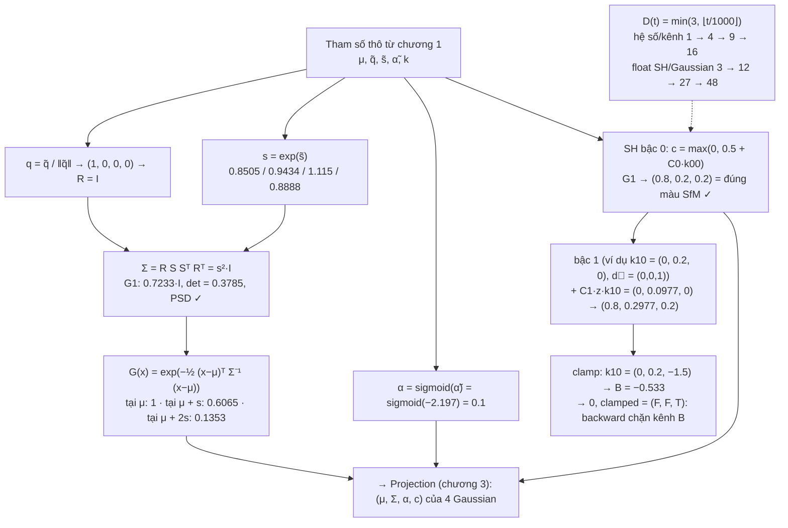
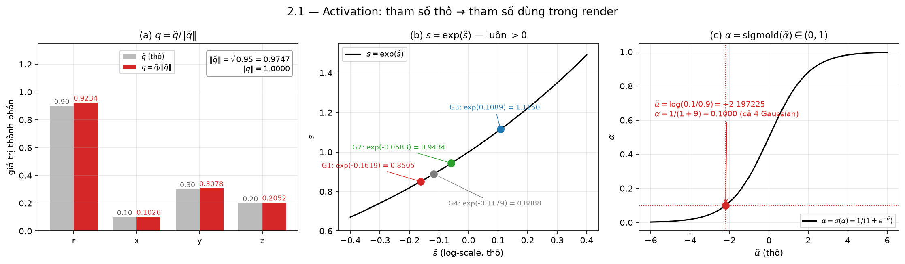
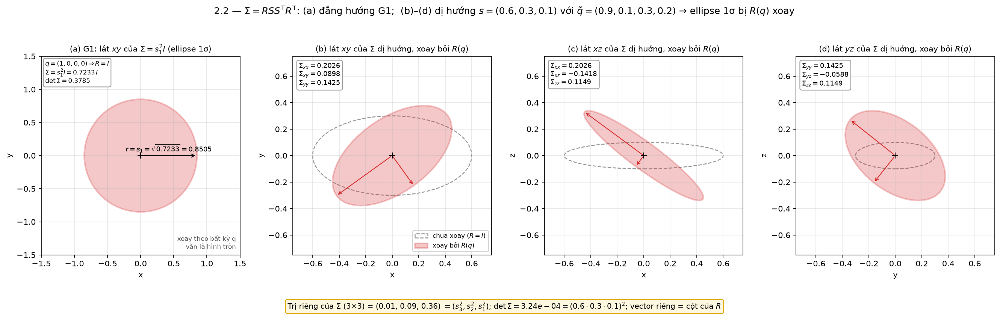
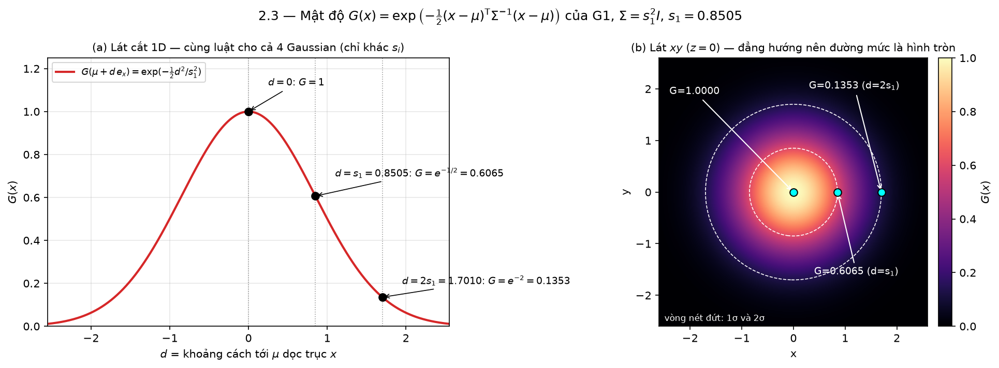
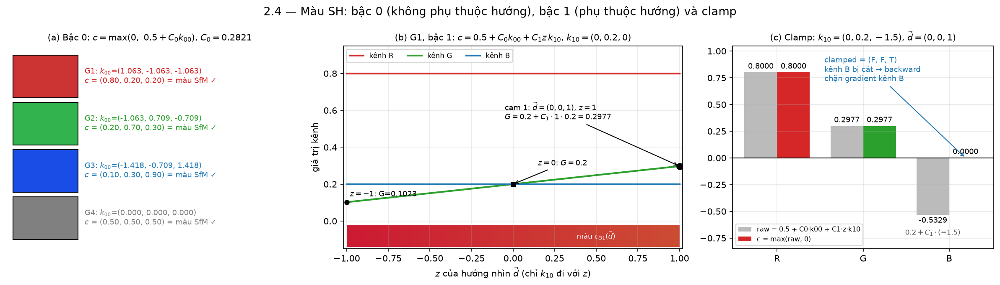
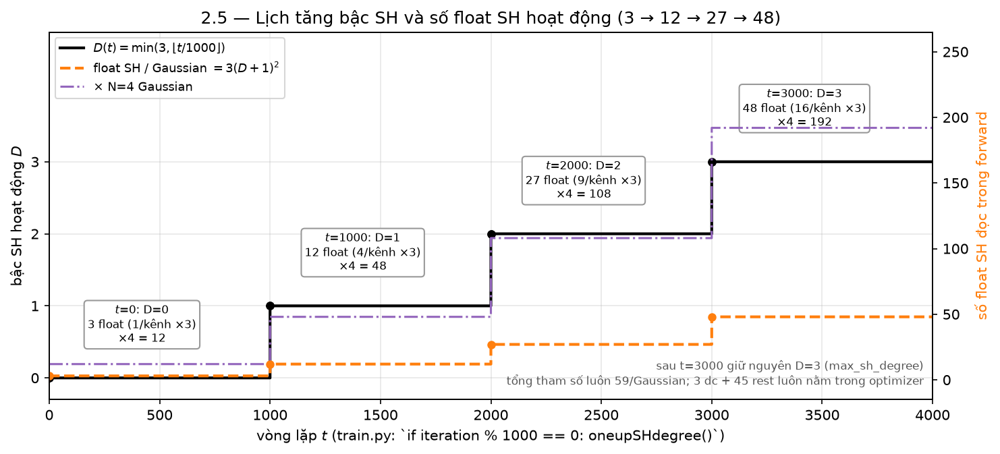

# Test số — Chương 2: 3D Gaussians

> Cảnh: `00-scene.md` (4 điểm SfM, 3 camera). Script sinh số: `scripts/ch02_test.py` (chỉ numpy).
> Mọi số dưới đây là **output thật** của script (in 6 chữ số, bảng làm tròn 4 chữ số có nghĩa).
> Công thức chép từ `scene/gaussian_model.py:26-40`, `utils/general_utils.py:66-99`, `utils/sh_utils.py`,
> `cuda_rasterizer/forward.cu:24-77` (`computeColorFromSH`) và `:124-158` (`computeCov3D`), `train.py:81-82`.

## Sơ đồ khối với số của cảnh đồ chơi

## Đầu vào của khối (khởi tạo chương 1, tính lại trong script)

Bot chương 1 chạy song song nên script tự tính lại `create_from_pcd` (`scene/gaussian_model.py:137-160`):
$\mu_i=p_i$, $\tilde s_i=\log\sqrt{\max(d^2_{\text{knn3}},10^{-7})}\cdot\mathbf 1_3$, $\tilde q_i=(1,0,0,0)$,
$\tilde\alpha_i=\log(0.1/0.9)=-2.197225$, $k_{i,00}=(c_i-0.5)/C_0$ với $C_0=0.282095$, $k_{i,lm}=0$ ($l\ge1$).

Với $N_0=4$, 3-NN của mỗi điểm là 3 điểm còn lại. Ví dụ G1: $\lVert p_1-p_2\rVert^2=0.59,\ \lVert p_1-p_3\rVert^2=1.2,\ \lVert p_1-p_4\rVert^2=0.38 \Rightarrow d^2_{\text{knn3}}=2.17/3=0.723333$.

| $i$ | $\mu_i$ | $d^2_{\text{knn3}}$ | $\tilde s_i$ (mỗi trục) | $\tilde q_i$ | $\tilde\alpha_i$ | $k_{i,00}$ |
|---|---|---|---|---|---|---|
| 1 | (0, 0, 0) | 0.723333 | −0.161943 | (1,0,0,0) | −2.197225 | (1.063472, −1.063472, −1.063472) |
| 2 | (0.5, 0.3, 0.5) | 0.890000 | −0.058267 | (1,0,0,0) | −2.197225 | (−1.063472, 0.708982, −0.708982) |
| 3 | (−0.4, −0.2, 1.0) | 1.243333 | 0.108898 | (1,0,0,0) | −2.197225 | (−1.417963, −0.708982, 1.417963) |
| 4 | (0.3, −0.5, 0.2) | 0.790000 | −0.117861 | (1,0,0,0) | −2.197225 | (0, 0, 0) |

## 2.1 — Activation và đếm 59 tham số

Công thức (`gaussian_model.py:33-40`): $q=\tilde q/\lVert\tilde q\rVert$ (`F.normalize`), $s=\exp\tilde s$, $\alpha=\sigma(\tilde\alpha)=1/(1+e^{-\tilde\alpha})$.

Thay số cho G1: $\lVert(1,0,0,0)\rVert=1\Rightarrow q=(1,0,0,0)$; $s=e^{-0.161943}=0.850490$ ($=\sqrt{0.723333}$, đúng như mong đợi vì $\tilde s=\log\sqrt{d^2}$); $\alpha=1/(1+e^{2.197225})=1/(1+9)=0.1$.

| $i$ | $\tilde q_i$ | $\lVert\tilde q_i\rVert$ | $q_i$ | $\tilde s_i$ | $s_i=\exp\tilde s_i$ | $\tilde\alpha_i$ | $\alpha_i$ |
|---|---|---|---|---|---|---|---|
| 1 | (1,0,0,0) | 1 | (1,0,0,0) | −0.161943 | 0.850490 | −2.197225 | 0.1000 |
| 2 | (1,0,0,0) | 1 | (1,0,0,0) | −0.058267 | 0.943398 | −2.197225 | 0.1000 |
| 3 | (1,0,0,0) | 1 | (1,0,0,0) | 0.108898 | 1.115049 | −2.197225 | 0.1000 |
| 4 | (1,0,0,0) | 1 | (1,0,0,0) | −0.117861 | 0.888819 | −2.197225 | 0.1000 |

Đếm tham số (script đếm từ shape của mảng): $\mu$ 3 + $\tilde q$ 4 + $\tilde s$ 3 + $\tilde\alpha$ 1 + `features_dc` 3 + `features_rest` $3\times15=45$ = **59** (assert qua).

*Hình: (a) cặp cột xám/đỏ là $\tilde q=(0.9,0.1,0.3,0.2)$ trước/sau chia cho $\lVert\tilde q\rVert=0.9747$ (hộp góc phải) — thành phần $r$ ra 0.9234 như mục 2.2b; (b) 4 chấm màu là $s_i=\exp\tilde s_i$ của bảng trên (G1 0.8505 … G3 1.1150) nằm trên đường $\exp$; (c) chấm đỏ tại $\tilde\alpha=-2.197$ cho $\alpha=0.1$ — cả 4 Gaussian trùng một điểm. Script vẽ: `scripts/ch02_plot.py`.*

## 2.2 — Covariance 3D $\Sigma=RSS^\top R^\top$

### 2.2a — $q=(1,0,0,0)$

`build_rotation` (`general_utils.py:66-86`) với $r=1,x=y=z=0$: mọi số hạng $2(\cdot)$ bằng 0, đường chéo $1-2\cdot0=1$ → $R=I_3$ (script `allclose(R, I)` qua).

Vì $R=I$ và $S=s\,I_3$: $\Sigma=RSS^\top R^\top=s^2I_3$. `strip_symmetric` trả 6 phần tử $(xx,xy,xz,yy,yz,zz)$:

| $i$ | $s_i$ | $s_i^2$ | $\Sigma_i$ (6 phần tử) |
|---|---|---|---|
| 1 | 0.850490 | 0.723333 | (0.723333, 0, 0, 0.723333, 0, 0.723333) |
| 2 | 0.943398 | 0.890000 | (0.89, 0, 0, 0.89, 0, 0.89) |
| 3 | 1.115049 | 1.243333 | (1.243333, 0, 0, 1.243333, 0, 1.243333) |
| 4 | 0.888819 | 0.790000 | (0.79, 0, 0, 0.79, 0, 0.79) |

Nhận xét: $s_i^2=d^2_{\text{knn3}}$ chính xác — covariance khởi tạo là hình cầu có phương sai bằng bình phương khoảng cách trung bình tới láng giềng.

### 2.2b — Quaternion không tầm thường $\tilde q=(0.9,\,0.1,\,0.3,\,0.2)$

**Chuẩn hoá**: $\lVert\tilde q\rVert=\sqrt{0.81+0.01+0.09+0.04}=\sqrt{0.95}=0.974679$
$\Rightarrow q=(r,x,y,z)=(0.923381,\ 0.102598,\ 0.307794,\ 0.205196)$.

**R theo đúng thứ tự phần tử của `build_rotation`** (dòng 75-83):

| Phần tử | Công thức | Thay số | Kết quả |
|---|---|---|---|
| $R_{00}$ | $1-2(y^2+z^2)$ | $1-2(0.094737+0.042105)$ | 0.726316 |
| $R_{01}$ | $2(xy-rz)$ | $2(0.031579-0.189474)$ | −0.315789 |
| $R_{02}$ | $2(xz+ry)$ | $2(0.021053+0.284211)$ | 0.610526 |
| $R_{10}$ | $2(xy+rz)$ | | 0.442105 |
| $R_{11}$ | $1-2(x^2+z^2)$ | | 0.894737 |
| $R_{12}$ | $2(yz-rx)$ | | −0.063158 |
| $R_{20}$ | $2(xz-ry)$ | | −0.526316 |
| $R_{21}$ | $2(yz+rx)$ | | 0.315789 |
| $R_{22}$ | $1-2(x^2+y^2)$ | | 0.789474 |

$$
R=\begin{pmatrix}0.726316&-0.315789&0.610526\\0.442105&0.894737&-0.063158\\-0.526316&0.315789&0.789474\end{pmatrix},
\qquad RR^\top=I_3,\quad \det R=1.000000
$$

**$L=RS$ với $s$ của G1** ($S=0.850490\,I_3$, `build_scaling_rotation` dòng 88-99):

$$
L=\begin{pmatrix}0.617724&-0.268576&0.519247\\0.376006&0.760965&-0.053715\\-0.447626&0.268576&0.671440\end{pmatrix}
$$

**$\Sigma=LL^\top$**:

$$
\Sigma=\begin{pmatrix}0.723333&0&0\\0&0.723333&0\\0&0&0.723333\end{pmatrix}
$$

- Đối xứng: `True`. Trị riêng $(0.723333,\ 0.723333,\ 0.723333)\ge0$: PSD. $\det\Sigma=0.378456=(s_1s_2s_3)^2=0.850490^6$.
- Vì scale **đẳng hướng**, $\Sigma=s^2RR^\top=s^2I$: xoay không đổi hình dạng — đúng như hình học mong đợi (script kiểm tra `allclose(Σ, s²I)` = True). Đây là lý do Gaussian khởi tạo "không có hướng" dù $\tilde q$ có thay đổi thế nào.

**Bổ sung để xoay có tác dụng**: cùng $q$, $s=(0.6,0.3,0.1)$:

$$
\Sigma=\begin{pmatrix}0.202615&0.089784&-0.141773\\0.089784&0.142454&-0.058837\\-0.141773&-0.058837&0.114931\end{pmatrix},
\quad \text{trị riêng}=(0.01,\ 0.09,\ 0.36)=(s_3^2,s_2^2,s_1^2),\quad \det=3.24\times10^{-4}=(0.6\cdot0.3\cdot0.1)^2
$$

Trị riêng đúng bằng $s^2$ và vector riêng là các cột của $R$: $\Sigma$ là ellipsoid bán trục $s$, xoay theo $R$. Script cũng đối chiếu với cách viết trong `computeCov3D` (glm column-major, `M = S*R; Sigma = M^T M`) — ra cùng ma trận.

*Hình: (a) lát $xy$ của $\Sigma_1=0.7233\,I$ là hình tròn bán kính $s_1=0.8505$ (mũi tên) — xoay bởi $q$ nào cũng không đổi, đúng nhận xét trên; (b)–(d) với $s=(0.6,0.3,0.1)$ và cùng $\tilde q$: ellipse nét đứt là $R=I$, ellipse đỏ là sau khi xoay, hộp góc trái ghi đúng các phần tử $\Sigma_{xx}=0.2026,\ \Sigma_{xy}=0.0898,\ \Sigma_{xz}=-0.1418,\dots$ của ma trận trên; dòng vàng dưới cùng ghi trị riêng $(0.01,0.09,0.36)=s^2$ và $\det=3.24\times10^{-4}$.*

## 2.3 — Mật độ $G_i(x)=\exp(-\tfrac12(x-\mu)^\top\Sigma^{-1}(x-\mu))$

Với $\Sigma=s^2I$: $G(\mu+t\,s\,e_x)=\exp(-\tfrac12 t^2)$. Lý thuyết: $t=0\to1$; $t=1\to e^{-1/2}=0.606531$; $t=2\to e^{-2}=0.135335$.

| $i$ | $s_i$ | $G(\mu)$ | $G(\mu+s_ie_x)$ | $G(\mu+2s_ie_x)$ |
|---|---|---|---|---|
| 1 | 0.850490 | 1.000000 | 0.606531 | 0.135335 |
| 2 | 0.943398 | 1.000000 | 0.606531 | 0.135335 |
| 3 | 1.115049 | 1.000000 | 0.606531 | 0.135335 |
| 4 | 0.888819 | 1.000000 | 0.606531 | 0.135335 |

Với $\Sigma$ dị hướng xoay ở 2.2b, dịch dọc trục chính $R[:,0]$ một đoạn $s_1=0.6$ và $2s_1$: $G=0.606531$ và $0.135335$ — cùng luật, chỉ khác trục.

*Hình: (a) đường đỏ là $G(\mu+d\,e_x)$ với $s_1=0.8505$; ba chấm đen ghi đúng ba giá trị của bảng: $d=0\to1$, $d=s_1=0.8505\to0.6065$, $d=2s_1=1.7010\to0.1353$; (b) cùng ba điểm (chấm xanh) trên heatmap lát $xy$ — hai vòng nét đứt là đường mức $e^{-1/2}$ (1σ) và $e^{-2}$ (2σ), tròn vì $\Sigma=s^2I$.*

## 2.4 — Màu SH theo hướng nhìn

### 2.4a — Hướng nhìn từ camera 1, $c_1=(0,0,-4)$

$\vec d_i=(\mu_i-c_1)/\lVert\mu_i-c_1\rVert$ (trong `computeColorFromSH`: `dir = pos - campos; dir /= length(dir)`).

| $i$ | $\mu_i-c_1$ | $\lVert\cdot\rVert$ | $\vec d_i=(x,y,z)$ |
|---|---|---|---|
| 1 | (0, 0, 4) | 4.000000 | (0, 0, 1) |
| 2 | (0.5, 0.3, 4.5) | 4.537621 | (0.110190, 0.066114, 0.991709) |
| 3 | (−0.4, −0.2, 5) | 5.019960 | (−0.079682, −0.039841, 0.996024) |
| 4 | (0.3, −0.5, 4.2) | 4.240283 | (0.070750, −0.117917, 0.990500) |

### 2.4b — Bậc 0 ($t=0$, $D=0$): $c=\max(0,\ 0.5+C_0k_{00})$

| $i$ | $k_{i,00}$ | $C_0k_{00}$ | $c_i$ | màu SfM | khớp |
|---|---|---|---|---|---|
| 1 | (1.063472, −1.063472, −1.063472) | (0.3, −0.3, −0.3) | (0.8, 0.2, 0.2) | (0.8, 0.2, 0.2) | ✓ |
| 2 | (−1.063472, 0.708982, −0.708982) | (−0.3, 0.2, −0.2) | (0.2, 0.7, 0.3) | (0.2, 0.7, 0.3) | ✓ |
| 3 | (−1.417963, −0.708982, 1.417963) | (−0.4, −0.2, 0.4) | (0.1, 0.3, 0.9) | (0.1, 0.3, 0.9) | ✓ |
| 4 | (0, 0, 0) | (0, 0, 0) | (0.5, 0.5, 0.5) | (0.5, 0.5, 0.5) | ✓ |

$\text{SH2RGB}\circ\text{RGB2SH}=\text{id}$: màu bậc 0 tái tạo đúng màu SfM, và không phụ thuộc camera (script kiểm tra $c$ từ camera 2 = camera 1: True).

### 2.4c — Bậc 1 cho G1: $k_{1,-1}=(0.1,0,0),\ k_{10}=(0,0.2,0),\ k_{11}=(0,0,-0.3)$

$\vec d_1=(0,0,1)$, $C_1=0.488603$. Ba số hạng $l=1$ (đúng thứ tự & dấu trong `eval_sh` / `computeColorFromSH`):

| Số hạng | Công thức | Thay số | Kết quả |
|---|---|---|---|
| $-C_1\,y\,k_{1,-1}$ | | $-0.488603\cdot0\cdot(0.1,0,0)$ | (0, 0, 0) |
| $+C_1\,z\,k_{10}$ | | $+0.488603\cdot1\cdot(0,0.2,0)$ | (0, 0.097721, 0) |
| $-C_1\,x\,k_{11}$ | | $-0.488603\cdot0\cdot(0,0,-0.3)$ | (0, 0, 0) |

$\text{raw}=0.5+C_0k_{00}+\sum l{=}1=(0.8,\,0.2,\,0.2)+(0,\,0.097721,\,0)=(0.8,\ 0.297721,\ 0.2)$
→ $c=(0.8,\ 0.297721,\ 0.2)$, `clamped = (F, F, F)`.

Chỉ $k_{10}$ (đi với $z$) có tác dụng vì camera 1 nhìn thẳng dọc $+z$ vào G1 ($x=y=0$).

### 2.4d — Trường hợp bị clamp: $k_{10}=(0,\,0.2,\,-1.5)$

$+C_1zk_{10}=0.488603\cdot1\cdot(0,0.2,-1.5)=(0,\ 0.097721,\ -0.732904)$
$\text{raw}=(0.8,\ 0.297721,\ -0.532904)$ → $c=\max(\text{raw},0)=(0.8,\ 0.297721,\ 0)$, **`clamped = (F, F, T)`** — kênh B bị cắt; backward sẽ chặn gradient kênh này (forward.cu:72-74).

Cùng hệ số, nhìn từ camera 3 ($c_3=(-1.5,0.5,-4)$): $\vec d=(0.348743,-0.116248,0.929981)$, raw $=(0.805680,\ 0.290878,\ -0.430468)$ → $c=(0.805680,\ 0.290878,\ 0)$, vẫn clamp kênh B nhưng R, G đã đổi: **màu phụ thuộc góc nhìn** đúng như mục đích của SH bậc $\ge1$.

*Hình: (a) 4 ô màu là $c=0.5+C_0k_{00}$ của mục 2.4b, ghi kèm $k_{00}$ và $c$ — trùng màu SfM; (b) G1 với $k_{10}=(0,0.2,0)$: chỉ kênh G (đường xanh lục) đổi theo $z$ của $\vec d$, chấm đen tại $z=1$ (camera 1) ghi $0.2977$ như mục 2.4c, dải màu dưới trục là màu thực tế của G1 khi $z$ chạy từ $-1\to1$; (c) với $k_{10}=(0,0.2,-1.5)$: cột xám là raw, cột màu là sau $\max(\cdot,0)$ — kênh B từ $-0.5329$ bị cắt về $0$, `clamped=(F,F,T)`.*

### 2.4e — eval_sh bậc 2, 3 (kiểm tra công thức chạy đủ 16 hệ số)

16 hệ số ngẫu nhiên (seed 0, $\times0.1$), $\vec d_1$: deg 0 → (0.503547, 0.484647, 0.495508); deg 1 → (0.534838, 0.504759, 0.505997); deg 2 → (0.617092, 0.462800, 0.555448); deg 3 → (0.443563, 0.428637, 0.575186). Chỉ nhằm xác nhận nhánh $l=2,3$ trong script chép đúng `eval_sh`.

## 2.5 — Lịch tăng bậc $D(t)=\min(3,\lfloor t/1000\rfloor)$

`train.py:81-82`: `if iteration % 1000 == 0: gaussians.oneupSHdegree()`, trần `max_sh_degree=3`. Với $N=4$:

| $t$ | $D$ | hệ số/kênh $(D+1)^2$ | ×3 kênh (float SH/Gaussian) | trên $N=4$ | `dc` | `rest` hoạt động |
|---|---|---|---|---|---|---|
| 0 | 0 | 1 | 3 | 12 | 3 | 0 |
| 999 | 0 | 1 | 3 | 12 | 3 | 0 |
| 1000 | 1 | 4 | 12 | 48 | 3 | 9 |
| 1999 | 1 | 4 | 12 | 48 | 3 | 9 |
| 2000 | 2 | 9 | 27 | 108 | 3 | 24 |
| 2999 | 2 | 9 | 27 | 108 | 3 | 24 |
| 3000 | 3 | 16 | 48 | 192 | 3 | 45 |
| 15000 | 3 | 16 | 48 | 192 | 3 | 45 |

Trong 3000 vòng đầu, số float SH đọc trong kernel tăng $3\to12\to27\to48$ mỗi Gaussian (16×), là nguồn của hệ số $a$ tăng dần ở chương 8. Tổng tham số vẫn 59 từ đầu — chỉ số **được dùng** trong forward thay đổi; 45 hệ số `rest` luôn tồn tại trong bộ nhớ và optimizer.

*Hình: bậc thang đen là $D(t)=\min(3,\lfloor t/1000\rfloor)$ (trục trái), nhảy đúng tại $t=1000,2000,3000$; đường cam nét đứt (trục phải) là $3(D+1)^2$ float SH/Gaussian $=3\to12\to27\to48$ và đường tím là $\times N=4$ ($12\to48\to108\to192$) — mỗi hộp ghi đúng một hàng của bảng trên.*

## 2.6 — Đầu ra của khối tại $t=0$ ($D=0$) — chương 3 dùng

| $i$ | $\mu_i$ | $\Sigma_i$ $(xx,xy,xz,yy,yz,zz)$ | $\alpha_i$ | $c_i$ (bậc 0) |
|---|---|---|---|---|
| 1 | (0, 0, 0) | (0.723333, 0, 0, 0.723333, 0, 0.723333) | 0.1 | (0.8, 0.2, 0.2) |
| 2 | (0.5, 0.3, 0.5) | (0.89, 0, 0, 0.89, 0, 0.89) | 0.1 | (0.2, 0.7, 0.3) |
| 3 | (−0.4, −0.2, 1.0) | (1.243333, 0, 0, 1.243333, 0, 1.243333) | 0.1 | (0.1, 0.3, 0.9) |
| 4 | (0.3, −0.5, 0.2) | (0.79, 0, 0, 0.79, 0, 0.79) | 0.1 | (0.5, 0.5, 0.5) |

Kèm $s_i=(0.850490,\ 0.943398,\ 1.115049,\ 0.888819)$ và $R_i=I_3$ nếu chương 3/7 cần dạng $(R,S)$ thay vì $\Sigma$.
Màu bậc 0 không phụ thuộc camera nên cùng bảng dùng cho cả 3 camera tại $t<1000$.

## Ghi chú đối chiếu code

1. **Chuẩn hoá quaternion hai lần, vô hại**: `get_covariance` (`gaussian_model.py:130-131`) truyền `self._rotation` **thô** vào `build_rotation`, và hàm này tự chia cho norm (dòng 67-69). `get_rotation` (`F.normalize`) là đường riêng đưa `rot` đã chuẩn hoá xuống kernel. Hai đường cho cùng $R$; mục 2.2b dùng đúng đường `build_rotation`. Bài 02 viết "chuẩn hoá nằm ở tầng Python, kernel dùng thẳng" — đúng với đường kernel; cần thêm rằng đường Python `get_covariance` cũng tự chuẩn hoá.
2. **Thứ tự nhân trong CUDA**: `computeCov3D` viết `M = S * R; Sigma = transpose(M) * M` trên `glm::mat3` column-major, nên về mặt toán tương đương $\Sigma=RSS^\top R^\top$ như tài liệu; script kiểm tra hai cách cho cùng $\Sigma$ (assert qua).
3. **Chỉ số SH trong kernel lệch 1 so với `eval_sh`**: forward.cu tách `dc` (bậc 0) khỏi `shs` nên `sh[0]` trong kernel là $k_{1,-1}$, còn `eval_sh` trong `sh_utils.py` dùng `sh[...,1]`. Công thức bài 02 (dấu $-,+,-$ cho $l=1$) khớp cả hai.
4. **Hằng $C_0$**: bài 01 ghi $C_0=1/(2\sqrt\pi)\approx0.28209$; script assert khớp `0.28209479177387814` trong `sh_utils.py` tới $10^{-15}$. Không import được `utils/sh_utils.py` trực tiếp vì file đó `import torch` — hằng và `eval_sh` được chép nguyên văn.
5. **Lịch $D(t)$**: `train.py` chạy `iteration` từ 1, tăng bậc khi `iteration % 1000 == 0`, nên $D=1$ có hiệu lực từ vòng 1000 (không phải 1001) — khớp công thức $\lfloor t/1000\rfloor$ ở bài 02. Với `max_sh_degree=3` các mốc 4000, 5000… không tăng nữa.
6. **Với scale đẳng hướng, $R$ không có tác dụng** ($\Sigma=s^2I$). Bài 02 không sai, nhưng đáng ghi chú: ở $t=0$ gradient đối với $\tilde q$ qua $\Sigma$ bằng 0 vì $\partial\Sigma/\partial q=0$ khi $S\propto I$; $\tilde q$ chỉ bắt đầu học sau khi $\tilde s$ trở nên dị hướng.
