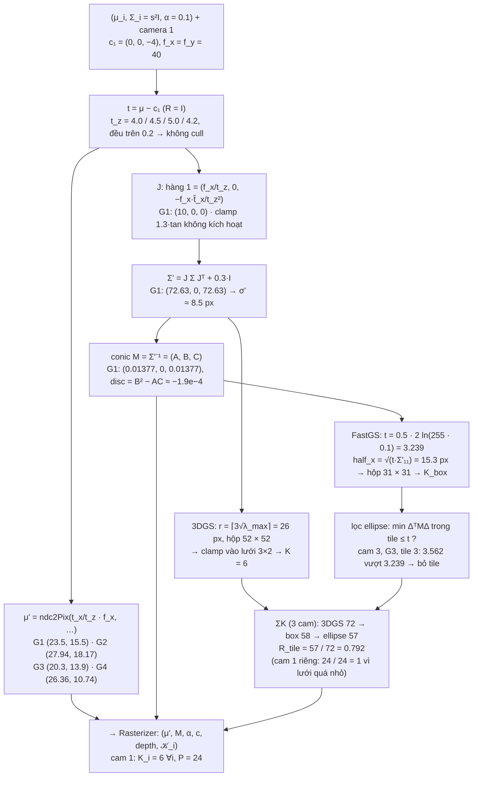
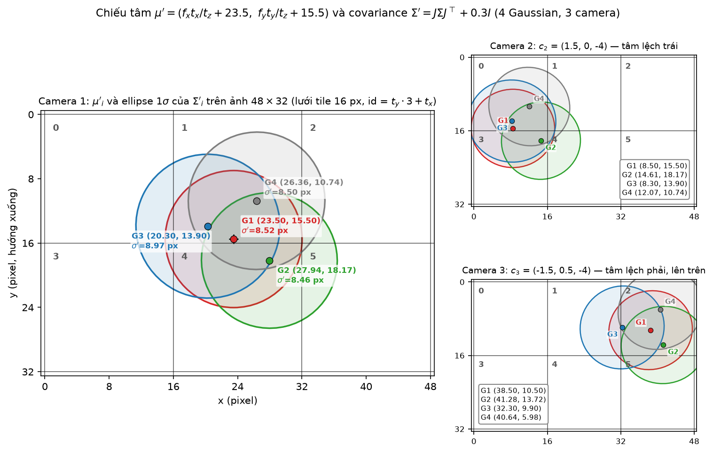
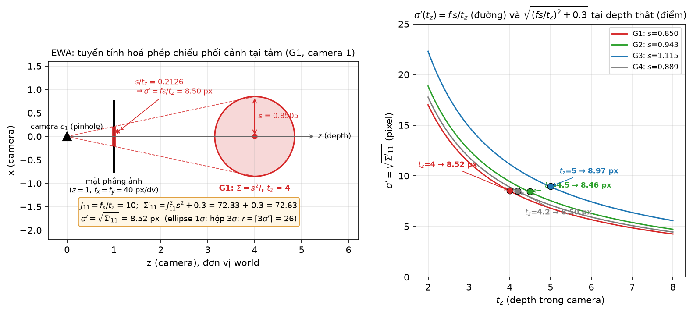
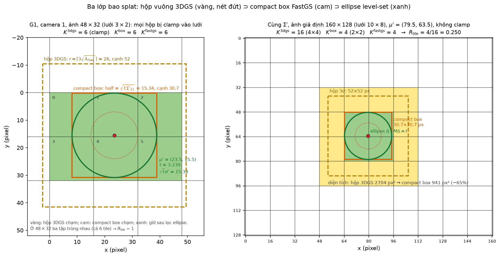
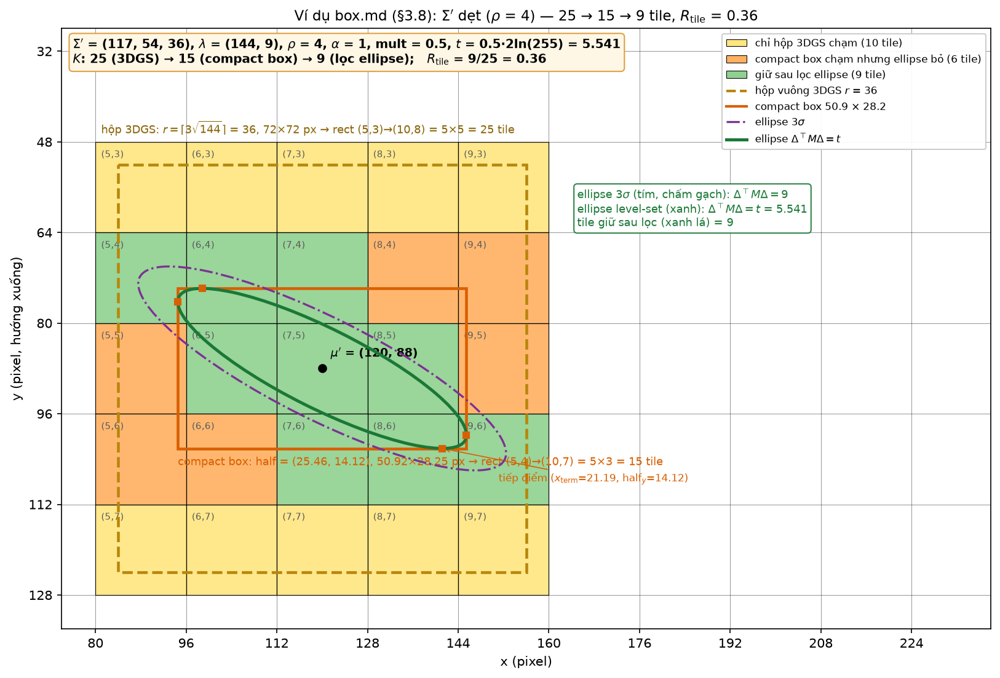
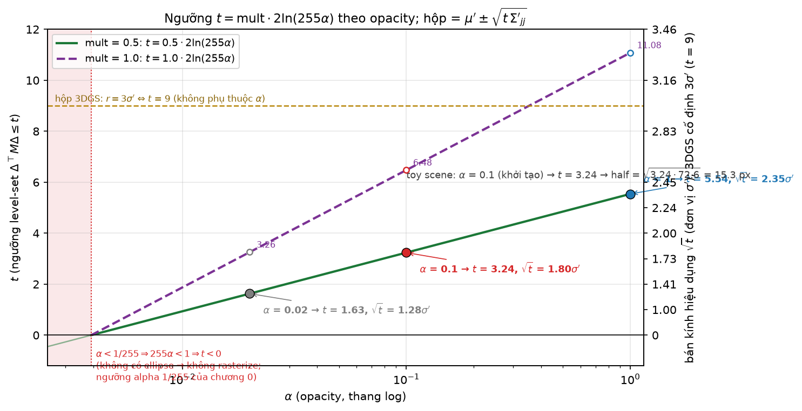
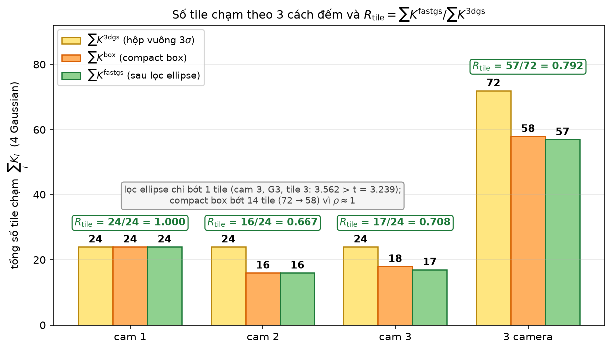

# Chương 3 — Test số: Camera + Projection trên cảnh đồ chơi

> Cảnh: [`00-scene.md`](00-scene.md). Script sinh số: [`scripts/ch03_test.py`](scripts/ch03_test.py) (chỉ numpy).
> Mọi số dưới đây là **output thật** của script (làm tròn 4 chữ số có nghĩa; script giữ full precision).
> Logic chép từ `forward.cu:79-118` (`computeCov2D`), `forward.cu:195-269` (`preprocessCUDA`),
> `auxiliary.h:45-48` (`ndc2Pix`), `:131-156` (`in_frustum`), `:159-174` (`computeEllipseIntersection`),
> `:177-291` (`processTiles`), `:294-362` (`duplicateToTilesTouched`), `utils/graphics_utils.py:51-71`, `scene/cameras.py:54-56`.
> `getRect` của 3DGS gốc (đã bị xoá khỏi `auxiliary.h` FastGS) được chép lại trong script để so sánh $K^{\text{3dgs}}$.

## Sơ đồ khối với số của cảnh đồ chơi (camera 1)

## Đầu vào của khối (tính lại chương 1, không chờ bot khác)

$\mu_i=p_i$, $s_i=\sqrt{\tfrac13\sum_{j\in\text{3-NN}}\lVert p_i-p_j\rVert^2}$, $q=(1,0,0,0)\Rightarrow R=I$, $\Sigma_i=s_i^2I_3$, $\alpha_i=0.1$, $c_i=c_k$ (SH bậc 0: $C_0k_{00}+0.5=c_k$).

| $i$ | $\mu_i$ | $d^2$ tới 3 láng giềng | $s_i^2=\text{mean}$ | $s_i$ |
|---|---|---|---|---|
| 1 | $(0,0,0)$ | $0.38,\ 0.59,\ 1.20$ | $0.7233$ | $0.8505$ |
| 2 | $(0.5,0.3,0.5)$ | $0.59,\ 0.77,\ 1.31$ | $0.8900$ | $0.9434$ |
| 3 | $(-0.4,-0.2,1.0)$ | $1.20,\ 1.22,\ 1.31$ | $1.2433$ | $1.1150$ |
| 4 | $(0.3,-0.5,0.2)$ | $0.38,\ 0.77,\ 1.22$ | $0.7900$ | $0.8888$ |

Vì $N_0=4$, 3-NN của mỗi điểm là 3 điểm còn lại nên $s_i^2$ chỉ là trung bình 3 khoảng cách bình phương.

## 3.1 — Đầu vào từ camera

**Công thức.** $f_x=W/(2\tan\tfrac{\text{fov}_x}2)$, $f_y=H/(2\tan\tfrac{\text{fov}_y}2)$; $P$ theo `getProjectionMatrix` với $z_n=0.01$, $z_f=100$.

**Thay số.** $f_x=48/(2\cdot0.6)=40$, $f_y=32/(2\cdot0.4)=40$. $\text{fov}_x=2\arctan0.6=1.0808$ rad, $\text{fov}_y=2\arctan0.4=0.7610$ rad (script gọi lại `tan(fov/2)` → $0.6,\ 0.4$ chính xác).

$$
P=\begin{pmatrix}1/0.6&0&0&0\\0&1/0.4&0&0\\0&0&\frac{100}{99.99}&\frac{-1}{99.99}\\0&0&1&0\end{pmatrix}
=\begin{pmatrix}1.6667&0&0&0\\0&2.5&0&0\\0&0&1.0001&-0.010001\\0&0&1&0\end{pmatrix}
$$

**Quy ước chiều nhân (đối chiếu code).** `scene/cameras.py:54-56` lưu `world_view_transform` $=W_v^\top$, `projection_matrix` $=P^\top$ và `full_proj_transform` $=W_v^\top P^\top=(PW_v)^\top$. Kernel (`transformPoint4x4`: `m[0]x+m[4]y+m[8]z+m[12]`) nhân **vector hàng**: $p^{\text{hom}}=[\mu,1]\cdot P_{\text{full}}$. Do đó $P_{\text{full}}=W_v\cdot P$ trong chương 3 phải hiểu là tích của hai ma trận **đã chuyển vị**; về mặt cột nó chính là $P\,W_v$. Script kiểm tra `np.allclose(full, (P @ W_v).T)` → `True`.

$W_v$ (quy ước cột, $R=I$, $t=\mu-c_v$):

| $v$ | $c_v$ | $W_v$ (3 hàng đầu; hàng 4 $=(0,0,0,1)$) | `world_view_transform` $=W_v^\top$ |
|---|---|---|---|
| 1 | $(0,0,-4)$ | $[\,I_3 \mid (0,0,4)^\top\,]$ | hàng 4 $=(0,0,4,1)$ |
| 2 | $(1.5,0,-4)$ | $[\,I_3 \mid (-1.5,0,4)^\top\,]$ | hàng 4 $=(-1.5,0,4,1)$ |
| 3 | $(-1.5,0.5,-4)$ | $[\,I_3 \mid (1.5,-0.5,4)^\top\,]$ | hàng 4 $=(1.5,-0.5,4,1)$ |

`full_proj_transform` camera 1 (đầy đủ):

$$
P_{\text{full}}^{(1)}=W_1^\top P^\top=\begin{pmatrix}
1.6667&0&0&0\\
0&2.5&0&0\\
0&0&1.0001&1\\
0&0&3.9904&4\end{pmatrix}
$$

($3.9904=4\cdot1.0001-0.010001$.) Camera 2, 3 chỉ khác **hàng 4**: cam 2 $=(-2.5,\ 0,\ 3.9904,\ 4)$, cam 3 $=(2.5,\ -1.25,\ 3.9904,\ 4)$; khối $3\times3$ trên-trái và cột 4 $=(0,0,1,4)^\top$ giống hệt camera 1.

## 3.2 — Cull theo frustum

**Công thức.** $t_i=[\mu_i,1]\cdot W_v^\top=\mu_i-c_v$; loại nếu $t_z\le0.2$.

| $i$ | cam 1 | cam 2 | cam 3 |
|---|---|---|---|
| 1 | $(0,\ 0,\ 4.0)$ | $(-1.5,\ 0,\ 4.0)$ | $(1.5,\ -0.5,\ 4.0)$ |
| 2 | $(0.5,\ 0.3,\ 4.5)$ | $(-1.0,\ 0.3,\ 4.5)$ | $(2.0,\ -0.2,\ 4.5)$ |
| 3 | $(-0.4,\ -0.2,\ 5.0)$ | $(-1.9,\ -0.2,\ 5.0)$ | $(1.1,\ -0.7,\ 5.0)$ |
| 4 | $(0.3,\ -0.5,\ 4.2)$ | $(-1.2,\ -0.5,\ 4.2)$ | $(1.8,\ -1.0,\ 4.2)$ |

$t_z\in\{4.0,4.5,5.0,4.2\}>0.2$ ở cả 12 cặp → **không cặp nào bị cull**. Depth dương → khoá sort `bit_cast` float→uint32 ở chương 4 hợp lệ.

## 3.3 — Chiếu tâm

**Công thức.** $p^{\text{hom}}=[\mu,1]\cdot P_{\text{full}}$, $p^{\text{proj}}=p^{\text{hom}}_{xyz}/(p^{\text{hom}}_w+10^{-7})$, $\mu'=\bigl(\tfrac{(p^{\text{proj}}_x+1)48-1}2,\ \tfrac{(p^{\text{proj}}_y+1)32-1}2\bigr)$.

**Thay số (cam 1, $i=2$).** $p^{\text{hom}}=(1.6667\cdot0.5,\ 2.5\cdot0.3,\ 1.0001\cdot0.5+3.9904,\ 0.5+4)=(0.8333,\ 0.75,\ 4.4905,\ 4.5)$; $p^{\text{proj}}=(0.18519,\ 0.16667,\ 0.99788)$; $\mu'=\bigl(\tfrac{1.18519\cdot48-1}2,\ \tfrac{1.16667\cdot32-1}2\bigr)=(27.944,\ 18.167)$.

Nhận xét: vì $R=I$, $p^{\text{hom}}_w=t_z$ và $p^{\text{proj}}_x=t_x/(0.6\,t_z)$, tức $\mu'_x=f_x\,t_x/t_z+23.5$, $\mu'_y=f_y\,t_y/t_z+15.5$.

| $i$ | cam 1 $\mu'$ | cam 2 $\mu'$ | cam 3 $\mu'$ |
|---|---|---|---|
| 1 | $(23.500,\ 15.500)$ | $(8.500,\ 15.500)$ | $(38.500,\ 10.500)$ |
| 2 | $(27.944,\ 18.167)$ | $(14.611,\ 18.167)$ | $(41.278,\ 13.722)$ |
| 3 | $(20.300,\ 13.900)$ | $(8.300,\ 13.900)$ | $(32.300,\ 9.900)$ |
| 4 | $(26.357,\ 10.738)$ | $(12.071,\ 10.738)$ | $(40.643,\ 5.976)$ |

Tâm ảnh là $(23.5,15.5)$ (pixel index 0..47 / 0..31); $p^{\text{proj}}_z\approx0.998$ ở mọi điểm (không dùng tiếp).

## 3.4 — Chiếu covariance (camera 1, từng Gaussian)

*Hình: mặt phẳng ảnh 48×32 với lưới tile 16 px (T0..T5); tâm μ'_i và ellipse 1σ của Σ'_i cho cả 3 camera — nhìn thấy cả 4 Gaussian phủ gần kín ảnh ngay từ camera 1.*

**Công thức.** $\hat t_x=\operatorname{clip}(t_x/t_z,\pm1.3\cdot0.6=\pm0.78)\cdot t_z$, $\hat t_y=\operatorname{clip}(t_y/t_z,\pm1.3\cdot0.4=\pm0.52)\cdot t_z$;

$$J=\begin{pmatrix}f_x/t_z&0&-f_x\hat t_x/t_z^2\\0&f_y/t_z&-f_y\hat t_y/t_z^2\\0&0&0\end{pmatrix},\qquad
\Sigma'_{3\times3}=JW\Sigma W^\top J^\top,\qquad \Sigma'=\Sigma'_{[:2,:2]}+0.3I.$$

Với $W=I$, $\Sigma=s^2I$: $\Sigma'_{11}=s^2(f_x^2/t_z^2+f_x^2\hat t_x^2/t_z^4)$, $\Sigma'_{12}=s^2f_xf_y\hat t_x\hat t_y/t_z^4$, $\Sigma'_{22}$ tương tự. Phần tử ngoài chéo **chỉ** đến từ $-f\hat t/t_z^2$.

Đối chiếu code: `glm::mat3 W(vm[0],vm[4],vm[8],…)` (column-major) $=W_v^{3\times3}$; `T = W*J` với `J` glm cũng column-major nên `cov = Tᵀ Vrkᵀ T` $=JW\Sigma W^\top J^\top$ đúng như công thức.

Kiểm tra clamp (cam 1): $|t_x/t_z|\le0.1111<0.78$, $|t_y/t_z|\le0.1190<0.52$ → **clamp không kích hoạt** với Gaussian nào (cả 3 camera: lớn nhất là cam 3, $G_2$: $t_x/t_z=0.4444<0.78$).

| $i$ | $t_x/t_z$ | $t_y/t_z$ | $f/t_z$ | $-f\hat t_x/t_z^2$ | $-f\hat t_y/t_z^2$ |
|---|---|---|---|---|---|
| 1 | $0$ | $0$ | $10$ | $0$ | $0$ |
| 2 | $0.1111$ | $0.0667$ | $8.8889$ | $-0.9877$ | $-0.5926$ |
| 3 | $-0.08$ | $-0.04$ | $8$ | $+0.64$ | $+0.32$ |
| 4 | $0.0714$ | $-0.1190$ | $9.5238$ | $-0.6803$ | $+1.1338$ |

**Thay số ($i=2$).** $\Sigma'_{11}=0.89\,(8.8889^2+0.9877^2)=0.89\cdot(79.012+0.9755)=71.189$; $\Sigma'_{12}=0.89\cdot(-0.9877)(-0.5926)=0.5209$; $\Sigma'_{22}=0.89\,(79.012+0.3512)=70.634$. Cộng $0.3$:

Ma trận đối xứng $2\times2$ viết gọn thành bộ ba $(\Sigma'_{11},\ \Sigma'_{12},\ \Sigma'_{22})$:

| $i$ | trước low-pass | sau $+0.3$ trên đường chéo |
|---|---|---|
| 1 | $(72.3333,\ 0,\ 72.3333)$ | $(72.6333,\ 0,\ 72.6333)$ |
| 2 | $(71.1891,\ 0.5209,\ 70.6335)$ | $(71.4891,\ 0.5209,\ 70.9335)$ |
| 3 | $(80.0826,\ 0.2546,\ 79.7007)$ | $(80.3826,\ 0.2546,\ 80.0007)$ |
| 4 | $(72.0209,\ -0.6093,\ 72.6709)$ | $(72.3209,\ -0.6093,\ 72.9709)$ |

Dấu của $\Sigma'_{12}$ = dấu của $\hat t_x\hat t_y$: $G_2$ ($+,+$) và $G_3$ ($-,-$) dương, $G_4$ ($+,-$) âm. $\sigma'\approx8.5$–$9$ px trên ảnh $48\times32$: splat khởi tạo phủ gần hết ảnh — hệ quả của $s\approx0.85$–$1.1$ với $f/t_z\approx8$–$10$.

## 3.5 — Conic

*Hình: bên trái Gaussian 3D G1 (bán kính s=0.85 tại độ sâu t_z=4); bên phải σ'=f·s/t_z tăng khi Gaussian ở gần camera hơn — 4 điểm thật của cảnh đồ chơi nằm trên đúng đường lý thuyết.*

**Công thức.** $\det=\Sigma'_{11}\Sigma'_{22}-\Sigma'^2_{12}$; $(A,B,C)=(\Sigma'_{22},-\Sigma'_{12},\Sigma'_{11})/\det$; $\text{disc}=B^2-AC=-1/\det$.

**Thay số ($i=2$).** $\det=71.4891\cdot70.9335-0.5209^2=5070.706$; $A=70.9335/5070.706=0.013989$; $B=-0.5209/5070.706=-0.000103$; $C=71.4891/5070.706=0.014098$; $\text{disc}=-1.97\times10^{-4}$.

| $i$ | $\det$ | $A$ | $B$ | $C$ | disc $=B^2-AC$ | $-1/\det$ |
|---|---|---|---|---|---|---|
| 1 | $5275.601$ | $0.013768$ | $0$ | $0.013768$ | $-1.895\times10^{-4}$ | $-1.895\times10^{-4}$ |
| 2 | $5070.706$ | $0.013989$ | $-0.000103$ | $0.014098$ | $-1.972\times10^{-4}$ | $-1.972\times10^{-4}$ |
| 3 | $6430.596$ | $0.012441$ | $-0.000040$ | $0.012500$ | $-1.555\times10^{-4}$ | $-1.555\times10^{-4}$ |
| 4 | $5276.948$ | $0.013828$ | $+0.000115$ | $0.013705$ | $-1.895\times10^{-4}$ | $-1.895\times10^{-4}$ |

$\text{disc}<0$ và $A,C>0$ ở cả 4 → `duplicateToTilesTouched` không trả 0 sớm (`auxiliary.h:308`).

## 3.6 — Bounding box

### 3DGS gốc (hộp vuông $3\sigma$)

**Công thức.** $\lambda_{\max,\min}=\text{mid}\pm\sqrt{\text{mid}^2-\det}$, $\text{mid}=\tfrac{\Sigma'_{11}+\Sigma'_{22}}2$; $r=\lceil3\sqrt{\lambda_{\max}}\rceil$; $\text{rect}_{\min}=\min(\text{grid},\max(0,\lfloor(\mu'-r)/16\rfloor))$, $\text{rect}_{\max}=\min(\text{grid},\max(0,\lfloor(\mu'+r+15)/16\rfloor))$, grid $=(3,2)$.

Lưu ý code: `sqrt(max(0.1f, mid*mid - det))` (`forward.cu:239-240`) — với $G_1$ đẳng hướng, $\text{mid}^2-\det=0$ nên code dùng $0.1$: $\lambda_1^{\text{code}}=72.9496$ thay vì $72.6333$; $r=\lceil25.62\rceil=26$ không đổi so với giá trị chính xác $\lceil25.57\rceil=26$.

**Thay số ($i=2$).** $\text{mid}=71.2113$, $\sqrt{\text{mid}^2-\det}=\sqrt{5071.05-5070.71}=0.5903$ → $\lambda_{\max}=71.8017$, $\lambda_{\min}=70.6210$, $\rho=\sqrt{\lambda_{\max}/\lambda_{\min}}=1.0083$, $r=\lceil3\cdot8.4736\rceil=\lceil25.42\rceil=26$. $x$: $\lfloor(27.944-26)/16\rfloor=0$, $\lfloor(27.944+26+15)/16\rfloor=\lfloor4.31\rfloor=4\to$ clamp $3$; $y$: $\lfloor(18.167-26)/16\rfloor=-1\to0$, $\lfloor(18.167+41)/16\rfloor=3\to$ clamp $2$. $K^{\text{3dgs}}=3\cdot2=6$.

| $i$ | $\lambda_{\max}$ | $\lambda_{\min}$ | $\rho$ | $r$ | $\text{rect}_{\min}$ | $\text{rect}_{\max}$ | $K^{\text{3dgs}}$ |
|---|---|---|---|---|---|---|---|
| 1 | $72.6333$ | $72.6333$ | $1.0000$ | $26$ | $(0,0)$ | $(3,2)$ | $6$ |
| 2 | $71.8017$ | $70.6210$ | $1.0083$ | $26$ | $(0,0)$ | $(3,2)$ | $6$ |
| 3 | $80.5099$ | $79.8733$ | $1.0040$ | $27$ | $(0,0)$ | $(3,2)$ | $6$ |
| 4 | $73.3364$ | $71.9553$ | $1.0096$ | $26$ | $(0,0)$ | $(3,2)$ | $6$ |

Hộp vuông cạnh $2r\ge52$ px lớn hơn cả ảnh $48\times32$ → clamp lưới nuốt toàn bộ, mọi Gaussian chạm **cả 6 tile** ở cả 3 camera (script: $\sum K^{\text{3dgs}}=24$ mỗi camera).

### FastGS-lite: compact box

*Hình: hộp vuông 3DGS (vàng, nét đứt) ⊃ compact box FastGS (cam) ⊃ ellipse level-set thật (xanh) cho G1/camera 1; subplot thứ hai dùng ảnh giả định lớn hơn để thấy rõ compact box nhỏ hơn hộp vuông khi không bị lưới tile bé "nuốt" mất khác biệt.*

**Công thức.** $t_i=\texttt{mult}\cdot2\ln(255\alpha_i)$; $\text{half}_x=\sqrt{t\,\Sigma'_{11}}$, $\text{half}_y=\sqrt{t\,\Sigma'_{22}}$; Box $=\mu'\pm\text{half}$; $\text{rect}_{\min}=\max(0,\min(\text{grid},\lfloor\text{bbox}_{\min}/16\rfloor))$, $\text{rect}_{\max}=\max(0,\min(\text{grid},\lfloor\text{bbox}_{\max}/16\rfloor+1))$; $K^{\text{box}}=x_{\text{span}}\cdot y_{\text{span}}$.

**Thay số.** $t=0.5\cdot2\ln(25.5)=\ln25.5=3.2387$ (bảng chương 3: $3.24$ ✓). $i=2$: $\text{half}_x=\sqrt{3.2387\cdot71.4891}=15.216$, $\text{half}_y=\sqrt{3.2387\cdot70.9335}=15.157$; Box $x\in[12.728,43.161]$, $y\in[3.010,33.324]$; $\text{rect}_{\min}=(0,0)$, $\text{rect}_{\max}=(\min(3,2+1),\min(2,2+1))=(3,2)$ → $K^{\text{box}}=6$.

Code tính bbox qua $x_{\text{term}},y_{\text{term}}$ và `computeEllipseIntersection` (`auxiliary.h:316-331`); script kiểm tra kết quả **trùng** với $\mu'\pm\text{half}$ (ví dụ $i=2$: `bbox_min=(12.7283, 3.0098)`, `bbox_max=(43.1606, 33.3235)`). $x_{\text{term}}=-\tfrac BA\text{half}_y$: $i=2$: $0.1113$; $i=4$: $-0.1284$ (dấu theo $B$).

Camera 1:

| $i$ | $\text{half}_x$ | $\text{half}_y$ | Box $x$ | Box $y$ | $\text{rect}$ | $K^{\text{box}}$ |
|---|---|---|---|---|---|---|
| 1 | $15.337$ | $15.337$ | $[8.163,\ 38.837]$ | $[0.163,\ 30.837]$ | $(0,0)\to(3,2)$ | $6$ |
| 2 | $15.216$ | $15.157$ | $[12.728,\ 43.161]$ | $[3.010,\ 33.324]$ | $(0,0)\to(3,2)$ | $6$ |
| 3 | $16.135$ | $16.096$ | $[4.165,\ 36.435]$ | $[-2.197,\ 29.997]$ | $(0,0)\to(3,2)$ | $6$ |
| 4 | $15.304$ | $15.373$ | $[11.053,\ 41.662]$ | $[-4.635,\ 26.111]$ | $(0,0)\to(3,2)$ | $6$ |

Ở camera 1 hộp compact ($\approx30\times30$ px, nhỏ hơn hộp $3\sigma$ $52\times52$ tới $-67\%$ diện tích) vẫn chạm cả 6 tile vì tâm ở gần giữa ảnh và $\text{half}\approx15$–$16>$ nửa tile. Ở camera 2, 3 tâm lệch sang một cột tile nên box **chỉ chạm 2 cột** — xem 3.7.

## 3.7 — Lọc tile theo ellipse (AccuTile)

**Công thức.** $T\in\mathcal K_i\iff\min_{\Delta\in T}\Delta^\top M_i\Delta\le t_i$. Code (`processTiles`) quét theo trục có span ngắn hơn (`isY = y_span < x_span`), mỗi lát $[u_0,u_0+16)$:

$$v_\pm(u)=\frac{-Bh\pm\sqrt{\text{disc}\,h^2+t\,k}}{k}+\mu'_v,\qquad h=u-\mu'_u,\qquad k=\begin{cases}A&\text{isY (cắt } y=u\text{, ra }x)\\C&\text{cắt }x=u\text{, ra }y\end{cases}$$

$\text{ellipse}_{\min/\max}$ = biên hộp nếu điểm cực trị rơi vào lát, ngược lại $\min/\max$ tại hai biên lát; tile $v\in[\lfloor\text{ellipse}_{\min}/16\rfloor,\ \lfloor\text{ellipse}_{\max}/16\rfloor+1)$ kẹp vào rect.

Script cài **cả hai**: (a) `processTiles` chép nguyên văn, (b) kiểm tra chính xác $\min_{\Delta\in T}\Delta^\top M\Delta$ (hàm lồi trên hình chữ nhật: $=0$ nếu $\mu'\in T$, ngược lại min 1-D trên 4 cạnh với $\Delta^\ast=-B\Delta_v/A$ kẹp vào cạnh). **Hai cách cho cùng tập tile ở cả 12 cặp (cam, $i$).**

**Camera 1 ($x_{\text{span}}=3\gt y_{\text{span}}=2$ → isY, quét 2 lát ngang, $k=A$).** Thay số $i=2$, lát $u=0$: $[0,16)$. $\text{argmin}_y=18.056,\ \text{argmax}_y=18.278\notin[0,16)$ → dùng giao tại $y=0$ và $y=16$. Tại $y=16$: $h=16-18.167=-2.167$, $\sqrt{\text{disc}\,h^2+tA}=\sqrt{-1.972\times10^{-4}\cdot4.694+3.2387\cdot0.013989}=\sqrt{0.044384}=0.21068$; $x_\pm=\tfrac{0.000103\cdot(-2.167)\pm0.21068}{0.013989}+27.944=\{12.869,\ 42.988\}$. Đường $y=0$ **không** được giải: $\text{bbox}_{\min,y}=3.01>0=$ `min_line` nên code đặt `intersect_min_line = intersect_max_line` khởi tạo $=(\text{bbox}_{\max,x},\text{bbox}_{\min,x})=(43.16,12.73)$ (`auxiliary.h:214-226`; nếu giải thì $h=-18.167$, $\text{disc}\,h^2+tA=-0.0651+0.0453<0$, căn âm — đường không cắt ellipse). Vậy $\text{ellipse}_{\min}=\min(43.16,12.869)=12.869$, $\text{ellipse}_{\max}=\max(12.73,42.988)=42.988$ → cột $\lfloor0.804\rfloor=0$ đến $\lfloor2.687\rfloor+1=3$ → **3 tile**. Lát $u=1$: $[16,32)$ chứa argmin/argmax → lấy thẳng biên hộp $[12.728,43.161]$ → 3 tile. $K^{\text{fastgs}}_2=6$.

| $i$ | lát $u=0$: $[\text{ell}_{\min},\text{ell}_{\max}]$ → tile | lát $u=1$ | $\mathcal K_i$ (id $=t_y\cdot3+t_x$) | $K^{\text{fastgs}}$ | $\min_T\Delta^\top M\Delta$ (tile 0..5) |
|---|---|---|---|---|---|
| 1 | $[8.163,38.837]$ → 3 | $[8.171,38.829]$ → 3 | $\{0,1,2,3,4,5\}$ | $6$ | $0.774,\ 0,\ 0.995,\ 0.778,\ 0.003,\ 0.998$ |
| 2 | $[12.869,42.988]$ → 3 | $[12.728,43.161]$ → 3 | $\{0,1,2,3,4,5\}$ | $6$ | $2.057,\ 0.066,\ 0.298,\ 1.996,\ 0,\ 0.230$ |
| 3 | $[4.165,36.435]$ → 3 | $[4.310,36.304]$ → 3 | $\{0,1,2,3,4,5\}$ | $6$ | $0.230,\ 0,\ 1.703,\ 0.286,\ 0.055,\ 1.756$ |
| 4 | $[11.053,41.662]$ → 3 | $[11.934,40.693]$ → 3 | $\{0,1,2,3,4,5\}$ | $6$ | $1.483,\ 0,\ 0.440,\ 1.850,\ 0.379,\ 0.827$ |

Mọi $\min_T\le t=3.239$ → 6/6 tile giữ, khớp `processTiles`. Ở camera 1 lọc ellipse không bớt được tile nào (ellipse quá lớn so với ảnh).

**Camera 2, 3 (gọn).** Ở đây $\text{rect}$ chỉ còn 2 cột nên $x_{\text{span}}=y_{\text{span}}=2$ → `isY = False`, quét theo **lát dọc** ($k=C$).

| cam | $i$ | $\mu'$ | $\Sigma'_{11},\Sigma'_{12},\Sigma'_{22}$ | $(A,B,C)$ | $r$ | $K^{\text{3dgs}}$ | $\text{half}_x,\text{half}_y$ | $K^{\text{box}}$ | $\mathcal K_i$ | $K^{\text{fastgs}}$ |
|---|---|---|---|---|---|---|---|---|---|---|
| 2 | 1 | $(8.50,15.50)$ | $82.805,\ 0,\ 72.633$ | $(0.01208,\ 0,\ 0.01377)$ | 28 | 6 | $16.38,\ 15.34$ | 4 | $\{0,1,3,4\}$ | 4 |
| 2 | 2 | $(14.61,18.17)$ | $74.094,\ -1.042,\ 70.934$ | $(0.01350,\ 0.00020,\ 0.01410)$ | 26 | 6 | $15.49,\ 15.16$ | 4 | $\{0,1,3,4\}$ | 4 |
| 2 | 3 | $(8.30,13.90)$ | $91.364,\ 1.210,\ 80.001$ | $(0.01095,\ -0.00017,\ 0.01250)$ | 29 | 6 | $17.20,\ 16.10$ | 4 | $\{0,1,3,4\}$ | 4 |
| 2 | 4 | $(12.07,10.74)$ | $77.805,\ 2.437,\ 72.971$ | $(0.01287,\ -0.00043,\ 0.01372)$ | 27 | 6 | $15.87,\ 15.37$ | 4 | $\{0,1,3,4\}$ | 4 |
| 3 | 1 | $(38.50,10.50)$ | $82.805,\ -3.391,\ 73.764$ | $(0.01210,\ 0.00056,\ 0.01358)$ | 28 | 6 | $16.38,\ 15.46$ | 4 | $\{1,2,4,5\}$ | 4 |
| 3 | 2 | $(41.28,13.72)$ | $84.512,\ -1.389,\ 70.760$ | $(0.01184,\ 0.00023,\ 0.01414)$ | 28 | 6 | $16.54,\ 15.14$ | 4 | $\{1,2,4,5\}$ | 4 |
| 3 | 3 | $(32.30,9.90)$ | $83.725,\ -2.451,\ 81.433$ | $(0.01195,\ 0.00036,\ 0.01229)$ | 28 | 6 | $16.47,\ 16.24$ | 6 | $\{0,1,2,4,5\}$ | **5** |
| 3 | 4 | $(40.64,5.98)$ | $85.117,\ -7.312,\ 76.017$ | $(0.01185,\ 0.00114,\ 0.01326)$ | 29 | 6 | $16.60,\ 15.69$ | 4 | $\{1,2,4,5\}$ | 4 |

(Ở cam 2, $G_1$: Box $x\in[-7.876,24.876]$ → cột $0,1$; cam 3 $G_1$: Box $x\in[22.124,54.876]$ → cột $1,2$.)

**Trường hợp duy nhất lọc ellipse có tác dụng: cam 3, $G_3$.** Box $x\in[15.833,48.767]$, $y\in[-6.340,26.140]$ → rect $(0,0)\to(3,2)$, $K^{\text{box}}=6$, isY (quét ngang, $k=A=0.011950$, $t=3.2387$, $\text{disc}=-1.468\times10^{-4}$):

- lát $u=0$ $[0,16)$: chứa $\text{argmax}_y=9.418$ và $\text{argmin}_y=10.382$ → lấy biên hộp $[15.833,48.767]$ → cột $0..2$, 3 tile.
- lát $u=1$ $[16,32)$: giao tại $y=16$: $h=6.1$, $\sqrt{-1.468\times10^{-4}\cdot37.21+3.2387\cdot0.011950}=\sqrt{0.033241}=0.18232$, $x_\pm=\tfrac{-0.00036\cdot6.1\pm0.18232}{0.011950}+32.3=\{16.862,\ 47.371\}$; giao tại $y=32$ không được giải vì `max_line = 32 > bbox_max.y = 26.14` (`auxiliary.h:235`), nên `intersect_max_line` **giữ nguyên** giá trị giao tại $y=16$; `intersect_min_line` (chuyển từ lát trước, `:287`) cũng là giao tại $y=16$. Do đó $\text{ellipse}_{\min}=16.862$, $\text{ellipse}_{\max}=47.371$ → cột $\lfloor1.054\rfloor=1$ đến $\lfloor2.961\rfloor+1=3$ → **2 tile** (loại tile 3 = $(t_x{=}0,t_y{=}1)$).

Kiểm tra chính xác: $\min_{T_3}\Delta^\top M\Delta=3.562>3.239$ → loại ✓; tile 0: $3.173\le3.239$ → giữ (sát ngưỡng). $K^{\text{fastgs}}_3=5$.

**Tổng hợp.**

| | $\sum K^{\text{3dgs}}$ | $\sum K^{\text{box}}$ | $\sum K^{\text{fastgs}}$ | $R_{\text{tile}}=\sum K^{\text{fastgs}}/\sum K^{\text{3dgs}}$ |
|---|---|---|---|---|
| cam 1 | 24 | 24 | 24 | $\mathbf{1.000}$ |
| cam 2 | 24 | 16 | 16 | $\mathbf{0.667}$ |
| cam 3 | 24 | 18 | 17 | $\mathbf{0.708}$ |
| 3 camera | 72 | 58 | 57 | $\mathbf{0.792}$ |

Nhận xét: trên cảnh đồ chơi, toàn bộ lợi ích đến từ **compact box** (72→58) chứ gần như không từ lọc ellipse (58→57), vì $\rho\approx1$ (Gaussian đẳng hướng, $R=I$, $\Sigma'_{12}$ nhỏ) — ellipse gần tròn thì hộp theo trục đã sát. Lọc ellipse chỉ có lợi khi $\rho\gg1$ như ví dụ 3.8. Camera 1 cho $R_{\text{tile}}=1$ vì ảnh chỉ có 6 tile và splat $\sigma'\approx8.5$ px phủ toàn ảnh — đây là giới hạn lượng tử hoá lưới (số hạng "+1") ở dạng cực đoan.

## 3.8 — Kiểm chứng ví dụ `box.md` bằng cùng code

*Hình: cùng code cho ra đúng chuỗi 25 (hộp vuông) → 15 (compact box) → 9 (sau lọc ellipse) tile, R_tile = 9/25 = 0.36.*

*Hình: t giảm khi α nhỏ (splat mờ → hộp nhỏ); đánh dấu 3 điểm dùng trong báo cáo (α=0.1 → t=3.24, α=1 → t=5.54, α=0.02 → t=1.63) và mult=0.5 vs 1.0.*

Đầu vào: $\Sigma'_{11}=117,~\Sigma'_{12}=54,~\Sigma'_{22}=36$, $\mu'=(120,88)$, $\alpha=1$, `mult` $=0.5$, lưới $20\times20$ tile (đủ lớn, không clamp). Output script:

| Bước | Script | Kỳ vọng (§3.8) | Khớp |
|---|---|---|---|
| $\det$ | $1296$ | | |
| $(A,B,C)$ | $(0.027778,-0.041667,0.090278)$ | $(1/36,-1/24,13/144)$ | ✓ (`allclose`) |
| $\lambda_{\max},\lambda_{\min},\rho$ | $144,\ 9,\ 4$ | $144,\ 9,\ 4$ | ✓ |
| $t$ | $5.5413$ | $5.541$ | ✓ |
| $\text{half}_x,\text{half}_y$ | $25.462,\ 14.124$ | $25.46,\ 14.12$ | ✓ |
| $r$, rect 3DGS | $36$, $(5,3)\to(10,8)$ | | |
| $K^{\text{3dgs}}$ | $25$ | $25$ | ✓ |
| bbox | $[94.538,145.462]\times[73.876,102.124]$, rect $(5,4)\to(10,7)$ | | |
| $K^{\text{box}}$ | $15$ | $15$ | ✓ |
| isY; lát $u=4,5,6$ | $[94.54,119.64]$→3, $[96.36,143.64]$→3, $[120.36,145.46]$→3 | $3+3+3$ | ✓ |
| $K^{\text{fastgs}}$ | $9$ | $9$ | ✓ |
| $R_{\text{tile}}$ | $0.360$ | $0.360$ | ✓ |

Tập tile `processTiles` $=\{85,86,87,106,107,108,127,128,129\}$ (id $=t_y\cdot20+t_x$: hàng 4 cột 5–7, hàng 5 cột 6–8, hàng 6 cột 7–9) **trùng** với tập tile theo kiểm tra chính xác $\min_T\Delta^\top M\Delta\le t$. Không có chênh lệch nào so với §3.8 / `box.md`.

## 3.9 — Màu từ SH

$K_i>0$ ở cả 12 cặp → bước SH được thực hiện. Chỉ có bậc 0 nên $c_i=C_0k_{i,00}+0.5=c_k$ (không phụ thuộc hướng nhìn): $c_1=(0.8,0.2,0.2)$, $c_2=(0.2,0.7,0.3)$, $c_3=(0.1,0.3,0.9)$, $c_4=(0.5,0.5,0.5)$.

## 3.10 — Đầu ra của khối (camera 1, đi vào chương 4)

*Hình: số tile ΣK giảm dần qua 3 bước lọc (3DGS → compact box → ellipse) cho từng camera; R_tile tổng trên 3 camera = 57/72 = 0.792, cao hơn ví dụ box.md vì lưới 3×2 tile của cảnh đồ chơi quá nhỏ so với splat.*

| $i$ | $\mu'_i$ (px) | $A$ | $B$ | $C$ | $\alpha_i$ | $c_i$ | depth $=t_z$ | $\mathcal K_i$ (id $=t_y\cdot3+t_x$) | $K_i$ |
|---|---|---|---|---|---|---|---|---|---|
| 1 | $(23.5000,\ 15.5000)$ | $0.013768$ | $0$ | $0.013768$ | $0.1$ | $(0.8,0.2,0.2)$ | $4.0$ | $\{0,1,2,3,4,5\}$ | 6 |
| 2 | $(27.9444,\ 18.1667)$ | $0.013989$ | $-0.000103$ | $0.014098$ | $0.1$ | $(0.2,0.7,0.3)$ | $4.5$ | $\{0,1,2,3,4,5\}$ | 6 |
| 3 | $(20.3000,\ 13.9000)$ | $0.012441$ | $-0.000040$ | $0.012500$ | $0.1$ | $(0.1,0.3,0.9)$ | $5.0$ | $\{0,1,2,3,4,5\}$ | 6 |
| 4 | $(26.3571,\ 10.7381)$ | $0.013828$ | $+0.000115$ | $0.013705$ | $0.1$ | $(0.5,0.5,0.5)$ | $4.2$ | $\{0,1,2,3,4,5\}$ | 6 |

$$P=\sum_iK_i=\mathbf{24}\qquad(\text{camera 1; camera 2: }16,\ \text{camera 3: }17)$$

Thứ tự depth tăng dần (dùng cho sort chương 4): $G_1\ (4.0)\lt G_4\ (4.2)\lt G_2\ (4.5)\lt G_3\ (5.0)$ — giống nhau ở cả 3 camera vì các camera chỉ tịnh tiến theo $x,y$.
Cũng lưu vào `radii[]` cho ngưỡng prune: $r=(26,26,27,26)$ px (cam 1).
