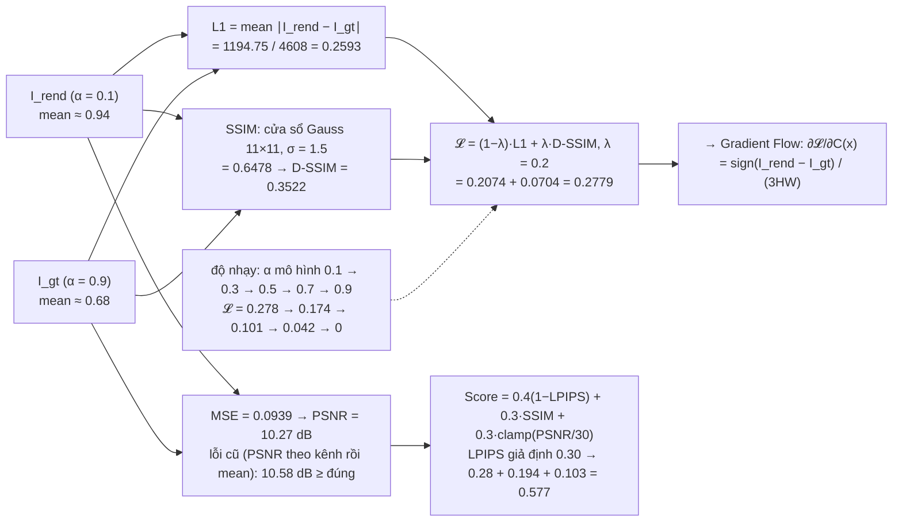
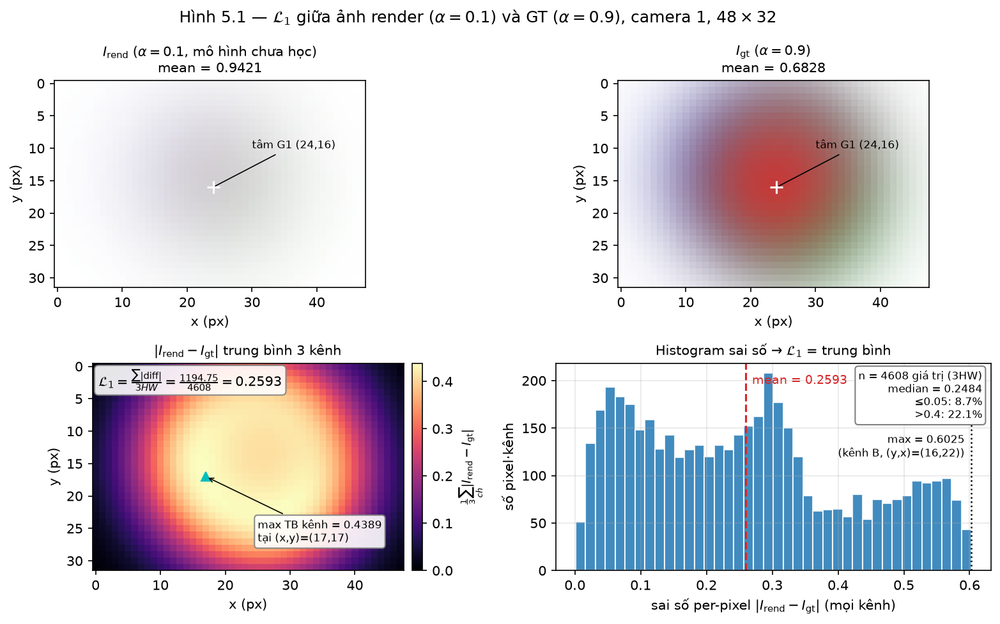
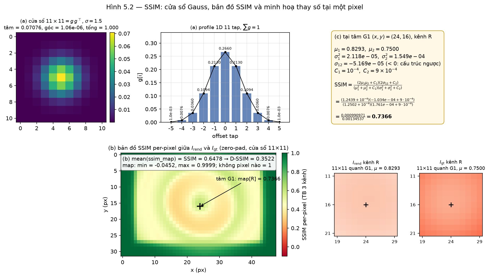
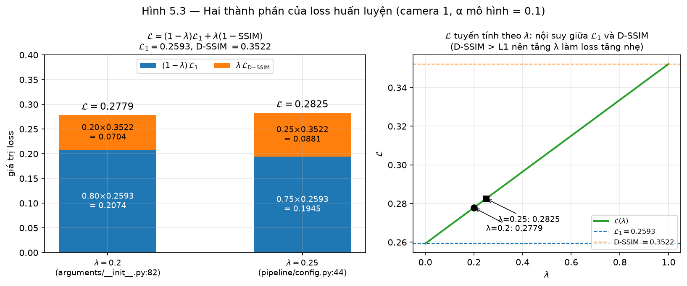
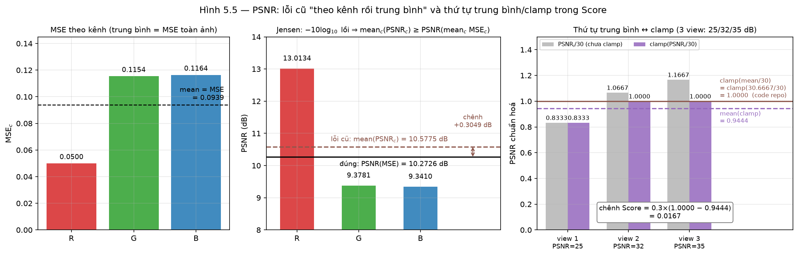
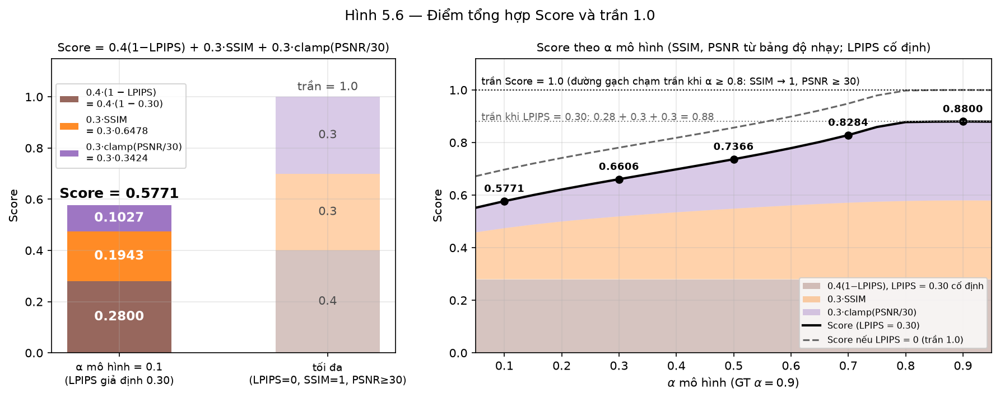
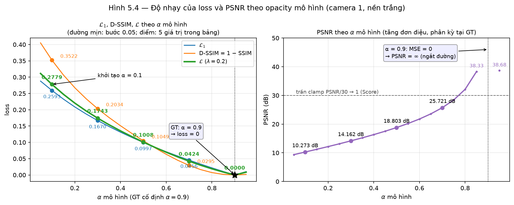

# Bài test số chương 5 — Image → Loss và Metrics

> Cảnh đồ chơi chung: `00-scene.md` (4 điểm SfM, 3 camera, ảnh $48\times32$, $f_x=f_y=40$).
> Script sinh số: `scripts/ch05_test.py` (chỉ `numpy` + `scipy.signal.convolve2d`). Mọi số dưới đây là **output thật** của script.
> Công thức đối chiếu: `train.py:100-103`, `utils/loss_utils.py`, `utils/image_utils.py`, `pipeline/score.py`.

## Sơ đồ khối với số của cảnh đồ chơi (camera 1)



## Đầu vào của khối

Chương 5 nhận $I_{\text{rend}}$ từ chương 4 và $I_{\text{gt}}$ từ dữ liệu. Vì các chương chạy song song, script **cài lại một renderer numpy tối giản** (lấy từ chương 1/3/4, chỉ đủ để sinh ảnh):

| Bước | Công thức (chương gốc) | Giá trị trên cảnh đồ chơi |
|---|---|---|
| Khởi tạo (ch.1) | $\mu=p_k$, $s_k=\sqrt{\text{mean}\,d^2_{3\text{-NN}}}$, $R=I$, $\Sigma=s^2I$, màu $=c_k$ | $s=(0.8505,\ 0.9434,\ 1.1150,\ 0.8888)$ |
| Chiếu tâm (ch.3.3) | $t=\mu-c_1$, $\mu'=\bigl(\tfrac{(t_x/(t_z\tan)+1)W-1}{2},\dots\bigr)$ | G1 $(23.5,15.5)$, G2 $(27.94,18.17)$, G3 $(20.3,13.9)$, G4 $(26.36,10.74)$ |
| Covariance (ch.3.4–3.5) | clamp $1.3\tan$, $\Sigma'=J\Sigma J^\top+0.3I$, $M=\Sigma'^{-1}$ | G1: $(A,B,C)=(0.01377,\,0,\,0.01377)$ (σ' ≈ 8.5 px) |
| Depth (ch.4.3) | sort $t_z$ tăng dần | $4.0,\ 4.2,\ 4.5,\ 5.0$ → thứ tự G1, G4, G2, G3 |
| Blend (ch.4.4–4.5) | 3 cửa loại power$>0$, $\alpha<1/255$, $T<10^{-4}$; $C=\sum c\alpha T+T_{\text{final}}C_{bg}$ | nền trắng, không lọc tile |

Ghi chú: ảnh $48\times32$ nhỏ, nên duyệt mọi Gaussian tại mọi pixel — tile chỉ là cách chia việc, không đổi toán học. Ba splat nằm rất gần tâm ảnh và rộng ~8 px nên **phủ gần hết khung**.

**GT** (định nghĩa trong `00-scene.md`): cùng cảnh, $\alpha=0.9$. **Mô hình chưa học**: $\alpha=0.1$.

| Ảnh | min | max | mean | $T_{\text{final}}$ min / mean | pixel nền thuần ($T=1$) |
|---|---|---|---|---|---|
| $I_{\text{rend}}$ ($\alpha=0.1$) | 0.8128 | 1 | 0.9421 | 0.6858 / 0.8979 | 42 / 1536 |
| $I_{\text{gt}}$ ($\alpha=0.9$) | 0.2290 | 0.9989 | 0.6828 | 0.001071 / 0.4449 | 0 / 1536 |

Tại pixel tâm G1 $(x,y)=(24,16)$: $I_{\text{rend}}=(0.8258,0.8155,0.8273)$, $I_{\text{gt}}=(0.7608,0.2351,0.2290)$ — mô hình mờ ($\alpha=0.1$) nên gần trắng; GT đục nên đỏ đậm.

## 5.1 — Loss huấn luyện

### $\mathcal L_1$ (`loss_utils.py:20`: `torch.abs(a-b).mean()` — mean trên $3HW$)



*Hình: I_rend, I_gt, |I_rend−I_gt| và histogram sai số theo pixel — L1 = 1194.75 / 4608 = 0.2593.*


$$
\mathcal L_1=\frac{1}{3HW}\sum_{x,\text{ch}}|I_{\text{rend}}-I_{\text{gt}}|
=\frac{1194.75}{4608}=\mathbf{0.259278}
$$

Sai số lớn nhất $0.6025$ tại kênh B, pixel $(y,x)=(16,22)$ (gần tâm G1, nơi GT đỏ đậm nhất).

### SSIM (`loss_utils.py:26-66`, cài lại từng dòng)



*Hình: cửa sổ Gauss 11×11 σ=1.5 dùng trong SSIM; bản đồ SSIM per-pixel (mean 0.6478); minh hoạ thay số tại tâm G1 kênh R (μ1=0.8293, μ2=0.75 → SSIM=0.7366).*


Cửa sổ 1D 11 tap, $\sigma=1.5$, chuẩn hoá:

$$
g=(0.001028,\ 0.007599,\ 0.036001,\ 0.109361,\ 0.213006,\ \mathbf{0.266012},\ 0.213006,\ 0.109361,\ 0.036001,\ 0.007599,\ 0.001028),\quad \sum g=1
$$

Cửa sổ 2D $=gg^\top$: tâm $0.07076$, góc $1.058\times10^{-6}$, tổng $=1$. `F.conv2d(padding=5, groups=3)` ⇔ `convolve2d(mode='same', fillvalue=0)` từng kênh (cửa sổ đối xứng nên tương quan chéo = tích chập).

Minh hoạ tại pixel tâm G1, kênh R:

| $\mu_1$ | $\mu_2$ | $\sigma_1^2$ | $\sigma_2^2$ | $\sigma_{12}$ |
|---|---|---|---|---|
| 0.829293 | 0.749956 | $2.118\times10^{-5}$ | $1.549\times10^{-4}$ | $-5.169\times10^{-5}$ |

$$
\text{ssim\_map}=\frac{(2\mu_1\mu_2+C_1)(2\sigma_{12}+C_2)}{(\mu_1^2+\mu_2^2+C_1)(\sigma_1^2+\sigma_2^2+C_2)}
=\frac{0.000990971}{0.00134537}=0.73658
$$

($C_1=10^{-4}$, $C_2=9\times10^{-4}$; $\sigma_{12}<0$ vì quanh tâm G1 ảnh render sáng dần ra ngoài còn GT tối dần — cấu trúc ngược nhau.)
Toàn bản đồ: min $-0.04517$, max $0.9999$; không pixel nào $=1$ vì GT không có vùng nền thuần.

$$
\text{SSIM}=\text{mean}(\text{ssim\_map})=\mathbf{0.647773},\qquad
\mathcal L_{\text{D-SSIM}}=1-0.647773=\mathbf{0.352227}
$$

### Loss (`train.py:102`)



*Hình: (1−λ)·L1 = 0.2074 và λ·D-SSIM = 0.0704 cộng thành 𝓛 = 0.2779 (λ=0.2), so với λ=0.25.*


$$
\mathcal L=(1-\lambda)\mathcal L_1+\lambda\,\mathcal L_{\text{D-SSIM}}
$$

| $\lambda$ | Thay số | $\mathcal L$ |
|---|---|---|
| $0.2$ (`arguments/__init__.py:82`) | $0.8\cdot0.259278+0.2\cdot0.352227=0.207422+0.070445$ | $\mathbf{0.277867}$ |
| $0.25$ (`pipeline/config.py:44`) | $0.75\cdot0.259278+0.25\cdot0.352227=0.194458+0.088057$ | $\mathbf{0.282515}$ |

Số hạng D-SSIM lớn hơn L1 (0.352 so với 0.259) nên tăng $\lambda$ làm loss tăng nhẹ.

## 5.2 — Không có loss nào khác

Script chỉ có hai số hạng trên; không mask/pose/depth loss. Kiểm chứng: `train.py:100-103` chỉ gọi `l1_loss` và `fast_ssim`.

## 5.3 — Nền ngẫu nhiên

`np.random.RandomState(0).rand(3)` → $C_{bg}=(0.548814,\ 0.715189,\ 0.602763)$. Render lại $I_{\text{rend}}$ ($\alpha=0.1$) với nền này; GT **giữ nền trắng**.

Kiểm chứng số hạng chương 4.5: $I^{bg}_{\text{rend}}-I_{\text{rend}}=T_{\text{final}}\,(C_{bg}-\mathbf 1)$, sai số lớn nhất $1.7\times10^{-16}$ (chính xác máy).

| Nền | $\mathcal L_1$ | SSIM | $\mathcal L$ ($\lambda=0.2$) |
|---|---|---|---|
| trắng | 0.259278 | 0.647773 | 0.277867 |
| ngẫu nhiên seed 0 | 0.194567 | 0.581953 | 0.239263 |

**Lưu ý trung thực:** trên cảnh đồ chơi, $\mathcal L_1$ *giảm* ($-0.0647$) chứ không tăng. Lý do: GT ($\alpha=0.9$, mean $0.683$) tối hơn nền trắng, còn mô hình ($\alpha=0.1$) gần trắng; nền tối tình cờ kéo ảnh render lại gần GT. Đây là hiện tượng của cảnh 4 Gaussian phủ kín khung, không phải bản chất của số hạng phạt. Số hạng phạt $T_{\text{final}}C_{bg}$ thể hiện đúng nghĩa ở:

1. **42 pixel nền thuần** ($T_{\text{final}}=1$): sai số từ $0$ lên $|C_{bg}-\mathbf 1|=(0.4512,0.2848,0.3972)$, tổng $1.133$/pixel → $47.60$ trong tổng $|{\rm diff}|$ (đo được $44.90$ vì $I_{gt}$ ở đó không trắng tuyệt đối: $T^{gt}_{\text{final}}<1$).
2. **Kỳ vọng theo $C_{bg}\sim\mathcal U[0,1]$**: $\mathbb E|C_{bg}-1|=0.5$/kênh → sai số kỳ vọng tại pixel nền $=0.5\,T_{\text{final}}$. Mô hình $\alpha=0.1$ có $\bar T_{\text{final}}=0.898$ → phạt kỳ vọng $0.449$/kênh/pixel; GT $\alpha=0.9$ có $\bar T=0.445$ → $0.222$. **Phạt tỉ lệ thuận với $T_{\text{final}}$**: Gaussian phải đục hẳn ($T\to0$) hoặc biến mất — đúng phát biểu chương 5.3.
3. Biến thiên theo seed (GT cố định): $\mathcal L_1=0.1946,\ 0.3701,\ 0.3699,\ 0.2474,\ 0.2141$ cho seed 0–4 — nền ngẫu nhiên thêm nhiễu vào loss, gradient chỉ triệt tiêu được nhiễu này khi $T_{\text{final}}\to0$.

Tại tâm G1: $T_{\text{final}}=0.689$, $I_{\text{rend}}=(0.826,0.815,0.827)\to I^{bg}_{\text{rend}}=(0.515,0.619,0.554)$.

## 5.4 — Metrics chấm điểm

### MSE, PSNR (`image_utils.py:21-26`, bản đã sửa batch dim)

$$
\text{MSE}=\frac{432.763}{4608}=0.0939156,\qquad
\text{PSNR}=20\log_{10}\frac{1}{\sqrt{0.0939156}}=\mathbf{10.2726\ \text{dB}}
$$

### PSNR "lỗi cũ" (`view(shape[0]=3,-1)` → 3 PSNR theo kênh rồi trung bình)



*Hình: MSE và PSNR theo từng kênh so với PSNR đúng trên cả 3 kênh (10.27 dB thật vs 10.58 dB "lỗi cũ", luôn cao hơn — bất đẳng thức Jensen); subplot thứ tự trung bình PSNR minh hoạ chênh lệch clamp(mean) vs mean(clamp).*


| Kênh | MSE$_c$ | PSNR$_c$ |
|---|---|---|
| R | 0.049965 | 13.0134 |
| G | 0.115396 | 9.3781 |
| B | 0.116386 | 9.3410 |
| **mean** | 0.0939156 (= MSE) | **10.5775** |

$10.5775\ge10.2726$ (chênh $+0.3049$ dB). Đúng Jensen: $-10\log_{10}$ là hàm lồi nên $\text{mean}_c(-10\log_{10}m_c)\ge-10\log_{10}(\text{mean}_c\,m_c)$; dấu "=" chỉ khi 3 kênh có MSE bằng nhau. Lỗi cũ **luôn** báo cao hơn hoặc bằng.

### LPIPS và Score (`score.py:12-18`)



*Hình: ba thành phần của Score (0.4(1−LPIPS) + 0.3·SSIM + 0.3·clamp(PSNR/30), LPIPS giả định 0.30) cộng thành 0.577; Score theo α mô hình cho thấy trần 1.0 khi α → 0.9.*


LPIPS cần mạng AlexNet/VGG → **không tính được trong numpy**; dùng giá trị **giả định** $\text{LPIPS}=0.30$ (ghi rõ, không phải số đo).

$$
\text{PSNR}_{\text{norm}}=\operatorname{clamp}(10.2726/30,0,1)=0.342421
$$
$$
\text{Score}=0.4(1-0.30)+0.3\cdot0.647773+0.3\cdot0.342421=0.28+0.194332+0.102726=\mathbf{0.577058}
$$

### Thứ tự trung bình (điểm 2 trong "ba chỗ phụ thuộc bộ chấm")

Giả sử 3 view có PSNR $=25,\ 32,\ 35$:

| Cách | Thay số | Kết quả |
|---|---|---|
| $\operatorname{clamp}(\overline{\text{PSNR}}/30)$ | $\operatorname{clamp}(30.6667/30)$ | $1.000000$ |
| $\overline{\operatorname{clamp}(\text{PSNR}_i/30)}$ | $\text{mean}(0.8333,\ 1,\ 1)$ | $0.944444$ |

Chênh $0.3\times(1-0.944444)=\mathbf{0.016667}$ điểm Score — chỉ xuất hiện khi có view $>30$ dB. Code repo (`score.py:46-47`) dùng cách thứ nhất (trung bình PSNR trước, clamp sau).

## 5.5 — Độ nhạy: loss theo $\alpha$ mô hình (GT cố định $\alpha=0.9$)



*Hình: L1, D-SSIM, 𝓛 và PSNR theo α mô hình ∈ [0.05, 0.95] — cả 3 loss giảm đơn điệu về 0 và PSNR → ∞ đúng tại α = 0.9 (GT).*


| $\alpha$ mô hình | $\mathcal L_1$ | SSIM | D-SSIM | $\mathcal L$ ($\lambda=0.2$) | PSNR (dB) |
|---|---|---|---|---|---|
| 0.1 | 0.259278 | 0.647773 | 0.352227 | **0.277867** | 10.273 |
| 0.3 | 0.167010 | 0.796626 | 0.203374 | 0.174283 | 14.162 |
| 0.5 | 0.099747 | 0.895140 | 0.104860 | 0.100769 | 18.803 |
| 0.7 | 0.045599 | 0.970526 | 0.029474 | 0.042374 | 25.721 |
| 0.9 | 0.000000 | 1.000000 | 0.000000 | **0.000000** | $\infty$ |

Loss giảm đơn điệu về $0$ tại $\alpha=0.9$ (khớp GT chính xác, PSNR $=\infty$ vì MSE $=0$). Đây là "đường cong" mà gradient $\partial\mathcal L/\partial\alpha$ ở chương 6 sẽ đi xuống: từ điểm khởi tạo $\alpha=0.1$, độ dốc trung bình $\approx(0.2779-0.1743)/0.2=-0.52$ trên đoạn đầu, phẳng dần khi tới đích.

## 5.6 — Đầu ra của khối

Scalar đi vào Gradient Flow (chương 6): $\boxed{\mathcal L=0.277867}$ ($\lambda=0.2$; $0.282515$ nếu $\lambda=0.25$).

Bảng metric camera 1, mô hình $\alpha=0.1$ so với GT $\alpha=0.9$ (chương 6, 7 dùng):

| Đại lượng | Giá trị | Ghi chú |
|---|---|---|
| $\mathcal L_1$ | 0.259278 | mean trên $3HW=4608$ |
| SSIM | 0.647773 | Gaussian $11\times11$, $\sigma=1.5$, zero-pad |
| D-SSIM | 0.352227 | |
| $\mathcal L$ ($\lambda=0.2$) | 0.277867 | `train.py:102` |
| $\mathcal L$ ($\lambda=0.25$) | 0.282515 | preset notebook |
| MSE | 0.093916 | |
| PSNR | 10.2726 dB | bản đã sửa |
| PSNR lỗi cũ | 10.5775 dB | theo kênh rồi trung bình |
| LPIPS | 0.30 | **giả định**, không tính được |
| Score | 0.577058 | với LPIPS giả định |
| $\bar T_{\text{final}}$ ($\alpha=0.1$, nền trắng) | 0.897887 | cho gradient số hạng nền ở ch.6 |

Metrics chỉ để theo dõi, không tham gia tối ưu.

## Phụ lục — output đầy đủ của `scripts/ch05_test.py`

```
========================================================================
5.0 RENDER (lay tu chuong 1/3/4) — camera 1, nen trang
========================================================================
W x H = 48 x 32, fx = fy = 40, N = 4
scale khoi tao s_k = sqrt(mean d^2 toi 3 lang gieng): [0.85049  0.943398 1.115049 0.888819]
  G1: depth=4  mu'=(23.5, 15.5)  conic (A,B,C)=(0.01377, -0, 0.01377)
  G2: depth=4.5  mu'=(27.94, 18.17)  conic (A,B,C)=(0.01399, -0.0001027, 0.0141)
  G3: depth=5  mu'=(20.3, 13.9)  conic (A,B,C)=(0.01244, -3.96e-05, 0.0125)
  G4: depth=4.2  mu'=(26.36, 10.74)  conic (A,B,C)=(0.01383, 0.0001155, 0.01371)
thu tu depth tang dan: ['G1', 'G4', 'G2', 'G3']
I_rend (alpha=0.1): shape=(3, 32, 48) min=0.8128 max=1 mean=0.9421 | T_final: min=0.6858 mean=0.8979 | so pixel co >=1 splat dong gop=1494/1536 | pixel toan nen (T=1)=42
I_gt   (alpha=0.9): shape=(3, 32, 48) min=0.229 max=0.9989 mean=0.6828 | T_final: min=0.001071 mean=0.4449 | so pixel co >=1 splat dong gop=1536/1536 | pixel toan nen (T=1)=0
pixel tai tam G1 (x=24, y=16): I_rend=[0.825762 0.81547  0.827257]  I_gt=[0.760817 0.235081 0.229043]

========================================================================
5.1 LOSS HUAN LUYEN
========================================================================
sum |I_rend - I_gt| = 1194.75   (3HW = 4608)
L1 = sum / 3HW = 1194.75 / 4608 = 0.259278
  (kiem tra l1_loss numpy = 0.259278)
  max |diff| = 0.6025 tai pixel (np.int64(2), np.int64(16), np.int64(22))

Gaussian 1D 11 tap, sigma=1.5 (chuan hoa):
   [0.001028 0.007599 0.036001 0.109361 0.213006 0.266012 0.213006 0.109361
 0.036001 0.007599 0.001028]
   tong = 1.000000
cua so 2D 11x11 = outer(g,g): tam = 0.0707622, goc = 1.05757e-06, tong = 1.000000

SSIM(I_rend, I_gt) = 0.647773
minh hoa tai pixel tam G1, kenh R (c=0):
  mu1=0.829293 mu2=0.749956 sigma1^2=2.11807e-05 sigma2^2=0.000154888 sigma12=-5.16893e-05
  tu so  = (2*0.8293*0.75+1e-4)(2*-5.169e-05+9e-4) = 0.000990971
  mau so = (0.8293^2+0.75^2+1e-4)(2.118e-05+0.0001549+9e-4) = 0.00134537
  ssim_map = 0.73658   (kiem tra map[c,y,x] = 0.73658)
  ssim_map: min=-0.04517 max=0.9999 ; so pixel map==1 (vung nen, ca hai anh deu trang): 0/4608

lambda=0.2: L = (1-0.2)*0.259278 + 0.2*(1-0.647773) = 0.207422 + 0.0704453 = 0.277867

lambda=0.25: L = (1-0.25)*0.259278 + 0.25*(1-0.647773) = 0.194458 + 0.0880567 = 0.282515

========================================================================
5.3 NEN NGAU NHIEN
========================================================================
seed 0 -> C_bg = [0.548814 0.715189 0.602763]
I_rend_bg - I_rend = T_final*(C_bg - C_white): max sai so so voi cong thuc = 1.67e-16
L1 nen trang  = 0.259278   SSIM = 0.647773   loss = 0.277867
L1 nen ngau nhien = 0.194567   SSIM = 0.581953   loss = 0.239263
thay doi L1: -0.064711 (x0.7504)
phan tich tong |diff| nen ngau nhien: pixel nen thuan (T=1, 42 px) = 44.9029 ; pixel co splat (1494 px) = 851.661
  pixel nen thuan: |C_bg - 1| = [0.451186 0.284811 0.397237]  tong 3 kenh = 1.133 x 42 px = 47.5958
  -> voi GT nen trang, moi pixel co T_final>0 bi phat |T_final*(C_bg-1)|: Gaussian phai duc han (T_final->0) hoac bien mat.
  tai tam G1: T_final=0.689  I_rend=[0.825762 0.81547  0.827257]  I_rend_bg=[0.514895 0.619236 0.553562]

Ky vong theo C_bg~U[0,1]: E|C_bg-1| = 0.5/kenh -> sai so ky vong tai pixel nen thuan = 0.5*T_final
  T_final trung binh (alpha=0.1) = 0.897887 -> phat ky vong ~ 0.448944/kenh/pixel ; voi GT (alpha=0.9) T_final = 0.444858 -> 0.222429
L1 nen ngau nhien theo 5 seed (GT nen trang co dinh):
  seed 0: C_bg=[0.548814 0.715189 0.602763]  L1=0.194567  (L1 tai 42 px nen thuan = 0.010329 so voi 0 khi nen trang)
  seed 1: C_bg=[0.417022 0.720324 0.000114]  L1=0.370112  (L1 tai 42 px nen thuan = 0.0169763 so voi 0 khi nen trang)
  seed 2: C_bg=[0.435995 0.025926 0.549662]  L1=0.369908  (L1 tai 42 px nen thuan = 0.0181236 so voi 0 khi nen trang)
  seed 3: C_bg=[0.550798 0.708148 0.290905]  L1=0.247437  (L1 tai 42 px nen thuan = 0.0132175 so voi 0 khi nen trang)
  seed 4: C_bg=[0.96703  0.547232 0.972684]  L1=0.214102  (L1 tai 42 px nen thuan = 0.00467627 so voi 0 khi nen trang)
  NOTE: o canh do choi GT toi hon nen trang (mean I_gt = 0.6828) nen nen toi tinh co GAN GT hon; so hang phat dung nghia la o 42 px nen thuan: sai so 0 -> |C_bg-1|.

========================================================================
5.4 METRICS
========================================================================
MSE = sum (diff^2)/3HW = 432.763 / 4608 = 0.0939156
PSNR = 20 log10(1/sqrt(0.0939156)) = 10.2726 dB
Loi cu: MSE tung kenh (R,G,B) = [0.049965 0.115396 0.116386]
        PSNR tung kenh = [13.013359  9.378076  9.341007]
        mean(PSNR_c) = 10.5775 dB  >=  PSNR dung 10.2726 dB  (chenh +0.3049 dB)
  Jensen: -10 log10 la loi => mean(-log m_c) >= -log(mean m_c); mean(m_c)=0.0939156 = MSE

LPIPS: KHONG tinh duoc (can mang AlexNet/VGG) -> GIA DINH LPIPS = 0.3
PSNR_norm = clamp(10.2726/30, 0, 1) = 0.342421
Score = 0.4*(1-0.3) + 0.3*0.647773 + 0.3*0.342421 = 0.28 + 0.194332 + 0.102726 = 0.577058

Thu tu trung binh, PSNR 3 view = [25. 32. 35.]:
  clamp(mean/30) = clamp(30.6667/30) = 1
  mean(clamp/30) = mean([0.833333 1.       1.      ]) = 0.944444
  chenh lech 0.3*(1 - 0.944444) = 0.0166667 diem Score

========================================================================
5.5 DO NHAY: loss theo alpha mo hinh (GT co dinh alpha=0.9)
========================================================================
 alpha |         L1 |       SSIM |     D-SSIM |  loss(0.2) |     PSNR
   0.1 |   0.259278 |   0.647773 |   0.352227 |   0.277867 |   10.273
   0.3 |   0.167010 |   0.796626 |   0.203374 |   0.174283 |   14.162
   0.5 |   0.099747 |   0.895140 |   0.104860 |   0.100769 |   18.803
   0.7 |   0.045599 |   0.970526 |   0.029474 |   0.042374 |   25.721
   0.9 |   0.000000 |   1.000000 |   0.000000 |   0.000000 |      inf

========================================================================
5.6 DAU RA CUA KHOI
========================================================================
L1        = 0.259278
SSIM      = 0.647773
D-SSIM    = 0.352227
Loss l=0.2  = 0.277867
Loss l=0.25 = 0.282515
MSE       = 0.093916
PSNR      = 10.2726 dB
PSNR(loi cu) = 10.5775 dB
LPIPS     = 0.3 (gia dinh)
Score     = 0.577058
T_final mean (nen trang, alpha=0.1) = 0.897887
```
