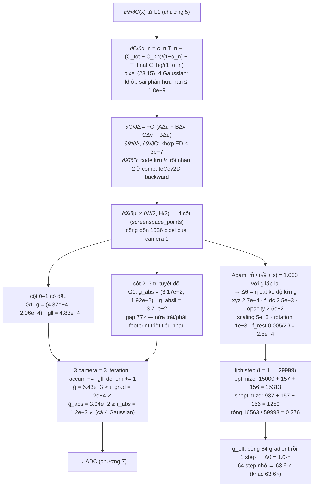
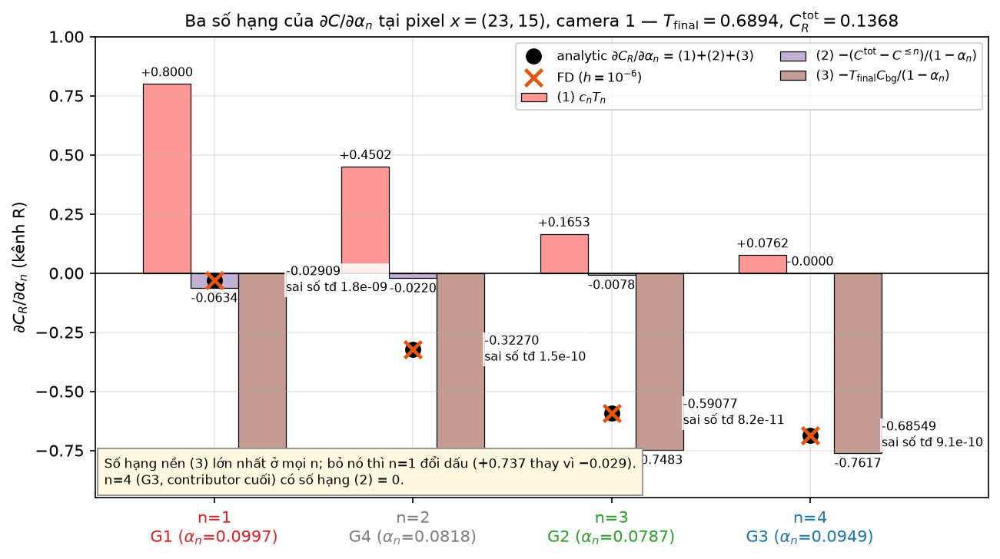
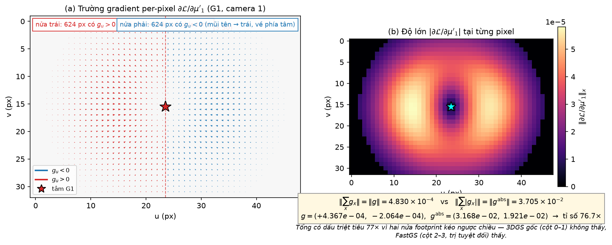
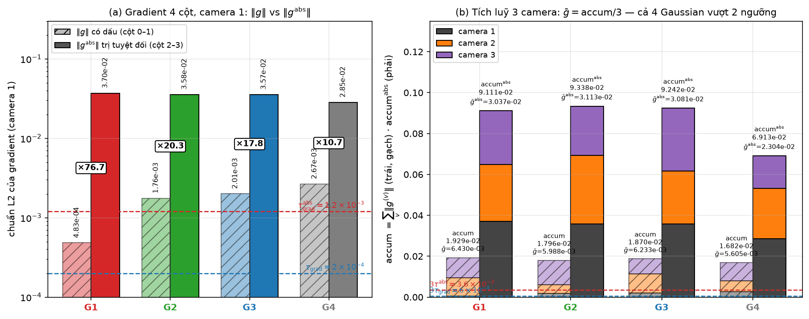
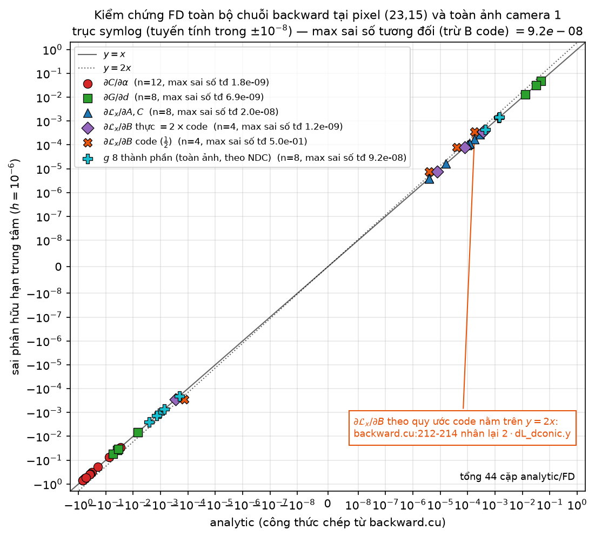
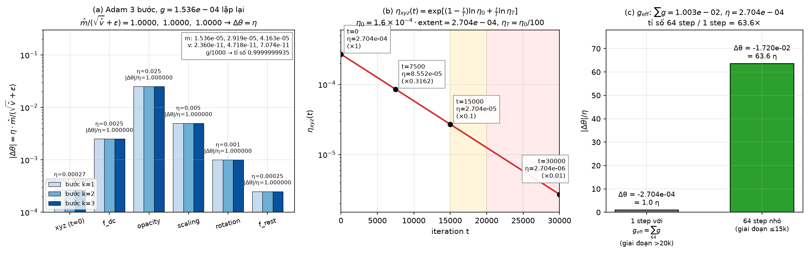
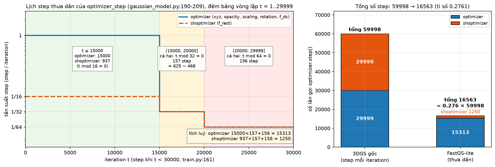

# Test số chương 6 — Gradient Flow

> Tính trên cảnh đồ chơi ở `00-scene.md` (4 điểm SfM, 3 camera, ảnh $48\times32$, $f_x=f_y=40$).
> GT $=$ render với $\alpha=0.9$; mô hình đang học có $\alpha=0.1$. Nền trắng.
> Script sinh số: `scripts/ch06_test.py` (chỉ `numpy`, không torch). Mọi số dưới đây là output thật của script,
> làm tròn 4 chữ số có nghĩa; script giữ full precision.
> **Mọi đạo hàm giải tích đều được kiểm chứng bằng sai phân hữu hạn trung tâm** (FD, $h=10^{-6}$),
> in cả hai cột và sai số tương đối $\lvert a-b\rvert/\max(\lvert a\rvert,\lvert b\rvert)$.
>
> Công thức chép từ code: `backward.cu:549-597` (`renderCUDA` backward: 3 số hạng `dL_dalpha`, `dG_ddel`, 4 cột `dL_dmean2D`),
> `backward.cu:212-214` (hệ số 2 cho `dL_dconic.y`), `forward.cu:429-430` (`pixel_colors` **không** chứa nền),
> `scene/gaussian_model.py:167-181` (`training_setup`), `:190-209` (`optimizer_step`), `:494-497` (`add_densification_stats`),
> `train.py:161-162` (`if iteration < opt.iterations`), `utils/general_utils.py:29-50` (`get_expon_lr_func`), `arguments/__init__.py:76-93` (lr mặc định).
>
> Renderer numpy tối giản trong script **lấy từ chương 3–4**: $\mu=p$, $s=\sqrt{\text{mean } d^2 \text{ tới 3 láng giềng}}$, $R=I$, $\Sigma=s^2I$, màu $=c_k$;
> $t=\mu-c_v$, $\mu'$ qua `ndc2Pix`, $J$ với clamp $1.3\tan$, $\Sigma'=J\Sigma J^\top+0.3I$, conic $=\Sigma'^{-1}$;
> render mọi Gaussian theo depth với 3 cửa loại ($\text{power}>0$, $\alpha<1/255$, $T<10^{-4}$). Không cull tile (4 Gaussian phủ cả ảnh, `radius` $=26..29$ px).

## Sơ đồ khối với số của cảnh đồ chơi

## 6.0 — Đầu vào (từ chương 1–4)

| $i$ | $\mu_i$ | $s_i$ | $c_i$ | camera 1: $t_i$ | $\mu'_i$ (px) | $\Sigma'_i$ $(a,b,c)$ | conic $(A,B,C)$ |
|---|---|---|---|---|---|---|---|
| 1 | $(0,0,0)$ | 0.8505 | (0.8,0.2,0.2) | $(0,0,4)$ | (23.50, 15.50) | (72.63, 0, 72.63) | (0.01377, 0, 0.01377) |
| 2 | $(0.5,0.3,0.5)$ | 0.9434 | (0.2,0.7,0.3) | $(0.5,0.3,4.5)$ | (27.94, 18.17) | (71.49, 0.5209, 70.93) | (0.01399, $-1.027\times10^{-4}$, 0.01410) |
| 3 | $(-0.4,-0.2,1)$ | 1.115 | (0.1,0.3,0.9) | $(-0.4,-0.2,5)$ | (20.30, 13.90) | (80.38, 0.2546, 80.00) | (0.01244, $-3.960\times10^{-5}$, 0.01250) |
| 4 | $(0.3,-0.5,0.2)$ | 0.8888 | (0.5,0.5,0.5) | $(0.3,-0.5,4.2)$ | (26.36, 10.74) | (72.32, $-0.6093$, 72.97) | (0.01383, $1.155\times10^{-4}$, 0.01371) |

$\text{extent}=1.1\cdot\max_v\lVert c_v-\bar c\rVert=1.1\times1.537=1.690$ (khớp chương 1).
$\mathcal L=\text{L1}$ trung bình: $\mathcal L^{(1)}=0.2593$ (camera 1); $\partial\mathcal L/\partial C_{\text{ch}}(x)=\operatorname{sign}(I_{\text{rend}}-I_{\text{gt}})/(3HW)$, $3HW=4608$ → $\pm2.170\times10^{-4}$.

## 6.1 — Backward qua blend

### (a) Tại một pixel có 4 Gaussian đóng góp

*Hình: ba số hạng của công thức hiệu hai tiền tố tại pixel (23,15), kênh R, cho 4 Gaussian — giá trị giải tích trùng khít sai phân hữu hạn.*

Pixel chọn tự động: nhiều contributor nhất và gần tâm Gaussian 1 → $x=(23,15)$, **4 contributor** (thứ tự depth: G1, G4, G2, G3).

$I_{\text{rend}}(x)=(0.8262,0.8134,0.8307)$, $I_{\text{gt}}(x)=(0.7612,0.2340,0.2304)$ → $\partial\mathcal L/\partial C=(+,+,+)\cdot2.170\times10^{-4}$ (render sáng hơn GT ở cả 3 kênh — mô hình quá mờ nên lộ nền trắng).

| $n$ | Gaussian | $d=\mu'-x$ | $G_n$ | $\alpha_n(x)$ | $T_n$ | $C^{\le n}$ |
|---|---|---|---|---|---|---|
| 1 | G1 | (0.5, 0.5) | 0.9966 | 0.09966 | 1.0000 | (0.07973, 0.01993, 0.01993) |
| 2 | G4 | (3.357, $-4.262$) | 0.8181 | 0.08181 | 0.9003 | (0.1166, 0.05676, 0.05676) |
| 3 | G2 | (4.944, 3.167) | 0.7866 | 0.07866 | 0.8267 | (0.1296, 0.1023, 0.07627) |
| 4 | G3 | ($-2.7$, $-1.1$) | 0.9486 | 0.09486 | 0.7617 | (0.1368, 0.1240, 0.1413) |

$C^{\text{tot}}=(0.1368,0.1240,0.1413)$ (không nền), $T_{\text{final}}=0.6894$, $C(x)=C^{\text{tot}}+T_{\text{final}}\cdot(1,1,1)=(0.8262,0.8134,0.8307)$ ✓ khớp $I_{\text{rend}}(x)$.

**Công thức** (hiệu hai tiền tố, `backward.cu:559-568`; `ar` khởi tạo $=$ `sampled_ar` $-$ `pixel_colors`, mà `pixel_colors` không chứa nền — `forward.cu:429`):

$$\frac{\partial C_{\text{ch}}}{\partial\alpha_n}=\underbrace{c_{n,\text{ch}}T_n}_{\text{(1)}}\ \underbrace{-\frac{C^{\text{tot}}_{\text{ch}}-C^{\le n}_{\text{ch}}}{1-\alpha_n}}_{\text{(2)}}\ \underbrace{-\frac{T_{\text{final}}C_{\text{bg,ch}}}{1-\alpha_n}}_{\text{(3)}}$$

**Thay số** cho $n=1$ (G1): (1) $=(0.8,0.2,0.2)\cdot1$; (2) $=-(0.1368-0.07973,\ldots)/(1-0.09966)=(-0.06338,-0.1155,-0.1348)$; (3) $=-0.6894\cdot1/0.9003=(-0.7657,-0.7657,-0.7657)$.

**Kết quả** — analytic vs FD (nhiễu $\alpha_n(x)\pm h$ rồi blend lại pixel):

| $n$ | (1) $c_nT_n$ | (2) | (3) nền | analytic $\partial C/\partial\alpha_n$ | FD | sai số tđ |
|---|---|---|---|---|---|---|
| 1 (G1) | (0.8, 0.2, 0.2) | ($-0.06338$, $-0.1155$, $-0.1348$) | $-0.7657$ | ($-0.02909$, $-0.6813$, $-0.7005$) | ($-0.02909$, $-0.6813$, $-0.7005$) | $1.8\times10^{-9}$ |
| 2 (G4) | 0.4502 (×3) | ($-0.02203$, $-0.07318$, $-0.09206$) | $-0.7508$ | ($-0.3227$, $-0.3738$, $-0.3927$) | ($-0.3227$, $-0.3738$, $-0.3927$) | $1.5\times10^{-10}$ |
| 3 (G2) | (0.1653, 0.5787, 0.2480) | ($-0.007842$, $-0.02353$, $-0.07058$) | $-0.7483$ | ($-0.5908$, $-0.1931$, $-0.5708$) | ($-0.5908$, $-0.1931$, $-0.5708$) | $8.2\times10^{-11}$ |
| 4 (G3) | (0.07617, 0.2285, 0.6855) | (0, 0, 0) — cuối cùng | $-0.7617$ | ($-0.6855$, $-0.5332$, $-0.07617$) | ($-0.6855$, $-0.5332$, $-0.07617$) | $9.1\times10^{-10}$ |

Nhận xét: số hạng nền (3) **lớn nhất** ở mọi $n$ (vì $T_{\text{final}}=0.69$, cảnh còn rất trong suốt); bỏ nó thì $\partial C_R/\partial\alpha_1$ đổi dấu ($+0.737$ thay vì $-0.029$). Với G3 (contributor cuối) số hạng (2) $=0$ đúng như kỳ vọng.

$\partial\mathcal L/\partial\alpha_n(x)=\sum_{\text{ch}}\partial\mathcal L/\partial C_{\text{ch}}\cdot\partial C_{\text{ch}}/\partial\alpha_n$: $-3.062\times10^{-4}$ (G1), $-2.364\times10^{-4}$ (G4), $-2.940\times10^{-4}$ (G2), $-2.810\times10^{-4}$ (G3) — đều âm: tăng $\alpha$ giảm loss (mô hình mờ hơn GT).

### (b) Chuỗi $G\to\Delta$, conic tại pixel đó

Code dùng $d=\mu'-x=-\Delta$ (`backward.cu:552`), $\text{power}=-\tfrac12(Ad_u^2+Cd_v^2)-Bd_ud_v$:

$$\frac{\partial G}{\partial d_u}=-G(Ad_u+Bd_v),\quad\frac{\partial G}{\partial d_v}=-G(Cd_v+Bd_u),\quad\frac{\partial\mathcal L}{\partial G}=\alpha_n\frac{\partial\mathcal L}{\partial\alpha_n(x)}$$

$$\frac{\partial\mathcal L}{\partial A}=-\tfrac12Gd_u^2\frac{\partial\mathcal L}{\partial G},\quad\frac{\partial\mathcal L}{\partial B}\Big|_{\text{code}}=-\tfrac12Gd_ud_v\frac{\partial\mathcal L}{\partial G},\quad\frac{\partial\mathcal L}{\partial C}=-\tfrac12Gd_v^2\frac{\partial\mathcal L}{\partial G}$$

**Thay số** $n=1$ (G1): $\partial\mathcal L/\partial G=0.1\times(-3.062\times10^{-4})=-3.062\times10^{-5}$; $\partial G/\partial d_u=-0.9966(0.01377\cdot0.5+0)=-6.860\times10^{-3}$.

**Kết quả** (FD trên $G$ cho $\partial G/\partial d$; FD trên loss-pixel $\mathcal L_x=\sum_{\text{ch}}\lvert C_{\text{ch}}-I_{\text{gt,ch}}\rvert/(3HW)$ cho các đại lượng còn lại):

| $n$ | đại lượng | analytic | FD | sai số tđ |
|---|---|---|---|---|
| 1 (G1) | $\partial G/\partial d_u$ | $-6.860\times10^{-3}$ | $-6.860\times10^{-3}$ | $6.9\times10^{-9}$ |
| | $\partial G/\partial d_v$ | $-6.860\times10^{-3}$ | $-6.860\times10^{-3}$ | $6.9\times10^{-9}$ |
| | $\partial\mathcal L_x/\partial d_u$ | $2.100\times10^{-7}$ | $2.100\times10^{-7}$ | $2.6\times10^{-7}$ |
| | $\partial\mathcal L_x/\partial A$ | $3.814\times10^{-6}$ | $3.814\times10^{-6}$ | $2.0\times10^{-8}$ |
| | $\partial\mathcal L_x/\partial B$ (code, $\tfrac12$) | $3.814\times10^{-6}$ | $7.628\times10^{-6}$ | **0.50** |
| | $\partial\mathcal L_x/\partial B$ thực $=2\times$code | $7.628\times10^{-6}$ | $7.628\times10^{-6}$ | $1.2\times10^{-9}$ |
| | $\partial\mathcal L_x/\partial C$ | $3.814\times10^{-6}$ | $3.814\times10^{-6}$ | $2.0\times10^{-8}$ |
| 2 (G4) | $\partial G/\partial d_u$ | $-3.758\times10^{-2}$ | $-3.758\times10^{-2}$ | $2.0\times10^{-10}$ |
| | $\partial G/\partial d_v$ | $4.747\times10^{-2}$ | $4.747\times10^{-2}$ | $9.3\times10^{-11}$ |
| | $\partial\mathcal L_x/\partial A$ | $1.090\times10^{-4}$ | $1.090\times10^{-4}$ | $1.8\times10^{-10}$ |
| | $\partial\mathcal L_x/\partial B$ (code) / thực | $-1.384\times10^{-4}$ / $-2.767\times10^{-4}$ | $-2.767\times10^{-4}$ | 0.50 / $5.7\times10^{-11}$ |
| | $\partial\mathcal L_x/\partial C$ | $1.756\times10^{-4}$ | $1.756\times10^{-4}$ | $9.1\times10^{-11}$ |
| 3 (G2) | $\partial G/\partial d_u$, $\partial G/\partial d_v$ | $-5.415\times10^{-2}$, $-3.472\times10^{-2}$ | như analytic | $\le2\times10^{-10}$ |
| | $\partial\mathcal L_x/\partial A,\ B_{\text{thực}},\ C$ | $2.827\times10^{-4}$, $3.621\times10^{-4}$, $1.159\times10^{-4}$ | như analytic | $\le2.3\times10^{-11}$ |
| 4 (G3) | $\partial G/\partial d_u$, $\partial G/\partial d_v$ | $3.182\times10^{-2}$, $1.294\times10^{-2}$ | như analytic | $\le2.7\times10^{-9}$ |
| | $\partial\mathcal L_x/\partial A,\ B_{\text{thực}},\ C$ | $9.716\times10^{-5}$, $7.916\times10^{-5}$, $1.613\times10^{-5}$ | như analytic | $\le3.9\times10^{-9}$ |

**Phát hiện khi đối chiếu code:** FD cho $\partial\mathcal L/\partial B$ đúng **gấp 2** giá trị `-0.5f * gdx * d.y * dL_dG` của `backward.cu:594`. Không phải lỗi: vì $\text{power}$ chứa $2B\Delta_u\Delta_v$ nên đạo hàm thực là $-G\Delta_u\Delta_v\,\partial\mathcal L/\partial G$; code lưu **một nửa** vào `dL_dconic2D.y` rồi `computeCov2DCUDA` backward nhân lại $2\cdot$`dL_dconic.y` ở `backward.cu:212-214`. Công thức $-\tfrac12G\Delta_u\Delta_v$ trong `06-gradient-flow.md` là **quy ước của code**, không phải đạo hàm toán học của $B$.

Gradient tâm tại pixel (nhân $W/2=24$, $H/2=16$ như `ddelx_dx`): G1: $(5.041\times10^{-6},\ 3.361\times10^{-6})$; G4: $(2.132\times10^{-5},\ -1.795\times10^{-5})$; G2: $(3.821\times10^{-5},\ 1.633\times10^{-5})$; G3: $(-2.146\times10^{-5},\ -5.818\times10^{-6})$.

### (c) FastGS: gradient 4 cột (`backward.cu:583-597`), cộng dồn qua **toàn bộ** 1536 pixel, camera 1

*Hình: quiver cho thấy nửa trái footprint của G1 kéo gradient sang trái, nửa phải kéo sang phải — tổng có dấu gần triệt tiêu (‖g‖=4.83e−4) trong khi tổng trị tuyệt đối vẫn lớn (‖g_abs‖=3.71e−2, gấp 77 lần); đây là lý do FastGS cần cột "abs".*

*Hình: so sánh ‖g‖ và ‖g_abs‖ cho cả 4 Gaussian (trục log) với hai ngưỡng τ_grad và τ_abs; cả 4 Gaussian đều vượt cả hai ngưỡng sau khi tích luỹ qua 3 camera.*

$$g_n=\sum_x\frac{\partial\mathcal L}{\partial\mu'_n}\Big|_x\ (\text{cột 0–1}),\qquad g^{\text{abs}}_n=\sum_x\Bigl|\frac{\partial\mathcal L}{\partial\mu'_n}\Big|_x\Bigr|\ (\text{cột 2–3})$$

| $i$ | $g_u$ | $g_v$ | $g^{\text{abs}}_u$ | $g^{\text{abs}}_v$ | $\lVert g\rVert$ | $\lVert g^{\text{abs}}\rVert$ | $\lVert g^{\text{abs}}\rVert/\lVert g\rVert$ |
|---|---|---|---|---|---|---|---|
| 1 | $4.367\times10^{-4}$ | $-2.064\times10^{-4}$ | $3.168\times10^{-2}$ | $1.921\times10^{-2}$ | $4.830\times10^{-4}$ | $3.705\times10^{-2}$ | 76.7 |
| 2 | $-1.122\times10^{-3}$ | $1.357\times10^{-3}$ | $3.057\times10^{-2}$ | $1.854\times10^{-2}$ | $1.760\times10^{-3}$ | $3.575\times10^{-2}$ | 20.3 |
| 3 | $1.466\times10^{-3}$ | $-1.370\times10^{-3}$ | $3.065\times10^{-2}$ | $1.832\times10^{-2}$ | $2.007\times10^{-3}$ | $3.570\times10^{-2}$ | 17.8 |
| 4 | $-7.168\times10^{-4}$ | $-2.570\times10^{-3}$ | $2.474\times10^{-2}$ | $1.411\times10^{-2}$ | $2.669\times10^{-3}$ | $2.848\times10^{-2}$ | 10.7 |

$\bigl\lVert\sum_xg_x\bigr\rVert\le\sum_x\lVert g_x\rVert$ đúng bằng số ở cả 4 hàng; ở Gaussian 1 (tâm gần giữa ảnh, footprint đối xứng) tổng có dấu **triệt tiêu 77×** so với tổng trị tuyệt đối — đúng hiện tượng "kéo trái ở nửa trái, kéo phải ở nửa phải" mà chương 6 mô tả.

**Kiểm chứng $g$ có dấu bằng FD toàn ảnh**: dịch toạ độ NDC của tâm Gaussian $i$ đi $\pm h$ (vì `dL_dmean2D` là gradient theo NDC, `ddelx_dx = 0.5*W`), render lại 1536 pixel, tính L1:

| $i$ | trục | analytic $g$ | FD $(\mathcal L^+-\mathcal L^-)/2h$ | sai số tđ |
|---|---|---|---|---|
| 1 | $u$ | $4.3672\times10^{-4}$ | $4.3672\times10^{-4}$ | $6.8\times10^{-9}$ |
| 1 | $v$ | $-2.0642\times10^{-4}$ | $-2.0642\times10^{-4}$ | $9.2\times10^{-8}$ |
| 2 | $u$ | $-1.1218\times10^{-3}$ | $-1.1218\times10^{-3}$ | $1.4\times10^{-9}$ |
| 2 | $v$ | $1.3566\times10^{-3}$ | $1.3566\times10^{-3}$ | $8.4\times10^{-9}$ |
| 3 | $u$ | $1.4662\times10^{-3}$ | $1.4662\times10^{-3}$ | $2.8\times10^{-9}$ |
| 3 | $v$ | $-1.3705\times10^{-3}$ | $-1.3705\times10^{-3}$ | $2.0\times10^{-8}$ |
| 4 | $u$ | $-7.1682\times10^{-4}$ | $-7.1682\times10^{-4}$ | $4.0\times10^{-8}$ |
| 4 | $v$ | $-2.5704\times10^{-3}$ | $-2.5704\times10^{-3}$ | $4.6\times10^{-9}$ |

Toàn bộ chuỗi backward (3 số hạng $\alpha$ → $G$ → $d$ → $\mu'_{\text{ndc}}$, cộng dồn qua pixel với 3 cửa loại) khớp FD tới $\sim10^{-8}$.

## 6.2 — Backward qua projection

*Hình: mọi đại lượng đã kiểm chứng (∂C/∂α, ∂G/∂Δ, ∂L/∂A,B,C, 8 thành phần gradient) nằm khít trên đường y=x — sai số tương đối tối đa dưới 1e−7.*

Không tính ở đây (chuỗi $\Sigma'\to\Sigma\to(q,s)$, $J\to t$, SH$\to\mu$ do autograd/`computeCov2DCUDA` lo). Ghi nhận duy nhất từ 6.1(b): hệ số $\tfrac12$ của $B$ được bù bằng $2\cdot$`dL_dconic.y` ở `backward.cu:212-214`.

## 6.3 — Tích luỹ thống kê cho ADC (`add_densification_stats`, `gaussian_model.py:494-497`)

Giả sử 3 iteration liên tiếp dùng camera 1, 2, 3 (mỗi iteration render + backward toàn ảnh, GT riêng của camera đó). `radii` $>0$ cho cả 4 Gaussian ở cả 3 camera → `update_filter` toàn True.

| cam | $\mathcal L^{(v)}$ | $i$ | $g_u$ | $g_v$ | $g^{\text{abs}}_u$ | $g^{\text{abs}}_v$ | $\lVert g\rVert_2$ | $\lVert g^{\text{abs}}\rVert_2$ |
|---|---|---|---|---|---|---|---|---|
| 1 | 0.2593 | 1 | $4.367\times10^{-4}$ | $-2.064\times10^{-4}$ | $3.168\times10^{-2}$ | $1.921\times10^{-2}$ | $4.830\times10^{-4}$ | $3.705\times10^{-2}$ |
| | | 2 | $-1.122\times10^{-3}$ | $1.357\times10^{-3}$ | $3.057\times10^{-2}$ | $1.854\times10^{-2}$ | $1.760\times10^{-3}$ | $3.575\times10^{-2}$ |
| | | 3 | $1.466\times10^{-3}$ | $-1.370\times10^{-3}$ | $3.065\times10^{-2}$ | $1.832\times10^{-2}$ | $2.007\times10^{-3}$ | $3.570\times10^{-2}$ |
| | | 4 | $-7.168\times10^{-4}$ | $-2.570\times10^{-3}$ | $2.474\times10^{-2}$ | $1.411\times10^{-2}$ | $2.669\times10^{-3}$ | $2.848\times10^{-2}$ |
| 2 | 0.2237 | 1 | $-8.933\times10^{-3}$ | $-2.093\times10^{-4}$ | $2.183\times10^{-2}$ | $1.721\times10^{-2}$ | $8.935\times10^{-3}$ | $2.780\times10^{-2}$ |
| | | 2 | $-4.109\times10^{-3}$ | $1.364\times10^{-3}$ | $2.823\times10^{-2}$ | $1.833\times10^{-2}$ | $4.330\times10^{-3}$ | $3.366\times10^{-2}$ |
| | | 3 | $-9.362\times10^{-3}$ | $-1.183\times10^{-3}$ | $2.050\times10^{-2}$ | $1.588\times10^{-2}$ | $9.437\times10^{-3}$ | $2.593\times10^{-2}$ |
| | | 4 | $-4.630\times10^{-3}$ | $-2.489\times10^{-3}$ | $2.059\times10^{-2}$ | $1.360\times10^{-2}$ | $5.257\times10^{-3}$ | $2.468\times10^{-2}$ |
| 3 | 0.2055 | 1 | $8.957\times10^{-3}$ | $-4.146\times10^{-3}$ | $2.106\times10^{-2}$ | $1.568\times10^{-2}$ | $9.870\times10^{-3}$ | $2.626\times10^{-2}$ |
| | | 2 | $1.168\times10^{-2}$ | $-2.144\times10^{-3}$ | $1.836\times10^{-2}$ | $1.541\times10^{-2}$ | $1.187\times10^{-2}$ | $2.397\times10^{-2}$ |
| | | 3 | $5.022\times10^{-3}$ | $-5.236\times10^{-3}$ | $2.616\times10^{-2}$ | $1.624\times10^{-2}$ | $7.255\times10^{-3}$ | $3.079\times10^{-2}$ |
| | | 4 | $7.400\times10^{-3}$ | $-4.927\times10^{-3}$ | $1.311\times10^{-2}$ | $9.124\times10^{-3}$ | $8.890\times10^{-3}$ | $1.598\times10^{-2}$ |

Nhận xét: camera 2 (lệch phải) đẩy mọi tâm sang trái ($g_u<0$), camera 3 (lệch trái) đẩy sang phải ($g_u>0$) — nếu cộng **vector** qua iteration thì $g_u$ của G1 triệt tiêu ($-8.93+8.96\approx0.02\times10^{-3}$); code lấy `norm` **trước** khi cộng nên không triệt tiêu.

**Công thức**: $\text{accum}_i\mathrel{+}=\lVert g_i\rVert_2$, $\text{accum}^{\text{abs}}_i\mathrel{+}=\lVert g^{\text{abs}}_i\rVert_2$, $\text{denom}_i\mathrel{+}=1$; $\bar g_i=\text{accum}_i/\text{denom}_i$.

**Thay số** G1: $\text{accum}_1=4.830\times10^{-4}+8.935\times10^{-3}+9.870\times10^{-3}=1.929\times10^{-2}$; $\bar g_1=1.929\times10^{-2}/3=6.430\times10^{-3}$.

| $i$ | accum | accum$^{\text{abs}}$ | denom | $\bar g_i$ | $\bar g^{\text{abs}}_i$ | $\bar g\ge\tau_{\text{grad}}=2\times10^{-4}$ | $\bar g^{\text{abs}}\ge\tau^{\text{abs}}=1.2\times10^{-3}$ |
|---|---|---|---|---|---|---|---|
| 1 | $1.929\times10^{-2}$ | $9.111\times10^{-2}$ | 3 | $6.430\times10^{-3}$ | $3.037\times10^{-2}$ | ✓ (32×) | ✓ (25×) |
| 2 | $1.796\times10^{-2}$ | $9.338\times10^{-2}$ | 3 | $5.988\times10^{-3}$ | $3.113\times10^{-2}$ | ✓ | ✓ |
| 3 | $1.870\times10^{-2}$ | $9.242\times10^{-2}$ | 3 | $6.233\times10^{-3}$ | $3.081\times10^{-2}$ | ✓ | ✓ |
| 4 | $1.682\times10^{-2}$ | $6.913\times10^{-2}$ | 3 | $5.605\times10^{-3}$ | $2.304\times10^{-2}$ | ✓ | ✓ |

**Cả 4 Gaussian vượt cả hai ngưỡng** (cảnh đồ chơi: 4 Gaussian to phủ cả ảnh 48×32 và sai lệch opacity 0.1 vs 0.9 rất lớn, nên gradient lớn hơn cảnh thật vài bậc). Đây là đầu vào chương 7.

## 6.4 — Adam và lịch step

### (a) Adam bằng số cho 1 tham số

Lấy $g=$ trung bình $g_u$ của G1 qua 3 camera $=(4.367\times10^{-4}-8.933\times10^{-3}+8.957\times10^{-3})/3=1.536\times10^{-4}$, lặp 3 bước, $\beta=(0.9,0.999)$, $\epsilon=10^{-15}$ (`gaussian_model.py:177-178`).

| $k$ | $m$ | $v$ | $\hat m$ | $\hat v$ | $\hat m/(\sqrt{\hat v}+\epsilon)$ |
|---|---|---|---|---|---|
| 1 | $1.536\times10^{-5}$ | $2.360\times10^{-11}$ | $1.536\times10^{-4}$ | $2.360\times10^{-8}$ | 1.0000000000 |
| 2 | $2.919\times10^{-5}$ | $4.718\times10^{-11}$ | $1.536\times10^{-4}$ | $2.360\times10^{-8}$ | 1.0000000000 |
| 3 | $4.163\times10^{-5}$ | $7.074\times10^{-11}$ | $1.536\times10^{-4}$ | $2.360\times10^{-8}$ | 1.0000000000 |

Với gradient lặp lại, $\hat m=g$, $\hat v=g^2$ nên tỉ số $=g/(\lvert g\rvert+\epsilon)=\operatorname{sign}(g)$. $\Delta\theta=\eta\cdot\hat m/(\sqrt{\hat v}+\epsilon)$ cho 6 nhóm (`training_setup`, `arguments/__init__.py`):

| nhóm | $\eta$ | $\Delta\theta$ ($k=1,2,3$ giống nhau) | $\lvert\Delta\theta\rvert/\eta$ |
|---|---|---|---|
| `xyz` ($t=0$): $1.6\times10^{-4}\cdot1.690$ | $2.704\times10^{-4}$ | $2.704\times10^{-4}$ | 1.000000 |
| `f_dc` | $2.5\times10^{-3}$ | $2.5\times10^{-3}$ | 1.000000 |
| `opacity` | $2.5\times10^{-2}$ | $2.5\times10^{-2}$ | 1.000000 |
| `scaling` | $5\times10^{-3}$ | $5\times10^{-3}$ | 1.000000 |
| `rotation` | $1\times10^{-3}$ | $1\times10^{-3}$ | 1.000000 |
| `f_rest` $=0.005/20$ | $2.5\times10^{-4}$ | $2.5\times10^{-4}$ | 1.000000 |

Thử $g'=g/1000=1.536\times10^{-7}$: tỉ số $=0.9999999935$ → **bước đi $\approx\eta$ bất kể độ lớn $g$** (chỉ khi $\lvert g\rvert\sim\epsilon=10^{-15}$ mới nhỏ đi).

### (b) Decay $\eta_{xyz}(t)$ (`get_expon_lr_func`, `utils/general_utils.py:29-50`)

$$\eta_{xyz}(t)=\exp\bigl((1-\tfrac tT)\ln\eta_{\text{init}}+\tfrac tT\ln\eta_{\text{final}}\bigr),\quad\eta_{\text{init}}=1.6\times10^{-4}\cdot1.690=2.704\times10^{-4},\ \eta_{\text{final}}=2.704\times10^{-6},\ T=30000$$

| $t$ | $t/T$ | $\eta_{xyz}(t)$ | $\eta/\eta_{\text{init}}$ |
|---|---|---|---|
| 0 | 0 | $2.704\times10^{-4}$ | 1 |
| 7500 | 0.25 | $8.552\times10^{-5}$ | $10^{-0.5}=0.3162$ |
| 15000 | 0.5 | $2.704\times10^{-5}$ | 0.1 |
| 30000 | 1 | $2.704\times10^{-6}$ | 0.01 |

### (c) Lịch step thưa dần — đếm bằng vòng lặp thật

Điều kiện chép đúng `optimizer_step` (`gaussian_model.py:190-209`): $t\le15000$: main mỗi vòng, SH khi $t\bmod16=0$; $15000\lt t\le20000$: cả hai khi $t\bmod32=0$; $t>20000$: cả hai khi $t\bmod64=0$. Vòng lặp `train.py:66` chạy $t=1..30000$ nhưng `train.py:161` chỉ gọi khi `iteration < opt.iterations` → step cho $t=1..29999$.

| | $\le15000$ | $(15000,20000]$ | $(20000,29999]$ | tổng |
|---|---|---|---|---|
| `optimizer` | 15000 | **157** | 156 | **15313** |
| `shoptimizer` | 937 | 157 | 156 | **1250** |
| cả hai | | | | **16563** |

3DGS gốc: $29999+29999=59998$ → tỉ số $16563/59998=0.2761$. Số bội của 32 trong $(15000,20000]$ là 157 ($20000=32\cdot625$, $15000/32=468.75$ → $625-468=157$). Kết quả code **khớp hoàn toàn** với bảng trong `06-gradient-flow.md` (15313 / 1250 / 16563 / 157).

### (d) $g_{\text{eff}}$: cộng 64 gradient rồi 1 step vs 64 step nhỏ

*Hình: (a) sau 3 bước Adam với gradient lặp lại, m̂/(√v̂+ε) → 1.000 nên Δθ ≈ η cho cả 6 nhóm lr; (b) decay η_xyz(t) trên thang log; (c) cộng 64 gradient rồi step 1 lần cho bước đi nhỏ hơn nhiều so với 64 step nhỏ liên tiếp.*

64 gradient cùng dấu, $g_k=g(1+0.3\xi_k)$, $\xi\sim\mathcal N(0,1)$ (seed 0), $\lvert g\rvert$ trung bình $1.567\times10^{-4}$, $\sum g=1.003\times10^{-2}$; $\eta=\eta_{xyz}(0)=2.704\times10^{-4}$; $m=v=0$ ban đầu.

| cách | $\Delta\theta$ | $/\eta$ |
|---|---|---|
| 1 step với $g_{\text{eff}}=\sum_{64}g$ (giai đoạn $>20000$) | $-2.704\times10^{-4}$ | $-1.0000$ |
| 64 step nhỏ (giai đoạn $\le15000$) | $-1.720\times10^{-2}$ | $-63.60$ |

Tỉ số $63.6\times$: gộp 64 gradient rồi step một lần chỉ đi được **một** bước cỡ $\eta$ (Adam chuẩn hoá theo $\sqrt{\hat v}$, độ lớn $\sum g$ bị triệt), không phải 64 bước. Đó là lý do giai đoạn 15k–30k gần như không học thêm về vị trí.

## 6.5 — Đầu ra của khối

*Hình: tần suất step của optimizer (xyz, f_dc, opacity, scaling, rotation) và shoptimizer (f_rest) theo t = 1..29999 — tổng 16563 so với 59998 của 3DGS gốc, tỉ số R_adam = 0.276.*

**Đầu vào của khối**: 4 Gaussian ($\mu,s,c$ ở bảng 6.0, $\alpha=0.1$), 3 camera, GT $=$ render $\alpha=0.9$, $\partial\mathcal L/\partial C=\operatorname{sign}/(3HW)$.

**Đầu ra của khối** (cho chương 7 — Adaptive Density Control), sau 3 iteration với camera 1, 2, 3:

| $i$ | $\text{accum}_i$ | $\text{accum}^{\text{abs}}_i$ | $\text{denom}_i$ | $\bar g_i$ | $\bar g^{\text{abs}}_i$ | $\bar g_i\ge\tau_{\text{grad}}$ | $\bar g^{\text{abs}}_i\ge\tau^{\text{abs}}_{\text{grad}}$ |
|---|---|---|---|---|---|---|---|
| 1 | $1.928867\times10^{-2}$ | $9.110511\times10^{-2}$ | 3 | $6.429555\times10^{-3}$ | $3.036837\times10^{-2}$ | True | True |
| 2 | $1.796432\times10^{-2}$ | $9.338040\times10^{-2}$ | 3 | $5.988106\times10^{-3}$ | $3.112680\times10^{-2}$ | True | True |
| 3 | $1.869827\times10^{-2}$ | $9.242443\times10^{-2}$ | 3 | $6.232756\times10^{-3}$ | $3.080814\times10^{-2}$ | True | True |
| 4 | $1.681544\times10^{-2}$ | $6.913455\times10^{-2}$ | 3 | $5.605145\times10^{-3}$ | $2.304485\times10^{-2}$ | True | True |

Kèm: $\eta_{xyz}(t)$ bảng 6.4(b), `extent` $=1.690$, và bước Adam $\lvert\Delta\theta\rvert\approx\eta$ cho mọi nhóm. Với chương 7: cả 4 Gaussian là ứng viên densify; theo chương 1, $\max s_i\in[0.8505,1.115]\gt \delta\cdot\text{extent}=0.00169$ nên đều đi nhánh **split**.
