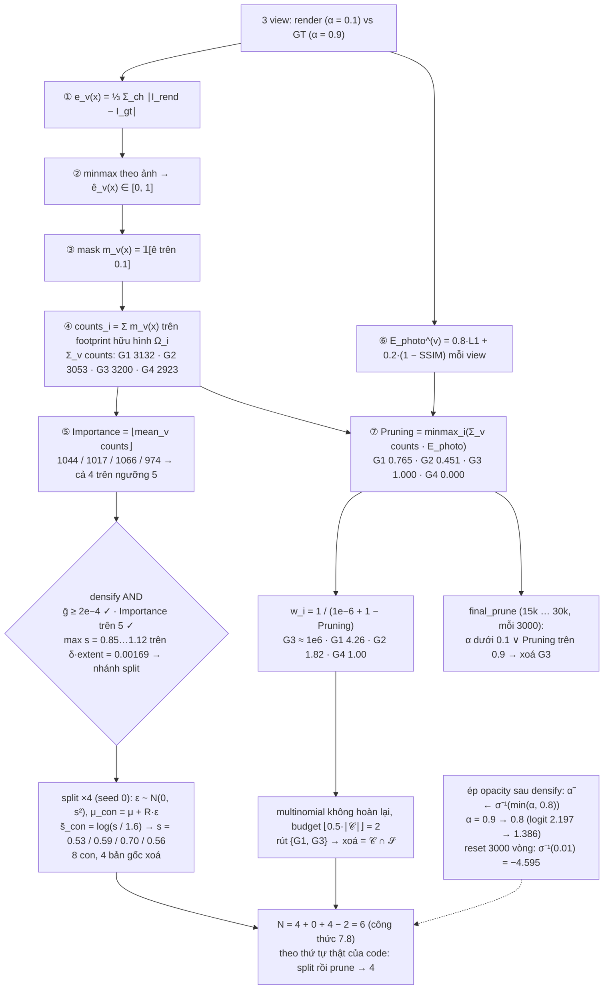

# Test số Chương 7 — Adaptive Density Control

> Cảnh: [`00-scene.md`](00-scene.md) (4 điểm SfM, 3 camera, ảnh $48\times32$, $f_x=f_y=40$).
> Script: [`scripts/ch07_test.py`](scripts/ch07_test.py) (numpy + scipy, seed 0). Mọi số dưới đây là **output thật** của script.
> Lý thuyết: [`../07-adaptive-density-control.md`](../07-adaptive-density-control.md); ví dụ tay: [`../../3.md`](../../3.md).
>
> **Khác với code thật:** $V=3$ camera (cảnh chỉ có 3) thay vì $V=10$ của `sampling_cameras` (`fast_utils.py:13`). Mọi công thức giữ nguyên.

## Sơ đồ khối với số của cảnh đồ chơi (V = 3 view)

## Đầu vào của khối

Lấy từ chương 1–5 (tính lại trong script; gradient đối chiếu với `06-test.md` ở mục 7.3):

| $i$ | $\mu_i$ | $s_i$ (đẳng hướng) | $\tilde s_i=\log s_i$ | $\alpha_i$ mô hình | $\alpha_i$ GT | $c_i$ |
|---|---|---|---|---|---|---|
| 1 | $(0,0,0)$ | 0.8505 | $-0.1619$ | 0.1 | 0.9 | (0.8,0.2,0.2) |
| 2 | $(0.5,0.3,0.5)$ | 0.9434 | $-0.0583$ | 0.1 | 0.9 | (0.2,0.7,0.3) |
| 3 | $(-0.4,-0.2,1.0)$ | 1.1150 | $+0.1089$ | 0.1 | 0.9 | (0.1,0.3,0.9) |
| 4 | $(0.3,-0.5,0.2)$ | 0.8888 | $-0.1179$ | 0.1 | 0.9 | (0.5,0.5,0.5) |

$R_i=I$, $\Sigma_i=s_i^2I$. Renderer numpy tối giản (chương 3–5): $t=\mu-c_v$, $\mu'=$`ndc2Pix`, $J$ clamp $1.3\tan$, $\Sigma'=J\Sigma J^\top+0.3I$, conic, blend theo depth với 3 cửa loại (cull tile bằng compact box `mult`$=0.5$, $\alpha\ge1/255$, $T\ge10^{-4}$), nền trắng. Renderer trả thêm **footprint hữu hình** $\Omega_i^{(v)}$ = tập pixel Gaussian $i$ thực sự đóng góp (đúng chỗ `forward.cu:406-408` gọi `atomicAdd(metricCount)` — sau cả 3 cửa).

Projection mô hình ($\alpha=0.1$) — kết quả thật:

| view | $i$ | $\mu'$ (px) | $\Sigma'_{11},\Sigma'_{12},\Sigma'_{22}$ | depth | $r^{2D}$ | tile chạm | $\lvert\Omega_i^{(v)}\rvert$ |
|---|---|---|---|---|---|---|---|
| 1 | 1 | (23.50, 15.50) | 72.63, 0.00, 72.63 | 4.0 | 26 | 6/6 | 1248 |
| 1 | 2 | (27.94, 18.17) | 71.49, 0.52, 70.93 | 4.5 | 26 | 6/6 | 1197 |
| 1 | 3 | (20.30, 13.90) | 80.38, 0.25, 80.00 | 5.0 | 27 | 6/6 | 1301 |
| 1 | 4 | (26.36, 10.74) | 72.32, −0.61, 72.97 | 4.2 | 26 | 6/6 | 1193 |
| 2 | 1 | (8.50, 15.50) | 82.81, 0.00, 72.63 | 4.0 | 28 | 4/6 | 954 |
| 2 | 2 | (14.61, 18.17) | 74.09, −1.04, 70.93 | 4.5 | 26 | 4/6 | 1005 |
| 2 | 3 | (8.30, 13.90) | 91.36, 1.21, 80.00 | 5.0 | 29 | 4/6 | 978 |
| 2 | 4 | (12.07, 10.74) | 77.80, 2.44, 72.97 | 4.2 | 27 | 4/6 | 974 |
| 3 | 1 | (38.50, 10.50) | 82.81, −3.39, 73.76 | 4.0 | 28 | 4/6 | 930 |
| 3 | 2 | (41.28, 13.72) | 84.51, −1.39, 70.76 | 4.5 | 28 | 4/6 | 869 |
| 3 | 3 | (32.30, 9.90) | 83.72, −2.45, 81.43 | 5.0 | 28 | 4/6 | 990 |
| 3 | 4 | (40.64, 5.98) | 85.12, −7.31, 76.02 | 4.2 | 29 | 4/6 | 770 |

$T_{\text{final}}$ nhỏ nhất $\approx0.686$ — với $\alpha=0.1$ không pixel nào bị dừng sớm; cửa loại thực sự cắt footprint là compact box (level-set $\Delta^\top M\Delta\le t_i$, $t_i=0.5\cdot2\ln(25.5)=3.24$) và $\alpha\ge1/255$.

## 7.1 — Lịch chạy

Không có số để tính; giả định thời điểm $t$ của bài test: **$500\lt t<15000$, $t>3000$** (để cả ba điều kiện của tập ứng viên prune đều bật, `size_threshold = 20`). Mục 7.6 giả định thêm một lần gọi ở $15000\lt t<30000$.

## 7.2 — Hai điểm số multi-view

### ① Sai số màu từng pixel

$$e_v(x)=\tfrac13\sum_{\text{ch}}|I^{(v)}_{\text{rend}}(x)-I^{(v)}_{\text{gt}}(x)|$$

| view | $\min_x e_v$ | $\max_x e_v$ | $\text{mean}_x e_v$ |
|---|---|---|---|
| 1 | 0.006232 | 0.438925 | 0.259278 |
| 2 | 0.000000 | 0.441639 | 0.222367 |
| 3 | 0.000000 | 0.440789 | 0.204733 |

Mô hình ($\alpha=0.1$) mờ hơn GT ($\alpha=0.9$) rất nhiều nên sai số lớn gần như toàn ảnh.

### ② Chuẩn hoá min–max theo ảnh

$$\hat e_v(x)=\frac{e_v(x)-\min_xe_v}{\max_xe_v-\min_xe_v}$$

| view | mẫu số | ngưỡng $e$ tương đương $\hat e>0.1$ |
|---|---|---|
| 1 | 0.432693 | $e>0.006232+0.1\cdot0.432693=0.049502$ |
| 2 | 0.441639 | $e>0.044164$ |
| 3 | 0.440789 | $e>0.044079$ |

### ③ Mặt nạ nhị phân $m_v(x)=\mathbb 1[\hat e_v(x)>0.1]$

*Hình: 3 view × (I_rend, I_gt, e_v(x), mặt nạ ê_v > 0.1) — mỗi view cho một tập pixel "lỗi" khác nhau dù cùng ngưỡng 0.1 nhờ chuẩn hoá theo ảnh.*

| view | số pixel bật / 1536 |
|---|---|
| 1 | **1409** |
| 2 | **1077** |
| 3 | **1042** |

(Bản đồ mask từng view in trong output script: vùng bật là hợp của các splat, phần nền trắng ở góc ảnh tắt.)

### ④ Đổ mặt nạ về từng Gaussian

$$\text{counts}^{(v)}_i=\sum_{x\in\Omega^{(v)}_i}m_v(x)$$

| | view 1 | view 2 | view 3 | $\sum_v$ | $\lvert\Omega\rvert$ (v1, v2, v3) |
|---|---|---|---|---|---|
| $G_1$ | 1248 | 954 | 930 | **3132** | 1248, 954, 930 |
| $G_2$ | 1181 | 1003 | 869 | **3053** | 1197, 1005, 869 |
| $G_3$ | 1245 | 978 | 977 | **3200** | 1301, 978, 990 |
| $G_4$ | 1180 | 973 | 770 | **2923** | 1193, 974, 770 |

Kiểm tra chéo view 1: $\sum_i\text{counts}=4854$ trong khi chỉ 1409 pixel bật — một pixel lỗi "tố cáo" mọi Gaussian đóng góp vào nó (giống nhận xét ở `3.md`).

### ⑤ Importance

*Hình: footprint Ω_i^(1) của từng Gaussian chồng lên mặt nạ lỗi; bảng counts 4×3 theo view; Importance = ⌊mean_v counts⌋ cho cả 4 Gaussian đều vượt xa ngưỡng 5.*

$$\text{Importance}_i=\Bigl\lfloor\tfrac13\sum_v\text{counts}^{(v)}_i\Bigr\rfloor$$

| | $\sum_v$ | $/3$ | floor | $>5$? |
|---|---|---|---|---|
| $G_1$ | 3132 | 1044.00 | **1044** | ✅ |
| $G_2$ | 3053 | 1017.67 | **1017** | ✅ |
| $G_3$ | 3200 | 1066.67 | **1066** | ✅ |
| $G_4$ | 2923 | 974.33 | **974** | ✅ |

Ở cảnh này mọi Gaussian phủ gần cả ảnh và cả ảnh đều sai, nên Importance rất lớn — ngưỡng 5 không chặn ai.

### ⑥ Photometric loss toàn ảnh

$$E^{(v)}_{\text{photo}}=0.8\,\mathcal L_1^{(v)}+0.2\,(1-\text{SSIM}^{(v)})$$

SSIM cài như `utils/loss_utils.py` (cửa sổ gaussian $11\times11$, $\sigma=1.5$, zero-pad, $C_1=10^{-4}$, $C_2=9\times10^{-4}$, `scipy.ndimage.convolve`).

| view | $\mathcal L_1$ | SSIM | $0.8\mathcal L_1$ | $0.2(1-\text{SSIM})$ | $E_{\text{photo}}$ |
|---|---|---|---|---|---|
| 1 | 0.259278 | 0.647773 | 0.207422 | 0.070445 | **0.277867** |
| 2 | 0.222367 | 0.702127 | 0.177893 | 0.059575 | **0.237468** |
| 3 | 0.204733 | 0.704586 | 0.163786 | 0.059083 | **0.222869** |

### ⑦ Pruning

$$\text{Pruning}_i=\text{minmax}_i\Bigl(\sum_v\text{counts}^{(v)}_i\,E^{(v)}_{\text{photo}}\Bigr)$$

| | $\text{cnt}\cdot E_1$ | $\text{cnt}\cdot E_2$ | $\text{cnt}\cdot E_3$ | thô | Pruning |
|---|---|---|---|---|---|
| $G_1$ | 346.778 | 226.545 | 207.268 | 780.591 | $\frac{780.591-730.549}{795.932-730.549}=$ **0.7654** |
| $G_2$ | 328.161 | 238.181 | 193.673 | 760.015 | **0.4507** |
| $G_3$ | 345.945 | 232.244 | 217.743 | 795.932 | **1.0000** |
| $G_4$ | 327.883 | 231.056 | 171.609 | 730.549 | **0.0000** |

min–max chạy **qua 4 Gaussian** (khác ② chạy qua pixel).

### Bảng tổng (như ví dụ `3.md`)

*Hình: E_photo mỗi view; Σ_v counts·E_photo trước minmax và Pruning sau minmax (G3 đạt đúng 1.000 — ứng viên xoá mạnh nhất); trọng số w_i = 1/(1e−6+1−Pruning) trên thang log cho thấy G3 áp đảo hoàn toàn.*

| | $\sum_v\text{counts}$ | Importance | Pruning |
|---|---|---|---|
| $G_1$ | 3132 | 1044 | 0.7654 |
| $G_2$ | 3053 | 1017 | 0.4507 |
| $G_3$ | 3200 | 1066 | **1.0000** |
| $G_4$ | 2923 | 974 | 0.0000 |

## 7.3 — Densify

### Gradient $\bar g_i$, $\bar g^{\text{abs}}_i$ (tự tính bằng sai phân hữu hạn; đối chiếu với `06-test.md` ở cuối mục)

Sai phân hữu hạn trên loss $\mathcal L_1$ (chỉ L1, không có SSIM, để bài test độc lập với chương 6): dịch $\mu'$ của **một** Gaussian $\pm0.5$ px theo từng trục, render lại. Với bản đồ loss từng pixel $\ell_x=\frac{1}{HW}\text{mean}_{\text{ch}}|C(x)-I_{\text{gt}}(x)|$:

- cột có dấu: $g=\sum_x\frac{\partial\ell_x}{\partial\mu'}$ (như 3DGS);
- cột abs: $g^{\text{abs}}=\sum_x\bigl|\frac{\partial\ell_x}{\partial\mu'}\bigr|$ (trị tuyệt đối **từng pixel** rồi mới cộng — `backward.cu:589-597`).

Đổi sang đơn vị NDC như code: nhân $W/2=24$ cho trục $u$, $H/2=16$ cho trục $v$. `add_densification_stats`: $\text{accum}\mathrel{+}=\lVert g\rVert$, $\text{accum}^{\text{abs}}\mathrel{+}=\lVert g^{\text{abs}}\rVert$, $\text{denom}\mathrel{+}=1$ mỗi view (3 view ≡ 3 iteration).

| view | $i$ | $g$ (NDC) | $\lVert g\rVert$ | $g^{\text{abs}}$ | $\lVert g^{\text{abs}}\rVert$ |
|---|---|---|---|---|---|
| 1 | 1 | (+4.44e−4, −2.07e−4) | 4.90e−4 | (3.40e−2, 1.99e−2) | 3.94e−2 |
| 1 | 2 | (−5.26e−4, +1.63e−3) | 1.72e−3 | (3.22e−2, 1.92e−2) | 3.75e−2 |
| 1 | 3 | (+8.74e−4, −1.51e−3) | 1.74e−3 | (3.21e−2, 1.88e−2) | 3.73e−2 |
| 1 | 4 | (−4.41e−4, −3.04e−3) | 3.07e−3 | (2.63e−2, 1.48e−2) | 3.02e−2 |
| 2 | 1 | (−9.87e−3, −2.10e−4) | 9.87e−3 | (2.28e−2, 1.75e−2) | 2.87e−2 |
| 2 | 2 | (−2.62e−3, +1.62e−3) | 3.08e−3 | (2.69e−2, 1.83e−2) | 3.26e−2 |
| 2 | 3 | (−9.88e−3, −1.25e−3) | 9.96e−3 | (2.10e−2, 1.62e−2) | 2.65e−2 |
| 2 | 4 | (−4.32e−3, −2.84e−3) | 5.17e−3 | (2.04e−2, 1.39e−2) | 2.47e−2 |
| 3 | 1 | (+9.90e−3, −4.53e−3) | 1.09e−2 | (2.21e−2, 1.63e−2) | 2.74e−2 |
| 3 | 2 | (+1.28e−2, −2.22e−3) | 1.30e−2 | (1.95e−2, 1.58e−2) | 2.51e−2 |
| 3 | 3 | (+2.84e−3, −5.56e−3) | 6.24e−3 | (2.43e−2, 1.62e−2) | 2.92e−2 |
| 3 | 4 | (+8.21e−3, −5.48e−3) | 9.87e−3 | (1.40e−2, 9.71e−3) | 1.71e−2 |

Ví dụ view 1, $G_1$: gradient có dấu chỉ $4.9\times10^{-4}$ nhưng trị tuyệt đối $3.9\times10^{-2}$ — gấp 80 lần: Gaussian nằm giữa ảnh, nửa trái bị kéo sang trái, nửa phải sang phải, tổng có dấu triệt tiêu. Đây là lý do của cột abs.

| | accum | accum$^{\text{abs}}$ | denom | $\bar g_i$ | $\bar g^{\text{abs}}_i$ | $\ge\tau_{\text{grad}}=2\text{e−4}$ | $\ge\tau^{\text{abs}}_{\text{grad}}=1.2\text{e−3}$ |
|---|---|---|---|---|---|---|---|
| $G_1$ | 2.125e−2 | 9.550e−2 | 3 | **7.082e−3** | **3.183e−2** | ✅ | ✅ |
| $G_2$ | 1.779e−2 | 9.509e−2 | 3 | **5.931e−3** | **3.170e−2** | ✅ | ✅ |
| $G_3$ | 1.794e−2 | 9.295e−2 | 3 | **5.980e−3** | **3.098e−2** | ✅ | ✅ |
| $G_4$ | 1.810e−2 | 7.198e−2 | 3 | **6.035e−3** | **2.399e−2** | ✅ | ✅ |

**Đối chiếu với [`06-test.md`](06-test.md)** (bot 06 tính giải tích theo `backward.cu`, cùng 3 camera, cùng L1):

| | $\bar g_i$ (06, giải tích) | $\bar g_i$ (07, FD ±0.5 px) | $\bar g^{\text{abs}}_i$ (06) | $\bar g^{\text{abs}}_i$ (07) |
|---|---|---|---|---|
| $G_1$ | 6.430e−3 | 7.082e−3 | 3.037e−2 | 3.183e−2 |
| $G_2$ | 5.988e−3 | 5.931e−3 | 3.113e−2 | 3.170e−2 |
| $G_3$ | 6.233e−3 | 5.980e−3 | 3.081e−2 | 3.098e−2 |
| $G_4$ | 5.605e−3 | 6.035e−3 | 2.304e−2 | 2.399e−2 |

Chênh 1–10 % do bước sai phân 0.5 px là thô (L1 không trơn tại $|\cdot|=0$); cả hai đều cho **cùng kết luận**: 4/4 Gaussian vượt cả $\tau_{\text{grad}}$ lẫn $\tau^{\text{abs}}_{\text{grad}}$, và tỉ số abs/có dấu ≈ 5–6 sau khi trung bình 3 view (riêng view 1 của $G_1$ là ≈ 80).

### extent và nhánh clone / split

*Hình: trục ḡ (và ḡ_abs) so với hai ngưỡng τ_grad/τ_abs, trục max s_i so với δ·extent — cả 4 Gaussian rơi vào góc split (gradient đủ lớn + đã to hơn ngưỡng) và đều có Importance > 5 nên điều kiện AND được thoả.*

$$\bar c=\tfrac13\sum_v c_v=(0,\ 0.1667,\ -4),\qquad \lVert c_v-\bar c\rVert=(0.1667,\ 1.5092,\ 1.5366)$$
$$\text{extent}=1.1\cdot1.5366=1.690250,\qquad \delta\,\text{extent}=0.001690,\qquad 0.1\,\text{extent}=0.169025$$

| | $\max s_i$ | $\le\delta\,\text{extent}$? | nhánh | gradient đạt | 3DGS gốc | Importance $>5$ | **FastGS-lite** |
|---|---|---|---|---|---|---|---|
| $G_1$ | 0.8505 | ❌ | split | ✅ $3.18\text{e−2}\ge1.2\text{e−3}$ | split | ✅ 1044 | **SPLIT** |
| $G_2$ | 0.9434 | ❌ | split | ✅ | split | ✅ 1017 | **SPLIT** |
| $G_3$ | 1.1150 | ❌ | split | ✅ | split | ✅ 1066 | **SPLIT** |
| $G_4$ | 0.8888 | ❌ | split | ✅ | split | ✅ 974 | **SPLIT** |

$\delta\,\text{extent}=0.0017$ nhỏ hơn mọi scale khởi tạo ($\approx0.85$–$1.1$, vì 4 điểm cách nhau xa) → không ai vào nhánh clone. Với cảnh này phép AND không chặn gì (Importance đều $\gg5$); 3DGS gốc và FastGS-lite cho cùng quyết định: **clone 0, split 4**. Phép AND chỉ khác biệt khi có Gaussian ở vùng đã đúng hoặc chỉ sai ở 1–2 view (như $G_1,G_5$ ở `3.md`).

### Split cụ thể (seed 0)

*Hình: 4 Gaussian gốc (vòng tròn bán kính s) và 8 con sau split (bán kính s/1.6, lệch theo ε ~ N(0, s²) seed 0); hai con {G1c1, G3c1} bị multinomial rút bỏ (đánh dấu X), N: 4 → 8 → 6.*

$$\epsilon^{(j)}\sim\mathcal N(0,\operatorname{diag}(s_i^2)),\quad \mu^{(j)}=\mu_i+R\epsilon^{(j)}\ (R=I),\quad \tilde s^{(j)}=\log\frac{s_i}{0.8\cdot2}=\log\frac{s_i}{1.6}$$

| gốc | $\epsilon^{(1)}$ | $\mu^{(1)}$ | $\epsilon^{(2)}$ | $\mu^{(2)}$ | $\tilde s^{(j)}$ | $s^{(j)}$ |
|---|---|---|---|---|---|---|
| $G_1$ | (0.1069, −0.1124, 0.5447) | (0.1069, −0.1124, 0.5447) | (0.0892, −0.4556, 0.3075) | (0.0892, −0.4556, 0.3075) | $\log(0.8505/1.6)=-0.6319$ | 0.5316 |
| $G_2$ | (1.2302, 0.8935, −0.6639) | (1.7302, 1.1935, −0.1639) | (−1.1938, −0.5880, 0.0390) | (−0.6938, −0.2880, 0.5390) | $-0.5283$ | 0.5896 |
| $G_3$ | (−2.5925, −0.2440, −1.3893) | (−2.9925, −0.4440, −0.3893) | (−0.8165, −0.6069, −0.3527) | (−1.2165, −0.8069, 0.6473) | $-0.3611$ | 0.6969 |
| $G_4$ | (0.3659, 0.9266, −0.1142) | (0.6659, 0.4266, 0.0858) | (1.2145, −0.5912, 0.3124) | (1.5145, −1.0912, 0.5124) | $-0.5879$ | 0.5555 |

Bản gốc bị xoá ngay sau split → mỗi split ròng $+1$. Clone (không có ở đây): $\theta_{\text{new}}=\theta_i$.

### Luỹ thừa $N$ (cuối 7.3)

$$N_{\text{cuối}}\approx N_0\bigl[(1+r_{\text{spawn}})(1-r_{\text{prune}})\bigr]^{n},\qquad (1.15)(0.95)=1.0925$$

| $N_0$ | $n$ | $1.0925^n$ | $N_{\text{cuối}}$ |
|---|---|---|---|
| 4 | 28 | 11.91 | **47.6** |
| 4 | 145 | $3.72\times10^5$ | $1.49\times10^6$ |
| 100 000 | 28 | 11.91 | $1.19\times10^6$ |
| 100 000 | 145 | $3.72\times10^5$ | $3.72\times10^{10}$ |

Cùng $r_{\text{spawn}},r_{\text{prune}}$, chỉ khác số lần densify (interval 500 → 28 lần, interval 100 → 145 lần) mà $N$ lệch nhau 4 bậc — vì vậy giảm $r_{\text{spawn}}$ qua phép AND có tác động luỹ thừa.

## 7.4 — Prune có trọng số

### Tập ứng viên (theo công thức chương 7, tính trên 4 Gaussian gốc)

$$\mathcal C=\{i:\ \alpha_i<0.005\ \vee\ r^{2D}_i>20\ \vee\ \max s_i>0.1\,\text{extent}\}$$

$r^{2D}_i=\max_v\lceil3\sqrt{\lambda_{\max}(\Sigma'^{(v)}_i)}\rceil$ (= `max_radii2D`):

| | $\alpha$ | $<0.005$ | $r^{2D}$ | $>20$ | $\max s$ | $>0.169$ | $\in\mathcal C$ |
|---|---|---|---|---|---|---|---|
| $G_1$ | 0.1 | ❌ | 28 | ✅ | 0.8505 | ✅ | ✅ |
| $G_2$ | 0.1 | ❌ | 28 | ✅ | 0.9434 | ✅ | ✅ |
| $G_3$ | 0.1 | ❌ | 29 | ✅ | 1.1150 | ✅ | ✅ |
| $G_4$ | 0.1 | ❌ | 29 | ✅ | 0.8888 | ✅ | ✅ |

- $t\le3000$ (`size_threshold=None`): $\mathcal C=\{\alpha<0.005\}=\varnothing$ → `remove_budget = 0`, không xoá.
- $t>3000$: $\mathcal C=\{1,2,3,4\}$, $\text{remove\_budget}=\lfloor0.5\cdot4\rfloor=2$.

$$w_i=\frac{1}{10^{-6}+(1-\text{Pruning}_i)}=(4.2621,\ 1.8204,\ 10^6,\ 1.0000),\qquad p_i=w_i/\textstyle\sum w=(4\text{e−6},\ 2\text{e−6},\ 0.999993,\ 1\text{e−6})$$

Multinomial không hoàn lại (rút lần lượt theo $w/\sum w$ trên phần còn lại), seed 0: $\mathcal S=\{1,3\}$ → **xoá $=\mathcal C\cap\mathcal S=\{G_1,G_3\}$**.

1000 lần rút (seed 0): tần suất bị xoá $=(0.618,\ 0.249,\ \mathbf{1.000},\ 0.133)$; số xoá trung bình $2.000$ = budget (vì $\mathcal C$ là toàn bộ $N$). $G_3$ ($\text{Pruning}=1$, $w=10^6$) chắc chắn bị rút ở lượt đầu; lượt hai chia theo $4.26:1.82:1.00$.

### Thứ tự thật trong `densify_and_prune_fastgs` (đối chiếu code)

Code split **trước**, rồi mới tính `prune_mask` trên quần thể mới, và `padded_importance[:scores.shape[0]]` gán trọng số cũ **theo chỉ số** không đánh lại (`gaussian_model.py:473-476`). Với cảnh này cả 4 gốc đều split nên quần thể mới là 8 con (thứ tự `repeat(2,1)`: $G_1c_1,G_2c_1,G_3c_1,G_4c_1,G_1c_2,\dots$), `max_radii2D` của con $=0$, $\max s=s/1.6\in[0.53,0.70]>0.169$ → $|\mathcal C|=8$, budget $=4$, trọng số $=(4.26,1.82,10^6,1.0,0,0,0,0)$ → $\mathcal S=\{1,2,3,4\}$ (đúng 4 phần tử có trọng số dương) → xoá $G_1c_1,G_2c_1,G_3c_1,G_4c_1$ → $N=8-4=4$. Đây là hệ quả của việc điểm số không được đánh chỉ số lại sau densify; trong huấn luyện thật tỉ lệ split nhỏ nên lệch ít.

### Kịch bản GIẢ ĐỊNH $N=10$

*Hình: kịch bản N=10 minh hoạ trọng số w_i lệch mạnh theo Pruning, tần suất bị xoá qua 1000 lần lấy mẫu (budget 2, xoá thật trung bình 1.879); subplot N_cuối ≈ N0[(1+r_spawn)(1−r_prune)]^n tăng theo cấp số nhân với n, đánh dấu n=28 và n=145.*

$\text{Pruning}=(0,0.05,0.2,0.4,0.6,0.8,0.9,0.95,0.99,1.0)$, $\mathcal C=\{3,6,8,9,10\}$, budget $=\lfloor0.5\cdot5\rfloor=2$.

| $i$ | Pruning | $w_i$ | $p_i$ | $\in\mathcal C$ | tần suất $\in\mathcal S$ | **tần suất bị xoá** |
|---|---|---|---|---|---|---|
| 1 | 0.00 | 1.0000 | 1e−6 | | 0.008 | 0 |
| 2 | 0.05 | 1.0526 | 1e−6 | | 0.013 | 0 |
| 3 | 0.20 | 1.2500 | 1e−6 | ✅ | 0.010 | 0.010 |
| 4 | 0.40 | 1.6667 | 2e−6 | | 0.018 | 0 |
| 5 | 0.60 | 2.5000 | 2e−6 | | 0.014 | 0 |
| 6 | 0.80 | 5.0000 | 5e−6 | ✅ | 0.035 | 0.035 |
| 7 | 0.90 | 9.9999 | 1e−5 | | 0.068 | 0 |
| 8 | 0.95 | 19.9996 | 2e−5 | ✅ | 0.136 | 0.136 |
| 9 | 0.99 | 99.9900 | 1e−4 | ✅ | 0.698 | 0.698 |
| 10 | 1.00 | $10^6$ | 0.999858 | ✅ | 1.000 | 1.000 |

1000 lần seed 0: số xoá thật trung bình **1.879** so với budget 2 (min 1, max 2). Gaussian 10 luôn bị rút; lượt hai rơi vào 9 (70%), 8 (14%), 7 (7% — nhưng 7 $\notin\mathcal C$ nên không xoá), … Minh hoạ đúng ba ý của 7.4: $\mathcal C$ không xoá gì; $w$ phân kỳ khi $\text{Pruning}\to1$ (thực chất là sắp xếp giảm dần); lấy mẫu trên cả $N$ rồi mới giao với $\mathcal C$ nên số xoá thật $<$ budget.

## 7.5 — Ép opacity

| $\alpha$ | $\tilde\alpha$ trước $=\sigma^{-1}(\alpha)$ | (1) $\sigma^{-1}(\min(\alpha,0.8))$ | (2) $\sigma^{-1}(\min(\alpha,0.01))$ |
|---|---|---|---|
| 0.1 | $-2.197225$ | $\min=0.1\to-2.197225$ (không đổi) | $\min=0.01\to-4.595120$ |
| 0.9 | $+2.197225$ | $\min=0.8\to+1.386294$ | $\min=0.01\to-4.595120$ |

Với mô hình ($\alpha=0.1$) đường (1) sau mỗi densify không làm gì; đường (2) `reset_opacity` kéo mọi Gaussian về $0.01$ — vẫn trên ngưỡng prune $0.005$.

## 7.6 — Tỉa cuối

$$\text{final\_prune}_i=[\alpha_i<0.1]\ \vee\ [\text{Pruning}_i>0.9]$$

| | $\alpha$ | $<0.1$ | Pruning | $>0.9$ | kết quả |
|---|---|---|---|---|---|
| $G_1$ | 0.1 | ❌ (đúng biên, so sánh chặt) | 0.7654 | ❌ | giữ |
| $G_2$ | 0.1 | ❌ | 0.4507 | ❌ | giữ |
| $G_3$ | 0.1 | ❌ | **1.0000** | ✅ | **XOÁ** |
| $G_4$ | 0.1 | ❌ | 0.0000 | ❌ | giữ |

$\alpha=0.1$ nằm **đúng trên biên**: `get_opacity < 0.1` là so sánh chặt nên không xoá; chỉ cần opacity học xuống $0.0999$ là cả 4 bị xoá.

Kịch bản $N=10$ (giả định $\alpha=0.5$ cho mọi Gaussian): xoá $\{8,9,10\}$ (Pruning $0.95,0.99,1.0$); Gaussian 7 có Pruning $=0.9$ **không** $>0.9$ → giữ.

Nghịch lý biểu kiến như `3.md`: $G_3$ vừa được split ở 7.3 (Importance 1066, cao nhất), vừa là ứng viên xoá chắc chắn ở 7.4 ($w=10^6$) và bị tỉa thẳng ở 7.6 ($\text{Pruning}=1$).

## 7.7 — Đối chiếu

| | 3DGS | FastGS-lite (cảnh này) |
|---|---|---|
| Densify | split 4 | split 4 (AND không chặn vì Importance $\gg5$) |
| Prune ($t>3000$) | $\alpha<0.005$ → $\varnothing$ | $\mathcal C=\{1,2,3,4\}$, budget 2, xoá $\{G_1,G_3\}$ (seed 0) |
| Tỉa cuối | không có | xoá $G_3$ |

## 7.8 — Đầu ra của khối

$$N\leftarrow N+|\text{clone}|+|\text{split}|-|\text{xoá}|=4+0+4-2=\mathbf 6$$

(Theo thứ tự thực thi thật của code — split rồi prune trên quần thể mới với trọng số theo chỉ số cũ — kết quả là $8-4=4$; xem 7.4.)

| Đại lượng | Giá trị |
|---|---|
| $N$ mới (công thức 7.8) | **6** |
| clone | $\varnothing$ |
| split | $G_1,G_2,G_3,G_4$ → 8 con (bảng 7.3) |
| xoá (multinomial, seed 0) | $G_1,G_3$ |
| Opacity sau densify | $\tilde\alpha=\sigma^{-1}(\min(0.1,0.8))=-2.1972$ (không đổi) |

Danh sách Gaussian sau ADC theo công thức 7.8 (con của $G_1,G_3$ vẫn tồn tại vì xoá áp lên chỉ số gốc, bản gốc đã bị thay bởi con khi split; 6 = 8 con − 2 chỉ số bị rút):

| Gaussian | $\mu$ | $\tilde s$ | $s$ | $\tilde\alpha$ |
|---|---|---|---|---|
| $G_2c_1$ | (1.7302, 1.1935, −0.1639) | −0.5283 | 0.5896 | −2.1972 |
| $G_2c_2$ | (−0.6938, −0.2880, 0.5390) | −0.5283 | 0.5896 | −2.1972 |
| $G_4c_1$ | (0.6659, 0.4266, 0.0858) | −0.5879 | 0.5555 | −2.1972 |
| $G_4c_2$ | (1.5145, −1.0912, 0.5124) | −0.5879 | 0.5555 | −2.1972 |
| $G_1c_2$ | (0.0892, −0.4556, 0.3075) | −0.6319 | 0.5316 | −2.1972 |
| $G_3c_2$ | (−1.2165, −0.8069, 0.6473) | −0.3611 | 0.6969 | −2.1972 |

(Quy ước gộp: hai chỉ số bị rút $\{1,3\}$ ứng với $G_1c_1,G_3c_1$ trong thứ tự `repeat(2,1)` — trùng với kết quả 7.4b ở hai phần tử đó; 7.4b xoá thêm $G_2c_1,G_4c_1$ vì budget tăng lên 4.) Mũi tên quay về **3D Gaussians** (chương 2); chương 8 nhận $N=6$.
