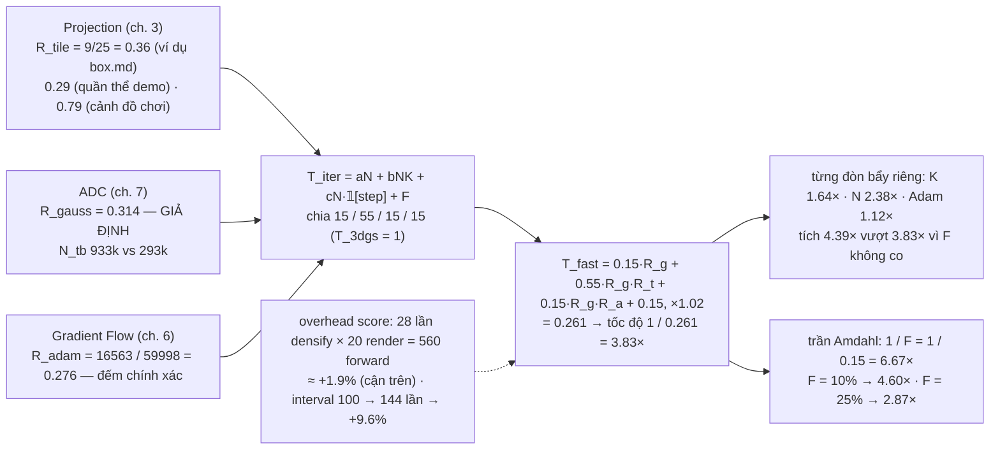
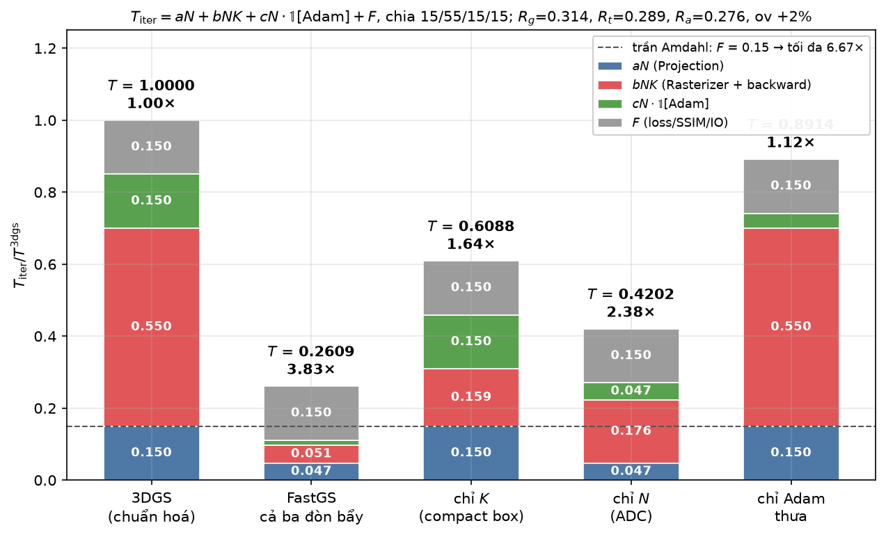
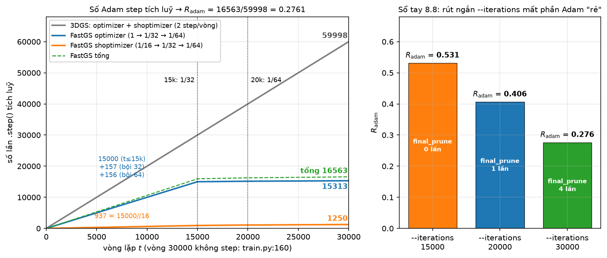
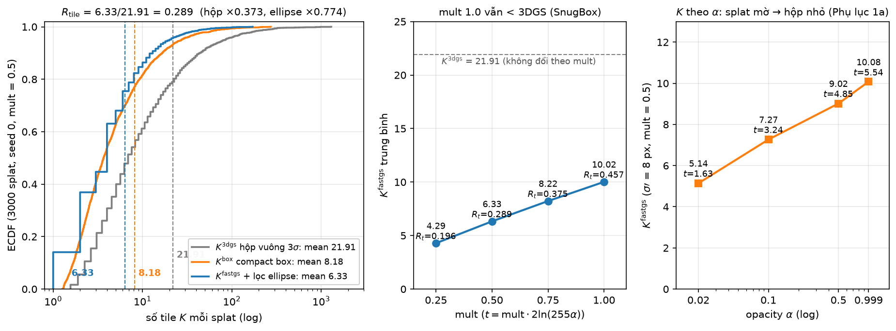
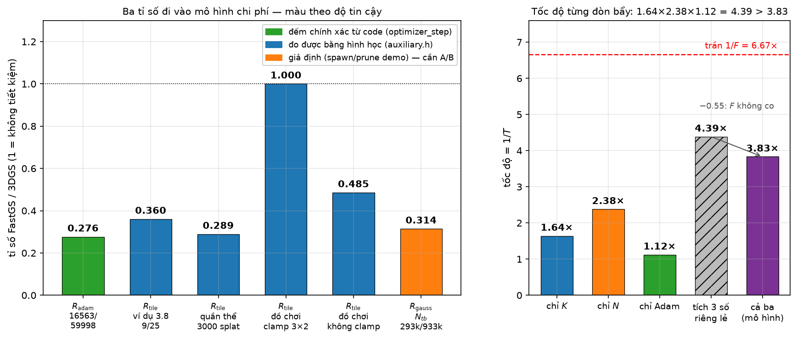
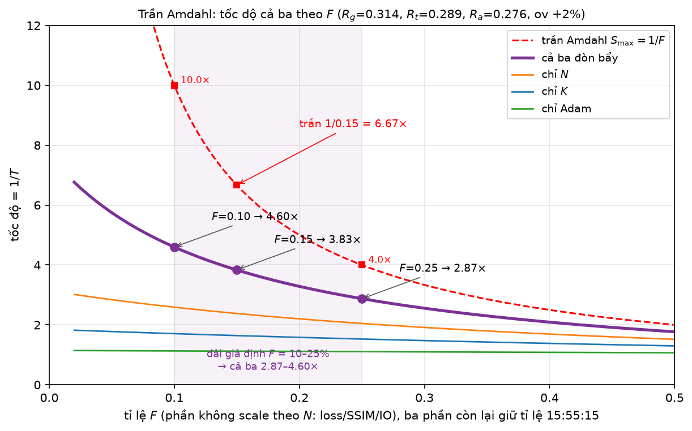
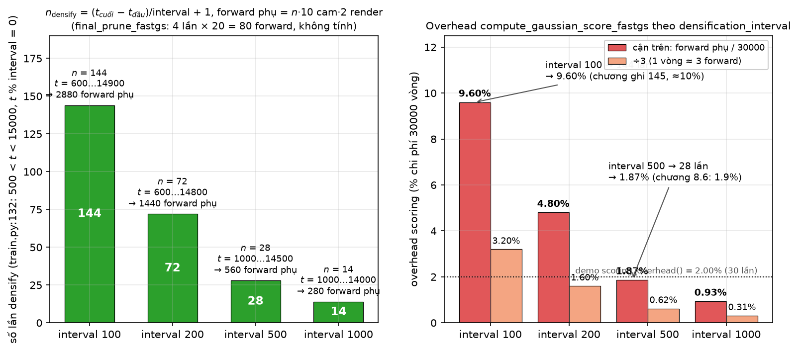

# Test số chương 8 — Tổng hợp: mô hình chi phí và ba đòn bẩy

> Tính trên cảnh đồ chơi ở `00-scene.md` (4 Gaussian, camera 1, ảnh $48\times32$) cho phần hình học,
> và trên lịch huấn luyện mặc định (`arguments/__init__.py`) cho phần đếm vòng lặp.
> Script sinh số: `scripts/ch08_test.py` (chỉ `numpy`; import lại `demos/fastgs_cost_model.py` để đối chiếu).
> Mọi số dưới đây là output thật của script, làm tròn 4 chữ số có nghĩa.
>
> Điều kiện chép từ code:
> `scene/gaussian_model.py:190-209` (`optimizer_step`), `train.py:66` (`range(1, iterations+1)`),
> `train.py:127,132` (`iteration < densify_until_iter` và `iteration > densify_from_iter and iteration % densification_interval == 0`),
> `train.py:152` (`iteration % 3000 == 0 and iteration > 15_000 and iteration < 30_000`),
> `train.py:160` (`if iteration < opt.iterations: optimizer_step`), `utils/fast_utils.py:13` (`num_cams = 10`, mỗi cam render 2 lần),
> `gaussian_model.py:174` (`highfeature_lr / 20`), `submodules/diff-gaussian-rasterization_fastgs/cuda_rasterizer/auxiliary.h:312-340`
> ($t=\texttt{mult}\cdot2\ln(255\alpha)$, `rect_min = int(bbox_min/16)`, `rect_max = min(grid, int(bbox_max/16 + 1))`).

## Sơ đồ khối: ba tỉ số nhân vào mô hình chi phí



## Kết quả script có sẵn — `python demos/fastgs_cost_model.py`

Output nguyên văn:

```
Quan the mo phong: 3000 splat, sigma' trung vi = 2.9 px, opacity trung binh = 0.66

======================================================================
PHEP DO 1 - So tile moi splat (hinh hoc, suy tu ma nguon)
======================================================================
  mult |   K_3dgs |    K_box |  K_fastgs |  R_tile
----------------------------------------------------
   1.0 |    21.91 |    13.65 |     10.00 |   0.457
   0.7 |    21.91 |    10.42 |      7.88 |   0.360
   0.5 |    21.91 |     8.18 |      6.36 |   0.290
   0.3 |    21.91 |     5.81 |      4.71 |   0.215

Tach hai nguon tiet kiem tai mult=0.5:
  hop vuong 3-sigma (3DGS)        K =   21.91   1.000
  compact box, chua loc ellipse   K =    8.18   0.373
  + loc tile theo ellipse         K =    6.36   0.290

PHU LUC 1a - K theo opacity (sigma'=8px dang huong, mult=0.5)
  [tai lap bang Section 4.3(b) cua tai lieu]
 opacity |      t |   ban kinh |  K_fastgs
--------------------------------------------
   0.999 |   5.54 |     2.35*s |     10.08
   0.500 |   4.85 |     2.20*s |      9.02
   0.100 |   3.24 |     1.80*s |      7.27
   0.020 |   1.63 |     1.28*s |      5.14

PHU LUC 1b - K theo do det (sigma_g=8px, o=1, mult=0.5)
  [tai lap bang Section 4.5 cua tai lieu]
  rho la THAM SO: sigma_max=8*rho, sigma_min=8/rho
  => ti le truc THAT = rho^2 (cot thu hai)
  rho | ti le truc |   K_3dgs |  K_fastgs |  R_tile
------------------------------------------------------
  1.0 |       1.0:1 |    16.00 |     10.08 |   0.630
  1.5 |       2.2:1 |    30.25 |     10.58 |   0.350
  2.0 |       4.0:1 |    49.00 |     11.84 |   0.242
  3.0 |       9.0:1 |   100.00 |     14.56 |   0.146
  5.0 |      25.0:1 |   256.00 |     20.38 |   0.080

======================================================================
PHEP DO 2 - So lan Adam step trong 30.000 vong (CHINH XAC tu code)
======================================================================
             |  optimizer |  shoptimizer |      tong
----------------------------------------------------
3DGS goc     |     29,999 |       29,999 |    59,998
fastgs-lite  |     15,313 |        1,250 |    16,563
ti so        |      0.510 |        0.042 |     0.276

======================================================================
PHEP DO 3 - So Gaussian trung binh (DINH TINH, spawn/prune gia dinh)
======================================================================
             |  N trung binh |      N cuoi
------------------------------------------
3DGS goc     |       933,036 |   1,371,694
fastgs-lite  |       292,773 |     329,750
ti so        |         0.314 |       0.240

======================================================================
GOP - chi phi 30.000 vong theo mo hinh
======================================================================
  R_tile  (mult=0.5, hinh hoc)   = 0.290
  R_gauss (GIA DINH)             = 0.314
  R_adam  (chinh xac)            = 0.276
  overhead scoring (fastgs)      = +2.0% chi phi raster

  Bat tung don bay mot, so voi 3DGS goc:
                                   |  tang toc
  ----------------------------------------------
  ca ba don bay                    |     3.83x
  chi compact box (mult=0.5)       |     1.64x
  chi giam so Gaussian             |     2.38x
  chi nhip Adam thua               |     1.12x

  Tran Amdahl (N -> 0, K -> 0): 6.7x
  -> phan chi phi khong scale theo N (loss/SSIM/IO) dat tran cung.

  LUU Y: day la MO HINH, khong phai so do A/B tren GPU. R_gauss la
  tham so gia dinh - no la thu duy nhat phai do that moi biet.
  Xem DOCS/fastgs-acceleration-method.md Phan VI de biet cach chay A/B.
```

Từng con số ứng với công thức nào ở chương 8:

| Dòng output | Công thức chương 8 | Ghi chú |
|---|---|---|
| `K_3dgs = 21.91` | 3.6: $r=\lceil3\sqrt{\lambda_{\max}}\rceil$, $K=(2r/16+1)^2$ (kì vọng theo vị trí tâm) | $K_{\text{REF}}$ dùng để hiệu chỉnh $b$ trong 8.2 |
| `K_box = 8.18` | 3.6: $\text{half}=\sqrt{t\,\Sigma'_{11,22}}$, $K=(2\text{half}_x/16+1)(2\text{half}_y/16+1)$ | chỉ compact box |
| `K_fastgs = 6.36`, `R_tile = 0.290` | 3.7 + 8.3: $R_{\text{tile}}=K_{\text{fast}}/K_{\text{3dgs}}$ | có lọc ellipse (AccuTile) |
| Phụ lục 1a: `t = 5.54 / 4.85 / 3.24 / 1.63` | 3.6: $t=\texttt{mult}\cdot2\ln(255\alpha)$ | trùng bảng $t$ ở 3.6 |
| Phụ lục 1b: `R_tile` giảm khi $\rho^2$ tăng | 3.6: hộp vuông lãng phí $\tfrac4\pi\rho$ | |
| `15,313 / 1,250 / 16,563`, `0.276` | 6.4 + 8.3: $R_{\text{adam}}=16563/59998$ | đếm t = 1..29999 |
| `N trung bình 933,036 / 292,773`, `0.314` | 8.3: $R_{\text{gauss}}=N_{\text{fast}}/N_{\text{3dgs}}$ | giả định spawn/prune; $N_{\text{REF}}=0.933$ triệu hiệu chỉnh $a,c$ |
| `overhead scoring +2.0%` | 8.6: $n_{\text{densify}}\cdot20/30000$ | demo đếm $15000//500=30$ lần, không phải 28 (xem 8.6) |
| `3.83x / 1.64x / 2.38x / 1.12x` | 8.2 + 8.5: $T_{\text{iter}}=aN+bNK+cN\cdot\mathbb 1+F$, split 15/55/15/15 | bảng 8.5 |
| `6.7x` | 8.4: $S_{\max}=1/f=1/0.15$ | trần Amdahl |

## 8.1 — Một vòng lặp huấn luyện làm gì

Không có số riêng; bảng 8.1 chỉ gán mỗi khối vào một số hạng của 8.2: Projection $\to aN$, Rasterizer + backward $\to bNK$, Adam $\to cN\cdot\mathbb 1[\text{step}]$, Loss/SSIM/IO $\to F$, ADC $\to$ overhead (8.6).

## 8.2 — Mô hình chi phí (chuẩn hoá)



*Hình: T_iter = aN + bNK + cN·𝟙[Adam] + F chia 15/55/15/15 cho 3DGS (=1.0) so với FastGS cả ba đòn bẩy và từng đòn bẩy riêng lẻ — tốc độ 3.83× / 1.64× / 2.38× / 1.12×.*


$$
T_{\text{iter}}=aN+bNK+cN\cdot\mathbb 1[\text{Adam}]+F,\qquad
\frac{T^{\text{fast}}}{T^{\text{3dgs}}}=a'R_{\text{gauss}}+b'R_{\text{gauss}}R_{\text{tile}}(1+\text{ov})+c'R_{\text{gauss}}R_{\text{adam}}+f
$$

với $(a',b',c',f)=(0.15,\ 0.55,\ 0.15,\ 0.15)$ là tỉ lệ bốn số hạng ở điểm làm việc của 3DGS ($T^{\text{3dgs}}=1$). Cách hiệu chỉnh này đúng bằng `_weights()` của demo ($a=0.15/N_{\text{REF}}$, $b=0.55/(N_{\text{REF}}K_{\text{REF}})$, …) nên chỉ cần ba tỉ số.

## 8.3 — Ba tỉ số

### (a) $R_{\text{adam}}$ — đếm vòng lặp theo lịch 6.4



*Hình: số step tích luỹ của optimizer/shoptimizer/3DGS theo t; subplot cho thấy rút ngắn --iterations làm R_adam tăng lên (ít step thưa hơn được hưởng) nhưng mất dần các lần final_prune.*


Công thức (`gaussian_model.py:190-209`):

$$
\mathbb 1_{\text{main}}(t)=\begin{cases}1&t\le15000\\ [t\bmod32=0]&15000<t\le20000\\ [t\bmod64=0]&t>20000\end{cases},\qquad
\mathbb 1_{\text{SH}}(t)=\begin{cases}[t\bmod16=0]&t\le15000\\ \mathbb 1_{\text{main}}(t)&t>15000\end{cases}
$$

Duyệt $t=1..29999$ (`train.py:160`: vòng 30000 không step):

| | $t\le15000$ | $(15000,20000]$ | $(20000,29999]$ | tổng |
|---|---|---|---|---|
| `optimizer` | 15000 | 157 | 156 | **15313** |
| `shoptimizer` | 937 | 157 | 156 | **1250** |
| 3DGS (mỗi vòng) | | | | 29999 + 29999 = **59998** |

Kiểm nhẩm: bội 32 trong $(15000,20000]$ $=625-468=157$; bội 64 trong $(20000,29999]$ $=468-312=156$; bội 16 trong $[1,15000]$ $=937$.

$$
R_{\text{adam}}=\frac{15313+1250}{59998}=\frac{16563}{59998}=\mathbf{0.2761}
\qquad(R_{\text{main}}=0.5105,\ R_{\text{SH}}=0.04167)
$$

Đối chiếu `demos.adam_steps(fastgs=True)` = (15313, 1250) → **khớp**. Nếu đếm nhầm cả vòng 30000 (chia hết 64): FastGS 16563 (không đổi vì demo cũng bỏ), 3DGS 60000 → 0.27605 — lệch ở chữ số thứ 5, không phải cách code chạy.

### (b) $R_{\text{tile}}$ — ba cách



*Hình: K^3dgs, K^box, K^fastgs trên quần thể splat mô phỏng của demos/fastgs_cost_model.py; K_fastgs trung bình tăng theo mult, mult=1.0 vẫn nhỏ hơn 3DGS gốc (SnugBox).*


**(i) Ví dụ chương 3.8**, $\Sigma'_{11}=117,~\Sigma'_{12}=54,~\Sigma'_{22}=36$, $\mu'=(120,88)$, $\alpha=1$, `mult` $=0.5$:

| Bước | Công thức | Thay số | Kết quả |
|---|---|---|---|
| $\lambda_{\max,\min}$ | $76.5\pm\sqrt{40.5^2+54^2}$ | $76.5\pm67.5$ | $144,\ 9$ ($\rho=4$) |
| $r$ | $\lceil3\sqrt{144}\rceil$ | | $36$ |
| rect 3DGS | $\lfloor(\mu'-r)/16\rfloor,\ \lfloor(\mu'+r+15)/16\rfloor$ | $[5,3],\ [10,8]$ | $K^{\text{3dgs}}=5\times5=25$ |
| $t$ | $0.5\cdot2\ln255$ | | $5.541$ |
| half | $\sqrt{t\cdot117},\ \sqrt{t\cdot36}$ | | $25.46,\ 14.12$ |
| rect compact | `int(bbox_min/16)`, `int(bbox_max/16+1)` | $[5,4],\ [10,7]$ | $K^{\text{box}}=5\times3=15$ |
| conic $(A,B,C)$ | $\Sigma'^{-1}$ | | $(0.02778,\ -0.04167,\ 0.09028)=(1/36,-1/24,13/144)$ |
| lọc ellipse | $\min_{\Delta\in T}\Delta^\top M\Delta\le t$ | mỗi hàng 3 tile | $K^{\text{fastgs}}=3+3+3=9$ |

$$R_{\text{tile}}^{(3.8)}=9/25=\mathbf{0.3600}$$ — `demos.tiles_fastgs(...)` với cùng $(\lambda,\theta,\alpha,\text{px},\text{py})$ cũng trả về 9.

**(ii) Quần thể mô phỏng** của demo (3000 splat, seed 0, gọi lại `sample_population` + `tile_stats(pop, 0.5)`):

$K_{\text{3dgs}}=21.91$, $K_{\text{box}}=8.177$, $K_{\text{fastgs}}=6.327$ → $R_{\text{tile}}^{\text{pop}}=\mathbf{0.2888}$ (demo in 0.290 vì demo chạy `mult`=1.0, 0.7 trước và tiêu thêm số ngẫu nhiên px, py; lệch $<0.5\%$). Hai nguồn tiết kiệm: hộp theo trục $\times0.373$, lọc ellipse thêm $\times0.774$.

**(iii) Cảnh đồ chơi**, camera 1 ($t_z=z+4$, $f_x=f_y=40$), $\alpha=0.1$, `mult` $=0.5$, lưới $3\times2$ tile.

Xấp xỉ ghi rõ: $\Sigma'\approx(f_x/t_z)^2s^2+0.3$ trên đường chéo, **bỏ** phần ngoài chéo của $J$ (số hạng $-f_xt_x/t_z^2$); $K^{\text{fastgs}}$ lấy bằng hộp compact half $=\sqrt{t\Sigma'}$, **không** lọc ellipse (ellipse tròn nên lọc chỉ bỏ được tile góc, ở đây không có tile góc nào thừa). $s_i=\sqrt{\text{mean}\,d^2}$ tới 3 láng giềng (chương 1). $t=0.5\cdot2\ln(25.5)=3.239$.

| $i$ | $s$ | $t_z$ | $\mu'$ | $\Sigma'_{11}$ | $r=\lceil3\sigma'\rceil$ | rect 3DGS (clamp) | $K^{\text{3dgs}}$ | half $=\sqrt{t\Sigma'}$ | rect FastGS (clamp) | $K^{\text{fast}}$ |
|---|---|---|---|---|---|---|---|---|---|---|
| 1 | 0.8505 | 4.0 | (23.50, 15.50) | 72.63 | 26 | $[0,3)\times[0,2)$ | 6 | 15.34 | $[0,3)\times[0,2)$ | 6 |
| 2 | 0.9434 | 4.5 | (27.94, 18.17) | 70.62 | 26 | $[0,3)\times[0,2)$ | 6 | 15.12 | $[0,3)\times[0,2)$ | 6 |
| 3 | 1.115 | 5.0 | (20.30, 13.90) | 79.87 | 27 | $[0,3)\times[0,2)$ | 6 | 16.08 | $[0,3)\times[0,2)$ | 6 |
| 4 | 0.8888 | 4.2 | (26.36, 10.74) | 71.96 | 26 | $[0,3)\times[0,2)$ | 6 | 15.27 | $[0,3)\times[0,2)$ | 6 |

$$P^{\text{3dgs}}=24,\quad P^{\text{fastgs}}=24\quad\Rightarrow\quad R_{\text{tile}}^{\text{toy}}=\mathbf{1.000}$$

Cảnh đồ chơi quá nhỏ: hộp 3DGS $2r\approx52$ px và hộp compact $2\cdot\text{half}\approx31$ px đều phủ hết ảnh $48\times32$, clamp vào lưới $3\times2$ nên hai hộp bằng nhau. Bỏ clamp (ảnh vô hạn): $P^{\text{3dgs}}=68$, $P^{\text{fastgs}}=33$ → $R_{\text{tile}}=0.4853$ — đây là số "hình học" thật của cảnh, nhưng kernel trả tiền theo tile bị clamp nên 1.000 mới là số đi vào chi phí của cảnh đồ chơi.

### (c) $R_{\text{gauss}}$ — **giả định**



*Hình: R_tile, R_gauss, R_adam theo độ tin cậy (đo/đếm/giả định); tích ba tốc độ riêng lẻ (4.39×) lớn hơn tốc độ thật khi kết hợp cả ba (3.83×) vì F không co theo đòn bẩy nào.*


Công thức đề bài $N_{\text{cuối}}=N_0[(1+r_{\text{spawn}})(1-r_{\text{prune}})]^n$, $N_0=4$:

| | $g=(1+r_s)(1-r_p)$ | $n$ | $N_{\text{cuối}}$ |
|---|---|---|---|
| 3DGS ($r_s=0.20$, $r_p=0.05$) | $1.140$ | 145 | $4\cdot1.14^{145}=7.133\times10^8$ |
| FastGS ($r_s=0.12$, $r_p=0.08$) | $1.030$ | 28 | $4\cdot1.0304^{28}=9.252$ |

$R_{\text{gauss}}=1.297\times10^{-8}$ — **phi thực tế** ($1.14^{145}$ nổ tung; 3DGS thật dừng ở vài triệu Gaussian nhờ prune opacity/size và VRAM). Chỉ minh hoạ $R_{\text{gauss}}$ nhạy theo $n$ và $r$ theo hàm mũ, và là tỉ số duy nhất phải đo A/B mới biết.

Bộ số của demo (đi vào bảng 8.5), $N_0=10^5$, interval 500, 29 lần densify ($t=500..14500$, demo dùng `it < 15000 and it % 500 == 0` — lệch 1 lần so với `train.py:132` là 28):

| | tham số | $N_{\text{tb}}$ | $N_{\text{cuối}}$ | kiểm tay |
|---|---|---|---|---|
| 3DGS | spawn 0.10, prune 0.005 | 933 036 | 1 371 694 | $10^5(1.10\cdot0.995)^{29}=1\,371\,694$ |
| FastGS | spawn 0.06, prune 0.010, final prune 5%×4 | 292 773 | 329 750 | $10^5(1.06\cdot0.99)^{29}\cdot0.95^4=329\,750$ |

$$R_{\text{gauss}}=\frac{292773}{933036}=\mathbf{0.3138}\ (\text{theo }N_{\text{tb}}),\qquad 0.2404\ (\text{theo }N_{\text{cuối}})$$

Mô hình chi phí dùng $N_{\text{tb}}$ vì chi phí tích luỹ theo mọi vòng.

## 8.4 — Trần Amdahl



*Hình: tốc độ cả ba đòn bẩy giảm khi F (phần không co được: loss, SSIM, IO) tăng, luôn dưới trần 1/F — tại F=15% tốc độ 3.83× nằm dưới trần 6.67×.*


$$S_{\max}=\frac1f=\frac1{0.15}=\mathbf{6.667\times}$$

## 8.5 — Kết quả mô hình (thay số)

Với $(R_{\text{gauss}},R_{\text{tile}},R_{\text{adam}})=(0.3138,\ 0.2888,\ 0.2761)$, overhead scoring của demo $2.00\%$ trên số hạng $bNK$:

| Cấu hình | $T^{\text{fast}}=0.15R_g+0.55R_gR_t(1+\text{ov})+0.15R_gR_a+0.15$ | $T$ | tốc độ $=1/T$ | bảng 8.5 |
|---|---|---|---|---|
| Cả ba | $0.15\cdot0.314+0.55\cdot0.314\cdot0.289\cdot1.02+0.15\cdot0.314\cdot0.276+0.15$ | 0.2609 | **3.833×** | 3.83 |
| Chỉ $K$ | $0.15+0.55\cdot0.289+0.15+0.15$ | 0.6088 | **1.642×** | 1.64 |
| Chỉ $N$ | $0.15\cdot0.314+0.55\cdot0.314\cdot1.02+0.15\cdot0.314+0.15$ | 0.4202 | **2.380×** | 2.38 |
| Chỉ Adam | $0.15+0.55+0.15\cdot0.276+0.15$ | 0.8914 | **1.122×** | 1.12 |
| Trần Amdahl | $F$ | 0.15 | 6.667× | 6.7 |

Bốn số khớp bảng 8.5. Tích ba đòn bẩy riêng lẻ $1.642\times2.380\times1.122=\mathbf{4.385}>3.833$: nhân được ở $bNK$ nhưng không nhân được ở $F$ (chương 8.5 ghi 4.37 do làm tròn).

Thay $R_{\text{tile}}$ bằng hai giá trị khác (không overhead):

| $R_{\text{tile}}$ | cả ba | chỉ $K$ | chỉ $N$ | chỉ Adam | tích riêng lẻ |
|---|---|---|---|---|---|
| 0.360 (ví dụ 3.8) | 3.674× | 1.543× | 2.400× | 1.122× | 4.154× |
| 1.000 (đồ chơi, clamp) | 2.613× | 1.000× | 2.400× | 1.122× | 2.692× |

Bảng nhạy theo $F$ (giữ tỉ lệ $15:55:15$ cho ba phần biến thiên, $R$ như dòng đầu):

| $F$ | split $(a',b',c',f)$ | $S_{\max}=1/F$ | cả ba | chỉ $K$ | chỉ $N$ | chỉ Adam |
|---|---|---|---|---|---|---|
| 0.10 | (0.159, 0.582, 0.159, 0.10) | 10.00 | 4.60× | 1.71× | 2.59× | 1.13× |
| 0.15 | (0.150, 0.550, 0.150, 0.15) | 6.67 | 3.83× | 1.64× | 2.38× | 1.12× |
| 0.25 | (0.132, 0.485, 0.132, 0.25) | 4.00 | 2.87× | 1.53× | 2.05× | 1.11× |

Tốc độ tổng nhạy mạnh với $F$ (2.87–4.60×) — đây là số giả định thứ hai sau $R_{\text{gauss}}$.

## 8.6 — Overhead riêng của FastGS (đếm bằng vòng lặp thật)



*Hình: số lần densify và forward phụ tăng khi densification_interval giảm — interval mặc định 500 cho overhead ~1.9%, interval 100 đẩy lên ~9.6%.*


Điều kiện `train.py:127,132`: `iteration < 15000 and iteration > 500 and iteration % interval == 0`.

| interval | đếm vòng lặp | đầu, cuối | công thức $(t_{\text{cuối}}-t_{\text{đầu}})/\text{interval}+1$ | forward phụ $=n\cdot10\cdot2$ | /30000 (cận trên) | ÷3 (1 vòng ≈ 3 forward) |
|---|---|---|---|---|---|---|
| 500 | **28** | 1000, 14500 | $(14500-1000)/500+1=28$ | 560 | 1.87% | 0.62% |
| 100 | **144** | 600, 14900 | $(14900-600)/100+1=144$ | 2880 | 9.60% | 3.20% |

- Interval 500 khớp chương 8.6 (28, 560, 1.9%, 0.6%).
- Interval 100: code cho **144**, không phải 145 như chương 8.6 ghi — vì `iteration > densify_from_iter` loại $t=500$; overhead 9.6% (chương ghi $\approx10\%$).
- `demos.scoring_overhead()` $=15000//500\cdot20/30000=0.0200$ đếm **30** lần (tính cả $t=500$ và $t=15000$, cả hai đều không chạy trong code); đếm đúng là $560/30000=0.0187$. Chênh lệch chỉ đổi tốc độ "cả ba" ở chữ số thứ ba.
- `final_prune_fastgs` (`train.py:152`): $t\in\{18000,21000,24000,27000\}$ → 4 lần, thêm 80 forward (0.27%), chương 8.6 không tính.

## 8.7 — Những gì FastGS-lite không đổi

Không có số; cả ba tỉ số trên chỉ thay đổi $N$, $K$, $\mathbb 1[\text{Adam}]$ — không có hệ số nào của $G(x)$, $\Sigma'$, $M$, blend, Adam, $\mathcal L$ xuất hiện trong script này.

## 8.8 — Sổ tay cấu hình → con số bị ảnh hưởng

| Thay đổi | Con số bị ảnh hưởng (đếm/tính lại) |
|---|---|
| `--iterations 15000` | duyệt $t=1..14999$: FastGS step $=14999+937=15936$, 3DGS $29998$ → $R_{\text{adam}}=0.5312$ (mất hết phần "rẻ"); `final_prune_fastgs` chạy **0** lần |
| `--iterations 20000` | FastGS $15156+1093=16249$, 3DGS $39998$ → $R_{\text{adam}}=0.4062$; `final_prune` **1** lần (18000) |
| `--iterations 30000` (mặc định) | $16563/59998=0.2761$; `final_prune` **4** lần (18000, 21000, 24000, 27000) |
| `--highfeature_lr 0.005` (mặc định) | lr Adam của `f_rest` $=0.005/20=0.00025$ |
| `--highfeature_lr 0.02` | $0.02/20=\mathbf{0.001}$ — không đổi số phép tính, không đổi $R_{\text{adam}}$ |
| `--mult 0.5` | $t(\alpha=1)=5.541$, half $=2.354\sigma'$; $t(\alpha=0.1)=3.239$, half $=1.800\sigma'$ |
| `--mult 1.0` | $t(\alpha=1)=\mathbf{11.08}$, half $=3.329\sigma'$; $t(\alpha=0.1)=6.477$, half $=2.545\sigma'$. $t\times2$, half $\times\sqrt2=1.4142$, diện tích $\times2$; $K_{\text{fastgs}}$ quần thể $6.33\to9.99$ (không về 3DGS 21.91 — SnugBox) |
| `--densification_interval 100` | $n_{\text{densify}}=144$, 2880 forward phụ, 9.60% cận trên (3.2% quy 3 forward/vòng) |
| `--densify_until_iter 20000` (interval 500) | $n_{\text{densify}}=38$; nhưng sau 15k optimizer chỉ step 1/32 nên densify tính trên gradient tích luỹ |
| `--dense`, so sánh A/B | không có số trong mô hình; ảnh hưởng $R_{\text{gauss}}$ — phải đo |

## Bảng tổng hợp ba tỉ số và tốc độ cuối

| Tỉ số | Giá trị | Nguồn gốc | Tin cậy |
|---|---|---|---|
| $R_{\text{adam}}$ | **0.2761** $=16563/59998$ | đếm vòng lặp theo `optimizer_step` | **đếm được chính xác** |
| $R_{\text{tile}}$ | **0.3600** (ví dụ 3.8) / **0.2888** (quần thể 3000 splat) / **1.000** (đồ chơi, clamp lưới $3\times2$; 0.4853 nếu không clamp) | hình học từ `auxiliary.h` | **đo được**, phụ thuộc phân bố splat |
| $R_{\text{gauss}}$ | **0.3138** ($N_{\text{tb}}$), 0.2404 ($N_{\text{cuối}}$) | spawn/prune giả định của demo | **giả định** — chưa có A/B |
| overhead scoring | 1.87% (28 densify) — demo dùng 2.0% (30) | đếm vòng lặp `train.py:132` | đếm được |
| split $(a',b',c',f)$ | 15/55/15/15 | profiling thường thấy | **giả định** |

| Tốc độ (split 15/55/15/15, ov 2%) | Giá trị |
|---|---|
| Cả ba đòn bẩy | **3.833×** |
| Chỉ compact box | 1.642× |
| Chỉ giảm $N$ | 2.380× |
| Chỉ Adam thưa | 1.122× |
| Tích ba số riêng lẻ | 4.385× |
| Trần Amdahl $1/0.15$ | 6.667× |
| Cả ba với $F=10\%$ / $25\%$ | 4.60× / 2.87× |

Kết luận: chỉ $R_{\text{adam}}$ và số lần densify là con số chắc chắn từ code; $R_{\text{tile}}$ đo được nhưng dao động 0.29–0.36 theo cảnh (và bằng 1 khi ảnh nhỏ tới mức bị clamp); $R_{\text{gauss}}$ và tỉ lệ $F$ là hai giả định quyết định tốc độ cuối nằm ở đâu trong khoảng 2.9–4.6×.

## Đầu vào của khối

| Đại lượng | Từ chương | Giá trị dùng |
|---|---|---|
| lịch Adam | 6.4 | $1\to1/32\to1/64$, SH $1/16$ |
| $t$, half, rect | 3.6–3.7 | `mult` 0.5, $\alpha$ = 1 (3.8) / 0.1 (đồ chơi) |
| $s_i$, $\mu'_i$ | 1, 3 | cảnh đồ chơi, camera 1 |
| lịch densify / final prune | 7 | `train.py:127,132,152` |

## Đầu ra của khối

$(R_{\text{adam}},R_{\text{tile}},R_{\text{gauss}})=(0.2761,\ 0.2888,\ 0.3138)$ → tốc độ mô hình $3.833\times$, trần $6.667\times$. Chương 8 là chương cuối; không có chương sau lấy dùng.
