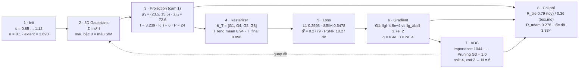

# Test số — 8 chương, 8 bot, một cảnh chung

Mỗi chương của `../` (01→08) có một bài test số: chạy công thức của chương trên **cùng một cảnh đồ chơi**
([`00-scene.md`](00-scene.md): 4 điểm SfM, 3 camera, ảnh 48×32 = 6 tile, $f_x=f_y=40$), in mọi số trung gian,
rồi ghi bảng "Đầu ra của khối" để chương sau dùng. Số trong markdown là output thật của script tương ứng
(`python DOCS/Report/test/scripts/chNN_test.py`, chỉ cần numpy + scipy).

| Chương | Bài test | Script | Số chốt |
|---|---|---|---|
| 1 Initialization | [01-test.md](01-test.md) | `ch01_test.py` | $s_i$ = 0.8505 / 0.9434 / 1.115 / 0.8888, $\tilde\alpha=-2.197$, **extent = 1.690** |
| 2 3D Gaussians | [02-test.md](02-test.md) | `ch02_test.py` | $\Sigma_i=s_i^2I$, màu bậc 0 khớp SfM, $D(t)$: 3→12→27→48 float SH |
| 3 Projection | [03-test.md](03-test.md) | `ch03_test.py` | $\Sigma'_{11}\approx72.6$, $t=3.239$, $K$: 72→58→57 tile, **R_tile = 0.792**; box.md 25→15→9 ✓ |
| 4 Rasterizer | [04-test.md](04-test.md) | `ch04_test.py` | $P=24$ cặp, khoá `0x0000000140800000`, $\bar T_{\text{final}}=0.898$ |
| 5 Loss | [05-test.md](05-test.md) | `ch05_test.py` | L1 = 0.2593, SSIM = 0.6478, **𝓛 = 0.2779**, PSNR = 10.27 dB |
| 6 Gradient | [06-test.md](06-test.md) | `ch06_test.py` | ‖g‖/‖g_abs‖ của $G_1$ = 4.8e−4 / 3.7e−2 (triệt tiêu 77×); step 15313/1250/**16563** |
| 7 ADC | [07-test.md](07-test.md) | `ch07_test.py` | Importance = 1044/1017/1066/974, Pruning = 0.77/0.45/**1.00**/0.00, split 4, xoá 2 → $N=6$ |
| 8 Tổng hợp | [08-test.md](08-test.md) | `ch08_test.py` | R_adam = 0.2761, tốc độ **3.833×** (K 1.64 · N 2.38 · Adam 1.12), Amdahl 6.67× |

## Cách đọc một bài test

Mỗi công thức trong chương gốc được "chạy" theo đúng ba nhịp, luôn cùng thứ tự:

| Nhịp | Nội dung | Ví dụ (chương 1, scale) |
|---|---|---|
| **Công thức** | chép nguyên từ chương / code, kèm số dòng | $\tilde s_i=\log\sqrt{d^2_{\text{knn3}}}$ — `gaussian_model.py:147-148` |
| **Thay số** | điền số của cảnh đồ chơi vào từng ký hiệu | $d^2=(0.59+1.2+0.38)/3=0.7233$ |
| **Kết quả** | số cuối + kiểm chứng ngược hoặc đối chiếu code | $\tilde s_1=-0.1619$, $s_1=e^{-0.1619}=0.8505$ |

Đầu mỗi file có một **sơ đồ mermaid** tóm tắt cả chương với đúng các con số đó, để nhìn một lần thấy số chạy từ đầu vào tới đầu ra. Ký hiệu chung xem [`../00-ky-hieu.md`](../00-ky-hieu.md).

## Số chạy xuyên suốt 8 chương

## Kiểm tra chéo giữa các bot

- mean\|I_rend − I_gt\| camera 1: bot 04 = 0.2593, bot 05 = 0.2593 ✓
- $\Sigma'_{11}$, conic, tập tile camera 1: bot 03 = bot 04 = bot 07 ✓
- $\bar g_i$: bot 06 (giải tích) vs bot 07 (sai phân ±0.5 px) chênh 1–10 %, cùng kết luận ✓
- Đếm Adam step: bot 06 = bot 08 = `demos/fastgs_cost_model.py` = 16563 ✓

## Chỗ lệch so với tài liệu chương (đã ghi trong từng file)

| File | Phát hiện |
|---|---|
| 06 | `∂L/∂B` code lưu một nửa (−½GΔuΔv) rồi nhân lại 2 ở `computeCov2DCUDA` backward — quy ước code, không phải lỗi |
| 08 | `train.py:132` với interval 100 cho **144** lần densify, không phải 145; `final_prune_fastgs` chạy 4 lần (+80 forward) chưa tính vào overhead |
| 07 | thứ tự thật trong `densify_and_prune_fastgs` là split rồi prune trên quần thể mới → $N=4$ thay vì 6 theo công thức 7.8 |
| 03 | cảnh đồ chơi: camera 1 cho R_tile = 1 vì cả hai hộp đều bị clamp lưới 3×2 — dạng cực đoan của lượng tử hoá "+1" |
