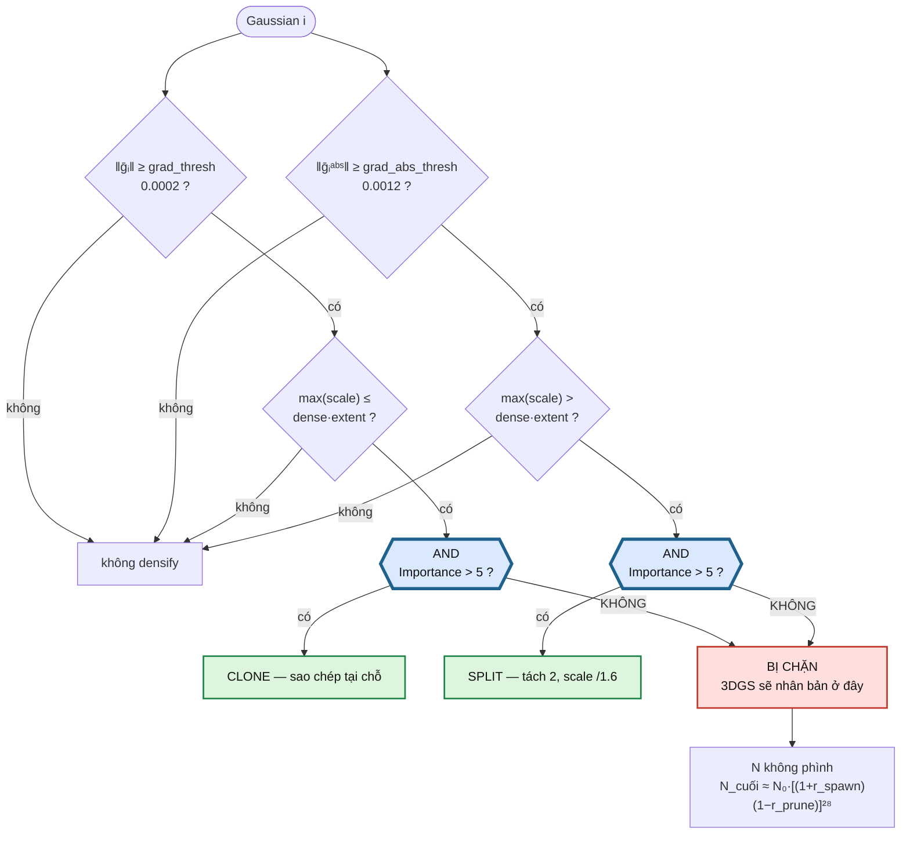
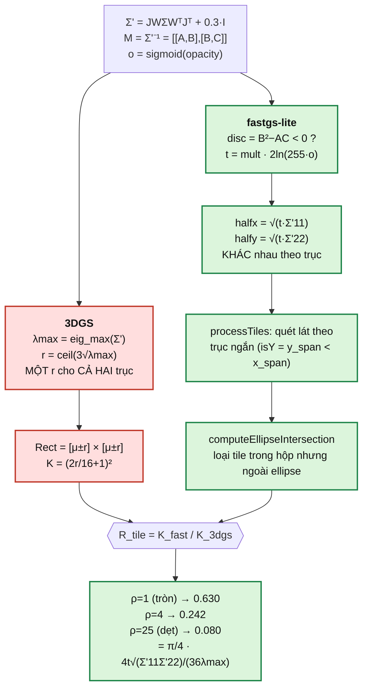
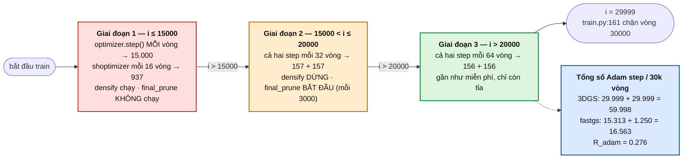
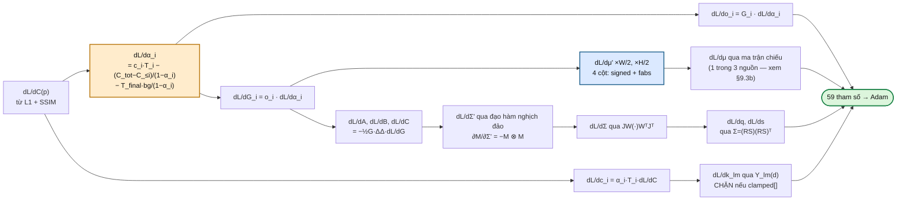

# Vì sao fastgs-lite nhanh hơn 3DGS — từ toán học 3DGS tới mô hình chi phí

> Tài liệu **tự chứa**: bắt đầu từ toán học 3D Gaussian Splatting, dựng ra **mô hình chi phí một vòng lặp huấn luyện**, rồi chỉ đúng chỗ mà fastgs-lite can thiệp vào từng số hạng của mô hình đó. Không giả định người đọc đã biết gì ngoài đại số tuyến tính cơ bản.
> Mọi công thức, hằng số và hành vi đều được đối chiếu với **code trong repo này** — không lấy con số nào từ paper upstream. Chỗ nào là suy luận chưa đo thì ghi rõ.
> Tên hàm/tham số trỏ thẳng tới mã nguồn: `utils/fast_utils.py`, `scene/gaussian_model.py`, `gaussian_renderer/__init__.py`, `train.py`, `submodules/diff-gaussian-rasterization_fastgs/`.
> Hai script chạy được, **không cần GPU**:
> - [`demos/fastgs_mechanisms.py`](../demos/fastgs_mechanisms.py) — mô phỏng NumPy từng cơ chế (tên hàm ghi ngay đầu mỗi phần).
> - [`demos/fastgs_cost_model.py`](../demos/fastgs_cost_model.py) — **phép đo** ba tỉ số chi phí ở Phần VI.

**Mục lục**

| Phần | Nội dung |
|---|---|
| [I](#phần-i--nền-tảng-toán-học-3d-gaussian-splatting) | Nền tảng toán học 3DGS: blending, chiếu covariance, loss, và vì sao phải chiếu 2D |
| [II](#phần-ii--mô-hình-chi-phí-một-vòng-lặp-huấn-luyện) | Mô hình chi phí một vòng lặp — nơi mọi lập luận tăng tốc phải quy về |
| [III](#phần-iii--đòn-bẩy-1-giảm-n-điểm-số-nhất-quán-đa-góc-nhìn) | Đòn bẩy 1 — giảm $N$: điểm số nhất quán đa góc nhìn, densify AND, hai đường prune |
| [IV](#phần-iv--đòn-bẩy-2-giảm-k-compact-box) | Đòn bẩy 2 — giảm $K$: compact box, và vì sao hộp vuông $3\sigma$ của 3DGS lãng phí |
| [V](#phần-v--đòn-bẩy-3-giảm-nhịp-cập-nhật-tham-số) | Đòn bẩy 3 — giảm nhịp Adam, và phép tách learning rate SH |
| [VI](#phần-vi--phép-đo-fastgs-lite-vs-3dgs) | **Phép đo** fastgs-lite vs 3DGS: ba tỉ số, kết quả mô hình, giao thức A/B thật |
| [VII](#phần-vii--ba-điều-mã-nguồn-nói-mà-readme-upstream-không-nói) | Ba điều mã nguồn nói mà README upstream không nói |
| [VIII](#phần-viii--đối-chiếu-công-thức-3dgs--fastgs) | **Đối chiếu công thức 3DGS ↔ fastgs-lite**: cái gì giữ nguyên, cái gì bị thay, 5 sơ đồ |
| [IX](#phần-ix--toán-học-đầy-đủ-của-bốn-số-hạng-chi-phí) | **Toán học đầy đủ** của $aN$, $bNK$, $cN$, $F$ — cả forward lẫn backward, đúng dạng kernel thực thi |

---
---

# Phần I — Nền tảng toán học 3D Gaussian Splatting

Phần này là nền tảng để đọc Phần II trở đi. Nếu bạn đã nắm chắc 3DGS, có thể nhảy thẳng tới [Phần II](#phần-ii--mô-hình-chi-phí-một-vòng-lặp-huấn-luyện) — nhưng §1.5 (từ toán sang kernel) thì nên đọc, vì toàn bộ mô hình chi phí dựng trên đó.

## 1.1 — Alpha-blending dựa trên điểm (Point-based Blending)

### Công thức (3) — Pha trộn màu tại pixel

$$C=\sum_{i\in N}c_i\,\alpha_i\prod_{j=1}^{i-1}(1-\alpha_j)$$

| Ký hiệu | Ý nghĩa |
|---|---|
| $C$ | Màu cuối cùng của pixel |
| $N$ | Số Gaussian chồng lên pixel đó, đã sắp xếp theo độ sâu (gần → xa) |
| $c_i$ | Màu của Gaussian thứ $i$ |
| $\alpha_i$ | Độ mờ (opacity) của Gaussian $i$ tại **đúng vị trí pixel đang xét** |
| $T_i=\prod_{j=1}^{i-1}(1-\alpha_j)$ | Độ truyền qua tích luỹ — phần ánh sáng còn lại sau khi bị các Gaussian phía trước che bớt |

**Bản chất:** GS biểu diễn cảnh bằng một tập **hữu hạn** các Gaussian 3D rời rạc. Khi render, các Gaussian phủ lên một pixel được sắp xếp theo độ sâu rồi blend tuần tự từ gần đến xa — điểm gần nhất đóng góp trọn vẹn $\alpha_1$, điểm sau bị chiết khấu bởi phần đã được "hấp thụ".

Công thức kế thừa từ dòng **point-based neural rendering** (Kopanas et al. 2021, 2022), được 3D Gaussian Splatting (Kerbl et al. 2023) dùng làm cơ chế blending chính.

**Ví dụ số:** 3 Gaussian phủ 1 pixel, sắp theo thứ tự gần→xa:

| i | màu $c_i$ | $\alpha_i$ | $T_i=\prod(1-\alpha_j)$ | đóng góp $T_i\alpha_ic_i$ |
|---|---|---|---|---|
| 1 | đỏ (1,0,0) | 0.5 | 1.0 | (0.5, 0, 0) |
| 2 | xanh lá (0,1,0) | 0.4 | 0.5 | (0, 0.2, 0) |
| 3 | xanh dương (0,0,1) | 0.6 | 0.3 | (0, 0, 0.18) |

$$C = (0.5,\ 0.2,\ 0.18)$$

Nếu nền trắng $(1,1,1)$, độ truyền qua còn lại $T_4=0.5\times0.6\times0.4=0.12$:

$$C_{\text{final}} = (0.5,0.2,0.18) + 0.12\times(1,1,1) = (0.62,\ 0.32,\ 0.30)$$

Gaussian gần nhất đóng góp nhiều nhất dù không có $\alpha$ cao nhất — vì chưa bị điểm nào che ($T_1=1$). Đây là lý do **depth sorting** cực kỳ quan trọng: đổi thứ tự sẽ ra màu khác hẳn dù $\alpha_i, c_i$ không đổi.

> **Đây cũng là mầm của toàn bộ vấn đề tốc độ.** Blending là tuần tự có thứ tự, nên trước khi blend phải **sort**. Sort cái gì, và bao nhiêu phần tử — chính là số hạng đắt nhất trong mô hình chi phí ở Phần II.

---

## 1.2 — Biểu diễn và chiếu 3D Gaussian

### Công thức (4) — Hàm phân phối 3D Gaussian cơ bản

$$G(x)=e^{-\frac{1}{2}x^T\Sigma^{-1}x}$$

- $x$: vị trí tương đối so với tâm Gaussian ($x = \mathbf{p} - \boldsymbol{\mu}$)
- $\Sigma$: ma trận hiệp phương sai, quyết định hình dạng, kích thước, hướng của "quả bóng" Gaussian
- $G(x)$: giá trị mật độ tại $x$, cực đại $=1$ tại tâm, giảm theo khoảng cách Mahalanobis

**Vai trò trong blending:** $\alpha_i$ ở công thức (3) không phải hằng số cho cả Gaussian — nó bằng opacity học được $\alpha'_i$ nhân với giá trị Gaussian tại đúng vị trí pixel:

$$\alpha_i = \alpha'_i \cdot G(x)$$

Càng xa tâm, $\alpha_i$ giảm **theo hàm mũ** — tạo biên mờ tự nhiên thay vì cạnh cứng. Tính chất "giảm theo hàm mũ" này là thứ Phần IV khai thác: sau một khoảng cách nhất định, đóng góp nhỏ hơn cả bước lượng tử của kênh 8-bit, nên **không cần rasterize nữa**.

> **Lưu ý về ký hiệu:** công thức (4) viết $\Sigma^{-1}$ như định nghĩa Gaussian **tổng quát**, dùng chung cho 3D (công thức 6) lẫn 2D. Khi thực sự tính $\alpha$ tại một pixel, $\Sigma$ ở đây phải hiểu ngầm là $\Sigma'$ (đã chiếu 2D, công thức 5), **không phải** $\Sigma$ 3D gốc. Cách viết rõ ràng hơn:
> $$\alpha_i(\mathbf{x}) = \alpha'_i \exp\left(-\tfrac{1}{2}(\mathbf{x}-\boldsymbol{\mu}'_i)^T{\Sigma'_i}^{-1}(\mathbf{x}-\boldsymbol{\mu}'_i)\right)$$

### Công thức (5) — Chiếu covariance từ 3D xuống 2D (Splatting)

$$\Sigma'=JW\Sigma W^T J^T$$

| Ký hiệu | Ý nghĩa |
|---|---|
| $\Sigma$ | Hiệp phương sai 3D gốc (world space) |
| $W$ | Ma trận biến đổi view (world → camera space) |
| $J$ | Jacobian của phép chiếu xạ ảnh — tuyến tính hoá cục bộ phép chiếu phối cảnh phi tuyến |
| $\Sigma'$ | Hiệp phương sai 2D sau khi chiếu lên mặt phẳng ảnh (screen space) |

**Vai trò:** biến một ellipsoid Gaussian 3D thành một **vệt elip 2D** trên màn hình — "splat". Một Gaussian 3D chiếu xuống vẫn cho ra một Gaussian 2D, nên chỉ cần tính $\Sigma'$ **một lần mỗi Gaussian mỗi khung hình**, rồi dùng công thức (4) phiên bản 2D cho từng pixel.

Trong code, kernel không giữ $\Sigma'$ mà giữ **conic** — nghịch đảo của nó:

$$M=\Sigma'^{-1}=\begin{pmatrix}A&B\\B&C\end{pmatrix}$$

`forward.cu:232` đóng gói `conic = {cov.z, -cov.y, cov.x} / det`, `forward.cu:244`, rồi nhét cùng opacity vào một `float4` tên `con_o` (`.x=A, .y=B, .z=C, .w=o`). Toàn bộ Phần IV làm việc trên $M$ và $o$ này.

### Công thức (6) — Phân rã ma trận hiệp phương sai 3D

$$\Sigma=RSS^TR^T$$

| Ký hiệu | Ý nghĩa |
|---|---|
| $R$ | Ma trận xoay 3×3 (tham số hoá bằng quaternion khi tối ưu) |
| $S$ | Ma trận tỷ lệ (scale), dạng đường chéo |

**Tại sao cần phân rã?** $\Sigma$ phải luôn bán xác định dương. Tối ưu trực tiếp các phần tử của $\Sigma$ bằng gradient descent rất dễ vi phạm ràng buộc này. Tham số hoá qua $R$ (trực giao — luôn hợp lệ) và $S$ (đường chéo dương) khiến $RSS^TR^T$ **luôn tự động** hợp lệ, bất kể cập nhật thế nào.

**Tham số học được của mỗi Gaussian** — đếm cho đúng, vì Phần II cần con số này:

| Nhóm | Số chiều |
|---|---|
| Vị trí $\boldsymbol{\mu}$ | 3 |
| Rotation quaternion | 4 |
| Scale $S$ | 3 |
| Opacity $\alpha'$ | 1 |
| SH bậc 0 (`features_dc`) | 3 |
| SH bậc 1–3 (`features_rest`) | 45 |
| **Tổng** | **59** |

Adam giữ 2 moment cho mỗi tham số ⇒ **~177 float mỗi Gaussian** chỉ riêng trạng thái optimizer. Đây là lý do số Gaussian $N$ vừa quyết định thời gian, vừa quyết định VRAM.

---

## 1.3 — Hàm mất mát

### Công thức (7) — Loss tổng quát

$$\mathcal{L}=(1-\lambda)\mathcal{L}_1+\lambda\,\mathcal{L}_{\text{D-SSIM}}$$

| Ký hiệu | Ý nghĩa |
|---|---|
| $\mathcal{L}_1$ | Sai số tuyệt đối trung bình giữa ảnh render và ground-truth |
| $\mathcal{L}_{\text{D-SSIM}}$ | Loss cấu trúc (Structural Dissimilarity) |
| $\lambda$ | Trọng số cân bằng. Mặc định `arguments/__init__.py:82` là **0.2** và `train_base.sh`/`train_big.sh` không truyền cờ này; chỉ preset notebook `pipeline/config.py:44` đặt **0.25** — xem bảng đầy đủ ở §9.5 |

Loss này lan truyền gradient ngược về mọi tham số của từng Gaussian qua chuỗi (5)→(4)→(3), đồng thời điều khiển **adaptive density control** (thêm/xoá/tách Gaussian).

Điểm cần nhớ cho Phần II: $\mathcal{L}$ tính trên **toàn ảnh $H\times W$** — chi phí của nó **không phụ thuộc $N$**. Đây là số hạng "cố định" đặt trần Amdahl cho mọi nỗ lực tăng tốc.

---

## 1.4 — Vì sao phải chiếu Gaussian xuống 2D?

### Hai cách khả dĩ để tính $\alpha$ tại một pixel

**Cách 1 — giữ nguyên 3D, ray-tracing (như NeRF):** bắn tia từ camera qua pixel → tìm giao với từng Gaussian → tính $x$ = giao điểm trừ tâm → đưa vào (4). Chi phí lớn: mỗi pixel phải duyệt/tính giao trong không gian 3D không có cấu trúc lưới.

**Cách 2 — chiếu xuống 2D rồi rasterize (GS):** tính trước $\Sigma'$ cho mỗi Gaussian → biết ngay bounding box pixel bị phủ → với mỗi pixel, $x=(u,v)-\boldsymbol{\mu}'$ chỉ là phép trừ 2D → đưa vào (4) với $\Sigma'^{-1}$.

### Vì sao không tính thẳng bằng $\Sigma^{-1}$ (3D)?

Khoảng cách Mahalanobis $x^T\Sigma^{-1}x$ trong 3D đo độ gần/xa trong không gian thật, nhưng cái cần để tô pixel là độ gần/xa trong **không gian ảnh** — hai đại lượng **không tương đương tuyến tính** vì phép chiếu phối cảnh phi tuyến:

- **Foreshortening theo góc nhìn:** Gaussian hình cầu nhìn nghiêng trông dẹt thành elip — phụ thuộc góc nhìn, điều $\Sigma$ 3D cố định không tự phản ánh.
- **Phối cảnh theo khoảng cách:** Gaussian gần trông to, xa trông nhỏ dù $\Sigma$ không đổi — quan hệ phi tuyến, nên cần $J$ để tuyến tính hoá cục bộ quanh tâm.

### Tóm tắt

| Không chiếu (giữ 3D) | Có chiếu xuống 2D |
|---|---|
| Ray-cast dò giao điểm cho từng pixel | Biết ngay bounding box pixel bị phủ |
| $x$ = kết quả giao tia–ellipsoid (tốn kém) | $x$ = phép trừ toạ độ 2D đơn giản |
| Không tận dụng rasterization của GPU | Tận dụng trực tiếp pipeline rasterize GPU |
| Chậm (giây–phút/khung hình) | Real-time (hàng trăm FPS) |

**Đóng góp cốt lõi của 3DGS** là biến bài toán render từ **ray-tracing** (đắt) thành **rasterization** (rẻ), mà vẫn giữ tính chất mượt của volume rendering nhờ biên Gaussian mờ dần.

---

## 1.5 — Từ toán sang kernel: rasterization theo tile

Đây là mắt xích nối Phần I với Phần II. Sau khi có $\Sigma'$, kernel **không** duyệt pixel trực tiếp — nó chia ảnh thành lưới **tile 16×16** rồi làm bốn bước:

| Bước | Kernel | Đơn vị chi phí |
|---|---|---|
| **(a) Preprocess** | `preprocessCUDA` (`forward.cu`) | mỗi **Gaussian**: chiếu $\Sigma\to\Sigma'$, nghịch đảo ra conic, đánh giá 48 hệ số SH ra màu RGB |
| **(b) Duplicate** | `duplicateToTilesTouched` (`auxiliary.h:294`) | mỗi **cặp (tile, Gaussian)**: sinh một khoá 64-bit `(tile_id, depth)` |
| **(c) Sort** | radix sort trên toàn bộ khoá | mỗi **cặp**, $O(P)$ với radix sort |
| **(d) Blend** | `renderCUDA` | mỗi **cặp**, nhân với số pixel trong tile mà splat còn đóng góp |

Gọi:

$$N=\text{số Gaussian},\qquad K=\text{số tile trung bình một splat chạm},\qquad P=N\cdot K$$

$P$ là **số cặp (tile, Gaussian)** — đại lượng trung tâm. Ba trong bốn bước trên tỉ lệ với $P$, không phải với $N$. Đây là điều quan trọng nhất cần rút ra từ Phần I:

> **Chi phí render không tỉ lệ với số Gaussian. Nó tỉ lệ với số Gaussian nhân số tile mỗi Gaussian.**
>
> Nên có **hai** cách làm nó rẻ đi: giảm $N$ (Phần III) hoặc giảm $K$ (Phần IV). fastgs-lite làm cả hai.

Backward chạy đúng cấu trúc đó theo chiều ngược (`backward.cu`), với chi phí cùng bậc — thường 2–3× forward vì phải tích luỹ gradient cho 59 tham số qua đường atomics.

---
---

# Phần II — Mô hình chi phí một vòng lặp huấn luyện

> Mô phỏng chạy được: [`demos/fastgs_cost_model.py`](../demos/fastgs_cost_model.py).

## 2.1 — Bốn số hạng

Một vòng lặp huấn luyện 3DGS làm đúng năm việc: render một ảnh, tính loss, backward, cập nhật tham số, và (định kỳ) densify. Gộp lại:

$$\boxed{\;T_{\text{iter}} \;=\; \underbrace{a\,N}_{\text{preprocess}} \;+\; \underbrace{b\,N K}_{\text{dup + sort + blend + backward}} \;+\; \underbrace{c\,N\cdot\mathbb{1}[\text{có Adam step}]}_{\text{optimizer}} \;+\; \underbrace{F}_{\text{loss, SSIM, IO}}\;}$$

| Số hạng | Tỉ lệ với | Vì sao |
|---|---|---|
| $a\,N$ | $N$ | Mỗi Gaussian: một phép chiếu $JW\Sigma W^TJ^T$, một phép nghịch đảo 2×2, một lần đánh giá SH bậc 3 (48 hệ số) |
| $b\,NK$ | $N\cdot K$ | Sinh khoá, radix sort, blend, và backward của blend — tất cả duyệt trên tập cặp (tile, Gaussian) |
| $c\,N$ | $N$ | Adam trên $59N$ tham số + $2\times 59N$ moment. Chỉ tính khi vòng đó thực sự `step()` |
| $F$ | — | $\mathcal{L}_1$ + SSIM trên ảnh $H\times W$, đọc ảnh GT, overhead Python/CUDA launch. **Không phụ thuộc $N$** |

Ba đại lượng có thể can thiệp: $N$, $K$, và tần suất $\mathbb{1}[\text{Adam}]$. $F$ thì không.

## 2.2 — Ba tỉ số, và vì sao chúng nhân nhau

Đặt tỉ số fastgs-lite so với 3DGS:

$$R_{\text{gauss}}=\frac{N_{\text{fast}}}{N_{\text{3dgs}}},\qquad
R_{\text{tile}}=\frac{K_{\text{fast}}}{K_{\text{3dgs}}},\qquad
R_{\text{adam}}=\frac{\#\text{step}_{\text{fast}}}{\#\text{step}_{\text{3dgs}}}$$

Số hạng rasterization — số hạng nặng nhất — co theo **tích**:

$$b\,N_{\text{fast}}K_{\text{fast}} = b\,N_{\text{3dgs}}K_{\text{3dgs}}\cdot R_{\text{gauss}}R_{\text{tile}}$$

Đây là điểm mấu chốt về mặt toán: hai đòn bẩy **nhân** nhau chứ không **cộng**. Giảm 3× số Gaussian và 3.4× số tile mỗi splat cho ra **~10×** trên số hạng rasterization, dù mỗi cái riêng lẻ chỉ khiêm tốn.

## 2.3 — Trần Amdahl

Cho $N\to 0$ và $K\to 0$, $T_{\text{iter}}\to F$. Nên tăng tốc tối đa có thể đạt được là:

$$S_{\max}=\frac{T_{\text{iter}}^{\text{3dgs}}}{F}=\frac{1}{f}\quad\text{với } f=\frac{F}{T_{\text{iter}}^{\text{3dgs}}}$$

Nếu loss + SSIM + IO chiếm 15% một vòng 3DGS thì **không cơ chế nào đưa tăng tốc vượt 6.7×**, dù có xoá sạch mọi Gaussian. Đây là lý do các con số tăng tốc thực tế của họ 3DGS nhanh đều nằm trong khoảng 2–5× chứ không phải 50×, và là lý do phải đo $f$ trước khi đặt kỳ vọng.

fastgs-lite còn **thêm** một chi phí mà 3DGS không có: `compute_gaussian_score_fastgs` render thêm $10\times2=20$ ảnh mỗi lần densify.

**Đếm số lần densify cho đúng.** Điều kiện trong code là `iteration > densify_from_iter and iteration % densification_interval == 0`, nằm trong `if iteration < densify_until_iter` (`train.py:127,132`; `pipeline/trainer.py:122,126`). Với `densify_from_iter=500`, `densification_interval=500`, `densify_until_iter=15000`, các vòng thoả điều kiện là $1000, 1500, \dots, 14500$:

$$n_{\text{densify}}=\frac{14500-1000}{500}+1=\mathbf{28}\qquad(\text{không phải }30)$$

**Quy ra chi phí.** $28\times20=560$ lượt **forward** phụ. Nhưng một vòng train là *forward + backward*, mà §1.5 đã nói backward tốn 2–3× forward, nên một vòng $\approx 3$ forward-equivalent:

| Cách quy đổi | Phép tính | Overhead |
|---|---|---|
| Thô — coi 1 render phụ $=$ 1 vòng train (**cận trên**) | $560/30000$ | +1.9% |
| Có tính backward — 1 vòng $\approx 3$ forward (**sát thực tế hơn**) | $560/(30000\times 3)$ | **+0.6%** |

Cost model ở §6.5 dùng **cận trên $+2\%$** cho an toàn: thà trừ nhiều hơn thực tế còn hơn báo một con số tăng tốc ảo. Overhead này **tăng tuyến tính** khi hạ `densification_interval` — xem §7.3.

---
---

# Phần III — Đòn bẩy 1: giảm $N$ (điểm số nhất quán đa góc nhìn)

3DGS gốc phình số Gaussian vì Adaptive Density Control nhân bản ở **mọi** vùng có gradient lớn, kể cả vùng đã hội tụ — tới hàng triệu điểm. fastgs-lite thay tiêu chí đó bằng câu hỏi khác hẳn:

> Thay vì *"Gaussian này có gradient lớn không?"* → *"Nhiều camera có cùng đồng ý rằng chỗ này đang sai không?"*

## 3.1 — Sáu công thức, một luồng dữ liệu

> Mô phỏng: `normalize_minmax()`, `error_mask()`, `accum_metric_counts()`, `merge_views()` trong [`demos/fastgs_mechanisms.py`](../demos/fastgs_mechanisms.py) (mục "1." và "2.").

Toàn bộ cơ chế nằm trong **một hàm duy nhất**: `compute_gaussian_score_fastgs` (`utils/fast_utils.py:33`), chạy trước mỗi lần densify. Nó lấy mẫu **10 camera ngẫu nhiên** (`sampling_cameras`, `fast_utils.py:10`) rồi chạy sáu phép biến đổi nối tiếp, đưa dữ liệu đi từ *ảnh* → *pixel* → *Gaussian*:

```
 ảnh render r, ground-truth g   (mỗi góc nhìn j trong K = 10 góc)
            │
            │  ①  trung bình L1 qua 3 kênh màu
            ▼
   e^j(u,v)            sai số THÔ tại từng pixel        [H×W, giá trị tuỳ cảnh]
            │
            │  ②  chuẩn hoá min–max toàn ảnh
            ▼
   M^j(u,v)            bản đồ lỗi CHUẨN HOÁ             [H×W, giá trị 0..1]
            │
            │  ③  so với ngưỡng tau_loss
            ▼
   M^j_mask(u,v)       mặt nạ NHỊ PHÂN                  [H×W, giá trị {0,1}]
            │
            │  ④  render lượt 2, atomicAdd trong kernel
            ▼
   counts^j_i          mỗi GAUSSIAN phủ bao nhiêu pixel lỗi   [P số nguyên]
            │
            ├──────────────────────────┐
            │  ⑤ trung bình qua K view │  ⑥ loss toàn ảnh (mỗi view 1 số)
            ▼                          ▼
   Importance_i                 ⑦ tổng_j (counts × L_photo) rồi min–max
   → điều khiển DENSIFY                ▼
                                Pruning_i
                                → điều khiển PRUNE
```

Nhánh trái và nhánh phải **dùng chung** `counts^j_i` — chỉ khác cách gộp qua các góc nhìn. Đó là lý do một lượt tính cho ra hai điểm số.

> 📌 **Về cách đánh số.** Trong phần này, "công thức (6)–(11)" là số hiệu trong **bài báo FastGS** (arXiv 2511.04283). Đừng nhầm với "Công thức (3)–(7)" ở Phần I — đó là số hiệu của **bài báo 3DGS gốc**. Để tránh lẫn, mỗi bước ở đây còn có một nhãn riêng ① … ⑦ dùng xuyên suốt tài liệu.

### Bảng đối chiếu: công thức trong bài báo ↔ dòng code

| Bài báo | Tên trong tài liệu này | Vị trí trong code | Khác biệt cần biết |
|---|---|---|---|
| (6) $e^j_{u,v}$ | ① Sai số màu từng pixel | `utils/fast_utils.py:22` | — |
| (7) $\mathcal{M}^j$ | ② Chuẩn hoá min–max | `utils/fast_utils.py:23` | — |
| (8) $\mathcal{M}^j_{mask}$ | ③ Ngưỡng hoá nhị phân | `utils/fast_utils.py:70` | $\tau=0.1$, **không** phải 0.3 |
| (9) $s^i_d$ | ④+⑤ Importance score | `forward.cu:404-410` + `fast_utils.py:76-80, 90` | $\Omega_i$ là footprint **hữu hình**, không phải ellipse đầy đủ; $\tfrac1K$ là **chia lấy nguyên** |
| (10) $E^j_{photo}$ | ⑥ Photometric loss toàn ảnh | `utils/fast_utils.py:27-31` | $\lambda=0.2$ hardcode, không đọc `--lambda_dssim` |
| (11) $s^i_p$ | ⑦ Pruning score | `utils/fast_utils.py:82-87` | Điểm **cao ⇒ bị XOÁ**, không phải "quan trọng nên giữ" |

### Bài toán chạy xuyên suốt

Để mỗi công thức có một ví dụ **nối tiếp được** với công thức trước, cả §3.1 và §3.2 dùng chung một bài toán đồ chơi:

- Ảnh $2\times2$ = 4 pixel, đặt tên $A,B,C,D$.
- 3 Gaussian $G_1,G_2,G_3$ với vùng phủ 2D (footprint) ở góc nhìn $j=1$:

| Gaussian | $\Omega_i$ ở view 1 |
|---|---|
| $G_1$ | $\{A, D\}$ |
| $G_2$ | $\{B, C\}$ |
| $G_3$ | $\{A, B, C, D\}$ |

Ảnh thật dĩ nhiên là $\sim10^6$ pixel và $P\sim10^5$ Gaussian; sau mỗi công thức đồ chơi sẽ có thêm một ví dụ **ở quy mô thật** để thấy các ngưỡng trong code (`0.1`, `5`, `0.9`) thực sự rơi vào đâu.

---

### ① Sai số màu tại mỗi pixel — công thức (6)

$$e^j_{u,v}=\frac{1}{C'}\sum_{c'=1}^{C'}\bigl|\,r^{\,j,c'}_{u,v}-g^{\,j,c'}_{u,v}\,\bigr|
\qquad C'=3\ (\text{R},\text{G},\text{B})$$

Đây là **sai số L1 trung bình qua kênh màu**, cho ra một bản đồ $H\times W$ **một kênh**. Trong code:

```python
# utils/fast_utils.py:21-25 — hàm get_loss
def get_loss(reconstructed_image, original_image):
    l1_loss = torch.mean(torch.abs(reconstructed_image - original_image), 0).detach()
    ...
```

Ba chi tiết đọc được từ đúng dòng này:

| Chi tiết code | Ý nghĩa |
|---|---|
| `dim=0` trong `torch.mean(..., 0)` | Tensor ảnh có layout `(C, H, W)`, nên **dim 0 chính là kênh màu** — đúng $\frac{1}{C'}\sum_{c'}$. Kết quả shape `(H, W)`. |
| `.detach()` | Bản đồ lỗi **không tham gia autograd**. Đây là tín hiệu điều khiển cấu trúc, không phải loss để backward. |
| Không có `**2` | L1 chứ không phải L2 — ít bị chi phối bởi vài pixel outlier cực đại hơn. |

**Ví dụ đồ chơi.** Giá trị RGB thang $[0,1]$ ở góc nhìn $j=1$:

| Pixel | render $r$ | ground-truth $g$ | $\lvert\Delta R\rvert,\lvert\Delta G\rvert,\lvert\Delta B\rvert$ | $e_{u,v}$ |
|---|---|---|---|---|
| $A$ | $(0.50,\,0.60,\,0.40)$ | $(0.80,\,0.65,\,0.35)$ | $0.30,\ 0.05,\ 0.05$ | $0.40/3=\mathbf{0.1333}$ |
| $B$ | $(0.30,\,0.31,\,0.29)$ | $(0.32,\,0.29,\,0.31)$ | $0.02,\ 0.02,\ 0.02$ | $0.06/3=\mathbf{0.02}$ |
| $C$ | $(0.20,\,0.25,\,0.20)$ | $(0.25,\,0.20,\,0.15)$ | $0.05,\ 0.05,\ 0.05$ | $0.15/3=\mathbf{0.05}$ |
| $D$ | $(0.10,\,0.50,\,0.20)$ | $(0.40,\,0.30,\,0.60)$ | $0.30,\ 0.20,\ 0.40$ | $0.90/3=\mathbf{0.30}$ |

Chi tiết cho pixel $A$, viết đầy đủ:

$$e^1_{A}=\tfrac13\bigl(|0.50-0.80|+|0.60-0.65|+|0.40-0.35|\bigr)=\tfrac13(0.30+0.05+0.05)=\tfrac{0.40}{3}\approx0.1333$$

Đọc kết quả: $D$ tệ nhất (sai $30\%$ trung bình), $B$ gần như đúng. Nhưng **chưa thể kết luận gì** — $0.1333$ là "cao" hay "thấp" còn tuỳ cảnh này sáng hay tối, đó chính là lý do phải có công thức ②.

**Ví dụ quy mô thật.** Một cảnh Mip-NeRF360 ảnh $1237\times822$ ở vòng 3000: phần lớn pixel có $e\in[0.005,\,0.04]$ (nền, tường phẳng đã hội tụ), vùng biên lá cây / chữ nhỏ có $e\in[0.15,\,0.45]$. Tức phân bố **lệch mạnh về 0**, đuôi dài bên phải — hình dạng này quyết định hành vi của ② và ③.

---

### ② Chuẩn hoá thành bản đồ lỗi — công thức (7)

$$\mathcal{M}^j=\mathcal{N}\Bigl(\bigl\{e^j_{u,v}\bigr\}_{u=0,v=0}^{W-1,H-1}\Bigr),
\qquad
\mathcal{N}(e_{u,v})=\frac{e_{u,v}-e_{\min}}{e_{\max}-e_{\min}}$$

trong đó $e_{\min}=\min_{u,v}e^j_{u,v}$ và $e_{\max}=\max_{u,v}e^j_{u,v}$ lấy **trên toàn ảnh của riêng góc nhìn $j$** — mỗi view chuẩn hoá độc lập.

```python
# utils/fast_utils.py:23
l1_loss_norm = (l1_loss - torch.min(l1_loss)) / (torch.max(l1_loss) - torch.min(l1_loss))
```

**Vì sao phải chuẩn hoá?** Nếu bỏ bước này, ngưỡng $\tau$ ở ③ sẽ là một **giá trị tuyệt đối**, và khi đó:

| Tình huống | Không chuẩn hoá | Có chuẩn hoá |
|---|---|---|
| Cảnh tối (mọi $e<0.05$) | Gần như **không pixel nào** vượt ngưỡng → không Gaussian nào được densify → cảnh tối bị bỏ đói | Vẫn có $\sim$ vài % pixel tệ nhất được đánh dấu |
| Cảnh sáng, tương phản cao | **Quá nhiều** pixel vượt ngưỡng → densify tràn lan, $N$ phình | Tỉ lệ pixel bị đánh dấu ổn định |
| Vòng 500 (mọi thứ còn tệ) vs vòng 14000 (đã hội tụ) | Cuối train gần như không densify nữa | Luôn chọn ra "phần tệ nhất **so với chính nó**" |

Nói gọn: min–max biến `loss_thresh` từ ngưỡng *tuyệt đối* thành ngưỡng *tương đối theo phân vị của chính ảnh đó*. Một `loss_thresh` duy nhất dùng được cho mọi cảnh, mọi giai đoạn train.

**Ví dụ đồ chơi.** Từ bảng ①: $e_{\min}=0.02$ (pixel $B$), $e_{\max}=0.30$ (pixel $D$), mẫu số $e_{\max}-e_{\min}=0.28$.

| Pixel | $e_{u,v}$ | $e_{u,v}-e_{\min}$ | $\mathcal{M}=\dfrac{\cdot}{0.28}$ |
|---|---|---|---|
| $A$ | $0.1333$ | $0.1133$ | $\mathbf{0.4048}$ |
| $B$ | $0.02$ | $0$ | $\mathbf{0.0}$ ← luôn có đúng 1 pixel bằng 0 |
| $C$ | $0.05$ | $0.03$ | $\mathbf{0.1071}$ |
| $D$ | $0.30$ | $0.28$ | $\mathbf{1.0}$ ← luôn có đúng 1 pixel bằng 1 |

Chi tiết cho $A$: $\mathcal{M}(A)=\dfrac{0.1333-0.02}{0.30-0.02}=\dfrac{0.1133}{0.28}\approx0.4048$.

> ⚠️ **Hệ quả ít ai để ý:** min–max **ghim** giá trị lớn nhất về đúng $1.0$ và nhỏ nhất về đúng $0.0$, **bất kể ảnh tốt hay xấu**. Ở vòng 14000 khi ảnh đã gần hoàn hảo, pixel tệ nhất vẫn được gán $\mathcal{M}=1$. Cơ chế này **không bao giờ tự tắt** — nó luôn tìm ra "kẻ tệ nhất tương đối". Đó là tính năng (luôn có tín hiệu để tinh chỉnh) chứ không phải lỗi, nhưng nó giải thích vì sao densify phải bị chặn bằng `densify_until_iter = 15000` chứ không thể trông chờ nó tự dừng.
>
> Rủi ro kèm theo: nếu ảnh có **một** pixel outlier cực đại (specular highlight cháy sáng chẳng hạn), $e_{\max}$ bị kéo lên rất cao, mẫu số phình, và **mọi pixel còn lại bị nén xuống gần 0** → mặt nạ ở ③ gần như rỗng. Min–max nhạy với outlier hơn hẳn chuẩn hoá theo phân vị.

**Ví dụ quy mô thật.** Với phân bố lệch đã mô tả ở ① ($e$ chủ yếu $<0.04$, $e_{\max}\approx0.45$): $e_{\min}\approx0$, mẫu số $\approx0.45$. Một pixel nền "bình thường" $e=0.02$ cho $\mathcal{M}\approx0.044$; pixel biên lá $e=0.15$ cho $\mathcal{M}\approx0.33$. Ghi nhớ hai con số này — chúng quyết định ③.

---

### ③ Ngưỡng hoá thành mặt nạ nhị phân — công thức (8)

$$\mathcal{M}^j_{mask}=\mathbb{I}\bigl(\mathcal{M}^j>\tau\bigr)
=\begin{cases}1 & \mathcal{M}^j(u,v)>\tau\\[2pt]0&\text{ngược lại}\end{cases}$$

```python
# utils/fast_utils.py:70
metric_map = (l1_loss_norm > args.loss_thresh).int()
```

$\mathbb{I}(\cdot)$ là hàm chỉ báo. `.int()` là bắt buộc vì kernel CUDA nhận `const int*` (`forward.cu:292`), không nhận bool.

> ⚠️ **Giá trị $\tau$ trong code là `0.1`, không phải `0.3`.** Định nghĩa ở `arguments/__init__.py:90` (`self.loss_thresh = 0.1`), chỉnh qua `--loss_thresh`. Nhiều bản diễn giải công thức (8) lấy ví dụ $\tau=0.3$; con số đó **không** phải mặc định của repo này và cho ra mặt nạ nhỏ hơn nhiều.

**Ví dụ đồ chơi — so sánh trực tiếp hai ngưỡng:**

| Pixel | $\mathcal{M}$ | $>\tau=0.1$ (code) | $>\tau=0.3$ (giả định) |
|---|---|---|---|
| $A$ | $0.4048$ | ✅ **1** | ✅ **1** |
| $B$ | $0.0$ | ❌ 0 | ❌ 0 |
| $C$ | $0.1071$ | ✅ **1** | ❌ 0 |
| $D$ | $1.0$ | ✅ **1** | ✅ **1** |
| | | **3/4 pixel** bị đánh dấu | **2/4 pixel** bị đánh dấu |

Pixel $C$ là ranh giới: $\mathcal{M}=0.1071$ chỉ hơn $0.1$ một chút. Với $\tau=0.1$ nó **được tính là lỗi**, với $\tau=0.3$ thì không. Ở quy mô thật, chênh lệch nhỏ ở $\tau$ này dịch chuyển hàng trăm nghìn pixel.

**Ví dụ quy mô thật.** Lấy hai con số từ ②:

- Pixel nền $\mathcal{M}\approx0.044 < 0.1$ → **0**, không bị đánh dấu ✓ (đúng ý đồ: vùng đã hội tụ bị bỏ qua).
- Pixel biên lá $\mathcal{M}\approx0.33 > 0.1$ → **1** ✓.

Với phân bố lệch điển hình, $\tau=0.1$ đánh dấu khoảng **5–15% số pixel**. Đây là "ngân sách chú ý" của cả cơ chế.

**Điều chỉnh $\tau$ ảnh hưởng thế nào:**

| `--loss_thresh` | Số pixel bị đánh dấu | Hệ quả lên $N$ | Hệ quả lên tốc độ |
|---|---|---|---|
| $\downarrow$ 0.05 | nhiều hơn | `counts` tăng → nhiều Gaussian vượt ngưỡng 5 → **$N$ phình** | chậm hơn, chất lượng có thể nhỉnh hơn |
| **0.1** (mặc định) | ~5–15% | cân bằng | — |
| $\uparrow$ 0.2 | ít hơn | `counts` giảm → gần như không Gaussian nào vượt 5 → **densify gần như tắt** | nhanh, nhưng thiếu chi tiết |

Lưu ý bất đối xứng: `loss_thresh` xuất hiện ở **cả hai** nhánh (Importance lẫn Pruning đều xây trên `counts`), nên tăng nó vừa giảm sinh thêm vừa giảm điểm prune — hai tác động ngược chiều nhau về mặt $N$.

---

### ④ Đổ mặt nạ pixel ngược về từng Gaussian — phần trong của công thức (9)

$$\text{counts}^{\,j}_i=\sum_{p\in\Omega_i}\mathbb{I}\bigl(\mathcal{M}^j_{mask}(p)=1\bigr)$$

Đây **không** được tính bằng Python. Rasterizer được gọi **lượt thứ hai** với cờ bật và mặt nạ truyền vào:

```python
# utils/fast_utils.py:72-74
render_pkg = render_fastgs(my_viewpoint_cam, gaussians, pipe, bg, args.mult,
                           get_flag = get_flag, metric_map = metric_map)
accum_loss_counts = render_pkg["accum_metric_counts"]
```

và việc đếm nằm **bên trong vòng alpha-blend của kernel**, `cuda_rasterizer/forward.cu:404-410`:

```c
// ... phía trên đã có:
//   if (alpha < 1.0f / 255.0f) continue;               // <- (I)  bỏ qua đóng góp quá mờ
//   float test_T = T * (1 - alpha);
//   if (test_T < 0.0001f) { done = true; continue; }   // <- (II) pixel đã đục hoàn toàn
//   for (ch...) C[ch] += features[...] * alpha * T;    // blend màu

if (get_flag)
{
    if (metric_map[pix_id] == 1)
    {
        atomicAdd(&(metricCount[collected_id[j]]), 1);
    }
}
```

Đọc đúng đoạn này cho ra **định nghĩa thật của $\Omega_i$**, và nó chặt hơn cách viết trên giấy:

| Cách hiểu | $\Omega_i$ là gì |
|---|---|
| Trên giấy | Toàn bộ ellipse / bounding box 2D mà Gaussian $i$ phủ |
| **Trong code** | Tập pixel mà Gaussian $i$ **thực sự được blend vào**: đã qua cull tile, có $\alpha\ge1/255$ (chốt I), và pixel đó **chưa bão hoà** $T\ge10^{-4}$ (chốt II) |

Hai chốt này khiến $\Omega_i$ trở thành **footprint hữu hình**, không phải footprint hình học:

- Gaussian **quá mờ** ($\alpha<1/255$) tại một pixel không bị tính lỗi ở pixel đó — hợp lý, nó gần như không đóng góp màu.
- Gaussian **bị che khuất** (nằm sau vật cản đã làm $T$ tụt xuống $<10^{-4}$) **không bị tính điểm lỗi**. Đây là điều mà công thức trên giấy không nói: nó ngăn việc quy trách nhiệm sai màu cho một Gaussian ở phía sau bức tường.

`collected_id[j]` là chỉ số Gaussian đang blend, `pix_id` là pixel phẳng hoá. `atomicAdd` cần thiết vì nhiều thread (nhiều pixel) cùng cộng vào một Gaussian.

**Ví dụ đồ chơi.** Mặt nạ view 1 với $\tau=0.1$: $A=1,\ B=0,\ C=1,\ D=1$.

| Gaussian | $\Omega_i$ | Pixel có mask=1 | $\text{counts}^{1}_i$ |
|---|---|---|---|
| $G_1$ | $\{A,D\}$ | $A$, $D$ | $\mathbf{2}$ |
| $G_2$ | $\{B,C\}$ | $C$ | $\mathbf{1}$ |
| $G_3$ | $\{A,B,C,D\}$ | $A$, $C$, $D$ | $\mathbf{3}$ |

Kiểm tra chéo: tổng $\text{counts}$ qua các Gaussian $=2+1+3=6$, trong khi chỉ có 3 pixel lỗi. **Không mâu thuẫn** — một pixel được **nhiều** Gaussian chồng lên nên bị đếm nhiều lần. Đây là tính chất cố ý: pixel lỗi mà có 10 Gaussian chồng lên sẽ "tố cáo" cả 10.

**Ví dụ quy mô thật.** Một Gaussian cỡ trung ở độ phân giải $1237\times822$ phủ khoảng $100$–$300$ pixel hữu hình. Nếu nó nằm trọn trong vùng biên lá cây đang tái tạo tệ, $\text{counts}^j_i$ có thể lên $80$–$150$; nếu nằm giữa mảng tường phẳng đã hội tụ thì $0$–$3$.

> **Vì sao lượt render thứ hai này rẻ?** ⚠️ **Không** có tái sử dụng gì cả — `fast_utils.py:72` gọi `render_fastgs` mới hoàn toàn, chạy lại preprocess + prefix-sum + radix sort + blend. Nó rẻ đơn giản vì **không có backward**: cùng $N$, cùng $K$, chỉ một lượt xuôi. Chi phí $\approx$ 1 forward, và **mỗi view tốn 2 lượt render** (lượt 1 ở `fast_utils.py:63` để lấy ảnh tính error map, lượt 2 ở `:72` để đếm). Tổng overhead là con số $+2\%$ ở §2.3.

---

## 3.2 — Gộp nhiều góc nhìn thành hai điểm số

Sau ④ ta có ma trận `counts` kích thước $P\times K$ (mỗi Gaussian, mỗi góc nhìn một số nguyên). Ba công thức còn lại chỉ khác nhau ở **cách bóp ma trận đó xuống một vector $P$ chiều**.

### ⑤ Importance score — công thức (9), phần ngoài

$$s^i_d=\Bigl\lfloor\ \frac{1}{K}\sum_{j=1}^{K}\text{counts}^{\,j}_i\ \Bigr\rfloor,
\qquad K=10$$

```python
# utils/fast_utils.py:76-80 — tích luỹ qua các view
if DENSIFY:
    if full_metric_counts is None:
        full_metric_counts = accum_loss_counts.clone()
    else:
        full_metric_counts += accum_loss_counts

# utils/fast_utils.py:90 — gộp
importance_score = torch.div(full_metric_counts, len(camlist), rounding_mode='floor')
```

| Ký hiệu | Ý nghĩa | Giá trị trong code |
|---|---|---|
| $K$ | Số camera lấy mẫu | `num_cams = 10` (`fast_utils.py:13`) |
| $\text{counts}^j_i$ | Số pixel lỗi Gaussian $i$ phủ ở view $j$ | từ ④ |
| $\lfloor\cdot\rfloor$ | **Chia lấy nguyên**, không phải trung bình thực | `rounding_mode='floor'` |
| $\tau_d$ | Ngưỡng densify | **`5`, viết cứng** ở `gaussian_model.py:459` |

> ⚠️ **`floor` không vô hại, và nó khác "trung bình" trong bài báo.** `full_metric_counts` là tensor **int**, chia floor cho 10 nên:
>
> - Mọi Gaussian có **tổng** counts $<10$ đều nhận điểm $\mathbf{0}$ — kể cả khi cả 9 view đều tố nó 1 pixel.
> - Điểm $s_d$ chỉ nhận các giá trị nguyên $0,1,2,\dots$ Ngưỡng `> 5` do đó tương đương **tổng counts qua 10 view $\ge 60$**.
>
> Nó hoạt động như một bộ lọc nhiễu miễn phí: những đóng góp lẻ tẻ một-hai pixel bị triệt sạch trước khi so ngưỡng.

**Vì sao lấy trung bình qua nhiều view mới là điểm mấu chốt.** Một Gaussian chỉ bị **một** camera tố sai (do occlusion, do specular, do nhiễu) sẽ bị chia 10 và rơi xuống gần 0. Muốn điểm cao thì phải sai **một cách nhất quán trên nhiều góc nhìn** — đó chính là nghĩa của "multi-view consistency" trong tên phương pháp, và là lý do nó đáng tin hơn quyết định densify dựa trên một view.

**Ví dụ đồ chơi** (giữ $K=3$ cho tính tay được; mặt nạ view 2 và 3 tự giả định):

| | view 1 | view 2 | view 3 | $\sum_j$ | $\lfloor\sum/3\rfloor$ |
|---|---|---|---|---|---|
| $G_1$ | 2 | 1 | 2 | 5 | $\lfloor1.67\rfloor=\mathbf{1}$ |
| $G_2$ | 1 | 0 | 1 | 2 | $\lfloor0.67\rfloor=\mathbf{0}$ |
| $G_3$ | 3 | 1 | 3 | 7 | $\lfloor2.33\rfloor=\mathbf{2}$ |

Chú ý $G_1$: trung bình thực là $1.67$ nhưng code trả về $1$. Với ảnh 4 pixel thì **không Gaussian nào** vượt $\tau_d=5$ — đúng như kỳ vọng, ngưỡng `5` được đặt cho quy mô thật.

**Ví dụ quy mô thật** ($K=10$ như trong code):

| | counts qua 10 view | $\sum_j$ | $s_d=\lfloor\sum/10\rfloor$ | $>5$? |
|---|---|---|---|---|
| $G_A$ | 8, 6, 7, 9, 5, 7, 6, 8, 7, 7 | 70 | $\mathbf{7}$ | ✅ **ứng viên densify** |
| $G_B$ | 48, 0, 0, 0, 0, 0, 0, 0, 0, 0 | 48 | $\mathbf{4}$ | ❌ |
| $G_C$ | 1, 0, 1, 0, 0, 0, 1, 0, 0, 0 | 3 | $\mathbf{0}$ | ❌ |

Ba trường hợp này chính là ba hành vi mà cơ chế được thiết kế để phân biệt:

- $G_A$ — **sai đều đặn ở mọi góc nhìn**. Đây là thiếu chi tiết hình học thật → đáng thêm Gaussian.
- $G_B$ — **sai rất nặng nhưng chỉ ở một góc nhìn** (riêng view 1 đã 48 pixel, còn lớn hơn bất kỳ view nào của $G_A$!). Đây là dấu hiệu của artefact cục bộ: floater phản chiếu, vùng bị che, lỗi phơi sáng của một ảnh. Nhồi Gaussian vào đây chỉ làm cảnh nát thêm → bị chặn. **Đây là giá trị cốt lõi của phép trung bình.**
- $G_C$ — nhiễu lác đác → 0.

---

### ⑥ Photometric loss cho toàn ảnh — công thức (10)

$$E^j_{photo}=(1-\lambda)\,\mathcal{L}^j_1+\lambda\bigl(1-\mathcal{L}^j_{SSIM}\bigr),\qquad \lambda=0.2$$

```python
# utils/fast_utils.py:27-31
def compute_photometric_loss(viewpoint_cam, image):
    gt_image = viewpoint_cam.original_image.cuda()
    Ll1 = l1_loss(image, gt_image)
    loss = (1.0 - 0.2) * Ll1 + 0.2 * (1.0 - fast_ssim(image.unsqueeze(0), gt_image.unsqueeze(0)))
    return loss
```

**Khác ① ở đâu?** Đây là điểm dễ lẫn nhất giữa hai công thức:

| | ① $e^j_{u,v}$ (công thức 6) | ⑥ $E^j_{photo}$ (công thức 10) |
|---|---|---|
| Kích thước kết quả | bản đồ $H\times W$ | **một số vô hướng duy nhất** cho cả ảnh |
| Thành phần | chỉ L1 | L1 **+** SSIM |
| Dùng để | tìm *pixel nào* sai | đánh giá *cả khung hình này tệ đến đâu* |
| Đi vào công thức | (7) → (8) → (9) và (11) | chỉ (11) |

**Vì sao phải trộn hai loại loss:**

| | Nhạy với | Mù với |
|---|---|---|
| $\mathcal{L}_1$ | sai lệch màu từng điểm | ảnh mờ nhoè nhưng đúng màu trung bình |
| $1-\mathcal{L}_{SSIM}$ | mất cấu trúc / kết cấu / độ tương phản cục bộ | lệch màu đồng đều toàn ảnh |

Trộn lại cho một thước đo "độ trung thực tái tạo" toàn diện hơn — đây đúng là loss chuẩn dùng để **huấn luyện** 3DGS, giờ được tái sử dụng làm **trọng số chấm điểm pruning**.

**Ví dụ đồ chơi 1** — hai loss đồng thuận:

$$\mathcal{L}^1_1=0.08,\quad \mathcal{L}^1_{SSIM}=0.92,\quad\lambda=0.2$$

$$E^1_{photo}=(1-0.2)\times0.08+0.2\times(1-0.92)=0.064+0.016=\mathbf{0.08}$$

**Ví dụ đồ chơi 2** — hai loss bất đồng, để thấy SSIM thực sự đóng góp gì:

| View | $\mathcal{L}_1$ | $\mathcal{L}_{SSIM}$ | $0.8\,\mathcal{L}_1$ | $0.2(1-\mathcal{L}_{SSIM})$ | $E_{photo}$ | Diễn giải |
|---|---|---|---|---|---|---|
| $j=2$ | $0.04$ | $0.98$ | $0.032$ | $0.004$ | $\mathbf{0.036}$ | màu đúng, cấu trúc đúng → ảnh tốt |
| $j=3$ | $0.04$ | $0.80$ | $0.032$ | $0.040$ | $\mathbf{0.072}$ | **cùng L1** nhưng ảnh mờ/mất kết cấu → phạt gấp đôi |

View 3 có sai màu trung bình y hệt view 2, nhưng $E_{photo}$ gấp đôi. Nếu chỉ dùng L1, hai view này sẽ được coi như nhau — SSIM là thứ tách chúng ra.

> ⚠️ **Bẫy $\lambda$ hardcode.** Số `0.2` viết thẳng trong `fast_utils.py:30`, **không** đọc `--lambda_dssim`. Hệ quả tuỳ đường train bạn dùng:
>
> | Đường train | $\lambda$ của loss tối ưu | Lệch với $\lambda=0.2$ của điểm pruning |
> |---|---|---|
> | `train.py` qua `train_base.sh` / `train_big.sh` | **0.2** (mặc định `arguments/__init__.py:82`; hai script **không** truyền cờ) | không lệch |
> | `pipeline/trainer.py` (notebook Colab) | **0.25** (`pipeline/config.py:44` truyền cứng) | lệch $0.05$ |
>
> Điểm bất biến ở cả hai đường: **đổi `--lambda_dssim` không bao giờ kéo theo tiêu chí pruning**, vì `fast_utils.py:30` không đọc cờ đó. Xem bảng đầy đủ ở §9.5.

---

### ⑦ Pruning score — công thức (11)

$$s^i_p=\mathcal{N}\left(\ \sum_{j=1}^{K}\left(\sum_{p\in\Omega_i}\mathbb{I}\bigl(\mathcal{M}^j_{mask}(p)=1\bigr)\right)\cdot E^j_{photo}\ \right)
=\mathcal{N}\left(\sum_{j=1}^{K}\text{counts}^{\,j}_i\cdot E^j_{photo}\right)$$

```python
# utils/fast_utils.py:82-87
if full_metric_score is None:
    full_metric_score = photometric_loss * accum_loss_counts.clone()
else:
    full_metric_score += photometric_loss * accum_loss_counts

pruning_score = (full_metric_score - torch.min(full_metric_score)) / \
                (torch.max(full_metric_score) - torch.min(full_metric_score))
```

Đọc công thức từ trong ra ngoài:

| Lớp | Phép tính | Khác gì với ⑤ |
|---|---|---|
| Trong cùng | $\sum_{p\in\Omega_i}\mathbb{I}(\dots)=\text{counts}^j_i$ | **giống hệt** ⑤ — dùng chung kết quả của ④ |
| Giữa | nhân $E^j_{photo}$ | **mới** — trọng số hoá theo độ tệ toàn cục của view đó |
| Ngoài | $\sum_j$, **không chia $K$** | ⑤ có $\frac1K$ và floor; ⑦ cộng thẳng |
| Ngoài cùng | $\mathcal{N}(\cdot)$ min–max **qua các Gaussian** | ⑤ không chuẩn hoá; ⑦ chuẩn hoá để ngưỡng `0.9` dùng được nhất quán |

Lưu ý phạm vi của $\mathcal{N}$: ở công thức (7) min–max chạy **qua các pixel trong một ảnh**; ở đây nó chạy **qua toàn bộ $P$ Gaussian**. Cùng ký hiệu, khác trục hoàn toàn.

**Ý nghĩa của việc nhân $E^j_{photo}$:** nếu Gaussian nằm trong vùng lỗi cao nhưng khung hình đó tổng thể vẫn khá tốt ($E_{photo}$ nhỏ) → đóng góp bị **giảm nhẹ**; nếu cả khung hình đó rất tệ → đóng góp bị **khuếch đại**. Nó phân biệt "sai cục bộ trong một ảnh nhìn chung ổn" (có thể chỉ là chi tiết nhỏ chưa hội tụ) với "sai trong một ảnh hỏng toàn diện" (nhiều khả năng Gaussian này là một phần của mớ hỗn độn).

**Ví dụ đồ chơi** ($K=3$; dùng lại `counts` quy mô thật và thêm $E_{photo}$ cho mỗi view):

| | view 1 ($E_{photo}=0.20$) | view 2 ($0.05$) | view 3 ($0.10$) | $s_i$ thô |
|---|---|---|---|---|
| $G_A$ | $8\times0.20=1.60$ | $6\times0.05=0.30$ | $7\times0.10=0.70$ | $\mathbf{2.60}$ |
| $G_B$ | $12\times0.20=2.40$ | $0$ | $0$ | $\mathbf{2.40}$ |
| $G_C$ | $1\times0.20=0.20$ | $0$ | $1\times0.10=0.10$ | $\mathbf{0.30}$ |

Chuẩn hoá min–max qua 3 Gaussian: $s_{\min}=0.30$, $s_{\max}=2.60$, mẫu số $=2.30$.

$$s^A_p=\frac{2.60-0.30}{2.30}=\mathbf{1.000},\qquad
s^B_p=\frac{2.40-0.30}{2.30}=\mathbf{0.913},\qquad
s^C_p=\frac{0.30-0.30}{2.30}=\mathbf{0.000}$$

Ở lần `final_prune_fastgs` (ngưỡng $0.9$, §3.4): $G_A$ và $G_B$ **đều bị xoá**, $G_C$ giữ lại.

Nhận xét đáng chú ý: $G_B$ chỉ sai ở **một** view, nên ở ⑤ nó bị phép floor loại khỏi densify — nhưng ở ⑦ nó vẫn đạt $0.913$ và **bị xoá**. Đúng ý đồ: một Gaussian gây artefact ở một góc nhìn thì không đáng nhân bản, nhưng rất đáng cắt bỏ.

**Ví dụ quy mô thật.** Với $P\sim2\times10^5$ Gaussian, phân bố $s_p$ cũng lệch mạnh về 0 (đa số Gaussian nằm ở vùng đã hội tụ, counts $\approx0$). Ngưỡng $s_p>0.9$ do đó chỉ chạm vào **phần đuôi rất mỏng** — thường dưới $1\%$ số Gaussian mỗi lần gọi. Nhưng `final_prune_fastgs` chạy **4 lần** — ở các vòng 18k, 21k, 24k, 27k; đúng vòng 30k thì **không**, vì điều kiện là `iteration < 30_000` (§3.4) — nên hiệu ứng tích luỹ.

> ⚠️ **Hướng dấu — chỗ dễ hiểu ngược nhất trong cả cơ chế.**
>
> Trực giác tự nhiên là: "Gaussian phủ nhiều pixel lỗi ⇒ nó quan trọng, xoá đi thì càng tệ ⇒ **giữ lại**". Code làm **ngược lại**: điểm $s_p$ **cao ⇒ XOÁ**.
>
> ```python
> # scene/gaussian_model.py:503 — final_prune_fastgs
> scores_mask = pruning_score > 0.9
> final_prune = torch.logical_or(prune_mask, scores_mask)   # s_p cao → nằm trong tập XOÁ
> ```
>
> ```python
> # scene/gaussian_model.py:470 va :478 — densify_and_prune_fastgs
> scores = 1 - pruning_score
> padded_importance[:scores.shape[0]] = 1 / (1e-6 + scores.squeeze())
> #   s_p → 1  thì  scores → 0  thì  trọng số → 10^6  → gần như chắc chắn bị chọn xoá
> ```
>
> Logic đúng của code: $s_p$ cao ⟺ Gaussian này **liên tục nằm dưới các pixel sai màu, qua nhiều góc nhìn, ở những khung hình vốn đã tệ** ⟹ nó **đang là thủ phạm gây lỗi**, không phải nạn nhân ⟹ xoá đi để nhường chỗ. Ngược lại $s_p\approx0$ nghĩa là Gaussian nằm trong vùng đã tái tạo đúng — **đó mới là cái được giữ**.

### Nghịch lý biểu kiến: cùng một Gaussian vừa được densify vừa bị prune

Trong ví dụ quy mô thật, $G_A$ có $s_d=7>5$ (**ứng viên densify**) và $s^A_p=1.0>0.9$ (**ứng viên prune**). Không mâu thuẫn, vì hai điểm số được dùng ở **hai giai đoạn tách rời**:

| | Điểm dùng | Khoảng vòng lặp | Mục đích |
|---|---|---|---|
| `densify_and_prune_fastgs` | $s_d$ cho nhánh sinh thêm, $s_p$ cho nhánh xoá có trần | $500<i<15000$, mỗi 100 vòng | *thử thêm chi tiết* ở nơi sai nhất quán |
| `final_prune_fastgs` | chỉ $s_p$ | $15000<i<30000$, mỗi 3000 vòng | *dọn những gì đã thử mà không giúp được* |

Nói cách khác: giai đoạn đầu **đặt cược** vào các vùng sai nhất quán; giai đoạn sau **thu hồi** những khoản cược thất bại. Một Gaussian điểm cao ở cả hai chỉ đơn giản là "vùng khó" — được đầu tư trước, bị thanh lý sau nếu vẫn không cứu được.

### Tổng kết §3.1–§3.2 bằng một bảng

| # | Công thức | Vào | Ra | Trục gộp |
|---|---|---|---|---|
| ① | $e=\frac13\sum_{RGB}\lvert r-g\rvert$ | 2 ảnh $3\times H\times W$ | bản đồ $H\times W$ | kênh màu |
| ② | $\mathcal{M}=\frac{e-e_{\min}}{e_{\max}-e_{\min}}$ | bản đồ $H\times W$ | bản đồ $H\times W\in[0,1]$ | — (chuẩn hoá theo ảnh) |
| ③ | $\mathcal{M}_{mask}=\mathbb{I}(\mathcal{M}>0.1)$ | bản đồ $[0,1]$ | mặt nạ $\{0,1\}$ | — |
| ④ | $\text{counts}^j_i=\sum_{p\in\Omega_i}\mathcal{M}_{mask}(p)$ | mặt nạ + hình học | vector $P$ số nguyên | **pixel → Gaussian** |
| ⑤ | $s_d=\lfloor\frac1K\sum_j\text{counts}\rfloor$ | ma trận $P\times K$ | vector $P$ | góc nhìn (trung bình) |
| ⑥ | $E_{photo}=0.8\mathcal{L}_1+0.2(1-\text{SSIM})$ | 2 ảnh | **1 số** | toàn ảnh |
| ⑦ | $s_p=\mathcal{N}(\sum_j\text{counts}\cdot E_{photo})$ | ma trận $P\times K$ + $K$ số | vector $P\in[0,1]$ | góc nhìn (tổng có trọng số) |

Hai ngưỡng cuối cùng biến hai vector này thành quyết định: $s_d>5$ (§3.3) và $s_p>0.9$ (§3.4).

---

## 3.3 — Densification có điều kiện kép

> Mô phỏng: `densify_masks()` và `final_prune_fastgs()` (mục "3.").

Hàm `densify_and_prune_fastgs` (`scene/gaussian_model.py:433`). Một Gaussian chỉ được nhân bản khi **thoả đồng thời hai điều kiện độc lập**.

### Điều kiện gradient — chọn *ở đâu* cần thêm chi tiết

$$\text{clone}_i:\ \lVert \bar{g}_i\rVert \ge \tau_{\text{grad}}\ \ \wedge\ \ \max(\text{scale}_i)\le \delta\cdot\text{extent}$$

$$\text{split}_i:\ \lVert \bar{g}^{\text{abs}}_i\rVert \ge \tau_{\text{grad}}^{\text{abs}}\ \ \wedge\ \ \max(\text{scale}_i) > \delta\cdot\text{extent}$$

| Ký hiệu | Ý nghĩa | Tham số CLI (mặc định) |
|---|---|---|
| $\bar{g}_i$ | Gradient vị trí 2D tích luỹ / số lần quan sát (`xyz_gradient_accum / denom`) | `--grad_thresh` (0.0002) |
| $\bar{g}^{\text{abs}}_i$ | Gradient **trị tuyệt đối** tích luỹ (kiểu Abs-GS) | `--grad_abs_thresh` (0.0012) |
| $\delta\cdot\text{extent}$ | Ngưỡng kích thước: nhỏ thì **clone** (thiếu mật độ), to thì **split** (thiếu độ mịn) | `--dense` (0.001) |

**Clone và split làm gì cụ thể** (`gaussian_model.py:396-431`):

$$\text{clone:}\quad \text{sao chép nguyên }(\mu,q,s,\alpha,\{k_{lm}\})\ \Rightarrow\ 1\to2\ \text{Gaussian}$$

$$\text{split:}\quad
\epsilon^{(j)}_i\sim\mathcal N\bigl(0,\ \operatorname{diag}(s_{i,1}^2,s_{i,2}^2,s_{i,3}^2)\bigr),
\qquad
\mu^{(j)}_{\text{new}}=R(q_i)\,\epsilon^{(j)}_i+\mu_i,\quad j=1,2$$

$$\tilde s_{\text{new}}=\log\frac{s_i}{0.8\,N}=\log\frac{s_i}{1.6}\quad(N=2)$$

Ba chi tiết dễ sai: độ lệch chuẩn lấy mẫu là **chính scale**, không phải $3\sigma$; hệ số chia là $0.8N=1.6$, không phải $2$; và **bản gốc bị xoá ngay sau đó** (`:417-418`), nên split đổi $1\to2$ chứ không phải $1\to3$.

**Vì sao cần gradient trị tuyệt đối?** Đây là chỗ rất dễ giải thích sai, nên phải bám sát code ở **hai tầng**.

**Tầng Python** (`gaussian_model.py:494-495`) — cả hai dòng đều lấy `norm` rồi cộng, **không** có dòng nào "cộng có dấu":

```python
self.xyz_gradient_accum[f]     += torch.norm(viewspace_point_tensor.grad[f, :2], dim=-1, keepdim=True)
self.xyz_gradient_accum_abs[f] += torch.norm(viewspace_point_tensor.grad[f, 2:], dim=-1, keepdim=True)
```

Khác biệt duy nhất ở tầng này là **lát cắt cột**: `[:, :2]` so với `[:, 2:]`. Đó là lý do `screenspace_points` trong `gaussian_renderer/__init__.py:27` có **4 cột** chứ không phải 3 như 3DGS gốc.

**Tầng CUDA** (`backward.cu:589-597`) — đây mới là nơi sinh ra khác biệt:

```c
Register_dL_dmean2D_x += tmp_x;            // cot 0: cong CO DAU
Register_dL_dmean2D_y += tmp_y;            // cot 1: cong CO DAU
Register_dL_dmean2D_z += fabs(tmp_x);      // cot 2: cong TRI TUYET DOI
Register_dL_dmean2D_w += fabs(tmp_y);      // cot 3: cong TRI TUYET DOI
```

Vòng cộng dồn này chạy **trên các pixel bên trong một lượt render duy nhất**, rồi `atomicAdd` ra bộ nhớ toàn cục (`backward.cu:608-611`).

> **Chỗ triệt tiêu nằm ở đâu — nói cho chính xác:** triệt tiêu xảy ra **giữa các pixel trong cùng một khung hình**, *không* phải giữa các khung hình. Một Gaussian phủ lên biên vật thể nhận gradient đẩy sang trái ở nửa trái footprint và sang phải ở nửa phải — **trong cùng một ảnh**. Tổng có dấu (cột 0-1) triệt tiêu về ~0, nên 3DGS gốc **không thấy** nó cần split, dù đó chính là chỗ cần thêm chi tiết nhất.
>
> Bản trước của tài liệu này quy nhầm hiện tượng cho việc cộng dồn qua nhiều khung hình ($\sum_v$). Điều đó không thể đúng, vì tầng Python đã lấy `norm` **trước** khi cộng qua các iteration — sau khi lấy norm thì mọi số đều không âm, không còn gì để triệt tiêu nữa.

Bất đẳng thức đúng, viết ở đúng tầng của nó — tổng theo **pixel** $q$ trong một khung hình:

$$\Bigl\lVert\sum_{q} g_q\Bigr\rVert \;\le\; \sum_{q} \bigl\lVert g_q \bigr\rVert$$

Dấu bằng chỉ xảy ra khi mọi $g_q$ cùng hướng.

### Điều kiện nhất quán đa góc nhìn — lọc *cái nào* thực sự đáng thêm

$$\text{metric\_mask}_i = \bigl[\ \text{Importance}_i > 5\ \bigr]$$

```python
# scene/gaussian_model.py:459
metric_mask = importance_score > 5
self.densify_and_clone_fastgs(metric_mask, all_clones)   # AND theo từng phần tử
self.densify_and_split_fastgs(metric_mask, all_splits)
```

**Đây là điểm khác biệt cốt lõi với 3DGS gốc.** 3DGS densify mọi Gaussian có gradient lớn. fastgs-lite thêm phép **AND**. Hệ quả:

- Gaussian ở vùng đã hội tụ (gradient còn dư nhưng render đã đúng) → Importance thấp → **không nhân bản** → $N$ không phình.
- Gaussian ở artefact chỉ thấy từ 1–2 góc (floater phản chiếu chẳng hạn) → Importance thấp → **không được củng cố**.

Về mặt mô hình chi phí: phép AND tác động vào **tốc độ tăng trưởng** của $N$, mà $N$ lại xuất hiện trong cả ba số hạng biến thiên của $T_{\text{iter}}$. Vì densify chạy lặp lại (28 lần ở ngân sách 30k — §2.3), tác động là **luỹ thừa theo số lần densify**, không phải tuyến tính:

$$N_{\text{cuối}} \approx N_0\bigl[(1+r_{\text{spawn}})(1-r_{\text{prune}})\bigr]^{n_{\text{densify}}}$$

Một khác biệt nhỏ ở $r_{\text{spawn}}$ (ví dụ 0.10 → 0.06) khuếch đại thành khác biệt lớn ở $N_{\text{cuối}}$ sau 30 lần — đó là điều `mean_gaussians()` trong cost model minh hoạ.

## 3.4 — Hai đường xoá Gaussian (không phải ba tầng độc lập)

`densify_and_prune_fastgs` có một khối lọc trông như hai tầng, nhưng trong **khối prune** chỉ có **một** lệnh xoá:

> ⚠️ Nói cho chính xác: trong cả hàm có **hai** lời gọi `prune_points` — một ở `densify_and_split_fastgs` (`:418`) để xoá Gaussian cha vừa bị tách, và một ở `:483` dưới đây. Câu "một lệnh xoá duy nhất" chỉ đúng trong phạm vi khối prune.

```python
# scene/gaussian_model.py:464-483 (rút gọn)
prune_mask = (self.get_opacity < min_opacity).squeeze()          # tập ỨNG VIÊN
if max_screen_size:
    prune_mask |= (self.max_radii2D > max_screen_size)
    prune_mask |= (self.get_scaling.max(dim=1).values > 0.1 * extent)

scores = 1 - pruning_score
remove_budget = int(0.5 * torch.sum(prune_mask))                  # trần: một nửa ứng viên
if remove_budget:
    padded_importance[:scores.shape[0]] = 1 / (1e-6 + scores.squeeze())
    sampled_indices = torch.multinomial(padded_importance, remove_budget, replacement=False)
    selected_pts_mask[sampled_indices] = True
    self.prune_points(torch.logical_and(prune_mask, selected_pts_mask))   # lệnh xoá DUY NHẤT
```

| | Vai trò | Chi tiết |
|---|---|---|
| `prune_mask` | **Không xoá gì cả** — chỉ là tập ứng viên | `opacity < 0.005`; cộng thêm `max_radii2D > 20 px` và `scale > 0.1·extent` **chỉ khi** `max_screen_size` khác `None`, tức chỉ từ vòng > `opacity_reset_interval` (3000) trở đi — `train.py:133`, `pipeline/trainer.py:127` |
| Lấy mẫu multinomial | Quyết định **ai** trong tập ứng viên thật sự bị xoá | Trần cứng bằng một nửa số ứng viên; trọng số $1/(10^{-6}+1-\text{Pruning}_i)$ nên Gaussian có `pruning_score` gần 1 gần như chắc chắn bị chọn. Gaussian vừa sinh ở lần densify này có trọng số 0 (nằm ngoài `scores.shape[0]`) nên miễn nhiễm |
| **`final_prune_fastgs`** | Đường xoá thứ hai, tách rời hẳn | `opacity < 0.1` **hoặc** `Pruning_i > 0.9`, xoá thẳng không lấy mẫu — `gaussian_model.py:498` |

Chú ý trọng số lấy mẫu $w_i=1/(10^{-6}+1-\text{Pruning}_i)$. Nó **phân kỳ** khi $\text{Pruning}_i\to 1$: Gaussian tệ nhất có $w=10^{6}$, trong khi Gaussian $\text{Pruning}=0.5$ chỉ có $w=2$. Multinomial không replacement với chênh lệch trọng số cỡ $10^6$ về thực chất là **sắp xếp giảm dần theo pruning score rồi lấy phần đầu** — ngẫu nhiên chỉ còn tác dụng ở phần đuôi.

> ⚠️ **Nhưng nó lấy mẫu trên TOÀN quần thể, không phải trên tập ứng viên.** `torch.multinomial(padded_importance, remove_budget)` chạy trên cả $N$ Gaussian (mọi phần tử trong `scores.shape[0]` đều có trọng số $>0$), rồi mới `logical_and` với `prune_mask` (`:478-483`). Vì thế **số Gaussian thực sự bị xoá thấp hơn nhiều `remove_budget`** — nó là giao của hai tập, không phải "nửa số ứng viên". Công thức ở §8.3⑥ viết đúng dạng $\cap$ này.

Hai điều dễ hiểu sai:

- **Mỗi lần densify, tối đa một nửa số Gaussian "đáng xoá" bị xoá.** Nếu `remove_budget == 0` (dưới 2 ứng viên) thì không xoá gì. `if remove_budget:` là chốt chặn chia-0, **không** phải công tắc bật/tắt — comment trong code (`"The budget is not necessary for our method"`, dòng 474) cho thấy nhóm tác giả coi cơ chế trần này là phần thừa kế, nhưng nó **vẫn chạy thật** mỗi lần densify.
- **`final_prune_fastgs` chỉ chạy trong khoảng `15_000 < iteration < 30_000`, mỗi 3000 vòng** (`train.py:153`, `pipeline/trainer.py:139`). Ở đúng vòng 30000 nó **không** chạy. Ngân sách dưới 15k — kể cả mặc định `7000` của `pipeline/config.py` — **không bao giờ chạm tới đường xoá này**, nên model giao ra là model chưa tỉa cuối.

---
---

# Phần IV — Đòn bẩy 2: giảm $K$ (compact box)

> Mô phỏng: `tiles_touched()` và `tiles_touched_3dgs()` trong [`demos/fastgs_mechanisms.py`](../demos/fastgs_mechanisms.py) (mục "4."); phép **đo** đầy đủ trong [`demos/fastgs_cost_model.py`](../demos/fastgs_cost_model.py).
> Mã nguồn: `submodules/diff-gaussian-rasterization_fastgs/cuda_rasterizer/auxiliary.h:318-387`, comment ghi rõ *"This is built upon Speedy-Splat"*.

## 4.1 — 3DGS gốc dùng hộp **vuông**, và đó là chỗ lãng phí lớn nhất

Điều này hay bị nói sai. 3DGS gốc **không** dùng hình chữ nhật $3\sigma$ theo từng trục. Nó dùng một hộp **vuông**, cạnh quyết định bởi trục **dài nhất**:

```c
// forward.cu:239-241 — vẫn còn nguyên trong fork này (chỉ dùng cho radii[])
float lambda1 = mid + sqrt(max(0.1f, mid * mid - det));
float lambda2 = mid - sqrt(max(0.1f, mid * mid - det));
float my_radius = ceil(3.f * sqrt(max(lambda1, lambda2)));    // <- max, không phải per-axis
```

rồi 3DGS gốc đưa `my_radius` vào `getRect(p, my_radius, ...)`, dùng **cùng một `max_radius`** cho cả hai chiều. Nên:

> ⚠️ **Fork này không có `getRect`** — hàm đã bị xóa khỏi `auxiliary.h` vì không nơi nào gọi. `my_radius` chỉ còn được ghi vào `radii[]` (`forward.cu:263`) để `max_radii2D` dùng cho ngưỡng prune $20$px. Công thức dưới đây là của **3DGS gốc**, dựng lại để làm đường so sánh, không phải đường thực thi của repo này. Công thức rời rạc của `getRect` bên 3DGS gốc có `ceil` và clamp biên: $\text{rect}_{\min}=\text{clamp}\bigl(\lfloor\frac{p-r}{16}\rfloor,0,G\bigr)$, $\text{rect}_{\max}=\text{clamp}\bigl(\lfloor\frac{p+r+15}{16}\rfloor,0,G\bigr)$ — nên $K$ thật lệch khỏi $(2r/16+1)^2$ ở splat nhỏ và ở rìa ảnh.

$$K_{\text{3dgs}}=\left(\frac{2\cdot 3\sqrt{\lambda_{\max}}}{16}+1\right)^{\!2}$$

### Lượng lãng phí, tính cho đúng đơn vị

Đặt $\rho=\sigma_{\max}/\sigma_{\min}$ là **tỉ lệ trục** của splat (ellipse dẹt cỡ nào). Hai vùng cần đem ra so:

| Vùng | Diện tích | Ghi chú |
|---|---|---|
| Hộp vuông của 3DGS | $(2\cdot 3\sigma_{\max})^2=36\,\sigma_{\max}^2$ | cạnh quyết định bởi trục **dài nhất** |
| Ellipse thật, **ở cùng mức $3\sigma$** | $\pi(3\sigma_{\max})(3\sigma_{\min})=9\pi\,\sigma_{\max}\sigma_{\min}$ | $=9\pi\,\sigma_{\max}^2/\rho$ |

> ⚠️ **Phải so cùng một mức level-set.** Đem hộp $3\sigma$ so với ellipse $1\sigma$ là lệch đơn vị, và làm con số phồng lên đúng $3^2=9$ lần. Bản trước của tài liệu này mắc đúng lỗi đó (ghi $\approx 11.5\,\rho$). Con số đúng là:

$$\frac{\text{diện tích hộp vuông}}{\text{diện tích ellipse } 3\sigma} \;=\; \frac{36\,\sigma_{\max}^2}{9\pi\,\sigma_{\max}^2/\rho}\;=\;\frac{4}{\pi}\,\rho \;\approx\; 1.27\,\rho$$

**Phép thử tỉnh táo.** Đặt $\rho=1$ (splat tròn). Công thức phải trả về đúng tỉ lệ hình-vuông trên hình-tròn-nội-tiếp, tức $4/\pi\approx 1.273$ — và nó trả về đúng như vậy. Công thức cũ thì trả về $11.5$, tức khẳng định một hình vuông lãng phí 1050% so với hình tròn nội tiếp nó: vô lý ngay ở trường hợp đơn giản nhất. Đây là cách rẻ nhất để tự bắt lỗi loại này.

| $\rho$ (tỉ lệ trục thật) | Lãng phí $=\tfrac{4}{\pi}\rho$ | Đọc là |
|---|---|---|
| 1 (tròn) | 1.27× | thừa đúng 4 góc — trực giác quen thuộc |
| 3 | 3.82× | |
| 10 | 12.7× | |
| 25 | 31.8× | ứng với hàng cuối bảng §4.5 |

**Và Gaussian sau khi train thì rất dẹt.** Adaptive density control ép chúng thành những đĩa mỏng áp vào bề mặt — đó là cách 3DGS biểu diễn một mặt phẳng bằng các primitive thể tích. Nên $\rho\gg1$ là trạng thái *bình thường*, không phải ngoại lệ.

Điều cần rút ra **không phải con số cụ thể**, mà là **dạng phụ thuộc**: lãng phí tăng **tuyến tính theo $\rho$ và không có trần**. Với splat tròn nó chỉ là hằng số $4/\pi$; nhưng $\rho$ càng lớn thì hộp vuông càng vô nghĩa — và đó mới là chế độ hoạt động thật của một mô hình đã hội tụ.

## 4.2 — Hộp được dựng từ conic và opacity, không từ $3\sigma$

fastgs-lite không co hộp $3\sigma$ lại. Nó **thay hẳn cách dựng hộp**, kế thừa **SnugBox của Speedy-Splat**, rồi thêm hệ số `mult` vào **ngưỡng level-set**.

Vùng cần rasterize là mặt cắt nơi splat còn đóng góp quá 1/255 mức xám — tức trên ngưỡng lượng tử của kênh 8-bit:

$$o\cdot\exp\!\Big(-\tfrac12\Delta^\top M\,\Delta\Big)\ \ge\ \frac{1}{255}
\qquad\Longleftrightarrow\qquad
\Delta^\top M\,\Delta\ \le\ t,\quad t=2\ln(255\,o)$$

```c
// auxiliary.h:312-314
float t = 2.0f * log(con_o.w * 255.0f);   // level-set o·G = 1/255
t = mult * t;                             // beta trong Compact Box
```

| Ký hiệu | Ý nghĩa | Nguồn |
|---|---|---|
| $M=\Sigma'^{-1}$ | conic 2D — nghịch đảo covariance đã chiếu (công thức (5), §1.2) | `con_o.x/.y/.z` |
| $o$ | opacity của Gaussian, sau sigmoid | `con_o.w` |
| $t$ | **ngưỡng bình phương khoảng cách Mahalanobis** của ellipse cần bao | `auxiliary.h:313` |
| `mult` | hệ số nhân vào $t$ — đây là toàn bộ tác dụng của `--mult` | `auxiliary.h:314` |
| $\text{disc}=B^2-AC$ | phải $<0$; điều kiện suy biến **đầy đủ** là $A\le0\ \vee\ C\le0\ \vee\ \text{disc}\ge0$ → hàm trả 0 tile | `auxiliary.h:305`, `:332-334` |

Hộp bao trục-song-song của ellipse $\Delta^\top M\Delta\le t$ có nửa cạnh **theo từng trục**:

$$\text{half-extent}_x=\sqrt{t\,\Sigma'_{11}},
\qquad
\text{half-extent}_y=\sqrt{t\,\Sigma'_{22}}$$

So sánh trực tiếp với §4.1: hộp này **tôn trọng dị hướng** ($\Sigma'_{11}\ne\Sigma'_{22}$) còn hộp vuông của 3DGS thì không. Toàn bộ hệ số $\rho$ trong công thức lãng phí biến mất ngay tại đây.

> **Chi tiết đọc code dễ nhầm:** `x_term`/`y_term` ở dòng 340-343 **không phải** nửa cạnh của hộp. Chúng là toạ độ điểm tiếp tuyến, và **mẫu số của hai dòng khác nhau** — đọc lướt rất dễ chép nhầm thành một:
>
> ```c
> // auxiliary.h:316-319
> float x_term = sqrt(-(con_o.y * con_o.y * t) / (disc * con_o.x));   // mau so dung A = con_o.x
> float y_term = sqrt(-(con_o.y * con_o.y * t) / (disc * con_o.z));   // mau so dung C = con_o.z
> ```
>
> tức $x_{\text{term}}=\sqrt{\dfrac{-B^2t}{\text{disc}\cdot A}}$ và $y_{\text{term}}=\sqrt{\dfrac{-B^2t}{\text{disc}\cdot C}}$. Hai giá trị này được dùng làm đầu vào cho `computeEllipseIntersection` để lấy biên chính xác, **không** dùng trực tiếp làm nửa cạnh (nửa cạnh thật là $\sqrt{t\,\Sigma'_{11}}$, $\sqrt{t\,\Sigma'_{22}}$ như trên).
### Giao ellipse với một đường thẳng — nghiệm bậc 2

Đây là hạt nhân toán của toàn Phần IV. Cắt ellipse $\Delta^\top M\Delta\le t$ bằng đường $u=\text{const}$ là giải một phương trình bậc hai theo $v$. Với $h=u-p_u$, và $k=A$ khi cắt theo $y$ / $k=C$ khi cắt theo $x$:

$$\boxed{\ v_{\pm}(u)=\frac{-B\,h\ \pm\ \sqrt{\underbrace{(B^2-AC)}_{\text{disc}\,<\,0}\,h^2+t\,k}}{k}+p_v\ }$$

```c
// auxiliary.h:159-174 — computeEllipseIntersection
float h = coord - (isY ? p.y : p.x);
float sqrt_term = sqrt(disc * h * h + t * (isY ? con_o.x : con_o.z));
// tra ve (v_minus, v_plus)
```

Biệt thức $\text{disc}<0$ bảo đảm biểu thức dưới căn dương khi $|h|$ đủ nhỏ — đó **chính là** điều kiện đường thẳng còn cắt ellipse. Khi $h$ vượt quá nửa cạnh, căn âm và tile bị loại.

### Bounding box thật được dựng thế nào

`x_term`/`y_term` là **toạ độ tiếp điểm**, và có phép lật dấu theo $B$ (dòng 341, 343 — dễ chép sót):

$$x_{\text{term}}=-\operatorname{sgn}^{*}(B)\sqrt{\frac{-B^2t}{\text{disc}\cdot A}},
\qquad
y_{\text{term}}=-\operatorname{sgn}^{*}(B)\sqrt{\frac{-B^2t}{\text{disc}\cdot C}}$$

với $\operatorname{sgn}^{*}(B)=+1$ nếu $B\ge0$ và $-1$ nếu $B<0$. Hộp thật lấy bằng cách **đưa tiếp điểm qua `computeEllipseIntersection`**:

$$\text{bbox}_{\min}=\Bigl(v_-\bigl(p_y-y_{\text{term}}\bigr)\Big|_{isY},\ \ v_-\bigl(p_x-x_{\text{term}}\bigr)\Big|_{isX}\Bigr),
\qquad \text{bbox}_{\max}\ \text{tương ứng với } v_+$$

⚠️ Nên nói cho chính xác: $\sqrt{t\,\Sigma'_{11}}$ và $\sqrt{t\,\Sigma'_{22}}$ ở trên là **nửa cạnh đúng về mặt toán** của ellipse $\Delta^\top M\Delta\le t$, nhưng **kernel không tính đại lượng đó ở đâu cả** — nó đi đường tiếp điểm + giao ellipse như trên. Hai cách cho cùng kết quả; chỉ khác ở chỗ code không bao giờ nghịch đảo $M$ ngược về $\Sigma'$.

## 4.3 — Ba hệ quả của việc `mult` nhân vào $t$ chứ không vào cạnh

**(a) Cạnh co theo $\sqrt{\texttt{mult}}$, diện tích co theo $\texttt{mult}$.**

| `mult` | $t$ (khi $o=1$) | Bán kính hiệu dụng | Diện tích hộp so với `mult=1` |
|---|---|---|---|
| `1.0` | $2\ln 255=11.08$ | $3.33\,\sigma'$ | 100% |
| `0.7` (Tanks&Temples, Deep Blending trong cả `train_base.sh` lẫn `train_big.sh`) | 7.76 | $2.79\,\sigma'$ | 70% |
| `0.5` (mặc định, `arguments/__init__.py:96`) | 5.54 | $2.35\,\sigma'$ | 50% |
| `0.3` | 3.32 | $1.82\,\sigma'$ | 30% |

Nên `mult=0.5` **giảm nửa** diện tích hộp, không phải giảm ba phần tư như cách hiểu "nhân thẳng vào cạnh".

**(b) Hộp phụ thuộc opacity** — điều hộp $3\sigma$ của 3DGS không làm được:

| $o$ | $t$ tại `mult=0.5` | Bán kính hiệu dụng | $K$ đo được ($\sigma'=8$px, đẳng hướng) |
|---|---|---|---|
| 1.0 | 5.54 | $2.35\,\sigma'$ | **10.08** |
| 0.5 | 4.85 | $2.20\,\sigma'$ | **9.02** |
| 0.1 | 3.24 | $1.80\,\sigma'$ | **7.27** |
| 0.02 | 1.63 | $1.28\,\sigma'$ | **5.14** |

> **Tái lập cột cuối:** chạy `python demos/fastgs_cost_model.py` rồi đọc khối **PHỤ LỤC 1a**. Mỗi ô là trung bình của `tiles_fastgs()` trên 24 hướng $\theta$ × 8 vị trí tâm $x$ × 8 vị trí tâm $y$ trong một tile (1536 mẫu), nên nó không phụ thuộc vào một lần bốc ngẫu nhiên nào. *(Bản trước của tài liệu này ghi 12.0 / 9.0 / 6.0 / 5.0 — những con số đó không tái lập được và mâu thuẫn với chính hàng $\rho=1$ của bảng §4.5, vốn cùng cấu hình $\sigma'=8$, $o=1$, `mult=0.5`.)*
>
> **Đọc bảng cho đúng:** $K$ giảm **chậm hơn nhiều** so với bán kính, vì $K$ đếm *tile* chứ không đo *diện tích*. Splat bán kính $2.35\times 8=18.8$px và splat bán kính $1.80\times 8=14.4$px vẫn chạm số tile 16px gần bằng nhau — hiệu ứng lượng tử hoá của lưới tile. Nên lợi ích từ opacity thấp là **thật nhưng khiêm tốn**: từ $o=1$ xuống $o=0.1$ chỉ tiết kiệm 28% số tile, không phải tỉ lệ với $t$ (vốn giảm 42%).

Ý nghĩa: những Gaussian mờ — chính là loại đông đảo nhất trong giai đoạn giữa huấn luyện, ngay trước khi bị prune — gần như **miễn phí** về mặt rasterization. 3DGS trả giá đầy đủ cho chúng.

> Suy ra từ công thức, chưa đo: khi $o<1/255$ thì $t<0$ và các `sqrt` ở dòng 340-343 nhận đối số âm. Ngưỡng prune `min_opacity = 0.005` (`train.py:140`) nằm ngay trên $1/255=0.0039$, nên vùng này gần như không chạm tới trong thực tế — nhưng nó không được chặn tường minh bởi kiểm tra ellipse suy biến ở `auxiliary.h:308-310`.

**(c) `mult = 1.0` KHÔNG quay về hành vi 3DGS gốc.** Nó quay về SnugBox nguyên bản của Speedy-Splat. Xét **riêng bán kính**, ở `mult=1`, $o=1$ SnugBox cho $3.33\sigma'$ — **rộng hơn** $3\sigma$: nó bao đúng tới mức 1/255 chứ không cắt ở $3\sigma$. Cái làm nên tiết kiệm không phải bán kính mà là **(b)** cộng với **hộp theo từng trục** (§4.2) và **§4.4**. Trong codebase này **không có** đường quay lại cách dựng hộp của 3DGS.

## 4.4 — Tập tile chạm không phải hình chữ nhật

Sau khi có hộp, `processTiles` (`auxiliary.h:175-291`, phần *AccuTile* của Speedy-Splat) duyệt từng **lát tile** theo trục ngắn hơn (`isY = y_span < x_span`) và với mỗi lát gọi `computeEllipseIntersection` để lấy **giao chính xác của ellipse với lát đó**. Tile nào nằm trong hộp nhưng ngoài ellipse thì bị loại luôn, không vào danh sách sort.

Về mặt toán, đây là bài toán: đếm số tile $T$ sao cho

$$\min_{\Delta\in T}\ \Delta^\top M\,\Delta \;\le\; t$$

Trong giới hạn splat lớn (nhiều tile), tỉ lệ tile giữ lại tiến tới tỉ lệ diện tích ellipse trên diện tích hộp bao:

$$\frac{\pi\,\text{half}_x\,\text{half}_y}{4\,\text{half}_x\,\text{half}_y}=\frac{\pi}{4}\approx 0.785$$

Nghĩa là bước lọc ellipse tự nó tiết kiệm thêm **~21%** so với chỉ dùng hộp — và đó là con số §6.2 đo được (0.373 → 0.290).

### Quy tắc đếm thật của `processTiles`

Công thức lý tưởng ở trên là cái kernel *nhắm tới*, không phải cái nó *tính*. Với mỗi lát $u$, code lấy biên ellipse trên lát bằng **hai đường biên của lát**, xử lý riêng khi cực trị rơi vào trong lát:

$$e_{\min}=\begin{cases}
\text{bbox}_{\min,v} & \text{nếu } u\,B_U\le\text{argmin}_v<(u{+}1)B_U\\[4pt]
\min\bigl(v_-(uB_U),\ v_-((u{+}1)B_U)\bigr) & \text{ngược lại}
\end{cases}$$

(tương tự $e_{\max}$ với $\max$ và $v_+$ — `auxiliary.h:230-267`), rồi quy ra số tile:

$$K\ \mathrel{+}=\ \min\Bigl(r^{\max}_v,\ \max\bigl(r^{\min}_v,\bigl\lfloor\tfrac{e_{\max}}{B_V}\bigr\rfloor+1\bigr)\Bigr)
\;-\;\max\Bigl(r^{\min}_v,\ \min\bigl(r^{\max}_v,\bigl\lfloor\tfrac{e_{\min}}{B_V}\bigr\rfloor\bigr)\Bigr)$$

⚠️ Đây là **bao lồi theo hai biên lát**, hơi rộng hơn tập tile thật thoả $\min_{\Delta\in T}\Delta^\top M\Delta\le t$. Nghĩa là hệ số $\pi/4$ ở trên là **giới hạn lý tưởng**, không phải giá trị kernel đạt được — con số đo thật ở §6.2 (0.373 → 0.290) tình cờ khớp $\pi/4$, nhưng đó là trùng hợp của quần thể mô phỏng, không phải đẳng thức.

> `mult` phải truyền **nhất quán cho cả train và render** — thấy rõ trong `train_base.sh` (dòng 10-13 train và 24-27 render đều `--mult 0.7`). Đường notebook không có rủi ro này: `pipeline/trainer.py:108` và `pipeline/submission.py:52` dùng chung một `cfg.mult`.

## 4.5 — Tổng hợp: công thức đầy đủ của $R_{\text{tile}}$

Gộp §4.1–§4.4, trong giới hạn splat lớn:

$$R_{\text{tile}}
=\frac{K_{\text{fast}}}{K_{\text{3dgs}}}
\;\approx\;
\underbrace{\frac{\pi}{4}}_{\text{lọc ellipse}}
\cdot
\underbrace{\frac{4\,t\,\sqrt{\Sigma'_{11}\Sigma'_{22}}}{36\,\lambda_{\max}}}_{\text{hộp theo trục vs hộp vuông}},
\qquad t=\texttt{mult}\cdot 2\ln(255\,o)$$

Ba biến điều khiển hiện rõ:

| Biến | Ảnh hưởng |
|---|---|
| `mult` | tuyến tính — $R_{\text{tile}}\propto\texttt{mult}$ |
| $o$ | qua $\ln$ — splat mờ được thưởng, nhưng lợi ích giảm dần |
| $\rho$ (độ dẹt) | **mạnh nhất** — $\sqrt{\Sigma'_{11}\Sigma'_{22}}/\lambda_{\max}\sim1/\rho$ |

Đo bằng `demos/fastgs_cost_model.py` — khối **PHỤ LỤC 1b** ($\sigma_g=8$px, $o=1$, `mult=0.5`, trung bình trên 24 hướng $\theta$ × 64 vị trí tâm).

> ⚠️ **Hai cột đầu là hai đại lượng KHÁC nhau — đừng gộp.** Tham số quét trong script đặt
> $$\sigma_{\max}=\sigma_g\cdot r,\qquad \sigma_{\min}=\sigma_g/r$$
> nên **tỉ lệ trục thật** là
> $$\rho=\frac{\sigma_{\max}}{\sigma_{\min}}=r^2,\qquad\text{không phải } r.$$
> Bản trước của tài liệu này dán nhãn cột $r$ là "$\rho$ (tỉ lệ trục)" và vì thế mô tả một splat dẹt **25:1** thành "5:1". Bảng dưới tách hẳn hai cột để không lặp lại lỗi đó — và cột $\rho$ mới là cột phải đem so với công thức $\tfrac{4}{\pi}\rho$ ở §4.1.

| $r$ (tham số quét) | $\rho=r^2$ (tỉ lệ trục thật) | $K_{\text{3dgs}}$ | $K_{\text{fastgs}}$ | $R_{\text{tile}}$ |
|---|---|---|---|---|
| 1.0 | **1 : 1** (tròn) | 16.00 | 10.08 | **0.630** |
| 1.5 | **2.2 : 1** | 30.25 | 10.58 | **0.350** |
| 2.0 | **4 : 1** | 49.00 | 11.84 | **0.242** |
| 3.0 | **9 : 1** | 100.00 | 14.56 | **0.146** |
| 5.0 | **25 : 1** (rất dẹt) | 256.00 | 20.38 | **0.080** |

Đọc cột cuối: **splat càng dẹt, compact box càng thắng đậm.** Với splat tròn nó chỉ tiết kiệm 37%; với splat dẹt **tỉ lệ trục 25:1** nó tiết kiệm hơn 12×. Vì Gaussian sau huấn luyện có xu hướng dẹt (§4.1), giá trị thực tế nằm ở nửa dưới bảng.

**Nhất quán với §4.1?** Có. Ở hàng cuối, §4.1 dự đoán riêng phần "hộp vuông vs ellipse" lãng phí $\tfrac{4}{\pi}\cdot 25\approx 31.8\times$; nhân thêm hệ số $\pi/4$ của bước lọc ellipse và hệ số `mult`$=0.5$ thì ra cùng bậc độ lớn với $1/0.080=12.5\times$ đo được. Hai con số **không** phải bằng nhau — §4.1 so diện tích liên tục, còn bảng này đếm tile rời rạc trên lưới 16px (luôn có phần "làm tròn lên" khiến splat nhỏ tốn tương đối nhiều tile hơn) — nhưng chúng cùng chiều và cùng bậc, đó là điều cần kiểm.

---
---

# Phần V — Đòn bẩy 3: giảm nhịp cập nhật tham số

## 5.1 — Lịch optimizer thưa dần

`scene/gaussian_model.py:190` — `optimizer_step(iteration)` **không** bước Adam mỗi vòng:

| Khoảng vòng lặp | `self.optimizer` (xyz, f_dc, opacity, scaling, rotation) | `self.shoptimizer` (`f_rest`) |
|---|---|---|
| `iteration <= 15000` (dòng 192) | mỗi vòng | **mỗi 16 vòng** |
| `15000 < iteration <= 20000` (dòng 198) | mỗi 32 vòng | mỗi 32 vòng |
| `iteration > 20000` (dòng 204) | mỗi 64 vòng | mỗi 64 vòng |

Đếm chính xác trên 30.000 vòng (`adam_steps()` trong cost model):

| | `optimizer` | `shoptimizer` | tổng |
|---|---|---|---|
| 3DGS gốc | 29.999 | 29.999 | 59.998 |
| fastgs-lite | 15.313 | 1.250 | **16.563** |
| tỉ số | 0.510 | **0.042** | **0.276** |

Đây là con số **đếm được**, không phải ước lượng — `adam_steps()` chỉ mô phỏng lại đúng ba nhánh `if` của `optimizer_step`.

> **Hai chi tiết cực dễ đếm sai. Cả hai đều đã kiểm bằng cách chạy thật, không nhẩm.**
>
> **(1) Biên trên của vòng lặp là 29.999, không phải 30.000.** Cả `train.py:161` lẫn `pipeline/trainer.py:144` đều bọc lời gọi trong `if iteration < opt.iterations:` — vòng cuối cùng vẫn render và backward bình thường, nhưng **không** step. Vì thế cột 3DGS là 29.999. Với fastgs thì $30000 \bmod 64 = 48 \neq 0$, nên vòng 30.000 vốn dĩ cũng không step — **cột fastgs không đổi**.
>
> **(2) Khoảng $(15000,\,20000]$ có 157 bội của 32, không phải 156** — vì $20000 = 32\times 625$, nên chính mốc 20000 cũng là một bước. Đếm nhẩm kiểu "$(19968-15008)/32+1=156$" sẽ hụt đúng bước đó, và kéo theo sai cả tổng.
>
> Bảng đếm đầy đủ:
>
> | Khoảng | Nhánh code | `optimizer` | `shoptimizer` |
> |---|---|---|---|
> | $1\dots15000$ | dòng 192 | 15.000 (mỗi vòng) | 937 $\;=\lfloor 15000/16\rfloor$ |
> | $15001\dots20000$ | dòng 198 | 157 (bội của 32) | 157 |
> | $20001\dots29999$ | dòng 204 | 156 (bội của 64) | 156 |
> | **Tổng** | | **15.313** | **1.250** |
>
> Bài học chung: với ba nhánh `if` lồng ngưỡng như thế này, **đừng đếm nhẩm** — viết vòng `for` mà đếm. `demos/fastgs_cost_model.py::adam_steps()` làm đúng việc đó.

Gradient vẫn cộng dồn bình thường mỗi vòng (vì `zero_grad` chỉ gọi khi thực sự `step`), nên mỗi bước hiếm hoi đó áp một gradient đã tích luỹ. Về mặt tối ưu, nó gần với **gradient accumulation** hơn là bỏ bớt cập nhật — nhưng Adam chuẩn hoá theo $\sqrt{v}$, nên cộng dồn gradient rồi step một lần **không** tương đương với step nhiều lần: bước đi bị chuẩn hoá về cùng cỡ $\approx\text{lr}$ bất kể tích luỹ bao nhiêu. Đó chính là điều làm 15k–30k rẻ gần như miễn phí, và cũng là điều làm nó **học được rất ít** trong giai đoạn đó.

Cùng với `densify_until_iter = 15000` và `position_lr_max_steps = 30000`: **toàn bộ chi phí nằm ở 0–15k**, còn **15k–30k gần như miễn phí** nhưng vẫn chạy `final_prune_fastgs` (§3.4).

⇒ Hạ `--iterations` xuống 15k là lỗ: tiết kiệm rất ít thời gian mà mất phần tỉa cuối. Sàn hợp lý là **20000**, và khi rút ngắn phải đồng bộ `--position_lr_max_steps`, `--densify_until_iter`, cùng hai ngưỡng cứng ở dòng 192/198.

## 5.2 — Tách learning rate cho Spherical Harmonics

> Mô phỏng: `steps_to_converge()` (mục "5.").

3DGS gốc cũng đã tách SH bậc thấp / bậc cao, nhưng bằng **một** tham số: `feature_lr` cho `features_dc` và `feature_lr / 20` cho `features_rest`. fastgs-lite giữ nguyên phép chia 20 đó và thêm **hai flag độc lập**.

```python
# scene/gaussian_model.py:167-174
l = [ ...
      {'params': [self._features_dc], 'lr': training_args.lowfeature_lr, "name": "f_dc"},
      ... ]
sh_l = [{'params': [self._features_rest], 'lr': training_args.highfeature_lr / 20.0, "name": "f_rest"}]
```

| Tham số | Điều khiển | Mặc định (`arguments/__init__.py:92-93`) | **LR thực sự nạp vào Adam** |
|---|---|---|---|
| `--lowfeature_lr` | `features_dc` — SH bậc 0, màu cơ bản không phụ thuộc góc nhìn | `0.0025` | `0.0025` |
| `--highfeature_lr` | `features_rest` — SH bậc 1–3, phần màu đổi theo góc nhìn | `0.005` | **`0.005 / 20 = 0.00025`** |

⚠️ **Đọc kỹ cột cuối.** Con số bạn truyền vào `--highfeature_lr` bị chia 20 trước khi tới optimizer. Ở mặc định, SH bậc cao học với lr **nhỏ hơn 10 lần** SH bậc thấp. Ngay cả preset `0.02` của `train_base.sh`/`pipeline/config.py` cũng chỉ ra lr hiệu dụng `0.001`, vẫn **thấp hơn** `lowfeature_lr = 0.0025`.

Cộng với nhịp 1/16 ở §5.1, trong giai đoạn 0–15k `f_rest` nhận **lr nhỏ hơn 10× và số bước ít hơn 16×** so với `f_dc`. Đó là lý do vệt specular hội tụ chậm, quan sát trực tiếp trong [history-train.md](history-train.md) §1.7 (vệt sáng trên mặt tủ gỗ của `drjohnson` gần như biến mất sau 7000 vòng).

**Vì sao thiết kế như vậy:** SH bậc 0 mang phần lớn năng lượng màu — lr cao ở đó làm cả ảnh dao động. SH bậc 1–3 là hiệu chỉnh nhỏ quanh màu nền, và có 45 hệ số trên mỗi Gaussian (so với 3) — cho chúng lr đầy đủ ở nhịp đầy đủ vừa tốn thời gian optimizer vừa dễ overfit vào từng góc nhìn.

Giá trị theo cảnh trong `train_base.sh`:

| Cảnh | `--highfeature_lr` | LR hiệu dụng |
|---|---|---|
| `garden`, `room`, `counter`, `kitchen`, `bonsai` (MipNeRF360 nhiều phản xạ) | `0.02` | `0.001` |
| `truck` / `train` (Tanks&Temples) | `0.04` / `0.042` | `0.002` / `0.0021` |
| `drjohnson` / `playroom` (Deep Blending, trong nhà ít specular) | `0.0025` / `0.0015` | `0.000125` / `0.000075` |
| `bicycle`, `flowers`, `stump`, `treehill` (không truyền cờ) | mặc định `0.005` | `0.00025` |

> **Phép tách lr SH KHÔNG phải đòn bẩy tốc độ.** Nó là đòn bẩy *chất lượng* (và trong cấu hình mặc định, không rõ nó có giúp gì không). Thứ tăng tốc là **nhịp 1/16** ở §5.1, không phải giá trị lr. Đừng gộp hai thứ này.

> **Lưu ý về `--dense`.** Cách chia "trong nhà `0.001` / ngoài trời `0.004–0.01`" hay được nhắc kèm **không khớp `train_base.sh`**: `drjohnson` (trong nhà) dùng `--dense 0.013`, cao nhất cả file, còn `playroom` (cũng trong nhà) dùng `0.003`. Đừng chọn `--dense` theo nhãn indoor/outdoor — copy thẳng dòng của cảnh giống dataset của bạn nhất.

---
---

# Phần VI — Phép đo fastgs-lite vs 3DGS

> Chạy: `python demos/fastgs_cost_model.py` — không cần GPU, không cần dataset.

## 6.1 — Ba tỉ số, và tỉ số nào thật sự đo được

Mô hình ở Phần II quy toàn bộ câu hỏi "nhanh hơn bao nhiêu" về ba tỉ số. Chúng **không** cùng độ tin cậy:

| Tỉ số | Đo bằng gì | Độ tin cậy |
|---|---|---|
| $R_{\text{adam}}$ | Đếm vòng lặp trong `optimizer_step` | **Chính xác** — chỉ là số học trên code |
| $R_{\text{tile}}$ | Hình học: dựng hộp theo cả hai công thức, đếm tile trên quần thể splat mô phỏng | **Suy ra được** — phụ thuộc phân bố $(\sigma',\rho,o)$ giả định, nhưng cơ chế thì đúng |
| $R_{\text{gauss}}$ | Không có cách nào ngoài chạy thật cả hai | **Giả định** — đây là biến duy nhất bắt buộc phải đo A/B |

Nói thẳng: **repo này không có phép đo A/B nào giữa fastgs-lite và 3DGS.** Cost model dưới đây thay thế phép đo đó bằng một mô hình có tham số lộ thiên, để ít nhất biết *cái gì đóng góp bao nhiêu* và *cần đo cái gì*.

## 6.2 — Phép đo 1: số tile mỗi splat

Quần thể mô phỏng: 3000 splat, $\sigma'$ log-normal (trung vị 2.9 px), tỉ lệ trục log-normal, hướng đều, opacity Beta(2,1) — trung bình 0.66.

| `mult` | $K_{\text{3dgs}}$ | $K$ chỉ compact box | $K_{\text{fastgs}}$ (đủ) | $R_{\text{tile}}$ |
|---|---|---|---|---|
| 1.0 | 21.91 | 13.65 | 10.00 | 0.457 |
| 0.7 | 21.91 | 10.42 | 7.88 | 0.360 |
| **0.5** (mặc định) | 21.91 | 8.18 | **6.36** | **0.290** |
| 0.3 | 21.91 | 5.81 | 4.71 | 0.215 |

Tách hai nguồn tiết kiệm tại `mult=0.5`:

| | $K$ | tỉ lệ |
|---|---|---|
| Hộp vuông $3\sigma$ (3DGS) | 21.91 | 1.000 |
| Compact box, **chưa** lọc ellipse | 8.18 | 0.373 |
| **+ lọc tile theo ellipse** (AccuTile) | 6.36 | **0.290** |

Đọc: phần lớn tiết kiệm (1.000 → 0.373) đến từ **cách dựng hộp** — hộp theo từng trục + phụ thuộc opacity, tức §4.2–§4.3. Bước lọc ellipse chính xác đóng góp thêm 0.373 → 0.290, đúng bằng hệ số $\pi/4$ dự đoán ở §4.4.

## 6.3 — Phép đo 2: số lần Adam step (chính xác)

Bảng ở §5.1: $R_{\text{adam}}=16{,}563/59{,}998=\mathbf{0.276}$.

Đây là tỉ số **duy nhất** trong ba tỉ số không cần bất kỳ giả định nào — nó thuần là số học trên ba nhánh `if`. Chạy `python demos/fastgs_cost_model.py` rồi đọc khối "PHEP DO 2" để tự kiểm lại.

## 6.4 — Phép đo 3: số Gaussian (giả định, không phải đo)

Quỹ đạo mô hình, xuất phát 100k điểm SfM, `densification_interval=500`:

| | tham số | $N$ trung bình | $N$ cuối |
|---|---|---|---|
| 3DGS gốc | spawn 10%, prune 0.5% mỗi lần densify | 933.036 | 1.371.694 |
| fastgs-lite | spawn 6%, prune 1%, final-prune 5% | 292.773 | 329.750 |
| tỉ số | | **0.314** | 0.240 |

**Đây là chỗ yếu nhất của cả tài liệu.** Hai cặp `(spawn, prune)` là số giả định, chọn cho khớp với bậc độ lớn hay thấy: 3DGS kết thúc quanh 1–3 triệu Gaussian, các biến thể có prune kết thúc quanh 0.3–0.6 triệu. Nhưng chúng là *giả định*. Muốn biết thật thì phải chạy A/B (§6.6).

Điểm chắc chắn duy nhất: cơ chế densify AND (§3.3) **chỉ có thể giảm** $N$ so với 3DGS, không bao giờ tăng — vì nó là một phép AND thêm vào tập điều kiện. Nên $R_{\text{gauss}}\le 1$ là kết luận an toàn; giá trị cụ thể thì không.

## 6.5 — Gộp: tăng tốc theo mô hình

Chia chi phí một vòng 3DGS thành: preprocess 15%, rasterization 55%, Adam 15%, cố định ($\mathcal{L}$+SSIM+IO) 15%. Cộng overhead scoring +2% cho fastgs (§2.3):

| Cấu hình | Tăng tốc |
|---|---|
| **Cả ba đòn bẩy** | **3.83×** |
| Chỉ compact box (`mult=0.5`) | 1.64× |
| Chỉ giảm số Gaussian | 2.38× |
| Chỉ nhịp Adam thưa | 1.12× |
| *Trần Amdahl* ($N\to0$, $K\to0$) | *6.7×* |

Ba điều đáng chú ý:

1. **$1.64\times2.38\times1.12 = 4.37 > 3.83$.** Các đòn bẩy nhân nhau ở số hạng rasterization (§2.2) nhưng **không** nhân được ở số hạng cố định $F$ — đó là khoảng chênh. Càng gần trần Amdahl, thêm đòn bẩy càng ít tác dụng.
2. **Nhịp Adam chỉ đóng góp 1.12×** dù $R_{\text{adam}}=0.276$ — vì Adam chỉ chiếm 15% chi phí. Nó rẻ để làm, nhưng không phải nguồn tăng tốc chính.
3. **Giảm số Gaussian đóng góp nhiều nhất (2.38×)** vì $N$ xuất hiện trong **cả ba** số hạng biến thiên. Mà đó lại đúng là tỉ số kém tin cậy nhất. Nên: nếu chỉ đo được một thứ, hãy đo $N$.

Độ nhạy: đổi `SPLIT_FIXED` trong `demos/fastgs_cost_model.py` từ 0.15 xuống 0.05 sẽ đẩy trần Amdahl lên 20× và tổng tăng tốc lên đáng kể. Con số 3.83× **không** là hằng số của phương pháp — nó là hàm của bốn tham số chia chi phí, và tất cả đều đang là giả định.

## 6.6 — Giao thức A/B thật (repo chưa chạy)

Muốn thay $R_{\text{gauss}}$ giả định bằng số đo thật, cần đúng bốn thứ:

1. **Cùng máy, cùng dataset, cùng resolution.** Thời gian train không so được qua GPU khác nhau, và `--resolution 2` đổi $H\times W$ nên đổi cả $F$ lẫn $K$.
2. **Cùng ngân sách vòng lặp, tối thiểu 20.000** — dưới 15k thì `final_prune_fastgs` không chạy (§3.4) và fastgs bị đo thiếu một đòn bẩy.
3. **Ghi ba đại lượng chứ không chỉ wall-clock:**
   - $N$ tại vài mốc (1k, 5k, 10k, 15k, 30k) → cho $R_{\text{gauss}}$ thật
   - tổng `tiles_touched` mỗi vòng (kernel đã tính sẵn, chỉ cần cộng và log) → cho $R_{\text{tile}}$ thật
   - thời gian từng giai đoạn (preprocess / raster / loss / backward / optimizer) → cho bốn tham số chia chi phí ở §6.5
4. **Đối thủ đúng là 3DGS gốc**, không phải `--mult 1.0`. Như §4.3(c) nêu rõ, `mult=1` là SnugBox chứ không phải hộp vuông $3\sigma$ — codebase này **không có** đường quay lại hành vi 3DGS, nên phải cài đặt riêng repo upstream.

Có đủ bốn thứ đó thì cost model chuyển từ "mô hình" sang "phép đo", và mọi con số ở §6.5 có thể tính lại bằng cách thay ba tỉ số vào cùng công thức.

## 6.7 — So sánh theo mã nguồn

Bảng dưới chỉ liệt kê khác biệt **đọc được trực tiếp từ code trong repo này**:

| | 3DGS gốc | fastgs-lite |
|---|---|---|
| Tiêu chí densify | Chỉ gradient vị trí | Gradient **AND** `importance_score > 5` (`gaussian_model.py:459`) |
| Tín hiệu split | `densify_grad_threshold` | `grad_abs_thresh` trên gradient trị tuyệt đối, kiểu Abs-GS (`:450`) |
| Xoá Gaussian | Prune theo opacity/kích thước | Thêm lấy mẫu theo `pruning_score`, cộng `final_prune_fastgs` sau vòng 15k |
| Hộp bao khi rasterize | Hộp **vuông** cạnh $3\sqrt{\lambda_{\max}}$ (`forward.cu:241` + `getRect`) | Compact box theo từng trục: $t=\texttt{mult}\cdot 2\ln(255\,o)$ + giao ellipse–tile chính xác (Phần IV) |
| LR cho SH | Một `feature_lr` (và `/20` cho bậc cao) | Hai flag `lowfeature_lr` / `highfeature_lr` (vẫn `/20`), optimizer riêng |
| Nhịp Adam | Mỗi vòng, suốt 30k | Mỗi vòng tới 15k, rồi 1/32, rồi 1/64 (`optimizer_step`) |
| Chi phí phụ | — | 20 render phụ mỗi lần densify (`compute_gaussian_score_fastgs`) |

## 6.8 — Số đo thật duy nhất có trong repo

Một lần chạy fastgs-lite trên Colab free T4, ghi trong [`DOCS/assets/leaderboard.csv`](assets/leaderboard.csv) và thuật lại ở [history-train.md](history-train.md):

| | Giá trị |
|---|---|
| Cấu hình | `iterations=7000`, `resolution=2`, `densification_interval=500`, T4 14.56 GB |
| Thời gian train | 327.6 s cho 4 cảnh (67–95 s/cảnh, ~85 it/s) |
| Score trung bình (LPIPS-VGG, full-res) | 0.7643 |
| Số Gaussian | 129k–201k tuỳ cảnh |
| Peak VRAM | 0.68–1.16 GB |

Đây là ngân sách 7000 vòng, tức **chưa từng chạy `final_prune_fastgs`** (§3.4) — không so sánh được với bất kỳ con số published nào, vốn dùng ngân sách 30k. Con số $N$ (129k–201k) đáng chú ý: nó thấp hơn *một bậc độ lớn* so với 3DGS ở ngân sách đầy đủ, nhưng phần lớn chênh lệch đó đến từ **ngân sách ngắn**, không phải từ cơ chế — nên không dùng nó làm bằng chứng cho $R_{\text{gauss}}$.

## 6.9 — Kết luận

**Về mặt toán học, fastgs-lite nhanh hơn vì nó tấn công đúng cái tích $N\cdot K$** — số cặp (tile, Gaussian) — thay vì chỉ một thừa số:

- $K$ giảm vì hộp bao chuyển từ **vuông theo trục dài nhất** sang **theo từng trục, phụ thuộc opacity, lọc theo ellipse chính xác**. Với splat dẹt — trạng thái bình thường của Gaussian đã hội tụ — tiết kiệm lên tới hơn 10× (§4.5).
- $N$ giảm vì tiêu chí densify đổi từ *"gradient lớn"* sang *"gradient lớn **và** nhiều camera cùng thấy sai"*, và vì có thêm hai đường prune dựa trên cùng tín hiệu đó. Vì densify chạy lặp 28 lần (§2.3), khác biệt nhỏ ở tỉ lệ sinh khuếch đại thành khác biệt lớn ở $N$ cuối.
- Nhịp Adam thưa dần cắt số hạng thứ ba, nhưng đóng góp khiêm tốn (1.12×).

Tín hiệu nhất quán đa góc nhìn là thứ khiến hai đòn bẩy đầu khả thi: nó vừa **rẻ để tính** (28 lần $\times$ 20 render phụ trên cả 30k vòng, tức $+0.6\%$ thực tế / $+1.9\%$ nếu tính cận trên — §2.3), vừa **chọn lọc hơn gradient** — nên thêm Gaussian đúng chỗ, bỏ Gaussian đúng lúc.

Nhưng **repo chưa chứng minh được con số cụ thể**. Mô hình cho 3.83×; giá trị thật phụ thuộc $R_{\text{gauss}}$ và cách chia chi phí, cả hai đều chưa đo. §6.6 nói cách đo.

---
---

# Phần VII — Ba điều mã nguồn nói mà README upstream không nói

Sáu phần trên mô tả **thiết kế**. Ba mục dưới đây là kết quả đọc mã nguồn, và chúng quyết định cách cấu hình thực tế.

## 7.1 — Lịch optimizer bị đóng đinh theo ngân sách 30.000 vòng

Xem §5.1. Tóm tắt hệ quả: hạ `--iterations` xuống 15k là lỗ — tiết kiệm rất ít thời gian mà mất phần tỉa cuối. Sàn hợp lý là **20000**, và khi rút ngắn phải đồng bộ `--position_lr_max_steps`, `--densify_until_iter`, cùng hai ngưỡng cứng ở `gaussian_model.py:192` và `:198`.

## 7.2 — Fork này không có chống răng cưa

`PipelineParams` từng mang `self.antialiasing = False` như di sản của code INRIA gốc, nhưng `gaussian_renderer/__init__.py` dựng `GaussianRasterizationSettings(...)` **không có** trường đó, và `submodules/diff-gaussian-rasterization_fastgs/` không tham chiếu chữ `antialiasing` ở đâu — nên cờ đã bị **xóa** khỏi `arguments/__init__.py`. Muốn chống răng cưa thật phải vá công thức Mip-Splatting vào kernel CUDA.

## 7.3 — `densification_interval` là lever thời gian bị bỏ quên

Mặc định trong `arguments/__init__.py` là `100`, nhưng `train_base.sh` thật sự dùng `500`. Vì `compute_gaussian_score_fastgs` render 10 camera × 2 lượt mỗi lần gọi, khác biệt là **144 lần gọi so với 28 lần** trong khoảng 500–15000.

Quy về mô hình chi phí (§2.3), số lần gọi trong cửa sổ densify là

$$n_{\text{densify}}=\left\lfloor\frac{U-1}{I}\right\rfloor-\left\lfloor\frac{F}{I}\right\rfloor,
\qquad
\text{overhead}_{\text{cận trên}}=\frac{n_{\text{densify}}\times 20}{\texttt{total\_iters}}$$

với $F=\texttt{densify\_from\_iter}=500$, $U=\texttt{densify\_until\_iter}=15000$, $I=\texttt{densification\_interval}$.

Hai chi tiết mà công thức phải tôn trọng, và là chỗ mọi phép tính tắt đều sai:

- điều kiện là `iteration > F` (**nghiêm ngặt**), nên mốc $I$ đầu tiên phải **lớn hơn** 500 — trừ đi $\lfloor F/I\rfloor$;
- điều kiện ngoài là `iteration < U` (**cũng nghiêm ngặt**), nên mốc cuối là $U-1$ chứ không phải $U$ — dùng $\lfloor (U-1)/I\rfloor$.

(Chia thêm cho 3 nếu muốn con số sát thực tế hơn, vì một vòng train $\approx 3$ forward-equivalent — xem bảng ở §2.3.)

| `densification_interval` | $n_{\text{densify}}$ (cửa sổ $500 < i < 15000$) | Overhead cận trên | Overhead sát thực tế |
|---|---|---|---|
| **500** (`train_base.sh`, `pipeline/config.py`) | **28** | **+1.9%** | +0.6% |
| 200 | 72 | +4.8% | +1.6% |
| **100** (mặc định trong `arguments/`) | **144** | **+9.6%** | +3.2% |

Tự kiểm bằng một dòng Python:

```python
I, F, U = 100, 500, 15000
len([i for i in range(1, U) if i > F and i % I == 0])   # -> 144
```

Ở `interval=100`, riêng bước chấm điểm đã ăn gần 10% chi phí rasterization theo cách tính cận trên — đủ để triệt tiêu phần lớn lợi ích của nhịp Adam thưa (1.12×). Đây là lý do preset thật dùng 500.

> **Lưu ý về cách đếm:** $n_{\text{densify}}$ là số vòng thoả `iteration > 500 and iteration % interval == 0` trong khoảng `iteration < 15000`, tức các mốc $1000, 1000+I, \dots$ (với $I=100$ thì mốc đầu là 600, cho 144 lần). Đừng dùng phép chia tắt `15000/interval` — nó bỏ qua cả `densify_from_iter` lẫn dấu `<` nghiêm ngặt ở biên trên, và cho ra 30/150 thay vì 28/144.

---
---

# Phần VIII — Đối chiếu công thức 3DGS ↔ FastGS

> Bảy phần trên đi theo **mô hình chi phí**. Phần này đi theo **công thức**: mỗi công thức của 3DGS ở Phần I được đặt cạnh phiên bản fastgs-lite của nó, để trả lời đúng một câu hỏi — *cái gì thực sự bị thay, cái gì chỉ bị gọi ít đi.*
>
> Kết luận trước: **fastgs-lite không đổi một dòng nào của toán render.** Toàn bộ $G(x)$, $\Sigma=RSS^TR^T$, $\Sigma'=JW\Sigma W^TJ^T$, nghịch đảo conic, SH bậc 3, alpha-blend, backward qua blend, update rule của Adam, $\mathcal{L}=(1-\lambda)\mathcal{L}_1+\lambda\mathcal{L}_{\text{D-SSIM}}$ — **giữ nguyên 100%**. Cái bị thay là các **công thức điều khiển**: *Gaussian nào được tồn tại* ($N$), *cặp (tile, Gaussian) nào được đưa vào sort/blend* ($K$), và *khi nào gọi `step()`*.

## 8.1 — Bảng đối chiếu tổng

| Công thức 3DGS | fastgs-lite | Vị trí code |
|---|---|---|
| $G(x)=e^{-\frac12x^T\Sigma^{-1}x}$ | **giữ nguyên** | `forward.cu` |
| $\Sigma=RSS^TR^T$ (59 tham số) | **giữ nguyên** | `computeCov3D` |
| $\Sigma'=JW\Sigma W^TJ^T$ + low-pass $0.3$ | **giữ nguyên** | `computeCov2D` (`forward.cu:79-118`), low-pass `:115-116` |
| $M=\Sigma'^{-1}$ (conic), $\det=AC-B^2$ | **giữ nguyên** | `forward.cu:228-232` |
| SH degree 3, $c(\vec d)=\sum k_{lm}Y_{lm}(\vec d)$ | **giữ nguyên** | `computeColorFromSH` |
| $C=\sum c_i\alpha'_iT_i$, $T_i=\prod(1-\alpha'_j)$ | **giữ nguyên** | `renderCUDA` |
| Khoá 64-bit `(tile_id << 32)` OR `depth`, radix sort | **giữ nguyên** | `duplicateToTilesTouched` |
| Adam $\theta\leftarrow\theta-\eta\hat m/(\sqrt{\hat v}+\epsilon)$ | **giữ nguyên** (chỉ đổi *nhịp gọi*) | `optimizer_step` |
| $\mathcal{L}=(1-\lambda)\mathcal{L}_1+\lambda\mathcal{L}_{\text{D-SSIM}}$ | **giữ nguyên** ($\lambda=0.2$ mặc định; $0.25$ chỉ ở preset notebook) | `train.py` |
| **① Bounding box $r=3\sqrt{\lambda_{\max}}$, hình vuông** | ⚠️ **THAY** → compact box theo từng trục, $t=\texttt{mult}\cdot2\ln(255o)$ | `auxiliary.h:312-321` |
| **② Tập tile = hình chữ nhật `getRect`** | ⚠️ **THAY** → giao ellipse–tile chính xác (AccuTile) | `auxiliary.h:175-291` |
| **③ Densify: $\lVert\bar g_i\rVert\ge\tau_{\text{grad}}$** | ⚠️ **THAY** → gradient **AND** $\text{Importance}_i>5$ | `gaussian_model.py:459` |
| **④ Split dùng gradient có dấu** | ⚠️ **THAY** → gradient trị tuyệt đối (cột 2-3 của tensor 4 cột) | `backward.cu:589-597` |
| **⑤ Prune: $\alpha<0.005$ xoá thẳng** | ⚠️ **THAY** → multinomial theo `pruning_score`, trần ½; + `final_prune_fastgs` | `gaussian_model.py:464-483`, `:498-504` |
| **⑥ Adam mỗi vòng** | ⚠️ **THAY** → lịch thưa 1 → 1/32 → 1/64, SH riêng 1/16 | `gaussian_model.py:190-209` |
| — | ➕ **THÊM MỚI**: $\text{Importance}_i$, $\text{Pruning}_i$ (3DGS không có khái niệm này) | `fast_utils.py:33` |

Sáu dòng ⚠️ và một dòng ➕ là toàn bộ khác biệt thuật toán. **Không dòng nào nằm trong chuỗi render.**

## 8.2 — Năm chi tiết trong code mà Phần I không nêu

Phần I trình bày toán ở mức paper. Năm chi tiết dưới đây chỉ đọc được từ code, và cả năm đều ảnh hưởng tới con số.

### (a) Low-pass filter — $\Sigma'$ bị cộng $0.3$ vào đường chéo

Sau khi có $\Sigma'=JW\Sigma W^TJ^T$, kernel **không** dùng thẳng:

$$\Sigma'_{11}\mathrel{+}=0.3,\qquad \Sigma'_{22}\mathrel{+}=0.3$$

```c
// forward.cu:115-116
cov[0][0] += 0.3f;
cov[1][1] += 0.3f;
```

Mục đích: ép mọi splat rộng ít nhất ~1 pixel, nếu không Gaussian nhỏ hơn pixel sẽ nhấp nháy (aliasing) và gradient của nó gần như bằng 0. Hệ quả toán học đáng chú ý: **$\det(\Sigma')$ không bao giờ bằng 0**, nên phép nghịch đảo 2×2 ở §1.2 luôn hợp lệ. Đây cũng chính là chỗ Mip-Splatting sửa — và §7.2 đã chỉ ra `--antialiasing` trong fork này không vá gì cả.

### (b) Jacobian $J$ được tính trên toạ độ đã bị **clamp**

$J$ ở §1.2 viết tại $(x_0,y_0,z_0)$ thật. Code clamp trước khi dựng $J$:

```c
// forward.cu:87-91 (rut gon: code dung bien tam txtz = t.x/t.z)
const float limx = 1.3f * tan_fovx;
t.x = min(limx, max(-limx, t.x / t.z)) * t.z;
```

Với Gaussian nằm xa ngoài rìa view frustum, $x/z$ lớn → xấp xỉ tuyến tính của $J$ sai nghiêm trọng → $\Sigma'$ phình vô lý → splat phủ nửa màn hình. Clamp ở $1.3\tan(\text{fov}/2)$ giới hạn sai số tuyến tính hoá. Đây là **nguồn sai số mô hình duy nhất** trong chuỗi công thức (5) — mọi thứ còn lại chỉ là sai số số học.

### (c) Giữa bước (b) và (c) của §1.5 có một **prefix sum**

Sơ đồ bốn bước ở §1.5 thiếu một mắt xích: để biết mỗi Gaussian ghi khoá vào **offset nào** trong mảng chung, kernel chạy `tiles_touched` → `InclusiveSum` → `point_offsets`:

$$\text{offset}_i=\sum_{j<i}K_j,\qquad M=\text{offset}_N$$

Quan trọng với fastgs-lite vì `duplicateToTilesTouched` được gọi **hai lần**: lần đầu truyền `nullptr` chỉ để **đếm** $K_i$ (`forward.cu:247`), lần sau mới **ghi** khoá. Nên compact box cắt cả **bộ nhớ cấp phát**, không chỉ thời gian sort — một lợi ích không xuất hiện trong mô hình chi phí ở Phần II vì mô hình đó chỉ đếm thời gian.

### (d) Learning rate của `xyz` có exponential decay

Phần Adam ở Phần V coi $\eta$ là hằng số. Với position thì không:

$$\eta_{xyz}(t)=\exp\Bigl((1-\tfrac{t}{T})\ln\eta_{\text{init}}+\tfrac{t}{T}\ln\eta_{\text{final}}\Bigr),\qquad T=\texttt{position\_lr\_max\_steps}=30000$$

Đây là lý do §7.1 nói: hạ `--iterations` mà quên hạ `--position_lr_max_steps` thì lr vị trí không bao giờ decay hết, model kết thúc ở trạng thái còn dao động.

### (e) Opacity reset — vòng lặp không thuần gradient descent

Ngoài `opacity_reset_interval = 3000`, fastgs-lite còn ép opacity xuống **sau mỗi lần densify**:

$$\alpha_i\leftarrow\sigma^{-1}\bigl(\min(\alpha_i,\,0.8)\bigr)$$

```python
# gaussian_model.py:485-486 — chạy MỖI lần densify_and_prune_fastgs
opacities_new = inverse_sigmoid(torch.min(self.get_opacity, torch.ones_like(self.get_opacity)*0.8))
```

Nó hạ opacity để floater tự chết ở lần prune sau. Về mặt tối ưu đây là **can thiệp ngoài gradient**, và trạng thái Adam **bị xoá sạch** cùng lúc — `replace_tensor_to_optimizer` zero cả hai moment của nhóm `opacity`:

```python
# gaussian_model.py:297-298
stored_state["exp_avg"]    = torch.zeros_like(tensor)
stored_state["exp_avg_sq"] = torch.zeros_like(tensor)
```

Nên $(m,v)\leftarrow(0,0)$ **nhưng bộ đếm `step` thì không** — bias correction $1/(1-\beta^t)$ vẫn dùng $t$ cũ (đã lớn, hệ số $\approx1$) trong khi $m,v$ vừa về 0. Vài chục vòng sau reset, opacity đi theo gradient tức thời gần như không còn quán tính.

**Có hai đường ép opacity, không phải một:**

$$\text{(1) mỗi lần densify:}\qquad \tilde\alpha\leftarrow\sigma^{-1}\bigl(\min(\alpha,\,0.8)\bigr)
\qquad\texttt{gaussian\_model.py:485}$$

$$\text{(2) opacity reset cổ điển:}\qquad \tilde\alpha\leftarrow\sigma^{-1}\bigl(\min(\alpha,\,\mathbf{0.01})\bigr)
\qquad\texttt{gaussian\_model.py:244-245}$$

Đường (2) chạy khi `iteration % opacity_reset_interval == 0` (3000), hoặc khi nền trắng tại đúng `densify_from_iter` (`train.py:147-148`). Ngưỡng $0.01$ vẫn **trên** ngưỡng prune $0.005$, nên Gaussian sống sót một nhịp và phải tự học lại opacity từ gần như bằng 0.

## 8.3 — Sáu công thức riêng của fastgs-lite, viết đầy đủ

### ① Compact box thay hộp vuông $3\sigma$

**3DGS** — tiêu chí hình học thuần, một bán kính cho cả hai trục:

$$\lambda_{1,2}=\frac{\Sigma'_{11}+\Sigma'_{22}}{2}\pm\sqrt{\Bigl(\frac{\Sigma'_{11}-\Sigma'_{22}}{2}\Bigr)^2+\Sigma'^2_{12}},
\qquad r=\bigl\lceil 3\sqrt{\lambda_{\max}}\,\bigr\rceil$$

$$K_{\text{3dgs}}=\Bigl(\frac{2r}{16}+1\Bigr)^{\!2}$$

**fastgs-lite** — thay tiêu chí "$3\sigma$" bằng tiêu chí **"còn nhìn thấy được ở 8-bit"**:

$$o\cdot e^{-\frac12\Delta^\top M\Delta}\ \ge\ \frac{1}{255}
\quad\Longleftrightarrow\quad
\Delta^\top M\Delta\le t,
\qquad\boxed{\;t=\texttt{mult}\cdot 2\ln(255\,o)\;}$$

$$\text{half}_x=\sqrt{t\,\Sigma'_{11}},\qquad \text{half}_y=\sqrt{t\,\Sigma'_{22}}$$

Ba khác biệt bản chất, không phải một:

1. **Hộp theo từng trục** ($\text{half}_x\ne\text{half}_y$) → hệ số lãng phí $\tfrac4\pi\rho$ ở §4.1 biến mất.
2. **Phụ thuộc $o$** → splat mờ rẻ hơn; hộp $3\sigma$ không có cửa nào biểu diễn điều này.
3. **`mult` nhân vào $t$**, không vào cạnh → **diện tích** co theo `mult`, **cạnh** co theo $\sqrt{\texttt{mult}}$ (§4.3a).

### ② Lọc tile theo ellipse chính xác (AccuTile)

$$T\in\mathcal{K}_i \iff \min_{\Delta\in T}\Delta^\top M\Delta\ \le\ t
\qquad\text{thay cho}\qquad
T\in\mathcal{K}_i \iff T\cap\text{Rect}\ne\emptyset$$

Trong giới hạn splat lớn, tiết kiệm thêm hệ số $\pi/4\approx0.785$ (§4.4).

### ③ + ④ Hai điểm số multi-view — không có đối ứng trong 3DGS

$$\hat e_v=\text{minmax-norm}\Bigl(\tfrac13\sum_{k\in RGB}\bigl|I^{(v)}_{\text{rend}}-I^{(v)}_{\text{gt}}\bigr|\Bigr),
\qquad m_v=\mathbb{1}\bigl[\hat e_v>\tau_{\text{loss}}\bigr]$$

$$\text{counts}^{(v)}_i=\#\bigl\{\text{pixel }p:\ i\text{ đóng góp tại }p\ \wedge\ m_v(p)=1\bigr\}$$

$$\boxed{\ \text{Importance}_i=\Bigl\lfloor\tfrac1V\sum_{v}\text{counts}^{(v)}_i\Bigr\rfloor\ }
\qquad
\boxed{\ \text{Pruning}_i=\text{minmax-norm}\Bigl(\sum_v\mathcal{L}^{(v)}_{\text{photo}}\cdot\text{counts}^{(v)}_i\Bigr)\ }$$

với $E^{(v)}_{\text{photo}}=(1-\lambda)\mathcal{L}_1+\lambda(1-\text{SSIM})$, $\lambda=0.2$.

Tương ứng công thức (6)–(11) của bài báo FastGS. Chi tiết đầy đủ — bảy bước ①…⑦, mỗi bước một ví dụ số đồ chơi và một ví dụ quy mô thật — ở **§3.1–§3.2**, kể cả ba chỗ code lệch với cách viết trên giấy: $\tau=0.1$ (không phải 0.3), $\lfloor\cdot\rfloor$ là chia lấy nguyên, và **$\text{Pruning}_i$ cao nghĩa là XOÁ** chứ không phải giữ.

### ⑤ Tiêu chí densify — phép AND

$$\text{3DGS:}\quad \text{clone}_i=\bigl[\lVert\bar g_i\rVert\ge\tau\bigr]\wedge\bigl[\max s_i\le\delta E\bigr]$$

$$\text{fastgs:}\quad \text{clone}_i=\underbrace{\bigl[\lVert\bar g_i\rVert\ge\tau\bigr]\wedge\bigl[\max s_i\le\delta E\bigr]}_{\text{y hệt 3DGS}}\ \wedge\ \underbrace{\bigl[\text{Importance}_i>5\bigr]}_{\textbf{mới}}$$

$$\text{split}_i=\bigl[\lVert\bar g^{\text{abs}}_i\rVert\ge\tau_{\text{abs}}\bigr]\wedge\bigl[\max s_i>\delta E\bigr]\wedge\bigl[\text{Importance}_i>5\bigr]$$

với $\bar g^{\text{abs}}$ lấy từ **cột 2-3** của tensor 4 cột, tích luỹ `fabs()` **theo pixel trong cùng một khung hình** — đúng chỗ mà tổng có dấu bị triệt tiêu (§3.3):

$$\Bigl\lVert\sum_q g_q\Bigr\rVert\ \le\ \sum_q\lVert g_q\rVert$$

### ⑥ Prune ngẫu nhiên có trọng số

$$\text{ứng viên}_i=\bigl[\alpha_i<0.005\bigr]\vee\bigl[r^{2D}_i>20\bigr]\vee\bigl[\max s_i>0.1E\bigr]$$

$$w_i=\frac{1}{10^{-6}+(1-\text{Pruning}_i)},
\qquad
\text{xoá}=\text{Multinomial}\bigl(w,\ \lfloor0.5\,|\text{ứng viên}|\rfloor\bigr)\ \cap\ \text{ứng viên}$$

Và đường thứ hai, chỉ chạy trong $15000<i<30000$ mỗi 3000 vòng:

$$\text{final\_prune}_i=\bigl[\alpha_i<0.1\bigr]\ \vee\ \bigl[\text{Pruning}_i>0.9\bigr]$$

## 8.4 — Sơ đồ

### Sơ đồ 1 — một vòng lặp: 3DGS vs fastgs-lite

```mermaid
flowchart TB
    subgraph V["3DGS gốc — T = aN + bNK + cN + F"]
        direction TB
        V1["Preprocess<br/>Σ'=JWΣWᵀJᵀ, conic, SH<br/>a·N"]
        V2["Bounding box VUÔNG<br/>r=3√λmax, getRect<br/>K_3dgs = (2r/16+1)²"]
        V3["Dup + radix sort<br/>M = N·K"]
        V4["Blend + Backward<br/>b·N·K"]
        V5["L = 0.8·L1 + 0.2·D-SSIM<br/>F"]
        V6["Adam step<br/>MỌI vòng — c·N"]
        V7["Densify: ‖ḡ‖ ≥ τ<br/>Prune: α &lt; 0.005"]
        V1 --> V2 --> V3 --> V4 --> V5 --> V6 --> V7
    end

    subgraph F["fastgs-lite"]
        direction TB
        F1["Preprocess<br/>GIỮ NGUYÊN — a·N"]
        F2["COMPACT BOX<br/>t = mult·2ln(255·o)<br/>halfx=√(t·Σ'11), halfy=√(t·Σ'22)"]
        F3["AccuTile: giao ellipse–tile<br/>min ΔᵀMΔ ≤ t → ×π/4"]
        F4["Dup + radix sort<br/>M = N·K·R_tile"]
        F5["Blend + Backward<br/>+ cột 2-3: fabs gradient"]
        F6["L = 0.75·L1 + 0.25·D-SSIM<br/>F — GIỮ NGUYÊN"]
        F7["optimizer_step lịch thưa<br/>R_adam = 0.276"]
        F8["Score 10 cam × 2 render<br/>→ Importance, Pruning"]
        F9["Densify: gradient AND Imp &gt; 5<br/>Prune: multinomial(w)"]
        F1 --> F2 --> F3 --> F4 --> F5 --> F6 --> F7 --> F8 --> F9
    end

    V ~~~ F

    classDef vanilla fill:#ffdede,stroke:#c0392b,stroke-width:2px,color:#111111
    classDef fast    fill:#dcf5dc,stroke:#1e8449,stroke-width:2px,color:#111111
    classDef signal  fill:#dbe9ff,stroke:#1f618d,stroke-width:2px,color:#111111
    classDef warn    fill:#ffeccc,stroke:#b9770e,stroke-width:2px,color:#111111

    class V2,V6,V7 vanilla
    class F2,F3,F7,F9 fast
    class F8 signal
```



### Sơ đồ 2 — `compute_gaussian_score_fastgs`: từ pixel lỗi về từng Gaussian

```mermaid
flowchart LR
    A["10 camera<br/>ngẫu nhiên"] --> B["render lượt 1<br/>get_flag mặc định = None"]
    B --> C["e = mean_RGB |I_rend − I_gt|"]
    C --> D["ê = minmax-norm(e)<br/>→ độc lập độ sáng cảnh"]
    D --> E["m = 1[ê &gt; loss_thresh]<br/>metric_map nhị phân"]
    B --> P["L_photo = 0.8·L1 + 0.2·D-SSIM<br/>λ=0.2 HARDCODE"]
    E --> G["render lượt 2<br/>get_flag=True, metric_map=m"]
    G --> H["counts_i^v<br/>= #pixel lỗi mà Gaussian i phủ"]

    H --> I["Σ_v counts / V, floor<br/>→ Importance_i"]
    H --> J["Σ_v L_photo^v · counts_i^v"]
    P --> J
    J --> K["minmax-norm → Pruning_i ∈ [0,1]"]

    I --> L["densify: Imp &gt; 5<br/>chỉ i &lt; 15000"]
    K --> M["prune: multinomial<br/>w = 1/(1e-6 + 1−Pruning)"]
    K --> N["final_prune: Pruning &gt; 0.9<br/>chỉ 15k &lt; i &lt; 30k"]

    classDef vanilla fill:#ffdede,stroke:#c0392b,stroke-width:2px,color:#111111
    classDef fast    fill:#dcf5dc,stroke:#1e8449,stroke-width:2px,color:#111111
    classDef signal  fill:#dbe9ff,stroke:#1f618d,stroke-width:2px,color:#111111
    classDef warn    fill:#ffeccc,stroke:#b9770e,stroke-width:2px,color:#111111

    class I signal
    class K,P warn
```



### Sơ đồ 3 — cây quyết định densify (phép AND là đóng góp chính)



### Sơ đồ 4 — hình học bounding box



### Sơ đồ 5 — lịch optimizer (state machine)



## 8.5 — Tóm một dòng

3DGS trả lời hai câu hỏi: *"Gaussian này có gradient lớn không?"* và *"hộp vuông $3\sigma$ phủ tile nào?"*.

fastgs-lite đổi chúng thành: *"nhiều camera có cùng đồng ý chỗ này đang sai không?"* và *"ellipse này còn nhìn thấy được ở mức $1/255$ trong tile nào?"* — **hai câu hỏi mới, cùng một toán render.**


---
---

# Phần IX — Toán học đầy đủ của bốn số hạng chi phí

> Phần I nêu công thức ở mức paper; Phần II gộp chúng thành mô hình chi phí
> $$T_{\text{iter}}=\underbrace{aN}_{\text{preprocess}}+\underbrace{bNK}_{\text{rasterize}}+\underbrace{cN\cdot\mathbb{1}[\text{Adam}]}_{\text{optimizer}}+\underbrace{F}_{\text{loss}}$$
> Phần này viết **toán đầy đủ của từng số hạng**, ở đúng dạng kernel thực thi. Mọi công thức đều đối chiếu với `forward.cu`, `backward.cu`, `auxiliary.h`, `rasterizer_impl.cu`, `utils/loss_utils.py` trong repo này — chỗ nào code khác với mô tả phổ biến trong tài liệu 3DGS thì đánh dấu ⚠️.

## 9.0 — Tham số hoá, khởi tạo, và các đại lượng toàn cục

Bốn số hạng chi phí đều giả định sẵn một số đại lượng mà Phần I chưa định nghĩa. Gom hết ở đây.

### Hàm kích hoạt — tham số sống ở không gian nào

Model **không** lưu $s,\alpha,q$ trực tiếp; nó lưu phiên bản không ràng buộc và đưa qua activation (`gaussian_model.py:33-40`):

$$s=\exp(\tilde s),\qquad
\alpha=\sigma(\tilde\alpha)=\frac{1}{1+e^{-\tilde\alpha}},\qquad
q=\frac{\tilde q}{\lVert\tilde q\rVert_2},\qquad
\sigma^{-1}(x)=\log\frac{x}{1-x}$$

Đây là mắt xích còn thiếu để đọc đúng bảng lr ở §9.4: $\eta_{\text{scaling}}=0.005$ là lr trên **log-scale** (một bước $0.005$ đổi kích thước $\approx0.5\%$), $\eta_{\text{opacity}}=0.025$ là lr trên **logit**. Và `inverse_sigmoid` ở §8.2(e) chính là $\sigma^{-1}$ ở đây — nó tồn tại vì phép ép opacity phải viết ngược về không gian logit.

### Khởi tạo từ point cloud SfM

`gaussian_model.py:137-160`, với $d^2_{\text{knn3}}$ là khoảng cách bình phương trung bình tới 3 điểm gần nhất:

$$\tilde s_0=\log\sqrt{\max\bigl(d^2_{\text{knn3}},\,10^{-7}\bigr)}\cdot\mathbf 1_3,
\qquad
\tilde q_0=(1,0,0,0),
\qquad
\tilde\alpha_0=\sigma^{-1}(0.1)$$

$$k_{00}=\text{RGB2SH}(c)=\frac{c-0.5}{C_0},\qquad k_{lm}=0\ \ (l>0)$$

Gaussian ban đầu **đẳng hướng** (3 scale bằng nhau) và mờ ($\alpha_0=0.1$). Độ dẹt $\rho$ mà §4.1 khai thác là thứ **học được**, không phải có sẵn.

### `extent` — đại lượng xuất hiện ở 4 ngưỡng mà chưa từng được định nghĩa

`getNerfppNorm` (`scene/dataset_readers.py:45-66`), với $c_v$ là vị trí camera $v$ trong world space:

$$\bar c=\frac1V\sum_{v}c_v,
\qquad
\boxed{\ \text{extent}=1.1\cdot\max_v\bigl\lVert c_v-\bar c\bigr\rVert_2\ },
\qquad c_v=\bigl(W2C_v\bigr)^{-1}[{:}3,3]$$

Nó là **bán kính cảnh** ước lượng từ phân bố camera, và được dùng ở: $\delta\cdot\text{extent}$ (ngưỡng clone/split, §3.3), $0.1\cdot\text{extent}$ (ngưỡng scale quá lớn, §3.4), và làm `spatial_lr_scale` nhân vào `position_lr_init/final`. Hằng $1.1$ là biên an toàn 10%.

### Tiêu cự và ma trận chiếu

$$f_x=\frac{W}{2\tan(\text{fov}_x/2)},\qquad f_y=\frac{H}{2\tan(\text{fov}_y/2)}$$

(`rasterizer_impl.cu:272-273`, `gaussian_renderer/__init__.py:34-35`). Đây là chỗ `--resolution` thực sự tác động vào $\Sigma'$: đổi $W,H$ đổi $f_x,f_y$ đổi $J$ đổi $K$.

$$P=\begin{pmatrix}
\frac{1}{\tan\frac{\text{fov}_x}{2}}&0&0&0\\
0&\frac{1}{\tan\frac{\text{fov}_y}{2}}&0&0\\
0&0&\frac{z_f}{z_f-z_n}&\frac{-z_fz_n}{z_f-z_n}\\
0&0&1&0\end{pmatrix},
\qquad z_n=0.01,\ z_f=100$$

$$P_{\text{full}}=W2V\cdot P,\qquad \text{campos}=\bigl(W2V\bigr)^{-1}[3,{:}3]$$

(`utils/graphics_utils.py:51-71`, `scene/cameras.py:48-57`.)

### Lịch tăng bậc SH — số hạng $aN$ KHÔNG phải hằng số theo thời gian

$$D(t)=\min\bigl(3,\ \lfloor t/1000\rfloor\bigr)$$

`oneupSHdegree` (`gaussian_model.py:133-135`) gọi mỗi 1000 vòng (`train.py:81-82`). Số hệ số SH được đánh giá là $(D+1)^2$, tức **1 → 4 → 9 → 16** theo vòng lặp. Ở vòng $<1000$ chỉ có 1 hệ số/kênh, không phải 16.

Hệ quả cho Phần II: hệ số $a$ trong $a\cdot N$ **tăng theo thời gian** trong 3000 vòng đầu, rồi mới ổn định. Mô hình chi phí coi $a$ là hằng số — một xấp xỉ, không phải sự thật.

## 9.1 — Số hạng $a\cdot N$: Preprocess

Kernel `preprocessCUDA` chạy **một thread cho một Gaussian**, làm sáu việc.

### (0) Cull theo view frustum

$$p^{\text{view}}=W\cdot\mu,\qquad \text{loại nếu } p^{\text{view}}_z\le 0.2$$

```c
// auxiliary.h:146 — in_frustum()
if (p_view.z <= 0.2f) return false;
```

Gaussian sau camera hoặc quá sát mặt phẳng gần bị loại **trước** mọi tính toán khác — vì $J$ chứa $1/z$ và $1/z^2$, để $z\to0$ đi qua sẽ cho $\Sigma'$ vô hạn. Ngưỡng $0.2$ là hằng số cứng, không phải `znear` của camera.

### (1) Chiếu tâm 3D → 2D

$$p^{\text{hom}}=P_{\text{full}}\cdot\begin{pmatrix}\mu\\1\end{pmatrix},\qquad
p^{\text{proj}}=\frac{p^{\text{hom}}_{xyz}}{p^{\text{hom}}_w+10^{-7}},\qquad
\mu'=\Bigl(\text{ndc2pix}(p^{\text{proj}}_x,W),\ \text{ndc2pix}(p^{\text{proj}}_y,H)\Bigr)$$

với $\text{ndc2pix}(v,S)=\bigl((v+1)S-1\bigr)/2$. Hằng $10^{-7}$ chống chia 0 khi Gaussian nằm đúng mặt phẳng $w=0$.

### (2) Dựng $\Sigma$ từ quaternion và scale

$$R=R(q/\lVert q\rVert),\qquad S=\text{diag}(s_x,s_y,s_z),\qquad \Sigma=RSS^TR^T=(RS)(RS)^T$$

⚠️ **Chuẩn hoá quaternion nằm ở tầng Python, KHÔNG ở kernel.** Cả hai bản `computeCov3D` đều nhận `rot` và dùng thẳng, không chia cho `glm::length(rot)`:

```c
// forward.cu:132-133
// Already normalized by the caller (see note above).
glm::vec4 q = rot;

// backward.cu:283-284
// Already unit-length: normalized on the Python side, not here.
glm::vec4 q = rot;
```

Kernel dùng thẳng giá trị nhận được. Phép chuẩn hoá thật là `rotation_activation = torch.nn.functional.normalize` (`gaussian_model.py:40`), gọi qua `get_rotation` (`:104-106`) rồi mới truyền vào rasterizer (`gaussian_renderer/__init__.py:74`). Hệ quả: gradient của phép chuẩn hoá do **autograd của PyTorch** lo, không phải kernel — `backward.cu:343` trả thẳng $\partial L/\partial q$, lời gọi `dnormvdv` ở đó cũng bị comment. Gọi kernel với quaternion chưa chuẩn hoá thì $R$ **không** trực giao.

Kết luận PSD vẫn đúng, nhưng vì lý do khác: kernel dựng $M=SR$ rồi $\Sigma=M^TM$ (`forward.cu:146-149`), nên $\Sigma$ là PSD **theo cấu trúc** bất kể $q$ có đơn vị hay không. Hằng `scaling_modifier` nhân vào $S$ tại `forward.cu:128-130`.

### (3) Chiếu covariance 3D → 2D (EWA)

**Clamp trước khi tuyến tính hoá** ⚠️ — chi tiết này không có trong công thức paper:

$$\tilde t_x=\text{clamp}\Bigl(\frac{t_x}{t_z},\ \pm1.3\tan\tfrac{\text{fov}_x}{2}\Bigr)\cdot t_z,
\qquad \tilde t_y \text{ tương tự},\qquad t=W\mu$$

$$J=\begin{pmatrix}
\dfrac{f_x}{t_z} & 0 & -\dfrac{f_x\tilde t_x}{t_z^2}\\[8pt]
0 & \dfrac{f_y}{t_z} & -\dfrac{f_y\tilde t_y}{t_z^2}\\[6pt]
0&0&0\end{pmatrix},
\qquad
\Sigma'_{3\times3}=J\,W\,\Sigma\,W^TJ^T$$

Lấy khối $2\times2$ trên-trái, rồi **low-pass filter** ⚠️:

$$\boxed{\ \Sigma'=\begin{pmatrix}\Sigma'_{11}+0.3 & \Sigma'_{12}\\ \Sigma'_{12} & \Sigma'_{22}+0.3\end{pmatrix}\ }$$

```c
// forward.cu:104-116
glm::mat3 T = W * J;                       // chuyen vi row-/column-major
glm::mat3 cov = glm::transpose(T) * glm::transpose(Vrk) * T;
cov[0][0] += 0.3f;  cov[1][1] += 0.3f;     // low-pass: moi splat >= 1 pixel
```

Hệ quả: $\det\Sigma'\ge 0.09>0$ luôn đúng, nên bước (4) không bao giờ chia cho 0 vì lý do hình học (chỉ còn khả năng tràn số).

### (4) Nghịch đảo 2×2 → conic

$$\det=\Sigma'_{11}\Sigma'_{22}-\Sigma'^2_{12},
\qquad
M=\Sigma'^{-1}=\frac{1}{\det}\begin{pmatrix}\Sigma'_{22}&-\Sigma'_{12}\\-\Sigma'_{12}&\Sigma'_{11}\end{pmatrix}
=\begin{pmatrix}A&B\\B&C\end{pmatrix}$$

Kernel đóng gói $\,(A,B,C,o)\,$ vào một `float4` tên `con_o` — bốn số này là **toàn bộ** thông tin hình học mà bước blend cần. $\Sigma'$ không được lưu lại.

### (5) Đếm tile chạm

3DGS: $r=\lceil3\sqrt{\lambda_{\max}}\rceil$ rồi `getRect`. Fork này: gọi `duplicateToTilesTouched(..., nullptr, nullptr)` — compact box của Phần IV, chỉ **đếm** $K_i$, chưa ghi khoá. Nếu $K_i=0$ thì `return` ngay, **không đánh giá SH**.

### (6) Đánh giá màu từ SH

$$\vec d=\frac{\mu-\text{campos}}{\lVert\mu-\text{campos}\rVert}$$

$$c=\underbrace{C_0k_{00}}_{\texttt{features\_dc}}
\;\underbrace{-\,C_1yk_{1,-1}+C_1zk_{10}-C_1xk_{11}}_{\ell=1}
\;+\underbrace{\textstyle\sum_{m}C_2^{(m)}P_2^{(m)}(x,y,z)\,k_{2m}}_{\ell=2}
\;+\underbrace{\textstyle\sum_{m}C_3^{(m)}P_3^{(m)}(x,y,z)\,k_{3m}}_{\ell=3}$$

$$c\ \leftarrow\ \max\bigl(c+0.5,\ 0\bigr)$$

| Chi tiết code | Giá trị |
|---|---|
| $C_0$ | `0.28209479177387814` $=\tfrac12\sqrt{1/\pi}$ |
| $C_1$ | `0.4886025119029199` $=\tfrac12\sqrt{3/\pi}$ |
| Offset $+0.5$ | `forward.cu:68` — dịch dải màu về quanh $0.5$ thay vì quanh $0$ |
| Clamp $\max(\cdot,0)$ | `forward.cu:75`; mảng `clamped[]` ghi lại kênh nào bị cắt để **backward biết chặn gradient** |
| Số hệ số | 1 (dc) + 15 (rest) $=16$ mỗi kênh, $\times3$ kênh $=48$ |

Việc lưu `clamped[]` là mắt xích thường bị bỏ qua: nếu một kênh bị clamp về 0, đạo hàm $\partial c/\partial k_{lm}$ **bằng 0** cho kênh đó, không phải $Y_{lm}$.

> **Vì sao $a\cdot N$ mà không phải $a\cdot NK$:** cả sáu việc trên chạy đúng một lần cho mỗi Gaussian mỗi khung hình, không phụ thuộc nó phủ bao nhiêu tile. Riêng bước (6) phụ thuộc hướng camera nên **không cache được** giữa các vòng lặp.

---

## 9.2 — Số hạng $b\cdot N\cdot K$: Rasterization forward

Đơn vị công việc ở đây là **cặp (Gaussian, tile)**, không phải Gaussian.

### (1) Prefix sum → offset ghi khoá

$$\text{offset}_i=\sum_{j<i}K_j,\qquad M=\sum_{i=1}^{N}K_i\approx N\cdot K$$

`cub::DeviceInclusiveSum` trên mảng `tiles_touched`. $M$ quyết định kích thước mọi buffer phía sau, nên compact box tiết kiệm cả **VRAM** chứ không chỉ thời gian.

### (2) Sinh khoá 64-bit

$$\text{key}_{i,t}=\bigl(\text{tile\_id}_t\ll32\bigr)\ \big|\ \text{bit\_cast}_{\text{u32}}\bigl(\text{depth}_i\bigr)$$

```c
// auxiliary.h:278-280
uint64_t key = isY ? (u * grid.x + v) : (v * grid.x + u);
key <<= 32;
key |= *((uint32_t*)&depth);
```

⚠️ **Không có hàm `float_to_ordered_uint`.** Code `bit_cast` thẳng float sang uint32. Việc này chỉ đúng thứ tự **khi depth luôn dương** — IEEE-754 float dương giữ nguyên thứ tự khi so sánh dạng nguyên không dấu. Điều kiện đó được bảo đảm bởi cull $p^{\text{view}}_z>0.2$ ở §9.1(0). Nếu depth âm lọt qua, thứ tự sort sẽ **đảo ngược** cho phần âm — đây là lý do bước cull không chỉ để tiết kiệm mà là **điều kiện đúng đắn**.

Ý nghĩa cấu trúc khoá: một lần sort giải quyết đồng thời hai việc — gom entry cùng tile liền nhau (32 bit cao) và xếp theo độ sâu trong tile (32 bit thấp).

### (3) Radix sort

$$T_{\text{sort}}=O\Bigl(\frac{n_{\text{bit}}}{b}\cdot M\Bigr)=O(M)=O(N\cdot K)$$

⚠️ **Không sort đủ 64 bit.** Code chỉ sort $32+\lceil\log_2(\text{số tile})\rceil$ bit:

```c
// rasterizer_impl.cu:354-362
int bit = getHigherMsb(tile_grid.x * tile_grid.y);
cub::DeviceRadixSort::SortPairs(..., num_rendered, 0, 32 + bit);
```

Với ảnh 1600×1040 → lưới $100\times65=6500$ tile → $\text{bit}=13$ → sort **45 bit** thay vì 64. Tiết kiệm $\approx30\%$ số pass của radix sort, miễn phí, chỉ nhờ biết trước tile_id không dùng hết 32 bit.

Kết quả: `point_list` sắp theo (tile, depth), cộng `ranges[t]=[start,end)` do `identifyTileRanges` dựng bằng cách so `key>>32` của hai phần tử liền kề.

### (4) Alpha-blend

Mỗi tile ↔ một CUDA block $16\times16=256$ thread, mỗi thread một pixel. Duyệt theo **batch 256 Gaussian** nạp vào shared memory.

Với pixel $p$ và Gaussian $i$ (thứ tự gần → xa), đặt $\Delta=\mu'_i-p$:

$$\text{power}_i=-\tfrac12\bigl(A_i\Delta_x^2+C_i\Delta_y^2\bigr)-B_i\Delta_x\Delta_y
\qquad\bigl(=-\tfrac12\Delta^\top M_i\Delta\bigr)$$

$$G_i=e^{\text{power}_i},\qquad
\boxed{\ \alpha_i=\min\bigl(0.99,\ o_i\,G_i\bigr)\ }$$

Ba cửa loại, theo đúng thứ tự trong code:

| Điều kiện | Hành động | Lý do |
|---|---|---|
| $\text{power}_i>0$ | `continue` | chỉ xảy ra khi $M$ không PSD (lỗi số học) |
| $\alpha_i<1/255$ | `continue` | đóng góp dưới bước lượng tử 8-bit |
| $T\cdot(1-\alpha_i)<10^{-4}$ | `done = true` | **early termination** |

⚠️ Ngưỡng dừng sớm là $10^{-4}$, **không phải** $1/255$. Hai hằng số $1/255$ và $10^{-4}$ nằm ở hai chỗ khác nhau và làm hai việc khác nhau: $1/255$ lọc **từng splat mờ**, $10^{-4}$ dừng **cả vòng lặp pixel**. Nhầm hai cái này sẽ ước lượng sai số Gaussian thực sự được duyệt.

Công thức compositing:

$$C(p)=\sum_{i=1}^{n}c_i\,\alpha_i\,T_i+T_{\text{final}}\cdot\text{bg},
\qquad T_1=1,\quad T_{i+1}=T_i(1-\alpha_i)$$

Cả block dừng khi `__syncthreads_count(done) == 256` — tức **mọi** pixel trong tile đã bão hoà. Một pixel chưa xong thì cả block còn chạy: đây là nguồn *warp divergence* mà mọi biến thể 3DGS nhanh đều phải đối mặt.

### (5) Ba mảng lưu lại cho backward

| Mảng | Nội dung | Vì sao cần |
|---|---|---|
| `final_Ts[p]` | $T_{\text{final}}$ của pixel $p$ | gradient của số hạng background |
| `n_contrib[p]` | số Gaussian thực sự đóng góp | backward bỏ qua splat sau ngưỡng dừng sớm |
| `sampled_T`, `sampled_ar` | **checkpoint mỗi 32 Gaussian**: $T$ và màu tích luỹ $C^{\le i}$ | xem §9.3 |

---

### (6) Bucket — đơn vị công việc thật của backward

Forward còn dựng thêm một thứ mà §9.2(5) chưa nêu: **số bucket** của mỗi tile, với một bucket $=32$ splat:

$$\#\text{bucket}_t=\Bigl\lceil\frac{|R_t|}{32}\Bigr\rceil,
\qquad
B=\sum_t \#\text{bucket}_t$$

(`rasterizer_impl.cu:133-142`.) Backward khởi chạy đúng $B$ warp. Cộng thêm `max_contrib` mỗi tile — block-reduce ở cuối forward (`forward.cu:435-440`) — cho hai bất đẳng thức cắt việc:

$$\text{bỏ cả warp nếu}\quad 32\cdot b_{\text{in-tile}}\ \ge\ \max_{p\in t} n_{\text{contrib}}(p)
\qquad\texttt{backward.cu:451}$$

$$\text{bỏ splat cho pixel } p \text{ nếu}\quad \text{idx}_{\text{in-tile}}\ \ge\ n_{\text{contrib}}(p)
\qquad\texttt{backward.cu:552}$$

⚠️ Nghĩa là backward **không** duyệt đủ $N\cdot K$ cặp. Nó duyệt $\sum_t 32\lceil\max\text{-contrib}_t/32\rceil$ — nhỏ hơn đáng kể khi early-termination hoạt động mạnh (cảnh nhiều lớp che nhau). **Số hạng $b\,NK$ ở Phần II vì thế là cận trên cho backward**, không phải giá trị chặt.

## 9.3 — Backward qua blend (phần đắt nhất của $b\cdot N\cdot K$)

⚠️ **Fork này KHÔNG duyệt ngược xa → gần.** Mô tả quen thuộc "backward duyệt ngược thứ tự forward, tích luỹ $\sum_{k>i}$" đúng với 3DGS gốc, **không** đúng với `backward.cu` ở đây. Kernel này (kế thừa Taming-3DGS) chạy **theo đúng chiều forward**, mỗi warp xử lý một cửa sổ 32 Gaussian, dùng checkpoint `sampled_T`/`sampled_ar` để khôi phục trạng thái và `warp.shfl_up()` để chuyền $T$ sang thread kế tiếp.

Điều đó đổi cách viết công thức: thay vì tổng đuôi $\sum_{k>i}$, code dùng **hiệu của hai tiền tố**.

### Gradient theo $\alpha$ — dạng đúng như code

Đặt $C^{\le i}=\sum_{k\le i}c_k\alpha_kT_k$ (màu tích luỹ tới lớp $i$) và $C^{\text{tot}}=C^{\le n}$. Vì

$$\sum_{k>i}c_k\alpha_kT_k=C^{\text{tot}}-C^{\le i}$$

nên đạo hàm cổ điển $\partial C/\partial\alpha_i=c_iT_i-\frac{1}{1-\alpha_i}\sum_{k>i}c_k\alpha_kT_k$ viết lại thành:

$$\boxed{\ \frac{\partial C_{ch}}{\partial\alpha_i}
= c_{i,ch}T_i
\;-\;\frac{C^{\text{tot}}_{ch}-C^{\le i}_{ch}}{1-\alpha_i}
\;-\;\frac{T_{\text{final}}\cdot \text{bg}_{ch}}{1-\alpha_i}\ }$$

```c
// backward.cu:567,569,575 — ar[ch] = C^{<=i} - C^tot (dau da doi)
ar[ch] += dchannel_dcolor * c[ch];
dL_dalpha += (c[ch] * T + one_minus_alpha_reci * ar[ch]) * dL_dchannel;
...
dL_dalpha += (-T_final * one_minus_alpha_reci) * bg_dot_dpixel;
```

Số hạng thứ ba là phần thường bị bỏ quên: **background cũng phụ thuộc $\alpha_i$** qua $T_{\text{final}}$. Bỏ nó đi thì gradient sai ở mọi pixel nhìn thấy nền.

### Chuỗi gradient còn lại — đầy đủ

$$\frac{\partial L}{\partial c_i}=\alpha_iT_i\cdot\frac{\partial L}{\partial C},
\qquad
\frac{\partial L}{\partial o_i}=G_i\cdot\frac{\partial L}{\partial\alpha_i},
\qquad
\frac{\partial L}{\partial G_i}=o_i\cdot\frac{\partial L}{\partial\alpha_i}$$

$$\frac{\partial G}{\partial\Delta_x}=-G\bigl(A\Delta_x+B\Delta_y\bigr),
\qquad
\frac{\partial G}{\partial\Delta_y}=-G\bigl(C\Delta_y+B\Delta_x\bigr)$$

$$\frac{\partial L}{\partial\mu'_x}=\frac{\partial L}{\partial G}\cdot\frac{\partial G}{\partial\Delta_x}\cdot\frac{W}{2},
\qquad
\frac{\partial L}{\partial\mu'_y}=\frac{\partial L}{\partial G}\cdot\frac{\partial G}{\partial\Delta_y}\cdot\frac{H}{2}$$

(hệ số $W/2$, $H/2$ là `ddelx_dx` — đổi đơn vị từ pixel sang NDC.)

$$\frac{\partial L}{\partial A}=-\tfrac12 G\,\Delta_x^2\frac{\partial L}{\partial G},
\qquad
\frac{\partial L}{\partial B}=-\tfrac12 G\,\Delta_x\Delta_y\frac{\partial L}{\partial G},
\qquad
\frac{\partial L}{\partial C}=-\tfrac12 G\,\Delta_y^2\frac{\partial L}{\partial G}$$

### Bốn cột của `dL_dmean2D` — nguồn của gradient trị tuyệt đối

```c
// backward.cu:589-597
Register_dL_dmean2D_x += tmp_x;        // cot 0 — CO DAU
Register_dL_dmean2D_y += tmp_y;        // cot 1 — CO DAU
Register_dL_dmean2D_z += fabs(tmp_x);  // cot 2 — TRI TUYET DOI
Register_dL_dmean2D_w += fabs(tmp_y);  // cot 3 — TRI TUYET DOI
```

Bốn giá trị này cộng dồn **trong register** qua toàn bộ pixel của tile, rồi `atomicAdd` ra global **một lần** (`backward.cu:608-611`) — không phải atomicAdd mỗi pixel. Cột 0-1 nuôi `xyz_gradient_accum` (điều khiển **clone**), cột 2-3 nuôi `xyz_gradient_accum_abs` (điều khiển **split**) — §3.3.

### Sơ đồ luồng backward



---

## 9.3b — Backward qua preprocess: từ conic về 59 tham số

§9.3 dừng ở $\partial L/\partial\mu'$, $\partial L/\partial\{A,B,C\}$, $\partial L/\partial o$, $\partial L/\partial c$. Đoạn còn lại — từ đó về $\mu,q,s,\{k_{lm}\}$ — chạy trong `preprocessCUDA` backward. Đây là phần dài nhất của `backward.cu` và cũng là phần hay bị bỏ qua nhất.

### (a) Nghịch đảo conic: $\partial L/\partial M \to \partial L/\partial\Sigma'$

Với $a=\Sigma'_{11}$, $b=\Sigma'_{12}$, $c=\Sigma'_{22}$, $\det=ac-b^2$, và $\text{d2}=\bigl(\det^2+10^{-7}\bigr)^{-1}$:

$$\frac{\partial L}{\partial a}=\text{d2}\Bigl[-c^2 L_A+2bc\,L_B+(\det-ac)L_C\Bigr]$$
$$\frac{\partial L}{\partial c}=\text{d2}\Bigl[-a^2 L_C+2ab\,L_B+(\det-ac)L_A\Bigr]$$
$$\frac{\partial L}{\partial b}=2\,\text{d2}\Bigl[bc\,L_A-(\det+2b^2)L_B+ab\,L_C\Bigr]$$

(`backward.cu:203-214`; $L_A,L_B,L_C$ là $\partial L/\partial A$ v.v. từ §9.3.) Hằng $10^{-7}$ ở mẫu là cửa chống chia 0 thứ hai của pipeline — cửa thứ nhất là low-pass $+0.3$.

### (b) Qua $T=WJ$ về $\Sigma_{3D}$

$$\frac{\partial L}{\partial\Sigma_{kk}}=T_{0k}^2\frac{\partial L}{\partial a}+T_{0k}T_{1k}\frac{\partial L}{\partial b}+T_{1k}^2\frac{\partial L}{\partial c}$$

$$\frac{\partial L}{\partial\Sigma_{kl}}\bigg|_{k\ne l}=2T_{0k}T_{0l}\frac{\partial L}{\partial a}+\bigl(T_{0k}T_{1l}+T_{0l}T_{1k}\bigr)\frac{\partial L}{\partial b}+2T_{1k}T_{1l}\frac{\partial L}{\partial c}$$

(`backward.cu:219-229`.) Hệ số $2$ ở off-diagonal là vì $\Sigma$ đối xứng — chỉ 6 phần tử độc lập được lưu.

### (c) Qua $J$ về vị trí camera-space — **có cổng clamp**

Đây là hệ quả toán học của §9.1(3) mà bản trước không nêu: clamp ở forward biến thành **gradient bị chặn về 0** ở backward.

$$\chi_x=\mathbb 1\Bigl[\bigl|t_x/t_z\bigr|\le 1.3\tan\tfrac{\text{fov}_x}{2}\Bigr],
\qquad \chi_y \text{ tương tự}
\qquad\texttt{backward.cu:177-178}$$

$$\frac{\partial L}{\partial t_x}=\chi_x\cdot\Bigl(-\frac{f_x}{t_z^{2}}\Bigr)\frac{\partial L}{\partial J_{02}},
\qquad
\frac{\partial L}{\partial t_y}=\chi_y\cdot\Bigl(-\frac{f_y}{t_z^{2}}\Bigr)\frac{\partial L}{\partial J_{12}}$$

$$\frac{\partial L}{\partial t_z}=-\frac{f_x}{t_z^{2}}\frac{\partial L}{\partial J_{00}}-\frac{f_y}{t_z^{2}}\frac{\partial L}{\partial J_{11}}+\frac{2f_xt_x}{t_z^{3}}\frac{\partial L}{\partial J_{02}}+\frac{2f_yt_y}{t_z^{3}}\frac{\partial L}{\partial J_{12}}$$

$$\frac{\partial L}{\partial\mu}\mathrel{+}=W^\top\frac{\partial L}{\partial t}$$

Gaussian nằm ngoài giới hạn $1.3\tan$ **không nhận gradient vị trí theo phương đó** — nó bị đóng băng ngang/dọc cho tới khi camera khác kéo nó vào trong.

### (d) Về scale và quaternion

Với $M=SR$ (thứ tự này là của kernel, `forward.cu:146`), và $\partial L/\partial\Sigma$ dựng thành ma trận đối xứng với off-diagonal nhân $\tfrac12$:

$$\frac{\partial L}{\partial\Sigma}=\begin{pmatrix}g_0&\tfrac{g_1}2&\tfrac{g_2}2\\ \tfrac{g_1}2&g_3&\tfrac{g_4}2\\ \tfrac{g_2}2&\tfrac{g_4}2&g_5\end{pmatrix},
\qquad
\frac{\partial L}{\partial M}=2M\frac{\partial L}{\partial\Sigma}$$

$$\frac{\partial L}{\partial s_k}=\Bigl\langle \bigl(R^\top\bigr)_{(k)},\ \tilde M_{(k)}\Bigr\rangle,
\qquad \tilde M=\Bigl(\frac{\partial L}{\partial M}\Bigr)^{\!\top}$$

$$\frac{\partial L}{\partial q_r}=2z(\tilde M_{01}-\tilde M_{10})+2y(\tilde M_{20}-\tilde M_{02})+2x(\tilde M_{12}-\tilde M_{21})$$

$$\frac{\partial L}{\partial q_x}=2y(\tilde M_{10}+\tilde M_{01})+2z(\tilde M_{20}+\tilde M_{02})+2r(\tilde M_{12}-\tilde M_{21})-4x(\tilde M_{22}+\tilde M_{11})$$

($q_y,q_z$ đối xứng — `backward.cu:326-339`.)

⚠️ Kernel trả thẳng $\partial L/\partial q$ **không qua đạo hàm chuẩn hoá** — lời gọi `dnormvdv` ở `backward.cu:343` bị comment. Phép chuẩn hoá và gradient của nó nằm ở autograd PyTorch (§9.1(2)).

### (e) SH về hướng nhìn, rồi về vị trí — nguồn gradient thứ ba của $\mu$

Ngoài $\partial L/\partial k_{lm}$ (bị chặn khi `clamped[]`), gradient còn chảy qua **hướng nhìn**:

$$\frac{\partial L}{\partial\vec d}=\Bigl(\Bigl\langle\tfrac{\partial c}{\partial x},\tfrac{\partial L}{\partial c}\Bigr\rangle,\ \Bigl\langle\tfrac{\partial c}{\partial y},\cdot\Bigr\rangle,\ \Bigl\langle\tfrac{\partial c}{\partial z},\cdot\Bigr\rangle\Bigr)$$

rồi qua đạo hàm của phép chuẩn hoá vector (`dnormvdv`, `auxiliary.h:99-124`), với $v=\mu-\text{campos}$:

$$\frac{\partial L}{\partial\mu}\mathrel{+}=\frac{\lVert v\rVert^2\dfrac{\partial L}{\partial\vec d}-v\Bigl(v^\top\dfrac{\partial L}{\partial\vec d}\Bigr)}{\lVert v\rVert^{3}}$$

### (f) Về $\mu$ qua ma trận chiếu 4×4

$$w=\frac{1}{(P_{\text{full}}\mu)_w+10^{-7}},\qquad
\text{mul}_1=\frac{(P_{\text{full}}\mu)_x}{w^{-2}},\qquad
\text{mul}_2=\frac{(P_{\text{full}}\mu)_y}{w^{-2}}$$

$$\frac{\partial L}{\partial\mu_k}\mathrel{+}=\bigl(P_{k0}w-P_{k3}\,\text{mul}_1\bigr)\frac{\partial L}{\partial\mu'_x}+\bigl(P_{k1}w-P_{k3}\,\text{mul}_2\bigr)\frac{\partial L}{\partial\mu'_y}$$

(`backward.cu:378-388`.)

### Tổng kết: $\mu$ nhận gradient từ **ba** nguồn

| Nguồn | Qua đâu | Ý nghĩa vật lý |
|---|---|---|
| (f) phép chiếu | $\partial L/\partial\mu'$ | "splat nằm sai chỗ trên màn hình" |
| (c) qua $J$ | $\partial L/\partial\Sigma'$ | "splat sai **hình dạng** vì đứng sai độ sâu/góc" |
| (e) qua SH | $\partial L/\partial\vec d$ | "màu phụ thuộc góc nhìn đang sai" |

Sơ đồ ở §9.3 vẽ hai mũi tên tới $\mu$; con số đúng là ba.

## 9.4 — Số hạng $c\cdot N$: Adam trên $59N$ tham số

### Trạng thái

$$\theta_i=\bigl(\mu_i,\,q_i,\,s_i,\,\alpha_i,\,\{k_{lm}\}_i\bigr)\in\mathbb{R}^{59},
\qquad g_t=\nabla_{\theta}L$$

$$m_t=\beta_1m_{t-1}+(1-\beta_1)g_t,\qquad
v_t=\beta_2v_{t-1}+(1-\beta_2)g_t^2,\qquad \beta_1=0.9,\ \beta_2=0.999$$

$$\hat m_t=\frac{m_t}{1-\beta_1^t},\qquad \hat v_t=\frac{v_t}{1-\beta_2^t},
\qquad
\boxed{\ \theta_t=\theta_{t-1}-\eta\cdot\frac{\hat m_t}{\sqrt{\hat v_t}+\epsilon}\ },\quad\epsilon=10^{-15}$$

⚠️ `eps=1e-15` (`gaussian_model.py:177-178`), **không phải** $10^{-8}$ mặc định của PyTorch. Ba mảng cùng shape $59N$ ⇒ bộ nhớ trạng thái $3\times59N$ float $\approx 708$ byte mỗi Gaussian.

### Sáu nhóm learning rate

| Nhóm | $\eta$ | Ghi chú |
|---|---|---|
| `xyz` | $\eta_{xyz}(t)$ **decay mũ** | $\eta(t)=\exp\bigl((1-\tfrac tT)\ln\eta_0+\tfrac tT\ln\eta_T\bigr)$, $T=$ `position_lr_max_steps` |
| `f_dc` | `lowfeature_lr` = 0.0025 | §5.2 |
| `f_rest` | `highfeature_lr / 20` | optimizer **riêng** (`shoptimizer`), §5.2 |
| `opacity` | 0.025 | |
| `scaling` | 0.005 | |
| `rotation` | 0.001 | |

Lý do phải tách: đơn vị vật lý khác nhau (mét / radian / đơn vị màu / logit). Một $\eta$ chung sẽ hoặc làm vị trí nổ, hoặc làm màu đứng yên.

### Vì sao là $c\cdot N\cdot\mathbb{1}[\cdot]$

Mỗi bước Adam đọc 3 mảng $59N$ và ghi 3 mảng $59N$ — **memory-bound thuần**, tuyến tính theo $N$, hoàn toàn độc lập với $K$. Chỉ số $\mathbb{1}[\cdot]$ là vì `optimizer_step` không gọi `step()` mọi vòng (§5.1): $R_{\text{adam}}=0.276$.

Điểm tinh tế: `zero_grad` chỉ chạy khi thực sự `step`, nên các vòng không step vẫn **cộng dồn gradient**. Nhưng Adam chuẩn hoá theo $\sqrt{\hat v}$, nên bước đi có độ lớn $\approx\eta$ **bất kể** đã tích luỹ bao nhiêu vòng — cộng dồn 64 vòng rồi step một lần **không** tương đương 64 bước nhỏ.

---

### Scheduler đầy đủ — có `clip`, và `f_rest` không có scheduler

$$\eta_{xyz}(t)=\underbrace{\Bigl[m_d+(1-m_d)\sin\Bigl(\tfrac\pi2\,\mathrm{clip}\bigl(\tfrac{t}{t_d},0,1\bigr)\Bigr)\Bigr]}_{=\,1\ \text{vì } t_d=\texttt{lr\_delay\_steps}=0}
\cdot\exp\bigl((1-\bar t)\ln\eta_0+\bar t\ln\eta_T\bigr)$$

$$\bar t=\mathrm{clip}\bigl(t/T,\,0,\,1\bigr),\qquad T=\texttt{position\_lr\_max\_steps}$$

(`utils/general_utils.py:29-50`.) Hai điều bản trước bỏ sót:

1. **Có `clip`** — chạy quá $T$ thì lr **đứng yên** ở $\eta_T$, không tiếp tục giảm.
2. **`update_learning_rate` chỉ duyệt `self.optimizer`** (`gaussian_model.py:182-188`), mà `f_rest` nằm ở `shoptimizer` — nên **SH bậc cao không có scheduler nào**, lr cố định suốt 30k vòng.

`get_expon_lr_func` từng mang một nhánh delay (`lr_delay_steps` / `lr_delay_mult`, cùng cờ `--position_lr_delay_mult`) chép từ Plenoxels. Nhánh đó là code chết vì `lr_delay_steps` luôn mặc định $0$, nên đã được **xóa**; hàm hiện chỉ còn phần nội suy log-tuyến tính ở trên.

### Một đường optimizer duy nhất

`training_setup` (`gaussian_model.py:176-177`) dựng **hai `torch.optim.Adam` riêng** với $\epsilon=10^{-15}$ — `self.optimizer` cho `xyz/f_dc/opacity/scaling/rotation`, `self.shoptimizer` cho `f_rest` — rồi cả hai chạy theo lịch thưa của §5.1. Adam của PyTorch **có** bias correction.

Fork từng mang thêm nhánh `--optimizer_type sparse_adam` (`SparseGaussianAdam` → kernel `adam.cu`: chỉ cập nhật Gaussian có `radii>0`, bỏ hẳn bias correction, step mỗi vòng). Nhánh đó không bao giờ chạy được: `SparseGaussianAdam` được import từ gói `diff_gaussian_rasterization` (upstream vanilla) chứ không phải `diff_gaussian_rasterization_fastgs`, và lời import nằm trong `try/except: pass` — không cài gói vanilla thì cờ chỉ cho `NameError`. Toàn bộ nhánh, `adam.cu` và cờ `--optimizer_type` đã được **xóa** khỏi repo; $R_{\text{adam}}=0.276$ ở §6.3 vì thế luôn đúng.

## 9.5 — Số hạng $F$: Loss

### L1

$$\mathcal{L}_1=\frac{1}{3HW}\sum_{p}\sum_{ch}\bigl|C_{ch}(p)-C^{gt}_{ch}(p)\bigr|$$

Dùng L1 chứ không L2 vì L2 phạt outlier theo bình phương → mô hình chọn cách "làm mờ để giảm sai số trung bình", cho ảnh nhoè hơn.

### SSIM — hai implementation khác nhau

⚠️ **Vòng lặp train KHÔNG dùng `utils/loss_utils.ssim`.** Nó dùng kernel CUDA của gói ngoài `fused_ssim`:

| Đường | Hàm | Vị trí |
|---|---|---|
| **Train** (số hạng $F$ thật) | `fused_ssim` | `train.py:18,102`; `pipeline/trainer.py:64,114`; `fast_utils.py:5,30` |
| **Eval / nộp bài** | `utils/loss_utils.ssim` | `metrics.py:17`; `pipeline/submission.py:33` |

Công thức dưới đây mô tả **đường eval** (`loss_utils.py`) — thứ đọc được từ repo này. `fused_ssim` nằm ngoài repo, nên ba nhận xét implementation ở cuối mục chỉ áp dụng cho đường eval.

Cửa sổ Gaussian tách được (separable), $11\times11$, $\sigma=1.5$, chuẩn hoá tổng $=1$:

$$w_{1D}[x]=\frac{e^{-(x-5)^2/(2\cdot1.5^2)}}{\sum_{x'}e^{-(x'-5)^2/(2\cdot1.5^2)}},
\qquad
w_{2D}=w_{1D}\,w_{1D}^{T}$$

Năm phép `conv2d` (groups = số kênh) cho các moment cục bộ:

$$\mu_x=w*x,\quad \mu_y=w*y,\quad
\sigma_x^2=w*(x^2)-\mu_x^2,\quad
\sigma_y^2=w*(y^2)-\mu_y^2,\quad
\sigma_{xy}=w*(xy)-\mu_x\mu_y$$

$$\text{SSIM}(x,y)=\frac{(2\mu_x\mu_y+C_1)(2\sigma_{xy}+C_2)}{(\mu_x^2+\mu_y^2+C_1)(\sigma_x^2+\sigma_y^2+C_2)},
\qquad C_1=0.01^2,\ C_2=0.03^2$$

$$\mathcal{L}_{\text{D-SSIM}}=1-\overline{\text{SSIM}}$$

Ba chi tiết implementation ⚠️:

1. **$L=1$**, không phải 255 — $C_1=10^{-4}$, $C_2=9\times10^{-4}$ vì ảnh đã ở dải $[0,1]$.
2. **`padding=5` zero-pad**, không phải `valid`. Viền ảnh được so với vùng đệm bằng 0 → SSIM ở biên bị phạt nhẹ một cách nhân tạo. Vì train dùng `fused_ssim` còn eval dùng hàm này, hai đường **không** đảm bảo nhất quán về cách xử lý biên.
3. **Phương sai chệch** (biased): $\sigma^2=\mathbb{E}[x^2]-\mathbb{E}[x]^2$ với trọng số Gaussian, không có hiệu chỉnh Bessel.

### Loss tổng

$$\mathcal{L}=(1-\lambda)\,\mathcal{L}_1+\lambda\bigl(1-\text{fused\_ssim}(I,I_{gt})\bigr)$$

| Nơi dùng | $\lambda$ | Nguồn |
|---|---|---|
| Loss **tối ưu** — mặc định | **0.2** | `arguments/__init__.py:82`; `train_base.sh` không truyền cờ |
| Loss **tối ưu** — preset notebook | **0.25** | `pipeline/config.py:44` |
| Loss **chấm điểm pruning** (`fast_utils.py:30`) | **0.2** | hằng số cứng, không đọc CLI |
| Paper 3DGS gốc | 0.2 | |

Hai giá trị lệch nhau là **cố ý hay sót?** Code không nói. Nhưng hệ quả thì rõ: đổi `--lambda_dssim` không kéo theo tiêu chí prune (§3.2).

### Vì sao $F$ độc lập với $N$

Toàn bộ input của bước này là **hai ảnh $H\times W$** đã render/load xong. Không phép tính nào chạm tới Gaussian. Chi phí:

$$T_{\mathcal{L}_1}=O(HW),\qquad
T_{\text{SSIM}}=O(HW)\ \text{(5 conv separable, }2\times11\text{ tap)},\qquad
T_{\text{IO}}=\text{const}$$

Đây là nguồn của trần Amdahl ở §2.3: cho $N\to0,K\to0$ thì $T_{\text{iter}}\to F$, và $S_{\max}=1/f$ với $f=F/T^{\text{3dgs}}_{\text{iter}}$.

---

### Chỉ số đánh giá và điểm tổng hợp

Không nằm trong vòng train, nhưng là thứ §6.8 trích số mà chưa định nghĩa:

$$\text{PSNR}=20\log_{10}\frac{1}{\sqrt{\text{MSE}}}
\qquad\texttt{utils/image\_utils.py:17-19}$$

$$\boxed{\ \text{Score}=0.4\bigl(1-\text{LPIPS}\bigr)+0.3\,\text{SSIM}+0.3\cdot\mathrm{clip}\Bigl(\frac{\text{PSNR}}{30},0,1\Bigr)\ }
\qquad\texttt{pipeline/score.py:9-18}$$

LPIPS ở đây là VGG full-res. Con số $0.7643$ ở §6.8 là giá trị của công thức này, không phải một metric đơn lẻ.

## 9.6 — Bảng tổng: công thức ↔ kernel ↔ độ phức tạp

| Số hạng | Công thức chính | Kernel | Phụ thuộc | fastgs can thiệp? |
|---|---|---|---|---|
| $aN$ | $\Sigma'=JW\Sigma W^TJ^T+0.3I$; $M=\Sigma'^{-1}$; $c=\sum k_{lm}Y_{lm}$ | `preprocessCUDA` | $N$ | chỉ gián tiếp (giảm $N$) |
| $bNK$ (a) | $\text{offset}_i=\sum_{j<i}K_j$ | `InclusiveSum` | $N$ | ✅ $K$ nhỏ → buffer nhỏ |
| $bNK$ (b) | $\text{key}=(\text{tile}\ll32)\ \text{OR}\ \text{depth}$ | `duplicateToTilesTouched` | $NK$ | ✅ compact box |
| $bNK$ (c) | radix sort $32+\lceil\log_2 T\rceil$ bit | `cub::DeviceRadixSort` | $NK$ | ✅ ít entry hơn |
| $bNK$ (d) | $C=\sum c_i\alpha_iT_i+T_{\text{final}}\text{bg}$ | `renderCUDA` | $NK$ | ✅ |
| $bNK$ (e) | $\partial C/\partial\alpha_i$ dạng hiệu tiền tố | `PerGaussianRenderCUDA` | $NK$ | ✅ + 2 cột `fabs` |
| $aN$ (bwd) | conic$\to\Sigma'\to\Sigma\to(q,s)$; SH$\to\vec d\to\mu$ | `preprocessCUDA` (backward) | $N$ | chỉ gián tiếp |
| $cN$ | $\theta\leftarrow\theta-\eta\hat m/(\sqrt{\hat v}+10^{-15})$ | PyTorch Adam | $N$ | ✅ nhịp thưa |
| $F$ | $(1-\lambda)\mathcal{L}_1+\lambda(1-\overline{\text{SSIM}})$ | conv2d | $HW$ | ❌ **không thể** |

---

## Đọc tiếp

| Tài liệu | Nội dung |
|---|---|
| [`demos/fastgs_cost_model.py`](../demos/fastgs_cost_model.py) | **Phép đo Phần VI** — chạy `python demos/fastgs_cost_model.py`, không cần GPU. Sửa `SPLIT_*` để thử giả định khác |
| [`demos/fastgs_mechanisms.py`](../demos/fastgs_mechanisms.py) | Mô phỏng NumPy từng cơ chế ở Phần III–V (`python demos/fastgs_mechanisms.py`) |
| [`fastgs-acceleration-method.ipynb`](../fastgs-acceleration-method.ipynb) | Notebook dựng pipeline `pipeline/` thật trên Colab T4 (check GPU → config → load dataset → smoke test → train → analytics → submission.zip) — cần GPU |
| [colab-t4-guide.md](colab-t4-guide.md) | Hướng dẫn vận hành pipeline Colab T4: preset, theo dõi tiến độ, xử lý sự cố |
| [history-train.md](history-train.md) | Số đo thật của các phiên train đã chạy — nguồn của §6.8 |
| [README.md](README.md) | Tổng quan repo và cách bắt đầu |

Mã nguồn tương ứng: `utils/fast_utils.py`, `scene/gaussian_model.py:167–209` và `:468–540`, `train.py:126–158`, `gaussian_renderer/__init__.py`, `submodules/diff-gaussian-rasterization_fastgs/cuda_rasterizer/auxiliary.h:175–345` và `forward.cu:229–271`.
