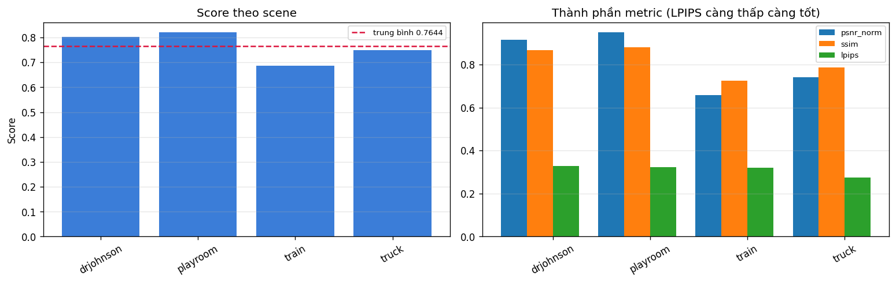
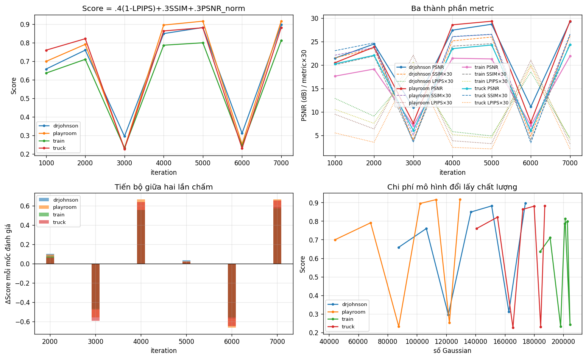
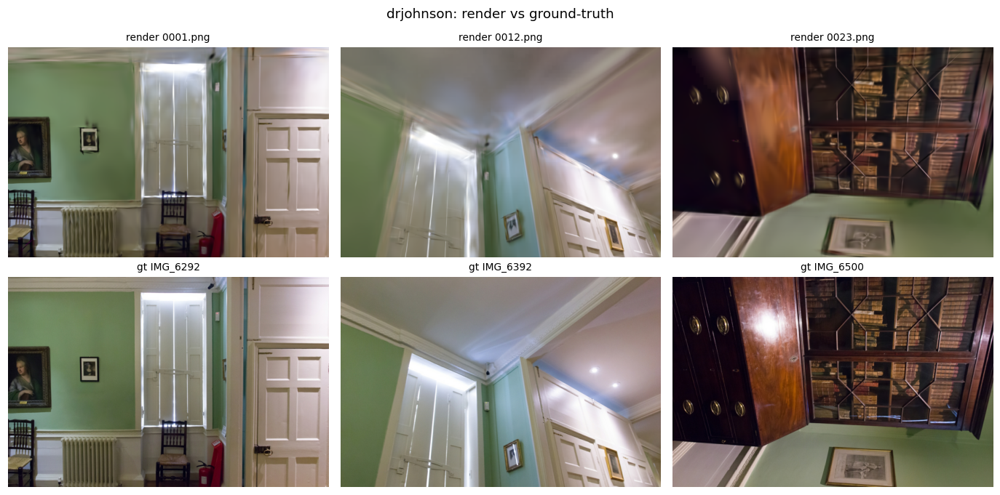
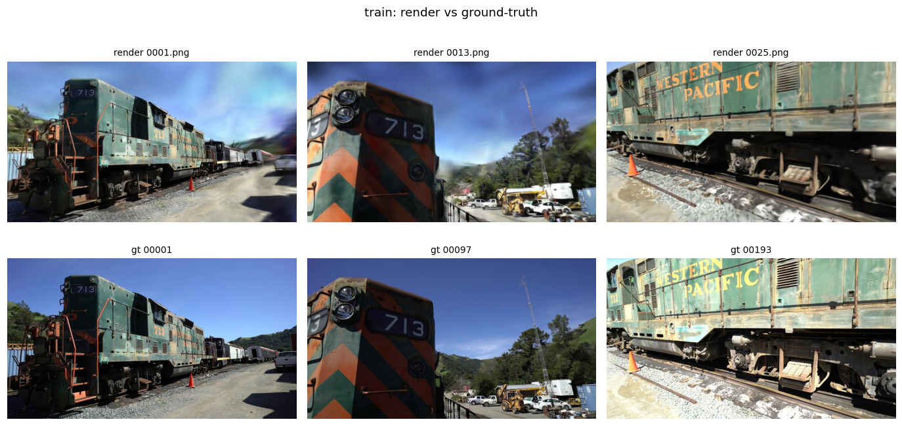

# Nhật ký huấn luyện — các phiên train đã chạy thật

> Tài liệu này ghi lại **kết quả đo được của từng phiên train thật**, không phải hướng dẫn.
> Hướng dẫn chạy: [colab-t4-guide.md](colab-t4-guide.md) · Tham chiếu `pipeline/`: [pipeline-and-submission.md](pipeline-and-submission.md)
>
> Mỗi phiên ghi theo cùng một khuôn: môi trường → cấu hình → bảng kết quả → diễn biến theo vòng lặp →
> tài nguyên → sản phẩm → những gì học được. Mục đích là để so sánh giữa các phiên, nên **đừng sửa số của
> phiên cũ**; chạy lại thì thêm một mục `## Phiên N` mới ở dưới.

---

## Phiên 1 — 2026-09-04, Colab free T4, baseline 7000 vòng

Phiên chạy `Runtime → Run all` của [`fastgs-acceleration-method.ipynb`](../fastgs-acceleration-method.ipynb)
với cấu hình mặc định của notebook, không sửa gì. Đây là **mốc so sánh gốc** cho mọi lần tinh chỉnh sau.

### 1.1 — Môi trường

| Hạng mục | Giá trị |
|---|---|
| GPU | Tesla T4 — 14.56 GB VRAM |
| Stack | torch 2.11.0+cu128 · CUDA 12.8 · Python 3.13.15 |
| RAM hệ thống | 12.7 GB (lúc khởi động dùng 1.13 GB) |
| Tổng wall-clock | **14 phút** — gồm ~6–7 phút clone repo + build 3 submodule CUDA |
| Thời gian train thuần | 327.6 s cho 4 cảnh (~82 s/cảnh, ~94 it/s) |
| Dataset | `tandt_db.zip` (Tanks&Temples + Deep Blending) — 4 cảnh tự phát hiện |

### 1.2 — Cấu hình

```python
cfg = Config(
    data_root="/content/data",
    scenes=(),                  # () = dùng mọi cảnh tìm thấy
    resolution=2,               # ảnh train giảm 2 lần
    iterations=7000,
    score_every=1000,
    eval_views=6,
    psnr_max=30.0,
    submission_resolution=1,    # render nộp ở kích thước gốc
)
```

`train_extra_args` mặc định của `pipeline/config.py`:
`--densification_interval 500 --lambda_dssim 0.25 --highfeature_lr 0.02 --loss_thresh 0.07 --grad_abs_thresh 0.0012`

### 1.3 — Kết quả cuối (render full-res, LPIPS-VGG)

| Cảnh | #Gauss | train_s | peak VRAM | ảnh | kích thước | **Score** | PSNR | psnr_norm | SSIM | LPIPS |
|---|---|---|---|---|---|---|---|---|---|---|
| playroom | 129,383 | 67.2 | 0.89 GB | 29 | 1264×832 | **0.8198** | 28.46 | 0.9486 | 0.8799 | 0.3219 |
| drjohnson | 174,003 | 74.8 | 1.16 GB | 33 | 1332×876 | **0.8027** | 27.41 | 0.9136 | 0.8677 | 0.3293 |
| truck | 187,287 | 91.0 | 0.68 GB | 32 | 979×546 | **0.7482** | 22.23 | 0.7410 | 0.7851 | 0.2742 |
| train | 201,129 | 94.6 | 0.78 GB | 38 | 980×545 | **0.6867** | 19.75 | 0.6585 | 0.7241 | 0.3202 |
| **MEAN** | 172,950 | 81.9 | 0.88 GB | 33 | — | **0.7643** | 24.46 | 0.8154 | 0.8142 | 0.3114 |



> **Hình 1.** Trái: Score từng cảnh, đường đứt nét là trung bình 0.7644. Phải: ba thành phần cấu thành Score.
> Cột LPIPS (xanh lá) gần như bằng nhau ở cả 4 cảnh, trong khi `psnr_norm` (xanh dương) tụt hẳn ở `train` và
> `truck` — đây là chỗ nhìn ra ngay chênh lệch trong nhà/ngoài trời đến từ đâu.
> Nguồn: `assets/leaderboard.csv`.

Smoke test (`drjohnson`, 300 vòng): Score 0.6012 · PSNR 20.92 · SSIM 0.7073 · LPIPS 0.5506 — dùng để xác nhận
dữ liệu + CUDA + chấm điểm chạy được trước khi vào vòng thật.

### 1.4 — Live score ≠ điểm cuối: chênh 0.11 và đó là bình thường

| | Live (trong lúc train) | Cuối (báo cáo) |
|---|---|---|
| Score trung bình | **0.8769** | **0.7643** |
| PSNR | 26.23 | 24.46 |
| SSIM | 0.8675 | 0.8142 |
| LPIPS | 0.1140 | 0.3114 |

Ba khác biệt tạo ra khoảng cách này, đều là chủ đích của thiết kế:

1. **Mạng LPIPS**: live dùng AlexNet (`lpips_net_live='alex'`), báo cáo dùng VGG (`lpips_net_report='vgg'`) — VGG cho số cao hơn hẳn trên cùng một ảnh.
2. **Độ phân giải**: live chấm trên ảnh `resolution=2`, báo cáo chấm trên render full-res (`submission_resolution=1`).
3. **Số view**: live dùng `eval_views=6`, báo cáo dùng toàn bộ test view (29–38 ảnh).

⇒ Khi so sánh giữa các phiên, **chỉ so live với live, cuối với cuối**.

### 1.5 — Hai hố sụt tại vòng 3000 và 6000

Điểm live theo từng mốc `score_every=1000`:

| iter | drjohnson | playroom | train | truck |
|---|---|---|---|---|
| 1000 | 0.6578 | 0.6991 | 0.6360 | 0.7596 |
| 2000 | 0.7598 | 0.7909 | 0.7102 | 0.8213 |
| **3000** | **0.2954** | **0.2315** | **0.2324** | **0.2264** |
| 4000 | 0.8489 | 0.8949 | 0.7863 | 0.8634 |
| 5000 | 0.8818 | 0.9158 | 0.7993 | 0.8804 |
| **6000** | **0.3116** | **0.2523** | **0.2424** | **0.2304** |
| 7000 | 0.8966 | 0.9167 | 0.8123 | 0.8821 |



> **Hình 2.** Trên trái: Score theo vòng lặp — hai chữ V tại 3000 và 6000 trùng pha ở cả 4 cảnh.
> Trên phải: PSNR (dB) cùng SSIM và LPIPS đã nhân ×30 để dùng chung trục. Dưới trái: ΔScore giữa hai mốc,
> thấy rõ cú rơi −0.6 và cú hồi +0.6 ngay sau đó. Dưới phải: Score theo số Gaussian — số Gaussian **chỉ tăng**
> (densify chưa dừng trước 15000) trong khi Score dao động, nên các đoạn kéo ngang ở Score thấp là hiệu ứng
> reset chứ không phải đường đánh đổi chất lượng/kích thước. Nguồn: `assets/history.csv`.

PSNR tại các mốc sụt rơi xuống 6.0–11.0 dB trên cả 4 cảnh cùng lúc — đồng loạt và có chu kỳ, nên không phải phân kỳ.

**Nguyên nhân:** `opacity_reset_interval = 3000` (`arguments/__init__.py:89`). Trong `pipeline/trainer.py`,
`gaussians.reset_opacity()` chạy tại `iteration % opacity_reset_interval == 0`, tức đúng vòng 3000 và 6000 —
mà `score_every=1000` lại chấm điểm **ngay trong cùng vòng đó**, khi toàn bộ Gaussian vừa bị đặt lại độ đục.
Model hồi phục hoàn toàn trong ~1000 vòng kế tiếp (xem mốc 4000 và 7000).

**Hai hệ quả thực dụng:**

- **Đừng đặt `iterations` là bội số của 3000** (6000, 9000, 12000) khi còn trong vùng densify — model sẽ dừng
  đúng lúc vừa reset opacity. `iterations=7000` nằm 1000 vòng sau reset cuối nên trạng thái cuối lành lặn.
  Từ 15000 trở đi `densify_until_iter=15000` đã tắt nhánh này, nên ngân sách 30000 không dính vấn đề.
- Muốn đường cong sạch để đọc, đặt `score_every` lệch pha với 3000 (ví dụ 1100).

### 1.6 — Tài nguyên: VRAM thừa mứa, RAM mới là nút thắt

| | drjohnson | playroom | train | truck | Ngưỡng |
|---|---|---|---|---|---|
| Peak VRAM (GB) | 1.16 | 0.89 | 0.78 | 0.68 | 14.56 |
| RAM (GB) | 3.71 | 9.58 | 9.59 | 9.58 | 12.7 (`ram_soft_limit_gb=10.5`) |

**VRAM đỉnh dùng 8% của T4.** Toàn bộ khuyến nghị "giảm độ phân giải cho vừa T4" trong
[colab-t4-guide.md](colab-t4-guide.md) là quá thận trọng ở ngân sách 7000 vòng này.
Ngược lại **RAM 9.58/12.7 GB đã sát ngưỡng mềm 10.5** ở 3 cảnh cuối — đây mới là thứ có thể giết phiên chạy.

### 1.7 — Chênh lệch trong nhà / ngoài trời

Hai cảnh Deep Blending (trong nhà) đạt 0.80–0.82; hai cảnh Tanks&Temples (ngoài trời) chỉ 0.69–0.75,
**dù dùng nhiều Gaussian hơn** (201k so với 129k).



> **Hình 3.** `drjohnson` (Score 0.8027) — hàng trên là render, hàng dưới là ground-truth, view lấy trải đều
> trên tập test chứ không chọn tay. Hình học và màu sắc bám sát; sai số còn lại nằm ở chi tiết tần số cao và
> thành phần phụ thuộc góc nhìn: vây tản nhiệt, nan kính tủ sách, gáy sách nhoè, và **vệt sáng specular trên
> mặt tủ gỗ (cột 3, rõ trong ground-truth) gần như biến mất** — đúng phần mà SH bậc cao mã hoá, trong khi
> `highfeature_lr` bị chia 20 ở `scene/gaussian_model.py:205`.



> **Hình 4.** `train` (Score 0.6867) — cảnh yếu nhất, và lỗi lộ ra ngay: **bầu trời**. Ground-truth là mảng xanh
> sạch, render thì phủ đầy vệt xám trắng loang lổ. Đầu máy dựng tốt, mọi thứ có parallax để bám đều ổn; nhưng
> vùng không texture ở độ sâu gần như vô hạn thì điểm số đa góc nhìn **không có gì để bất đồng**, nên Gaussian
> rác sống sót ở đó. Đá ballast và chữ "WESTERN PACIFIC" cũng bẹt đi.
>
> Đây chính là lý do thâm hụt rơi vào `psnr_norm` (0.66 so với 0.91 của `drjohnson`) chứ không phải LPIPS
> (0.3202 so với 0.3293, gần như bằng nhau): trời chiếm rất nhiều pixel nên chi phối metric theo pixel như PSNR,
> còn metric tri giác thì cho nó trọng số thấp hơn nhiều. Suy ra cách sửa rẻ nhất cho cảnh ngoài trời là **tăng
> `--dense`** (giá trị outdoor trong `train_base.sh` là `0.004`–`0.01`, so với `0.001` đang dùng), chứ không
> phải kéo dài lịch train.

Thành phần kéo tụt là PSNR chứ không phải LPIPS: `psnr_norm` 0.66 (train) so với 0.95 (playroom), trong khi
LPIPS của `truck` (0.2742) thực ra **tốt nhất bảng**. Cảnh ngoài trời có độ sâu lớn, nền trời và tán cây khó
dựng; thêm nữa ảnh gốc nhỏ hơn (980×545 so với 1332×876) nên train ở `resolution=2` mất tỉ lệ chi tiết
nhiều hơn, rồi vẫn phải render full-res khi nộp.

### 1.8 — Sản phẩm

`run.finish` tự tải về máy (`download_submission=True`, `download_model=True`):

| Tệp | Kích thước |
|---|---|
| `submission.zip` | 82 MB |
| `fastgs_models.zip` | 165 MB |
| `output/train/.../point_cloud.ply` | 49 MB |
| `output/truck/.../point_cloud.ply` | 46 MB |
| `output/drjohnson/.../point_cloud.ply` | 43 MB |
| `output/playroom/.../point_cloud.ply` | 32 MB |

Kiểm tra định dạng: **PASS** — `problems = []`, 4 cảnh với 33/29/38/32 ảnh, đúng kích thước gốc từng cảnh.

### 1.9 — Việc cần làm cho phiên sau, theo thứ tự lợi ích

1. **`resolution=1`** — quan trọng nhất. Đang train ở /2 nhưng chấm điểm ở full-res, tự tạo ra khoảng cách
   giữa cái model học và cái model bị chấm. VRAM còn dư 92%, thừa sức.
2. **`iterations=30000`** — theo §2.1 của [colab-t4-guide.md](colab-t4-guide.md), đoạn 15k–30k gần như miễn phí
   (Adam chỉ bước mỗi 32/64 vòng) nhưng vẫn chạy `final_prune_fastgs` → LPIPS tốt hơn, `.ply` nhỏ hơn.
   Ước tính ~20–25 phút/cảnh khi kết hợp full-res, tức ~1.5 giờ cho 4 cảnh — vẫn vừa một phiên Colab.
3. **Theo dõi RAM, không phải VRAM** — con số đáng lo là 9.58 GB, không phải 1.16 GB.
4. **Tinh chỉnh riêng cho `train` / `truck`**: lấy `grad_abs_thresh` / `dense` của cảnh tương ứng trong
   `train_base.sh` đưa vào `Config.train_extra_args`.
5. Đặt `score_every=1100` để đường cong tiến trình không rơi vào vòng reset opacity.

### 1.10 — Bẫy khi đọc log

Postfix của thanh tiến trình `tqdm` **giữ nguyên giá trị của lần chấm điểm gần nhất**. Vì lần chấm cuối rơi
đúng vào vòng reset opacity ở một số cảnh, dòng `7000/7000 ... Score 0.2523 | PSNR 7.75` của `playroom` là
**số cũ kẹt lại từ mốc 6000**, không phải kết quả cuối (thật ra là 0.9167 / 29.40). Luôn đọc bảng `board` từ
`run.analytics`, đừng đọc thanh tiến trình.
